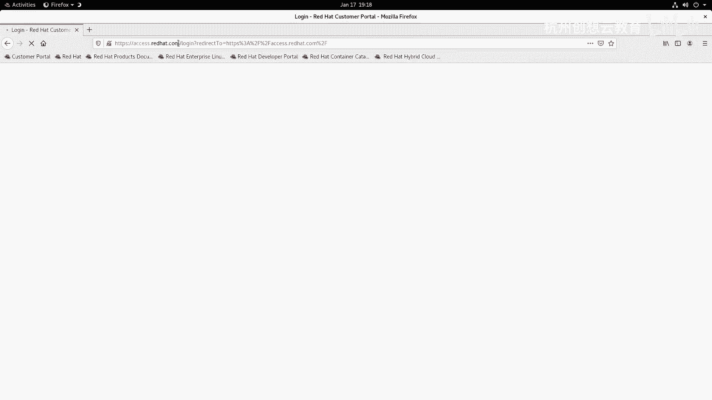

# 红帽认证系列工程师RHCE RH124-Chapter16-分析服务器和获取支持 - P2：16-2-分析服务器和获取支持-从红帽客户门户网站获取帮助 - 杭州创想云教育 - BV18a411972m

好我们来看第二小节啊，当我们注册完红包账户之后呀，就可以登录到洪涝的门户网站上查询一些资料，如果是啊受限了，那么我们可以使用开发者账号进行查询啊，如果是订阅的话更好，我们还可以提交问题。

那么它的网站呢也非常简单，直接去访问这个access。red hit。com即可，那么我这里的这个截图呀就是一个门户网站啊，门户网站内容啊。

某网站内容，ok我们现在呢再次呢去带着大家的访问一下。

好选择门户啊，那么地址呢是access rehead。com好。

我们登录一下。

登录成功之后啊，我们在这个页面呀可以干嘛呀。

可以看先看这里有这个关于某些产品是否有问题的一个快速的检索，你也可以在这个搜索栏里呢去搜索一些问题。

去选择你的产品，那么如果我们初学者没有遇到这些问题，那么可以去干嘛呀，可以去啊，在我们的这个页面呀。

在页面的这个最下方啊，最下方有一个啊快速链接，在快速链接里面我们可以选择产品文档。

产品文章当中包含了红帽所有产品的说明书，那么对于初学者而言，我们最关心的就是它的产品文档里面的关于红帽棋盘linux，那么我们可以去找红帽棋盘lx，点开，ok然后呢去干嘛呀，去阅读我们的文档啊。

你看这里面有知识库啊，知识库里面呢有一个产品文档，那么最新的是红帽七巧板九啊，我们是学的是八，你可以选择八版本，那么里面包含的内容呢非常丰富，有发音助记你的安装和升级计划啊，如何呢去生成一个红帽的镜像。

嗯，还有呢就是如何呢去做系统管理对吧，我们学习的内容啊，基本上就是系统管理，还有安全相关的网络相关的身份管理，相关的存储集群，虚拟化，云计算啊等等啊等等，并且呢有些文档啊是有中文的。

我们可以选择中文ok去阅读啊，对于我们而言啊，我们刚才通过yy界面生成那个sos的报告，这里呢也有可以用命令的方式来生成啊，是命令方式生成k那么还有呢就是还有就是有一个叫做protobe lives。

那么这个站点是干嘛用的呢，这个站点呀是一个呃是一个非常非常非常实用的一个一个一个工具啊，在这个页面呢可以帮助我们做一些比如说运算啊，这个运算就是一个规划的运算。

比如说我想搭建一个open shift的集群啊，我要做一个什么样的配置，那这里面有说明，还有我们后面啊做一些其他的要求，比如说我想做一个自动化安装，生成一个cs文件，怎么生成，这里面都有这个工具啊。

非常的强大啊，非常非常强大，ok啊那么还有呢就是一些指导啊指导，那么我们都可以去好好的去看一看，去阅读红帽的文档，一直很优秀啊，做的质量非常的高啊，非常高，ok那么接着呢我们再来往后看啊。

如果我们的系统本身出现问题，还可以通过red hat support to呢来生成一个什么呀啊生成一个基于web的，基于这个文本的界面来进行交互啊，从而获得啊红帽的官方的一些啊知识库文章啊。

哎我们这里呢就不做演示了，因为需要这个订阅啊订阅，ok你像这个截图啊，就是一个红帽产品的一个知识样例啊，他写得非常非常详细，ok那么随着学习呢，你深入你想了解更多的红帽的产品。

那么也推荐大家呢加入到红帽的开发者账户计划，那么站点呢就是developer啊，点位的had。com里面有各种最新的最前沿的产品，那么你将来就会成为一个极客啊，是一个极客。

ok啊这个内容呢都是说重要的不重要。

