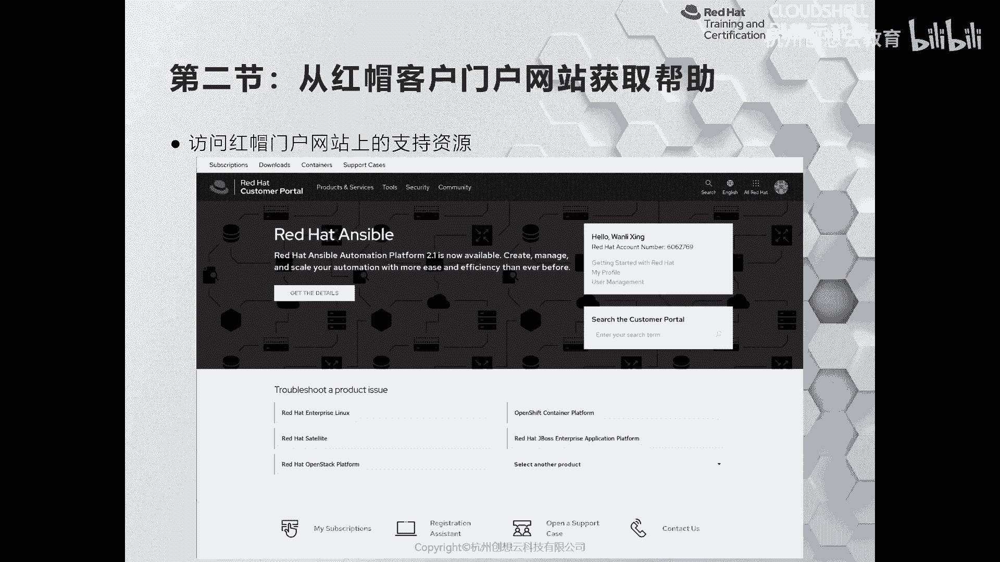
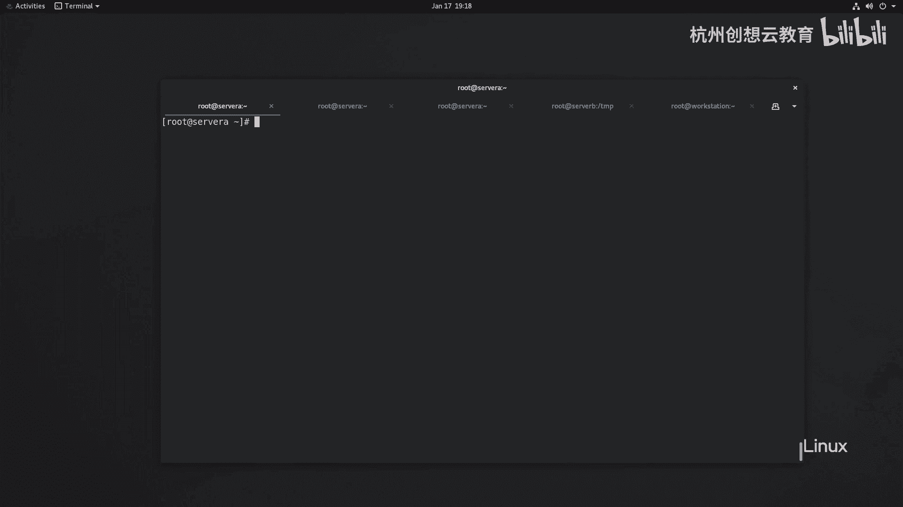
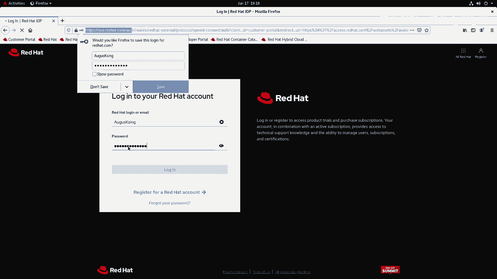
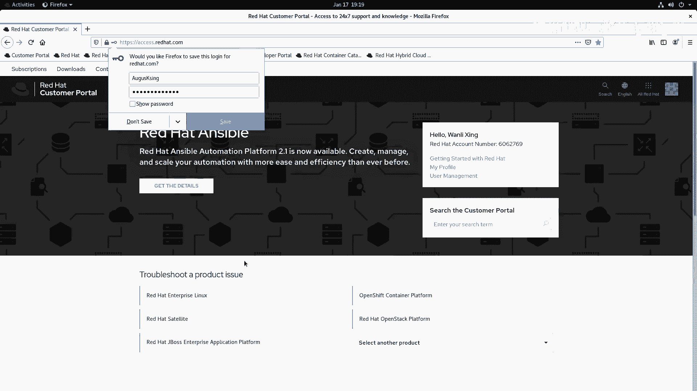
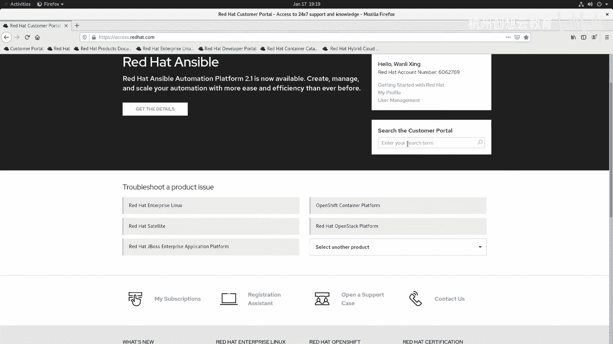
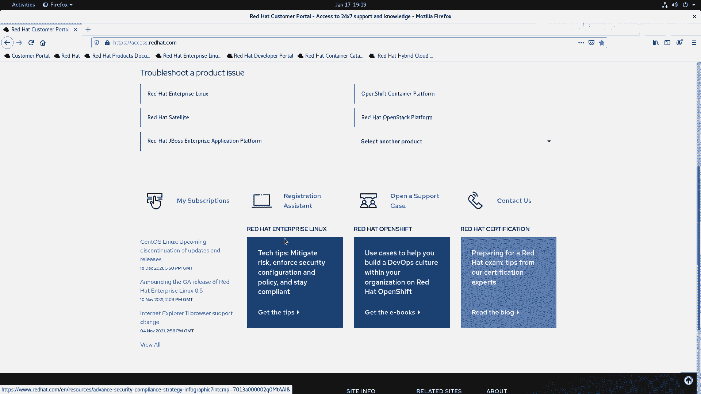
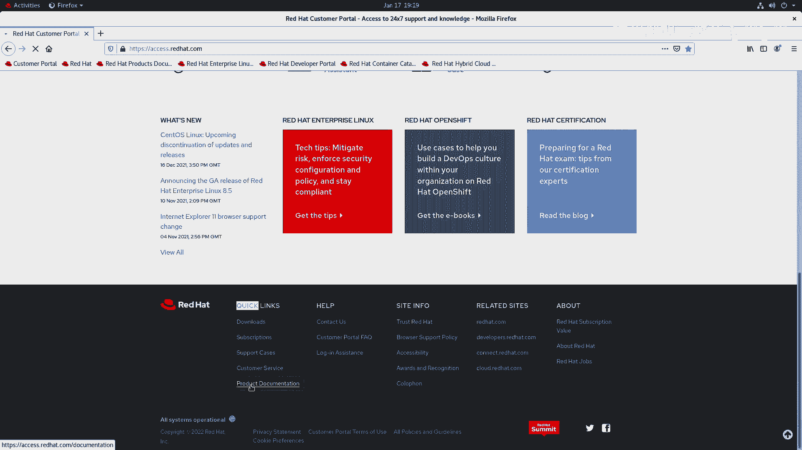
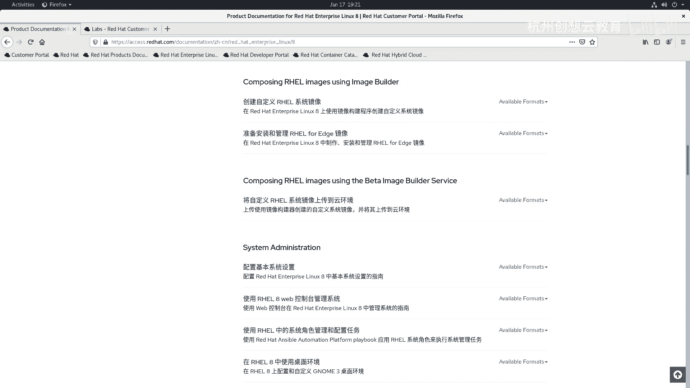
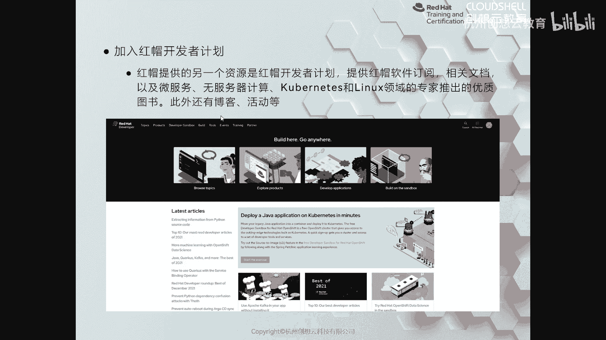

# 红帽认证系列工程师RHCE RH124-Chapter16：16-2：从红帽客户门户网站获取帮助 🔍

在本节课中，我们将学习如何利用红帽客户门户网站来查询资料、获取产品文档以及寻求技术支持。这是系统管理员解决问题和深入学习的重要途径。

上一节我们介绍了如何注册红帽账户，本节中我们来看看如何登录并使用客户门户网站。

## 访问与登录门户网站

红帽客户门户网站的地址是 `access.redhat.com`。成功注册账户后，即可使用该账户登录此网站。

登录成功后，页面会显示主要功能区域。

## 网站核心功能与使用

以下是门户网站的几个核心功能区域及其用途：

*   **快速检索与搜索栏**：页面顶部提供了关于产品问题的快速检索入口，你也可以在搜索栏中直接输入关键词来查找已知问题或解决方案。
*   **产品选择**：你可以筛选并专注于特定红帽产品相关的内容。
*   **产品文档**：对于初学者，最实用的资源是产品文档。在页面底部的“快速链接”区域，可以找到“产品文档”入口。

## 深入利用产品文档

产品文档包含了红帽所有产品的详细说明书。对于学习红帽企业Linux（RHEL）的我们，可以按以下步骤查找：

1.  在产品文档中找到“红帽企业Linux”。
2.  选择你所学习的版本（例如RHEL 8）。
3.  文档内容极为丰富，涵盖了安装升级、系统管理、安全、网络、存储、虚拟化等各个方面。
4.  部分文档提供了中文版本，可以选择中文进行阅读。

例如，之前通过Web界面生成的SOS报告，在文档中也能找到对应的命令行生成方式，命令是 `sosreport`。

## 其他实用工具与资源

门户网站还提供其他强大的工具：

*   **Red Hat Product Labs**：这是一个非常实用的工具站点。它可以帮助进行规划运算（例如规划OpenShift集群的配置）或生成特定文件（如自动化安装所需的Kickstart文件）。
*   **知识库文章**：如果系统出现问题，拥有有效订阅的用户还可以通过“Red Hat Support Tool”生成基于Web或文本的交互界面，以获取红帽官方的知识库文章支持。这些文章通常对问题描述和解决方案写得非常详细。

## 拓展学习：红帽开发者计划

随着学习的深入，若想了解红帽更多前沿产品，推荐加入红帽开发者计划。其站点是 `developers.redhat.com`，里面提供了各种最新、最前沿的产品信息和资源。

本节课中我们一起学习了如何访问和利用红帽客户门户网站。我们了解了如何查找产品文档、使用搜索功能，并认识了像Product Labs这样的实用工具。合理利用这些官方资源，将极大地帮助您解决问题并深化对红帽技术的理解。