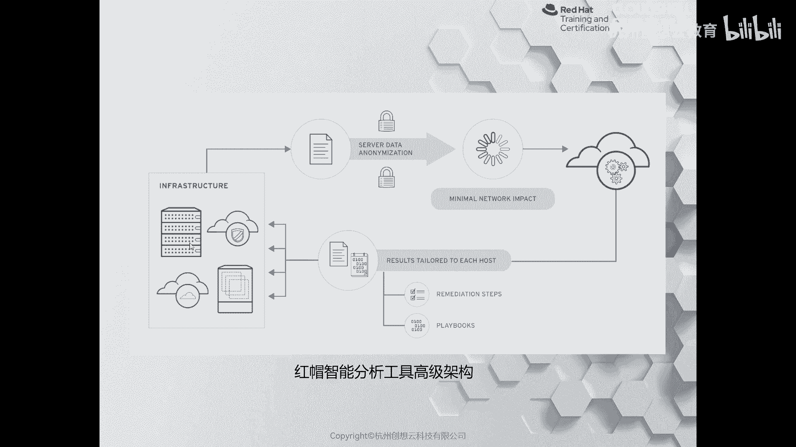
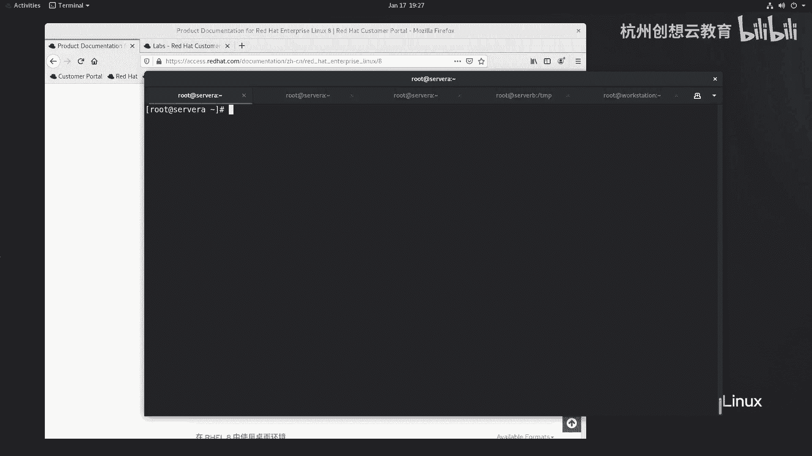
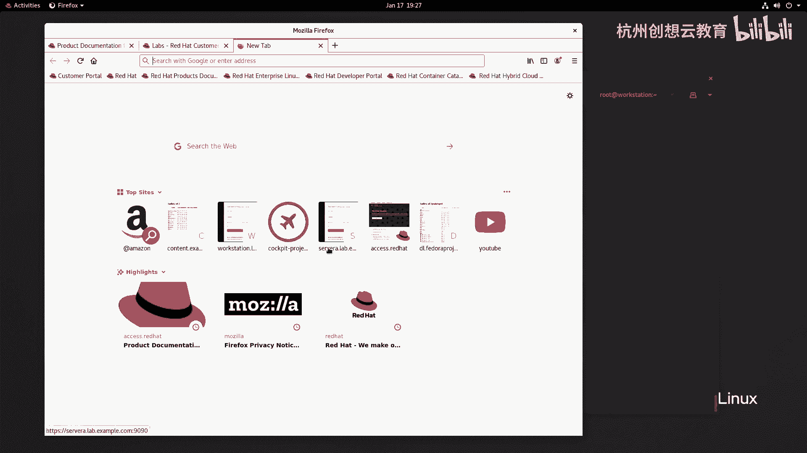
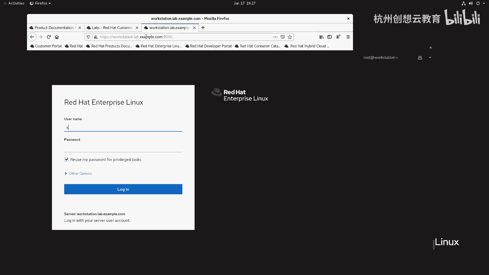
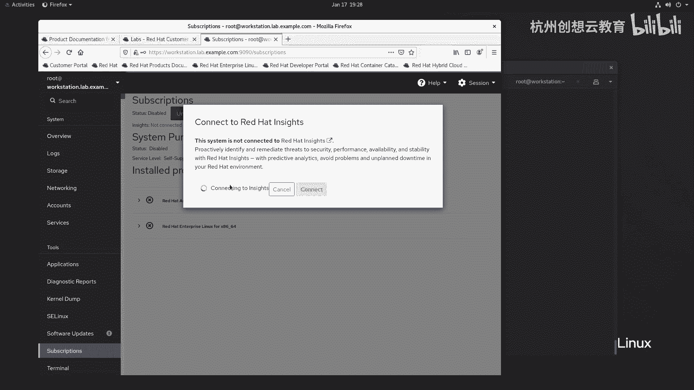
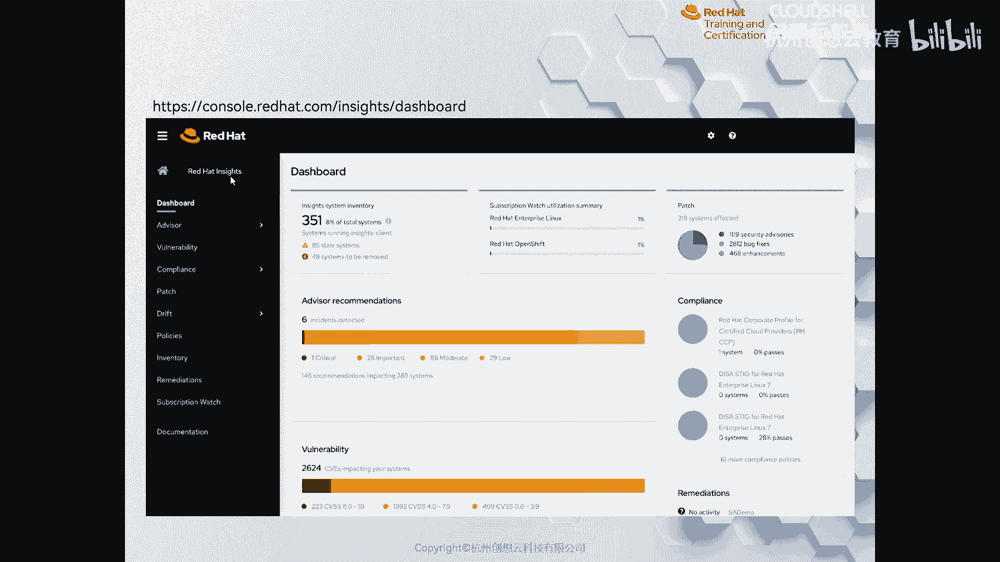
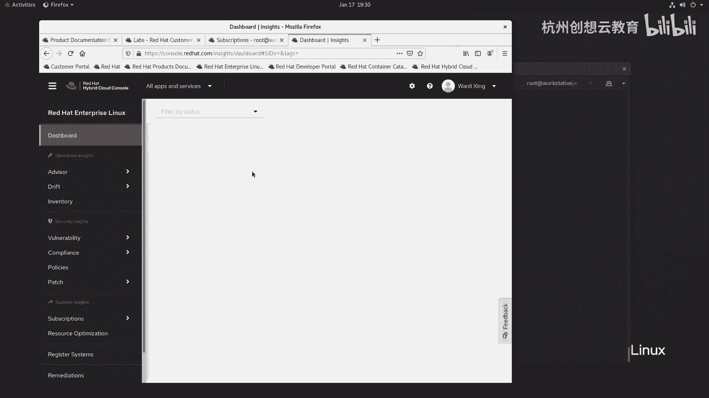
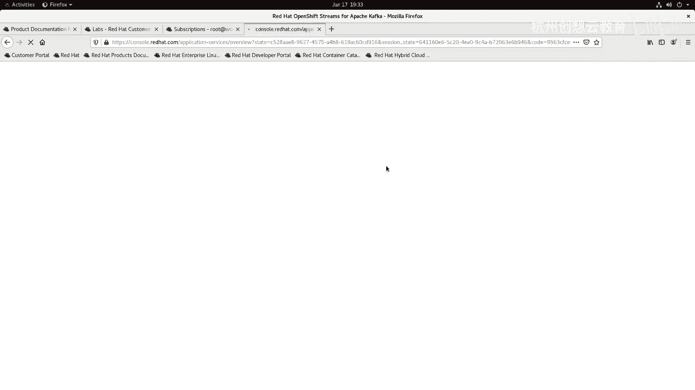
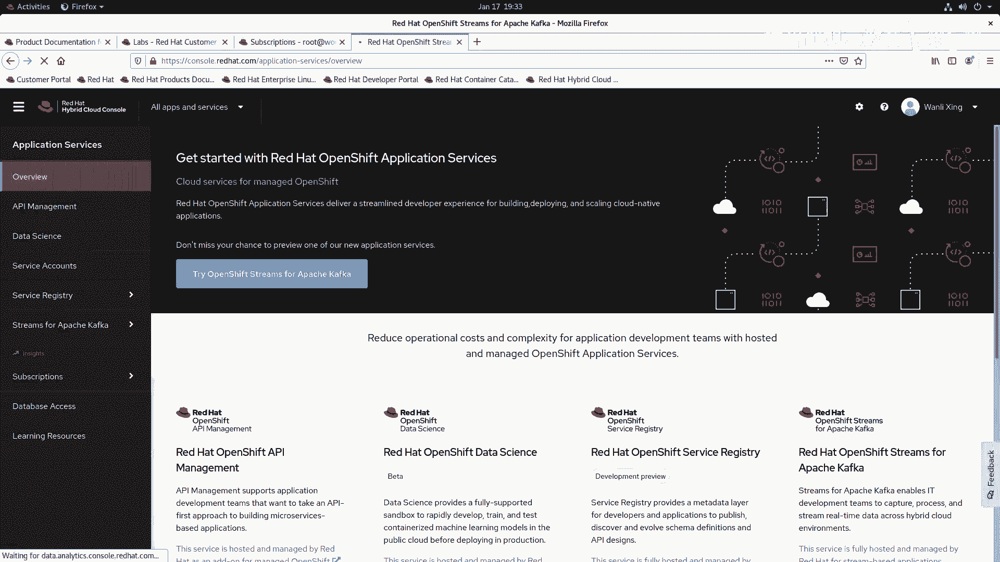

# 红帽认证系列工程师RHCE RH124-Chapter16-分析服务器和获取支持 - P3：16-3-分析服务器和获取支持-通过红帽智能分析工具检测和解决问题 - 杭州创想云教育 - BV18a411972m

啊，第三小节呢是红帽呀，在红帽78000啊发布的时候呢推出的一个非常啊这个啊智能的分析工具啊，叫in sizeize。那么这个产品的话呢是基于啊这个size平台的啊，当你把你的客把你的服务器啊。

那么关联到ins之后呢，它会根据大数据的分析来判断你的服务器上面目前有没有啊这个安全性的威胁。你的性能有没有什么瓶颈啊，还有服务器的稳定性如何，稳定性各方面。啊，都可以帮助我们去侦测啊呃。

然后呢再结合able，就可以实现一个自动的修复啊。目前呢in size的产品呢只支持红帽切板6。4或者红帽切板4open shift和open stack7版本啊，那么这个功能到底长什么样子呢？

我们首先来了解一下它的框架啊。啊，那么红帽呢这个呃我们在自己的数据中心啊啊通过订阅啊来关联到我们的inscise啊，那么如何关联到insci呢？大家还记得我们的copa里面。

或者说呃订阅里面有一个这样的提示。

啊，我这边呢以sA为例。啊，我用word station吧，我 word station已经被我刚才呃关联过了。

我们来输入一个密码。找到我们的订阅。嗯，如果没有内容的话呢，我们来到预览里面啊，那么在这里啊在预览里面健康状态呢是也可以看到的，或者呢直接在订阅里面找到一个insciense。那么我们选择谁呀？

选择连接啊即可。如果我们的各方面网络呀，各方面都没问题，那么就很快呢就会连接到啊红帽的inci这个平台。啊，哎，我们这里呢就不再等待了。

啊连年之后呢，他会干嘛呀？他会这个呃通过我们的这个数据库，我们的大数据呢进行分析啊分析。然后呢通过我们的智能化平台，然后呢给我们提供一些什么呀建议，并生成剧本，可以自动化呢来实现啊。

修复这样的一个非常诱人的特点特色啊。当我们注册完inside之后呢，我们可以通过登录啊这个con controll啊conlreadhead点com in size这个站点。

那看到我们的所有的服务器的一个降容状态。啊，比如说我们现在PPT上看到这个图啊，那么就是一个数据中心的一个情况啊。那么左侧我们可以看我们的是否有什么漏洞啊啊合规性啊、补丁啊等等策略呀清单呀啊。

还有各方面的一个啊一个一个内容啊，然后右侧呢是详细页。你看这个啊，唉我们的系统啊这个一共。啊，所有系统里面的有这个40啊8个系统将会被移除，那应该是个云计算平台，对吧？哎，然后。那么那还是个容器啊。

有一个open shift啊，容器还有安全性，有一个高危漏洞啊，28个重要的88个呢是这个中等的29个低级的漏洞啊，哎漏洞的编号啊，多少个CV你看像CCVSS8。0吧达吧拉的这么多内容啊。

那么同样我们也可以去访问这个站点啊，cl redhead点com。啊，我们来访问一下。

啊防一下啊，你看我这个呢已经连上去了啊，去查看我们的ass结果，它自动呢就会连接到cloud点readhead点com，然后呢重定向到cl点readdhead点com。那么打开之后。

我们来我们来看一下效果啊，也会看到啊哎我们系统当中有18个漏洞哈，18个漏洞哎这个。

并且呢有4个呢是一致的一个plote啊，这个很危险，对吧？哎，我们可以点开啊，看一看具体的内容。啊，内容哎，这里面会告诉我们，那假如说呢我要把全选选中啊选中选中之后呢，我要干嘛呢？这个。

那么我们看看能不能给它生成一个内容啊。哎，升完勾选之后，我们右下角呢有个灯泡，我们点开一下，那么有提示我们有那些更新包啊，有还有直播啊，这这这完全是一个类似于广广告，但是这个广告很有作用啊很有作用。啊。

那么我们比如说看一看这个CVE20。212255啊，2021年的一个漏洞。啊，一个漏洞。哎，然后呢这个我们可以干嘛呀？这里面有actions啊，我们可以编辑这个状态啊状态。好。

然后呢我们再回过头看我们的dashboard。啊，大是不的啊。呃，因为我们这个上面啊没有安装安ible tower，如果安装了再结合起来就非常的厉害了啊。

还有我们还有一些其他的一些建议啊一些建议我们都可以，还有什么补丁，对吧？比如说257个安全的一个漏洞。我们看看看能不能让他帮我们修复，好吧。啊，我记得有一个地方是可以帮助我们修复的啊，比如说。

这里面有个清单啊清单。清单的话应该显示的是我们的主机名啊，比如说我选择word station，就是我当前那台机子。嗯，别的好像没有什么操作了，对吧？就是用户的信息啊。OK这是设置。啊，上是。设置里边。

我们看有什么内容啊啊，应用服务器open shift的这是我订阅的所有的产品啊产品。OK然后呢，红帽的连接器我们来点开看一看。啊，连接器啊，然后我们可以通过这个内容啊来连接到红帽的这个什么呀？

红帽的一个平台啊。集成。OK没有集成，对吧？哎，然后我这边呀再回到我的。啊，cloud console里面。啊，哎，这是我的整体的一个情况啊一个情况应用服务器。啊，等等啊，这个每次也都在更新啊。

这次打开呢就和以前的页面不太一样。啊，这个呢也做一个简单的了解啊。

O。😊，好，我们的整本的内容啊就讲完了啊，谢谢大家的观看。

