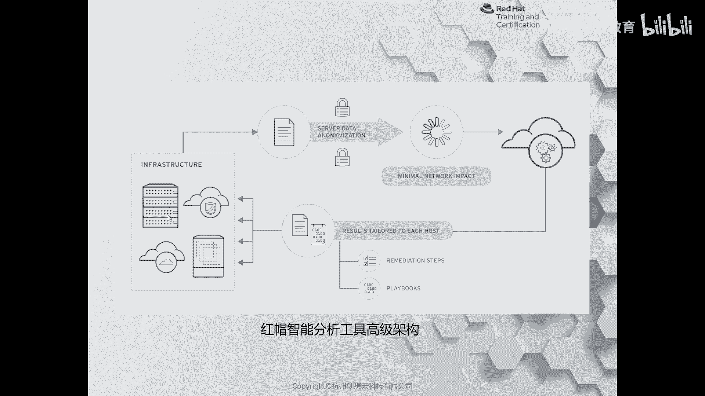
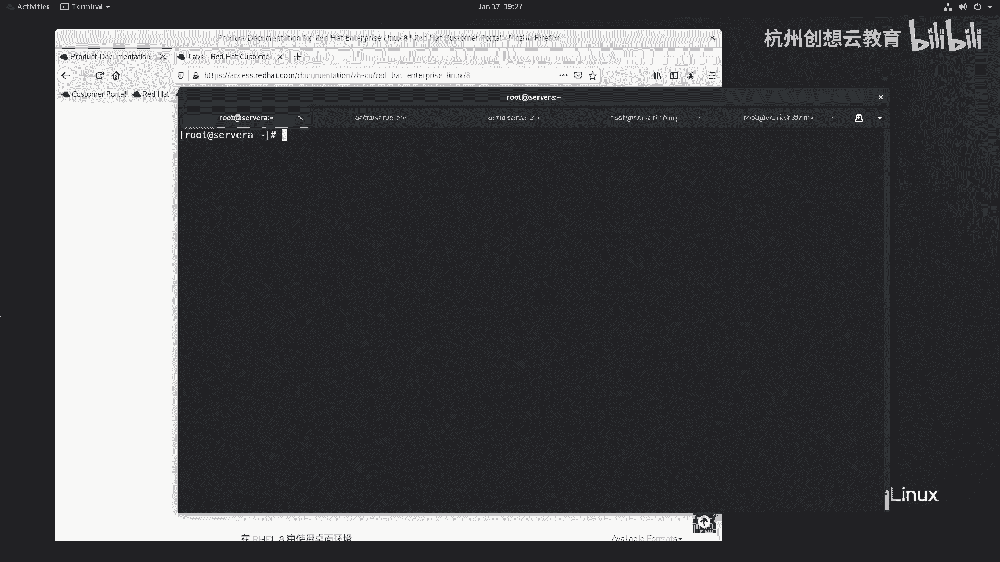
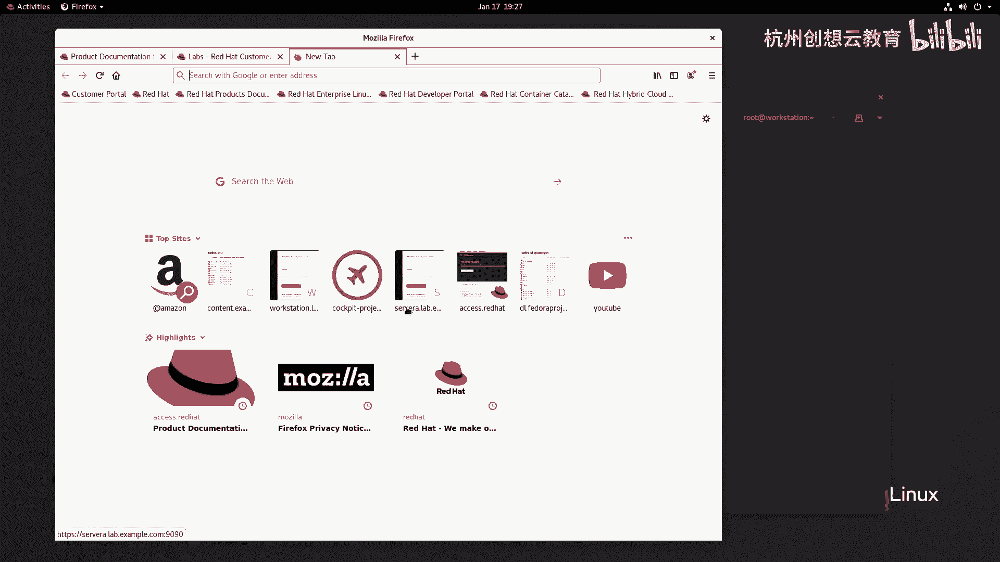
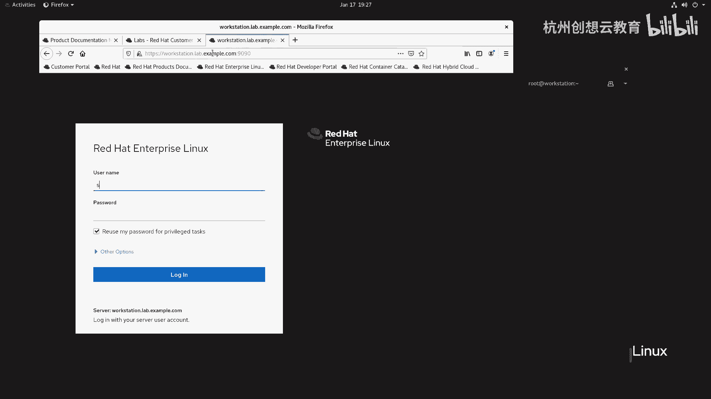
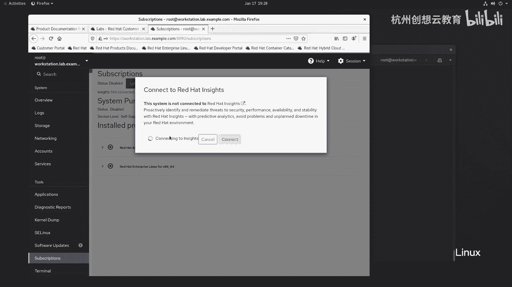
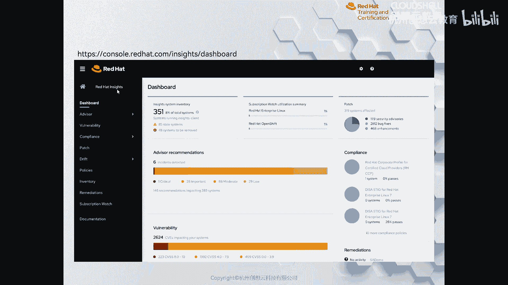
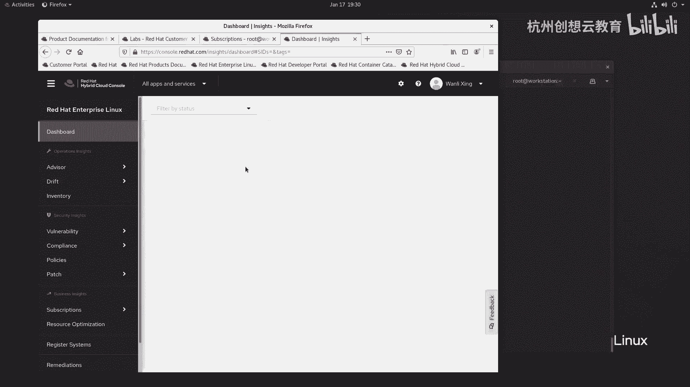
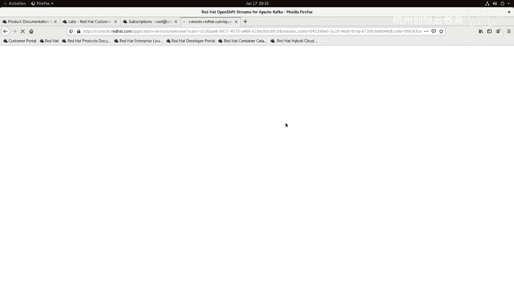
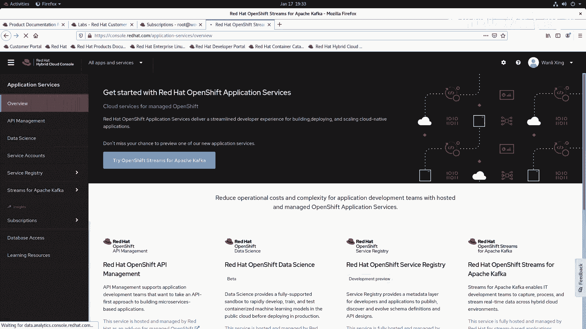

# 红帽认证系列工程师RHCE RH124：Chapter16：分析服务器和获取支持 - P3：16-3-通过红帽智能分析工具检测和解决问题

在本节课中，我们将要学习红帽智能分析工具（Red Hat Insights）的功能与使用方法。这是一个基于SaaS平台的服务，能够帮助管理员分析服务器的安全性、性能与稳定性，并支持与Ansible自动化平台结合，实现问题的自动修复。

上一节我们介绍了基础的服务器分析工具，本节中我们来看看红帽提供的云端智能分析解决方案。

## 🧠 红帽智能分析工具（Insights）概述

红帽智能分析工具（Red Hat Insights）是红帽在RHEL 8发布时推出的一个智能分析平台。该产品基于SaaS平台构建。当您将服务器关联到Insights后，它会利用大数据分析技术，判断您的服务器上是否存在安全威胁、性能瓶颈以及稳定性问题。结合Ansible自动化工具，它还能实现问题的自动修复。

目前，Insights产品主要支持以下红帽产品版本：
*   Red Hat Enterprise Linux 6.4 或更高版本
*   Red Hat Enterprise Linux 7 或更高版本
*   OpenShift 容器平台
*   OpenStack Platform 7 或更高版本

## 🏗️ 工作原理与关联方式

红帽智能分析工具的工作原理是，用户通过订阅管理将本地数据中心内的服务器关联到云端Insights平台。

以下是关联服务器到Insights的步骤：
1.  登录到服务器的订阅管理器（Subscription Manager）。
2.  在订阅管理界面中，可以找到关联到Red Hat Insights的选项或提示。
3.  选择“连接”操作。如果网络等配置正常，服务器将很快连接到红帽的Insights平台。

关联成功后，Insights平台会开始收集服务器数据，通过其后台的智能化分析引擎进行处理，最终为用户提供修复建议，并能生成Ansible Playbook以实现自动化修复。

## 🌐 访问与使用Insights控制台

注册并关联服务器后，您可以通过访问 `console.redhat.com/insights` 站点来查看所有服务器的健康状态。

控制台界面通常分为左右两部分：
*   **左侧面板**：展示整体概览，例如存在的漏洞数量、合规性状态、可用的补丁、系统清单等信息。
*   **右侧详细页面**：显示具体问题的详细信息，例如受影响的系统数量、漏洞的严重等级（高危、重要、中等、低级）以及具体的CVE编号和CVSS评分。

在控制台中，您可以执行以下操作：
*   查看检测到的具体漏洞详情（例如 `CVE-2021-2255`）。
*   对选中的问题执行操作（Actions），例如编辑状态或查看修复建议。
*   在集成了Ansible Tower的环境中，可以直接触发自动化修复任务。
*   通过“清单”查看已注册主机的详细信息。

## 📝 本节总结

本节课中我们一起学习了红帽智能分析工具（Insights）。我们了解了它的核心功能是帮助自动化检测服务器的安全、性能和稳定性问题。我们掌握了如何将服务器关联到该云平台，以及如何通过其Web控制台查看分析结果和管理发现的问题。结合Ansible自动化工具，Insights能够极大地简化系统维护和修复的流程。