# RHCE8 课程：P10：正则表达式与tuned服务 🚀

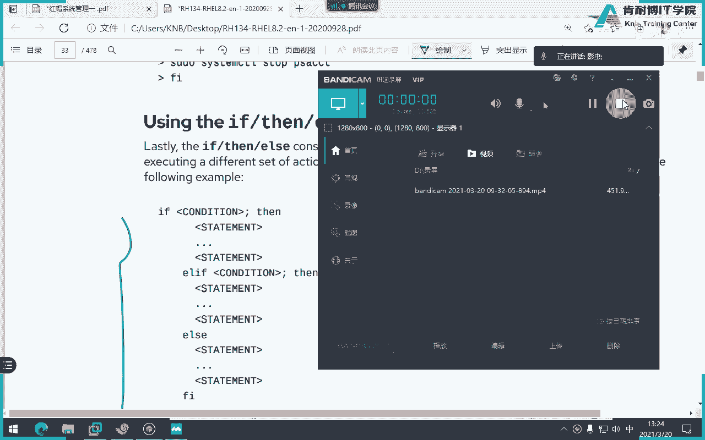


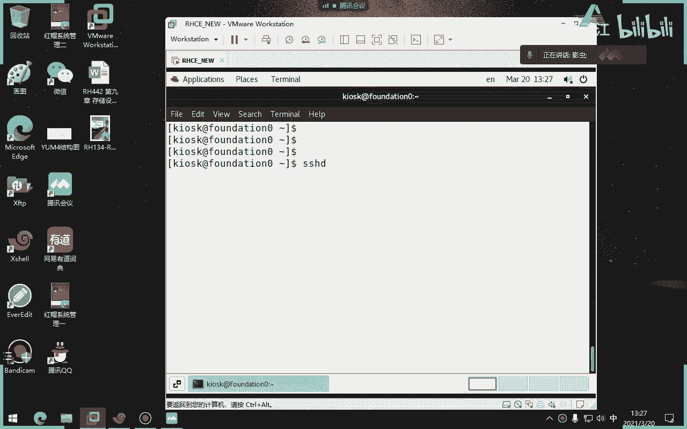

在本节课中，我们将要学习Shell脚本中的多分支判断语句`if-elif-else`，以及Linux系统中强大的文本处理工具——正则表达式。此外，我们还会了解一个用于系统性能调优的便捷工具`tuned`服务。课程内容将尽可能简单直白，确保初学者能够理解。

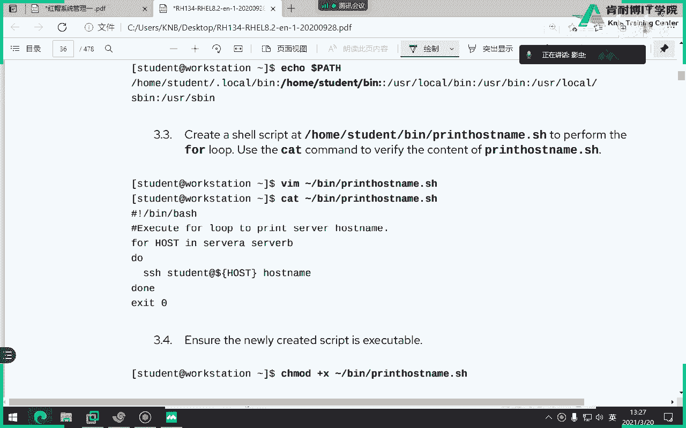

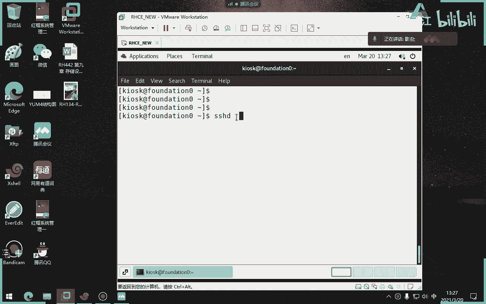

## 多分支判断语句：if-elif-else 🔄

上一节我们介绍了`if-else`语句，本节中我们来看看更复杂的多分支判断语句`if-elif-else`。这种语句用于处理多个条件分支，当第一个条件不满足时，会依次判断后续的`elif`条件，直到满足某个条件或执行最后的`else`分支。

使用`if-elif-else`结构可以使代码更简洁、易读，避免使用多个嵌套的`if-fi`语句。

以下是`if-elif-else`的基本语法结构：
```bash
if [ 条件1 ]; then
    # 条件1为真时执行的命令
elif [ 条件2 ]; then
    # 条件2为真时执行的命令
else
    # 所有条件都不满足时执行的命令
fi
```

### 实践案例：服务状态检查与重启

我们来思考一个实际问题：编写一个脚本，检查`sshd`服务是否处于激活（运行）状态。如果服务未运行，则重启它；如果正在运行，则输出提示信息。

解决这个问题有多种方法，核心在于如何判断服务是否存在。以下是几种思路：

1.  **使用`ps`命令查看进程**：`ps -ef | grep sshd | grep -v grep`
2.  **使用`systemctl`命令检查服务状态**：`systemctl is-active sshd`
3.  **检查服务监听的端口**：`ss -tlnp | grep :22`

这里我们以`ps`命令为例，编写一个脚本框架：
```bash
#!/bin/bash
# 使用grep命令查找sshd进程，并用-v排除grep命令自身
if ps -ef | grep sshd | grep -v grep &> /dev/null; then
    echo “sshd服务正在运行。”
else
    systemctl restart sshd
fi
```
在这个脚本中，`if`语句测试`grep`命令的退出状态码。如果找到进程（退出码为0），则输出信息；否则（退出码非0），执行重启命令。

---

## 正则表达式 📖

接下来，我们进入本节课的核心内容之一——正则表达式。首先，必须明确区分**正则表达式**和**通配符**。

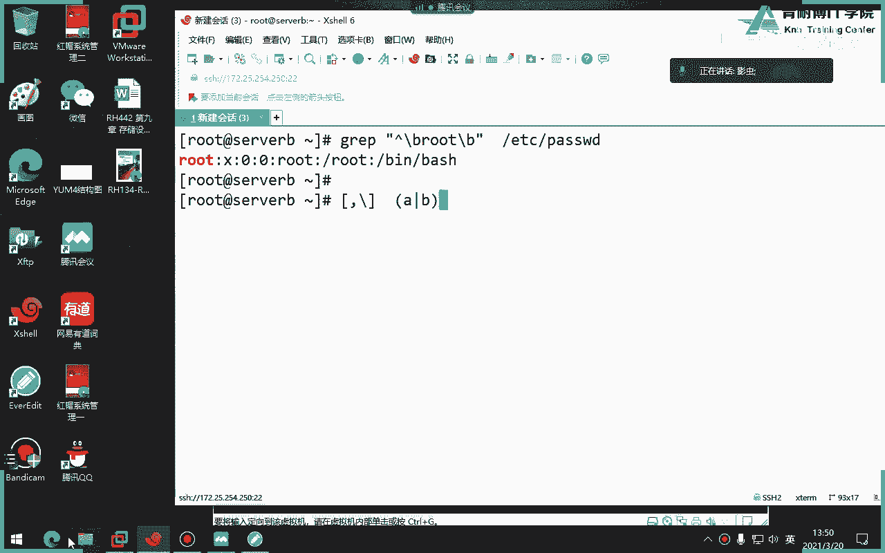

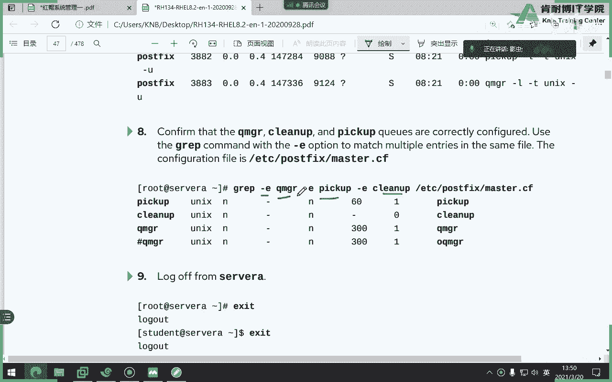


*   **通配符**：用于匹配**文件名**（例如 `*`, `?`, `[]`）。
*   **正则表达式**：用于匹配**文本内容**。它不能单独使用，通常需要与`grep`、`sed`、`awk`等文本处理工具或编程语言（如Python、Perl）结合使用。

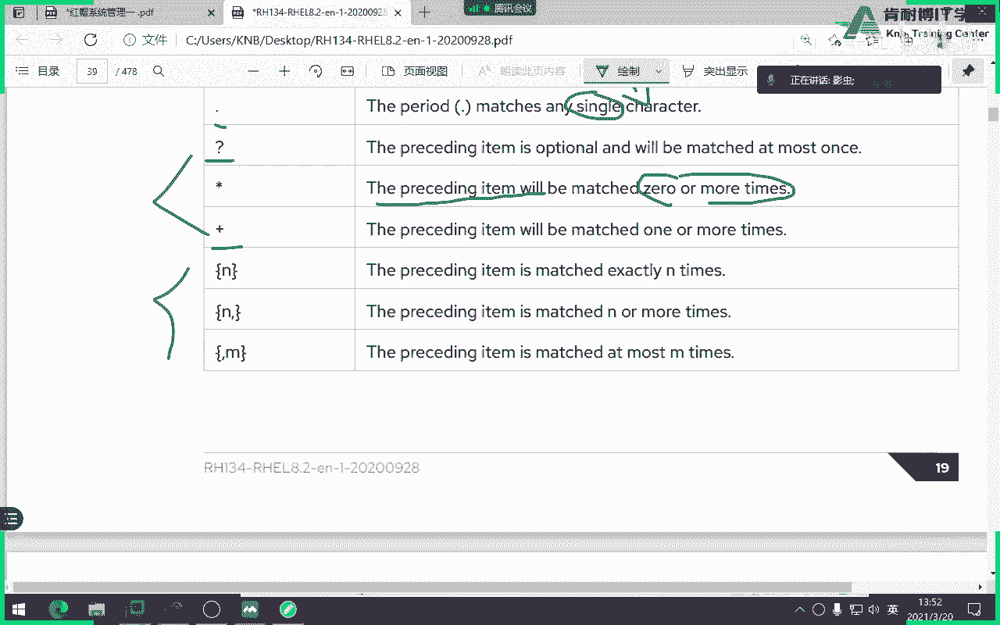

### grep命令详解

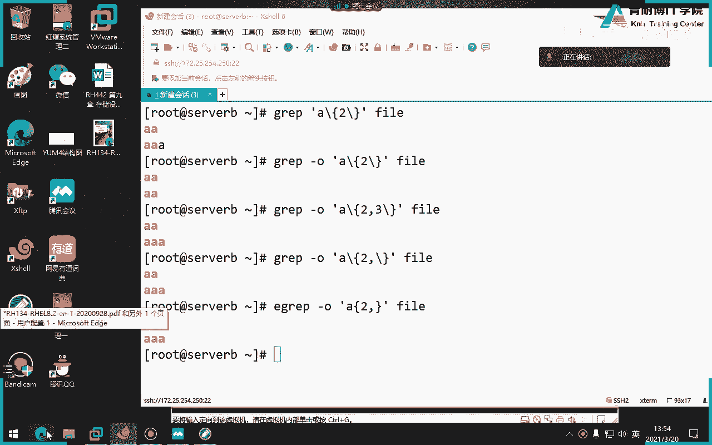

为了讲解正则表达式，我们先深入了解一下`grep`命令。`grep`用于在文件中搜索匹配特定模式的行。

`grep`命令的基本语法为：`grep [选项] ‘模式’ 文件...`

常用的`grep`选项包括：

*   `-i`：忽略大小写。
*   `-v`：反向选择，即输出不匹配模式的行。
*   `-c`：统计匹配行的数量。
*   `-n`：显示匹配行及其行号。
*   `-A num`：显示匹配行及其后面`num`行。
*   `-B num`：显示匹配行及其前面`num`行。
*   `-E`：使用扩展正则表达式（等同于`egrep`）。

例如，`grep -i ‘root’ /etc/passwd` 会匹配包含“root”、“Root”、“ROOT”等的行。

### 正则表达式元字符


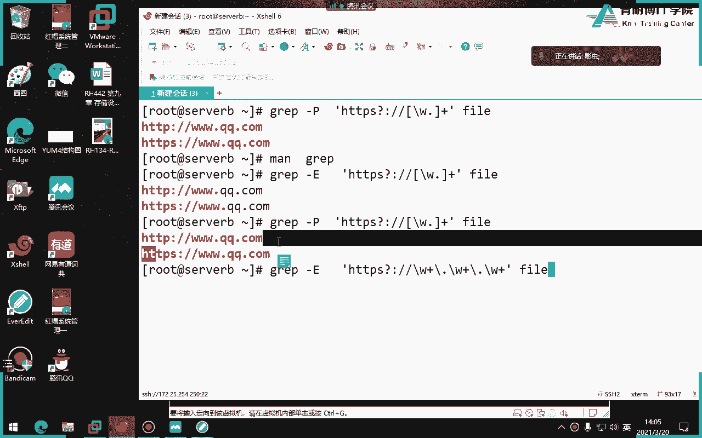

正则表达式分为**基本正则表达式**和**扩展正则表达式**。`grep`默认使用基本正则，使用`-E`选项或`egrep`命令则启用扩展正则。

以下是核心的元字符及其含义：

| 元字符 | 含义（基本正则） | 含义（扩展正则） | 示例说明 |
| :--- | :--- | :--- | :--- |
| `*` | 匹配前一个字符**0次或多次** | 同左 | `go*d` 匹配 `gd`, `god`, `good`等 |
| `.` | 匹配**任意一个**字符 | 同左 | `g.d` 匹配 `gad`, `gbd`, `g1d`等 |
| `^` | 匹配行首 | 同左 | `^root` 匹配以`root`开头的行 |
| `$` | 匹配行尾 | 同左 | `bash$` 匹配以`bash`结尾的行 |
| `[]` | 匹配括号内的任意一个字符 | 同左 | `[abc]` 匹配`a`,`b`或`c` |
| `[^]` | 匹配不在括号内的任意一个字符 | 同左 | `[^0-9]` 匹配非数字字符 |
| `\?` | | 匹配前一个字符**0次或1次** | `go\?d` 匹配 `gd` 或 `god` |
| `\+` | | 匹配前一个字符**1次或多次** | `go\+d` 匹配 `god`, `good`等，不匹配`gd` |
| `\|` | | 表示“或”关系 | `dog\|cat` 匹配 `dog` 或 `cat` |
| `()` | | 将括号内作为一个整体 | `g(oo)\+d` 匹配 `good`, `gooood`等 |
| `{m,n}` | 匹配前一个字符**m到n次** | 同左（扩展正则中`{}`无需转义） | `o{2,3}` 匹配 `oo` 或 `ooo` |

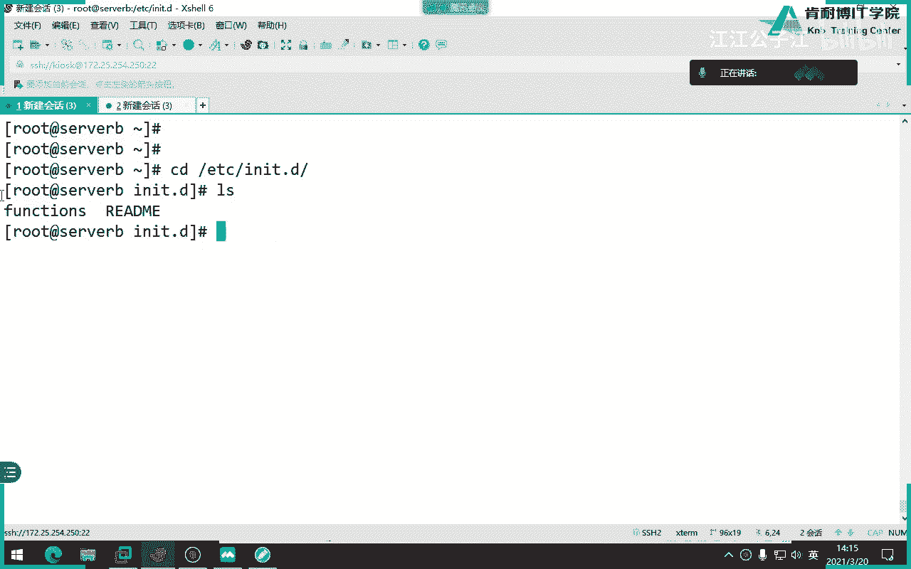

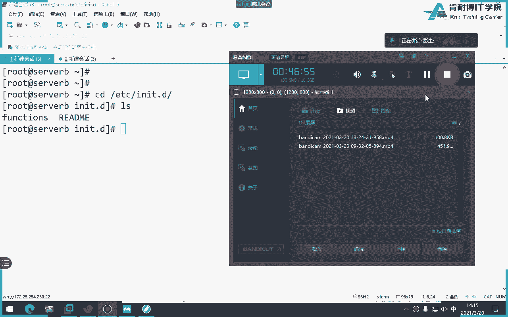

**重要提示**：
*   在基本正则中，`?`, `+`, `{`, `|`, `(`, `)` 等字符具有特殊含义，若要匹配它们本身，需要使用反斜线`\`进行转义，例如 `\?`, `\+`。
*   `^`和`$`结合使用`^$`可以匹配空行。
*   单词边界锚点`\b`可以用于精确匹配单词，例如 `\broot\b` 只匹配独立的单词“root”，不会匹配“rootless”。

### 正则表达式应用示例

1.  **排除文件中的空行**：
    ```bash
    grep -v ‘^$’ filename
    ```

2.  **精确匹配“root”单词**：
    ```bash
    grep ‘\broot\b’ /etc/passwd
    ```


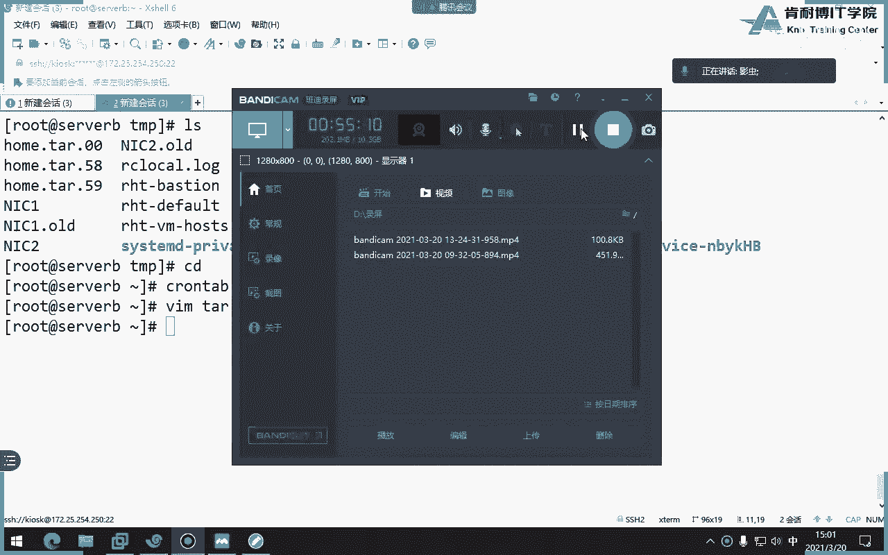

3.  **匹配IP地址（简单示例）**：
    ```bash
    # 匹配类似 192.168.1.1 的格式
    grep -E ‘([0-9]{1,3}\.){3}[0-9]{1,3}’ filename
    ```

4.  **匹配URL（http或https）**：
    ```bash
    # 这是一个更复杂的示例，使用了字符类\w（匹配字母数字下划线）和量词
    grep -P ‘https?\://\w+(\.\w+)+’ filename
    ```
    *注意：`-P`选项启用PCRE（Perl兼容正则表达式），功能更强大，但非所有`grep`版本都支持。*

正则表达式需要大量练习才能熟练掌握。建议初学者准备一本像《正则表达式必知必会》这样的参考书，随时查阅。

---

## 系统性能调优工具：tuned服务 ⚙️

最后，我们来学习一个简化系统性能调优的工具——`tuned`服务。它可以理解为一种“预设调优方案”，管理员无需深究底层内核参数，只需选择合适的配置方案即可。

### tuned服务的基本使用

1.  **安装与启动**：
    ```bash
    yum install tuned
    systemctl enable --now tuned
    ```

2.  **查看可用配置方案**：
    ```bash
    tuned-adm list
    ```
    常见的方案有：
    *   `balanced`：平衡性能与功耗（默认方案）。
    *   `powersave`：最大程度节省功耗。
    *   `throughput-performance`：优化系统吞吐量。
    *   `latency-performance`：优化系统延迟。
    *   `network-latency`：优化网络延迟。
    *   `virtual-guest` / `virtual-host`：分别为虚拟机和宿主机优化。

3.  **查看当前活动方案**：
    ```bash
    tuned-adm active
    ```

4.  **切换配置方案**：
    ```bash
    tuned-adm profile throughput-performance
    ```

5.  **让tuned推荐方案**：
    ```bash
    tuned-adm recommend
    ```

6.  **关闭tuned优化**：
    ```bash
    tuned-adm off
    ```

### tuned的工作原理

`tuned`的配置方案存储在`/usr/lib/tuned/`目录下，每个方案（如`throughput-performance`）都是一个子目录，其中包含一个`tuned.conf`主配置文件。该文件定义了各种调优插件（如`[cpu]`, `[disk]`, `[sysctl]`）的参数。

例如，`powersave`方案会通过内核参数调节CPU频率、磁盘预读等以达到省电目的。

### 自定义tuned配置方案

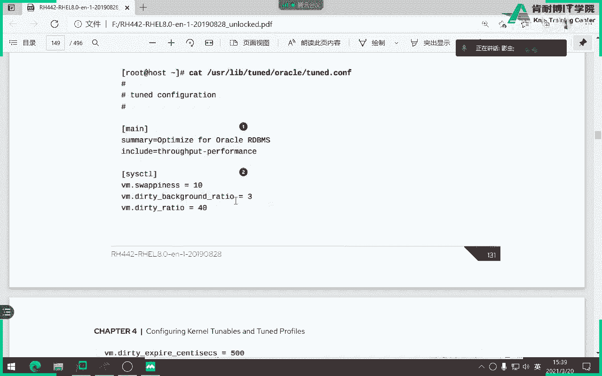


如果需要，管理员可以创建自定义方案。基本步骤是：

1.  在`/etc/tuned/`目录下创建一个新目录，例如`my_custom_profile`。
2.  在该目录中创建`tuned.conf`文件。
3.  在配置文件中，可以`[main]`部分添加描述，并通过`include`继承现有方案，然后在其他章节（如`[sysctl]`）覆盖或添加特定参数。
4.  使用`tuned-adm profile my_custom_profile`启用自定义方案。

---

## 进程优先级与nice值 🎯

在结束前，我们补充一个与系统性能相关的概念：进程优先级。

*   **优先级范围**：Linux内核将进程优先级划分为0-139共140个级别。**数字越小，优先级越高**。
    *   **0-99**：实时进程优先级范围，由内核管理，用户一般无法调整。
    *   **100-139**：非实时进程（普通进程）优先级范围，用户可以通过`nice`值影响此范围内的优先级。
*   **nice值**：用于影响非实时进程的优先级。其范围为**-20到19**。
    *   **nice值越小，进程优先级越高**（即更“友好”地让出CPU，实际获得的优先级数字更小）。
    *   普通用户只能将`nice`值调高（0到19），只有root用户才能将其调低（-20到19）。
    *   进程启动时默认继承父进程的`nice`值，通常为0。

### 相关命令

1.  **启动时指定nice值**：
    ```bash
    nice -n 10 command_name  # 以nice值10启动命令
    ```

2.  **调整已运行进程的nice值**：
    ```bash
    renice -n 5 -p PID  # 将指定PID进程的nice值改为5
    ```

3.  **查看进程的优先级信息**：
    ```bash
    ps -o pid,comm,ni,pri -p PID
    # ni列显示nice值，pri列显示内核看到的优先级（PR）
    ```
    在`top`命令中，`PR`列表示优先级，`NI`列表示`nice`值。如果`PR`显示为`rt`，则表示该进程是实时进程。

---


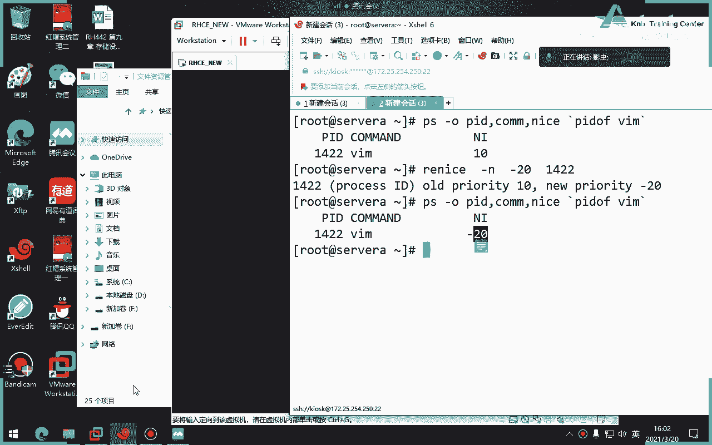

## 总结 📝

本节课中我们一起学习了：
1.  Shell脚本中用于多条件判断的`if-elif-else`语句结构，并通过一个服务状态检查的案例巩固了其用法。
2.  强大的文本处理工具——**正则表达式**，明确了其与通配符的区别，学习了基本和扩展正则的常用元字符，并通过`grep`命令进行了实践。
3.  系统性能调优的辅助工具**`tuned`服务**，学会了如何查看、推荐、切换不同的性能优化配置方案。
4.  了解了进程**优先级**和**nice值**的概念及其管理命令，明白了如何影响进程的调度顺序。


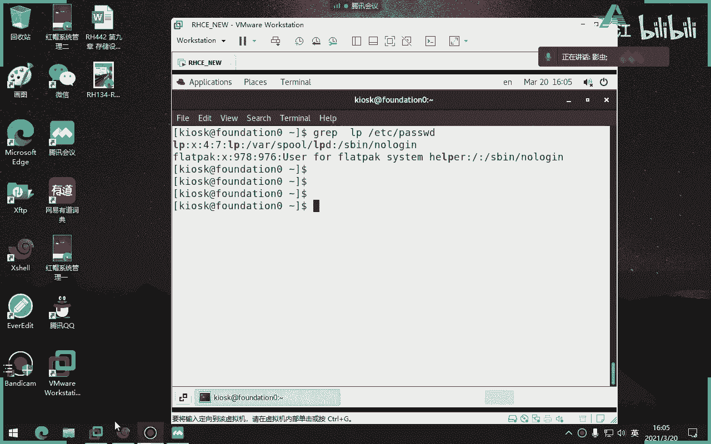


正则表达式和系统调优是Linux系统管理中进阶且实用的技能，需要大家在课后多加练习和探索。