# 红帽认证系统工程师RHCE8：P13：第七天 NFS+autofs 🚀

在本节课中，我们将要学习两个核心主题：**VDO（虚拟数据优化器）** 和 **NFS（网络文件系统）**。VDO是一种磁盘空间优化技术，而NFS则用于在网络上共享文件系统。我们将从原理、配置到实践操作，系统地掌握这两项技术。

---

## VDO：虚拟数据优化器 💾

上一节我们介绍了课程概述，本节中我们来看看什么是VDO。VDO的主要目的是在有限的物理磁盘空间中存放更多的数据。它是一个逻辑设备，其命名方式与LVM逻辑卷类似，例如 `/dev/mapper/vdo-name`。

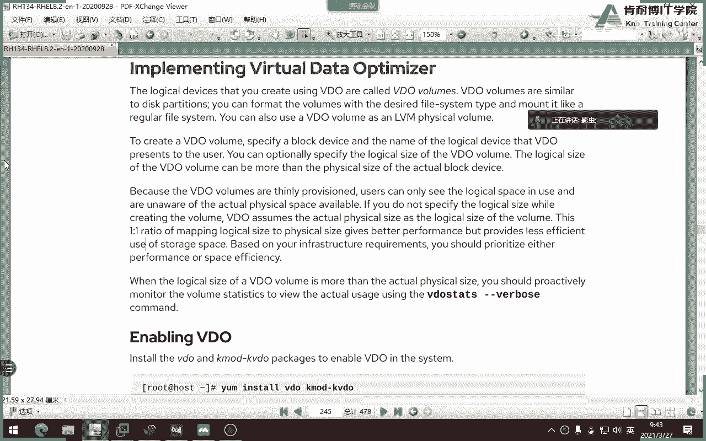

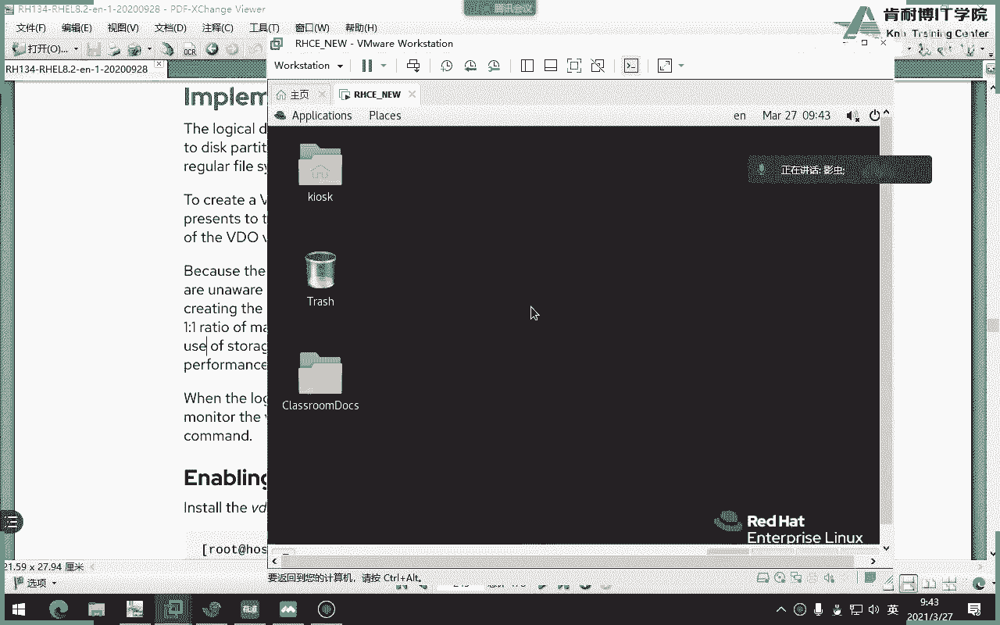

VDO通过三种核心技术来提升磁盘利用率：

以下是VDO的三大核心技术：
1.  **零块消除**：过滤掉文件中的空数据块（零字节）。
2.  **重复数据删除**：当存储相同的数据时，VDO只保存一份原始数据副本，后续相同数据仅保存引用，公式可表示为：`存储效率 = 1 - (重复数据量 / 总数据量)`。
3.  **数据压缩**：使用算法对数据进行压缩存储，例如将数据块压缩到4KB大小。

### 配置与使用VDO

上一节我们了解了VDO的原理，本节中我们来看看如何配置和使用它。

以下是配置VDO的步骤：
1.  **安装软件包**：首先需要安装VDO相关的软件包。
    ```bash
    yum install vdo kmod-kvdo -y
    ```
2.  **创建VDO卷**：使用 `vdo create` 命令创建逻辑卷。注意，逻辑大小（`--vdoLogicalSize`）通常是物理磁盘大小的10倍（在虚拟化环境中）。
    ```bash
    vdo create --name=vdo1 --device=/dev/vdd --vdoLogicalSize=50G
    ```
3.  **格式化与挂载**：像使用普通磁盘一样，对VDO卷进行格式化并挂载。
    ```bash
    mkfs.xfs /dev/mapper/vdo1
    mkdir /vdo1
    mount /dev/mapper/vdo1 /vdo1
    ```
4.  **配置永久挂载**：为了系统重启后能自动挂载，需要编辑 `/etc/fstab` 文件。**必须添加 `_netdev` 挂载选项，否则系统可能无法正常启动。**
    ```bash
    /dev/mapper/vdo1 /vdo1 xfs defaults,_netdev 0 0
    ```

### 验证VDO效果

配置完成后，我们可以验证VDO的重复数据删除和压缩效果。

以下是验证步骤：
1.  使用 `vdostats --human-readable` 命令查看VDO卷的初始状态，注意“已用空间”和“节省率”。
2.  向VDO卷中复制一个大文件（例如一个ISO镜像），然后再次查看状态，观察已用空间的增长。
3.  重命名该文件并再次复制到VDO卷中。你会发现第二次复制速度极快，且已用空间几乎不变，节省率显著提高，这证明了重复数据删除在起作用。

**总结**：本节课我们一起学习了VDO技术。我们了解到VDO通过消除零块、删除重复数据和压缩数据来优化存储空间。关键操作包括创建VDO卷、格式化、挂载，以及至关重要的在 `/etc/fstab` 中添加 `_netdev` 选项。

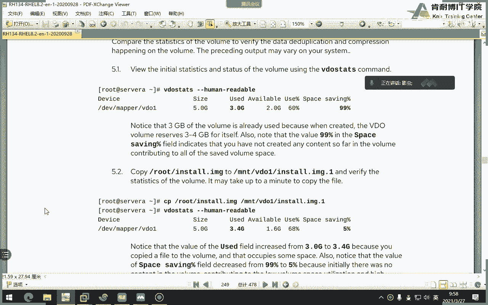

---

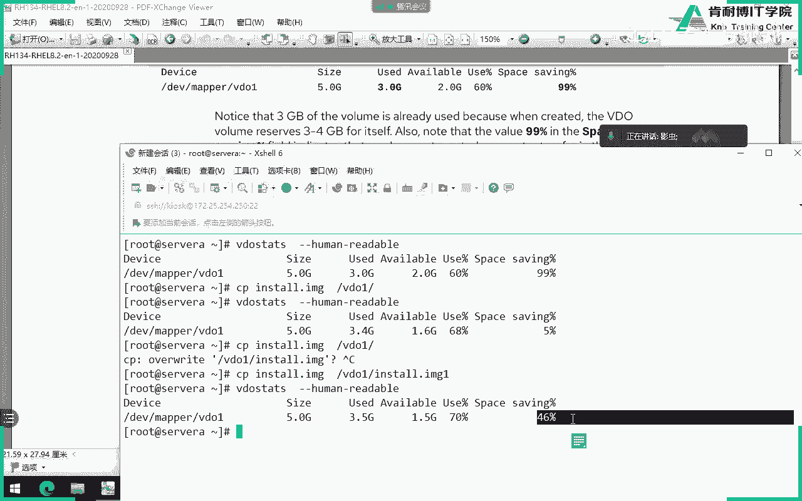

## NFS：网络文件系统 🌐

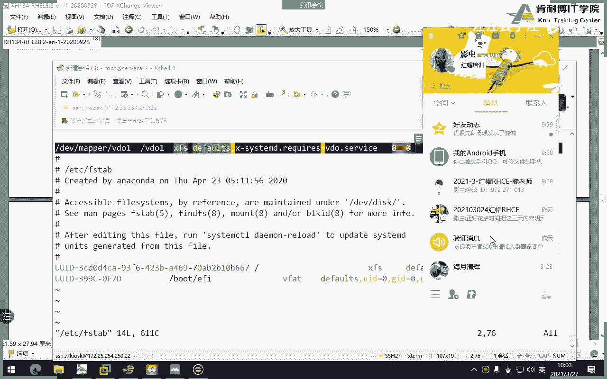

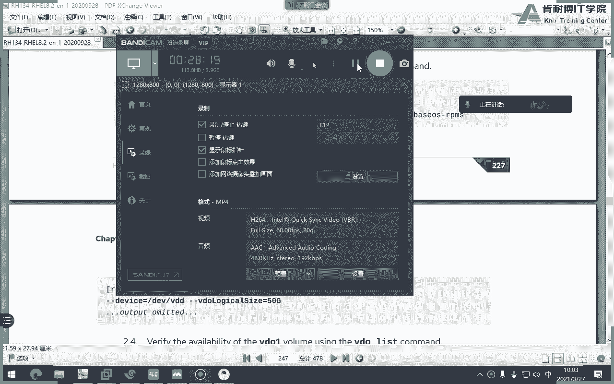

上一节我们完成了VDO的学习，本节中我们转向网络文件共享。NFS允许不同服务器之间通过网络共享目录和文件，采用客户端-服务器模型。

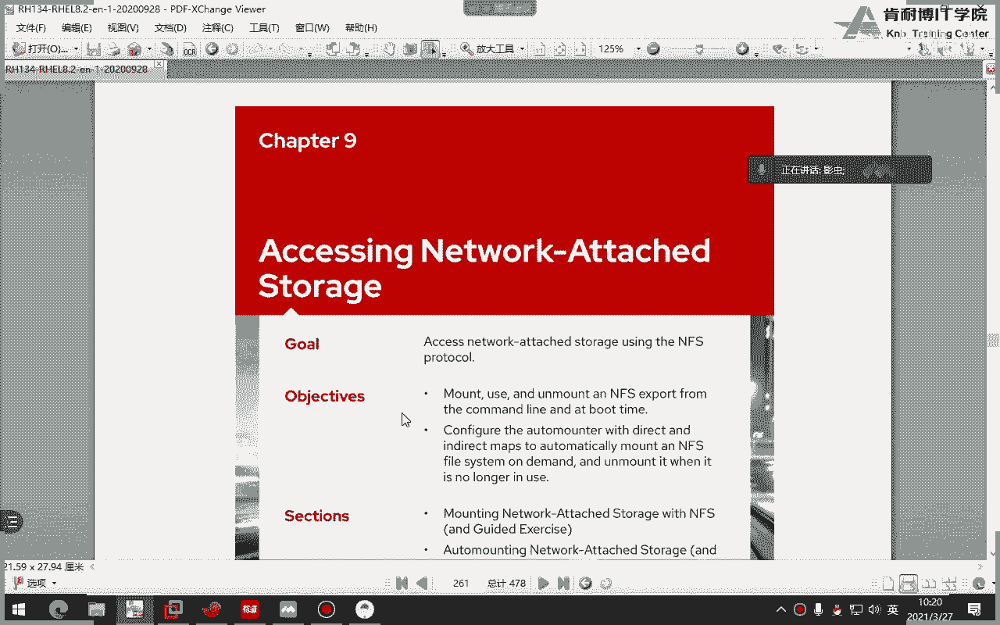

NFS服务依赖于RPC（远程过程调用）服务来动态注册和发现端口。从NFSv4版本开始，默认只使用TCP协议，比之前版本的UDP更可靠、更安全。

### 配置NFS服务器

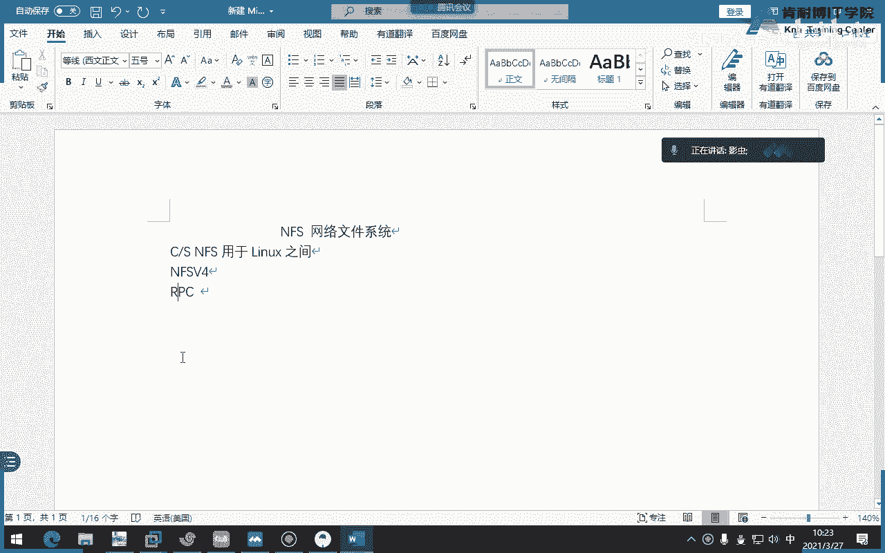

本节中我们来看看如何配置NFS服务器端。

以下是配置NFS服务器的步骤：
1.  **安装软件包**：在服务器端安装NFS工具包。
    ```bash
    yum install nfs-utils -y
    ```
2.  **启动并启用服务**：启动NFS及相关服务，并设置为开机自启。
    ```bash
    systemctl enable --now nfs-server
    ```
3.  **创建共享目录并设置权限**：
    ```bash
    mkdir /redhat
    chmod o+w /redhat  # 为了方便测试，给其他人添加写权限
    ```
4.  **配置共享**：编辑 `/etc/exports` 文件，定义共享目录、允许访问的客户端及权限。
    ```bash
    /redhat *(rw,sync)
    ```
    此行表示将 `/redhat` 目录共享给所有客户端（`*`），权限为读写（`rw`），并使用同步写入（`sync`）。
5.  **生效配置**：重新加载NFS配置，使共享生效。
    ```bash
    exportfs -r
    ```

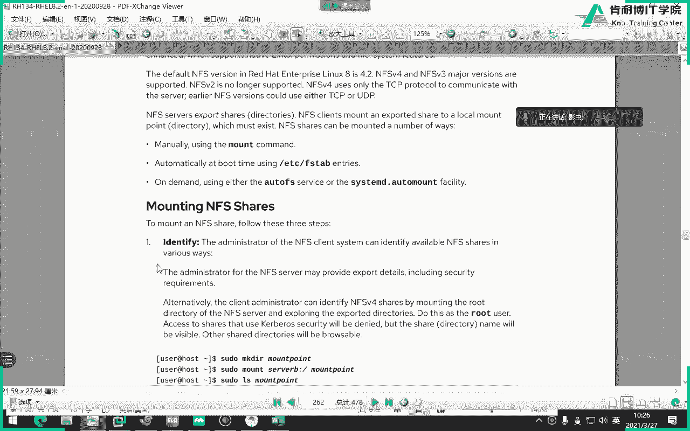

### 配置NFS客户端（手动挂载）

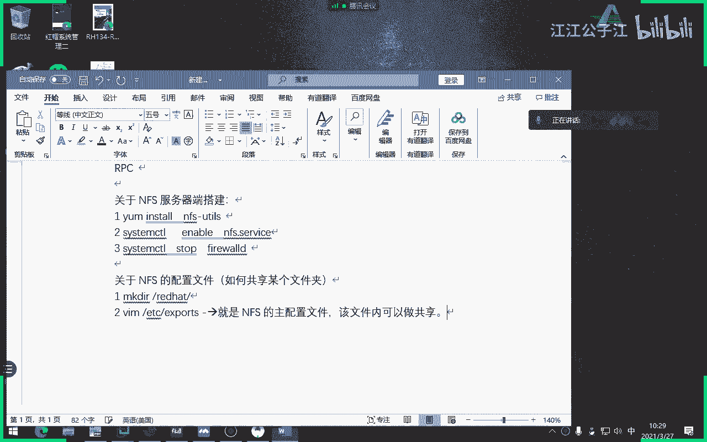

服务器配置好后，客户端需要挂载才能访问共享目录。

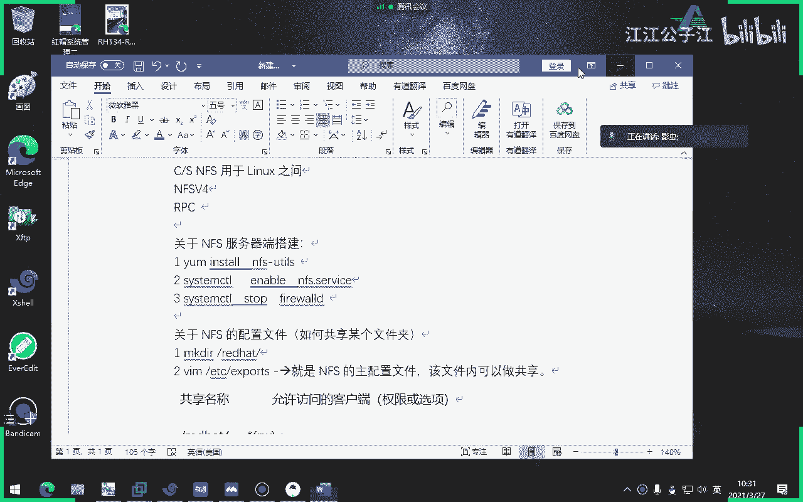

以下是NFS客户端手动挂载的两种方式：
1.  **临时挂载**：使用 `mount` 命令，重启后失效。
    ```bash
    mount 172.25.250.10:/redhat /mnt/nfs
    ```
2.  **永久挂载**：编辑 `/etc/fstab` 文件，实现开机自动挂载。
    ```bash
    172.25.250.10:/redhat /mnt/nfs nfs defaults 0 0
    ```

**注意**：NFS默认会将客户端的root用户映射为服务器上的匿名用户（nobody），这是出于安全考虑。可以通过在 `/etc/exports` 的选项中添加 `no_root_squash` 来改变此行为（但极不安全，不推荐在生产环境使用）。

### 配置NFS客户端（自动挂载 - Autofs）

手动或永久挂载的缺点是无论是否需要，目录始终被挂载。Autofs可以实现按需自动挂载，当访问挂载点时自动挂载，闲置一段时间后自动卸载。

本节中我们来看看如何配置Autofs，这也是RHCE考试的重点。

以下是配置Autofs的步骤：
1.  **安装软件包**：
    ```bash
    yum install autofs -y
    ```
2.  **编辑主配置文件**：修改 `/etc/auto.master`，定义挂载点的基目录和对应的映射文件。
    ```bash
    /share /etc/auto.nfs
    ```
    这表示 `/share` 目录下的挂载将由 `/etc/auto.nfs` 文件定义。
3.  **创建映射文件**：创建并编辑 `/etc/auto.nfs`，定义具体的挂载信息。
    ```bash
    redhat -rw,sync 172.25.250.10:/redhat
    ```
    此行表示当访问 `/share/redhat` 时，自动以读写方式挂载服务器 `172.25.250.10` 的 `/redhat` 目录。
4.  **启动并启用服务**：
    ```bash
    systemctl enable --now autofs
    ```
5.  **测试**：访问 `/share/redhat` 目录，系统会自动完成挂载。使用 `df -h` 命令查看，一段时间不访问后，挂载会自动消失。

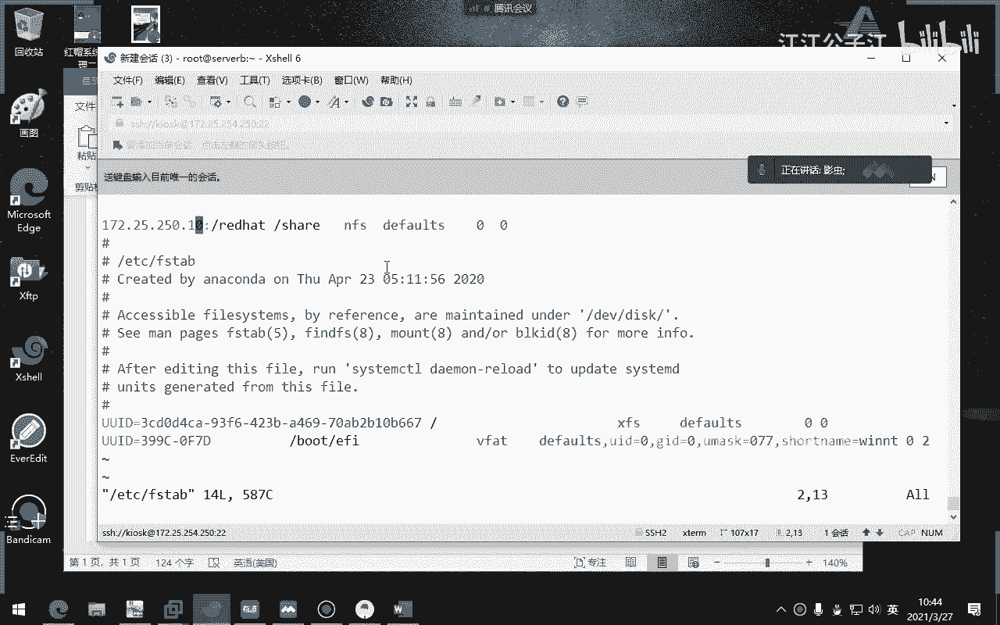

**总结**：本节课我们一起学习了NFS网络文件系统。我们掌握了NFS服务器端的共享配置，以及客户端的三种挂载方式：临时挂载、永久挂载和按需自动挂载（Autofs）。重点在于理解NFS的权限映射机制和Autofs的配置方法，这是实现高效、灵活网络文件共享的关键。