# Ansible Playbook与变量使用：P17：第九天 Playbook的书写和变量使用


## 概述

在本节课中，我们将学习Ansible Playbook的编写方法以及变量的使用。Playbook是Ansible的核心，它允许我们将多个任务组织成一个有序的“剧本”，实现复杂、自动化的配置管理。我们将从基础语法开始，逐步深入到变量的定义、引用和作用域。

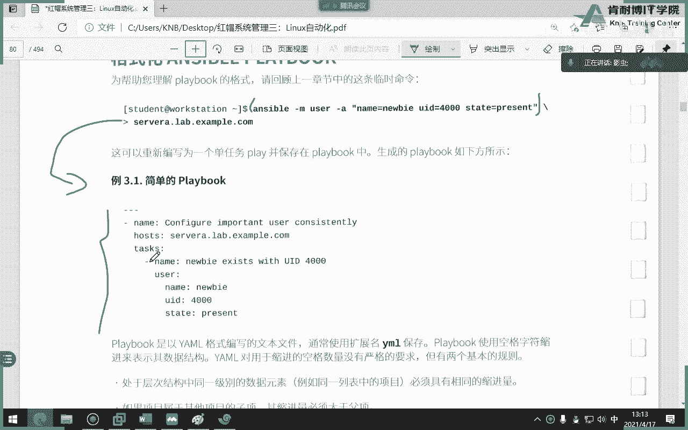

---

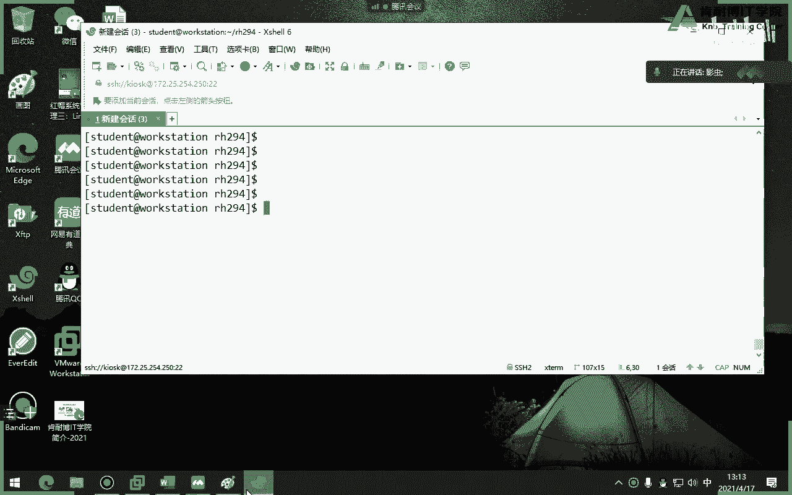

## Playbook基础概念

上一节我们介绍了Ansible的临时命令。本节中，我们来看看如何将这些命令组织成更强大的Playbook。

临时命令适合执行一次性任务，例如创建一个用户。然而，当需要执行一系列复杂的操作时，例如同时创建用户、安装Apache、配置防火墙等，单个临时命令就显得力不从心。这时，我们就需要使用Playbook。

Playbook是一个YAML格式的文件，以 `.yml` 或 `.yaml` 结尾。它定义了要在被管理主机上执行的一系列任务。

### Playbook的结构

一个Playbook由一个或多个“play”组成。每个“play”又包含三个核心的键值对：

*   **name**: 该play的描述性名称。
*   **hosts**: 指定该play要在哪些主机或主机组上执行。
*   **tasks**: 该play要执行的任务列表。

**公式**：
```yaml
---
- name: <Play描述>
  hosts: <目标主机或主机组>
  tasks:
    - name: <任务1描述>
      <模块名>:
        <模块参数>: <值>
    - name: <任务2描述>
      <模块名>:
        <模块参数>: <值>
```

### 缩进规则

YAML语法严格依赖缩进来表示层级关系。以下是核心规则：

*   同一层级的元素必须保持相同的缩进量。
*   子元素的缩进必须比父元素多。
*   通常使用两个空格进行缩进（避免使用Tab键）。

记住口诀：**有横线（`-`）空一格，有冒号（`:`）空一格**。

---

## 编写第一个Playbook


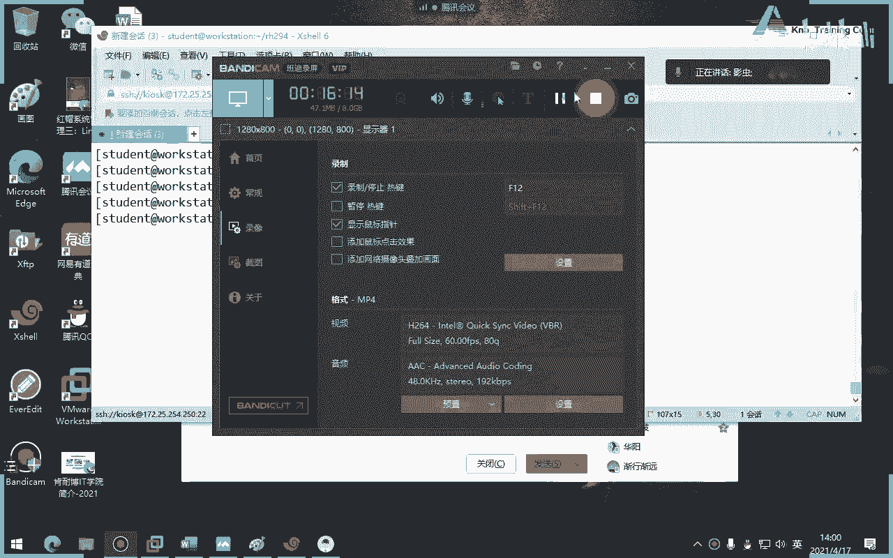

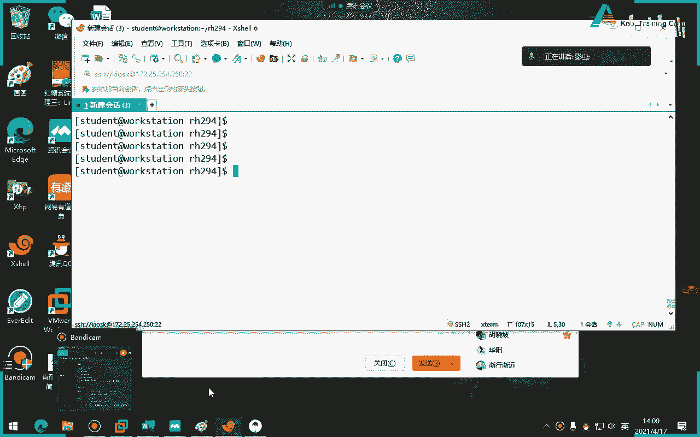

理解了基本结构后，我们来动手编写一个简单的Playbook。

以下是一个创建用户的Playbook示例：

```yaml
---
- name: 测试创建用户
  hosts: db
  tasks:
    - name: 创建用户 jack
      user:
        name: jack
        uid: 4000
        state: present
```

**代码解释**：
*   `---`：YAML文件的起始标记。
*   这个Playbook包含一个play。
*   `name` 描述了此play的目的。
*   `hosts: db` 表示此play将在清单中 `db` 主机组内的所有主机上执行。
*   `tasks` 下定义了一个任务：使用 `user` 模块创建名为 `jack`、UID为 `4000` 的用户。

### 运行Playbook

使用 `ansible-playbook` 命令来运行Playbook。

```bash
ansible-playbook create_user.yml
```

如果想查看更详细的执行过程，可以添加 `-v`（verbose）选项，`-vv`、`-vvv` 会提供更详细的信息。

```bash
ansible-playbook create_user.yml -vv
```

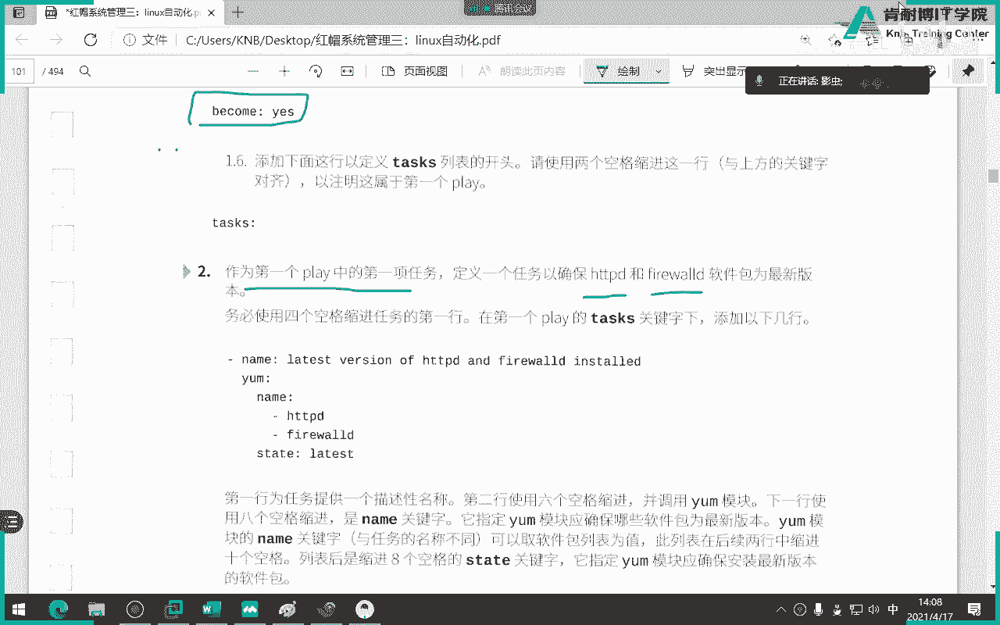

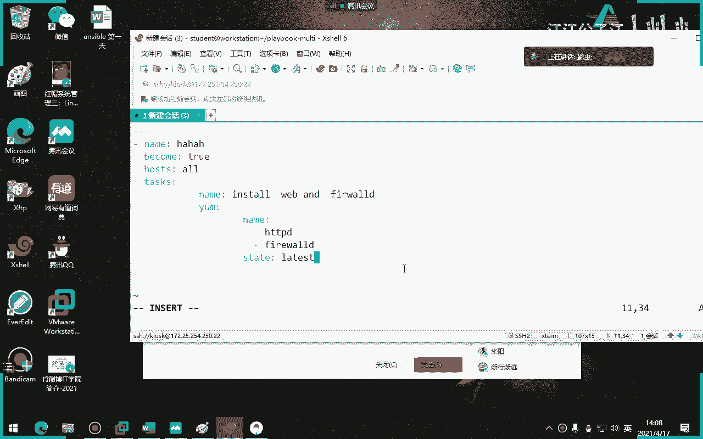

在运行前，可以使用 `--syntax-check` 进行语法检查，或使用 `-C`（大写）进行“空运行”（dry run），模拟执行过程但不做实际更改。

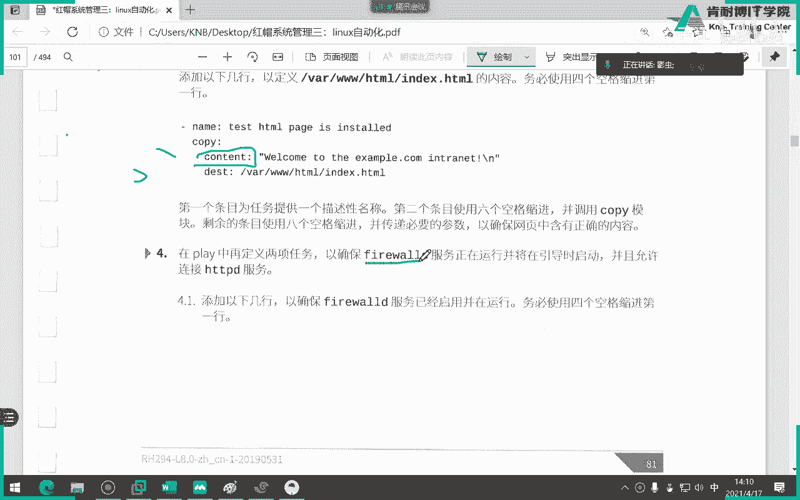

```bash
ansible-playbook create_user.yml --syntax-check
ansible-playbook create_user.yml -C
```

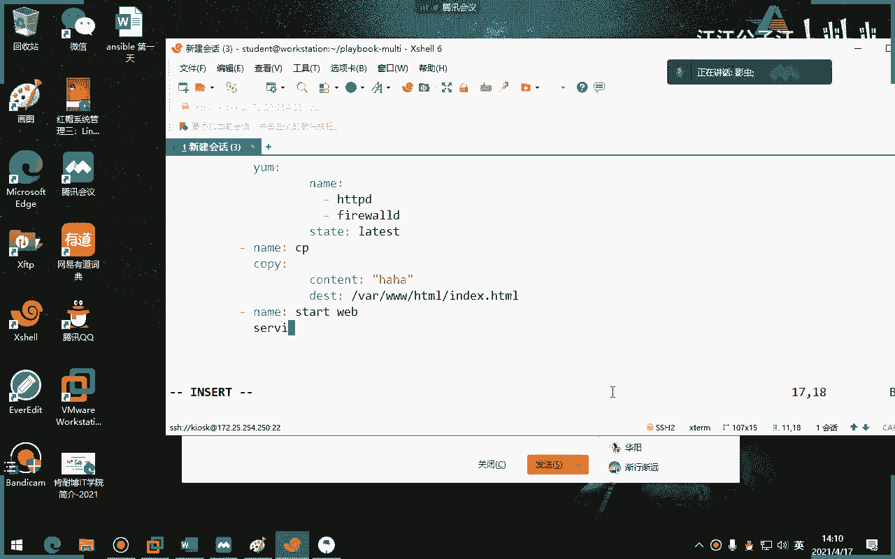


---

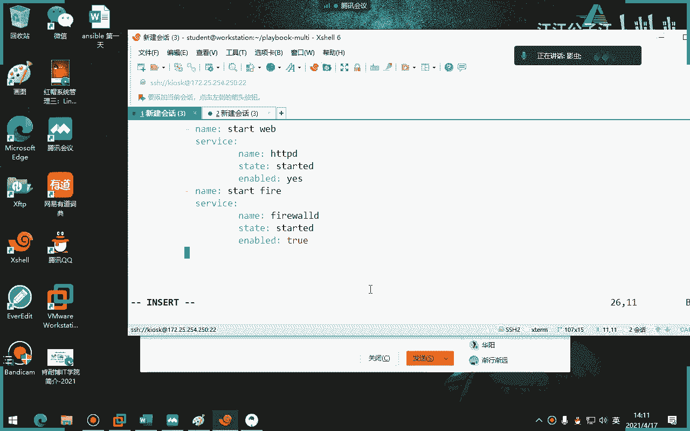

## 在Playbook中使用变量

上一节我们学会了编写基础的Playbook。本节中，我们来看看如何让Playbook更加灵活和可重用，这就需要用到变量。

变量允许我们为值（如软件包名、文件名、用户信息等）起一个名字。在Playbook中引用变量名，而不是固定的值，这样同一份Playbook就能通过改变变量的值来适应不同的场景。

### 定义与引用变量

在Playbook中，使用 `vars` 关键字来定义变量。

**定义变量**：
```yaml
---
- name: 使用变量示例
  hosts: all
  vars:
    package_name: httpd
    service_name: httpd
  tasks:
    - name: 安装 {{ package_name }} 软件包
      yum:
        name: "{{ package_name }}"
        state: present
```

**代码解释**：
*   在 `vars` 下定义了两个变量：`package_name` 和 `service_name`。
*   在 `tasks` 中引用变量时，需要使用双花括号 `{{ }}` 将变量名括起来。
*   当参数值以变量开头时，建议将整个值用双引号引起来，例如 `name: "{{ package_name }}"`。

### 变量的作用域与优先级

变量的定义位置决定了它的作用范围和优先级。核心原则是：**范围越窄，优先级越高**。

以下是变量定义的常见位置（从宽到窄）：
1.  **全局范围**：在Ansible配置文件 (`ansible.cfg`) 或清单文件 (`inventory`) 中定义。
2.  **Play范围**：在Playbook的 `vars` 部分定义（如上例）。
3.  **主机/主机组范围**：在特定的目录结构中为特定主机或主机组定义变量（优先级更高）。

---

## 主机与主机组变量

为了更精细地管理变量，我们可以为特定的主机或主机组定义变量。这是通过特定的目录结构实现的。

### 主机变量

为主机定义变量，需要在Playbook所在目录（或Ansible项目根目录）下创建 `host_vars` 目录，并在其中创建以**主机名**命名的YAML文件。

**示例结构**：
```
.
├── playbook.yml
└── host_vars/
    └── serverc.lab.example.com.yml
```

`serverc.lab.example.com.yml` 文件内容：
```yaml
---
package_to_install: vsftpd
```

在 `playbook.yml` 中，即使 `hosts` 设置为 `all`，也只有 `serverc.lab.example.com` 主机会安装 `vsftpd` 包，因为变量只对它生效。

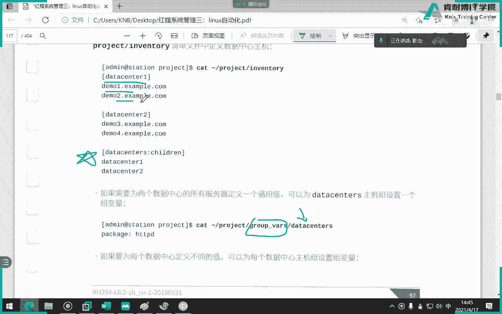

### 主机组变量

为主机组定义变量，需要在Playbook所在目录下创建 `group_vars` 目录，并在其中创建以**主机组名**命名的YAML文件。

**示例结构**：
```
.
├── playbook.yml
└── group_vars/
    └── webservers.yml
```


`webservers.yml` 文件内容：
```yaml
---
http_port: 8080
```

这样，所有属于 `webservers` 组的主机都会应用这个变量。

---

## 使用Facts（事实）变量

Ansible在执行Playbook时，会首先自动收集被管理主机的系统信息，这些信息称为“Facts”（事实）。Facts本身就是一组强大的变量，包含了主机名、IP地址、操作系统版本、磁盘空间等详细信息。

### 查看与使用Facts

可以使用 `setup` 模块手动收集并查看Facts：
```bash
ansible serverc -m setup
```

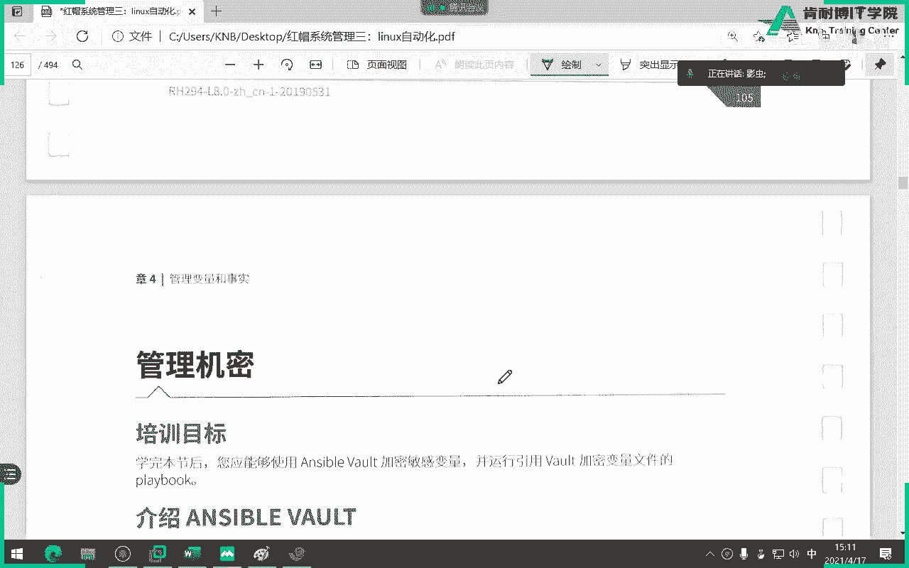


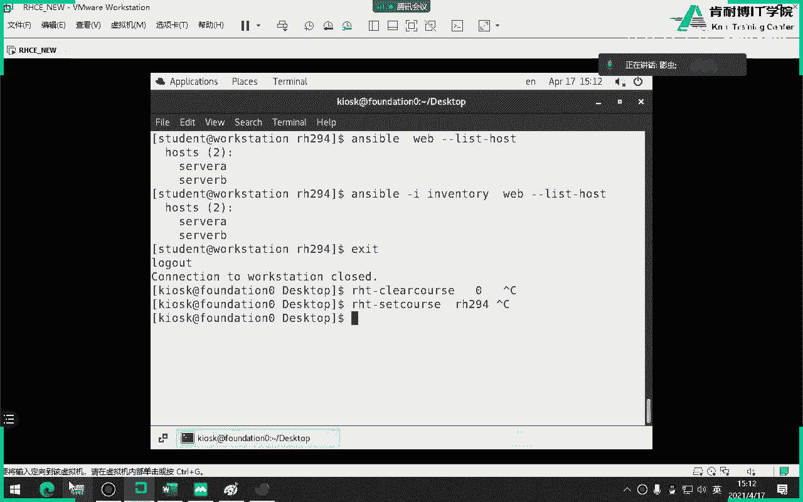

输出内容非常详细。在Playbook中，可以通过 `ansible_facts` 字典来引用这些信息。

**示例**：打印主机的完全限定域名(FQDN)和IPv4地址。
```yaml
---
- name: 使用Facts变量
  hosts: serverc
  tasks:
    - name: 显示主机信息
      debug:
        msg: "主机 {{ ansible_facts['fqdn'] }} 的IP地址是 {{ ansible_facts['default_ipv4']['address'] }}"
```

**代码解释**：
*   `ansible_facts[‘fqdn’]` 引用了主机的完全限定域名。
*   `ansible_facts[‘default_ipv4’][‘address’]` 引用了主机的默认IPv4地址。

### 关闭Facts收集

如果不需要Facts信息，可以关闭自动收集以加快Playbook执行速度：
```yaml
---
- name: 不收集Facts
  hosts: all
  gather_facts: no
  tasks:
    - name: 一个简单任务
      debug:
        msg: "跳过Facts收集"
```

---

## 注册变量与调试

在任务执行过程中，我们常常需要捕获某个任务的输出结果，并根据结果决定后续操作。这时就需要用到 `register` 和 `debug`。

### 注册变量 (`register`)

`register` 关键字可以将一个任务的执行结果保存到一个自定义变量中。

### 调试输出 (`debug`)

`debug` 模块用于打印调试信息，常与 `register` 配合使用，查看捕获的结果。它有两个常用参数：
*   `var`: 打印变量的值。
*   `msg`: 打印自定义字符串信息。

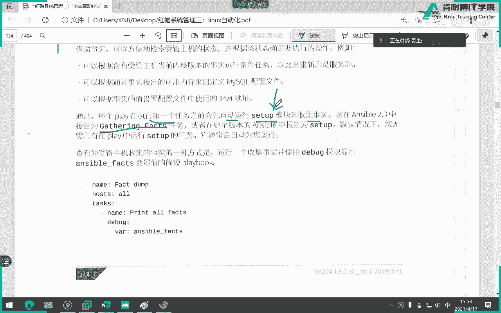

**示例**：安装软件包并检查结果。
```yaml
---
- name: 注册变量示例
  hosts: serverc
  tasks:
    - name: 安装 httpd 软件包
      yum:
        name: httpd
        state: present
      register: install_result # 将安装结果注册到变量 install_result

    - name: 显示安装结果
      debug:
        var: install_result # 打印整个 install_result 变量的内容

    - name: 检查安装是否成功
      debug:
        msg: "安装任务执行完毕，返回码为 {{ install_result.rc }}"
```

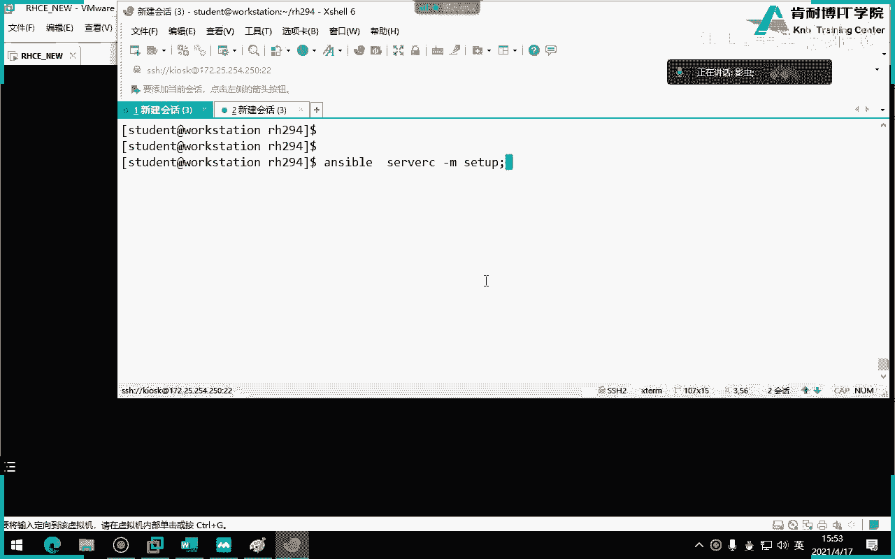

**代码解释**：
*   第一个任务安装了 `httpd`，并将其详细输出结果保存到 `install_result` 变量。
*   第二个任务使用 `debug` 的 `var` 参数打印整个结果字典，内容非常详细。
*   第三个任务引用了结果字典中的一个关键字段 `rc`（return code）。**`rc` 等于 0 通常表示任务成功执行，非 0 表示可能出现了问题**。这在后续编写条件判断时非常有用。

---

## 总结

本节课中我们一起学习了Ansible Playbook的核心知识：

1.  **Playbook基础**：理解了Playbook由Play构成，每个Play包含 `name`、`hosts`、`tasks` 三个核心部分，并掌握了YAML的缩进语法。
2.  **变量使用**：学会了使用 `vars` 定义Play级别的变量，并通过 `{{ variable_name }}` 来引用，使Playbook更灵活。
3.  **作用域管理**：了解了主机变量 (`host_vars/`) 和主机组变量 (`group_vars/`) 的目录结构，知道了“范围越窄，优先级越高”的原则。
4.  **系统信息**：认识了Ansible自动收集的Facts变量，并学会了如何引用 `ansible_facts` 中的系统信息。
5.  **任务控制**：掌握了使用 `register` 捕获任务输出，并用 `debug` 模块进行调试和查看的关键方法，特别是结果中的 `rc` 字段。

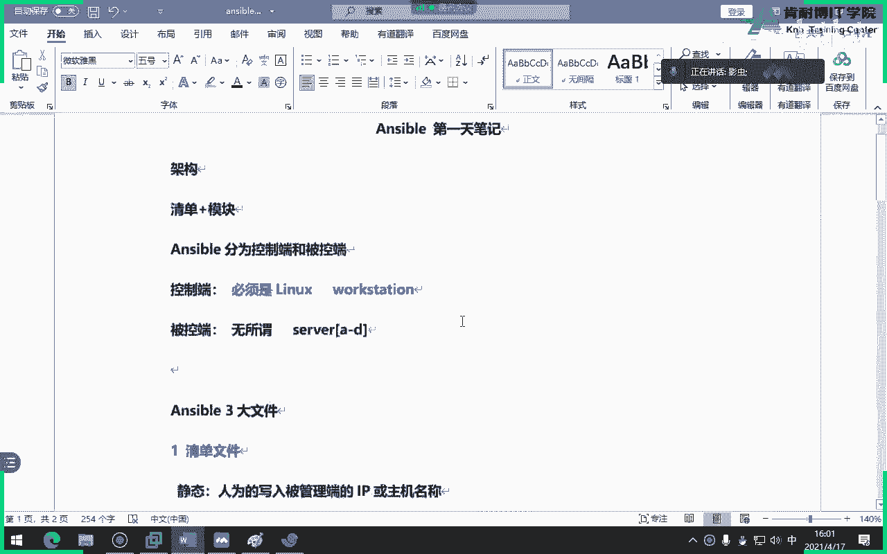

通过掌握这些内容，你已经具备了编写功能强大、结构清晰、易于维护的Ansible Playbook的能力。后续的学习将在此基础上，深入循环、条件判断、角色等更高级的主题。