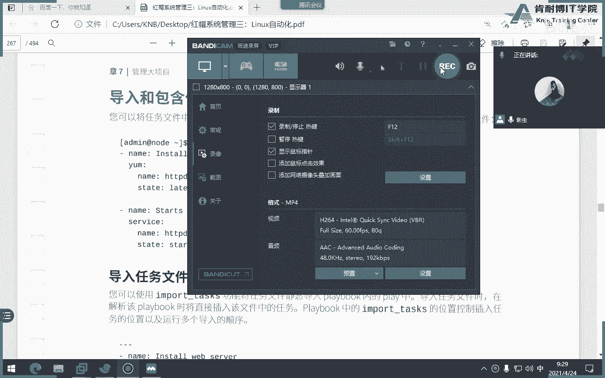
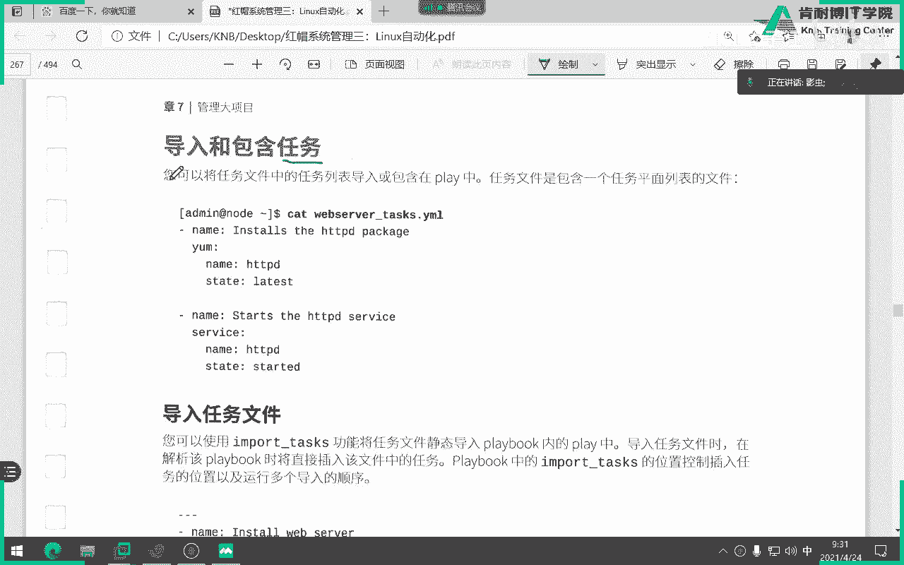
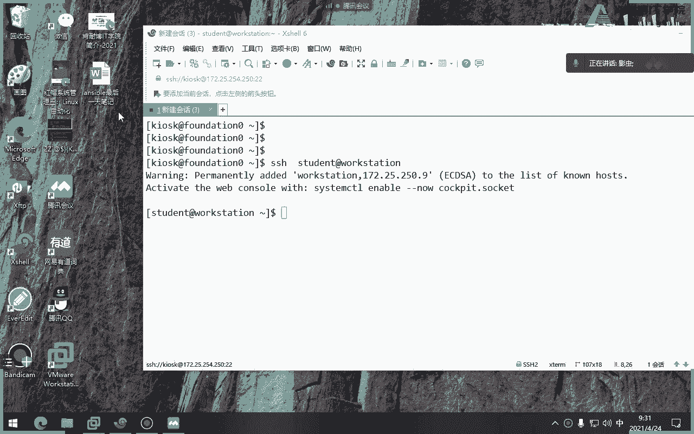
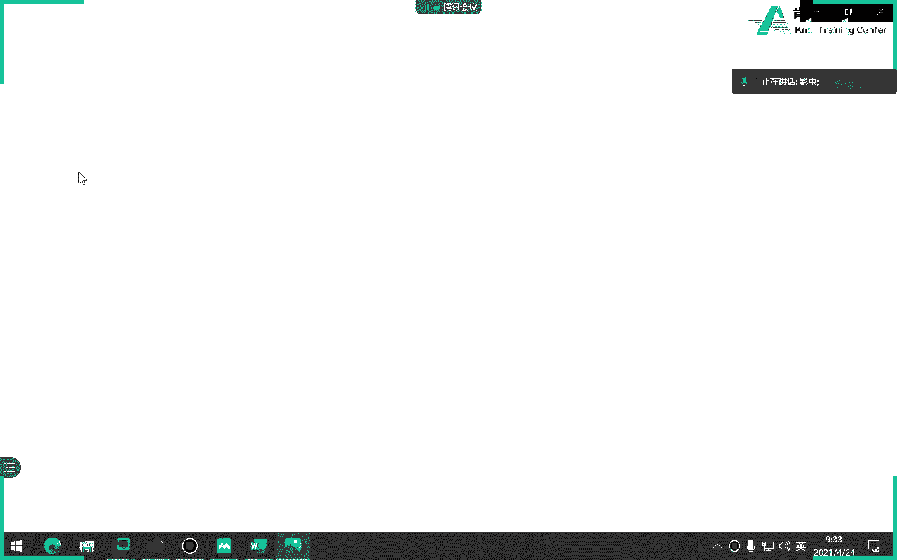
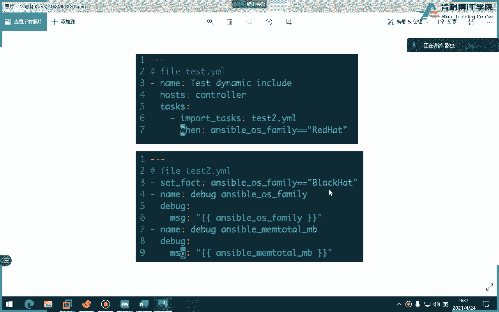
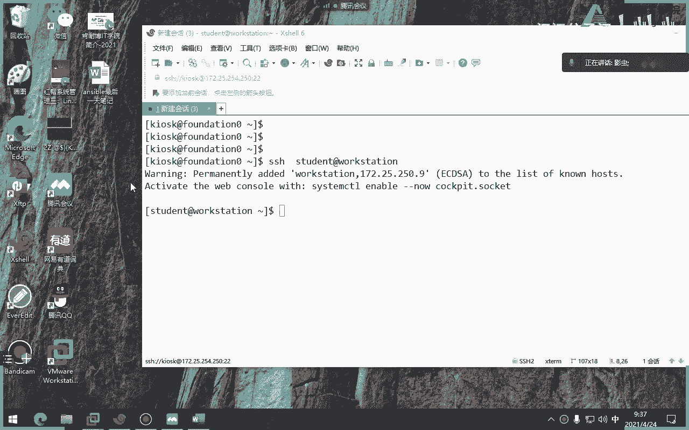
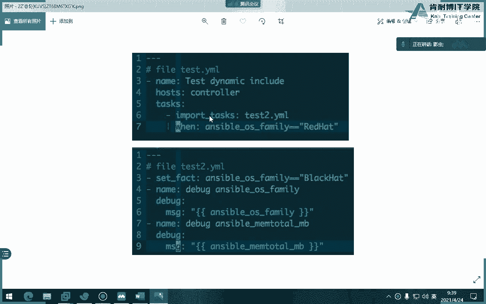
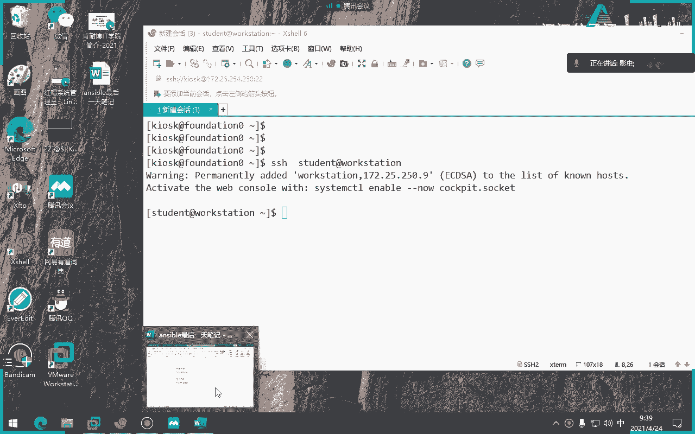
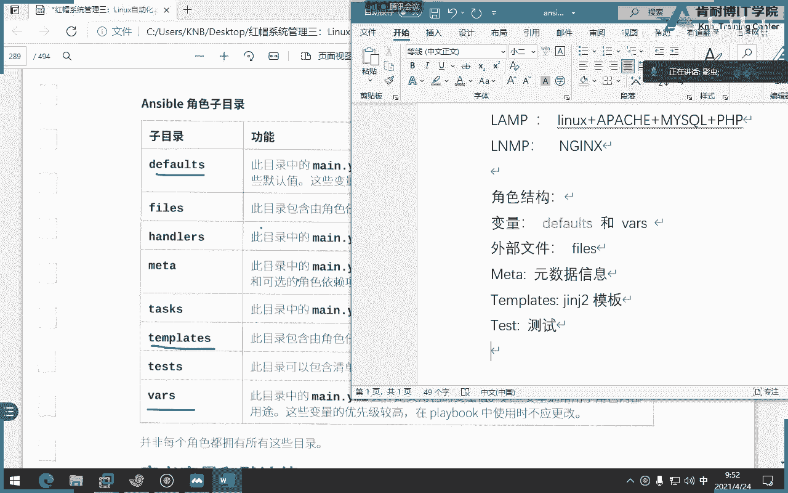

# Ansible 角色：P18：使用红帽角色 🎭



在本节课中，我们将要学习 Ansible 角色的核心概念、结构以及如何在实际生产环境中使用它们，特别是红帽官方提供的角色。通过拆分复杂的 Playbook 为模块化的角色，可以极大地提升代码的可读性、复用性和维护性。





## 回顾：Playbook 的导入与包含

上一节我们介绍了如何通过 `import_playbook` 来导入整个 Play 列表。本节中我们来看看更细致的任务级导入与包含。

在大型生产环境中，将所有任务写在一个 Playbook 文件中会导致可读性差。因此，我们需要将 Playbook 进行拆分和模块化调用。Ansible 提供了两种方式来实现任务文件的互相调用：



*   **`import_tasks`**：用于导入任务文件，其行为是**静态**的。
*   **`include_tasks`**：用于包含任务文件，其行为是**动态**的。

核心区别在于解析时机：
*   **静态导入 (`import_tasks`)**：在解析整个 Playbook 时，就会将导入文件中的任务**全部解析并插入**。变量值在解析时即被确定。
*   **动态包含 (`include_tasks`)**：只有在 Play 运行到该 `include_tasks` 语句时，才会去处理包含文件中的内容。变量值在运行时才被解析。

以下是一个示例来帮助理解两者的区别：

```yaml
# task1.yml
- name: 任务一
  import_tasks: task2.yml # 或使用 include_tasks
  when: ansible_distribution == “RedHat”

# task2.yml
- name: 修改事实变量
  set_fact:
    ansible_distribution: “BlackCat”
- name: 调试输出1
  debug:
    msg: “{{ ansible_distribution }}”
- name: 调试输出2
  debug:
    msg: “{{ ansible_memory_mb }}”
```



*   如果使用 **`import_tasks`**：在 Playbook 解析阶段，`task2.yml` 的内容被整体插入，条件判断 `when: ansible_distribution == “RedHat”` 在此时评估。由于此时变量尚未被 `set_fact` 修改，条件为真，任务会被加入执行列表。但注意，`set_fact` 修改的是运行时的变量，不影响已解析的条件逻辑。不过，关键在于静态导入将任务视为一个整体在初始时评估。
*   如果使用 **`include_tasks`**：只有在运行到“任务一”时，才会去读取 `task2.yml`。此时“任务一”的条件成立，于是包含 `task2.yml` 并执行其中的任务，包括修改变量和打印信息。



简单来说，`import_tasks` 是“先全部解析，再整体运行”，而 `include_tasks` 是“运行到哪，解析到哪”。选择哪种方式取决于具体需求，例如是否需要依赖运行时才能确定的变量。


## 角色的概念与优势 🧩





理解了任务模块化之后，我们进入更高级的模块化单元——角色（Role）。角色是一种将 Playbook 进一步结构化的方式，它把变量、文件、模板、任务等按照标准目录结构组织起来，形成一个独立的、可复用的功能单元。

角色的优势非常明显：
1.  **代码复用与分享**：可以将通用的部署逻辑（如搭建 Web 服务器、数据库）封装成角色，在多个项目或团队间共享。
2.  **降低复杂度**：将庞大的 Playbook 拆分为层次清晰的角色，使项目结构更清晰，易于理解和维护。
3.  **并行开发**：不同的管理员可以同时开发不同的角色，互不干扰。
4.  **利用社区资源**：可以从 Ansible Galaxy 等社区平台下载他人编写好的高质量角色，快速搭建环境，无需从头开始。

例如，需要部署一个 LAMP（Linux, Apache, MySQL/MariaDB, PHP）环境。如果没有角色，你需要为每个组件编写大量任务。使用角色后，你可以直接引用社区中成熟的 `apache`、`mysql`、`php` 角色，只需调整少量变量（如版本号、配置文件路径）即可完成部署。如果需要将 Apache 替换为 Nginx，也只需更换对应的角色，极大地提升了效率。

## 角色的目录结构 📁

角色的强大源于其规范的目录结构。一个标准的角色目录如下所示：

```
role_name/          # 角色根目录
├── defaults/       # 默认变量，优先级最低
│   └── main.yml
├── vars/          # 角色变量，优先级较高
│   └── main.yml
├── files/         # 存放需要拷贝到目标主机的静态文件
├── templates/     # 存放 Jinja2 模板文件
├── tasks/         # 角色主任务列表
│   └── main.yml
├── handlers/      # 处理器
│   └── main.yml
├── meta/          # 角色元数据，如作者、依赖、许可证
│   └── main.yml
└── tests/         # 测试用例
    ├── inventory
    └── test.yml
```

以下是各目录的核心功能：

*   **`defaults/main.yml`**：定义角色的**默认变量**。这些变量的优先级最低，可以被其他地方的变量轻易覆盖。
*   **`vars/main.yml`**：定义角色的**内部变量**。优先级高于 `defaults`。通常将不希望用户轻易覆盖的变量放在这里。
*   **`files/`**：此目录中的文件可以通过 `copy` 或 `script` 模块直接引用，无需提供完整路径。例如，`src: my_config.conf` 会自动在 `files/` 目录下查找。
*   **`templates/`**：存放 Jinja2 模板文件（通常以 `.j2` 结尾）。通过 `template` 模块引用，如 `src: my_config.conf.j2`。
*   **`tasks/main.yml`**：这是角色的**主入口文件**，包含该角色要执行的主要任务列表。
*   **`handlers/main.yml`**：定义该角色使用的处理器（在任务中 `notify` 触发）。
*   **`meta/main.yml`**：包含角色元信息，例如作者、描述、支持的平台、以及该角色所依赖的其他角色列表。
*   **`tests/`**：用于存放测试该角色的 Playbook 和库存文件。

## 获取角色的来源 🌐

角色主要有两大来源：

1.  **Ansible Galaxy**：一个由社区维护的公共角色仓库（[galaxy.ansible.com](https://galaxy.ansible.com)），包含数以万计的角色，涵盖从基础软件安装到复杂应用部署的各个方面。你可以像使用 `git clone` 或 `docker pull` 一样，使用 `ansible-galaxy` 命令从 Galaxy 下载角色。
2.  **红帽官方角色**：红帽在收购 Ansible 后，也提供了一系列经过认证和支持的角色。这些角色针对红帽企业版 Linux（RHEL）进行了优化，是 RHCE 考试的重点内容。它们通常包含在特定的订阅或仓库中。

## 在 Playbook 中使用角色

在 Playbook 中使用角色非常简单和直观。你不需要手动包含任务文件或变量，只需声明使用该角色即可。

```yaml
# site.yml
- hosts: webservers
  roles:
    - common                 # 直接使用角色名
    - role: apache           # 使用键值对指定角色
      vars:
        apache_port: 8080    # 向角色传递变量
    - { role: mysql, db_name: ‘app_db’ } # 另一种简写格式
```

当 Playbook 执行时，Ansible 会按照角色声明的顺序，自动查找并执行每个角色 `tasks/main.yml` 中的任务，并加载对应的变量、处理程序和文件。

## 总结



本节课中我们一起学习了 Ansible 的核心高级特性——角色。我们从 Playbook 的模块化（导入与包含任务）入手，理解了代码复用的基础。然后深入探讨了角色的概念、优势以及其标准的目录结构，这有助于我们编写和维护清晰、可复用的自动化代码。我们还了解了获取角色的两大主要来源：社区驱动的 Ansible Galaxy 和红帽官方角色。最后，我们看到了在 Playbook 中调用角色是多么的简洁高效。掌握角色的使用，是迈向 Ansible 高级运维工程师的关键一步，也是 RHCE 认证考核的重点。