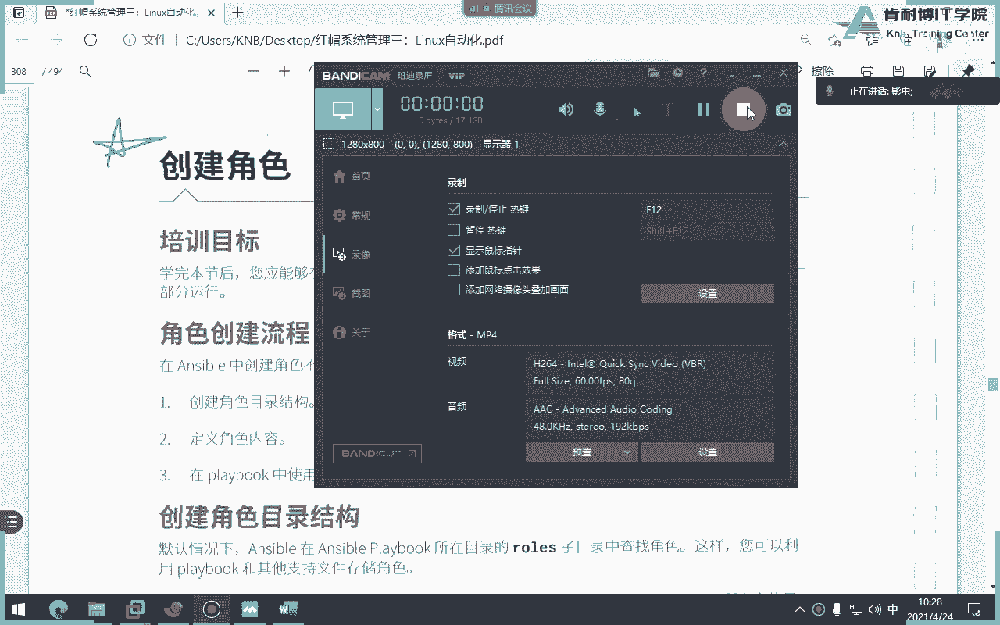
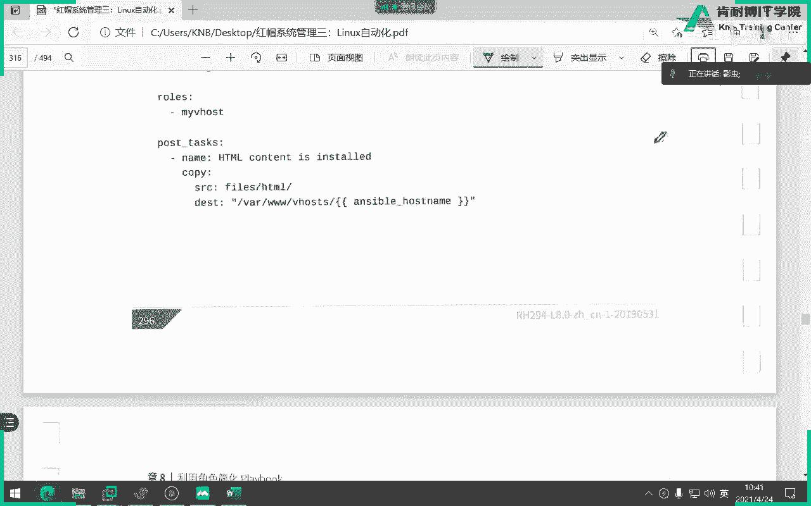

# Ansible 自定义角色教程：P19：21-ansible 自定义角色




## 概述

在本节课中，我们将学习如何创建和使用自定义的 Ansible 角色。这是 RHCE8 认证考试的重点内容。我们将从理解角色的基本结构开始，逐步完成创建、填充内容和使用角色的完整流程。

上一节我们介绍了红帽官方提供的角色，本节中我们来看看如何创建我们自己的角色。

## 创建自定义角色的三个核心步骤

创建和使用一个自定义角色，可以归纳为以下三个核心步骤：

1.  **创建角色目录结构**：为角色建立一个标准化的文件夹和文件框架。
2.  **为角色添加内容**：在创建好的目录结构中，填充具体的任务、变量、模板等内容。
3.  **在 Playbook 中使用角色**：在您的 Ansible Playbook 中调用您创建的角色。

接下来，我们将详细讲解每一步。

## 第一步：创建角色目录结构

首先，我们需要创建角色的骨架。虽然您可以手动使用 `mkdir` 命令逐个创建所有目录，但这非常繁琐且容易出错。Ansible 提供了一个便捷的命令来初始化角色结构。

以下是创建角色的命令：
```bash
ansible-galaxy init <角色名称>
```

**重要注意事项**：
*   您**不能**直接在您的工作目录（例如 `/home/student/ansible`）中运行此命令。
*   您需要**先**创建一个名为 `roles` 的目录，然后进入该目录，再执行初始化命令。这样做是为了清晰地管理多个角色。

操作流程如下：
```bash
# 1. 进入您的工作目录
cd /home/student/ansible

# 2. 创建 roles 目录（如果不存在）
mkdir roles

# 3. 进入 roles 目录
cd roles

# 4. 使用 ansible-galaxy init 初始化一个名为 myrole 的角色
ansible-galaxy init myrole
```

执行后，您会看到 `myrole` 目录下自动生成了完整的结构，包括 `tasks`, `handlers`, `templates`, `vars`, `defaults`, `meta` 等子目录。虽然某些目录（如 `tests`）可能暂时用不到，但建议保留它们，删除可能导致意外错误。

## 第二步：为角色添加内容

创建好结构后，下一步是向其中填充具体内容。这取决于您希望角色完成什么任务。

例如，如果您的角色需要部署一个 Jinja2 模板文件，您需要：
1.  将模板文件（如 `motd.j2`）放入角色的 `templates/` 目录。
2.  在角色的 `tasks/main.yml` 文件中定义使用该模板的任务。

让我们通过一个简单的例子来演示：

**1. 创建 Jinja2 模板**
进入您的角色目录，创建模板文件：
```bash
cd /home/student/ansible/roles/myrole
vim templates/motd.j2
```
在 `motd.j2` 文件中写入以下内容（一个简单的 for 循环示例）：
```jinja2

当前项是：{{ item }}

```

**2. 定义主任务**
编辑角色的主任务文件：
```bash
vim tasks/main.yml
```
在 `main.yml` 中定义任务，使用 `template` 模块来部署我们刚创建的模板：
```yaml
---
# tasks file for myrole
- name: 部署 MOTD 文件
  template:
    src: motd.j2
    dest: /etc/motd
```
在这个任务中，`src` 参数只需写模板文件名 `motd.j2`，Ansible 会自动在角色的 `templates/` 目录下查找它。`dest` 参数指定了将渲染后的文件部署到目标主机的 `/etc/motd` 路径。

## 第三步：在 Playbook 中使用角色

角色内容定义完成后，最后一步就是在 Playbook 中调用它。

回到您的工作目录，创建一个 Playbook 文件：
```bash
cd /home/student/ansible
vim use-myrole.yml
```
在 Playbook 中，使用 `roles` 关键字来调用您的自定义角色：
```yaml
---
- name: 使用我的自定义角色
  hosts: all
  roles:
    - myrole
```
如果您的 `ansible.cfg` 文件中已经通过 `roles_path` 配置了角色搜索路径（包含了 `./roles`），Ansible 会自动找到 `myrole` 角色。为了清晰起见，您也可以指定相对路径，但通常上述简洁写法即可。

运行这个 Playbook：
```bash
ansible-playbook use-myrole.yml
```
执行成功后，您可以登录到目标主机，查看 `/etc/motd` 文件的内容，应该会看到由模板渲染出的 “a b c” 列表。

## 关键概念与目录说明

以下是角色各主要目录的简要说明：

*   **`tasks/main.yml`**：角色的主任务列表，这是角色的核心。
*   **`templates/`**：存放 Jinja2 模板文件（`.j2` 后缀）。
*   **`handlers/main.yml`**：定义处理器，通常由任务通知触发。
*   **`vars/main.yml`**：定义角色变量，拥有较高的优先级。
*   **`defaults/main.yml`**：定义角色默认变量，**优先级最低**，容易被其他变量定义覆盖。
*   **`meta/main.yml`**：定义角色元数据，如作者、许可证、依赖关系等。

**关于变量优先级**：在 `defaults` 中定义的变量可以被 `vars` 中或 Playbook 中定义的变量覆盖，因此重要的变量不建议放在 `defaults` 中。

## 总结

本节课中我们一起学习了 Ansible 自定义角色的完整创建和使用流程。我们明确了创建角色的三个步骤：1）使用 `ansible-galaxy init` 初始化结构；2）根据需求向 `tasks`、`templates` 等目录填充内容；3）在 Playbook 中通过 `roles` 关键字调用角色。通过一个部署 Jinja2 模板的简单示例，我们实践了整个过程。掌握自定义角色是编写高效、可复用 Ansible 代码的关键，也是 RHCE 认证考试的重点考察内容。



