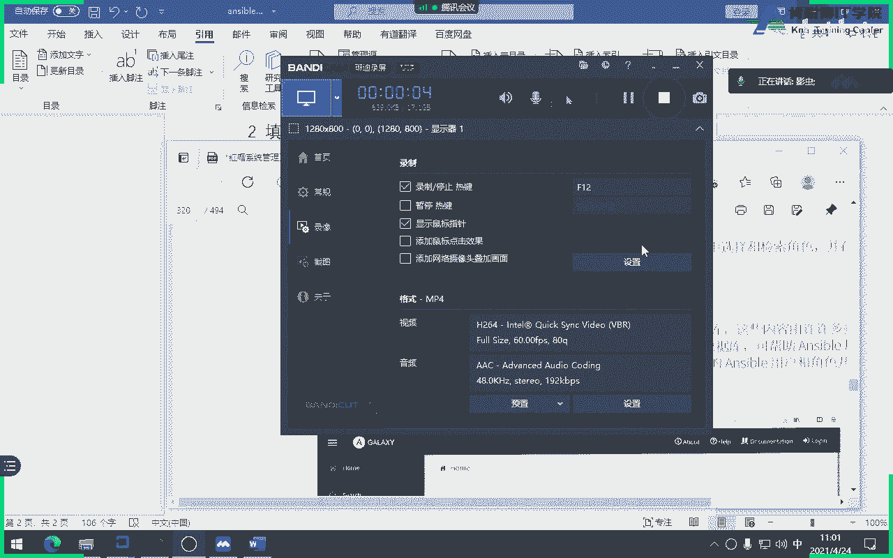
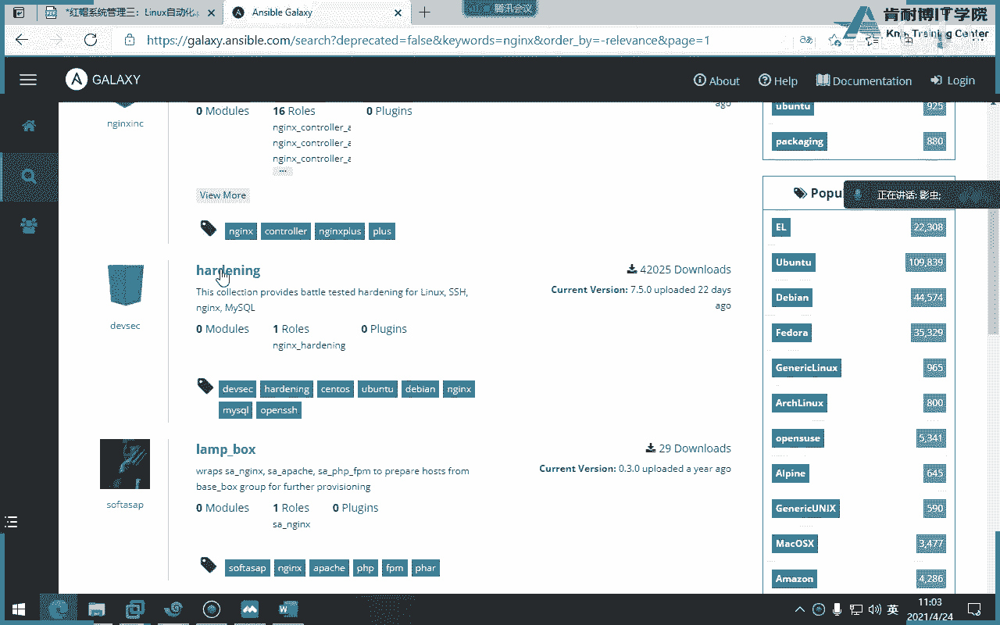
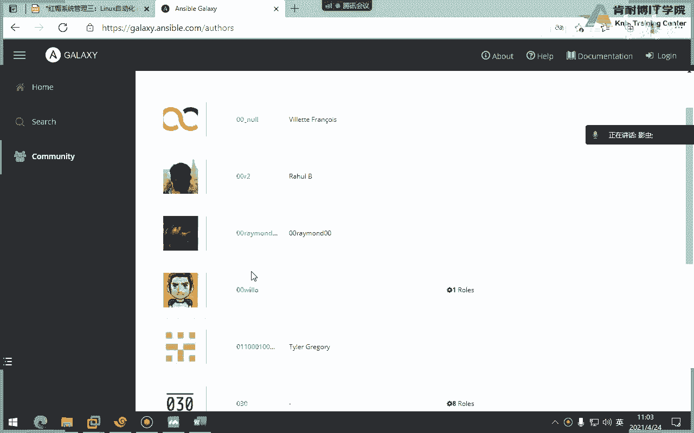
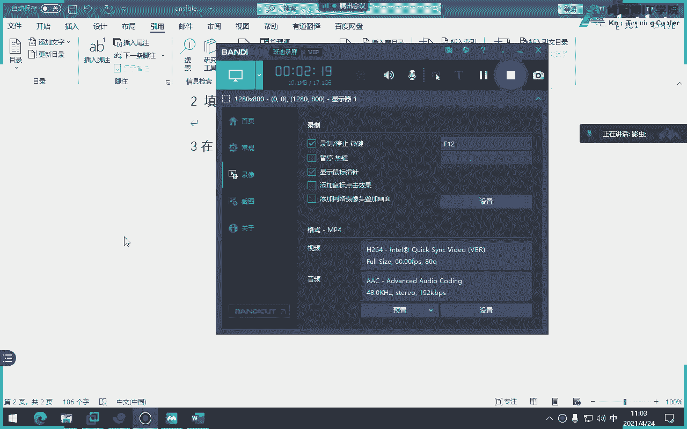
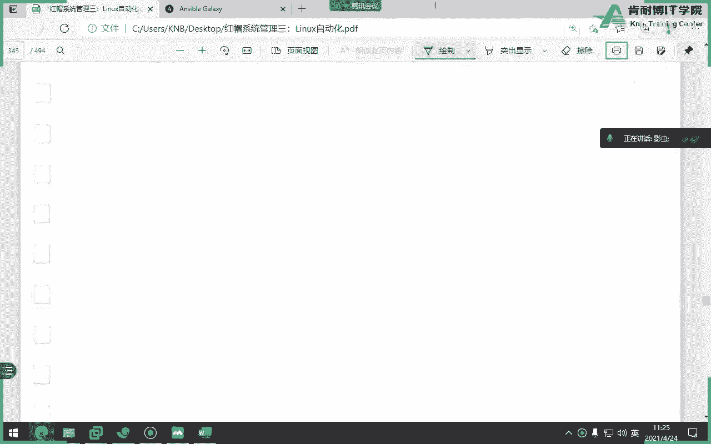

# Ansible 角色管理：P20：使用 Ansible Galaxy 角色 🚀



在本节课中，我们将学习如何使用 Ansible Galaxy 来获取和管理第三方角色。Ansible Galaxy 是一个公共的角色仓库，类似于代码托管平台，汇集了全球爱好者分享的数千个角色，可以极大地提高我们的自动化效率。

## 概述：什么是 Ansible Galaxy？

上一节我们介绍了如何创建自定义角色。本节中，我们来看看如何利用社区资源。Ansible Galaxy 是一个公共的、免费的在线仓库，用户可以上传自己编写的角色，也可以下载和使用他人分享的角色。其网址是 `galaxy.ansible.com`。







## 访问与搜索 Galaxy 角色

我们可以通过网页或命令行来查找所需的角色。

### 网页端搜索

在 Galaxy 网站上，你可以直接搜索角色，例如 `nginx`。搜索结果会显示角色的名称、描述、下载量、评分（满分5分）等信息。通常，下载量高、评分高的角色质量更可靠。

### 命令行搜索

如果没有网页或习惯使用命令行，可以使用 `ansible-galaxy` 命令进行搜索。**前提是主机必须能够连接互联网**。

以下是搜索 `redis` 角色的命令：
```bash
ansible-galaxy search redis --platforms el
```
参数 `--platforms el` 表示搜索适用于企业级 Linux（如 RHEL）的稳定版本。

要查看某个角色的详细信息，可以使用 `info` 子命令：
```bash
ansible-galaxy info username.redis
```
这将显示该角色的描述、活跃状态、下载量、许可证等信息。

## 安装 Galaxy 角色

找到合适的角色后，我们需要将其安装到本地才能使用。安装有两种主要方式。

### 方式一：直接安装

直接指定角色名进行安装。安装过程分为两步：首先从 Galaxy 仓库下载，然后在本地安装。

以下是安装命令，**必须使用 `-p` 选项指定安装目录**，通常就是项目的 `roles` 目录：
```bash
ansible-galaxy install username.redis -p roles/
```
**注意**：`-p` 是指定路径（Path），不是 `-d`。如果目标目录不存在，需要先创建。

### 方式二：通过需求文件安装

在更复杂的场景或考试中，常要求通过一个需求文件来批量安装角色。这种方式更规范，便于管理依赖。

1.  **创建需求文件**：文件名**必须**为 `requirements.yml`。
2.  **编写内容**：在文件中定义要安装的角色及其版本。

以下是一个 `requirements.yml` 文件的示例：
```yaml
# 安装特定版本的角色
- src: username.redis
  version: "1.5"

# 安装角色并重命名
- src: https://github.com/username/nginx_role.git
  version: "master"
  name: nginx_production

# 从 Git 仓库安装（考试常见）
- src: git@server.example.com:student/role_env.git
  scm: git
  version: master
  name: student.bash_env
```
**关键参数说明**：
*   `src`: 角色来源（Galaxy名、Git地址、URL等）。
*   `version`: 角色版本（如 `master`, `v1.0`）。
*   `name`: （可选）为安装后的角色重命名。
*   `scm`: 当 `src` 是 Git 仓库地址时，**必须**指定 `scm: git`。

3.  **执行安装**：使用以下命令根据需求文件安装角色。
```bash
ansible-galaxy install -r roles/requirements.yml -p roles/
```
**参数说明**：
*   `-r`: 指定需求文件（Requirements file）。
*   `-p`: 指定角色安装目录。

## 管理本地角色

安装后，我们还需要掌握一些基本的管理操作。

以下是列出已安装角色的命令：
```bash
ansible-galaxy list -p roles/
```

以下是删除一个已安装角色的命令：
```bash
ansible-galaxy remove username.redis -p roles/
```
无论是自定义角色还是 Galaxy 下载的角色，都需要在 Playbook 中通过 `roles` 关键字来调用使用。

## 实验：模拟考试场景 🧪

考试环境通常无法连接互联网，但会模拟一个本地的 Git 仓库供你下载角色。这要求你必须掌握通过 `requirements.yml` 文件从 Git 源安装角色的方法。

**实验步骤简述**：

1.  **初始化环境**：运行考题提供的 `lab` 命令，会在本地搭建一个模拟的 Git 仓库。
2.  **编写需求文件**：在 `roles/` 目录下创建 `requirements.yml`，内容指定模拟 Git 仓库的地址、版本 (`master`) 和重命名后的角色名 (`student.bash_env`)。
3.  **安装角色**：执行 `ansible-galaxy install -r roles/requirements.yml -p roles/` 完成安装。
4.  **使用角色**：在 Playbook 中引用 `student.bash_env` 角色。该角色功能是修改用户的环境变量（如 `PS1` 提示符）。
5.  **迭代与修复**：考题可能会让你切换到开发版本（如 `dev`），修改需求文件中的 `version`，并**强制重新安装**（使用 `--force` 参数）。之后可能需要修复角色中的错误（如变量名拼写错误），并重新运行 Playbook 以验证效果。

这个实验模拟了真实的开发流程：获取代码、部署、发现 Bug、修复、重新部署。

## 总结

本节课中我们一起学习了 Ansible Galaxy 的核心用法：
1.  **Galaxy 概念**：一个公共的、免费的 Ansible 角色仓库。
2.  **角色搜索**：可通过网站或 `ansible-galaxy search` 命令查找角色。
3.  **角色安装**：
    *   直接安装：`ansible-galaxy install <role_name> -p roles/`
    *   通过需求文件安装：编写 `requirements.yml`，使用 `ansible-galaxy install -r <file> -p roles/`
4.  **关键考点**：`requirements.yml` 的文件名必须拼写正确；从 Git 安装时务必加上 `scm: git`；考试环境通常模拟 Git 仓库。
5.  **角色管理**：使用 `list` 查看，使用 `remove` 删除。



掌握 Galaxy 能让你站在“巨人”的肩膀上，快速利用社区积累的最佳实践，是成为一名高效 DevOps 工程师的重要技能。