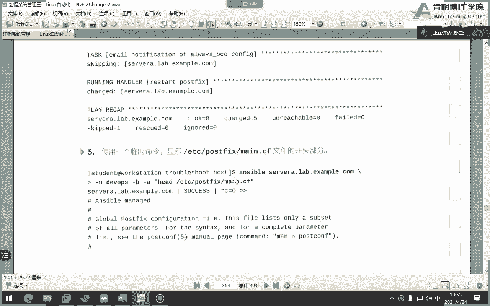

# Ansible管理：P21：23-Ansible 管理


## 概述

在本节课中，我们将学习如何使用Ansible自动化管理Linux系统中的各种任务。我们将涵盖软件包管理、用户与组管理、定时任务、文件系统操作、网络配置以及防火墙设置等核心模块的使用方法。通过本章的学习，你将能够编写Playbook来自动化完成这些常见的系统管理工作。

## 软件包管理 📦

上一节我们介绍了Ansible的基础知识，本节中我们来看看如何使用Ansible管理软件包。

### yum模块

`yum`模块用于在基于RPM的系统（如Red Hat、CentOS）上管理软件包。其核心参数如下：

*   **`state`**: 定义软件包状态。`present`或`installed`表示安装，`absent`或`removed`表示删除。
*   **`latest`**: 当`state=latest`时，表示将软件包更新到最新版本，等同于执行`yum update`命令。
*   **`name`**: 指定软件包名称。若要安装一个软件包组，需要在组名前加上`@`符号，例如 `@development`。

以下是一个安装并确保软件包为最新版本的示例：
```yaml
- name: 安装并更新nginx软件包
  yum:
    name: nginx
    state: latest
```

### 收集软件包信息

`package_facts`模块用于收集受管主机上已安装软件包的信息。收集到的信息会存储在名为`ansible_facts.packages`的变量中。

以下是使用该模块的示例：
```yaml
- name: 收集软件包信息
  package_facts:
    manager: auto

- name: 显示network-manager软件包信息
  debug:
    var: ansible_facts.packages['network-manager']
```

### 其他包管理模块

除了`yum`，Ansible还支持其他系统的包管理器：

*   **`dnf`**: Red Hat 8及更新版本的默认包管理器（与`yum`兼容）。
*   **`apt`**: 用于Debian/Ubuntu系统。
*   **`win_package`**: 用于Microsoft Windows系统。
*   **`package`**: 一个通用模块，可自动选择`yum`、`apt`等，但不够智能（例如，无法自动处理不同发行版中同一软件的不同包名，如Apache在Red Hat中叫`httpd`，在Ubuntu中叫`apache2`）。建议直接使用具体的模块。

### 配置Yum仓库

使用`yum_repository`模块可以管理Yum仓库源。

以下是配置一个仓库的示例。**请注意，此模块的参数每一句都不能省略**。
```yaml
- name: 配置AppStream仓库
  yum_repository:
    name: AppStream          # 仓库ID，非文件名
    description: AppStream Repository
    baseurl: http://content.example.com/rhel8.5/x86_64/dvd/AppStream
    gpgcheck: yes            # 启用GPG签名检查
    gpgkey: http://content.example.com/rhel8.5/x86_64/dvd/RPM-GPG-KEY-redhat-release # 公钥URL
    enabled: yes
```
**关键点**：
*   `file`参数指定生成的仓库配置文件名称（如`AppStream.repo`），`name`参数是配置文件内部的仓库ID。
*   若`gpgcheck: yes`，则必须通过`rpm_key`模块或`gpgkey`参数提供有效的GPG公钥来验证软件包签名。

## 用户与组管理 👥

现在我们已经学会了管理软件，接下来看看如何管理系统的用户和组。

### user模块

`user`模块用于管理用户账户。

以下是创建用户并设置属性的示例：
```yaml
- name: 创建用户zhangsan
  user:
    name: zhangsan
    uid: 2000
    group: developers  # 主组
    groups: wheel,admin  # 附加组，用逗号分隔。`append: yes`确保是追加而非覆盖。
    password: "{{ 'mypassword' | password_hash('sha512') }}" # 使用哈希密码
    shell: /bin/bash
    create_home: yes
    system: no
```
**`group`与`groups`的区别**：`group`指定用户的主要组（Primary Group），`groups`指定用户的附加组（Supplementary Groups）。

### group模块

`group`模块用于管理组。

以下是创建组的示例：
```yaml
- name: 创建developers组
  group:
    name: developers
    gid: 3000
    state: present
```

### 管理SSH密钥

`authorized_key`模块用于管理用户SSH授权密钥，实现免密码登录。

以下是为用户部署公钥的示例：
```yaml
- name: 为用户zhangsan部署SSH公钥
  authorized_key:
    user: zhangsan
    state: present
    key: "{{ lookup('file', '/path/to/public_key.pub') }}" # 从文件读取公钥内容
```

## 计划任务与服务管理 ⏰

管理好用户后，系统通常需要定时执行任务或管理后台服务。

### cron模块

`cron`模块用于管理周期性计划任务。

以下是一个添加cron任务的示例：
```yaml
- name: 每天11:45重启nginx服务
  cron:
    name: "Restart Nginx"
    minute: "45"
    hour: "11"
    job: "systemctl restart nginx"
    user: root
```

### at模块

`at`模块用于管理一次性计划任务。**必须指定时间单位**。

以下是一个添加at任务的示例：
```yaml
- name: 20分钟后删除临时用户
  at:
    command: "userdel -r temp_user"
    units: minutes  # 指定单位
    count: 20       # 20个单位后执行
    unique: yes     # 确保任务唯一
```

### service模块

`service`模块用于管理系统服务。在RHEL8中，虽然推荐使用`systemd`，但`service`模块仍可使用。

以下是管理服务的两种写法示例：
```yaml
# 传统service写法（考试中更直观常用）
- name: 确保httpd服务启动并开机自启
  service:
    name: httpd
    state: started
    enabled: yes

# 使用systemd的写法
- name: 确保httpd服务启动并开机自启 (systemd)
  systemd:
    name: httpd
    state: started
    enabled: yes
    daemon_reload: yes  # 重要：修改服务单元文件后需重载
```

## 文件、分区与逻辑卷管理 💾

自动化运维中，存储管理是重要的一环。本节将学习如何管理磁盘分区、逻辑卷和文件系统。

### parted模块

`parted`模块用于磁盘分区。**分区大小单位需大写**。

以下是在`/dev/vdb`上创建分区的示例：
```yaml
- name: 在/dev/vdb上创建10GiB的主分区
  parted:
    device: /dev/vdb
    number: 1
    state: present
    part_end: 10GiB  # 单位：GiB, MiB, KiB
```

### lvg与lvol模块

`lvg`模块用于管理卷组（Volume Group），`lvol`模块用于管理逻辑卷（Logical Volume）。

以下是创建VG和LV的完整流程示例：
```yaml
- name: 创建物理卷(PV)
  lvg:
    vg: myvg
    pvs: /dev/vdb1  # 使用已存在的分区
    pesize: 32      # 物理块大小，单位MB

- name: 在myvg上创建名为mylv，大小为5GiB的逻辑卷
  lvol:
    vg: myvg
    lv: mylv
    size: 5g        # 逻辑卷大小，此处单位可用小写g/m/k
    state: present
```

### filesystem与mount模块

`filesystem`模块用于格式化文件系统，`mount`模块用于挂载。

以下是格式化和挂载逻辑卷的示例：
```yaml
- name: 将/dev/myvg/mylv格式化为xfs
  filesystem:
    fstype: xfs
    dev: /dev/myvg/mylv

- name: 挂载逻辑卷到/data目录
  mount:
    path: /data
    src: /dev/myvg/mylv
    fstype: xfs
    state: mounted  # 同时写入/etc/fstab
```
**注意**：`mount`模块的`path`参数指定的挂载点目录**需要预先存在**，否则任务会失败。

### 创建Swap空间

可以使用`lvol`模块创建逻辑卷作为Swap，也可以使用文件。

以下是使用逻辑卷创建Swap的示例：
```yaml
- name: 创建1GiB的Swap逻辑卷
  lvol:
    vg: myvg
    lv: swap_lv
    size: 1g

- name: 格式化Swap并激活
  filesystem:
    fstype: swap
    dev: /dev/myvg/swap_lv
  shell: |
    mkswap /dev/myvg/swap_lv
    swapon /dev/myvg/swap_lv
```

## 网络与防火墙配置 🌐

最后，我们来看看如何使用Ansible配置网络和防火墙，这是自动化配置服务器的关键步骤。

### nmcli模块

`nmcli`模块通过NetworkManager命令行工具管理网络连接，这是RHEL8的默认网络管理方式。

以下是配置一个以太网连接的示例：
```yaml
- name: 配置eth0网卡
  nmcli:
    conn_name: eth0
    ifname: eth0
    type: ethernet
    ip4: 192.168.1.100/24
    gw4: 192.168.1.1
    dns4:
      - 8.8.8.8
      - 8.8.4.4
    state: present
    autoconnect: yes
```

### hostname模块

`hostname`模块用于修改系统主机名。

以下是修改主机名的示例：
```yaml
- name: 设置主机名为server01.example.com
  hostname:
    name: server01.example.com
```

### firewalld模块

`firewalld`模块用于管理firewalld防火墙。**为使规则立即生效，通常需要添加`immediate: yes`参数**。

以下是开放HTTP服务端口的示例：
```yaml
- name: 在public区域永久开放HTTP端口
  firewalld:
    zone: public
    service: http
    permanent: yes
    immediate: yes  # 立即生效
    state: enabled
```

## 事实收集与调试 🐛

在编写和运行Playbook时，收集系统信息和调试排错是必不可少的技能。

### 收集特定事实

`setup`模块用于收集受管主机的事实（变量）。使用`gather_subset`和`filter`参数可以过滤出需要的信息。

以下是指定收集网络相关事实的示例：
```yaml
- name: 收集网络相关事实
  setup:
    gather_subset: network
    filter: ansible_*  # 过滤出以ansible_开头的事实变量
```

### Playbook调试与排错

运行Playbook时，可以使用以下参数进行调试：
*   **`--syntax-check`**: 只进行语法检查，不执行。
*   **`--check` 或 `-C`**: 模拟运行（“空运行”），显示会发生的更改但不实际执行。
*   **`--diff` 或 `-D`**: 显示文件更改前后的差异。
*   **`--step` 或 `-S`**: 逐步执行，每个任务前需要确认。
*   **`-v`, `-vv`, `-vvv`**: 增加输出信息的详细程度。`-v`通常足以提供有用的排错信息。

当任务因权限不足失败时，需要在Playbook或任务中使用`become`提权：
```yaml
- hosts: webservers
  become: yes  # 在整个Playbook中提权
  tasks:
    - name: 安装软件包
      yum:
        name: httpd
        state: present
```

也可以在命令行中指定：
```bash
ansible-playbook playbook.yml --become --ask-become-pass
```

## 总结



本节课中我们一起学习了Ansible自动化管理的核心模块。我们涵盖了从软件包安装、用户组管理、定时任务设置，到磁盘分区、逻辑卷管理、文件系统操作，再到网络配置和防火墙规则设置的全流程。掌握这些模块的使用，并熟练运用事实收集与调试技巧，是编写高效、可靠Ansible Playbook的基础。请务必通过实践练习来巩固这些知识，特别是`yum_repository`、`parted`、`lvg`/`lvol`等考试和实际工作中的重点模块。