# Ansible 教程：第六章：文件管理与 Jinja2 模板 🗂️

在本章中，我们将学习 Ansible 中与文件和目录操作相关的核心模块，以及如何使用 Jinja2 模板来动态生成配置文件。这些技能对于自动化配置管理至关重要。

## 概述

上一章我们完成了 Ansible 基础任务的学习。本章将聚焦于两个主要部分：一是使用 Ansible 模块对文件和目录进行各种操作；二是学习 Jinja2 模板引擎，它能帮助我们灵活地生成和管理配置文件。本章内容实践性很强，我们将通过具体示例来掌握每个模块的用法。

---

## 第一部分：文件与目录操作模块 📄

Ansible 提供了多个模块来高效地管理远程主机上的文件和目录。以下是几个最常用和重要的模块。

### lineinfile 模块：单行编辑

`lineinfile` 模块用于确保文件中存在特定的一行内容。它非常适合修改单行配置。

**基本语法示例：**
```yaml
- name: 确保 /etc/hosts 文件中包含一行特定内容
  lineinfile:
    path: /etc/hosts
    line: ‘192.168.1.100 myhost.example.com‘
```
执行此任务后，目标主机的 `/etc/hosts` 文件将新增指定的一行，不会删除其他内容。

该模块的强大之处在于支持**正则表达式**来精确定位要修改的行。例如，使用 `regexp` 参数可以匹配以特定模式开头的行并进行替换，这在考试和实际工作中都是常见考点。

### blockinfile 模块：多行（块）编辑

与 `lineinfile` 不同，`blockinfile` 模块用于插入、修改或标记一个多行的文本块。

**基本语法示例：**
```yaml
- name: 在文件中插入一个配置块
  blockinfile:
    path: /etc/ssh/sshd_config
    block: |
      Match User ansible
        PasswordAuthentication no
```
使用此模块时，Ansible 会自动在插入的文本块周围添加特定的开始和结束标记注释（例如 `# BEGIN ANSIBLE MANAGED BLOCK` 和 `# END ANSIBLE MANAGED BLOCK`），以便于后续管理。

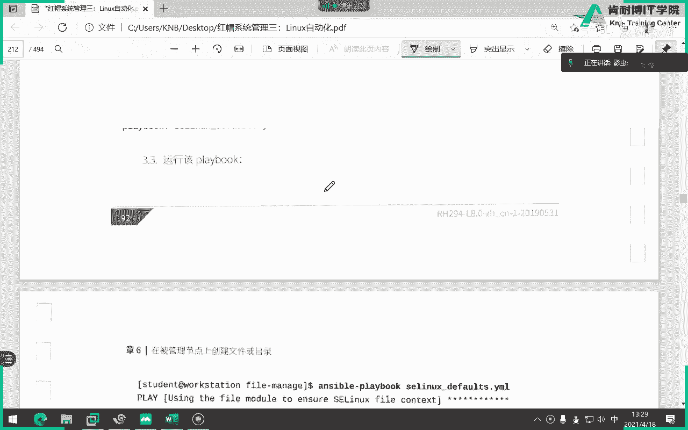

### copy 模块：文件复制

`copy` 模块用于将控制节点上的文件复制到受管主机上。

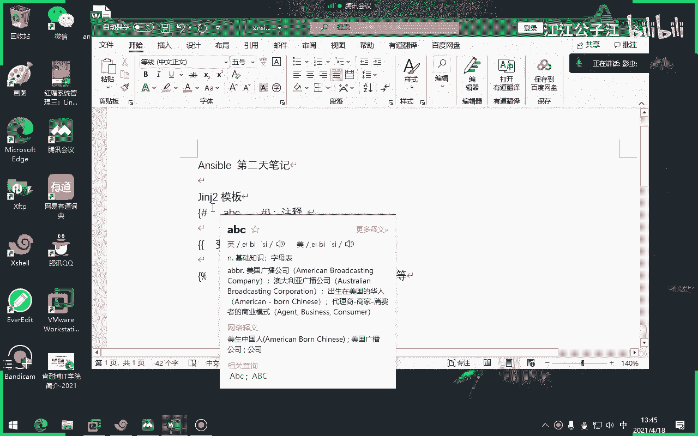

**核心参数：**
*   `src`: 源文件路径（在控制节点上）。
*   `dest`: 目标文件路径（在受管主机上）。
*   `content`: 直接指定文件内容，而不是复制现有文件。

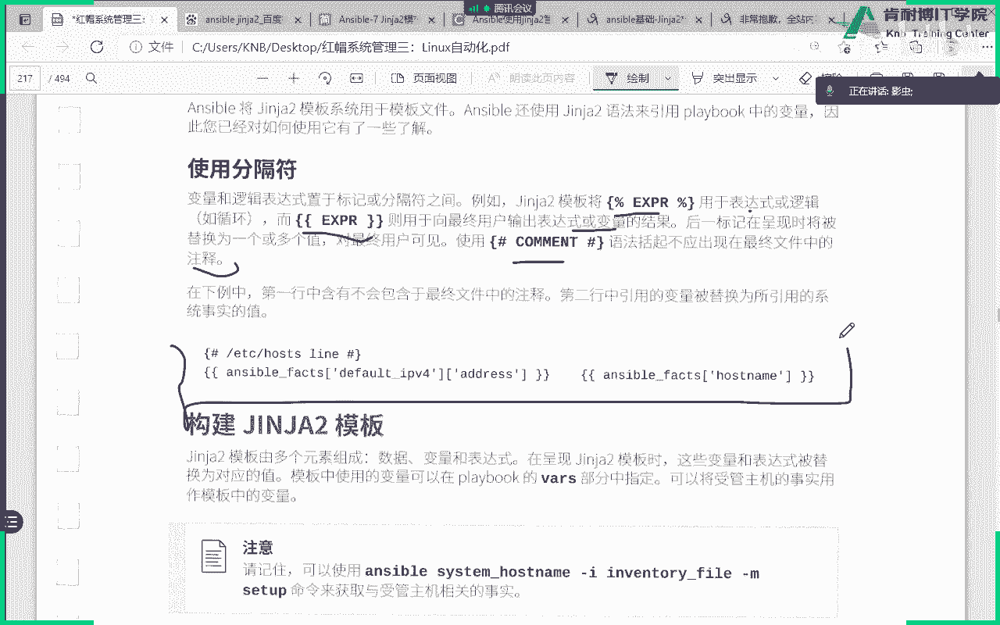

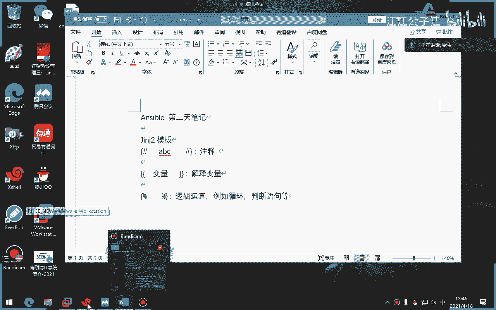


**示例：**
```yaml
- name: 复制本地文件到远程主机
  copy:
    src: /local/path/config.conf
    dest: /remote/path/config.conf
    owner: root
    group: root
    mode: ‘0644‘

- name: 直接创建带有内容的文件
  copy:
    dest: /tmp/message.txt
    content: |
      这是第一行。
      这是第二行。
```

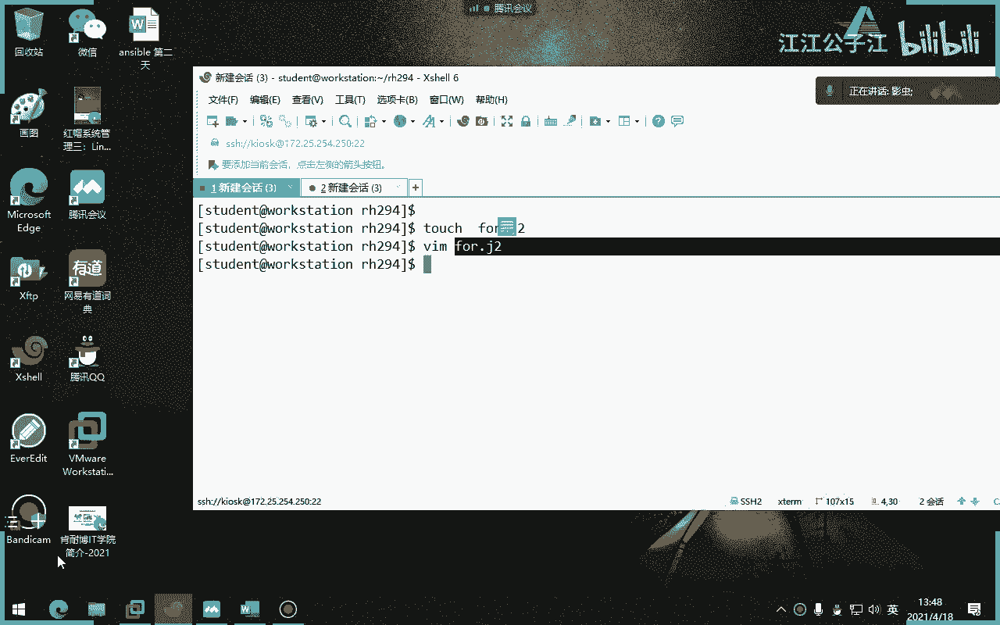

### fetch 模块：拉取文件

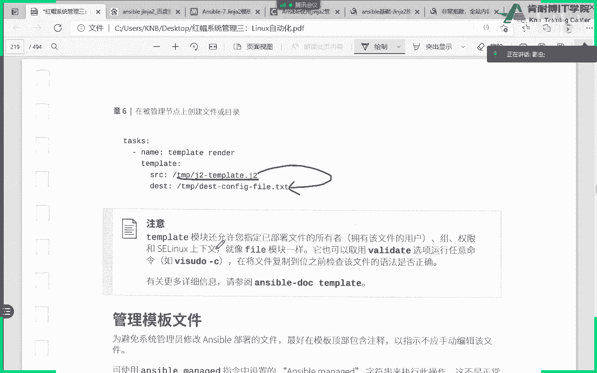

`fetch` 模块与 `copy` 方向相反，用于从受管主机拉取文件到控制节点。这在收集日志或备份文件时非常有用。

### file 模块：全能文件管理

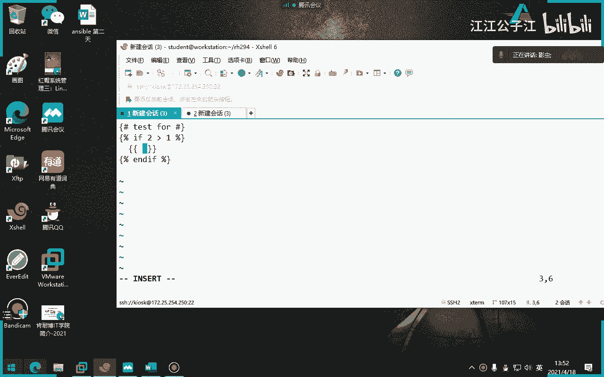

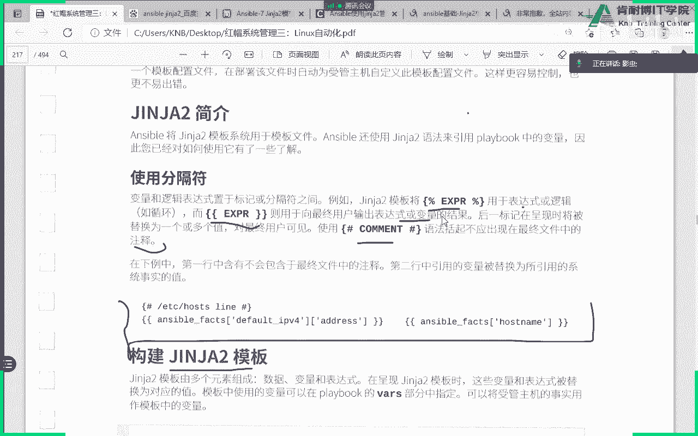

`file` 模块是文件管理的瑞士军刀，功能非常强大，可以处理大多数文件和目录操作。

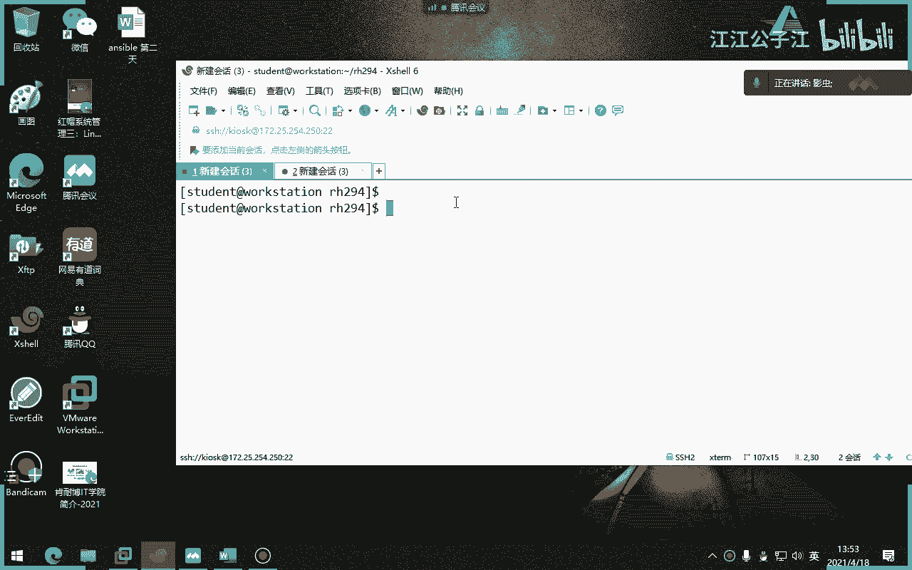

**它可以实现的功能包括：**
*   创建文件或目录 (`state: touch` 或 `state: directory`)。
*   删除文件或目录 (`state: absent`)。
*   修改权限 (`mode`)、所有者 (`owner`)、所属组 (`group`)。
*   创建符号链接 (`state: link`)。
*   修改 SELinux 上下文 (`seuser`, `serole`, `setype`, `selevel`)。

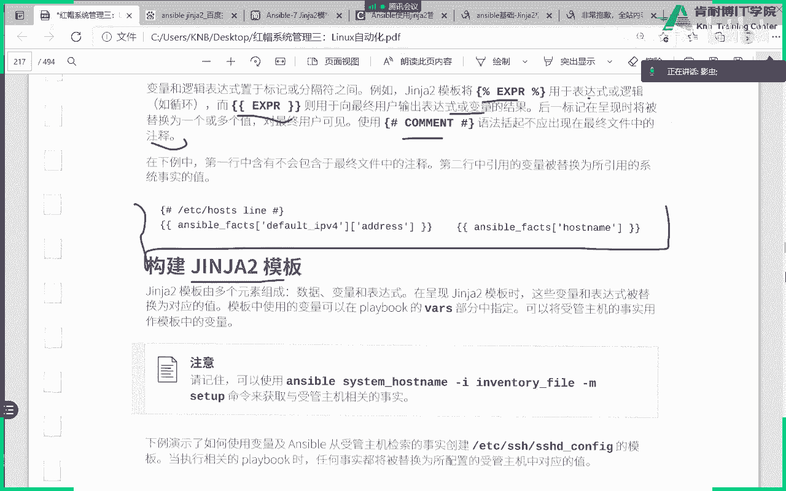

**示例：**
```yaml
- name: 创建一个目录并设置权限
  file:
    path: /opt/myapp/data
    state: directory
    owner: appuser
    group: appgroup
    mode: ‘0755‘
```
考试中经常会考察使用 `file` 模块完成各种文件操作任务。

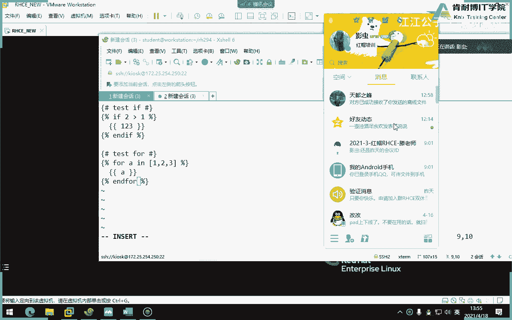

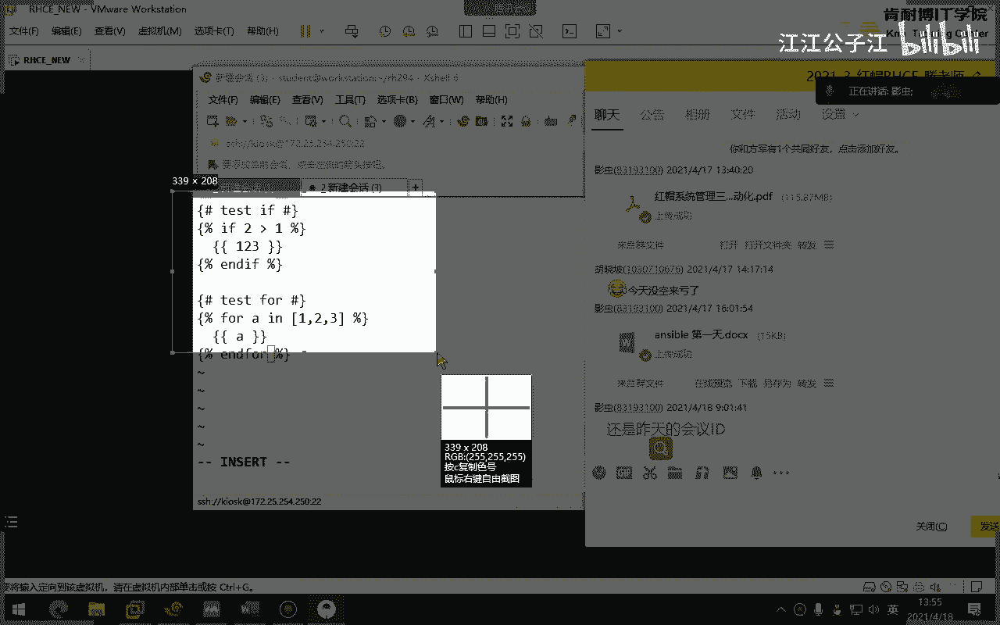

### synchronize 模块：目录同步

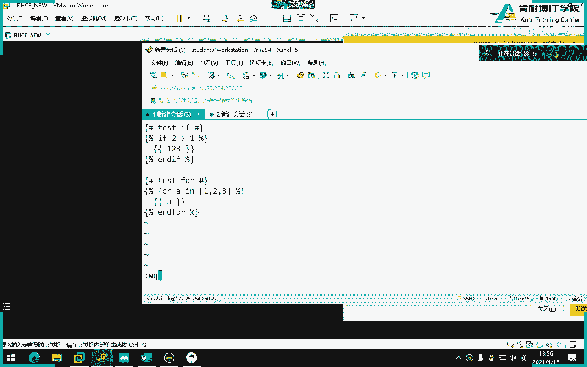

`synchronize` 模块是 `rsync` 命令的 Ansible 封装，用于高效地在控制节点和受管主机之间同步目录。它支持增量备份，非常适合大型文件或定期备份场景。

**它与 `copy` 模块的主要区别在于：** `synchronize` 是高效的增量同步工具，而 `copy` 是简单的文件复制。

---

## 第二部分：Jinja2 模板 🧩

在管理大量主机时，经常需要根据主机变量动态生成配置文件。Jinja2 模板引擎正是为此而生。

### 什么是 Jinja2 模板？

Jinja2 是一个基于 Python 的模板引擎。在 Ansible 中，它允许我们在模板文件中嵌入变量和逻辑，然后为不同主机渲染出最终的文件内容。

### 模板语法基础

Jinja2 模板使用特定的语法标记：

1.  **注释**：被 `{# ... #}` 包裹的内容不会出现在最终输出中。
    ```
    {# 这是一行注释，不会输出 #}
    ```

2.  **变量替换**：使用双花括号 `{{ ... }}` 来输出变量的值。
    ```
    服务器IP是：{{ ansible_default_ipv4.address }}
    ```

3.  **控制结构**：使用 `` 来编写条件判断、循环等逻辑。
    ```
    
    package: httpd
    
    package: apache2
    
    ```

### 如何使用模板？

使用 Jinja2 模板分为两步：

**第一步：创建模板文件**
模板文件通常以 `.j2` 为后缀。例如，创建一个 `hosts.conf.j2`：
```
{# 为清单中每个主机生成一行记录 #}

{{ hostvars[host][‘ansible_default_ipv4‘][‘address‘] }} {{ hostvars[host][‘ansible_hostname‘] }}

```

**第二步：使用 `template` 模块部署**
`template` 模块负责将模板文件渲染后传输到受管主机。
```yaml
- name: 使用模板生成 hosts 文件
  template:
    src: hosts.conf.j2
    dest: /etc/myhosts.conf
```
执行后，`/etc/myhosts.conf` 文件将包含所有主机的 IP 和主机名。

### 动态清单简介

在大型或动态环境中，主机信息可能频繁变化（例如云环境）。静态清单文件维护起来会很困难。Ansible 支持**动态清单**，即通过一个脚本（通常是 Python 脚本）在运行时自动获取主机列表。

**关键点：**
*   动态清单脚本必须输出 JSON 格式的清单数据。
*   可以使用 `ansible-inventory -i inventory_script --list` 命令来验证脚本输出。
*   在静态清单中引用动态清单生成的组时，需要先在静态清单中为该组定义一个**占位符**（即使内容为空），否则会报错。

**示例（静态清单中引用动态组）：**
```
[static_webservers]
web1.example.com

# 这是动态组 ‘cloud_servers‘ 的占位符
[cloud_servers]

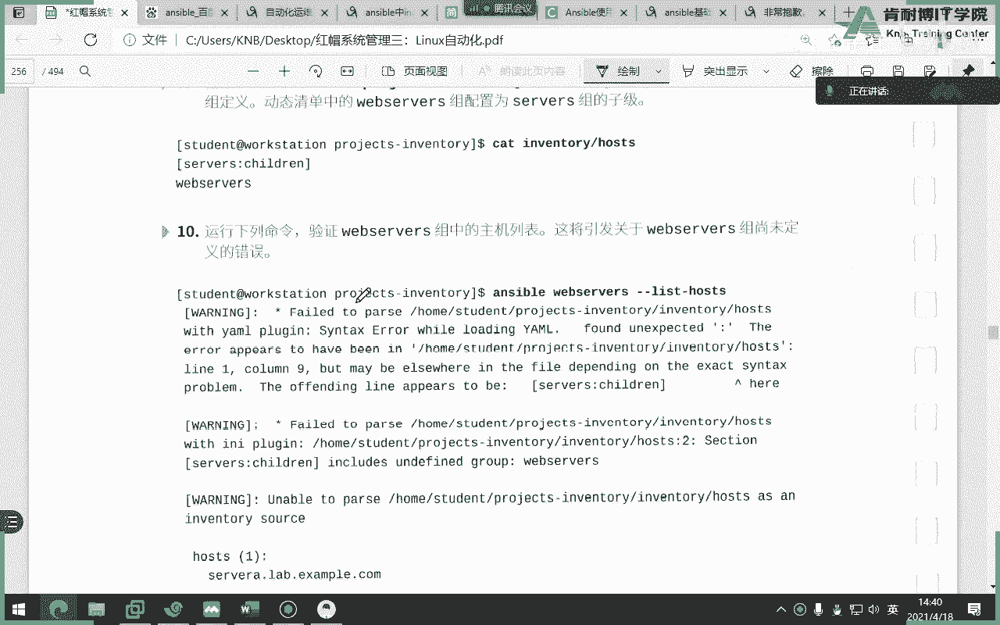

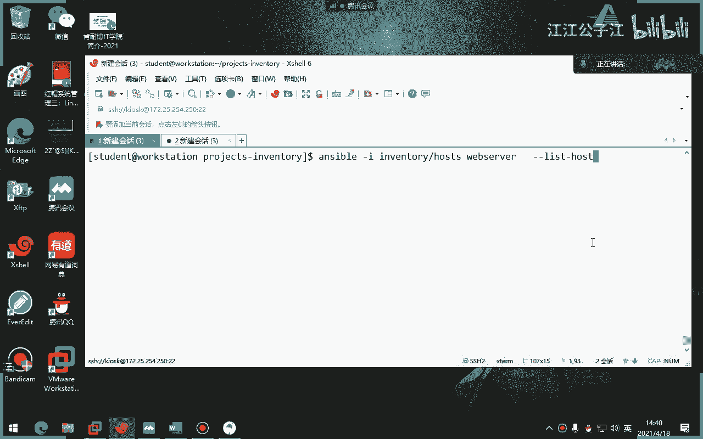

# 嵌套组，包含静态和动态的成员
[all_servers:children]
static_webservers
cloud_servers
```

---

## 第三部分：管理大型项目 ⚙️

当 Playbook 变得庞大复杂时，我们需要一些方法来优化其结构和执行。

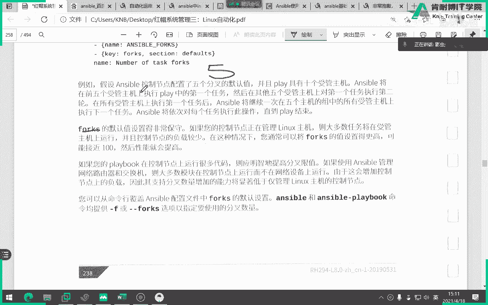

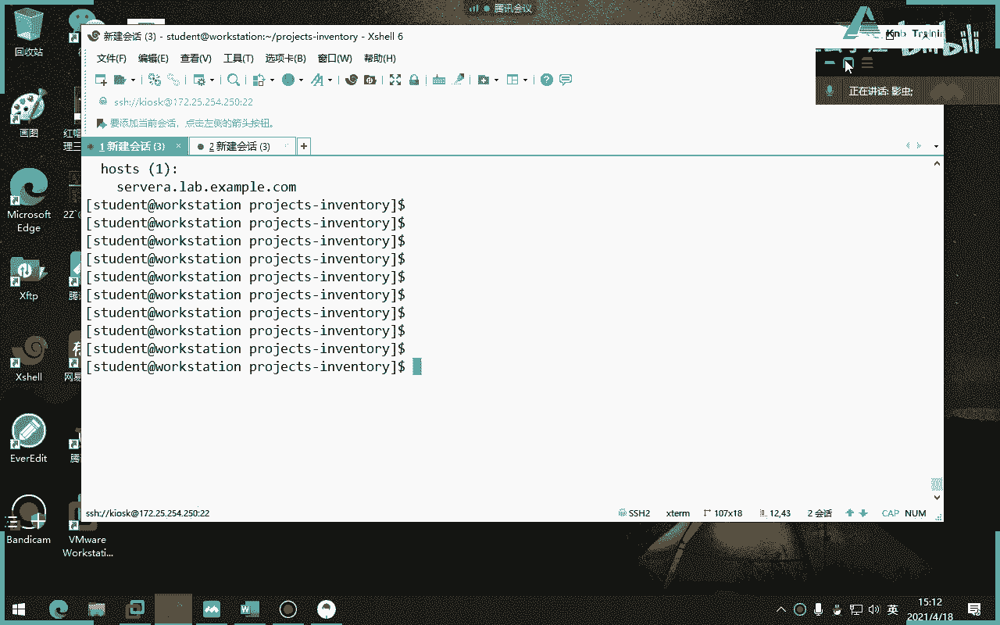

### 并行执行：`forks` 与 `serial`

*   **`forks`**：在 `ansible.cfg` 中设置，控制 Ansible 控制节点**同时连接多少台受管主机**执行任务。默认是 5。增加此值可以提高执行速度，但也会增加控制节点的负载。
    ```
    [defaults]
    forks = 20
    ```

*   **`serial`**：在 Playbook 的 Play 级别设置，控制**分批执行**。例如，在滚动更新应用时，先更新一批主机，成功后再更新下一批，可以避免服务全部中断。
    ```yaml
    - hosts: webservers
      serial: 2 # 每次只对2台主机执行整个Play
      tasks:
        - name: 重启服务
          service:
            name: nginx
            state: restarted
    ```

### 包含与导入 Playbook


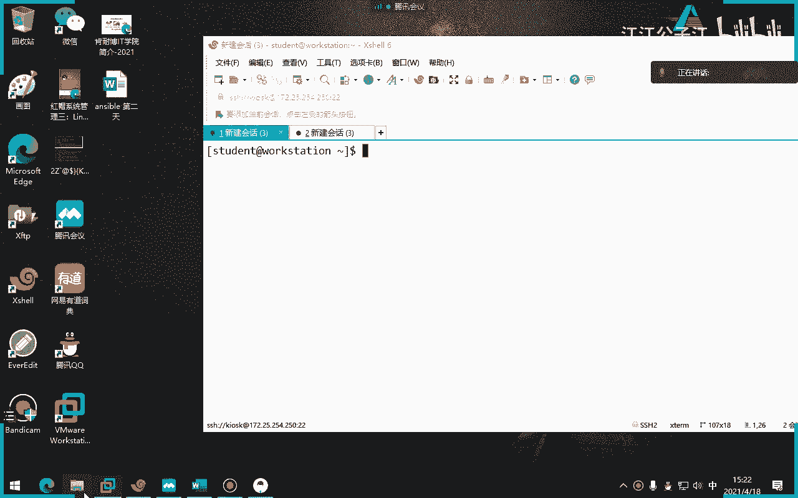

为了复用和组织代码，可以将大型 Playbook 拆分成多个小文件。

*   **`import_playbook`**：在 Playbook 级别进行静态导入，类似于 `include` 在许多编程语言中的作用。它在解析阶段就导入。
    ```yaml
    # site.yml
    - import_playbook: webservers.yml
    - import_playbook: dbservers.yml
    ```

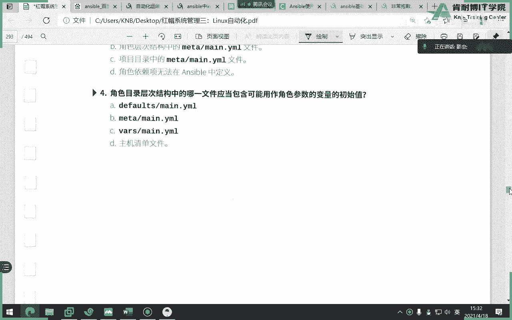

*   **`include_tasks`** 和 **`import_tasks`**：在任务级别包含其他任务文件。两者区别在于动态与静态，`include_tasks` 可以在运行时根据条件决定是否包含，更灵活。

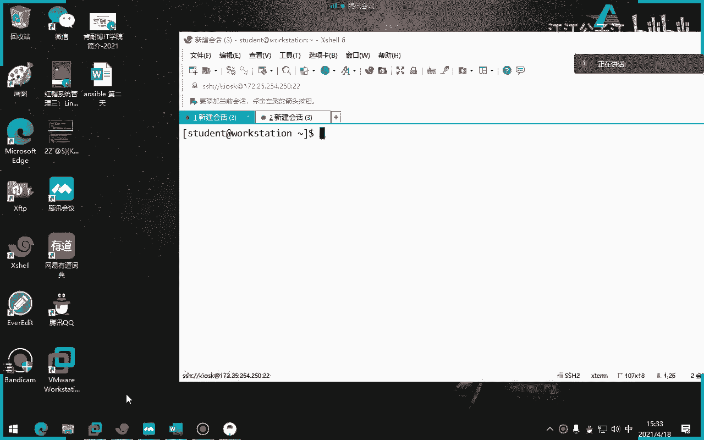

---

## 总结 🎯

在本章中，我们一起学习了 Ansible 的核心文件管理技能和高级功能：

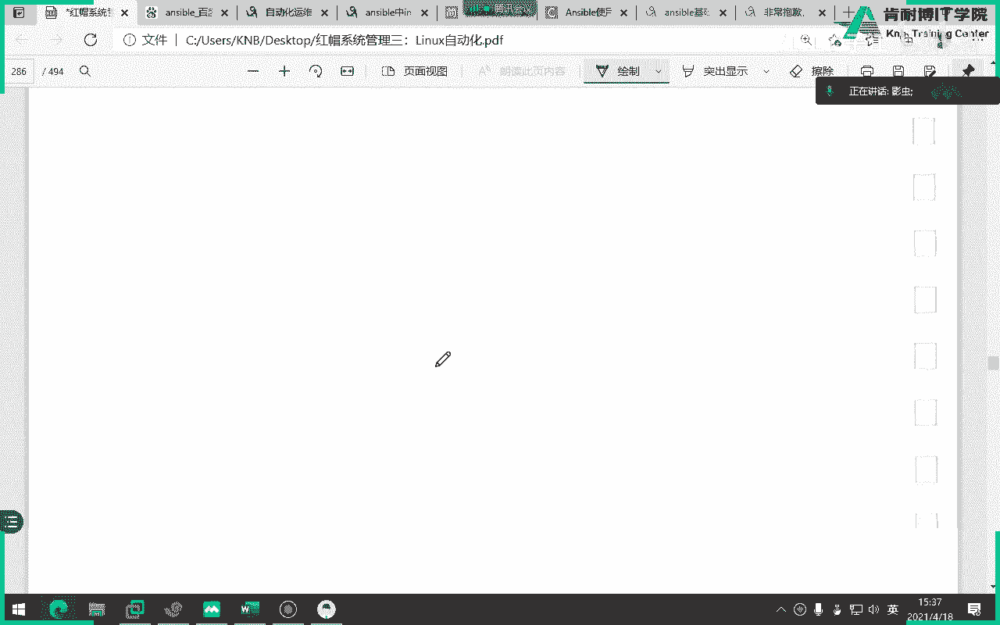

1.  **文件操作**：掌握了 `lineinfile`, `blockinfile`, `copy`, `fetch`, `file`, `synchronize` 等关键模块的用途，能够完成文件的增删改查、同步和属性管理。
2.  **Jinja2 模板**：理解了模板引擎的工作原理，学会了使用 `{{ }}` 输出变量、`` 编写逻辑，并通过 `template` 模块动态生成配置文件，这是实现配置差异化的关键。
3.  **管理大型项目**：了解了动态清单的概念，以及如何使用 `forks`、`serial` 参数控制任务执行策略，并通过 `import_playbook` 等方式组织复杂的 Playbook 结构。


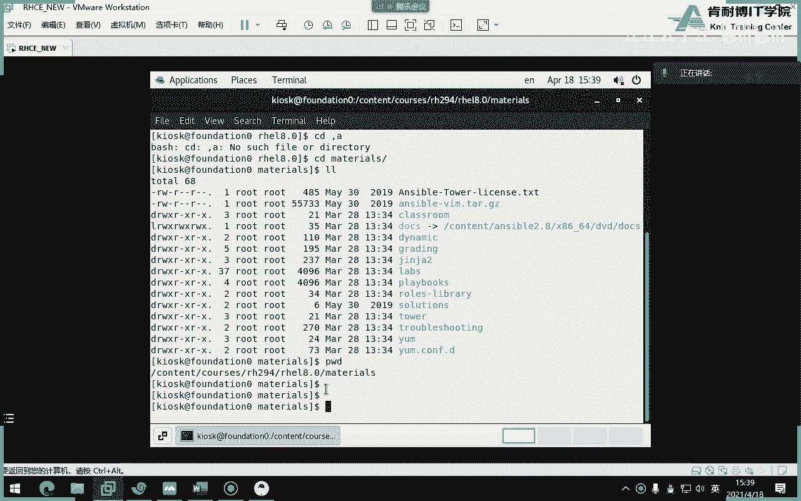

这些知识将极大地提升你编写高效、可维护的 Ansible 自动化脚本的能力。建议通过教材中的实验进行练习，特别是文件操作和 Jinja2 模板部分，它们是 RHCE 认证考试和实践中的重点。