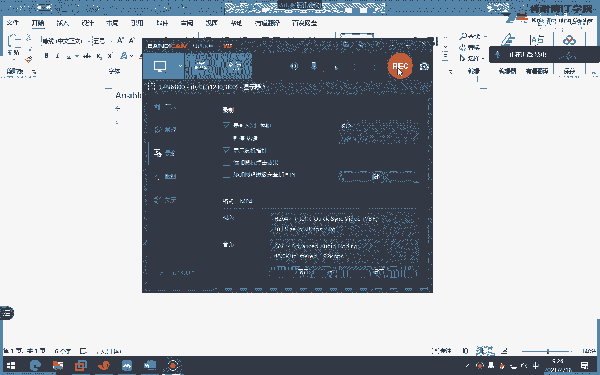
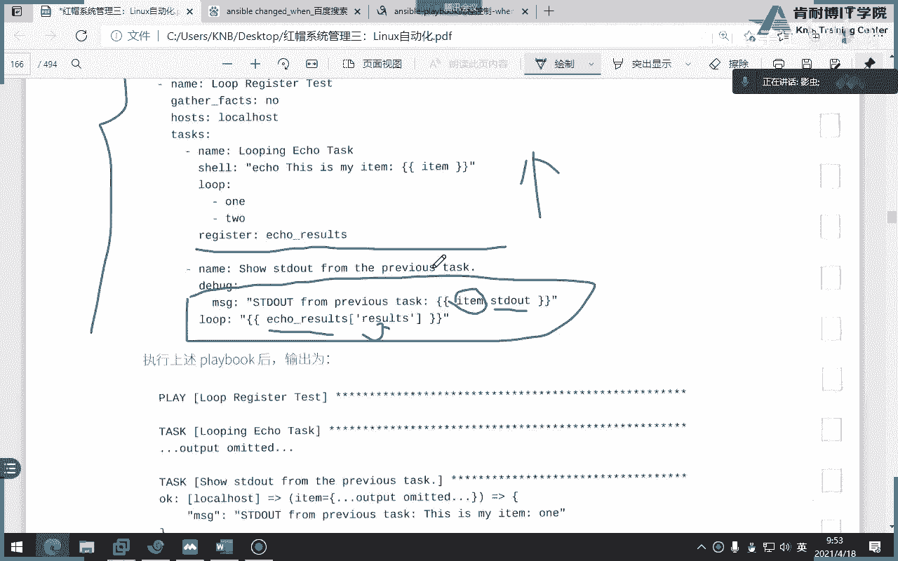
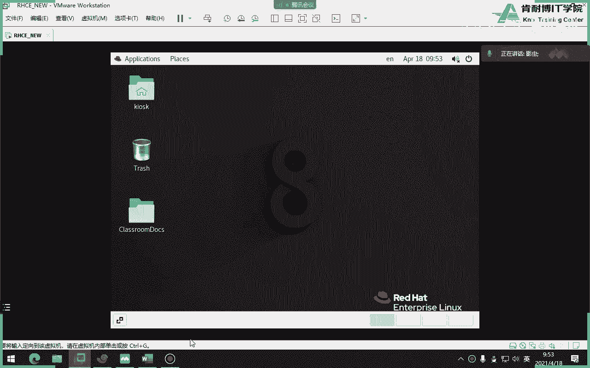
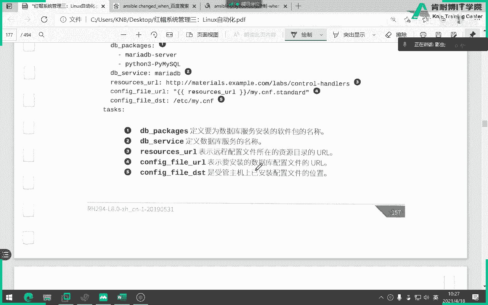
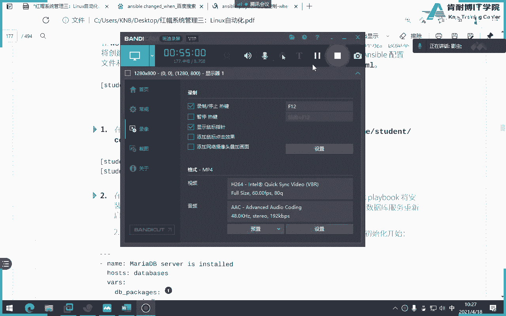
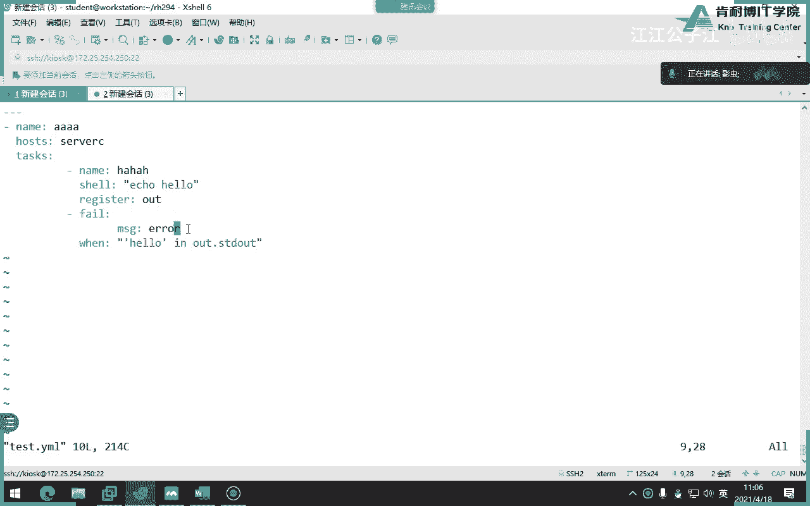
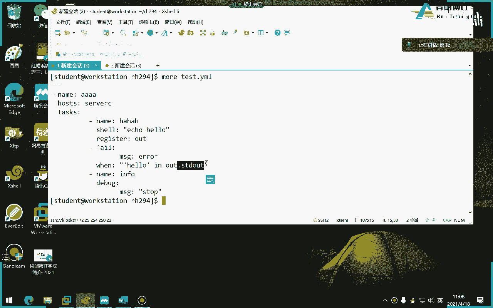
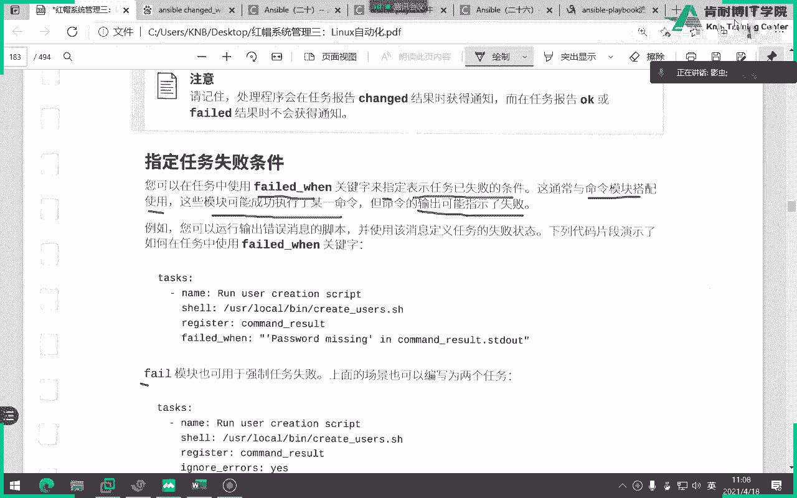
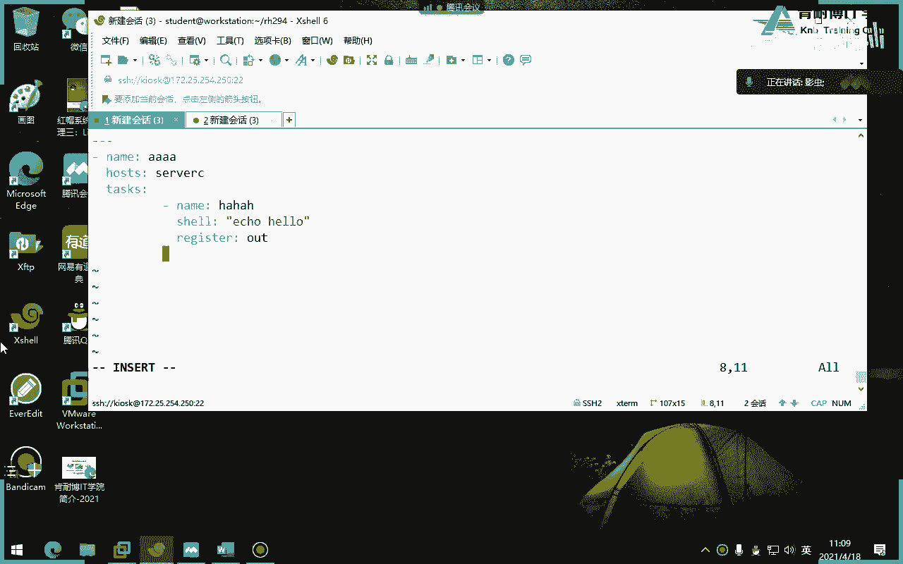
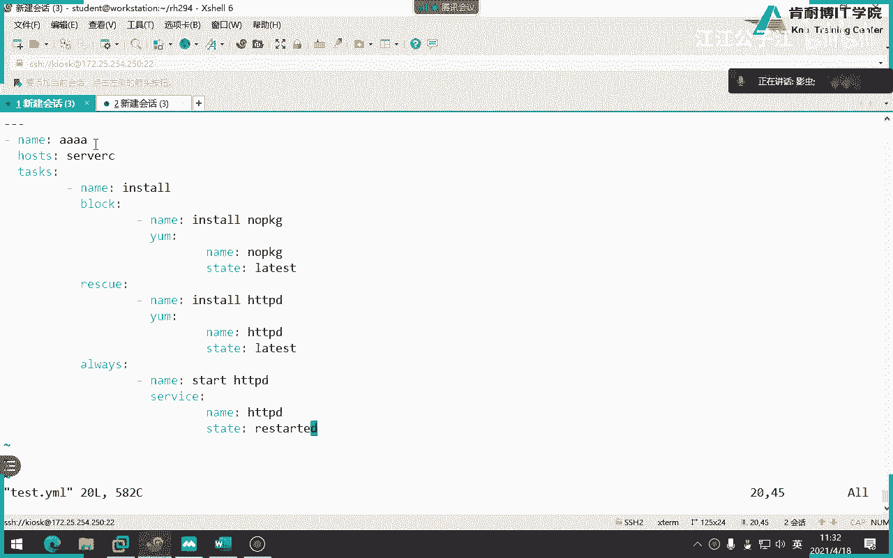

# Ansible教程：第五章：循环与条件判断



在本章中，我们将学习如何在Ansible Playbook中使用循环和条件判断语句来控制任务的执行流程。这将使我们的自动化脚本更加灵活和智能。

---

## 循环实施任务控制 🔄

上一节我们介绍了Playbook的基本结构。本节中，我们来看看如何使用循环来重复执行相似的任务。

循环用于处理需要重复执行但参数不同的任务。在Ansible中，我们使用 `loop` 关键字来实现循环。

**核心语法**：
```yaml
- name: 任务名称
  module_name:
    parameter: "{{ item }}"
  loop:
    - 值1
    - 值2
```
其中，`{{ item }}` 是一个特殊变量，在每次循环迭代中，它会依次被替换为 `loop` 列表中的值。

以下是循环的几种常见用法：

*   **基本列表循环**：循环一个简单的值列表。
*   **循环变量**：先定义一个包含多个值的变量，然后循环这个变量。
*   **循环字典列表**：当每个任务需要多个参数时，可以循环字典列表，使用 `item.key` 的形式引用值。

---





## 条件判断语句 ⚖️

学会了循环，我们再来看看如何根据特定条件来决定是否执行任务。这通过 `when` 语句实现。

`when` 语句用于在满足特定条件时才执行任务。条件可以是变量、事实（facts）或任何能得出布尔值（真或假）的表达式。

**核心语法**：
```yaml
- name: 任务名称
  module_name:
    parameter: value
  when: 条件表达式
```

以下是条件判断的几种情况：

*   **基于变量值**：例如 `when: my_variable == "some_value"`。
*   **检查变量是否被定义**：使用 `is defined` 或 `is not defined`。
*   **结合事实变量**：使用 `ansible_facts` 中的信息作为条件，例如检查操作系统类型或内存大小。
*   **逻辑组合**：使用 `and`（与）、`or`（或）以及括号 `()` 来组合多个条件。

---

## 处理程序（Handlers）与任务错误处理 🚨

条件判断让我们能控制任务是否执行。但有时，我们需要在任务状态发生**改变**时，才触发另一个任务（如重启服务），这就需要用到**处理程序**。

处理程序也是任务，但它只在被其他任务“通知”（notify）时才会执行。通常用于系统配置变更后的重启操作。

**核心语法**：
```yaml
tasks:
  - name: 修改配置文件
    template:
      src: template.j2
      dest: /etc/service.conf
    notify: 重启服务  # 通知处理程序





handlers:
  - name: 重启服务    # 与notify的名字对应
    service:
      name: myservice
      state: restarted
```

接下来，我们看看如何处理任务执行中的错误，防止单个任务失败导致整个Playbook中止。

*   **忽略错误**：使用 `ignore_errors: yes`，即使任务失败，Playbook也会继续执行后续任务。
*   **强制失败**：使用 `fail` 模块配合 `when` 条件，可以主动让任务在满足特定条件时失败。
*   **改变任务报告状态**：使用 `changed_when` 可以手动控制任务是否报告为“已更改”状态，这会影响处理程序的触发。





---





## 任务逻辑分组 🧱

最后，我们学习一种更高级的错误控制结构：`block`、`rescue` 和 `always`。它们可以将多个任务作为一个逻辑单元进行错误处理。

*   **block**：定义要执行的主要任务块。
*   **rescue**：当 `block` 中的**任何**任务失败时，才会执行这里的任务。
*   **always**：无论 `block` 成功还是失败，**总是**会执行这里的任务。

**核心结构**：
```yaml
- block:
    - name: 任务1
      debug:
        msg: "执行主要操作"
    - name: 任务2
      command: /bin/false  # 这个命令会失败

  rescue:
    - name: 救援任务
      debug:
        msg: "主要操作失败，执行救援"

  always:
    - name: 清理任务
      debug:
        msg: "无论成败，总是执行清理"
```

---

## 总结 📝

本节课中我们一起学习了Ansible Playbook中控制任务流的核心方法：

1.  **循环 (`loop`)**：用于高效地重复执行相似任务。
2.  **条件判断 (`when`)**：根据变量、事实或表达式的结果决定是否执行任务。
3.  **处理程序 (`handlers`)**：用于在任务状态发生改变后触发特定操作（如重启服务）。
4.  **错误处理**：包括忽略错误 (`ignore_errors`)、强制失败 (`fail`) 和控制状态报告 (`changed_when`)。
5.  **逻辑分组 (`block`, `rescue`, `always`)**：将任务分组，实现更复杂的错误处理和确保清理操作总能执行。



掌握这些控制语句，你将能编写出更健壮、更灵活、更智能的自动化剧本。