# RHCE8认证课程：P9：第五天 Shell脚本与Yum源配置

## 概述

在本节课中，我们将学习Yum软件包管理器的进阶知识，特别是红帽8中引入的“应用流”新概念。同时，我们将开启Shell脚本编程的学习，掌握如何编写自动化脚本来简化系统管理工作。

## Yum源配置回顾与进阶

上一节我们介绍了使用RPM和Yum安装软件包。本节中我们来看看Yum源的配置细节以及红帽8中的新特性。

Yum的主要优势在于能自动解决软件包之间的依赖关系。在生产环境中，手动解决复杂的依赖链非常困难。

Yum源有两种形式：
*   **本地源**：指向本地文件系统路径（使用 `baseurl=file://`）。
*   **远程源**：指向网络上的共享仓库。

我们的实验环境默认指向了名为 `classroom` 的虚拟机提供的远程Yum源。可以使用 `yum repolist` 命令查看当前配置的仓库。

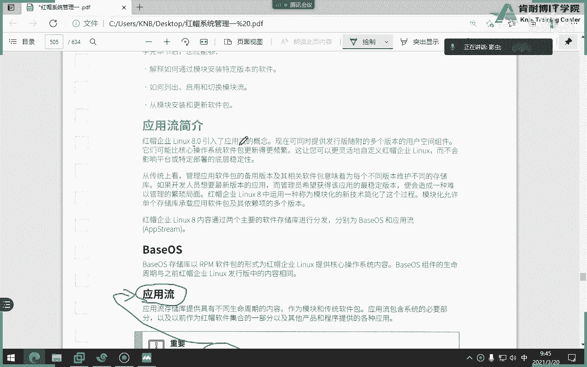

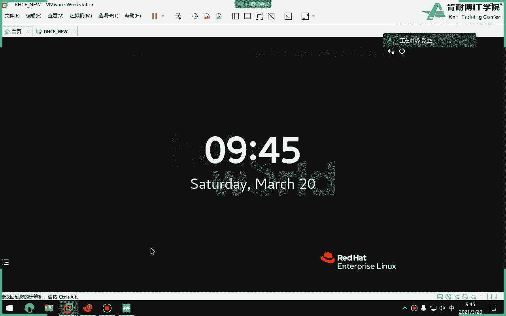

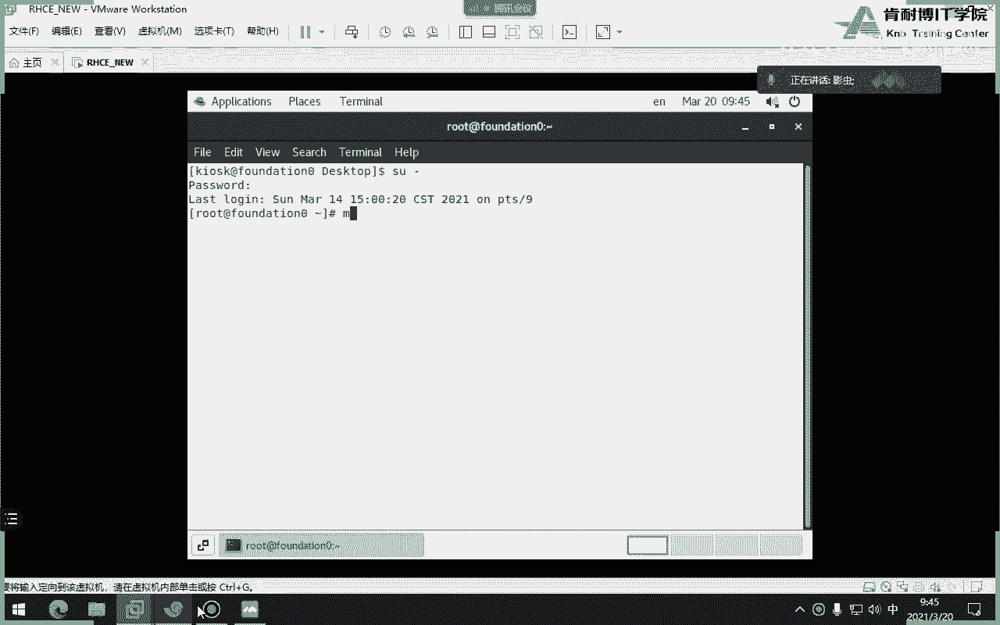

### 配置Yum源文件

Yum源配置文件位于 `/etc/yum.repos.d/` 目录下，文件以 `.repo` 结尾。一个基本的远程源配置如下：

```bash
[baseos]
name=BaseOS
baseurl=http://content.example.com/rhel8.2/x86_64/dvd/BaseOS
enabled=1
gpgcheck=0
```

**核心配置项说明：**
*   `[repository-id]`：仓库的唯一标识符。
*   `baseurl`：仓库的实际地址。
*   `gpgcheck`：是否进行GPG签名校验。**在考试中，务必设置为 `0` 或 `false` 以关闭校验**，否则可能因缺少密钥导致安装失败。

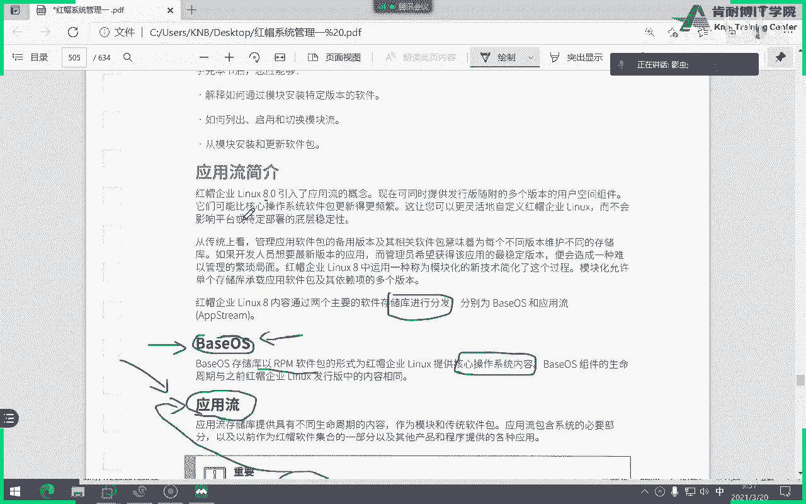

一个最小化的考试推荐配置只需三行：
```bash
[myrepo]
baseurl=http://provided.url/path
gpgcheck=0
```

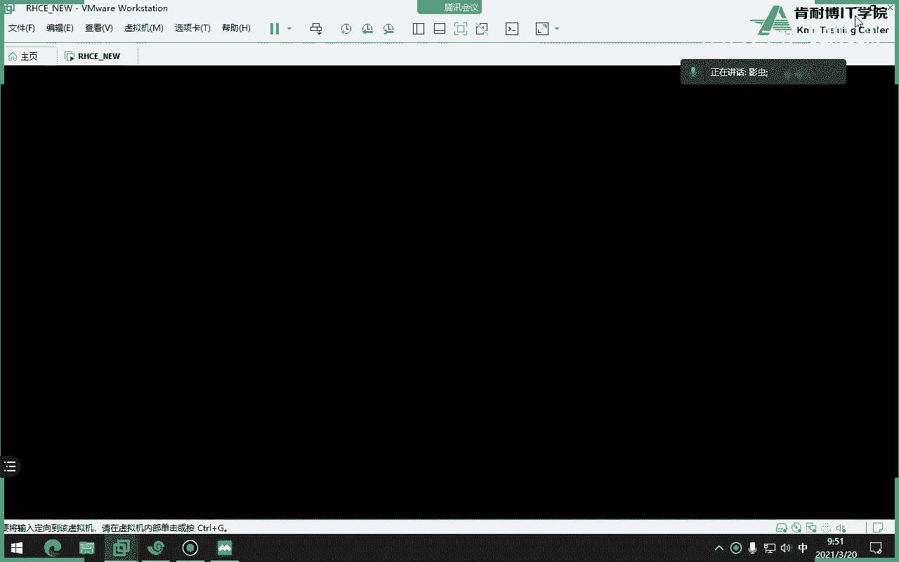

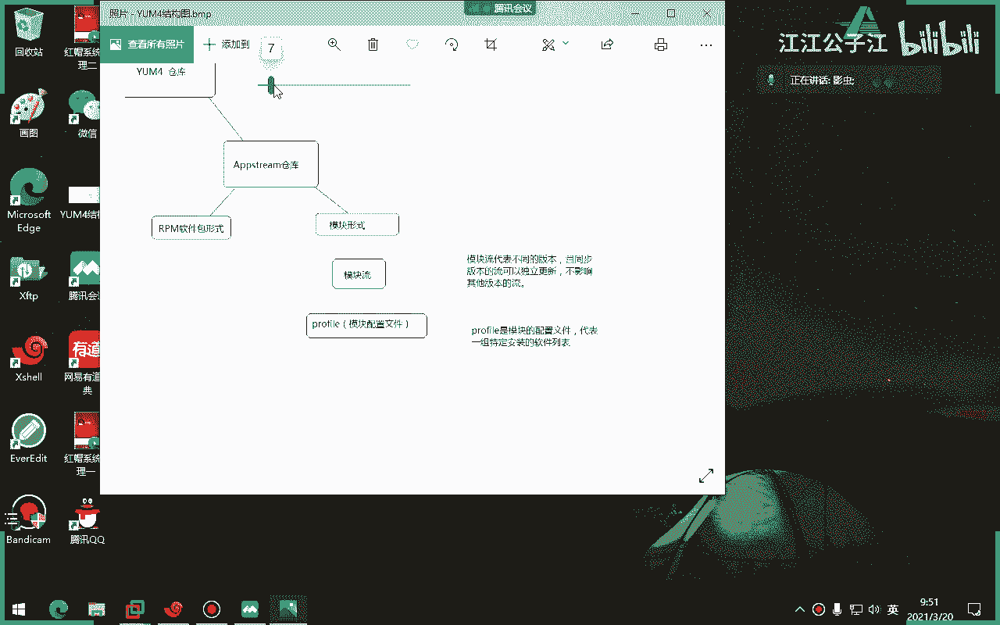

### 配置本地Yum源步骤

以下是配置本地Yum源的步骤：
1.  挂载安装介质（如ISO镜像）到某个目录，例如 `/mnt`。
2.  在 `/etc/yum.repos.d/` 目录下创建 `.repo` 文件。
3.  在文件中配置 `baseurl=file:///mnt`（指向挂载路径）。在红帽8中，因为软件包分放在 `BaseOS` 和 `AppStream` 两个目录，通常需要配置两个独立的仓库条目指向这两个子目录。

### Yum常见问题排查

如果Yum源配置失败，请按以下顺序检查：
1.  **拼写错误**：检查配置文件中的单词拼写。
2.  **网络连通性**：对于远程源，使用 `ping` 命令测试是否能连通 `baseurl` 中的地址。
3.  **GPG校验**：确认 `gpgcheck` 已设置为 `0`。
4.  **仓库地址**：确认 `baseurl` 的路径完全正确。

### Yum常用命令总结

以下是常用的Yum命令：
*   `yum install package_name`：安装软件包。
*   `yum list`：列出所有可用软件包。
*   `yum remove package_name`：删除软件包。
*   `yum update`：更新所有软件包。
*   `yum search keyword`：搜索软件包。
*   `yum history`：查看Yum操作历史。
*   `yum group list`：列出软件包组。
*   `yum group install "Group Name"`：安装软件包组（组名含空格需加引号）。
*   `yum group remove "Group Name"`：删除软件包组。

## 红帽8新特性：应用流（AppStream）

从红帽8开始，Yum（版本4，基于DNF技术）引入了一个重要的新概念：**应用流**。

### 核心概念解析

红帽8的安装介质将软件包存放在两个独立的仓库中，这与之前版本不同：

```bash
/mnt/
├── AppStream/
└── BaseOS/
```

**BaseOS仓库**：
*   包含构成核心操作系统功能的RPM软件包。
*   这些软件包生命周期与RHEL发行版一致，更新频率较低。

**AppStream仓库**：
*   包含用户空间应用程序、运行时语言和数据库。
*   这些软件更新频率相对更高。

**引入AppStream的好处**：允许用户在不影响核心系统稳定性的前提下，更灵活地获取和更新应用程序的不同版本。

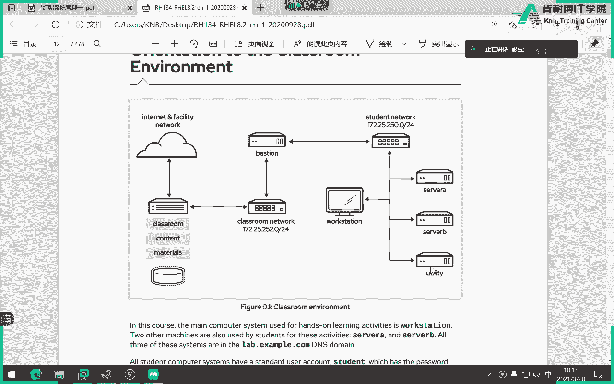

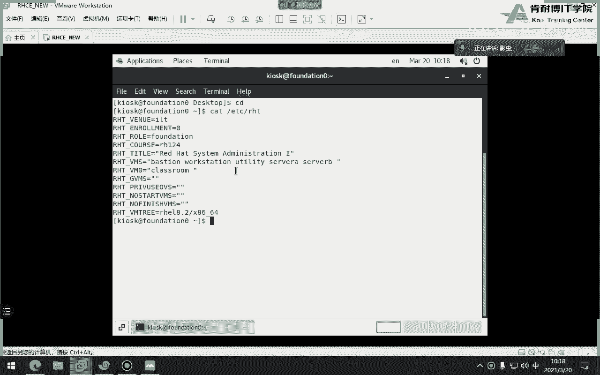

### 模块（Module）与流（Stream）

AppStream仓库中的内容以两种形式提供：
1.  **传统的RPM包**。
2.  **模块**。

**模块**：是一组协调一致的RPM软件包集合，通常用于实现特定功能（如Python 3.6、PostgreSQL数据库）。

**模块流**：是模块的**不同版本**。例如，PostgreSQL模块可能有9.6、10、12等多个流（版本）。每个流可以独立启用和更新，互不影响。

**配置文件**：每个模块流可以有一个或多个**配置文件**，它定义了针对特定用例安装的软件包子集。
*   例如：`server`（服务器端），`client`（客户端），`development`（开发），`minimal`（最小化安装）。

**关系总结**：
`AppStream仓库` -> `模块` -> `模块流（版本）` -> `配置文件（安装模式）`

### 模块相关命令

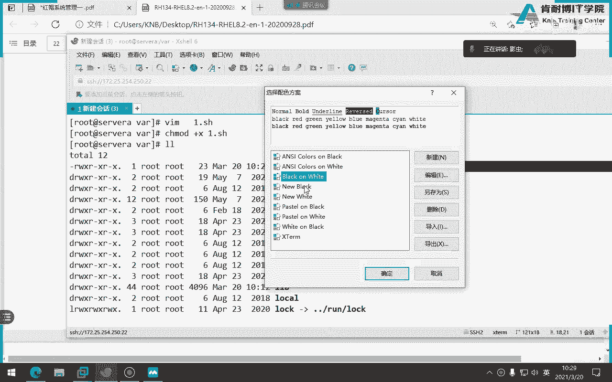

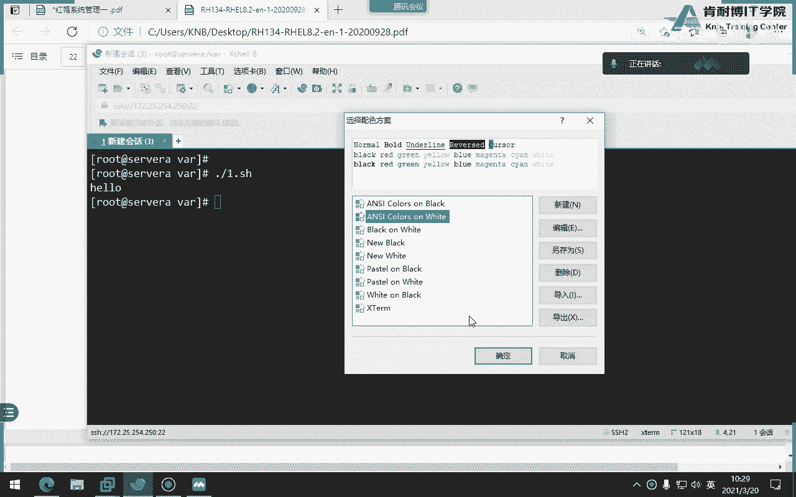

以下是管理模块的核心命令：

*   `yum module list`：列出所有可用模块及其流和配置文件。输出中，`[d]`表示默认流/配置文件，`[e]`表示已启用，`[i]`表示已安装。
*   `yum module install module-name:stream/profile`：安装特定模块的指定流和配置文件。
    *   示例：`yum module install postgresql:12/client` 安装PostgreSQL 12模块的客户端配置。
*   `yum module enable module-name:stream`：启用某个模块的特定流（版本）。
*   `yum module remove module-name`：删除已安装的模块。
*   `yum module reset module-name`：重置模块，将其恢复为默认状态。

**切换模块流示例**：从PostgreSQL 9.6切换到10。
1.  删除旧模块：`yum module remove postgresql:9.6`
2.  重置模块：`yum module reset postgresql`
3.  安装新流：`yum module install postgresql:10`

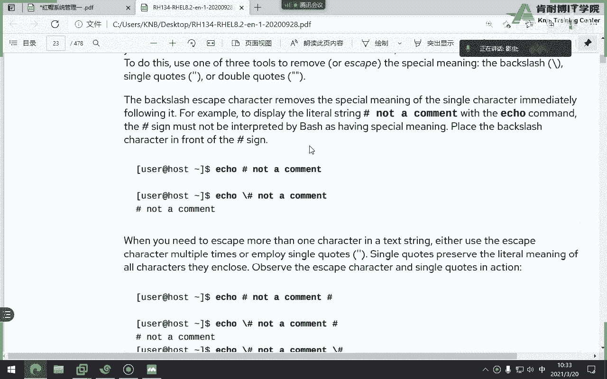

> **注意**：RHCE8考试中不考察模块（Module）相关操作，但了解此概念对理解红帽8系统管理至关重要。

## Shell脚本编程入门

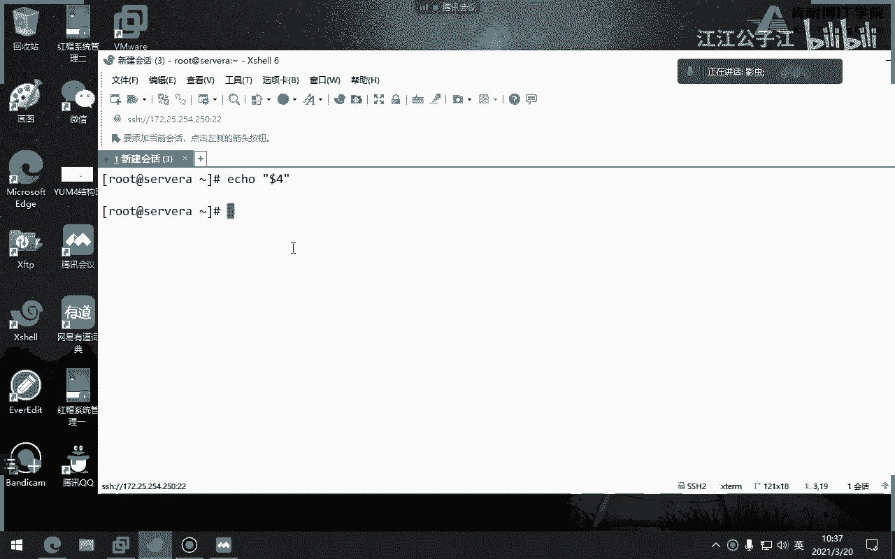

从本节开始，我们将学习Shell脚本编程。Shell脚本是系统管理员实现自动化运维、简化重复性工作的核心工具。

### 编写第一个Shell脚本

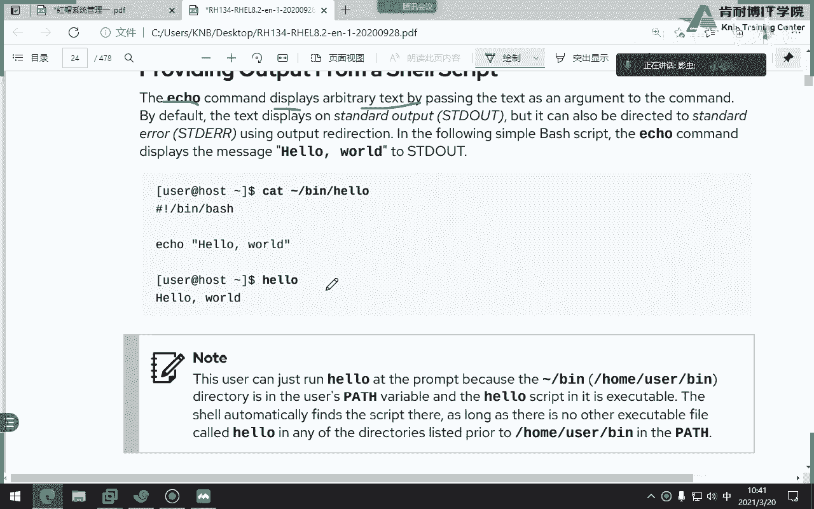

1.  **创建脚本文件**：通常以 `.sh` 为扩展名，例如 `hello.sh`。
2.  **指定解释器**：脚本第一行必须是 `#!/bin/bash`，这告诉系统使用Bash shell来解释执行后续命令。`#!` 称为shebang。
3.  **编写脚本内容**：后续行是具体的命令或逻辑。
4.  **赋予执行权限**：使用 `chmod +x hello.sh` 为脚本添加可执行权限。
5.  **执行脚本**：
    *   在脚本所在目录：`./hello.sh`
    *   使用绝对路径：`/path/to/hello.sh`
    *   若希望在任何目录都能直接通过文件名执行，需将脚本所在目录加入 `PATH` 环境变量，或更常见的，将脚本复制到 `PATH` 已有的目录中，如 `/usr/local/bin/`。

一个简单的脚本示例：
```bash
#!/bin/bash
echo "Hello, World!"
```

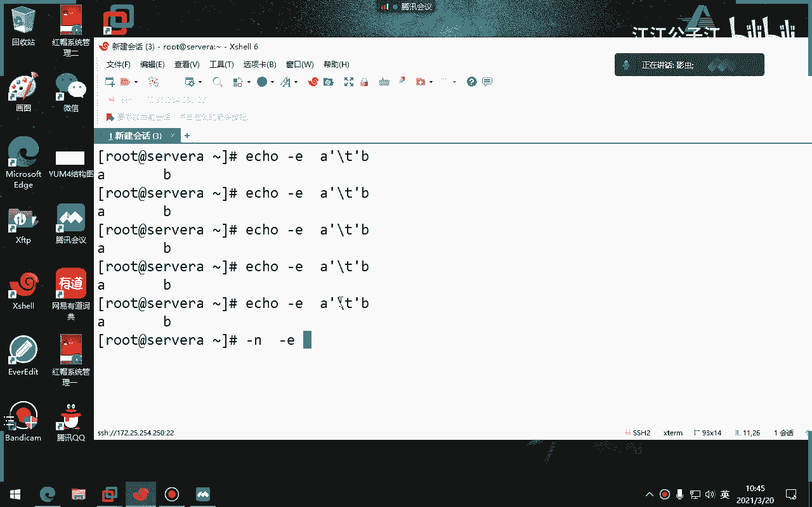

### 变量与特殊字符

**变量**：使用 `变量名=值` 赋值（等号两边不能有空格），使用 `$变量名` 引用变量。
```bash
MYNAME="RHCE Student"
echo $MYNAME
```

**特殊字符转义**：有时需要原样输出特殊字符（如 `$`, `\`），需要转义。
*   **反斜线 `\`**：转义紧随其后的单个字符。
*   **单引号 `'`**：强引用，引号内所有字符保持字面意义。
*   **双引号 `"`**：弱引用，引号内大部分字符保持字面意义，但 `$`（变量替换）、`` ` ``（命令替换）、`\`（转义）仍有效。

示例：
```bash
echo \$HOME    # 输出 $HOME，而不是变量值
echo '$HOME'   # 输出 $HOME
echo "$HOME"   # 输出 /root 等，进行了变量替换
```

**echo命令选项**：
*   `-n`：不输出末尾的换行符。
*   `-e`：启用反斜线转义解释，例如 `\t` 代表制表符，`\n` 代表换行符。
```bash
echo -e "Column1\tColumn2"
echo -n "No newline after this. "
```

### 循环结构：for循环

`for` 循环用于处理一系列项目，执行重复任务。

**列表式for循环**：当明确知道循环次数或迭代列表时使用。
```bash
#!/bin/bash
for USER in user1 user2 user3 user4 user5
do
    useradd $USER
    echo "redhat" | passwd --stdin $USER
done
```
可以使用 `{1..5}` 生成数字序列，或 `$(seq 1 2 10)` 生成步长为2的序列。

**使用位置参数的for循环**：当循环次数由执行脚本时传入的参数决定时使用。
```bash
#!/bin/bash
for PARAM in $@
do
    echo "Parameter: $PARAM"
done
```
执行 `./script.sh arg1 arg2 arg3`，循环将处理这三个参数。

**循环控制**：
*   `break`：立即终止整个循环。
*   `continue`：跳过本次循环的剩余代码，进入下一次迭代。

### 条件测试与判断

**test命令与方括号**：用于检查条件是否成立。
*   `test condition`
*   `[ condition ]` （更常用，**注意方括号内的空格是必需的**）

**数值比较**：
*   `-eq`：等于
*   `-ne`：不等于
*   `-gt`：大于
*   `-lt`：小于
*   `-ge`：大于等于
*   `-le`：小于等于

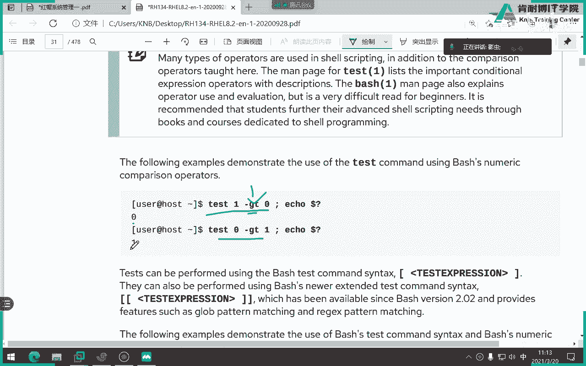

**字符串比较**：
*   `=`, `==`：等于
*   `!=`：不等于
*   `-z`：字符串长度为零（空）
*   `-n`：字符串长度非零

**文件测试**：
*   `-e`：文件/目录是否存在
*   `-f`：是否为普通文件
*   `-d`：是否为目录
*   `-r`：是否可读
*   `-w`：是否可写
*   `-x`：是否可执行

**逻辑操作**：
*   `-a` 或 `&&`：逻辑与（AND）
*   `-o` 或 `||`：逻辑或（OR）
*   `!`：逻辑非（NOT）

示例：
```bash
if [ -f "/etc/passwd" -a -r "/etc/passwd" ]; then
    echo "File exists and is readable."
fi
```
双括号 `[[ ]]` 提供了更强大的模式匹配功能（如正则表达式），是Bash的扩展。

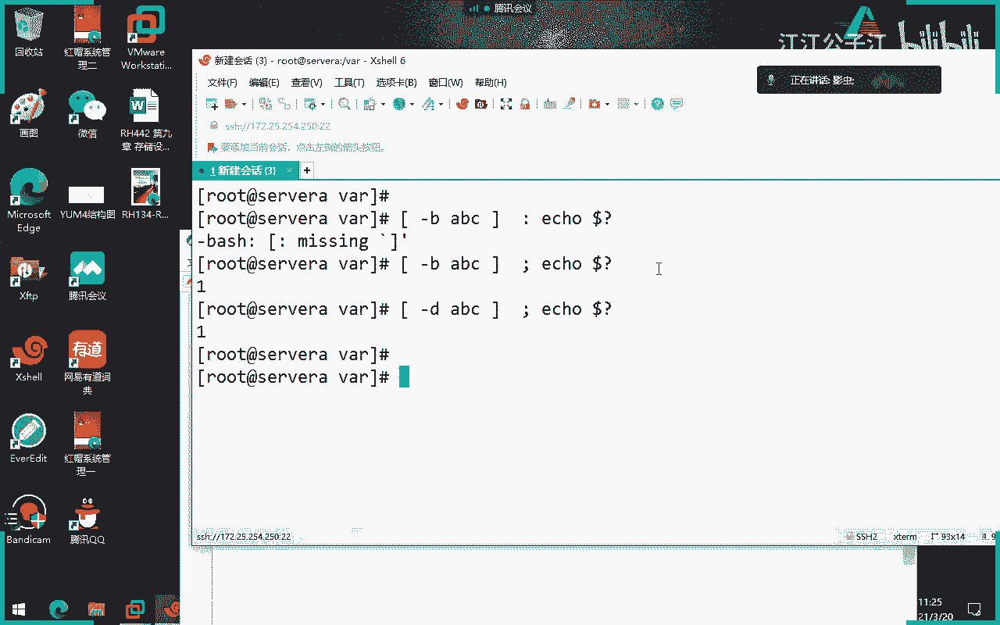

### 条件判断语句：if

`if` 语句根据条件测试的结果执行不同的代码分支。

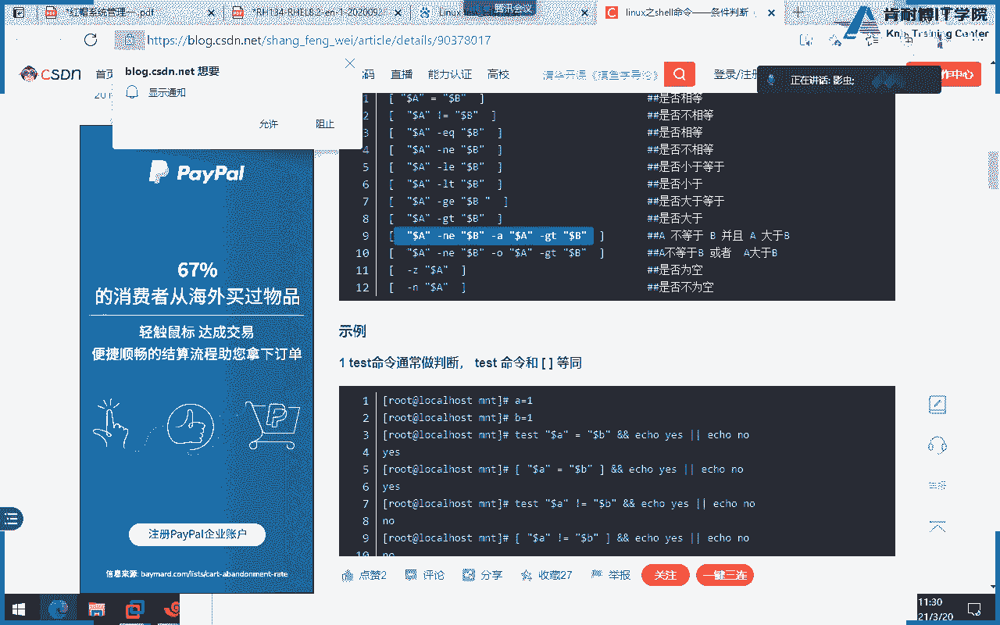

**基本if语句**：
```bash
if [ condition ]; then
    # 条件为真时执行的命令
fi
```

**if-else语句**：
```bash
if [ condition ]; then
    # 条件为真时执行的命令
else
    # 条件为假时执行的命令
fi
```

**示例**：结合命令退出状态码（`$?`，0表示成功，非0表示失败）。
```bash
#!/bin/bash
ping -c 1 serverb &> /dev/null # 将输出重定向到“黑洞”/dev/null，不显示任何输出
if [ $? -eq 0 ]; then
    echo "ServerB is reachable."
else
    echo "ServerB is unreachable."
fi
```

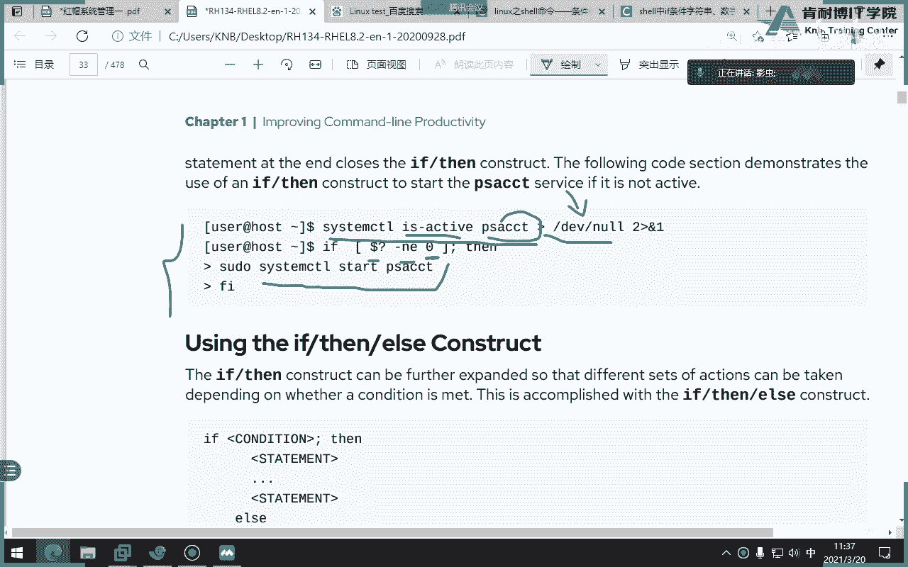

## 总结

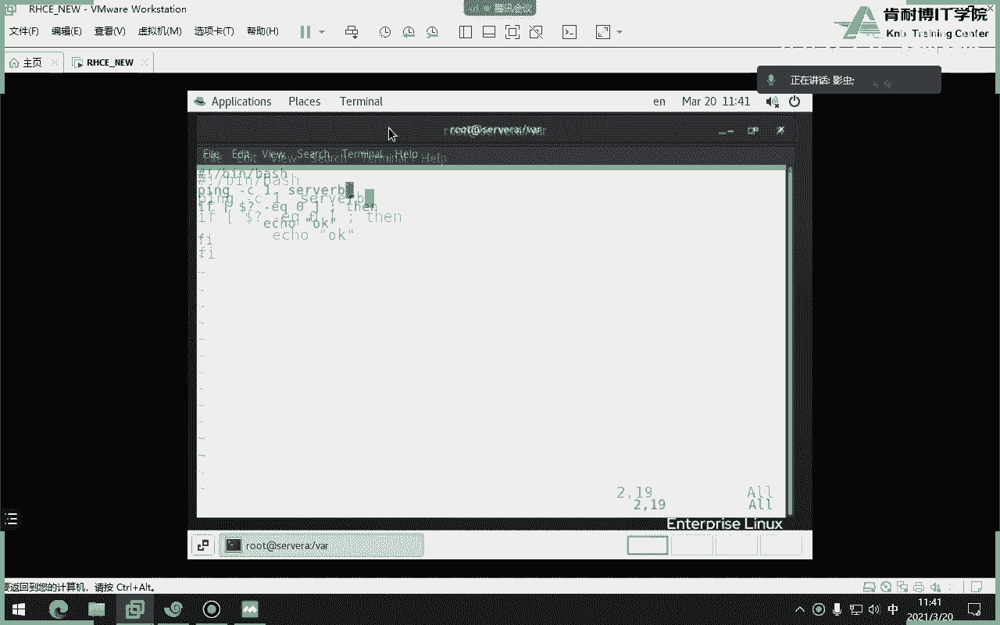

本节课中我们一起学习了：
1.  **Yum源配置的细节**，包括本地源和远程源的配置方法、常见问题排查，以及红帽8中必须注意的BaseOS和AppStream双仓库结构。
2.  **红帽8的应用流（AppStream）新特性**，理解了模块、模块流和配置文件的概念及其管理命令。
3.  **Shell脚本编程基础**，包括如何创建和执行脚本、使用变量、控制字符转义。
4.  **流程控制结构**，重点掌握了`for`循环的两种形式（列表式和参数式）及其应用场景。
5.  **条件测试**，学习了使用`test`或`[ ]`进行数值、字符串、文件的比较和逻辑运算。
6.  **条件判断语句**，掌握了`if`和`if-else`结构的基本用法，并能将其与命令执行结果结合进行逻辑判断。

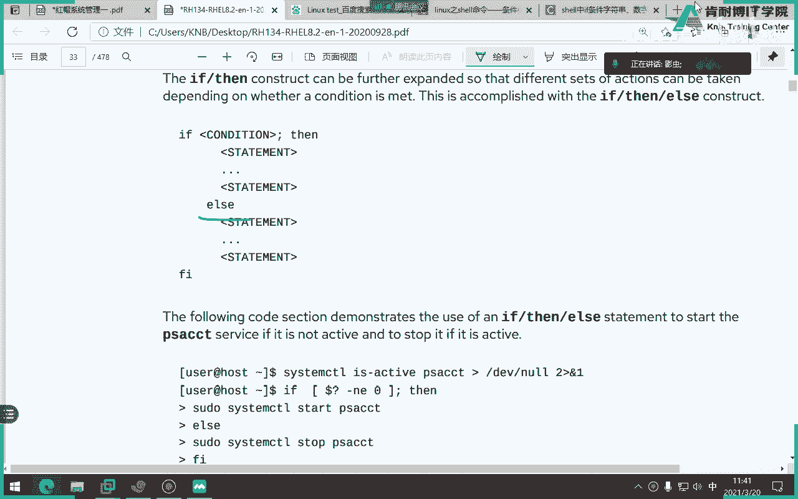

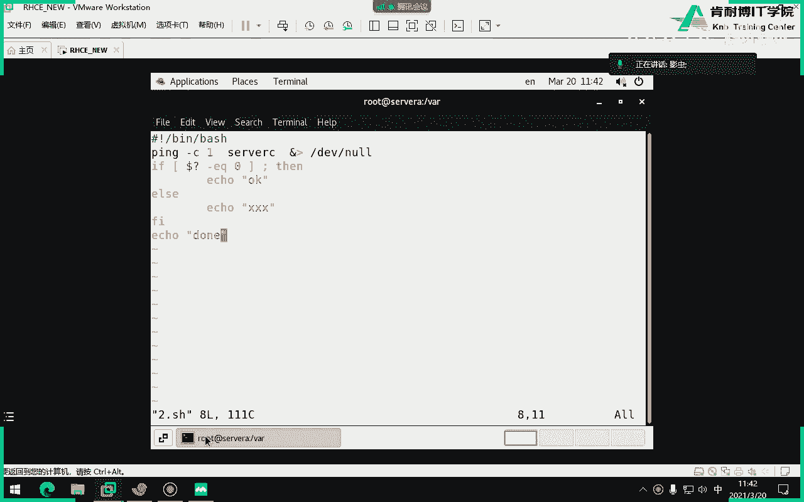

这些知识是进行Linux系统自动化管理和备考RHCE的重要基础，尤其是Shell脚本部分，需要多加练习以熟练掌握。