# 红帽认证系统工程师RHCE8-滕老师出品 - P10：第五天 正则表达式 和tuned服务 - KNBIT认证中心 - BV1up4y1h7MA

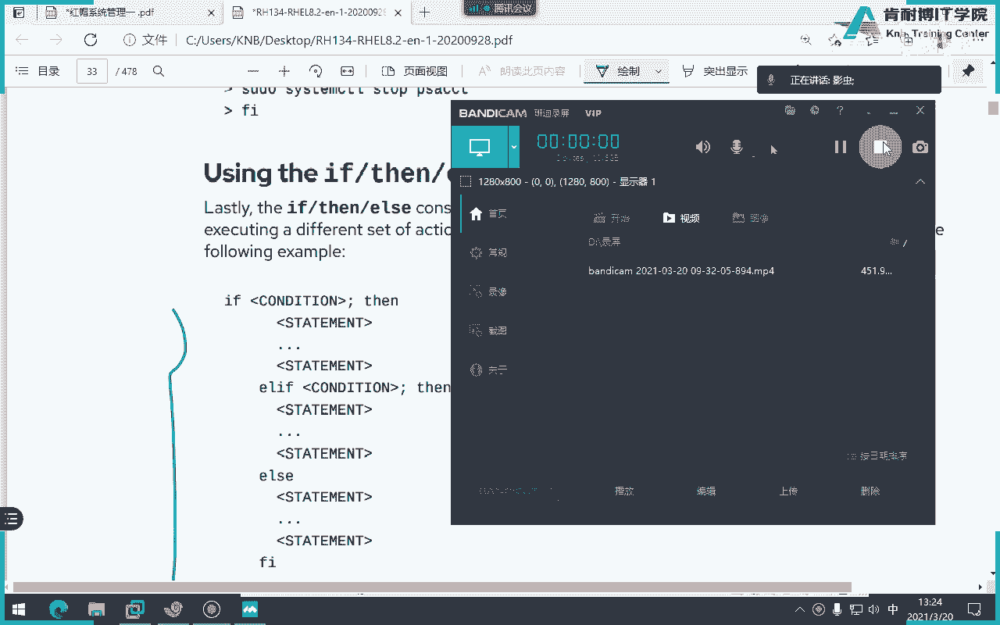

那么今天上午我们讲到if else就讲完了，那么其实还有一个判断句式更加复杂的叫if then elf the，嗯，说白了就是多分支的一种语句判断，你比如说第一个条件我不满足，我走第二个else。

if是什么意思，就等同于只不过呢大家想象一下，如果你每次都用f开头，那就要有一个相对应的f i结尾，那么这个时候我们从这个感官上看也不是很好，同时呢还有一个问题就是什么容易忘。

那么有没有一种可能就写一个if f a i，还有一个f i呢，可以的，那么中间用l f啊，所谓lc不就是第二个，第三个，第四个甚至更多的一种什么条件判断，条件判断。

所以当我们有大量的这种调节的这种这种分支语句的时候，我们就要用asaf会更好一些啊，不要再用a f i f f i这样一个一个这样写的会比较庞大，代码写的比较啰嗦啊，那么这个咱们就指导一下就行了啊。

指导一下，你看你看他这个就是啊是吧，起一个判断一下这个进程它的值是不是判断一下它的变量值是不是零，那这个变量是什么呢，这个变量就上面这个变量，那么呃mysql运行mysql，然后他就继续判断啊。

如果这个值是零，那么运行马赛克啊，如果这个不是零呢，就走下面这个对吧，所以下面那个所说if else就是一直在进行判断，直到一个结尾，else结尾就相当于上面的几个条件都不满足，那我只能走else。

最后来一个fi结尾，其实你写出来就不难了啊，写出来就不难好，那么这边有一个实验，你也不用做了，回去做吧，嗯回去做，那么我们来想一个题目。

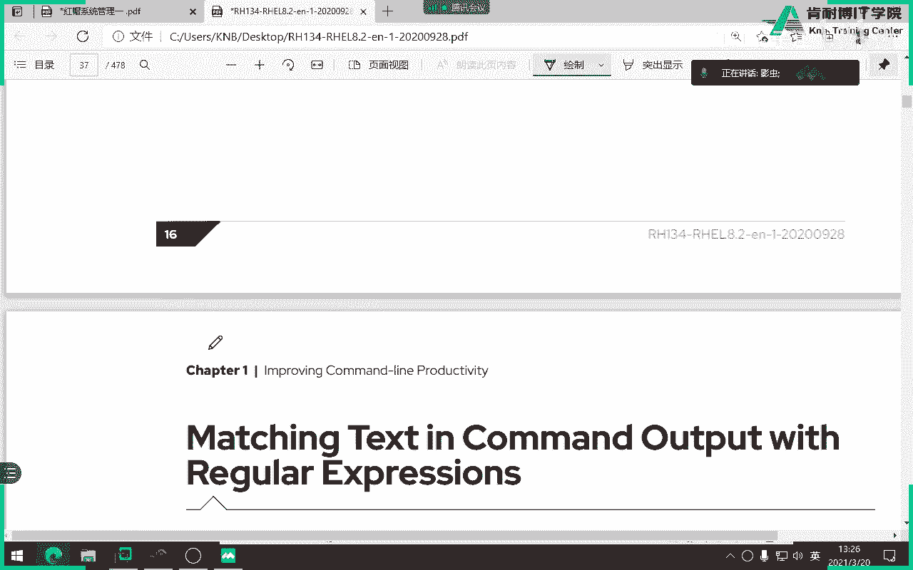

各位我给大家出一道出一道题目，我们来想一下怎么做这个题目呃，我我们以前在其他班级当中做过，就是我来判断下一个服务它还处于激活状态，如果不属于我们把它比如说重启能理解吧，哎不不。

比如说我们判断哪个就判断这个吧，s h d他看他是否是否是激活状态，就是现在正在运行状态，如果不是就把它重启，就这个题目不就是咱们刚才教材里面哪个题目一模一样吗。

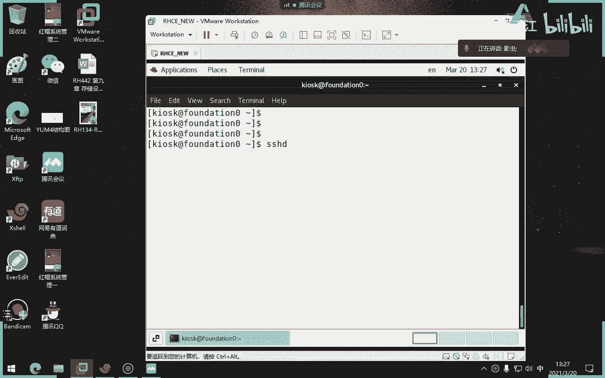

啊咱们刚才教材里面是不是也有这个类似的题目是吧。

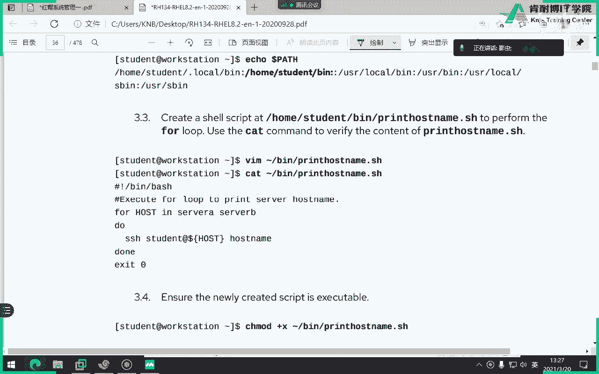

好那么写这个题目的时候，你看很显然就要用到app里去，还有一个判断句，好，那么大家能不能想出来用什么办法来写呢，我来判断一个服务在不在，如果在就把它啊，如果不在就把它重启激活，如果在的话。

就就输出一句话，说这个比如说这个服务还正在运行啊，那么你看这就是一个标准的一个a f一句吗，它有很多种做法，就为了达到这个目的，咱们有很多种做法，首先你得判断服务在不在，就重点就是判断服务在不在。

如果不在，重启，如果在就说这个服务正在运行。

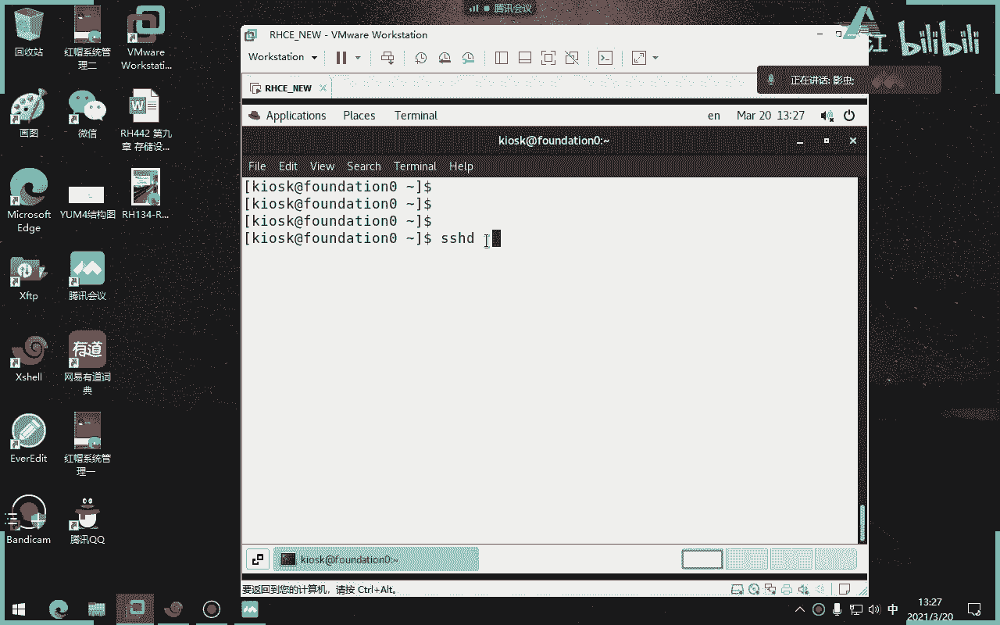

那我们来想象一下，咱们是不是可以这么做，我判断服务有很多教材当中的案例当中，他是不是用这个办法是吧，他用这个办法啊，当然我们是不是可以这样做，ps我如果看那个进程还在不就ok吗。

我甚至还可以用这个命令大家学会吧，想想起来没有，就是查看端口号，如果二端口在它不ok了吗，所以你看这一个问题都有这么多种解决办法，那我比如说用ps怎么做，比如p s杠e f bgm，我找一下谁。

我找一下那个对吧，fs，然后我还要取消啊，取消了规律，这句话意思就是你一定要把这个grape命令给我，排除这个命令，咱们有学带回去带回去，待会讲正则表达式的时候。

我们就学一定要把那个grape命令本身排除掉，更we是排除的意思，为什么，因为如果你不排除的话，这个脚本永远都是成功的，因为这条命令没有报错对吧，这条命令没有错，所以他的输出值永远是零。

所以你一定要把这个group命令本身排除掉好，然后怎么办呢，那个测试呢，比如说a测试测试什么测试到六零，它是否等于对吧，不等于零，那如果是呢，说的等于零，那比如如果是呢，就比如就输出一句话。

比如比如running对吧，那如果不是呢，不是你就把它重启，不是你就重启他呗，对吧，你就重启重启是哪个命令，就是咱们学过的吗，对吧，哎就这样，这就是一个标准的一个一个服务fi结尾对吧，这就是一个判断嘛。

我判断这个命令在不在，判断这个命令在不在，结果是不是零，如果是零，就说明这个服务还在，那么当然你也可以判断下端口号，比如说删除他22号端口在不在，如果在那说明这个服务在那，如果不在呢。

问号不在那说明这个服务就不在呀，重启他呀，是不是，所以说你看有很多事情可以做啊，有很多东西这就是一个标准的一个脚本，答案很简单啊，我们知道一下就行好，那么这就是if语句，else if else，好啊。

没没if else，还有一个是if else，if是指多重判断啊，多重判断好这个命令，这个脚本你最好指导一下啊，嗯好把它删了，ok那么接下来的新课就是我们的正则表达式。

首先我们一定要分清楚正则表达式和卓和，上节课我们学的等于那个通配符，很佩服什么叫正则表达式呢，记住就是利用一种特殊的原字符来进行匹配的语言，叫做正则，那问题是什么是原字符呢，就是咱们之前学过的什么点啊。

问号了，星号了，哎这些叫原字符，那么正则表是跟我们的通配符有什么区别呢，你看通北部当中有星号还记得吧，那么待会我们讲正则也有星号，那很多同学就会晕啊，那他这那那那啥意思啊，听不懂你。

你就判断你一句一个原则，你判断啊，所谓的正则表示是判断文件的什么内容，匹配文件的内容，而通配符匹配的是文件的名字，名字如果想匹配文件的内容，那这个就是通配符呃，就是正则，如果匹配的是文件名。

那就是通配符，而且正则还有个问题，正则不能够单独使用，你比如说我直接打个信号行吗，当然不行，正则表达式一般都是跟某一个程序或者是某一个开发语言，比如说pc语言pyth，你只要学过编程的同学。

正则表达式肯定要学，那咱们没有学过python怎么办，咱们也不会c语言怎么办，没关系，咱们可以用we grape me，你说group命令后面可以加正字，所以说我们接下来为了讲解重则。

我们先讲grape命令怎么用，vm有没有正则有啊，vm也可以支持正则啊，因为正则不能够单独使用，但是它可以配合这这个编程语言，或是配合着我们这个group命令这个命令来一块使用，好。

我们先来讲什么叫做g ok我来卖一下，大家看grape有这样几个就是变就是不一样的变化啊，第一个是grape，它就叫e grape，还叫f grape，他都是干嘛打印匹配的，好注意。

group就是类似于我们的删除啊，搜索只不过他用什么用模式的办法来帮我们去搜索，来我们看一下标准的语法格式，首先group后面加opera opern，就是就是选项后面加上这个单词是模式啊。

我们可以理解为一个模式，好后面是加你的文件，文件可以加n个，那点点点代表n个吧，好还有一种呢叫group gun e e是什么意思呢，注意其实我们在敲grape的命令，咱们在敲grape命令的时候。

各位其实后面就隐含了一个杠e选项，只不过咱们可以不敲啊，e是什么意思啊，大家往下走看看，e应该是编辑小写啊，千万注意不是大写啊，e其实不是编写e就是相当于什么一个知识加那个通配啊。

好那么大写的意义是什么意思，大写的意义就是扩展意义就是扩展啊，扩展政策，而普通的意义呢就可以加普通的正则表达式啊，正则表达式分为两种，一种是普通的，一种是扩展的啊。

好那注意大写的一直是加加什么加入那个扩展的正则表达式啊，好那么咱们来说一下，先说gp怎么用啊，鬼鬼有几个选项，咱们要知道一下啊，grape第一个选项小写的i代表忽略大小写，你看。

我匹配出带有root r o o t的，但是中间i是指的忽略大小写，也就说如果有大写的r o o t也行，你给我列出来好吧，grape啊，我快速的讲了啊，你记不住，待会儿翻视频也行，v指的是排除。

只要是root，我反而就排除他就是不匹配带有root这样的一个字段的行啊，你看所以我们刚才你还记得那个脚本当中grape gv吧，就是排除的思，这里面的v可注意了，这里面的v可不是打印输出。

那个v还记得吧，r p g r v h那个v是不是打印输出对吧，但是这个v是排除的意思啊，非取反的意思啊，第二个小写n啊，c吧，咱们说c c一般是什么意思啊，各位c都是统计count对吧，统计嘛好。

我想知道epic password当中有多少行是包含r o o t的好，有两行哪两行呢，第一行和第十行n就是number，这个没什么解释吧。

一般n都是number好再说一遍n h number 4是统计i是忽略大小写v是取反，就是反意思就是非啊，你都要会啊，你看你我打的很很熟，你也是这样，以后你都要会，规矩一定很重要啊，好接着哎。

其实教材都有啊，你估计也行，后面都有好接着同志们，加上一个数字，比如说二或者三无所谓啊，这数字不是固定的，a2 数字几都行，这个代表什么呢，打印出带有r o o t的这一行，以及这一行的后面两行。

这个a是after单词的缩写，那如果是b等于，before就是打印出带有root的以及root的上面两行，那为什么上面第一个没打印出来，因为root是第一个，哈哈明白了吗，哎就这意思懂了。

就是b是before，a是after，有用吗，以后你就会用到的，就如果课程课程当中那种比较冷门的选项，我是不会告诉大家，所以我告诉大家都是比较常用的，好吧好吧，让我行，那咱们就说那么多。

还有一个呢是graf杠大写的e，注意gf大杠大写的e就等同于e grape，千万注意可不是小写e啊，如果这个东西他们俩不是等于号是大写的e扩展的意思，扩展意思我刚刚说过。

大写的意义要支持加在后面加什么扩展正则表达式，那就等同于e规模一模一样好吧，千万注意不是小写的e啊，不是小写的e好，那么我们来说到这儿呢，咱们知道规范应该怎么用了吧，好那我其实在讲group命令的时候。

刚才我敲了这么多，其实我也把正则表达式给大家写出来了，大家看这句话，其实这里面的r o o t就是正则表达式了，你这不对啊，你这个正则表达式不是什么点信号吗，你也你也不能这么说啊。

就是点信号那些东西是正则的一种，但这个也算正则也算正则，这这个代表我打印出带有r o o t字母的内行，它也叫正则，这就是一个匹配模式，匹配模式好，那么接下来有个问题啊，各位各位如果建一个算了。

我用虚拟机来做，如果我建立一个用户，让roo t t呢，他能出来吗，他也能出来，知道吧，他这一行也能出来，为什么，因为这个不是一个精准查询，请大家注意，这并不是一个精准的匹配啊。

我们我们可以把它理解为一种叫模糊匹配吧，好吧，什么模糊呢，就是包含r o o t的，但并不是说我就等于r o o t的四个字母，这个的i o t t t它也会出来，ok一定要注意啊，这一点一定要注意。

很多同学就以为他是这种标准精准匹配，并不是啊，并不是一定要注意好，那接下来我们就来讲正则表达式，那我们可以来正式来讲了啊，那么正常表达式当中呢分为两种，一种是标准的，就是普通的啊，还有一种是扩展的啊。

扩展正则表达式，一种是标准啊，这一点很重要，那所谓的标准正态表达式呢，咱们有很多啊，标准的就是用grape meaning使用的，有标准的，咱们有很多，比如说第一个啊，咱们先说星号新法代表什么。

代表匹配所有，哈哈不对啊，我差点上当了，正则表示当中的信号不是匹配所有，而通配符里面的信号才代表匹配所有，正规表示里面信号代表代表匹配前一个字符，到n次就是多次注意啊，同志们。

你们记笔记的时候一定要记住，咱们今天讲的是正则，而不是通配符，通配符，你们刚才告诉我是所有是对的，没有问题，但咱们想的是正则正则匹配文件的什么内容，而通配匹配的文件的名字能理解吗。

哎你现在想想我为什么打ios新号，它所有内容出来了，这是因为它匹配的是名字，而不是内容吧，懂了吗好，那我们来做一个实验，什么叫做匹配前一个字符零次到多次呢，我写一个文件，比如说bug，比如我写一个a。

诶诶诶，最好加个单引号好吧，咱们习惯你加个单引号，第一个就代表匹配零次，第二个代表匹配一次，是不是我重复的前一个字符啊，匹配重复重复不是匹配，重复前一个字符零次到多次。

大家来看星号前面是个a就代表我匹配的是a这个字母的零次到多次，看到了吗，零次到多次，千万不注意，可不是所有啊，可不是那个通配符的意思，第二个来看书吧，你要觉得不明白来看，直接念这句话是吧。

zero more time，零四到多次，点儿是什么意思，我不写了，我就我我懒得写了，我念吧，你们自己记点是代表匹配，这啥意思啊，single啥意思啊，一个字符对了，匹配单一的任何一个字符。

注意星号跟点的不一样一样，星号代表匹配重复前面一个字符的零次到多次，第二代表匹配任意一个字符，那我想问大家怎么样才能相当于通配符当中的型号，那就得点信号了呗，点信号就代表所有对吧，点信号就代表所有。

那么问号呢又不一样了，问号代表什么，问号加号这两个注意了，同志们，这两个不是标准正则表式的，那这样写这种容易让大家晕啊，来我写到这问号跟加号，这不是土，是扩展正则的，而不是标准正则。

那扩展正则就得用哪个命令e鬼好，那么我们来看一下什么意思啊，首先零首先先先来说加号，加号代表重复前一个字符，重复前一个字符还是一样，重复前一个一个字符，到一次这是多少次呢，这这里不写了。

一样的重复前一个字母，这是到n次，最少一次，最大n次能知道它没区别了吧，我就不写啊，前面都都是重复的，好问号代表重复前一个字符，零次到一次，那最大只有一次，那加号是指什么呢，最小一次最大不让无数次。

明白了吗，一定要注意啊，他们俩的区别啊，他们俩区别一定要注意，而且他们不是标准正则是扩展型，正则扩展和政策，所以一定要注意它的区别，来这就是group meaning。

来这是你刚才学的group meeting的所有没有参数，杠e就是什么，如果出现多次编辑的话，要杠e啊，杠e，咱们知道这个通配啊，那么，还有一个东西啊，就是你看教材当教材当中这个东西大家知道什么意思吗。

如果箭头符号放在中括号里面，就是咱们的通配符吧，比如说大家还记不记得这个，但是我们在学通配的时候还学过这个还记得吗，比如说这个啥意思，比如abc这代表上是不是排除a排除b排除c但是如果这样写呢，注意了。

这样写代表以什么什么开头，这句话就代表以a开头，那以什么结尾呢，就代表结尾就代表以b结尾，注意美元符号代表以什么结尾，箭头符号代表以什么开头，啊这个你得记一下，不知道书上讲吗，应该讲了，应该讲。

那你记啊，箭头符号代表是以什么开头，美元符号代表以什么结尾，那么他们俩结合使用呢，如果他们俩结合呢，如果这样的，代表空空白行，匹配空白，匹配空白行能听懂吗，匹配空白好，再说一遍啊，匹配空白行，啥意思啊。

听不懂啊，听不懂，咱们来做个实验，先来看看各位，比如这个文件里面有这样这样几个东西，三四啊，比如说有这样几行，就这样记好，但是我在看的时候，我不想要空白行，怎么办，就可以这样写，看文件，gv是什么意思。

排除排除啥，排除空白，不对不应该怎么写，直接怎么来不及，麻烦你们直接这么搞不就行了吗，哎我打错了，打错了，是这个看到吗，没有空白了，他把空白行给我排排除了，但是你不是说删了，只是排除了里面还是有的。

再看原文件还是有的，明白了，这叫排除空白行，一定要学会啊，就是你不知道为什么你就记住死记硬背，下次你就知道是就这么用，就代表排除空白好，排除空白行，那这个代表以什么开头，这个代表什么结尾好。

那今天我先来做这样一件事，各位你看怎么做，我想找到root这一行，但是注意他把下面也给出来了，在这边也出来了，那这样子我问大家，我只想看第一行怎么办，那我判断出来是不是以什么开头不就行了吗。

箭头符号开头不就行了吗，好但是箭头符号开头之后，operator这个用户没有了，但是最后这个命令最后这个i o t d t这个用户存在了怎么办，哎这时候我们要讲一个精准匹配。

我如果就是匹配r o o t不就行了吗，就多余的我都不匹配不就可以了吗，他现在不是精准匹配对吧，现在是相当于模糊匹配，那如果我要是精准匹配怎么办呢，就要用精准匹配的符号，谢谢谢，谢。

而且还得来个双引号吧，我用这样两个正则表达式才能完成这个任务，首先告诉大家，这个斜线代表转义字符，上午学过吧，好这个尖括号代表精准匹配，那如果大家我问大家，如果我忘记加后面呢会有怎么样，这样行不行不行。

这样就代表前面精准了，r o t，后面还是重复无数，听懂我意思吗，好但是这样行不行，前面前面不写行不行，我觉得可以吧对吧，因为你前面就把他毒死了呗，是不是在精准匹配啊。

这个精神匹配可以用一个小写的英文字母b来代替这个箭头符号，因为你这边写成b也行，斜线b也可以啊，不加七天好像是吧，你看一下教材啊，要不要加b我试试，应该得这样哎，对加个斜线b啊。

所以说你这样写也变成什么，也可以，精准匹配一定要注意箭头符号啊，就那个像这种尖的这种这种括号啊，叫做精准匹配，精准匹配好上了，贝亚师说了这么多，精准匹配，有时候我们还还要学会像集合一样，像这样代表集合。

比如说举个例子，我这样子和和和和这样子代表什么，代表右匹配点和右匹配斜线，它是个集合集合，明白吗，那如果这样写的，同志们，这就叫祸，可以这样写，代表或括号代表或就我要不然匹配a。

要不然只匹配b就代表货啊，但是这种做法请注意，这边的做法是扩展正则表达式的做法，就右边啊，右边的这个是扩展型正则表达式的做法。

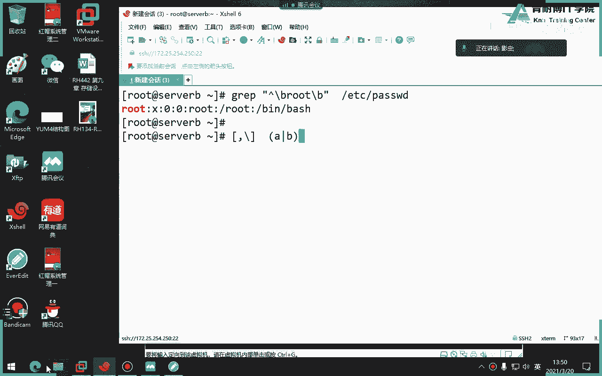

书上没写，你知道一下就行，这是啥意思，他为什么要加个e，我说过，如果一行当中出现多次编辑，你就你这个小写的e就不能省略，你看就不能省略，这代表我匹配一下它，匹配一下，匹配一下它听懂了吗，同志们。

你不可以把e省略。

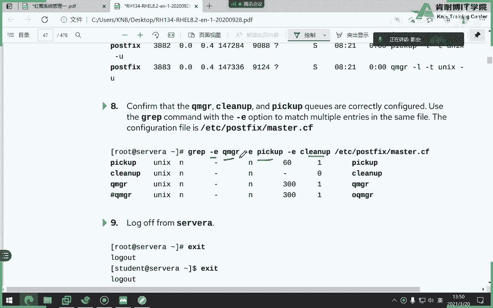

如果他只是匹配某一个就可以不写e懂吗，你看比如说我们来给大家举个例子。

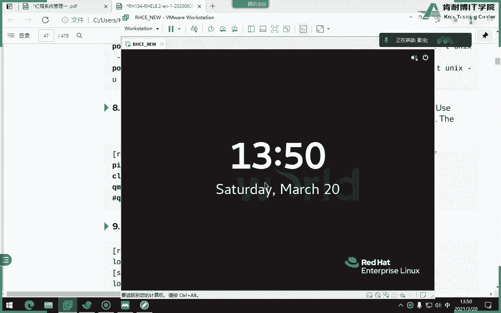

你看我这么做，可不，杠e root，杠e l p，这是什么意思，就是找出带有r o t的，并且找出带有lp的，但这个时候你注意了，1亿就不能省略，这样就不能省略，这样就不行，明白吗，这样不行好。

但如果你只写一行的，比如说只是匹配lp的，那就可以不加一听懂我意思吧，就是如果多行当中出现多次匹配，不是一行当中出现多次匹配，那么那个小写的e不能省略，注意啊，这一点一定是个细节部分啊。

各位一定一定要注意，多次匹配的时候就要加e e e，但是一个的时候可以不加加可以不加不加好吧，那一定要注意啊，它的细节，好上面就没什么，好我们最后看一下正则表示当中的一些小小的东西，就一个表格在哪儿了。

还没给我在下面呢，有没有表格，我记得有啊，给我一个表哥，啊在上面在这这不用解释了，都不用解释啊，啊还有这个忘说了，还有威望代表匹配几次。

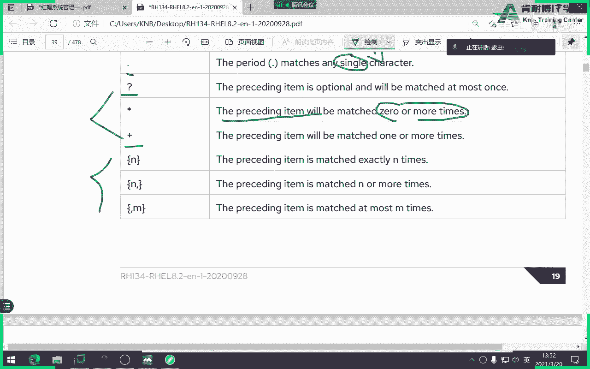

代表匹配几次，注意代表几次啊几次，你看嗯嗯如果这么写，代表前一个字符匹配几次来重新来啊，再重新编辑一下，就，对吧，就是这个文件内容好，就是这个文件内容，那我们匹配一下好，我这么做啊，各位看好斜线。

别忘了斜线啊，因为这个特殊字符你要把它转移，哎我靠你要把它转移一下，转移好，我想匹配两次，我匹配两次，二，那里不是两次a啊，这能看懂吗，别忘了斜线啊，转一次服啊，好但你说老师不对啊，下面也出来了。

这是因为它带颜色，咱们看不出来，所以加个小姐头o是什么意思，卖一下卖一下o啊，我卖一下来看你给我解释o是什么意思，停什么意思，只打印出匹配的，明白吗，只是答案出匹配的好，所以你这样可能看不出来的效果。

各位不对啊，怎么这边也出来了，你这样在o你能看出效果，看到了吧，这匹配两个啊，两个就匹配两次a那么如果这样做呢，同志们，最少两次，最大的三次好，那如果这样做的，注意啊，我带个逗号啊，各位仔细看。

我带逗号了，代表最少两次，最大不知道能数词，明白了吗，就带不带逗号不一样啊，带逗号代表最少一次，最大多少多少次，那如果不带逗号呢，代表经典了多少次，听懂了吗好，那你问老师，我为什么要加斜线。

刚刚解释过这些u一要有什么，把那个特殊的这个大括号是不是要把它干嘛屏蔽掉，但是如果有一种情况可以不加，这种情况意味，e graf的时候e是什么意思啊，extended扩展扩展智能扩展，一个回收可以回家。

谢谢，这一点是比较比较比较这个要注意注意事项啊，好吧，就代记的grab后面可以不加这个专业符号也成功成功好了，那接下来再来看各位。

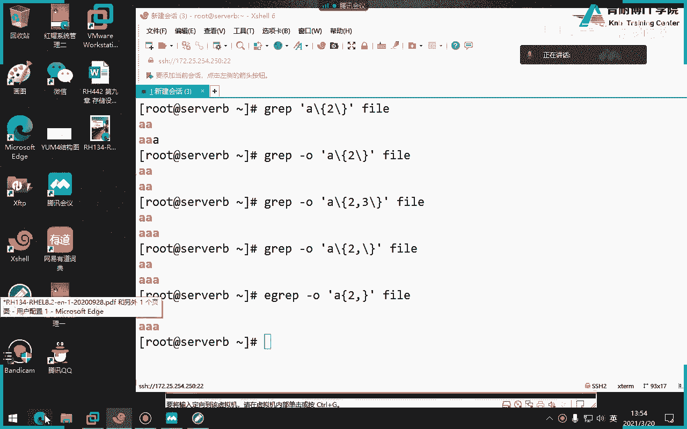

但这几个是什么意思，b不解释啊，b我们说过是代表有所有符号啊，好这个w代表匹配什么，这啥意思，这个我们找一下，不是匹配的是什么数字和数字和什么字母吧，而这个是什么是匹配的字母吧，公关大写小写好。

所以说你看w小写的w是代表匹配的是数字和怎么办是吧，哎那大写的大部分呢说过在前面带有这个线头符号，代表什么取反的意思，注意啊，各位一定要分清楚线头符号啊，什么叫分清楚，这种也叫箭头，这种也叫箭头。

这是一样吗，不一样，这个是指什么，以a开头，这个呢不匹配a懂了吗，所以你看清楚人家写的，人家把这个建筑符号写到中国号里，写在中国号里面了，就代表只要是数字和字母的，我都不匹配，那样s什么sp是什么。

这是空白是吧，空白行吧，那如果大写的s呢，不匹配空白好听懂了吗，这样各位，哈哈哈哈哈，来来来来来来来，做一个小小的小实验，同志们，太好了，突然想到一事儿啊，我这么做，油箱底，怎么匹配中他俩是怎么匹配。

咱们是不是可以这么匹配，呃http对吧，然后呢，光写了我也忘了怎么匹配了，a h t t p等等等等，我们是可以怎么做呢，然后，用w也行，因为是所有字母嘛对吧，所有字母，那，这个字母是不是可以省力啊。

嗯嗯嗯，但你这样做就没意义了，这样做没什利，嗯，我想咱们怎么匹配这一行啊，就匹配这一行，所有字母是怎么想的，刚才说字母是哪个w是吧，w应该怎么写，直接w吗，不能吧，这样可以吗，不可以吧，就这个怎么办呢。

得加个这个东西，同志们3号吧，3号的话你是不是得用，好这边对你这样是可以的，但是后面这些怎么办对吧，这样怎么办怎么办怎么办怎么办，我能不能再做一遍三遍了对吧，这样可以吧，这样不可以。

为啥你看因为中间有个点是你得把点搞清楚，那标准应该怎么办，那那你在这比如咱们用最最最笨的办法来写，是不是你前面得这样做第行，那再来一遍怎么办，哈哈哈，是不是对吧，你说咱们用最笨的办法是不是这样做，加好。

再再来一遍，再来怎么做，在在在干嘛，姐姐哈哈哈哈哈，是不是可以对吧，成功了对吧，好，我问大家为什么要加个斜线，那个点前面为什么这个点前面加斜线，同志们，因为我们知道点是什么意思来着，刚刚刚学过。

如果从通背正则表达式的原理来讲的话，点是不代表匹配任意就一个字符，但是我们其实只是想把这个点儿匹配出来，就你长什么样子，就是什么样子，你不要给我搞特殊化，这是不是要把它屏蔽掉。

那这个地方也是不是可以用单引号也可以吧，好那为什么要加号呢，你看每个字母几个，这俩这俩是三，是不是匹配任意一个字母，或者是不是要加好加好，什么意思，匹配前一个字母的一次多多次吧，因为你用的是搭配加号。

因此得用一归不罢，grape肯定搞不定吧，grape肯定搞不定，你得用e gf，egf不就等同于gp大解e吗，对吧，这样可以啊，虽然比较笨对吧，但可以这么做，那这样呢就加s了，只要稍微变动一下就行了。

只要稍微变动一下就可以了，这样偏胖，这样不行的话，唉搞得不出来，嗯嗯嗯嗯，好好的一个屁，对吧，放弃s了就行了吗，问号什么意思啊，最大几次问号，一次不就出来了一次，是吧，能看到我，能看到吗，同志们。

正则很难啊，不是说你一天两天就学完了，很难啊，对刚才那个同学说用那个什么集合啊对吧，集合东西就是杠w，这不叫俺跟你干了，你想屁点这个，那为什么要加个p呢，这个咱们书上没有，我得非得跟大家解释清楚，来。

你看p什么意思，同志们，咱们咱们说到哪儿是哪儿啊，你听不懂，就算这个有点超大纲了，来看一下大写的p是什么意思，来来来给我看一下什么意思，啥意思，选个泡吧啊，不是听过快吗，当然没学过，画是一种语言。

听过python吗，开始听过吗，听过吗，你又把它想成懂吗，跟python一样的这种脚本化语言，懂了啊，只不过现在用的越来越少，现在用都用python了，所以不太用p，这是一种支持普语言的整个战术。

在我们的电脑当中，如果你刚才用那个就不支持，不知道为什么，如果你看你用e就不行，必须用用泡的那种正则表达式才能出来，好我来解释一下，不用管，我来解释一下什么叫做这个这个很多人听不懂，这个就叫做集合。

数学当中学过吧，集合好就相当于你你又匹配了w和匹配的点，并且把w和点都进行了是吧，多次重复加号，是不是多次重复懂了，你看不就等同于我刚才敲了这样一对嘛，你看这样一对是不是把点二分加上，重复了很多遍。

那你这样写不累，那直接写一个集合就行了，听懂了吗，我为了匹配http s和http因此我要前面加个什么问号，问号代表匹配乘以前面一个字母零次到多次，那首先这边是几次，048，不就一次吗，对吧，明白了吗。

所以其实有点意思啊，这个性能表达是你得多写，然后突然间能明白，就是他其实考你的逻辑思维能力，突然间就明白了，这次没有有点意思啊，哈东哥嗯，那为啥要学正则，因为我们现在过来写脚本的时候，一定会遇到过正则。

一定会用正则来匹配一些比较复杂的东西，那你必须要学会正则，s什么匹配空排行对吧，大写的，你看还有一个命令，咱们书上没有是小写，大写的d小写的d a b c d与d，d的话应该是只匹配什么。

这个是啥意思啊，数字吧哎d应该是只匹配数字下划线，数字下划线，那我怎么知道呢，因为我看了这本书，我推荐给大家看，我每一个班级只要讲政策，我都推荐这本书，特别好，是我我们我当年老师推荐给我看的。

10年前我学学这个linux的时候，老师告诉我叫正则，这本书还在啊，这本书你知道多厚吗，就你从现在比如说现在两点钟开始看，看到三点半就看完了，就那么薄，就像故事会大家知道吧，见过吧，就那么厚。

就那么薄啊，就这不就是我买的，不是在这儿，这是第三版，我买的是第二版的，这个有点泛粉红色的那个那个树皮，现在这一版新版拼命版的稍微厚一点，大概200多页，好像就是就是这本书你一下午就看完了，特别薄。

而且不是那种大叔，就是那种咱们已经以前语文课本那种那种小那个多大的那种啊，就像你那个那个笔记本还小，小笔记是再小点记本，那种就就那么厚，150多，160多页吧，我记得我买的大家修订版，修订版比较厚一点。

稍微厚一点啊，我买的这边就这个老版本的，粉红色的，我买的是我到现在还留着呢，就这你看他100，我还说多了130多页，你看特小一小册，这人写了这个人，这个作者是外国，这个作者写了一堆必知必会的书。

比如super一句必知必会，因为这本书你要买那个四五百页，你根本看不下去，你把它当成工具书，不要把它当成小说啊，就某一天你突然想哎信号什么意思，忘了查一下，有点像字典哦，我建议你们每人买一本29。

其实不贵，其实不到29，可能淘宝也就十来块钱，特别好看，那本书到现在还还还还还还没有把它扔掉。

就这个案例就这个案例就是我从那个书上里面学会的，也推荐给你们，当你用到就买了，用到你你就拉倒吧，那不贵嘛，你要淘宝上买的15吧，顶天了啊。

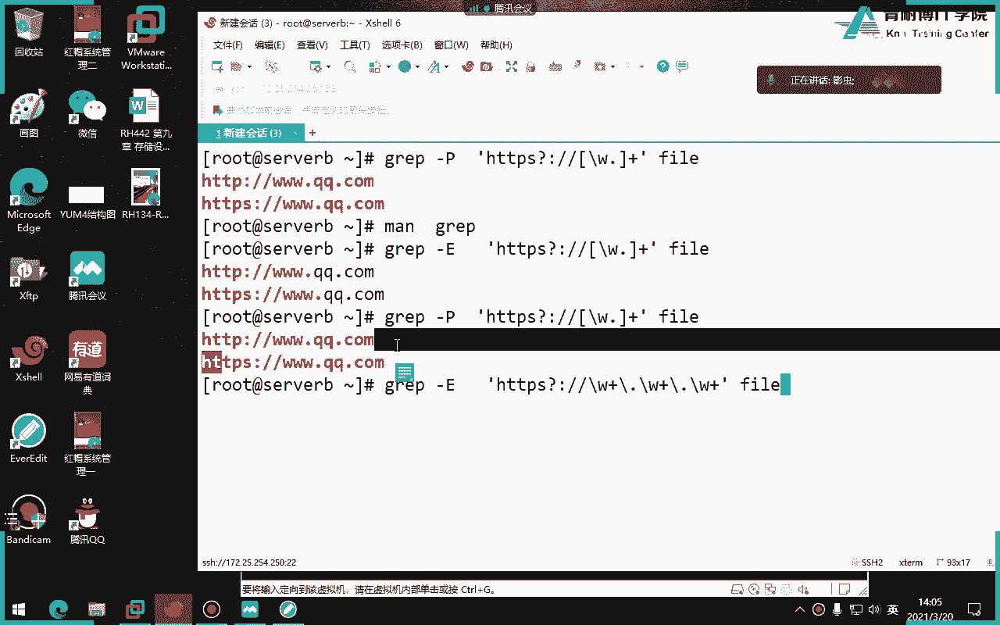

我我我是比较喜欢这本书，我会推荐给大家，ok ok必知必会啊，必须知道必须会好，你看这就代表数字对吧，零巴拉巴拉巴拉，那这个0~9可以怎么写啊，是不是可以选择中国号零杠九也可以啊，0~19好。

这是小写这个单词是不是小写字母啊啊嗯那就是大写字母对吧，大写字母没有，这就是正道表示，就说白了你就算不买那本书，一页ppt你能都搞懂，就这一页ppt你都搞懂，就这个表格的东西都搞懂，你就可以了啊。

你就真可以啊，真的很难啊，就能给他射了，难在哪儿呢，不给单选，每一个都特别简单嗯，就怕那种一结合就难了，那你说当你说哪个你看不懂对吧，就你英文英文看不懂，我给你中文版，你哪个看不懂，它都能看懂。

就比较难的，就是它一结合你还想不起来，这个是这个这个是最长最常忘记的，我比较就是那个tab键和空格，这你不用去记，就某一天忘了，你看一下表格就行了，谁能记住这么多字对吧。

你把他那个我给大家讲那几个季度就够了啊，好graf，杠v是a grape，这几个选项你要记住，那么we are r i的这类你要记住，还有就是如果多行编辑的时候，e是绝对不可以省略的。

好把那几个东西知道就ok了，在这个，没了这一章节就讲完了啊，就讲完了，那在你们休息的时候呢，我写了一个脚本，这个脚本我结合了两个事情，一个是变量，一个是呃，咱们学的那个大于号，二大于那个标准输输出。

还有一个呢就是a一句，还有一个测试语句，还有一个for循环，把几乎把今天所有的学的知识点都囊括在里面的脚本如下来看一下，能看懂吗，从第一话开始看，爆循环定义一个变量i并且取值是10 11 12 13。

为什么呢，就咱们那个虚拟机，大家知道ip地址吗，咱们虚拟机都是一千二点250250250点十十三万，a是三个b好吧好，我故意的定义一个11 12 13和12 13根本就没有，23是没有的。

但我假设咱们有啊度和done之间写测试循环与故事，写循环语句写什么呢，我拼一下拼几次一次吧，拼一下点二五点250点到了i什么意思，就是10 11 12，然后把p的结果扔给一个空洞。

整个空洞呢就是我不想要中间的结果，我判断一下是否是等于零，如果等于零，就说明这个机器是up的，哪个机是up的，就是对吧，这个唉如果不那个就代表到最后来来一句话叫做结束评测试，因此最后结果是这样的。

12通的11通道对吧，没有12吧，测试down没有13，也是当最后ph测试通的，听懂了吗，那么这个脚本我为什么希望告诉大家呢，因为在我们生产环境当中比较常用，你比如说你以后做集成系统集成。

你们做完了项目，这里面有你比如说咱们就部署这个环境嘛，相当于100台机器，你你怎么知道这100台机器通啊，那你可以用那个测线仪对吧，一个一个来来测，那我如果写一个小本一下跑完了不就行了哦。

我我甚至可以知道哪一台机器没通，我再跑到那台机器看是网线，网线没做好，还是机器根本根本就没开机还是怎么样，这不是一下子不就测出来了吗，明白了吗，这是一个很实用的脚本，所以分享给大家。

就是结合了今天的a规矩和for循环啊，一块来用，没有啊，把那个输出扔到dv那里面，还加个v吗，不加c怎么样，谁来回答，他不是如果不加c，是不是只拼10 11会拼吗，因为它不动，它不中断啊。

我刚刚就没加菜，你知道吗，忘了来来来来来，你看，对吧，你想想如果回家，你看他他会一直拼十是啊是啊，是一只品，你得让他中断才能切换下一个p 11啊，再切换下12对吧，c是count的次次数，次数不是中断。

是看见了啊，一定要平啊，这是很好玩的一脚本分享给你们，骗一骗几都行，你骗五也可以，骗五次也可以，但你终归得给我来个次数，但也可以，其实这个脚本如果还可以再搞一个，我想想二零，那么对换个音乐也行啊。

数据链也行，但就这个我是写一个比较简单的啊，行吧，一定要注意最后一句话一定要写在down下面，不然的话它会循环的打印，这句话能看懂吗，啊学会它，还有什么好玩的，我想想啊，这。

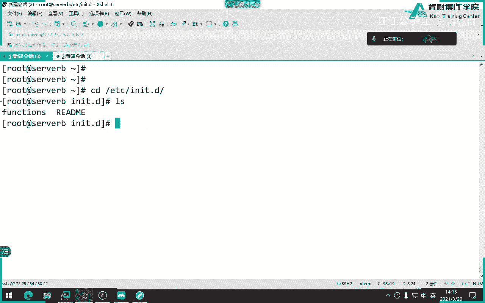

回拼拼写下来。

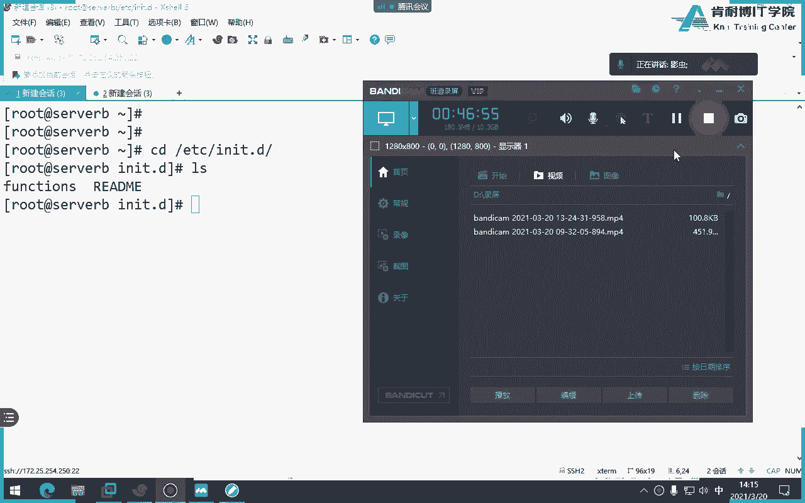

那个小本整体过程是这个样子，重新重新说一遍，首先我要用点代表引用这个系统自带的函数库，就是注意etc下面的i n d。d。function就是函数库，其中有一个动作叫action并true代表成功。

并force代表失败，因此做完之后就是成功的，它就会出现ok并且是绿色的，失败了就会出现红色的fa，就这样啊，这个这你也会这样写脚本会显得比较高端一些，没什么错，就说白了有点有点花哨一些啊。

啊其实没啥啊，没啥，ok大家可以记下来，我来给大家出一道题目，我把这个题目录下来啊，这是在上一个班，当中出了一个题目啊啊我写下来，我接下来啊是这样的，每一分钟，约了时间快，我就想每一分钟啊。

每一分钟备份放目录，到下不下来，命名为好名称为什么啊，别别别别，并且是吧，并且打包并且使用，打爆就相当于我用他打包被迫养，我再说一遍，相当于我用它打包备份home目录，备份到tp当中。

而且是每一分钟做一次，那我就模拟每一天做一次，好吧，你不咱就模拟，这题怎么做，哪个是分钟，十分钟吧好，那你怎么加百分号m看前面的语法格式是从mate这边都是format吧。

好而且format前面要加个加号诶，那我们搞一下看一下，比如说咱们现在直接打，是不是55分钟采集到了吧，好那我是不是可以在命名的时候，可以这样写啊，同志们，卧槽，是不是啊，同志们行不行行吧行吧。

你这样子，我现在是五五分，你但是56分的时候是不是变成后点t，56~57分的时候变成后点塔57，懂我意思吗，人家时间怎么来的，就是这么来的啊，你把这个给我写到哪，小本咱们起个名字。

比如比如说叫叫叫叫叫叫叫当当当当当当等等啊，随便进一个重来重来重来，咱们随便起名字，咱们写一个名字叫a b c，咱们就叫tr。s是吧，要不你咋不你把刚才那一堆血印就行了，我没有让你压缩。

你可以不压缩对吧，先贴到你的后面，再加个加号，你怎么知道的，通过慢速c也得到了，充不下来，这不就脚本吗，给他一个全权限，想起cron table，from table杠，一三十月中每分钟五每一分钟吧。

就相当于这样写一样的吧，分12月周，结束了，然后我们看一分钟之后有没有东西，稍等啊嗯，我去58，59六五十八，ok就完事了啊，ok 58来了，家长再稍微等一下，再等到咱们休息一下啊，休息到一分钟之后。

啊，是很有实战意义的一个一个小的小作业啊，你不会你也给我抄下来，回家慢慢理会，我再问一下刚才我起名的那个用时间那个单词能理解了吧，啊朋友们能理解了吧，好马上了，仔细看待会应该有个59吧分吧。

现在是58分，待会就一定有一个叫后面点t02：59，稍等啊，后面点他02：59，马上马上马上马好，ok退出来，卡加c退出走，你没有，大家想没有，如果你不用这种办法，你是不是永远只有一个文件叫后点com。

因为前者就又后一个就会把前一个覆盖吧，那怎么能叫备份呢，什么叫备份，备份就是我之前的东西也在你今天晚上备份，也在昨天晚上也在，比如我突然间挂了，你可以恢复，昨天你要背负，你要覆盖了，它怎么恢复。

那人家怎么出来的，就通过这个数量对啊，那我怎么知道加个，我怎么知道那个是要加一个加号呢，你看鱼把歌就是加format，那有哪些format呢，开始停，从这开始，你看有很多你比如我问大家。

如果是小写d是什么意思，对吧哎明白了吧，但如果大写的d呢，大写意就代表你什么年月日看到吗，f是什么意思，如果是大写的f就代表这样的年月日带横线的来我们看一下，比如说加个大写的f，对这样式的看到吗。

那如果是大写的d呢，你还是这样，那就就就就就就是格式不一样，明白了吗，什么叫宝妹的格式吧，就是你要学会用这种东西啊，这个主页还是想跟大家解释一下，你看又多一个又多一把，我不来了。

待会儿就把我这个这很占硬盘了，同志们，这很占硬盘怎么办，不想玩不想玩啊，rtable干什么，我不想玩啊，我不想玩了，对你不要说我干嘛呢，这几天天不想玩了啊，然后怎么按，但如果你这样做。

有一个不太好的地方，就是如果你写了一堆，是不是全部删了，最好是干嘛的，你刚才用口红table杠e用把那个注释掉，或者只删除某一行作业，好吧好，那个作业脚本就没了，小北在这儿看一眼脚本啊，懂了吧。

你这样才有生产含义，不是单引号，再说一遍，反斜线，做的实验不做科普，可有习题比意思啊，这个真的是有实战含义的啊，真的啊，各位我们以前在公司里面写，我就是用这种办法后面加时间，结束。

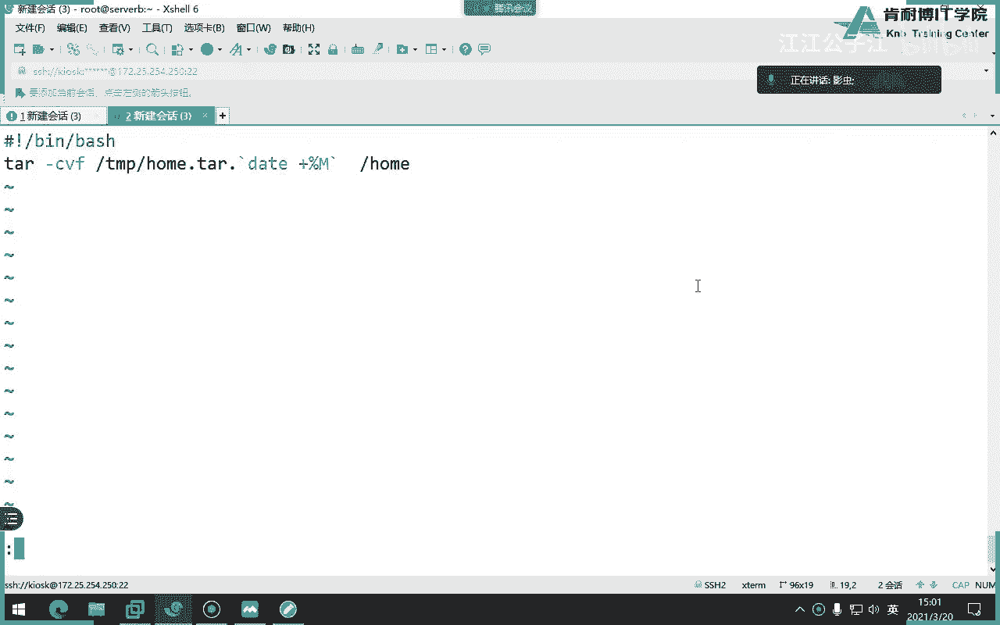

那大家能听懂了吧。

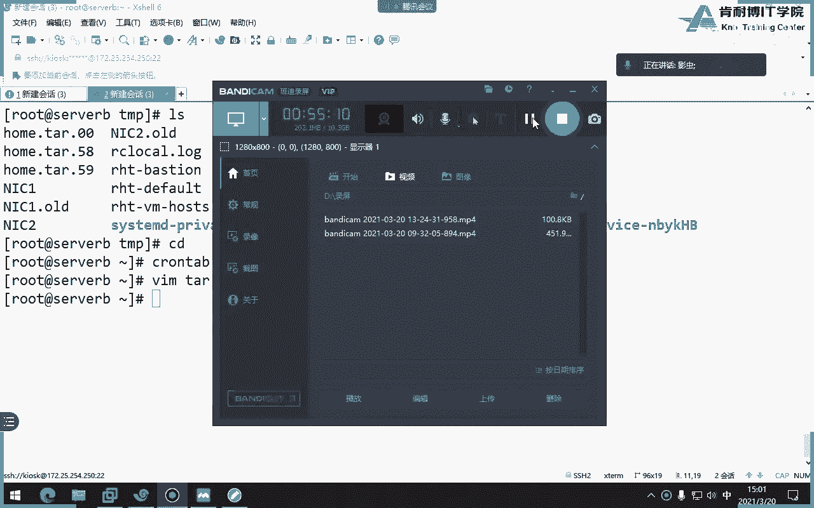

那么关于计划任务的核心部分就讲到这儿，那我们接下来再讲一些零零散散的东西，什么东西呢，大家看啊，任务有一个黑名单诶，在这ok dn，你看我这么做，你看我现在，打开黑名单，我是管理员，我是管理员。

同志们写上一句话，某一天某一天，这个学生他想做计划任务，不好意思，你被禁止了，懂了吗，你想让谁不能够做计划任务，就把它写到黑名单，我们称之为黑名单啊，迪娜好吧，这个简单吧哈哈，黑名单啊，把它写出来。

就它就可以搞黑名单，书上没说，你知道一下一下，今天接下来还有什么内容呢，但你会发现当我按下table键的时候，你看除了黑名单，刚才之外，黑名单还有很多这种这种还是天马小时月中。

也就是说如果他们计划任务有两种，一种是我们自定义，就刚才我们说什么两分钟啊，三分钟是我自己定义的时间，还有一种呢就是chrome table家伙自动的给我做了几个这样的目录。

这是系统自带的一个呃这个qun tape自带的这种计划任务目录，你只要把一个脚本放到这个里面，或者这个里面，或者这个里面或者这个里面就可以执行了，但你问题是什么，问题是问题是肯定没有你那么精准的时间吧。

比如你放在越代表什么，可能他每月给你支持一次，每月哪一天不知道要放到这儿呢，再把每一天给你执行一次，每一天每个小时执行，我也不知道，就是你可以把脚本放到这几个目录当中，这几个目录对应的是天的小时的。

很周到，一般我们不会这么干，不过我们还是习惯性自己做吧，是不是习惯性自己定义时间可能tp更易，但系统也可以说，你看比如说九力的，我们进到这里面，一个wink啊，没有东西进到。

好也就是说这里面已经写好了两个脚本，系统自带的两个脚本，它已经放到这里面了，就可以直接被执行了，直接被执行了，好吧，就这个意思啊，油耗怎么就跳到哪了，这就是计划任务的一些小东西。

你要你要给我记住的是分时日月周，真实最重，这个就不说了，没什么问题，你看看今晚任务还有啥，就在这儿，你看你要是实在不知道忘记了，你看人家写了吗，零也是星期天，七也是星期天。

你说那就是corontap系统也包括了一些额外的脚本配置啊，比如说每一小时的周的月的，你把这些个目录，把那些脚本放到这些目录里面，它就可以调用目录下面的小本啊。

请注意注意任何放在这个目录下面的脚本一定要执行权限诶，如果你没有执行权限，他就不能够撞，就你把它放进去，你没权限，他还是执行不了，大家不要认为把它放进去就能执行，一定要权限，这个咱们已经强调n遍了对吧。

文件没有x是没有办法执行的，好吧好吧，啊当然我们还有一些这啥东西啊，但还有一些什么，还有一些这个日志还记得吗，日志计划任务的日志啊，这个地方计划人物的一致也可以放在这里，这就是这一章的一些内容。

教材当中还有什么，教材是一样的，这更新的一个管理临时文件啊，tp下面不是包含了很多临时文件吗，他怎么去进行清空的啊，我配置了一些东西，这个了解一下吧，了解一下派仔细讲一下，自己回去了解一下就可以了。

比如这一章就没了，这张主主要就讲的corontable这一件事也只考你这一个啊，文件都给大家了解一下就行了啊，嗯好暂停吧，一会儿我们待会儿来讲第三章，今天结束，讲完第三章，我们今天就结束开始啊。

我们来讲第三章啊，今天下午最后一章叫性能调优啊，一听这个名字感觉好很大，对吧啊，我们还没刚学几天，就开始学调优了啊，不要被它的名字误解了，这是一种傻瓜式的调整，我跟你说，我们家买个路由器啊。

我会调路由器一样，其实路由器什么傻瓜式啪一插就用了，让你跟你这敲那种命令，让你挑了对吧，哎这个一样，红帽七当中这个工具应该是红包六，我忘了应该是红毛六，红包六吧，嗯引入了一个新的工具叫td工具。

n d我忘了是七，应该是六，应该是六啊，六引入了一个新的工具叫t n d t用这个单词翻译成中文不就调节吗，兄弟守护进程，这是一个帮助系统管理员做了一种傻瓜式的这种调用，它可以有很多的这种什么呢。

注意它有很多的这个这个这个预定好的这种这种负载配置文件，你可以选择一个在配置文件，它就自动帮你调了，你都不需要懂他这个配置文件里面写的哪些值，你不用懂，就咱们现在的情况你肯定不懂。

你只要选择它就自动帮你调了，咱们以前说的虚拟机，你只要选择net模式网卡，它就自动上网了，它里面的原理是什么，你可以不知道，我能上网就行，明白吗，这个也是好，所以系统管理员拿到这个qd工具之后。

可以对不同的这种工作负载进行调用，就这么简单，这不过咱们的兄弟这个这个进程啊，在调的时候有两种状态，一种是静态的调优，一种是dynamic动态的调优，所谓什么叫静态调优呢，理解一下什么叫静态调用。

就是那个服务，一切服务一开启的时候，他就已经按它已经按照预定的值已经启动了，它并不会随着我这个负载的变动就更改里面的值，这叫静态，那反过来什么叫动态的，是我打开一个兄弟服务之后。

他会随着我不载的不同进行调优，比如说这会儿cpu用的高了，ok他把调得好一点，内存用的多了，他把cpu是那个内存给他调的好一点，明白了，他会根据不同的这种工作负载进行调优，但是在的系统当中。

td的动态调优被关闭了，就是咱们现在默认情况下使用的kd这个服务是静态，你看咱们的c我们现在别讲c啊，咱们讲的c e c e在当中已经告诉大家了，红帽八当中的tnt服务的动态条约默认是禁止的，为什么。

因为你也知道它要有一个东西去侦测我们当前的系统的负载，这个侦测的程序会有一点点什么，我监听一个服务之后，我这个监听程序本身是不是要有一些消耗，你好意思吗，哎所以他把这个关闭掉，关闭掉了好。

那你想打开可不可以啊，当然可以了，我就想打开动态可以吗，当然可以啊，可以打开，那么咱们先说一下怎么去使用听力啊，虽然好用，但是没有装，他默认你得给我亚密斯到，装起来这条命令干嘛呢。

你那么杠杠道是什么意思，就相当于star，并且引力able明白吗，并且引力able啊，好那么我们先来装一下，ok ok ok就ok咱们就在b当中去做吧，无所谓，你先把它装起来哦，他段我已经装过了啊。

很好很好，然后也没报一下，好中过，那么我们刚才讲一下，我如果特别想用动态的怎么办呢，哎在这说话没说说很嗯很那个什么很含蓄的告诉你们有动态，但他没告诉你怎么打开啊，怎么打开怎么打开呢，我教大家。

我教你们啊，咱们c当中就写了c这本教材就写了，就在这儿，在这ok看一下a的教材，写是在b t c t d下面的td。me。com文件，打开看一下默认是几零是什么，我说过关闭的是他们没打开。

ok我们打开改成一好，同时下面看这句话很重要很重要，第18行，如果你打开了动态调优功能，它就会每隔十秒钟进行一次调优，可以把这个中间的间隔值调成你自己的，比如你想改成每隔五秒钟可以吗，可以啊。

你把它十变成五，懂了吗，如果你不改呢，就十秒钟就这个意思啊，就是他每隔十秒去侦测一下会或者更新一下你当前的值，懂了吗，好ok专注要干嘛，怎么生效，你不resign，人家才不理你呢，对不对啊。

哎重启结束了，听不简单，这是红帽四，咱们c e当中没讲的，但是咱们c说一下啊，c类教材当中给我们说了，而且是在这里面注意事项里面说的，你看默认情况下，我们动态调优是被关闭的，在红爆发当中。

请在这个配置文件当中里面找到这个值设置为一，默认情况下是十秒钟更新一次，你可以找到这个值进行调节，请注意，做完之后，restart听力服务是不是我们刚才做了一系列动作，好继续调回来。

那我们现在还有一个疑问，我既然使用td讲过td里面已经有很多的这个上午说过它叫什么配置，他给我们做好了很多的预设的配置文件，我们直接使用它就行了，哪些配置文件呢，来各位有这样记住，我直接看表了。

这个中文里面字咱们就不看了，直接看表，有这么多，balance your desktop，有so put performance，有巴拉巴拉巴拉巴拉一堆好，那你通过名字咱们举个例子，这个是啥意思。

唉比如说比如说我老板说咱们现在这个月的他妈的电费太贵了，你你你你怎么玩了，你你给我调个节能的，诶，不调咱们怎么怎么样让它节能，咱们的手机上应该把屏幕调的暗一点，wifi关闭对吧，那么蓝牙啊。

不要开那一样，咱们服务器也可以这么搞啊，比如说我尽量不开蓝牙腿吧，说你一个服务器开什么蓝牙功能，你疯了吧，是不是可以关闭啊，好那当然了，除了我知道关大家之外，我什么都不知道，那怎么办，没关系。

你选择power save这种方式，这里面就会做一些设置，什么设置你不用关心，你只要选择pvc 5，咱们现在这台服务器立刻变成节能型的好，那我现在跟老板说，那节能不行，为啥节能虽然省电。

但是你的性能不太好吧，对不，我要玩很很很很牛逼的这个游戏，那怎么办，我们这都干嘛了，能吧，高吞吐量吧，咱们要达成supperformance，你看最大的一个吞吐量。

咱们只要把power save切成它就可以了，具体他为什么把它的性能提高了，你不需要知道，为什么比如说把显卡开起来了，把特效开起来了，我们把加速功能开起来了，但具体你怎么怎么设置，你不用关系。

所以说你看这些个配置文件，咱们只要知道就行，你不需要知道它里面的知，这次咱们的教材当中就没有告诉大家他到底为什么，那待会我来告诉大家为什么好，咱们讲完啊，咱们一个一个来分析啊，这虽然是英文教材。

咱们还是要知道一下啊，是干嘛的，你来看这个后面是做平衡，跟谁平衡，从节能和最大性能之间做个折中吧，就又能节能，还能做到玩玩游戏，就这意思吧，唉这样很简单，咱们是不是把屏幕调成50%就行了。

乔泰安人看不到了，对不对，好第二个，什么叫desktop，注意detop一般发生成中文，是不是叫桌面做什么快速响应，response，response快速响应，比如说谁会用desktop呢。

台式机或者笔记本，快速的响应，什么叫快速掉，比如说举个例子，我按一个qq需要这么快显示出来，就是我我只要做一件事，他的任务调度要很快，你半小时才给我出现这个qq，那我还玩什么对。

所以像这种就是桌面型的应用，我们就是响应速度快的，我们选择desktop，但具体它设置了哪些值，造成了dsp响应快，你不需要知道，我们待会儿要知道啊，但是我们知道好，再来看这个。

刚才讲过的是全速模式对吧，咱们把它翻译成中文叫全速模式，就是最大的什么，什么叫做吞吐量，各位，你一口能吃八个八个馒头，那你那个吞吐量大对不对，哎就是能够更更更更嘛，更多种容量的一种数据的一种传输吧。

对吧好，那这个呢，叫什么延迟是吧，是不是延迟对，你看需要最低延迟的这种类型的，我要调成这种最低延迟，其实延迟是不是什么叫延迟，就是我按一个键发生发生这个指令到最后一个回应之间的一个时间段，是不是要延迟。

但情况越少越好了对吧，比如我我现在要读一个文件，拜拜老师再给我传过来，那那完蛋了对吧，这叫延迟吗，我需要对延迟敏感度，延迟非常要求高的话，我选择这一个它的低延迟吗。

那因此这里面有很多的系统内核参数来帮助我们做低延迟，什么内核参数你不用管，那下面这是干嘛的，这个是延迟，这个是对网络延迟，注意network这个对网络延迟要求极极高的，现在看电影。

你别一会儿把刷新半天没没给我刷出来，我要要求网络延迟特别高的，而且大家来看网络延时是通过谁来定义出来的，你看上面不是写了吗，看from意思就是我如果想用网络延迟里面的参数是基于它的。

我是不是可以理解为这里面有一些父子继承关系，你想用网络延迟之前，你要先用它上面这个，因为上面这个是什么d延迟好，那这边呢做什么吞吐量，啥意思，我需要发包的时候，我们的buff要大一点。

我们的缓冲buff要大一点，我不希望我的这个缓冲区如果很少的话，我每次只能发一点点数据，比如每个数据包很小，我buff大一点，好power 4又不说好二个大家知道吗，听过数据库诶，挺有意思的。

从红包八开始之后，他单独专门为这个oracle设计出了一个调优，因为这台电脑各位这个比例或者这个服务器，咱们可能要装oracle数据库，那我们奥数库里面肯定要对这个数据库做一些调优吧，你不会没关系。

我们选择它，但没有专门为oracle做一条优能，理解吧，好最后两个很有意思，最后两个是关于虚拟机，i guess，一个叫host，我们知道如果学过虚拟化的同学，应该知道host指的是什么。

主机还是虚拟机，而guest来宾来宾才是指的虚拟机，好那这两个有啥意思呢，注意如果你这台电脑是为这个电脑，是为服务器的物理机来测来来去调的话，一定要选择host。

你认为这个服务器里面的某台虚拟机来调优的话，选择上面的人能理解了吧，好那么这个里面是为装有虚拟机的物理机来调用的啊，老师我这台电脑根本就没有装虚拟机，那你就不用v 10号出龟速host。

只是为有虚拟机的物理机来做调用，有点有点绕啊，各位好，自己上这几种，还有谁听不懂，在当中讲到这儿就结束了，那么我们接下来先把教材讲完啊，好那我们接下来来学学学学习几个傻瓜命令，各位同学来看。

通过使用q d横线的命命令，能够改变当前听d的配置文件，它可以做这样几件事，就听d main这个命令可以做查询，列出推荐关闭这几件事，kd这个命令可以查询当前用的哪个面，哪一个关闭和推荐啊。

单词指的就是查询当前我这个电脑正在用的是哪种profile，就是配置文件，你来觉得我们现在这个server b你会觉得他是那种，然后，不用问了，因为你本来就是他妈虚拟机嘛，对不对。

变变变变变变变变变成节能的，这个单词prefer是指的是切换成哪一种，再来看，立刻变成节能型，哈哈有意思吧，好我还可以干嘛啊，比如说呢同志们，我这个电脑我我不太会，我没有学过调优，我也也不知道。

我这个电脑现在此时此刻应该用这个表格当中哪一种比较好，我不知道，那就这样吧，兄弟能给我做一个推荐好吧，这个单词是不是推荐哦，他推荐我用这种方式，那好吧，那咱们用这种方式吧，能理解吧，同志们。

他推荐我用这种方式，来看确定吗，这个命令是就这么简单，考试必考啊，这题啊，这章就考这题，考什么问题呢，他这样考的，各位考试很有意思啊，请用推荐模式推荐出来你当前是啥，然后用啥，他觉得他没有说。

请把这题改成power save，它没有让你用具体哪个，但你说请用推荐这个命令和的适合你，适合于你当前的状态的这个推荐，然后你发现它是什么，然后你再用什么，明白吗，相当于两条命令啊，一个是打哪个。

打这个，然后再打power fl，后面加上他推荐出来这个对了吧，100分满分就这么简单，就考到这结束了好最后再来说一个of，看，来看对了，关闭啊，就不再跟你玩了，同志们，我就不关了啊。

咱们待会还得上课用，我就不关了，不关了啊，你看你一旦关闭之后再用active，他直接告诉你什么没用哦，结束后面再教教大家用图形化界面来再做一遍，那简直就是垃圾了，这个那就没了，你看教材简单嘛。

你看这个题目简单吗，你自己都可以做，首先装一遍服务，然后看一下这个服务菜不菜，然后紧接着列一下啊，这个我没讲，这是列书啊，这个说一下这个电脑当中支持的啊，列出默认的所有的profile文件。

你看就这么多desktop，拉巴拉，还有一些咱没学过的，看到像这个是啥东西，h cp是什么，是那个哎a h c p是啥意思呢，是那个是超，融合吗，是不是窗口也是h开头，我忘了啊，忘了那个cp是什么架构。

是吧啊，忘了忘了忘了还真不知道，忘了好明白吧，反正就那么多好，这就考试要求没有，这张就结束了，红包的c e这一章就结束了，考试的时候就说那一题它要求你先推荐什么，在用什么好。

那接下来我们来讲一下c a的内容，给大家补充一下，可能有很多同学跟我当时在学的时候一样，有这样的一个疑问，为什么选择performance啊，为什么选择那个power save，它就变成节能了。

desp它就变成那种destp模式，它在读取的哪个配置文件，换一种角度来问各位，你们要记笔记了啊，我换一种角度来问，刚才你看到的那些个文件，就这些文件它放在哪儿呢，说那个h p c computer。

或者是那个这个家伙带错误，它放在哪儿呢，他放在哪儿了，哎我们要跟大家说清楚，放在这，全是什么蓝色的是目录在这儿啊，全在这儿，原来在这儿好，那么你比如说我现在进入到power se。

同志们有个东西叫听点c o n f f，原来读的就是这个配置文件，而这个配置文件里面有什么，有一些关于能够节能的和参数来，但是你肯定看不懂啊，你肯定看不懂，但我只让你看一眼，你看这些都是内核参数。

保证了我们这是节能型的，比如说你能看懂看看过吗，张掖啊，写张掖还有什么，我也看不懂啊，像那个哦一个gv啊，就是那个cpu电源方面，你看网络方面就是一些那个啦吧啦吧啦，反正一堆吧，明白了吗。

你说他独取的是每一个目录下面都会有一个td。com，你比如说我们现在进到那个时，put就是全大量全吞吐模式，动力都是蓝色的，蓝色代表目录进去了，它里面一定会有什么，一定会有一个看听d。cook。

我们进去，这里面又有一堆参数，但保证了网络就很显色，是干嘛的，你知道吗，做的那些buffer有没有学过，不用关心啊，就是tcp和udp的那种那种那种传输buff来做这个调用。

所以它能保证我们的网络的最大的延迟啊，最最小的延迟和最大的吞吐量，明白了吗啊，这些都是内核参数，因为这个有点深啊，你不用了解啊，你不用你只要知道哦，原来目录都放在哪，放在这个目录下面。

并且每一个目录下面都有自己的什么兄弟文件，这就是原理，你要知道为什么我选择power save它就省电了，他读的哪个文件独立在这，那我请问大家，咱们能不能自己改，大家想想哎，来来来来来来来仔细想一下。

同志们还是说啊，教材啊，虽然说我们听力很牛逼对吧，它给我们提供了这么多的什么模式，但是你也知道在真正的生产环境当中，咱们的负载是千变万化，没有一种能够囊括所有的负载情况吧，我想自己写一个配置文件，可以。

各位这是可以理解吧，咱们可以自己写的啊，这点要清楚啊，我们往下看看，还有什么要重点讲的，在前面都是原来老命令对吧，咱们都学过了啊，这都学过了，这是推荐对吧，也学过，这是关闭，也学过好，这是这是为什么。

通通话界面不说不说不说不说好，就在这儿看到吗，其实在这说过，所有的这个目录下面保存着所有的配置文件，是由红帽提供的，所有的配置文件，每个配置文件知道吧，拥有自己的子目录啊，所有的听地点靠谱。

是放在自己的子目录当中的这一这一段英文能看懂吧对吧，还有一个目录是etc td点横线命点com在里面干嘛呢，还记得吗，刚才调什么十秒钟还是打该动态，那个巴拉巴拉巴东西，这次放在这儿，这你不用管关心。

你只要关心这个上面有，好那如果我们现在自定义想自己做一个这种跳跃，那我是不是也要跑到这种东西下面，建立一个蓝色的目录，目录里面写什么，想要一个qd。com，qd。com里面写什么，写各种什么内核参数啊。

对吧好，明白了吗，哎问题是咱们得学会一下这句话，在写之前，咱们要学会这一段的英文，他说咱们听d的cfa profile，就配置文件支持多种类型这种配置机制，比如说。

单词和内核启动时需要的各种各样的可用的，注意了，playing按照中文叫什么差，那你有听过吗，插线好，言外之意就是咱们刚才看到的td。com里面，所以所有以中括号开头的同志们，就这些。

所以中号开头的都叫做plin，除了第一个me不代表插件之后，所有看到的这种都叫插件，来看一个举例子啊，随便来咱们就进他还请他除了第一个命之外，剩下的这些个不好，那再重新一个比较特殊的，咱们这个吧。

第一个不代表插件，剩下这个是插件，这是插件，不不不，这个不是因为他没带中号，在中国号都是插件，所以我们接下来就要学会，怎么知道这些插件以及这些插件是什么意思啊，这这个插件啊再说一遍，咱们怎么调。

怎么就是听地点com里面咱们怎么去调呢，说白了就是写各种各样的插件，好吧这个意思啊，你看这个什么叫mean呢，mean是指主要嘛，这个mean里面主要包含什么，包含是一些描述信息。

这个你自定义的这个q d。com做一个描述信息，比如说这是测试文件，你可以写作，对吧好，还有一点include是什么意思，翻译成中文，刚才我讲过，大家也看到了，刚才那个网络延迟的时候，它使用的是谁。

是不是有个负极，哈哈哈哈，表格呢，就你会发现有些这个这个咱们要自己定义的时候，可以完完全全部自己定义，也可以引用谁，因为有时候我要引用它的功能来加载于我，所以就要用include这句话什么意思。

我自己定义一个号，他这一关就是oracle oracle配置文件，它引用了谁，through put performance，这个这个配置文件看懂了吗，能听懂那一样，咱们待会儿在自定义的时候。

我觉得里面有一个功能要引用oracle的，那这边就要写成n code，等于oracle，懂了吧，好剩下的只要不是mean的，剩下的所有都是插件，比如说我来举个例子。

像这个插件主要指的是下面写的是内核参数，这个插件指的是内核参数插件，这个xy s c t l指的是内核参数的插件，这几个这三个你没学过，这三个都是关于内存调优方面的东西，商业商业商业听过吗。

学过大学里面学过咱们计算机原理的话，有张毅啊，所以商业是什么东西呢，举个例子啊，我，还拷贝呃，我从硬盘读取的数据放到哪，就先放到内存里面，就是啊啊，这个时候注意咱们的手文件默认情况下应该是放在哪的。

放在硬盘里面，但我要从硬盘调到内存里面去执行，那这时候如果突然间修改了呢，那改了之后这个数值跟你原来从硬盘数数据比较的话，这不就脏了吗，懂了吗，这个商业，那你想象一下，如果突然间断电了怎么办。

你这些新改的东西都没有保存，这这边要有个商业的回收吗，达到10%，回收率在3%的时候，我就要回收，因为你如果不回收，突然间断电怎么办。

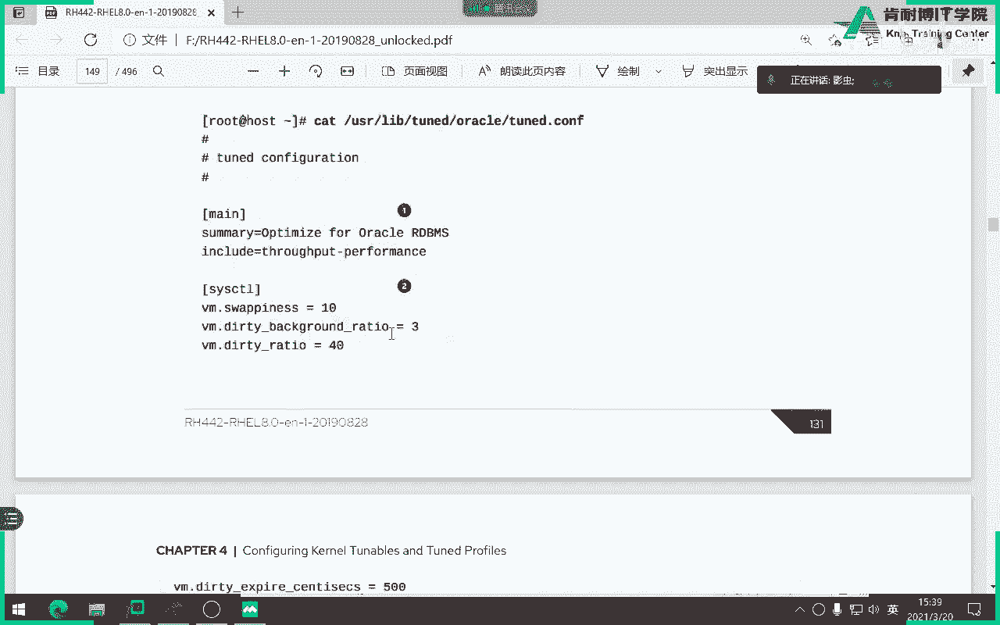

咱们现在office默认情况下，word文档，你写它是不是隔一段时间自我干嘛，so save保存一下啊，这个意思明白吗，哎张掖回收懂了。

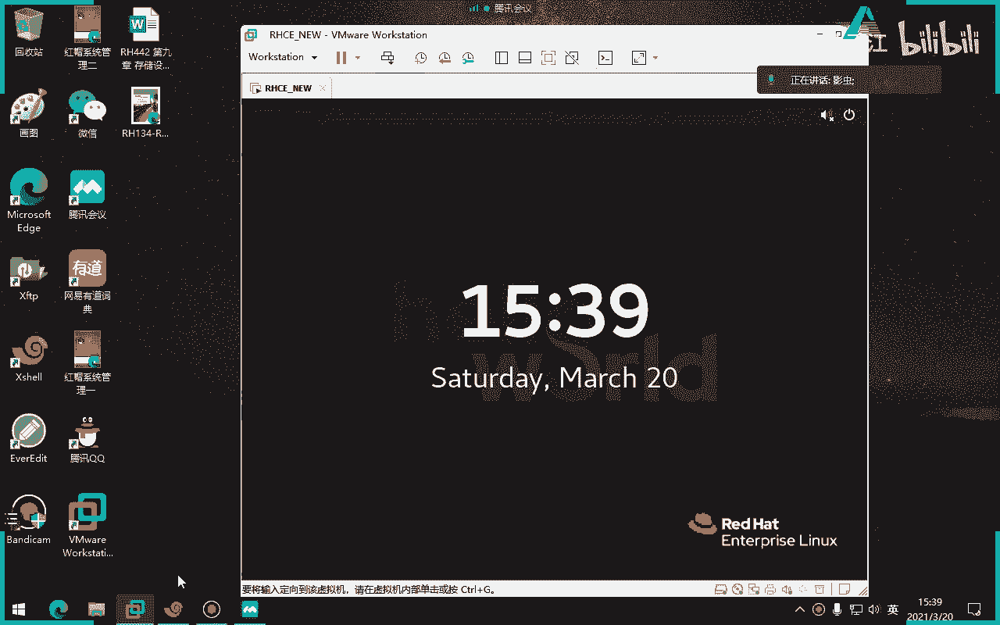

哎，所以你你看下面这些，刚才我们看到这些值都是张掖好，咱在这个比较专业了，不说了啊，这些都是谁都是都是啊，像这个就是和参数的什么好，那那个vm这个插件什么意思呢，啊这个我因为已经超大纲了。

你能听懂就听懂，听不懂算了，这个vm这个插件指的是关于透明大业方面的东西，是否打开透明大业，所以这句话就代表不打开透明大，那这就很专业了，什么叫透明大意啊，咱们就不解释了啊，好吧好，那说了那么多。

我我如果想对cpu调呢，那就会插件就变成cp，我想对磁盘条呢，这边就变成disc，drsk disc，这些东西都是插件，都是插件好吧，比如说我们现在写一个，各位咱们随便写一个啊，在这在这好，太好了。

这就是这意思是对v db这个磁盘进行调优，调什么用呢，调这一堆东西，阅读磁盘，预读40964096就是多大四兆吧，四兆吧，唉四兆预读机制吗，啊好我们来写一个吧，这样咱们自己来创建一个我我我有写着玩啊。

你能听懂就听懂，听不懂算我写着玩的，我说过，既然你想自定义的话，咱们要跑到哪个目录下面创建目录，啊啊咱们上一个目录目录名字，注意你的目录名字叫什么，你待会儿在换成你自己的时候，那名字就应该叫什么。

比如我们叫做my team，随便名字随便提好，请记住我们要干嘛，建立什么，有什么靠谱吧对吧好，第一行先写什么，好这样吧，咱们需要引用谁啊，咱们比如说需要引用啊，比如说他c随便写着玩啊，那肯定不对。

power怎么拼，然后我还要做一件事，比如说我我我我就这个吧，我随便写的玩的都不用太解释，说30啊，好我就写这两个啊，当然你不用关心他什么意思啊，好做完了做完之后怎么办呢，注意你现在肯定没挑呀。

你现在肯定没调啊，现在还是谁，你这个自带的，那我怎么调呢，你注意这么调，变了什么，my，我刚才是不是叫了个哦，我是不是得哈哈，应该是这个意思吧，我忘了看看啊，应该不用重启一下，名字起错了。

你看名字起错都不行，你看人家叫听d。com看了吗，哎名字错的不可以啊，各位绝对不能写错配置文件的名字，配置文件的名字不能起错啊，这样才可以啊，然后不用起伏，不用起伏，直接来，就用我现在用我自己的了。

懂了就用我自己了，这就是这样，这个就不是咱们大纲里面要求，但你要知道一个原理，就是首先我要跑到哪，跑到这个目录下面，目录下面，然后去建立一个目录，注意你的目录名字叫什么，你prefer文件就叫什么。

然后跑到这个目录下面配置一个叫td点，我刚才少写了个d，你看稍微有一个单词拼错，你做就失败，你一做就失败，那么刚才我们讲的那几个插件呢，你确实有点难了，因为咱们没有学过性能调优。

你只要知道咱们其实利用各种各样的插件plying来做个调用，这个td啊讲到这儿就行了吧，因为这就不讲了，不讲了，我只是想让大家知道它的一个整个的一个结构体。

因为教材当中就没再讲它到底读取了哪个文件以及哪些个目录，那讲到这儿就结束了啊，你自己要知道，这张优先级按道理来讲，应该是在我们的红包的第一本书的那个进程的来讲，但是他现在单独分出来了，讲在这讲了。

所以咱们今天来讲，其实这个单词大家肯定都比较明白的对吧，那咱们可能会认为只是对任务之间的一种排序啊，那么我们也知道cpu呢在单单c时代就单核的时候，就一个cpu的时候，我们是怎么实现多任务呢。

各位怎么实现多任务呢，任务就是感觉上很多进程一块来执行，但其实我你知道在单个cpu那个那个时代，我们每一个cpu上面其实只有一个进程正在运行吧，我们可能运行两个吧对吧对吧。

怎么感觉像哎好像我又可以玩游戏，又可以聊qq对吧，怎么回事呢，是这样，他为每个服务哦，不是他为每个进程都分配的比较时间偏移时间线，那么由于这个时间片呢很短暂，可能是微秒或者是纳秒，很快对于我们人类而言。

是感觉不到它的切换，比如说我现在有十个进程，每个进程都干嘛都都会分配时间片啊，你运行一会儿，然后接着再切换到另一个进程，然后再切换到第三个，第四个，第五个，那么在我们这个来来看的话。

好像是都在同一时间运行，但不可能的，它是干嘛进行一种切换，但现在我们cpu都是什么双核多核对吧，那么这个时候我们可以真正的实现什么，一比如说现在双核是不是就可以有两个进程一块运行了。

哎这个时候就可以干嘛，真正实现了，最终，任务好了，那么甭管是多任务的还是那种时间分片的啊，我一定要解决一个问题，就是哪一个进程才是下一个cpu要执行的进程吧，是多任务的还是还是呃。

你甭管是那个多核心的还是单核心的，你都要去干嘛啊，复制到你cpu当中去执行，那哪一个开始执行呢，这个项目，那我为什么先执行那个，而不是不执行那一个呢，哎这时候我们有优先级这个概念。

进程它的重要性是不一样的，重要性是不一样，所以说我们就要有有什么有趋势，但形成呢让它占用一些cpu时间片，不太重要的进程呢让他尽量少占用cpu时间片，那么问题来了，cpu的调度策略当中。

我们现在的系统的调度策略当中有多少个优先级能，你如果看40就错了，c e教材没写，但是我们来写给大家看，在哪扎针，从内核的角度来讲，咱们是0~139，总共140个进程，我们把这个图片记住啊。

咱们从内核的角度来讲，咱们调度策略把进程的优先级分成了0~139，从虚线这个位置一劈两半，是高于评级，右边是低于平级，数字越小，优先级越高，不要这边高于先级，是实时进程的，你调不了啊。

这边右边这边第一片级是是是非实时进程的，咱们能调，咱们能够调，能理解吧，再说一遍，咱们进程的优先级是多少，0~139，中间一分啊，两半左边的是高于分级是谁，实时性，右边的第一个选几是谁。

进程咱们能调的是谁，你看所以说你看你光看这个教材，你根本不知道他在讲什么，他讲的东西太少了，很多同学就误就以为就40，那个图很多同学都有个优先级是40，这错误的理解，而且人家人家人家说40优先级了吗。

没有啊，人家说的是40，nice值好，我要跟大家解释，第二个容易让大家误解，因为我当年学的时候，我误解了多少年，认为误解为把nice值理解为优先级，这是完完全全错位，优先级是优先级。

nice值是nice值是优先级，那么很多教材和很多一些老师在讲的时候，他不注意区分，他就说nice是优先级啊，很多同学啊，nice是先级多少是40错了，优先级多少，139 40个。

而我我们能够调节的是后面这些地域分级的非实时进程，用什么来调呢，用nice值，明白了吗，说nice只是影响优先级的，但它真的能调的只是什么，费时晋升是多少，是-20到正19，总共40。

能够调节-20到正19，普通用户只能调节零到19，下面这句话最重要，数字越小，优先级越高，高来同学们，我现在是管理员，我如果我的进程了nice值，我仔细听我说话，不是预言家啊。

我把我的nice值调成了-20，大家来看，其实映射到我系统层面是多少，这边白白你有没有发现你调来调去还只能在第6年级范围调，说白了你能影响人家的实事进行吗，什么叫实时进程，大家知道什么叫实时进程。

你在医院，你在那躺着，突然间不舒服，他你按那个后边零是吧，人家护士就能跑过来跑过来，因为你按那个零是吧，每个病床的床头上面是不是有那个按铃，你按那个零之后，那边就应该立刻报警。

或者是想那个灯护士就可以看到，或者医生就可以看到，这就叫实时进程，它要在一个范围，一个一个非常短暂的时间内，一定会给你一个响应，这叫实时进程，保证你一个响应的实时进程，所以说这边的优先级一定是最大的。

你不能调，那谁来调，这对你我是没有办法调节的，那那谁来调内核，因为内核去干嘛去进行一些调节，咱们只能调节，你就老老实实给我调节，特别，千万注意啊，有人说调优先级nice是错的。

nice只是影响优先级的一个因素，而且还只是其中一个因，有人认为要这个话不能这么讲，就在早些年，在红包六，就我当年学的时候，红毛五之后，咱们优先级是一个非常重要的。

因为我把调高就说白了我把把你个nice是调高，你就是比我优先，但现在不对，从红包六开始之后，就是内核是2。6。23之后，我说版本不是红宝版本，说内核版本，咱们现在内核版本教大家大概知道多少吗，4。4。

18左右啊，从内核2。2。6，6。23之后，咱们的优先级只是影响你这个进程的重要的一个指标而已，而不在是绝对的，为什么一个最经典就是有些任务不是很重要，但你偏偏把它优先级调的很高，让他一直干嘛。

把我cpu资源给他占用，而比较需要等待的运行的比较紧急的任务，没有任何机会得到，是不是不公平，那不公平，那怎么办，所以说从红红帽的2。6。23，在这个二三之后，咱们的调度策略就被变化就改了。

使用一种叫做完全公平的队列算法，当然这么一说就远了，它名字叫cfs的，就是公平的单词的缩写吗，完全公平的队列算法就是只是影响你这个进程是否被调，是否被下一个cpu所调用的一个权重，一个因素而已。

-20到正19，只有管理员能调节-20到正19，普通用户只能调节零19，数字越小，优先级越学级越高，明白吗，越高哎，如果你用top命令，同志们命令看到的pr值这个位置pr是什么意思，加速说一。

如果看到是rt，说明这一部分的进程属于实时进程，大家看一下，那没没没仔细看过吧，来看看这个线条，同志们看直接在2p2 p什么p2 ，什么意思，nt是nice，是啊，两个不一样，如果你看到这个进程是rt。

你就不用看他肯定是就是进程明白吗，好但是你看如果像这种数字呢，哎就这个很厉害，这个意愿就很高吧，对应的是吧，还可以吧，同志们还可以明白了吗，哎你要能够理解啊，能理解p2 才是真正的局限极。

而n n i呢叫做n值，啊你理想理想理想按q退出，别，中文教材还写了还写了些什么东西啊，20到正主有摩尔情怀，是不拉不拉哦，这边要跟大家讲一下进程的nt值偏题，他也是继承负进程很重要。

就是我们知道所有的进程是不是通过附近程派生出来的那一样，你的子进程它也会继承父进程的什么，那些末世几，只要开启一个进程的时候，我们的nice值，如果你不调，各位都是零，其实对应的是谁，大家看。

120g吧，差不多吧啊就是也不低也不高，就是中不溜达哈哈，但我所谓的不高不低，不应该跟这比啊，我是跟这边我的低流先级里面零是不是处于中间，又不高也不低，算什么，好说，我新产生一个进程，现在运行吧。

只要你上来就跟人说20会怎么样，各位他妈的人家正在运行，直接给你干掉了，对不对，你你你你你愿意去告对吧，所以为了保证保证他的公平性，然后上来就是零，那你还可以比较坏怎么办呢。

我可以用命令我上来就变成把它变成-20也可以的啊，各位，那我怎么调呢，nice这个命令来我们学习一下nice，这个命令在哪儿在哪儿在哪儿诶，在这儿，同志们，这两只是我开启一个进程。

时刻时刻就把他nice，nice是改，就这个变量，这个变量就我开启这个进程的那一时刻，就把它的nice值变成了15指的number number好，还有一个renice nice后面就要加什么。

加p i d，为什么renice后面要加p i d，存在了renice，而不是重置的意思吗，对吧，它已经存在了好这相当于是什么意思，我对35215形成，把这个nt值调成了什么，是有有钱的。

是有什么意思啊，你几乎没有机会来干嘛，同志们，你没有机会来运行吧，就是人家都忙完了，你才能有机会去吃饭，你知道吗，因为你是不是太低了，好来咱们学几个命令，各位咱们学唉，咱们学个ps命令。

ps命令o o是什么意思，咱们上节课讲过，o是operation，就是我可以自定义它输出的内容，你看如果你不加o的话，它会显示什么内容，它会显示一堆，但是我想只关心什么呢，像这一题我只关心p r d的。

只关心进程的名字的，我只关心什么n所以它给你显示出来啊，o懂了吧啊o，各位我是零，那如果这样呢，十诶怎么是十，说不上怎么说来着，哦就是如果你开启一个进程的话，默认设定。

但如果你用nice命令开启一个进程的话，默认世界，来来来我做一个吧，这样可能和同学晕了，我也差点晕了，好嗯，我这样式啊，往窗口啊，比如像vr m编辑器a b c编辑一个文件。

好这是这是不是开启一个进程了，好我这边用这个top来看一下它是几，该怎么看啊，这样，就这样吧，按键不会看了，哔哩哔哩，现在是钢铁a vm在哪里，比如a x了，零吧，nice值。

哎我怎么看你突然间不去看了，o是吧，o p r d，是多少人对吗，nice值是零，如果你不改动的话，nice是零，但如果我注意了，同学们，我退出啊，保存退出，我这就变了。

我再用nt出来看一个v m a b c，他现在就变成十十了，刚才是零吧，干202，就十了啊，说白了注意如果是直接产生一个进程，more是继承负进程，负进程是几，命令直接产生的进程默认是十。

那如果我renice改怎么改，杠n表改的，我来个牛逼点的啊，20好吧，给谁改，要422走，你然后再来看看嗯，同学们，看懂了吗啊当然你别随便给人改，二是你那个对吧，你改20也不一定你优先级最高。

因为它有别的东西来因素，一定要考虑进去啊，他就讲了那么多nice，这样好帅，nice，后面加进程的名字，renice，后面加进程的td。

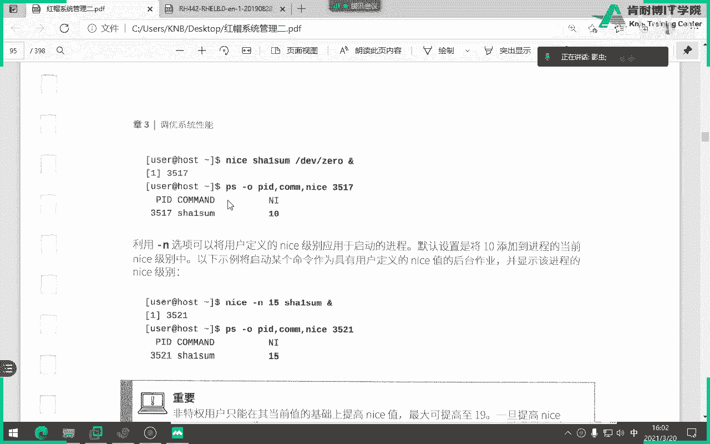

我只能调节低优先级里面的-20到正19，而实时进程咱们是搞不了的。

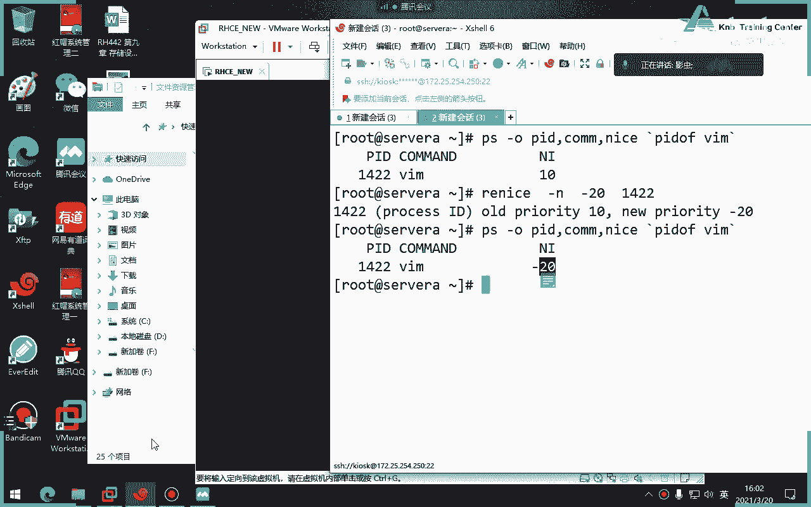

对吧啊好吧，最后给大家看一下这个东西啊，找到了玩的，这个单词咱们没有说啊，我给大家稍微说一下，就这个schedule normal气的意思，调度策略的意思，因为你唉唉说说我不知道怎么给你们解释啊。

他这个教材就这样，你突然间出现一个术语，你你你你不解释吧，大家看不懂解释吧，就是这就是一节课，那就这样啊，咱们长话短说啊，在我们红帽系统当中，或者说在linux系统当中，我们的调度策略分为两种。

一种是只对，一种是针对实时进程的调度策略，一种是分针对非实时进程的调度策略，而这个schedule的下划线normal是对非实时进程的一种调度策略，你刚才看图片了，同学们，你刚才你刚才也看图片了。

是不是分为实时进程和非实时进程，那实时进程实时进程里面有20个进程，非实时进程当中有20个进程那么大，那我cpu到底干嘛，下下一秒钟开始运行，哪一个是要通过调度器来调度它对吧，那有两种，一种针对事实的。

一种针对非实时，其中有三种，咱们刚才看到那个schedule的横线，normal，这是其中一种，这个sky有下划线，noble是其中一种，那我为什么不用剩下两种呢，注意啊，什么意思啊，这个怎么骗啊。

怎么称，就是就是一般哎，一般就是只要进程没有特别的要求，咱们一般都是用skype的nova来进行调度，这些调度并非实时进行调度，明白了吗，唉所以你要知道，并且呢你看他加了一个这个c l s class。

就中间就可以看到什么，这边这一列就可以看到进程的调度啊，那我们来对我们来选一个啊，咱们来来来来来先来讲啊，刚才咱们是不是看到这个进这个了，我们现在再加一个cl s，t s t s就是嗯同学们t什么意思。

no more，听懂了吗，也就是说v i m现在这个进程使用的调度策略，使用哪种，听懂了这么说能理解吧啊那教材当中那个f f什么意思呢，那我就不能说了啊，它是实时进行当中的其中的一个。

猜到下面这两个肯定是什么进程，人家用ff干嘛，人疯了吧，明白了吗，所以你看书的话，这个教材很不好，你这样子你这样子人家肯定听不懂，就自己看，你肯定看不懂，我现在讲能理解了吧。

那么今天呢我最后我就跟大家讲完了，然后呢呃我说一下。

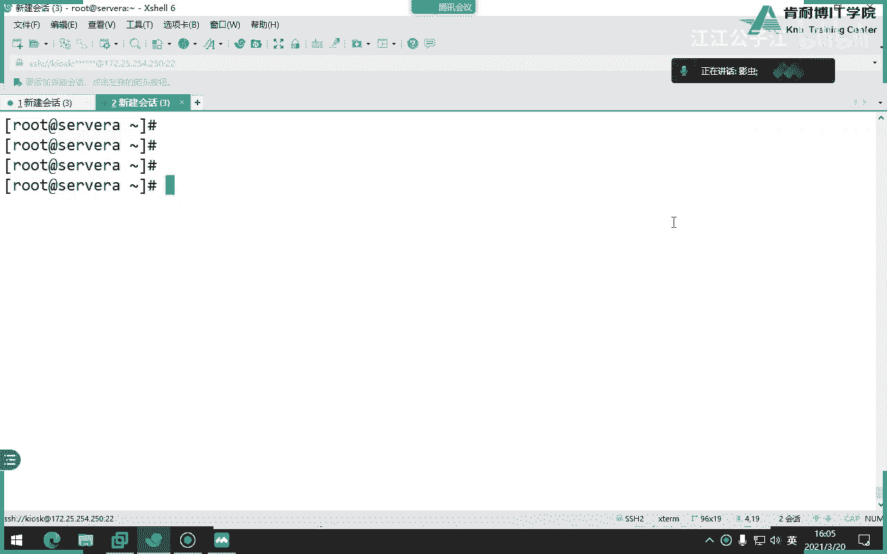

把我的笔记完成完成一下，你们知道就行了，知道一下就行了，好，那既然讲到了这个这个进程的策略，我要跟大家说一下，就是哪种呢，直接啊实时进行调度策略。

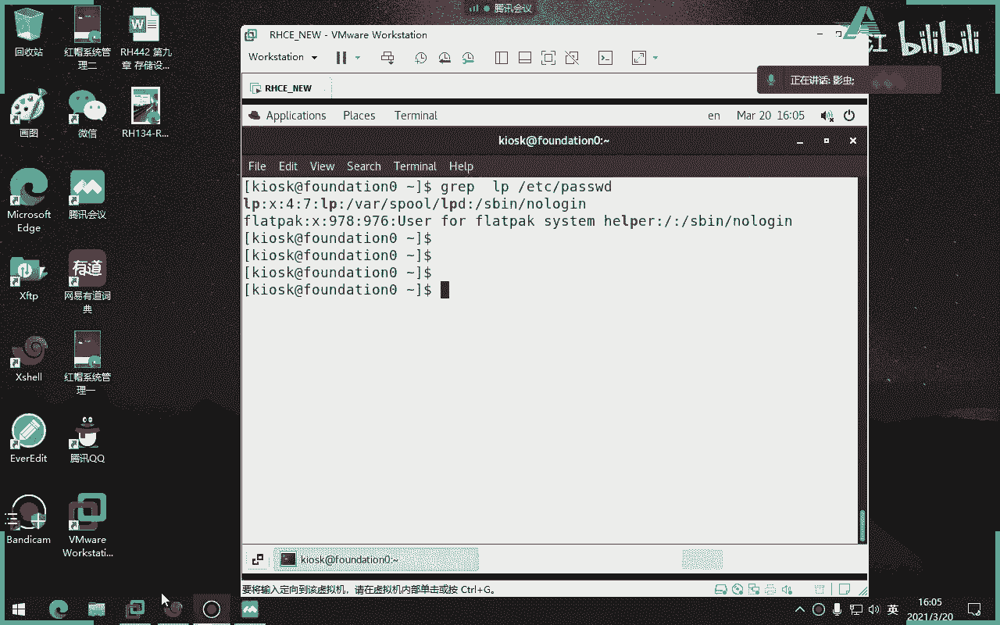

实时，有real time吧，real time实时形式叫做有两种，一种叫做caputer，f o一种是scared的，我直接写费事实啊，就代表这代表非实时有三种，一种是刚才你看到的no more。

no more，多po r l l l，还有有点，best，还有一个schedule，下了好，今天的课程到此结束，下课了。

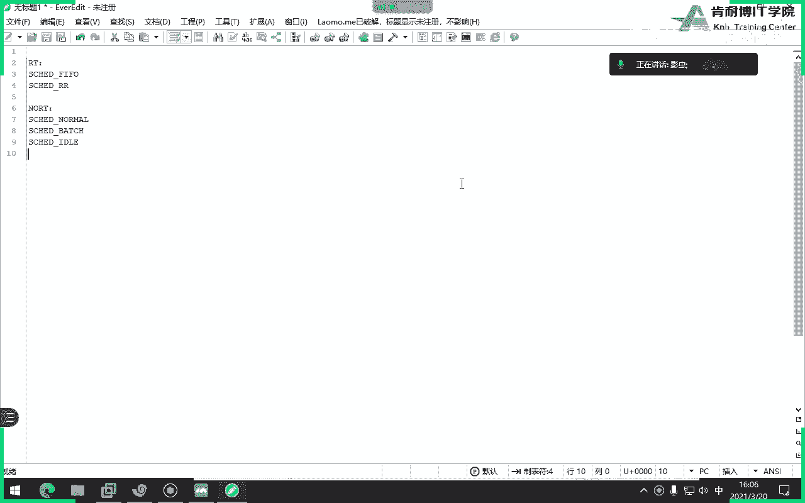

因为这个理解释就多了好。

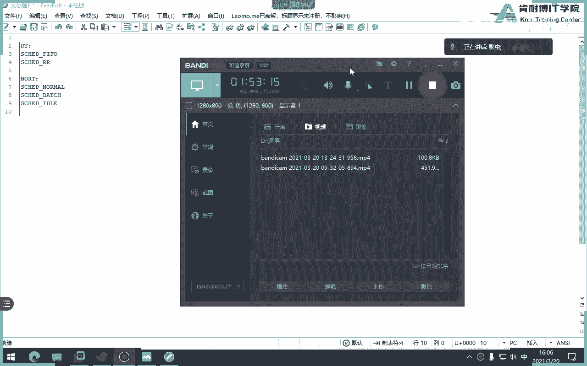

那我们今天讲到这。