# 红帽认证系统工程师RHCE8-滕老师出品 - P11：第六天 ACL和fdisk命令 - KNBIT认证中心 - BV1up4y1h7MA

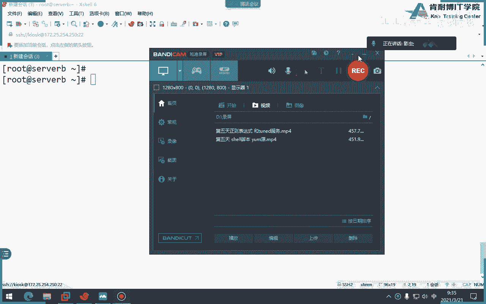

那么今天我们是hcs的第六天啊，第二本书134的第四章，红马尾本书都有一个编号啊，你通过这个编号就能知道他上的什么课，如果是rh开头呢，指的就是跟系统相关的课程，比如说咱们cs的都是跟系统相关的。

包括呢性能调优那门课也是跟系统相关的，那一会以后你们如果学过c a的话，你会发现还有这种名称叫什么叫cl 210啊，c l310 ，cl什么什么什么什么cl呢，就跟云计算有关系的课程啊。

那你你你你很可能还看到这个叫叫叫呃这个这个什么来着，叫d o开头的啊，什么d280 啊，就是讲容器那门课啊，那doo什么意思呢，就是部署吧对吧啊，部署开发开发类型有点类似于开发啊。

就这种课程rh就是关系，关于系统课程就red high，那你有时候会看到还有接boss啊，开头比如接boss多少来忘了，就是中间件有接boss方面的课程啊，那你会发现就是你要知道从这个名字。

你会发现到它的一个课程的意思啊，那么我们第二节课讲的是呃，第二本书讲的是系统课程的第四章主要讲什么呢，a cl翻译成中文，中文是对文件的访问控制啊，a4 l，那么大家如果学过网络的时候。

是不是也有a c呀对吧，网络当中也有a c啊，它是做那个流量的过滤，类似于防火墙，那么本章呢主要是描述一下如何让那个用户呢使用a4 l，还有就是我们先要识别文件上面的a4 l的权限。

然后呢怎么去设置和移动a4 l的权限，就是说白了就是删除a4 l和添加a4 l，然后呢接着我们如何定义一个default issue，为谁呢，为来设置一个default excel啊。

后面的是一个小实验啊，就咱们就这一章就结束了啊，好我们来想一下什么是acl呢，我们知道a4 l是对文件做控制，当然也是对目录做控制啊，其实其实呢这个很简单，a4 l就是让我们的这个文件和目录。

对不同的人和不同的群组可以设置不同的访问权限，那像我们以前讲的那个什么o那个a r加r r r w r w x了对吧，给那个什么权限了，拥祖权限，它也是设置权限，那么跟我们今天a4 l有最大的区别。

就是它不能够更加细化到给某一个人或某一个组做权限，那么我们经常说一件事，就是你比如说我们现在有个文件对吧，有个文件叫a b c，那这个文件呢就两个用户一个月到一个月的二，那么我希望u的e能读。

u的二能写，那么像我们以前学过这个c是m o d这个命令呢，它后面不能干嘛，针对u的一或者u的二来给它放行权限对吧，他只有什么什么ug对吧啊拥有人用的组合，其他人，那你说这个u的一和u2 是属于哪种。

那很显然我们如果用管理员建立的话，很显然属于other吧对吧，很显然属于other，但是呢你你你给other，比如你加一个w，那这样子的话就是u一和u的二他都能写了，但我的题目要求u的一能读。

u的二能写，那这个样子的话，u的一就不满足权限了对吧，那怎么办，所以说我们之前的命令是没有办法搞定这个事情，因此要学a4 l啊，所以下次人家问你a4 l干嘛，一一句话就是让我们的权限更加的颗粒化啊。

赋予到某一个人或者某一个组，我们刚才举的例子是u u u2 ，那如果是一个组一组二呢也可以啊对吧，那是可以支持a4 l的设置都是可以的，那这个a4 l就是让某一个人某个组具体赋予自己的权限好。

那么在讲a4 l之前呢，因为大家没有用过红宝五，各位红包五版本可能大家没有用过啊，或者是因为他太久远了，大概是2010年左右的时候，就我我当年学这个c e的时候，那么记住啊，那个红毛五的时候和红毛六啊。

我忘记了，反正红包五是有一个特点，就是a4 l它不一定能用，各位在红毛五的时候，a4 l不一定能用，就是有时候能用，有时候不能用，但不像现在我们的红毛七和红毛八就是都可以用，没有没有不能用啊。

以前是以前是不一定，那我怎么知道什么时候能用呢，什么时候不能用呢，哎我们得看一个东西，大家看啊，就说要介绍这一句话啊，那说了一嘴，那咱们呢聊一下就是在在哪儿啊。

在这儿你看在以前的老版本的e i t3 和e t4 这种文件系统啊，咱们没有学过啊，我说一下，这是文件系统，那么以前老的文件系统的，它默认只有在当时你装系统的那些个分区上面支持a4 l。

什么叫装系统的分区呢，你比如我现在装一个红包五操作系统，我分了一个根分区，分了一个boss分区，ok那这个根分区和boss分区就支持a c l，但是未来我们在工作的时候，我们自己这个系统已经装好了。

各位已经装好了，装好之后呢，我又自己分了分区，那么这个时候就不支持a4 l了，用默认就不支持了，也就是说只有装系统的时候，分区它支持a4 l，但是从红帽七和红帽八开始之后呢，是甭管你是装系统的。

还是未来你自己再创建的分区，它都支持a4 l，所以咱们现在就不要有什么，不要担心哎，这个这是分区是不是ac啊，不用担心，木耳都支持，明白了他这一句话就说了这样一件事啊，这一段就说了这样一件事。

你看我们以前在红帽五的时候，我们为了a4 l，为了让一个原来没有a4 l的文件系统支持a4 l，我们要操作两个步骤，那那当然具体什么步骤，我今天就不说了啊，你首先要打开什么文件系统。

然后在这个f s table后面加上一个逗号a4 l，然后再重重新挂载，反正挺麻烦的啊，现在不用了，现在咱们红毛八大红包七就开始了啊，从红毛八之后，就是甭管你是怎么样，默认自带好。

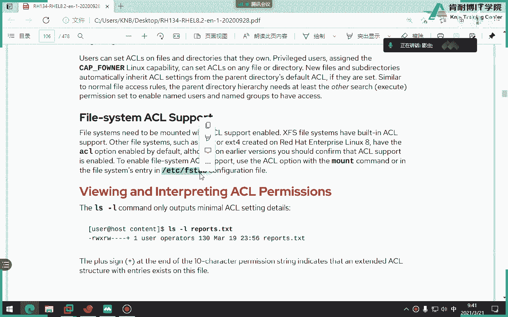

我们来瞅一眼啊，各位怎么看呢，你比如说我随便找个电脑，哎咱们就拿这个反对神来说吧，好吧，咱们也不不切换虚拟机了，直接给我打榜的命令，忘了干嘛的对吧，没学大家可能都知道是挂载，直接回车，大家看你看呃。

你看看什么，我得让大家看看，我都看不到，一看不到看不到看不到看不到，那这样吧，嗯稍等啊，我以为能看懂，还是看不懂，下面sd一下d一下，稍等啊，在这里看到吗，也看不到诶。

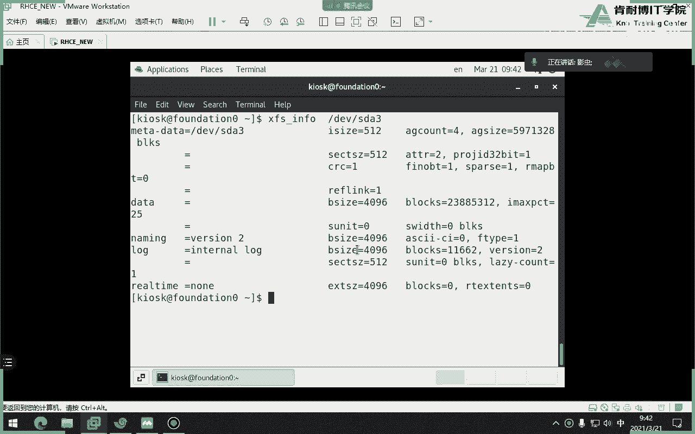

我以为能看到呢，看不到啊，因为咱们现在用的没有e t3 和e t4 ，咱们用的是x f s啊，我想打那个mk命令，我想我想打这个命令，就是如果是e i t3 和e i t4 的话。

你你后面会看到有一个a c l标签啊，那么就支持一些啊，当然想咱们现在看不到，那就不看了，但你要记住，你看x f s里面就默认的build build in嘛，就是内置cl的功能，看到吗，能看懂吗。

哎那么在以前的e i t3 ，e t4 呢也支持了，但以前的e i t3 ，e t4 就五版本的默认是不支持的，你得打mt命令把它重新挂载，然后怎么操作，反正很麻烦啊，明白了吗，这叫a c l，好吧行。

那么我们接下来呢来给大家做一个题目，咱们不看教材了啊，做什么题呢，就说刚才我们讲的这个题啊，我们比如说跑到tmt下面建立一个文件，那么很显然这个文件的拥有人是root，拥有足也是root。

那么这时候我建立用户u的一和u的二嘛对吧，那么我希望是u的一能够读u的二能够读和写，那么其实在你不做的情况下，你觉得一是不是已经满足了对吧，因为u的一本身就是属于a的部分，a的部分本身就是读权限。

因此它就可以不做了，但是u到二的话，它是不是没有写权限，也就是我们现在要针对u的二做什么，a c l一旦数也是针对u的二来做a c l怎么做呢，不用考虑它支持了，它一定是支持，所以上来就敲命令就行了啊。

这个命令其实你很快就记住了，set a cl对吧，然后呢m是修改啊，一般m都是修改，各位m一般都是修改，除非有一些特殊的啊，比如像那个大写的m，像我们以前学过那个u的a d d大写的m。

这个可不就是这个可不是修改这个大写的m是谁，还记得，不建立家目录，那我不建立家目录好吧，小写m修改，然后呢又是指的是用户，那g了就是组呗对吧，那很显然咱们现在是给谁用u的二吧。

然后做什么做r和w权限给谁做，给一个文件叫做file做就这么简单明白吗，就你把它你不要死记硬背，你把它说出来，这个命令就出来了，好吧好，这个时候呢我们跑到u的二身上，然后切换到tp当中，我们写的内容。

随便写啊，咱们学校的内容成功了吧，进去了吧，哎就讲完了，这就是a c l，你考试就考到就考到这儿结束了，就这么简单，这就是你上午cc考题就这么简单，当然了，咱们上课呢肯定不能这么简单。

咱们要接下来来讲一个事，就是他到底发生了什么好，你来看啊，你看教材当中写了一句话，各位他说当你有使用，当你使用ls s杠l是为了浏览我们的权限对吧，但你会发现突然间你看到有个加号，你看有一个标记叫加号。

在什么，在十什么字符串，我们知道总共有十个字符串吧，在最后一个字符串当中多了一个加号，那么这就表明你这个文件身上被设置了acl啊，就算你不懂ac啊，你只要看到一个文件或者一个目录啊，后面有一个加号。

而且是在整个这个横线当中的最后一个栏位加上一个加号，就说明它一定有a4 l权限，可以吧，就一定有a4 l权限，那么这时候大家一定要注意，就不能以这种形式，咱们已经以以传统的形式来去读权限的这个大小了。

各位就不能这么读了，你看你如果按照传统的权限大小，这边是几啊，六啊，这边是七和什么768761对吧啊760对吧，那这是不对的，为啥，因为这边就不再是以前的那种传统的选项。

那你比如说像我们刚才敲的这个命令，你看你要这样子的看就变成664了吧，但其实我们与传统权是多少，是644对吧，而且你会发现我为什么我这边组当中多一个w呢，这就很奇怪了对吧，我我没有给组做啊对吧。

我是给用户来做的这个权限，我没有给主设置权限，为什么组这边变成了rw呢，原来是r，所以你如果你还按照以前传统的那种计算方式，这是不对的啊，因此我们要用单独来看a4 l权限叫set是设置。

那么get就是查看，你永远记住在linux当中的很多命令都是set是设置，get是啥，看那怎么查看呢，那很简单啊，直接加上绝对路径，当然你也可以加相对路径的文件的名称，就直接这么看就可以了。

前面是拥有些不，前面是文件的名称，这边是拥有人吧，这边是用主吧，好这边是其他人吧，是不是还是什么传统的权限对吧，这边是拥有人的权限六吧，这边是拥有组的权限四吧，这边是r的人的权限是吧，是不是还是644。

各位好，你得这么去看才行，就不能再用ios来看理解吧，如果如果你用ios看，你就看的就不准了啊，好那么问题是我们刚才的六，我们刚才如果说这边是664的话，它是怎么得来的呢，请注意为什么又有一个加号呢。

啊是这样的，各位原来这个拥有人的位置并没有变，还是六来，我们来看一下是不是还是六拥有人没有问题，但是这边的用户组就不再是拥有组了，而是一个叫做mask这样的一个东西了，看到吗，它叫野马啊，它是野马啊。

mask啊，也就是你看中间这个组啊，这个位置原来这个组的位置被变变成了mask，因此呢你的组就得往后移一位，因此这边的原来是r的部分，其实现在变成什么了，变成组了，你看组数多少还是四吧。

那由于咱们总共就有这么九个栏位，表示我们的权限，你突然间强行插上一个人，后面的人就得往后移，那么other的部分占用了被占用，而被那个group占用了对吧，因此的就没有办法显示了。

因此加号就代表other，也就是说后面还有东西，但是我显示不了，明白了吗，就像你你这边有人原来拥有人拥有属其他人在这边的用组呢，现在表演成了mask拥有属就往后移一位，把人家other给占用了。

other呢没办法就得加个加号来表示了，明白了吗，所以你得明白这个rw可千万不要理解为是组啊，如果你把它理解为主，那你整个的整个就完完全全不是一个意思了，对吧好，这一点要注意啊。

那么接下来我们就来讲一下，那么到底什么是mask，它是干嘛用的呢，各位我得写下来啊，我得写下来，那么首先咱们得这个看到一个呃，我想想怎么给你们写，我就这么写吧，咱们得看到一个一个一个事儿啊，在这儿。

比如说我这样子吧。

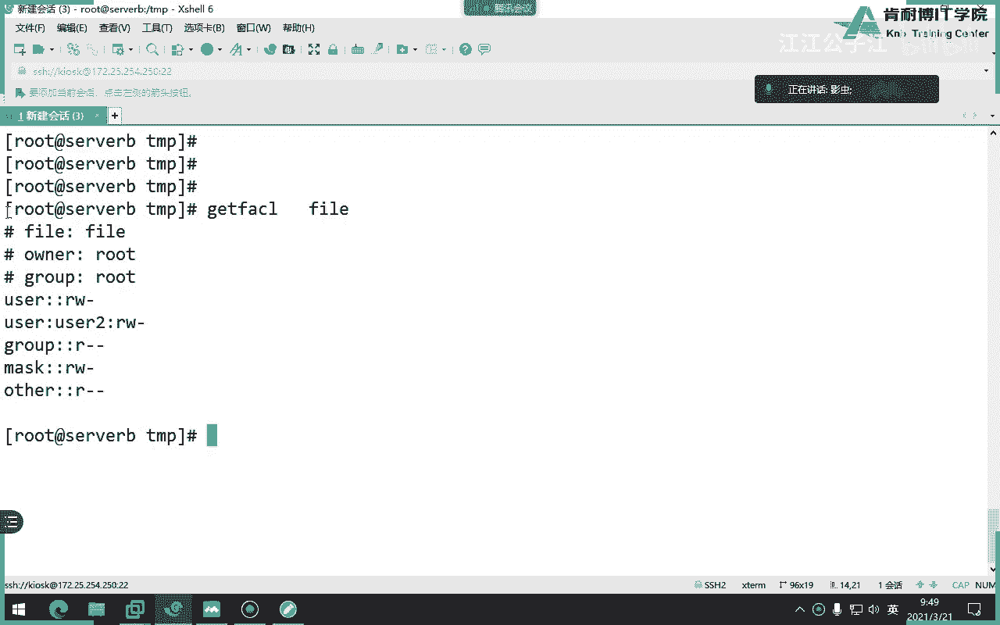

全复制出来全复制出来。

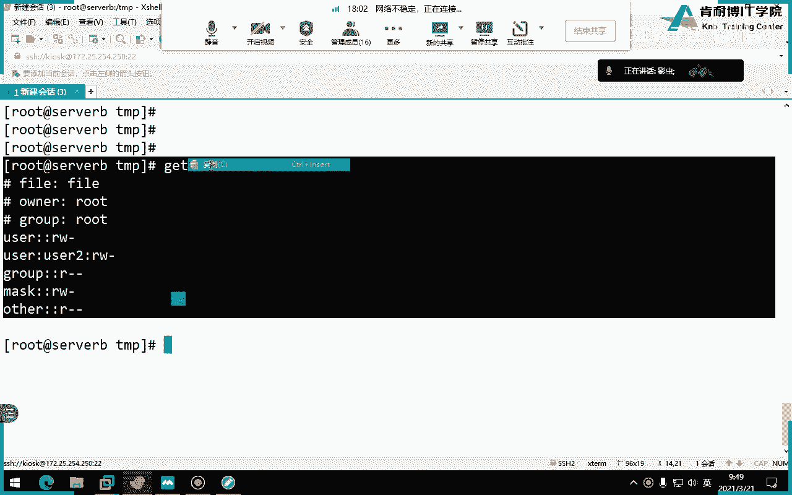

复制到这好，那么我来跟大家解释一下这每一个字段是什么意思，前面这个不用解释了，文件的名字啊，这个文件文件名称，然后注意这个是文件的拥有人马，原来吧对吧，这是文件的拥有组吧，就是所属组吧对吧。

好好这个地方是什么呢，这边呢是指定用户主权限，你怎么知道是指定用户组，很显然嘛指定一个u的二嘛对吧好，然后这边呢是原始的是吧，拥有是吧，拥有主的权限吗，是不是哎就是六四吗，第二个四嘛啊第一个四吗。

好这边注意是那个mask啊，咱们直接就叫就叫mask啊，不翻译了，最后呢这是什么，那么如果你这边咱们还可以再做一个，比如说我刚才设置了一个指定组，比如说举个例子啊，我都随便写着玩的啊，就举个例子。

比如说指定一个组叫做group吧，叫group 2啊，算了咱们就叫做就叫这个就叫group rap 2，这个组比如他有他也有一个叫叫叫rw权限吧，好那这边其实就是指定组权限能看懂吗。

那我为什么要先把这些东西要给大家讲呢，啊你得知道下次人家告诉你这个这这句话什么意思，就是一个指定组啊，就是我们刚才用命令设置的那个指定的人，那当然了，我们刚才可以把那个u的二个命令啊。

比如说这个命令改成g那就是什么指定组吧。

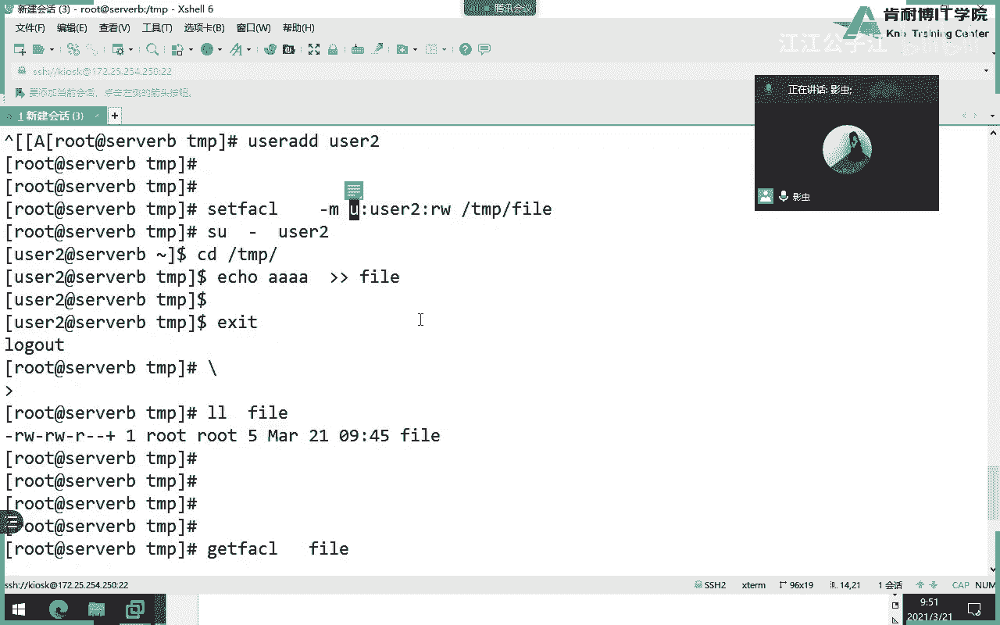

好那么这个时候要注意这个mask主要影响的是谁呢，影响的是他们仨，没一个是原始啊，一个是指定用户的权限，各位mask主要影响的是第一个是指定用户的权限，第二原始拥有组的权限，第三指定组的权限。

各位这个mask会影响他们三个啊，这个mask会影响他们三个指定用户的权限，受mask的影响，原始拥有主的权限受mask影响和指定组的权限也受mask的影响，那什么叫影响呢。

各位也就是说我们的mask权限对于他们三个人来讲必须大于，或者说或者说反过来讲嘛，就他们三个人的权限就是蓝色这一块，蓝色的这一块，他们三个人的权限，各位他们三个人就是从678的3号。

他们选项只能小于和等于mask，小于和等于mask，比如说我们强行的把mask改小，你会发现就不一样了。

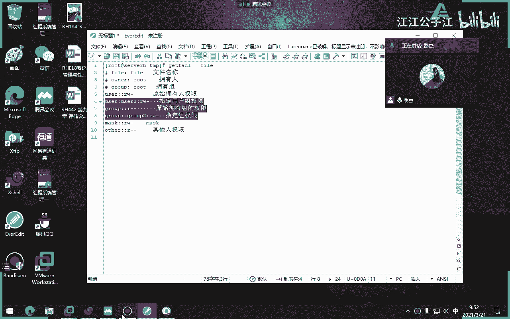

效果啊，你看你看我，我现在现在是啊，mask是什么什么r w好，刚才你也看到了u的二是不是也能rw对吧，那这时候我这样做啊，sfs a4 l m m是修改m第二个m就是mask的意思，我把它变成二。

ok大家再来看，立刻这边变成了什么啊，也就是说你原来确实是rw，但真正生效的最后生效的是谁啊，为什么刚刚讲过这个人的权限，现在目前是不是大于啊，大大大大大于了mask。

因此你最最后的结果就只能是跟mask一样读了好，我们切换一下用户先试一下，是不是嗯嗯我在想写东西，那很显然写不了，但能读吗，那但能肯定的吗，当然能读了，但是你写不了，明白了，老师很明显。

所以你一定记住啊。

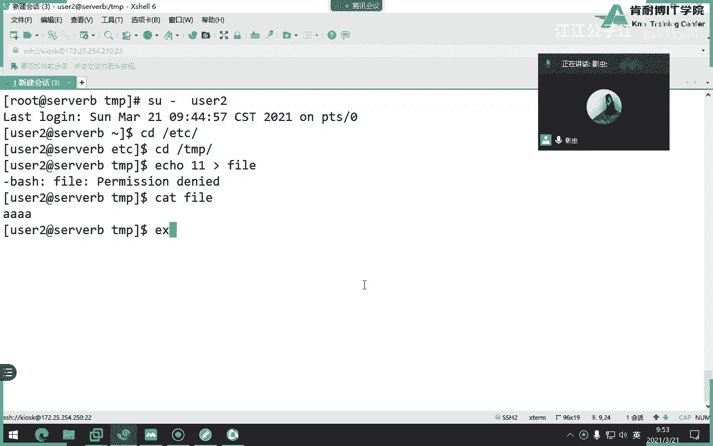

好mask只影响他们仨，那也就是说第一个用户原始拥有人的权限不会受mask影响，同样other也不会受mask的影响。

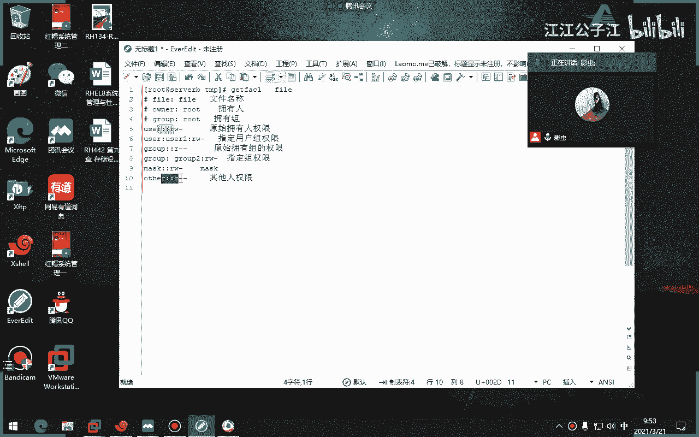

好吧，不会受他的影响啊，啊这一点要听清楚，你看它这边写了啊，咱们就这边就写，咱们就不那个带带带带来来来念了啊，你看看了吗，为什么做个生效啊，因为很显然他的mask干嘛，你看这些人都大于了谁哈哈。

是不是同志们这些人是不是都大于了mask对吧，哎你看这个为什么，ok因为本来这个就只有r吧，而我们a mark就是是rw，所以说本来是ok的啊，所以你看通过这幅图片，我们再次验证了我刚才讲的是对的。

就原始拥有人的权限指定组的啊，不是那个什么指定用户的权限，原始拥组的权限和指定组的权限，这三个人受骂死个人的影响，mask的影响，不受控的，要知道啊，要知道这一点，那你说bug干嘛用呢。

我们是不是就是啥意思，怎么理解啊，是不是就是为了控制他们三个人对吧，控制他们三个人啊，那么a c l呢怎么查看，刚才讲过get就看了，一定记住set设置，get查看啊，嗯行吧。

这就说到这儿就就就就就行了，这这这我就不带大家来念了，你就一定能看懂才行啊，看懂啊，你看这个呢它就是一个怎么讲到default了，还没讲到还没讲到，这就是他刚才讲的那个much的意思。

就不带着大家来看了，行吧。

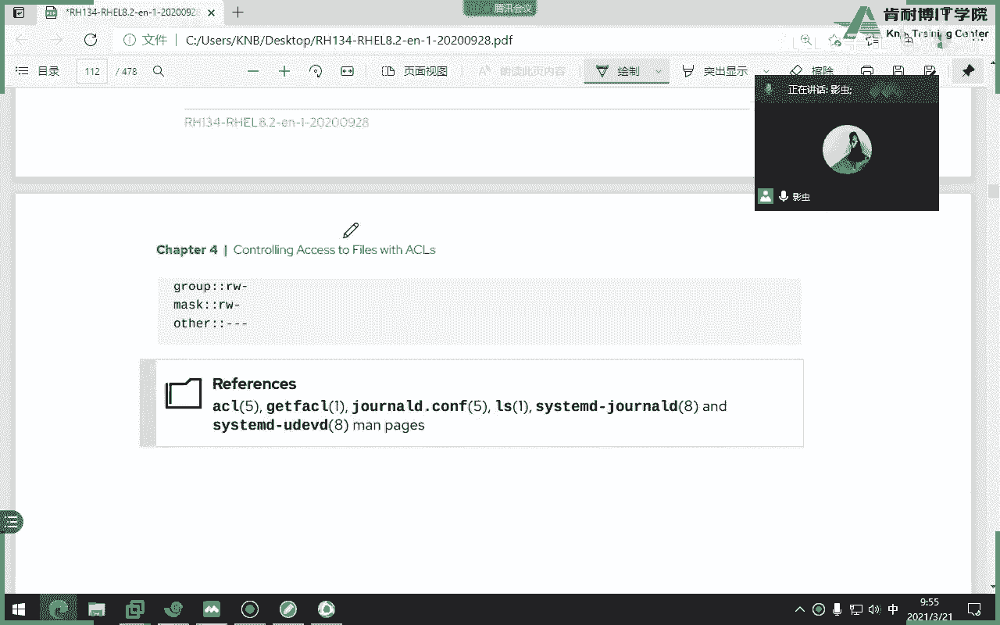

文件的acl权限就这么多，这是文件，我刚才讲我们讲的是文件啊，我还没有讲目录，目录的就不一样了，目录就不一样好，那么命令大家会了吧。

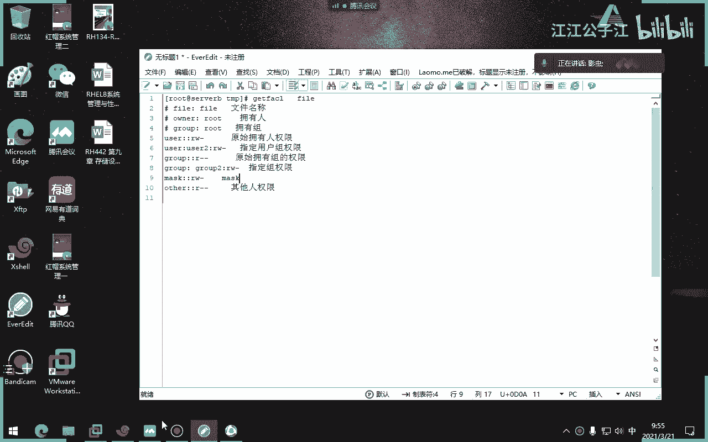

哪个命令就是这条，同样你把u如果改成g后面就要加什么组的名，组的名称好吧。

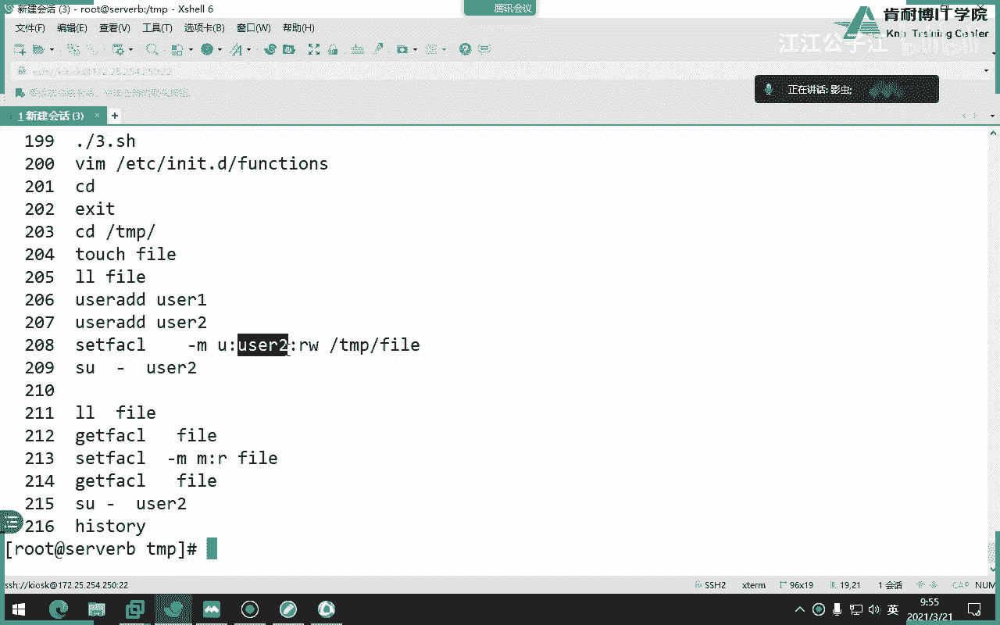

一定要注意组的名称，组名称行吧，不难啊，这个这个没什么太多的难度，那。

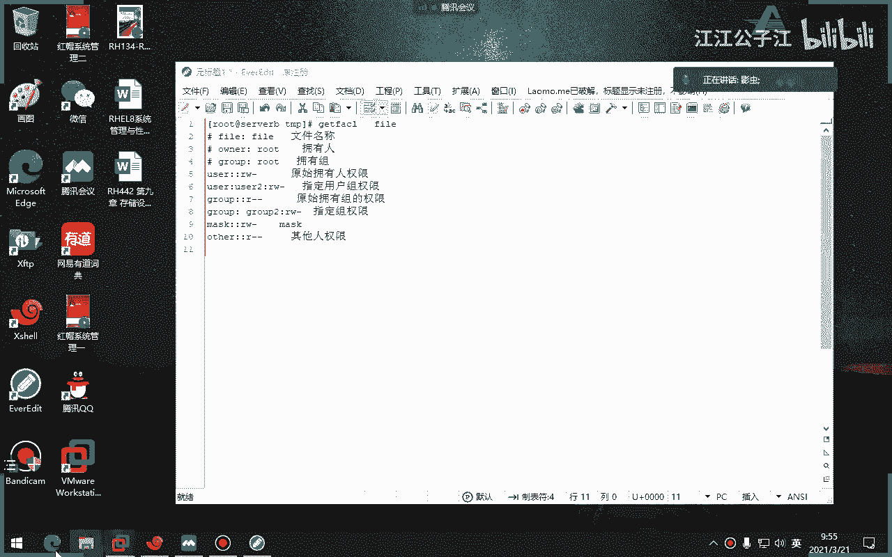

实验不做了，这个实验是填空题，不做，那同样咱们的a4 l也支持这个大写的x还记不记得大写x啥意思啊，我们以前讲过了，大写x是不是让我们的目录下面的子文件并不继承原来就没有的x，如果原来有x那无所谓了。

原来没有x我也不会受父母录跟x的提升对吧，哎这一样跟咱们以前讲的一模一样，那么如果出现了啊，这个是什么意思呢，这个是这个命令，你可以了解一下相当于什么呢，嗯你对一个文件设置a4 l。

还也想对另一个文件设置同样a4 l的时候，你可以用这条命令，好那么这就是一个典型的他利用了大写的x，大写的x来设置权限，那么这是设置组的权限好那这条这条命令怎么理解啊，各位你看他o当中没有加任何名字。

o当然本来就没有名字，o是r怎么有什么名字，这条命令就等同你用chmod o什么什么什么，懂了吧，也就是说这个a c l命令也能设置什么，也能设置成以前我们类似于用这个命令来设置的权限。

那这条命令是干嘛呢，为o设置什么权限，是什么权限，能看懂吗，没有权限啊，各位减号不就代表没吗，明白了吗，减号代表没有权限，明白吗，哎考试的时候，咱们有一题要设置成减号的，你要知道怎么设置啊。

啊那这条命令就等同于什么等同于o什么等于零吧，下面下就相当于o没有任何权限嘛啊没有任何权限，还有咱们一个a4 l当中可以连续两行去做，中间用逗号，像这个题目很显然我们要做两遍了。

但他用一个a4 l就做了对吧，哎又可以设置用户逗号，再设一个组，在逗号再设一个，所以说这一条命令相当于差了三遍，但它一条命令搞定好，那这是干嘛的呢，就是这样的，就是如果你把一个ac文件一设置权限。

你想给文件二设置，可以用这条命令，那最后的就是文件b上的a4 l权限等同于文件a上的权限一模一样，相当于cp命令拷贝，就你对一个已经存在的文件。

不不你拿一个已经存在的文件拷贝给一个另一个没有做acl权限，那最后那个那个目标的文件的权限就会跟之前的一模一样啊，一模一样嗯好那么这个命令呢刚才讲过了，是设置什么，这个是m什么意思啊，mask啊。

也就是说我对mask设置权限啊，mask，那么最后结果这个单词才是真正生效的对吧，还记得吧，这个单词是生效，比如你的那三个人的权限不能够大于mask啊，不能大于mask，好了嗯，上半部分就讲完了。

非常简单啊，我想大家可能没有什么太多的问对吧，除非就是命令可能不熟，就讲完了，好那接下来我们来讲这个，递归修改a4 l那大家一想到递归分析是给谁用，给目录啊对吧，我怎么可能给文件递什么贵啊，对递归。

那这个命令极其简单，只不过加上一个什么对，没什么讲，就你怎么学的c h m o d，你怎么学sfs一模一样一模一样，那这条意思就是什么，各位这个意思就是说我对这某一个目录设置一个权限叫2x。

注意它的x是大写，那也就是说如果目录下面有文件，它会继承吗，并不会，它只会继承r但它里面的子文件并不会继承x那如果里面有子目录呢，x会不会继承，会啊，明白吗，一定要会啊。

一定要知道他所谓的继承只是针对目录子目录，但文件不继承，当然如果你把它变成小写的x那就完蛋了啊，文件也介绍，目录也介绍对吧，这一点跟我们以前讲的c是md没有什么区别啊，这就是这个权限，好注意啊。

这个是给目录做了啊，很简单，我们来瞅一眼啊，比如说我建立一个目录叫做叫做red h，然后我们再建一个什么叫建123吧，ok吧，123肯定是644，644的权限好，然后这个红帽的这个目录一定是多少。

755的权限对吧，755的权限一定是七五，文件是644，文件夹是755，记住啊，记住它，那接下来呢我们设置a4 l选项怎么设置呢，我嗯嗯嗯这样说啊，r写在前面m m就修改u呢，比如我们再来个u的二吧。

还有1~2啊，咱们来来个来个r w x吧，然后这时候我给他来做当前目录嘛，就是are rehead，那这时候我们来看一下权限，看一下，你看你会发现这边的u的二是二和x对吧，然后这时间你再跑到里面。

突然间发现加号了，说明他递归下去了吧对吧，如果没递归，他怎么可能是加号呢，而且我都不用给大家利用这个命令来看，你也可以看出来肯定没有什么，肯定没有x，因为那个颜色并没有变绿吧对吧，如果x有变绿。

那肯定有颜色，颜色就肯定有x咯，你看xxx都没啊，那这个这边这边不用解释，这边是原始曲线还是六字对吧，所以他没有递归下去，那同样的，如果我们刚才做的时候。

如果我们刚才做的时候加上一个小写的x重新来做的话，那你再看就很明显了吧，我就不再给大家演示，肯定是绿色嘛，就继承了，就是这么简单，能理解吗，这叫a4 l给谁做，给目录。

那下次你就知道原来给目录做就是加上一个r就ok了，就跟咱们这个一样，但注意千万不能加小写的啊，比如r是递归的意思，但这里面的r是大写的啊，啊那有时候咱们的cp杠r也是递归，但这里面的r就必须是小写的啊。

但是固定的用法啊，但是它的意思都是一个啊，都是递归的意思，没什么要解释的啊，好那么接下来我们要讲一个什么呢，第二种办法为a4 l设置权限，咱们刚才讲的是呃为目录设置权限啊。

咱们刚才讲的是第一种就是用递归的形式为目录设置递归的形式，那你看它有什么问题呢，我们再建一个文件，发现什么，各位你发现什么嗯，你是不是发现我刚才不生效了，四五为什么，因为你新建的文件它不生效。

你也也也就是说我们递归这种形式啊，对新建的文件并不生效，但对已经存在的文件它继承了，但对新建的并没有继承，嗯这就是问题啊，各位那因此我们要学第二种，我们直接来讲删除了，不讲删除啊，删除待会讲。

我们来说一下如何控制default a c l，注意这个default指的是默认它也是为目录设置，注意啊，看看了吗，各位那么我们总结一下，咱们稍微稍微等一下啊，为目录设置设置a4 l两种办法。

第一种使用什么杠r递归方式啊，该方式对新，建立的子文件不生效，不继承吧，别说不生效是吧，刚才你看到了吧，并不继承好，那么第二种方式就是default形式，注意了，我直接一起写英文啊。

default形式也就说你为目录，你甭管是default还是r都是为目录，千万这一点一定要先清楚，你别以为是为文件啊，这点要听清楚，那么我直接写到，我直接把大家结果给大家讲讲，它是对什么。

对新建立的这个文件做继承，啊就反过来各位反过来啊，反过来了，不一样了，好我们来看一下啊，那么这个default default你怎么设置呢，只要在前面加上一个，只要在这个位置把那个r去掉。

看到没把它换成小写的d横线d d就default，一开始包括很多学员在学习的时候，都以为那个d是目录的，因为很多大家习惯性地区目录吗，不对啊，这个d可不是目录，d是default这个单词的缩写啊。

好来直接看mei就在这啊，这个命令我不是这么敲的，各位你可以学书上的，你可以学，我待会跟大家讲，我习惯是把这个m放在d的位置，d放在m的位置，说白了他们俩我给它颠倒一下哈，颠倒一下，明白吗。

我我是个人习惯，个人习惯没有没有没有谁好谁坏，但是就是说如果我这么做的话，各位你看他你看哎，你看书上也讲了，如果我这么做的话，就要把这个d前面加个横线了，明白吗，因为你你书上教材当中是把d放在m后面的。

所以所以这个d是不加横线的，那如果你把d放在前面，m放后头，那么这个d前面就要加个横线，理解了吧，因为它是选项好吧，这个没有好不好，没有坏不坏，你爱用哪个就用哪个好吧，好那么大家来看这条意思是什么。

这条意思翻译成中文怎么解，释，为这个目录设置一个default权限，并且呢指定一个用户吧，它不是组吧，name是用户吗，什么权限啊，哎你看看各位他用小写x对吧，咱们小写x理解了吗。

好但是呢这时候注意有一句话，可能大家没有太留意去读，如果你翻译成中文，你可能更不留意，所以我们看这句话，从这开始，从这个，括号从这开始怎么解释各位只读和什么执行好，关键字后面在后面的定语当中on这句话。

子目录这句话很多人没留意的，那就就看书一带而过，啥意思啊，请注意default这种设置a4 l权限，对不错，你是给目录设置，但真正生效的是子目录，各位看书要细致，也就是说其实你刚才设置了一堆啊。

对人家上级复目录是不是剩下的，也就讲比如说你这句话，那个name是tom用户啊，各位我举个例子，比如tom用户2w啊，不r x对吧，rx也就是说你其实这个目录是不生效的。

也就是说你这个tom用户是能够在子目录下面做rx的，这个权限并不是在你的父母的上面有rx这个权限，这点要注意啊，devt是对目录的子目录生效来做实验。

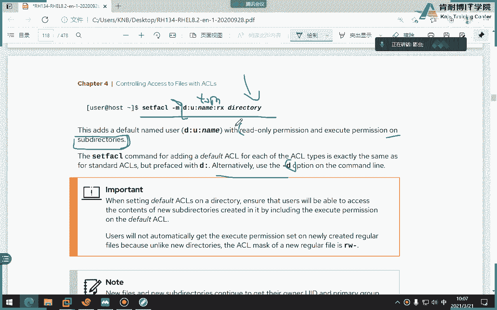

做什么选项，我忘了，我直接看写的笔记吧。

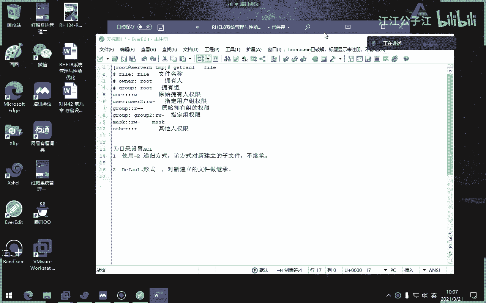

笔记我忘了，所以我直接写，直接给大家翻笔记来看吧，嗯嗯，不想再想实验，咱们直接来吧，比较懒啊，我就自己不敲了，直接来看你bt在哪，default default嗯，你来看啊，各位。

我创建一个名为这个的目录飘，并且为该目录设置一个让js用户能够继承的默认sl权限，这怎么理解呢，你看，别看了，直接做吧，对吧，哎我我多少条线，如果看的时候是多少，675什么675好，让我建立一个用户。

ok我设置该设置那个目录了，啥来那个权限了，杠d命令怎么调来着，杠地杠m啊，然后u，大写的x大写了大写了，再说一遍，大写啊，我用的是大写，这时间请注意了，同志们，这时候我做这样一件事啊，这个模糊。

这时候我做这样一件事，get先看一眼t r o，你看是不是出现了很多default啊，刚才是不是没有从来没见过default，哎，现在出现了一堆d开头的default。

你看是不是js用户有r w x对吧，好有rw x，然后接着呢我们在这个，下面创建一个子目录和文件，ok那我们再创建一个子目录，子目录，子目录子目录，我就照着里面写吧，装一个子目录。

很显然目录是不是也继承了，很显然文件也继承了，首先验证哪句话是不是新建立的继承了对吧，这句话先验证了吧对吧，ok那么接下来给大家看啊，然后我们切换成这个用户，我们刚刚不就新建个叫g jc这个用户吧。

我们新建啊jc用户，我们切进去，啊我们切换它，然后看我们测试在pmo目录下面是否可以建立文件，或者是建立子文件，在哪下，在这里面啊，加o，哦失败，哦也失败，是不是成功了，是不是验证我们刚才讲的那句话。

虽然说你对js用户设置个rw x给谁做，给这个p r o做，但是你居然在po下面没有建立的这个权限，你来看，虽然你对rw，虽然你对js做了rw x，你居然对这个目录没有rw x的权限啊。

不是没有w的权限，那对谁有权限呢，我们再次切换到js，我们进到哪，这可借，你肯定能进嘛，就不用解释吧，但是你看哎呦，我靠，这比如说建立一个456，啊不是得先到这里面建立一个456k吧。

是不是对子目录有生效，因为我刚才在p r o下面是不是建一个子目录叫dr，但他只对子目录有生效，这就验证了我们教材当中的这句话，你给这你看从头到尾读一下这这条命令。

这个意思是指我为某一个用户设置一个只读权限和执行权限，但是是在子目录下生效的，注意我不是说这个单词一定要看清楚的，子目录不是子文件吗，同志们要分清楚吧，这就是default，那我们最后总结一下。

再把刚才的笔记再完善下，后面再应该再加一句话，默认的这个a4 要求就是说白了就举报了，default形式啊，是针对什么，针对此目录，对父母录干嘛不生效，好小王没了，从这结束，能听懂吗。

刚才那个整个实验能看懂吗，好吧，那这样我暂停一下，你们来做做出来效果。

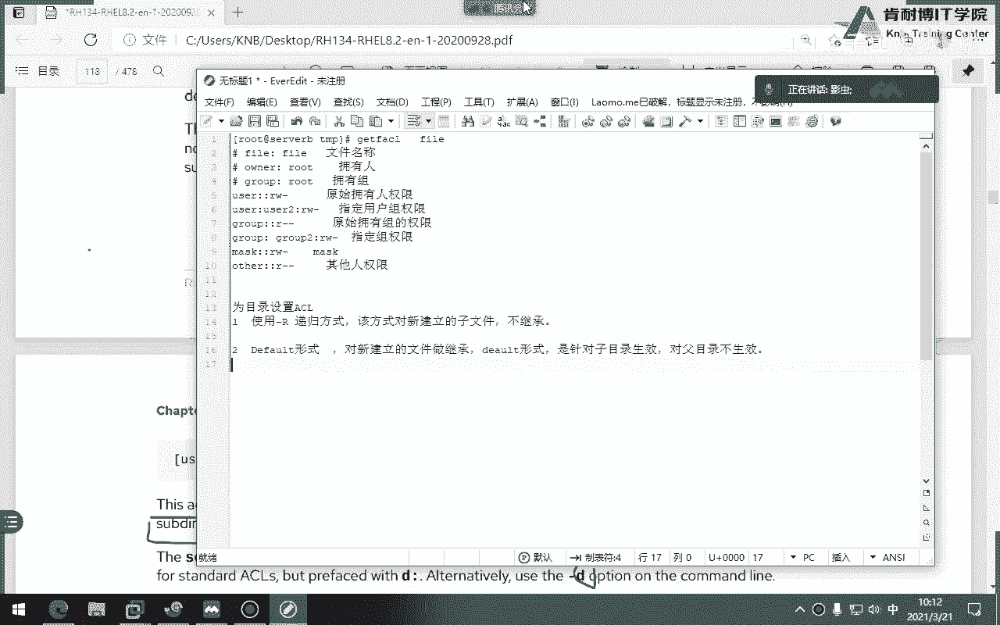

那接下来我们来讲一个怎么去删除啊，怎么把这个a4 l给他干掉对吧，我不想要了，哎你看各位很好玩啊，你看同志们一条命令搞定杠b，刚才我这个在做之前，我给大家看一眼tm p下面的fm是不是上面有个加号。

只要看到加号，说明上面一定有a4 l，那怎么办，我不想要有肉，不想要让小姐是b不是d啊，d是defb，没了a4 l被你干掉了，这条命令叫删除一个文件或者一个目录身上的所有a4 l。

但是这个记住是所有a比如说如果你为这个文件设置了很多条a4 l，这一条命令全部没了，那怎么办。

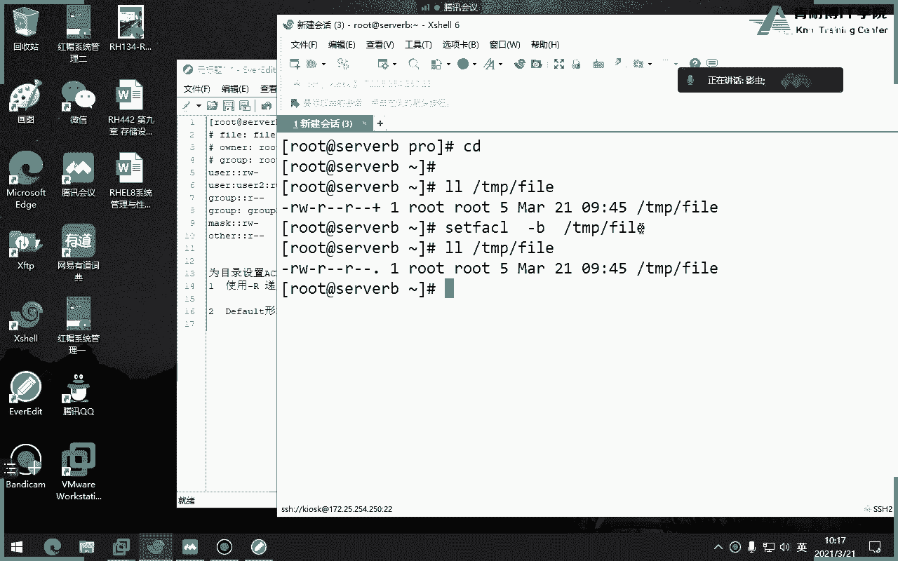

刘老师，我不想全部删，比如说这样删除某一个，对不对，比如这家伙设置的十条，我只想删除某一个，你看杠b是全部干掉，那怎么办呢，哎小写的x x指的是删除某一条，你要后面加上那具体那一条，懂了吗，好好吧。

我就不做了，自己百度去吧，或者说自己卖去吧，好那这里是干嘛的，很显然这是删除什么，只要加d是什么意思啊，default，所以这条命指的是删除default的a4 要，可以吗，好提到一下。

那这条呢那这个是k呢是删除所有的default条，而这个d呢是删除了某一条default的a4 l，听到这有点绕啊，各位小姐d指的是删除目录身上的某一条default的a4 l。

小写的k是删除目录身上的所有a4 l其实也不绕，那小写的x呢，对是删除文件身上的某一条a4 l，那小写的b呢是删除文件身上的所有a4 l，那你说那目录呢不是def内容，是递归的形式呢。

那种怎么删也是用b呀。

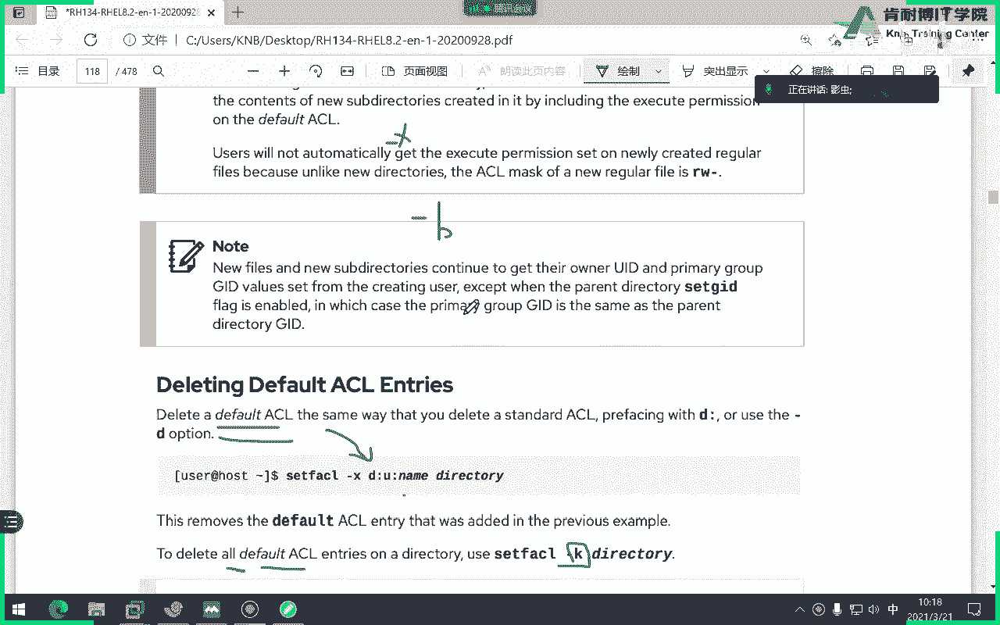

你看比如说我现在对目录做，各位甭管是default的还是b。

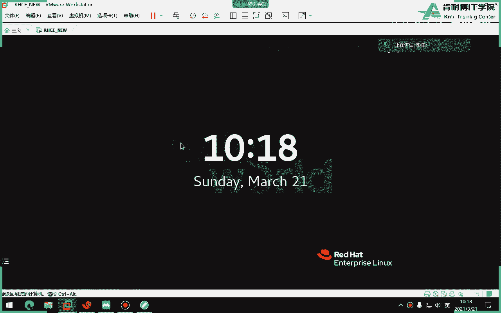

还是干脆用那个递归的一条小写的b全部干掉，比如说，刚才给谁做了，你看吧，是不是这个目录上面也没有，应该是没有啊，明白了吗，没有加号了吧，这小写的b是删除目录和删除文件身上的所有a4 。

l小写的k就只能删除什么目录的default的，所有的ac 21定一定要分清楚，你实在分不清楚。

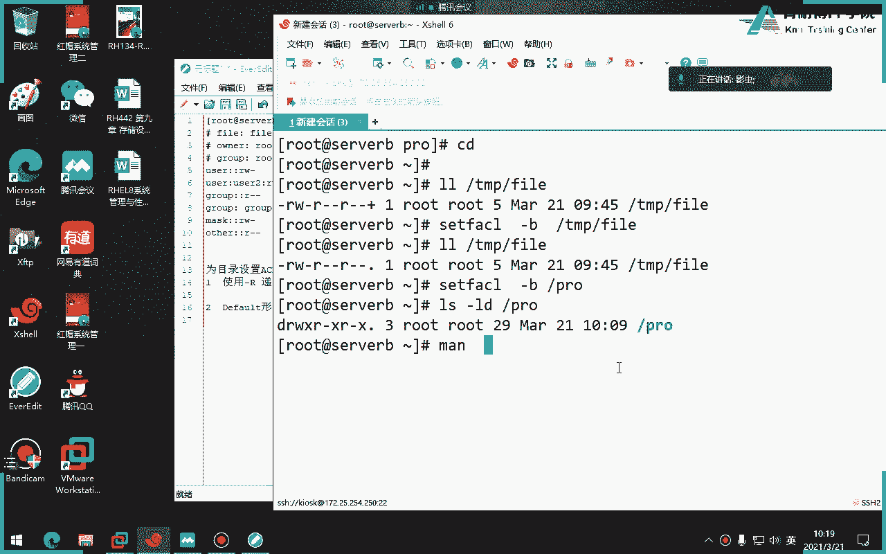

你就别分了，每次慢一下不得了嘛，对不对，我们为什么一定要都记着呢，慢一下看remove default，你看多简单，b remove直接告诉你，我告告诉你，甭管是文件了也好，怎么样也好，全干掉好。

下课不是下课休息一下，就想到这，那么第五章啊叫管理se linux的一个安全，你通过名字就知道他是一个安全方面的一个东西，首先要跟大家解释一下，不是红帽帽或者其他的一些用词，把它引入到自己的系统当中。

嗯，是没有办法进入到商业用的，或者是一些政府的这种这种单位，s一雷姆斯引入到了红帽的操作系统，一直到现在还一直存在我，我以前学红包五之前就已经有了，现在还是有这个s1004 了，好。

那么首先来学习一下这章的培训的目标，我们要说一下s一的如何保护资源，第二我们要学习一下s0 x的安全上下文，第三我们要知道一下布尔值的调节啊，还有一些日志方面的东西需要，那么这章的实验我们都做。

因为很简单，所以我们都做，因为我们如果不做，这张理论性太强，你没有感觉，只有做出来实验，咱们才能知道啊，他是怎么回事啊，明白吗，所以上一章的你看你们很简单吧，咱们学过权限知道啊，a4 l一下就就学会了。

但这张是咱们完完全全没有学过的东西，安全方面的东西也是整个c e考试就考这一个关于安全的东西，什么是s linux呢，他说了这么一堆啊，咱们这这这部分它翻译的不是很好，我刚才看了一下，但并不是很好。

很多同学呢并不是能够特别能够看懂啊，咱们就不看这这一部分的介绍啊，这部分的介绍呢咱们也先不看好，咱们来看这块，首先s0 就这几个单词的缩写啊，它是一个什么呢，他是一个在传统的rw x能用人用足。

用其他人这种权限之外的另一个保护访问的一个手段，说白了你可以想什么，想象成一个你让他给我们翻译的单词叫额外的系统层，你可以把它理解为是第二套防火墙好吧，因为就相当于我们又加了一层更安全的防火墙啊。

也就是说如果一个文件啊，各位想过没有，我如何读取一个文件，如何访问一个文件，是不是得有这个文件对这个用户相对应的权限，比如说有个用户叫tom用户，他要访问文件a b c是对于用户来讲的话。

或者说对于这个a4 l来讲的话，你得设置为这个tom用户设置读权限，它才能读，别说你只有权限满足才能读，但是现在有了这个s linux之后呢，你要有两层的防火墙的突破才行。

第一层就是第一层就是首先你要满足权限，就是咱们刚才讲的，比如说tom用户有对文件多选项啊，光有这个呢，以前咱们光有这个就ok了，对吧就读了，但现在不是了。

有了s那个时候你还要考虑到s1054 的策略是否满足，如果这个策略不满足，你只满足这个读这个权限不行，你也访问不了，是不是更加额外的安全了，明白了吗，就这个意思这个意思，所以你有没有想过。

为什么我们考试c c和考试c e时候，第一题就要做这个题，就在以前以前红包器的时候，为什么要做流体，就是因为他想把你的系统打开，s的用词，使得我们整个考试的什么难度级别就升高了，举个例子。

原来你只要为稳稳健放行一个权限就可以干访问了，现在呢你不光为文件放行放行权限，你还要为这个文件放进s10 s10 x相关的什么权限，就整个考试就增加难度了，明白了吗，他主要考你这个目的啊。

好你看咱们都已经习惯了使用了标准的什么拥有人啊，拥有组其他人这样的不安全的这种权限模型，这种基于用户组这种模型称之为自由决定的访问控制，说白了就是咱们传统的啊，你必须有读写执行它才能读写执行对吧。

那么s一的x呢提供了一种叫做强制的访问控制，这就相当于第二层防火墙嘛，对吧好，你来看啊，他下面说了这样一句话是最重要的，从这儿到这儿，括号里框起来，下次有人在面试你的时候。

因为经常面试的时候问被问到什么是s linux，很多同学就是啊心里明白说不出来，我对这种心理明派说不出来的同学，我建议你们把这句话背下来，所谓s6 ，什么意思。

注意就是决定哪这个进程可以访问哪个文件或目录的一种安全规则，叫做s104 ，就这句话，蓝色的线，你把它死劲背给我背下，然后下次人家问你，你就知道啊，是用于哪个进程，可以访问哪些文件和目录。

或者是端口的一组安全策略，叫做s一雷姆斯，这里面有一个非常重要的主语，主语就是一个进程，不是用户，咱们刚才同同学们，咱们刚才以咱们包括刚才a4 l学过的东西，是不是都是针对用户和组对吧。

一个用户想访问一个文件，或者一个组想访问一个文件，必须为它设置a4 l权限，或者设置什么什么用，有人用有组其他人这样的一个满足权限，但现在s0 是指的是主语是进程进城想访问哪个文件。

说进城想访问哪个端口，是进城想访问哪个目录，请注意它的主语是进程，这一点不太一样好接着下面重要的是第一段，第二段下面重要是从这开始，每一个文件，每一个进程，每一个目录，每一个端口都有一个标签。

这个标签叫做上下文，好重点来了，叫上下文，那么怎么看上下文呢，来举个例子，l s大写的z今天又学了一个新的ios v p，大家看，首先我们ios来看一下，这是当前目录下面的所有文件对吧。

但是这时候我加一个小写大写的大写的z啊，看到每个文件身上这一部分，这一部分咱们是不是从来没见过对吧，同志们从来没见过吗，那我就来说一下，从这开始一直到文件名前面。

就从这开始一直到文件名前面都叫做上下降温，他不说了吗，每一个文件都有上下文，每一个目录也有上下文，每一个端口号也有上下文，那我再给大家举个例子，比如我现在听到一个目录里面，蓝色都是目录吧，那有啊。

目录身上也有上下文，看到吗，也有上下文，那什么是上下文呢，咱比如说你现在已经知道了，ok每一个每个目录，每个端口都是上下文，那接着就是什么是上下文呢，下面人家就问了，比如面试官问，那你对什么是上下文。

什么意思啊，注意大指的是什么，对上下文指的是什么，你把它理解为规则，你理解为规则，那么上下文当中，咱们就拿这个案例来说吧，这是一个文件吧，从头到这个文件名用ios杠大写的z列出的上下文。

其中都是用冒号来隔开的，你要给我背下来，第一个字段代表上下文的，用户第二阶段代表上下文的角色，第三个就是我们今天要重点学的上下文的类型字段，lb级别，再说一遍，上下文是分成用户字段。

角色字段类型字段和级别，但是他这个中文把它翻译成叫敏感感，敏感度都无所谓啊，或者敏感度啊，理解吧好那你永远记住上下文是由几个东西组成，四假设用户类型敏感度永远记住他，但咱们ce阶段咱们只研究类型字段。

那么我们就来说一下，如何通过类型字段来判断一个进程是能够访问一个文件，或者访问一个目录，或者访问一个端口是用什么来判断呢，用上下文中的类型字段好，整个原理大家理解了吗，我们重新梳理一下啊，仔细听。

首先呢s10 lx是不是红帽开发的，各位是人家那个对吧，第三方开发的就是红包引入进来，当然现在红帽肯定针对s6 做了很多代码的修修修订啊，为了提高安全性，我们引入了s linux。

那么x0 x它怎么去保护什么，怎么怎么去保护我们的文件系统，或者怎么保护我的系统呢啊主要是通过什么，通过什么一组规则，那么这个规则叫什么，叫做我们可以理解为什么上下文好。

那么上下文当中的第三个字段来决定了哪个进程是如何访问文件，那个进程是如何访问目录啊，理解了吗，这一串能能能能理解了吧，好那接下来他就开始举案例了，来咱们先做爱再看案例，在看这个解释之前。

咱们先来看这幅图片，这个图片特别好，画得特别特别好啊，你来看各位，咱们现在有两个进程，为什么为什么要说进程过s0 x的主语是进程，不是用户，各位理解吗，不是用户两个进程，虽然他很讨厌。

咱们现在没有学过服务器的搭建，这边你得稍微的理解一下，这边有个进程叫做http阿帕奇进程，知道吗，就是这个价啊，网站的对吧，这边呢是一个数据库进程，mary db好，在没有se linux的情况下。

在没有情况下，其实这个进程可以访问这边的文件，这边的进程可以访问这边的文件，他们俩互相可以访问，本来呢各位本来是阿帕奇默认可以访问自己的文件，sql可以访问自己的文件，同时阿帕奇可以访问对端的这个文件。

sl也可以访问对端的这边的文件，为啥，因为对于这些文件来讲，它都有什么权限无权限，所以它可以访问，互相访问没问题，但有了s1 linux之后，不好意思，你只能访问自己的，你也只能访问自己的。

因此中间有个差，你叉好，为什么呢，为什么就不能访问了，好这边我就要看到类型字段，类型字段，你来看我们的阿帕奇这个进程，他去访问这个文件是可以访问的，为什么会，这个文件的第三个类型字段是这种。

比如说h t t p e这个进程只能访问类型字段是这种的文件，但大家来看数据库的类型字段是不是这个因此访问不了，那反过来数据库这个进程只能访问类型字段是这种的，很显然这个不满主板依次访问不了。

是不是很严格，就算你有独立权限，但是你的第三个类型字段不满足，你也不能防卫，这怎么理解呢，各位就比如说我们现在去疫情期间比较严重嘛，我们去某一个单位怎么讲，你得刷那种卡吧。

比如咱们就是或者说拿那种特殊的那种卡对吧，就是绿绿卡吧才能进来，你可以随便进哪哪哪哪个楼都行，你现在只能进什么，这个楼为啥你只有这个楼的绿卡，明明绿码对吧，就那个按那个健康码，明白了吗。

所以你看阿帕奇他只能访问这种，只能访问这种类型字段，哪种http t下划线，cs下划线，content的下划线t它只能访问这种类型的文件，vr 3 w httml正好就是这种类型的，在我们大胆的设想下。

如果vr 3 w html它类型字段被我改了，改成别的了，他还阿帕奇还能访问吗，不能访问了，就这么严格，你原来能现在已经改了，就不能，那同样那么circle也是不能，所以说你看这就是对好。

那么我们来做一个小实验来测试一下。

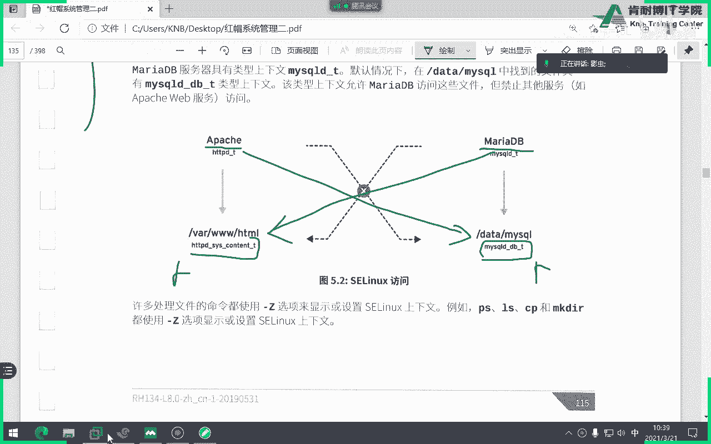

看能不能测试成功啊，我这个我按什么呀。

我们测试一下啊，我们就装阿帕奇啊，因为阿帕就不讲了，你也别问我是干嘛的了，抓一个阿帕奇，阿帕奇是以前老版本红包七当中的一个大考题，四道考题啊，现在是，现在是那个啥来着，啊现在他不讲。

我已经把阿帕奇装了啊，阿帕奇装，把阿帕奇装完之后啊，各位我起服务吧，你得起啊，各位你肯定要起啊，起伏起伏之后，大家来看这个文件目录，它自动自带自动就带了这个文件啊，等你看它自动就出现了。

为啥这个目录是阿帕奇自动自自动建立宝贝，再加个小写的d类型字段，是不是他书上是不是只能访问这种类型字段，对吧好，那么我现在跑到这个里面创建一个index，去建立一个index，可以去表，这干嘛呢。

这是这个页面啊，注意这是vr 3 w html是放页面的目录页面，比如说出现一个那个test吧，好好，不用重启，是已经重启过了，不用重启了啊，这是我装一个小程序，是一个浏览器啊，就是字符解诶。

界面浏览器啊，是不是装过了，没有啊，那算了，啊是不是出来了页面到就相当于我访问我自己，这是浏览器的意思啊，我访问我自己出现了好，那那但但是注意他为什么可以出现，就是由于我把这个类字段是这个好。

我现在我这样做，同志们，我重新做，重新做做什么呢，你看，我我想我怎么做啊，这个不知道能不能成功啊，试试吧，呃我跑到这儿，这我把那个刚这里面不是有个页面吧对吧，我把这个页面删掉，我跑到tp里面去创建页面。

重新创建页面，重新的创建器页面一定叫做index。html，必须叫这个名字啊，这是他说的远了，这就是阿帕奇里面规定的静态页面，就是就是这个名字啊，好叫叫做red hat，好好。

这时候呢我们cp杠a拷贝过去，你必须要拷贝到这个目录下面，因为我就是第一次呢我们就直接跑到跑到目录下面自己建立，第二次是我跑到tp当中建立好之后拷贝，为啥，因为这个目录是发布站点的目录。

你必须放在最下面，无非是你直接放和你从别的地方拷过去，但你都得放到这里面，好吧好这时候呢我们跑了进去，跑进去没有吧对吧，必须放进去啊，好这时候再用大写自己看一下。

对你看它类型值是不是这个不是刚才那个类型值了，咱们应该叫什么类型值才行，还记得吗，是不是必须得这个类型值对吧，但是现在呢此时此刻它变成这个类型值了，我们看还能防卫吗。

还有这就是我不知道为什么他还能访问吗，还能访问，如果在红毛七当中直接就报错了，那还能放位，还能访问，按道理是不能访问的，你们很明显吗，很明显他这个什么类型值是这种的，所以他怎么还能返回呢。

上级目录是这种类型，但你真正访问下面的子文件，它不是这个类型，它应该不能访问啊，很奇怪啊，行了行了，现在不做了，不做了，不知道为啥你看大写的字也可以显示上下五，一定要注意啊，那村上他自己还说呢，看了吗。

如果位于tnt和vr里面的文件不能访问的，因为tm p和vr tmp它的类型值不是这一类，你有没有发现为什么你新建一个子文件只有跟父母录相匹配呢，比如你看现在是哪个目录，现在是不是加目录再加目录吧对吧。

你来看下下面的所有旅行时，你看仔细看看名字看到吗，你跑到比如说你跑到bot里面，各位你看boss下面的所有子文件或者子目录，它的名字都叫什么，看看了吗，不是它下面的子文件。

子目录的类型值是不是有点继承分目录好，大家知不知道我刚才做了什么事，我跑到tp里面建立一个文件叫index html，我拷贝的时候加一个小写的a大，还有没有发现a是什么意思啊，为什么要加个a。

如果不加a，他就会把这个文件拷贝过去之后会继承这个文件的上下文，但拷贝的加a的时候是保留原来的上下文，听懂了吗，我是故意保留原来上下文，不让他继承，一旦不继承的话。

这个index html它的上下文一定不是那种上下文，一定不是这种上下尾巴，对吧，一定不是这种上下文，那因此是应该访问不了了，所以我不知道为什么很奇怪，他居然能访问成功啊，啊理解了吗，哎好了。

关于s0 x这个原理明白了吗，都厉害，一定是一个进程访问一个文件，一个进程访问一个目录的时候，必须要满足上下文当中的第三个叫类型字段，如果类型字段不满足，你是访问不了的，就算你有权限。

所以你看这个图片就是这样啊，v r3 w html的fl 2这个文件，但是它的类型值必须是这种才能访问，因为如果fl 2这个文件类型值不是这个，它就访问不了，访问不了啊，所以不知道为啥它它可以访问成功。

很奇怪很，我已经起了，奇怪，算了吧算了吧算了吧，那很奇怪，这个就。

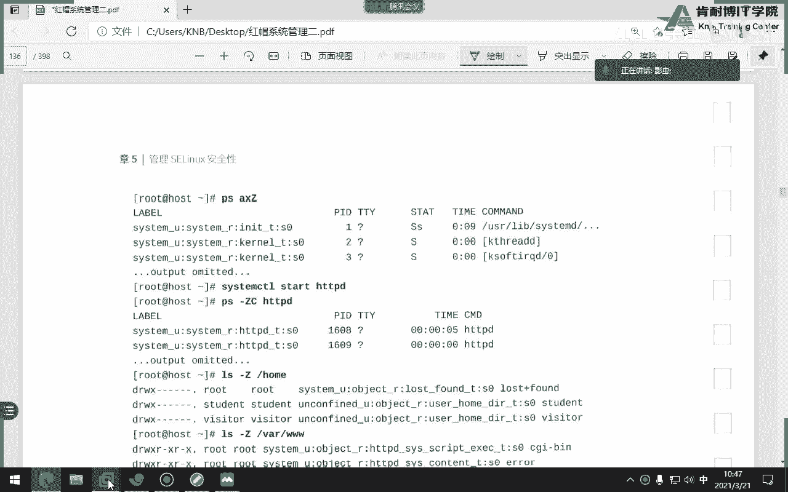

我用浏览器试试。

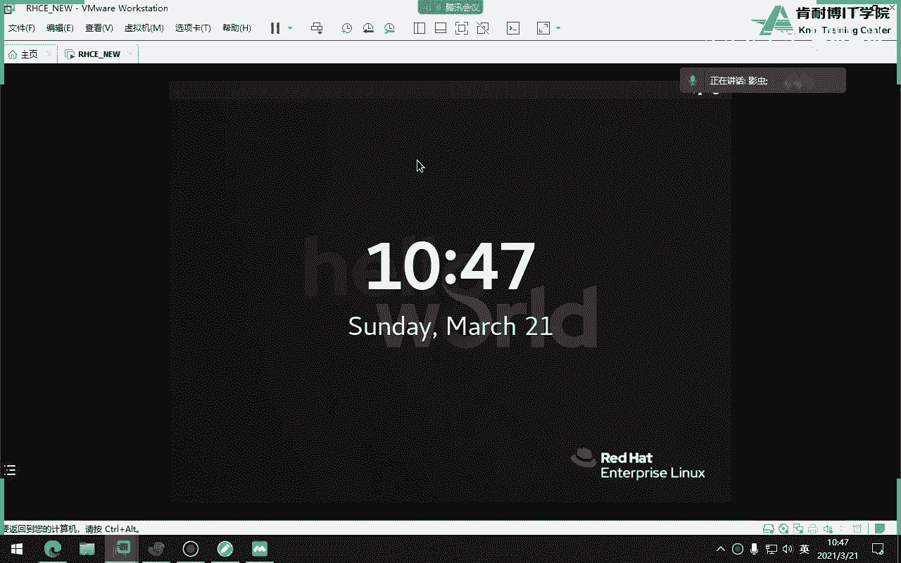

用真正的浏览器来访问一下，是不用不用那个用浏览器试试，稍等，啊那那个人的房门叫h t t p s a b，算了吧，s e r v e r b连不上，这都能信，这有什么区别，是不是哎是不是感觉成功啊。

不对，他就是连不上，哎这怎么跟浏览器解析有什么关系呢，12。二五点，怎么能跟浏览器有关系，你主机都可以访问浏览器。

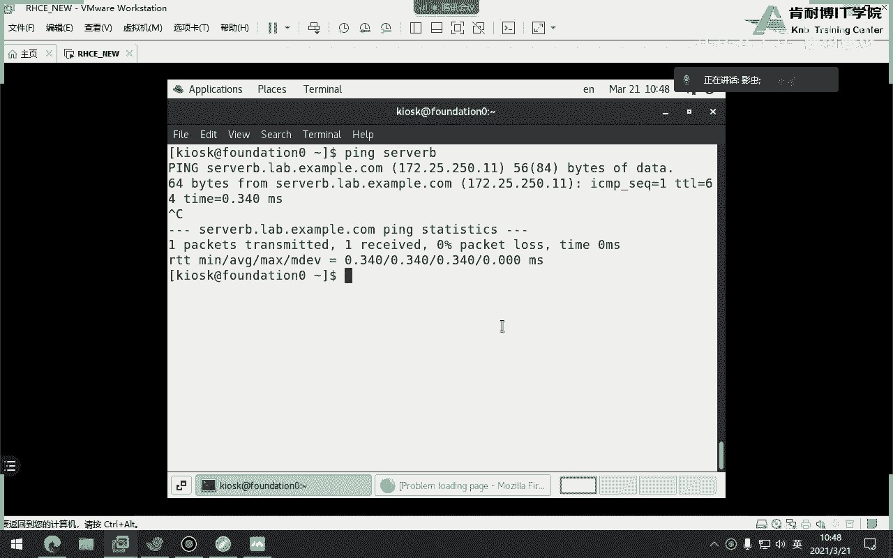

怎么能不能呃，那是不是说明成功了，可以放枪啊，对对对，忘记了放火墙，我想的太朋友帮我抢，在我们c当中也不讲了。

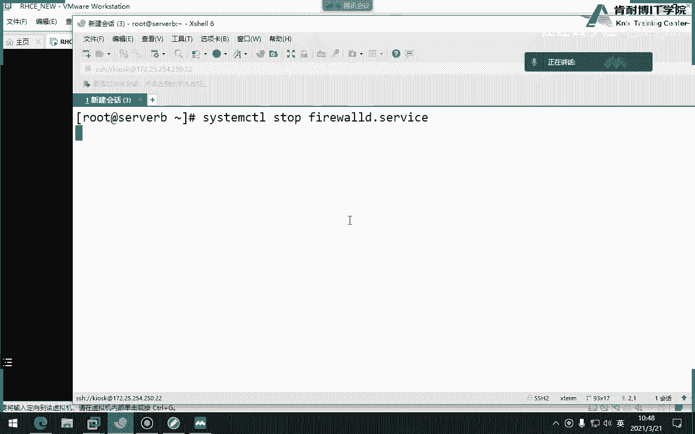

一带而过啊，不是不讲，不像以前讲那么多，还能问，这还有问题问题他不应该访问，你知道吧，因为他类型值不满足，你还很明显的类型就不满足对吧。

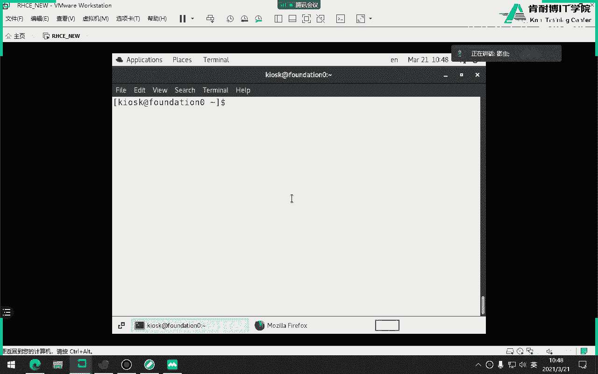

你看他类型是啥类型值哈哈他我刚才加了一个小写的a，是不是把tp的那是拷贝过不去，那个保存下来了，刚才是在哪建立，我是在tp下面建立的，那么这个时候他类型值是什么类型，属于这种类型，我加个小写a考虑过去。

意思是指我还保留这个类型，我故意的啊，所以他应该不能访问了，怎么还能访问这咋回事，但红包七当中我以前在讲，那个时候直接就不能访问，很奇怪啊，这个真的很奇怪，但大家知道什么原理了吧，知道就行了啊。

你p的时候也可以看到有类型一样进程，也有这些上下文啊，也有啊对吧。

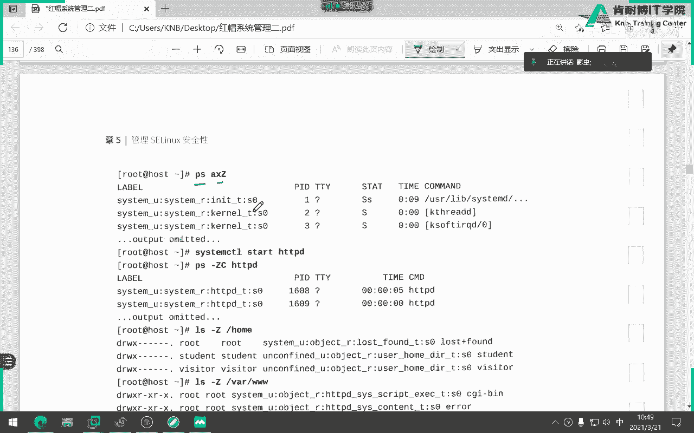

嗯行吧行吧。

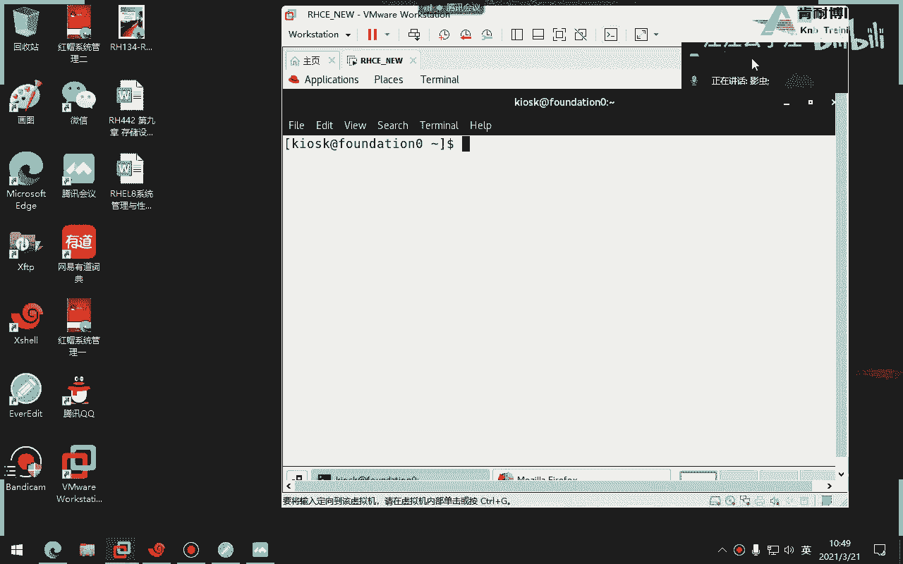

稍等稍等，我想一想，稍等啊，咱们没学没学，我自己做，我把这个我把父母给了，附录干脆改了，他还能防卫吗，对吧，现在大家再来看父母录，选这个了吧，刚才应该是http下划线对吧，那种，奇怪了，目录改装方案。

那不s0 ，没什么效果，那我们还学它干嘛，我说错了，有点意思啊，嗯，这个s0 是他保了什么作作用，保护了啥，那我待会儿做客户，看客户c d，这是不是有什么那个好办法啊，好那么接下来讲一下命令。

那我怎么开开s1 x考题中就在这，这是考题，首先get in for是查看set是设置对吧，一是inforce，零，是permissive，还有一个只是disable，disable能设置吗。

答案是不能设置，注意这个命令只能一和零，没有disable，没有disc好，那么就有哪三种模式呢，往上走，第一个是强制强制指的就是我强行开启模式，只要是触犯了，直接阻挡你们，第二个是许可。

就是permissive许可，许可是什么东西呢，就是也是开出版之后呢，我不会强制你去做一些措施，我只是警告一下你出发了，出发了，s0 x，但我还是让你访问，但是我把你的事给记下来，用于排错过三个进入呢。

就是我根本就没有s的，你不过不过明白了吗，怎么讲，第一个是硬限制，第二个是软限制，第三个是限制，懂我意思吧，好那么怎么改呢，各位如果考试的时候，千万不能这样随意用这个命令改啊，这个命令临时改。

你得用这条命令给我打开配置文件，配置文件，各位打开配置文件，把这句话改成inforce，考试的时候，这句话是permissive，要改成inforce，看disable，你如果你想改成disable。

这边写成disable就可以了，好改成之后生效吗，不生效，注意不会生效的，改完之后不会立刻生效，你再打一下这个命令几，自己就行了，明白了吗就行了，那这是get设置一下，去查看这个是一，那如果改成零了。

选的什么了，当然我这个是没有管理员权限，我就重来，你看比如我现在改成零，再来看我改成一，再来看没有dc吧，所以你考试有两步，第一步先临时改一下，为什么，是不是此时此刻生效，接着在干嘛，文件打开配置文件。

然后再干嘛，配置文件啊，或者是有哪个配置文件都行，不要问我啊，随便哪个都行，这两个都可以，把这句话改成false就可以了，还有一种办法就是你做完之后直接重启电脑，重启电脑之后就不用再打这个命令了。

就重启了吗，不是时时刻就用了嘛对吧，但这个相当于代替重启啊，考试的时候很多同学就直接写个一就走了，那考试零分，这题就零分，你是临时做嘛对吧，你考试得重启电脑啊是吧，你改了吧，考试就这一题。

就这一题很简单啊，教材当中告诉我们是这个目录，但其实我跟你们讲的是那个目录，这两个目录随便你随便你用啊，这就是关于s0 x的前半部分的一些讲解，大家有什么疑问，就这个实验很奇怪啊，就应该不能那个啊。

就是考题一模一样的考题，你改一下就可以了，一模一样啊，这题就是就是就是考题就是把s linux改成inforcement permit，改成一个限制，一个是软限制，一个是不限制你这么理解它。

所以就是如果你触发了s linux的策略，它不会阻挡你访问，但是呢他会把你的行为记录在案，就是你触发了绝对不允许你访问的，绝对不让不让你访问，那么考试考到这儿就停了就结束了，这是考试的。

反正上午的前一题吧，还是前两天忘了看第三题之类，就是让你改一下啊，我们休息一会儿啊，那么我们接下来来说一下怎么去修改s10 用的上下文，又有这样几个命令，这两个啊，这各位这一个命令啊，这是一写个。

这是二和第三个命令下，有三个办法来教大家修改安全上下文还是安全上下文嘛，就那四个字段，那么首选办法就是他哎你看红帽都告诉你了，首选那你记住注意啊，未来我们工作的时候就用他，那都你收下了，你说你不用。

那其实我我还真不愿意用，我喜欢用第三种，因为第三种比较简单，知道吗，比较简单啊，好那我们来开始讲一下这个啊，那么怎么去更改类型值呢，三种办法啊，那么这种命令为什么大家不愿意红包，不建议大家用呢。

但我个人还是比较喜欢用，因为这种办法呢怎么说呢，用于测试的时候很很有用，但是呢它不会将你更改的上下文保存到数据库，注意同学们，大家千万不要以为不保存数据库之后，重启电脑就不生效了，不会啊。

重启电脑之后还是你改过的内容，内容这一点很重要，就是虽然说它不保存到数据库当中，但是你改完之后重启电脑还是改改过的结果，只不过当他遇遇到这个秘密的时候，应该翻译成中文，是不是，我也不会回滚了。

我看一下吧，我们把它想成是回归，因为它从效果上就是回归，恢复吧，看见吗，恢复是吧对吧，就是恢恢复是吧，还是什么受限啊，这边叫受限，那么当他遇到这个命令的时候，它又变回了原来。

比如说你从a改成了b改成了b，然后你这时候一遇到这个命令，它又变成了a，所以说红帽不建议大家用这个命令，那用哪个命令呢，他说了首选用这个命令，se manager这个命令。

这个命令是改完之后把它保存到了数据库，是永久生效了，就算遇到了革命令也不会干嘛，这个它主要的目的是这个好，接下来我们来做一个实验，咱们就做个实验，各位咱们就做这个，咱们就照着书来做好，建立一个目录。

注意他在哪建立了根吧啊啊就r c e吧，好你永远记住在跟下面建立的文件和目录一般都叫default来看，没没骗大家吧，这叫default，好，那这时候我们改一下怎么改呢。

咱们先用那个呃就当中不推荐的办法来改，咱们改改成什么呢，咱们改成咱们最熟悉的hd p t tp啊，t好，咱们改一下，改成24亿，看改完生效了吗，立刻生效没有问题，立刻生效没有问题，但是一旦遇到这个。

就我刚才讲的叫回归命令是吧，好一旦遇到这个命令，同志们，你看看你看看出现什么效果，你干嘛了，快快快快，他要干嘛了，又滚回去了吗，是不是为啥你要是的，它没有保存到数据库当中。

而那个r e s的命令是读取数据库的，他还会按照原来老的那个数据库保存的东西给你干嘛给你覆盖掉，如果我们用s manager这个命令来改来，同志们，咱们用s manager这个命令。

注意菜一命令怎么用啊，f，a是添加它更低了下来，我告诉你们中文你就不会背，不会不会记不住，a是添加d呢，啊对吧，delete好，t是什么，t是type的意思，那这句话就是我要给它加上一个类型值。

看到了吗，什么类型值啊，比如说咱们还用这个类型值，有时候还用刚才那个类型值c，哦坏了坏了坏了坏了坏了坏了得用这种方式正则表达式啊，忘了怎样写一个啊，这句话意思是指r c e以及r c e下面的所有内容。

所有内容啊，是不是加错了，那是不是写错东西了，好吧，因为它在更改数据库，稍等稍等稍等改了，原来是什么default吧对吧，24 一原来是default类型，好改了，改看有效果吗。

为啥因为一点用这个命令读一下数据库在干嘛，就永久生效，听到啊，所以这个命令你相当于要读一下数据库，这条相当于干嘛，你改了数据库，但是不会立刻生效，这条命令是你读一下数据库，然后就永久生效了，听懂了吗。

这两个命令他们俩配合对吧。

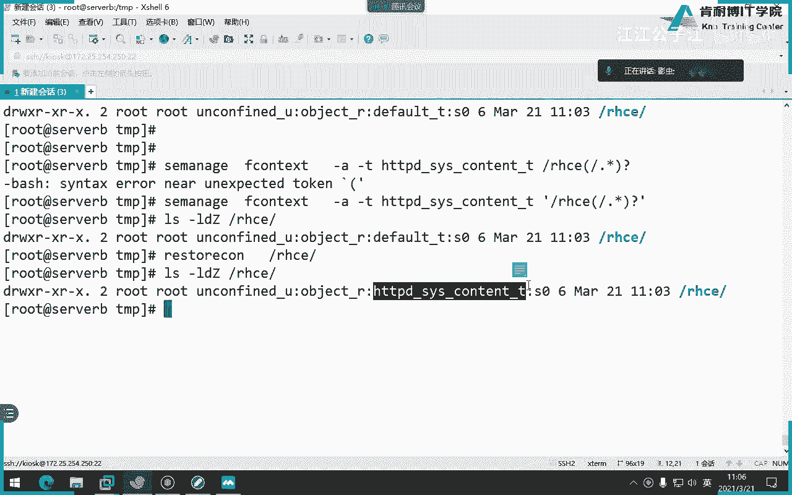

所以说啊各位你的c h m o d这个命令c是什么来着，这个命令这种方式来改，它不会改数据库，所以它会回滚回去，c h cn这个命令它不会改，而s e manager这个这种办法是改数据库的。

一定要注意啊。

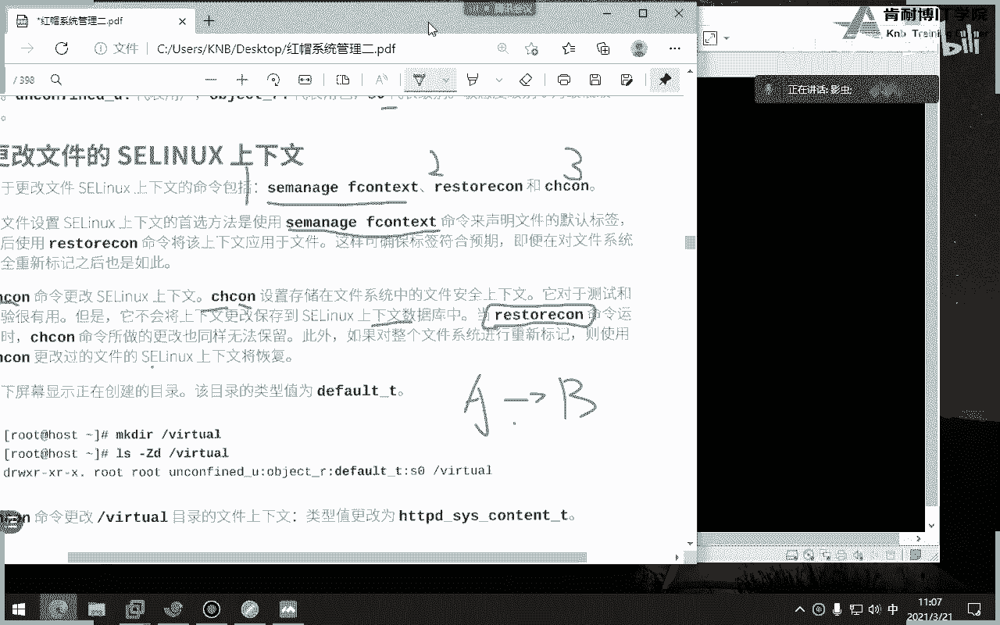

所以考试大家想咱们现在不考了，就是红包期当时考试的时候首选用第一个第一个啊，添加那l呢是列出不用解释啊，不用解释好，结束了，这是改啊，这是怎么改，a是添加t是类型值，类型值中间加个v是干嘛的。

好结束这一章，这就是赶快把这张结束了。

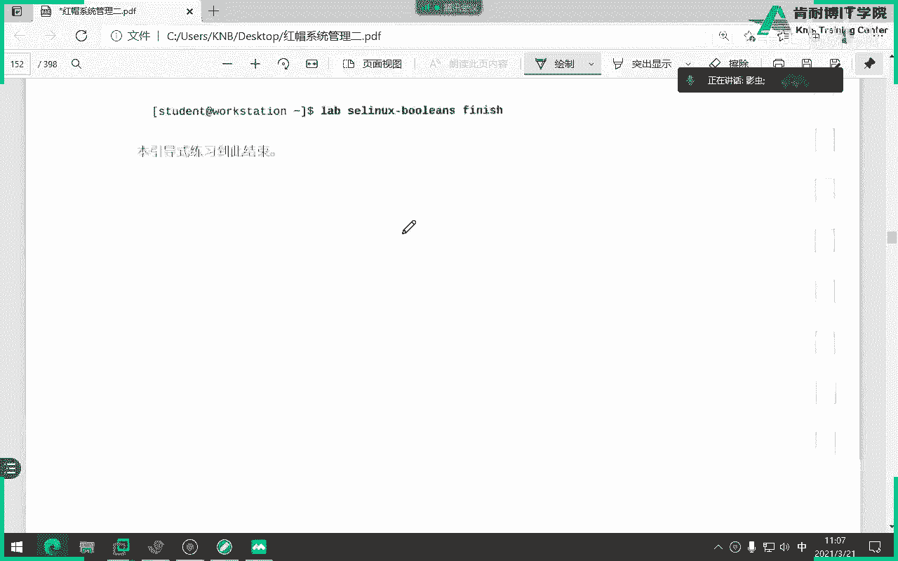

不让你们做题了，会了吗，那三个命令最后说一下。

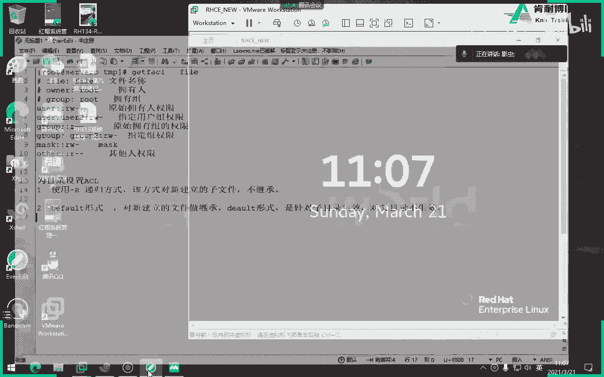

再来回顾一下，看一下的命令啊，刚才我们做的哪，啊啊这里在这肉不会生效，然后再读一下才能生效，好吧，注意它，注意它，但是你现在这个命令已经靠你了，因为咱们不讲服务器的搭建，所以它不会考你这个命令。

但是你知道人家未来你看到这个命令，你知道啥意思，a是添加t 10类型值，d是如果把a改成d就删除好吧，这一章就快速结束它，咱们还可以用图形界面来盖s0 x，这就没什么意思了，就不用讲了。

咱们工作当中怎么可能会用图形化界面，我就我不是说不可能就是几率比较小吧对吧，那么我们今天的重点包括下午就讲这一章，第六章，第七章，重点用一下午时间来主要讲这个东西，上面那些东西都比较简单。

咱们领零零碎碎就过去了，第六章管理存储，管理存储呢，咱们这一章呢咱们只看前面的内容，也就是说这本书当中讲的这个命令不用学，不看不看不学不用学，你要学这个命令也能学，但是我不建议大家学。

因为这个命令有点烦，特别烦，你得知道你上一个分区分到哪才能分下一个分区，这个命令不用学啊，同学怎么办，那我们考试怎么怎么考，我教大家用老的七版本的命令，咱们考试用七版本命令来考试，担心扣分啊。

不会扣分满分为啥，因为红报考试有个好处，就是它不关心你敲什么命令，你哪怕用图形化界面也行，他只关心最后的结果，国贸考试比较灵活，就他不是说一定固定死的那种答案啊，我当年在去红帽培训。

红帽培训那个八版本的时候，就是考官啊，他自己都不跟我们讲，他是说你们不要用的命令，就用f5 disc就老的命令啊，不用学这个party，但party的命令好在哪呢，各位刚那个有个好处。

就是它可以分m v2 形式的分区，ef可以分gtt格式的分区是优点啊，咱们得说人家好啊，他是有优点的，各位，好那接下来我们就来讲第六章分区分区这两种形式，第一种是m b r格式，第一种第二种gba格式。

我想你们都应该对这个知识点应该是有所有所了解的吧，尤其咱们在机房里做运维的同学，应该对这个g b t应该都知道吧对吧，那么呃不过呢我们可能对这个里面的细节部分不是把握的很好，首先什么是nba呢。

各位大家知道什么是m b r吧，翻译成中文，什么是mb啊，哎主引导记录，那么m b i多大，512字节，因为它就是一个扇区啊，一个扇区一个扇区多大它就多大，因为它就是占用第一个扇区。

由于它是82年产生的嘛，所以它有特别大的局限性，就是它不能分两个t以上的文件，你也知道咱们现在随便买一个硬盘都有两个t3 个t8 个t了对吧，那你你你你这时候就会有限制，但是咱们家用电脑还是主流mb啊。

咱们可能家用电脑比较多的还是2t以下的硬盘对吧，比如说我我现在笔记本还是500g呢对吧，所以还是用mb r格式的多一些，但在服务器的环境当中，这个d格式是一种怎么讲，现在流行的一种方式了对吧。

那么gpk格式呢它可以分128个分区，你只要给我记住这一句话就行了，其他都不用记什么32位，什么什么玩意儿就不用管它了，好第二个是有一个问题，就是它由于是呃新区记录表，由于只有64字节。

所以就造成了它只能分四个主分区这样的一个局限性，那么为了打破这个局限性，我们第一天就讲过，我们是不是可以借助扩展分区来，就在就他这个单词是不是可以借助扩展分区，那么扩展分区本身就不可以用。

是目的是为了存放里面更多的逻辑分区，看到吗，逻辑分区一般是从5号开始，所以说这个就是我们考试的时候要注意，考试的时候一定要用分逻辑分区，一定分逻辑分区，按一个主分区，那完蛋了，考试一定要注意分扩展分区。

然后接着分扩展分区里面的逻辑分区，所以我们最终格式化的时候是里面的逻辑分区，而不是扩展分区，这一点一定要记住啊，我们第一节课已经讲过了，就不再解释了，好吧不再解释了。

那么有一个问题就是这个分区当中逻你可以分几个呢，注意也给我背下来的15个，那么还有一个原因就是为什么要用扩展分区，如果你不用扩展分区的话，像我们这个图片当中，它已经有三个主分区了，如果你再用一个主分区。

剩下的所有空间是不是都不能再使用了，因为你四个主分区全部被你浪费光，这就是它的一个局限性，但是到了g b d格式，还有逻辑分区，主分区的一些概念吗，各位大家都是什么都叫分区，就没有主分区。

逻辑分区为啥128个，各位还不够，你用吗，肯定够用了好吧，这就没有这种主分区扩展分区了，注意概念，windows是不是也受限，因并不是针对啊，就windows也是这回事，好吧，你要知道这个这个事情。

所以我们在分析的时候一定要注意，你看到的字母是e p l p是主分区意识扩展分区，l是逻辑分区，你要注它到底分哪种分区，当然我我们今天统计一下，所有考生一定要分e然后再分l，千万不要分p。

各位不管谁考试挂了，你别怪我啊，我都告诉你们答案了啊，接下来这个教材就可以扔了，不看了，我们来学命令或使用fdc，来干嘛查看创建，注意可以查看可以创建好，那么分区过程四步，第一步创建说话步骤。

第三步挂载第四部永久挂载答案，不用不用不用想不用想就就三部好，那我每次讲分区的时候，要求大家先把步骤记下来，因为命令很多要做到我做到哪一步了，我都忘了，千万不要忘记住，挂在这个死记硬背背下来。

然后咱们再具体讲每一个步骤下面的命令，那么比如说啊咱们要现在分区，各位分区，咱们用哪个命令f第四个嘛，好注意，这个命令有局限性，这个命令只允许分gpa，不是mdr格式，那如果我想问gbt格式怎么办。

比如咱们现在在公司里面，公司的电脑都是gb t格式怎么办，各位不想用party的老人没学嘛对吧，咱们咱们没学过party的对吧，那咱们也不会自学，那请问大家怎么办呢，可以使用这个命令。

注意如果你不用使用gb，这个是分g p t格式的，啊啊啊，给大家分享一下好吧，为啥不教大家party呢，因为g d4 里面的语法格式跟fdc几乎互相听。

但是如果你用你学party这个命令完完全全就是另一个世界了，明白吗，就是我如果学完f disc，我就算没学g diss，你上来就会用，那就会有会有，但是你如果你学party的，那你就完完全全不不一样好。

所以我给大家分享一下这个命令好，那么后面你想有这样几个选项，第一个选项是l l是列出的意思，一般l都是列出啊，就是查看好，那我们来瞅一眼来各位咱们就拿f来看fd是杠l告诉我有几个分区。

这个硬盘第一个a第二个b，第三个c，第四个，第五个，并且第一个多大十个g，这个这叫什么哪个单词，这个单词这个单词叫扇区啊，多大519，而且请问大家v da，这是第一个什么硬盘吧，这个硬盘有几个分区。

看到了吗，123很明显吗，而且哎呦我靠他居然是gp格式的，然后b c d有分区吗，注意啊，那么为什么b c d是五个g呢，是为了做咱们课后习题，因为这个环境是跟我们课后c d相匹配的啊，各位好。

咱们咱们咱们直接来分个b，因为a啊，各位十个g被用光了，同志们别分了啊，咱们分了个b b现在是这里是不是一个分区都没有，所以你要加上你要分区的设备名好，我们上课这个foundation再来机器。

同志们反对这个机器，我给大家做的时候都是su哈，都是s，二忘了，算了不看，都是sd开头的sd啊，但是咱们的虚拟机当中，各位咱们都是规定，你们考试也是什么，第开头千万别再找艾伦，你怎么没有sd啊。

千万别找了，好吧，你注意啊，你们考试也是规定，因为你们考试用的是虚拟机考试啊，好那么怎么分，直接来敲命令，他说欢迎进入到这个工具菜单，如果你有任何问题，请按一下m，那我就按呗，反正咱们不会呗。

好他这个比红包七漂了很多啊，红包七原来没有这些个主目录，没有的，你要也是分区的，看到t哪个是保存呢，哪是不保存的，q我告诉你这几个呢，因为你这几个要经常使用相当x了，那么未来是干嘛的，我也不知道。

你就不用再管了，好你看教材当中还教大家怎么改这个类型值不用改，各位不要不要改，不要我给自己添加麻烦，在考试的过程当中，不要聊聊，负责任的告诉大家满分，不要担心扣分啊，不会扣分，不改满分。

因为你别的游戏一紧张，改改改错了，原来能满分了，下零分了，你何必呢，明白吗，不用改啊，好什么类型，什么叫泰国，就是一个标签啊，啊没必要改啊，好那么n啊，那d呢我要我要非常建议大家把d学会。

因为万一考试我第二你紧张分错了，那我也会删吗，怎么删d你得会书上不讲，你也得会，你万一要搞错，你都不会删你怎么办，对吧好，那我们来做一下，按哪个，你看立刻告诉你哪个p是主分区，e是什么扩展吗，对吧。

我往上拉一点，p拉不了这个东西过来的p主分区意识扩展分区，此时此刻能够分四个主分区，但我们现在呢就按一个小写的t可以好，你看他说你号码是从一开始我能不能直接写三写多少，你管了吗对吧，那算了。

我还是写e哎怎么回事，嗯啊嗯我写个一啊，写个哎呦，我也不太好这个东西嗯，lp然后一好，你看注意这个单词叫做first扇区对吧，第一个扇区你看它是不是保留了2048啊，不2048之前都保留了对吧。

那你说我现在写的时候，我们这br是不是有很多闪组成，那你这边直接写扇区数可以，但是我建议大家呢不要写，他默认从2048开始，你就回车就行了，好那你有开始是不是就得有结束啊，那你结束写什么呢。

你看他告诉你写结束的扇区号或者写什么大小，那么我问大家，比如我我想我我我想分两个g的分区，那你告诉我这个分区扇区号是多大，你肯定不知道吧，那你也没必要知道为啥，因为我不直接加大小就行了吗，哎呦我的个。

烦死了，等他。

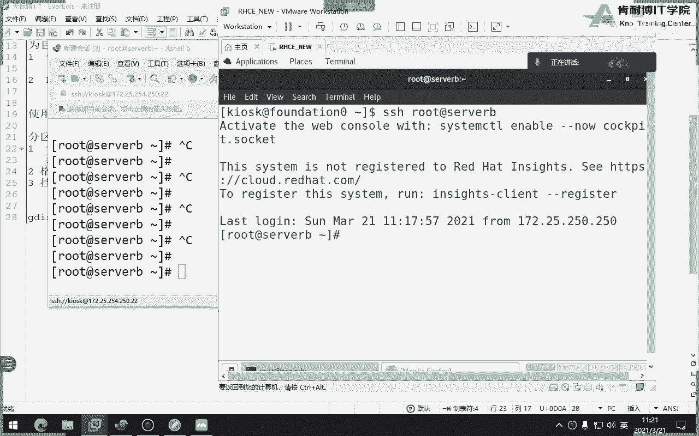

好加两个g，注意它会自动算出来从2048到多少是两个g，你不用管，你看咱们现在此时这个类型是什么，是linux，注意啊，linux指的就是普通标准分区，你不用我再说一遍，不用改这个tab值不用改啊。

好我打一个小写的p是print，你看是不是成功了，威力b一哦，原来是从这儿到这儿是两个g83 号的阿迪值，阿里13就等同于linux，linux就等同于83，不用改好，我要保存退出，按什么。

这时候我们再来看一下这个刚lv db，忽然间出现一个这个就成功了，第二步呢格式化那个格式化格式化翻译成中文叫什么啊，反正叫make fs，什么意思啊，叫创建文件系统，创建是make fs，是文件系统。

你这么记它不就不会忘了吗，对吧好，什么是文件系统，同志们，什么是文件系统，文件系统我也知道格式化，咱们为什么要格式化，为什么要格式化，哎我新建一个分区，我直接写数据不行吗，我为什么要跟我讲过一个问题。

所有的文件系统，话可以表达是用来管理我们裸设备上面的一个文件的一种方式，叫文件系统，管理我们磁盘当中的存储数据的方式叫做文件系统，只不过咱们这个文件系统呢有n个类型，很多类型。

当我们打一下make fs，按一个小写的点点，再按下table键补全，你看有这么多类型，比如说咱们最常用的对吧，fs，比如说咱们最常用的feat啊，那个it 14，这还有我们的fat好吧。

那么我们也知道在红包七当中默认用的是x x x x，在红包六当中默认用的是e t4 ，那么咱们有大量的文章，百度上找大量文章来对比ex 4和fs的一个区别，有很多文章。

包括我们在学这个性能调优那门课的时候，也专门有一小节来讲一下一it 4和eth和xx的区别，咱们稍微花一两分钟的时间跟大家来说一下他们的一个区别，好吧，你就哪听哪了啊，咱们不用纠结，那么大白s呢。

它可它虽然从七当中是默认的，就你不改化是默认的，你还记不记得咱们第一天装系统的时候，说明默认f x s装系统的时候对吧，那么虽然从七开始用，但是千万不要理解为这是新的，他也不行，很早了对吧。

只不过呢这种方式有一个好处，就是它适合那种特别大的问题，那种特别大的软件，它的性能要更好，但一般的应用小文件的应用at 4的号，所以我们知道了这样一个呃，当然这只是相对而言，不是说一定就比他好。

就是有了这样的一个方向的话，我们未来在生产环境的时候，你就可以做一个什么平衡或者调用，你比如说举个例子，咱们是做云计算的，或者是做这种嗯存储的，大数据可每一个文献都很大很大，那这时候我们就，倾向性。

但你比如说我们公司是做什么呢，还有咱们公司比如说是做cdn的，里面存储的都是一些片的文件，很小，零碎的文件几兆几十兆甚至几k那个之后呢，我们就倾向性的用e x t类型的，那有人老师呢。

我为什么不用e t3 ，注意t4 呢是第四版本，a t3 呢是第三个版本，他俩有个共同点，就是他们俩而年的话都是支持日志的人，日志怎么写，别给我翻译成log，还记得吗，那个对都是他都支持日志的。

那么日志有什么好处呢，各位你可以把它理解为什么呢，是这样的，当我们注意xs也支持日志也支持啊，包括咱们的windows的nt fs也支持好，所谓日志型日志的文件系统，系统有好处。

就是我们每次写数据的时候，我说写不是读啊，每次存储数据的时候，他先把这个存储的这个事情先放到到我们的日志这个区域里面，再从日志序里面干嘛，到写入到我们的真实硬盘里面，那这时候有个好处。

各位就比如说一个经典的错误，就断定一旦锻炼之后，我们系统就会有一些问题，比如崩溃对吧，那这时候呢如果有日志性的，一旦系统时候，它会从日志啊给你把刚才那些事情给你干嘛找回来，但如果没有。

比如像那个最老的大家千万不要再用e a t2 了，这已经20多年了，我们我们当年学红帽五时候都都都不用了，那这种方式就不带，就是缺点是什么，确定就是如果一旦断电，他每次重启的时候啊，他会全盘扫描。

那我的个天这个过程，各位一个t的硬盘，他扫那个扫都多久很久，而且再扫扫完之后也不一定能够恢复你的完整数据，那么看下弹幕功夫吧，没意思，所以就不要再用了，各位但它有很多不太好的地方。

就是它的支持最大的文件系统也很小啊，在当时来讲很大，但对现在来讲很小，明白吗，各位好，所以我们现在大家用的是e t4 和e t和x s好，三比二只多了日制，但四比三那多了就不止日志了啊。

就性能当中就不只是这一回事，所以我们大家用四和324和x x x x x呢，它的好处是什么，它好处就是可以在拉伸空间诶，厉害啊，同志们这个好玩啊，它可以在线拉伸，拉伸空间在线啊，同志们在线拉升空间。

但是它不可以缩小空间，即便卸载之后也不能缩小空间，这一点能记住吗，啊记在笔在本子上，我再说一遍，x x优点是可以在线拉升空间，但它的缺点也不能说是缺点吧，不能讲缺点。

咱不能说人家缺点就是说它不支持在线空间，也不支持卸载缩小空间，说白了它就不支持缩小空间，x m s哎，这点很牛啊，它可以支持在线扩大空间，但它可以支持卸载之后缩小空间，但它不支持在线缩小空间。

我怎么能知道吧，啊啊对不对啊，大家有没有想过为什么不支持在线缩小空间，这是在线的，你想想你这边给你的缩小，他那边跟那行，那不完蛋了，他刚写的东西，你比如说比如说给他删了，那么完蛋了吗，明白了吗。

哎他不就是在线啊，但是x y x呢它的问题就是你甭管不在线，他都不支持缩小，但它支持在线拉伸，哎这一点很厉害，各位ok咱们普及到这就结束了，所以下次我给你讲，讲完了之后。

你是不是就有倾向性的知道用哪个了对吧，那继续吧，那咱们来格式化一下，咱们既然一学嘛，咱们就学新的嘛，对不对，ok xs，忘了一对吧，哎你别来，跪地地啊，各位如果这样的话，你就就考试挂了，同志们。

我经常遇到学生这样啪一回事，那挂了我不干，不是v vd吗，我说你vd几啊，vd一啊啊，忘记加一了，那就完蛋了，懂了吧，大家这是一堆什么输出信息，你不用管它啊，好第三步干嘛，同志们，你不挂，什么叫挂载。

我这边有一个u盘或者移动硬盘啊，这个外接设备你想用你怎么办，你想用挂载好，我们为什么挂载，为什么各位我知道挂载，你也知道，我也知道咱们为什么要挂载，怎么解释他一句话，谁能说清楚为什么要挂载。

为什么要把这个外设挂载起来才能使用，为什么为了加入到我这颗文件系统，这个树吧，还记得那棵树吗，倒立的树上面是根，记得吗，哎你的u盘，你的一定盘，你的手机，你的什么u usb，巴拉巴拉一堆东西。

你想用可以，你得把它给我跟我的就是当中的文件系统，这个数当中的某一个职业，就是咱们所谓的目录绑定了，这个过程叫挂着理解吗，下次人家问你就这么回答，我谁都知道挂载好。

那怎么挂m o n t m o u n t，同志们，大家来卖一下怎么用，同志们很简单，加选项后面加设备，后面加什么目录，但这一堆什么这边你就不用管它了啊，好我们来啊，dv下面的v d b一吧。

挂了后面一定要加什么目录吧，哎我没见目录，咱们建一个吧，比如咱们建一个建一个叫做好吧，ok md v上面的第一位，上面的v b1 test一没报错好，如果报错了，我最害怕考试的时候啊。

你看经常考试的时候，考试考生做考题做到分区题目他已经做错了，但他不知道才知道，就打这一步才知道，就你不挂载的时候，你根本不知道你做错了，因为他不会说你立刻系统起不来了对吧，这一步就能看出来你有没有做错。

基本上有一个经典的错误，你知道什么错误吗，我讲完你得会啊，你要知道怎么解决，如果这一步报错，有个经典错误是这样叫bad super，怎么写，这这这super super block啊，叫错误的超级快。

还有一种错误叫什么什么什么，最后来一句，file system by就错误的损坏的文件系统，一般情况下各位遇到这种情况是什么原因呢，没格化对啊，没格化，很多同学就这样忘记格式化了。

所以我要告诉大家背三个啊，第一部分区，第二步格化，第三步挂来背下来啊，好那么咱们现在也没有问题，df杠h注意df杠小写的h小写呢不要用大写啊，虽然说大写有，但咱们要用小写啊。

各位是来查看看看什么挂载的文件系统，注意在linux当中，咱们其实不应该把它叫分区，应该叫文件系统，只不过咱们啊这是文件，是分区，是分区，但其实它的文件系统大家看现在有九个，不知道哪个。

现在有两个g已经用了47兆，还剩，还用了3%对吧，就是管理点我们怎么就用了3%，拿了就用了，同志们，你干嘛了，在写东西了吗，怎么就个我3%用了百分之很大了，同志们啊，你1年才涨多少钱工资。

你涨3%工资吗，是不是没有吧，干嘛呢，文这种是不是数据啊，你格式化是不是要写数据啊，虽然那个数据不是咱们放的，不是咱们放的电影，但是那个数据也是不是数据啊，是啊他也会损炮一部分的used，明白了吗。

也会损耗啊，就跟买那个内存条1a叉，比如两系他们只有1。8g了，干嘛呢，那俩那一点点干嘛呢，可能用于什么缓存了，或者用于什么显存了吧，明白了吗，哎浪费在这明白吗，好还有刚才我讲过不要用大写的意思啊。

同志们念大学就是立刻变我靠，我硬盘变大，很开心啊啊你啊，各位啊，这是千兆的，对1000性能调优的手段来讲，一定要用1024来禁止好吧，统一啊，各位统一下好，那么我个人习惯用的加一个大写的t是加类型。

大写的t是没有类型，这一串是不是可以看到我们当前是xx类型，所以我们以后就用大写t没有小解题啊，你别来个小写题，没有啊，没有是这样子，l s b l k吧是吧，第一次讲这个命令，因为我以前不习惯用的。

特别不喜欢这个命令啊，我我不喜欢带这种东西的东西啊，其实这种东西好了好，能看出它的一个这种数形结构吗，那我就不行了，所以我从来不讲那个命令，那你知道就成了l s b u l s是列出b l k的。

应该是这个是吧，这种啊我喜欢用这个命令bl kid这个命令好处，他可以看到uu id号，咱们需要用到ui的号，所以你必须要用这个命令看，有点小啊，同志们用这个命令来看b l a r d看了吗。

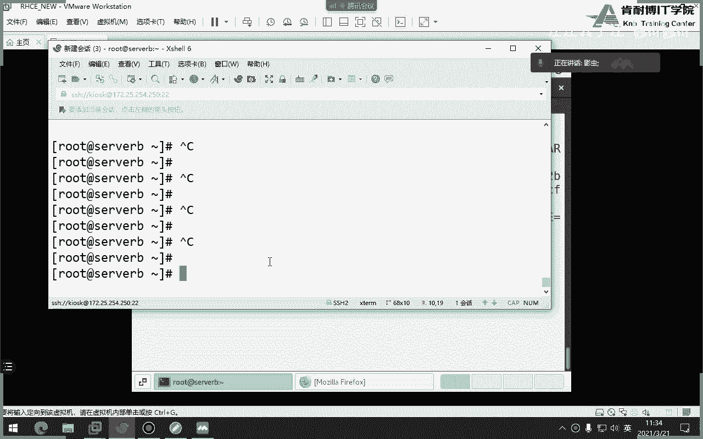

你帅啊，嗯有ui d号，从哪有u u i d号看每个设备都有，不光有ui d号，还有什么，我建议大家用这个命令好吧，有类型值啊，你看现在用的是xs，这是啥都没有啊，这啥东西啊，这边有ui d号啊。

什么是ur的号，ui就这是唯一的一个识别号，就跟你这个买那个网卡一样，是不是有mac地址，明白吗，哎这是个很重要啊，很重要好，但是我们知道这种挂载呢咱们都知道是临时的，所以我一旦冲击电脑。

待会我们再用df看的时候，是不是就没有了没有了。

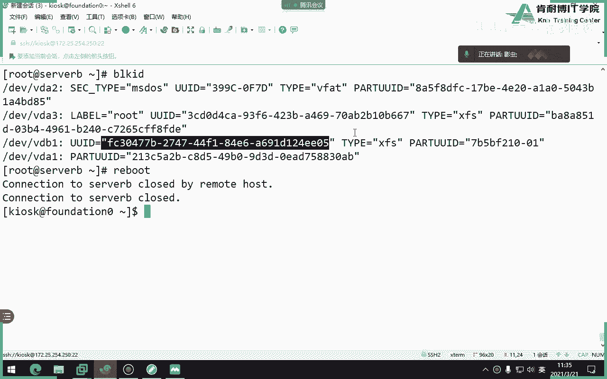

因此呢咱们要学习下一个东西，就是永久挂载啊。

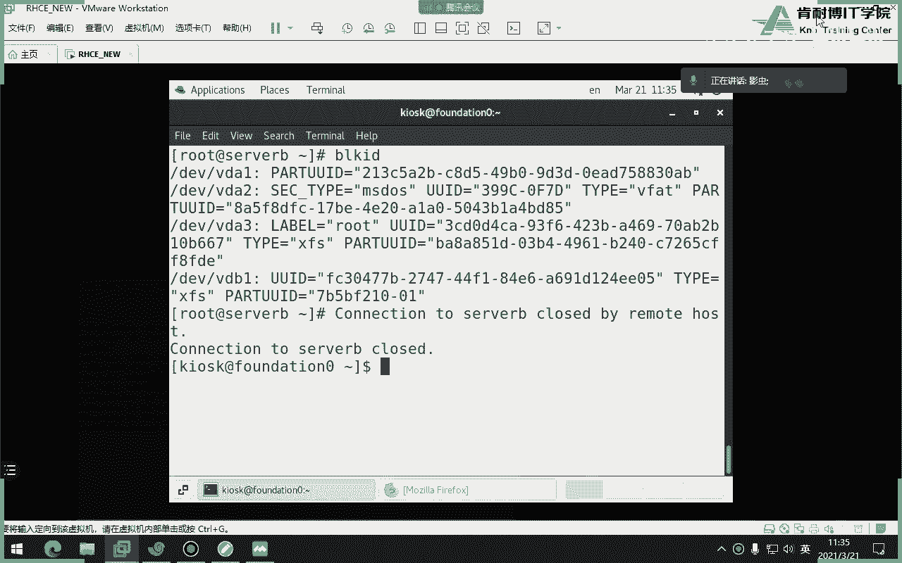

讲完这一点，咱们再休息啊，咱们补充一下笔记，看跟那它跟那重启的，咱们补充啊，叫什么，当然我个人喜欢一个例杠t后面自己加或者是i t3 啦，等会e t4 ，这样这样懂了吧，后面加什么地位，下面的设备名好。

这是我惯用的命令，随便你啊，没有要求你可以用make make fs。e t3 e t这样都可以啊，好那么挂载呢就是mount命令，不用解释，将它挂载写一个临时挂载，我们讲的是零食啊。

零食过来就是mt o u m o u n t r mk命令，实在是设备，然后才是挂载点，简单看懂吧，好还有啊，呃其实真正的完整的帽子命令不应该怎么写。

咱们应该加个小写的t各位应该在加一个类型值x x x x应该这么做，这样才是一个比较标准的写法，但是如果不写呢，没关系，系统会帮我们自动的去，相当于自动，他知道哦，原理是x x s啊，你不写也行。

无所谓啊，知道吧，就是你那接下来我们就要讲一下永久挂载，因为临时挂载不行啊，你像比如说刚才那个是个数据库，那那你不写临时，你写临时挂载，一旦某一天管理员不小心重启了，然后他回家。

他一直一一晚上那个目录都是没有备用的吧，因为你没挂载嘛，就没有用嘛对吧，所以很危险啊，一定要咱们不应该临时，咱们应该永久啊，19万，另外呢就是怎么编译呢。

就这个编译这个文件编译一个叫etc下面的文件系统表，文件系统表f s table嘛，文件系统表好吧，文件系统表当中有四个字段，第一个字段设备名我写下来，第一个设备名或者是u u r d号，为啥。

因为ui d号是设备名吧，设备名就是u r d号对吧，它是相同的，但是啊从官方他的手册当中，大家你会看到是不会推荐你用设备名称的，他不希望你前面写的是dv下面的v d b1 。

他不希望他希望你写ur的号，知道吧，为啥，变动啊，还有第二个是关于呃类型类型类型，第三个是是，啥玩意，default，default，第四个是零，哎我过来点了，我过来点了，我过来点啊，谁是挂来点。

第二个版，不用记啊，其实我在写是没有意义的，为啥呢，因为里面有模板，挂了窄点不用记，不用急啊，千万不要死记硬背啊，没什么意思，因为这里面有模板啊，各位好，我们先来看一下df，很显然没有v d b一了吧。

好那咱们写进去啊，没有，照着抄就行，第一步第一位下面的v d1 ，第二步，第二步什么，看看人家这你看这就很显然是个啥u2 号，第二步就应该是挂了点吗，那咱们关来点叫啥嗯，八点叫一，千万别解错。

如果你fs里面的任何一个字段写错，你一旦考试回家了，考试零分起不来系统，但千万不能拼错啊，类型值是什么，fs比如说你是fs，你非得写e t4 ，考试领根就一个字，这都能拼错啊，好得报车s00 。

注意里面有s，如果不加s重启不来，考试零分，你有很多你有很多次考试零分的机会，就看你把握得住，把握不住了啊，大家都努力把握好，这时候怎么办，没还是没有用的，杠a或者重启电脑就行了。

或者你reboot也行，但没有必要，那么给咱们做一题，real的题，多了多长时间了，明白吗，慢慢杠一，我们今天讲的这一题，这一题就是我们考试的题型吧，可能不能说一样题型，好好注意啊，1u26 号。

你如果写的话，我咱们班统一了，我不不关心其他的这个培训机构，咱们班统一下都写设备名文，为了应付考试，不是为了生产设备名，你拼错的几率很小，但你写ui的话，那么一长串，你这个写的这个错的几率很大啊。

同志们，尤其很多人就是比如说重对象也好，或者这几个复制粘贴，有时候那么好就拼错了，很麻烦，那我干脆写是不明白，明白吗，就我咱们班同意一下就写出本名，但如果连设备名都拼错了。

那你就别怪你自个儿跟自个自己的问题啊，还有default加s啊，别忘了好它跟着重启的，咱们来稍微的离理解一下什么是default，杀敌boss给boss是什么东西，举报你卖一下就知道卖，卖帽子。

搜索一下default，就能搜索一下default，你会发现它其实是什么，是一挂载选项集合，它里面很多东西，比如说r o r w o r e e e c啊，得得得得得得得得得得得一堆啊。

也就是说他其实不是一个选项，它是一个集合，但由于太长了，因此他用一个default单词来代替它，其实是一个一一套集合，这东西知道吧，咱们来卖一下，各位咱们迈向谁要卖帽子，你别卖default啊。

各位啊慢慢，然后搜一下ford e f u l t，大家看一二，巴拉巴拉还不是在哪儿，咱们走往下走，还在这看，这是一堆选项集合啊，he fx这样如果有一天发现b boss里面的选项需要添加怎么办。

可以了，这抵抗后面加个逗号就追加就行了，明白吗，就相当于是这里面的一些值加上我们添加的东西，比如说咱们以前讲的那个，咱们上刚才上过那个讲的a4 腰，就是在以前红包五的时候，我说过有些目录是不能支持的。

什么目录，像这个这个二，而不是这个test的一，这个目录是不是我刚才自己新建的，那如果是在红毛五的时候，10年前红毛五的时候，那刚才建立的test一啊，就不能支持acl权限了，就打不了零命令。

就你打那个set fs要一敲回车，他就说什么什么不支持，那怎么办怎么办，很简单，在default后面加个逗号a4 l它就支持了，以前就这样干了，现在现在不用关心了，懂吗嗯因为现在大家都支持了，好吧好。

我们重启完了吧，应该对吧，ok再进去直接打df，同志们是不是有了，同志们有了对吧，就刚才我说的意思啊，就直接比如你想添加一个在这里逗号加上一个值啊，逗号啊，逗号啊，逗号加一个不就行了。

明白吗啊比如a c l啊，没必要，因为咱们现在已经自带了啊，说了一事啊好嗯，永久挂载会了吧，考试必须就挂载，你要是临时挂载，你那个完蛋，你考试肯定挂，他不可能靠你临时挂载啊啊啊靠你用力过来。

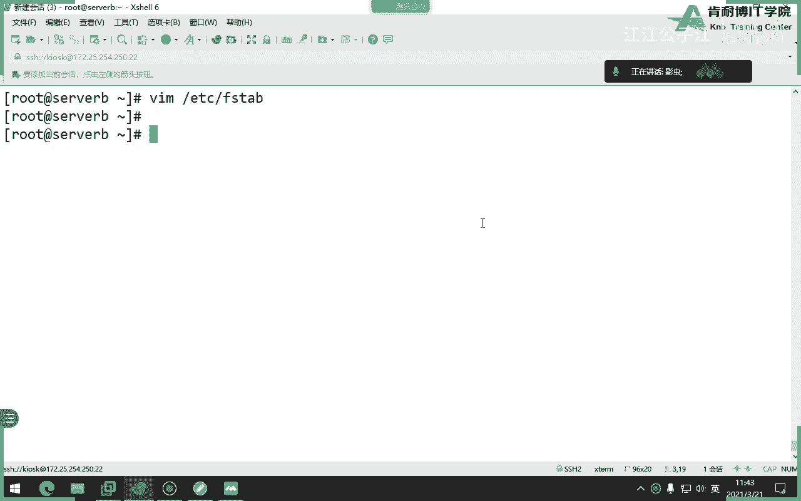

所以说刚才第三步的时候做完之后，第三步挂载的时候是不是就没有必要先打开它。

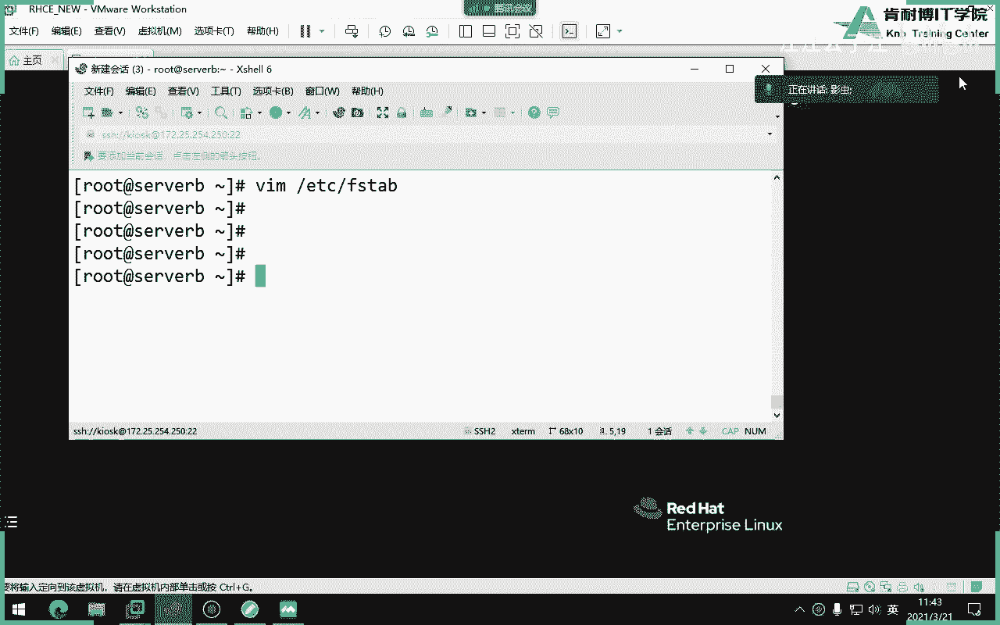

能不能直接写到这里面，也就是说第三步就不用再临时先打挂载了，就直接用永久挂载了，然后打mk杠a刷新一下mk杠a了好吗，所以这样做就是永久挂起来啊，这就是我们今天讲的这个分区啊，分完了格式化。

讲完了挂载讲完了就这么多啊，就这个很简单就能读懂，大棒的命令的时候是查看所有的已经正在挂，已经已经正在挂载的所有文件系统，直接敲棒的就可以看到很多了，比如说你看刚才我们在敲mt的话。

就应该有了我们新建立的东西了，有没有有了吧，你看这这个里面要注意了，这个括号里面就是显示的default类里面的东西，像特别强，就是未来我们参加考试的同学fs t a b千万不要写这么快。

咱们现在练看的时候觉得很快，你写的时候一个字儿一个字儿就别拼错了啊，咱们还有经常犯的错误，你到时候写的时候也习惯写x3 s也也也挂好了，分的时候是写什么，你格式化的时候写什么，里面也一定要写什么。

钱不能吃了，20世纪这么多多多年的一个新经历告诉我，csa考试基本上都满分，dc考试有个很极端，要不然满分，要不然零分零分就是这一题错啊，没有什么题目可以让你零分的，只有分区题目让你零分。

那么为什么满分了，因为今天这个题目有什么难度，你只要做对了就是满分，它没有那种模棱两可，s是不是这种解法，它不像c啊，c就是哎我可能有很多种解法，但这个题目就固定死了吗，你给我分两个系列分区。

你分出来就是成功，分不出来就是失败，它没有什么这个中间的那种可能性，所以说很多同学就是一旦失败，他不知道，你知道吗，所以很多同学他他他他有那种侥幸心理，就是我不重启不就行了吗，怕重启吗，那我不重启不行。

是啊，你可以啊，但是他考官会帮你重启啊，一重启起不来了，零分，见过一个学生，就是他非常好，他应该是在班里面学得最好的，但他居然考试零分，因为他没起来起来啊。

就是你只要把你就你你可以你咱班你随便咱们看哪个同学比较勇敢，你们可以做个实验，你一题都不做，让你出考，你会发现都不是零分，一个零分就是起不来啊，好行，我今天上午就讲这么多。

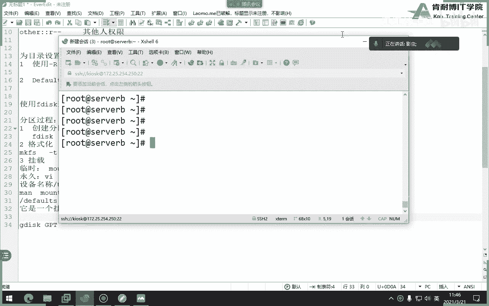