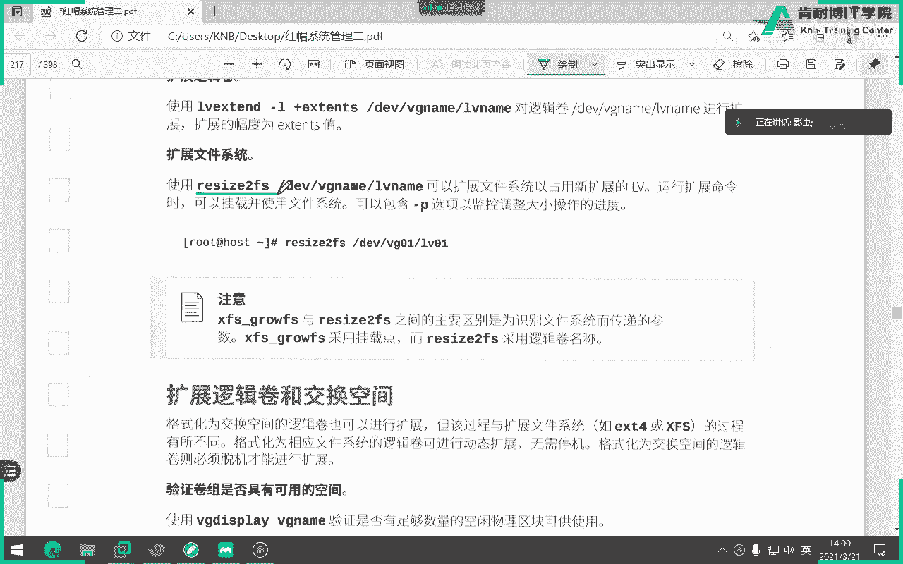
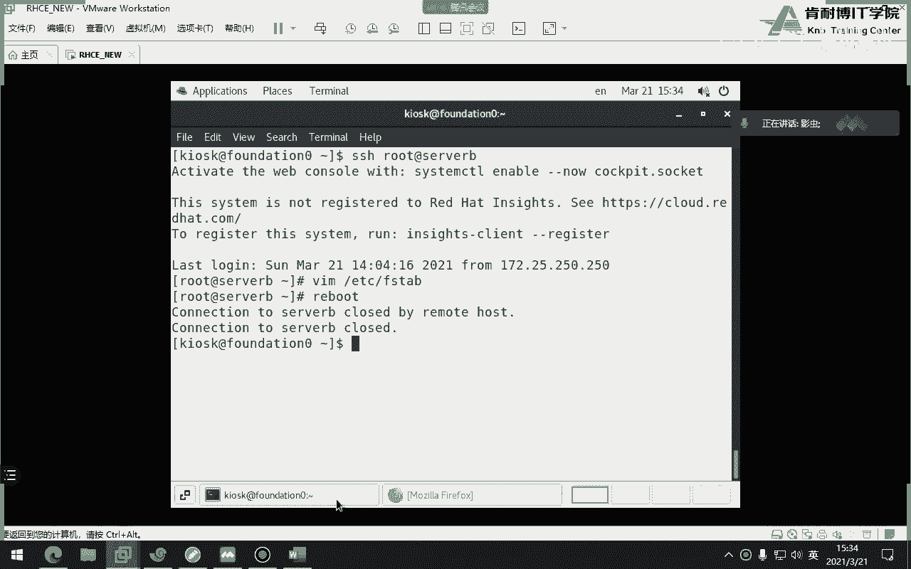
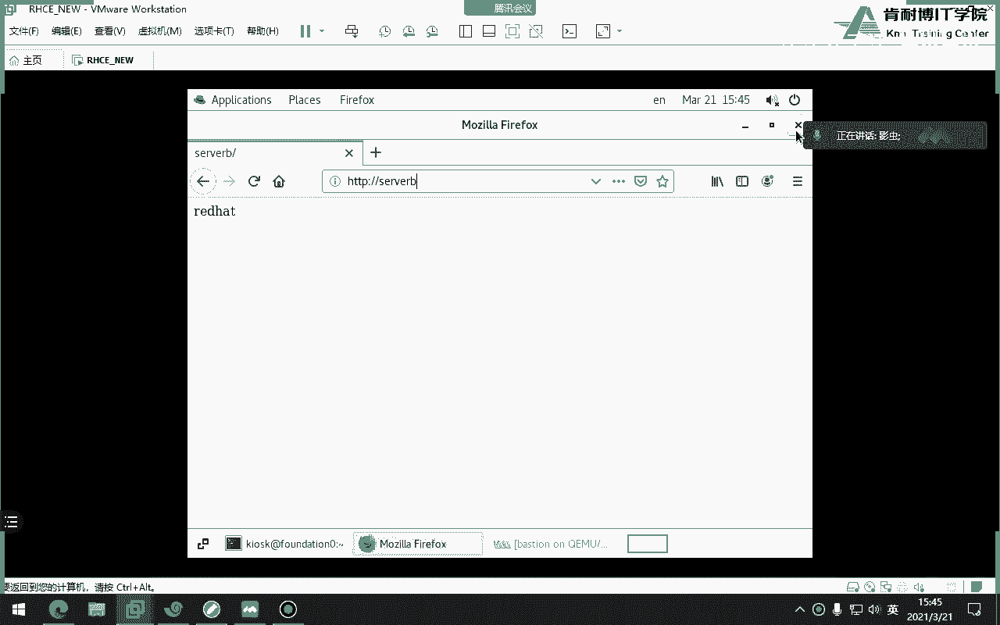
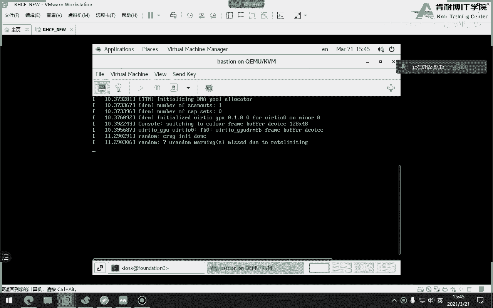

# 红帽认证系统工程师RHCE8-滕老师出品 - P12：第六天 破解密码 创建 swap，LVM - KNBIT认证中心 - BV1up4y1h7MA

那么今天下午我们来讲交换分区，那么考试的第一道分析题目考的就是这一题交换分区，那么咱们的教材当中呢，交换分区他讲的很少，因为毕竟不是在讲系统优化，所以他只是提了这么一句好，我们先把教材当中呢讲一下。

所谓的交换空间呢，就是可以跟我们的内存管理作为一个统一的一个话题，一块来跟大家解释，那么交换分区它使用其实是我们的硬盘的空间啊，一定要注意它使用的是硬盘空间，那么有了交换分区之后啊。

我们也称之为虚拟内存嘛，那么有了这个东西之后呢，我们可能会认为把我们的内存放大，那么所谓的交换空间好处就是什么，当我内存不足的时候，我可以去使用我们的swap分区。

你看通过把一些不太活跃的一些页面置换出去，换到哪呢，换到我们的swave空间当中，然后达到腾出来更多的内存的目的，那说到这儿呢，有一个比较专业的术语叫内存页面啊，内存页面你看教材当中写了吗。

叫页面配置配置就是pg配置，那么为什么要提到它呢，是这样子，内存管理的时候，你比如说我们我们说硬盘，咱们说磁盘读写都是以什么block或者是字节，或者是千字节照记这种单位来去来说。

这个关于磁盘方面的一些东西对吧，单位是k啊，这样的或者是照，但是我们的内存的单位呢是配置，注意咱们内存总是说我有1216g内存啊，我有32g内存，但其实从系统linux当中管理的时候。

甭管多大的内存都被划分成配置一页一页的配置409k，那么也就是下次你要想内存的时候，一定要用配置这个术语来解释，好吧啊，那么我们把一些内存当中不太活跃的一些配置页面换到我们的。

就相当于呃拷贝到复制到我们的swap分区当中，就可以腾出来更多的什么内存啊，这就是swap的一个目的啊，所以说目的好吧，这个大家一定要明白啊明白，那么想到这儿呢，咱们就就看教材。

他说我们自己在创建swap的时候多大呢，那他要跟你的真实内存有一些关系的，你比如说2g以下的就是两倍的对吧，然后这三倍的这个不用去记啊，大概了解一下就可以了，了解一下。

那么我是特别推荐大家呢在装系统时候把swap分区分出来，就算你的内存够大的，你也要分出来，也建议大家分出来啊，说到这儿了，再说一个，以前还记不记得第一节课我们说过一个指令，我们以前说过一个指令。

这是一个内核参数啊，非常经典的内核参数，这个参数呢还记得吗，0~100，它的数值0~100，那么数值越大就越积极地使用swap，数值越小就越不积极的使用swift对吧，我以前讲过，那这个代表什么呢。

就是如果你把这个数值调大的话，我们就有点东西去置换，有点东西就置换啊，尽量的刷新我们的swap，尽量的刷我们swap，那如果你把数值调的比较小，比如20 30或者是更小，那么就是尽量不要去打扰swap。

我们也知道swap使用的是内存，是硬盘空间，所以说你把一个东西从硬盘转换到我的内存，其实这个周期是很长的，这个代价会很长，明白吗，这是一种内核调优的方式，还有方式啊，你要记住啊。

所以有时候你会发现诶我内存还有很多的时候，他为什么就用了swap呢，你要知道为什么很有可能这个值啊，它被调的很大，那个时候他会尽量有点东西就swap过去，主要是这个目的啊，这个目的好嗯。

那么我们怎么去创建swap呢，那么首先你要知道当前swap多大呢，很显然当前是一个零啊，我们用free gm来看内存的时候，可以看到swap，注意free杠m可以看内存，也可以看swap。

ok说到这儿呢，我们稍微了解一下，这边还有一个叫buffer catch，这个就是用于多少内存充当buffer cash啊，就是缓存还存，那么如果这个值条例比较大呢，好处就是什么啊。

提高了我们的i o速度，那缺点呢缺点就是使得我们内存比较小，让我们进程更多的进程，没有办法得到更多的内存，这是它的缺点，优点就是使得我们的io比较快对吧，因为你把所有的文件都写到缓存当中。

大家一定要知道啊，你要清楚一件事，当我去写一个文件的时候啊，他是怎么写，帮我读一个文件的时候到底是怎么读的，它通过一个系统调用，把这个请求发给哪儿，发给我们的这个这个请求队列对吧。

这个时候你注意你写也好，读也好，这并没有直接读你的硬盘，读的都是缓存啊，那缓存是由谁提供的呢，使用内存对吧，理解了吗，所以说你写其实写的是缓存，读。

也是读者缓存之后用驱动程序一把给你扔到我们的驱动队列当中，然后再写到我们真实的硬盘里面，所以如果有了buff之后，我们buff比如说放的比较大，buffer比比如说放的比较大。

好处就是下次再读文件的时候，直接从八块里面读出，响应速度快，但同时有个缺点，就是如果你这个里面时间特别特别大，东西特别多，你没有往里面写写，写回的话，就是我们昨天讲的张译。

那么如果遇到了一些比如说断电的问题，那种数据是丢了，因为你没有及时的写到我的硬盘当中，明白了吗，啊这是我们8号开始，那么swap呢，你看此时此刻我当年swap都是零。

那比如说考试的时候说请过创建一个swap怎么做呢，还是三步分区挂载格式化，只不过这次用到了命令，跟我们上午讲的分区挂载格式化不太一样，但总体的步骤是一样的好那么咱们这样，那我该怎么做呢。

还是分数我们才用b对吧。

我不用了吧，没事就打错了，我们还是分区啊，那么分完区之后，请注意我们分区的时候用fdc的啊，还是刚才那个命令第一位下面的v d b，那么这时我分一个什么呢，分一个好吧，我们这是用一个e。

咱们要多大的分区啊，一个g对吧，分析回车那边二就二吧好吧，然后回车这边写什么，不是这边选什么还回事啊，如果你要把它变成了两个g的话，就相当于你的扩展分区变成2g了啊。

所以我不建议大家考试的时候一定注意一路回车，所谓一路回车就是指剩下的所有剩余空间全部给了e扩展分区，所以千万不要把扩展分区给它限制住，比如限制成两个g那就不行了，因为你一旦限制住的时候。

你里面的逻辑分区就不能就不能够超过两个g，所以你一路回车，剩余空间全部给他，然后这时候再按n重新分，这时候分的时候就是谁了，看他直接告诉你就五了，五是谁，第一个逻辑分区直接回车加两级，再再回车。

加两期就可以了啊，first是回车，永远记住first回车啊，ok保存退出w这时候你会看它会有一个报错，而且他告诉一定注意，一旦报错了之后，他会说你的内核由于使用的是旧的分区表。

所以你要重新重启电脑才行才能刷新啊，所以你看你你这时候你会看到dk下面的v d b，你会发现此时此刻是有五的，但是不行，没有用啊，注意它上面显示是一五，但其实没有，你一定要用这个命令看，所以从今天开始。

我们规定一下，你以后看磁盘分区一定要用这条命令去看这个里面没有五，那才真的是秀秀是没有五，明白吗，要你要用这个命令去看p r o c potentions去看这里面没有，就真的是没有。

不要再用l s a f t时刚l来看了好吧，那我怎么办呢，没办法，各位你得重启啊，他都告诉你重启就得重启，你重启完之后，我们就使用新的那个内个内核就可以识别到你新的分区。

那这个时候你再进行下一步的什么格式化挂载，不然的话你永远听到这儿，你就过不去了，好吧，你就过不去了，同志们啊，但是有一点，为什么一个硬盘的第一个分区不会报错呢，因为它是全新的吗对吧，要全新的好嗯。

看看啊，诶还没登上去，ok登上去了，各位这时候你再用cp i o c里面去看，就一定会有五是吧，一定会有五了吧，这时候就保证有了，明白吗，就是所以说你看刚才你这样看的时候是有的啊，现在看更有对吧。

肯定还有，所以这个时候看着就不准，大家一定要用上面这个命令，明白吗，这个时候我们接下来第二步格式化，那么格式化命令不是用make fs，而是make sweep啊，第一位下面的威力一五好。

最后一步swap out on是开，off是关啊，on是开加进去，这时候再来看看，就变成了两个g，刚才是零吧，现在变成两个g好，永永远记住，写入到这里面才能永久生效，还是要写到这里面啊，那怎么写呢。

那跟刚才一样吧，dv下面的v d b5 帅不帅帅不，第一个swap是相当于外来点，第二个swap是类型，最后保存退出，这样才能永久生效，你考试的时候，这里面所有步骤就要这样做，那么强调一下。

一定要分扩展分区里面的逻辑分区，同时那个swap写永久关在关，这个大家来可以试一下。

别忘了先是什么，后面什么一定要理解啊，先是分区后是make sy，make swift，make swap，很显然嘛叫做制作swap空间对吧。

制作swap空间好，大家可以试一下考试原题。

那么当我们做完swap的时候，有一个问题就是如果我用free杠m，各位看你看到总大小是两个g，但是我看不出来这两个g是一个磁盘做出来的，两个g还是有若干的堆积出来的swap，两个g我这么讲能理解吧。

那我想看一下这两个系是由谁组成的呢，是我自己一个分区组成的，还有很多呢，那我就要用swap on杠a大s对来看就可以了，你比如说还可以看到优先级默认是-2，注意优先级默认是-2啊，优先级杠s啊。

赵a是什么，啥也不是，就刷新下啊，好吧，那就刷新好，明白吗，这个要知道一下啊，就就就这个定义，就这就这点东西啊，知道一下就行，再也不杠s，那么这就是我们这节课的swap分区。

这一章就没有，请大家一定要好好的回去复习分析这一章，行，那咱们接下来的重点来了，就是我们的逻辑卷，这是这本书当中的第一梯队的重点，如果要把它划分重要性的话，这绝对是第一梯队最重要的。

六章和第七章是最重要的，第二本书考点多难和复杂，就命令从命令角度来讲，这一章内容多好吧好吧，逻辑卷管理器，那么问题是我们为什么要有逻辑卷管理器呢，那是因为我们可以扩容空间。

那么逻辑性管理器能不能减少空间呢，当然能了，但是我们没有去这样做的，这个行为为啥，因为比较危险，所以建议大家的逻辑卷主要是用于做拉伸空间，那么我们也知道，当我们一旦把一个空间做成标准空间之后。

如果你不够用了，是我没有办法在线拉升对吧，但有逻辑卷之后，我就可以做在线拉伸，所以这就是逻辑卷的一个好处啊，明白吗，好那么在做逻辑件之前，我们要知道这几个术语，物理设备就你看得见摸得着的磁盘对吧。

就跟咱们现在要做的是磁盘阵列也一样，你得给我找，比如说三块磁盘或者两块磁盘，我要做red的，对不对，我我这有磁盘呀对吧，但同时还可以通过什么呢，分区来，各位同学，这个也很重要。

你们考试的时候是不可能不可能给你每个人创建这么多磁盘的，那怎么办呢，我们用分区来做，比如我们可以用分区当做物理磁盘，明白吗，一定要注意啊，好然后呢，紧接着我们要有一个叫pv的概念，所谓的pv是什么。

其实就是物理设备的封装成了一种叫pv的东西，通过一个命令把它封装成一种pv，因为它呢作为整个逻辑卷这个架构当中最底层的存储设备的，所以你说物理卷能不能等同于物理设备呢，其实可以等于对吧。

因为你比如说我现在有个磁盘叫s db，那你把s d b是不是也要先把它变成物理卷啊，那么这个物理卷的名字也叫做s d b，明白吗，好那么接着呢注意这个pv里面啊，这个pv里面虽然叫物理卷。

但是里面有最小的一块东西叫做p啊，就怎么怎么解释呢，你像我问大家一个问题啊，你看你能不能回答我们的文件系统当中最小的存储设备是什么啊，最小的存储单元是什么，仔细听我这句话。

文件系统当中最小的存储单元是什么，大家知道吗，我没讲，那你猜一下是什么，不就是咱们的block吗块吗，各位是块多大呢，1k或者4k注意啊，直接听是1k或者4k blog块啊，不是512自己啊。

块你比如说我们刚才在分的make fs。e x t4 ，一旦回车之后，我们把这个设备格式化为e t4 类型，那么这个里面就会有出现很多很多的blog，每每个block也许1k也许4k也许4k也许1k。

但是在我们的逻辑卷当中，最小的存储设备呢就称之为划分，从各种各样的p大小是四兆，注意了这个单位很大的四兆，也说p一是四兆，四兆四兆四兆这样的一个组成，那么紧接着我们把pv再通过一个命令封装成叫vg。

它提供了一个池子，什么池存储啊，你把它想成什么，把把一堆的东西融成一个大的存储式，它是由若干个pv组成，这个东西能理解吧啊pv组成好，接着呢pv里面呢在划分成具体的逻辑卷。

我们真正使用的挂载的使用的是lv，你扩大的也是lv啊，当然了，我们在扩大lv的前提之下，你得有危机也是危机，如果不满足，那你lv也没没没没有办法扩大，明白了吗，那整体而言，整个的效果图是这个样子的。

首先这边就是我们的物理设备，你看s d d c d e f g，然后把这一堆东西通过命令变成什么变成pv，然后把所有的pv再变成，这中间是什么vg，看到吗，中间是vg提供一种存储池去公共存储池。

然后再从那个存储池里面划分，具体的lv叫逻辑卷，你真正格式化和真正挂载使用的是逻辑卷，而不是vg，也不是pv，也不是物理设备，这个大家能理解吧，我为什么老是反复强调这一句话。

因为我经常遇到这样的同学问我这个问题，他做完了命令终于敲完了，他开始最后一步挂载了对吧，他比如说前面命令都做完了，最后不是挂载吗，他挂载的时候他会问我老师，我到底挂在哪个盘呢。

你有b c d e f g这么多，我到底挂哪个盘呢，他如果问这个问题，那就很显然他根本就没听懂，这刚来讲这一对吧，你怎么能挂在下面的盘呢，你要挂挂在下面的盘，我们还做什么逻辑卷。

不就又相当于刚才那个普通分区了嘛对吧，一定挂载的是我们的逻辑卷，但真正数据写在哪儿，是不是还写了b c d这些东西当中，就给你做做那个red卷一样对吧，你做成磁盘阵列。

你最终还是要物理硬件来支持他呀对吧，一定要注意啊，这就是我们的逻辑卷的一个概念啊，这个图片其实画的不好，没有我们老老版本的教材画得好，老版本教材是最底层是设备，最上面一层是物理卷，再上面一层是vg。

在最后上面一层是lv，那么整个过程就是从这儿往这儿建立的一个过程，注意方向是从左往右建立的过程啊，一定要注意啊，最终逻辑卷才是你使用的好，那么你逻辑卷如果想扩大，你要先看vg是不是还go啊。

比如说你微机都不够了，你怎么扩大呀，那危机不够怎么办，匹配呀，tv啊，有一家tv不就是设备吗，哎就这样好，整个过程其实不难啊，不难，大家有什么疑问，那么一旦我们学会了这一章，朋友们。

我们以后在装操作系统的时候，就可以选择lv的形式来装各种分区了，而不再使用那种默认的那种标准分区了吧，可以吧，是可以的，明白吗，这个随便你啊，但是我觉得呢在我们工作是工作当中用的比较多。

这个因为我们可以直接做成什么，直接做成那种逻辑卷形式挂得到，比如说嗯啊数据库的目录对吧，数据库或者是呃那种像那种存储类的目录，但是有一点啊，但是我在红毛红毛八，我先说这句话之前先说一下。

红毛八我没有测试过，有一点就是bot分区，不能做成lvm，我不知道大家有没有注意过，它不能做成i vm，它只能做成标准，但在红包八下面能不能我没测试过啊，我我不敢肯定。

但以前的时候boot分区是不可以做成l v m，这一点一定要留意啊，各位你回家家可以试试，八版本那么多，我没做过啊，这一点你自己留意一下，那么如果大家了解了这个概念之后，那剩下的呢就是纯输命令了。

那么我们这一次呢，包括我们未来考试都是使用的分区来操作的，所以说我们现在呢先划分分区啊，分区想象成各种各样的设备好吧，这个你一定要想象成啊，然后首先第一步是pv，第二部是vg，第三步是lv。

第四部是格式化，第五步是挂载，你看整个过程去都是跟那个关区差不多的好。

那么我来操作，你来看就行了。

嗯嗯那么为了演示呢，我们换一个盘吧，换个vd c吧，分三个分区啊，我也分三个，我还有100兆啊，那么我分这个分区的目的呢，就是为了掩饰咱们的设备，模拟设备啊，总共分了多少呢。

那个我分了分了分了分了分了以后怎么打的，p r o c下面的开始，我总共分了vd c123 这三个分区，每个分区100兆，你把它想成是三个100兆的分硬盘，把它想成三个100兆的硬盘，那么我刚才讲过。

这个硬盘也要把它封装成pv，因此命令就是pv create dv下面的sd a b c对吧，a b c123 ，你看他已经告诉你成功了，成功怎么看呢，可以用p v display来看。

你看这个这条命令看的更详细，你看你有没有你有没有发现pv的名字其实就是咱们的设备名一模一样，同时呢不属于任何危机，因为现在还没加对啊，还没加，然后呢大小是100兆，同时看到的u i d号看到吗。

u u i d号，也就是说pv是有u i d号的，有的同时呢我们可以用这条命令来观察p vs。

你来看更加的怎么样啊，看的比较好看一些啊，同时你会看到没有加入到任何危机，而且我们的版本是二版本，然后大小100兆100兆对吧啊，那你通过这个图片你可以看到一个效果，就是我们现在没有加入到vg里面。

我们是可以加入到vg的啊，明白吗，那意思下一步就是如何加vg呢，pv create，那么如何加微信pvc query的同时，后面要加一个名字，为啥，因为在这个电脑当中，我很有可能有很多危机。

那我怎么区分，我要用名字来区分，比如说咱们起个名字叫vg test，然后呢后面加什么什么，是不是也得加成员对吧，说白了谁组成的这个危机啊对吧，比如危机，不是可以这样吗，然后你再来看p v s。

你看立刻这两个人变成了危机呃，不是这两这两个人加入到了危机，而且大小是96兆，就约等于100兆，考试的时候这个是正确的啊，然后我们可以用vg display来看一下vg方面的信息。

你会看到所有都是创建完就用display看一下啊，你看这是vg的信息，大小是多大，192 200兆，看p一是四兆，p是四兆，总共48个，48x4，192，厉害吧，同学们也是，我们现在总共有192兆。

然后总共是48个p一块组成，并且现在的是可读可写的，这点很重要啊，啊可读可写，并且大小名字都在这儿啊，给你了，同样你也可以用v g s来看，你看这更明显有两个pv组成，现在没有任何lv。

但是大小是192 200兆200兆，那么接下来我们就要创建lv create对吧，你因为你必须要使用lv吗，那这个lv cord在创建的时候呢，请注意一定要加个小写的n参数，你看咱们刚才起名的时候。

vg是没有加n的对吧，但是lv一定要加个小写的n，那是什么意思，不知道，看一下吧，是不是name name，我猜应该是name吧，因为一直打，但从来没看过，是不是耐磨，看看是不是name。

我觉得应该是是吧对吧，那样好好，lv cre，看哎咱们起个名字叫l v test好，后面加什么危机的名字，就是你从哪个v g里面划分出来的对吧，我们叫vg test出来的，后面加什么大小大小大小大小。

明白吗，好所以我们就用lv display来看一下，你看整个名称看到没有v v g的名称，下面有个lv，看到名称吗，看懂了吗，那你要通过的名称要知道一件事，我到底隶属于哪个v g，这个就是危机的名字。

一定要明白啊，你得看得懂名字，因为这个这一次是我们自己做的，你明白，那未来你拿到别人的人家做的，你得知道哪是vg，哪个是lv，而且而且这边有一个比较重要的就是我们的大小，而且状态是ok的对吧。

ok没问题了啊，你要这边状态不是这个，那就说明lv有问题了对吧好，同时也有u u i d号，看到这个ui d号就很重要了，这个ui d号就是你待会儿最后永久挂载的时候的是吧，写入ui 6号。

当然我们可以不写对吧，我们可以写成设备名，但是呢咱们官方要求建议大家写设备ui d号，所以你要把它复制下来，待会儿再啊，待会复制下来好，大小是152，那最后呢我们也可以用lv s来看啊。

很显然大家看到吗，这个lv的名字叫v l v test，v g是它大小是它非常标准的一种显示好，那最后呢我们再来看v g s立刻变成了40，因为我已经分出来了100g150 ，192-150多40对吧。

非常明显啊，你看它其实是每一个之间都是有关系的，你不可以随便敲，那整体而言就是这些里面那，每个都有display display display，而且每个都有p vs vg s i v s。

你看它是一个是吧，各位是一个整整整整整体一个一个一个一个命令啊，不可以单独来看好，那么接着那就不用解释了，那就我就我就快点啊，就不用告诉你们了啊，嗯名字叫什么，edg test l v test。

你看它可以补全，这说明有啊，他如果补不全不就没有吗，所以说我会看到很多咱们的学员就是明明补不了，因为还跟着硬敲，敲完之后啪一报错，老师为什么错，你都没有啊，你当然错了，对不对，回车就行了，明白吗。

好make dir，咱们创建一个lv一吧，然后写了直接写进去，直接写进去好，怎么写呢，那就写呗，可以吧，不可以，当然不可以了啊，你们忘了加那个对吧，哎算了，我不想想不恶心，点名了吧。

没记av test过来点是l v1 e x t4 啊，因为我只细看，我刚才没有化成x f s，你看清楚走，你骂他干啥，嘿如果慢了，杠a报错，就说明有问题，排错吧，df杠上，你看e t4 吧对吧。

同时是150兆对吧，但是名字一定要注意它变成这样的形式，看到没有，你只要发现挂载之后，名字一定都会变成这种方式，所以千万不要认为中间是危机啊，是这边是vg，右边是lv，一定看清楚啊。

就是你虽然名字刚才是这样写的，同志没有，你刚才名字虽然是这样写的对吧，但是你一旦挂载起来之后，系统会把你改成这个名字，最后一个字段当中横线左边是vg，最后一个字段当中横线右边是lv，就等同于这个。

所以说其实而言告诉大家，你刚才写的时候，f s t a b写成这一串行不行，你自己写当然也行了，明白吗，当然也可以好，而且呢我跟大家解释一下，咱们刚才看到的这些东西。

系统给我们做的名额都是我们自己做的名字，什么lv test啊，test这是我们自己起的名字，但其实系统为每一个设备都有一个独立的自己的名字，比如说哪一种是lv呢，大家可以看一下这个单词就是lv的意思。

dm 0就是第一个逻辑卷的意思，所以说请注意，你刚才写的时候，你甚至可以这么写，当然你得知道啊，就前提你得知道你甚至可以这么写，也行，听懂了吗，为啥为什么，因为它是一个链接文件，大家看啊。

你刚刚是这么写的吧，大家看了吗，练到哪，这是同志们明白吗，所以为什么我老师强调一定要用p r o c下面的potenti去看呢，因为那个里面看它是真实的设备以及真实的设备名，你刚才那个什么vg啦。

lv是你自个儿起的名字而已啊，明白吗，这才是真正的设备名，就跟咱们如果做，如果你们公司里面做red卷，你知道叫什么吗，叫md，好像叫md什么玩意儿啊，这逻辑就是阵列磁盘阵列的名字啊，好一定要注意啊。

这这才是它的真正的名字，名字啊，名字啊好而且是软连接，没联系好了，讲到这儿，大家还有什么疑问吗，你看这是一个整体的命令啊，一定要注意，别忘了格式化，别忘了写到f c p，别忘了别忘了mk杠a千万别忘了。

这样就是一道考题，从头到尾的一道考题，你看命令很多吧，相比较往我们前几次课当中都没有这么多命令，这是一个完整的命令，但是你看你看的这个命很长，但特别好学，为什么，因为它有固定的事对吧。

都是create create create，而且呢而且都是什么，你脑子里要有那张图片，先是pv，再次vg，这是lv，你脑子里一定要有那个图片对吧。

就是刚才我们上课那个图片，这个时候你就好做对吧。

先是pv，这是vg，这是lv，这是格式化，这是挂载，好吧好，那我们来这个呃这个看最后一下啊，这个刚才我们看到的这个呃g的大小里面是有pv的概念对吧，那么如果我想改pv呢，我们知道每个p啊。

说实话不是p a p e啊，这个p是不是四兆到，但你考试的时候他要求改啊，各位你考试的时候题目不是要去死照题目要求，比如说32兆怎么办呢，要用在vg create的时候，注意刚才我们在创建vg的时候。

咱们怎么敲的命令这么多，咱们刚才是这个样子吧对吧，那你要再加一个杠s，比如说16或者32撞回车，明白吗，这样就一定要在这个位置加s32 ，如果你没有加号，忘记加了，你考试这个一定是扣分的。

为啥因为人家要求32兆，你还是用多少四兆，如果你不加的话，明白吗，一定要加32兆，但是我忘了是32度哈，反正你题目看别说16教你写，你就写16兆，而且一定是四的，对对也不要来个17张，那滚滚一边去。

明白吗，没有明白吗，哎这就是17啊，什么不是16啊，四大人种这种啊，一定是这样嗯，注意啊，这个考试考了必考，记下来。

好那么大家做一下吧。

那么我们知道咱们要做lvm的目的是为了做扩大了这种拉伸对吧，那么比如说lv s发现现在是152兆，比如说现在不够用了，我们要把它扩大，比如再给他100变成252，比如说啊给他252。

那么问题是我v g s还够吗，很显然不够，你要你要lv扩大，你的前提就是vg本身要有足够的空间，对吧啊，你危机本身要有足够的空间，那么这时候就会发现vg没有空间了，那么我们接下来来讲一个如何扩大vg。

再扩大lv，没有没有把c3 加进去的原因，我是想留着来模拟如何扩大危机，听懂了吗，好扩大呢，大家看一下vg extend，你看这命令非常有意思，那怎么做呢，加名字明明叫什么谁呀，非常简单。

看现在塞进去了，危机立刻变大了对吧，明白了吗，啊原来是40嘛，现在变成136，理解了吧，你会发现什么现象，就是你要先把危机变大，那么这时候咱们要再创建，这时候咱们再要给lv怎么做啊。

就是lv刚才是vg excel，那现在变成什么lv extend，那你很简单，命令对吧，好，后面不用去卸载，因此直接补全，看按个tab键立刻补全了，为啥，因为他没有卸载，如果你卸载的话。

你肯定补补不全吧对吧，咱们直接补好，注意这边有一个是大小，这边比如说把它变成，能变成200够吧，够吧可以啊对吧，明白了吗，刚才是150嘛，现在把它变成200好，你在教材当中很可能还看到这个带加号的。

这个带加号就代表加上200兆，那这个命令一敲肯定失败了吧，因为咱们危机没有没有没有那么大的空间给他200，也就是说带这个加号的指的是加上200兆，不带这个加号的，只是加到200兆，明白了吗。

一定要清楚啊，各位一定要明白好，这个时候我们就做完了，然后你会发现我们已经从150改变成了到200兆的的大小啊，但是你也知道这边是不会更改的对吧。

你会发现还是100 550啊，为什么呢，因为教材当中告诉你非常清晰，就是你没有扩大文件系统的大小，所以接下来要给大家讲两条关于文件系统的拉伸。

什么意思啊，各位什么叫文件系统，那为什么文件系统也要拉伸呢，因为你只是把空间拉伸了，但是你的文件系统并没有随之更新，所以你最终能够读和写的数据150兆，你是多余的，那50兆系统是没有办法往里面写数据的。

因为你那50兆说白了空白的是空白，没有文件系统的，你你你你想象一下，你没有文件系统，你怎么写数据呢，所以说我们接下来要为正多余的剩下的50兆做文件系统的同步啊。

就是这个命令lv这个这条命令lv有这条啊，啊不不不不能调这这条这条这条可以扩展文件系统，已占用新扩展的lv这个命令有一点点点点点点点。

区别就在这儿，我们刚才用的是什么类型的t4 吧，好就要用这个名直接同步，没有任何东西，直接回车就行了，直接回车ok了ok了，直接回车就行，不要加什么大小啊，没有没有就直接回车，大家再来看。

立刻变成了200兆，那如果刚才你变成的是x f s类型，注意了，如果你刚才是x f类型，这个命令是用不了的，听清楚啊，这个命令只能用于lv的e x t4 类型，那如果你非得是那个x x s呢。

就要用这个命令grow grow这个命令，但是这个命令后面要加什么。

你看啊，这边书上写的非常清晰，这个命令后面加的是加的是啥来着，我忘加的是那个加的是什么来着，好挂载点看啊，你看这个很有意思啊，这个命令后面只能加挂载点，而刚才那个后面命令只能加北面，理解了吗，同学们啊。

就说这一点，因为如果考试的时候要求你要求你是x fs类型的话，你得用这条命令，但这个不太可能，因为考试用的是e t4 类型，懂我意思吧，就这个命令后面只能加挂载点。

而刚才那个二fs resize那个命令，resirfs那个命令只能加设备名，但是第一个命令都是干嘛做拉伸，哎，我问大家能不能先拉伸文件系统，再拉伸大小，这个命令是第一步的，但他我能不能把它放到第二步做。

考虑一下的问题，不行啊，你这么做你就完蛋了，等考试挂了吧，一定要先拉伸空间，再再同步文件系统，你都没有空间，你怎么去创建文件系统，理解了啊，这不一定很重要啊，我个人习惯用这个命令比赛，那等同于lv。

这个命令一样啊，一样一样好拉伸，那么我们就总结一下，在扩大文件系统的时候。

第一步不需要卸载，直接用lv resize或extend，第二步如果你第二部分两种情况，第一种如果是e t4 的话，就要用这个命令对吧，如果是x f类型的话，就x s t r o什么玩意。

group的这个命令明白吗，听清楚啊，一定要听清楚，那么考试的时候有一题是扩大文件系统，考试有一题是让我们来扩大，并且是扩大谁呢，各位是扩大考官给你做好了一个lv，那你想象一下你怎么做的题。

这里面会有很多陷阱，第一个你得知道危机是谁吧，空间肯定够，关键他不会让你做的，你都不用看你，但你得知道微信的名字是谁吧，第二你得知道是什么类型的吗，所以你是不是上来得用这条命令。

同志们先来看一下什么类型，比如说我现在让你扩大谁谁谁，你得先看到什么类型吗，你都不知道什么类型，你怎么知道用的什么命令，懂了吗，哎听清楚啊，各位好好，题目呢就这么回事，但是里面隐含了很多知识点。

就这个命令that growth后面加挂载点啊，而resize 2 y s加的是卷的全称，路径名，一定一定要区分开来好吧，一定要区分开的，这个有点有点烦，但你得要小心一些啊。

那么最后呢我们再来零零散散的讲一些小的命令，比如说我现在的话要放到server b上面啊，大家看，比如说像这个卷，我怎么去删掉它，我不想要了，我想删，有lv remove，还有vg remove。

lp v remove，好，我们来看一下啊，ok，那你比如说我现在想把vd c，我想把vd 2删了，同志们，比如这个4g，这是这是一块硬盘，比如说啊，比如这个硬盘我想删掉了，因为不太好啊。

反正出于各种原因吧，我要把v d b v b22 删掉，删掉的话你不能直接删，因为你看剩余空间也是零了，说明里面有数据对吧，那你要先把这个v d c2 的数据，移到一个能够装载它里面数据的一个空硬盘。

比如说在这里面肯定是c吧，对吧啊，不够不够，那就实验就失败，不够就失败，那这个题就做不了了啊，那你就咱们就记命令吧，这条命令意思是指把数据移除，注意不是remove move移除移除。

然后接着我们再用vg reduce减少危机，那我试试啊，比如说现在减少一个，比如说减少谁呢，比如说把v t test里面的v d2 先手，但他告诉我已经正在被使用，那我只能删谁了三把。

比如说啊卧槽啥也没用得了，删也删不了，你记一下命令吧，要减少危机，说白了就是把某一个pv从某个危机里面退出来，退出来不就减少吗，比如我把三这块硬盘从我这个微信里面就是拿掉减少，所以单词就减少吧。

然后再用vg remove，然后后面是dv下面的，那我现在他说啥，我正在被使用，你除非加上一个选项，是强制打，还不行，把自己的命令再说一遍，pv move是pv，move是移数据。

pv remove才是删除危机pv啊，pv还有危机，reduce在干嘛，减少v7 ，那最后lv remove是删除lv vg，remove是删除vg，这几个能理解了吗，我就不做了，就是你们自己看一下啊。

我就不做了，那么还有一个事在做之前看清楚名字，因为你ec一条命令下来之后，你可能删错了，那就比较麻烦，行吧，这就是我们今天讲的vg，也就这些内容，那么你要学会第一个从头到尾创建一个lv。

第二个学会使用扩大缩小啊，不没有缩小，没有缩小扩大呃，缩小能不能做，能啊，但是再再再卸载才能做，但是我们不教，你们也别学，你们很危险很危险，你也别去对好，考试的时候就到时候瞎猜就行了，压倒过减少啊。

看这个命令减少，这章就结束了啊，内容蛮多的，其实内容其实很多很多很多，但是咱们呢就讲那么多就行了，不讲太深了，也就差不多了，就过就创建会了，删除会了，扩大会了就行了，扩大有两个，一定记住，先扩大危机。

如果vg不够，先扩大vg，然后再扩大lv，不能反过来啊。

非常清楚好，我们下课休息会儿吧。

那么启动流程，因为咱们学的是系统相关的课程，所以关于启动流程是必须了解的，大家就要看咱们每个学员的了解的深度，当我按下开机键，然后会出现一个红帽的启动菜单，然后我们大概等了不到一分钟。

如果你的硬盘比较快的话，不到一分钟就可以进入到系统了对吧，甚至二秒左右吧，就十几秒左右就进入到系统了，那么就这么短暂的这个背后，它其实发生了很多很多的事情啊，咱们今天讲的就是它背后发生了什么事情。

说白了就是你能给我说出来，从按那个按钮那一瞬间到进到界面，咱们背后有几个步骤，这个要求大家书上有吗，有书上讲了十个步骤还是11步骤啊是吧，我忘了这个步骤是吧，好咱们不用看书了来。

那么甭管是windows也好，还是还是linux也好，我们每次在开机的时候，第一步是不是就应该先干嘛，做一个质检，所谓的自检就是检查一下你周边的一些硬件啊。

你看我们记得以前当年在学计算机那种那种组成的时候那种课程啊，我们就知道你你你你你那你通过那个报警吗，我可以知道他的这个声音的长短，可以知道大概的问题，你别说内存松了，松掉了或者内存被人拔掉了。

它的声音是不一样的，那么长短那种声音是不一样的对吧，那同样所谓的质检就是看一下你的电脑的一些硬件是不是有问题啊，包括软件层面啊，那么接着呢呃咱们嗯我不知道咱们在座的有没有呃，用光盘装系统的那个经验。

反正我我我们以前就是光盘嘛，因为没没有，那时候u盘可能还没有用u盘都用光盘来装啊，盗版的十块钱一张是吧，xp啊，那你这个装系统之前是不是你要先进入到bios里面，把那个第一启动项调成cd rom那一样。

这个boss调调整启动项为c c d任务的目的是干嘛，就是让我们去加载我们的cd光盘嘛，但一旦我们装完系统，是不是要把第一启动项再调回到硬盘答，其实你不挑不挑也可以对吧，好。

那么这个时候咱们的启动就要去找我们磁盘，照磁盘的目的是为了读取一个叫做grab的东西，叫gr u b，我们教材当中比较重点介绍了一个东西叫g r u b，翻译成中文叫启动器啊，或者叫启动加载下来。

只不过在我们红毛八版本当中，我们的grab使用的是二版本了啊，就这个区别你要知道二版本，那言外之意就是咱们以前呢是一版本一版本的，那么这个grab有个好处的，各位不光可以引导我们的linux。

还可以引导我们的windows，你如果有个如果你有过装多系统的这样的一个经验，你就知道grab的重要性，你比如我在笔记本当中装一个windows，在笔记本当中再装一个红毛七，红毛八。

这本身来讲是可行的对吧，那么问题是我开机的时候，我怎么知道我进到哪个系统呢，是提供一个菜单让我们选择，不知道大家有没有印象，或者你有没有那种经验，是不是你可以按上下键来选择，上面是windows。

下面是一对吧，那他怎么去提供的菜单呢，其实都是grab这个这个程序来提供的，所以它非常重要它非常重要啊，好那么我们从头到尾说一下啊，说第一步先加电自检，第二步呢去找第一启动项。

一般而言我们第一启动项是谁呢，是磁盘，因为你的操作系统是装在磁盘里面的，我要去读取磁盘当中的grab程序，grab程序只不过在八班当中呢是二。

那么这个grab程序呢将会在这个目录下面找寻一个叫cfg的文件，c f g一般都是什么configure嘛对吧，这个很简单，config文件好，这个文件里面写大量的东西。

咱们待会一个一个来看这里面到底有什么东西啊，这个东西就提供了一个菜单啊，提供一个菜单好，接着继续啊，还没完，接着我们的启动加载器，就是我们的grab去开始加载我们的什么重要的东西来了，克。

那么说到kono呢，换成中文叫内核对吧，咱们这个内核现在版本是多少，四点多少，4。1。8，4。18，后面不拉不拉不拉，这个e l是and press linux 8的意思。

也就是说专门是给红帽八来制作的一个内核，这个内核到底在哪呢，来在这你看就是个绿色，你说老师两个的不是下面这个看别看错了，是下面这个好内核多大，不知道不知道，我们就来看一下，我的天这么小。

像我们现在像我们现在学红毛六的时候才五点几兆这么小，你看这么小的一个内核，它居然提供这么大的一个功能，你看咱们系统是不是很强大，linux但内核居然才这么小啊，这就是一个什么微内核一个概念。

所谓微内核就是它尽量把我的内核做的很小，但是一些周边的功能都是以模块化的形式动态加载的，所以说你会发现我们内核本身并不大，但是我需要用到的程序功能都是以模块的形式装载，那么接下来有一个问题，模块在哪里。

我说你记得会啊，作为系统管理员要知道这些常识啊，在哪儿叫live下面的mode，下面的注意了，以你内核的版本命名的目录，比如咱们内核版本是2。6，那这边就是2。6什么什么什么，那咱们但是4。8就变成4。

18什么什么对吧，好呃，哪个，哦有三对，然后注意了里面有一个坑的，三楼好，就在这个地方来，你别这个别这个别急啊，这个巴拉巴拉别记啊，就你就把它记成内核版本啊，因为不同的内核版本的这个路径不一样。

好再进去进到kl里面，然后有什么会有这些子目录，这一堆子目录就代表内核的模块被分门别类的放到不同当中，比如说这是什么意思，那你说这里面会放什么声卡是吧，不对啊，是音效的音效，那么声卡属于什么。

对的明白吗啊属于d v这边有个device吧，明明白吗好，那这个呢，文件系统我们瞅一下，全部都是点ko结尾的文件，不是还没进去呢，忘了咱们进去，比如说进到e t4 里面全都是ko，而且是个哎。

他被我压缩了，以前都没压缩啊，哎这很有意思啊，以前我们在学红帽七六的时候，这边就是一个k o没有被压缩，还是这个l z吗，还记得x z吗，格式xz b z b j z和xz忘了吗，对吧，就是它被压缩了。

如果你解压下来的话，就是一个e t4 点ko，你只要看到ko一块的意思明白吗，内核模块的意思啊，好，各位说的内核模块呢，我得跟大家稍微说一下一个问题，你有没有想过我们的红帽支持ntfs吗。

用windows你看没有吧，n t s对吧，那如果想支持呢，你得把n t s模块加进来才行，那说白了对我们来讲就有点困难了，叫编译内核，当我说到这你就知道就行了，大家怎么编。

你就回去有机会你自己百度1下啊，因为因为这个不是，这不是咱们一般管理员能够去做，因为就要有一些技术能力了啊，你要对内核很熟悉啊，编译内核好，那么如果一旦编译内核之后，咱们里面就可以支持ntfs。

一旦支持了，咱们这边就可以直接访问我的windows的磁盘了，明白了吗，好那如果我现在就想要呢啊，我那你去装一个包，叫n t s t f s杠3g这个软件包，就是这个软件包可以模拟我们支持ntfs模块。

懂了吗，因为我每次上课的时候，如果想访问我windows，我都把这个包装起来，这时候我就可以直接挂在windows的磁盘了，这个我告诉大家就行了，这是一个网络，你自己百度或者你要不百度，我给你们加之后。

给你们发到群里面，这个装一下咱们的电脑就支持n t i s了，就不不需要重新编译内核了，因为编译内核对于你们来讲，对于我来讲也很困难嘛，对吧好吧，因为咱们不是搞开发的嘛，对内核不是很熟悉啊，知道吧好。

那接下来我们再来说一下第一个问题，就是内核存在内核存放在哪啊，那个内核存放在哪，知道了吧，在这boss下面啊，就是我们内核内核的模块存放在哪，知道了吧，在哪在u s lab下面的下面对吧，然后你对吧。

你把你记一下就行了，包括那个刚才那个四点多少，最下面的kernel啊，这是两个知识点，能记住吗，两个知识点啊，嗯那么嗯那么说到这了，那说到这了，我还想知道一点，就是我想列述一下当前我计算机当中。

当前我计算机当中已经加载了哪些内核啊，l s mode这条命令指的是我这台电脑已经加载了哪些内核，左边这一溜，这一六是内核名字，中间是内核是什么大小，好中，这个味儿代表依赖关系。

就有时候你会发现一个模块被另一个模块，或者另另另另另另另几个模块被引用了，懂了吗，哎这叫依赖关系，关系好，这三个知识点学会了吧，学会了ios mod好吗，嗯好，那我继续来看。

那么启动加载器就是我们的grab，开始建，开始加载我内核了，同志们，开始加载内核了啊，好并且还还还有要加载一个这个家伙，这个但我们不会不知道把它翻译成什么，因为它不是一个标准单词啊。

我们把它翻译成叫印象文件啊，在哪呢，同样也在这个下面来看一眼，看了看了吗，是不是它对比一下，明白吗，就是他啊就是他就是他就是他也在boss下面跟谁在一块，那你说老师这是啥，我知道kl，我知道内核。

那这是啥，注意它为什么叫镜像，镜像文献，你看它的名字看到吗，image啊，啥意思呢，我们刚才讲过，这里面就保存了一些什么一些磁盘驱动，比如scars的磁盘驱动就放在这个镜像文件里面。

也就是说当我们的grab在读取它的时候，它要把这个文件解压缩解压缩，为啥，因为它是个压缩文件，注意这个镜像文件是一个压缩文件，它要把它解压缩释放出来。

放出来之后去引导我们里面的例如磁盘啦这些硬件设备的驱动，然后才能继续往下看吗，启动计算机，你想想如果没有驱动，你的硬盘能起来吗，起不来你起不来硬盘，我最后怎么去，我们去继续启动我的电脑呢，明白了吗。

也就相当于这个里面保存的是一些比较新的一些什么硬件驱动啊，所以说要加载内核和镜像文件，镜像文件明白吗，那刚才讲过的内核一般存放在哪儿呢，刚才说过了，那镜像文件存在哪，也存放在这。

你看这刚才给大家讲的内核啊，同时这个镜像文件还有一个非常重要的一个内容，就是要开启第一个进程诶，第一个进程是谁，也就是说镜像文件把它自己解压开。

因为它是一个它是一个c o p i格p i o格式的归档文件，他把自己干嘛解开，然后进行初始化，并且驱动用一些硬件的模块，然后最后一步开启一个叫unit的守护进程的进程，p i d为一，在红包八当中。

这个进程其实是指向了cmd的一个软链接，所以为什么从红包八开始之后，我们的第一个进程是c4 d，知道吧，还是软链接啊，那么这个命令呢可以看一个镜像的大小，我们来打一下这个命令给大家瞅一眼啊，天来着。

忘了ios因内特，ok我们看一下它的大小多大啊，不是它是列数啊，那大小有看到吗，我这个填那么多，没有必须的，这么多，说白了就可以列出这个里面的内容啊，反正你自己看吧，多大我这边截图是多大，24是吧。

24兆啊，并且刚讲过unit的文件已经被t是被八替换成了csd，你看所以它是个什么文件，看到了吗，哎连接吧，没连接好，明白吗，好那么接着我们在干嘛，你想想驱动程序驱动驱动起来了，内核也加载起来了。

那开始干嘛了，就开始就我们的硬件的环境就已经准备好了，你有驱动了，内存也可以起来了，硬盘也可以起来了对吧，那接下来我们的csd就开始上场了，刚才讲过csd已经开始启动了，因为它的p i d为一。

那么csd一旦启动之后，是不是所有的单元都是手受受控于他，那么说有哪些单元啊，咱们有哪些学过的单元，服务单元四单元对吧，还有什么设备单元，还有挂载单元，路径单元，套接字单元。

包括咱们的target叫做目标单元吧是吧，他给的好，那么接下来来看csm d进程，就开始执行一个叫做默认的default target的注意c什么。

d根据执行叫default这样的一个target的单元，那么在这个target的单元当中，其实是指向了谁呢，指向了这两个当中的其中一个注意可不是两个同时指定，是其中一个这个单词叫什么。

用户这个单词叫什么，行界面，各位咱们的linux是不是只有两种运行，这是不是用的最多的就两种，要不然不是图形的，要不然是图形啊，在在工作当中一般都是那个黑色的，黑色的界面。

像dos界面一样是非图形化界面，那么在我们上课啊，呃呃来说的话，咱们每次上课说的都是图形化界面，三有没有考虑这个问题，我现在把电脑关了，或者你把电脑关了，为什么每次启动电脑都是图形线，都都是图形呢。

有没有考虑过的问题，我当年考红包五的时候就考这些题，他说请确保每一次开机都是通用化界面，各位如果拿到今天来讲的话，那怎么保证每次都是图形的，很有可能是这次图形诶，下次可能又变成字符了呢。

我怎么去做这件事情，就来看这c4 d会去启动一个叫default target，而default target指向这个就是字符界面的意思，user就是字符界面的意思，或者指向图形化界面。

所以说如果把default链接到了这个图形化界面，因此每次每次开机都是图形化界面，反过来，如果你的default target的他是软件软链接，如果链接到了一个叫moto user这样的target。

那么他每次开机的时候都是界面听懂了吗，其实这就是如果真是考试的话，这就是考点，大家不会考你举例的，这就是你的知识点，我们想象一下，如果确保每次开机的话，都想是字符界面，怎么要把底部的变到哪。

这tag的微笑，我练你，但你练练天会做吧，你学过吧，我手工练一下或者怎么练习就可以了吗，看他每次都会变成第二怎么写的三个字，其实指向的就是这个，因此每次开机都是通话界面。

那反过来如果指向的是more user，每次就是字符界面，就这么简单，你把它它里面的内部结构，你把它剖析开来，你发现哦原来启动也就这么回事，对吧嗯嗯77出来了，重点在这儿，甭管你是四服的也好。

还是你的推字符也好，是不是咱们得得有一堆服务，各位我每次上完课，我每次上课之前，是不是我都可以用ssh连到a或者sb来上课，是由于有s s是，但是我每次上课的时候，我用亚明4s是h了吗，没有吧。

我也没有启动什么service restart s是没有吧，没有，那为什么呢，哎来看这就是甭管你是链接到图形化界面，还是链接到了非图形化界面，它都会在每个下面都会有这一条目录，啦啦啦vitas的目录。

这个目录下面都是存放着各种各样的什么无，如果你用图形化界面找这个目录下面的各种各样的，反过来，如果你链接到的是字符界面，去找哪个这个下面各种各样的服务进行开启就行了，听懂了吗。

我们可以理解为什么一个服务在任何模式下面都可以开，或者都可以不开，我这个服务可以在这个界面下面开，但是很有可能在字符界面不是开的吧，还记不记得那个单词叫disable什么意思啊，我是不是可以把它关闭掉。

那一旦关闭，我每次开机的时候，甭管你信用的哪个界面是不是都都是不开的好，那么这就是这就相当于以前老版本当中的这个run label，运行级别说到这儿了，可能预感超大纲了，因为运行级别呢以前老版本当中。

咱们总共有0~6个七个级别来，我已经给大家写下来了，那这七个级别代表什么呢，一弟弟现在的他们之前做了一个对比，因为以前的双label没有啦，各位没有了这个东西取代，其实是有对应关系，能理解吗。

比如说以前零就代表关系，你看我我我我总是习惯打那个r n r t空格，零不关心的意思好，那么这个就是等于一打3=0，power of嘛，对吧哦，那你看一二以前单用户这一就是单用汇率，有意思。

咱们以前破解密码就在单用户模式下，所谓单用户模式就是只有管理员在一个人叫单用户嘛，大嘛就一个人好，你看这个单词就是原来的五级别，五级别就是现在的通话界面，通话界面就是五级。

这个级别呢就等于现在打开后的tg后的就是重启电脑的意思，所以它是有对应关系的，各位虽然说取消了，但是有相对应的知识来去映射它啊，明白吗，好接着接着就没了，比如说我们现在进入到图形化界。

那接着它就会打开什么，但是这个命令咱们学过吗，看当前的他给的和设置场景，大概你看咱们绝对学过啊是吧，你比如说我现在打一下，打一下就get中线啊，这个这个你看这就代表我每次开机都是什么不见面字符字符对吧。

哎为啥，因为红b吗，sumb不是字符吗，如果用workstation是不是变成图形了，理解了吧，对不起啊，最后最后就出现一个我们的登录菜单，没输入用户名啊，输入密码就进去了，哎这就是整个流程。

这是一个比较呃，就是比较比较大概的一个流程啊，大概流程，那我们大概说一下，就第一步先加载什么自检，看看你周边的硬件有没有问题，接着开始启动第一个启动项，比如说磁盘。

那么接着开始读取磁盘当中第一个grab，然后干嘛去加载我们内核和那个镜像文件，就是刚才你看到的24兆内核是干嘛用的，内核是内核，最重要的，没有内核，我怎么启动计算机啊，内核有很多事情要干。

比如说分配我的资源管理，我们的内存管理，我们的cpu对吧，还有做一些调度策略，比如说哪个进程开始用哪个进程可以待会儿再用对吧，那么经验文件呢，经验文件保存的都是一些比较新的硬件驱动对吧。

比如我想现在想去开启我的磁盘磁盘，比如说是大家口，你怎么你怎么让让我杀掉过三点驱动起来诶，我东西释放起来就行了对吧，接着呢我们要去开始加载我们的i r t第一个pad为一的守护进程。

p唯一的手术进程之前现在红毛八和红毛七指向了ccd，那么接着电脑开始干嘛呢，要不然图形化界面，要不然干嘛自主界面，然后二是图形还是字符都要去开启下面的一堆服务，比如说ssd啊。

什么y拉低颜色等等等等等等，最后呢确定那个界面之后，菜单输入用户名和密码啊，如果输入对了进去，如果输入错了，明确呗，唉这是整个流程大概能理解了吧，好你先把大概的理解之后。

我们再来具体详详细讲解最重要的东西，书上呢就一带而过了，但是咱们要了解一下，刚才讲过，那我去读磁盘的第一情啊，当我去读这个磁盘是为了第一形象的磁盘对吧，特殊就要去开启grab程序。

grab是不是有一个配置文件，我刚才讲在哪，还有印象吗，它配置文件在这，我们刚才说它会读取的配置文件，然后就咱们就就过了，问题是这个配置文件里面有什么内容呢。

这个咱们接下来要讲的内容就是我们要看一下配置文件里面的内容，为什么加载内核，我刚才讲过是不是用grab去加载内核，注意是grab加载内核，操作系统加载内核一定要听清楚啊，那么grab需要加载内核。

我有一个问题，grab知道你内核在哪，但我现在知道内核在哪，刚刚说过，还有我们那个24兆的镜像文件是不是也在bot，你是知道我也知道系统怎么知道啊，那个grab怎么他怎么知道你的这个东西在在。

所以说咱们是不是得想办法在cfg这个文件里面写，让我们的kl在哪，镜像文件在哪，那咱们去找我告诉你，我也不知道，你也不知道对不对，所以接下来我们就来了解一下这个grab。

就是cfg文件里面到底有哪些内容，对于这个地方七跟八有非常大的区别，你别看红毛七也是grab 2版本，但是三个grab 2版本在八版本当中也有不同的区别，这两别看，咱们先来看一下七版本的。

来我给大家截个图，就是从红包官网当中截的图，看具体的内容很乱啊，你只要看第一行就行了，我们稍微放大一点，第一行，看第一行，第一行那个单词是不是叫菜单换成中文或者叫标题是吧，好熟悉吧。

这句话reheat for service，熟悉吧，啥时候建的，开机那一瞬间见到的对吧，而且我告诉大家，如果你比较牛逼啊，你甚至可以把我们开机菜单后面的图片变成你的照片，咱们现在开机是黑色的界面。

后面你可以放放你的照片啊，我以前就放过，为什么问题这个文件这个文件里面就可以放照片啊，红帽吧y y另一个什么一切接文件，它是不是给我们接口就可以编解，只要有权限，是不是就可以编辑，这我们也可以编辑好。

这句话指的就是我们每次开机的时候会读取这句话，当然如果你把这边解决写成windows，它是每次开机第二题就是windows可以，但是注意了，这是红毛七，红包八当中就没有这个单词了，这个单词叫什么。

怎么读菜单嘛，就没有这个单词没有了，各位我一开始不知道我当年在备课，刚刚开始红包八出来的时候，备课我找了半天诶，怎么没有了呢，那就都没有了，最后我找到了材料，到红帽八不再使用这种标签，使用什么了呢。

那得有与之对应的解决办法，值得注意的是，红毛八当中的cfg文件当中没有了这个段落，用什么办法呢，这个功能被分成这个目录下面啊，呃呃呃对，就就放在这个目录下面，这个里面的内容啊。

原来是放在cfg文件里面的，现在不放在cfg文件了，而放在这个目录下面的文件里面，我们现在进去看看，进去看了，看啊再说一遍啊，原来是放在这个里面，现在不放了，现在放到哪了呢，瞅一眼，放到哪儿了。

他ios你会发现有两个康复文件啊，这个是救援模式，不用管它，咱们看第二个，b巴拉巴拉巴拉，然后是四好打开在这儿哈哈哈，看到了吗，这个单词是不是叫标题啊，哎在这儿是不是你开机的时候起那个三。

你看还有这个8。2版本，后面还加这个啊，那如果改了，你改成windows呢，那你每次启动就下面写的windows放在这儿啊，而且版本是什么4。8诶，下来了，这个地方干嘛加载我们的内核了啊。

不用看就先不用管它了啊，不用管它，明白了吧，因为我们标题在哪了，放到这，他都跑了，你知道吗，他跑了，他没告诉你们啊，好你看就在这儿，每次开技术是不是也行啊，我截个图啊，截个图。

接下来我们来讲一下真正的cfg文件靠谱文件了啊，c啊这个这个这个靠谱文件了，刚才我们一直在说它很重要，但它没有重要呢，咱们来打开看看啊，空了吗，二就不一样了，我是八点的，系统又不一样了，这咋整的。

嗯嗯不一样了，那我怎么讲，应该有队友能跑到物理机抽一，我说呢有内容好，他说不要更改此文件，他说你别给我随便更改，但其实能不能改，当然能了，当然能不要更改，为啥，因为这个文件看下面这句话。

不要更改这个c f g就不要更改grab。cfg的文件，为啥呢，因为所有这个文件是通过这个命令生成出来的，也就这个c f g c f g的文件是通过grab 2横线。

make configure这个命令生成出来的，要想改你去改etc grapd下面的设置，或者和etc default grab这个文件的设置，改完之后再用这个命令重新生成出来，cfg文件，听懂了吗。

随便改，但其实我们可以改啊啊，而且呢我们来进去看一下etc gbd这个mod下面有哪些内容呢，都是这种数字开头的，比如说零零走走，都是这种数字，开头明白了，哎你进去看看，我，我改什么东西，啊在哪在哪。

啊e pc啊，你看全是这种数字开头的零零就是第一个零一，第二个一零，第三个就慢慢慢慢慢慢慢慢这么读取，懂了吗，就这么读取好，那我们继续看吧，他不让我改，我就不改，我只是咱不改不行吗，咱看看他不让我看嘛。

对不对好，那咱们只看哪一行了，那这么多怎么看呢，哎咱们只看非常重要的一行是这一行，哪一行，没有哦没有，他不让我，他不让我去读了，啊，我截了个图没有啊，一零在哪，我还是忘了，我靠干嘛不动了啥。

这可不能动啊，这个动完全起不来了，那不我们来看啊，来我们看一零这一块，这一块非常重要，我们看130行就够了，只看130行，说过啊，现在想想回顾一下，咱们现在启动到哪了，第一步自检。

第二步找到第一个启动设备这个磁盘，第三步读磁盘当中的grab程序，接着咱们是不是读取grab的cfg配置文件，现在才开始干嘛，加个内核加载镜像好，那么这一步就是告诉我们这个分区是谁。

root h d0 逗号一指的是第一个硬盘的第一个分区，root等于这个指的是零，代表第一个硬盘，这个一指的是第一个分区，我们来看一下当前电脑当中的第一个硬盘，一个分区是谁，告诉我，告诉我。

第一个硬盘的第一个分析是谁，很好是谁，我知道什么分区好，那你来看一下同学们这句话怎么翻译，啊啊这句话怎么翻译，要把它翻译成go的分区在哪，而不要把把它翻译成肉的分区，不是根，很多初学者以为这是根。

这是错误的理解，这个单词指的是boat是在哪，我再说一遍，这个单词指的是bot在哪，为什么，因为我要不要去加载内核了，他得告诉你的内核在哪吗，所以这句话意思告诉哦，内核在bot下面，对不对。

是不是看到那块在bot，所以说你注意这句话指的是bot在哪，而不是根在哪，如果你把它理解为更了，你待会咱们会把这个文件删掉的啊，你待会你写的时候就完完全全起不来系统。

这句话指的是你要告诉grab程序我们的bot在哪，因为我要去bot下面找内核和那个24兆的镜像文件，你懂了吧，好那么我问大家怎么找呢，来看下面这句话，在这，再再再再再再得得得得得得得哎，找不到了。

我看一下，再看一下第七，好吧，2a14 c记住啊，稍等2a14 啊，稍等bl k2 a14 是谁，2a14 ，2a14 ，2a14 ，k这是跟吧，再来看一下，下面是，哎s t b3 是谁，对呀。

对的对的，根在哪啊，在这改的都看不到，好继续啊，从头来啊，刚才我们讲这句话指的是boat在哪吧对吧，告诉系统boss在哪，然后接着我要去加载我的内核对吧，然后他就跑到boss里面去加载内核了吧。

然后加载镜像了吧，好接下来再开始干嘛，加载真正的根分区，好，这句话就是真正的根分区，你看u i d是070972，我们来退出来，不杠h哪是根根在哪，是30根吧，好那你看b l k r d。

是不是077啊啊，所以说你是不是对应关系对应出来了，所以这句话才是真正的加载，这个root才是翻译成根啊，刚才那个srt翻译成的是什么，听懂了吗，同学们好，一定注意啊。

先让grab去加载bot下面的内核和bot下面的虚拟镜像，接着内核再去加载根分区，而且是read only，看看看read only是什么意思啊，的方式，为什么是只读的，同学们。

咱们现在咱们现在系统还没有启动起来，如果你以读写的方式启动的时候，有时候会造成一些如果写入发生的错误，就是为了发生，为了避免别人写入发生错误，干脆直接来个read only。

也就说现在此时此刻我们的根谁都写不进去，好吧哎这是整体，所以说你看同学们，你看这是一个整体的知识点，再看先告诉我的内核啊，这这怎么看，告诉我的grab程序，我的bot在哪。

然后接着再去找我bot下面的内核，然后接着让我的内核去加载，我的根根在哪呢，跟在这个下面，而且是读写啊，只读的形式加载根，来吧啊，你要这样自己看，肯定看不懂，这样就讲不懂啊，o，这句话代表的是bot。

还有注意了，有一个注意事项特别有意思，可能咱们的boot分区没有单独分出来，可能不那这时候那这时候你的set root这句话写的就是根的对吧，一定要注意就写是根的，因为没有单独分出来。

它肯定占用是根的空间嘛，那至少写根据指向根的那个所路径就可以了啊，一定要注意啊，这一点就是整个的启动流程，这点很重要，那你光说加载根是在哪，在bot我知道bot在哪。

就是由于set root这句话告诉人家grab是bat在哪，我才能加加那个啊，一定要理解啊，好这就是整个的启动流程，当然呢不减不减。

相等多少是多少吧，好吧，看一眼，几张内容，很靠后了吧，啊这第十章，就是几个常见的他给工业化界面下面救援模式，紧急模式，救援模，你考试的时候如果失败了，你挂电脑不错，挂了一定要用救援模式来修复啊。

别别忘了一定要修复，你看这个，你看这个东西，他他他他你这时候你再看书，你就能看懂啊，直接看到你根本看不懂，这时候你再看书于明白嗯，这个镜像文件其实是一个归档文件，它包含了必要的内核啊。

初始化包括一些硬件驱动啊，关机了，直接打趴boss啊，或者reboot就可以关机了，教材当中的内容很简单，那么接下来他来告诉我们一个重要的知识点，就是如何进行，c e c i a的考题下降红包七。

这是第一题，现在不是第一题了啊，现在是后面的题目了，但是你也得会做，好吧，我带着大家来做一下，你们做完做完之后，你们再来做啊，就这么多一堆一堆命令，来来来来来来来做，怎么做呢。

嗯咱们得这样做，同学们。

怎么做，咱们别别破解真机啊。

咱们用虚拟机，咱们这样做，咱们，好吧，那么重启重启啊。

必须要重启啊，好仔细看，我进去按一下e a b c d e，你把按e还是进去了好，然后找到linux这一行，找到了吧，linux这一行在最后一栏，上一句话r d。break，看下面提示。

你按一下ctrl加x，这边有点问题啊，各位咱们得删点东西，如果你不删，可能做不出来，我大家怎么删，把这些带console全部干掉，好，consol的全部删掉，可以删多删到2o就行了。

ok然后ctrl加x，不删你ctrl x它进不去，不用考试没有啊，我只是说咱们这个环境考试没有啊，考试不要，好了，已经进来了哈，你在等他，他窗口在在下面了，好你看他现在已经进到哪儿了，这个单词，对就好。

我们开始了mt杠o remt是重置重挂逗号r w，嗯，啊第一句话啊。

第一句话没打错吧，mt刚好remt逗号逗号啊，不是点rw，很显然是以读写的形式重新挂载c再给我切到c 16 t里面。

切就是c是这个命令，c是ro，好切进去你会发现咱们我们的bh立刻变成了s h了吧，啊不是咱们那个提示符立刻变成了s h了，对吧好，那就这就可以开始破解密码了，怎么破解密码了，直接趴错的，你给谁做啊。

给给管理员，直接趴错的root都行，因为都是管理员，好比如说考试的时候会给你一个密码啊，你呢你不要随便写，随便写是不给分的好，这时候呢两遍就成功了。

你别拼错就行了啊啊最后一步要做一个s1 linux方面的操作啊。

s101 linux就是这个下面建立一个点文件，是显然是个隐藏的吧，also reliable啊，我经常拼错个单词，我还照着抄吧。

经常性拼错，斜线点auto，抄两遍e s t第一遍推到上面。

第二遍重启电脑，通完电脑之后，用你刚才自己新设置的密码登录系统成功，那就成功了，考试得到题目，等我一下看看能借你吧，这一步很慢，因为他要重新计算s1 linux，看会重新计算s1 linux。

所以这一步很漫长，不要担心，不要觉得那么卡了。

不是他就是慢好吧，就是慢稍等啊。

他应该有一个百分比啊，你看它正在被为他为每一个文件都重新设置了标签，看到吗，这很慢，他怎么这么慢，不一样啊，反正就等就等一直等，行啊就等就行了，可以肯定的是，我们没有敲错，太慢了，哼好。

我们看他待会如果能够用我们刚才重新设置的密码进去就说明对了啊，稍等啊啊，一直等也要懂啊，耐心点，ok进去啊，密码root密码密码密码成功，就这些步骤来该你们了。

教大家如何去进行进入到救援模式的做法，那么首先我进入到重启电脑，还是按e啊，同学们还是按a b c d e进去之后，然后还是找到linux那一行，ctrl加e，后面ctrl加a是放到这一行的，前面。

ctrl加e是放到这个后面，懂了吧，好怎么写呢。

打上这句话，打上这句话，就下面这句话，c什么d。unit，后面加上你想进入到的模式，比如说emotion b r g n c y d target，还是按ctrl加x。

那么这时候请注意它就进入到了那个紧急模式，明白了吗，但一般情况下咱们不要进紧急模式，一般一般会进入到rescue救援模式，救援模式跟紧急模式的区别，就是如果说救援模式就经济紧急模式啊，就反正更更那个啊。

来看一下啊啊那怎么进来。

在这儿在这儿，这几个单词别拼错，这几个单词，原因是紧急，别拼错了，嗯就这个单词咱们一般用这种方式进行救援模式啊，d点用那条，别忘了这c什么d啊，别忘小小小小小d好。

然后这个时候我们再来看同志们，我考进不去进不去，为什么，我刚才是不是忘记删console，当时忘删了，你看恶心吗，朋友们后来等一下看有没有机会很恶心啊，他们console不删那几个console不删。

你根本进不去，所以我刚才让你们进console，你不是也卡在这了啊，那有事忘来我们看一下怎么回事啊，重来console console来重来啊，ctrl加这个reboot，重来啊，重启我要强行重启。

好哎呀，不着急，应该按一下就行好，ctrl加，先把那几在console删掉，那哪几个带console啊，从这儿开始删，从八开始删对吧，你不能把那个no time删掉了，那是下一个参数。

从开始删删删删删删，一直删，带console的全部删掉，带console啊，就这边全部删掉，然后在后面再加上啊，c d c d d d，同志们。

u n i t unit等于rescue的r e s c u e。t a r g e t ctrl加x，你只要打阿里点break。

去你看快不是很明显，你不打console，不删conso就进不去啊，考试被删，特别是我只是说咱们的环境有问题啊，好进去进去进去啊，进去了，不要等了，他已经进去了，在后面好，把鼠标拉到下面啊。

把鼠标拉到下面嗯，你跟着等，你以为还没启动起来了，其实已经启动起来了，好这时候稍等什么，你看他说啥情，给管理员一个密码，进入到维护模式，这时候如果你按下ctrl加d会怎么样，会重启电脑，所以别按好星球。

这就是救援模式，懂了吗，然后进到这里面再进行修复系统啊，一个什么现象，它会自动进入到这个模式，只要重启电脑还进入到这个模式，很多同学看到这个模式就不知道干嘛，人家上面都写的很明白吧。

请给管理员密码进入到维护模式，还给他带着，所以如如果你进你考试的时候，如果进入到这个模式，就说明你肯定要考试，有可能零分啊，比如说你回忆一下你刚才做了什么步骤，是不是fs db写错了，然后就修复。

只要你修复成功，才有可能能够得分，那么会进了吧，救援模式，当然了，如果这是手从进入救援模式，什么叫自动呢，就我刚才讲的，如果你磁盘挂掉了，你重启电脑，它会自动的就进入到这个模式下面了，懂了吗。

好那么大家可以自己试试。

进入到救援模式，那我们录一下屏怎么弄，你你这样做啊，同志们，咱们刚才不是有个b吗，然后进到ftvb，然后咱们把这个删了，咱们把这个什么叫把defx弄掉，写成忘写s不啊，咱们不知道重启电脑啊。

咱们考完了回家了，准备哎一重启，你以为很开心，然后突然发现起不来了，立刻眼泪都出来了，一开赶快充气完。

成功回家了，你知道吗，然后你发现你回不了家了啊，就这种感觉就这种感觉。

登进去sb是吧，sb，哎我好像全员装置里了，他怎么问你了，我下载了多年甲，能进去吗，应该没有五吧对吧，没有五，看了吗，好我再咱们再搞错一个，哦sweep，没事，咱们来个这个，咱们把那个写错了。

比如说比如说比如说做啥来着，咱们把什么搞坏还搞坏，过来点，我写错了是吧，我故意把挂来点写错，充几电脑重启电脑啊，嗯，按e啊，那怎么按e干嘛，重来revote啊，嗯嗯。

按f一看中间的启动过程的那那边看不了，怎么按，你点的是重置是吧，哦我点的是重置啊，嗯，我模拟那个失败了，起不来，这么快应该是起不来才对呀，是你写错了，你就起不来，那行吧，那他能起来，那怎么玩呢。

救援模式进去改一下就行起来了，改了个系统就挂了对吧，把把根弄错了，我应该把根弄错了，这个应该，把根搞搞搞。

搞错了跟搞起来，把他搞挂掉，哎那挂了，这种挂嗯，他这边应该显示中间的启动过程可以按f1 ，但这边是虚拟机，不知道怎么回事，按不了啊，嗯，过失败它会自动进入到救援模式。

你要知道它怎么修复啊，其实你这样吧，你做科普系列也行，实在不cc打一下这个命令，做客也可以，你看b s c b有问题对吧，有问题。

看起来这他妈的有必要，按f一也没有反应，按f一可以看到的过程，他也没反应，起不来了，那他为什么能起来，起不来起不来，你看一点反应都没有，啪啪啪出现一堆报错，什么错误呢，说某某某文件系统失败，挂了失败。

就这句话哦，你就明白了，原来是原来是什么，原是我文件系统错误，说白了就是分区的问题啊，那么我们来我们最后一点。

咱们玩一个好玩的，咱们玩这个，咱们就就讲啥呢。

咱们玩一个玩一个这个吧。

哈哈我就挨个把这个电脑弄坏了，h，根是v da 3，哎，其实呢，你可以把这个把这个什么来着，四点多少是，你可以把这个文件什么挂掉，启动不了系统，删掉，他系统起不来了，啊对吧啊那个怎么办怎么办怎么办。

第一步他起不来的原因是因为我gb文件被删了，但怎么办呢，没事，我可以自动手工手工hd逗号0m s，几个第三个分区分析在哪，所以我刚才df看一眼嘛，然后length这一行，boat下面的哦，不用不要啊。

不要，啊还得有，我不相信不对，set root好吧，hd 0逗号没问题吧，a3 那就应该是什么，d a s。

第一个应该是第三部分区呀，对呀你说的对啊，非常对啊，那他为什么补不了，那叮叮叮，那说明没有，对呀，第三个分就对了，p3 是gp t3 ，我来了我来了我出来了，really only，只读的形式干涉谁。

叫什么，应该是21条横线root吧，i r t r d16 ，bot下面的镜像文件，啊b和mg，三三句话，哪三句就在图片当中的这三句。

第一步set root一定要写谁写root分区不同分数是谁吧，接着报的分析下面就可以找到，这就是镜像文件和是以指数形式加载根，接着加载镜像文件上面加的是内核，下面加载镜像文件。

然后打bot bot只是加启动。

看能起来不，就修复成功了，cfg文件删掉了，因此他没有办法读取cfg文件，但也没有办法找到ctrl在哪，镜像文件在哪，怎么加的根，那我自己手工写不就行了，明白了吗，就这个意思啊，有意思。

你要求你对系统启动很了解才行，你要不了解，你都不知道里面写的是啥，理解吧啊嗯，起来吧，有点希望。

切不动，你动就是没起来。

可能，能起来还不能起来，那不等他了，不管他了嗯。

起来还不能起来呢，好正式的根就是root root d f来看，best怎么写写啊，你怎么写的，是第一位，下面的，我写的这个，怪不得干起不来，因为我写成别的那个路径了，继续，错了，我想到逻辑分区了。

我以为是逻辑分区呢，哦有望有望大家你要知道非常清晰啊，你知道在哪才行，然后最后再打一个boss，走你，才起来嘛，哎ok了ok了，起来吧，感觉，各种各样服了对吧，刚才是不是没有对吧，不到这些就死掉了。

网卡ok了，起来了，懂了吗啊，我刚才打哪些命令啊。

我就是说白了我重新来一遍啊，比如说我镜头在里面是set root等于，然后是hd 0逗号，我写了三，为啥很显你这台电脑干嘛，很显然你这台电脑是没能够分出bot吧，那个电脑应该没有单独分出bot。

接着我打linx 16，这一行直接写的是vm啊，直接写分区下面的vm，巴拉巴拉巴拉一堆，然后写了阿欧阿欧瑞龙了吧，然后再写是rot的真实路径，你刚才告诉我是第一位向的v d3 对吧，a d a3 。

然后再去i r t r d 16，然后还是bot下面的，就那个虚拟镜像吧对吧，对虚拟镜像，然后写完之后直接回车，bot回车就行了，启动的意思，bot可不是重启就启动，加载的意思。

就相当于你手都能把它加进去，被钱包塞进去不得了嘛对吧，那前提前提是你要知道你的布鲁分析在哪，同时你要知道你root在哪，我第一次没成功，原因是我会把root写错了，我以为是个逻辑卷，这边写绝对路径。

单独分boss吧，有电脑，有没有单独分boss，有电脑，这个不算吧，不是是这个啊，注意啊，你仔细听，我之所以这边要写绝对路径，这是因为你当时没有把做的单独分出来，如果请注意，如果单独分出来的话。

就怎么写，知道吗，怎么讲斜线vm巴拉巴拉巴拉，懂了吧，但是千万注意这个斜线可不是根啊，如果单分出来了bot，你应该这么写，r n r t16 对吧幺六，然后直接写这样子，千万注意。

这跟这个不是跟这是相对于你刚才的那个set root下面的相对路径，听懂了吗，好到此为止，这周结束了。

