# 红帽认证系统工程师RHCE8-滕老师出品 - P13：第七天 NFS+autofs - KNBIT认证中心 - BV1up4y1h7MA

那么这个video是干嘛的呢，通俗点讲就是做这个磁盘叫什么来着，磁盘优化或者磁盘空间优化啊，它能够放一些更有意在有限的空间当中，能够放更多的这种数据和文件啊，我们称之为叫video。

那么主要的目的就是我刚才讲的就这三个三个单词的缩写啊，就是虚拟数据优化嘛，那主要的目的是干嘛，就是让我们能够在有限的空间当中啊，放更多的数据，那么很显然它是一个logical device。

device是一个什么，是一个做完之后你会发现它是个逻辑卷的形式，有点类似于逻辑的这种卷啊，因此它的命名方式你会看到跟我们逻辑卷一样，都是第一位mapper，下面什么东西，m a p p r还记得吧。

我们我们我们我们装完这个lvm，是不是它的命名方式都是这种对吧，然后先是危机或是lv那样video也是这种方式，你会发现它的命名方式一模一样，也是这种啊，做完之后就是这种啊好吧。

所以所以如果你做完之后挂在df看到的不是这种类型的名称，那你肯定是做不成功的，肯定是做失败啊，因此它是因为它告诉你了嘛，是一个逻辑设备嘛是吧，而且是一个圈，玻璃模式肯定是个圈啊。

好但是你你你在拿到这个卷之之后呢，你用的时候就跟咱们普通的磁盘一样啊，你可以拷贝啊，复制粘贴是一样的，只不过他在往里面存储数据的时候，它会有一些算法来保证了我们数据的这个磁盘的这个利用率的就提升。

那他怎么保证呢，主要有这样几个几个技术，第一个它可以清除文件当中的零字节啊，清楚把一些比如说就相当于给你给给你能够过滤掉一些零字节，然后呢还可以进行冗余的删除，什么叫冗余删除呢，比如说我同样一份数据。

当你重新重新做一份的时候，他应该占一块占一些blog块对吧，占一块占一些空间，当你再次重复复制进去或者放进去同样的数据的时候，他发现刚才这个数据已经有了，就不会再给你放入了，就不会再给你存放。

所以你会发现它会干嘛重复减少它的存放率对吧，你说白了就是这个提高了呃，就是用冗余，这个怎么说，就是你把一个对对对，你把一个数据放进去以后，它就不会再放，就跟什么一样，你想象一下嗯。

是不是有一种那种类似于网盘一样，你你把一个特别大的数据，第一次放进去的时候很很很慢，然后第二次你再放进去时候，好像很快就上升上去了，为什么，其实他就没有再上传，他发现你这个网盘当中已经有了原来的数据。

第二次放放的时候不会再操作了，那这个video就这回事啊，video就是这回事儿，他不会再给你重复的再放一样的数据了，所以说你想象一下是不是磁盘利用率是不是更更高了。

说白了这里面就不会有存放重复的数据啊，这第二个技术来保证它的这个磁盘优化，第三个技术就是最后它会把你的数据进行压缩来，我们来看一下这几个这个这个技术点啊，诶他没甲，他直接就就命令了，不会吧。

那果然是他直接去讲命令，那好我们来看看吧，在哪儿呢，在这个在哪在哪在哪在哪呢，我们看一诶，他这个中英文教材当中没讲啊，讲啊讲讲，你看第一个看到吗，可以过滤到这些零。

对吧啊这个零第二个呢这个单词就是我们说刚才讲的重复删除对吧，重复删除，把一些删除的东西，而把一些重复性的东西给你，不会再再次第二次给你装进去啊，讲他在放的时候，它会检查他发现如果你的数据是相同的。

它不会再放吗，注意我所谓的相同并不是名字相同，各位就算你把名字改了改了，就比如你从拷贝过去之后，名字改了，他也认为是相同的文件啊，好吧，第三个呢就是最后通过这种格式进行干嘛。

压缩压缩来达到我们的数据的冗余性，你看它压缩到什么，所有的都变成了4k啊，blo块，所有的一个文件可以打断到4k block，放到一个组，放到组当中好，那么这三个技术呢，当然了，背后它怎么实现的。

这些个代码怎么实现，我们不需要理解啊，我们作为管理员，只要知道有这样三个这个工作原理就行了啊，下次人家问你，为什么we do可以优化我们的磁盘的利用率，因为它有去除零。

去除这个这个重复性和一个叫做叫做压缩开启啊，压缩开启对吧，开启这个压缩功能，所以说他就可以支持这种方式，当然这一块英文你可以自己去看啊，你直接去百就百度，或者是你直接翻译去看。

大家来看一下他怎么去重复的，你看吗，它首先会检测出重复的这种数据块啊，并更新原数据，这句话大家明白吗，什么叫更新原数据，什么叫原数据跟各位就是什么属性啊，用人啊，用组啊，大小啊，权限这叫属这些叫属性。

也叫云数据，对吧啊，它会更新这些元数据，然后呢这个重复的数据块作为原始数据块的引用啊，说白了就是不再跟你重复，再放一再放入一块啊，好那最后呢就是做一个压缩啊，压缩之后我们会看到整个数据量就少了。

那么我们待会儿做实验图怎么去体现出来呢，咱们怎么样，比如我做好了v d o对卷，我我我要我要挂载对吧，你必须要挂载才能使用，然后我们挂载完之后，最后你船上就有一个很大的数据，第一次船肯定会占空间嘛对吧。

但是第二次你在传的时候，他发现原来空间不动，充电不动，别比如说第一个数据是8g，第二个纯纯上应该我们利用这个这个已经应该叫16g对吧，已经使用了16g，但你会发现它使用的还是8g。

就我磁盘当中的那个已用那个位置还是8g，那你想象一下，这不就相当于第二次放的时候，他根本就没有没有没有没有去放了嘛对吧，就没有分配新的这个block块吧对吧，按道理第一次放8g。

第二次再放8g那个利用率就已经变成了16g了对吧，但它没有变，哎这不就实现我们的结果了吗对吧，这就实现我们结果啊，所以你可以去做这个实验，那么我们怎么去做呢，那首先你要给我装这两个包啊。

一个videos服务，还有一个是关于kernel的一个一个v流方面的，一个一个一个一个相当于一个模块，一个模块，你要把这个模块装起来才能启用这个v6 啊，装完之后呢，注意我先把命令告诉大家。

咱们自己待会儿来做啊，第一步先装包，就不用去解释，你考试必须做好，我教大家怎么看书，比如今天这一章没有学啊，由于时间关系我没有学，但你考试这章必须要考，你怎么办呢，你如果不想看这一串英文也好。

或者中文也好，或者说你根本看不懂，你要不然像我这样翻译对吧，我我其实这么多英文我也看不懂，你就翻译，如果你翻译你也看不懂怎么办，你干脆就别看了，直接看代码，直接看代码就知道它上面大概要讲什么意思啊。

然后你标注一下怎么标注呢，你标记的第一步，第二步，下面是第三步，你就知道为了实现video这个需要三步，你这样去预习它有效果，知道吧，好你看第二步干嘛，真正的开始创建video卷了。

我们来看一下它的命令语法格式，video create，不用解释，杠杠name是其他的名字，你看这个里面有个杠杠name是起名字，后面应该是不是加设备对吧，后面应该加设备好。

这个是边呢是指的你的逻辑的大小，注意这可不是真大小，不是你的真实大小，为什么，因为当时考试的时候会直接告诉你，你的逻辑大小是50g，不是你自己瞎猜的，是告诉你，那么为什么是50g呢。

你来看他刚才那个电脑当中是不是出现了一个关于大小方面的东西，我们看一下，在在这儿啊，对在这嗯，你看这边你从这儿开始看，从这开始看，比如我们的逻辑线大小跟我们的物理卷大小是一比一。

但其实呢咱们现在做的是在哪做呢，咱们是在虚拟机里面做对吧，如果你看过红包的官方文档，关于video这一章，你会发现它是一比十，什么意思呢，就是如果你在真实电脑当中做是一比一比，我这个我我是一个物理机。

我硬盘是实际，那我在做v v6 卷的时候，我就叫我就要划分实际。

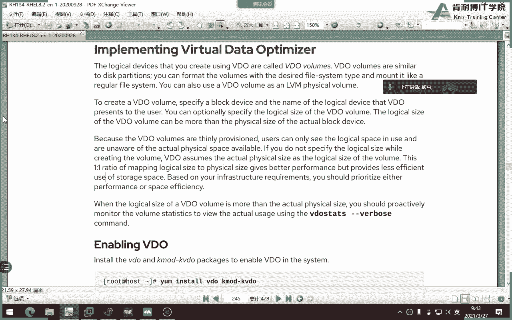

或者说你们到考试的时候，是不是在物理机里面虚拟机去考试，那么这时候就是多少呢。

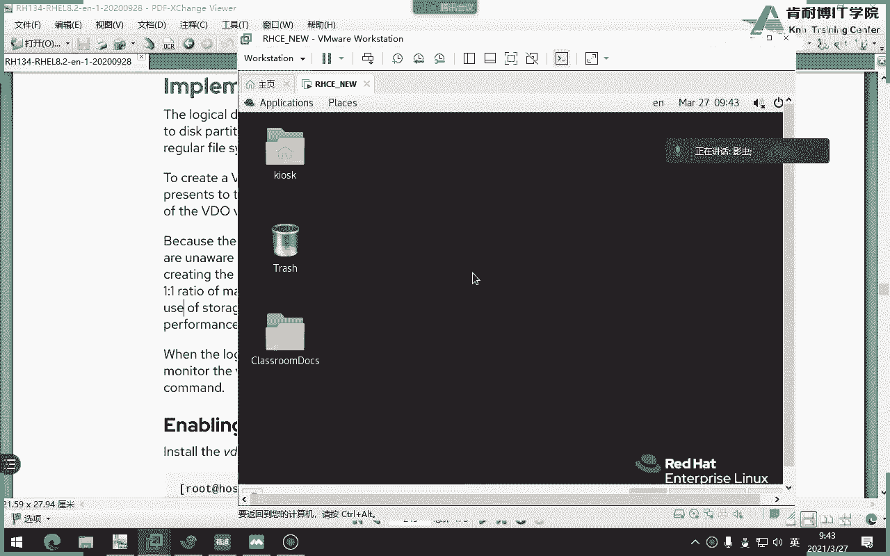

是一比十的关系吧，啊比如说你这电脑是一个g，那你知道，那那那那那你未来你在做video的时候就实际明白了吗，好那为什么这边是50g呢，因为咱们的所有磁盘都是五个g，你会发现你看所有磁盘都是5g，同志们。

你随便登录到一台机器里，所有磁盘咱们这个环境当中都是5g，是不是五个g，五个g看v d d是5g那因此你在做逻辑那个时候就变成50了，知道吧，知道还有50g怎么得来的吧，啊就在哪得来的啊。

这个嗯还有如果你在未来在预习的时候，你发现教材当中写的你根本看不懂，我建议大家去看官网怎么看呢，你看他每一章知识点都有个引用，看到吗，它会引用到哪，引用这个路径链接啊，你双击一下就可以看到了啊。

是它就会引用这个红帽的链接，我忘了里面知识点，我们找一下是不是有这个，我如果没记错，应该是一比十的关系，我们看看啊，哇塞就在这就在这附近，大家看这句话是不是呢，我我不知道记错没，我记得是一比十啊是吧。

你看这句话是什么意思啊，当你的主机扮演运行的虚拟机或者是container容器的时候，红帽推荐我们提供这提供吗，这个单词准需要准备的磁盘的大小是不是十比一啊，十是什么，十是logical吧。

一是这个物理吧对吧，或者一比十吧对吧，十比一看了吗，我因为我当时备课的时候，我看到这个这个文档啊，所以我就有印象，但咱们教材当中就他没写，他只写个一比一，大家就以为都是一比一呢，所以很多同学问老师在直。

你得知道为什么是50，知道吧啊，那如果按照教材当中一比一的话，那应该这边是5g，这边是不是也应该是五个g啊，明白了吗，所以他这个教材他出的特别含蓄哈哈，他没有给你讲透啊了了解了吧，这个就不关心了。

甭管他五级我还50，咱们就过了，反正现在我们已经生成出来一个叫v d e的一个卷，logical size是50个g就ok了，哎你知道你回事就成了好，那接下来我们开始干嘛。

真正的去使用这个video了啊，或者说叫这个应该叫调优吧，这个单词对吧，分析啊，分析video好，那怎么分析呢，这个单词这个单词一般是看状态对吧好，当你打完这个单词之后。

你会发现这里面有关于所有的video的描述信息，当然他这边给你一个忽略省略了啊，省略或者呢你也可以用video list来列出我们当前当中有哪些video的券，而且是正在开启使用的卷。

当然你也可以用star命令开启或者stop命令给它关闭考试，别stop啊，各位你要考试stop就完蛋了，不能stop，明白吗啊，要给他star好，此时此刻上面是指是什么，上面这一这一堆信息。

这一堆都是在创建，还没有开始真正用吧，那接下来就开始讲什么了，各位这是实验，你看你会你你现在发现没有，咱们的教材很有意思，讲一半做一个实验，而且这个实验一定是跟我们的案例一模一样，看了吗。

你如果看书的话，你应该能够发现这个特点啊，好它开始让我们做实验啊，咱们先不做啊，不用管它好，没有没有，他还是做了，接着呢，你来看做完之后我们要干嘛，这不是干嘛，你想想同志们，你做一个卷也好。

做一个磁盘也好，你是不是得跟换这个不用跟我解释吧，所以说咱们也要格式化啊，也要格式化，明白吗，好当然了，这个教材当中有一个k其实呢我们在可以不用啊，我们在考试的时候。

或者是咱们现在练习的时候可以不用的啊，那么这样吧，我们来做一下怎么做呢，注意你看他要求我们在foundation当中，workstation当中去打一个命令，那我们就打一下吧。

正好教大家怎么去用这个环境啊，嗯嗯，其实根本就不用打个命令，知道吗，他打的命令只是为了他下载一个镜像，这个现象很大，待会用力干嘛测试上传的，知道吧啊其实你说我不用这个环境能不能做实验，当然能了。

我非得用live命令吗，我自己能不能待会生成一个自己想要的一个大小的一个文件也可以，这只是这个命令呢，帮我生存好了好，他验证一下v dd是不是ok的。

说明说明v dd现在此时此刻有没有用这个环境挺有意思的，是这样，如果你之前把v dd做了一些操作，他会把这个命令给你，干嘛把v dd买东西给删了，就为了保证这个实验能成功，那他跟着做的。

咱们来说一个非常重要的事情，每个人记在笔记本上，因为考试的同学一定要注意v d o这题是必考的，不用我解释，但是一定要保证这个盘没有用，就像v dd一样，这个盘必须没有用，你们考试的时候会有三个盘。

到时候还有两个盘吧，二三个一个是v d a v d a就是咱们装系统的盘，一个v d b是没有用的盘，一个v d c是没有用的盘，你注意你们咱们刚才讲有几题考磁盘问题三题吧。

你一定要注意把所有考题的磁盘题都做在vd b或者v dc当中，无所谓，就是说一定要留一个完整的盘用于做这一题，听懂了吗，因为如果你不这么做，你video这题你肯定做不出来，因为当年考试的时候。

有一个老师没注意到上面的提示，他就发现哎做不了了，为啥因为他把两个盘都用了，说白了就是你一定要把所有的磁盘的题目都做在一个盘当中，然后剩下一定是一个剩下的完整的盘来做，为了做这一题，懂我意思吗。

我就强调了一遍啊，各位啊，你别到时候你一开心两盘都用光了，video做不了，好吧好，开始看我们干嘛，第一步等到稍微a当中，不要用管理员啊啊不要用那个学生直接管理员中啊，第一步一步肯定是装包不用问了。

没有装包啊，那个k v d o不用装了，因为咱们环境当中已经帮我们装过了啊，你可以用ios mode看有没有，k video是吧，tm什么，是吧，哎还有吗，他是个包吗，没让我们装行，那这些命令怎么记呢。

你说老师我记不住啊，记不住就别记了啊，喂deo，记不住，咱们就别记了，为什么要记呢，同志们，so example，看有没有案例，诶诶诶诶诶诶为什么要进啪啪啪啪，多开心，未来参加考试的同学，你们很开心啊。

然后改一下，懂我意思吧，考试题目比如说叫你叫什么，比如叫r c e，你就r c e，但是咱们这个题目叫什么，创建一个v deo一的券，并且使用谁注意d鞋大小多大，是不是很开心，你干嘛要记这个命令。

同志们，你知道我骂的谁吗，让我打啥，我买的video，然后用斜线索example，听懂了吗，你为什么要记这个力量，当然了，我当时考试是进的，记得因为我不知道原来我考试的时候，我不知道原来有卖。

我就拿着使劲喂气，很开心啊，这次就换完了啊，天气根本不用记啊，直接回车，好成功了，我们知道哪个命令可以看star，你看他不光成功，他帮我先star了，看到没有，然后他开始用一个还记得这个命令吗。

video这个还记得吗，要video e看一眼，哎我操，我没加名字是吧，对嘿嘿，没加名字瞎给他整好，大家来看一下，首先看到的大小啊，新的布拉布拉是你的机器啊，啊这个在这儿啊，然后呢。

然后我们还能看到什么好玩的东西，看有没有大小，主要看这句话50个g对吧，然后呢还有一个命令是这样的啊，是不是list是不是列列出当前电脑当中有哪些video卷啊，我当时只有一个。

当然比如说咱们考试当中又让你再做一个变了，那再做一遍呗，比如说咱们还有一个磁盘，比如说有个磁盘是不是不d4 ，也比如说是不是可以再做一遍，明白了吗啊，好再说一遍，卖那个东西会卖吗，题目就说完了。

你考试到这就结束了，呃，这到到到这还没写，到这儿就创建完了，是不是接着开始格式化了对吧，是不是开始格式化好，格式化是哪个命令呢，当然了，他是让我们看这几个单词是什么意思，知道吗。

这个就是我是否video一开启了这个删除重复和压缩的功能，我们不用看，一定是已经开了，我就不看了，接下来是不是要开始格式化x x s这句话可敲可不敲，这个叫注册我们的设备，这句话可以敲可以不敲。

既然可以敲，可以不敲，那就干脆别敲，你少记一条命令，不是很开心吗，行吧，明白吗，就不用记了啊，那我们来干嘛呢，测试一下啊，不是那个格式化一下这个k是什么意思啊。

不知道他这个解释叫防止文件系统中未使用的块立即被丢弃，不用管，直接格式化就行了，不用管它好，make fs杠x fs叫什么dv，下面的开，看到吗，必须这么格式化。

各位你别上来给我来个这个这个这个谁认识你啊，明白吗，谁让你们写绝对路径是d v下面的mapper，下面的video一直接回车，ok成功行了，这回事成功了啊，如果这边用k的话会非常快，因为你没有k。

所以很慢好吧，那我慢，你慢慢等会呗对吧，咱们等卖，因为50个g呢，你要知道对不对，我就后悔了，应该用k2 ，好好的，咱们考试你用k和不用k，我可以告诉大家都满分行不行，还有那个什么注册的注册怎么进来着。

刚才那个怎么打了，哎，就这个你可以打，可以不打，你开心打就打，不开心就不打好吧，退一步打好，那接下来我们需要创建一个观察点，为什么，因为你卷嘛，你得用，你得创建挂载点嘛对吧。

咱们来创建一个它叫v d v d一好，咱们创建个怪来点，那我挂了，你怎么挂了，各位这是临时挂吧，是不是临时挂，给分吗，一分不给，同志们，你临时挂，你考完试之后重启电脑是一分不给的，你怎么办呢。

咱们得写到哪，i m s table好，这边怎么写呢，是不是先写设备名，什么叫什么video，一是吧，关点叫v dio，一对吧，类型什么类型，刚才，我问我我没有mt啊，我刚才就在跟下面建了。

我们挂载点是这个文件系统类型的，对啊，你刚刚不是做了吗，好default，注意了，这边难就难在这，很多同学挂就挂在这儿，因为咱们教材没讲，你看教材用的是临时挂载，没想怎么挂怎么挂呢，整一把书翻烂了。

也不会告诉你，就是不告诉你，但是如果你按照书上这样做，你不光这题零分，你考试整场考试都零分，为啥电脑起不来，各位书上就是不告诉你，坑就坑在这儿啊，我就让你管，为啥呢，可能红包最近比较缺钱啊。

你再考一遍啊，那怎么办呢，哎咱们得告诉大家，对不对，咱不能弄坑，先退出来，同志们，我刚卖了谁，我刚才是不是卖这家伙，对不对啊，我们我们再卖一下，我是不是刚才搜了个example，好，再搜一遍，诶。

就是你注意当我搜不不等一下，当我搜一下example的时候，第一个就前在最前头的就是他，你把他给我粘出来，我先写完，告诉大家什么意思，这句话如果不写，你不光这一题零分，你考试会死机，一死机。

考试整场就零分卡住了，明白吗，好我来告诉大家写什么啊，你就记不清，我告诉你啊，对不对，逗号为什么叫代号，我们说过default是个啥，上节课我们说过default是不是一堆选项，挂载选项。

只不过他用default来表示对吧好，那我们来粘贴一下，然后我的粘贴错了吗，错了中间有什么来看哎，不能有峰哥哎，我这逗号是中文还是英文的感觉，好注意零零啊，这个不用解释，零零好保存的出。

这时候你可以满分通过，忘了干什么，ok了吧，明白吗，这样才ok了，懂了吗好，那我们来解释一下这是啥东西，这是当我们做的那么开心，是啥东西了，是这样的，如果不加这句话，就是我们的video起来了。

会比较比较什么，比较早嗯，你得告诉系统，我们现在c4 d他是被cm ccd管理的一个服务啊，因为你的服务会起来比较早，如果你不加这句话，很有可能会造成我们这个网络还没通。

这个时候呢你服务先起来就可能会卡住，起不来，所以你加上这句话就行了啊啊这句话虽然咱们的video没讲，但是上面讲那个strike里面有讲到啊，讲上面这个东西它有讲到，所以呢你会看一下。

你看它上面这个东西就讲又讲到，你看他说的啥意思啊，你看如果你没有加上这句话，那么机器将无法正常启动并进入到紧急模式，我们知道进行到紧急模式是不是就卡机就卡在那了，懂了吧啊说你最好加一下啊。

你看咱的video当然就不讲，就是不讲，为啥，因为整个video的咱们的书上只讲了一种方式，叫做mc命令那种临时挂载，但考试的时候不可能临时挂载，所以会了吗，记了吗，大家记住啊。

好所以都是从卖书和叶卖出来的，知道吗，但我们当时比较傻，我是死记硬背，我不知道麦里面有这个啊，那你们就知道啊，就这几好，考试做到这就结束了，满分通过，同志们，但是呢咱们现在上课嘛，咱们给他做一些事。

做什么事呢，往里面靠点东西，因为只有考编译器，你是不是才能感觉到它的video的强大对吧，咱们怎么考呢，是不是刚才有一个音mage install image那个文件，这个文件从哪来的。

是不是我们刚才用lab命令它自己生成出来的，在哪呢，他说在root下面，那我们跑下跑到root下面看看是不是有，大家看是不是有多大，不知道多大，看一下有这么大很大好，咱们把它拷进去，什么考，就这样考吧。

考哪啊，各位哎，可能我的过来点啊对吧，可乐过来点好吧，这样考之前，我们先来看一下当前的这个状态怎么看呢。

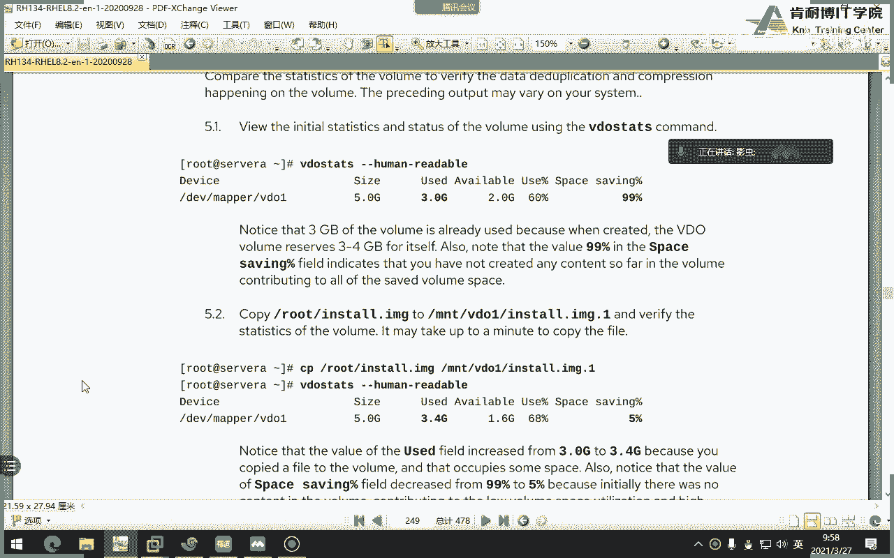

human啊，咱们先来看一下当前的一个状态，考之前啊，video这个命令不用考试做啊，这是测试命令，考试不用做，大家看这现在状态是大小五个g，那么这个单词seven是什么意思，save啊，什么意思呢。

叫做，呃怎么说呢，叫节省吧，叫节省率，为什么将近百分之百，因为我们现在还没有，往往往里面放东西，大家来看现在多大，used，这么说吧好那么待会我们主要注意什么呢，你看待会我们要注意这两行，注意哪两行呢。

现在已经用了3g的卷，因为在创建video的时候呢，这个video为自己预留了3g左右的空间，那么接下来我们要注意节省率，就是save最后一行，它的值默认是目前是99%。

因为现在还没有往这个圈里面放任何数据，所以它的节省率很高很高，好接下来我们要放数据进去了，怎么放呢，ky对吧，ky各位仔细看好啊，刚才自己自己记一个是三，一个是99对吧，好，我们放进去。

放到哪个v61 吧好他拷贝有点慢，因为毕竟500多兆呢对吧，他不可能瞬间啊，稍等，好再来看发生什么变化了，大点的吧，对的吧，你看三个g3。4g是不是500兆左右，对的好，这边一下子减少很多，为什么。

因为你有东西放进去了，他就不会给你，他就不会帮你节省，因为你有东西放进去了，我就不会帮你接手，但是当我再放一遍哦，不能不能这样放，不能不能啊，各位你得改名字，你要不改名的话，就相当于覆盖了各位。

咱们改一个名字，比如咱们就叫做因此到i m g一行吧，放随便改名字就可以了，好随便改名字，因为你覆盖的话感觉不到节省了好，我们稍等一下看，说什么动了吗，几乎没动吧，而且这边变成以下节省率高了。

就从5%以下节省率高了，说明什么。

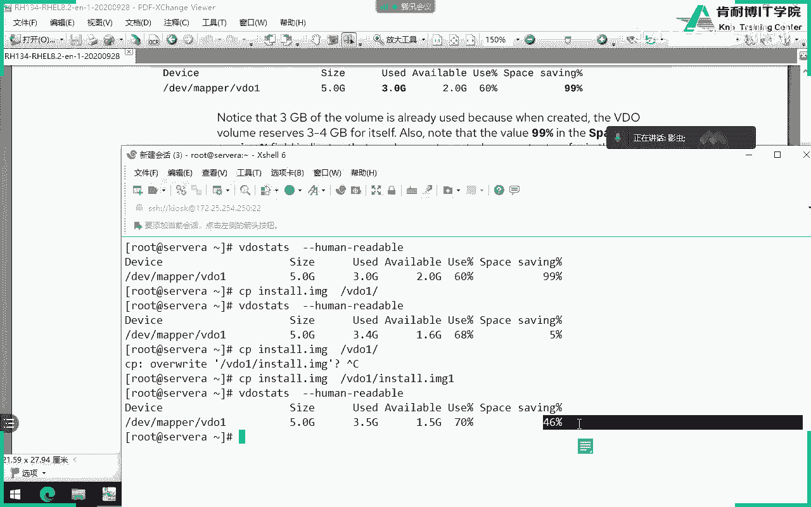

说明什么，同志们节省率越高，是不是说明你重复性的东西并没有放进去对吧，那我们再放一遍，比如我再放一遍，再叫三，啊文件其实没有变对吧，只是我名字变了，哎你发现这次是不是快很多，各位是不是刚快很多是吧。

看懂了吗，还是3。43。5，但是这边其实是节节省率又高了，那如果我再放一遍呢，我就不用再放了吗，大家能理解了吧，你放的越多次数是不是绝节省率越高，那么最终磁盘当中会有三个文件吗。

其实说白了对于他来讲的话，其实只有那一个原始文件吧对吧，为啥，因为他会发现你这个文件是重复的，这是video的好处，那video一般用在什么场景呢，这个咱们说来看一下教材往下走，一般用在什么场景，各位。

看你用在什么场景，用在我们的，比如说底层是一些block设备上面，是不是可以直接做video，video上面在跑什么，甭甭甭管是虚拟机也好，或者是a p p应用也好，是不是我我我里面的一些应用的数据。

是不是在video这一层就进行了减少，然后节省完之后再放到我们下面的真实的设备，不管是red也好，或者l vm也好，或者是直接就是一个普通硬盘也好，是不是明白了吗，所以它是一个节省的啊。

这图片是来自于哪呢，来自我们刚才看到的红包的官方文档，如果你看官方文档的video不光有这种利用率，但不光有这种利用场景，有很多利用场景，就不光这一张图片，有好几张图片，二张图片，那么大家想象一下。

为什么它上面可以跑虚拟机，我们知道虚拟机是不是共享同样的资源平台，那么有没有可能虚拟机里面数据是相同的，有可能啊，那么这时候我用video是不是节省了下面的真实设备的，利用那个那个磁盘空间对吧。

所以他用的这种场景是很好的，那么我们讲了这么一堆video，你们只要做什么呢，第一步装包，第二步我创建出来，第三步挂载啊，这个这个这个格式化挂载就行了，刚才那个测试是不需要大家来做考试，不会让你做测试。

你只要能够给我挂载成功，并且重启电脑不不死机就行，怎么保证重启电脑不死机，别忘了我这句话就可以了，别忘了这句话好吧，别忘了别忘了，同志们发给你们。

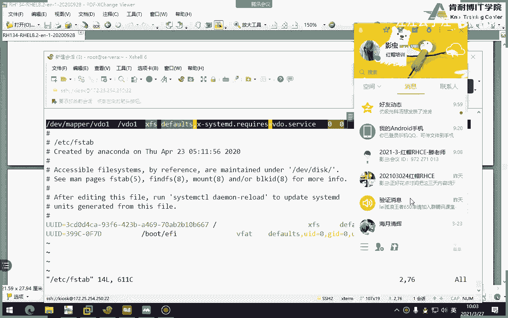

别忘了好好给大家一分钟时间记一下，然后把它做一下就行了。

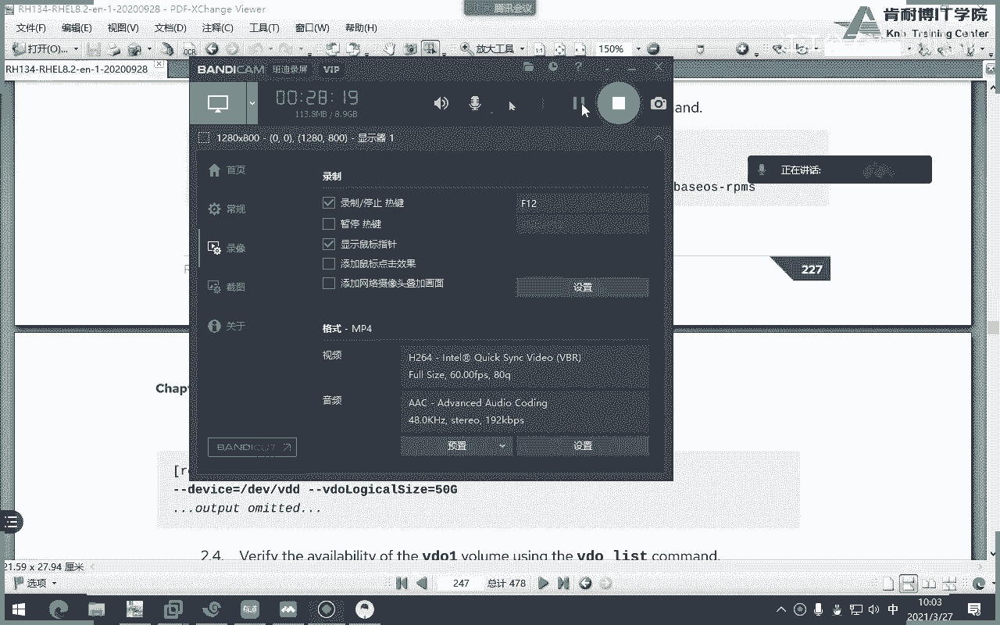

今天我们来讲一下n m s，但是在我们的官方课程当中，这一章只讲了n s的客户端怎么去挂载啊，但是呢我们要跟大家讲一下n m s的服务器和nfs的客户端挂载好吧，咱们两个都讲，言外之意。

就是咱们学完这一章，待会你们要求用server a作为服务器端，serb作为客户端，这是给大家一个小实验，而且每个人都要做对好吧，那么咱们考试的时候请注意这章考不考呢必考。

那么n m s是由考官给我们做好，我们只要去挂载它就行了好吧，考试的时候这一题就是这样做，但是咱们今天呢为了实验的效果，咱们两边都做，如果你们有学过或者有看过我之前在红帽七当中的rtc的话。

你会发现是一张必讲和必考的题目，那个时候他就考你服务器端和客户端，而且很多人而且c一栽就栽在nfc这一题没做成功啊，但是现在没有这个担心了，因为n m考试的时候不是你做的，是考官做好了啊。

这一题几乎是每个人都可以拿满分的，很简单，那么我们来说一下n m s。

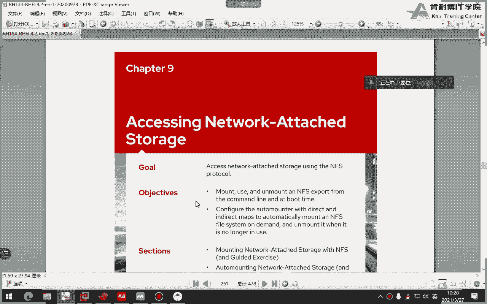

咱们来记一点课外的笔记啊，咱们来多讲点内容啊，nm这个翻译成中文叫什么呢，叫网络文件系统，当然你也可以把它翻译翻译成网络文件共享，对吧啊，网络文件共享好n m s诶，这个怎么写不了字啊，nfs啊。

叫网络文件系统啊，网络文件系统，那么它呢是属于cs模型，客户端和和和服务器的模型，但是呢n f s呢默认只能适合谁呢，只能用于用于linux之间做共享，直接做共享，那比如说这边有一个windows。

这边有个linux怎么办呢，那没办法，你只你只能用三把啊，或者你选择用sa啊，sa这种协议，c r y s这种协议来做共享啊，nfs呢是一个这个非常非常古老的协议啊，它发展到至今已经有四点的版本啊。

因为4v4 的版本了，而且现在已经是v4 级了，v44 点几4。2还是4。3，网盘是四版本了啊，所以说你看发展到现在已经很久远了很久远了，n m s呢这个服务咱们要借助一个服务啊。

如果为了能够实现n m s，n m s本身服务要借助一个叫r p c的服务，r p c的一个服务，rp c是干嘛的呢，我们称之为远程过程调用啊，远程过程调用，那么它相当于一个监听的一个中转站啊。

比如说n m s要共享出一个文件给客户端，客户端想去访问这个共享的时候，他必须要知道这个共享出来的端口号是多少，但是n m s它的功能特别多，它的端口号是不固定的，那怎么办，你想想。

比如说你是一个服务器端，但是你的端口号不固定，我怎么找你，我没有办法装，你怎么办呢，这时候就出现一个nfs，相当于什么呢，n m s每次启动的时候呢，先把端午号告诉这个i p c服务，当然了。

这里面叫不叫告诉这叫注册，然后rpc再将n m s注册的账号给客户端说，那么客户端是不是就知道了n f s这一次的问号，然后他去找他就可以了，明白了，所以中间它相当于一个传话的这啊传话人。

所以说nfs n f s当中，如果你rpc服务启动失败，或者说你由于一些问题失败了，n f s是起不来的，启动不了他了啊，好吧。

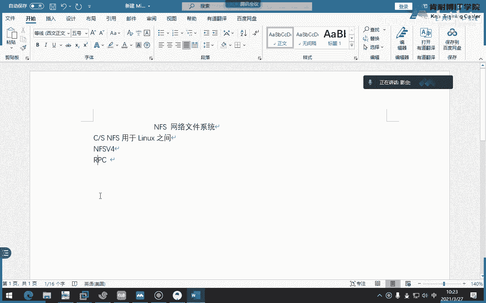

是启动不了，明白吗，这是n m s一些跟大家先讲的一个前提啊，好，那么nfs呢那叫网络文件系统，它现在呢已经是哦四版本了，应该多少4。2了，看最新版本，红帽八当中最新版本是4。2啊，4。2，当然了。

他可以向下兼容，因为我们现在如果是三个版本可以吗，当然可以对吧，但是注意了这一点跟红包七不一样了，红包七还支持二，但红毛八就不在支持二版本里面，太老了太老了，但其实对于你来讲，没有必要学二太老了。

因为他也不支持，同时请注意n f s4 版本是从哪开始支持的呢，是从红毛七开始，只不过红毛八现在是4。221，同时从四开始之后，我们就不再使用t udp了，注意四版本我们使用只使用tcp。

而我们的三版本是tcp或udp，那说这句话什么意思呢，就是未来如果我们有防火墙的时候，是不是你要注意是放行的tcp的什么什么端口，而不是u d p，这点一定要注意啊。

还有tcp的话它的一个问题就是开销会比较大，但是呢更安全，当然了，这个里面的所谓的开销大，只是相比而言，也就是说对我们来讲是感觉不到的对吧，除非是那种特别大量的，可能对开开销才有点影响啊。

如果从tcp和udp本身角度来讲的话，那肯定是t cp开销更大啊，u p开销更小好吧，但对我们来讲其实感觉不到啊，那么我们说怎么去共享的，比如n i s是怎么做共享的呢，请注意n y s。

首先export这个单词很重要，为什么要标注这个单词呢，因为这个单词就是咱们待会配置文件里面配置的一个东西，它叫导出，翻译成中文，直接翻译成中文叫导出，当然咱们就叫共享。

也就是说nfs服务器端首先要共享出一个注意目录，注意是目录，好吧啊，因为你想想想想过没有，你共享文件是没有意义的，你文件是不是得存在于某个目录，当中对吧，所以你要共享出一个目录。

然后呢客户端干嘛去挂在你的共享挂到哪儿，本地的挂载点，挂链挂载点也一定是目录吧，啊如果它存在的话，明白吗，哎就这样，但是我们通过手工挂载也行，但是必须要还要干嘛，写到fs table。

当然还有一种挂载叫自动挂载，注意了，说到挂载有三种，第一种是我们临时挂载，第二种是下次开机的时候做永久挂载，第三次，第三种办法就是咱们考试要考的叫自动挂载，这个是有点难度的，各位讲自动挂载就有点难。

你们考试就讲自动挂，你们考试就考自动挂载，言外之意就是你们考试的时候呢，是考官做好了一个nfs服务器，你们要用到这个auto fs这个工具去自这挂载，刚才考官给我们共享出的东东东东西，这是考题。

那么我们现在怎么做呢，咱们不是模拟考试吗，咱们待会呢要第一步自己做nfs模拟考官，第二步咱们再做自动挂载来挂载，听懂了吗，但考试的时候不要做，考试的时候考官考官给你做好了，咱只是现在模拟它啊，模拟它好。

那么nfs来讲的话呢，咱们要去做共享它的语法格式是怎样的呢，来我们接下来给大家说一下啊。

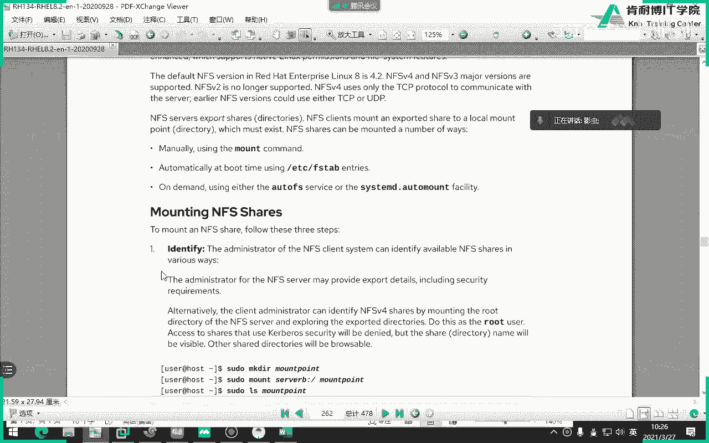

n m s的安装啊，关于服务器的安装服，服务器玩这个这个这个这个这个搭建吧，啊大姐好，首先第一步要安装包，这个不用解释吧对吧，你第一步肯定要安装包，那么问题是n t fs的包名是什么呢。

虽然咱们考试不用搭，但咱们现在得搭建啊，它叫什么呢，叫n i s s横线u t r l s，如果你觉得这个单词比较难记，我就干脆信号可以的对吧，所有都装，但其实它叫什么呢。

叫n m s utt n r u t r l s好吧，撞一下，第二第二步干嘛，我以前在讲红帽七的时候，我经常跟大家讲这三句话，这三句话是每一道题目都要做，第一步装包，第二步重启，第三部引力able。

咱们也一样，第二步重启，当然其实你可以不充气，为啥，因为你现在还没有配置东西吧，可以先别冲击，因此呢就是第一步装包，第二部enable，第三步防火墙，咱们没有学过防火墙，同志们，那干脆怎么办。

stop知道吧，stop啊，什么stop来着，打错面料，咱们不是没做过，没学过防火墙吗，那干脆咱们就stop了好吧，没学过，咱们就这个简单一点啊，简单点stop，那么就是防火墙的先装啊。

那么第二个关于关于这个n m s的配置文件，说白了就是如何啊这个共享的某个文件夹，注意是文件夹，就是咱们所谓的目录，那么第一步你要创建目录对吧，比如我要共建共，比如说我要共享一个目录。

你肯定要创建一个目录对吧，比如说我要共享一个目录，叫做红帽啊红包，然后呢比如说这个红包里面是一个是一部电影，同志们是一个电影好，那第二步呢要共享怎么共享，注意了，所谓的共享就是在这个文件当中做共享。

注意有sr exports这个文件，就是说共享。

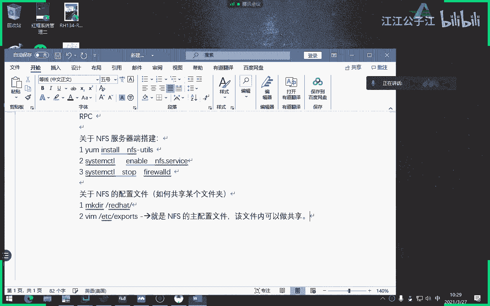

我怎我怎么写，能听能看懂吧，所谓的exports这个目录，这个文件就是做共享，好那么接下来这个共享的语法格式是怎样的呢，为啥要说语法格式呢，因为pts里面居然是空的，你想象一下咱们哪个咱们学过哪些东西。

里面打开还是空的，要自己写的，这不是那个crown table，分时日月周，是不是里面有个空的，对吧好，跟这一样，也是空的，你注意注意啊，越是空越紧张啊，为啥没有任何可以参考的地方，你的死记硬背。

那咱们来说一下export这个配置文件里面怎么把一个文件做共享，首先最左边是你要写共享名，共享名，好空格空格空格空格空多少个无所谓，好中间写权限嗯，错错错错错，中间写允许访问的客户端好。

第三个括号里面写权限或选项来，各位这个字体不太好啊，没有空格啊，这边这怎么能表示的感觉没有空格呢，换个字体，换个字体试试，更恶心，你说你就自己自己知道没有空格，就是第一个和第二个必须有空格。

第三个绝对不能够有空格，如果有空格，语法报错，那你知道咱们来做个填空题，那对于这一题来讲，是不是应该叫做red hat对吧，空格那怎么表示允许访问客户端呢，咱们干脆来个信号代表什么，所以那如果这么写了。

1。1。1。1，就代表只是1。1。1这个家伙，那如果这么写呢，就代表只是1。1。一点一个网段，明白吗，懂了啊，那干脆咱们为了省事来个星号好，括号里面写什么呢，各位你是想让他干嘛，同志们。

比如说我现在出一道题目，我这边共享出一部电影，大家能够访问，并且能够只读，那你要给我写个up，然后我就说了，你并并且能够给我修改这个电影，那你要用r是吧，w明白了吗就行了。

重点那言外之意就是所有人都可以挂在你的red hat，并且还可以修改一下，因为还有修改啊，并且还可以修改好，我讲完了，那咱们做一遍。

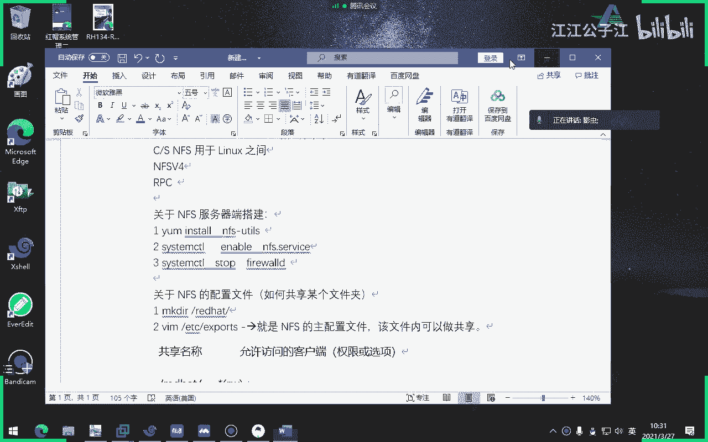

来各位咱们同意一下啊，你们来仔细看怎么做呢，server a是服务器端，server b是客户端好吧，那第一步应该干嘛，双爆吧，离谱双爆考试不要做啊，再说一遍哦，他已经告诉我，巴拉巴拉巴拉已经装好了。

好第二步stop什么防火墙，哎你说我客户端还要stop防火墙吗，不要啊，因为很多同学就问老师是挂不上去，是防火墙没关啊，不是客户端，当然不用防火墙了，只要服务器端啊，好你先往下啊，啊没有d啊。

我怎么刚来，我怎么打d干嘛哎呀木有，是吧，诶，这咋回事，懂你，没有，我现在是重启服务啊，哎你怎么还不让我重启啊，下一个，不好意思啊，打错了，哈哈哈哈哈哈，ok打错了，你看好久没讲七了，自己都忘记了。

看到吗，应该是横线server。service哎，最后面的点代表什么，是不是服务单元嗯，这个点service代表服务单元懂吗，当然你是不是这个点service可以不写对吧，可以不写，注意啊。

我刚才写错啊，好开始怎么办呢，第一步，比如说这个叫red hat，然后往往往往red建个念，比如这个建个fire，比如说接下来打一下export的时候，看有exports吧，怎么写。

是不是先进react，然后新号，然后这样吧，看懂了吗，没有空格，第一个和第二个有空格，保存度多重启服务，因为你要重启一下服务才行，对吧，然后再来个引力波啊，啊不不打，自己知道就行了，引力宝啊。

好d max做完了，同志们，n px就这么简单，做完了，那客户端干嘛，那克拉更简单了，照搬过来就行了，那怎么挂了，咱们就临时挂吧，好吧，咱们建了个目录，咱们就叫做好共享mt dv。

注意看他怎么挂mt下面的dv，下面的不不不，你看应该写上一写，172。2，5。250点，十是吧，是谁，下面的应该是哪个这个吧啊看清楚它的语法格式，中间有冒号的好，如果我在十里面看到file。

是不是说明成功了，有了吧有了，但是我这个实验还没做完，他说是不是要求能够读写对吧，那什么叫写，往里面往里面能建东西，算不算写算算，但是见不了，见不了了，所以说这边呢就会有个问题啊，我直接告诉大家。

为什么是由于咱们的权限不匹配，那你们老师不对啊，你刚才已经放心了rw对不对，已经放弃了rw，为什么权限不匹配呢，哎这边要说一个非常重要的一个事，这是咱们教材当中没讲，如果你学过红包七。

你才知道你没有红包期，你就不会知道，因为这个教材他就不讲了，是这样的，各位其实来讲的话，我们刚才那个括号里面虽然我们写了rw，但其实里面会有很多隐藏的属性和选项，咱们看不到。

那接下来给大家看一下这e x u y e x p r t，这个命令呢是来显示我们当前是共享的东西，可以看一下，然后我直接加一个r来先加个v吧，加个v选项好，二是重启reload，相当于你来看这个。

这个是我们刚才共享的目录吧，这个就代表所有对吧，然后呢记住这边有个什么，这边看有个单词，看就这一句话，就这一句话就这个单词好，这个单词是什么意思呢，注意我们刚才是用哪个server。

我们刚才是不是用server be的哪个用户挂载的，我们刚才打帽子是哪个用户打的帽子，是不是就是此时此刻的管理员好，你想一下，你想一下，这是个安全漏洞啊，你用管理员挂载了a当中的一个目录。

当你去当你去访问那个shell的时候，是不是相当于访问a当中的哪个目录，red h，那是不是，那是不是你相当于已经进入到server a的red hat里面了，对吧。

只只只不过是以远程挂载的方式来视线的，那这不就是漏洞吗，啊还是管理员，那我是不是可以这么理解，我由于用server b挂载成功了，这个目录叫sh，就等同于访问right hand。

那我除了可以访问right hand，那我能不能访问你server a long当中，比如说跟比如说过，如果这样的话，是不是又漏洞了，我不知道sa的管理员密码，但我通过挂载nfs形式。

我就可以进入到sa里面，那这不就是漏洞吗，所以说怎么办呢，你看这个刚才刚才给大家讲的这个语法，就这个家伙是什么意思呢，就是如果客户端以管理员的身份挂过去之后成功吗，成功，但你就不是管理员。

就变成一个非常低的权限的一个普通账户，它叫nobody，这叫nobody啊，懂了这边就是一个安全性啊，就是你虽然说你看我骚扰b虽然用管理员挂过去之后。

把你压缩成一个普通的叫叫就叫nobody这样的一个非常权限低的用户，我问大家，我们刚才建立这个来来来抬头，我们刚才建立的这个用我们刚才建立的这个这个共享目录，是不是叫red h，那么对于变态来讲的话。

nobody属于这里面的佣人用足，还有其他人，其他人其他人当中有写吗，没有，那就算你这个里面有写同志们，但是你的目录本身的a的当中有写吗，没有，因此也写不了，懂了吗，好那有人说老师，但是我给他写的好。

你给他写，那他就能写了，他就能写啊，你看好我们现在退出，退回到sb，刚才是不是进入到shell里面建立不了东西啊，现在再来看就可以成功了，而且你猜一下这个文件的用人是谁，这不对呀，如果还是root的话。

我还做这一步干嘛，我不说了吗，他不是rot，他是new boy，看是不是new boy，那如果是root的话，我们还刚才要做o加w吗，就不用了吧，明白了吗，就相当于什么呢，就你是管理员挂过来之后挂。

我是服务器，你挂过来之后，我就把你强行变成nobody了，对于刚才我的red hat来讲的话，不就属于r的部分吗，不好那还有一种比较不安全的做法是怎样的呢，是这样的呢，各位我甚至可以这么做。

但不建议这么做啊，而且你千万不能这么做，我就不加w，把它剪掉，它是不是又不能写了，但是我可以这么做，同志们，我就不见他了，但是我给动作，你不是隐藏了吗，我给你显示出来，已经隐藏了吗，能显示出来。

然后前面加个no，我靠这个危险了，同志们，这句话啥意思是什么，否定词就是你过来是管理员，我不会把你变成nobody的，另外这就是你过来还是谁管理员，那管理员能不能写刚才那个没有权限的文件夹，当然可以了。

但是我们知道这样干是不是太危险了，明白吧，但是你要知道这个权限是干嘛的，懂了吗，这个圈就是代表只要管理员过来，我就把你变成匿名账户，如果加个洞呢，就是只要你是管理员过来，我就不会把你变成匿名账户。

你还是管理员，那太危险了，你想你，你怎么可能你敢这么做呢，你想想你这样做不是对吧，自己搞自己吗，别人拐过来居然相当于映射成你这边的服务器管理员了，不让你管理员密码，但我现在好像一下子进去了。

我想干嘛就干嘛，就算我不能破坏其他目录，我是不是可以把你的red hat目录给你干了，我也很开心啊，势能破坏一点就破坏一点呗，懂了吧，所以你千万不要这么做啊，朋友们，咱们只是上课啊。

我们只是上课来我们验证一下，重启一下电脑，哎我草用完冲击冲击下服务，但是没关系，我依然可以写东西，现在，你看用人是谁写的东西，看到了，那那那太厉害了，所以这个root可不是你的肉。

它是人家特色端那边肉是吧，但是映射过来的对吧，所以应该很危险吧，那你这个是你懂的太危险了，所以不要这么干啊啊你只要知道这种事好，考试不会考ny s，那咱们就讲到这个程度，就就就就拉倒啊，再说了。

咱们就不讲了好吧，那么我们讲了，这是咱们为什么要讲这个呢，是因为咱们要引入下面咱们这话题就是自动挂载天子们，咱们把三种挂载都讲，第一种那个临时挂载会了吧，怎么写的，领事馆的命令，我把笔记整理给大家啊。

好，关于客户端的挂载客户端的操作，有操作啊，第一步呢临时挂载用哪个命令mt对吧，然后呢是不是先写对方的服务服务服务器的地址啊，比如服务器里是一九十二点25。250。10，下面的red hat。

注意别忘了冒号啊，然后怪来到哪了怪了，你本地的怪来点是第一种方式，第二种方式是不是要写到f c a b，这肯定要写的f i t b才能，这是为了什么，持久挂载对吧，持久挂载啊，当然了，这是什么。

这是临时的嘛啊就run time挂载对吧，就是那个持久挂载好，怎么样持久挂载呢，咱们来做一下，那么咱们刚才那个server be把它卸载掉啊，sb把它卸载掉，不算数不算数。

卸载不是这样卸载卸载掉不算数啊，好那你一旦卸载之后，df看到就没有了，就没有刚才那个挂载了，接下来直接写到这里面，让它永久挂载，什么叫永久挂载，每次开机的时候是不是自动挂载，怎么写得很简单。

就是111什么1172。25。250。111120冒号red hat，一模一样啊啊过来一点是shell，然后类型是个啥n m s，因为你是nfs 2，对比boss 00照抄。

慢的杠a d f就不解释了吧，就不解释了对吧，我也不重启了好吧，你现在重启肯定是ok的，重启多少遍它都会自动挂上去，这个很简单啊，我们最后再看一遍啊，一定要写成这种形式啊，如suma，你知道怎么写吗。

要前面加斜线，但咱们没有学过suma啊。

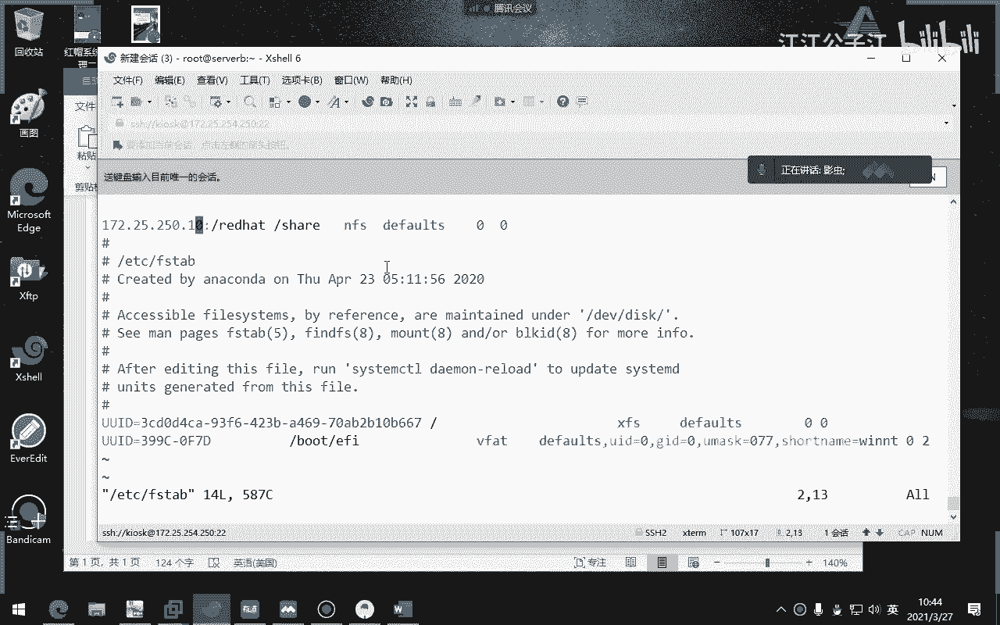

你只要知道一下啊，如果是suma是这样写。