# 红帽认证系统工程师RHCE8-滕老师出品 - P14：第七天 podman - KNBIT认证中心 - BV1up4y1h7MA

那我们来讲一下这个nfs和自动挂载的一个综合实验好吧，综合性的实验，nfs和三种挂载的综合实验，首先我们来分析一下啊，从头到尾来做什么叫n m呢，是用于做文件系统挂载，用于做lix之间做共享。

比如说这边是一个linux普通的客户端，这边是一个linux的一个服务器端，两个系统都必须是linux，这么讲能听懂吗，好那么有一天呢，这是sora，这是咱们的环境当中的sa，这个是咱们环境当中的sb。

小一点的弹幕客户端，大一点，弹幕服务端，这个能理解吧，然后假设他们俩是能拼通的，假设中间的防火墙什么东西都没有啊，什么s1 linux什么东西都没有，也没有防火墙好，因此它和它能直接通信。

那么我们要求在3a当中注意，在sa当中，我们要求能够这个做干嘛，在sa当中去做共享，我们共享出一个文件，文件夹对吧，是red hat。

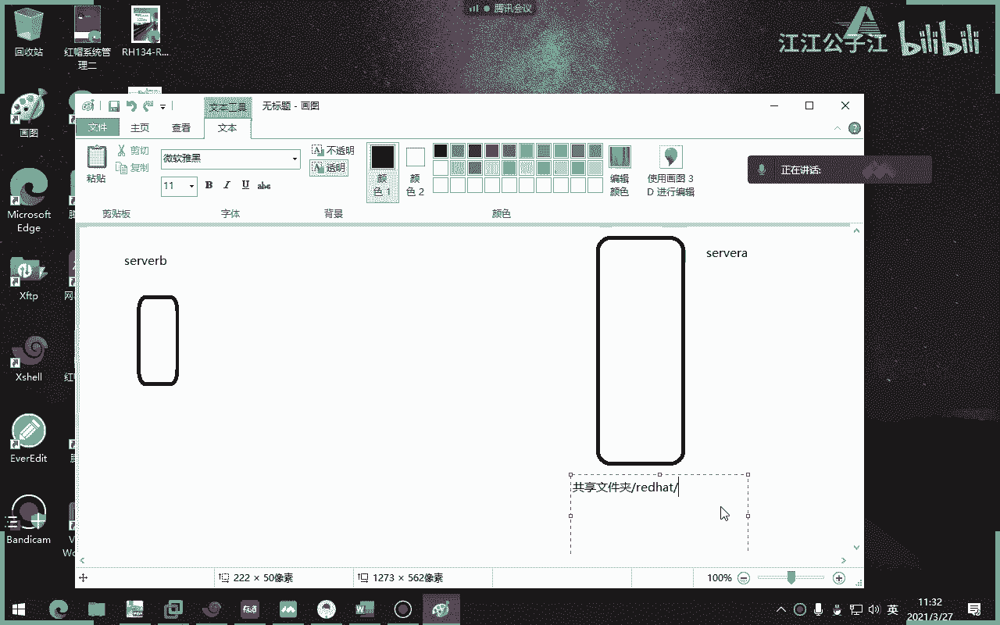

那么我既然在塞尔维a共享，我肯定要在塞维a建立目录，那么3b要干嘛，能够三种方式挂载啊，挂载第一种mt命令挂载，临时挂载，第二种持久性挂载，第三种利用auto fs，实现自动挂载好。

那我们来先做怎么做呢，既然为了实现n m s。

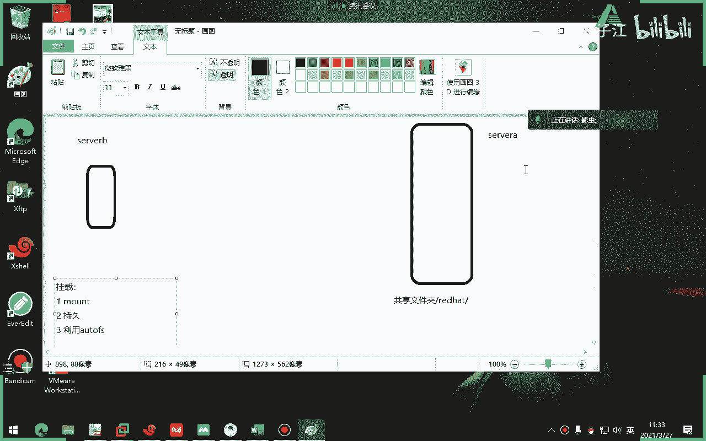

因此我要跑到server a身上去装一个软件包啊，来大家看啊，不用不用着急做哎，怎么现在还没恢复好，可能，来从头到尾做一遍啊，我们为了在那个我们必须要在sa当中先装nfs的软件包。

如果大家某一部分没听懂，打断我打断，我来大楼看，仔细看，接着我要干嘛呢，这样做这样几步，第一步先nfs enable下，目的是让它在下次开机的时候，伴随着机器的开机而启动，接着我把防火墙关闭掉。

这是为了不影响咱们这个实验，好吧，不影响咱们实验，接着我要去创建一个目录，做共享，对吧，为了能够看到共享，我往里面创建一个文件，留着我能够看到，接着我要开始真正的配置编辑配置文件。

这个就是咱们的nfs的主配文件，仔细听，我现在从头到尾做的是在三位a当中做啊，各位没有没没没看错吧，是a当中好，那么这个文件里面写什么呢，先最左边写挂载啊，不是最左边写共享的目录空一格。

请你允许访问的客户端，比如说我写172。25。250点杠二四位，就代表我只允许这一个网段的用户来访问，more括号里面写rw代表我可以读写的形式，干脆吧，别了别了别了，老实点，安全点。

只读read only，保存退出重启服务，重启服务叫做nfs server，就完了，好服务端就没了啊，各位服务端就结束了好吧，服务端就结束了，那么客户端是不是要挂载，那么我现在登不到客户端，客户端谁呢。

serb用的客户端，server b server be要挂载，同志们，那它怎么挂的，三种办法，比如说哪三种呢，第一种我说过要永池普通挂载，那么既然是普通挂载，是不是要创建一个挂载点。

那么我们挂的点叫什么呢，咱们就这样吧，咱们就叫做事啊，咱们还叫事好啊，那么这个关节点你要手动的去创建它，然后用mt的形式挂载，怎么挂，172。25。250。10，说白了就是a到a下面的，是这样也行。

再来点是吧，那我去访问share的时候，就是访问server a里面的red h，大家看应该里面有东西吧，第一种情况实现了会了吗，啊过了啊，第二种情况我这样做不行啊，我得写到永久里面对吧，永久怎么写呢。

就是直接写呗，上面a或者写ip地址都行，随便赢随便赢啊，下面的red hat冒号啊，冒号怪来点是谁呢，是谁啊，文件系统类型是谁呢，n m s default照抄就行了，啊这种情况也会了对吧。

慢着抓a df，看到最后一行也是对的，只不过它把它翻译成rp地址了也行，无所谓啊，好这是两种，第，先写ip地址或者写server a这个名字，sera冒号写你共享的东西，中间写挂载点。

这个是不是跟我们上节课讲磁盘挂的一模一样，直播单四方块的用的是呃，用什么e t4 啊，或者是x m s对吧啊，明白了吗，这种方式啊，这种方式，那么最后一种呢，我们使用自动挂载，所谓的自动挂载。

就是我用挂载点的时候，它才挂上去，我不触发过载点的时候，它不挂载，因为这种方式和刚才的mt方式，永远都会把m的这个red hat挂载到shell当中，也就是这个项目录被永远挂上去了，他不灵活。

但是实现自动挂载怎么实现呢，你首先要装自动挂载所需要的软件包，叫auto fs，它既然是一个服务，你还要把它干嘛，enable一下啊，注意你也要引label一下，因为他是个服务，懂了吧。

要引label一下，刚才讲过这个服务有两个配置文件对吧，有两个配置文件哪两个，一个叫做auto day master，一个叫做随便你随便起个名字对吧，那么第一个文件呢里面写的是你要挂载的目录的。

上级怪的点和一个自配文件，第二个这就是那个自配文件，这个就是我们刚才那个自配文件，子配文件里面写什么呢，写你要最终挂载的设备和你要挂载的这个相对而言的2g挂载目录，比如说是24c是第一集怪怪的目录。

rc e就是二级怪的目录对吧好，那么这个目录要不要建立，不要啊，各位千万不要建立它跟我们第一种方式和第二种方式不一样，你不能建立起来好，那怎么办呢，直接写就行了，怎么写auto。

master master先写什么呢，比如说我们待会要求啊，咱们把这个图片画出来，比如我要求自动挂载，要求把它挂到哪儿呢，我随便写个地方，比如我要求挂的到这个a一下，买个b吧，少写点啊。

我要把你刚才共享的red hat挂载到a下面的b，那这个时候呢就要先写什么a吧吧，然后再写第二个配置文件，我们称之为子配文件，紫配文件名字你可以随便写，咱们比如说就用书上给我们的这个msc。

因为这里面有模板可以参考，如果你随便起名的，那那肯定是没有模板对吧，好m s c，那接着就要去编辑第二个自拍文件，因为你刚才指向的叫m s c，那你就要编辑点m r s c，那这里面写什么呢。

写看这里面写要挂载的二级目录，以及你最终要挂载那个设备的名字好，那二级目录怎么写呢，咱们二级目录叫什么，在b呀，刚才a下面的b吗，所以叫b好，最后在172。25。250。10下面的reset。

那这就做完了啊，当然你也可以加一个选项，比如杠o杠2w啊，这样都可以啊，别动了，做完之后不能生效，你要重启auto fs，因为它是个服务，你会发现跟他f s d e b没有冲洗。

简单的mt命令也不用充气，但这种方式得重启，怎么使用呢，我们先进入到a啥也没有，再进入到b要不要斜线，应该就会有file，这一题结束满分，懂了吧，这叫自动挂载，那么df看到的情况是什么样子呢。

是这个样子的，言外之意，待会过了一段时间之后就没了，为什么没了，因为不丑八怪来点啊，但我退出过一段时间，当过多久我忘记了，你会发现诶没了，怎么样才有呢，再进入到a再进入到b诶，它就有了，应该又有了。

这叫用的时候挂挂，不用的时候不挂，就通俗点讲就这句话啊，用的时候我挂上去，不用说我不挂，它不像f t b也不像mt命令是你必须用幽默的卸载它才断开，你这种方式是自动型的，自动自动自动，什么叫自动。

就是我监视你是不是触发怪的点好，这是我们要知道，最后我们来看一下怎么写，再说一遍，第一个写out to get master，里面写的是你的第一层的挂载目录和你的支配文件，然后去编辑你的这个指标文件。

指标文件的名字可以不叫m i s c啊，可以随便你叫叫a b c456 都可以，你叫什么叫去编你什么对吧，比如你刚才叫的是a b c，那你这边就要去编辑点a b c对吧。

当然我们刚才讲的是这个这里面写什么呢，写你最终的二级怪的点和要挂载设备，我我这个笔记写反了啊，这反而应该这么写啊，我可能我干嘛了，我那个区回弹干嘛了，我做了什么动作，这不搞明白吗，你应该把它写反过来。

先写二级挂载点，再写你最终的挂载的设备，设备啊，设备好，你这玩意不能生效，一定要重启auto fs啊，重启auto f还生小的啊，当然了，你不光要重启，如果坚持到未来参加红包考试的同学。

这一步千万不能忘做enable，所以为什么我干干嘛，装完包就引领过一下，这样不就不会忘了吗。

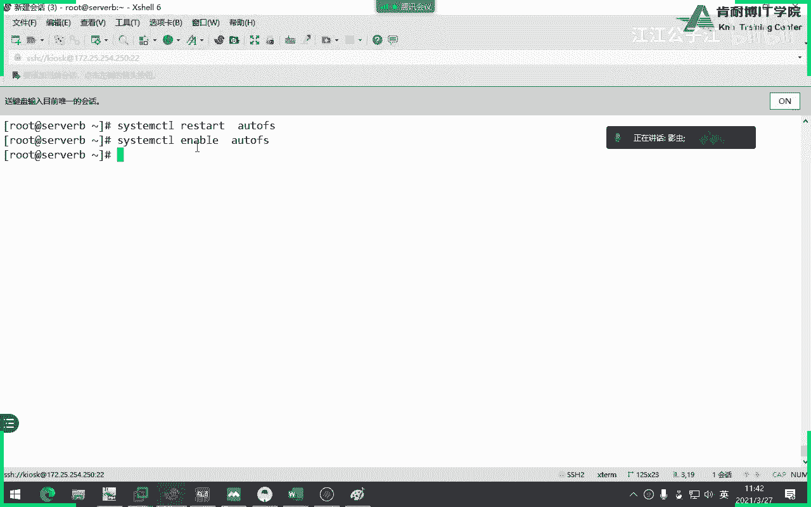

这个是上午的内容。

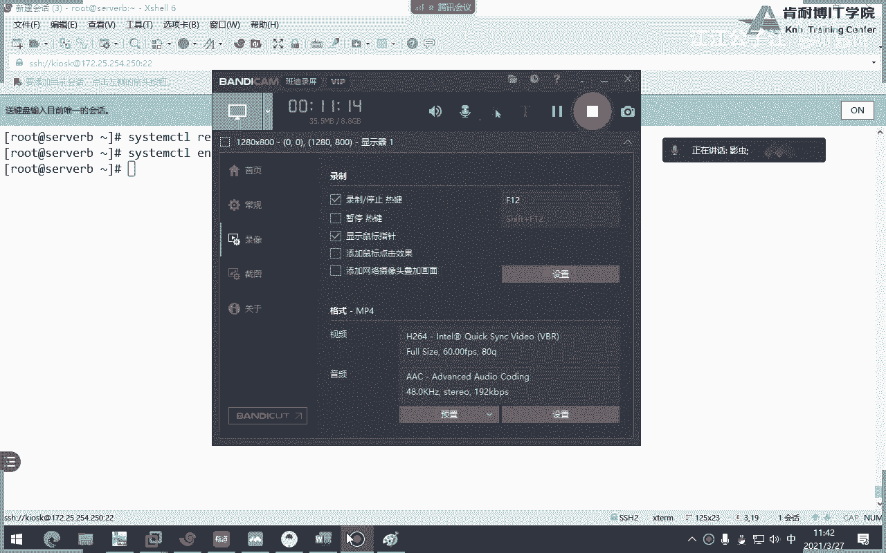

红帽的这个8。2版本当中呢增加了一个叫容器的一个课程。

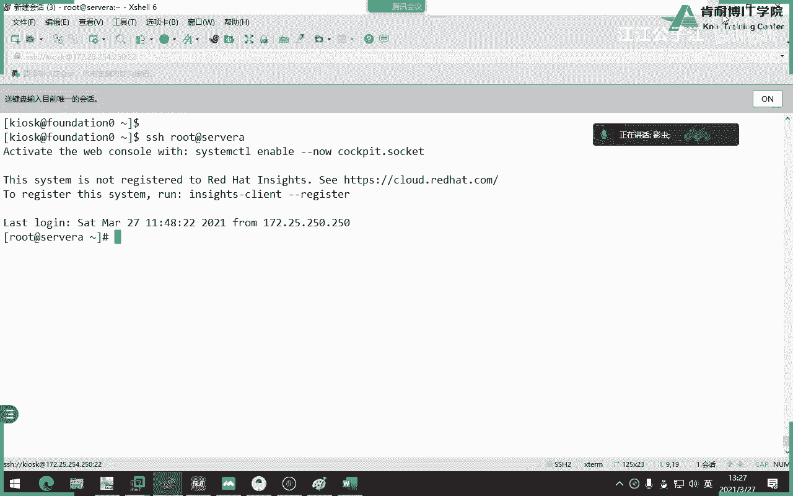

那么这个容器的课程呢，它内容一张啊一张呃。

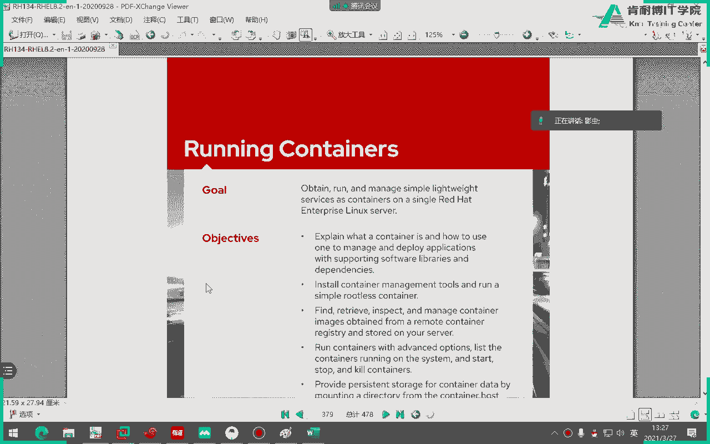

其实我看了一下呃，讲的很基础，但是并不简单，因为命令很多，考试有两题，有两题啊，所以大家还是要对待一下啊，你可以不做，但是你要保证其他题目都做对，你这个上午考试才能过呃。

我个人认为这一章这个题目如果不做会扣很多的分，因为一般情况下新加入的内容都会扣很多的分，所以你还是做一下啊，最起码你把这个容器给我，亚明四套装一下也能给你一分吧对吧，咱不能都放弃是吧。

好那么容器呢是在这个，那时候就开始慢慢的开始火起来了，14年的时候就开始火起来，那时候感觉到刚学完虚拟化没多久，怎么又来一个容器啊，翻遍了好多资料也不明白什么是容器，最后看到一张图片才明白啊。

容器其实很简单啊，你你只是你把它想的太复杂了好，所以我们来看一下这一章主要讲的内容，就解释一下什么是容器，以及如何管理容器和管理应用啊，你永远记住容器也好啊，和虚拟机也好，都是为了跟应用有关系。

因为我如果没有应用的话，或者或者说咱们没有app的话，我要容器和虚拟化是没有任何意义的对吧，那只不过呢咱们在管理应用的时候呢，从以前的物理机切换到了虚拟化，又从虚拟化切换到了容器这样的一个演变过程啊。

你像我在我们我们刚读，我在读书读书读这个培训班的时候，那个时候就就没有听过虚拟化这个词，因为还没有吗，08年09年的时候，那个时候大多数用什么能用虚拟化就ok了，但最多最多的情况下还是什么呢。

就一个服务器当中直接装一个什么应用啊，那是最常见的最常见的，但现在呢随着我们这种应用的增多，还有我们这个资源的使用率太低，为了能够使得我们的资源利用率能够特别高，而且还能省一些成本的话，我们有了虚拟化。

那有的虚拟化呢就会产生很多问题，比如说虚拟机的开机速度慢了，虚拟机的这个不完全了，以及虚拟机这个这个这个利用这个资源的能力差，接着就会有容器，所以你看它是一个历史的演变过程。

那么接着呢我们要学习一下怎么去安装虚拟机的管理工具，这个需要考试，第一步要装的考试不会给你的啊，不会给你，然后装完之后运行一个简单的一个注意，这个单词很有意思，叫无根root类。

这个这个这个位置放大一点，后面看不到，同学们这个一般是反义词对吧，或者减少啊，这个代表无根啊，没有根，根据那根目录的根无根，那么运行一个无根的这样的一个容器，什么叫无根呢，说白了就是不是管理员操作的。

不用管理员操作了，好吧好，然后紧接着就是来学习一下呃，查看啊，检索我们的image，大家学容器当中最关键的就是这句话，image叫什么镜像啊，就像你学任何的东西。

包括咱们比较经典的docker镜像都是一个比较复杂的，而且是个重点要讲的，但很可惜咱们这门课并没有介绍，因为咱们就一章嘛，讲容器不可能讲很多，请你去参考一些教材或者是官方文档啊。

然后紧接着我们要学习一下这个高级应用啊，各应用比如说如何使得我们的容器在一个ccd管理下去开启，我们回忆一下第一本书的第八章是不是讲了ccd啊，还记得吗，s y s t e m d。

它是手会进行1p i d为基，那如何让我们的容器就像运行啊，就像管理一些普通的这种应用一样，也让ccd来管理我们的容器呢，哎这是这一章的这一小节的内容，举个例子，ssh是不是被csd所管理。

那能不能我们开启一个容器也被csd所管理呢，默认是没有，但是我们现在要把它做成这样的，这是考试一道题目啊，也就是说刚才讲的这一堆考试都必考啊，题库我昨天看到的这三个是必考。

还有就是容器如何提供一个这个单词很重要啊，你不会读可以不会拼也可以，但你只要看知道是持久啊，持久啊，persistent标准啊，伦敦阴阳叫持久卷啊，我们的虚拟呃，不是咱们的容器有一个特点。

就是开起一个容器的时候，把那个容器中止掉之后，里面的数据就全丢了，这一点一定要印在脑子里啊，所以我们如何让我的容器里面的资源是永久的，这也是一个我们工作当中必须要考虑的问题，你不可能肉。

比如说我跑一个容器里面的数据库这个关键性的业务，然后你不小心或者是有意的或无意的把这个容器杀掉了，里面数据全丢了，那你就造成了一个生产上的一个灾难了，那怎么样提供一个永久存储呢，当然了，有很多种方式。

各位比如说我们用到了，刚才我给大家介绍了一个赛，可以用它用，用这个外面就是第三方的这种存储软件。

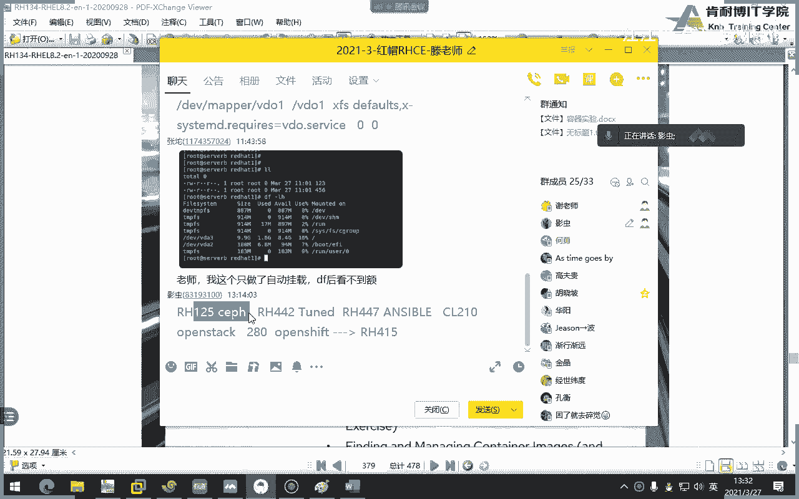

当然了，咱们教材当中不会讲那么深，用什么呢，用物理机的目录，什么叫物理机啊，就是三维，比如说咱们在sa身上跑了一个容器，咱们借助saya身上的一个目录，把它映射到，大家知道端木映射吧。

这个有点类似于映射，把它映射到虚拟容器里面啊，最后再学习一下如何停止开启什么检查容器的一些状态，利用c4 d来管理它，这几个为什么要介绍呢，就是先跟大家讲我们要讲什么。

同时这几个都考这一章的题目量很大啊，虽然不是特别难，但这张这张量特别大，刚才讲的这一项，这一段都是靠西两题当中涉及到这么多的知识点啊，所以说我们还是别放弃了，各位咱们还是别放弃了啊。

好后面就是它的一个实验啊，部分好，那么第一有第一个事，什么是容器，想必大家呢在生产环境当中，或者是在一些官网或者是一些咱们的技术文论坛当中，也或多或少的听说过这个container容器这个概念啊。

肯定也听过，那么如果你学的是容器，肯定你学过最多的是docker吧，d o c k e r c a t啊，这个docker这个东西呢，我们原来以为红毛八加入的容器肯定是docker，但是呢不是啊。

我们写一下笔记啊，不是咱们现在红包容，咱们现在红包八章中自带的容器，8。2当中啊，8。2当中自带的选中器叫做这个跑的慢，那么为什么是power man呢，因为红帽认为docker已经有很多的弊病。

所以说从八点开始之后，红帽渐渐的跟docker呢就说拜拜了，那么其实这这这也给我们提提出了一个信号，就是未来我们在学这个包括工作当中，很有可能红包就不再支持docker了。

那肯定是使用polar man，但大家千万不要去担心，因为pm命令跟docker命令可以说是一样的啊，比如说咱们以前学过docker的话，大家都知道这个docker这个命令对吧。

docker image 4还有什么docker run对吧，我不知道，不知道大家有没有人学过了啊，现在把这个docker这个单词换成pot man，就ptman，英美pman run换汤不换药。

但其实呢有什么变化呢，有一个特别大的变化，特别特别大的变化，就是我们的docker，它的架构是cs模型啊，有守护进程，但是咱们现在呢就没有了，抛半就没有了，就没有了，好吧，还有一个就是pdman呢。

这个嗯有个刚才讲的一个重要的东西叫无根吗啊，也是为了增加安全性，就说白了我不用管理员的方式来去干嘛运行，你像以前我们在运行docker的时候，你所开启的所有容器是以什么root的形式来去操作。

但你也知道root权限太大了，一旦取得root权限呢，我们作为一个管理员或者作为一个普通用户，他就可能会有一些比如说危险性对吧，但是现在呢pdman可以支持，不是管理员操作，就我不是管理员可以吗。

可以啊，待会我们就看一下，不是管理员也可以毕业了吗，好那么甭管是dota也好，还是pot man也好，还是其他种类的容器也好，主要目的是干嘛，各位我们为什么要有这张七，就是我刚才讲的啊。

原来呢咱们是一台服务器装一个应用对吧，一台服务器装一个应用啊，那么它有什么好处呢，就是资源比较比较好对吧，一个人就用一台服务器，资源比较好，但同时也是因为他独占，所以说我们资源利用率比较低比较低。

还有一个就是特别重要的一个地方，就是跟我们的依赖关系绑定得太死了，你看这一串英文怎么介绍的，你看这串英文，我们一般我们一般的我们一般软件程序呢，它必须要与依赖一些依赖项，比如说我们的操作系统。

比如比如说我们的库环境啊，那么咱们公司如果是是两个部门，一个开发部门，一个测试部门，那你开发部门里面写好的软件扔给测试，测试，再扔给我们的运维，它中间肯定跨了不少的虚拟机或跨了不少的应用环境。

包括我们的物理系，那么到我们运维人员的时候，很有可能造成就是我们的环境跟他是不匹配的，那怎么办，在他的机器上运行，好好的，到我们这儿不行了，为什么可能会确保很有可能吧。

比如说我这个你这个电脑里面装好了某个包，但我这边没有，但是我没有这个包就运行不了，咱们这个服务是不是很有可能，所以说以前传统的这个应用和以前传统的这种部署就会出现这个情况，你开发人员做得好好的。

到到我这运维人员就不能用了，为什么缺各种各样的环境，那怎么办呢，唉我们提出一个叫虚拟机的话，虚拟机的这样的一个概念，但是虚拟机也是有这个问题的，为啥虚拟机是不是跟物理服务器一样一样一样。

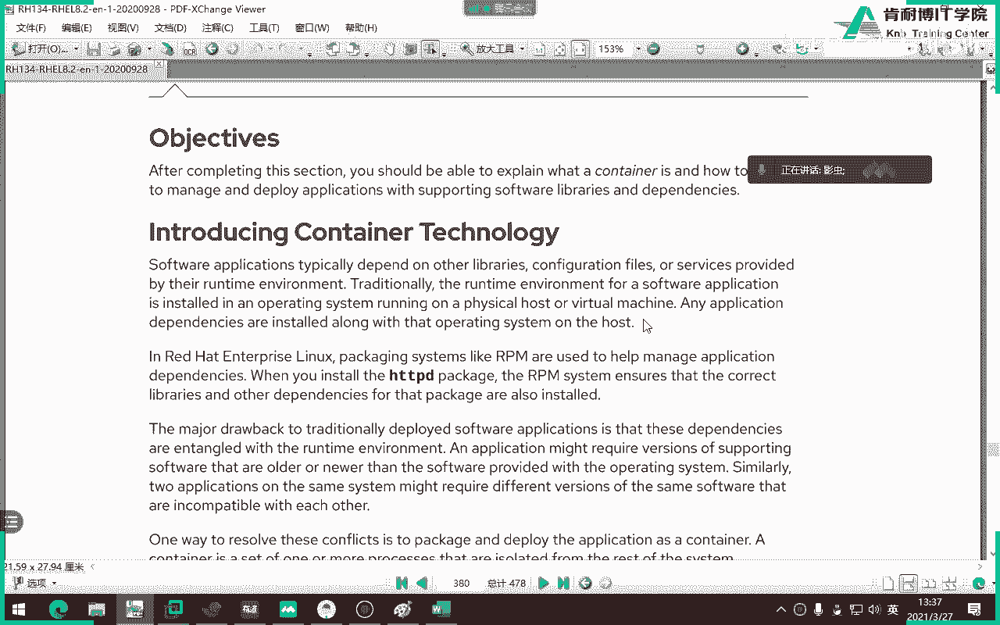

来看那个图片，各位这就是虚拟机和容器的一个对比，咱们先来看一下啊，比如说虚拟机当中必须要有什么物理硬件吧，第二还有这个东西，大家知道这是什么东西吗，中间那个up，你把它理解为叫什么叫虚拟机监控器。

咱们虚拟机当中用到的所有指令，是通过这个虚拟机监控器发送给我们的硬件服务，说白了中间是一个什么管理层，我们所有的虚拟机里面的管理是通过中间这一层来管理的，那大家看到有个问题，随着你虚拟机的增多。

你是不是会浪费我们很多的硬件，同时你虚拟机的增多，是不是你这个开机速度会慢对吧，还有虚拟机当中还有一个问题，就是虚拟机太大了，相对于容器来讲，虚拟机本身的体积特别大。

为什么你看虚拟机是不是也要有自己的操作系统对吧，虚机也有操作系统，然后操作系统里面再装app，就各种各样的应用，所以对于容器来讲的话，虚拟机太大了，你看咱们会咱们会看到一些网站上说虚拟化可以是什么啊。

那个容器可以是秒级的，开开开机速度就是我可能几秒钟可以开启几十个或者上百个容器，但你怎么可能在几秒钟当中开启几十个上百个虚拟机呢对吧。

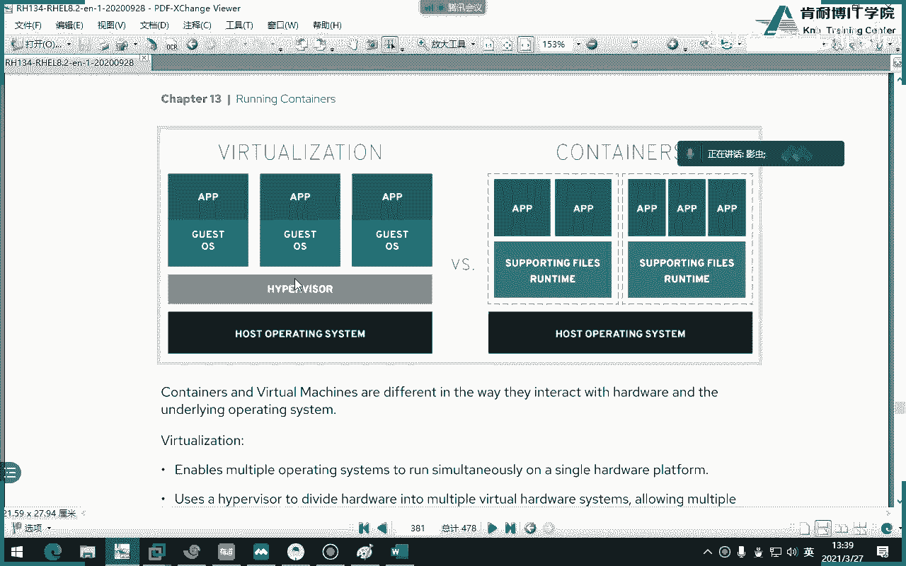

为啥，因为虚拟机里面有有看看看有个guest os，它就相当于真实的物理机，这样的guest的一样，它是不是要开机速度对吧好，但是对于容器来讲，大家看中间少了很多东西，少了哪些。

首先中间没有什么没有这个叫做虚拟机管理器吧，have weather对吧，没有这个东西，同时我们的容器当中是不是不需要什么操作系统的，看我容器上面下面不需要跑操作系统，但是咱们虚拟化必须有操作系统。

一旦有操作系统，是不是整体的速度就慢了，你这个题相当于什么，相当于三个不同的机器装在一台机器当中。

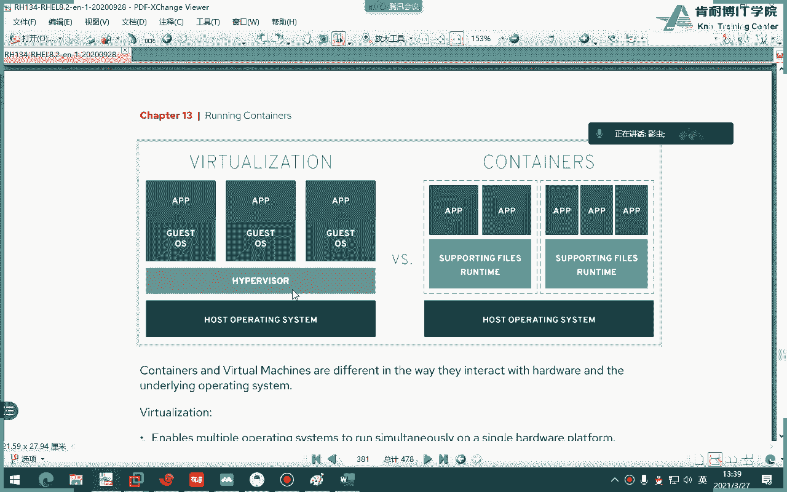

并且每个机器有自己的独立的os好，但是我们容器有好处，我们的容器上面的app是直接跑在物理硬件当中的，说白了是共享物理硬件，而且中间不需要再转换，没有中间的那个help weather。

这一层不需要转换，同时也不需要有自己的os，那么从物理的服务器角度来讲，你每一个容器就是一个什么，我现在有个sa是个物理机，我现在开了100个容器，对于我sa来讲，我这100个容器就是个啥，100个。

professor进城了进城了，你该是怎么调度还怎么调度，但是对于虚拟机就不一样了，你看你如果你也能跑100个，那你那你玩，那你想想你的硬件得多强大。

你怎么可能达到能秒级就开启十几个20几个赞的这样的虚拟机呢，你硬件得多强大对吧，所以我说过对于虚拟化啊，对对于这个容器来讲。

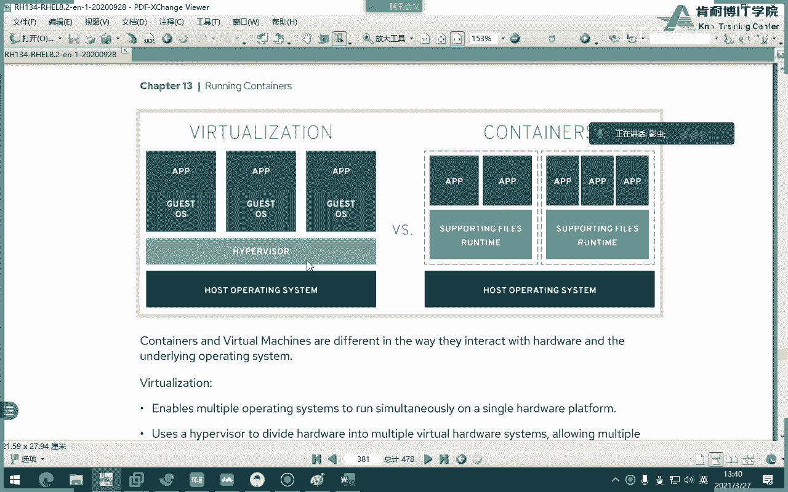

你的虚拟化就是超级大的特别大，你看看下面总结的这几点，第一点点下一个是不是你的多个操作系统可以同时运行，但是在单个硬件平台当中，这是虚拟机的一个特点，第二个特点呢。

你必须使用那个have weather，干嘛把你所有的硬件资源干嘛，分别投入到多个虚拟的硬件资源里边对吧，还有你需要完整的什么，这句话最重要，你是不是得需要完整的操作系统的知识对吧。

就像我现在给大家上课，我为了装那个vm workstation，我是先装一个win 7或者win 10，然后win 7里面，然后这个workstation里面再装什么，在装红帽对吧，所以你看是不是很大。

对于容容器来讲，这就特别大，相当于是不是有两个操作系统了对吧，而且中间的哈佛wd要进行不断的硬件和软件之间的那个指令的转换，随着你的虚拟机越多，你转换的速度就越慢。

而且每个虚拟机又占用了大量的os n硬件的这个资源吗，对吧，好容器为什么为什么可以快，因为容器没有os层啊，它直接使用的是我们真实的硬件的这个os就是系统操作系统，所以它快啊啊。

你看这个教材当中写的很清楚啊，你看下面它可以直接运行在哪，我们的操作系统当中，而且是个轻量级的，看了吗，轻量级的同时可以干嘛，直接分享我们的kernel，注意啦，很重要。

可以直接分享我们操作系统的kernel，而且重点是在这儿可以独立应用，就每一个应用，每一个容器之间根本是看不到对方的，除非你用一种显示的办法。

不然的话我每个current my containers都是隔离的，这个单词叫隔离啊，各位这个i s为什么late这个单词叫隔离独立啊，独立明白吗，就每一个容器之间的应用是容是隔离的，是隔离的啊。

还有最后一句话，它需要很少的硬件资源，相比较虚拟化来讲，因此它可以更快速的进行开和关，来减少了什么一些存储方面的需求啊，减少方面的存储方面需求，为什么呢，因为刚才讲过存储是临时的。

容器里面的存储有没有有，但是临时的只要你释放那个容器之后，我们的里面数据全部都丢失了，这也其实是它的缺点，各位这也是它的缺点，明白了吗，哎确定好，那么这边呢这个p p t我建议大家从头到尾把这几个单词。

把这几串英文读一遍，然后你就知道了，虚拟化跟容器之间的区别，为什么要读呢，因为很多面试的时候就会问这个问题，你给我讲一下容器和虚拟化有什么区别，这是最终最好被别人面试时候问到的问题啊。

你以后就可以总结了，第一个虚拟化体积比较大，占用资源多啊对吧，然后容器体积小占用资源少对吧啊，然后呢开机快，哪个开机慢，哪个开机快等等等等等，还有一个就是这句话特别特别重要。

就是你永远记住我那个圆珠笔呢，就这句话，虚拟机是直接啊，容器是直接使用我们物理机的kernel，所以说对于物理机来讲，你每个容器容器都是独立的进程而已，你开启100个容器，对我红帽八车的系统来讲。

二爷你你就相当于开启了100个进程而已，我还是按照以前调度进程的办法，怎么把你调度还是怎么调度，明白了吗，还有一种讲法就是虚拟机啊，这个容器呢是轻量级的虚拟化，你可以这么跟他解释啊，轻量级的虚拟化。

好吧好，这是以上的这些东西啊，那么我们怎么实现这个虚拟机，这个容器呢有三个关键性的技术啊，这不光是那个今天讲的tman啊，包括docker，也是咱们怎么样去保证咱们的这个虚拟化的这个呃。

这个这个pom这样的一个安全性呢，有这样三个，还有三个特别重要的技术，第一个叫做c group，翻译成中文叫资源组，这个说到这儿呢就有点扯远了，这个也是一个红帽42这门课的一个重点啊，叫控制组资源。

啥意思呢，我们的资源其实是不是平均的，各位啊，说句难听的话，就是你可以让一个进程把另一个很多人的资源都吃光，那么为了达到这种平衡，我们可以让我们资源进行一种控制啊，那么怎么控制呢，就通过c group。

那么我创建一个分组，group是组吗，创建一个分组，我把这个组比如说它可以占用多少内存，可以占用多少cpu，那这个组里面的进程绝对不可以超过这么多的内存，也绝对不可以超过这么多的cpu。

所以说容器有个比较重要的一个基础，就必须要控制资源，不然的话你有没有想过容器，很有可能容器里面app会把所有的计算机资源是不是都吃光对吧，我怎么样实现这个大家资源比较平等呢。

是通过c group来控制第二namespace，这个太重要了，叫命名空间，命名空间相什么叫命名空间呢，相对于进程而言，每个命名空间是一个独立的小房子，你把它理解为房子啊，命名空间啊。

注意你以后在学云计算的时候，云计算当中很多地方会出现这个name space这个单词，它叫命名空间，这是独立的意思，我现在有100个容器，每个容器都在自己的name space里面，不会超过它。

不会超过它，理解吧啊独立性，独立性最后呢就不用解释了，就是每个资源的安全就是通过s1 lx来进行保护的，所以说就是有了这三个技术才实现了我们的容器这个技术明白吗，下次有人问你，他怎么独立的。

为什么每个这个容器都是独立的，因为他有了name space这个概念命名空间啊，大家知道命名空间在哪个地方，还还还还还还还遇到过吗，呃如果你们学过网络的s d n当中，可能会遇到网络里面的啊。

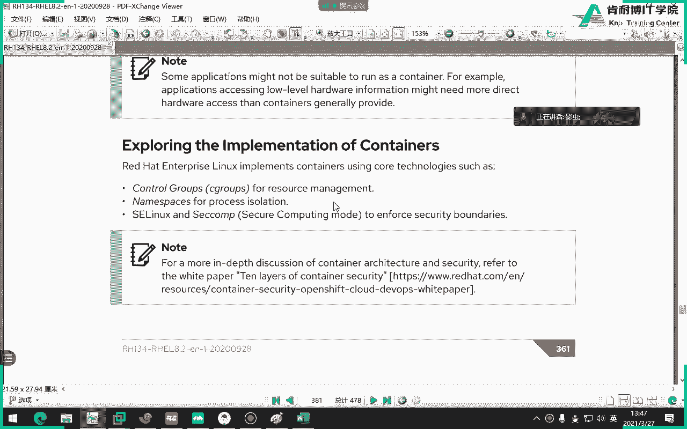

好那么说到这儿了，咱们再返回去再来解释一下容器的一个概念，举个例子啊，我现在要说我，我现在我是开发人员，各位我是开发人员，我要我现在要开发一个app，我现在要开发一个p。

那么这个a p p里面会有什么呢，可能什么都没有，就是一个简单的用，但是为了但是为了这个开发一个简单的应用，我还要干嘛，要装一些操作系统，包括一些软件的依赖关系，我好不容易把这个a p p做好之后。

我扔给你，但是你身上没有这些依赖关系，你是不是打不开，那怎么办，对于你运用运用就比较讨厌了，你还得再装这些应用软件和一些依赖关系，像才能运行起来，我这个a p p好，现在有了容器好办了吧。

我们把这个容器以及这个容器所运行的依赖项，包括操作系统全部给你打一个包，这个包名称组成了一个叫做冰位置，再说一遍啊，这个应力值里面有什么呢，有你这个应用本身和那个为了打开这个应用的依赖关系。

比如说一些库文件啊，包括一些rpm包了，甚至是我整个的os操作系统打一个包，然后扔给你，我不关心你是什么系，我不关心你是什么系统，或者你是什么平台，你只要能够运行什么容器就可以了。

说白了你只要能够运行容器，说白了你只要装上抛的慢就可以了，或者是装了docker就可以了，然后就可以打开我这个镜像，一旦你打开这个镜像，这个镜像里面就有什么，就我刚才讲的一个app。

还有这个app所在的一些库环境依赖关系，像听懂了吗，这就是为什么现在要用容器的概念，懂了吗，像以前不说了吗，你为了要这个a p p，我得在我记忆当中装你的软件，包装一些依赖项，我才能运行你的app。

现在不用了，我a p p加上基础软件，整个给你打包成音位置发给你，你只要能够打开这个音位置，你就能干嘛，打开这个app，再通俗一点，你只要给我装个vm station，是不是就可以打开我这个伤口环境。

我是不是把上个环境全部打包给你了，然后你只要装个workstation，是不是就打开我这上个环境了。

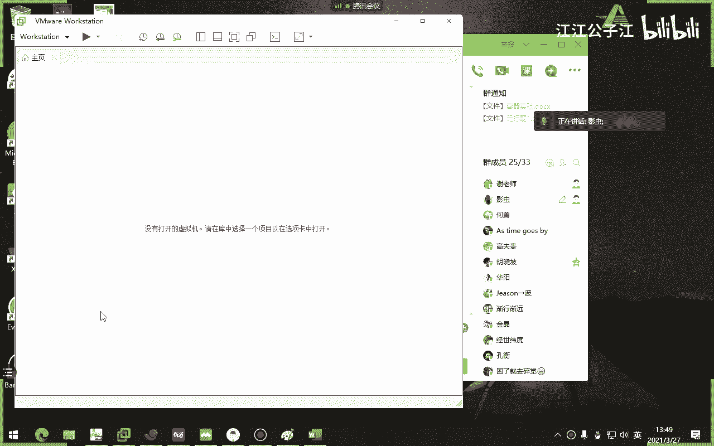

明白了吗，哎这叫这叫什么容器化啊，容计划，所以你看现在咱们做运维的跟那个开发的有点有点干嘛，有点在一块了是吧，就是我作为运营人员，我built一个音位置，built就是构建构建出一个音位置，然后扔给你。

你直接拿来就其他就可以用了，速度是秒级的，速度是秒级的啊，我们画一个图，比如说啊关于英美声，哎呦我这个说是打错了，关于鹰类型嗯，镜像啊，咱们的教材当中没有讲镜像，我们稍微的提一句啊，我稍微的提一嘴啊。

这个镜像对于系统来讲，对于我们的这个容器来讲太重要了，可以这么讲，镜像就是什么容器的什么核心，你没有镜像，你就不要聊人气，说白了容器就是空壳子，你没有镜像，我玩什么呢对吧，刚才讲过镜像是什么。

镜像是一个带有基础镜像的一个软件，基础镜像你先你先要有一个基础镜像，比如说咱们要装一个3s，各位比如说咱们基础镜像此时此刻是一个3s，然后呢我要在这三个当中呢装一个阿帕奇。

然后他们俩加一块是不是可以组成一个新的镜像，心理请求这么写，这样写，这个大家能看懂吗，就是我本来只装了个36s，然后我那个在三路s当中装上一个阿帕奇，然后把它打包给你，变成一个新镜像。

然后你拿到这个新镜像之后，直接在我的power man当中去运行，去运行，这个时候你一旦运行之后，你是不是就构建出了一个带有阿帕奇的什么sn s系统了，你拿到这个现象是不是你能你能不能你能不能再修改。

可以啊，比如说你这个形象当中啊，你拿到这个现象，比如咱们起名叫六image new可以吗，你可以是不是再装个ftp服务器，然后是不是又生成一个新的new 2镜像对吧，所以说你有没有发现镜像是什么。

各位镜像是不是一层一层迭代的，对镜像去打包一层一层的，所以待会我们在运行命令的时候，你会发现咱们镜像都是一层一层下载的，一层一层下载，只是你干，只是你原来不知道，咱们待会我讲完你就知道。

而且请注意是按层来构建的，所以说只有最上一层挺好，是只写只读和可可写的，下面都是只读的，只有最上面一层是读写的，所以下面层都是制度的，记住这句话吗，啊比如我现在有三层，那只有第三层是读和写。

下面两层是读毕业吗。

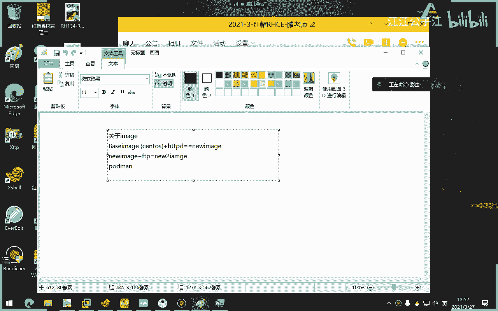

这叫镜像，你咱们那个教材他出的不好，他没有讲镜像啊。

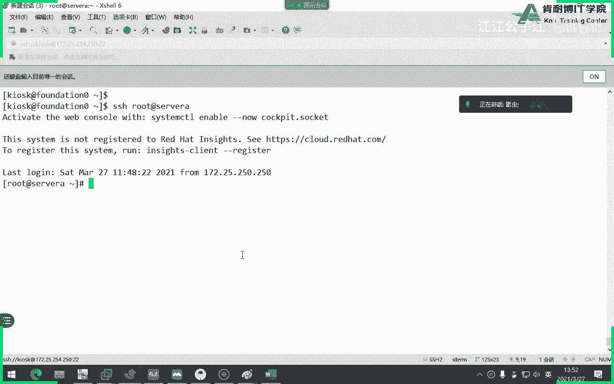

其实应该把镜像就是着重来讲啊，因为没有镜像，大家如果不懂镜像，就相当于没有学过容器来。

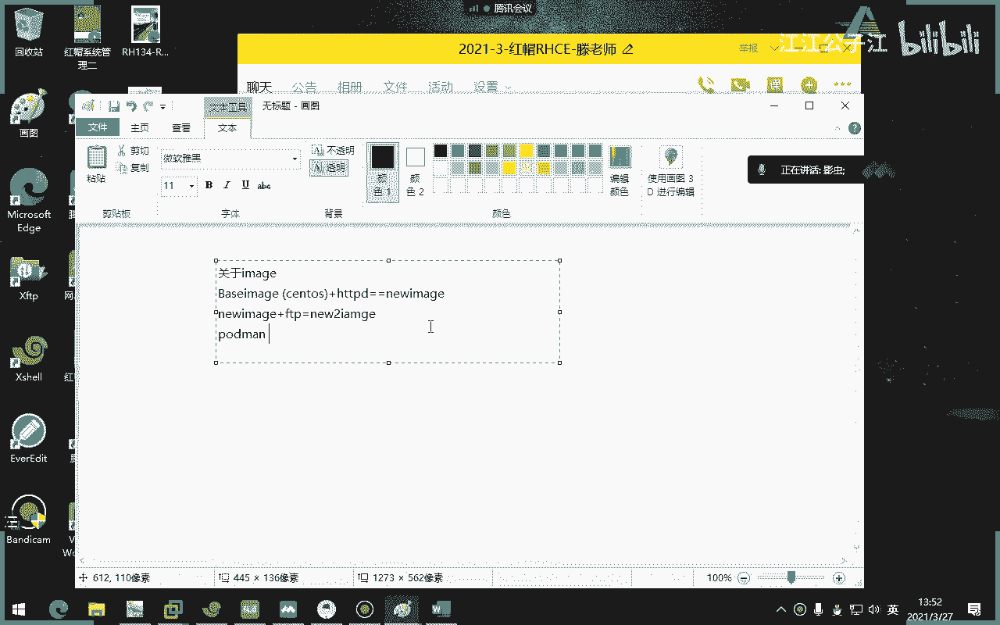

我给大家看一个图啊，我们找一个图，咱们找一下docker的图吧，因为镜像来讲是一样的啊，咱们找找一下这个image给大家看一下这个镜像的概念，你看就比如说是一个呃这个这个看这还看不出来啊。

我这样看那个来来来来来，就这个图片最经典了，它底层是一个基础镜像，我们把它称之为这个base base base不是基础吗，base image，那么base image下面是什么呢。

就是我们的内核和一些硬件基础镜像上面我是不是可以添加一个应用，比如这个应用叫e m a c s，那么e m a c s上面是不是还可以再加什么，是不是也可以加a p p，比如说阿帕奇，比如说f t p。

比如说等等等等，然后最上层是一个可以写的，看到了吗，它是不是像搭积木一样一层一层的对吧，我们只要一打包就发给别人，当你拿到的现象就直接去运行了，为什么是秒级的，因为他已经帮我打包好了，所以说立刻起起来。

你想过没有，你能在一秒钟之内打开一个三个s或者debug这样的系统吗，这debug大家知道吗，这个lax啊你能打开吗，绝对打不开，但你可以一秒钟打开一个迪拜的是吗，容器为什么还是镜像，懂了，所以说。

怎么说呢，如果你不懂现象，你就是不懂容器啊，所以有一句话，镜像是这个容器的基石吗，基础啊，基础好，关于现在大家能理解了吗，啊两点，第一镜像是分层的啊，可构建分层，第二只有最上一层才是读和写。

其他的都是只读形式，制度形式好，既然是分层的，同学们，我问大家一个问题，既然它是分层的，那如果说我第一次下在我的电脑当中，我从网上下载一个镜像，我下载的哪一层呢，我比如我下载到这个debu这一层了。

那如果我现在在想下一个基于迪拜的阿帕奇，他会重新下吗，不会他会只下这一层，下面这两层已经发现在你电脑里面了，就不会再下了，第一次下你会发现啊这么慢对吧，因为他从第一层开始下，然后一旦下好之后。

比如说你已经有debug的操作系统了，只要在下载其他的里面也有debug的这一层debun，这一层就不会再下载了，明白了吗，可快了特别快特别特别快，永远记住镜像是分层的，永远记住这句话，分层的。

并且只有最上层是读写的，但是咱们的教材当中就没有这张图片，所以很多同学不知道镜像它的重要性。

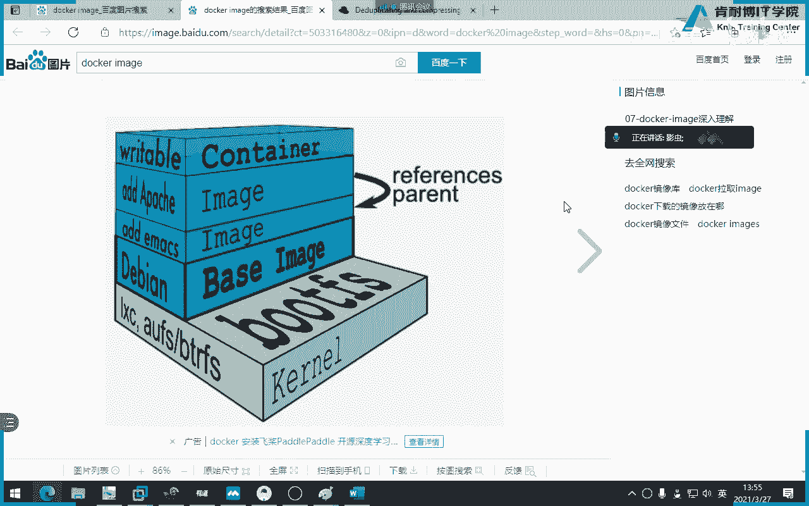

你一定要知道镜像非常重要好，那问题来了，关于镜像，第二个问题存在哪呢，然而互联网有对不错，咱们一般情况下作为运维运维人员，咱们是不要求大家，当然你能写，最好不要求大家要学会写镜像的啊。

当然你要是能够构建出镜像，那更厉害啊，那如果你不会写镜像，那我们是不是只能下载第三方呢，那第三方在哪呢，比如说互联网就跟有点像，咱们学个什么哎，有点像亚亚美元一样，就我不会构建亚美元，我就不能装包吗。

可以啊，我比如我只像阿里的亚美，我只要红包亚美，但问题是我指向阿里，亚美是收费吗，不收费吧，但你实际上红包呢是收费的那一样，镜像也是有私有的和公有的，私有的就得收费，公有的就不收费。

你比如说你指向那红帽的镜像，那不好意思，你可能要给人钱，你比如说你手上阿里的这种镜像源呢，那当然public公开吗，还有一种咱们公司内部能不能自己搭建一个私有镜像，供我们公司内部用，当然可以了。

而且一般大的公司还都是这么干对吧，咱们因为我觉得大家有没有想过问题，你从外面下镜像有没有可能有漏洞，比如说举个例子，他在这个地板，各位他刚才这个底板下面直播了一个后门。

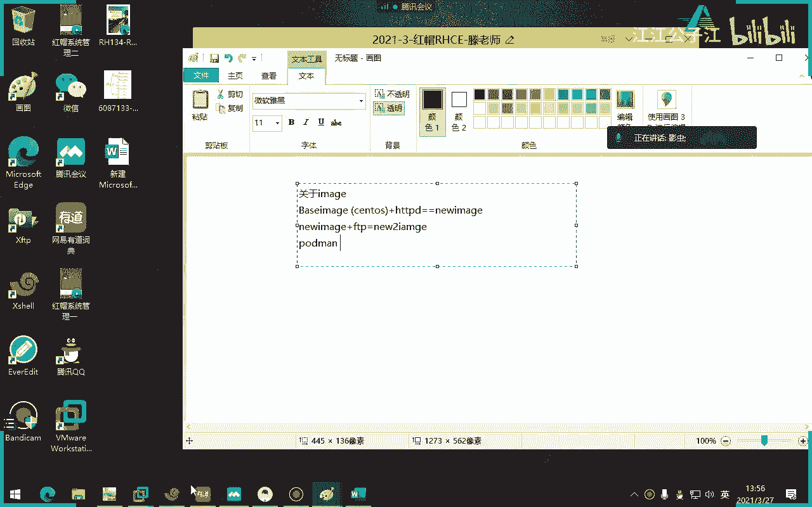

你不知道你从网上下直接用，你很开心，他有没有可能他作为后门太有了吧，那再说你做的所有事情是不是他都可以通过后门来给你抓出来对吧，因为你是公开的嘛，公开有好处就免费，但也有不好处，就是这个随意了对吧。

明白吗，你知道啊，好永远记住奥特曼，它只是一个工具，你想用的工具你必须得有什么镜像啊。

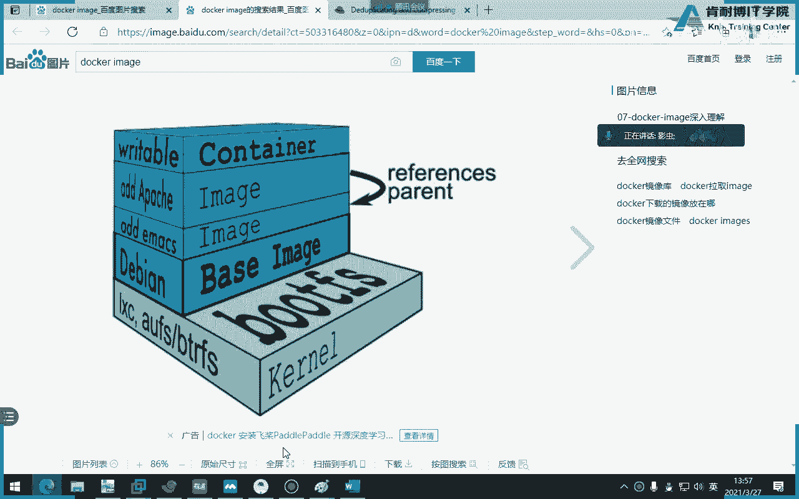

说白了你想works行吗，你打开works in有啥意思啊。

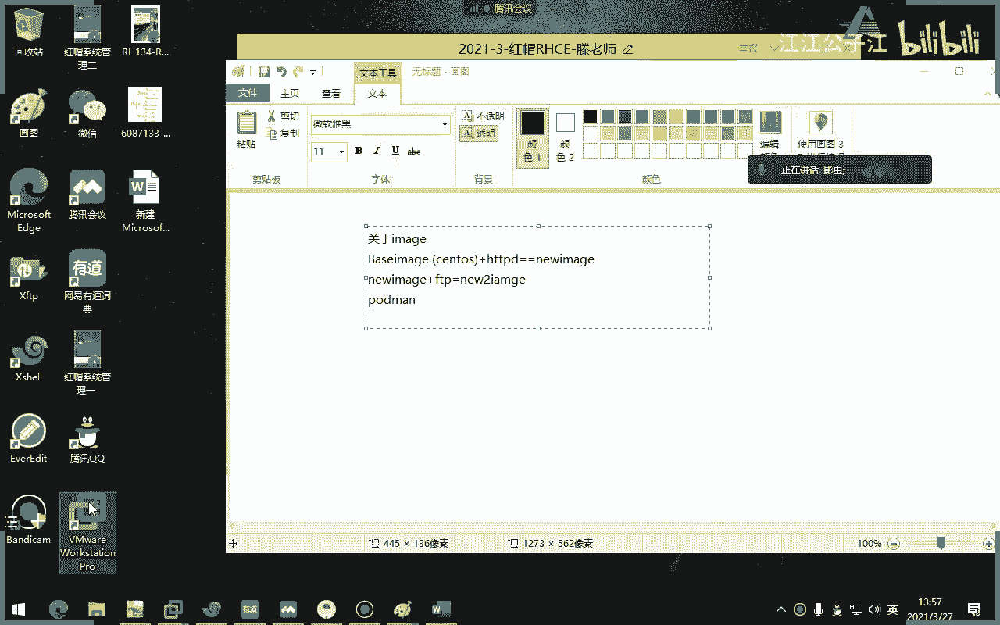

没你说你告诉我打开都有啥意思，没有意思，你得看吗，你导入我的镜像怎么导入啊，是不是打开，这是导入吧，我把那个70多g的这个相对镜像给你，你打开才能用啊，这个是不是特别形象，比如说你把这70多g打开了。

然后你自己再修改之后能再传给我，传给我，是不是相当于再叠加一层，比如变成71级了，然后我再打开你的区域，一季里面是不是就有了我之前的东西和你写的东西不就这种概念吗，无非是这个叫什么，这个不叫镜像。

这个叫什么，应该叫这也叫镜像是吧，也要镜像对吧。

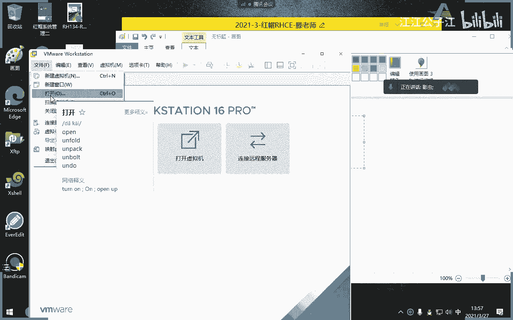

明白吗，或者再说镜像不就相当于咱们以前的操作系统吗。

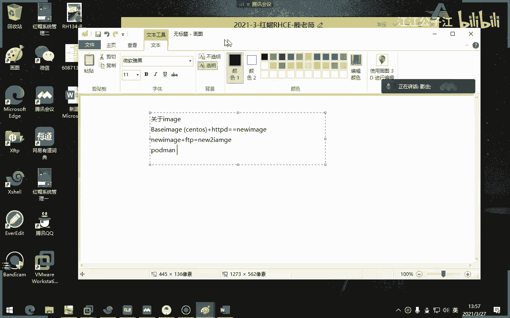

对吧好，但镜像永远记住，甭管你有多少层，甭管你有多牛逼，必须得有什么这句话，什么基础镜像永远记住镜像，你甭管多大啊，但其实镜像都很小，一般都在几百兆就可以了啊，镜像都很少，但你甭管再少。

都必须得有个基础镜像好吧，基础镜像好啊，镜像镜像镜像懂了，那么接下来我们继续说关于镜像的这一部分。

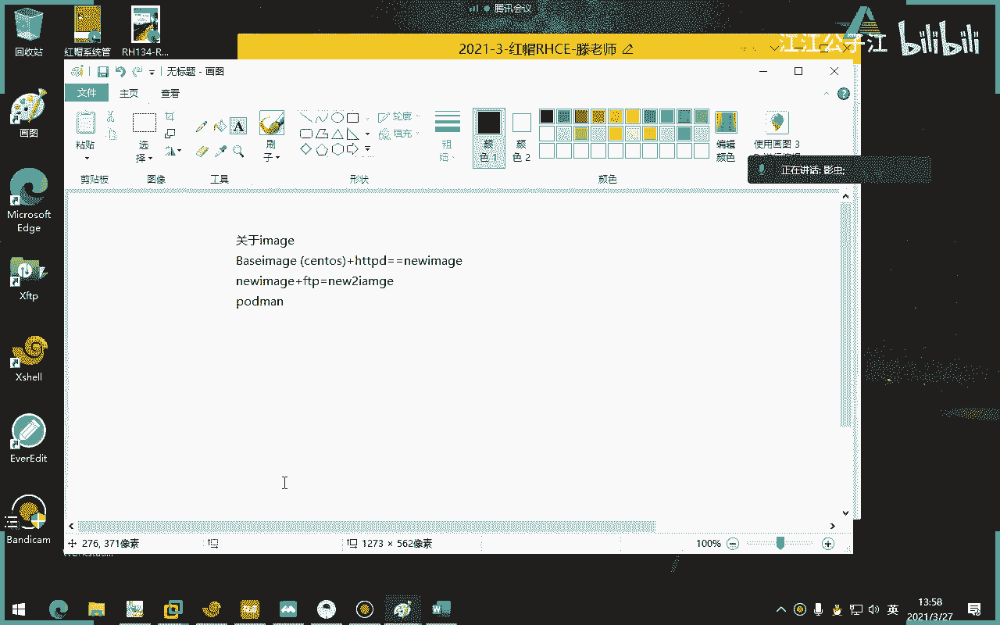

咱们先提前说一点啊，提前说一点，我往下翻，镜像整个教材当中就提了一句，在这儿咱们呢稍微的说一下啊，在这同学们container name，不拉不拉不拉，就是镜像好，我们的容器的镜像存放在哪儿呢。

刚才讲过你可以存放在互联网，或者存放在你们公司对吧，或者存放在某某地方，有公有的镜像仓库，有私有的镜像仓库，那么仓镜像的命名方式是怎样的呢，是这样子的，这样去看的话，很多人都能看懂啊，这个是什么。

这个翻译成中文叫注册registry对吧，name后面是u的，name后面是镜像的名称，后面是target，target的只是标签，但是如果你在工作当中，或者你从一些百度上找了些文章当中。

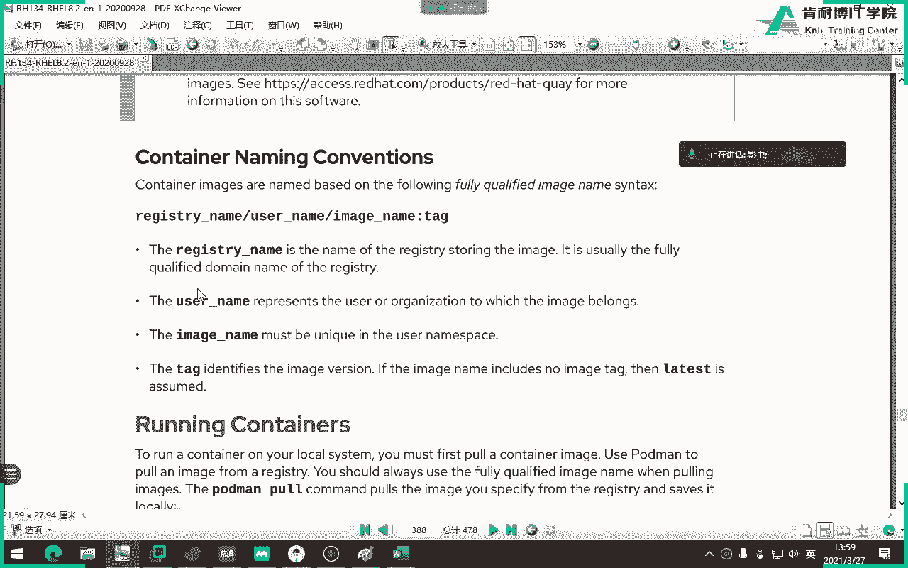

你会发现咱们的镜像名字，还有一个单词叫这个，我就我刚才上课之前给大家下的图。

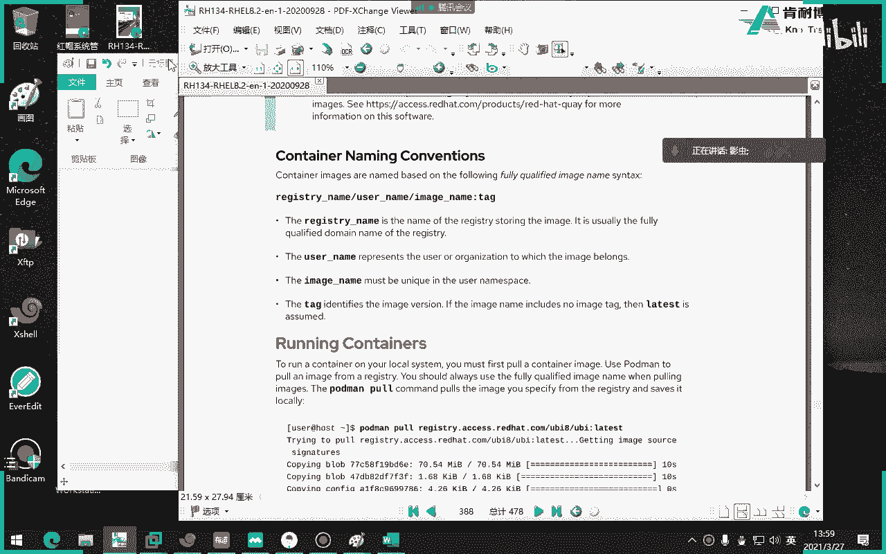

就这个叫叫这个单词，很多教材当中这两个词是混淆在一块的，所以很多初学者来讲的话，一会儿叫registrate，一会叫response，到底哪个呢，还是仓库呢，那么今天我就给大家这个这个这个说明一下。

以后就不要再纠结了，教材当中这两个词儿特别容易相混，因为翻译成中文都叫仓库，各位你如果把它翻译成中文，其实都叫仓库，但是你会发现一会用那个r e p o s的。

一会用那个i e g i s t r y的到底哪个好看，这个图片其实这个是个服务，我们称之为叫注册服务器，这个服务器下面可以有n个仓库，其实真正仓库是谁，是这个这才是藏的，懂了吗，好这才仓库。

只不过呢这个是用于存储多个仓库的一个怎么讲仓库，那大仓库里面又分为不同类型的仓库，比如说有阿帕奇的，有web，有那个ftp的，有这个这个这个这个什么有这个dns的版型里面呢又有up一版本，阿帕奇二版本。

阿帕奇三版本，比如dns呢又有一版本，二版本，三版本，听懂了吗，其实这个registry其实它是真正的大的总的仓库，responsory指的是具体的某一类型的镜像仓库，听懂了吗，所以一定要分清楚啊。

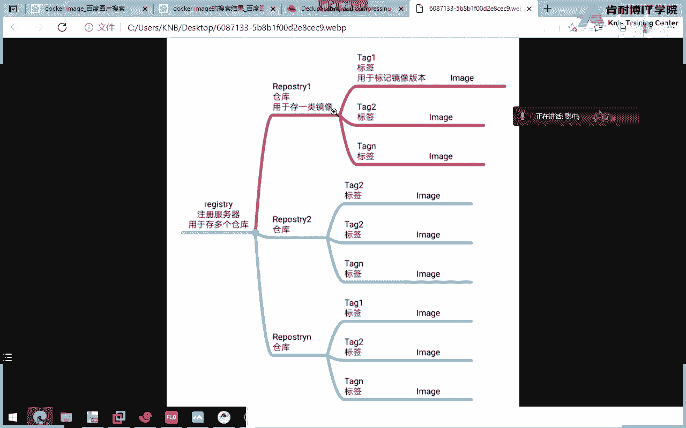

因为你待会再看教材的时候，你看你看这一句，各位这句你读的时候就根本读不懂来这一句什么意思，一开始你自己备课的时候，你看你晕了吗，如果你读这串英文是什么意思啊。

the container registry is responsible for，就是存储和检索镜像的，但问题是哪个仓库感觉都是仓库对吧，其实呢这才是仓库对吧，这是具体的某个仓库，这是总的仓库吧对吧。

总的仓库理解了吗，好那接下来我们就来说一下仓库有两种，一种私有的，一种公有，你比如说像这个就典型的什么，在吗，你还想私有的吗，而且是一个office，是不是官方的，那你你听那个名字。

是不是你感觉好像有点贵是吧，反正就你一下子就掏钱了，同学们，那这个呢一看就是稍微的什么第三方呢是不是感觉就不要钱了，第三方也不一定不要钱啊，对吧啊，明白吗啊好言外之意。

就是我们待会儿要用到的所有仓库都通过他们俩下载的，呃不呃，这个所有的现象都通过这个两个人的仓库来下载的，明白了啊，咱们课后习题用它，咱们的习题就会用到它啊，他给的很重要，他给的只是版本的。

比如说我现在有个阿帕奇一点版本，二点版本，这个1。0二点就是target，如果不指定他给的，请注意，这句话最重要，如果不指定他给他使用了一个叫做latest的，但注意啊，我今天给大家说明一点。

这个单词翻译成中文叫什么最新，但是他真是最新吗，不一定，它只是叫l a t e s t，注意啊，再说一遍，如果你没有指定target的，他就会用l a t s t这个单词当做target。

但他真的是这个镜像的最新版本吗，不一定啊，各位你想想别人以为阿达最新的不一定啊，他很坏啊，他不一定是最新的，各位好吧，那么大家如果对镜像对容器知道了基础的概念之后，接下来我们就要开始来真正的去运行。

或者是说去开始了啊，这个单词叫做如何运行一个content容器，一般情况下运行容器呢我们都会用一个命令叫做hot man run或者docker run，但是后面要加什么呢，要加一些仓库的啊。

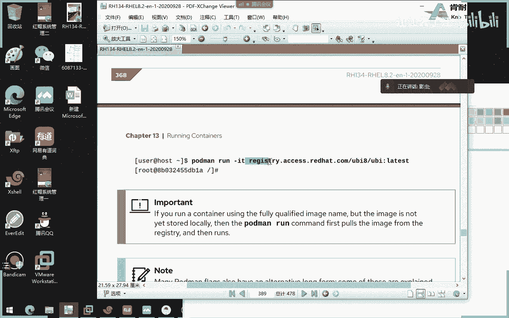

不是要加镜像好，首先呢我们在我们的环境当中，咱们先不讲登录，咱们先讲这个下载，影响各位下载，你看这个命令是不是就是推是吧对吧，推好你看他怎么下载的，各位这就是刚才那那这这一串是什么。

是不是我们刚才讲的那个仓库的路径，好吧，它下载的是这个里面的l好，你看他仔细看，一层一层下载，看到没有，一层一层下载，看到没有好，然后他开始先去找一下镜像的原地址，如果能够找到这个原地址。

它就开始一层一层下达，每一层多大，像这一层是70多兆，对这成多少多少就开始下，最后下完之后拼成一个整个完整的什么image，然后用port image好，注意看这个单词，人家没有写register吧。

人家写的是psory，看到吗，各位看到了吗，啊啊别别别别看错了，人家没有写的是registry，没有写注册那个单词，写的是这个单词好，中间就是那个target，后面是他的image rd号。

很重要的一个东西，后面是啥，哦210多兆告诉大家，210多兆就算大了吧，各位这就挺大的啊，对吧好，那么如果我把这个阿d号删了，就等同于把这一整条全部干掉，阿里号是唯一识别这个镜像的，怎么说呢，标识吧。

就像那个uid和pd一样，好吧好，这是这是干嘛，同学们就是下载镜像，相当于我从官网上把镜像下到本地，但我现在开容器了吗，没有容器是基于什么开的镜像永远记住容器是基于镜像开的，我现在只是把镜像下到本地。

因此我要用run把它开起来，懂了吗，run开起来，所以有时候你会发现一个现象啊，咱们可以这样直接打命令，就是这个样子啊，同学们也可以这么说，我们老喜欢打docker呢啊，pot man pm。

然后呢比如说后面加一堆镜像好，这条命令就等同于先下载在干嘛，在懂了，它相当于把刚才那两步拆开了，但是呢它首先会找你本地有没有这个现象，如果没有的话，再去这个地址进行下载好。

但是由于我们刚才是不是先push下来了吗，那这时候run的话会怎么样，直接搞了呗，对不对，直接搞起来了，懂了吗，直接搞起来了，明白吗，好你看他怎么搞的，同学们，这句话我们来分析一下啊。

啊那个圆珠笔在哪呢，木有啊，没有算好这个i t这两个单词的缩写，他说的对，就是交互式，你如果你最好加一个i t，加个t，然后它相当于该干嘛进去了，这个注意这个这这一串是我们当前的电脑。

这一串里面就是什么了，容器了，相当你进到这个容器里面了，这容器的根，注意这可不是你当前电脑物理机的根啊，这容器的根明白了啊，我觉得他少东西啊，注意这个t就是t t y i呢就是一个交互式的意思。

我觉得少东西啊，应该要少一个b项目带上，那怎么进行呢，他怎么给我提示一个by，这个share没得命令，错了吧，这边应该给提示，并下面的盖死了，不然他怎么过，其实他怎么能够直接有这个盖世提示符呢。

他应该后面再来一个b下面战士的对啊，不然怎么可能有特命的极致符呢，我觉得写错了吧，想想啊，我们待会儿坐下，我们坐待会儿坐吧，不管他了，待会儿坐啊，好你看各位，如果你起一个容器，你看它会自动给你摆个容器。

你不是提起来了吗，利用一个镜像起个容器，它会给你这个是镜像的名字，你想想你怎么可能记记住这一串名字呢，那怎么办呢，我们可以加一个杠杠game，给我一个镜像起个名字，懂了吗，你看下这句话，我你看是吧是吧。

他没有问，我也纳闷，没有问人家怎么给我一个一个中断了，来看一下这个兵力啊，it呢大家讲过是给你一个交互式的终端，t是终端it交互式用单词的英文缩写，杠nm呢是指我起个容器名字叫i h1 r8 。

当然你可以随便叫，你可以叫随便对吧，然后后面这一串是什么，知道u b i是什么，因为是镜像，然后你不是想进去吗，你就给我一个什么bt啊，就是咱们代是不是窗口黑色的带子窗口就进去了，明白了吗。

好这个时候他打这个命令的时候，显示的是谁，容器里面的巴拉巴拉巴拉，不是我们自己本地的，明白吗，因为你进去吗，rt嘛交互式吗，懂了啊，来搞一个，咱们坐一下怎么做呢，哦我还不能做，还没有产生环境呢。

先先别做了，先别做，往下走吧，当你exist退出的时候，又回到我们当前的物理机了，懂了吗，又回到当前物理机了，好这个命令呢，哎呀不想讲不讲不讲不讲不讲不讲不讲，咱直接做实验，那么这样讲干讲没意思嗯。

好注意，想玩这个实验的话，必须打这个命令，如果你不打，进不来，咱们环境这边有个问题啊，如果你不打lab命令，咱们这一章时间做不了，必须打，因为呃1112周前吧，一个重庆的一个老师，他在群里发了一个问题。

他说我他说我怎么登不了，这个环境都是一样的，为什么登不了啊，最后他发现他旺达这个live命令，只要不打live命令，咱们后面的所有实验都做不了，好来开始啊，我来教大家怎么做。

在workstation当中啊，一定要保证那个lab命令对啊，只要有一个错误就要重新恢复系统重做，一定要保证啊，我靠你看立刻错，他说啥，稍微a没开，你开吗，我刚才不都是开了吗，我。

a cannot be reached，为什么不想用，开始了哈，首先检查一下我们的registry是否ok，然后检查一下咱们的亚美也是不注意，如果你不打这个live命令，咱们亚密斯套装不了包。

为啥因为有一个关于容器的亚美元没有加进去，要打这个lab lab命令之后，我们再进入各位，咱们再进入到sa，你会看到咱们多了一个亚目仓库，会多了一个亚目仓库，看哪一个，就这啊，不不不不，这里面有一条啊。

哪儿忘了多一条，就是这个，是这个吧，好好我们开始装包啊，为了你玩那个docker，你是不是装哪个包啊，为了玩，那你得装那个包，注意玩那个potman，你得装那个包，考试必考的啊，系统ta。

boss队包装起来，如果你不打live命令，你装不了包，因为没有亚平原，还有咱们电脑当中，你会发现有这样几个虚拟机，a server b workstation，哎这啥东西听错了是吧，啊嗯注意啊。

你如果这个打错了，一定要重新生成，再做一遍，有这样几台虚拟机啊，给大家看一下，咱们以前上课，老版本八点上课呢，多了一台新机，就多了这一台，you听听，这就是咱们的仓库。

这台虚拟机模拟的这个potman带回仓库，互联网当中那个仓库，明白吗，就在这仓库，所以不用管它，先不用管它，这就是个仓库，好还没好，还得装等，等会儿他在装，大的，这个工具uv了这个工具。

待会就要用到这个工具来看镜像内容，就这个s k o p e o看镜像的一个工具，好搞起来了，没有重启服务啊，这不是服务，不用重启，首先我们用pdman去登录一下这个仓库。

这个register lab exemple com，就是那个utility that的机器啊，就在uta的机器好登录一下，你要登录去下载镜像啊，登录一下log。

这个有点类似于咱们互联网当中登录那个docker的那个仓库，docker仓库啊，r e g r s t r y。lab example and com，考试的时候会给你地址。

这个不用记a a a a me，密码是rehead，321，success成功成功之后，我们可以下载了，怎么下载pro，拜拜下载，下载什么镜像呢，看教材当中啊，下载这个镜像，啊我知道没事。

草不让我付了算了，我自己打吧，搞起来没事，我就打一遍，下次就不用打了对吧，r e g r s啊，我，非常简单啊，咱们学的内容，因为红帽想学容器情报r c一课程，最新版本对吧，直接下来看，仔细看。

他开始一层一层的下载，看到吗，但你不要告诉我这一层是什么东西，我也不知道大家怎么知道呢，这就是阿里号，你可以待会定位出来，其实可以定位出来到底下了哪些层啊，慢慢下。

其实就跑到那个有听听那个机器里面去下载，就刚才我说的这台，就这台这台虚拟机去下载了，明白吗，下载形象啊，好下载完之后开始写，然后开始存储，然后待会儿就好了，稍等稍等稍等，等我一下啊，还没好怎么办。

看他对镜像有点大，你看咱们下载的是不是阿帕奇镜像，好怎么看呢，我怎么知道成功了，好，the man，四加s啊，好看到吗，这是我们的仓库地址以及这个镜像的名称，最新版本镜像id号是八个月之后了。

然后又挺大的，怪不得这么这么慢啊，400多兆呢，各位400多兆很大了，好就可以开启游戏了，pman注意人家说秒级开启，怎么秒级开启，就打完，回车就开起来了，起个名字吧，咱们就有横线吗，有等于号吗。

咱们起个名字叫web吧，咱们叫web，然后什么呢，然后是镜像给给他一个交互式rt，就是这一串能不能指向他行不行，同志们，好然后呢给他一个定下面的bh看不进去，当当当进去了，注意这可不是我的当前稍微a了。

这是我的那个容器了对吧，容器了，退出了又回到哪了，回到正式机了，明白了吗，因为阿b不识别它吗，我当然可以了，就这样，那我们等会儿我们再进去一遍，再进一遍，我这时候我靠进不去了，store哦。

我是退出了没有，stop各位，那怎么办，来看教材，教我们学习一个命令叫做删除。

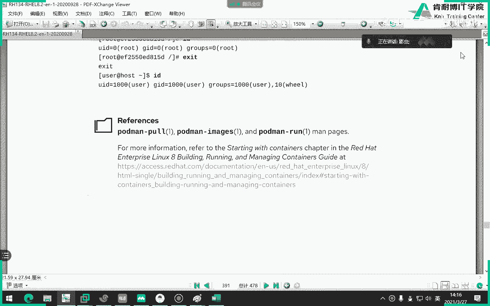

我直接演示了，你看我现在打他说啥，他说已经干完了，他你这个名字已经被用了对吧，那这样说我不去，我还有什么办法，我能不能删这山，你得干掉，你干掉你不行，content id，我现在用的镜像id对吧。

对对对，hot pot，慢慢慢慢慢慢p杠a应该是这个家伙。

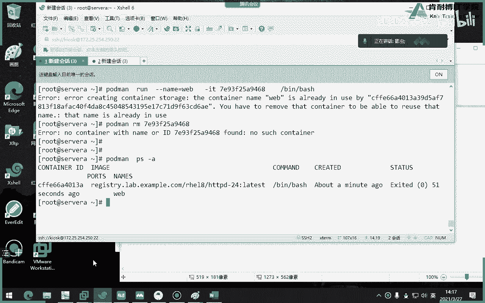

稍等稍等稍等放小一点，我现在不管来来，我们再改名字吧，有改123，回车，然后这边注意我这边重新打进到四位a里面，又开一个窗口啊，我们来学习一下这个pmc的ps命令，指的ps是不是查看进程。

同样这个也是我刚才讲过，对物理系来讲，其实我们的容器就是进程吧，就是进程，而且你看现在所有正在干嘛，运行就八秒钟是吧，八秒钟名字叫123哦，那我刚刚那个叫外部的怎么不出来呢，因为你是不是退出了。

注意p命令只能查看正在运行的，那我想看之前的呢，那就加个a就可以了，看这个状态是不是退出，就这个刚才你起的叫web的这个容器状态是退出了，你想删怎么删啊，你得删除就可以用port man rm。

看谁这样行吧，应该可以吧，加名字可以吧，那你删了不就不拉巴拉巴拉这一串嘛对吧，i的号对吧，那再来看a是不是就一个up了，明白了吗，所以说请注意ps干嘛呢。

port maps指的是查看正在运行中的进程杠a哦，所有进程包括已经被退出的进程，而rrm后面加的是名字对吧，名字my name或者是什么阿d号是删除有容器的命令，能听懂吗，三个东西。

那么还有一个命令是mi，后面是删除镜像，注意删除容器，mi是删除镜像的，懂我意思吗，镜像啊，就这个你看到这个镜像，我可以把他干掉以后把它干掉，我不上了，还得用，别别上了别上了啊，明白了吗。

这几个命令好就讲完了，i t b下面就该是，那么呢我们这是前面的一段小知识点，非常简单啊，但是呢必考题，说完咱们再做，给你们再做吧，第二个部分来开始配置高配置高级的容器的一些东西了啊。

你们能不能这样子写上一个镜像仓库的地址呢，可以的，也就说这个地方是我们的容器的配置文件，我们打它容器配溶液当中有这样一行，这一行里面就可以写上我们要到哪个容器仓库里面下载容，下载镜像。

这里面都是可以添加的，逗号逗号分割，像这个就是典型的docker的官方镜像，注意这是doc io是官方的啊，官方的，也就是你当你打开这个配置文件里面的时候。

这里面可以写上我们要去哪个地方下载镜像的一个地址，你也可以用那个pod min for命令来来来来来来来，具体dic display详细展示配置的一些信息。

比如说像这个位置是不是可以看到刚才三个那个三个，三个那个镜像的仓库对吧，你刚才在这里面配了三个镜像仓库吗，在这儿你看1233，然后你在这里就可以看到image是查看的意思啊，那是安全的啊。

安全就比如你发现这个我们要用到htp s了对吧，可以说t ios的这样的一个加密是这样的一个加密啊，来为了增加我们容器的这个仓库的安全性啊，就跟咱们用八零和43的区别一样，懂了吗啊。

那么search是什么意思呢，我想在这个仓库里面找一下有没有r h e l8 的镜像，sch，这都是吧，这都是啊，像这题啥意思呢，应该就是不需要什么，不需要怎么理解，应该是不需要那个，如果理解不对的话。

应该是不需要那个加密的那个东西了，d s那个，尽量分成吧，是没有单词啊，哎他这个是这样显示的，我还忘了这是什么意思呢，分层，我们search一下试试啊，测试一下试试，就是是否开启。

是否开启http s默认是开启的，默认开启，那我们用什么命令来查看镜像里面的内部细节呢，我们刚才讲的镜像一层一层，它发生了很多事情，怎么看呢，可以用这个命令或者这个命令命令可以看啊，就这个命令。

就这个命令s k o p o这个命令可以去查看镜像里面的具体细节，细节比如说他看了一个镜像是python 36，这里面是一些具体细节，谢谢啊，pad amiss这个单词呢是看了详细更详细的信息。

更多的信息，所以说这个命令用的比较频繁一些，在我们以前用doc看的时候，就用这个命令来看加镜像名称，可以看镜像里面的具体细节，咱们这个没有哈罗了啊，来我给大家看一个吧，就看这个镜像里面发生了什么事。

这个镜像里面有什么东西啊，你看这就是个镜像里面的事情，其中有一个看看太多了，好，我想跟大家解释的这句话，这个镜象一旦打开之后，做什么事儿呢，就完完全全读的就是这句话，就是命令这句话。

比如说这个镜像里面写了一句话，叫a和hello，那你运行这个镜像的时候，里面你的桌面上就会显示出一个hello，明白了吗，这c m d指的是运行镜像的时候，这个镜像里面要做什么事，那这就那很简。

正式干嘛，是不是装就是运行阿帕奇啊，那你先运行那个镜像的时候，他就把阿帕奇给你提起来了，这个cmd就是这个镜像要做的什么事，写在c m d里面，因为咱们现在的课程当中不要求大家写进行构建形象啊。

如果你要在课外学习一些知识的话，要要求大家能够写出来这一堆东西啊，是藏了，知道一下就行了，就这个命令或者是哪个命令，这个命令我个人习惯用这个命令，随便你好，怎么删除镜像了。

就跟我讲的i am i i是image的意思，如果只是i m呢，容器容器，这一章实验啊，嗯我不做了，看一下形象，咱们就不做了，怎么去运行镜像，就感觉到这个不是pman run是吧。

potman run运行，咱们要说一下运行镜像的时候，有时候会做一些端口映射，你你想象一下各位你镜像在哪，各位咱们那镜像是不是在物理机里面，你的外卖机器能进来吗，答案是不能的，知道为啥吗。

因为咱们内部的镜像开启了容器，分配的地址是一个私有地址，那么外面的人想访问进来肯定是不可以的吧，那怎么办，能不能让我们的里面的容器把地址暴露出来，暴露给我们的物理当中的接口，不就做端口映射吗。

相当于你访问那个物理系的某个端口，映射到七里面那个端口，这个大家能理解吗，当户形式用哪个单词呢，g，什么是一杠d呢，d是单词后台后台啊，守护进程，这是啥意思呢。

就是有时候咱们的镜像你一打开啪一下占用前台了，同学们前台被卡死了，被占用了，那防止这种情况的情况的发生，你可以把这个加个小写的d让它放到后台，当做一种守护进程，就是你不退出，你不主动杀死他。

他一直处在监听状态，为什么，所以说这两个单词说这两个单单，这两个单词加起来就是我开启一个进程，是后台进程，并且用物理机的8000映射到虚拟机的8000，请注意最左边的是物理机，最右边的是虚拟机。

别理解错了啊，先是物理机在虚拟机，那最后的结果就是当我访问物理机的8000的时候，就访问了容器里面的8000端口，听懂了吗，有意思吗，朋友们好，懂了吧，这个炮的a是个啥意思啊。

炮的a是应该是查看端口的相互之间的这种映射，那个现象那一样，这这个就很简单了，这是干嘛，因为咱们没有学过保险，我简单的说一下，就是你既然放行了物理机的8000端口，是不是要在你的真实的环境当中。

把物理机8000端口在你的防火墙当中就放行了，人家连你的物理机都访问不了，你更何况进去，你去你的容器不可能吧，这这是放行的，物理机，看到吗，物理机啊，外面的物理系，好了啊，这个实验考题原题考题啊。

朋友们，怎么办，那咱们看能不能说哦，还有一个实验是这样的啊，有有时候啊我们在运行一个container的时候，容器的时候我们要往里面加参数，这个小写的e就是参数后面加变量，e是加参数变量。

像这个啊就是加数据库来，我们看一下这一题啊，我运行一个后台，运行一个数据库服务，加加上一堆的参数当参数，并且把端口映射为物理机的306，映射到虚拟机的3306，这是它的容器的名称。

关于我开启这个容器的时候，需要提供很多的参数，为什么，因为那个镜像里面把这一堆参数变成了变量的形式，为什么有人运行的环境不一样，你不能写死你，比如说用户名，你比如说mysql的数据库库明。

你比如说mysql里面的数据库的，表明这些东西我们不不能把它写死，就写成一种什么变量，那么你在运行的时候是不是可以用杠t加变量，或者加上你的名字，用户名，你的密码，你就库的名字，你的表名字懂我意思吧。

就是在运行的时候可以加e加变量，e是变量加参数导进去对啊，但是前提是什么，前提是你那个镜像本身里面是不是要有相对应的这个变量对吧，关键谁他妈认识你，马赛克塞拉贝斯，谁认识你啊，对不对。

我我怎么知道你这是啥意思啊对吧，明白了吗，好那么同样状况name是指定它的名称，发现ps看到的东西啊，来咱们直接做题吧，先先稍等一下呃，这个大家知道吗，这个是指嗯，说的就是你仔细读这篇英文啊。

就是相当于我进到你这个容器里面去行命令，我进到你的容器里面去执行命令，当一个容器已经开启的时候，我可以进到你的容器里面去运行一些命令，e x e c这一题是什么意思啊，我进到容器rd号为他，然后去干嘛。

运行这条命令，这条命令执行虽然是在我的物理机，但其实执行的是这个容器里面的命令吧，懂了吗，那么还有一个命令，这个教材当中没写，是这个a tt a t t是a d d什么什么什么，就是连接的意思。

连接的意思啊，好那么来吧，咱们开始搞起来，直接做这个题啊，还在这个这个这个这个server works当中打lab命令，要必考题啊，也能猜到，你们没什么内容吗，他肯定考了个，完了咱们就下课休息会儿啊。

做完这一点，咱们也用学生吧，咱们也用学生登，下载镜像来登录一下，red hat 321，然后的话我们第一步要开启一个容器，注他这种方式是直接开开容器的时候，需要这样一堆变量，这些变量都已经写给你了。

这是是啥，这是密码吧对吧，注意它直接运行了，那说明什么，是不是边下载边运行，不是下载再运行对吧好，那我们直接敲一下啊，你看是不是看是慢慢下载了吧，因为你此时此刻这个镜像根本就不存在，你不存在于你本地。

所以相对就直接去下载去去运行，是不是相当于少了一个破，那那一步对吧好，那开始啊，嗯，照着敲吧，pdman，b是指后台啊，是指后台，比如说叫做诶没有横线也行，有横线诶，有有等于号也可以看到吗。

d d然后杠e my circle，等于等于优点一是吧，my circle，t a b a s e，我嘞个天，i t e m s，和password等于red hat，3306映射到里面的3306对吧。

然后是r e g r s t r y。lab example，然后i是一八的这个m a r r a d b mary db，1032号，一杠102啊，还有什么木有了，别报错，好很好非常好特别好。

但是为了让你们看清楚，我故意加企业线，让他转行，懂了吧，不要问我为啥是c n c的一些基础的东西啊，因为我要写出长评论，你眼睛看着比较乱嘛，所以故意这样写成一列，听懂吗啊换行换行好了，换行强行换行吗。

就开始下载了，你看还还还还不错啊，这时间很快的，可能是这个现象没有那么大吧，零六啊映射进去，如果我刚才不加d会出现什么现象，大家知道吗，鼠标停在这儿，因为它把我前台占用了，明白吗，占用。

然后我们进到pass，进到数据库里面，看能不能有看到这张表，肯定有的啊，稍等进去了，p杠a，看3306映射到306，是不是这个箭头好，那我们怎么进去呢，直接进去把sl 0点进去就行了。

p p是指密码可以不写，如果写就写在后面啊，一定要注意没有空格啊，中间就直接red head，如果不写呢，就待会它提示你自己去输入red hat，明白了吗，待会咱们这边直接写出来还就可以了。

好杠杠杠杠杠，p，3306啊对吧，post是指哪台机器，就我本地就稍微a啊，当然你也可以写成172。25。250。1，对吧，进去密码安排我们密码好吧。

进去啊好我们show一下database database is 4，有个家伙就是我刚才导致的库items对吧，就行了结束，所以说这双我刚才游戏成功了吗，成功了。

干嘛stop stop就是有容器被stop关闭对吧，被关闭啊，他现在接下来是不是又让我做一个叫做阿帕奇的容器啊，对吧，我就不做了，命令是不是一模一样，阿帕奇的容器啊，做了哎，这是啥意思啊。

刚刚说过这种状态，就是你用e x i t退出了，再用p杠a才能看到，如果不用a能看到吗，绝对不能再说一遍，不能啊，这就不做了，后面咱们直接做一下这个吧，这个单词指的是我进入到一个容器里面啊。

我们进去这种事就说他吧，咱们进到这里面tmap，然后这时候我们进去啊，怎么进来就叫就叫for the ma c，然后容器名字叫db好，我们做一件事，做什么事呢，咱们随便就来列出当前的用户名，出来在。

现在看的不是我本机啊，不是我本机啊，如果你不信的话，你可以用这个单词i，如果是我如果写护他，如果是本地的话，是不是显示学校，但它现在显示的busql说明我用的是进到db这个容器里面去运行，懂了吧。

啊就是说明成功了吗，成功行。

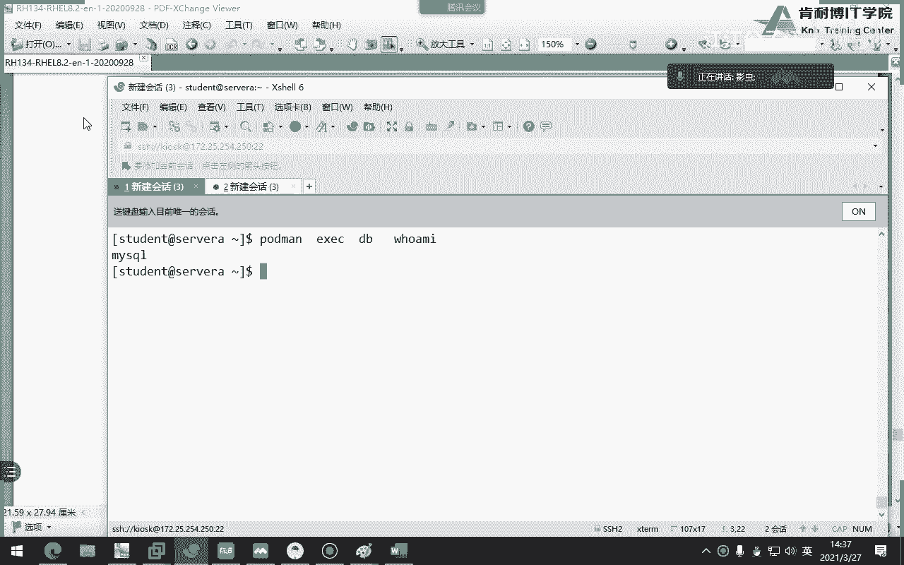

我们下课休息会儿吧，有点感觉啊。

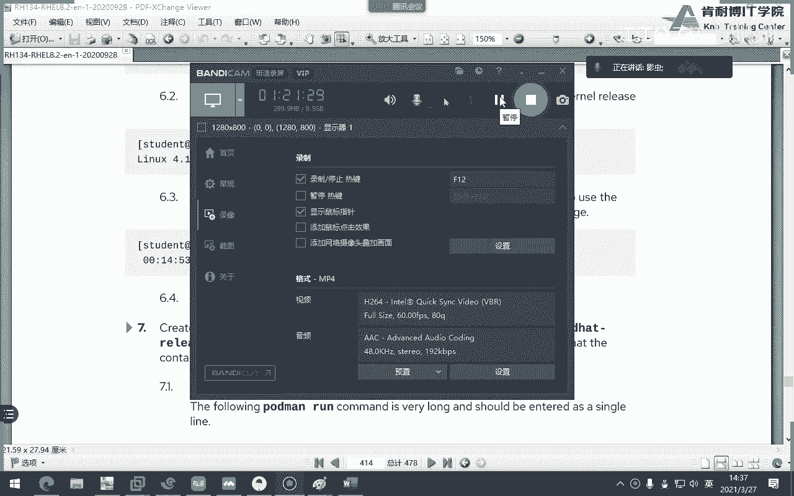

那我们来讲一下如何提供永久存储，刚才讲过我们的所有的容器，包括刀卡，包括今天讲的potman，它的容器都是这个单词，很重要啊，你可以不会拼，不会念这个单词叫临时，平时就是一旦我们的容器这个坏掉了。

那么我们里面的数据也就被移除了，里面的数据就丢了啊，你把它想成内存，一关机内存那里面的东西就没了好吧，把它想成内存，所以在一些关键性的业务怎么办呢，我们我们不可能用零食啊对吧，那怎么办。

我们可以提供第三方的一些专业的存储设备，或者专业的存储软件来搭建存储，但在我们今天的课程当中呢，我们使用最比较基础的就是我利用主以及上面的那个这个这个目录，来为我们的容器提供拥有持久存储。

那咱们物理机当中我建个目录，这个目录一旦被建立起来，是不是永久的，那么就用这个目录来充当这个虚拟机的目录啊，这个这个容器的目录啊，原理就这么简单，那命令呢更简单了，刚才是那个杠p是端口映射。

咱们杠v注意这边有个小写的v v在哪，就是指定绑定什么啊，不是绑定就指定它的这个目录当做另一个虚拟机的value，我们就就卷吧，卷还要注意加一加一个大写的冒号z，这个z是干嘛的。

一看就知道是关于应用什么s一雷格斯的，也就是说咱们的目录的s雷克斯的上下文的类型字段必须是这种类型，怎么办呢，杠z就行了，你加z咱们的这个相当于咱们的这个这个这个当中的类型字段，就变成这种，懂了吗。

必须要加啊，各位必须要加，因为它要安全性的考虑来，我们比如说看到这一题，咱们不看，中间不看啊，比如说你这段英文看不懂，不看，你看这是不是开启一个叫数据库，你看注意这是左边的还是物理机的。

后面才是虚拟这个容器的，明白吗，就跟端口号一样，左边是物理机的端口，右边是容器的端口号，这边是左边是真实物理机的目录，映射到容器里面的目录，大写的z，然后后面我们不再不再解释了吧，听懂了吗。

那我们可以想象一下，同学们，如果我把它不小心把这个mysql db mysql db把他干掉，这数据其实存放在打着打，放在home下面吧，也就是说我如果再开一些容器，把这个新容器跟那个之前做挂载。

是不是还是有数据的，但是一旦我这个目录挂掉了怎么办，那你就就挂掉了，你物理机你都你都你都炸了对吧是吧，明白吗，所以说这个目录你自己要做好备份啊，具具体这个怎么做备份，那有很多办法啊对吧。

很多办法咱们这个做的太low了，因为不是提供专业存储，咱们提供本地的存储，有没有一种可能这个目录如果写写写写满了怎么办，很有可能吧对吧，所以这只是一个临时的本地的做法，当然你说我是不是可以做lvm。

可以做lvm对吧，好行，就这条命令啊，减p减v p是端口号，减v呢是vue卷这个单词的缩写，就这么简单，其他命令一模一样，没有任何区别，无非多了一个大写的z，是吧，来，我带着大家念一遍，我不想做啊。

是这样的，各位在我的物理机当中建立一个这个目录，稍微a啊，物理机建立这样一个目录，然后呢我把这个我往这个目录里面写上一个静态页面，还记得吗，静态页叫hello，hello，然后这时候我开启一个容器。

但是他这这时候是不是要先先先登录，然后再去干嘛再去运行，这时候你看它干嘛，它是把物理机这个刚才建立的目目录映射到我们的虚拟机，就是我们的容器里面的这个目录，那当去访问这个容器里面目录。

不就相当于访问物理题里面的这个目录嘛对吧，然后呢他干了一件事挺有意思的，你看他开始访问了成功啊，他干了一件什么事呢，他用这个单词来看一下镜像内容，其中他发现了我们发现了我们镜像的阿d啊。

他给的是这两个198和1104，此刻用到的是198，然后他把那个容器干掉，再用1104开启一个容器，然后再把刚才那个目录挂上去，发现里面内容还在，懂了吗。

这就是想想想干嘛想表述一下你之前映射的那个目录里面内容，就算你的容器挂掉了，你在映射到新的容器当中，目录里面内容依然存在，你看最后效果，你看他现在就他删了，看整个把这个容器删了对吧，然后呢。

接下来他在用那个104这个这种镜像来做一遍，还是要fm 10448105，要不你错了，105啊，在用105，最后呢还是把这个刚才那个目录映射到咱们的虚拟机里面，最后发现居然还能看到页面。

听懂就大概就这意思明白，就说明一点，其实你上容器我们不怕，我们就怕你的容器里面数据丢了，研究数据啊啊这也是给我们做虚拟化的同学一个一个警告，我们一定要把存储做好，在建设环境当中。

我们肯定用的什么专业存储吧，对从专业存储，比如说safe，包括这种分布式的存储啊，不错肯定不可能用这种比较low的，清楚啊，太太简单了好，那以上呢就是咱们的容器的一些东西，非常简单，就这么做。

你考试就考了些，接下来男的开始了如何用我们的system d来去管理我们的容器，说我们在容器当中部署了一个服务，比如说数据库服务或者是外部服务，能不能像管理这个征集当中的。

或者说物理机当中的数据库服务一样，也去管理我们容器里面的数据库服务或者是web服务，你可以把还想什么呢，我开启一个容器，这个容器就是为了运行数据库的，我们怎么开，各位我们是不是得用pm run命令来看。

用cmd control这个命令来管理它，很显然不能对吧，你看我刚刚开启一个mysql这个容器，你能用这个命令来管理他吗，不能吧，肯定不能，为啥，因为这个命令是必须在真机上装的服务才行。

那我能不能把容器也用用它来管理呢，啊现在肯定不行，但是你得配置配置管理，所以说这一章讲的就是如何去自动管理，用通过使用system control命令来，你这个单词什么意思啊。

就像管理普通服务一样来管理我我们的容器里面的服务，听懂了吗，是这个意思啊，这个意思管理的时候又管理的时候又分为两种情况，一种你是用管理员来管理的，一种是非管理员管理的，这就是我们刚才讲的无根模式。

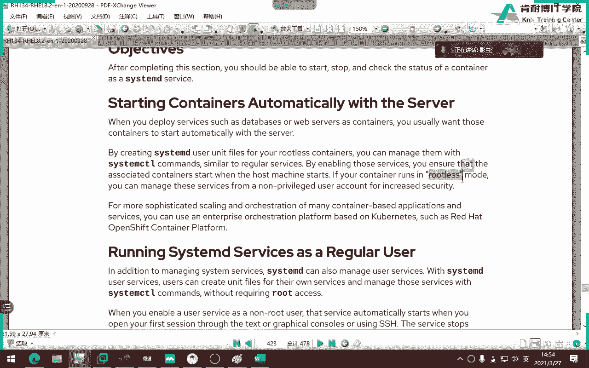

好那么说到这儿，咱们暂停一下，回忆一下，我给大家以前增加了好多内容，大家还记不记得这个命令的时候，t l它是怎么启动s s h d的服务的，还还有还有谁还有印象。

就是往这个一个cmd里面的单元配置文件里面找到的，我们以前讲过，每一个单元是不是都有自己的配置文件在哪，我想想今天就要用到这个知识点了啊，嗯在这儿吧，同学们，来看看是不是回忆一下，回忆一下各位。

你这个对行啊，当我去开启一个大大的时候，就读取这一行吧，就这样，但是这个命令谁能管呢，管理员是管理员打的，看到吗，我刚才敲的都是管理员敲的好，但是在咱们的电脑当中还存在一种方式。

你看我打出这条命令吧对吧，但是我现在此时此刻用管理员，那么其实还有一种方式来管理，就是加user，就是用非管理员来管理，但是你如果想用这种这种方式来管理的话。

你必须让我的服务自己创建一个非管理员的配置文件，注意咱们现在用的这个配置文件，默认是管理员的配置文件，你还要再做一个普通用户的，就是说就是说非管理员的配置文件，所以说如果我想把我的容器里面的服务。

用非管理员来管理的话怎么办，是不是要为这个容器呀，作为一个非管理员的配置文件呀，我怎么说，能理解吗，好那你看怎么做啊。

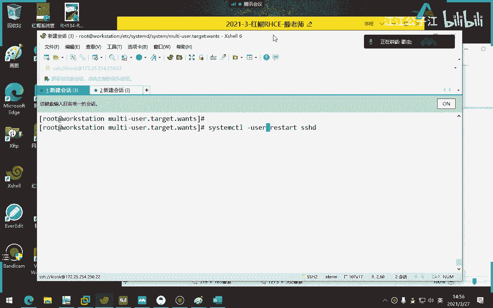

这有点难有点难，怎么做呢，这样做，我们希望用cmd user的补这个user翻译成中文，就是普通用户，普通用户是吧，我必须在普通用户的家目录下面建立一个点，啥意思，你下面的cmd下面的u着这个目录。

这个目录是用于存储你自己的单元配置文件，看懂了吗，懂了好，那么它里面的语法格式跟我们系统的单元配置文件一模，我也一样，能看懂这一串英文吗，什么叫系统的单元配置文件，什么叫系统用户的单元配置配置文件。

说白了这一串就是非，而这一串就是语言，听懂了吗，好你不信，你可以举个例子，你看嗯上了，打个命令行不行，会报错的，试试这个行不行，不知道啊，我也没事，我现在是普通用户，看看能不能能不能行，可能也行。

我觉得可能也行啊，不行啊，没没没，可能是也行的，c t l，但是他要求我干嘛得权限啊，要求权限，但是我们待会儿做了用户级别的，就不需要让我输入权限了好吧，因为你做了一个用户级别的cmd的配置文件好吧。

那怎么说呢，各位各位来看，他告诉我，你得跑到这个目录下面去建立好，就算我有这个目录，因为建立目录咱们都会mic dr，问题是我怎么创建这个单元配置文件呢，我不会啊，这样的不不不行不不行。

但问题是我复制啥了对吧，当然你也可以复制，还有一种办法就这样看，比如他自己做一个m i a p p的这样的一个应用，那这边就给你写成什么写项目，下面点com文件，下面的cd。

下面的u在下面的my app，看了吗，哎以后起步就这么起了，看到吗，原来是不是system control enable，system control star，现在变成了ctrl user star。

system control user enable，看懂了吗，好那关键他怎么配这个里面的内容呢，这里面的内容我怎么写呢，得要用这条命令，自动生成这个单词是不是生成，是不是生成好吧生成。

然后你这个命令就会自动的往加目录下面的点拷贝文件，下面的cmd，下面的u在下面建立用户级别的unit files配置文件，听懂了吗，懂了吗，而且这个这样式的啊，这样式的好，那么是一个表格，仔细对比一下。

级别的是在这儿对吧，普通用户级别的是在这儿，当我打命令的时候，我可以用这个命令重启，但这边呢就要用加u的，同样我开启一个五，是system control star，关闭什么control stop。

这边呢这边呢system control杠杠user star，杠杠user stop，我就接下来我就不带着大家念了，能听懂吗，这不能去再下来，就是说白了一个是管理员的，一个是什么，那问题是我问大家。

我现在有两个普通用户，u的一和u的二，只要做完之后，u的一和1~2都可以吗，不是你看这是啥，这个就是前面是不是指某个人的家目录对吧，比如你这个优点一怎么做，也就是说这条命令也是说这条命令现在只能谁打。

像这种杠杠带u的，就只有ut一能打明白吗，因为你是在某一个用户的家目的下面听懂了吗，一定要注意啊，这这个意思好，我们来做一个好吧，怎么做呢，这个就不带来念一下吧，啥意思啊，就我怎么去生成呢。

就是这个命令来生成这个刚刚name呢指的是，指定不不不哦，容器的名字，file呢指定的就是生成的文件的名字，生成的文件，new呢指的是什么，那么吵，配置cs装置服务，在服务启动容器时。

好吧行行来做一个吧，这样看看不懂，咱们来做一个怎么做啊，各位还有你做完之后就要用这个命令干嘛了，进行测试了，比如说开关懂了吗，你做完之后就可以用这个命令来测试了。

好大家来想先看一下这个事例和首先这一串不用解释吧，是不是开启这个名字叫外部的对吧，然后他开完之后再用这个命令生成这个unit的files，就加就是普通用户的配置文件，听懂了吗，好那我们来做一个吧。

课后习题，啊这个待会儿等会儿这个待会再说吧，好我们先来做啊，cd不一定完完全全做啊，咱们把重点的做出来就行，考试必考题，因为我看一下题目会考这一题，建一个容器，然后把容器变成用户级别，能够管理。

虽然你第一步先创建容器，然后再管理他啊，看一下啊，注意不要用root啊，要用普通用户登录，你要用root登录的话，我们还做什么对吧，就用普通用户来登录啊，好然后先过切换成管理员，因为这个时候呢。

我们因为要先做一些这个建立用户的这种这种这种命令啊，所以我们先切换成管理员，这个用户名叫c o n t s v c，还给发错了，123123吧，无所谓了，出来不出来是不是用啊。

不还是还是要用普通用户用过好嗯，暂停说一下，如果你想成功以下的实验，是不是用这个用户来做，注意千万要退出来再登录，不可以用su命令这一串写的很明白，如果你用su命令下面的实验不成功。

是不是要做一个非管理员来管理容器，所以大家那个用户叫cnsvc，那么请注意，你必须用ssh用的用户登录，如果你用su命令切换成的用户，后面的实验不会成功，这个非常重要的一句话啊好吧，所以我们先退出来。

然后再用这个c o a，所以我还得再推推一个吗，我现在在骚扰ok，再推出一个c o a，必须得这样做，千万注意，必须这么做，好创建目录，咱们加目录在哪，是不是后面下面的这个下面的点康复文件。

然后是c o n t a r n e r s是吧，然后嗯刚才那个lab命令啊会帮我们生成出一个这样的文件啊，这个目录下面我们考过去就可以了，那么拷贝就可以了，还记得这个是什么目录吗。

这是不是那个容器里面的主配文件，里面有含有那个包含我们镜像的存储库，在哪对吧，主配文件咱们考过就行了，啊server，这个吧，除了加盟下面，是吧，拷问就可以了，干嘛的呢。

是由于我们待会儿要用它来下载一些镜像啊，镜像啊，搜索一下有没有这些镜像，试试一下hold my，想为啥有，就是你考过去了吗，你考过去了，然后拷贝一下这个什么来着啊，创建一个目录。

这个目录待会是用于保存一个叫index文件呢，很显然是不是做阿帕奇对吧，还是要做阿帕奇啊，然后我们在里面去创建一个这个index html，这样的好，那接下来我要开始干嘛了。

接下来我们要开始做这个容器的一个产生，并且是80801映射到8080，最后的效果是我们能够访问这个index文件吧对吧，就是这个目的啊，好那这有点长啊，靠这么长啊，忘了得先登录。

因为咱们所有的都要先盯登录去下载我们的镜像啊，开始下载镜像啊，镜像有点长，这能够复制吗，我记得能复制啊，我这电脑怎么复制不了呢，为什么复制不了诶，这样，这啥玩意啊，打他手工敲吧，啊，对吧，存储路径的啊。

别空格，别像我这样空格没有空格啊，vr 3 w大写的z n上下文对吧，bp第24，我们只是干嘛，各位我们只是开启一个容器对吧，再起一个容器，那么它就可以验证成功了。

那么接着我们要开始创建系统的什么单元配置文件了，为谁为这个容器，并且呢我们用的是哪个用户，是不是这个家伙对吧，因此呢要在configure里面的system d下面创建一个user，要创建一下这个目录。

为啥往上走写的嘛，你看你如果想为某一个用户来做的话，是不是要创建这个目录东西咳，我们先来测试一下，看能不能看到效果，那是谁来着，地址local host，先生出来了，好好，我要开始为自己创建一个目录了。

接下来我们要开始做重点，就是自己里面做一个这种用户级别的配置文件，好好到这里面，现在生成要进去啊，进去你不进去，它生成到当前了对吧，你得进去啊，又跑得慢，命令有点长，t1 ，注意刚刚那咱们名字叫什么。

我刚才名字叫啥来着，现在我啊歪歪歪，因为名字不能错啊，他不是，的吗，耶果然又死，哈哈哈，好，刚刚你游走，你4444，自动生成，我们看是不是好，里面什么东西，猜一下，你是那一堆吗，对吧。

跟那个系统级别一样吗，就这样好，那咱们怎么怎么怎么怎么去关了，咱们以后就可以这么了，就像以前我们玩这个一样了，就是刚刚有点stop stop谁啊，stop那边咱们stop什么，还能叫容器吗。

就在外国了对吧，外国诶，还木有开诶，还没有，诶诶诶这啥意思哦，哦对对对，最重要的最重要，这句话忘了忘了，最重要启动一下它，然后再试试啊，是不是你要删掉原始的，那它是不是删了一个原始的。

我们如果想强制使用它，必须，删掉是吧，是不是先停掉对吧，慢停掉，然后才能用server来管啊，man stop，谁，删除压缩时候我们再来做一下啊，用用用这个这个命令来来搞一下，怕了吗，啊啊啊啊啊。

又少一命了，这个命令不是很熟啊，相当于你开启什么这个你刚才新建的这个文件啊，开启了新建的文件，然后你看他做了其实是做了啥原理对吧，然后才可以用这个命令干嘛去去去管理啊，咱们管理一下试试，咱们管一下试试。

怎么管，先把他stop先行，这咋回事，明白了，哈哈哈哈，刚才你直接写你，你刚才直接写web，它其实是在做web，在content的名字，而真正服务名是这样的，还是服务名啊，对吧好。

然后再把它开起来就行了，好注意，这种命令停止和这种命令开启是指当前，同志们是指当前，那我怎么样能够打像类似以前我们营内部那样，就在每次开机的时候伴随着开机而启动呢，那就得打下面这个命令了。

就是我们刚才没讲的，略过去了，来往上走，这个没有好好，这两边呢指的是我每次开机的时候让他起来看，这个懂了吧，哎好，我们试试，没什么可，这什么，什么，老给你看一眼，然后再打这个那disable什么意思啊。

禁止对，确定用户的server为拥有start with the server from哦，你要先打一下这个命令，然后里面发现是yes才可以，这代表的是，开机的时候开机了，开一下好做实验结束了啊。

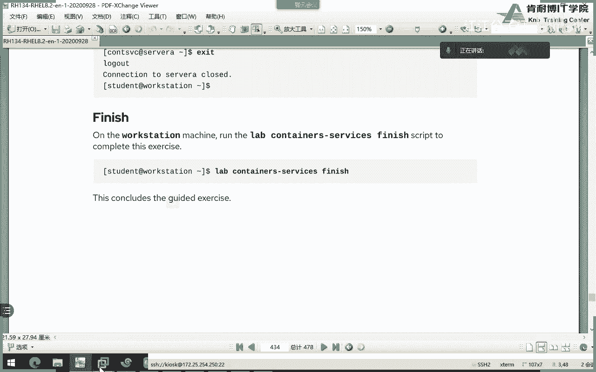

做什么呢，我刚才做错了，把名字写错了，我一直老写web web不行啊，你得写成这样的名字。

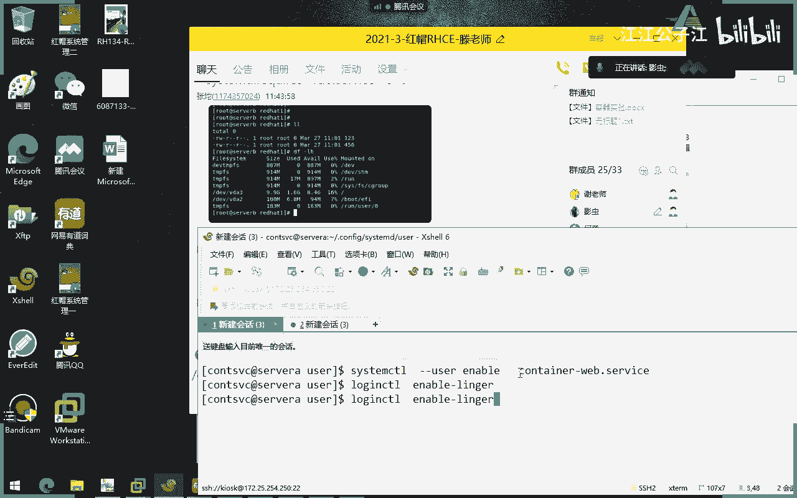

但是问题是你知道这个名字从哪来的吗，你看不就是这个吗，生产出来的这个生成出来的哪个命令生呢，就那个七级人家ap这个命令生成出来的，调出来，哎他没亮，对对对，就这上面15行错了啊，就这个生成结构。

你自己起名字叫web对吧，那它会自动起名字叫content横线web点设备那样，如果叫ftp呢，它就叫contender，横线ftp service，所以你起服务的时候注意。

这时候不能妄加用户名啊啊不能再不能妄加user啊，这样子stop你停止的是这个东西，打个web啊，好吧，就这样好，是整个的这一章的内容知识点，多了不少啊，各位啊不少，好吧，管理员来敲，如果你想了解更多。

请看youtube，我能看吗，我可想看了，嗯，我们中国人民的国情啊，默认情况下开启u的服务，start with the user open force。

哦看当我们第一次开启first session and stop when you b，嗯行吧，结束吧，嗯你在管理的时候就用它来管理了，我再强调一遍，这个不光是可以管理容器以后。

你的所有服务都普通用户来管理了都可以了，怎么做，第一步，在这个用户的项目下面建立一个叫configure的，然后叫systemd的，然后叫不是sd就叫system，然后再叫user的哪个想想想这个这个。

比如说我下次要管理ssh怎么办，首先在某一家某一个家伙加目录下面建立这一串目录，用那个命令生成出来自己的文件就可以了，以后哎我还没明白它这个命令干嘛用呢，刚才说，放下，真机开机的时候。

我们的容器也会起大启动啊，的时候容器也会启动，是cc内容基本上讲完了啊，十分钟，最后我们再来讲一下s04 的端口号就全部讲完了，非常简单啊，s一端口特别简单，行下个星球吧。

好控制s1 linux的端口标签，那么我们在讲s1 linux时候，我们说过每一个标签，每一个文件，每个目录和每个端口上面都会分配一个标签，当时我们是用哪个命令来看呢。

上面的s100 i那个上下文怎么看呢，大z但是今天呢我们来看一下它，它除了可以给文件，其实给端口上也有标签，也有标签，有没有想这个问题，端口是802 22 43 25这些标准性的端口。

它之所以能够访问成功，是因为通对吧，同时还有标签要正确，也就是举个例子，比如说22号端口，它就绑定的是这个标签要先改变了，就算你能ping通2号22号端口，你能聘我都不让你访问，这跟网络通不通没关系啊。

但你要网络都不通，那就更扯淡了对吧，就我网络能通，但是由于你把段号过这个端口上面的标签改了，我依然不让你访问，为啥，因为你发了触犯了s05 x的标签，咱考试就是这一题，他故意给你弄的一个错误的标签。

原来你能够访问的，现在访问不了了，因此下面让你解决，考你就知道，考你就考你如何解决这个问题，那么咱们来先看一下命令好吧，我怎么知道所有的端口号呢，s manager port跟l来看一下，管理员了啊。

退出啊，i s a pgl回车，他就刷屏，那你看这是我们知道的所有端口号后面的标签，举个例子啊，举一个随便举，比如说这个据说这个端口号2615，这个端口号绑定的标签是这个，懂我意思吧，就这么看好。

那我想知道二二端口是什么，那咱们只能用哪个命令对吧啊，20号的话，我的天啊，这个原来2号22号端口绑定的是这个标签，懂了吗，好考试的时候，这个命令你要会的啊，会的啊，好这就是如何查看。

通过grape meaning如何查看啊，那么管理标签呢，刚才只是查看怎么管理呢，s manager poa是添加那d呢，t是什么类型p呢，这个单词的缩写缩写就是要不然tcp，要不然u p后面是端口号。

注意这个小写的p是protocol的单词的缩写，好吧好，那么比如说像咱们下下面这句话，就是我为71这个端口赋予了这种类型的标签，听好这两个要会的，为啥要把这个命令要会的。

因为这个命令是考试就考你这个命令，他就你弄错一个标签，让你用这个命令再给我改回正确的，你说你不会，你怎么考这题，红包七也考过，那么指数红包七当中呢考的是c e的部分，但现在呢cc考了。

把这个题从c e挪到cc了，但难度没有增加，好吧，来咱们来做一下这个题目吧，直接来做，那d是什么意思，刚刚说过remove，除了好，咱们直接来做这个题怎么做，就这个客户习题，各位就这个课后习题。

首先呢用lab命令生成一个实验环境呃，它会自动地搭建一个阿帕奇，注意你你你打这个lab命令会自动打建安帕西，那这样为了让你们了解咱们不用lab命令了，咱们手工阿帕奇，然后我故意的把这个弄错好吧。

因为咱们考试的时候没有lab命令嘛，行吧，咱们咱们模拟一下啊，我我我自己给大家做一个实验啊，嗯咱们就做了，我打个阿帕奇，阿帕奇阿帕奇的软件包叫h t t p d，啊就是咱们不用lab命令了。

配置文件在哪呢，稍等，配置文件在这这这怎么想象，这个这个我写下来，这个是阿帕奇的主配文件，给你们发出来啊，主配文件，按成功截个图吧，主封文件你要编辑，它里面有一个端口号。

listen listen list停，看是不是大于零，对吧，好，是这样的，咱们来试一下，就s manager port，然后干什么，看l看一下八零啊，咱们看一下八零，那么按道理来讲的话。

八零应该是绑定谁呢，八零应该在哪，那这样咱们h t p，没有掉，你看应该是这个端口，8081443等等这些东西都绑定的接口类型是这个好吧，咱们考试有一道题目是这样的，阿帕奇不让你搭建啊，考试不要搭建。

咱们现在是为了模拟考试，他故意的把你这个端口号改成了，不是八里，把对改成了80 28 二，2283无所谓，来了82，那你想象一下，重启服务，他就会报错，就会报错，之后怎么办，他告诉你说还记得这个命令吗。

学过吧，是不是来查看日志啊，你记住在红包七之后的所有日志，只要报错了，他就会告诉你，所以一定要去看，他都说了，请看那个details详细信息，一定要去看，各位一定要去看。

你看它会提示你是s1064 的端口的问题，把你给你，你干嘛拒绝和阻止了，那怎么办呢，他直接告诉你了，请使用这个命令改一下82的类型值，是不是告诉你了，所以这个命令要七根本不用记，直接复制粘贴就出来了啊。

那问题是问题是我这个粘贴完之后，这个位置写成什么，是不是写先类型，我怎么知道不是应该是什么类型，好了吗，也就是说这里面这一行当中有82吗，没也就是说你是不是要把82也绑定到这个标签里面才行对吧。

那怎么绑，就是刚才那个命令把它改成什么，这个过程有点慢啊，有点卡住，不用担心，在重启电脑，考试就考这个题懂了吗，但是考试的时候怎么做，其实只要打这两个命令，第一条命令和这个也就是说阿帕奇给你搭建好了。

错误也帮你搭建好了，咱们刚才是故意自己做错误，懂了吗，这题就没有，但是他考试比较，比较恶心，你知道吗，这个没有完了之后，他会暴露错吗，会当你当你打开这个日志的时候，这句话来给你去掉，同志们。

这句话给你去掉了，我当时就是我我女主嘛，我考试我考没有了，那是怎么也没有那种，各位如果像你发现他们故意给你弄掉弄掉怎么办嘛，怎么能怎么着啊，我想不到办法嘛，对不对，实在不济，你抄你同味了行不行。

让你发现你同事也跟着等你了，你知道吗，那完蛋了啊啊所以注意眼睛慢一下就可以了啊，但是你尽量把它记住，考试的时候，他会故意把这个日志给你删掉，就不让你作弊吧，他故意给你删掉啊，其实这个不真实啊。

就就应该放上去知道吧，因为你要不对于不会的同学，他跟你他也不知道这啥意思对吧，注意这个端口号，要这个端口类型，你不知道的时候，一定要用杠l看一下，其实就是这个跟你找到哪边是八零就行了。

这一行会多一个逗号，82就可以了，因为你的端口号你没有绑定s0 x就会不不会让你通过的一模一样，做课后习题的时候呢，你打这个lab命令，他会帮你做那个阿帕奇和错误的问号，知道吧，你说好。

还有你看人家日志当中告诉你们看看，不能够绑定82号端口权限被拒绝，非常明显，为什么不能绑定两种情况，第一种各位有什么情况不能绑定，除了s linux情况，还有什么情况，学过s0 词，你觉得还有什么情况。

有没有可能八二被占用，然后被占用的这个这个情况太容易发生了对吧，所以说这个也会产生这种情况，当然了，考试肯定不会考试，它为了考你s10 x它其实就在一种情况，就是端口类型不匹配，没有来。

大家把这个题做一下，如果你不想搭建，直接打lab命令，生成本章实验环境，开始做一下吧，啊我把命令交给你们啊，不就这个你先敲一下这个命令啊，之后就打这两条命令就行了，第一步重启阿帕奇错。

然后接着用这条命令看一下http的类型，第三步干嘛，打这条命令去修改三句话，三句话就上来就打第一部阿帕奇重启重启失败，然后发现原来是端口号变成82了，然后打一下这个命令绑定82，当你单打打之前呢。

你又不知道类型值是什么意思，用这个炮杠l看一下类型值。

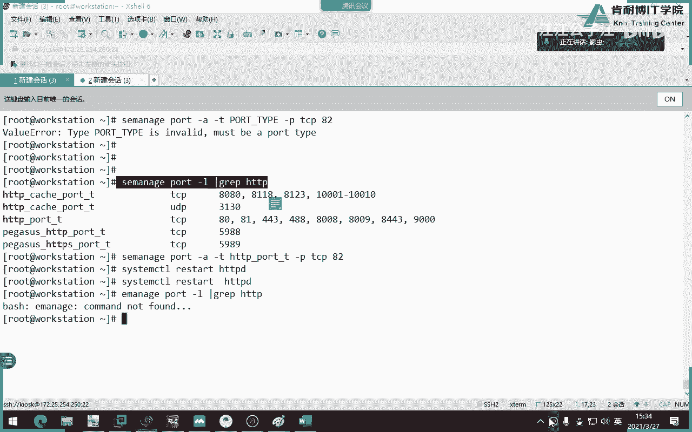