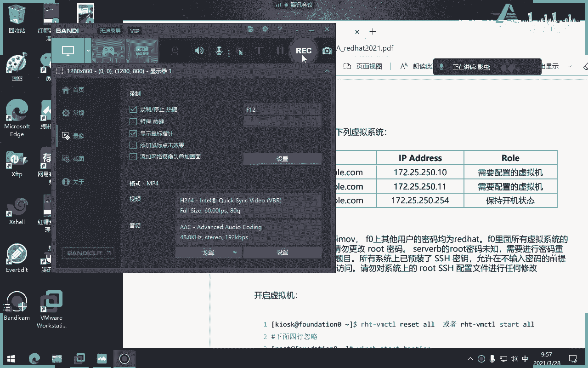
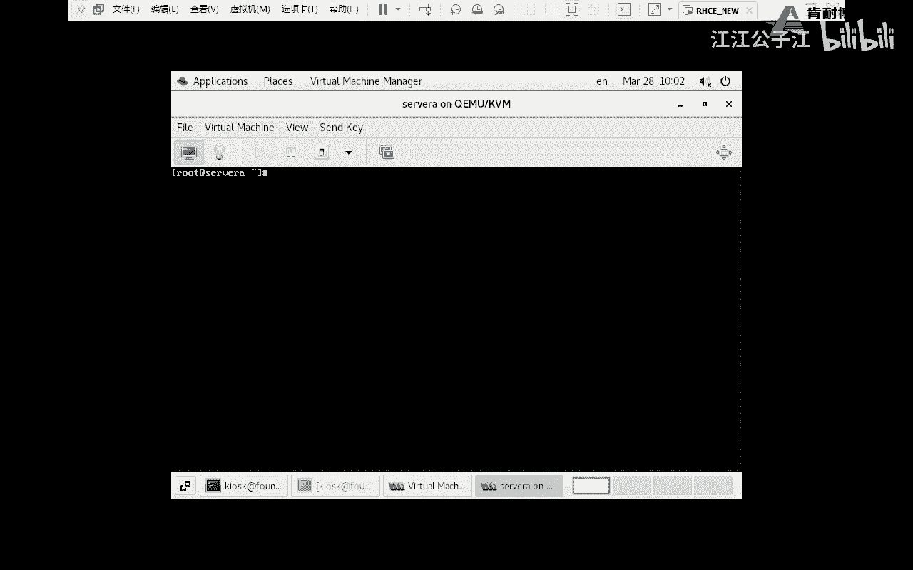
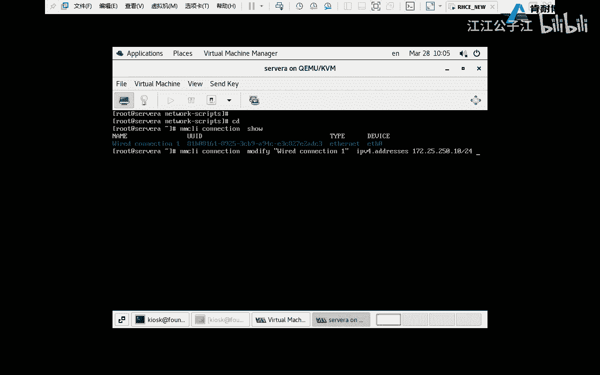
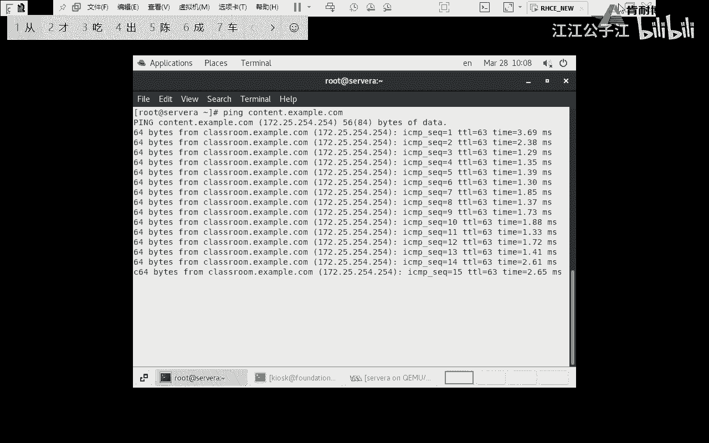
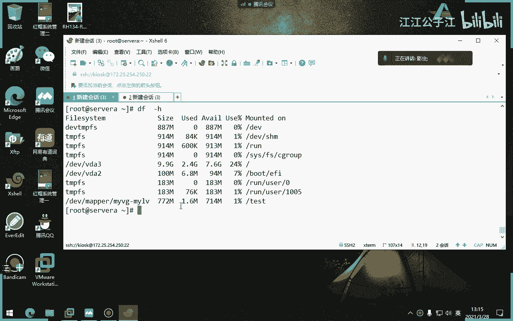

# 红帽认证系统工程师RHCE8-滕老师出品 - P15：第八天 RHCSA总复习 - KNBIT认证中心 - BV1up4y1h7MA

为了能够这个讲解咱们的这个复习题，那么咱们呢需要用到三个机器和这个boston，当了boston保持开机，是不是还要把classroom也保持开机啊对吧，他就应该这边少写一个classroom。

那么class里面扮演着我们的亚比别人dnf tp web服务器，还有路由的一些事情，都是在class当中去扮演，所以说你其实真正要操作的survey和server b，当然了。

我们一开机是不是set up那个那个那个那个那个box set off对吧，二的话就就几乎把所有虚就所有虚拟机都开了，所以你不用去关心a b这些东西了啊，都开机就可以了好吧。

所以我们用一个命令就or就可以了啊，那么reset也好，或者for set也好，out一下就行了啊，那么其他的呢，今天他告诉我们只开了这三个，其实我我也我建议大家所有都开，那么只有虚拟机的。

这个只有征集当中是有什么图形界面的，其他都没有图形，而且咱们是通过什么图形界面的一个小工具来开关的，就是你桌面上会有一排的按钮，你按哎机器就开了，懂我意思吗，不是用那个不是用这个命令，各位没有这个命令。

你别习惯了，上来打这个命令，这个命令是跟我们考试环境相关的啊，这个跟我们培训环境相关的，不会跟考试环境关系好，那么这些用户的密码大家都知道了吧，咱们天天用啊，不是red hat吗。

red head嘛对吧，但是考试不是red head啊，各位好吧，那么请看前面几题呢，他说在server a当中操作有几题，第一题，第二题，第三题，第四题。

也也就是说一直到第15题是我们seva当中的题目，所以你看题的时候也要注意，比如说他说system一当中会要做这么多题，15题懂了吧，那么下面的几题都是在哪s2 b当中去做，听懂了吗，题目没有那么多。

是因为他把答案写上去，所以显得很多好吧，题目没有那么多，那么考试的时候要看清楚，先做第一题啊，先做第一台电脑的所有题目再做第二台，千万不要跳着做啊，你千千万万不要跳着做啊。

不要说唉我这个题做一下server a的，在做server b的啊，这样你这个自己做着做着就做，你就我晕了我晕了啊行吧，我们来看一下这个题目。

咱们从第一题开始讲起，在你们上课之前，我已经把虚拟机全部是set了啊。

这个窗口有点小，我就直接远程登录了，我用了我那个叉烧去登录进去。

我每次上课不也是用它吗。

还有你会发现一些比较好玩的一些学生吗，上课的时候挺好的，一考试时什么命令不敢打，打完之后就问老师，我在重启里面，刚才敲的还在吗啊他比如说他问我老师，我建了一个用户，但我现在重启，你不是说考完试要重启吗。

重启之后在用户还在吗，我你要是问这个问题的话，你就不用去考试了，你觉得还在吗，当然在了，是不是你你这个你这对吧，那个脑子怎么想的好，那么我来看一下我的迅捷是不是都打开了，当然这个命令考试没有啊。

不需要用这个命令，我只是给大家验证一下当前考试的机器都已经开了，还有考试的时候没有workstation啊，啊有tedity更没有好吧，这些机器都是考官给你负责任搭建，也就到时候咱们的什么友情啊。

classroom boston其实都是考官那边的机器，咱们这边是没有的啊，为了能够模拟考官，所以才有了classroom，懂我意思吧。

好那么这样子咱们这样子假设c server a是你到时候考试要做的，第一台虚拟机里面的15题，samb是里面要做的，后面那几题可以吧，第一台和第二台咱们就这么这个规定好了啊。

那么很显然我现在呢我们为了能够比较的真实的这个模拟考试，我们现在是不是不应该用ssh去登录设备去做假设考试的话，我们现在server肯定没有地址吧。

所以为了比较真实，我们现在用这个窗口界面先登录了sv a怎么动呢，咱们这边窗口界面是不是得打这个命令才有这个界面。

好吧，我现在动的稍微对吧，这样才会比较真实嘛，那么密码是什么呢，考试时候server的密码会告诉你。

所以你仔细看题目，题目没有让你破解a的密码，所以说题目会把a的第一台虚拟机的管理员密码会直接富裕给你，看到吗，会直接给你啊，理解理解吧，会直接给你的好，那我们就从第一题开始做起。

你看假设我们的root密码是red hat，假设啊，但肯定不是考试的时候啊。

好那么比较真实的场景呢，我们应该这么做，先登录到sa，这密码呢是red head啊，比如说密码是123，你就登123，red head，你就进一下red head好。

那么第一题要干嘛呢，他说第一题是不是要做一些东西，比如说阿b地址，磁王源马莫关dns 4主机名对吧，那我们先从第一个开始做，我们知道主机名是在哪配啊。

你永远记住考试里面只要出现这两个字的都是什么永久配置，它不可能是临时配置吧，所以一定注意咱们的主机名啊。

主机名有n种办法做，随便你啊，还有我更加真实的模拟考试是没有vm的，所以我用vr好吧，那么为什么现在不能装呢，因为你亚美元还没有做吧，咱们咱们没有做亚美元，现在啊当然咱们现在环境是做好了，没有做亚美元。

所以咱们没有办法去装那个vm，所以我们现在就用vr来模拟一下，我们知道主机名是不是在这个文件里面，host name，ok那就写进去就行了好啪把这一行写进去就行了好吧，我这张单这边已经写好了。

好写进去之后干嘛没了，就这题满分啊好吧，当然了，我们知道零食是不是可以再设置一下，因为你因为你不临时设置的话，你当前这个位置是不是还是没有名字的对吧，设置完之后把这个窗户关了，把窗户关了再开。

你会发现就变成上面a那个懂了吗，好第一句过了非常简单啊，你如果想用别的命令可以，但是保证永久，只要给我永久就行了，那我觉得这个是不是简单一些，直接打开vr编辑器，对啊，这种方式前量好。

第二题配置i p地址，我们这i p地址要配的时候，你不要先看一下有没有地址，肯定到时候考试没有地址，注意到考试的时候1t指令，这个地位置肯定是没有地址的，不用纠结啊，不用纠结，那没有地址的话。

咱们要去配怎么配呢，你有两种办法，第一种呢你自己去写配置文件啊，爬到这个位置自己去写配什么眼，但这种对我们来讲的话难度太大了啊，这里面内容全是空的，全我我我我当时就想用这个配的。

你会发现红包七下面都是有的，但红包八考试这边是全空的，我当时就愣住了，第一题我就愣住了啊，第一题我就很紧张，发现里面居然是空的，我就没想到是空的，那怎么办，那干脆算了吧，但我隔壁那个老师很牛逼。

他写下来了，看他们会咳行吧，看起嗨起来了，那咱们是不是只能这个样子了，那我们知道打之前你要先说一下，为什么你是不是得知道我当前的主机名，不是我当前那个device名是啥，对吧，你不知道device名。

你怎么知道给哪个真实的王海明的配呢，对吧，t01 t是零才真实的，而左边这边呢是不是连接名对吧好，你来看这一题，题目说是请为这个电脑配置一个ip地址，那我们是用哪个命令呢，是用add呢，还是用修改呢。

修改吧，你要用a d d的话，就相当于我又新建一个连接名了，对吧好，那既然修改的话，我为谁修改，是不是为你这个连接名修改左边那个连接名修改，就屏幕这么暗，我做完这一题，我就远程登录啊，我是不是要用。

我是不是要用左边连接名来来来去修改，那么如果是左边连接名来修改的话，大家有没有想过这边有空格，你得加引号，不加双引号对吧，然后是i p v4 嘛啊，addresses嘛，地址多少，1200。25。

250。10杠24位，他又要求我们有什么地址自爆源码和网关和dns。

那好吧，那我们就做呗，继续，ipv 4，啊不用直接写盖的位，盖瑞写不了，不然我补全我家这位是哪个地址，ipv 4，先写类型吧，好改为直接侧边写改为四啊，然后是多少，1720250250。254对吧啊。

然后注意后面i p v4 手工方式m a a u a l，然后继续连接，自动连接可以打开dns，我不在这儿配好dns，我在这配restore。com文件，ie这个什么来着，r e s o l v对吧。

配回车，直接想要一句话，哪句话，name server，我这单都删了啊，里面都写好了，我删了，故意给大家演示一下，name server。

就是一七二点二五点多少网，250。254250点。

保存退出就行了，重启网卡，当然网卡我们就没法重启了，别用这个命令up一下，up谁呢，up不他呀，如果还不行，重启电脑，我当时就是重启电脑，就是如果你up把发发发发现if compaper还是没有地址。

把电脑重启就行了，明白吗，这就有了好。

有了之后我们是不是可以远程登录了，好我来模拟一下怎么远程登录，把这个窗口关了，然后我们就用真机来远程登录了，比如说172。25。250。10，这不就进来了吗，当然了，他会让你输入密码的啊，就进来了。

明白了吗，这样做不就ok了吗，你这样到时候你窗口就不用，那么就不用这么不用这么多的这样的小窗口了吧，会了吗，还有个问题啊，好做完之后你怎么知道做成功了，我们拼一下。

到时候会给你一个这个应该是考官的服务器的地址，或者是这个他的一些就是你去注意啊，就算没有给你考官的地址，你知道你骗谁吗，也不用拼网关，关网关肯定通，你不能聘那个谁来着，那个亚美园的地址吗。

亚美原地址他不会是，他不会告诉你ip地址，他肯定告诉你域名吧，那你如果配配域名的话不也行吗，我这么讲能理解吧，你想想肯定这个亚美元是考官呀，样品肯定是考官啊，因为咱整个教室当中就他是亚员。

他他肯定考官啊，就你推也能推算出来吧，他不会告诉你这个content。example数据考官，但他会告诉你什么，你直接做这题不就行了吗。

就你直接做亚名这些题，你看你直接拼这个地址，这个地址肯定是考官，你拼一下，但是高考考试不是这个，你到时候拼一下，如果能通，不也就代表第一个dns通，第二个阿根廷也通吗，理解了吗，我就很很纳闷。

有些同学说的话，我到底聘什么呢，我做完了，我聘谁呢，聘考官呀，那考官底是多少，他不会告诉你，不会告诉你，就猜你猜也知道，肯定是亚美元的地址，好吧好，这个时候我们可以干嘛，远程登录了好吧。

我现在就远程登录进去了好那这时候我就可以装包了，那大家还不能装吗，我还没有说价美元呢，好这题结束了，第一题结束了啊，第二题配置价没有，这个答案不用看，不用看，因为你看这个答案没写好啊，不用看。

而且你看这是网卡名的对吧，而且为什么要a add呢，不用a d d吧，我为什么要a d d对吧，直接修改不行了吗，这不这个答案不要去看，知道吧，不要看答案啊，好第二题，配置亚美亚美，那么亚美元的话。

注意这一步是我建议大家做的，我上节课我说过了，这一步，建议大家做进来，甭管有没有全部干掉，也就是说etc这个里面的东西全部干掉，全部把它删掉，删掉删掉之后，咱们是不是新建一个，比如说a b c。

ipo文件，只要结尾是i e p u就可以，一定要注意一定是i p u，那么里面怎么写，照着人家考完给你的地址写的好，怎么写，基本上是这样的，第一个是它的仓库名对吧，把路径u r l路径啊。

别拼错了对吧，l g b t等于零，然后再做一遍对吧，比如b再做一遍b u i l就行了啊，一堆来继续下一个等于零，一定要注意，就等于零啊，就结束了，当然我们知道u2 路径是不是考官给你路径就是谁啊。

就咱们在这题当中是不是就他们俩对吧，说两遍就行了，就这么简单好吧，当然了，你别做，注意我们到时候自己练的同学压名不要做了，帮你配置好了，主题名阿p里的那题也做好了，不用做了，明白吗。

你看咱们给你的环境不是经做好了对啊，你不说话，你怎么远程登陆了对吧，而且你看在哪呢，不是那个a b c啊，我把它删掉，咱们真正的环境里面给你做好的是这个，你看是不是指向了谁，是不指向这个地址。

都指向这个地址已经帮你做好了，说白了这个地址是谁，你知道吗，这个content classroom比咱们classroom好，关于亚美亚和第一题，大家是什么意外，就说这这种东西都不算是考题。

各位这就不应该是说你不会的东西，这是你考试钱要做一些环境，这两题你都不用不会做，或者你做不出来，你后面题就不用做，你做也是挂，不用浪费时间，把时间都浪费在这个地方，这两题如果做不出来。

你后面就不用直接开门回家就行了，你你你你你说你不做假美元，你后面你怎么装包对吧，你你不装包，你怎么聘，你怎么聘考官，考官怎么给你收拾卷，你后面题你就直接领会回答一下好吧，这就是这就不应该是题题目。

这就是基础啊，这个我就不再解释了，这个不会自己翻书啊，下下面的题把不重要的咱们就快速讲好，第三题s应用的调试，首先呢考试的时候就是我们昨天讲的，他会给你配置一个错误的带有错误端号的28号端口的。

不是错误啊，就是非八零端口的一个阿帕奇，他给你配好了啊，然后你会发现呢在这个目录下面它就会有一个index文件哎，也给你配好，但是你会发现呢这个应该是个文件里面的上下文类型不一样，所以第一个你要做的。

第二你一旦重启项目服务，你一旦重启我们的阿帕奇会报错，还记得为什么会报错吧，因为你的端口号已经不是八零，是82了，那我们现在要解决的就是如何让我们的阿帕奇能提起来，是不是把我们的82号端口的那个类型值。

要改成跟80端口类型值一样，第二个要做的第三题要做的就是你一定要确保你的电脑了，s0 x是inforcing状态，所以这题啊应该先从第三题开始做起，先把你电脑变成false。

因为如果不把不把你电脑变成false，你只要重启服务器，你会发现它居然能成功重启，那要能成功重启，我们考什么考，对不对，就不用考试了，他就让你重启不成功吗，所以你第一题应该先做inforce。

把我们电脑先变成po，然后你发现哦一重启发现失败了，为啥，因为你现在是80号82号端口了，因为你的类型值不是那个了对吧，然后你再说再做82号端口。

流行值和v r3 w html里面的上下文类型是听懂了吗，所以你应该先这么做好，那为了演是咱们的考试，咱们自己搭建阿帕奇，你看他怎么搭建了，对吧啊，咱们搭建一下好，等一下啊，考试不要做啊，这都不要做。

我现在做的东西都不要做啊，这是咱们为了自己演示，如果大家回家同学不会做，就打昨天那个那一章的lab mei，还记得吗，就有一个lab 0点，他会帮你自动做这个什么82号端口，对吧嗯，这是阿帕奇的配。

这是阿帕奇的配置文件啊，这都不用说，你如果不会的话，待会你自己看笔记就行了，把里面八零改成八二啊，这些都是考试给你改好了，然后我们第一步要做什么呢，现在现在现在要做这样一件事啊。

它会模拟一个已经存在的一个目录，叫做v r3 w html，这个目录呢只要注意这个目录不要建，只要你装好阿帕奇，这个目录会自动生成，但是你只要跑到这个目录下面建立一个这个东西，这是什么东西，大家知道吗。

这是我们的网页，怎么网页啊，好那么我们来爬到这个目录下，你看它会自动生成这个目录，看了吗，不是我建立了自动就有了，但是这一步要做，我们要自己建个英带组文件，比如说里面想象一句话叫做哈哈哈对吧。

然后写上一句话，写完之后停到这儿为止，都不是你做的考试好吧，都不需要做都不需要做啊，那接下来下面就是我们开始要做的，首先第一步要编辑，注意我现在还是vr啊，我没有vm啊，我现在还要编辑哪个文件呢。

s1 linux文件要把我们的电脑的s1 linux这一行变成永bo明白吗，当然了，在咱们已经配好了考试是什么，permissive，永远记住考试，permissive，咱把它变成inforce。

这是第一步，第二步是不是把它临时也变一下几，请一啊，然后再看一下就行了，好这这题这这步咱们要做的啊，咱们要做的第一步，第二步咱们是不是要重启阿帕奇了对吧，这一波要重启一下，你会发现重启失败对吧。

重启失败了，你看日x e他告诉你请看details信息好，你会发现他告诉你有一行怎么怎么错误对吧，哎今天很好，没有告诉我，考试也不会告诉你，唉考试也不会告诉我，就这样的考试就这个样子。

不会告诉你是什么原因，所以你看也不看，但我们现在知道了是什么原因，是由于我们用s manager port杠l先列出一下，我只看一下阿帕奇是不是应该是这个端端端这个标签啊对吧。

而这个标签里面是不是默认情况下没有82，所以才造成起不来，也就相当于我要把82加入到这个标签里面吧，那怎么加呢，is manager 5000 po，不知道不知道不卖，比如我假设我就考试。

不知道不知道看没来，会看吗，如果大家考试的时候不会使用卖手册页的，或者不会使用看help的，你考试也是通过不了，除非你能一字不落的把所有命令都记住，你一定要学会看卖手册页。

这是一个作为linux系统管理员的一个基本素质，就跟你要去工厂里做那种工工作一样，你要不会看图纸，那你做什么做明白吗，这是一个最基本的素质啊，哪个咱们要干嘛。

你先首先告诉我咱们是不是为了把82的端口号改成这个标签，那很显标签嘛，肯定是类型嘛，对不对，类型吧，而且你看发现他后面还有个p ptop对吧，最后才是一个断口号或者是断号rage是什么意思范围。

但很显然我们现在是82不是个范围，那很显然就是抛name就行了，所以说整个的结构结构是怎么样的，不就是杠a吗，杠t吗，对吧，问题是gt后面加什么类型，什么类型，你刚刚看过了哪种类型，就是这种类型吗。

我怎么看呢，不就是用s manager pd和l来看的吗，好你把它复制过来就行了，懂了吧，就是你现在就得学会这些命令，你们复习的时候不要直接看答案去背，你要学会这种分析好吧。

然后后面呢我忘了我忘了再开哦，我忘了吗对吧，我再看我，我已经说到这了啊，说到这，那很显然加加一什么p了吧，好加p p是什么意思，protocol啊，不是端口号。

那我们知道端午号t是协议的四协议有两种t cp和乐理p，我们应该是那种肯定是tcp啊，对不对，后面加什么，不知道，忘了忘了再开，忘了忘了对，忘了怎么办，再看那个叫什么了，pot了吧啊pot，那怎么加呢。

其实不就是这句话吗对吧，那咱们加一个pot看看行不行啊，是不是这样的，是82吧，还是这样吗，呃那个直接82吗，啊对port name pm卖不是port port name，82就行了。

那没了就冲你成功了，这题没讲完啊，还没做完，这题过做一半了，还有第三步，他说这个目录下面有一个index文件，你会发现这个index文件，同志们，他故意给你改错，他故意改错，怎么看。

怎么看一个文件类型值i os杠大写的z v r3 w html，现在是对的，现在是对的，是这个，但考试的时候肯定不是这个不是这个啊，各位不是这个，那怎么办，改就行了，改成这个，给谁敢给这个家伙改。

如果说你发现这个上面这都不对呢，那给谁给了，如果连个目录都不对呢，连那个v r3 w这个目录都不是这个类型值，应该怎么办，是不是给那个目录改，跟目录改的同时，然后再改嘛，递归下去不就行了吗，听懂了吗。

就灵活点，就是你得看清楚是目录不对还是文件不对，这个我忘了，我忘了啊，因为他题目当中也没写，我也忘了，我考了好多年了忘了，反正你看一下是目录不对还是文件不对，所以说我教大家，你也别看了。

直接这条命令不就搞定了吗，甭管对不对，我都改了吧，是这意思吧，能跟能听懂吗，好这一题讲完了，你说这种题目你怎么能扣分，你知道吧，你总总能扣分，除非你不会，你只要会他就不可能扣分，而且前半部分是不要做的。

这半部分准备工作不要做考试，考官给你的，你看吧，就这么简单删了，你做完之后浏览一下82啊，由于你由于你变成了82，所以你要冒号82，大家其实不用看，你只要能够起来，阿帕奇，我敢保证这题你绝对是满分。

你想想你连82都起不来，肯定那个断号没改成功吧，对吧好，这边有什么问题吗，这题是原来红包七版本的叫c考题，现在变成了红毛八的cc考题，有啥难度没难度好吧，你得知道是为什么才行，那么我们回顾一下。

其实这个命令不就是先是sn p杠l先看一下嘛，然后再用这个命令把它添加就行了啊，是u p dcp自己判断的好，接下来的题目就是经典的老题目了啊，我当年考红帽五的时候，这几题都这这后面这几题都存在。

到现在一点都没变，我10年考的，现在都已经21年了，多少年了，这个题没变，一点变化都没有，来坐一下，不看不看不看那个答案啊，首先建立一个admin的组。

那是不是命令叫group admin of a d d r的，面，对吧对吧，简单的我就快速讲了，那么首先我建立一个组g r o u p a d d，没问题吧，第二建立一个heavy用户。

使得这个用户的附加组是admin，怎么做，建个用户怎么建附加组织，那个上下什么，不需要a啊，为什么要加a啊，不用啊，我又没加多个附加组，为什么要加a呢，现在写什么。

这些署名永远记住这个usa add和union的语法格式，都是中间写选项，最后才写用户名，好吧，第二建立一个密建，建建立一个呢，它是用户啊，那他是用户使，当他的附加组是admiss。

是不是只要把它换成什么，那他啥好，建立一个，后面是a等于alex是吧，现在这个用户使得它不可以交互登录系统，不可以登录系统是s s b下面的no logal，后面三个人的密码都是red hat。

我不敲了，结束第五题是是做一个净化任务，不过他要为谁做这个家伙做，所以你不能上来就quantb杠一是吧，同志们，你是不是要corontap杠u指定他在杠e对吧，没五分钟执行一下大哎，这个题目变了吗。

以前不是没五分钟啊啊就算没分钟，你也得会啊，以前考试是这一题，现在变了，可能变就变吧，变你也得会，我不敲了，这个会吧，扩张tp杠一指定用户杠g，那么中间是分十日月周，如果真的变了的。

题目是每五分钟是不是应该在五分钟的位置这样写，星号斜线五，对不对，然后后面输出eo，hello，听懂我意思吗，这题有疑问吗，别忘了说你杠u啊，u别上来就杠一，你杠e的话再提一分不给。

因为你用管理员来做了，咱们说是用carry用户来做啊，这题我就不敲了，那他这么写可能就是由于拿不准是哪一个题，所以他都做了，我记得是下面这个题，没有从来没有考过，没五分钟的，可能是诶。

就算这个变你得会吧，这个你说你要不会，你可惜啊，这个题真送分题啊，不不要因为他题目变了，你就不会啊，分时蕊周能被清，没能背清楚吧，啊横线代表连续的，逗号代表不连续的这样斜线代表什么美格的对吧。

每隔五分钟这样子啊，前五题都比较简单，继续第六题，这个题目有点难，不要看它有点难，来咱们把题背一看一下，仔细看有点难度最低，红帽的考试有一点情况，同志们，你要非常清晰它每一句话的考点。

红包考试都是描述性的，他不会告诉你，请使用group add给我建一个组，那就不是考试对吧，他每一句话都是轻描淡写一句话，但你要抓住每个字的重点，你比如说第二第二关是什么，你比如说最后一个三是什么意思。

此目录下面创建的文件，其组的所有全自动设置为advance组，这句话还考你什么，很多人说考递归，那么这一题就是错的啊，因为其他班上同学也说，也说考低轨，你来看当时当中有一个非常重要的一句话，自动。

对sd，那如果你用它如果不加自动的话，你用递归可以吗，可以可以可以，但它加自动了，你就不能用递归了，什么叫低，什么叫自动，就是你只要往这个home下面的特色里面建立任何文件，它会自动的去自设置的。

那如果你用递归的话，它能自动吗，你是不是得每一次手工杠按一下再杠一下对吧，那就不是自动了，所以这一题考你的是s g r d，那我问大家s e r d数字是几啊，懂了吗，好我们来分析一下这个题目怎么做。

首先我建立建立一个用户，他的所属主要是admiss，这个题目会吧，是不是趁着gr p这个单词，或者是趁着on的冒号吧，对吧好，那我们我们我们来边说边做啊，user mamamimic。

第二后面下面的to，还有这样的文件，别拼错了啊，啊穿着这样p，然后这个这个这个组是不是我们干了线的好，这样一旦做完之后，他的拥有人是谁，是root用户，手机变成了对吧，同学们好，那么我们看他说啊。

这个目录被这个组能够读写执行对吧，读写之间加起来是几七，那我此时此刻是几同志们，这个组，五八好，那如果说是读写执行，是不是从五变成七好，那你现在是如果变成七的话，现在就几了775了吧，再继续。

但是除了管理员之外，其他人没有任何权限，那是不是要把后面那个五变成几零，因此就是770，而且最后一句话，他说在这个目录下面，所属权会自动继承admin组，你们刚才都告诉我了。

说s g d s d是数字几，那最后的结果一条命令就搞定了吗，2770，这样不就满分了吗，这把我打错了，明明2770，你不用像我这么做，因为我对这个题很熟了啊，我以为这个题我讲了11年了，我很熟。

如果你不熟，你就一步一步去做，怎么做圈之后的这个呃呃g加那个w，然后再乘之后的o减去r和x，然后再乘之后的g加s不就你你老老实实做呗，我这因为我我讲太多遍了，所以我直接告诉大家。

直接这题这题是不是两条三条命令搞定，第一个先不做，第二个改拥有第三个27708回车完事，但如果分布来做的话，是不是好多命令行吧，但你别学我啊，你就老老实实这么做啊，因为题目有可能变吗，有啊。

比如今天考的s e d，那如果考的不是s i d呢，如果考的是t权限的，但不可能考s u r d，这个我可以保证绝对不可能考，考s u r d s r d没法考啊。

那没有必要考s u r d s e r d是肯定考的，他这个这个这个这个呃怎么说呢，它比较能够判分数啊，好这题有疑问吗，你看这题很难啊，这三步这题真的很难啊，应该是从第一题到现在为止比较难得到题目。

因为很多同学在这最后一步如果不讲考题，可以讲，好多同学是用大写的r递归，因为递归你看不出来效果啊，因为递归你看不出错了，是啊确实下面哎建个文件自动记成了，你绝对会以为做对了，就算你测试，你也不会测试。

因为你不会测两遍，什么叫不会测两遍，如果你再建立一个文件的时候，它会继承吗，对吧，同学们用杠大写的r的话，是你每次向计算力再敲一遍大写的，但这种方式只要你往现在，只要我随便往里面建一个文件。

来建一个这个你考试的时候测试一下啊，不要我们做完了，我不知道对不对，我跑到的目录里面随便陷入文件，这个文件你会看到里面的用人用组就变了，一定会变的啊，不是用人组就变了，用人不会变了对吧，这样就满分了。

我建议你再测试一下啊，各位我建议你测试一下啊，注意考试的时候除了考试之外的所有命令都不会扣分，因为我现在建一个文件会扣分吗，当然不会扣分，不会扣分啊，放心了，过第七题，咱们考试挺有意思。

突然间来的特别难了，紧接着给你一个特别简单的题，你看那么多没啥，他说说啥问题干嘛呢，同学们，这题不是让你跟那个考官同步时间嘛，对吧好，我们知道红包八当中请注意了，同学们没有nt p服务了。

但咱们用哪个用那个叫c是r o n y，我也不知道他这个他这个英文怎么读啊，用这个服务了，那么这个服务你只要打开浏览器，只要用vr编辑器打开就行了，哎我们现在是不是可以装vr m了，因为亚美做了吧。

好我们就可以装vm了，好吧，咱们比如说已经装好了，那这个时候就可以直接去打开这个家伙了，里面找到哪几行了，比如把它删了，这里面帮我填好了，各位已经填好了，比如说我们把它删了好，随便找一好打开。

然后改一下就行了吗，你看这有模板改到谁，他不是说了吗，变成他是吧，好没了，这题哎呦，卧槽干嘛了，结束了，这局结束了，然后保存中就可以了，然后重启一下服务，因为你改了吗，所以要重启服务吗，这题满分明白吗。

好还有一种做法呢，你会看到其他机构老师说，请把这些都删了，其实你说你删了跟其他加井号有什么区别呢，不用删了，而且你要删的话，你是不是这些单词都是自个儿拼，这个server是自个儿拼的。

最后这个单词也是自个儿拼的对吧，你为什么要删呢，咱们对吧，删除一个当模板不就行了吗，这题满分过了吧，啊同步啊同步，但其实大家知道吗，在真实的环境啊，同步时间这个操作你看着这么简单，其实是很重要的。

尤其是咱们做集群的时候啊，时间如果不一致会发生一些，比如说同步不了这些文件系统，或者是同步不了数据，所以时间服务器是很重要的，虽然咱考试这么简单，而且你会发现考试没有考，你怎么去搭建时间服务器吧。

那只是我作为客户端同步你，但作为考官来讲，他得把这个时时间服务器自己搭建好，那么怎么搭建，不作为咱们生意的讲课内容，但我还是建议大家呢回家就百度1下谷歌一下，看一下怎么搭建时时间服务器。

你们回家之后找两台机器这样试验一下好吧，因为比较有用比较有用啊，各位你看第六题简单，第七题极其极其简单，第八题突然简单，最难那道题目自动挂载了，自动挂载，为什么难呢，真不是配置难，昨天就两个配置文件吧。

master那个还记得吧，不难难的是，很多同学连题都读不懂，这是比较糟糕的啊，这题是我当年考试的题目，但是变化了一些，只能说雷同，但千变万化不离其宗，还是这个鸟样子啊，我们来读一下题。

你看他又在server b当中，哎serb是谁，不是通过那台了，serb当中通过n m s供养出一个r home目录，那我们读到这儿，你是不是能得到一个信息，serb是不是扮演n m s路线。

懂我意思吧，考试肯定是考官做好了，nfs服务器帮我们共享，我昨天上课已经讲过了，nfs不是咱们红帽八的内容的课程，所以他不会考你怎么搭建nm s会考你是吧，自己做个nm半藏对吧，好。

他说b共享出一个叫阿home目录，那么我问大家，就咱们昨天学过的知识点，你你读到这儿，你能搭建出来n m s吗，你得能嘛对吧，就算他不考试，你回家自己做这个题，你是不是得自己会当n m s对吧。

因为咱们环境模拟吗，好那我们现在读到这儿，咱停下来，咱们就搭进去好，停一下，咱们现在退回到sb，我们去搭建一下n m s，我们知道n m s第一步干嘛，转报报名叫什么，还记得不知道不知道你的信号对吧。

不知道吧对吧，咱们咱们就信号，对不对，好账号其实拼号不行，应该是这这样的信号，就是这个u t r l是吧对吧，好装好了，那么首先我们要建立一个什么目录，目名叫什么啊，好好那咱们就先千万别进。

千万别给我建成home了，各位啊，现成home就完蛋了，好这个时候呢注意此文件中包含了v step用户零玉佩的家目录，啥意思呢，同学们是这样的，这说的扯远了，windows的玉环境大家用过吗，听过吗。

哎那玉环境是windows的，那linux的有一个叫l d a p的，就是玉环境，懂了吗，这个意思i d被翻译成中文叫轻量级目录服务，说白了a d活动目录其实底层用的就是这东西，就是这个协议啊。

就是这个类似的啊，那么这个这个名称叫目录服务，那么也就是说咱们r home这个目录下面，r home这个目录下面，有一堆的这个这个这个这个这个这个这个这个预用户，咱们咱们这么说预用户吧，好吧。

这样大家能够理解其中有一个用户呢叫零，而且呢他把这个用户的这个这个零，这家伙的家目录保存到了这个r后面下面，所以说我们这这这句话的言外之意，就是五nm把l d e p u的零的加密录放在了r home。

并且共享出去了，听懂了吗，不能理解吧，就是那个用户的家目录放到了二home上面，给大家共享出去了，这样讲能理解吧，好接着预设用户lda p u的加目录。

应该自动挂载到你本地的r home的l d e p u t目录，啥意思，同学们，什么叫自动，自动是哪个是哪个，是不是auto fs，对吧好，那你告诉我这个挂来点是谁，你得先读懂题吗，同志们过来脸是谁。

本地的r l d p吧，那我们是不是可以这么理解啊，n f s的r home下面l d p挂到你本地的r home下面l d p是不是啊，其实这样出题对你来讲是好事，为啥就算你分不清哪个是挂在那。

哪个是远程目录，反正两个都一样吧，对不对，好，那我们看是不是两极管来点一个叫r home，是第一集是l d a t九点吧，我们昨天讲过自动过来是不是要要求两级硬度，那nfs如果写的话，应该怎么写。

应该是不是选择server b冒号r home下面的l d p挂载到我们本地的r home，下面的l d p如果要写成mt命令，是不是应该这么大，对不对，好接着你看你看他都告诉你们，看到他都告诉你了。

预设的这个ldp u的加速度其实就在他身上看到吗，这就是我们希望做什么，各位咱们是不是要做自动挂载，把这一串放到哪儿，不到本地的他们家身上，就这一期吗，你看了吗，不拉巴巴说的那么一堆，就这还最后别忘了。

多谢读，写的话我们就要加那个横线r w行了，还记得吗，昨天啊好，那这题怎么做，嗯来吧，咱们试验一下啊，各位因为其实在正式的考试环境呢，咱们考官会给你搭建一个l d a p a d服务器。

那咱们现在不用搭建，咱们就用命令形式模拟的，怎么模拟呢，咱们自己去创建一个r home下面l d p好吧，就这样去模拟模拟不是真实的，各位好，我们来模拟一下，那怎么模拟了，各位怎么这么搞。

就照他这个数啊，嗯来模拟一下，再搜索b啊，sb身上啊，这样子啊啊home下面的，好模拟完之后呢，他为什么要给他权限呢，是因为他想有一些读写的权限，因为你这时候待会要读写嘛，所以他给他一个权限啊。

其实给位置就行，我觉得我想要不要给他，嗯其实我觉得不给也行，那算了，咱不给了，因为咱们只是为了能够挂载就行，接着我是不是要给他共享出去，这个不要做啊，考试不要做啊，这我模拟共享怎么写，最左边写什么。

最左边是不是你要共享的目录，对吧啊啊后面咱们简单一些啊，就这么写啊，后面l d a p u。零，随便来个清号吧，这样咱们为了简单啊，好这样就行了，好重启服务，然后呢重启服是什么图。

然后呢然后呢很好啊很好非常好好，然后呢咱们把防火墙关了啊，因为他这边做防火墙，咱们不做了，为了简单，咱们把防火墙关闭，听懂了吗，关闭为了简单，咱们关闭啊。

好这时候b是不是不是咱们来做的考试是不是还是做a啊，那那a的话，同学们，咱们就咱们应该干嘛，a是不是要做自动挂载了，那自动挂载第一步应该干嘛啊，包包包叫什么，对吧，这是要装包的吧对吧。

装包也就是现在此时此刻我做的才是我们真实真实考试要做的步骤啊，好第二步干嘛永远记住装包，装完包之后干嘛，你那把千万别忘了啊，省得你会忘。

所以我们现在先赢那把e n a b b l e ok不用restart，为啥，因为还没做呢，对吧好，咱们想象一下昨天讲过自动挂载的时候，是不是有俩配置文件。

第一篇文件叫做etc下面的or to the master，很好，这个里面写什么，我们背一下那个说法，这里面写的是一级过来点和子目录是配置文件吧，对吧好，那ney点怎么写在这一题，当中的怪掉一点是什么。

看题是不是r home下面的l d a p啊，那因此我们写的时候要怎么写写斜线啊，home好没了，然后再写子目录配置文件吧，只配置文件的话，咱们应该叫做什么auto。m i s c吧对吧，mc好。

那你既然名字叫m i c，你用他的m i c，那这个时候我们就要去编辑什么，哎对你用人家你不用，你不编辑页吗，好那我们说子文件里面最后要配什么，需要配的是最终挂载的设备和你的二级挂着点吧，对不对。

那我们最终挂的设备已经题目给你了，就是巴拉巴拉巴拉，就是这一堆，那么挂在二级目录是谁，l def u等于零吧，好那么怎么写呢，同志们，我们会说呢，怎么写呢，你不用去担心。

你看人家这一行就是一种n f s的形式吗，好怎么写，l a a p要不要再斜线，不用加谁加谁谁完蛋啊，l d a p六点，然后呢2w然后呢，杀，很好非常好非常好，说明你们懂啊，有点急，好注意。

同学们注意啊，咱们这边稍微的补充一个小课外知识，因为l d p呢咱们现在是手工的make dr建立的，但这真实的环境的话，我们公司里面会有很多预账户，100个0~100，那么0~100的话。

我们希望每个人的家目录如果都通过啊，后面去挂载的话，我们想想这边是不是要写100行，l d p一的挂过来，l d p2 的挂过来，是不是要写100行，我这么说能理解吗。

因为比如现在有个l d a p一的登录，你得把人家加目录给人家吧，l u2 的用户登录，你得把l d p u2 的用户给人家，怎么给人家就要通过这个形式给他行，那那那作为管理要不写死了对吧。

咱们可以这么做，当然这个我说的是课外话题啊，咱们可以把这个这个地方改成星号，改成星号，然后这个位置改成什么了，注意这个位置就改成，数字七这个符号就代表你如果是一这边一定是对应是一，你那边是二。

这边对应的就是二，明白了吗，现在不能这么做啊，各位因为咱们现在只有一个用户叫l d p u的零，因此我们就老老实实的写这个，不要打断你的思路啊，我们只是给那些能听懂的同学讲的课外话题啊。

好吧l d e p u t0 ，那咱们老老实实的l d p六点啊，我们当年考试就考了，这个好，重启服哪壶，fx好测试一下同志们怎么测试，进入到看后面应该里里面有一个唉d a t u来听，结束好。

这题满分不测试了，不要测试了，那么rx不用测试了，就这样就可以了好吧，所以很多同学错的原因，他根本就读不懂题，他就不知道哪是共享，快来点，还有这个本地瓜来点，我要不要用mac电压先建立起来，谁建谁失败。

你要建立你就一定失败也可以，你不信你可以回家，你自己试试，你先建立起来，你一定失败，不用加，其实你跑到那个master里面写上去，它会自动建立，懂了吗啊，不用写好，这题满分懂吗啊。

别忘了刚才有个横线r w还记得吗，那个横线r w别忘记了，虽然咱们不测试了，但你考试一定要写啊，横线r w在哪，这一块从下r w，你看人家说了么，触发化位点，同志们，什么叫触发，我进去啊，就要触发。

对不对，好那么前期步骤的，如果你非得做这个，咱们简化一下，首先这两步不用做吧，这一堆不用做吧，防火墙不用做，咱们只要把防火墙干嘛知道就行了，懂了啊，咱们就是为了简化自己操作，这题要做了，回到每家。

每一个人都要自己搭建个nfs，把这个题模拟出来，因为考试的时候这边不用做，但是咱们现在环境里面必须手工模拟的啊，好吧，能过吗，这个地，这题就是又给你一个特别简单，但一个特别难py来越简单了。

那可以预见第十题肯定很难好，这题是我当年考的题目没有变化，连用户名都不变化，这个娜塔莎是那个出题的人，是个俄罗斯人啊啊是吧好嗯，那我们来看一下啊。

叫做把e t c f s table复制到vr下面的f ttp table复制是哪个命令cp对吧，这个好注意，这两步就既然扯淡了，这两步你想过没有，你现在考试是不是管理员管理员建立一个文件。

管理员拷贝一个文件，他用人用用组是谁不就关联吗，所以这里这两部简直就是迷惑，你不用做，就觉得我考的题这么多，六道题目就是扯淡啊，但是呢你要说这个不做吧，其实是啥意思呢，它其实是一种警告。

什么叫什么叫警告了，就是说你做完了吗，ok你做完了，你得看一眼是不是肉，如果不是热的，说明你做错了，你比如说你考试的时候就是不用管理员登录呢，比如要用学生登录做这个题，他是不是考过去就应该是学生了。

他就是一种警告，懂我意思吧，啊你也别不当回事，第二咱们现在分析啊，不敲命令，我教大家怎么分析，第二第三题，用户任何用户对这个家伙都没有可执行权限，啥意思，那是不是只是偶尔了，是o对吧。

o没有什么权限可执行吗，那就把o减去谁，唉你去分析题好，最后不拉不拉不拉，那他傻不拉不拉不拉，你一看到只要针对某个人某个组，那肯定说明一个情况，用chmod吧，我们知道哪个这个工具可以做。

把一个文件的具体权限下放到某个人某个组a4 l，你说我觉得红包，但是咱们现在是由于有题库了，无所谓，如果没有题库，你你是不是觉得题目出的非常好，我觉得他出的非常好。

它可不会告诉请使用a4 l知识点把这个题目做了，直接就告诉你一句话，诶你得知道这句话里面隐含了背后的知识点，为什么让你回家看书看书看书不要被打，你得知道他考哪一块，哪个什么那个什么来着，知识点明白吗。

还有咱们现在这个知识点当中，是不是让你去设置那ta的用户和或者ac啊，比如你设置错了吗，因为人家写的是读和写一下，把x也加进去了，你怎么办，我见过有个有个学生，就是他不小心把r w x给我写上去了。

他发现了他自个儿很开心，他发现了，那怎么办，但他有一件事他不知道怎么删，你是不是得想到这个命令，如果你不小心手误啊，或者手贱好不好，敲错了，咱们怎么怎么去恢复啊，怎么恢复，考题不会教你怎么去恢复的。

但你自己得恢复哪个选项是可以把一个文件上面的a4 要删掉，重做大s可以杠s后面加什么，那多麻烦，还有一个太麻烦了，杠x是具体删到某一个，但咱们这一题现在目前就设置这一个是不是可以用杠小写的b啊。

可以也可以覆盖掉，或者你重新做懂了，就是小写的b是删除，你要知道它就如果说你考试发生错误，你得知道怎么去恢复，只是拿这个举个例子，不光这一题，所有题目如果做错了，你得知道有哪些个命令删除来重做。

但考绝对不会考你怎么删，但你自己得会，比如说建立用户建错了，你你得知道怎么去删除用户，建立文件建错了，你说怎么删除文件来恢复它，你去准备考试，要这样去准备，虽然咱们只有15题，但你要准备更多的知识点。

这样才有效果啊，考试你懂我意思吧，我是想表达这个意思啊，好了我们来做一下，复习嘛你得会复习，草草，你看一下，是不是有人有组织是root好，第二任何人对这个f这个什么主动，那不就减什么。

任何用户对这个都没有执行权限，还要做吧，还要做吗，也不用做吧，做什么做什么做，你想要迷惑我，我赵云，第二其实这题就考你两题，在这，这题就考你这两题可读可写，还有用户还有用户比较惨啊，啥也不能干。

啥也不能干啊，他比较惨，给你满分，其他人都没有权限，这更扯淡，这更是迷惑你本身，我们其他人就没有权限，你刚才o都没了嘛，对不对，好这题就过去了，哎第十题这么简单，这题第十题不讲，第第第十题不讲了吧。

这就不用讲了，杠u吧，这啥意思啊，有d对吧，这题不讲啊，这这这啊find的没，你没讲过好没讲过，咱们趁此机会来聊一下f咱们讲完饭了啊，犯的命令是查询它的好处是什么呢。

注意它的好处是可以根据很多条件来查询，比如说按大小来查询，用人查询，用组查询类型查询，还有这个时间来查询，说白就是l s杠l这样一堆东西都可以当做条件，比如说可以按照文件的名称，按照文件的大小。

时间大小，但你看这个题目当中，他要求我们查找大小，以大小为条件吧，五兆呢不是指的大小吗，所以说这边就要用杠size，那么他说是在etc下面，你是不是要加上etc，那我告诉大家，咱们没有讲过。

我就跟大家分享一下这个知识点命令，如果后面不加目录的话，指的是从当前目录查找，那你觉得这一题是不是得加上目录etc，懂我意思吧，把这个知识点记在脑子里，如果没有加上目录，它指的是从当前目录查询。

现在他说了，告诉我们是etc，所以说你要加上一个etc 4 s5 兆，听到这到这儿还有谁不懂的吗，都懂吗，好问题是犯的命令很好用啊，各位因为他很强大，他可以做执行动作，就是我查找完之后。

我可以继续做什么事，我查到谁谁谁把他干掉，我杀了谁谁谁把他这个这个这个这个coy，所以这个就比较厉害，杠e s c单词是执行的意思，注意是一个空间啊，一个cp为什么用cp，他说了吗，是复制吗。

把它复制到哪呢，把它复制到root find files后面的斜线封号，没有什么意思，你就给我背下来，就这个语法格式，如果你不加斜线分号，语法错误对吧，至于语法格式的东西，你就永远记住它就行了，没有。

为什么中括号是什么，这个括号是什么意思呢，这个括号代表你找到的东西，想一下，如果咱们直接写cp命令，咱们一般怎么写，比如说把a拷贝到b，咱们是不是cp a拷贝到b对吧，那我已经明确告诉你了。

把a考虑到b，但你想象一下，在etc当中找到五兆的文件，有可能有100个吧，那难道我要把这100个文件的名字写在上面吗，这不可能吧，所以我用这个括号来代表我找到的符合条件的东西，听懂了吗，各位懂了好。

那我们来出一道题目，比如说咱们不做题目，咱们随便写一个，我说找一下，从当前目录下找，只要是说当前的话，你就可以不加不加，这个目录本来就是当前没有名字叫etc，有没有名字叫pass的，这很显然找不到吧。

我们知道他做的是在哪一点好，那我们找一下，比如说在etc下面，etc下面找一下名字啊，有名叫pass了，但有时候呢可能password是大型，那是不是找不到。

所以我先给大家加一个i mi是忽略大小写的意思，好卡回车找到了好，并且比如说并且给我考不到不同目录当中，并且拷贝，这就是代表找到的东西吧对吧，好，拷贝到破的目录当中，哎呦打错了，不好意思，好吧能听懂吗。

各位这一题就结束了，只不过咱们这一题使用的是以名称当作条件，但是答案当中是以什么当条件，我就不敲了，各位不敲，还有这个目录可以有个键，第一个为什可d r r root，你到时候考试看一眼。

如果在root下面有bf就不用见了，好吧，去见一下他们假设没有，所以他把答案给你写上去了，我记得我们当时考试，包括我给其他班的学生当中讲，我们都没有讲建立，因为是自带的，应该是我看一下，好吧好。

那么咱们考题哪一题呢，就中间半个命令就可以了，注意别忘了分号斜线代表分号斜线分号代表什么，结束好吧，没有，为什么你记住它斜线分号斜线跟分号之间有空格吗，没有啊，看清楚没有好吧，没有啊。

反好现在第一步结束，他就按照大小，我刚才讲过，可以按照时间，人用组都可以查啊，所以我们接下来呢稍微给大家讲一下，因为咱们没有讲过啊，那么什么叫按照时间呢，就是这个比如说我们找一下啊。

呃时间的话就是这个单词嗯，或者是m time和c time，还记得吗，时间最后一次修改时间，c是状态改变时间单位都是什么，但如果这么写呢，a minute呢，就分钟就是分钟懂了吗，分钟分懂了吗，好你看。

比如说我这样做，我一天前的文件访问到一天前的文件怎么写，一天前怎么写简易啊，一天钱嘛，那如果大于一天了，比如访问一下十天前曾经访问过的文件，懂了吗，好好除了时间，还可以按照文件的类型来查找啊。

比如说注意find的命令再说一遍，中间如果没有加上路径，指的是从当前查找啊，好比如说我说唉，那如果大家我我说你给我找一下文献abc这句话你应该怎么办好，那为什么要这么说呢。

因为考试的题目我记得不是这一题，而是说给我找一下系统当中大于两兆，要大于五兆的，那怎么办，就不能从etc了吧，你从哪更好吧，你考试的时候，他如果除非他说了说在etc目录下面怎么怎么怎么怎么样。

如果他没没有具体说目录，大家一定要从根找明白吗，就是还有为什么要加a，属性你怎么知道，还有一个不不不什么保留什么，不是保留属性，不是保留，你怎么知道他一定会找到的，就是文件了，有没有可能是五兆的目录。

如入无障目录，那怎么办，是不是得加二对吧，所以说你可以把这个单词换成cp杠a或者cp杠二和p，二和p2 是保留r是目录，p呢是保留属性好吧，我建议大家用这个命令r和p对啊。

这就是如果你找到的是目录也拷贝，如果你找到文件也拷贝，p是保留属性啊，保留属性做题要严谨一些啊，你怎么知道找到就一定是文件呢对吧，所以它虽然说是文件，但我加个r它反而不会错吧，好过第12题。

第12题简直就是我们学过的，有这个叫正则表达式吧，啊你看题目可恶心了，他说在这个文件当中etc慢点db点靠谱文件当中，找一下包含s b的字符串，并且再给我扔到这个文件里面，不就这一题吗，看懂吗。

题目你看题目很长，但你看命令是不是极其简单对吧，他们按照按照顺序导入，还有还有题目当中说不包含空行，这都是迷惑，你这样去做就不会有空行，也不会这顺序乱，为什么要加两个大于号，万一人家里面有东西。

你不把人东西覆盖了嘛对吧，当然了，咱考试无所谓，覆盖不覆盖无所谓，但你真实环境的这里面是个重要的数据库，那个不是完蛋了吗，对不对，好吧，考试啊好，你看这是从十，从第十题开始，你会都是一个命令。

就是一道题目，所以说你看题目很简单，你从如果做得快，从第十题一直做到第第三题的话，可能一分钟就做完了，因为建立用户给他一个密码，这十秒钟才能做完，查找文件，读一下题，从根开始找，很快对吧。

可能20秒做完了，在那个字符串呢，那简直是送你分的题，对吧好，最后一个归档文件，这个就稍微比刚才那几篇有点麻烦，所以看清楚他既然说叫be sap形式，be ip是哪个选项的呢，那如果题目变成金色呢。

不变了，很可能各位他说给我打包成一个叫基踏遍7z p的同志们不用担心啊，你不会背，没关系卖啊，各位卖啊，卖谁哪个是选项是7z不看不用背啊，谁让你背了，没有人要请你背，z啊z这里有没有过下，应该是过去啊。

z啊z z好吧好，那这题咋做啊，他说创建一个名为，其实已经把这个事告诉你了，这就是我们最终的创建的最终的结果吧，那创建谁呢，谁打包usr local打包，因此是不是先写目标后写圆，第一天上课的时候。

我就说过，怕命令比较特殊，是先写要打包到哪，这些打包谁吧，他已经告诉你了，要打包到成root下面的巴拉巴拉巴拉打包谁usr local，因此答案就是这个样子，他是不是应该再加个小写的v就更好了。

v什么意思啊，输出过程懂了吧，不加也可以啊，好吧，同志们不加也可以，但是他最后来一个验证很好，验证一下你也好，你也可以验证怎么样，fil代表的是文件的类型吗，后面加上这个文件的名字，就告诉我哦。

原来是个塔包，给了这题我就不敲了，好吧，大家知道一下就行了啊，知道一下还有这个目录要创建吗，不要啊，usr logo本来就在的公猫，听一下13 12 11 十，这几题都比较简单，有问题吗，不着急。

暂停一下，就说一遍，如果这三题当中有任何的参数变化，你能会吗，比如说第一题这个用户建立一个叫tom用户，并且，并且把备注信息给我写一个写一个字符串，用哪个选项不改了，如果改了，那可能性几乎为零。

如果改不改，说给我备注一下字符串，叫hello hell，懂了吗，不会没关系，自己去卖，还有这是啥意思，那答案当中，你为什么要记这种命令呢，发现很多同学拿了个答案，就是这样一个字一个背。

你为什么一定要用记记这个命令呢，咱们不能老老实实用password后面加个用户名，是不是跑这样快一些这种，但是好处是什么，你只要敲几次命令，但如果你用pass了，不要敲两面密码，懂了吗。

你既然记不住这一行，你就别记了，别，对吧为难自己对吧，就是password不是改密码，可以可以可以，那你不是更更自己为难自己吗，好如果从根找，如果没有说就从根找好吧，一定要记得，我记得这题是跟着的。

我从来没有见过e t e t c的，我记得是从跟着他说找出目录下面的fs大小为五兆的，找出文件名叫什么叫什么，他只要说找出没有说具体目录就一定会跟着这题能会吧，我相信大家知道题目不一样，你就挂了啊。

这个人这个已经完蛋了好还有如果不知道选项的话，卖一下塔爆所有都有啊，比如这次又变了，变成x z呢，如果是x z格式的呢，比如说t。x z格式怎么办，大写的j现在小写卷啊，要大写的j好，第14题容器。

注册一个容器ht注，利用注册表就是那个register啊啊注册服务器上面有一个阿帕奇的现象，求你给我创建一个名为http server的容器，我们想象一下名字为是不是要加一个什么参数name吧对吧。

并且呢还能够以system d的服务形式运行，哎呦这个难问各位是不是要做，我们加盟下面有个隐藏的点configure，巴拉巴拉巴拉这一堆对吧，然后仅能够让这个用户操作在他这个目录下面建立一个隐藏的点。

康复吧对吧，然后该服务名字命名为这个这个怎么走，是不是他在生成那个文件的时候只信他的名字，而是在建立啊，不要了不要了，就再建，就name就行了对吧，刚刚name好，并在系统引导后自动无需干预。

是不是那个local音那个命令很长，这个这个这个这个这个这个这个家伙就打这个命令对吧，很长啊，好了，为了做这个实验呢，咱们把书翻开，因为咱们要生成实验环境了啊，我教大家怎么生成啊。

这不用直接看这个答案就行了，就这个同学们这个你要打开一下环境，就要先打一下这个命令啊，如果不打的话，咱们这个实验做不了，你们这个环境当中，如果你不打这个命令，没有没有没有一些环境懂我意思吧。

好考试不要打，那么我们来打一下吧，咱们先跑到workstation当中啊，跑到workstation，我知道lab命令是不是都在workstation当中敲打。

别忘了我lab命令都在workstation，所以你要等到workstation上去敲啊，那为什么不是第一个，咱们昨天是不是做了这个命令base star，那为什么不是这个呢。

因为只有这个命令当中才有叫http了啊，就这个环境里面才包含了http，这个英妹纸就是那个那个那个那个镜像啊，镜像首先呢我们做完之后肯定要退出来对吧，就是sa要在sa当中做，那么那我们要去建立一个用户。

是他密码呢，他说什么，他说密码了吗，你说咱们就随便给了吧，比如123456都行啊，好注意，那么我们一定不能用这种s u吧，我记得，我们得干嘛logo，然后再远想登录好吧。

说这个答案这个位置你就不用管它了，不用管它啊，不用管它，因为书上有这句话啊，15题这个答案没有，我们待会自己想一下怎么做吧，15题咱们就结束了，这题是新加的题目，以前考试没有。

以前咱们考就是你们去年如果考八的话，就说到这就结束了，就到第13题，咱们就就没了吧，a当中题目就没了，也就是说第十次第一个第15题是我们今年的八点的考试新题，也就是你们啊，应该lab ok了吧。

我这个区还是ok，是有问题吗，ok ok ok ok可能就是慢啊，没啥可能，人家就慢了啊，建了一个用户，我错了，差点错了，用户同志们别看错地方了，看看suv这个用户不就是咱们昨天做的题目里面的用户吧。

对吧，好pass了，其实用不到pass了，给了给了给了3123，好退出来怎么办，用哪个有个动动物叫什么来着，z o n t s v c，然后sara，好咱们首先呢在这个目录下面。

在这个家伙的目录下面创建一个，configure的目录对吧，然后并且叫什么，并且叫content，我忘了啊，不是不是要先创建这个目录，这个目录里面是为了拷贝一些register的配置文件，注意一。

你如果不拷贝register的配置文件，咱们是找不到英妹子的，咱们需要先拷贝一下啊，这题不就是咱们当昨天做的书原题吗，一模一样对吧，所以咱们先拷贝一下，咱们也拷贝过去啊，建立一个叫content。

别忘了拼写的时候别错了，e r s e s你加什么对，我们要加p啊啊咱们考虑过讲，从当中有一个content，这个家伙有retcon考到你刚才加目录下面的，注意，这是要做了，必须做啊。

你看我们进去里面就有什么了，各位就会有一个regic的配置文件了啊，我们看一下里面还记得这一堆吗，就这个对吧，就是你你你你你你你你的那个你的那个那个仓库指向了谁，是不是在在在在在里边那张啊。

在这配考试要不要做，我也不知道，因为我也没考过啊，反正你就到时候看，如果这个目录下面，同志们，你建立好这个目录后，如果这个目录下面就应该没有对吧，应该没有，应该是没有了啊，好接下来要建立一个这个是目录。

这个目录为什么要建呢，同志们，是因为我们要做下面那个题目，所以其实相当于这个题目已经在这里面做好了，答案啊，已经做好了，这样吧，呃，题目应该是联合一块来做的啊，还记不记得咱们学过那个c4 d管理的日志。

那个就是默认是不是不拥有不永久，因为它放在run目录下面的，咱们说要把它变成永久啊，所以这一题也考了，你看咱们直接读一下15题，因为他把这个整个题目做出来啊，他不是这样的系统当中配置的目录呢。

在下次引导的时候呢，要保留它的数据，并且呢要放到哪，放到这个目录下面，放了we are log general这个目录下面，然后这个目录及任何子目录的任何的这一点，结尾的这个文件复制到哪儿。

说到你刚才创建的这个目录当中啊，将服务配置为在启动时自动启动，说白了这一题跟我们上面这个题是联合在一块就可以做了，你接下来就要创建这个目录啊，去创建这个目录好，创建完之后呢，还记不记得这个单词。

这个单词是不是叫永久对吧，就永久啊对吧，还是在一块儿做的，各位我明白了，他是这样一块做的，咱们别一块做了，省得大家晕，就老老实实一题一题做吧，好吧，咱们别看了答案了，咱们比如说现在不做这一步。

这个先创建日不做，咱们先把第14题弯弯这种做完好，那现在我们要干嘛了，各位接着不做的话，是不是要开始生成那个http这个port了，就port man了对吧，那么在生成之前呢。

要先登进去这个registrate里面才能用，才能用这个命令下载，并且开开开，开始人气还记得吧，你看我们昨天做的关于pm的实验，第一步是不是都是login对吧，咱们这现在也捞一下啊。

好poi捞前面都不做，这些都不做，这些目的是为了做那个下边15题，咱们就先不做，直接跳到这儿啊，in login，谁，他会给你的这个这个仓库啊，这叫仓库名，你你你你的那些个什么镜像都放在哪儿。

都放在这个里面啊，还记得昨天那个密码吗，打成这个，还记得一个密码吗，嗯叫admin，用户密码是red hat 21对吧，还记得吧，咱们教材当中啊，成功了啊，好就可以直接敲了。

他告诉我们来一个search，其实不用search，这个环境肯定有search，是啥意思啊，有没有阿帕奇这个镜像吧，根本不用管，直接搞起来啊，肯定有，好好man，gd是啥意思，很好好。

咱们来一个叫他要求题目叫什么叫h d d p server是吧，好干v呢是指的是它的一个，啊它是什么来着，还不行，你还得去写，我再看一下题目啊，他这个题出的不对啊，会分成两两步来做呢。

配置为在启动自动是这个啊，再到这个哦，他来个挂载，我知道他的意思，他是把这个15题和14题一块来做了，那这样做的话，大家可能会觉得比较乱，那没办法，你还真得这么搞，不然的话，这么搞。

不然的话你下面那个他没有办法去做挂载，能看到这个题目是啥意思吗，就是他希望你vr log general这个目录下面所产生的所有日志都复制到哪，啊这个这个svc下面的这个目录当中。

那这个目录呢又以虚拟机又又映射到哪里面的，这个能听懂吗，就是怎么说呢，就是主机当中就物理系当中的vr log channel里面的所有内容，复制物理机里面的和下面的这一堆当中。

然后呢物理机的这个目录里面的映射成虚拟机里面那个日志，听懂了吗，我昨天讲过卷当中用哪个小写的选项映射目录来着，杠v那杠p是啥印象啥，8080映射8080，杠v是不是把主机映射主机目录映射到区级目录。

所以说咱们还真得这么做啊，咱们还真得这么做，那好吧，还得从这还得从这儿开始做来，那先不做了啊，那我们其实现在已经做到哪了，各位咱们其实现在已经第一步把这个完了吧，考完之后我们去建立啊，怎么建立呢。

就make dir home下面的这个他要去建立一个c o n t a r n e r，然后general目录是干嘛用的，刚才讲过题目当中，希望待会把这里面的内容。

啊这这里面的是不是那个日志里面内容考到哪儿好的那个home下面对吧，而且他又要求做持久，那如果持久的话，你肯定要去编辑一个文件，当然你得先退出来，你没有管理员权限，你肯定要先退出来。

以管理员身份登登落神，放到这个位置，要变成持久化吗，把那个storage改成持久，必须先退出管理员啊，把它持久就行了，因为题目当中要求是持久性的吗，b r s r s t n t对吧好，然后就可以了。

然后呢重启一下，上面没写，咱们是知道一个是这个服务重启一下，那就相当于相当于首先它持久了对吧，然后这个时候注意再切换成c别切了，咱们还是直接用它来登吧，叫c o c o n t s，来v c。

然后登录到ser a里面好，接下来我们开始做拷贝动作，哎呦，21212，然后我们就要去拷贝了，下面把这个home下面的log，下面的卧槽这么多对，就是他就是他就是他，那干脆咱们来个什么星号，好不到哪。

你考不到哪个要求，这里面的所有的带这个的都考不到哪儿，找到你刚才建立的吧，所以你得考啊，后面下面的这个里面，就可以了，permission，对，不让我喝，别，不能靠，的话，这样子，这样考行不行啊。

都过去，那怎么怎么过去，那是，我能不能不用管理员考啊，我能不能用管理员考，如果管理员考的，就肯定行吧，2+2，考过去了，行吧，那就考过去了，过去我们继续做吧，他也没有说一定拥有人，就是那个用户，就说。

这样我拷贝过去之后就行了，然后我们直接继续做吧，先把后面的做完好，大家知道这不是啥意思吗，就是他刚才讲了，当我们真实主机主机这这个启动的时候，我们的虚拟机，咱们的容器也伴随着启动啊。

这时候千万注意就不能再用管理员了，后面就一定要用那个用户了啊，如果还用管理员做了就白做了，那么这时候我们就要用这个logo这个单词把它词性背啊，这个单词指的是当我们开机的时候，当我们开机的时候。

我们刚才做了下面下面要做的容器，每次开机的时候启动而启动啊，那么这个寿命令你可以不敲手指，是一个查看c vs v c s vc查看啊，这是一个查看，验证一下一下就可以了啊，你看name是他看到了吗。

name是他，然后一定看这句话是不是yes就行了，一定看这句话，yes，你再说一遍啊，我再说一遍，这个单词这条命令指的是一定要保证这条命令指的是这个机器，主机一开，server a一开。

待会下我们还没做容器吧，咱们下面做完容器之后，那个容器就会伴随着主机而开机，为什么要做这句话，因为上面不是说了吗，看，懂了吗，所以说如果你不敲这句话，要不然扣分，要不然就是反正比扣分好。

那么show是什么意思呢，查看一下是不是做成功了，我们来show一下啊，看到这句话是yes，blogger，yes，明白吗，一定是yes，好开始重点了，就开始真正的去干嘛，起容器了，奥特曼，让让让d。

要加一堆的这个指令了啊，就是杠v，先是把它，他这个目录吧，设定目录吧，对吧，然后映射到哪儿，映射到vr log，就这样，少的东西，好东西，各位看一下这个少个冒号，冒号两至少冒号，还忘了加什么了。

打自己吧，然后接着就开始真正的ht那个咱们那个镜像名叫什么镜像名，在哪镜像的名字，叫什么来着，那肯定要按照书上来做吧，咱们环境是咱们的环境是书嘛，冒号1~98，还有什么是一杠1058，昨天做的对吧。

如果下载不了重置环境，肯定你环境没成功，或者忘打lab命令了，做这个题，lab还记得吗，lab啊，别忘了，虽然说是最后一步，要把它变成csm d u的cmd杠杠u的能管理的。

那我们知道如何让一个管理员能够使用cmd来管理服务呢，是不是在某个这个用户的家目录下面建立一个点cf会个文件，现在韩信什么文件吗，dcvt后面加是什么，这什么d在后面是什么，是u的，昨天忘了啊，来。

p s好，接下来我们看什么，是不是要用这条命令叫，先是在这个目录下面这个建立一个configure，下面的cd，再加一个u的，干嘛进去啊，别忘了进去，你得生成文件里进去升对吧，怎么升好man。

这什么来着，这个然后是什么，忘了忘了忘了，我也忘了，看答案了，我也忘了，对吧对吧，但是看着不清晰，咱们找一个找一个清晰点，就是他，如果不记得答案，请翻一下书，这条答案非常明明，这什么d杠杠。

name name应该写成谁，咱们刚才叫web啊，不不不，成功，接下来怎么办，不着急还是继续来啊，你先把容器干掉，对不对，咱们把容器干掉，我干掉p o d stop，先是把它干掉是吧。

我想想是不是要先把它干掉，对，忘记是不是先把他干掉，还是先把它停止，还是怎么着，直接把他干掉就行了，扫，然后再把它干嘛，因为你不删的话，你待会用你的办法起不来对吧，然后我们再先打一下这个命令。

把他踢起来，ut，因为你不加user，现在就变成管理员了吧对吧，一定要用user，写一下，然后再用杠杠，user在enable下服务，因为咱们考题是不是要求叫名的，就是他哎呦对了哦，对，我已经做错了。

然后再把这个命令改成，因为你要不就stb这题就满分了，懂了吧啊，做好上午结束，这就最后一题，上午的最后一题啊，开始在这个server b来做，那我们下午吃完饭再讲，你看啊难在哪儿。

难在第15题要跟第14题结合，这些步骤全是在哪做，在我们的真实激素真记错好吧，就是我们稍微一做，然后真正开始做容器，一定要放在最后开始做容器，就是你把什么路线好了，映射印好了，然后再做容器。

做完容器之后再生成那个生成配置文件之前，注意这个单词一定是自己建立的，千万注意要用普通用户来建立，如果用管理员建立，是不是就没就没意义了吧，那我用管呗，但是他说了，用这个用户来管，但是你考试的时候。

这个用户名肯定不是他吧，能想清楚你考试的时候赢的肯定是不是他肯定是一个什么什么用户，那这是一个tom用户，你不要跑到tom用户的家目录下面去体验一个点config，懂了吧，好下课吧。

这个我知道大家可能会听得很晕啊，你回来回到家，如果你晕的话，回到家就按着这个做一遍，你明白了，我会这这这一步我们刚才没做，你知道干嘛的嘛，其实他想让我们因为你日志得有事儿事儿才能产生日志吧。

那就让我们产生业知识能够看到了，但咱们刚才就没用日志啊，就没看而已，应六是什么意思啊，重启电脑就等同于注意bot这个命令，所以说这个单词可以写成reboot b o o t好吧。

它的目的是为了为了让我们产生的是还有不要用su做，也不用s u用s下课了，sb下面的第一题是为server b重置管理员密码，肯定不是这么简单的，明白吗，看清题啊好。

那么为了演示这一题呢，我们假设得登录到这里面去做，还有那个窗口界面对吧，我们得登录到里面，因为你要重启嘛，重启怎么可能会有可能是吧啊，这边比如说重启，我直接打一个这个这个命令，for reset嗯。

e对吧，然后找到linux 16这一行，先把那个能删到的，先把里面的console全部干掉，不然的话你做不了实验，注意啊，先把这里面的console全部干掉，它一直到i o没有，按多了，哈哈哈哈。

安多不能按多，不能按多，没有啊，考试的时候没有这些东西不用管它，不需要删，停停停停停停停，按e对吧好，这时候删掉，一直删到2o，这窗口有点小啊，同志们，auto这个位置写上rd。

break地点不是不是逗号啊，ctrl加什么进去，不用看那个啥答案啊，自己做，做了这么多人怎么考，现在考不了了，你们可能得分批考，这个22吗，没有吧，那都是以前老的学员，大部分都考过，可能得分批。

因为超过20个人就能考，分批了，一次大概十来个好，别别别等了，别等了，不要动了，就已经进来了啊，不要动，把鼠标往下拉啊，计划o remt，注意如果刚才没有把console删掉。

现在是绝对进不了这个界面了啊啊什么啊，这个我就不解释，我就抄了啊，具体什么意思，自己翻书吧，ie，reliable ie la bl是吧，e s t，之后输入123456进行就成功了，那就这一题。

注意我说sb啊，sa没有让你破解破解密码，你别上来把sara也破解了，这边为什么会这么慢，因为它会重新计算s1 linux，所以说你看会等待等时间好，那咱们就没办法歇着吧，跟着等吧，因为你不进系统。

你怎么做下面的题对吧，千万注意4b不是b再说一遍，sevb，也就是你到时候考试的第二台主机来做这个题。

告诉你们看他直接会告诉你请在哪台机器上做，他会告诉你的啊，你看怎么用，要配亚美元。

当然了，因为你是两个机器嘛对吧，所以要配亚美亚美元，我这就不配了，跟上午一模一样，进中删除所有，然后再跑一个那个什么什么什么什么什么都不能点r e p o，懂了吗啊，如果你实在不会必须拷过去。

别那么干了，老老实实的别的cp，别到时候sp你又忘了，不知道考什么，考错了啊，不做有点慢啊，不着急啊，千万别担心啊，不要觉得怎么还不进系统啊，没事啊，不着急，嗯嗯，就这啊就这倒。

那天上课是不是要等好久啊，那么烦了，不想等了行吗，懂吧懂吧懂吧懂吧。

考试的时候密码没有这么简单，一定要看清楚大小写，实在不行，它抄在研讨纸上，面对着一个一个字敲，什么东西来粘贴。

是不是那个编辑器。

没拼错吧，还有没错啊没错，如果拼错的话，他就会重启失败，单词拼错了，就是你等了好久还没进来，肯定是个单词拼错了，重来一遍吧，重新的退出，桌面上会有一个reboot按钮，明白吗，不是像咱们刚才那个按钮。

是桌面上会有关于某每一台虚拟机的按钮，每一台啊。

好好第二遍，第二遍就清成功了啊，密码123456。

继续发现server b这个题目能不能直接远程登录，能他没有让你配ip，说明sb的ip地址是不是已经给你了，考试时候懂了吗啊，因为他觉得你已经考过了，就没有必要再做。

那同样第十我们也就不再做了一模一样的做法，要不然跟server a一样，咱们就不浪费时间，说了好吧，但请注意上来先删掉里面的内容，然后再去自己建立啊，好第18题呢咱们现在是没法做的。

但是呢咱们为了能够做这一题，咱们首先要做一个lvm，也就是说18的时候是已经存在好一个lvm，咱们来做调整大小吗，但是咱们现在此时此刻是没有l v m的，所以咱们得做一个，然后再调整大小，懂我意思吧。

好那么咱们怎么做呢，这怎么做，lvm怎么做啊，先是pv，这是vg，这是l v对吧，散步啊，稍等我看看咱们后面还有别的吗，这样吧，咱们直接做这一题，因为这题是要求我们从头做，从头到尾做lv的。

咱们待会拿这题来接着去练，刚才那个扩大那一题，好吧行吧，咱们就不用多做了，好先来读一下这一题，同志们，你来看看到没有，卷的名字给你了，卷组的名字也给你了，是不是你就不能胡乱来了是吧，胡来了啊。

就是就是遵循他的名字好，什么叫p一的个数是50个，每个p大小100 16，不看不看不看答案，什么意思，咱们做lv的时候，第一步是先创创创建pv，那你的pv在此时此刻，这一题应该创多大。

是不是用50x16对吧，50x16多，不知道教大家计算器啊，800是吧，50，c800 ，那你知道你这题怎么做吗，我当时是这么做的，我当时给了很，我比较我比较雅，同志们啊，我给他所有，你知道为啥吗。

因为这一期是最后t分析具体了，我只要大于800，是不是就成我比如我把硬盘当中剩下所有空间都会做这一题行不行，啊但我问大家，你能不能就分800兆的分区来做这一题，你要死了啊，绝对不能，为啥你分的800兆。

最后结果是不是一定会小于20兆对吧，所以一定要大于多大，你要不放一分一个g，我当时做我会发现这已经是最后一道分析题了，而且我们知道video这一题是不是用单独的硬盘，所以说这题我一路回车。

把剩下所有磁盘都给他做l v v就行吗，理解意思吗，好那我们我们也这么做，也就说也就是说接下来我们第一步先分分区啊，哎呦我的天啊，用户了啊，哪个用户啊，在做分析之前，首先看一下当前有几个硬盘，不能用了。

b能用吧，c能用吧，d也能用，咱们先下来用b来做好吧，接下来用b来做f稍等稍等稍等，我是不是还有此外还没做啊，差点被你们混过去，我们先做swap，不行不行，先做swap，说错了，先把这些题做啊。

调整逻辑线，待会儿再做啊，咱们先做swap这一题好，我们看在系统当中添加一个512兆的swap，要求swap分区能够在下次启动的时候自动安装，不要删除，系统当中已经存在什么意思。

系统当中已经有swap了，是不是应该再加上512，总共大小对吧好，那我们接下来先看一下当前swap都在怎么看，哎呦哈是不是很简单，现在有0g0 应该没有吧，但是你知道吗，你们考试的时候里面已经有了。

言外之就是你们到时做完结果应该是相加的一个总量，懂了吧，好第一步分区分谁，咱们用vda用了vd b vd c，咱们用b吧，好吧，用b给我搞n，咱们来模拟一下，用用是吧，用e，接p行不行，当然行了。

咱们模拟一下，用那个扩展分区回车回车回车，然后在这时候再按n就是五了吧，好第一步加多少，12照哟，我的个天我的个天啊，1200兆大小，两个小小，然后呢w退出就行了，好这时候我们一定要用这条命令。

看看各位里面有五吧，威力比五有了吧，好那么接下来第一步，make swap dv下面的v d b5 ，因为你根本没有线嘛，五是第一个，啊啊然后swap什么啊，多大512兆吧好。

那这时候如果512成功了之后，你是不是要斜着拿，是不是这里面对吧，那怎么写，就是dv下面的v b p5 swap swap，百分了，好吧，那么我们接下来接着咱们做哪些题呢，做下面这个逻辑卷这题。

因为我们待会要借助逻辑卷这个题目来做，来做扩展分区，这题好吧，百分区，其实我刚才不应该给他e啊，我刚才一星期应该新建一个p，然后呢，我待会儿再做逻辑卷子题的时候，我把剩下所有空间都给。

那现在我们有机会了，我没有机会了，因为我刚才已经把给谁了，给谁了，想想扩展出去了，所以我就没有办法了，我现在只能把它固定大小了，但固定大小时候一定要大于多少，一定要大于800，50x16。

一定要大于800，所以建议大家随便你分分多大都行，比如分两个g，咱们就分两个g好吧，还有空间分两个g啊，应该有吧，因为这个在这个这个硬盘多大肯定够啊，肯定够，你没有办法选了p了，看到吗。

你没有机会选p了，因为你刚才直接用的e嘛对吧，所以这边只有只有l5 ，那这时候我们加了两个t是这样，w好，他没有报错，因此肯定是有的，一定要去看，有的啊，他没有报warming警告。

如果报waring警告，我们应该怎么办，我报警的话应该怎么办，不是删掉重启电脑啊，各位让你的新内核啊，就是你让你的内核识别新的分区啊，还记得昨天那天讲过那个warning警告你，这给电脑重启电脑好。

这个时候我们怎么办，是不是vd b6 了，第一步干嘛，第二步呢，大家来看题，名字叫my lv卷组的名字叫mvg，并且50个p，每个p大小16，谁有照。

怎么样把p大大小从四兆变成水流到我们知道默认是不是四兆，怎么样，刚s有名字吗。

叫麦麦会气，一样pvs，看一下最后l we create有名了吗，怎么写，嗯是50个大写的l是size，小写的l是个数，听懂了吗，这题非常建议大家用小写的加上50各个p一款。

而不是大小800兆，听懂了吗，好然后呢，大家什么内容诶，各位什么叫wifi的格式，朋友们make fs点它有没有wifi了对吧，那咱们改一下，咱们稍微题目改一下，各位考试的时候。

如是wifi的一定wifi，但是咱们现在改一下，为啥呢，因为咱们为了做这题的时候，是不是为了待会做那个扩大逻辑卷呀对吧，所以咱们稍微改一下，咱们改成什么呢，咱们改成xf，或者是咱们改成那个就改成fs呃。

我想改成xs和改成e t4 ，我两个都给大家做一遍啊，咱们先ex 4。

就是卖这个什么来着，这个下面的这个吧，这个这个吧对吧，不对不对对吧，好格式化啊，创建过来点过来点，我就随便起了，比如说叫做测试了啊，比如说测试好，那咱们是不是应该挂到这里面对吧，那挂在这里面应该怎么写。

dv下面的my v t对吧，然后下面的这个是my lv关点是什么，然后呢dx t4 default好，第一种办法做就没了没了啊，这题就没了，只不过咱们考试的时候一定要改成we fight。

we fight wifi的格式好，那么咱们借助这一题来做刚才扩大那个题目好吧，来做扩大，比如说你看现在此时此刻是800兆，比如说我现在想扩大成多少呢，我扩大成1000。

你要把它扩大成1000，比如单位这边是300啊，你要把它扩大成1000，还有你怎么知道这所扩大呢，你还只是说调整到300，你怎么知道是扩大，所以你得df看一下，如果你做这个题。

你先用df看一下，比如说如果是200，那他说变成300，是不是在低考扩大对吧，当然了，咱们只考扩大，不会考缩小好，所以咱们现在。

小黑吧好，那如果我们现在告诉你200，那就360扩大，那怎么做扩大呢。

咱们就拿这题来做，比如说咱们是从800变成1000，那这个命令怎么办呢，你是不是要先看一下微信还有空间吗，还有这个怎么做啊，就是lv啊，resize d v下面的这个，然后大写的l比如1000就完成了。

然后这个命令为什么是这个命令，因为我们此时此刻是ex t类型的对吧。

xt类型的，所以就成功了，看是不是1000，是不是大概1000好，这个命令会了吧，我为什么要讲这个命令，因为你们考试的时候有两种可能，第一种是x f s类型的，第二种e a t4 的好。

如果现在是让你们扩大成一it 4啊，如果是xs这种类型的，怎么扩大，各位第一步没有问题，这一步还是这一步没有问题，只不过这一步要变成什么了，对能插fs下面的group，后面只能加什么，挂载点，再说一遍。

如果是ex t类型的，和xy类型没有关系，这两个这一个命令是都一样的对吧，只不过在文件系统的时候，这条命令是e t4 专用的，后面只能加设备名，而这条命令是xfs专用的，后面只能加挂载点，谁还听不懂。

听懂了吗，考试的时候你怎么知道它是x x s类型呢，你得先判断什么类型，我才知道用哪个命令，我没告诉你啊，这这是我们人自己写的题啊，不是真实考题不就看到了吗，df刚听时不就看到了吗，这边不就有吗。

听懂了吗，很有可能你今天考的是e a t4 ，很有可能我们下次考的是x f s，但是这条命令是不是相同的，是干嘛的吗，这条命都是拉伸空间。

而下面那个resize 2 y2 fs和这个x group都是拉伸文件系统的，明白吗，啊我就那边嗯，群里面就不要再问我这个问题了，好吧，问题自己看视频结束，这是国人，就这边的话，就就这个电脑。

这电脑都是老的，就算命令不不不绝对不可能，我可以放心说不可能，我们从来都这边考，都是make f第四个来考，好懂了吧，调整逻辑卷也就18题，逻辑卷它已经给你了，你知道调就行了，而是而这一题而是20。

这一题是完完整整让你自己做一个lvm，听懂了吗，有问题咱们今天就解决，因为下午的server b也就server b这个考这个机器都是做磁盘相关的题目，如果有一个题目做错，你整场考试就零分就挂了。

有几题，第一个逻辑调整大小，第一题，第二个swap一题，第三个就是我们的自己完全l v e t，最后一个是video，这一题你看全是磁盘的题目，刚才做的这个逻辑卷也好，swap也好。

是不是在vd b上面做的，那接下来我们来留一个做v d o v d o这个题的时候，咱们都统一坐在v dc当中，或者是v dd当中，只要是一个完整的盘就行。

所以你们考试之前一定要先看到你们当前是哪个盘吧，咱们现在a b c d考试不可能有这么多盘的，考试顶多是a b c3 个好吧，你看一下，所以你看这一题，做这一题之前，所有的分析题目都在一个盘当中去做。

一定要留一个完完整整干净的盘来做video，首先呢告诉你们，这题就是输入客户习题一模一样，看首先为用未使用的盘v dc，接着我的video的圈里名叫my video。

大小逻辑大小是大小50g并且格式化xy s，并且永久挂载到这个位置，是不是我们考试的不是那个课后习题原题吗，好做一下，我打那个xy s这个这个命令用的很少，因为咱们我遇到的每一场考试，从从我讲课到现在。

没有一次遇到过xy s拉伸文件系统的题目都是e it，我只是告诉大家，万一你们变了，一定要知道怎么去改，懂吗啊，这起码我到现在为止没见过一次，是要求你们扩大x i f i类类型的文件系统。

但是有一点注意，这次这个题确实考过，就这个题，刚才我们自己在创建自己在创建逻辑线的时候，最后一个格式化为wifi的，这个我见过好多次，很多同学不是因为考咱们上课的时候从来没讲过wifi。

就就就就就就愣了，其实是不是就就是make fs点补全一下对吧，你别太死板啊，好那么我们来做一下这个video这一题怎么做，第一步装包，v a d o吧，还有什么，刚过来你就不用管它了。

接下来呢我们是不是要用一个完整的盘来做，那这个命令我们先讲我是不是慢一下慢一下，找什么，很好啊，搜一下按n搜一下，就是这一行按n啊，小写的n搜一下，就这条命令复制一下，然后粘贴就可以了。

哎呦我的个去差点，然后这边改成50是吧，50g然后这边是什么牌，那叫做my video是吧啊，题目要求叫my video，这一题就结束了，就这么简单啊，ok了，然后你可以用video list。

那接下来是不是要格式化，要make os啊，杠x f s你也可以加个大写的k随便你啊，可以快很多，如果不加，可以会慢，最后一步呢他要求什么，他说要求一个文件系统挂载点叫weblog对吧。

那我们去写一下吧，怎么写，哎对很好，my video，好后面那个怎么写啊，网忘了忘了忘了怎么办，我也不知道，那咱们就慢慢这么长，我怎么记得啊，直接搜example，第一条就有看到吗，第一条就有对吧啊。

然后再给我打进去，你记不住吗，逗号啊，再说一遍，逗号逗号，这样中间有空格吗，木有，然后零零，然后紧接着我是不是挂了点，没创对吧，满分了，磁盘的题目你要能做对，我可以保证你们考试肯定过。

只要磁盘这四题词词词完题目只要做对，你考试绝对是过的，就不可能挂，好接下来最后一题就送分题了，他说先查看你当前的配置是什么类型，然后给我改成什么类型啊，是要求干嘛，他用使用推荐的，所以这题不对啊。

这题不对，这题是说用tnt改成这个through put performance，但真正考试的他是说什么呢，你先给我用推荐命令推荐一下我这个电脑当前适合什么，所以你第一步要让包吧，看一下装不装。

应该装了啊，应该是考试，我不知道装不装，所以你打一下这个命令好吧，第二步呢，既然他们既然如果要装的话，是不是要起伏是吧，那第三步呢打一下吧，然后呢开始打这个命令t d，然后干嘛哪个是单数推荐这个。

然后我推荐成他之后干嘛怎么改，命令大家理解吧，这是不是让电脑是不是推荐我用这种方式，那我就改呗，下午考试结束，所有题目讲完了，直接送分题，这意思不是让你改成performance啊。

对那如果让你改成performance呢，那是不是直接改对吧，那它要求是推荐的形式来做好。

这就是最后一题没有，把握住那几题分区体，一定所有分析题都坐在同样一个盘当中，一定要留一个完整的盘来做，video一定一定记住这句话，当你不记也行，因为会说请使用一个未使用的盘，我只是怕什么呢。

你们没有做到那一题啊，做到那也就是说他才提示那可能已经晚了，所以我现在脑子里先告诉你，好吧好，我的几个分区题目还有什么问题，扩大逻辑变，嗯嗯区间之内正常，他会告诉你区间范围之内正常，因为它是四兆四兆。

它肯定会有这种这种这种碎片嘛，嗯，这样对题目很熟，你倒做也行啊，随便你只要给我做出来300分满分，我不关心你怎么做，分区那几题还有什么不明白，除了你说老师我记不住命令之外，这个我建议大家加个小写的k。

因为它可以快速分区啊。

