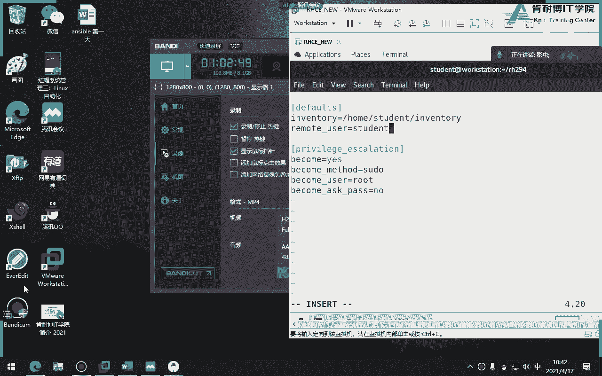
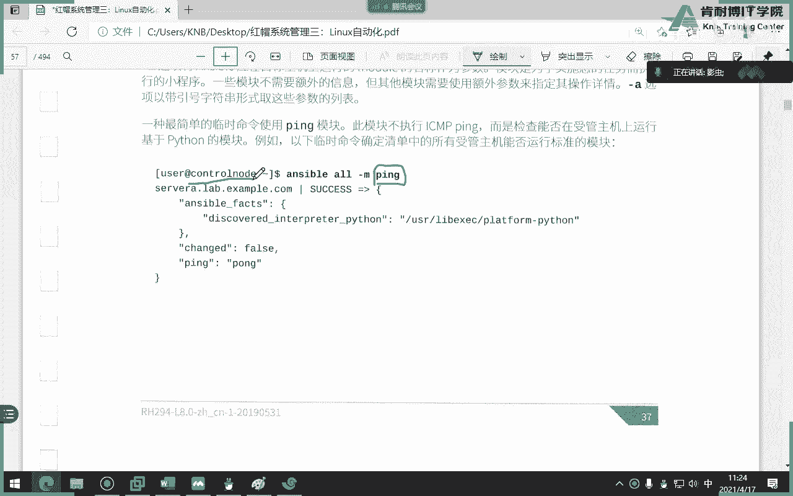

# 红帽认证系统工程师RHCE8-滕老师出品 - P16：第九天 ansible介绍及临时命令 - KNBIT认证中心 - BV1up4y1h7MA

那么从今天开始，我们要讲最后一本书i h294 叫自动化，那么从红炮八二十418之后，咱们的c一部分就从原来各种服务器的搭建就取消了，就取而代之的，就是用那个自动化来代替我们以前的各种服务器的搭建啊。

比如说以前我们会学过怎么搭建ftp了，搭建邮件服务器了，搭建du cp这些课程就没有了，那么没有了也就不会再考了啊，那么完完全全使用的是这种自动化的东西，这门课程叫做294啊，8。08。0294。

那么刚才已经教大家怎么去切换环境了，那么从今天开始，我们就要每一章的课后习题都要跟着这个环境来去讲解，好吧好，那我们来先说一下这一章的一个环境的一个介绍，那么你会发现这个环境跟我们之前环境有什么区别呢。

就是多了这样几台机器，多了哪两台呢，c和d大家看多了c和d这两台啊，这两台机器，那么其他都没有任何区别，也有classroom，也有boston，也有workstation，也有a b对吧。

那么也就是说在以前的课程当中，我们所有的操作是在a和b当中的某一台机器或某这两台机器当中做，但从今天开始，我们就要用到12345啊，这么多台虚拟机，所以如果你的电脑的笔记本只有八个g的内存。

那么这个环境会非常卡，各位啊，如果你电脑只有八个g，这个环境会非常非常卡，那么其他没有变化，包括我们的主机名没有变化，包括我们的网段没有变化，包括我们的名称叫学生没有变化，还记得学生的密码叫什么吗。

是不是也是学生对吧好，那么从今天开始我们就不不能用管理员了，各位咱们从今天第一天开始上课，我们就养成习惯，不要用管理员，咱们用哪个用户呢，就是学生用户好吧。

学生立马就叫学生student的s t u d n t啊，咱们要跟管理员拜拜了，各位好，接着我来说一下这个workstation，咱们以前从来没有用啊，或者几乎就没用，但是从今天开始。

我们所有题目都必须在workstation当中去用，那么也就是说abcd是什么角色呢，是受管机，是被安司法管理的机器啊，那么它就完完全全模拟我们到时候考试的机器，完完全全模拟考试的具体，但大家知道吗。

考试记更多还多了一个e a b c d e，咱们现在只有a b c d，那待会怎么去模拟器呢，咱们用这台来当做e，就这个咱们从来没有用过堡垒机对吧，但今天我们后面课程就要用它了。

我们把它当做堡垒机e来模拟考试，那么同样classroom呢作为整个机器的一个service，它包括d是cp啦，亚美元了啊，这个路由器了，这个这个这个还有什么呃，反正等等吧。

是整个环境的一个一个一个service，说你要掀开它好吧好，那么这就是我们的环境的一个介绍啊，因为这个环境大家很熟了，所以我们就一带而过，那么我们现在从如果还不会使用命令的话。

请看这边这个rht开头的好，那么我们从今天第一天开始讲起啊，第一天讲什么呢，s b的介绍啊，b介绍，那什么是i sbi，能够干嘛，哎这一章我们大概聊一下，这一章内容呢比较啰嗦，所以呢我们不见。

我就不带着大家一个字一个字读了，你们回家之后呢，看一下浏览一下就行了，因为这一章没有什么考点，没有什么考点，只是知道，它是能够让我们管理员能够在这种特别这个繁琐的工作当中，解脱出来啊。

他特别适合那哪种呢，一定是大型的这种服务器的集群，你比如说我只管你一台两台服务器，其实效率并不高，还不如写一个python或者写一个视角脚本的，但如果我管理几十台啊，上百台的时候。

你才能够体现出这个自动化的一个强大和这个工作效率，你比如说我现在要给20台机器搭建web服务器，那么我就会特别特别好的一个效率，但你只要给一台服务器搭建这个这个比如说某某某服务器。

那你就没有必要用保懂了吗，所以这个特别适合那种大型或者超大型的这种，这种服务器集群的这种场景啊，一两台反而没有什么用好吧，所以这就是很多同学学完之后发现诶，我工作当中其实没有用到暗自高。

还不如以前我们学的那种各种服务器搭建比较好，但是没办法他的课程就这么设定，他就假设我们的同学们以后肯定会管理这种很多很多台服务器啊，所以他把这个课程拿到咱们的这个c一部分啊，好所以请注意自动化。

原因就是让我们管理员能够轻松的管理大型的这种环境，就是他说的这么一堆，就这个意思，同时呢减少什么人为错误啊等等这些中文的概念咱们就不用讲了，好那有一点要提一下，安卓是一个什么，是一个开源的自动化平台。

他不是红帽，只不过被红帽收购了，也就是说其实怎么本身啊我们是免费的，只不过现在呢红包把他收过来了对吧，你要用红帽版本的，怎么可能你要收费，但如果我要围绕我们公司不想用红包的，可以吗，当然可以啊。

你可以去源码，大家懂源码吧，就你可以去下载源码包去装就可以了，而且呢红帽把他收购之后啊，各位就咱们呢这个这门课就是这门课，我刚刚讲过，这门课是原来c a当中的一门课，当时这门课在c当中叫什么呢。

它不叫294，它叫407，还有407，然后变到咱们c e呢叫294，那么这时候c a不就少了一门课吗，那怎么办呢，c当中现在有一个新的课叫447，这门课是高级版的xxl使用。

比如说你学完了这门294之后，你再学47才能听懂懂了吗，那么四七是干嘛的呢，还是利用ansible，但只不过呢比今天咱们讲的294要更难更难写。

那么而且47当中还学了一个技术叫uncible tower啊，怎么进来，就是t o w e up as btower，这个东西是红帽收购and b之后。

自己研发了一个图形界面版的as b这个东西是原生态的，红包的东西，理解了，所以也就是47学的是an sper tower，而407或者说咱们294学的是就是纯那个mini版的，明白了吗。

好所以这一点关系你要明白，下次你要看到什么是spiter哦，原来是红包自己收购的一个产自己研发的一个产品，好，明白了好，那么安抚粉刚才讲过，第一个是它它它的平台是一个免费的啊。

第二个它是它的这个好处就是特别的简单明了，就是他的语言特别简单，你比如说我没有学过，没有学过编程，你可能看c语言你看不懂对吧，没有一个专业的学习的话，你看c语言看不懂，但是如果我们稍微学过linux。

你看ancible的语言，你可能能够看懂，而且如果写得简单的话，你还真能读懂个百分之七八十，所以它语言特别简单，它不是一个底层的一种开发语言，它是一个它是一个怎么讲的。

叫什么人类可读的一个自动化的语言啊，它是跟亚某亚某格式的语言或者是json格式的语言呃，亚某格式的语言不是非常简单啊，什么功能强大，就刚才讲了，它可以干嘛，自动编配啊，什么工作流程啊。

自动编配包括什么自动化，包括网络自动化，注意了，咱们那个咱们红包当中有一门课叫45g，好像我忘记了，就是让全就是学ansible，如何管理网络设备，注意安什么，不光给予管理服务器。

可能给我们的感觉就是它是用用用于管理服务器，但其实不是安装包，还可以管理网络，比如说交换机，比如说路由器，大家懂了吧，你比如说我现在咱们是网络管理员，我现在要配，比如说比如20台路由器。

那么咱们以前是不是要登的路由器当中去打命令啊，但现在不用了，我们现在用安s宝可以去管理20台或者30台路由器交换机了，所以安博本身可以管理交换机，也可以管理服务器，这个大家能理解吧。

所以你看什么叫网络制的话，就这意思啊，就这个意思，他管理的东西不只是咱们的服务器啊，而且还更厉害的是，不光管理类容，还可以管理windows。

咱们不知道大家在座有没有咱们公司里面有windows管理员吗，你看你们你们以前在管理windows的话，是不是要手工管理，那现在学了什么之后，未来比如说我们我们要有100台windows的。

比如说201写2012，比如说啊那你现在就可以用安柏来管理2012可以了啊，所以as是很强大，就强大就在这儿啊，明白了吗，好第三个特点注意了，这些东西都是废话，简单明了啊，功能强大，他不喘吗，功能不大。

我用你干嘛，对不对，好，这才是它的一个核心，它无需代理原，这个请大家一定要注意，别下次有人面试你，请问为什么要按s包，我们知道自动化编配这个工具是不是不止安s宝一个，大家听说过有个叫有个叫什么来着。

ppet听过吗，p o总体来说p u p u p e t吧，巴拉巴拉巴拉一堆，忘了啊，这个工具在unsp出现之前，或者是他们俩竞争很很激烈，但为什么你看现在似乎不太听到puppet这个工具了，为什么。

因为它有一个功能就是它是需要代理的，但是咱们这是无需代理，什么叫无需代理，各位就是举个例子，你看我现在是这个管理端，我现在要管理100台电脑好，那么你这边100台电脑身上要不要装xp的插件呢。

不需要各位，你只要咱们俩能听通，我只要只要求这一点，网络能拼通就可以了，那网络能拼通是谁的事儿，那我网络的事儿呗，对不明白吗，所以as是不是无需代理，就是我管理机器的时候。

这些被管机器身上是可以不装任何插件，这个功能就很强大了，无需代理，所以它只需要通过s s h或者是windows的rm，这个这个这个这个工具能够连过去就可以了，明白这无懈带的就是这个东西最厉害啊。

那接下来他告诉我们很多什么优点，刚才讲过它可以跨平台，什么可读的语言，什么完美的描述，还有什么轻松的版本控制，还有支持动态清单，待会我们会来讲什么叫动态清单啊，这些东西都是它的一个怎么说来着。

唉就这个就这个咖啡就是它啊，这些都是它的一个重点啊，明白吗，这些都是他一个优优点，你可以把它背下来，下次人家面试的时候问的时候，你可以背下来，好了啊，这是他重点，咱们就一带而过。

你只要记住第一个它是无需代理的，第二个他只要能够通过网络平通就可以了，被管理被管理断，我管理你的时候，你是不需要装任何东西的，只要网络能通信就可以了，就我给你p通就可以了，就这么简单啊，好吧好。

这是他一个功能，ok我们讲完了，大家能理解吗，able啊，自动化平台继续，那么我们接下来呢就来说一下ansport的一个框架，或者是一个一个架构啊，我们直接来看这个图，这个图有点模糊啊，我没关系没关系。

我们来自己自己说一下啊，首先ancel本身它是个啥，他什么都不是，它就是一个引擎，这个单词有点小啊，engineer啊对吧，engine还有这个引擎啊，那么学习s吧，其实你最后你发现你学的是啥。

学的是各种各样的这个家伙，这个单词翻译成中文叫什么，跨也就是其实s b本身并没有什么，它只是一个引擎，你最终学的是各种各样的模块啊，我们把模块称之为什么呢，很多教材把模块称之为叫做工具，看到吗。

称之为叫做工具，叫做工具，一个一个一个的小工具，就是一个一个小的模块，举个例子，我现在要求大家在100台服务器当中安装一个软件，那么安装软件是不是要咱们以前如果打命令不叫亚马对吧，那一样咱们在什么当中。

这个要么就不叫命令了，就叫模块，我们用这个模块来去安装软件，那那这个样本怎么用呢，哎这就是我们要学的工具，那同样比如说你要在100台服务器当中给我建立一个用户，那么建立用户就要用建立用户的工具。

这个工具叫做模块啊，懂了吗，所以你似乎发现你整本书学来学去，就学各种各样的模块，你的模块学的越多，你能解决的事情就越多，理解了吧，哎所以说就是模块，所以你看看到吗，还有一些api接口啊。

好这个单词是什么呢，叫清单，ementary，翻译成中文叫清单啊。

现在好，我给大家写下来吧，那么它的架构啊，就是由清单啊，加上我们的这个模块啊，当然还有一些api接口，当然api接口呢就是咱们不用关心啊，你知道一下api接口就可以了啊，或者和一些插件。

这这这个咱们就不说了，就说这两块好，那么清单什么模块已经解释过了，就各种各样的你要用的工具，比如说安装软件的工具，建立用户的工具，建立组织工具，删除软件的工具，对吧好，那什么是清单呢，刚才讲过。

我要管理100台服务器，我要管理100台交换机，那么这100个交换机也好，或者说100个服务器也好，欢迎给我一个ip地址吧，对吧对吧好，那么你把你被管的东西写到一个文件当中，这个文件就叫做清单。

就跟你们家菜园一样一样，懂了吧，就像你这么举例子吧，我我们每我们第一天来上课，是不是每个人有一个签到表，我管理的十个同学，那十个同学你得给我一个清单，我怎么知道哪十个同学呢，懂了吗，哎清单就这个意思。

明白了吧，就是清单就是被管理机器的名字或者他ip地址写的位置叫做清单，你把它写进去就可以了，那一样，如果没有写在清单里面的，and是不是不能管理他的，这个能理解吧，就你不在咱们班上这个名单当中。

我是管不了你的这个意思好，所以你看它它架构就这么简单，那么这两个东西加在一块，其实运在哪运行呢，就运行在我们安卓的运行当中，懂了这就安全了，那么有人说唉，那为什么你刚才讲你考的是2。3版本，我考的是2。

8版本，那么这个版本有什么区别呢，注意主要区别就区别在模块身上，比如说我们当年考了2。3版本才有1000个模块，可能你们现在2。8版本已经有2000个模块，懂我意思吧，就不断的增加模块。

而且呢把一些旧的模块的使用办法呢来更新一下，或者是取消掉，懂了就是把一些老的模块呢给它取消掉，或者是更新一下，就是这个i p的一个版本的升级，就升级在模块当中，主要升级在模块当中，那么我们在讲课的时候。

我会给大家讲一下这个模块以前是什么样的语法格式，现在需要语法格式是怎样的，我们到时候都会给大家讲一下，理解了吧，哎这就是安琪的架构，能听懂吗，不难吧，其实你自己看书你会觉得很乱，其实是啊。

好那接着我们再来看像这种废话的东西。

我们就一定过了啊，我们来把这个题看完，这章你就明白了，首先第一个大家应该觉得选什么可以吧，第二个呢你刚才讲过，它就是通过s是和windows rm那个工具来连接的啊，那第三个呢。

注意这个我们讲the playbook是选c playbook，翻译成中文叫剧本剧本的啊，剧本它可不是脚本，脚本是我们share懂了吗，叫剧本，什么叫剧本呢，就是一组模块的集合。

用一种逻辑结构的写法给它写成剧本，那么我们在今天下午或者明天我们重点就要讲playbook啊，不对不，那么还有一个就是第四例题，讲的是压模文件。

就是我们的play book使用的模使用的这个语法格式是压模，第4y a m l亚姆格式，它是一种格式，各位这种格式就跟咱们以前学过那个j说过一种json格式一样，它是一种格式，明白吗。

好那么这四题如果你懂的话，说明我们刚才讲的这一堆，你是明白明白了吧，好那么这个就可以过了，那么咱们今天在讲什么的时候，包括明天包括最后一天讲的时候，大家一一旦有问题立刻当场提提出来啊，不要等到下课啊。

好那么接下来我就来讲一下怎么去安装，那么首先要注意安装的时候，请注意一定要装在哪，单侧有两个节点，一种是控制端，一种是被控制端，它应该装在哪，答案是控制控制端了，我刚才讲过被控端是什么东西都不能装的。

理解了吗，一定要装在控制端身上，但是注意控制端来我们要写一下，那么是否分为啊，分为控制端和被控，对很多教材当中也把它翻译成什么管理端和被管理端是一个意思啊，那么请注意这个控制端，控制端请注意是linu。

必须是linux，这个没什么要这个解释的，它就是linux操作系统，但是被公关无所谓，无所谓，什么叫无所谓，windows可以吗，可以呀，unix可以吗，可以啊，我这个这个思科交换机可以吗，可以。

路由器可以吗，也可以懂了，就是被控端可以是网络设备，可以是服务器，可以是windows的服务器，可以是linux服务器，也可以是unix服务器，无所谓，只要能够干嘛聘用明白了什么叫平头。

就是你22号端口，你就给我打开啊，明白吗，各位理解了吗，但控制端必须是linux，那这一点为什么要强调呢，因为如果你拿一台windows来去当控制端，那不好意思，你控制不了别人啊。

起码目前啊就咱们今天上课，目前为止还不行，那么未来有没有可能像他的事让人很有可能嘛对吧，反正现在不行好吧，所以你看教材能给我们写的非常明确，非常明确，而且被控端呢你看他告诉大家干嘛。

由anxp管理的主机的不需要安装xp，也是说被控端不需要安装xbo，而且你看这个，你看这句话看得到吗，不支持windows，但是windows可以是什么被控端，那么控制节点当中需要安装pyth。

为什么要安装python呢，因为咱们咱们那个playbook啊，各位是属于压模格式，所以要安装ansible呃，要安装python啊啊把它装一下就行，但没关系，一般情况下我们在装操作系统的时候。

你会发现python是给我们干嘛也一并装起来的，那就算你没有装，你把它亚没想到python装一下就行，这个没有什么难度，注意红帽八当中的细胞默认是2。8版本，默认是2。8，好吧，就你不用管它，就是2。

8，那么未来你们考试也是2。8，也是2。8啊，好那怎么装呢，他告诉我们就是如果想装的话，需要提供一个红帽的频道，什么叫频道，这个不用解释了，就是你要收费的，说白了。

但咱们咱们的环境直接亚美尼斯store就搞定了，因为咱们的亚马原里面已经设置了2。8m s l的软件包，说白了就是我已经给你们每一个人了，考试的时候给你们每一个人，你只要给我呀，你搜索这个命令会吧。

装一下就行了好吧，你不用管它，但如果你们自己再加五二的话，那么是很有可能要自己装吧，还有导价美元，或者是找一些原版包，这一点请注意啊，好看这个命令不用解释了，就是做注册的，是咱们这这个东西不用关心。

咱们只要记这条命令就够了，主要记这一条命令很简单，再说一遍，是被控断完不不不是控制端，这个端不用装啊，好好那么受管主机刚才讲讲过的都是一些什么无需代理啊，都不带介绍，只要有网络连接。

那么呃你看windows告诉告诉大家，就是他也可以管理windows好了，那么没了啊，还有最后一句话，你也可以装什么来管理网络设备，比如说jennifer对吧啊，比如说cisct对吧。

cisccot scott啊，jennif，我不知道是不是也就是华为的嗯，可能吧是吧，可能吧好那么如果想学管理网络设备的课程，请学一下这门课，红帽的457这门课，这门课就是讲的是如何管理网络网络设备。

如果你想学的话，先去学这门课好了，那么第一章就结束了，第一章实验大家来做一下，我来做，在哪做，你看我们来我这张时必须做啊，因为你要装嘛，他说在哪做，请注意咱们的要跟大家说一下啊，在咱们的环境当中。

被控单就是我们的workstation，再说一遍啊，从今天开始，这个控制端是workstation，被控端就是刚才那个sera serb server c server d，懂了吗，下面a。

a到d听懂了吗，就不要问我哪个是控制端了，咱们从咱们从今天开始统计一下work session是控制端，所以你要在哪做workstation，所以你看第一题嘛，他们使用学生，注意一定要使用学生。

从今天开始，我们就不要再用管理员了啊。

好那我来坐下，学生密码是多少，也是学生啊，当然了，你是管理员过去，他不要密码，看了吗，不要密码。

注意这条，它告诉我们要打下lab命令，你看到吗，其实这一章不需要打lab命令，这一题不需要直接加名词就可以了，不要打lab命令也行，懂了吧，不用打好，那为什么要加个s u度，同学们，为什么要加速度。

因为我是管理员吗，不是啊，你你你也知道，要么这个命令是不是只有管理员才能做，我这么说能理解吧，正好咱们带着在这给大家给大家把知识点串起来啊，你仔细听啊，各位不要不要直接做，这题很简单。

但是里面隐含了一个知识点，其实第一个我们为什么要so u do，因为你告诉我，因为它是被管理员，那我问大家第二个问题，那凭什么上面就直接so do，它就可以做，我不是管理员。

我得用s u度才能打出亚军车道，那你就直接这样打就可以了，那如果你们自己在家这么做，比如你自己拿一台电脑做，你你直接写速度，亚m store，明天是认识你吗，你在干嘛，视频的期权设置好。

那为什么咱们这边不要，因为咱们这个环境当中已经为学生这个用户做了i so u do的提权，那如果你自己在家会做吗，我为什么问这个，因为我刚才讲了。

咱们咱们这次包括你们这次考试csa当中就有就有一道这个题型题啊，这是咱们以前没有的，因为那天有个重庆的一个老师考试给我打电话，他说我们培训机构考了一个s u度的题目，是从来没考，那很显然就是这个题啊。

提前啊，那比如让大家现在去做，提前让一个学生去做一个亚明这个命令你会做吗，你别老说我放弃行吗，不行啊，这样听还放什么弃，不能放弃啊，会吗，对你首先让管理员任务vi速度吧，对不对。

然后把那个用户授授予下就行了，对不对，明白吗，所以不是说我们照照这个书抄一下就做完了，你得知道为什么他直接敲s u度就可以了，因为这个环境已经帮你做考试，谁给你做，当然考试也给你做好啊。

因为这种题目没必要考，你为啥，因为你们考的是c e啊，各位他没有必要再去再再难为一下，再做一做一下cc的东西，懂了吗，好包括那个呃每一个节点之间做那个密钥，它也不需要你考试来做了。

但其实如果在公司里面咱们做是不是要先把密钥做好，对吧，来懂了。

我把那个知识点提醒你们要明白，就你复习一下，能够，复习到位，密码的话，s t u n d都装了，already，太好了。

ok already already吧，好这结束了。

那么结束完之后呢，请打一下这个命令是杠杠version version，干嘛呢，看版本啊。

我们来打一下杠杠version好，com watch有两个知识点，要看一个知识点，当前版本2。8。888，同学们，当前版本2。8有两个知识点，我要给大家截个图啊，第一个知识点是看一下版本稍微小一点啊。

稍微小一点，后面同学能看到吧，我稍微小一下啊。

等一下第一个知识点是看当前版本，第二个知识点是看对configuration。

configur文件叫什么叫配置文件，理解了吧好那么配置文件待会会重点讲，你先给我，我先给你截个图，你先给我看一下你们是不是在这位置，如果是咱们这一章就结束了，那么待会我们再讲配置文件时。

我再回过头来给大家讲什么是配置文件，因为很多同学这一点我不知道你们回家就有同学翻书预习了吗，有多少人能够看懂这个这个文件，这这这个小节的内容看不懂，你后面就全都看不懂好吧，注意啊。

这个命命令主要看这两个地方啊，啊这章结束了，那么只要这一章结束了，咱们后面的所有章节都不要再装了，也就是说整个教材呢就这就这一张要装一下xp，后面就不用再装了，当然了。

除非你把那个box是把它干嘛清空了啊，好吧，哎你看还有啥，哎刚才讲过pyth是不是必须要三版本或者2。5以上对吧，书上刚刚告诉我们，那你也不用管了，还有g4 c，大家知道什么叫g4 c吗。

啊学过林雪莲子同学必须要知道gc，哪怕你不会用，但你要知道它是一个非常出名的一个c语言编译器，还记不记得我们第一那一次给大家讲过哦，我没给你们讲过，是编译安装软件的时候，我没有讲过啊。

就是如果你在网上下载一个源码包，你第一步要去编译，编译的时候必须要有gcc工具，也就是说你的电脑里面你要给我装gcc，如果没有gcc，不好意思，编译不了，你在大学里学过c语言吗，哎你现在大学都不学c了。

哦那你学java学过吧，c语言当中，各位c语言是不是做完源码包，写完源代码要编一些了对吧，那咱们要以前用那个什么vs来编译，那现在要用linux下面就是g4 c把它编译成二进制可执行代码好吧，ccc啊。

咳咳好三点，第一点ex的版本，第二confier的配置文件，第三python的版本那一样，如果python版本比较老了，那不好意思，意思也不能玩，比如你pyth版本才是，比如说二点，那不好意思不行。

你要把python给我升级一下，好在咱们现在不用关心。

你也不用关心考试，也不用关心啊，这一章过过啊，那什么叫finish呢，就做完之后给你清空一下，但咱们根本就没打，所以就没有所谓的finish啊，好这一章结束，总结总结就不说了啊，这给我记住这一块就行了。

只要把这一块记住，人家面试的时候就会问那个啊，记住它就行，好，暂停第一章有问题吗，一个服务器端，一个一个是客户端，但这里面不存在服务器和客户和和客户端的概念，这单有点像对吧，被控节点和这个是控制节点啊。

那么什么是减少人为的错误，说白了就是比如我国要搭建100f，现在肯定有出错的几率，但是呢asthma就不会对吧，因为他是相同的模板，相同的模板啊，打一点类似于什么呢，就跟咱们以前学过用过ghost吗。

网络安装那个windows一样，那么你你你做好一个模板诶，他就知道你那个模板就直接刻出来很多台服务器有点类似于那种感觉，特别像啊，好第一章很简单，纯概念，那么第二章从第二章开始。

这一章呢很多这个这三个这两个一个是清单，一个是配置文件的位置，这两个东西如果你听不懂，你后面你就不要再断，你就不要做了，你你你做你也是零分，你也是02：20啊，主要就难在这好，那我们来看一下第二章。

同样有问题，直接打断，我不要留在课下啊，来我们来看看这张主要目标，第一个呢了解一下什么是清单的概念，第二个了解一下配置文件啊，以及如何改变默认配置文件，第三个呢讲一下临时命令。

并且教大家使用临时命令来实现一些基本的操作好，那我们来开始第一个，什么是清单文件，我先给大家写一下啊，是这样的，其实ansport当中你如果把整本书学完之后，你可以总结出有三大文件啊。

你如果把整个教材全部学完啊，三大文件哪三大呢，第一个就是我们清单文件，第二个呢是我们的配置文件，第三个呢就是我们的lp文件，就所谓的什么哎去本文件啊，就你把整个书学完之后，你再回过头来看哎。

反正好像就这三个东西，你学来学去，学了这三个东西，所以我们今天上来就给大家总总结出来好，什么是清单文件呢，清单文件分为两种，第一种是静态，所谓静态就是人为的写入，写入被管被管理断了。

管理端的ip或或主机什么名称，那么很显然，如果写主机名，必须得有什么dns的知识，但是呢我们这边考试的时候给你了，就是考官，那咱们的环境呢就是打死了，所以你看待我们在写清单的时候。

你可以上来直接写什么3a啊，serb啊，没关系，咱们的classroom已经帮你做好了dns解析，所以你直接写是可以的，考试呢考试也可以，但是在你们的未来生产环境当中，你可得注意了，尽量写p地址。

除非你公司里面有dns，这个不用我介介绍好，动态动态呢咱们后面有一张单独讲，咱们今天只是大概的说一下啊，是通过脚本文件解析出来的，比如说阿p或，或主机，当然了，这是我给大家写的概念，不是书上的概念好。

那么不是人物人为啊，大家知道什么是静态吗，比如说我现在管理30台机器，我把这三台机器人为的写上去，写到一个清单文件里面，跟我们菜单一样，这很简单，你能懂，每个人都能懂对吧，什么是动态呢，我举个例子。

大家有没有用过阿里的云主机，或者是那个亚马逊的云主机，或者谁谁谁的云主机用过吧，你有没有发现你每次运用云主机是不是有一个叫释放的概念，结果现在我住一天对吧，我们今天为了玩玩一天，玩一天之后呢。

我我我我我为了省钱，我得释放掉，因为你不释放的话，你给钱的每天计费的嘛，好当你第二天再想玩的时候，在申请的时候，很有可能不是昨天那一台吧，iu可以负责任多少钱，那肯定不是昨天的那台吧对吧。

那么a p地址是不是很可能会变对吧，你想想如果咱们公司管理的都是云主机，但每次都会变啊，那我怎么把rpd就写上去了，我很想我写不了对吧，那怎么办呢，哎我可以写一个，我写一个脚本。

注意这个脚本一般是python语言写，而不是shell，注意啊，这个脚本不是shell脚本，是python的脚本，我把这些东西写成脚本，我用到的时候它动态给我解析出来。

因为他就直接抓取那个云主机的ip地址，而不是我自己人为的看懂了吗，好我通过脚本的形式抓取或者解析出来的这种清单文件叫动态清单，能听懂吗，就这么简单啊，你不用看书了，明白了吗啊，所以一个是动态。

一个静态好，第一个第二个配置文件啊，那那那咱们咱们先说清单文件吧，配置文件咱们讲再说好，来我们来看一下清单文件来看，告诉我们就是要管理的一批主机，就是我刚才讲对吧，我现在管理30个同学。

我把这三位同学的ip地址，家庭地址，什么主机名名字姓名，什么男女啊，电话号码都给我写下来啊，就这个意思好，那么我们来看一下静态静态清单，写写写写的时候。

语法格式一般是呃呃这个格样式一般是一个i i的样式，i n i的样式，而且呢每一行是一个什么独立的主机，那很显然大家来看这这这这这这这几个是不是我管理组排这五台，其中有rp地址的。

还有这种域名主机名的形式吧，哎就这么简单，我我要管理这五个人，写上就可以了好但是呢有时候我们还会可以干嘛，分组什么意思呢，我可以把他们两个人做成一个组，他们俩人做成一个组，他自己做成一个组。

就跟咱们现在有那么多同学，对吧啊，你是这一组的，你是这一组的啊，我每我只要说a组，那a组里面的十个同学都站起来明白吗，哎那组怎么定义呢，写成那个方括号形式，大家来看看，这是组名。

那这个组当中就有他们三个组员，那这个呢是一个新的组，他们有他们俩看得懂吗，这是主就要携带方括号里面这个对吧，是个人都能看懂好，接着我们再来看下面这种方式，也就是说我们有两个非常重要的。

这个要打一个五角星，有两个非常重要的组是始终存在，第一个是隐含了一个叫奥数，它代表的是所有权，你看比如说就看第一个案例，大家看这片是不是没有定义组，但其实我写个or指的就是它的所有人。

这是一个隐含的一个一个属性，就我我不说你是男的，也不说你是女的，那你肯定是个人吧，这个属性是肯定是一直存在的吧，对吧好，还有一个组呢叫ungroup，什么叫ungroup呢，就是不属于任何组的。

它其实就属于这个组，这么讲能理解吧，啊你你你不属于这个组，你也不属于那个组，那其实你就属于angry，那么为什么要讲他们俩呢，因为后面我们在写playbook的时候，写剧本的时候，我想调用某个组。

其实我可以用这两个代写，比如二代表所有人啊，就代表所有人好吧，请注意这两个组，明白吗，这两个别拼错了，后面有e d的同学们，你会发现当中很多东西结尾都是bd，比如star restart。

这后面要加个d buted对吧，respect要加d啊，好现在还有一个这个稍微有一点不是难啊，就稍微复杂一点，就叫嵌套，现在这个单词注意这是个关键字，冒号加children这个单词别拼错。

注意冒号别落了啊，有个冒号，什么叫叫子吧对吧，紫薯好，我们来看这个，首先usa美国，美国里面有两个成员，加拿大有两个成员，然后接待着北美，后面加一个children，那这是什么意思啊。

相当于我有个组叫北美，但这个北美里面的成员居然是我们刚才这两个组的成员吧，能看懂吗，那这边就要加一个children，能看懂吗，懂我意思吧，这叫组里面再嵌套别人吧，那这边叫一个冒号。

就是这个单词是固定的语法格式，不能拼错，冒号不能少，那个children能偏c是i巴拉巴拉巴拉一堆也不能拼错好吧，绝对不能拼错啊，好能看懂吗，为什么北美呢，因为他这个教材是人家外国人写的嘛。

咱们中国人写的肯定是河北啊，河南啊，这样的，对不对啊，他他他这个你得看得懂啊，好这个以上清单都是讲静态清单，我会简单吗，那么同时呢还有一个这种一些一些简化的写法，就是比如说我的清单特别长。

就是1~100，那怎么写呢，你写12345678，这太慢了，没关系，我们可以写x大and一冒号，100对冒号指的是一个逻辑范围，而不是一和110~100，那如果选a到z呢。

那a冒号z呢就是a到z这些个字母理解吗啊，所以说你看这边这个四冒号七指的是4567啊，大家千万不要认为四和七好，这一点要明白啊，好可以过吗，过了那咱们就不用浪费时间了。

这种简单的东西就就是他每个组直接控制，无所谓，爱控不控无所谓，你可以不控，他这样让你看的要清晰一些嘛，就跟我现在写笔记一样，你看我可以不空吗，你看这都空了，只是为了让你看的舒服一点啊。

比如他那个那个词组词组是必须写的，结尾还是这是爱怎么写怎么写呗，对但是你一样，你既然写了，你这两个字也要写进去吧，对吧你得写上去呗，顺序改顺序无所谓，你光跟人跟人说，你是谁儿子，那你不写人父亲怎么办。

对不对，哎懂了，各位很简单啊，继续好，那这时候我们就要来看一下验证清单，这一点很多同学就疑问来了，因为你会发现知识点听着都可舒服了，一打命令就忘了好，这个叫验证，没验证呢。

你看他来验证一下这个主机里面有哪些主机，那么很显然这个华盛顿是吧是吧，那这个主机不就是属于刚才哪个来看，不就自个儿吗，不就这个吗对吧，但注意它如果这边换成usa呢，把这一片换成usa呢。

那不就是一和二吗，就是他们俩吗，就他们俩吗，懂了哎，懂了吗，就来验证一下你是属于哪个主的，或者你你属于谁，懂了吗，哎叫杠杠list host，注意这个s可以省略，这边的s可以省略。

直接打host也可以啊，这是我通过验证出来的，那下面这一题呢说明啥没有主机，为什么没有那若干个原因，比如说拼错是吧。

好听不懂，听不懂，来搞一个。

从来不看他的教材，我们直接来搞，好写个清单文件，一般清单文件注意同学们，一般清单文件我们一般习惯就叫英文水i n v e n t o，你进来的一般咱们就叫这个名字，但你老说我不叫这个行不行，那么长。

我就我就叫a b c行不行行了，可以呀，你叫什么都可以，但是咱们这样看不是让大家明白就清淡吗，好来吧，哎呦打错了，不好意思，没事不用举例啊，比如我们这个叫咱们叫叫叫叫叫叫server算了，咱们叫外部感。

他们有一个机器叫3a啊，还有咱们的主机名是sa。lab。com，大家明白吗，当你选择sa也行啊，好那咱们再写一个吧，一个sb，那么还有一种人叫dd啊，比如svd就行了就行了，那这个时候你要怎么做呢。

就可以这么做，比如说web b，看稍等我待会解释，大家看是不是我外婆组里面有a和b啊，你刚刚眼瞅着看他是不是不是我不我跟他瞎讲的吧，是不是你自个儿看到的，也是我想验证一下web这个组里面有两台机器。

一个叫a一个b一样，我如果要db呢，我想看db这个家伙是不是有3d吧对吧，明白吧好，那教材当中给我们写的什么呢，他写的是这个直接写server，比如a比如sa属于是谁呀，sa当然属于sora自己啊。

明白了吗，这是整体一个过程，听懂了吗，同学们这张可以过了吧。

这小节可以过了啊，好接着。

但如果我加刚才加一个or那同学们那牛逼了啊，那牛逼了，同学们all就是所有呗，二有所有a b c d吧对吧，我刚刚讲了所有人是不是都属于二一个大组，对啊，我跟你我跟你们讲课，甭管男女，大家都属于人。

对不对，哎这个意思啊好那那其实我如果换成ungroup呢，应该也是a b c a b c几个人吧，哦不不应该属于d啊，啊没有没有，因为我啊，对对没有忘了忘了对没有啊，没有没有没有没有没有啊。

说错了没有好。

结束来吧，同学们接着我们来看下面这个事儿。

覆盖清单的位置好，接着再来说说一下，那么默认情况下情况我们的清单在哪儿呢，在注意我说默认啊，默认就是我默认吧对吧，你也不管我也不管，就默认好，是在这注意啊，同学们，刚才我们自己建了个清单，文件是win。

但是呢如果你没有限定位置，你比如说我我忘记了，或者我不会建，那不好意思，红帽不是红帽安全包，注意听uncible会用这个家伙当做默认清单问题，因为你不建议清单文件可以吗，当然可以。

但是它会自动读这个文件，那么我问大家，刚才我们定义的外部组和db那个组有没有放到这个里面，所以说我为什么有些同学说诶你怎么加入这个。

你看我为什么要加个这个，就这句话，这句话叫做指定你自己的清单文件，如果刚才我不指定同学们，你来看就会发生一个错误，他就会告诉你n，什么叫拿什么，那你就拿什么，啊没有，就这个意思啊，就没有被匹配卡。

not没匹配，刚讲过，你没有用杠i指定清单文件，它就会读取谁。

刚不说了吗，就会读取这个默认清单文件，可是我刚才没有网往默认清单里面去定义，所以那懂了吗，教材当中他没有讲到的地方，但你得明白懂了吗，好我我暂停一下，听懂了，啊也说了是吧，好看就在这儿啊。

现在杠i也没吹，懂了吗，哎所以很多同学就不理解为什么有时候要加油，有什么不加哎，二少s是啊，对少s忘了这个不能上线啊，那那那如果我们要用它呢，那如果用它是不是就不需要加杠i啊对吧，因为它会自动读取。

但请注意有一个规律，要发现学习过程当中和工作当中，只要它出现默认这两个字的，一般都不用，包括后面咱们学变量的时候，也是主要说什么默认变量，咱们一般都不用默认，所以说你这个没这个文件。

你就可以就可以不记了，你看我刚才都自个儿都拼错了，但你你得知道有这么回事，你要说默认它一般都不会读取，那读取谁读取我们自个儿定义，那么在未来参加考试的同学请注意了，咱们清单文件绝对不是默认我告诉你。

请建立一个清单文件，然后把巴拉巴拉巴拉一堆清单给你写上去啊，懂了吧，他不可能用那个默认，你要知道它就行了好吧，那么咱们课后其实有一个有一道这个题目啊，待会你们可以自己做一下。

他故意的往这个清单文件里面写东西，你会发现就不需要杠i了，就没水了，懂了吗，哎所以说刚才如果我要在这里定义的话，就不需要来我们打开看一眼吧。

看一眼啥东西里面不得用vs路了啊，那你肯定要必须要ok带s了，回车s t u d e n t是学生的密码吧，大家看你看这就是一个清单问题，你看哎你看这是不是标准的一个example案例对吧，明白了吗。

你看这是一个什么案例啊，这是一个有案例吧，不知道同学们好好看没有，这是都是example，所以如果我们把刚才那一堆写了出来行不行，单也行啊，我故意不写了。

好这一张清单文件可以结束了吧，好没了没，打一个红色，那么动态清单后面再出，你只要记住动态形态是通过脚本解析出来的，就记住这句话就可以了，它不是一个我把它固定写死，不是一个动态，你看它告诉我们的啊。

你看有人像是红包的卫星服务器，或者说这是那个亚马逊的是吧，像这种东西它都是自动生成出来的用户名啊，账户了，或者是这些个你又没有办法啊，固定写死他，那这时候就适合用这种动态情感，当然了，咱们的四。

咱们的294这门课不会教大家如何用python来写脚本，那不是咱们的课程内容，所以考试不会考，那考试会不会考动态清单呢，呃好像会，但他会给你一个脚本，就是人家写好的，我这么说能理解吧，只会运行啊。

叫啊对对对，只要运行下就行，明白吗，怎么运行呢，运行脚本怎么运行，是不是点斜线，你也点斜线呗，但前提是要给他什么x线，明白了吗就行了，明白了，就是说白了就是我给你一个动态，现在你能够看懂。

就是咱们c一阶段的要求，不要去，你们会写，但你老师我很牛，我我能写，那你更牛啊，对啊明白吗，好那这一章这一小节就解锁了，第二个重点来了，这个实验还做吗，算不错了，很简单，你看他是不是我们修改这个文件。

看到吗，是啊，这不错啊，不错不错不错不错，太浪费时间了，因为这题特别长，你要把这里的东西给我写下来，你这个什么叫萝莉，那不是英文吗，你那就是不用的话，伦敦对不对，伦敦啊啊这个富二代啊。

咱们那个英文我能看，但我不会拼音，不会念啊，你要这个自己自己拼评论，我真拼不出来啊，不错，但你要注意，你看人家是什么意思，就是你要指定心态啊。

好来继续，下面一章来了，配置文件就是我们要讲的第二配置文件，注意默认情况下还是默认配置文件在etc，为什么是在a c什么什么都要e d c嘛，对不对啊，肯定得e d c c bc b。cfg。

注意不是抗飞吧，c f g注意只要是默认都不用啊对吧，刚才讲过，只要默认都不用，因此咱们也不用，但是你考试的时候要用，为啥呢，所以你要出事，你知道吗，因为他的朋友文件有很多拼写，但是你不会拼啊。

我当时比较懒，我就我当时我当时还就忘了这个事，我当时是死记硬背，每个单词都背下来了，现在时隔那么久，我肯定背不下来啊，没关系啊，咱们就跟这里面诶靠一下，拷贝一下啊，默认情态配置文件啊。

好那么配置文件干嘛的呢，很显示做，比如说这两件事啊，一般分数要做两件事啊，第一个是提前啊，一个defade fade设置，待会我给大家直接看，就配置文件里面可以做两件事情，第一个是指定一些清单文件啦。

这个远程登录用户是谁啊，这样的事情，还有呢就是提前配置文件，主要主要是跟权限有关系，都是写在配置文件里面，而不能写在清单文件里，懂了就关于配置的东西，一旦要写在这个文件里面好。

那么默认呢是它很显然就不用。

那那如果不用，还有别的吗，有啊看教材，各位来看，这个是默认的不用，那么还有一种办法是这啥意思，这个波浪线哎，加入目录，加目录下面的一个点儿意思，同学们隐藏文件，但如果现在是个tom用户。

是不是应该是tom下面的tom下面的点，巴拉巴拉对吧，明白了吗，好这个清单文件用不用呢，也不用，也就是说它的优先级是三，它的优先级是二，咱们用的是他，比如优先级最高的是他啊，那么从今天开始。

咱们每一个同学，包括考试，包括未来你们工作都要记住，用的是最后一个，除非最后一个没有了，我们才用第二个，第你也没有，那么我们才能用第三个，也就是说如果它的三轮存在的话。

你会发现优先级最高的他根据指令一定是差，但是我觉得没有人随便写三个文件，不写同样的内容吗，那么疯了嘛对吧，他只是告诉你啊，这三个当中如果发生冲突，系统会自动地使用最后一个，中间那个呢是对啊。

替补最后一个呢，它是啊，实在不行了，咱们用最后一个，为什么，那么咱们从diss咱们从咱们倒过来，就来跟大家解释为什么要使用最后一个评论点，谢谢各位当前目录吧，那么当前目录当今谁啊。

这这边就会存在一个问题，跟谁当前啊，我在vr下面能不能建立，可以啊，太太也就当前，那我在boss下面可以吗，也可以，一般情况下我们要在哪呢，在个人加入下面，我刚才讲过什么，是不是不建议大家用管理员。

是不是用普通用户，比如说tom用户，那么你就要在tom用户的加入下面，这不对啊，下面下面不是这个吗，不讲了，项目的不是这个吗，是指当前工作不那么在在哪个位置建立当前工作目录呢。

在某个人的加入下面来看一下我们刚才在做题目的时候，我是不是做了一个294目录，大家有没有细心的同学注意一个。

来来来抬头，我大家有没有细心的同学注意到我刚才做了一个操作，我怎么卡了啊，这是不是294，同学们，我是不是在这里面做了一个引文出文件啊，那你看我在哪在哪，其实我并没有在家木下面做。

我是在家木下面做一个隐，做了一个目录，目录下面才做的是一个没什么文件吧。

那如果我按照时如果我我我如果按照上面这种方式，我应该怎么做，那我根本就没有必要再建立r2 有色了吧，是不是直接在目录了，明白吗，大家不要用不要用啊，直接在这个目录好，注意当前目录是指的是工作目录。

那么你们考试的时候怎么办，考试一定要在比如说考试也是学生啊，当然肯定不是啊，考试一定要在学生的家务下面建立一个这个目录，当做你所有考试里面用到的当前目录，就比如说我现在给大家上课。

直接建立一个叫做294，294在哪建立的，是在学生下面建立的，也就是说294就是我的当前工作目录，那么我们的工作目录一般用什么来分分分开呢，用项目来分开，一如果安卓当中管理三个项目。

那我们就要建立三个工作目录，分别管理三个项目，相当于三个树形目录结构，听懂了吗，懂了吗啊，活动说能理解吧啊很多同学就这一章听不懂，就这一点儿听不懂，造成后面所有题目都做错了啊。

来说说说说说说到哪个目录了，就晕了，当年我就晕，所以我希望你们不要晕，好，我暂停一下，听不懂，听懂了吗，听懂了吗好，那么因此我们要在home下面的学生下面建立一个工作目录，在这个工作目录下面。

我们建什么，大家如果我建立成功之后，你来看我已经有几个文件了，一个是清单文件，一个是配置文件，如果我再写一个playbook，是不是三大文件都有了。

请注意三大文件是不是都写在当前的某个项目的工作目录下面，懂了同学们，所以你下次不要再问我了，我怎么找不到目录啊。

但是你自己的问题我已经解释明白了啊，好，那接下来我们就来看一下，这都是废话，不用解释了啊，那么接下来我们就来看一下刚才你看到的这个东西，同学们来反过回来，我刚才截图的时候。

同学们是不是看到一个confire fire，你看它默认指向了谁，这是什么，我知道配置文件是什么，配置文件是默认的吧，对了，同学们好，那我能不能不用默认的，当然可以，而且还必须得可以对吧。

必须不用默认的，那怎么办，所以说我们最后指定的时候，最后发现就只看你自己才行，然后就只要你自己的才行，我们刚刚没有操作配置文件，所以它指向的是默认的，那么待会我们做了之后。

它指向的就是应该是自己的工作目录才对啊，好吧好，那你来看我们怎么搞啊，同学们怎么搞，配置文件已经了解了对吧。

那接下来我们打开配置文件，看里面有哪些内容，打开谁呢，由于咱们还没有建立对吧，那么我们只能打开默认的配置文件，这是不是默认配置文件怎么打开来着，下面的安抚，下面的什么，这是默认分成文件吧对吧，虽然不用。

但是咱们可以参考啊，对不对啊，s t u d e n t，你来看咱们主要用两块，第一块就是default这一块，注意了，default这一块，同志们。

那么我截个图吧，好吧好吧，我们要用default这一块，其中default这一块有很多内容，比如说这就咱们就说这一个吧。

什么内容呢，这叫做用户提全特权，哇哇哇这么多，你看这都是配置文件内容啊，所以你看那么多呢，是不是你你你不用你不用，你可以借鉴啊，p12 ，p r r v啊什么的，哪，第2p2 r v r l a。

一块好和这一块，第二咱们自己写配置文件。

虽然可以自己写对吧，虽然可以自己写，但是咱们要借鉴里面的内容，主要写这两块。

我截个屏，虽然咱们要自己写，但是我们要写这两块，这两块单词就这么多对吧，这么多怎么办，我可以抄啊，怎么抄呢，就到时候你们考试的时候也是这样，像我这样，我好，怎么说，就是打开这个呗。

打开就是把这两块截图截到你自己的配置文件好，我刚才是不是在294下面建立一个自己的配置文件叫c f g了，这里面打开肯定是空的吧。

那怎么写了那么多，哎呀咱这个照抄呗，哎好好，我写完我来解释一下什么意思，be f别拼错，每一个单词不能听错啊，所以你最好考试别别别别自己写就怎么样拷贝一下啊，d e f a u l t s。

我写完写一下，刚才我们叫七点算，r r v i提权是吧，特权是吧，特权有点难，不知道讲完之后你们能听懂吗，啊我先我先写写完啊，这个true可以改成yes，yes，就是true，懂吗，boss呢。

no好吧嗯啊可以嗯，但是一般都是一四分钟啊，好我啊，你不用就都先弄吧，弄好yes吧，这样咱们统一一下啊，我写完我来一条一条给你们解释啊，这点有点难，如果你听不懂，你后面就做不出来了。

现在是不是写了配置文件，同学们好，我写完了，我做完了保存的书，大家再来看，对比一下，位置，同学们见了吗，是不是成功的改成了我自己当前的什么目录目录下面了啊，对吧好，那我来解释一下那个配置文件当中。

你也看到了这么多，其实我们在咱们c一部分阶段，咱们只要做两部分，一个叫default部分，一个这个这个那么default部分，default第一条要写的就是指向引文出文件，大家想过。

如果你不指向引文储文件的话，是不是他访问的是默认的英文储文件，那这时候就会有问题啊，我明明自己写的，但他最后访问的默认的我肯定找不到我想要管理的主题，第一个要指向引为署文件，但说指向的时候呢。

为什么我为什么我写绝对路径呢，因为我怕大家误会，其实我可以写什么，这写的可以啊，因为我当前这个引位储文件是不是就跟我这个配置文件，配置文件在一个目录，所以我这么写的目的是让你们看清楚。

这是绝对的精吧对吧，所以回来你在工作的时候发现诶人家是谁，一个也没出啥意思啊，是因为它就在当前是啊，就跟我现在人已经在咱们教室里面，就没有必要再强调我是在安徽合肥心理中心吧，对唉我就在这儿好。

这个很简单，那么还有一个东西没写，我现在就给大家写出来，还有一个是在这写叫remote user，比如说叫做s t u e n t，我来解释一下什么叫remote这个单词远程吧，对不对。

当然讲过n次的工作原理是什么，要通过ssh连到对方。

对不对，来我画一图，你不画图听不懂，哎这点都听不懂。

后面就甭学了，我图呢啊，没这啊，嗯是workstation，大家都知道workstation控制端吧，好比如说这家伙，这几个家伙，他们三个人呢是被控端，都是linux啊，咱们不说windows。

我这边呢写了一个剧本，他们还没学过剧本吗，那我就假设咱们学过了，那么剧本呢有两个事情要做啊，两件事情要做哪两件呢，你写个伪代码啊，但这里不剧本内容如下，第一件事是创建用户，啊第二件事呢是这个。

第一件事是创建用户，创建用户，第二件事呢是亚b安装这个f t p，第一件是u的dd吧，两件事，都是错误的，不可能这么写，只要大概意思好，那么我是不是要把这两件事情发送到哪，发送到他们三个人身上对吧。

发送到他们三个人身上去做这两件事情好，你有没有想过我连接对方的时候，是不是得指定指定一个用户来连接，那么remote u在指的是你用什么用户来连接到对方，咱们都学过s h对吧，你在s s h的时候。

你怎么连的，同学们，你是不是这么打的，后面加个用户名，at后面再加是吧，对方的ip地址啊对吧好，这个remote user指的就是这个用户名，听懂了吗，好来了啊，比如说我现在指定了有没留学的是学生。

那么我成功的在三个人身上都登录了，我请问这个学生指的是对方的学生，还是我自己，沃克斯就是身上的对方的吧，肯定是对方三个人的学生吧，也就是说你要在对方三个人身上必须有这个血性才能登录吧，对吧好。

那么问题来了，我们知道user add这两个命令只有谁才能做，只有管理员才能做，这个不用问了吧，你要这个你应该知道对吧好，那么你想想他能做吗，是我现在是用管理员，我用非管理员叫学生蹬过去，成功了吗。

成功了，但在做这两件事情的时候，他一定会报错，报什么错，说permission deny权限被拒绝是吧，同学们明白，那没得玩儿了，那我就不是白写了吗，对我费那么大功夫让学了是吧，最后发现登不过去了。

但是没办法操作，那么白学了吗，好那问题就在哪，问题就在这儿，咱们得干嘛，提前诶，叫提前，接下来这一堆这个方括号，这个叫怎么读，这一堆就是提前，我们先来说一下这每个单词，首先第一个become，嗯写下。

a l l e g解释一下这个单词啊，虽然书上也写了，但是我怕你们看不懂啊，太侮辱我们智商了，我们能看懂好，第一个是指是否齐全，是否齐全，两个弄了，那就不提对吧，这不是废话吗，好第二个become。

大家能听懂啊，我讲的比较细啊，啊绝对没有侮辱大家的意思啊，速度什么方式，啥方式提前，咱们这边写的是速度的意思就是用什么用so u do的方式提前，那我问大家，我能不能直接写个s用素对啊。

我是不是相当于切换成管理员了，但你这样写不是封了吗，你这样写是不是相当于我用管理员了，提个屁，我直接用管理员不得了嘛，对吧，肯定不安全，但可以啊，这是个方式对吧，这个单词就是方式对吧，什么方式。

我用su的方式来提现，但你想想如果你用s u的方式提现，你事先要干嘛，大家要做好了，只不过咱们的环境不让你做而已，那你要在未来生产环境，你是不是第一个要做好，i so u do对吧，我让谁提对好。

接着注意瞅一眼，继续啊，become，裤子，上水，提前提谁提变成谁好，他写的road意思是我变成管理员，明白吗对吧，你要是变成一个普通用户，我还停个屁啊，是不是肯定就是官员，对不对，好最后这个重要了。

你在期权的时候是否要密码，注意这个地方就是保询问，这个地方在哪设置对象，相互没有，你在vs里面是不是有个叫no pass，当时使用那个是不是就没有必要明白了，收入都不安全，最好还要代表。

这个地方在这儿我再给大家再给大家解释一下啊，在这儿还有一个打开了，稍等我再打开，一件事得跟你们说出来，还有一件事是在这，哎我想想我忘了，稍等稍等我瞅一眼，稍等稍等稍等啊，在这儿，啊稍等，我写啥。

这个地方跟这个是俩人能能能分清楚吗，地方是什么，这个地方是我用学生登录你的时候，是否要输入学生的密码，而下面是指什么，我提全的时候是输入密码，能理解我的意思吗，那很多人要混啊，千万别混啊。

要弄的话必须要干嘛，无密码无密码登录吧，密钥吧，这个地方要密码就能发错的那个吧，懂了吗，能看清楚这个地方基于你对rc c c的知识的理解才行，r3 c都没听懂，那你这个肯定听不懂。

能理解吧啊一个是是否问你远程登录时候，我登我去你家的时候要不要密码，第二是齐全的时候要不要密码两回事啊，各位，结束，好这就是我们的配置文件好，三大文件我们讲了两个吧，结束了，问一下有问题吗。

我三大文件是不是默认讲了两个。

而且现在是不是都用在哪，当前工作目录下面好，但如果我这样写完的时候，同学们我再用这个做了，还需要加杠杠，赢不睡吗，啊啊啊对就决定了，嗯，你说这是吧是吧啊，对对对，给我怎么觉得那么别扭啊。

就不需要加那个刚刚才我们还要加杠i，然后饮用水就不用加了，因为你已经写在配置文件里面了，对不对，而且我们说过配置文件的话，如果冲突，他一定用你自己的吧，而不会用默认的吧，结束了，如果这一章你能听懂。

你后面还能听懂，因为后面我们再写playbook，还有写什么时候你要知道我们的还有最难的，咱们那天在群里，有些同学说那个听不懂那个角色，那一章那个结构更多，你连这个都听不懂，你角色也听不懂。

所以我暂停了，不讲了，暂停了，咱们理会一下好吧。

ac的配置文件当中还有一些注释啊，就是井号和分号，你写过视角脚本的同学都知道井号是注释对吧，它只是一个注释，没有什么没有没有任何的含义啊，井号或者是这个分号代表注释，那么位于开头的编号符号会注释。

说白了就是有什么好处，给人家读者一个提示，这是干嘛用的啊，但是呢咱们呢一般用不到注释，因为咱们写的东西太少了，写的东西太少，而且语言也比较简单，所以直接可以看懂啊，好那么这张实验呢我们来做一下。

我带大家来做啊，你们先不做啊。

正好教大家怎么用这个环境，这样看比较乱，我还是用s s h吧。

兄弟们，我的s s h。

一定是学生中的work ation，我刚才讲过，咱们下面的所有课程都要用workstation，因为workstation是空至端，对吧好，那么打一下lab命令，这张lab命令你来看一下。

我只我只带着大家做这一章习题，后面习题你们自己做啊，我教大家怎么用那个环境啊，尤其是那个以前没有用过的话，你同学来看一下，先打一下lab在哪啊，看他来确定一下这一张有没有装啊，这个英英文能看懂吧。

对吧啊，好，接着我们来做第一题，你看它会自动地创建一个工作目录，看到吗，是工作目录吧，这叫工作目录吧对吧，那你看有没有，没有他让我自己创建的，我为它自动创建好，那我们自己创建吧，叫什么。

这叫做d e p坏了，因为只要进去之后，后面所有的东西都是基于这一个目录来做的，就不要再混啊，你看他们干嘛创建一个啥，我也唱呗，白default defa，哦，我错了吧，同学们，我感觉我错了。

就这样搞吧，i s度来做对吧，因为你不用管理员吧，vr vr是不是创建好，ok def，等等等等，影温水文件还是在当前目录下面有一个隐温水文件，很显现在还没有建立对吧，他就是先写，但还没有建立。

还没有建立好，这周结束了，我们再来看他要求我们做一件事，就是要创建一个文try文件，包含这么多，那我们就来创建呗，考试的时候没有v i m啊，你就说你要装一下vr m好吧。

第一个组名字叫马西logo house local，就自个儿呗对吧，就自己啊，叫做叫做叫做i n v i t r a i我了个去，有没有空格也行，知道吗，包含谁，包含a和就a这样咱们控一下吧。

这样好看一些，t e r r a，包含b是吧，还有一个是web是吧，这是啥怎么写啊，哎对children对吧，冒号怎么样，r2 月d d d r e a m b r e l，然后是谁，我来验证一下吧。

嗯嗯，杠i吗，其实不用，因为你已经写了对吧，那我们直接就就就就直接y5 ，结束了这一题啊，听起来吧，就把刚才那些都做一下就行了啊，那这里面有个哦哦还没做完，继续啊啊他要求我们来做这一部分了。

就是做这个那好，那我们抄一下吧，继续来做，这时候可没得抄啊，没有办法操，给大家验证一下，我们为什么直接就so u do，因为你看到学生已经给我们做好了，但是我退出来给大家看啊，是做好的。

你只要写上就行了，他已经帮助我们做好s u度了，觉得你已经是c阶段了，这种简单的东西他就默认你会了，但其实可能你们真不会啊，所以我们看一下啊，怎么看呢，退出来我们直接用vs度来看啊，你看。

你看这一行往下走，9号应该是看干干干干干干，还有这一行，看到吗，这是什么，这是个组吧，叫w h e l l好，这组的成员可以在任何地方运行任何命令吗，而我们的学生就正好包含在这个组里面，受不了了。

受不了了，我们这个学生应该看学生，好学生学生这个用户已经在这个组里面了，所以说这个用户可以自动提权了对吧，那如果咱们未来在自己工作的时候，是不是要自己做这一步，懂了吗，哎所以你看可以了好。

那我就不往下做了，你看他刚刚累死的时候，他要求我们干嘛输用户名密码啊，是我们输密码啊，为啥因为你是一个true要求输密码啊，试一下是不是要求输密码，t u d n t说明了。

那么如果我们如果改成boss，要不要试试，如果改成no不行啊，你光跟着改成透了，但是你那个vs度里面是不是没有启用那个no password那一套还是不懂，这一章就结束了啊，就就就就这一块就结束了。

明白吗啊，虽然这一块讲得很慢，但是你真的要动啊，真要动，不然你后面你就听不懂好我们不休息了，接下来我们讲完这个，咱们上午就结束临时命令好。

我来解释一下什么叫临时命令来学过shell脚本，那么其实临时命令就可以把它理解为咱们学过的各种各样的小命令，比如说u的a d d啊，比如说ios啊，比如cp好，那么临时命令对应的是谁呢。

对应的是playbook，就用来类似于咱们学过的是要脚本，那么临时命令有个好处，就可以单独为某一个主机做简单的任务啊，反而不适合写play book，你比如说我为这台机器建立一个用户。

直接用到a d d就可以了，那我问大家能不能把它写成那种脚本，但你有必要吗，没有吧，我为一个用户，我为一个机器建立用户，我可以写成脚本的形式，但是没有有必要这么做，那同样这个这个这个叫什么来着。

这个叫临时命令，也是这样，对一些比较简单的任务，单个的简单任务没有必要写成playbook，如果复杂了呢，你就必须写成play，不懂了，就这意思好，那么临时命令的语法可是所以你看书啊，不用每个扣。

直接来下面这一行临时命令怎么去使用语法，可是这个你得给我死记硬背下来，语法格式的代码你必须要硬性背下来，好临时命令语法格式是这样的，首先是accel，固定单词不用解释，后面是你要匹配主机。

说白了你要为哪个主机或哪个主机组来设置临时命令，我那么讲个理解吧，好m是固定的选项，不能改，后面就加了模块，模块我是我们我们刚才讲过模块是啥，所以把它理解为就是我们学过的linux的各种各样的命令。

比如说建立用户的模块，就是悠长的软件的模块，就叫ym，是不是我们学过的命令，好命令有没有选项，那么杠a就是选项，杠a里面就写的就是这个单词是不是叫选项啊，不是叫参数，懂了吗，就是模块的参数。

杠i影为是指定指定的是啥，那你可以忽略不行，为什么可以忽略不行，你刚才不是已经在我们的i c p的cfg里面指定的清单了吗，懂了吗，好懂了吗，好那么请注意选项是杠a中间选项必须加单引号。

这个固定语法不要再问为什么了，好我们来下面这一行，什么意思，什么意思是给哪些主机，你m什么是一个模块，什么模块，好吧，也就是说我要在我这个control notes里面，控制节点里面，请所有的主机。

好那么我来给大家写一个模块，你看你能看懂吗，还是要进到当前工作目录下，因为只有当前工作目录下面才有什么安，有没有文件好，你来看我这么做啊，我为web这个主机组做一个模块m8 什么模块呢，叫u的模块。

待会待会我我们会重点讲什么叫诱导模块，好，做什么事呢，杠a a什么意思好，什么选项呢，一定要写在中括号里面啊，一旦写到单元号里面，比如说叫做嗯，哇啊对奈奈，啊啊，p r p r e s e叫做建立啊。

这，嗯我有权限看，告诉我没有权限啊，要干嘛，看他不是没有权限，不是没有需要干嘛，啥意思啊，你们那么讨厌来吧，杠杠b杠用这样就不要密码了，意思是become每次杠又是指定用户，用管理员来直接操作，这句话。

意思就是我偷懒了，各位就是我用管理员来操作这句话好，你看成功了吧，什么意思，相当于我为外部这个组web组，这边有谁分别建立一个u的name叫tom 12123。

这个单词叫建立啊啊这个就是一个典型的一个什么临时命令，听懂吗，我为什么要密码，因为他将要密码嘛，所以我直接懒了嘛，直接杠u指定管理员了，但是考试的时候不能用管理员，我就是为了演示啊，这个这一串能听懂吗。

那我这一串用的是什么什么模块，你怎么知道这个建立呢，因为删除也是这个模块唉，因为我这个状态写的是写的是这个单词，如果换一个单词，它就删除了，换哪个单词呢，object obset，obite。

发现中文叫缺席，不能翻译成缺席，这里面就应该把它翻译成叫做删除回车就行了，删除了你看，删除成功啊，密码在里面继续加，这里面还有其他选项，这里面可以加选项pass的选项啊，但是你我待会告诉大家怎么去看啊。

也就是说这条命令就是临时命令，但是能不能写成bay book呢，当然可以，但是你没有必要写成play，因为像这种简单的就一条干的事，你为什么要写成play呢，好临时命令听懂了吗，讲完了看书看那么一堆。

其实就是想表达这件事，接下来来看一下，那刚才讲过，你这同学，我这个模块这么多，我怎么办，记不住啊，就要用enable dog来命令，注意你考试的时候要打开两个窗口，一个窗来做题，另一个刷股票。

不断的使用answer横线dog来查看你的模块，因为你不可能记住模块的选项真的有那么多，我也记不住你，所以最好开两个窗口，一个窗口是做题目，另一个窗口就来打s b dog命令来，我们来看一下。

比如说刚才那同学说诶这密码怎么操作，网，我真网，那怎么办，来看一眼好，我忘了，开心是大，就是手册的意思啊，好看哪个模块，很好用的模块走，你看这些都是选项，你可以做的选项，那你说了那么多，怎么看。

直接回到最后看，因为一般会有example案例啊，一般会有案例啊，我看有没有就是点型的案例吧，上面那个按钮我们找到有没有pass了，是我的吗，你看这就是安利上了吗，安利是的，她是我的。

有木有单词就是删除吧，对吧啊啊哎你看这是啥意思啊，用名字了，这是他啥时间看的是吧，那这是啥，负数组啊，因为有s呀，而且这是什么意思，像我们讲过，如果不加追加的话，是不是这一个一个用户只能加一个附加组。

还追加是哪个单词是选项，还有呢壮大地是把一个用户加到附加组，还有一个呢a a a是哪个单词的缩写，就是一个ai对吧，懂了吗，其实你有没有发现细胞就是咱们的需要命令了。

是不是咱们以前学过c c的shell命令，懂了吗，uid干嘛呢，我是不是可以建立用户指定他uid的号，那这一块很显然就是主要组，因为他们有s看到吗，看看了吗，还没有找到pass，然后找他是我诶。

他你俩给一个用户写的密码，比如123，你写怕错的，就你不可能记住所有的选项，所以一定要打一个i sport dog去它里面的内容，你考试的时候不可能记住的，同学们，还有就算你看一下，万一单词拼错了呢。

比如说这个s我少写了，就一定要打开看，没有人不看的啊，没有人考as是吧，不看dog不看，你怎么能能记，记的时候不可能技术太多了，内容啊，好了，有example的案例啊，这些模块呢我们就带着说一下。

因为不会这么多都跑那位是什么意思啊，py拷贝吗，那么拷贝模块fil呢是代表关于文件方面注意the file模块，后面我们会重点讲这个模块特别强大，它可以修改。

它可以针对文件当中的所有的操作都是在一模块搞定，比如说修改上下文上下文吗，s应用上下文还记得吧，修改权限什么啊，777666那样的还可以修改，拥有人还可以修改，用组还可以修改。

反正就只要关于文件都是非常的模块，就他一个模块很强大啊，关于软件包的模块，比如要么是咱们最好是通用的，那什么叫a p p呢，就是咱们如果是uu帮兔那个操作系统，那么咱是没有亚的这个命令的教育。

dnf dnf不用解释吧，咱们红包八当中的样子不就是dnf dnf吗，所以你看咱们一般用亚名，其实就是dnf install，明白了吗，还有这些东西都可以，你看包括这个防火墙模块，你都问题。

因为咱们后面会每天都在写，你就记住啊，包括这个查看微信，比如我要查看一个网站啊，还有这个因为就这个打开一个网站上滤镜，如果现在想上网上打qq。com，就可以用ur i v e去访问一个网网网网页网页。

你看这些模块都需要后面会学，也要考试，能记住了，你只要给我记住这个模块名字就行了，其他的剩余剩下的都交给那个i s p bug去查看就可以了，就相当于他们学的慢慢会有点像麦属c一样对吧一样啊。

这就是典型我刚才刚才做的啊，只不过呢它指向了具体的主机啊，把手机放到哪儿，刚才我是不是放在这个位置是吧，唉唉模块u的是呃，fu是模块a是选项，注意选项一定要加个单引号，看到吗啊，为什么。

这就是语法格式没有，为什么啊，这结果是success成功，一定要看到结果，大家还有啊，不是说我只要敲完就成功啊，你得看结果，红色一般都错误吧对吧，你排错啊，这是一堆他刚刚做的成功的，还有一个模块。

这个模块我们一定要告诉大家，这个模块发现的中文是不是叫命令啊，但这个模块就注意了，有这这几个我写下来吧，得得得得我写下来给大家写下了，命令呢是做简单的操作，所以尽量不要去使用，除非是除非是我干的。

这样很简单的啊，好那么还有两个临时命令模块呢，不要去用，就是啊关于这两个模块啊，关于这个关于shell和，注意他们这两个模块尽量不要用，这两个模块尽量不要用啊，为什么。

非常关键性的东西就是他们没有逆等线，好说到这儿，咱们出现一个新的词语叫幂等性，什么叫密等，请注意，enzo当中的模块都是有密等性的概念，什么叫密等性呢，比如说我现在要建立一个用户，我要建一个用户。

刚才是不是已经建立成功了，叫tom 123，那我能不能再敲一遍，他会在建立吗，不会因为他发现你的目标主机当中已经有了tom 123这个用户了，他就不会再建立了，这个东西叫做密等性，你的状态注意称职啊。

这状态改变了，他就不会再做了，这个东西叫幂等性，但是模块和这个comment这个模块它俩没有密封性，说白了你再打一遍，他还会再建立，但是他发现他能建立成功吗，建立不是，也就是说它会运行。

但它已经成功不了，为啥，因为你已经有用户了，已经有有有有有这个用户了，但他不知道，他以为这么讲吧，这两个模每次运行都以为是第一次好，所以建议书上告诉大家，这两个模块尽量不要用，但是当然能了。

它一般用在什么时候呢，各位，虽然教材当中不建议大家大家就用这两个模块，因为他们没有密密等性，但是这两个模块用在什么情况下，只要用在不是建立什么东西的情况下不就可以吗，比如查看可以吧，比如说举个例子。

刚才建立的建立用户叫tom 123，问题来了，我怎么知道你建立成功了，各位刚才我们再敲一遍这个单词是不是建立回事，好成功了吧，还有没有报报报成功，是的对吧，好，你看我再打一遍就变成绿色，绿色为什么。

你看看看叫称职的，看第一遍是不是称职的，第二遍就叫success好，那这就说明它有密等性了，它就不会再减，再敲呢，它还是绿色好，我的问题来了，你怎么知道这个用户被建立成功了呢。

我查看一下怎么查看两种办法，第一个远程登陆到对方是不是可以查看对吧，那现在我有100台机器，你拿到一台才登吗，比如说这个web这个组里面不是两台，那现在有100台，你一台才去登录啊，那他对不对。

那我还学什么自动化，那我可以这样子用刚才那个shell模块和common模块不就行了吗，对吧，web然后干嘛杠m比如说shell哎，哪个选项。

咱们知道项模块和common模块指的就是你的学的art c c0 命令，我问大家哪个命令可以查看一个用户在不在对呀，这不结束了吗，rd tom 123这个样子被行了吗，啊它有密码，这样不就行了吗。

是不是有了，是不是有一套米二三了，各位这这就是因为shell命令和common的命令虽然不建议大家去用，但是我可以用它来做查看方面的事情，懂我意思吗，零命令虽然不建议大家用，但是他们俩有没有区别呢。

是有点区别的，但在这题当中啊，请问告诉大家，这个无所谓，你换成这个是感觉不到区别的，看哎呦，打错了，不好意思，没有区别啊，跟刚才那个shell一模一样，没有区别，但这两个模块有没有区别，有请注意。

common模块支持查看变量，等一下等一下等一下，我看看是不是说反了，下模块支持查看变量，而common模块不支持查看变量，谁还记得这个set命令是什么意思，电脑当中的所有变量吧，你看我回车。

大家来看回声报错，看他说不好意思啊，不好意思，看不懂这赛的，但是如果我用shell呢，你看他你会把电脑当中的所有变量给我显示出来，还记得这些变量吗，比如pss变量，路径变量你还记得吧，懂了吧。

这就是它俩的区别啊，但是你可以不不去记它的这个区别，因为咱们说过这两个模块用得非常少，你知道考试的时候，我教大家一个绝招啊，各位忘记了这个模块怎么用，比如我考一题说请建立一个用户。

但我就忘记这个是u的模块，怎么办，需要这个命令来写什么，同学们，我就忘记了用的模块怎么用啊，我能不能这样做，考试算分吧，当然算了满分啊，啊那那那那那老师，那我所有题目都这么做，可以，那你这还还要考xl。

你考变成cs了，我感觉对吧，那你们考试的时候怎么帮你们作弊吗，好考官这么说，你看比如说建立用户，我模块我也不会s5 模块，我就用ss登录到四台机器当中去建立用户，他也得算五分，存满分。

因为对方是不是已经有那四台机器是不是确实有用户了，考试是这样，你不是做完了吗，ok station，这个受关主机给你保留啊，不把这个控制端给你保留，然后你只要收视链的时候，它会清空那四排所有东西。

然后用你写的东西给你跑一遍，在四台如果能跑出来多分，所以说你事先做的东西大家都会干嘛了，两列吧，给你抹掉就防止你作弊，你知道吗，会保留workstation里面你写的playbook。

然后把你四台主机给你全部reset，所以最好就是不能做人，他就说白了就是想考你那个play不成功这么做了，那你要这么说，那太简单了，我别人搭建个阿帕奇，我不会，那我现在跑了四台机器搭搭建阿帕奇。

那那那那那他对吧，明白了吗，啊是这样考试的，讲完了讲完，这个是不支持的，而这个shell是支持的变量啊，还有一个是这个家伙，r a w中mini我不太用，第三它可以绕过嗯，这两个命令不要用。

尽量不要用啊，因为你要用那个命令就没有必要选s包了，对不对啊，用在什么时候用来查看东西的时候，刚才讲的这些东西都可以在临时命令当中用这几个单词来代替，比如杠杠become就可以写写写写写成小写的杠b啊。

remote user可以加上一个小写的u后面指定你的用户懂我意思吧，所以你看我刚才是不是杠u，我再问大家一下，刚才为什么会报错，大家明白吗，就没有权限，不是那个悬崖，是要求我输那个嗯密码，输这个密码。

你看，管理员他就不用我输入了，因为直接切成管理员了对吧，但是这样考试是不给分，考试是不允许管理员，他就是防止你这一手，所以我当时不用管理元素，他就没给我分吗，所有都所有题都没给我分啊。

所以你们一定要千万，而且大家不要让我们担心，考试题目当中第一句话就直接直白告诉你不能用管理，这我不告诉大家也行啊，他直接告诉你不能用管理员来做，是把所有题目一题都不能用，我讲完了，这就是这一章的小内容。

临时命令做习题，那我们就很简单就不做了，这个看一眼就行，是下一章的是吧，好我们这样上午我就不说了啊，留点时间大家整理一下笔记，从今天下午开始正式的开始讲第三大文件。

三大文件对吧，清单文件配置文件，剧本从今天下午开始，一直到这本书，最后第三章一直到对第几这段啊，第十章就开始讲如何写剧本啊，第三章开始写剧本，你今天下午啊，上午呢我们就先讲两章。

