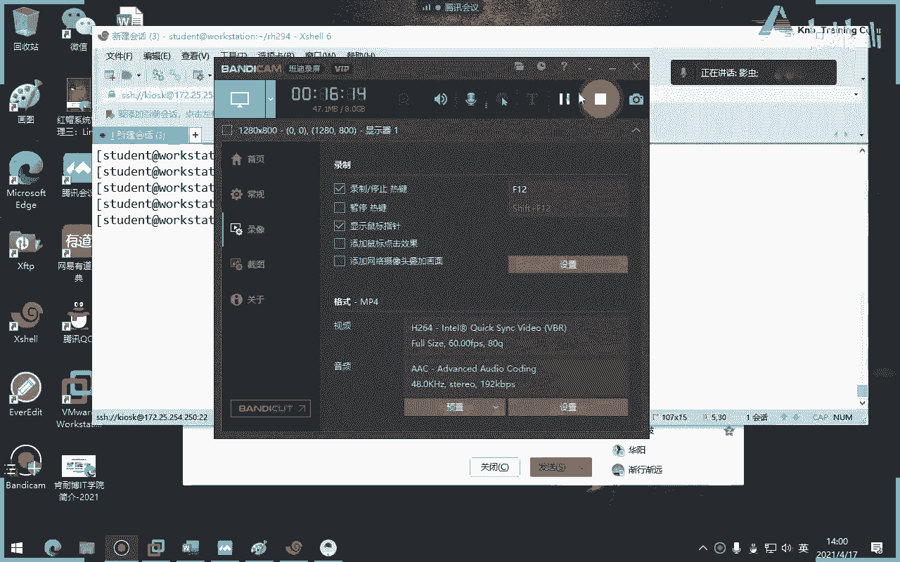

# 红帽认证系统工程师RHCE8-滕老师出品 - P17：第九天 playbook的书写和变量使用 - KNBIT认证中心 - BV1up4y1h7MA

那么从今天下午呢我们就开始讲第三章叫实施playbook剧本原本，那么我们可以把它理解为我们的shell当中的脚本啊，当然肯定不是一回事啊，那么临时命令呢我们可以把它理解为咱们学的各种各样的这个命令啊。

那么就相当于我们的小模块对吧，那么实施play book的目的就是把这些模块啊就是组合在一块儿啊，第一种逻辑结构写出来的剧本，那么发送到对方，所谓的对方就是被管机。

这个被管理机器就会完完全全的按照你的playbook里面怎么写，他就会怎么去运行，就跟我们写脚本一样对吧，写的脚本里面什么任务什么事情他就按照那个脚本里面去做啊，123456这样去做啊。

好那我们来开开始看一下嗯，那么这个剧本呢也是我们的三大文件当中的最后一个啊，刚才讲过临时命令可以做一次性的一种调用，比如说我说建一个用户，那这样的事情就不需要写playbook，但是呢如果复杂的呢。

又建用户，又建了阿帕奇，又建立数据库，又开防火墙啊，又删除用户，那像这样一堆的事情，你就很显然用单个的临时命令就不足以能够胜任，因此呢我们要写playbook剧本啊，注意它不是脚本啊，它叫剧本啊。

所以你看如如果想发挥and robert真正的力量，那需要大家学习写剧本啊，继续好，那么我这边的英文就不给大家，中文就不给大家去念了，因为没什么意思，咱们直接来看重点，你比如说像刚才这句话。

各位是一个典型的临时命令吧，那么这个临时命令把它翻译成下面这个就是一个bug，大家看到没有，其实一条命令搞定它要写成这么复杂，看到没有啊，是很复杂啊，各位真的很复杂，你看到没有。

你看其实一条命令他要写这么多行，而且每一行之间呢还有一定的语法格式，比如说间隔，比如说缩进，比如说冒号，比如说单词的拼写啊，这些东西都会造成我们可能会出错啊，好那我们来说一下普利book啊。

首先不记住一点，我我正好跟着写啊，blab是以亚某格式结尾，以压模格式啊格式，那么因此呢结尾都是什么点y ml啊，结尾文件都是点y ml结尾当然很想，你要通过vr m编辑器或者vr编辑器去编写啊。

但结尾一般是挖ml就是压缩格式啊，em格式好，那么polyp怎么学习呢，因为很多同学在初次写playbook的时候，他总是记不住该写什么，你来看这么多，很多同学不知道我写什么对吧。

你为什么这边有个name，为什么name下面就一定是个host，为什么就一定是个test对吧，所以很多同学不是很明白，所以呢我们先把语法格式一定大家先掌握了，然后我们再来写play不好，这么多怎么看。

不用看了，我来给大家讲一下啊，play book是由什么组成的呢，注意在哪个笔记啊。

每个playbook，是有若干play组成，那语文老师这个play怎么翻译，你不要翻译了对啊，这种东西就不要翻译，心里面有就行了，你怎么翻译完了翻译成玩，不能吧，不能吧对吧好，每一个play组成。

而每个play呢，又有三个键值对组成，大家知道什么叫剑值吗，听过吗，这个概念没有，比如说这个啊，name是个键冒号，后面tom就是值这一类类类类类似于变量的感觉，左边是变量的名称，后面是变量的值，懂了。

这是间值对好，那每一个play又由三个键值对组成，哪三个呢，第一个是name，键值对name，name后面是host，注意s啊，我标一个红色的，什么大want红色的啊，待会儿标啊。

还有一个就是我们的任务tasks，注意这都是有s的啊，s我标注一下啊，理解吗，你注意，你只要把这句话给我记住，再复杂的playbook，你今天就全懂了，懂了吗，你再复杂的play不。

你只要照我这个公式去套就行了，再说一遍，每一个playbook都是由若干play组成，每一个play有三个家伙组成，name host test，完了讲完了，我们来对比一下，是不是，看来同学们看一下啊。

比如说年糕，我做了几个play book，很显示一个play book里面就有一个play，为啥，因为它有第一个限制对name，第二个限制对tasks，还有一个host 2123是不是好。

那每一个task的是什么，task翻译成中文是任务对吧，这个单词翻译成中文叫任务，注意啊，再说一遍叫任务，而每个任务又可以有若干个子任务啊，就呃又又又可以由若干个任务组成列表叫任务列表。

你看现在很显然是这一个tx有几个任务只有一个吧，那你说老师你怎么知道一个注意，每一个pass是不是都要用名字来起头对吧，不然我怎么知道你名字叫啥，哎说是名字好。

其实这一串的playbook就算我今天没讲，我敢保证你们每一个在座的同学都能看懂，为什么，因为你们学过是吧，临时命令不就是你看转换一下，不就这个样子吗，就一模一样，可能你们不会写对吧，可能你们不会念。

但你一看大概意思就是哦我要建一个用户，并且ub是4000，你肯定是能看懂的，你一定是能看懂的好，首先这一块能过了吗，所有同学都过啊，不懂就直接提问好，如果你能过了，接下来我们再来具体讲缩进怎么说。

这是很多同学初学者特别头疼的问题，什么时候该缩进，说几个谁和谁跟你搁一块对吧，很多同学会有这样的疑问，那么呢我跟大家讲一下，是这样的，如果是一个子集，一个级别的，大家要相同的缩减。

那你来看name host pass pass，这三个是不是限制段，这三个限制段是不是组成了唯一的一个plan，因此它们的缩紧看是一样的，你看我用绿这个蓝色的线标注一下，看它们缩进去一样的。

但是tx里面是不是刚才讲过tx是不是指的是任务列表呀，那么任务列表肯定对于上面这三个来讲是是什么就子吧，所以你要缩进的大一些，缩进的大一些，看到吗，声音大一些。

而那为什么下面那个name u i d和steaks这三个字要更缩进一些呢，因为他们三个人是不是u在这个模块的什么选项呀，对不对，你看不就是你杠a这里面的内容吗是吧。

所以说肯定他们三个人要比user这个模块更小嘛，所以要再缩进一下，明白了吗，所以你一句话，同一个级别的元素要在一个缩进里面，而子元素要比负元素说的更多一些吧，那你老师说几个无所谓，说100个都行啊。

你这个做100个，那个也要跟你说，100个一定要在一条线上啊，那那这怎么写啊，没关系，红帽八当中的vm编辑器已经帮我们设置了这样一行一句话，这句话是指自动缩进，他会自己判断，他会自己判断出来。

他觉得这个是父，那个是子，它就会多拖地一点，当然了，这只会干嘛，只会帮我们解决一些问题，但不会每一次都生效，所以有时候你还要手工的说一下，明白了吧，一句话。

同一个级别的元素要相同缩进就是你把这句话记住就结束了，好我们来写一个，来我们来写一个嗯，而且每个每一个playbook必须用三个横线开头，啊没有，为什么必须用三个横线开头。

那么结尾呢必须呃不一定用三个点结尾，就你看书上告诉我们，通常我们会省略三个点，也就这三个点可以不写，三个横线必须写，而什么是列表呢，注意带横线的就叫列表，这就叫列表，那么我们问一下列表是不是同一级别的。

看听懂，所以你的缩进也是一个april orange grab对吧，苹果橘子和葡萄，他们三个都是属于蔬菜啊，那不是那个蔬菜，那个水果就他们缩进去是在一个，对不对好，那我们来写一个。

我们就刚才那个事儿来写一个怎么写呢，咱们也建立用户，那这次我们建立用来建立，看怎么建立，首先是不是在这个下面对吧，好两大文件已经有了，第三大文件咱们就叫做create吧，那算了。

咱们就叫做a b c叫create user，点对不对，明都无所谓，但一定要是挖ml，结尾好，怎么写呢，123开头好，注意刚才讲过每一个playbook是由一若干个play组成。

每个play呢有三个元素组成，name in the name，好，大家有没有发现只要有横线的，必须有空格，看到吗，我只要有横线的，必须后面有空格，所以说横线和name有空格，第二句话，只要有冒号的。

必须有空格，再给你记下，只要有横线空一格，只要有冒号空格，你把它念成口诀，你就永远都不会忘，形成一种肌肉记忆，你看你每次打完带空格是习惯按一下空格好吧，但是空100格行不行可以，但你不是疯了吗。

空100格对不对，好这个时候接着我们来写一句话，随便写这个随便写，比如我们就叫做测试吧好吧，咱们要测试创建用户可以吧，随便写，哎你看大家看到没有，它居然给我停到这儿，而不是最顶格。

这就说明我们刚才vm里面那个自动缩进是不是生效，按道了，他是不是应该给我放在这儿，对不看好，第二句话呢，三大元素吗，name host，test，host指的是什么呢。

指的是你这个playbook给谁用啊，我现在管理1万台机器，你是给1万台用吗，不一定好，那么house是指的是你给谁用，如果选二呢，那就代表1万台对吧，这指的是我们的in wintry里面的所有的机器。

注意一定是在引文学里面清单里面好，那如果写web呢，就代表是给那个web，哎刚才我是不是有web，这个组是不是a和b啊，好那我们就这样算了吧，咱们db吧，改一个好，第三个呢，tasks。

你看别忘了写s啊，你看他又帮我空，你看这次他的空格直接放在他下面，为什么，因为他认为你下面开始写任务列表了吧，任务列表刚才讲过每一个任务列表第一行要写什么对吧，你不写名字，我知道你是谁啊。

好好刚才讲过横向后面就要加空格，name，后面加冒号，冒号后面就要加空格，你看你不会忘吗，所以你随便写，比如说create随便写错，拼错就拼错无所谓好，接着就要知道用哪个模块，又在模块吗。

冒泡你看那么第一个，当然当然这个里面的东西是不是要用undock来查看了，那我怎么知道是哪，查看出来了对吧，好比如我们叫jack好ur d谁呀，随便举个例，比如说举个例是这就是123456吧，随便吧。

好状态是建立结束了好，按道理呢我们应该干嘛，三个什么123可以不可以不写，可以写，那么由于我们第一次上课，我们严肃一点好吧，写一下啊，好结束了，那么这个playbook就被我写完了，我写完了。

那对不对呢，不知道我们的运行才能知道好，那问题是怎么运行呢，教材当中告诉我们，当我写完之后必须使用键，这都是废话，咱们不用看了，当我们写完之后，必须要用play横线。

acs横lacier横线play book去运行它，让我们运行，我不想检查，因为我直接运行的时候，他有错误不也行了吗，好如果你想有输出，加个v v一般的什么单词啊，这个单词的缩写好，那如果再加个v呢。

更详细，那再加v呢更加详细，那再加v呢就就就特别特别详细，你看我满屏幕都是东西啊，大家来看全是东西，屏幕上为什么，就是因为你加的v太多，那有什么好说的，但我这个实验做错了什么错，错了兄弟们不错。

我来告诉大家，应该是没有权限，应该是没有形象啊，好那我们查一下啊，看看是不是嗯，试试我不加v了，你不加v就没有东西输出吧，就没有那么复杂了吧，人家成功了啊，看状态称之的说过称职的代表什么就对就对。

就改变什么改变就代表你的目标机器已经做了这个play不了，那我再当我再执行一遍呢，他还会称职的吗，请问这边的称职的就会变成几零，因为它有密整性啊，零了吧，好这个实验做完了，那么pp对吗。

对那么为什么不成功，因为我刚才没有权限的事，懂了吧，这里有权限的事不代表没有成功，懂了吗，好那么我们这就是一个典典型的play bo好，这一串能听懂吗，可以串，什么是列表，列表就代表一组任务对吧。

一组啊，你比如说像教材当中给我们看到的这个，你看这就是个典型的列表，你看像这个任务有几个任务，三个123看开头都是看顶格写呃，就是那个他们的缩进是一模一样的，缩进一模一样，简单吧，其实你只要掌握了。

我给你讲一些秘诀，再复杂，你写1万行playbook都可以，都是套用刚才那个公式，你只要把一个playbook看懂，剩下的无非就是干嘛多呗啊，无非就是多一点而已，没有别的。

无非就是你不认识的不认识的模块而已，但语法格式相同的，所以说你看他不说是人类可读的简单语言，它真的很简单对吧，他没有说让你去想编写一个c语言这么复杂吧对吧，哎好了，那么怎么运行呢。

刚才讲过ebook就运行了啊，如果你运行过程当中呢有问题呢，你可以加v v什么意思呢，v指的就是a过程加两个v呢，看详细越多的v越详细，当然了，教材当中还给我们输入一些哎就交代就不解释了。

还给我们出现这个单词，这个单词是指在运行前面先干嘛，做语法检查，就是我还没运行呢，我先做语法检查，万一我的book写错了呢，但是我发现各位同学不太好用，因为有时候他检查不了啊，就有时候它检查不出来。

所以怎么办，最好办法就直接执行错了再改一改啊，对或者下面的杠c空运行啊，就冒大写的c哈哈，大写的c叫冒烟测试，就是我看似是运行了，但其实没有运行，明白吗，冒烟测试啊，大写c大写啊，明白吗，它没有运行。

但但你会发现它的过程特别像运行，但它没有运行好了，这个实验讲完了，那么请大家自己把这个实验做一下。

开始，开始了啊。

其实呢所谓的多个play就是90多个杯。

哈哈就没这么解释的，就多个嘛，那刚才呢我们是一个现在是两个了，你怎么知道两个，你看是不是从头到尾又来一个host name task对吧，又来一个name host task，就说明是两个。

永远记住每一个play book是由若干个play组成，怎么能体现出若干个，而不是一个就看有几个有几组这个name host task，大家再来发现没有，他们是一个缩进，看是不是索尼一样的，懂了吗啊。

说你一样的，我就不做了，直接再做，更有基地吧，哎不行不行，就把他给说一下啊，这个不用说是吧，因为这个咱们介绍过了，这也介绍过了对吧，他看那个bug对吧，接着过了好，那我直接来做客，这次我来做，你们来看。

都是废话不看，啊这个注释我不想讲啥意思啊，就前面加个啥型号，这是一个提示啊，啊好不行，还真得讲的稍等稍等，咱们讲一下课吧，来来来来好，从这开始啊，从这个playbook和语法变化开始讲起了。

他第一个注释过了啊，注释指的是不运行，这是给人看的，第二个字不算，比如说咱们起名字不是有个name吗，那不是写字符串吗，字符串有两种三种写法，第一种是不带引号的，第二种是带引号的，第三种是双引号的。

刚才你们写名的时候有没有加双引号，可以加可以不加，无所谓好吧，爱加就加，那么如果要编写多行的时候，通知完就要加竖线或者大于号，对呀，如果你的这个字符串特别长，你想把它写成三行或者四行或者五行。

就要用竖线或者大于号，其实这不是三行啊，这不是四行，其实这是一行，就是它只是它干嘛分成三行写，好处是什么，就是人眼睛看得舒服一点，不至于这么长，那么这时候就要用竖线或者大于号，我就说这一遍啊。

各位后面咱们就要用到啊，就要用到好，最后这个字典那个概念呢哦不好解释，如果大家学过python，大家没学过python，学过python的同学，就应该知道字典其实亚某就是通过python引过来的。

所以它里面的概念语法都跟我们python的格式几乎相同的，那我们来看什么叫字典呢，字典其实就是一个这样子的感觉，剑指对对，那么很多同学会把字典跟列表混淆混淆，千万别混淆啊，列表前面要加什么横线。

只要你看到横横带横线的就是列表，不带横线的就是词典，好吧，你看也可以写成这种形式形式，花括号的形，而这个花括号的形式，但是画画的形式呢会让同学们觉得比较看着比较别扭，而且中间还有冒号分割。

语法格是比较复杂，没有上面这种简单的好，这就是典型的一个列表，看到没有横线横线横线列表指的是相同的一组单位吧，对不对啊，一定要看清楚什么是列表，什么是字典，那么为什么要解释这个东西呢。

因为到下一章我们在写循环的时候就要用到词典，也要用到列表啊，所以现在先打一个基础好吧，字典和列表，那么你来看过时的写法，我们只学啊，不要去做，就只要了解一下就行了，什么叫过时呢。

像这种带等于号的都是过时的，按道理我们应该怎么想，是不是应该写成建筑队的形式，数数字写对吧，只要你看到横线都是过时的，但你不能说人家错错，你看这个下面才是我们应该学的，而这种方式呢我们不学了。

但它不是错，就是老的写法，因为我们以前在学2。3之前的都是这样写的，那你现在已经学到2。8了，就不要这么写了，好吧，那所以说我们就不学了好那么这就是这一章内容，那么接下来呢我给大家做一个题目。

叫十十多个play，我教大家怎么去做课后习题，不是说我们照着单词一个字儿敲，你得知道这张要你干嘛好，我来你们，你们看着我来做就行了，赖不赖不，我打完这个目的是干嘛的，是不是为了生成这张实验环境。

所以在生成的时候，你就要看一下这个内容，第一个验证一下怎么装了吗，是不是创建一个工作目录，第三工作目录里面是不是有个英文储文件，第四有没有配置文件，有没有不知道ios看哪个。

第二个很显然第二个那里面是不是应该有一个引文文件，是不是里面也应该有一个cfg文件，看一下是不是你看，所以你得知道这个干嘛的啊，好吧，那我们来看一下银灰时间有啥啊，有一个叫server a的东西。

它没有分组，没有分组，不就是自己吗，看一下它的配置文件，本文件写的是什么，不知道看一眼哦，原来写了这么一堆，什么叫remote user，第四就是我用divers这个用户去联系，而不是学生吧。

也不是管理员吧对吧，所以你做题的时候你去看看，你不要在这照书抄啊，懂了吧，你怎么知道现在这么做，因为他已经给我们提供了好，那接下来我们来看这题，要我们干嘛，其实这题跟刚才那题一模一样，也是做一个阿帕奇。

也是做一个什么链接文件一样的啊，好我们现在进到我们的工作目录里面，那么接着很显然让我们写poebook吧，对吧，你看啊对了，polbook，那我们随便写个名字，咱们就叫test mam吧。

我就不照书抄了，好123啊，随便写吧，好那么要我们干嘛要做哪些事儿，看看这是干嘛，为什么要这边要加个yes呢，为什么我们playbook里面要加个become yes呢，各位有没有想过，因为所以哈哈。

因为啥，因为你的cfg文件里面它是no，看到没，它是no，哎那我请问大家，如果这边写no，那边写yes，哪双向肯定yes生效，为什么，因为yes更加具体具体到playbook了吧，对不对。

永远记住polp里面的东西就是范围越窄，优先级越高，你在cn v g里面配置的东西肯定要小于，肯定不可能变的吧对吧，他是故意写成boss，理解了吗，故意的啊，好那我我我们心里要明白啊。

所以你不要照书抄啊，好那么我们来写一个，然后现在干嘛干嘛啊，是哪个host是指这个主机，因为我们清单文件里面只有这个主机对吧，那我直接用二行不行就可以啊，对不对，好，让task什么任务呢。

我们来直接看书，我们不照着抄啊，看书他要他要我们做什么任务啊，他说定义第一个play中第一个任务，第一个play的第一个任务能看到这个中文吗，好要求我们要创建阿帕奇和创建防火墙好。

那很显示要用压迫模块吧对吧，哎呀打错了也就叫做创建web和防火墙好，那么创建是哪个单词样吧对吧，那name name是指你要创建的什么样子的哦是吧，这样写行不行，这是不是列表了，有对吧，这是列表吧。

好然后状态最新可以吧对吧。

对心啊，好第二件事再来看教材，第二件事，第二件事干嘛，添加一个play，确保这个文件中含有正确的内容，好这边开始创建它的web的内容了对吧，web内容啊，好那就是第二个人，拷贝了吧。

那么为什么要用content，因为为什么不用s i c，我们没有sc啊，说白了我们没有外部文件引用，那么这句话意思翻译成中文是不是叫内容，说白了我自己写的内容对吧，我自己写个内容啊。

所以我们来写一下自己写的内容，随便写，比如说哈哈好，那这时候呢目标呢，目标的目标就是vr下面的3w下面的html，下面的，什么s啊，这个是啊，我们老写s了，好第三件事呢。

第三件事是不是要确保这个服务启动对吧好。

我会启动启动启动启动启动启动就是那个单词啊，start启动是这个单词。

啊怎么用，不知道不知道，我们去看，不知道就去看。

不知道我们去看，打开一个窗口是为了去看assimple dog，所以说这个就无所谓管理员了对吧，好哪个模块呢，这个模块这个模块是启动一个服务，怎么用，不知道不知道去看，咱们一直都不知道。

就直接看到突破率excel，那这个不就典型启动一个服务嘛对吧，那你起呗，never，这是什么意思啊，开机自动启动，那不光要洗这个还要起什么哎，起帮我想，不要说明你要写成魔那种形式，就是那种列表形式。

那你试试，好然后第三句话是什么。

第三个任务是干嘛的，第三个任务是这个放行防火墙是吧，哎放行防火墙，那我就直接找出超了，放心防火墙用的是fl的du，这个缩进有点问题，比如说八零吧，嗯嗯因为名字你想想怎么起怎么起。

首先是service的名字，或者写成p，都行，明白吗都可以啊，这个单词叫做永久，永久这个单词叫做启用，就是开启的意思，这个单词叫做现在就开启了一点点a t，我感觉有点点问题啊，没有问题好，下面开始干嘛。

啊这是启动阿帕奇啊，第一个任务结束，第一个任务结束，我不做了，各位我不做了，我先看看第一个任务能不能成功运行，那我白做了对吧，这是第一个play，加盟红眼，加盟红眼，每个弹幕都有ok成功嗯，没有没有啊。

那接下来再说第二个是这是第一个啊，不是这不是第一个人，我说实话这是第一个play啊，这第一个play，那么接下来我们做第二个对，第二个配队要干嘛呢，就要顶格写，还要顶格写，要跟这个在一块。

这是第二个play啊，再说一遍，哎呦，比如说叫二吧好那么同样host local host就可以了，就我自己，然后呢test是指我要干嘛进行干嘛浏览，对吧啊，比如浏览这个web配置吧。

好那么用哪个用哪个模块呢，i i吧，我记得忘了忘了，不知道忘了，我们就看谁记得我也不记得是u i i i u，好那你用哪个哪个呢，我们看一下，就是它u r l是吧，看到吗，这个是干嘛的，是来查看什么。

是不是啊，对不对，所以用u r l啊，r l这个选项好，是谁呀，对呀，是不是啊，结束了结束了吗，其实还可以再加一个东西，再再加一个八零了，还用加什么端口，再加一个return吧，ok就是它加一个啊。

无所谓，想加一加，那我们加一个吧，加一个好看一点，返回系统返回值，哎呦卧槽上不下了，ok结束了，再加一个整体，前面还会做吗，乾坤是不是不做了，绿色了吧，密等了吗，第二个开始正式做了，哎。

ok成功说明什么，说明浏览成功了吧，懂我意思吧，同学们就是两个play，大家发现什么叫两个play，就是两个，那那那什么host task name，但是每个要顶格写吧，是不是要顶格，你看最后一个结果。

我把它缩小一点，你看不要顶格写，看是不是顶格写最上头上，是不是两个play，第一个play有几个任务，12345个，第二个就有几个任务，一个浏览没了，懂了吧，这叫多普勒。

一个play book里面有两个play，每个play里面又有不同的task任务，如果你会画那种缩进图，是不是很明白，大家有没有发现这个这个逻辑很强，其实吧你只要掌握，我可以告诉大家。

今天你只要你只要来今天一天就够了，其实明天的课后天的课都是一样，无非就是学不同模块，你只要把今天这一章讲完，你就可以说你就会按是吧，明天你可以不来，后天你也可以不来，因为就是讲模块了。

后面主要是今天这一章好休息会儿啊，那么刚才我们第三章讲的是一个简单的play book，主要告诉大家是语法怎么写的，那么从这一章开始，我们要讲一些难一点的，就是为了增加难度，我们要讲一下变量啊。

这一章就讲变量，那你说老师那什么叫事实呢啊这个如果你见过英文版的教材啊，他那个叫fat，fat是不是事实，f a c t是吧啊，f a c d，那么事实是个啥呢，也是变量，也是变量啊。

所以这一整章就讲这一个事儿啊，一个是变量好，那我们来看一下啊，这张不简单，有点绕，好，来开始啊，什么是变量，咱们学个事好吧，我以前想是小时变量啥意思，变量不就是一个给一给一个什么内存。

给一个被命名的内存空间起一个名字对吧，比如这一篇的内存，我给它起个名字，但是里面的值呢是变化的不固定，所以叫变量吗，那同样咱们的安全胞当中呢，变量也是这个概概，也是这个概念，老师我为什么要用变量呢。

因为咱们在写这时候可能会非常复杂，那么你每次都用固定的纸写的时候，你会觉得比较重复，但我们可以干嘛呢，比如说像这个哎我需要创建的用户名，我可以我可以为这个要创建的用户的名字起个变量。

每次只要调用这个变量，其实调用就这个名字吧，懂了那样我为要安装的软件包做个变量，我每次调用这个变量，其实就是为了调用这个软件包，依次类推等等等等等等，明白了吗，哎这就叫变量的好处。

但永远记住学任何变量都是先定义后引用，所以你可以想象一下，我们在定义变量的时候，一定是不是出现在最上头，可不可当中比较上头的地方最顶格，对不对，他肯定不可能在tx里面task是不是要具体做的事了对吧。

所以一定是在task上面上懂我意思吗，好那么问题是我们怎么定义变量呢，哎你看这是错误的，不用看了，直接看，对，我们以前讲过变量，不可以不可以不可以不可以是空格吧，对不可以，那怎么办呢，如果有空格。

必须用什么下划线，这一点一定要注意，永远是下划线，没有空格，没有双引号，没有单引号，一定是下划线的，但你你你可以不起那么复杂的必然两名吗，那为什么要起那么复杂变量名呢，对不对，这只是给大家讲一个事。

就是可以这么齐，如果有空格要用下划线来连接，懂了好定义变量啊，接着再来看看这个难的地方，就在这儿，变量的作用范围，他说了这么一堆，总结一句话，范围越窄，优先级越高啊，好你看什么叫做全局范围。

大家想想在哪个地方可以定义定义全局范围的变量，cf里面可以吗，哦不不不，那个引文数文件可以吧，可以啊对吧，具体的play里面可以定义吧，可以啊，所以说如果你在play里面定义，那它的优先级范围。

优先级一定要比赛配置文件里面的范围，这个优先级要高，那如果你在具体的某一个主机当中配呢，那就更高了，对吧，那就优先级就更高了，那你永远就是就是一句话，范围越窄，优先级越高，就把这个大的方向把握住。

其他都不用记啊，那有些同学可能就会问我自己区分不了哪个是窄的，哪个是宽的，那你这个就别学了，兄弟你怎么可能区分不了了，你都具体到某个主机了，他肯定是范围最窄的，对不对，你在cfg里面配。

那肯定是全所有人，全人类都可以看到的，那肯定它的范围最高啊，它的优先级也是最低啊，对不对，唉明白吗，好你看这就是一个典型的在playbook里面定义变量，变量怎么定义呢，请注意了。

想使用变量一定要用vs，这是个关键字，没有为什么v a r s不要少了个s啊，好吧，来我写一下，怎么是黑色，我用黑色啊，关于变量，啊先定义后使用，使用关键字，等于这两。

好那你来看看教材当中给我们一个非常典型的东西，这就是一个vs后面加上两个变量，一个变量名字叫user，一个变量名字叫home，因为老师你怎么知道这是变量，因为它叫vs，如果没有这个bus的话。

我们看不出来这个变量，但是它加了这个v a r s下面两个问题一定是个变量，但是我想请问大家，这个应该不会不会不知道哪边是变量名，哪边是变量值吧，肯定是左边是名吧，右边是值吧，这个最基础的东西得知道吧。

好那第一种，第二种，第二种你还可以使用外部的文件，就是我把这个变量我不写在我们这里面，我写到某个文件里面，我引用过来这个单词叫wh，下面的false，大家看s，我请问大家这边能看懂吗。

这很显然是不是有个叫vr s的目录，下面有一个users的jm文件，这个压m文件里面写了这样两个变量，看懂了吗，同学们看懂了吗，就一个是直接用，一个是引用外部的files文件来做一下，我我不讲了啊。

这样可能不太明白，我们来做一下怎么做呢，来看啊，有大也看不到，不好意思啊，14吧，可以看到吗，后面好可以啊，我去好，我们来定义重新来重新来来来来来来做一遍啊，我们这样做。

我们先定一个变量名句叫做看它定义了，我们这次换一个在bot下面啊，定一个变量名叫f吧，不不不不叫叫叫叫叫，a b c，d a b c好注意啊，我我我能看懂吗，哎别了别了，这样做不太好不太好不太好啊。

还在我的294里面做，是我294啊，这是我自己做的啊，你为什么念在这儿好，那么，删除掉啊，稍等好，那么我这么做啊啊我怎么说怎么说怎么说，这样做看，然后我就叫这个瓜子好在里面我定一个a abc。y没有好。

你看我这么说p啊，咱们叫做d o v e c o t top coat啊，好我定一个变量名字叫pk g变量值叫dp cot啊，好da大家知道吗，邮件服务器邮件收件了，不是发廊收好。

接着我们来做这样一件事，回到上级好，开始写一个剧本，剧本名字叫做task。y m l，你看已经形成就是规律了，就这么写好，test，放放放放放放放没有放了，就这样吧，好然后，然后注意。

好这个时候我引用vbs诶，我有vr诶，我是vr s吗，啊是的啊，s目录下面有一个什么哎呀，好开始什么，拿少了，少哈拉少了，我为什么要加杠，我知道书上加了，我知道书上加了，但你知道为什么可以不加吗。

你知道可以加吧，可以，但我为什么不加，但我现在就我一个人，我要什么列表，我是我一个人要什么列表，懂我意思吗，可以加，可以不加，灵活点，好安装这个这个邮件吧，邮件怎么拼没有吧，好注意，要么好。

变量做完之后怎么用呢，请注意书上告诉我们了，变量在使用的时候一定要用双引号加双花括号，注意双引号加双花啊，花括号好，那因此我在装的时候可以这么做啊，就是，那我刚刚自己定义的变量是p p t啊，对不对。

好，然后呢状态呢随便你这个是不是安装结束了，这么简单，就这样，报错应该报错啊，因为我没有权限，我都没有权限的事，不用担心，就是没权限，不是报错啊，好来开始装了啊，按错肯定早就跳了是吧，懂了吗。

是不是我引用外国的文件引过来，当然你可以不叫vs这个目录，你叫什么目录都行啊，但是一定要叫vs files，那个关键字一定是那个啊，好这就结束了，没有好，那么我继续把这个补充一下啊。

那也可以可以使用那个，这个引用我们的什么引用外部的变量文件，但是文件名字一定是点y m结尾对啊，我问一下好，结束了，你只要把这两个搞懂，这个下划线啊，你只要把这两个搞懂，你就明白了。

拿了两个高冷就明白了，结束了啊，变量这个变量你当时自己看书能看懂吗，那你那你那你告诉我你哪个看不懂啊，你看这是典型的错误，他耍啥，各位对呀，说过了双引号，双花花括号，你把它死记硬背。

你看他直接告诉你箭头，意思就是他这个位置有错误，对吧啊，好这个能看懂吗，主机组和主机变量，那好那我们来说一下，为什么我问这个问题呢，因为我在其他班级当中讲这一章的时候，几乎所有人都晕了。

因为这一章他讲就讲那么多，他也没有实验，也没有更深的讲解，那么很多同学看自己看的时候都看晕了，那么我待会儿我们自己设计一个实验，来讲一下什么叫主机组和主机电量，刚刚那个都听懂了吧。

那我们来说一下什么叫主机组，刚才讲过是不是可以针针对某一个主机直接赋予变量，它的权限最值干嘛最大吧对吧，因为它最窄嘛，它的优先级，那么我怎么会特定的主机或者为特定的主机组来定义变量呢。

需要用两个单词啊啊，啊咋了，区域先级优先级最高，怎么滴呢，但是我在引用的时候是不是得用英文水，你想想你做的时候不要你是不是host or或者host某某某某某对吧，你是不是还要调用饮温水。

整个饮温水里面有那台机器的那个主机直接就用了，就是说如果在全部里面，那你不是我认识的，那应该是什么样最高的，那待会你做实验试试，但是你做出一个实验试试就行了，就知道试一试啊，我记一下啊。

那那我们怎么去针对主机组和主机做变量呢，那么以前老的写法是这样的，大家来看这是不是一个引文数文件，是不是直接在引用，就是后面直接加看，这是一个变量变量，他这样做的，但是咱们现在不这么干了，2。8版本。

包括2。7版本都不这么做，那怎么做呢，你看他说了，不建议这么做，那怎么做呢，需要有两个目录来做，那老师我就能做行不行，可以可以啊，但他不建议那用哪两个目录呢，大家来看他用这个目录和这个目录好。

我来写一下，那么这个为，第一个主机组按主机是host vs，注意我说的是目录啊，各位目录目录好，那么这个目录我怎么定义呢，你比如说啊各位我们现在有两个，因为我们用我们的饮温水。

比如说我现在说的是外部外呃，啊这样好这样，我希望我在这个bb当中为这个server a和server b不好不好不好算了，我我我我把这个疑问去改一下，稍微改一下啊，哎没了没了啊，我没了也不能这么想。

可以写在上面，你说sbs加c加了啊，c吧，好这样我定义一个主机叫server c，我定义一个组，那么我希望呢对server c装ftp软件，a和b不装ftp软件。

而且我希望用主机变量的形式来操作一个题目，是不是很具体了，好那你想想怎么做呢，那通过分析它是要为主机做变量，那我就要建立一个目录，叫做host vs，而不是叫做group vs，听懂了吗，看出来了。

第二个建立host vs之后，我就要在host vs里面去定义变量，那么问题来了，这个变量的文件名叫什么呢，很多同学就运了，一定要跟你的主机名字一模一样，比如说你是svc吧。

那你要定一个svc这个文件文件名字就叫做server c，那样如果你想针对主机组变量呢，你待会在group vs这个目录下面定义的变量的名字，这个文件名字就要是组的名字，你来看下面这个题目，看能看懂吗。

你看我有一个清单叫做data center，数据中心一里面有两台机器吧，还有个二两台机器，对不对，你看这就是很显示一个什么主机组变量吧，那么这个是个文件，注意这个单词是个文件，而不是目录。

那么很显然他用data center，那最后谁生效，谁生效不就是他们生效吗，这一块生效吗，因为它用的是带着centers啊，是不是这个组生效，也就是说最后的结果是上面这两个并不会使用变量吧。

对吧好，那我做一下啊，咱们先做这个嗯，你看看怎么做，还是在这个路径下面永远认清楚这个路径，然后这时候我把它删掉，把他那个删掉好，这时候我这样做，首先建立一个目录。

注意建目录叫host vs进去定一个变量，变量名字叫什么呢，我想针对哪台主机回车好，回到上级，回到上一级，为什么要上级啊，你肯定要他上级嘛，然后写配置文件啊，写这个play book文件好，我就小。

为了让大家能看清楚，我去写，然后呃怎么想，我想我有点遗忘，稍等我想想，我想安装安装安装安装安装tp，ok同学们是name吧，ok name走，你叫什么，好我虽然写的是all，但你会发现最后只有谁安装。

我们判断一下只有c安装，如果不对，咱们实验失败了对吧，我们试试看啊，看是不是有c，虽然我写的哦啊同志们，虽然我写的哦，都你，报错报错报错报错报错，虽然我写的是奥，会有一堆的错误，看错了吧，为什么错。

是不是a不装b不装，这个错是对的，同志们不要认为错是错，哎你看a和b干嘛呢，field但是c是撞了，同学们明白了吗，虽然我选的是二，但是我指定的是主机变量，而水机变量我指定是c吧，还有一个细节。

我不知道大家能不能发现，你来看我这边定义的变量为什么叫做server c，因为我的清单文件叫什么，如果我前天给你写的server c。lab examincome。

那这边就必须要做server c lab examincome，听懂了吗，你的名字叫什么，你这个文件名字叫一模一样，一个单词都能拼错，ok那我灵活一下，如果让大家做个主题组呢，非常简单。

上级目录建一个目录叫g r o p下划线v a r s跑到这个里面，知道吗，再建立一个，咱们咱们是不是有个组叫web，那这个名字就应该叫什么，就得叫wey，懂了我就不做了，好明白吗，我就不做了。

好最终结果给大家看一下，tree，看到这个结构题吗，这不是host下面一个下面c，讲到这儿先不讲了，因为可能有些东西就有点晕了啊，停一下，仔细分析一下，不讲了不讲了。

接下来我们来说一个稍微难一点的，就是使用数组作为变量啊，那么不要当你看不懂这串中文的时候，就不要去纠结每一个词，直接看代码，比如说我们现在要教大家怎么看，比如我们看不懂，我也不看，那我这一堆能看懂吧。

这个你肯定能看懂，很很显示前面变量后面是直吧对吧，但是呢他说你可以定义成一个数组，比如说我为这个数组起个名字叫uders，注意这个uders并不是一个别的，它只是一个数组名，这边呢分别是两个指向对吧。

那你在引用的时候，大家看可以这么使用，就ud点儿第一项里面的第一项看到吗，能看懂吗，一样这边呢就是ud点，这是第二项里面的第三项，看到吗，不用点来代替，你可以去这样去访问。

所以说你未来在看到人家怎么写书，你就知道啊，其实它是一种数组的方式，知道一下就行了，后面用的时候我们再说，你知道有个概念概念有印象就可以成为今天有点好，那么我们今天这一小节重点是这一块。

但是这一块它非常轻描淡写的就讲了，以至于很多同学在看后面的章节当中，根本就看不懂什么叫做注册，什么叫做捕获，所以我们呢把这给大家分析出来，解析出来，我们讲戏剧性。

首先我们可以使用register这个这个这个这个模块来捕获命令的输出，记住这句话，那么来看下面，首先我问大家这半部分能看懂吧，蓝色的是不是装包呀，好装一个阿帕奇h t p d阿帕奇这个包。

其实你会发现你做任何事情，我们都会有一定的输出，只不过我们刚才做没有去打印输出而已，那么其实我们可以看到输出用什么来看到呢，就用register这个单词来看，怎么看呢，刚才讲过它是记录变量啊。

它是记录我们的输出内容吧，怎么记录呢，后面加上一个变量名，记注意这个install result，这个是一个变量名，你可以叫a b c，随便名字随便起。

他把刚才安装阿帕奇这件事情什么保存到了一个变量叫做install and result，里面，用什么保存呢，用register这个来保存，或者说或者说这个模块来保存，但是我们只是保存了，我不要看一下。

就要用debug来看，你能看懂吗，它俩是衔接的，100g是什么意思啊，调试招式，那么debug有两个重要的词选项，而且两个选项一个叫v a r选项，还有一个叫msg选项，来我们瞅一眼，我教大家看啊。

看有两个非常重要的选项，一个是v a r选项，我们来看vr是保存的什么保存变量内容的做调试，听懂了吗，那么msg呢是自定义信息的，用于做print打印，比如说hello，它是一个什么类型，是什么意思啊。

串懂了吗，好啊，咱们linux当中我想打印出hello，用什么命令，那这个呢就是第八个里面的m s t，听懂了吗，各位好，那么为什么这边要用vr呢，同学们，因为install result是个变量。

大家很显然这是一个老的写法吧，等于号新的写法怎么写，简直对冒号啊，现在能看懂了吗，好吧好，那我们来看做完之后它的结果是什么，就是这一块不应该有这一块，比如说我没有加上result，也没有加debug。

是不是到这就结束了，但是他瞎了这一堆，你看有结果，其其中有一个非常重要的，也是后续课程当中不断使用的，但是教材当中居然一句都没有提到，就是这句话，如果你翻书的话，你会发现后面好多次都用rc。

就包括我以前刚学的时候就懵了啊，c不知道你翻开整个书，绝对没有告诉你r c什么意思，但它不断去使用r c代表输出的结果内容还是不正确，咱们在学24a c的时候。

我们说过哪一个变量是记录上一次命令的输出结果，改个变量，这不是，哪个，忘了，问号呀范围多少，0250日商非得是假吧，那同样这边的2c是零是真，先不讲，那么未来我们在看书的时候。

看到教材当中说什么r c是什么，不是零或r c是零，懂是什么意思了吗，但是输在书上就是不告诉你，很多同学把我在那就哪来的，从哪蹦出r c听懂了吗，好这边就是这个问题，结果，首先这个是什么。

这是刚才那个变量名吧，变量名里面有一个子选项叫rc冒号里懂了，而且大家看这个花括号是个啥字典，那么中括号是啥，这是一个列表吧，你看这一段就写，他就讲那么一点点，但是它里面包含了很多知识点。

教材当中都不解释，那么老师我为什么要讲rc呢，你有没有想过后面我们在下一章要写判断句，如果这上面的问题是成功的，我要做什么事，否则做什么事，我怎么知道你上面成功还不成功，是不是可以抓住2c是否等于零。

懂了这边就是知识点，你要去纠结他有没有好好这张习题，不不做了，太简单了啊，那干嘛呢，他给你定了一堆变量，看了就，然后再装的时候看看，直接干嘛，你套用变量吧，啊啊来了来了，剪的很无聊啊。

这个这个实验就不错了。

好吧，那我们来做一个好玩的吧，我想想啊。

来做一个debug，看出效果来啊。

坐着玩啊，卡路了吧，懂了吧，就是因为我用的debug啊，就这样懂了吧，就这意思啊，对这是debug里面的m s g打印的意思，那有什么好处呢，咱们可以这样做，比如说我们在做什么事的时候。

是不是可以先打印出一句话，下面再做具体事，比如说举个例子啊，我可以这样做，比如说，in store阿帕奇，那么这时候我在干开始干嘛，在写安装阿帕奇的模块，比如说这样子。

就是它会就是运行过程当中就会输出一句话打印，那就打印安装阿帕奇，那下面才真正的装，这就是这感这个过程中就是这个意思啊，好吧，那句话我们做完，他既然装，我们把它做完啊，你看。

然后这个时候我就在做这样一件事，叫register，哎我看看register这个是不是要把它控一个啊，卧槽这啥玩意自己炸，要空一个啊，不要不要直接写一下，直接写，不要不要另起一行。

随便起个变量名就out，我们就叫out好，然后debug再打一个，第八行，第14列，第八行，瞎了吗，他自己换的，开，这就是一堆看到吗啊啊c吧，加个横线啊，因为它是一个任务列表啊，当然要加横线啊。

我忘加了，ok结束了，懂了吗，这个第八个加register对吧，测，好继续，下面一章讲完这章，咱们就，哎再问一下这个能听懂吗，听懂啊，爸，你会发现后面会用到register和debug，经常用啊。

各位经常用，来刚才说了一堆男的，咱们来说简单的哈哈加密来咱们讲点简单的啊，同志们啊，录下屏简单的东西叫做answer what啊，加密大家有没有发现，有时候我们有一些敏感的信息。

我不希望直接写在play book里面，就是铭文的嘛，我建了一个用户，密码是123，咱们是不是要把这个123写上去了，那其实是铭文的，各位人家只要用cat命令或者we are打开这个playbook。

是不是看到123密码了，好比较敏感，看到比较敏感，因此呢我可以为playbook做加密，这就是这个这个单词可以做什么，看可以做创建加密文件，编辑一个加密文件，加密一个没有加密的文件。

解密一个已经加密的文件和查看一个已经加密的文件，那一个单词可以做这么多事儿，而且playbook中有的变量在执行时作为不不解释了好，所以你就注意这个单词是做加密的，不知道大家来看这句话什么意思。

创建一个加密的文件，打开它之后就等同于用vr m来做试试看，嗯嗯嗯，比如说unstable boot create，有密码叫a b c点加某设置一个密码，123123，密码是123啊，各位好。

里面就是怎么写啊，随便一写啊，比如哈哈好，但是你看我保存的时候，直接开a b c会有什么会有乱码呀，看不懂啊，就是被哈气了，对吧好，那怎么办，没关系，我有关系，我们要这么做，还是review吗。

123明白了吗，同学们明白吗，明白吗，就是你得给我一个密码，不让你直接看啊，不能直接看好，继续，这唉这是干嘛的呢，就是你不是要输密码123吗，我事先把123写到这个文件里面啊，引用这个文献听懂了吗。

能看懂我意思吗，但这种想法是不是比较多，说白了刚才那是交互式对吧，但这种就不是交互式了，你已经先把密码写到这个文件里面了，然后用这个password file这个文件去引用那个密码文件，懂了吗。

关键在哪，就在后面，就这就这一圈方括号这一块懂了吗，唉这是引用的，那么我们查看了，刚才说过照样查看，但你要先输入密码才行好，那么还有一个编辑，一个已经存在的那种编辑呢，大家看啊，你得去编辑它。

因为我现在把里面哈哈去掉那种编辑，你就得打这个单词来编辑它，很想上我干嘛了，密码123，然后才可以啊，还可以编辑，如果我想创建我，我我想解密呢，比如这个密码我不想要了，我想解密啊。

我们就来这help一下，忘，得得得得得不对，那就是他就是你解密，你不会你就卖嘛对吧，我也记不住啊，这个单词能这么长对吧，解密哪个单词来讲，就是a b c123 解密了，然后解密能不能直接看了。

那当然能了，太能了，解密加密呢，我又不我也后悔了啊，后悔就加密，补全我的去难为我们这种不会英文的人，别唱了，密码给他一个123嗯，再加123啊，再加上看的时候又变成密码了，是不好，那你们考试考什么呢。

你从考官那边下载一个文件，这个文件已经被加密了，各位他让你重新换密码，刚才我们密码是123，我现在换成red hat，怎么换呢，注意很简单，先让你下载下载会吧，we get，下载完之后。

注意这个单词叫做rk，重新胜利吧，这把密码是123斜上角，再来个新密码，比如说456456，这题就满分了，明白吗，这就是w gw g，再做最后一题啊，给你大家注意它，重新设置密码的时候。

题目会给你那一串密码，不是像我这样随便设置成456的啊给你，而且密码很长，你先别拼错了，拼错了，那咱们讲这个没有意义，咱们得要跟playbook一块去使用对吧，刚才讲的有什么意思了。

咱们看看还有这个这是啥意思，output是指什么，我解密一个文件之后可以重新命名它，懂了吗，懂了吗，重命名啊啊rin，注意啊，考试必考必考，咱们要说跟普雷不结合，我举个例子，我做一个吧，别举例子。

不能很多朋友都不懂啊，来来来来来来来来，删除掉全部重做，冲错了嗯，建一个a abc点啊，不不不这么简单，bboot create，类似一点压迫，是不是很显然我创建一个playbook，但是加密型的对吧。

我就说一个简单的啊，就123123回去做个简单的啊，咱们就只是演示一下，颜色还没油了是吧，没有啊，请注意啊，咱们就叫测试吧，哈哈，那你打断我干嘛建，然后创建用户吧，创建用户，那这就没有那个了。

拖进了自己自己自己搞了命命命，命，户名叫做艾沃，对吧啊，p r e e s a t好，第一次是一个playbook，但你不可以直接看，因为直接看看不到看不到，对吧好，我现在这个普利不要做了。

我是不是运行是不是，但是你注意这个运行的时候，你看我直接运行它干嘛，你这个playbook已经加密了吧，那怎么搞这样搞两种搞法，红帽8。2。8版本是用这条命令。

就是你运行这个playbook的时候要加这一串叫提示输入密码，但是我我个人不喜欢用这个，我喜欢用2。3版本之前就我当年学的时候，我们用的是这个这个是不是这个是不是更直接的一个单词叫询问密码，对吧好。

那我就用一下啊，可以这么搞，要，ask vote不是pass的pass，怎么回事，让我输入什么123，然后才开始干嘛，运行plug，听懂了吗，同学们考试考这题，当然我是错误不用管啊，错误不用管啊。

错误不用管，我只要你这个问题懂了吗，这就是考试考点怎么考呢，它会给你一个加了密的，不然就这么简单的回book就运行它，你填密码了，你也可以用书上这种形式，书上这种形式怎么写的，这种我我们来操操作一下。

这是怎么写，杠杠bo阿d，然后是这个，然后是p r o，他还是让你输密码一样，懂了吧，这两个随便你用好吧，考试随便用啊，你觉得哪个好用，需要哪种好用，这个叫下面那个好用吧，嗯我觉得当时比较好记是吧。

随便给你满分，你只要你给我做出来好吧，没有说要求啊，为啥因为2。8版本肯定往下向下兼容吧，肯定那就告诉你吧，你如果你想用，那你就用呗，我也错了，放心，简单吗啊最简单来大家把这个题做一下。

扣题你们做一做啊，我不做了，看题不要做抄抄啊，先把整个题目搂一遍再做，不要抄啊，能做出来吧，看你能懂管理事实，什么是事实，事实就是这个机器上能够自检到的内容都称之为事实，比如说这个电脑有。

这个电脑的名字叫做社会a，对于这台系统来讲，对于这台服务器来讲，这些就是它的事实存在的，说白了这个客观存在的东西就是我们在运行play的之前，第一步都会收集自己身上的内容，这些都称之为事实。

而且都可以变成变量，然后你看这堆东西看得懂吗，当前电脑的ip地址，我当前电脑的cpu个数，我当前电脑的磁盘空间，都可以当做客观存在的事实，事实都可以当做变量变量，都可以当做变量。

现在咱们考试的时候会经常使用这一章，这章一定要学好啊，各位一定要学好它，这一章要使用的这个频率很高啊，那怎么收集事实变量呢，大家注意，其实你运行的每一个play当中的第一个任务。

它都会自动运行一个叫set up的模块来收集事实，这就是为什么很多同学第一次每次的时候是不是有点卡，然后才开始成功对吧，内部就是一个gather fans，这个任务你来开，来来来，大家都看。

停停这一步就在正在收集事实看到吗，是不是有点卡，这一步就在收集试试，懂了，就是你不做，他也会收集的，因为它会自动运行一个叫set up的模块，你显示的告诉系统，我不要收集，不显示的告诉系统，它就会收集。

那我有很多同学说还是不懂，来我们做一个各位看收集一台电脑叫做server c set up，这个单词什么意思啊。

是不是我对server c进行收集，事实好回收，抬头诶，错了没有，那个杠，b杠一，绿色的东西这些都是事实，而这里面所有的事实都可以当做变量，这都是事实，比如说大家来看，举个例子，这能看懂吗。

我再来进行rp地址对吧，还有呢很多你看比如说，就是我的这台机器的ip地址做页码都是事实，什么叫事实就客观存在的，对不对，哎这是我的当前的什么，来这里来这个重要，这是我们的当前的发布版本。

我的操作系统的版本号叫red hat，都可以当做事实啊，都可以当做事实，你待会儿就用了，各位待会儿用了，有个set up模块，你不用管它会自动是什好，那么问题是在这些事实我怎么用呢，哎就要用这个单词。

就按细胞下划线，fs中号里面写上你收集的东西，单引号来表示，比如说短主机名，比如说长主机名，比如说阿p地址，比如说我们的网络接口，对啊，你看同学们，我想用它当做变量怎么办，不知道怎么写吗。

下划线fs中国号逗号按xp下划线dns逗号中国号，把这个单引号，小，要把中间的安息吧去掉吧，你看看了吗，去掉不要加单词啊，这话啥意思，什么叫做大于号，好你看这是什么意思。

the default with address of，这一串是原原本本的字符串给你打出来吧，然后后面就是它的什么事时变量了吧对吧，那我们想象一下，为什么用实时变量定义为每个机器的主机名是不一样的吧。

这个脚本放这个playbook，放到不同的机器当中，是不是打印出来的结果是不一样的，一样是变好用吗，好用吗，就要用啊，我怎么知道他的名字叫做fq d，就是通过set up找出来的吗，对吧。

你自己要看得懂，set up，不看了不看了哎，老的是这种写法，就是心理写法，你这种写法也对，这种写法也对，兼容你会发现新的写法当中是不是多了一个fs，老的是没有fans，而且是用这叫什么。

括号中括号加单引号，收集事实，你可以用a gather fast no，加上这句话就可以不收集事实，你想象一下，如果关闭的话，是不是每次运行play不速度会很快，一般它不会收集吗，都会很快啊。

加不要在task里面啊，在task上面懂了吧，不写了，不想做这个实验没有意义，很多朋友还听不懂，就不错了，自定义测试变量其实意义不大啊，你自己看看啊，自己自己创建一个试试变量，但是一定要放在哪儿呢。

一定要放在这个目录下面，并且还要结尾是点f a c t结尾，不大咱们不做嗯，我们说一下这几个东西叫魔法变量当中呢能说啊，因为咱们现在用不到，后面才能用到，所以我说一下啊。

host vs这一个叫做第一个魔法变量，这个变量指的是我从当前可以获取另外一台或者多台主机的变量，host was是从当前的机器获取别人的机器的变量。

那group呢是从当前去列出清单中所有的组和所有的主机，咱们只要知道这也可以叫inventory host，指的是包含清单中配置的当前受官主机的主机名，你得用实验的方式来说啊，这可能不是很明白的嗯。

咱们讲到用后面会用的，用的时候我们再说吧，那这一章就结束了，这张结束了，那这一章结束呢，这个习题呢我是不是不想让大家做的，因为这个习题就是他说自定义创建意义不大，那么我们可以做一个什么题呢，嗯。

那我们自己做一个什么问题，咱们自己做一个啊，很简单的啊，做完咱们就过，就说他，嗯，嗯，要打印吗，可这么做，对吗，马s，电量嘛对吧，那这边是不是得这么写啊，我想是这么写的，不要加一个是吧，那怎么写。

40块，我们试一下，看能不能出效果，事实了对吧，好可以了啊，你看三行，因为saab嘛三个机器嘛对吧，就是设设计实时变量，那我怎么知道的变量是叫做那个是因为我先用了set up干嘛。

先先先先先列出来的对吧，明白吗，所以你要先用set up先收集出来，看一眼这是什么，这个发行商是红帽在，都是实时变量，啊行，那么关式变量今天讲到这儿，后面引用它，慢慢你就熟悉了，那么，结束了好。

ok现在我们就讲一点，那就接受不了这点，就开始讲循环了，明天开始讲循环。

