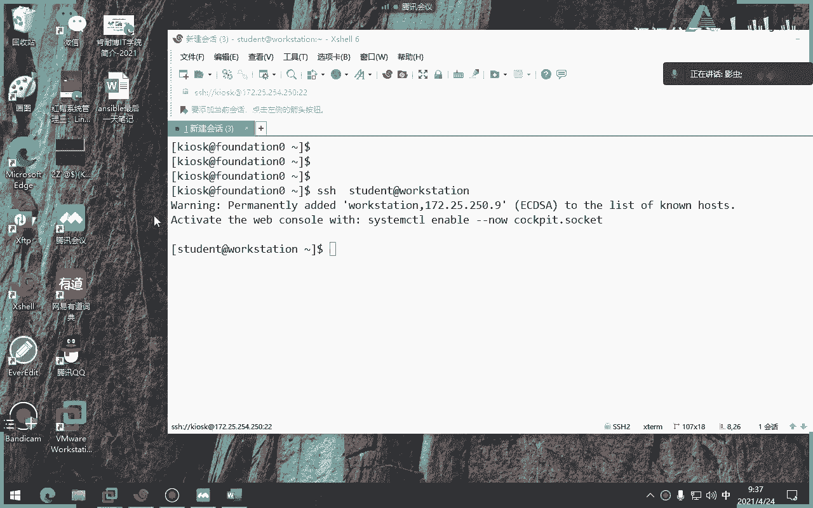

# 红帽认证系统工程师RHCE8-滕老师出品 - P18：20-ansible 使用红帽角色 - KNBIT认证中心 - BV1up4y1h7MA

那么我们说过在生产环节当中我们不会很大啊，会非常大，那么这个时候呢我们如果都写在一个play的文件当中呢，可读性会比较差，所以呢一般情况下我们会把playbook进行拆分，那么拆分的时候呢。

我们就要进行一些，比如说导入对吧，这种文件playbook的一种这个互相调用啊，那么怎么去互相调用呢，上节课我们说过两种，第一种是有一个叫in in in bot playbook。

那么它是允许把整个play列表导入到play book当中啊，这种方式，那么我们今天要讲的呢是这个叫导入和包含任务，请大家注意它的用法啊，一个是任务，一个是playbook，看到没有看到吗，一个是指的。

一个是指导入playbook，一个是指导入我们的task任务，这个大家能理解吧，千万分清楚啊啊那么如果是导入或者是包含这个playbook的话，那意思是指什么，把布布请进行整个的拆分对吧。

把一个大的变成好多子的布雷博拆分好，那么什么叫导入任务呢，注意这就更细致化了，就是把某一个任务进行导入到某个play当中，或者把某一个任务包含到某一个play当中对吧，这就更细致一些了，对吧好。

那么这边呢如果你自己读中文，应该是读不懂它这个东西有点难，各位这个导入任务和包含任务有点难。

那我给大家写下来看看啊。

看你能看懂吗，啊导入任务，先说包涵吧，包含任务，包含任务是哪个单词，是include对吧，是那个，包含着这个单词叫什么，叫叫叫improtask，对吧，那么还有一个叫导入对吧，任务他叫什么来着。

input对吧，唉这两个，那我们来看一下教材啊，各位你看导入是使用input的task，这个功能是静态的，不用看中文后面了，你只要看到这两个字是静态的，而我们的包含include是动态。

那么怎么理解什么叫静态，什么动态呢，大家看啊，那么所谓导入啊，所谓的导入任务，它是静态的，是指在导入任务时，在解析该playbook的时候，将直接插入该文件中的任务，而这个包含是什么意思呢。

各位包含什么意思呢，包含是动态的，是指你在解析这个play之前啊，在运行play啊，在在play运行，并且这部分play到达之前，include task功能不会处理playbook中的内容。

那怎么理解它呢，这两个什么意思呢，就是说你可以这么理解，所以说静态事实你还没有运行整个playbook的时候，他就先把里面的东西全给你解析出来了，比如说变量该有，如果有，如果如果如果包含变量的话。

就把这个变量给你解析出来，那么什么叫这个inkt呢，什么叫做这个包含，包含是指你在运行的过程当中，如果发生了一些变量的变化才进行解析，而没有运行到那一步的时候，我就不会进行解析，再说一遍。

所谓的导入是指在整个playbook运行之前，他就把所有的任务全部给你解析出来了，而动态的包含是指运行到哪一步，解析哪一步还没有运行到的地方，它不进行解析，所以一个叫静态，一个叫动态，哪个是静态。

include input是静态，哪个动态include是动态，那么你如果这么去读呢，还是不明白，所以呢我给大家找了个例子啊，我在网上找了一个非常好的一个例子，你来看啊，各位我也不我也不写。

咱们一块来看来咱们来看这句话啊。

各位这有一个任务叫任务几呢，任务叫task que，就是task对第一个任务，第二个呢是tt 2啊，第一个任务是test 1，第二个任务是tt test 2，好，我们来看一下啊，各位你来分析下。

你能看懂吗，首先这一步是什么意思啊，in input吧，a股的是静态动态动静态吧，静态好，那么你看他静态啊，你看啊要静态啊，input是静态，哎，我说错了，input是静态吧，对吧啊，没说错啊，好。

那你看他是不是上来就干嘛，这句话什么意思，是不是包含一个叫任务二好，那么问一句，大家知道吗，条件判断吧，好问什么，这是啥，这是一个很显然是一个事实变量吧，就当我的系统的版本号为红帽的时候对吧好。

然后紧接着任务二是什么东西呢，就是任务一里面只包含了一个任务二，任务一里面什么事都没干，就包含了任务二好，那么任务二做什么事呢，大家看任务二上来就把实时变量改了啊，改成黑豹操。

注意这个safeat是指我人为的去修改事实变量，这个单词明白吗，比如比如说如果你不改的话，默认情况下应该是跟着你的事实啊啊啊啊打印出来，比如你的电脑名字叫红帽，那你就应该叫红帽。

但是那个set fest是指我把事实变量人为的改了好，你让他上来就把我的事实变量改成黑猫对吧，然后接着他来一句话，他来了两个debug，这个大家能看懂吗，debug好。

那你觉得最后结果会不会出现这两个debug内容呢，如果是input的话，当然是不会，为什么不会，刚刚讲过，静态是指还没有运行playbook之前，就把所有东西给你导进去，有变量去解析。

没有变量就反正就反正给你导进去，而且该运行的运行对吧好，那这时候你想象一下这个条件很显然是不成立的，现在为什么，因为是整个play作为一个整体来运行，因为他用的是input input。

应该把整个play作为一个整体来运行对吧，那这时候的话其实是不是黑帽覆盖了红帽，那么是不是最后的结果是不成立的，那么when语句就不成立，when语句不成立，就代表when语句是假假的话。

他当然不打印debug debug了，当然就不会打印下面的debug了，对吧，明白了吗，这叫任务为甲好，那反过来，如果现在把这个单词改成include task，什么都不变。

只是把这个单词改成include task，那么这时候它就会发生一件事儿，就是它会打印出什么，单出结果是什么红包什么，应该拿出红帽吧，因为他的条件是不是已经运行啊，运行了啊，这这波不用打印黑猫吧。

对不对，是不是运行成功了是啊，因为刚才讲过动态是指运行到的时候我才解析，没有运行到那一步的，我不解析，那么请问一下这个test亚某这一个任务是不是任务是成功的是吧，任务成功是不是读取第二个任务。

第二个任务当中把第一个任务的变量改成了黑猫，因此它打印出黑猫啊，并且还打印出我们的内存吧，抽出来内存吧，memory懂我意思吗，这能看懂吧，也就是最后的结果，这两个内容能不能打印，答案都打印了。

因为你用的是include，叫动态加载，理解吧，如果是静态加载的话，这两个家伙都不会打印，因为条件都不成立，但这个时候include是指我已经导进来了，而且我用的是动态包含的过程。

动态包含是指我运行到的时候我才解析，没有运行到，我不解析，因此task点压我第一个任务是没有运行到下面的吧，没有预料到下面这个条件成立吧，成立了，成立之后当然就ok了，继续往下走呗。

只不过到这一步的时候，他把红帽变成了黑猫而已。

所以这叫include和in input的一个区别，所以这个案例非常好。

如果你直接看书的话，你可能看不懂啊，但是他这个案例特别好，你看一个是include，理解吧，有include，一个是input，就是上节课没讲的内容啊，那么我们用哪种呢，嗯这个没有说用哪种嘛。

我觉得还得看你自己的这个要求吧，或者是生产环境吧对吧，但是呢这个是新版本，以前没有这么分，以前没有这么分这么细啊，但现在呢他把那个全部变成input和include，以前没有。

以前就叫做呃include吧，好像我忘记了，我看下面有没有说啊啊我忘记了，应该下面有，就以前没有分这么细，你现在把它分开了，所以大家一定要明白他的意思啊，啊静态动态你就记住静态是指一股脑全给你加载进去。

而且把整个而且把整个傀儡当做一个整体来运行，而include呢是指运行到那一刻的时候，我该解析的解析好吧，如果没有运行到那一刻，那该怎么运行还是怎么运行，懂了一个静态，一个动态啊。

好那么这就是上节课的内容，不聊了啊，你回去自己来这个。

我把这个图发给你们，待会发给你们，你们回家之后啊，各位自己把这个时间做出来好吧，会写两个吧，会写吧，那人家答案都给你了，你自己写，你能够验证出效果，ok可以吧可以吧，你去注意啊，这是in input。

然后还有一个incretask。

你自己写好吧，只要把这个单词换成include，其他都不用变，待会把这个发到群里啊，嗯好，那么我们现在的主要内容呢。

这个今天我们上午主要内容呢就是我们的这个角色，这是我们今天的内容，也是整个的这本书的第二大内容啊，角色是吧，这个内容它难在哪儿呢，难在中考题就感觉到要考三体，上节课我说过对吧，还有难在哪呢。

难在他那个结构特别特别特别多，但是你一旦看懂这个这一章的内容，你会发现其实这一章要比其他几章都简单啊，你只要把这个角色这个结构和层次结构搞清楚，都特别简单啊，一开始学的时候觉得比比比较乱。

就因为它结构太太太太大了啊，就特别深，他的目录特别深好，那我们来看一下这章主要内容啊，哪啊，肉是吧，我们先roll是吧对吧，ryu word大的变肉，什么叫做角色对吧，还有如何构建角色。

那么请注意这一章的所有内容全考他怎么出三题啊，他怎么样出三题，就是在这一章当中体现出来，全考啊，好那么第二个如何在playbook当中创建一个角色呢。

并且将这个角色作为playbook当中的一个部分来运行，第二个第三个如何使用第三方的啊，angeable galaxy或者其他第三方的语言，大家用过git吧，而且你没用过，我也没用过，大家听过吧。

对不对，肯定听过吧，对不对啊，就是说说我怎么从从互联网当中下载一个人家写好的一个角色模板，哎有点类似于啥，同同志们有点类似于亚吧是吧，比如说人家学好的样品，我直接下载。

是不是也特别像咱们以前学的那个docker pull my里面的image 4对吧，我们知道image是不是要从那个网上下载，就是咱们所谓的仓库对吧，responsory对吧。

仓库里面去下载第四个如何编写红帽的角色，诶，你注意啊，红帽不是把ansp收购了吗，因此红帽自己也有自己的角色，明白吗，也就是说像那个刚才讲那个galaxy是指第三方的，你用不用红帽无所谓。

你用三个s也能，你也能下，但是呢这个我们今天讲的是如何用红帽自己的角色来部署一些playbook，考试必考啊，红帽的东西大家当然考对吧，他单考了自己考的东西肯定啊，所以说这一章的这么多全是重点。

每一个习题就是一道考题，好好听啊，各位好，那么什么叫做角色呢，来我们看一下一句话啊，它有点类似于我们的模板，那你来讲了那么多啊，就是一句话，就是让我们的管理员能够借助这个角色或者别人写好的这个角色模板。

来去构建我们的任务，你比如说咱们要搭建一个服务啊，举个例子随便想想，哎这样吧，咱们大家听过这个吧，lamp环境什么意思啊，听过吧，那你听过啥，这都没听过，好吧好吧，那太好了，我就可以随便编了。

编错也不用担呀，links对吧，加是吧，帕奇对吧啊，加满cc加pp就不知道了，比如说碰，比如说p6 p，比如python都可以吧对吧，咱们一般是p to p好，这是一个我们记得我当年啊。

就在10年前特别经典的一个一个一个一个一个一个环境吧，所以我记得当时面试每一个运维管理员都要会这个对吧，你比我们公司搭建一个网站，但是我们今天呢我们希望不用windows，我们希望用linux。

那你linux下面肯定要后台用阿帕奇，那你后来阿帕奇不光是静态的，还有动态怎么办，再来一个数据库，那你还是得编程语言，比如说p1 p对吧，是不是比较经典，但是现在呢变成什么了，l n m7 。

咳咳这个呢我建议大家你们回家就好好的研究一下这个嗯，嗯好好的研究一下这个东西，如果你作为系统管理员，这个东西面试你是基本上会问你n g x web网站好，那大家想象一下，像这种方式。

各位就特别适合用角色，为什么你有没有发现linux不变，八三路不变，p2 p不变，只变一个n g x，那这个时候我如果为了我的工作，我要重新去写一套这个环境是不是很慢，对不对，别往下。

你好不容易搭建出来，这是因为这个玩这个东西，它它它很难啊，它不像现在有一些一键安装嘛，对我们当前没有一键安装，我们当年就是手工搭建的4444个玩意儿对吧，现在有一键安装包啊，那很简单好。

那你比如说我们现在好不容易搭建好的这个环境，突然间你们老板诶说觉得a n g s好像更牛逼一点，为什么，第一个它代码量小，第二个它开源了是吧，第三个最关键就是他并发要比阿帕奇要高。

所以说老板决定换成n g x，那你是不是要从头再来一遍，对不对，比如说现在要部署一一百台机器，你是要100台重新再来一遍，哎不用，如果有了角色之后，你会发现其实我只需要改动中间那个就可以了吧，对不对。

所以说角色的好处就是可以减少我代码的重新编译，而且互联网当中绝对有人写好了，这个环境你肯定不是第一个人写的，所以说你可以从网站上下载这个角色，然后只要改一下你公司所需要用到的参数和代码不就可以了吗。

对吧，对不对，那角色就是可以体现出这一点对吧，我写好一个角色，我上传到互联网当中，那么大家一块来用呗对吧，第二个是不是有点类似于我们刚才讲的清晰度模板对吧，比如说写好一个模板上传到我的互联网当中。

那你直接下来就用就可以了，直接就编编编写下你的参数就可以了，所以像这种东西就特别适合用角色啊，所以你看他说了那么一堆，你能看懂吗，就这个意思明白了吧，就这意思啊。

角色就是借助一个人家编好的角色模板来去构建，适合于你的环境里面的play，不再说了，这么多就这个意思好，那么因此角色我们不看啊，因此角色有什么有什么优点呢，你看不说了嘛。

就得有最重要轻松的分享别人的代码，当然了，这个角色必须你要分享才能用，说白了你的源代码要给别人对吧，源代码啊，还有呢就是这个你看如如果我们要，我们有时候可能会基于一些类型去编写一些外部服务器啊。

数据库服务器啊，和ftp服务器或者邮件服务器，但这种服务器的搭建呢，我们都可以用角色来编译，就人家写好就是直接上传，你直接下载，直接编写就可以了，不用再重新搭建，这么麻烦。

这个是不是也是我们现在做运维人员的一种技能，比如说就像我们以前讲那个炮慢，就是咱们所谓的那个容器，那个e main image是什么意思镜像，那么这个镜像其实不也是这种感觉。

比如说我搭建好一个阿帕奇镜像，我上传到我们的这个get当中，或者上传到我的仓库里面，那别人直接去下载不就可以了吗，就不用重新再自己再去搭建阿帕奇了对吧，那一样的这些东西也是那种感觉。

这角色的目的就是你可以把它写成什么模板啊，把它想成是模板啊，那么什么角色可以由不同的管理员并行开发，那当然了，你你把这个模板下来，不同的人进行二次编译都可以啊，对吧好。

所以你看就是这样的一个角色的一个好处啊，那么我们的角色一般存放在两种这样几种地方，第一种呢就是红帽自己的，你看红帽自己的这个角色当中，刚刚讲过，红帽有自己的角色，因为他把艾斯收购了嘛对吧。

他也是艾斯的一个贡献代码的一个一个一个厂商吧对吧，还有一个呢就是我们免费版本的galaxy 3星盖乐世，知道吧是吧，就这个东西啊，那么它可以免费的获取我们的很多的一些sport，为什么呢。

因为这个网站是开源的啊，不是说我一定要用红帽子才能用，谁都可以用啊，咱们现在可以上一下，看一下我要怎么拼来着，不一定要，借ala，这把耶这啥玩意boss，那网站在哪呢，下面有应该干了个点啊。

这这待会再说，下面有啊，好你待会去看这个网站啊，全都是免费的，随便下啊，随便下好，那么这就是明白了，首先角色干嘛用的就是减少人为的代码量对吧，第二呢能够分享，第三个呢就是能够让我们的工作就是更简单啊。

还有呢就是可以允许各种人员进行并发开发，二次开发好，那聊了那么多呢，我们就来真正的讲一下角色的结构，这才是我们今天要重点讲的，刚才讲的都是些概念对吧，什么样的角色啊，怎么用啊，都是些概念啊。

你给那些个销售人员讲一下就行了，那么接下来我们要讲怎么去做啊，我知道了角色的含义，第二我要怎么去用好，那么在用之前我们要先了解角色的一个目录结构啊，你看咱们教材当中给我们弄了一个叫user。

example的角色，这个名字就叫user。example，明白吗，这没有没有固定的名称的这个这个规定好，然后他用一个tt大家知道吗，那个命令看一个一个数量结构。

那么这时候呢会巴拉巴拉巴拉出现这么多一堆，那么很多同学看到这边就放弃了啊，又觉得那么多啥东西啊，是不是啊，其实呢总结出来就这个表格，那么那个表格怎么怎么说呢，咱们不绕这个来讲，哎我来给大家写下来。

那就太乱了啊，好那么角色的这个结构，结构啊，那么是这样式儿啊啊那么这个角角色结构有很多啊，比如说咱们先说这个这两个defaults和vs这两个好注意，这两个是干嘛用的呢，变量存放变量有两个。

一个default和哇塞，这两个这两个是目录，还有文件都是注意啊，我说的是目录啊，各位都是目录好，这两个都是存放变量的地方，只不过这个红色的代表默认的，我用红色标就没有默认的啊，红色是默认。

就是如果如果说这个角色里面的defaults和vs这两个同时存在，存在一个同样的变量的时候，一定是vs会覆盖default，default的优先级最低，理解了吗啊，你看最低，没有比它还低的。

就它是里面的优先级最低的啊，所以说你注意一般我们不会把这个写在default里面，所以一般我们不会把变量写在defaulse里面，会放在哪呢，比如放在vs里，理解了这两个是存存放变量好，第一个事情。

第二什么叫files，这个目录是包含那些外部可以引用的文件，注意了，举个例子，各位我们现在搭建一个阿帕奇角色，那么阿拉阿帕奇角色里面是不是很有可能会有一些网站的内容，比如比如说菲律宾点h嗯。

这个比如说index个点html或者index和点p这些页面对吧，那么在页面呢这些外部需要引用的文件可以放在files里面，所以说我们说false可以理解为什么啊，这个这个这个文件啊。

外外外部的文件吧好吧，外部文件我们可以这么去理解它，files这个目录，注意这是目录啊，好那么这个目录栏没什么意思，这个目录可以甚至可以不学，这是一些元数据啊，原数据信息，比如说依赖关系了，作者了啊。

序列号啊，不是什么那个这个什么玩意，反正就爱对这些东西，作者许可证啊，东西懂吧，这个你可以不记啊，这个单词是什么意思，就是原世界的单词缩写，对吧啊，matter matter data啊，好你注意啊。

这个就是一些啊，懂了吧，比如说你缺个这种原数据的信息，你可以不记浏览一下我们的info啊，information啊，好，接下来还有一个东西，这个必要收了吧，是不是存放积压兔模板的地方，哎。

角色当中很有可能掉用模板吗，很有可能这怎么办，没关系，可以把你事先事先写好的今年图模板放在tb类的词里面，注意啊，这是事先先写好了啊，所以这个东西我们叫做模板，啊添加库模板，保存模板对吧。

那你就减小了精度模板，好那么还有一个呢，这个更无聊了，测试就是测试就就就是他的英文含义，task就测试没有没有e啊，没有e就是测试不说了啊。

