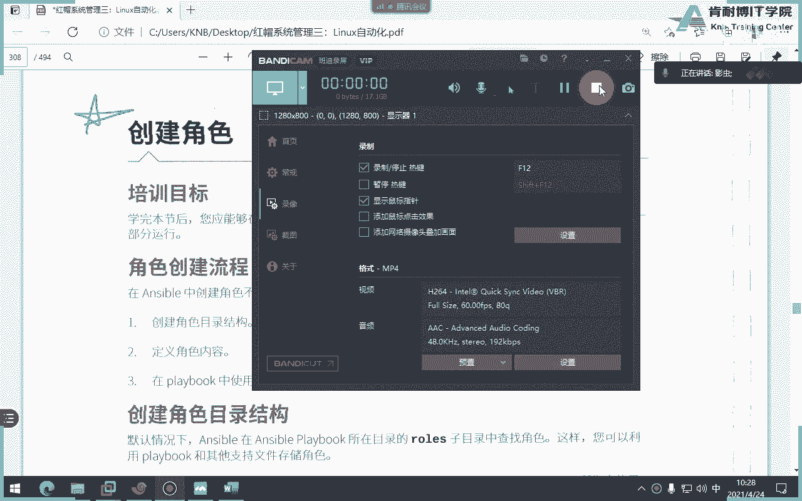
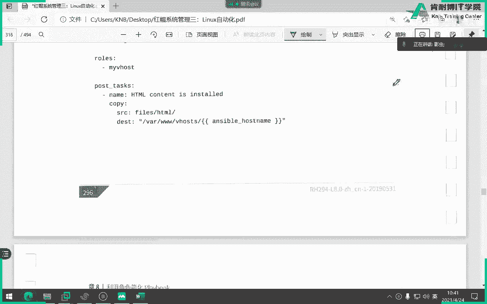

# 红帽认证系统工程师RHCE8-滕老师出品 - P19：21-ansible 自定义角色 - KNBIT认证中心 - BV1up4y1h7MA

刚才我们那个屏幕里面录屏里面讲的是红帽的角色，接下来再给大家录一个屏，就是我们自己创建角色考试，这个才是考考考试的一个重点啊，那么我们刚才讲过，那么红包呢是我们应该修好了啊。

我们接下来要自己怎么创建创建角色，三部永远记住这三步，注意同学们把脑子记住这三步，第一步创建角色目录，第二位这个角色里面添加内容，说白了就为刚才那一堆结构里面添加内容。

第三个在你play book当中使用角色，是不是三步对吧，第一步先创建一个结构，哪个结构，同志们，就这就就就就就就这一堆东西吧，给我创建这个角的这个结构，第二步往每一个你能用得到的这个子目录里面加东西。

第二个第三步呢，是不是在你不可能去使用，你刚才自己创建了个角色，三步吧，好第二第一步说起来啊，智力，那么问题就是那个我怎么去争议啊对吧，怎么创建，各位，那我能不能自己去自己去make dr mk dr。

可以吧，当然可以了，太可以了，那你肯定记不住，对不对啊，那怎么办呢，没事，咱们红帽教材当中告诉我们，用这条命令，诶这个命令同志们，it是不是初始化的一些单词啊。

啊用的galaxin it来自动创建新角色的目录结构，看懂了吗，这个教材懂了，你可以用mdr自己个儿把这个给创建出来，你可以可以太可以了，但是没有人这么干，第一个麻烦，第21000拼错了。

第三个万一你要是少了呢，对不对好，那同样同样你自己创建的角色要不要指向路径，那当然要实现了，你你红包你指向路径，你自自己创建的，那更没没没人知道你在哪儿啊，对不对。

所以你也要用rose pass来指定目录，懂了吧好好，那么我们怎么创建呢，用那个单词unstable galaxy in it命令来创建，但请注意一定要注意啊，现在还写在这儿啊，商业目录的时候干嘛啊。

一定要干嘛，在做目录中注意，先创建先什么，创建一个名为，在该子目录中创建角色结构，听懂了吗，你看你很多同学就这一点就晕了啊，千万注意不能直接在我这个i h1294 里面去创建，你要先给我创建一个吧。

还是叫肉丝，还是叫肉，就是先过创建一个叫rose的目录，进到这里面才能用安c罗galaxy in n，懂了吗好，那随便起名的，比如我们叫麻辣肉吧，就我自己吧，就可以了，然后你进去看ios。

你看是不是多一个目录，这里面就会有一堆的结构体，听懂了吗，千万千万不能忘记这个单词不能忘记，不能直接在工作目录当中，一定要先创建一个rose，为什么结构吗，没什么，为什么，你要你要分清楚吧。

比如说我这个电脑里面有三个角色，那你怎么区分啊，对不对，是不是用名字来区分对吧，明白了自己对节奏，当然了，比如我现在用不到的fs可以上吗，可以，但我书上告诉我们是可以删的，但我不建议你们删放就是了。

又不碍你事，丢雷不扣分，明白吗，别删，万一删错了呢，是不是都都麻烦好，这个角色结果题你能能理解吧，没有退是吧，有你看看了吗，那个感觉是不是就这样这样子啊，明白了吗啊，八个字目录，八个文件。

每个字母录都有一个秘密密密密对吧啊，其实这个test可以删掉，确实没有没有啊，确实没有没有好，这是一个角色，第二步，第一步第一步做完了，看第一步啊，第一步叫做创建角色，第二步是不是往里面填充内容了对吧。

第三步才使用，明白了吗啊，第三步使用这样嗯好好，那么怎么去定义角色内容呢，那这个没什么啊，没没什么固定的对吧，你就要看你干什么事，你比如说像像像像像下面这一堆是干嘛的，同志们，很显然是金加兔。

他既然用的金加速，我们知道是不是先创建好这个金加速模板，那创建好这个金加速模板就放在哪，放到他们在这里面看到吗，放到这里面明白了吗，好我们自己做一个啊，我来给大家做一个开头，嗯行吧，我们做吧。

我们自己做一个啊，比如说，啊梦想能不能这样做，唉，他这样做也行，哎行吧，就这么做，对吧，那这个模板咱们写点啥了，咱们接着下面写，放循环吧，放循环怎么写对吧，不来我们写的a啊，b啊，c也这样子对吧。

然后怎么打印出这种变量，打印变量怎么打双引号对吧，哎，结束嘛对吧，结束嘛，可以啊，就这样呗，这个模板对吧，然然然然然，然后我就开始干嘛了，在这里面吧，那任务嘛，主要任务肯定要放到这里面了。

这里就会有个密，你看了吗，就会有一个啊，那我们直接写吧，比如说，t m t l v t对吧，s r c啊，就是刚才那个，那我要这样做的话，我得跑，我得跑到上级目录啊，不能直接写吧。

因为我刚才我这个东西是放在可以觉醒，可以直接引用时会自动到那个站点的问题，include相当于对吧，先用它这个东西，大家知道什么东西吗，m o t d这个登录的时候需要读取的文件啊，好这周结束了。

结束之后回去再回去找到，再回去找到上级目录对吧，最终的工作目录我们写blabel就可以了，就可以写play啊，那这边直接怎么写，就直接有个肉吃就行，就可以了，明白了吗，好我们看下什么。

但是我cfg里面天天那个没有没电，还没电呢，干嘛来着点，巨人学警告，嗯有点有当前吗，对当前没有啊，那我直接写全吧，让大家能看清楚对吧啊，假装假装下，有家能够写全能看清楚一些嗯对吧，那就可以了。

因为冒号就代表追加嘛，我再追加一下啊，这个时候就可以运行试，不要买肉吧，没有s对吧，咚咚咚咚咚，继续刷，相当于一个任务怎么怎么把那个对吧，相当于一个任务怎么把光标直接跳到下一行，不知道了吧，让你好好学。

你不学啊，欧啊，那你好好学又不学，ok你看其实很麻烦啊，这还是错，as define，没有这个变量模板的事，没有这个变量不复杂，其实结构很简单，其实没有这个变量而已，对吧，你直接选abc，谁知道你是谁。

啊123吧是啥，11号，试一下试一下，然后跑到svc里面瞅一眼，是不是应该有一tc下面的，对吧123吧，有了吗，还是角色啊，角色啊，模板我当然用金加图，模板当然要tm雷特里面了。

然后我写写task的主要任务，task也写完了，tumbler写完了之后，在book里面直接进用角色就行了，只是我刚才赢的时候那个没错了啊啊这个多了一个s啊。

还有就是请注意就是在写的时候注意它的叫rose啊，rose啊，然后直接看直接使用这个，这是我自己的角色名，角色名，当然由于我只有一个角色可以不加红线，这个列表可以不加啊，比如你有多个的话。

你可以必须要加啊，就这样就角色，懂了吧，自定义啊，考试必考必考题，不然他考什么呢，是不是，但是这题很多分啊，很多分嗯行吧，那么如果你有问题就去看一下这个reme啊，也可以看remi。

那么这个呢就是用于初始化角色，就不要去，你看他们删除不要了，其实不用不要删，然后自己就不用make dir去做了啊，就这样做也可以，那么这个呢是做依赖关系的，这个单词里面会有一些依赖关系的东西啊。

然后呢这个是如何使用，直接rose就可以了，你看这是一个任务的列表啊，但只有一个任务就结束了，他呢没有写as for playbook a cfg文件，所以他直接在那个上面写的英文水对吧啊这样。

那么default呢是更改什么变量的，但我们说过default是会会会被覆盖的对吧，如果你有别人定义的话，会被覆盖，所以建议大家如果没有其他变量，那可以写deboss，如果有的话。

尽量不要写deboss里面它会被覆盖掉好了，这就是这一章的先看就讲究这么多，但考的确实没那么简单，它考的时候没那么简单啊，那么要讲的东西就这么多啊，我们用一个添加度模板呢比较好，因为比较简单。

