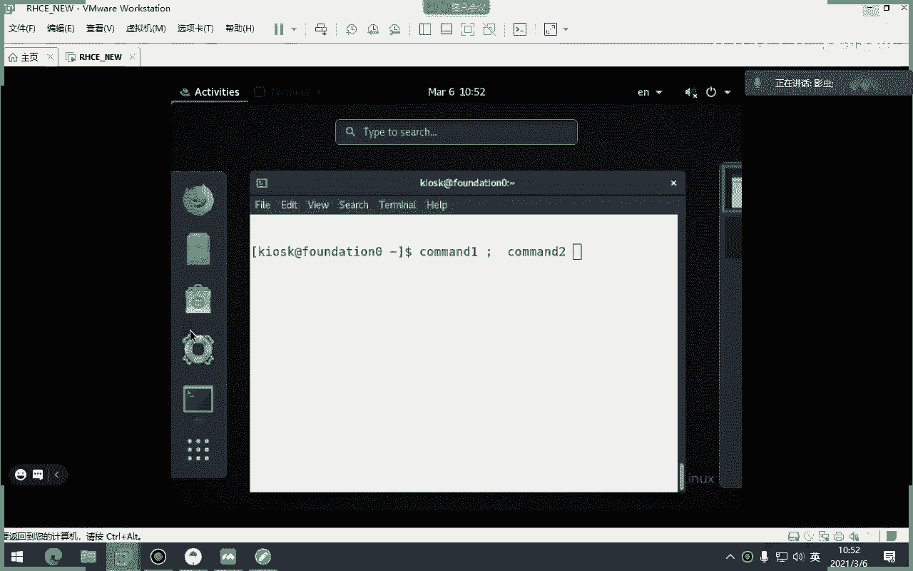
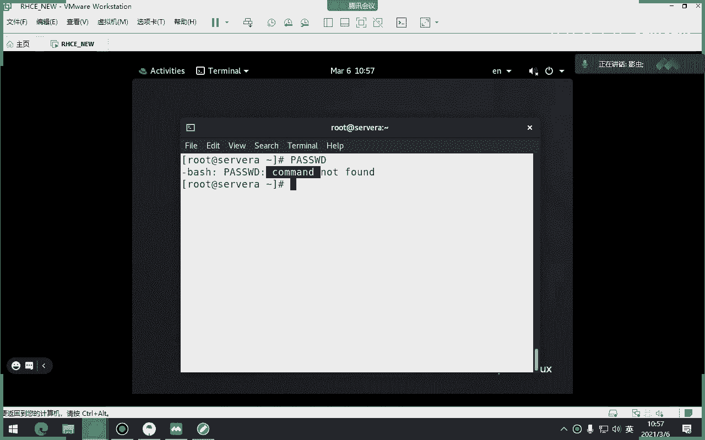
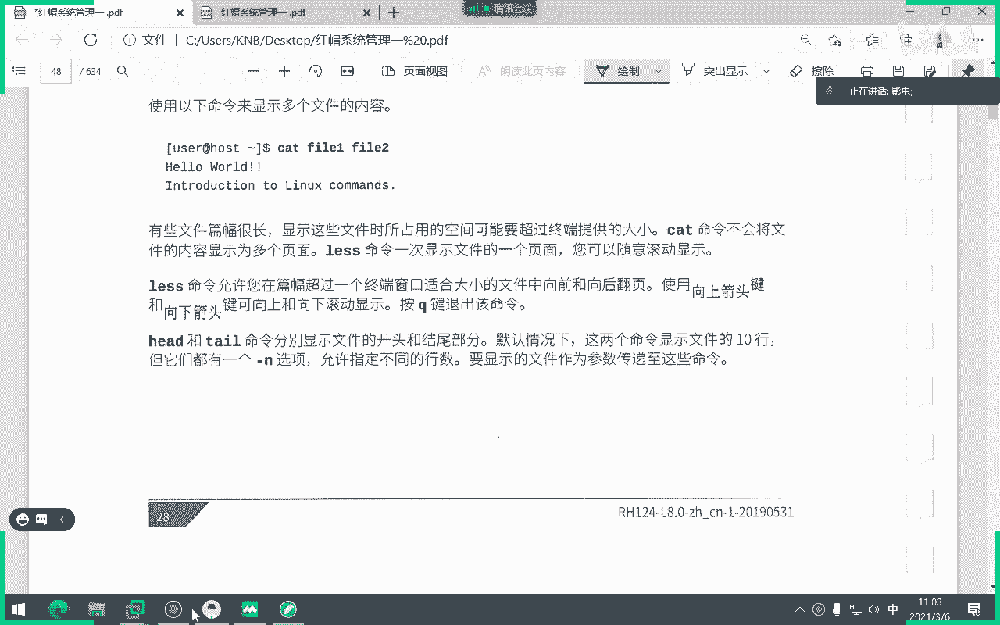
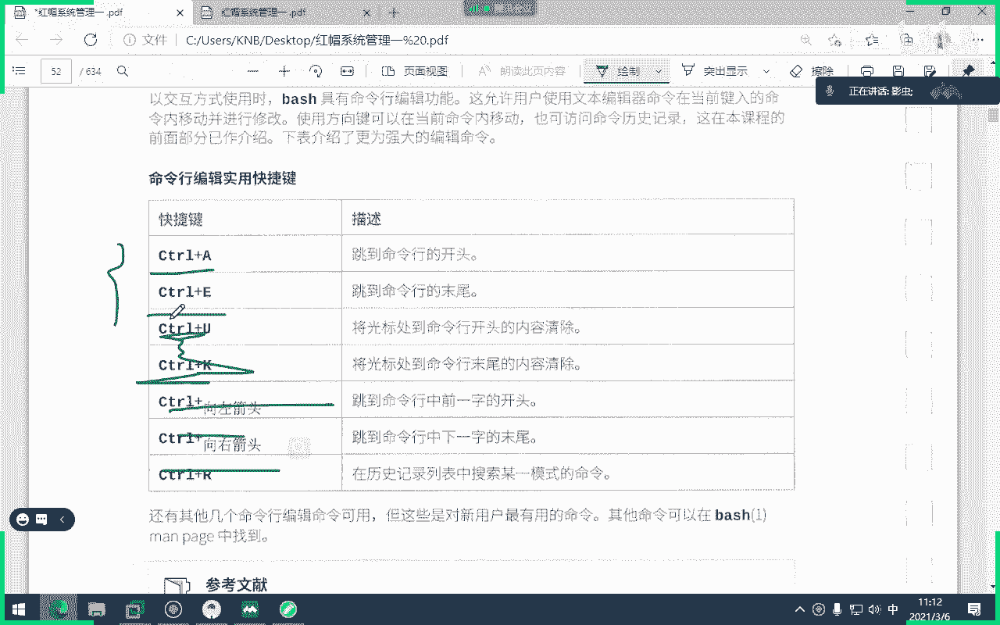

# 红帽认证系统工程师RHCE8-滕老师出品 - P1：第一天 RHEL8安装和命令行使用 - KNBIT认证中心 - BV1up4y1h7MA

行那我们开始吧，今天是我们的一个rg c e8。2的一个开班，那么先来说一下这个c e的课程的整体的一个情况呃，首先呢我们知道像这种官方的认证培训啊，它都有这个级别。

比如说最低级的是c c c e c a，它是一个类似于金字塔型的这样的一个认证体系，那么这个c n c呢是包括两本书，你刚刚看到咱们那同学拿了三本书，其中第一本书，第二本书是c c s a。

第三本书才是c e，所以说咱们两本书要学要学就是用六天的时间，大概要学两本书，因为总共课程12天嘛对吧，因为六天课程要学两本书，cc啊，最后一本书是最重点，而且也是最难的，是c e部分。

主要学uncible自动化运维啊，所以先给先给大家来说一下这个事啊，这个这个是烤好了，先跟大家说一下这个事，那么这个环境呢因为太大了，所以我们待会儿中午的时候呢慢慢跟大家考。

那么我接下来先用一一点时间跟大家介绍一下咱们的ce的这个环境，这怎么用，那么为什么要有这个环境，是为了做我们这个三本教材的课后习题，举个例子，我给大家看一下咱们课后习题，你就明白了。

随便找一张，咱们随便找一张，比如说哎就说这张这张是个是个习题啊，这个怎么怎么变大了这个习题，那么你能看他说我要在某一台机器上做一堆的命令，当然你不用关心那个命令是干嘛的，那我在哪个机器上做呢。

他说在workstation上看到吗，这个中文那哪来的workstation，哎，就是我给大家这个环境里面，其中有一台机器叫做workstation，明白了吗，所以为什么要给大家这个环境。

主要是目的是为了做这个可有气体，不然的话我们其实可以不用这个环境好。

那么问题来了，这个环境怎么用呢，大家看我已经给大家打打开了，每个人都会有一个这是一个安装好的一个红包八的上课环境啊，那么我们敲一下回车发现里面什么都没有对吧，那么所有的虚拟机都放在这台机器当中。

那么这个机器本身叫什么呢，这个机器本身叫做foundation啊，它有个主机名叫foundation。

我们来看这个主机名啊，最上面每一章的这个每一本书的前言部分都有这个环境的介绍，每本书都有三本书都有，我们往上走，环境在哪儿来着，环境呢环境呢在这，大家看这个是这套环境的一个拓扑图，首先各位每一台机器。

这里面所有看到的机器都是虚拟机，那么这些虚拟机都在一个叫做foundation 0的物理机身上，大家看在这每一个机器都在一个叫foundation x，就是12345678，我给大家的是零。

那么你们每个人都是零好吧，就每一个人身上都有这个foundation 0，i l t examining com这个机器，那么这台机器就是一个物理机，虽然我把这个环境做成了vm station虚拟机。

但其实你把它想成是一台物理机，因为未来我们参加考试的时候是用物理机，没有虚拟机啊，明白吗，就你们看到的每一台物理机好，那么这个房子是零，是一台物理机，它里面有很多虚拟机，有哪些虚拟机呢。

有图片当中这一堆，我们从左边开始讲起，最重要的一台虚拟机叫做classroom，当时就看不清了，你们看不清是吧，嗯你要不这样就直接投到自己店了吗，头道，那你们有网吗，可以吗，那行啊，关一下也行。

可以了是吧啊啊，ok，都可以看到了吧，咱们先从最左边开始说起啊，最左边这台class classroom是整个教学当中最重要的一台虚拟机，它扮演着整个考场所有的服务器。

大家看classroom扮演的整个环境当中的所有服务器，如果你想成功开启其他虚拟机，如果你想成功开启其他虚拟机，必须要先开classroom，你是不是要再看一下啊，他把那个投影关了，ok可以可以可以了。

可以应该可以。

好大家看这台classroom，那个机器左边的是必须要先开的，听清楚，如果你想成功开启剩下的几台虚拟机，classroom是必须先开，他扮演着整个环境的服务端，他扮演了整个环境的服务端。

比如你比如说这几台机器的ip地址是通过classroom分配，明白我的意思吗，然后睡，然后中间那边有一个机器叫做堡垒机，dustin堡垒机，它连接的是两个不同的网段，大家有没有发现左边这边网段是172。

二五点252点网段，右边的是250点网段，那么两个不同的网段下联通肯定不同，那怎么办，从中间一个叫做堡垒机，跳板机，类似于一个路由器，所以这两台虚拟机是必须要都打开才能打开，剩下这三台。

这三台分别叫做workstation和server a和server b，咱们整个上课的过程当中，主要用到的就是workstation，sera sera b，好吧，理解我意思吧，好注意。

这几台虚拟机必须都打开，才能保证后面这两台虚拟机能够ping通，你，比如说我说sora打开了，sb打开了，你发现不通怎么办，多半是由于classroom没有开，但是class只要开一次就够了。

比如说举个例子，我现在给你们考完那个环境，你们只要把这个环境打开之后，打开一次就够，剩下就不用打开了，怎么回事，坏了吗，你们能看到这个吗，就是或者就是你们共享这个密码没有密码嗯对啊。

都点。

那是点来购物，那么这几条信息怎么看，各位这训机怎么开呢啊因为桌面上啥也没有对吧。

桌面上啥也没用，没有什么按钮可以点的，所以我们要调出一个终端啊。

调出一个终端，大家看是不是要反对选零对吧，就是你看你们那个电脑，咱们机器是不是都防水，防对血量，还有这个机器的主机用户是谁呢，是那个k r o s k就是这个当前用户，那么现在这个机器叫仿真选择。

我们想打开这几台虚拟机，需要通过使用这个命令，比如谁呢，我想打开clash，一会我想打开server a，懂了吗，我要打开workstation，懂我意思吧。

好但是这个classroom你看为什么我他说已经打开了，因为这个classroom我昨天已经我开过一次，昨天我开过一次，所以说只要开过一次，它就会伴随着我们的物理机开机要开机，懂我意思吧。

比如说你们把环境拷回家了，你们把这个房地产一开，第一次开classroom，然后未来你们再次开这个foundation的时候，class也会伴随着foundation一块开，但是剩下的机器哪哪几台呢。

这一台这一台30000a和b这两台不会伴随着开机要开机，你的手工打哪个命令，打这个命令听懂吗啊懂吗好，那那you you star是不是就有stop stop就关对吧，比如我我说我我不想玩了。

我想把class关掉，那怎么办啊，就是stop谁谁谁谁谁就挂了，懂我意思吧，好但是你看我每次开的话都是一个一个开，太麻烦了，怎么办呢，我可以start哦，所有都开了，懂我意思吧。

star但这个star哦，这个哦包包含谁呢，注意包含的是我刚才讲的那几台，不包括classroom，如果你想把classroom单独开，就要用这条命令单独开，想把它单独关，就要用这个stop命令单独关。

比如stop all也好，stop all也好，是里面不包括classroom这台虚拟机的，听懂了吗，各位能明白我意思吧，好那么这就是这个环境的使用办法，还有最后教大家一条命令，我想看一下状态。

你看现在除了这台机器开了，其他都是什么define没有开，那我现在来看一下吧，因为待会都得用吗，你看他现在开始开了，ok这个简单吧，注意这个命令可不是一个官方，这个不是一个红包的命令啊。

这是这个环境自己带的命令，也就是说你如果待会自己装个红包八，能有这个命令吗，没有啊，能听清楚吗，不要说你随便找一台机器去打这个命令，这个命令是我这个环境里面自己写的命令啊，就红包给我们自己写的。

并不是一个通用的命令，好吧好，那有人老师我如果做实验啊，因为我刚学嘛，初学者做做做，做完把我机器做崩掉怎么办，难道我要重新把你那70多这个环境70多个g啊，重新把那70多个g再考一遍吗，当然不用。

既然它是虚拟机，肯定都有什么功能，各位大家知道应该叫snap shot快照吧，那么既然有快照，是不是可以恢复快照，那同样这几台虚拟机都有快照功能，所以说比如比如说我们把server a给他重置一下。

那怎么重置呢，respect，谁呀，比如说sora，我一回车，他说确实要重置吗，你点个y就行了，我就不重置了，明白了吗，好但一样，如果你重置的话，里面所有所有的东西都干嘛了，没了清空了，好吧好。

但是我不建议大家用reset，我建议大家用这个命令borreset，这个有什么好处呢，这个清空的更彻底，所以未来你有你你你做实验的时候，如果发现诶我的这个电脑啊挂了，我重置就不要用reset。

用for reset。

明白吗，所以你用reset命令你不要记了好了，这里我要给大家讲的，其实你哪个命令都不用记，因为这边都给你表格了哈，都给你写好了，只不过你直播你看他说是reset，我给大家讲的是for reset。

这个是干嘛的，这个单词浏览吧是吧。

浏览一下，但浏览你不用那个命令浏览，不要用那个命令，就用哪个命令呢，刚刚讲的那个看状态的命令可以看一下，也可以，比如我想看一下当前的这个server a是什么状态，是已经开的状态。

那sb呢是没有开机的啊，sb也开了啊，明白吗，懂了吧，这几个命令能明白吗，好那甭管是reset也好，for reset也好，还是star也好，stop也好，都在哪个地方打。

各位在foundation 0这个物理机身上去敲这些命令，明白吗，因为suma sumb workstation，boston classroom，这些都是虚拟机，这些虚拟机都放在哪。

都放在反对选零这个物理机身上，明白吗，那么我们说考试的时候雷同，考试的时候，这个机器跟我们现在环境几乎是一样的，只不过没有这几个命令，它有是按钮，全是一排一排按钮，比如说我坐挂了。

先点想想想reset怎么办，没有这个命令啊，各位考试的时候没有这个命令，但有一个按钮，这个图标你按一下它就reset了，别说我我我想star一个虚拟怎么办，你按一下star这个按钮，还有star。

明白了吗，考试的时候跟那个环境几乎雷同，只不过把这些命令变成了按钮好吧，但考试不是这个环境啊，考试是红包考官过来重新布置环境，我们这个环境只是相当于模拟考试的环境啊，和平时做课后习题的这个环境。

这个环境，但是我们中午一个一个给大家考，肯定要考啊，要要拷走了好吧，ok那么关于环境大家还有想了解的吗。

再看一下这个拓扑图，还有什么不明白的吗，你看网站都给你了，包括这个机器干啥用的，都给都告诉你了啊，比如说boston是个跳板机，workstation是一个带有图形界面的虚拟机。

300s2 b是两台我们要操作的机器，但是没有同步化界面啊，我们大部分的实验都在server a sb身上去做好，那么这个环境很大，因为有有多少台虚拟机，各位1234566台吧。

舞台再加上我们本身这个wap station这个foundation总共六台虚拟机，所以你的电脑如果特别差的话，肯定跑不动，如果你们学到了最后一本书，我们会有更多虚拟机。

有server server b server c server d再多两台，总共有七台新机，八八台虚机，所以如果你的内存不足的话，你就不要玩了啊，最好是8g以上，比如说11g 12 g 16 g。

然后呢最好还是ssd硬盘，这样你跑起来不会特别吃力，为什么说是为什么说现在红包的课程越来越吃内存了啊，如果你们有机会回来咱们学习c的话，你发现咱们的电脑必须是32级以上才能跑，因为它开更多虚拟机。

好吧好，关于在虚拟机就介绍到这，同时最后一点所有的密码都是red hat。

比如说我现在开了，我想进到sara里面，那它的用户名就是root，密码是red hat，记住啊，标准的密码red，所有密码都是red好了，关于环境，大家还有什么想了解的吗，啊这个今天用不到。

所以我们今天中午慢慢考，这个用不到，就是告诉大家一下，好那你说老师，我们为什么物理机不用管理员来登录呢，注意如果你用管理员登录咱们的环境就用不了了，因为这个环境是必须他给我们做在这个用户身上的啊。

这个k r o s k用户如果你用管理员登录，咱们刚才这些虚拟机就反而就用不了，好吧好。

那么环境咱们就关了，就说到这儿，因为今天用不到，我就不用了，那么接下来给大家讲第一章，给大家补充一章内容，就是如何安装一个红帽操作系统，那么既然是安装操作系统呢，我们就采用安装在虚拟机身上来演示啊。

咱们现在是不是都用那个vivox系列展对吧，那我就把它装在这个vm身上，那么vm的使用呢不作为咱们今天的课程讨论范围，因为老师我从来没有用过vm，那这个东西咱们百度1下就行了，因为很简单啊。

那么我们首先要新建一台虚拟机，那么知道大家都知道新建虚拟机的时候，需要在我们的windows当中新建一个文件夹嘛，比如我就在d盘当中建一个文件夹啊，我就叫做就叫做8。2好吧，随便啊。

这这个意思就是说待会儿我们装的这个系统，其实就装在我windows的d盘的8。2身上，对吧好，那么新建台虚拟机，创建一个新的虚拟机啊，直接下啊，这16版本啊这么大，下一步下一步不用管它啊。

这一步千万不要那个一定要点稍后啊，很多同学在边不点稍后，如果你不点稍后的话，你会发现你待会装系统是全自动安装好吧，一定要点稍后选择linux选择随便选择红帽八六十四位。

还有咱们从七版本之后就没有32位的那个镜像了啊，没有了啊，好咱们就起一个就就就名字叫卡吧，浏览浏览就是你待会要把这个机器装在哪呢，装在我们地盘当中的8。2啊，下一步它默认是20g。

20g就20个g够用了对吧，够用好完成，那么咱们由于只是为了演示安装操作系统，所以说这里面的硬件咱们可以不碰它啊，可以不碰它好吧，而且大家看到没有，我这个硬盘叫n v m e吧啊为啥呢。

因为咱们现在用的是最新版本的16，所以他把这个硬盘的接口模拟的是比较新的，其实你刚才在新建硬盘的时候，能不能调成你前老的三大款也可以调，因为虚拟机嘛可以调成任何的接口，好吧嗯上来就这样吧，咱们装一下吧。

好然后我先把我的这个镜像塞到我的光驱里，我镜像在哪呢，镜像在这个在这儿点一下，使用s o，然后塞进去，在哪儿呢。

在这儿在这儿，ok开机。

你会发现红帽八的安装的界面跟红帽七的安装界面一模一样，就就不用用不用不用雷同来两个字来形容，就是一模一样好，我们把鼠标放进去，一定要把鼠标点进去，然后按一下上下键，按照上啊，第一个直接回车。

那么按道理呢，我们第一次上课呢应该介绍一下这个linux的历史啊，红帽的一些发展史啊，因为我觉得这种东西其实没有什么意义啊，你可以自己去找一下网站，网站去了解一下。

所以我们就把安装讲一下那些历史上的这种文字上的东西，你们自己看看课外教材就可以了啊，好稍等。

如果没有问题，它就会进入到一个图形化界面的安装向导，那么这边呢大家一定要注意，不要选中文，没有任何意义，选中文为啥，因为他告诉你，这是安装过程当中你选择了遇见，比如说你怎么选择中文。

就一定是装完之后就是中文吗，不是这只是安装过程当中，它使用的语言，并不是安装完之后你的系统的语言，所以我们选择英文就够了，下一步，还有装系统不要装中文，今天给大家讲一个就是统一规范啊。

无论你是考试还是你回家自己玩，还是你未来参加工作，装系统都不要装中文，千千万万不要装中文，没有人疑问吗，没有啊，我没有要问为什么吗，没有意义，因为你敲的是命令嘛，你装中文干嘛，对不对啊，所以没有必要。

而且有时候中文还有问题，就有出现乱码啊，所以不要讲中文啊，好各位，你看他键盘咱们就选选择这种美式的吧对吧，那么这个地方看language support，这个地方才是选择语言，如果这个地方选择中文。

才代表你装完之后系统是中文好吧，但我们说过不用装中文好，时间呢，你可以选择一个中国啊，你随便点个地方都是上海，这肯定不是上海，这边应该哪儿北京吗，差不多吧，你选这也成，但都是上海吗。

你只要选择中国大陆就行了，点一下完成啊，其实咱们待会儿装不装那个时间都无所谓啊，因为咱们只是为了测试，你可以不改，不改变时间都无所谓啊，好这边重要了，这个我鼠标这个位置，他说啊，你是什么方式装。

那我们各位想一下，咱们现在系统是不是能够从u u盘来装，从光驱来装，还有什么通过能不能通过网络装，能不能能我给大家这套环境。

各位这套环境就可以通过网络给你们每一个人装修好，比如说咱们现在有一台交换机，咱们所有机器都包裹的，机器都插在一个交换机当中，你会发现你待会儿自你的电脑自动装修。

为什么它里面有一个功能就是自动给你们部署环境，你看未来我们参加考试，就是考官不可能给你们每个人手工去安装系统，他就通过这种网络来安装，来按这方式来安装，原来类似于咱们以前windows那个ghost。

但这个大家知道吧啊，他要批量安装吗，好吧。

所以咱们在装系统的时候，他问你是什么办法安装，咱们肯定是镜像安装，所以选择的是local，好那么这边呢你的语言包啊，不是你的软件包的selection选择，你看他最最他现在是什么，各位我们点进去好吧。

你看有这么多的安装方式，咱们选择哪个呢，它默认给我们选的是g u y就带有图形界面，gu是不是图形界面的中文好，那么如果你用过红包七或者红包七之前的版本，它默认是选的是这个啥意思，mini最小安装。

那么问题是最小安装有什么好处呢，快可能五分钟就装了，但问题是什么呢，就是很多包你们用不了，很多软件，你都用不了，为啥都没装过，但是在真正企业当中，我发现好多工程师选择的就是最小化眼妆。

为啥因为他没有必要要装那些乱七八糟的软件，但咱们今天第一次上课嘛，我建议大家咱们选择第一个带有图形化界面的server，那么右侧是啥，比如我想选择debug软件地点，勾一下。

我想装一下windows file server，勾一下，明白我意思吗，就是可以勾啊，但我就不勾啊，就这样倒好，他正在计算好了，那么这部分是啥，朋友们这边说，我们今天重点要讲你怎么去分区。

那下面呢是你怎么设置你的网络和主机名，那么如果你不设置网络和主机名呢，他就没有办法联网，没关系，咱们未来咱们会单独有一章来讲网络怎么去操作，所以这边可以不选择好，咱们现在重点讲的是这一块怎么去分区。

好点一下，大家可以看到我现在电脑名字叫我的个天，我的电脑名字有点有点难啊，这个这个网这叫什么来着，硬盘的名字叫n v m e o n e a o那个0n1 ，那么如果早期咱们用过硬盘的话。

是不是就叫做s d a对吧，为什么下面没有sa呢，因为我刚刚给大家已经说明了，我当时在创建虚拟机的时候，我的网我的这个网络，这个网络这个接口用的不是sd，不是三大口，所以它不是sd，在这个地方无所谓啊。

如果你是那个选择的是sata口的话，这边一定是sd，但咱们现在选的是n v e口，好吧啊，这无所谓啊，好多大了，20g为啥，因为我刚刚在新建虚拟机的时候，是不是20g的硬盘好，那么现在就是两种办法。

第一种是你手公的custom自动的分区，第二种就是他自呃，第一个是自自己去分了，第二个是它自动分，那么咱们由于上课嘛，咱们肯定不能自动分，咱们选择第二个，我们手工的来分区好吧。

那接下来问题就是这20g的n v m e这个硬盘我们怎么分选项完成，ok如果你选择的是自动安装，这一步就没有直接就跳过了，但现在呢他给我们一个界面是手工手工的去进行分区，那么问题是我们怎么进行分区呢。

20g硬盘你想把它分成什么样子，我们点一下下面一个选择第一个标准分区，你看他默是谁，逻辑卷lvm，当然我们后面会讲啊，没有听过无所谓，咱们后面会讲，咱们选择第一个叫标准分区，标准分区好的选择。

加号是加一个分区，减号是删除一个分区，所以我们加一个分区，看这个单词叫做添加新的挂载点，各位啊，我们有一个新的名词啊，我们先记一下笔记。

ok叫添加啊，关于分区啊，第一个知识点叫做挂载点啊，叫做这个，咱们先给大家介绍一下，稍微补充一下，叫做分区的硬盘啊，这一硬盘接口名称给大家先来统一的介绍一下，那么如果咱们的硬盘是usb口。

或者是那个s c s i s sci或者esci，或者是sasa，怎么拼了，s t a t是吧，s a t s该怎么拼，突然完事了是吧，好好如果是这几个口的话，咱们的linux就把它命名为sd。

但是咱们刚才是这一口吗，不是咱们刚才都不是这几个口吧，对吧好，第二个，那如果咱们的硬盘同志们是那个更老的口，大家知道这个吧，听过吗，就那种特宽为线宽线，那么咱们的linux就把它命名为叫hd。

但现在没有没有人用吗，这肯定是见的，不是几乎见不到，这肯定见不到，对不对，你配硬盘不可能配a这个口吧，你买也买不到，对不对，好，那如果是刚才我们用的那个口呢，嗯什么来着。

那就是把它命名为一样n v m1 ，然后后面是什么，后面就不知道了，各种各样的名字随机产生的名字，比如说刚才咱们随机产生名字叫什么叫0n一是吧对吧，明白了吗，所以说这是硬盘接口好。

第二个要给大家补充的就是关于什么，关于咱们的这个这个这个这个这个挂载点，那什么是挂载点啊，我们可以临时的把它想成啊，因为临时的把它想成就是windows是什么韩服，但这种想的是对嘛。

这种想其实不是很科学啊，不是很严谨，但我们由于第一次讲嘛，咱们把它想成是windows的盘符，我们知道windows有c盘，d盘e f g，但对于linux来讲，或者对于unix来讲，是没有c盘d盘的。

他有的是什么呢，有的叫挂载点，那么咱们又常见的哪些挂载点呢，我们来看一下新建挂载点有哪些呢，下拉菜单看有这么多，这个知道了切线叫，好那么根呢是一个文件系统的入口，我们windows呃。

咱们的linux是必须有一个，并且只能有一个根本，袁老师，我能不能分一个没有根的分区，这不可能你必须得有一个根，那能不能有俩，可能就只能有一个，并且必须得有，是必须有一个啊，好那么咱们添加一下。

就是我新建一个根本区，添加注意点下面的添加这个老师，这个要不要写无所谓，你什么都不用写啊，点一下添加好，你会突然发现一个新的一个菜单，是这个菜单，那么这边菜单呢就是一个根本区，大20几啊。

那么我们整个硬盘是20g，咱们给他比如说十个g行吗，可以啊，可以啊，当然可以啊，好那么你会发现咱们现在就有一个新的分区叫根，分区大小是十个g，理解我意思吗，好我们再来分再添加，可以吗，当然可以了。

好再加我们能不能再发一段，你看根本没有了吧，朋友们，你想选选不了，没有了啊，我们选择第二个，这个翻译成中文叫什么启动啊，我们多大呢，无所谓，比如给他一个g可以吗，可以啊，可以吗。

可以吗啊你会发现哎你看这个数字变成了一，而刚才那个根是一，现在变成了几，能看懂吗，变成二了吧，那为什么boot是一呢，明明boot是第二个分的，他为什么变成一呢。

boat boat boat是不是要先启动了吗对吧，所以很多的内核的一些内核啊，还有镜像文件都放在bot当中，所以我们开机的时候要先读取这个分区吧，明白了吗，这是个boat，是放在哪，放在这个一等等。

还有如果咱们用的是那个老的硬盘，比如sd开头的，那么如果你会发现这个名字是什么意思，比如说s d a e是什么意思，注意sd指的是接口名称，后面的a指的是硬盘的个数，第几个，比如a就是第一个硬盘。

那后面的这个一第一个分区明白了吗，这就是第一个硬盘的第一个分区。

懂了吗，好那我们现在呢就是嗯就是n m m e的接口啊，好继续多大一个g够吗。

可以啊，够啊，bot分区不要分太大好吗，bot分区不要分太大，继续再分，哎我不想分了行吗，我现在就想不想分享，可以吗，当然可以啊，就跟咱们windows能不能准分个c盘，当然可以了，对不对啊。

我们再来继续，分完了咱们再来再分一个谁呢，朋友们，咱们分一个home行吗，可以home翻译成中文就是加目录啊。

这个很重要，咱们给他大一点，给他给他五个g可以吧，可以啊啊home分区是所有用户的家目录，除了管理员注意，除了管理员之外的所有用户，他的家目录都放在home下面，什么叫加目录，后面再说啊。

就跟你们每个人都要买房子置地一样，对不对，明白了吗，哎好，再分我还想分，可以再分，这时候呢咱们分哪个呢，朋友们，咱们不分下面了，咱们分一个swap行不行啊，注意啊。

不是说这个下来菜单的一个要挨挨个都分一遍啊，不是这意思啊，咱们说一个swap，大家有没有发现swap前面没有斜线，千万注意啊，千万千万注意，很多同学习惯啊，斜线四口就完蛋了，没有斜线，那么翻译有多大呢。

问题是什么，是所谓不同同同志们，cf是个啥，那很多同学刚才说了，叫交换是吧，交换分区或者叫什么，很多教材当中还把它叫什么名字，虚拟内存听过吗，在windows当中是不是有一个概念叫虚拟内存干嘛了。

谁能记着想想，仔细想一下windows当中的虚拟内存是干嘛用的，我提示一下是当什么东西不够了，把什么东西当什么东西当内存不够了，把硬盘的一部分空间充当在一个内存去使用吧，那一样咱们的swap雷同。

咱们swap类同，就当我们的内存非常吃紧的时候，为了运行更多的进程，咱们要把内存当中不是特别紧急的任务页面，换到我们的swap分区当中来，腾出来更多的内存，让更多的进程去使用，这个大家能理解吧。

好那么我问大家，你作为一个系统管理员，未来在参加工作的时候，你要不要分4万，因为这个画是很有意义的啊，朋友们，我我看过很多教材，有的说啊，不用为啥，因为现在服务器内存太大了对吧，就是128g内存。

你别说服务器，咱们就是随便自个儿配个电脑都16g32 g了对吧，我不用了，内存很大，那你你觉得要不要分呢，那我的角度是分分，就如果你问我，我建议大家分好吧，所以我也给我今天上课也是把swap分出来。

那么分数也不多大呢，那大家都知道什么跟内存的一倍1。5倍，是不是就是你就是这个咱们也分一个啊，比如说咱们分一个一个g，比分来两个g来大点好吧，我建议大家分，此外为什么，因为我们的内存虽然现在很大。

但会不会有有那种突发现象，就突然间我们内存很吃紧的时候，有可能吧，那么这时候是不是swap可以临时充当一下，缓冲一下这个这个比较紧张的这个资源，明白了吗，所以我建议大家还是分一下四维文，我分完了完了。

同志们分完了完了，现在可以点到就可以进行什么安装操作系统，没有问题好，但是大家看到我们现在有几个分区呢，各位有几个，五个，到底是四个还是五个，咱们今天上午重点讲的是这个事儿，其实装系统都会装到。

就下一步下一步就够了，问题是我们到这一步了，为什么上面写的是5r没有四呢，但你查的时候是1234，对不对对对吧，你看我1234，但上面为什么没有四这个号码呢。

哎说到这儿，咱们这个聊一个话题，我这边有画图工具吗，温室不用啊，这是画图吗，我真不会用win 10，我现在电脑还是win 7的，行就它吧好，那怎么玩呢。

算了不画了，那么咱们那个电脑大家都知道的，现在这个硬盘是哪种类型的硬盘，我不是说口啊，我不是问大家什么借口，大家现在的硬盘都是什么类型的，大家知道吗，nba吧都是nba相似的。

当然现在服务器是不是都属于那种gp格式的对吧，那么m2 格式的有一个问题就是它是不是只能分四个主分区啊，听过这个概概念吗，咱们以前装windows的时候，是不是分主分区，扩展分区逻辑分析的感觉。

有没有对吧好，那为什么会有这几个概念呢，因为我们知道m br太老了，八几年的时候才出现的，那个时候他不会想到咱们现在硬盘都能有这么大吧对吧，所以它的m b2 限制它只能分四个主分区，但是你会发现。

当我们打开我的电脑的时候，有时候我们的盘符是不是可以超过cd ef到g是不是可以超过四个，那为什么，原因是他用到了一个叫扩展分区这个概念，这个大家能理解吗，就是我其实呢只能分四个主分区。

但为了打破这个局限性，我可以使用扩展程序，而扩展分区里面可以分什么，扩展分区里面可以再分什么逻辑分区，逻辑分析可以分15个，所以说这打破了传统的四个主分区的一个概念，理解了吧，那样咱们也是同志们。

你来看各位，我请问大家，我现在硬盘还有空间吗，还有几个空间下面不写了吗，还有俩还有两个g，那我跟你讲，如果说主分区根是主分区，bot也是主分区，swap也是主分区的话，四个主分区是不是被你浪费完了吗。

那请问这两个g还能再分吗，就不能为啥，因为四个主分区全部被你用光了，剩下的空间就再也分不出来了，这时候系统比较比较聪明啊，哎他比较智能，他发现如果这个样子的话，我们剩下的剩余空间不就浪费了吗，那怎么办。

他把最后这个分区不再使用处分区，你会发现它使用是扩展程序里面的逻辑分区，所以说编号是从五开始，你记住逻辑分区的编号一定是从五开始，未来你在参加工作的时候发现，只要有出现什么什么什么五。

就说明它是第一个逻辑分区，而不是第五个分区，听懂了吗，理解了吗，那你想象一下，我现在如果再分分区的话，这应该是几了六了吧，那总共多少分区了，是不是超过四个主分析这个局限性了，明白了吗。

所以他用到的是扩展分区里面的逻辑分区，所以系统非常智能，那我请问大家有没有四，猜一下有没有四，当然有了，没有四，哪来的五，那你说他为什么不显示呢，因为四是扩展分区，扩展分区是不可以显示出来给你看到的。

为啥，因为扩展扩展就不是给我们用里面放逻辑分区，那你我我想表达的意思就是扩展分区不可以直接使用，它必须往里面画逻辑分区，我们最终使用的是逻辑分区，明白吗，所以说系统很智能。

如果他这边变成了变成了主分区的话，那剩下的空间都用不了了，那么我为什么今天要讲这个东西呢，因为你考试会涉及到这个东西，你如果分不好的话，你会考试就会挂掉，我们以前在考红包六哦，不考红包七的时候。

现在红包八就这个坑，什么坑呢，咱们考试有两题，分析题自己听啊，咱们考试会有两题分区题，但在考试过程当中呢，他的电脑已经装了三个主分区，但很多考生没有注意，他在考第一个主分区的时候，他做完了。

但是他没有想到下面还有一题不是两题吗，它把第一题就分成了主分区，那你想想加上原来电脑已经存在了三个主题，是不是四个主分区全部被用光了，但是这一题能不能做出来，能让他继续往后做下面的题目。

突然间发现第二个分区的题目还有机会分吗，没有了吧，所以这就是坑，明白了吗，那应该正确的做法是什么，各位正确做法是在做，他在做第一道分区的题目，是不是就应该分成扩展分区里面的逻辑分区才能做。

才有机会做第二个题目，甚至第三个题目，我这么讲能理解吗，对吧，因为你把主分区在第一题就用光了，那你后面的分区分区是不是做不了了，所以你考试就挂了吧，明白吗，同学们，同学们，这就是想跟大家解释的问题。

就是一旦遇到这种时候，一定要分扩点问题在里面，再分逻辑分区怎么分，后面课程会讲，今天我们只是把概念介绍介绍出来，或者说我们只是把这个图形化界面给大家说一下，好点完成，他说你接受这个嘛，当然接受了。

太接受了，然后然后就点什么了，比哎呀，安装的时候请给管理员一个密码，并且创建一个普通账户密码，我们随便给他一个red hat，red hat，普通普通普通账户创建一个，比如说叫做tm，这个必须要做啊。

如果你不创建普通账户，他不让你安装完成，你知道为什么吗，是这样的，红帽带呢，他不希望你用管理员登录系统，因为管理员权限太大太危险，所以他希望你用一个普通账户来登录，明白了吗，好这就是整个安装过程。

我就不装了，我就stop了，没什么意思啊，我就因为这个不装了，装完之后啊，专注请注意，这边会有一个restart，明白吗，你点一下restart是重启吗，好吧好行，重启之后呢，他还不会装完，重启之后呢。

它会进到一个新的一个图形化界面，让你勾选一个他的leon，这个是不是所有系统都有，就是它的那叫什么来着，就跟授权书一样，你要点一下勾就接受他的授权，好吧好，这个就结束了，我就不装了，你们装。

因为你们没有环境。

你们待会儿装就行了好，那么接下来呢我们来讲第二章，从这一章开始，我们就正式的讲解红帽的操作，那么这个第二章当中呢有两块内容，第一块呢是介绍一下图形化界面，我想一带而过，因为在未来生产环境当中。

我们几乎是不用图形化界面，我们也不用把时间浪费在图形化界面当中，我们可以就是理论上讲学其实就是学命令行吧，这这这句话大家同意吧，如果你要学linux，学图形化界面，那我不如去学windows了对吧。

哎好，所以说我们来看一下这一章的培训目标，首先来了解一下启note 3，注意启nop 3，就是你刚才看到的这个图形化界面，咱们图形化界面现在使用的是gnome这个软件提供的啊，我们看一下。

就这个这位同学们，你们看到这个就是集中不散啊，挺炫的。

你点windows键，你看，有点像是吗，是不是有点像咱们现在安卓手机的一些设置屏幕对吧，还有这个setting设置。

这个像啥，各位这不就是特别像咱们手机那个设置吗，对吗啊，然后然后这边有一个背景图片和语言，还有分享声音，power电源啊，这些东西还有什么，这是啥wifi，还有啥蓝牙，要把蓝牙关啊，未来就在家。

在未来你们在生产环境当中把你蓝牙关掉啊，为啥因为用不到你，因为你服务器装蓝牙，装蓝牙干嘛，只要不关，你留开这个接口是不是有危险，肯定有啊，而且还浪费电对吧，所以说一定要关掉这个蓝牙啊，好图片关界面好。

那么这边呢是设置语言和关机，比如说老师我不会用命令关怎么关，点一下这个power off就关机了，这个呢是指当前是哪个用户来登录的啊，这边是什么，这是声控吧，但咱们下面也没有装声卡也无所谓了。

好这边呢是语言，还有什么chinese，还有拼音，各位还有拼音啊，我点一下看能不能输入字，还有拼音啊，下午不用拼音，还有英文英文啊。

好吧，这是一些图形化界面的东西，那你说我这个怎么调出来的。

点一下这个这边有个小窗口，就是我们的terminal。

terminal，翻译成中文叫什么终端好，咱们所有的实验都在这个终端里面去做，也就是我们今天要讲命令行，都在这个终端里面去敲命令行去消灭的，好，明白吗，好那么接下来咱们从现在开始就不讲图形化界面。

图形图形化界面只有一个东西要用到，后面就是我们的浏览器，浏览器可能会用到，其他都用不到啊，这边是帮助文档，那么我来给大家介绍一下这个窗口，那么这个窗口非常重要啊。

首先这一串整个白色的这一串叫命令提示符对吧，命令提示吧窗口，那么你会看到最左边是当前哪个用户正在登录系统at呢，没有任何意义，就是一个分隔符，后面这个仿真是零，代表你当前的电脑的名字。

波浪线代表你当前所在的目录，后面是个美元符号，代表你当前不是管理员，如果是个井号，就代表你是管理员，管理员名字叫什么，好再说一遍，这个连在一块儿讲，就是我这个用户在访问是零，这个机器，现在的佳木露身上。

注意啊，这个波浪线代表当前所在的位置，而这个波浪线代表加目录，还记得家吗，刚刚说过对吧好，也就是说这个用户在反对ation 0身上，现在所在的位置是加盟，关于目录。

windows也有吧，比如说我我我举例了，我现在如果把鼠标点到这个这个里面。

那比如说我现在在这代表啥，我现在所在的地方是不是c盘对吧。

不就相当于目录吗，明白了吗，啊相当于c盘。

那关于这个命令提示符，大家能理解了吗，所以说你一定要注意，你在敲任何命令之前，一定要看清楚你是谁，以及你在哪儿，明白吗，很多同学不知道，敲敲敲诶，我在哪，那不行那不行，必须要知道我在哪，好吧好吧好。

那么这一串的东西不用解释了，这上面都是些用用的东西啊，包括这个可以放大字体啊，这些东西不用解释了好吧，这个太暗了，这个颜色是吧，算了，我换个颜色，咳咳咳，这边可以调颜色，办个什么色儿的白色怎么样。

你可真好。

我也觉得哎这会好一点吧，白色好一点，哦可能再碰，我不知道那个灯怎么关，好了，各位白色的啊，白色好好很多。

明白吗，哎就这样，好那开始正视我们课程，那么刚才这一块我就不再解释了对吧，什么井号啊，他这个美元符号不用解释了，好重点是这我们怎么敲命令，咱们敲命令都有都有都有一定的语法格式。

那咱们的雷姆斯命令也有语法，它的语法格式分为三个部分组成，第一个是命令，第二个是选项，第三个是参数组啊，就在这命令选项参数前面的不用看了，就看到三个命令选项参数三个之间必须要有空格，几个无所谓。

必须要有一个空格，那么这两个可有可无，但命令要必须有用，再说一遍，命令是必须要有的，后面那两个可以没有按照你以后的当时情况来定定，那么选项是什么意思，各位不要看书啊，我就直接讲一下听选项是什么意思。

命令我们都知道对吧，就就就是要敲的各种命令，那问题是选项什么意思，选项其实就是为了扩充这个命令的功能而存在的吧，这个单理解吧好那么那么对，如果你的选项是一个字母的话，就要用一个破折号。

如果你的选项是一个单词的话，就两个破折号，当然了，在随着我们学习的过程当中，你会发现有一些意外，什么叫什么叫意外，就是你会发现哎不都不要用破折号，有些命令啊就当是极个别极个别很少情况下。

就是我连破折号都不要用，比如说我给大家敲一敲，我小点啊，这个这个界面太恶心了，各位同学，你来看我，我未来我在敲这个名p大写的大写的勾，你看还有我这个命令错，为什么不让我们用枪，不能这么笑吗。

你看我没加什么横线吧，没加横向，你看有什么区别，各位你看都是一个勾对吧，但你加和不加，是不是输出不一样，你看如果你加的话，只输出这三行，但如果你不加，你看不加横线，应该输出多了吧，可能你现在还看不懂。

但你能明白我的意思吧，就有些情况下可以不加。

好吧好吧，那么这是选项，但问题是什么是参数呢，这个不好解释不好解释，那咱们就不解释。

直接来演示好了，大家都知道这个命令听过吧，就列出当前目录下面的内容，l s就是这个单词的缩写，列出当前目录下的内容，你来看我当时只敲了一个ios，是不是没有加任何选项和参数，没有吧，好。

那如果我我我我我我想列出这些东西的一些属性怎么办呢，比如说大小时间权限，你现在只是列出了每个文件的名字，但我想知道这个文件，比如说这个文件吗，它大小多大，建立了，那不好意思，你得加个l。

那l呢由于是一个选项，是一个字母，是不是加一个横线对吧，好回车，各位看看是不是还是这一堆东西，但前面多了这一堆东西，这堆东西那老师我看不懂没关系，但你能看懂这个吧，这啥时间嘛，对不对。

所以说你看l是不是为了扩充l s这个命令的功能而存在的，能听懂吗，你看这个l加了之后，它的功能就多了，什么功能可以列出属性，那什么叫选项呢，选项怎么啊，这是选项，那什么叫参数呢。

好你比如说我我我我只想列出这个文件怎么办，那好吧，那就你就只列他呗，比如只列它，各位在这一题当中，这个不就是它的参数吗，理解了吗，懂了吗，你看又有选项有参数，但中间有空格吗，有啊空几个空几个都可以。

你看我空这么多行不行，可以呀，那必须得空格，不空格行吗，不行这就是很多初学者就忘记空格的原因，就一定要空格，空格选项空格都有空格，但是我这两个家伙能不能不加，当然可以了，根据你的情况而定好。

我讲完了，这就是我们的语法格式，再也没有语法格式了，这个故这个讲完这个知识点就完了，很简单吧，有疑问直接问啊，没疑问过了啊，好你比如说像这一题啥意思，很显然这是个命令。

那这个呢这个选项还是三叔想好选项后面都是啥参数吧，哎那我请问大家一个问题，老师我这个选项必须在中间吗，我就不能放后面吗，你可以把l用到这可以了，明白吗，放在后面啊，规定放在中间，明白吗，朋友们。

但是咱们由于第一次上课，我们就规范一点，咱们放在中间啊，等你以后玩的很溜，是老油条了，你再放的吗，你想到了后面，但有些注意，有些命令就必须放在中间，没办法，所以咱们今天就养成习惯，就把选项放在中间。

还有第二个问题，如果说我们选项不止一个怎么办。

好慢啊，你们举个例子，我在杠幺幺下a吗，可以啊，能不能这样子，它等于什么，这样行不行，注意如果有两个选项或多个选项的话，能不能只写一个破折号，后面加上，比如a b c d这样行不行。

它就等于杠a杠b杠c杠b听懂了吗，可以啊，可以可以，但你没有人那么傻吧，如果你这么挑，你肯定是个数学奖，没有人这么干，肯定是这样干，a比如a b c这几个三个选项听懂了吗。

哎好选项可以加多个啊，这是两个关于选项的问题，教材当中还告诉我们一件事。

他写到后面，我们直接先告诉大家吧，就是如果一行当中我能不能敲多多个命令。

比如说命令一，零二可以分号分号分号分号再说一遍，分号是连接多个命令，但是我不建议大家这么干，因为咱们是第一次上课啊，这个都是老油条干的事，咱们就别别这么那个了，但是我告诉你。

未来你在工作的时候发现有人这么敲，你别说哎，你说错了没错好吗啊，分跑ok ok关，因为这个命令行就介绍到这儿，简单吧，你看书上写了那么一堆，其实就说的这这这件事，那最后呢我们来说一下咱们的终端啊。

同学们，咱们的终端有多个，咱们中国有多个，有哪有哪些呢，有f一到f6 可以来回切换，alt f一可以切换成ctrl alt f2 f3 f4 可以切换，比如说大家看现在是什么界面，朋友们图形界面吗。

那我来敲一下ctrl alt f2 。

这个不一定能用啊，可能是虚拟机，哎你看看这是什么界面，文字服务界面，那么再来个ctrl f一又回到哪了。

同一化界面好，我们记一下，注定啊，f一到f6 总共六个终端，其中f一图形化界面后面都是字符界面，听懂了吗，比如说举个例子，我现在ctrl 2的f4 是什么意思啊，字符明白了吗，好那我有个事要问大家。

如果我当时装系统时，我就没有装图形化界面，我可trl alt f一能切换成图形吗，肯定不能了呗，对不对不对，好吧好，那么多的终端你就自己试试吧，ctrl alt f1 f2 f3 ，这么敲试试。

那么为什么要有这么多终端，你说咱们windows有这些东西吗，好像没有吧，为什么要用。

这就体现出了linux当中的什么多用户，比如说这个中单卡死了，我用抗战22进入到别的中单继续操作，可以吧，好那么有一点要注意，如果你用的是红帽五版本的系统，非常老了，同学们五版本有用吗，现在还有用啊。

那么这个时候ctrl alt f7 就图形化界面，这一点要给大家纠正一下，好吧，这个你你你遇到的机会不多。

在红毛五当中，ctrl f7 是图形化界面，指导一下一下好了，那么在红毛八当中，咱们t t y一就是代表什么虚拟控制台机，那t t y2 呢就代表虚拟控制台二，那t t y3 呢就是虚拟控制台三。

依此类推，t t y指的是字符界面的控制台，如果你出现是pts s1 ，举个例子，比如未来你看到的p t s1 ，比如p t s r p t s3 就代表是图形化界面的字符终端。

比如说现在咱们就是图形化界面的字符终端，它不是纯字符吧，不对啊，你这不是敲的命令吗，对我是敲的命令，但这个东西是不是在图形化界面里面的命令。

他刚才这个才是真正的什么是吗，命令吗。

明白了吗，那这个就叫tt y刚才这个是什么，人家也是直播界面单色的p t s听懂了吗，这么说能理解吗。

好吧啊，知道一下就行了，就有些东西你不用死记硬背，知道一了解一下啊，至于说我啥也不懂，啥也不知道啊，不太好好了，这都是废话，不用看联网不用看，不用管不用看不用看，这都不用看，都不用看，为啥。

因为这一章咱们后面会单独讲，但有一点s a这个听过吧，同学听过吗，远程登录是不是你们天天上班都用这个，你不可能包邮电脑去机房吧，啊不也有可能也有可能，但咱们多多半部分肯定在办公室里面吧。

那肯定要ssc是对吧，就ss的时候，我们后面重点讲了一章，所以我们现在不讲讲啊不讲，所以省得你大家到时候讲那么多东西接受不了啊，好不讲，那么这里是干嘛的呢，注意当我们登到一个终端里面。

就我想退出就exist啊，这个就退出就可以了啊，退出你退出之后，他说一个远程登录被关闭，我登录到你，然后操作完之后我退回来，用e s t退出来，明白吗，是不是有点类似于look out啊啊好了，这一张。

这半部分没了，你看如果你要看书的话，一个字一字看就很麻烦，但现在讲的话就很简单啊，没什么难度啊，这个这个选择题咱们就不做了，因为没什么要解释的啊，没什么解释，现在讲到这儿还有什么不不懂了吗。

各位有什么不理解的吗，要看回去自己看，我只是把重点给你提出来了，你回去自己看好，那没有问题，咱们继续不做了，继续下面把这一章讲完好，他开始说普通话界面了，咱们就说一点。

同学们在八当中我们使用的是激动的三版本的图形化界面，并且使用了一个叫危难等图框架，而以前在红帽八之前的版本使用的是这个框架，叫o2 ，叫x。o r g这个图运化框架，而现在使用的是微量的图图形化框架。

就这一点知道一下就行了啊，我再说一遍，以前的红包七或红包七之前的版本图形化框架是x。o r，而现在用的是v烂，明白了吗，就就就就知道这一点就行了啊，你不用纠结啊，这两人有什么区别好用。

因为对你来讲都不好用，因为我们要用图命令行界面好吧，因为咱们工作当中很少用图形化界面吧，对吧啊，明白了吗啊这就是界面终端都不解释了。

不解释不解释啊，不解释，还有这个怎么出来的，刚才我们怎么出来的，这个这一块按的是哪个键，windows键就是你的键盘，windows就出现这个对吧，然后再演示一遍windows键。

windows对吧，白亭还有这几个正确的东西，两个不同的窗口。

图形化界面知道一下就行了，你这个都不用看，这个是这啥，today is tuesday中，这个什么时间啊，不用看不用看，我似乎好像这一章就没什么看的，这都不用看，这是这一章的实验，实验也不用做。

因为你们都会啊。

右键一个终端就行了啊，不是右键这个这个这个这个终端弹出一个界面，知道就行了好了，关于这一章就结束。

稍微a啊好，这一章就结束了，那后面还给我们讲了几个常见的命令，比如说这个命令是干嘛的，显示当前的日期啊，我们是。

几号对吧好，3月几号时间不对吧，对吧，时间不对啊，7号，还有什么好玩的命令，ios学过了对吧啊，ios学过了。

错了哎，咱们要讲一下，重点来了，这个命令可是要正正就是正式一点，要学了，这个不能马虎pass的命令是用来更改用户的口令，这个命令很简单，但这个命令有很多要讲的地方，第一个听清楚，同学们。

大家把这个书念了，我给大家总结提炼出来，第一个这个命令管理员可以修改任何人的密码，而普通用户只能修改自己给自己的密码。

能听懂吗，你看我，我来给大家讲个事，各位我现在是谁，好现在有用户，刚才有用户叫学生，这个环境里面自带的啊，不是我建立的这个现在有用户叫学生，我可以给他密码，在这一题当中，这个学生是选项还是参数。

那是参数的吧，不是选项吧，同学们好，回车，他说改给他一个密码，比如说密码，你看我说123回车，他说啥，因为密码太晚了吧，但我现在就坚持123行不行不行，虽然你总结出一个道理来，没管理员可以给任何人密码。

并且这个密码可以不满足什么复杂度吧，那现在某一天这个学生自己发现这个密码太那个太太太假，太不好了对吧，太太简单了，他是不是要更改一个强壮的密码，好提前说一下这个命令，这个命令干嘛用的，换用户。

我现在是管理员，不是我现在是学生了，那我想给我自己密码，而且我刚才讲过，普通用户也只能给你自己密码吧，敲pass我的，我请问大家后面要不要加学生，知道吧，因为我说过，你只能给你自己加密码。

所以你不需要加学生，那我现在就比较倔强，我就加上学生这个单词行不行不行不行，你看，不行，所以这一点也是要给大家一个提示点啊，就是你自己给你自己密码的时候，直接回车就行了，好怕我先输入什么密码。

单面22 三，然后再给他一个什么新密码，新密码的话，大家来看，我打456不行，直接退出，那么你能总结出什么，普通用户只能给自己密码，而且必须满足复杂性，管理员可以给任何人密码，可以不满足复杂性。

这就是总结，那么讲完了，你看他书上讲那么一堆，咱们做实验就讲完了，说一遍，普通用户只能给自己密码，而且后面不能加用户名，而且必须满足复杂性，可以给任何人密码，可以不满足复杂性，听懂了吗，好讲完了。

命令有没有大小写区分，这这么敲对不对，是不对的，x当中命令是没有大写的，都是小写，但选项有大写，说一遍选项有好多大写的选项，比如说杠小写的r和大写的r都可以，但是命令没有大写。

未来你再给我敲这个命令的时候，你就知道了，不可能的，朋友们看啥意思啊，找不到明白了吗，没有大写的命令，所以说你千万不要给我来个大写的命令。

但选项有大写的好吗，选有大写的，讲完了，之后很显然你看他为什么不加用户，因为他只能给自己密码，他就不能加用户名，对不看得懂了吗，同学们好，最后linux是不需要文件名来扩展的，不需要扩展名的。

你比如说windows有没有windows。e s e就可以变成一个执行化，可以执行的文件吧，但来讲是没有扩展的概念，那问题是我怎么知道你这个文件的类型呢，学linux的时候都有一个非常经典的一句话。

叫一切皆文件，就一切一切都是以文件的形式出现，那么问题是我想知道你这个文件的类型呢，比如说你是可执行的文件还是目录文件，还是一个脚本文件，还是一个普通文件，我怎么我知道，因为你从名字上看不出来呀。

来就要用这个单词来判断一下文件的是吗个性，所以说这个单词是干嘛用的的判断文件类型，比如说看f我们判断一下password，这是一个什么什么文本文件，而他判断b下面的password它是什么执行文件。

因为它是一个怎么看，我们看可执行应该在这儿好，这是这是什么，这个director目录。

这fell这个单词是判断文件的类型的，我再说一遍啊，比如说我想知道类型是什么类型，不知道不知道，你看呀，我也不知道，看一下是个啥，普通的文本文件，除了可以通过file文件看是不是还可以通过什么来看。

我们知道蓝色是什么。

关于文件的颜色，蓝色是什么，同学吧，一般都都是什么目录，算算吧，再就是什么就是普通文件嗯，红色的，看了吗，当然了，这个东西只是作为一个辅助，为啥因为如果你没有装图形化界面，有最小化。

安装是没有任何颜色的，通通是白色的，那你怎么办，用哪个单词了，刚才学过fell命令，听懂了吗，各位我只是说这是个辅助，不是说ok蓝色，他就是那个什么目录都可以改吧。

其实理论上理论上理论上我是不是可以改颜色都可以改的啊，明白吗，这种颜色就是那种淡蓝色，淡蓝色有点发绿，不是那种纯绿色的链接文件啊，有淡蓝色，接关键就是咱们的快捷方式，40块的方式听听过吧。

来我给大家演示一下什么叫淡蓝色，就这个颜色，朋友们这个这个这个这个走走走，哎，就在这哈哈，就你说说蓝不蓝，说绿不绿的那种大白啊，是link，你看link l，看前面link l l关于文件类型。

咱们继续再说。

咱们继续再说，补充一下，咱们补充一下文件类型啊，你作为学习linux的同学，还真得要懂这个东西啊，关于文件类型懂吗，那么咱们有很多类型叫一切皆文件嘛对吧，都是文件，那么因此要有文件的类型。

那么有哪些类型呢，就举个例子，如果未来你再发现一个文件是横线的话，就是普通文件。

什么叫横线，就在这就在这就前面最开头的那个位置，如果是个横线，举个例子，卧槽都没有，随便找一个来看，前面的开头是横线，就代表是普通文件，那如果是如果是个d呢，各位看颜色。

如果是d开头的，看颜色，这个目录很好啊，这个目录好，那就不解释了，这个就是目录，那么再说几个，如果是个c呢，c是啥，设备什么叫字符串设备来这个就是字符串设备，就是字符串设备好吗好，那如果这个不好意思。

d不是b啊，但如果是个b呢，就是我刚才说的话是，你知道虽然你没有学过，但你现在必须要知道什么叫块设备，就是块设备硬盘，所有的存储都是块设备的对吧好，l呢刚刚说说啥意思啊，刚说过链接文件，硬链接啊好吗。

说那么多了好吧，ok都得知道啊，同学们都得知道，今天不知道，下午就得知道为啥今天下午咱们就要讲类型了，现在先知道，不要问我啦，什么什么东西啊，其实你记英文啊，各位c是哪个单词的缩写，自传怎么骗。

c是a i a不拉拉布拉，那b呢b不就block吗，d呢，内容这个不错啊，查看文件内容很简单，就是演示一下就结束。

因为太简单了，就不说了，太太看文件内容。

看一下etc passport的所有内容看。

但咱们说一个杠n选项，添加前面的行号，你看带行号，你看我这个n就写在后面了吧，各位我不一定说写在中中间吧，我写到后面number，唉你你说这个我教大家一个技巧，就说老师我这个命令太难了。

为什么很多同学说我学了一个词这么难，因为要背命令那么多，其实不是命令多，是选项多，但是会发现选项是通用的，比如说cat当中的n是number，其他n也是number，会发现有些选项是通用的。

这一下就好记了，明白吗，好那我们说cat这个单词很简单，叫做看文件内容，但它有一个缺点不适合看大佬，就这一页屏幕显示不了的文件，不建议大家用cat，要用这个命令，某这叫更多，你看它支持翻屏，仔细来看。

现在已经看到了这个文章当中的25%，同学们哎冒是看大文件，cat看小文件，解释了啊，还有一个命令等同于less这个命令一样，这两个都是翻屏，都支持翻屏幕，这两个就随便用，我想用可以用帽子，更可以随便你。

教材当中给我们讲了几个新的命令，这中文叫什么这个头，那就投什么，投十行，这里面有100行，我打这个单词只看前十行，那这个是啥意思，只看后视好，行你们当时我我非得看十行吗，我就想看两张，可以啊。

头两行看后面两个可以啊，为两行都是相通的，你发现没有，同学们没什么要解释的啊，这就是硬背，而且不用去背，为啥n大家都知道告诉你了number，所以你记住以后，你学命令的时候尽量看到一个选项。

你把它的英文单词知道它是什么意思就好记了，n写了吗，number，那我刚才讲的cat杠n什么意思啊，是行号吗，懂了吗，哎好这几个命令就讲完了，因为我比较简单吧，就快一点讲，比80好啊。

这个命令除了可以看尾巴，还有一个比较牛的选项，这个厉害了，同学们诶这个可不是看什么尾巴，这是follow跟踪啥意思，同学们，比如我在那看一个日志，同学们，我看日的时候，突然间我想跟踪你日志。

有最新的消息给我跳出来怎么办，就看跟踪就忘了，随时跟踪一个文件的输出，就用f我hat也好，好貌也好，包括这个尾巴也好，是不是都是看的静态的静态，比如说现在有有100行文件，现在看这些东西都是100行。

有一个新的第101行出现，这几个命令能看到吗，不能你得再敲一遍才能看到，但如果你加个杠f，它就可以立刻显出新的东西，叫跟踪，follow听懂讲完了。

我快了，我就讲过呀，wc选择性的看文件的好字，字符数l就是看行，w是看字，为什么w是字，为什么，说下我的那c为什么是字符干部字符啊，c是a ara什么什么，我忘了网线了，对吧好，那你看如果不加任何选项。

第一个是什么行号，第二个是单词数，第三个是字符数，那我我想看字符数怎么办，杠c听懂了吗，同学们，我不演示了好吗，我不演示了，能看懂吗，算了还在说再演示一下吧。

你看我只想看单词p pass这个文件的单词数1700多个啊，不不不，字符数我单词数得用哪一个杠，那l什么意思啊，lab行吗，多少行，50行，什么都不加呢，那就全部给你显示出来，50号。

115个字母和这么多的字符，wc很有用啊。

以后未来工作当中会用，最后不全，咱们会觉得同学们我就觉得太难敲了，为啥我记不住，没关系，你可以按tab键补全，有时候不是你会发现我敲怎么这么快，不是我敲得快，是按那个tab键补得快，明白吗啊。

那如果你说按一次就可以补全，说明是唯一的，如果按两次才可以补全，说明不是唯一的，什么叫按一次可以补全，是唯一的，就一个学生打你一个就是小明，你也应该答应，但如果咱们班有两个学生或者是更多学生了。

我喊一次他的，比如说咱们有好多学生，但是有同名同同名了，怎么办，打两次，而且必须必须还给你区分开来对吧，那一样吗，你说如果tab键，比如说你看我打了个p a s，我按两面太薄，你看他给我有这么多补全。

是不是说明pas s开头的命令不止一个，但如果ps就一个的话，是不是立刻就就不出来了，好他不光可以补全命令，还可以补全什么，能不能补全文件名，文件名特别长，文件名特别特别特别特别长。

我只记住前面开头两个字母，那是不是可以用tab键补全可以，所以你就是注意，尤其是初学者，他特别不喜欢补血，他就很每个命令都一个单词一个单词背下来，那肯定会背诵，还有tab键，还有个好处。

就是如果你补不出来，说明什么，不要再执着，那肯定错了呗，比如应该应该命令叫p a s s w d，中间有一个单词拼错，你还应该按tab键补，那你就放弃，应该你肯定补不了啊，天空不了，啊就不解释了。

好这一章最后一个内容叫做历史记录，每一这许用注意慈禧，我直接听我的说法，每一个用户都有自己的历史记录，啥意思，刚才说过linux是什么多用户的系统，也就是说同时有n个人可以登录系统。

登录它敲了100条命令，u2 登录敲了100条命令，他都可以history命令来调出来，比如说你看我直接敲黑story命令就可以列出这么多的历史记录，它现在保存了30条。

我现在保存起来，那海了去了肯定很多啊，35条还行，要是从上课到现在，我敲了35行命令，那问题是他能保存多少条血掉，对的1200用户都可以保存1000条命令历史记录，比如我现在想敲第17行命令，怎么搞。

17嗯，加17就可以把第17行命令重新敲一遍，明白了吗，加上叹号，加上number可以敲出来想要的第几行命令，两个叹号呢，注意两个叹号就不是加number的啊，两个叹号回车就是敲最后一次命令。

那有100条命令，那两个叹号就是敲第100个命令。

听懂了吗，两个叹号好，本章结束，都不用讲了，太简单了，给我记住这两个就行了，后面都不用记，都不用记，都不用都不用都不用不用不用，只不过记住这两个鼠标跳到鼠标跳到行开头。

鼠标跳到行结尾，啥意思啊，这个命令长吧，我现在鼠标在哪，s那个位置，我想跳到cd那两个字怎么办，ctrl加a，s怎么办，ctrl加e，ctrl加a，ctrl加e，听懂吗，好好。

我今天要给大家讲的这一章的内容非常简单。

没了本章结束问题。

大家补充下关于history的一些个其他的小东西啊，刚才讲过，如果用一个叹号加上一个数字，显示这个数字开头的历史记录啊，我们想一下这个记录是越多越好，还是越少越好，1000条放大，比如放生1万条。

甚至可以放小，只只只记录100条，但其实从安全的角度来讲，其实是越小越好，为啥因为历史记录是不是可以通过history来知道你当前做了哪些事儿，比如说我现在站在你的跟前，我就知道哦。

原来你做了这么多事情，历史记录是不是可以通过上下键也来上下键来调出来，不一定要通过叹号来调，用上下键来调，是吧啊，这是要跟大家解释的，还有历史记录怎么清空呢，我是咱们公司是一个要求安全性非常高的。

我一条记录都不希望他记录，那怎么办，叫清空清空的意思，但注意它只能清空这一个用户自己的历史记录，刚讲过，每个用户有自己的历史记录吧，好大家可以把这个命令了解一下，清空自己的历史记录。

如果我的电脑关机了再开机，历史记录还有吗，问题想一下，我现在关机再开机，刚才那30多条历史记录记录还在不在，那既然在就可以肯定一点，它保存在一个文件，而不是保存在一个内存里面吧，大家知道内存是易失的吗。

什么叫意识，就是一关机，一开机没了对吧，那它保存在哪个文件呢，各位听清楚，每一个用户都有保存自己历史记录的文件，之所以用history能够显示出，就是由于这个文件去读取那个呃。

就是由于由于这个命令去读取了那个保存历史记录的文件，那文件在哪，用ios杠a来看，同学们，如果你发现一个文件或者一个目录前面有点儿就说明它是隐藏文，我先记下来再说这句话。

如这个文件名称或目录名称前面有点就是隐藏的，必须用a来显示a是什么意思，各位，谁知道这个ios杠aa是啥意思啊，就是这个单词的缩写啥意思啊，所以，那有人说老师不对，为什么我打了a没有。

那是因为你目录不对，我现在在哪个目录，刚刚说过，这是啥，听对这个历史记录是在家目录下面的一个点隐藏文件里面，没有的，你记下来，咱们那个教材出的很很含蓄，他只是告诉你历史记录在哪里，我给你深挖出来。

保存在哪，怎么清空对吧，所以你要知道你作为观点，你要知道这是要给大家补充的啊，就是一定要知道他的他的所以然啊，每个前面有点的代表隐藏文件，必须用ios杠a或者杠杠二来列数好吧。

看不见咱们windows是不是也可以设置一样吗，也可以设置，大家说一遍稍微有点难的东西，比如说这个记录记录特别多哦，不用数字来一个一个一个一个一个去看看，但我好像记得我当时敲命的时候是一个l开头的。

那后面我全忘，那我怎么办，没关系，history这个历史查询里面有一个搜索模式，通过按照搜索模式来打入你自己所知道的首字母，就可以找到你之前敲个命令，在咱们有1000条历史记录，我忘了是哪一条忘了。

我好像记得有个l开头的命令，ok那我可以搞ctrl加r好好好，大家看仔细看我屏幕仔细看，我按一下ctrl加r，看立刻到什么模式了，我好像是个l开头的，我就是我敲下l，你看他立刻把所有的l给你点。

但如果有100个l怕怕列哪个呢，离你最近的一次l，什么叫最近的同学们就往什么就往前还是往后，但是如果这不是呢，比如说这个哎不是不是这条，那你再敲别的，再l再敲别的，明白吗，这叫设置模式，搜索会了吗。

会各位啊，说完好，就补充这这几个，第一个history杠c是清空，第二个历史记录是保存在自己的家目录下面的一个隐藏文件里面，第三个ctrl加带有搜索模式，k所以杠c是清空自己的历史进步，明白吗。

不是说我一打c全部历史这部全没了，不是的好吧，那么这一节的这一章就全部结束了啊。

哦不对，还有，没了，我说好，就这么多啊，咱们其实学到几块儿啊，那咱们后面再讲这个后面再讲啊，还有这个啊啊对不好意思，忘忘讲一个东西，就是咱们的bshell，大家知道什么叫bh shell吗，注意来来来。

我忘了说了，不好意思，不好意思，来来来来来来share，咱们得从这儿开始讲起，关于share，其实就是一个登录环境，就是登录环境，操作环境。

这个面就是shell，咱们现在看到的shell界面就是shell界面，shell翻译成中文叫什么，啊这不是中文，中文不是不是像这个单词，中文是不是叫壳啊，贝壳大家加壳牌，但你可可不能翻译成桥。

被这个壳牌啊，这个人叫翘牌，对不对，美国的壳牌是上就是贝壳的思，为什么它叫背，为什么我们把这个单词叫做弄到弄到咱们这个环境当中呢。

是这样的，各位我们说这个系统它分为这样几层，最底层是不是硬件没硬，cpu主板巴拉巴拉巴拉对吧，那么这个主板硬件上面一层是什么操作系统不对，是内核，是我们操作系统内核，而内和再上面一层是什么，是用户接口。

就是你和我之间敲命令的接口，那么我们想问一下，不能直接给这个内核发指令吗，不可以，中间有一层层是翻译层，这个层就是咱们看到的shell，就是外壳，谁的外壳，内核的外，所以说最里面那如果是个圈儿的话。

就最里面是谁是硬件，在外面像个星元一样，在外面呢是内核内核，在外面呢是shell shell，shell，在外面呢就是你我敲了各种各样的命令，就是我们命令是给谁敲，是给是要敲，敲完之后是要再传递给内核。

内核，再传递给我们的境界，所以说跟这个内核之间的沟通的桥梁，有一个翻译器叫做shell环境，听听懂了吗，那么为什么叫by sh的，各位笑就笑呗，为什么还有一个叫by sh，从历史的发展角度来讲。

有很多小的有必需要有必需的，还有一个战士，有很多就像你买衣服一样对吧，有李宁牌的对吧，有耐克的，有很多牌子，但统称叫衣服对吧，哎那咱们为什么要学bh呢。

因为现在所有的linux几乎用的都是bh这种事明白了吗，所以咱们总是在书店上看到什么bh是要脚本编程，没有说到c是要标脚本编程了吧，明白了吗，所以说什么叫事，就咱们现在看到这个界面，悄咪的界面。

工作的界面叫做shell，它是为了跟我们跟内核打交道，中间那个翻译桥梁听懂了吗。

ok这一章结束，不要问我老师什么叫笑了哎，这样就是一个翻译器解释器啊，bh bh，接下来我们要学习一个叫file命令，说过了，它是用于看文件类型的，还有什么叫做看头部，看尾巴，还有是补全。

还有history对吧，还有杠n选项是干嘛用的。

对吧啊，我们说过cat杠n呢是显示行号，建了航炮，我记住习惯性加个n，我讲的我觉得还算是比较慢了。

那我们尤其第一次讲课，所以放慢点好，那么我们接下来来讲一下第三章叫命令管理文件，在这里当当中啊，我由于时间的关系，我们只能讲到这一块，第一块嗯嗯块也是我认为整个学习零三最重要的一个小结。

来纠用大家的一些个错误的思想和错误的概念，所以说如果今天是初学者反而很好啊，因为以前没有其他的这种错误的理解好我们来看一下，首先呢我们要理解什么叫做文件系统的层次结构。

咱们先不看这张图片，我就问大家，windows当中有没有层次结构嗯，这个电影啊是放在e盘下面，有个叫目录叫电影，是不是我说的话告诉你就是一个结构对吧，我都告诉你是在d盘，你肯定不能在e盘里面找吧对吧。

你也不会很傻乎乎的跑到e盘，为什么，因为我已经给你明确的一个路径，只不过windows它不叫路径，windows叫什么，是叫位置对吧，location对吧，它位置，但是对于lx来讲的话。

或者叫unix来讲的话，它叫做路径，第二点和linux它在文件层次结构，或者说这个路径结构当中有什么区别呢，好区别大了，重点，关于文件层次结构，lex或unix，你说老师你为什么老u怎么写。

说起unix，因为linux是不是从unix演变而来的，这个大家知道吗，人类都跟孙猴子演变过来的，没有哎，所以说他们有一些直接的关系，那么这个linux或者unix来讲的话。

我们的文件系统是一个被称之为倒立的倒立，怎么行，就是就是一个树形结构，树形结构啊，倒立什么叫倒立的，就跟在上面啊，咱们栽树的时候，根是在地上让它反过来，根是在上面倒立的竖道理数。

而且是一个什么唯一的一棵树形结构啊，这个不用翻书仔细听啊，是唯一的一颗啊，一个树，一个收入结构有几个根，所以我刚才说装系统时，我反复强调是不是有一个跟对吧好，但是windows不一样，windows。

树形结构，结果不是一个是多个数结构，各分区是一个独独立的树结构。

啥意思，各位同学看我的电脑几个分区哦，不几个分区俩吧，c和d那么也就c是一个数，d，十几20年的windows，大家可能从来没有想过一个问题，那我们知道比如说这个软件，这个文件夹。

42的文件夹能不能放在c盘，能能不能也放在d盘，它的名字一模一样，可不可以啊，可以啊，你不会觉得冲突吧，应该没有说犯错吧，为啥，因为他是独立的两个数，读了两个数是不是就可以读了两根，明白了。

所以说windows是一个可以有多个独立的根的数形结构，而linux或者unix或者是咱们的安卓系统，或者你的苹果系统，或者你的那个电视机里面的，就是小盒子那种系统，只有一个根的。

因为它是属于我不死他这个概念，如果你第一天今天第一天，如果你没有纠正过来，你后面会影响你一辈子，这个时候我们再来看这个图片，你就明白了，朋友们来看这个图片是不是就一个梗，而且倒过来的是不是道理对吧。

道理的，道理，倒立了吗，好那这些是啥东西啊，这每个文件夹这个样子的东西都是一个独立的分区，就会有这个概念上的这个区分啊，就以后你发现教材当中有说是分区的，有时候叫文件系统啊，都是一个意思。

这叫做etc分区，你改的你也可以可以把它叫做etc文件系统，我在说文件系统的时候就指的分区，明白吗，好各位各位，那你说我这个只有一个根的，就一个根，那我现在想跑到这个爆破这个下面怎么进去。

无命令是哪个命令现象c，那你告诉我现在想进到bob，我应该怎么走，看图看图，说话没事，各位如果写下这个命令的话，我应该怎么想，是然后呢缺陷斜线什么看home很好，然后呢bob吧，好那我问大家。

咱们如果没有这个图片的话，我直接打这个命令，你能分析出什么问题了，我现在没有图片啊，各位没有，那就这个命令而言，你能分析出这样一点，首先第一个斜线是什么，那第二个经验是什么，很多同学问了，哎呀。

在这个不对，有只有第一个实验是跟第二个，第三个，第四个，第100个都是没有任何意义的分割符吧，好那我反过来windows有没有根，有啊，你刚刚不讲了吗，c盘就是独立的数，那么windows根是在哪。

就是这个主目录这个位置吧，这就是根吧，那我现在比如进到那个e f i呢，那是不是就是c盘下面的e f i，这是不是写一个，如果写成那个one lix类型，是不是是不是应该有个斜线来分割，懂了吗。

哎就是跟如果你懂了，大家我觉得你们都听懂啊，对如果你们都懂了，我问你一个问题，嗯，哼同志买了，我们在分区的时候，我分了b吗，我分了boss打我，我分是home了吧，那这这个其他的乱七八糟的东西我没分吧。

比如说我分装了吗，没有s b了吗，没有啊，那我请问有它会自动分吗，之后我自个儿翻的分区，它当然有，但我没分的话，这图片里面显示的东西会不会有。

我也不知道咱不知道，咱们看，比如说举个例子，同学们，我想知道当时当时我分有没有分，有没有分，我们刚刚分的时候有没有分tp啊，让我进去，如果能进去，是不是就有诶进去了，说明什么。

是不是说明那个tp他帮我分出来了，我刚才自己装系统的时候，我们只分了一个跟一个root啊，不是一个跟一个home，一个bot，一个swap吧对吧，tnt也帮我分，所以请注意你不分可以。

这些个东西都会系统帮你分，那你们那老师，那那那我还分他干嘛，他都不好分了，我自个儿还还还学那么多东西，我分他干嘛，你看别说啊，有home，我刚才自己分了，其实我自己分它也会有，我不分，是不是他也会有。

那我还分他干嘛，我可以指定大小对，那我如果不关心大小呢，想过这事没有分home分区，我请问比如说这个home分区是一个g，比如说是一个g，我请问这一个g是谁的空间呢，我还有草图画在这简单点简单点讲啊。

比如说这边是一个硬盘，20个g，25g，那么我刚才比如说这边是根分区，我是不是分十个g还有印象吗，分十个，然后紧接着同学们，我是不是又分了一个bot跟下面的boss多大，快来，好理解。

我是不是还分那个跟下面的home不大，四个g啊，比如说四个g，比如说四个g好，他们俩加起来是不是五个g啊，对吧啊，这是我自个儿分出来的好现在这五个g占用的是那个十个g的出区，还是后面剩余的空间。

有没有想过，听懂我想表达一个是剩余的还是十个g能，剩余，剩余的话我为什么要写这个，为什么要写前面的斜线呢，哦跟下面的boss那肯定占用是跟着十个g，那跟下面的home那肯定占用的是跟下面的十个g吧。

那你干脆告诉我是剩余的时机，free剩余的时机，那就不应该前面加斜线，不应该加斜线啊，他是独立的吧是啊，那为什么前面加斜线，矛盾嘛对吧，你既然是独立的，那就不应该是斜线下面的bot，应该就叫bot。

咱们有一个倒立的树形结构，只有几个，这个根是独立的，但是我在引用你的时候，什么叫引用，就是cd的时候，我是不是要从这个入口进来，现在咱们要出去的话，是不是都得从那门出去，你们能跳楼吧，对不对。

是不是咱们得从这个根进去说根其实是整个文件的入口吧，整个文件系统的入口吧，是不是即便是你是独立单独分出来，但在写的时候是不是要前面加什么好，但是像tm p e t c b我没有自己独立分出来的空间。

它也会有，对不对，也会有，你刚才讲的也会有好，那这个时候啊这个空间，有个tp我刚才没有分出来，装完系统之后，那就说明tp有，那这个时候tm p站不是谁的空间，同学们对吧好，所以说如果你直接这么写。

我不告诉你我这么写和这些不告诉你报的分区单独分出来，而tp没有单独分出来，你从肉眼上是不是区分不出来，哪是单独分出来的，哪个是单独分出来，是不是区分不了，因为你写法都是这么写吗，这就是啊。

这是linux的一个独独独特的一个地方，就是我根甭管是单独分出来的，还是没有单独分出来的，你在写的时候都要加个什么写信，只不过安全为什么，因为他有自己独立的硬件空间吧，而不是隶属于谁。

像这个隶属于谁的空间，举个例子，如果跟死掉了，tt还有吗，被删了，bd还在不在，这是为什么，在关键性的业务的时候，一定要把关键的目录单独分出来，虽然说你一部分它也会有，但是它就会属于隶属于相当于什么。

整个电脑就只有一个c盘，你说c盘坏了可怕还是d盘坏了可怕，或者e盘坏了可怕不可怕，c盘什么可怕的，我告诉你把电脑硬盘，你把c盘系统删了再干净都不用怕，记忆恢复数据用户数，比如用户数据放在d盘，e盘f盘。

如果那几个盘啊，数据丢了，是不是恢复不了，然后恢复那一样吧，如果你在装系统的时候就抓一个跟行行同同学们理论上就可以，它也会自动分boss，也会自动分tm p，但这时候的boss和tm p还有等等。

这个图片里面所有的所有的分区是不是都属实有利，隶属于根啊，如果一旦跟挂掉了，那是不是所有东西都挂了，这个我刚才讲的，在关键性业务的时候，像bot像home var，像swap这几个尽量自己分的。

而不是用电脑装出来的时候自己分，听懂我意思吗，我一天我一区挂，它不会影响其他的分区，你只要通过修复的办法修补出来，概念跟windows一模一样，人家说不建议你把所有的东西都放在c盘里，明白吗。

如果你不懂，你会影响你后面的所有课程，我举个例子，很多同学如果没有提出来这个这个概念，我没有讲，你可能就会觉得这不就是文件系统吗，有什么要讲的，那你以后你会发现你在引用目录的时候，你就会有误区。

今天什么不加斜线就会晕，就会晕，好再看下面，比如说这个a d c a手这个文件，那么很显然这个etc如果没有分的话，它属于它属于谁，但甭管你分和部分是不是人家写的时候，多少家跟第二家斜线，因为它是入口。

因为它只有一棵树对吧，windows windows是哪个盘，就是哪个独立的分区，好啦，哎这就是一棵树，如果单从这一小节，你是看不出这些隐含的东西，所以我提出来，你自己记在脑子里好吧，ok大老师。

我要不要记啊，pmp boat vr并不要记，不用记，学完今天可能你每天这些东西都记住了，因为你每天都在都在用，每天都在用，好吧，不用记。

讲到这儿吧。

