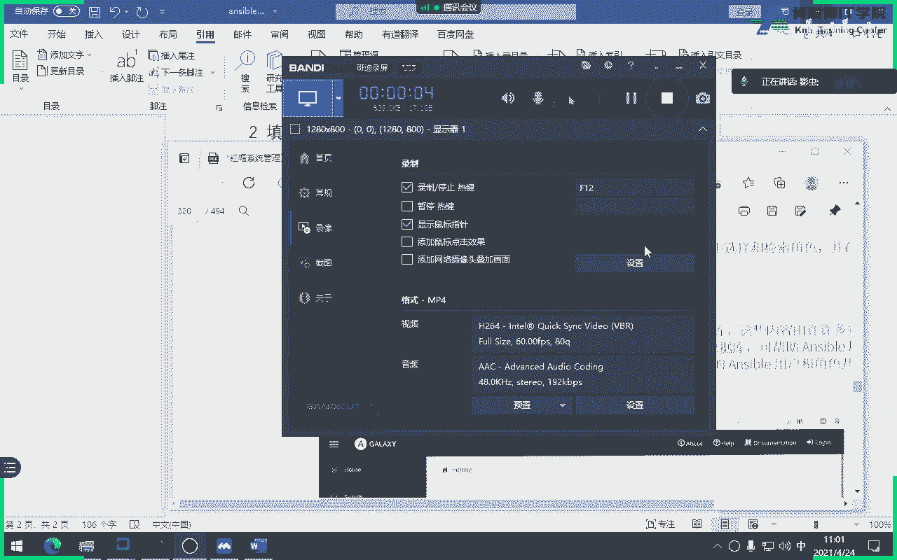
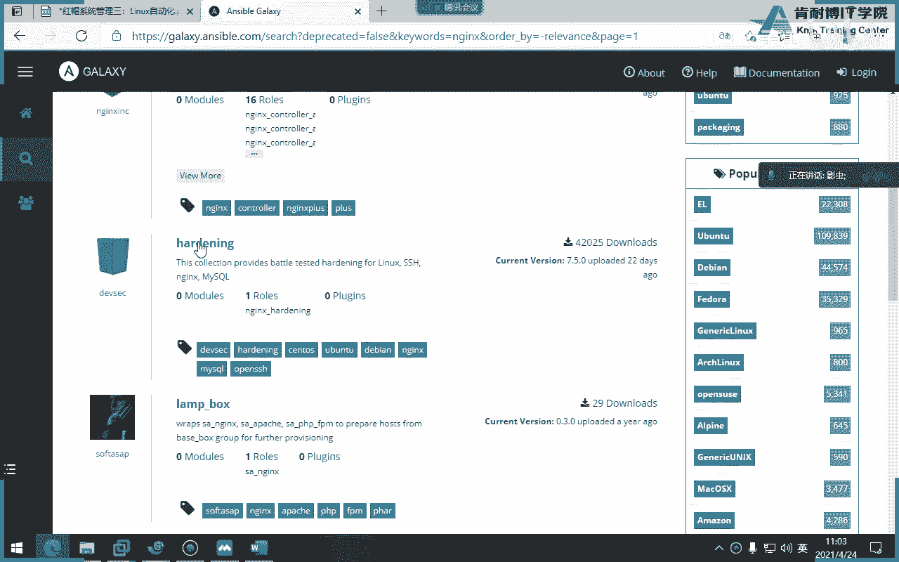
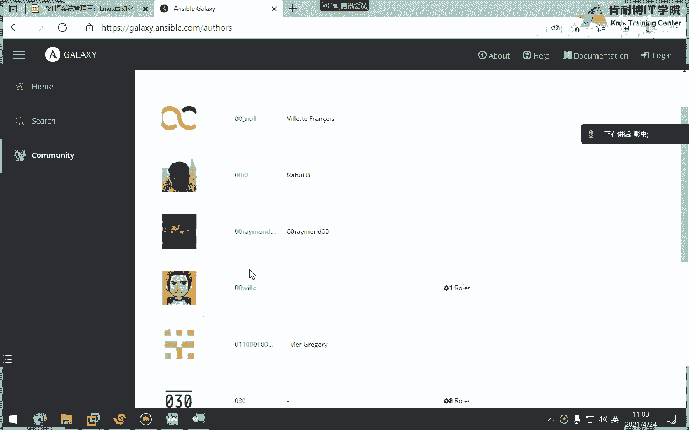
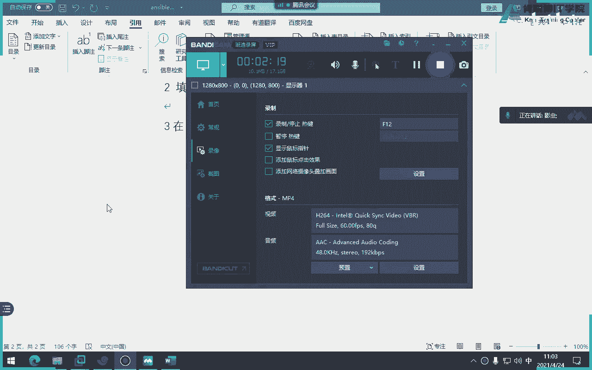
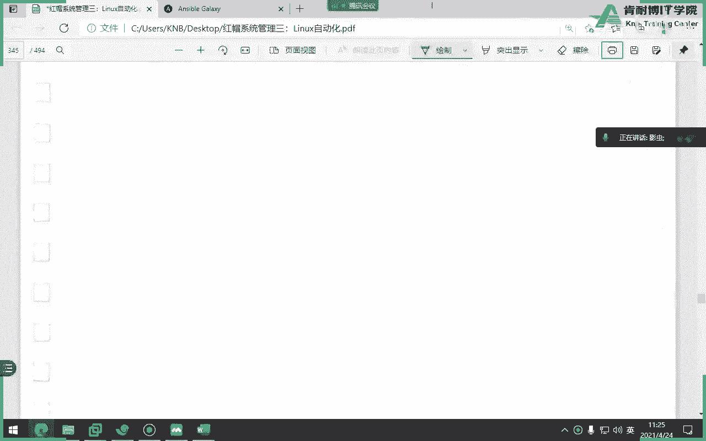

# 红帽认证系统工程师RHCE8-滕老师出品 - P20：22-ansible 使用galaxy角色 - KNBIT认证中心 - BV1up4y1h7MA

那么刚才我们用了一个红帽的角色，接着呢我们自个儿又自己创建一个角色。

第三个就是使用第三方的galaxy，就是这个网站啊，rep is a unstable comp，那当然这个图片里面的页面有点老了，如果你现在在打开这个页面，不是这个图片了，好吧不是这图片。

它是一个公共资源，说白了有点像公共的仓库啊，免费吗啊免费也就是说你可以写上传，可以的，你也可以自己上传，或者你下载别人的啊，免费是有很多的全世界共同的爱好者去提交的啊。

提交的有点像我们的github啊这样，那么里面有很多的数千个角色去使用，当然了，我们可以直接在这个网站当中去进行search啊，那我们我们看一下我的网站，这是7a l a l t，就这个吧啊啊，按什么。

羊是不，耶不能看，拼错了吗，啊拼错了拼错了拼错了，你看你看那个页面仔细看有点歪啊，有点慢，毕竟国外的嘛，你看它这个页面跟我们教材当中不太一样了，很正常嘛对吧，你看这边就可以进行一些搜索啊。

进行一些搜索的东西，包括你但你要先login进去，也可以进行搜索，比如说文件搜索一个叫做ngx吧，咱们随便搜一个，哎你看这不用说了啊，你看像这些都是角色，你看这边还有这是什么分嘛，人家是对吧。

打分这个就满分之五嘛是吧，就说明这个角色下载量还还还不错，800多啊，所以如果未来我们在使用的时候，当然要选择那种下载量高的了，这说明什么就star吧，s t就星星star星星越多，星越多。

说明他的得分越高吗，对吧，比如我现在说一个叫叫ngx，你看吧，那这个下载量厉害了对吧，这应该写的角色都可以用。

明白了吗，都可以用，包括一些社区对吧，这些社区的东西就分享嘛啊就分享好吧。

所以这个大家一定要明白他这个意思意图啊，你可以自己在搜索里面去做啊，那么怎么去获得的帮助呢，刚才讲过，你可以在这个标签里面获得帮助啊，然后包括他这个搜索啊，包括它的一个得分情况。

排版排排序都可以去去看啊，都可以去看好，这咱们就不看了，就是关于网页的东西，咱们就不看了，那么我们如果没有网网网页怎么办呢，我可以用命令行去搜索，前提是你得连上互联网对吧，比如咱们现在没有互联网。

就搜不到，像这一话，这句话是什么意思，他要搜一下release啊，release大家知道吧，现在很火的一个数据库嘛，release那我去搜一个数据库，然后哎这是什么意思啊，平台吧。

plan for不是单词平台的意思吗，那么这个l什么意思，猜一下enterprise linux这个单词企业商业版企业版，你看咱们为什么叫r h e l8 。

就red hat and press names嘛对吧，e l8 就说明我要搜索的不是一个开发版，我搜索啊，我不是一个测试版，我搜索是一个企业级的稳定版本，release release嗯。

建议大家学一下啊，就是这不是b类学校，就是你看一下，因为这个东西其实现在在互联网云计算当中很火嘛，它好像是一个非关系型的数据库吧，好像我没有记错的话啊。

release然后接着呢你可以用呃in f来看一下某一个information，就是某一个角色的一些详细信息啊，大家再说一遍，这个必须要有上互联网啊，必须要互联网好。

那么像这句话就是我要看一下这个家伙的一些information信息啊，包括它的一个description啊，active是否当前呢，包括下载量对吧，然后呢还有一些有没有素质啊，可能后面还有作者吧。

可能对吧，还有license，对不对，这个肯定很厉害对吧，我们的协议啊，license好，那么我们会查看对吧，会四去了会查看了，那怎么去安装呢，install的单词就非常简单了，注意是个子命令啊。

那么下载啊不是安装的时候呢，请注意这个安装有两步，第一步它会在后台先下载，第二步下载到本地之后再安装，是不是有点像我们的power man run，是不是先检查一下你当前本地有没有image。

如果没有的话，先从仓库里面拉拉过来，然后再运行啊，阅览类似于好，大家注意一点，在这儿你在装的时候一定要指一个小写的p指定一个单词目录，注意这个单词叫目录的意思，很多同学会把它想成d不是d啊，是p啊。

小写的p来指定目录，一定要注意啊，一定要指定目录，那么问题是我们只要哪儿呢，还是刚才那个rose目录啊，rose那个目录啊，明白了吗，只像个rose目录啊，好你看这一题看了吗，我要安装了一个。

这是它的一个角色名字吧，最后呢我要看rose吧，为目录，但这个目录要干嘛，先建立懂了吗，这个目录肯定不在吧，要建立懂了吗，这p不是d啊，p好这个单词会了会了吗，那这一题就结束了。

考试这一题是第一步先安装啊，难受，这是这样一个问题，第二这第一种安装啊，第一种第二种安装方式，注意了，考试考试这种方式需要请求文件的方式来安装，刚才是不需要请求文件。

就是我直接要安装一个东西叫release啊，下载下来inst就装了，第二种呢是根据一些应答文呃，一些请求文件安装，比如说我要装什么角色以及角色是什么版本，我写在一个文件里面。

让这个enable galaxy这个命令去读取这个文件，然后再去下载去安装，明白了吗，好吧，比如说我举个例子，像这这个来来来看这个呃这呃呃注意这个文件名不刚不是讲了吗，要通过某个文件的去安装。

这个文件名，必须叫它requirements点，要么注意这个单词你给我拼啊，不能拼错，必须叫做不能叫a b c啊，就必须叫做requirements，点ym这里面写了两个内容，这个难能看懂吗，同学们。

s s是不是source圆，那么version是版本，意思就是说我要装这个release的1。5版本，我要装这个release的1。5版本，注意这是通过一个某个文件来安装。

那么事先要先把这个文件干嘛写好，名字叫requirements，点ym里面写了这两行，当然了，不光这两行，大家来看，还有一种写法是这样的，同学们啊，这这这个这是干嘛的，这行是不是先安装。

然后通过一个硬盘文件来装，那么硬盘文件看写在哪，订单文件写在哪，角色肉食目录里面，懂了吗，好比说你的requirements这个文件要先写到rose里面，用are来去指定，用p来选安装。

就r是指定需求文件，p是指定安装到某个目录，大家不用是哪个目录，肯定是rose目录，听懂了吗，好讲了讲能理解吗，好那么我们来看这句话，这是一个模板案例。

这是一他是不是看一下requirements的各种模板，你看到这边吗，这个很简单对吧，圆这个也很简单，这个name是什么意思，我们可以理解为叫重命名，就这样，同学们，虽然你安装的名字就这么长。

但最后你给给他一个名字叫release，这个p r o应该是生产是吧啊，product production对吧，明白了吗，这是我们最后的最后的最后的名字叫什么，理解了，就是你装完之后。

它显示了rose角色的名字叫这个，那么为什么有时候还会出现一个叫s cm呢，开发学过开发同学应该知道呃，咱们现在啊很多语言代码是不是会放到我们的get里面get，大家知道吗，仓库吧，是不是源代码仓库。

如如果说你的源代码，同学们，如果说你的源代码是放到get里面，一定要加上一个s c m冒号给，但你要在互联网呢，那就不用，比如如果你如果你是放在git里面，一定要加上这句考试不会给你。

他会告诉你是放在git里面，就一定要一定要加s cm冒号，明白了吗，好啊，那我这边能看懂吗，这一串最后生成的名字叫做n g x，这个s是明白吗啊最后生成啊，小写的r是指定需需求文件。

小写的p是指定安装到rose目录，明白了吗，这么记听懂了吗，啊录目录啊，一定要去这么记好了，那讲完了，你刚才说了吧，如果你的是git里面托管的，一定要写这个参数啊，这好好看。

这句话就是干嘛下载并且安装吗，懂了吗，下载并且安装，而且它是通过应答文件来安装的，你们考试的时候就考了个应答文件，所以说应答文件一定要写对，requirement 4个单词别拼错啊，这个靠你们了。

各位没有地方能够冲好吧，r e q u i e m m e简介吧，多写几遍嘛对吧，你就会了，这个单词别拼错好吧，千万别拼错好，那么这个单词呢我们刚才已经用了好多次了，是不是列书啊。

刚才我们装红帽的角色是不是也可以列出，对吧啊，又输，当然前提是你要先指定他的路径，好这个单词要删除一个角色，比如我不想要干掉对吧，这个很简单啊，好而且呢一样，你甭管是自定义的还是怎么样。

你都得用rose来去干嘛，使用它，你看就这些，这就是我们的考试三题，哪三题呢，第一个使用linux自带的一个时间同步，第二个呢是自定义一个角色，第三个就是用galax下载。

但考试不可能给你互联网怎么办呢，考官会模拟出一个g仓库，你从get里面去下载模板，所以你是不是要写s cm冒号g懂了，考完后模拟了，同学们会模拟好了，这就是我们这一个东西，好来我们做一个实验，做哪个呢。

直接做高考习题啊，我带着大家一块来露一遍啊，嗯很显然第一步要先打一下这个命令，这个命令会生成出一个假的gate看吗，注意咱们这个环境当中啊，同志们会生成出一个假的gay，就你打了个lab命令。

然后你要的这个角色就放在git里面，所以说最后的应该怎么写，是不是写着三行，这是圆吧，好那么master指的是版本，但最后你要安装角色的名字叫做student，点bt e n v，看懂了吗。

大家知道什么应用吗，环境嘛，你问问题吧，环境吗，好然后ok写好了，那接着我要干嘛，是不是要用install命令把它干嘛装起来，装起来之前是不是要先指定一个r选项来指定1w文件啊，所谓的文件对吧。

装完之后你会发现咱们的角色就变成了是吗，这个学生对吧，就变成这个对吧，好我们说一下啊，ok给大家做一下，做完之后我们就下课，怎么样角色就讲完了，最后发现难吗，也就这样子吧，也就那样吧。

其实最难的就是那个结构体啊，那个结构，ok lab lab，什么东西有肉，感谢str走，你看他自动看，自动开始给我们部署，看到吗啊，自动开始给我们部署一个git仓库，模拟了同志们，他假的啊。

而且他还他还这个题目里面还有很有意思，他待会给我们做一个错误的角色，就是咱们下载完之后发现你角色错了，让你去修复，然后再重新下载，就是不是模拟真实环境当中那种版本的之间的对比对吧，来看看啊怎么做。

那么一开始呢他要求我们进入到工作目录里面，这工作目录看看里面有影文本文件，sv文件，看他先把我这个锅剪剪掉，是要干嘛，对吧，把上次输血给去掉，不然他待会是不是读取不了角色，然后再拉吧，拉巴拉一堆。

不用看了，接下来我们看一下影分层文件啊，是给这个server a来做的对吧，d b service server a来好，开始先写什么，先写请求文件嘛，那么请求文件一定要在哪写，他有了这个目录。

对不对啊，那你直接写就行了，怎么写，他说啊，同志们，他说需要需要从这个地方下载这个仓库啊，这个那个文件啊，那我就这样呗，他其实是在workstation当中模拟出来一个什么get it吧。

大家平时没事的时候要多多关注一下这些新的技术点，哪怕名词你先关注一下什么叫release啊，什么叫gate对吧，大家知道一下好s cm应该写什么对啊，版本呢worship呢，他要求我们写什么来着。

版本题目当中叫master主，然后最终的名字叫做学生点bh e n v k结束开始装，那么退出吧，退到上级啊对吧，退到上级，i galaxy淹死大，然后你俩下去，不用啊放屁就行了嘛对吧，走你，ok成功。

然后最后发现多了一个，对吧，好注意，我们看这个这个角色里面有啥东西啊，看应该会有那个结构体吧对吧，会有这个结构体，哎，你发现这个结构是简单的吗，是不是少了很多东西，让他删了对吧，我上上上上百无所谓。

接下来我就要去引用使用这个角色，那问那个使用怎么使用，我看干嘛呢，让我们做什么事儿呢，让我做个啥事儿啊，做这一堆好吧，那我们就抄抄，照着抄吧，你你能看懂这一堆什么不，这是一个普利普卡，我们来照抄板。

定义变量吧，好定义变量叫default，注意这个单词是什么，这个单词m r o m a p r o m p t，大家知道这个单词什么意思吗，要提示提示好，你来看后面这个东西像什么像什么。

就这个我现在打了一个，我是正在打了个东西，杠h像什么，这个回答想说像命令前面那个提示符吧，对不对对呀，很对啊，非常对啊，非常的对，a这你得看得懂啊，就这个，就这个，对吧它只是改了看u对应的u on。

它中间加个on，h呢对应的host name，这w呢对应的当前目录，懂了吗，哎就这个意思啊，他把这个叫这个叫什么变量，还有谁记得这个命令提示不叫什么变量，p一不是p s p s1 ，p s一次是个变量。

环境变量，同志们，环境变量注意咱们这个叫命令提示符啊，这一堆叫命令提示符可以改的啊，你有没有在工作当中见过别人改过，你说这边是不是可以出现几点上下播啊，p s一吗，p s一啊，所以他现在就改了，懂了吧。

那所以你看这角色你就能看出来吗，就变环境变量吗，看了吗，把它改了啊，然后去注意pcs是什么意思啊，在使用角色之前做什么事吧好吧，他创建了一个用户是吧，是不是创建一个用户叫叫学生二啊啊啊删删除删除删除。

对他保证那个这个保证那个保证那个用户是没有的啊，强制删除，好然后接着才开始真正使用这个角色，他就想去创建一个用户，只不过呢确定他这个用户确定一定不在才行，如果在的话，就先删除他，是这个意思啊，懂了吧。

就是其实这个角色里面就会包含一个创建用户叫u的，二是学生二啊，然后最后呢这个这个意思是不是在角色运行之后做什么事，这里面充电，充电器充电，那去年二，这个啊不对，在这里面创建的不对，就在这里面创建的。

啊为啥写密码，这密码你知道吗，不想写好嗯，开整啊，同志们开着，开着，b c吧，为什么没有职业，没有这个我就不是人了啊，行不行，妈的这个逼我说杀手锏，啊改变了吧，我看了波斯，现在改了，诶诶诶诶诶然后成功。

然后接着你看他让我们干嘛，同志们，他让我们退出来，然后啊不不让我们登录，学生二学生二，二学生二，二来登录谁下面几a对吧，哈哈，定个提示不吧好吧，就这个吧，改了吧，改了懂了吧，还就这个意思啊。

接着他又不满意了，为啥呢，他觉得我要颜色啊，我要颜色，同志们，我要变成blue蓝色啊，蓝调怎么改了，那么我们是不是得这个重新下载啊对吧，因为你的那个master的版本当中是没有带颜色的。

所以它重新下载是不是有点类似于我们现在工作做这种开发对吧，持续部署嘛对吧，怎么怎么表示呢，就是我现在要这么做啊，现在重新下载修改一下，退出来，修改一下，谁怕把好，那这时候我要改成什么呢，d v。

你看他们说了吗，把版本改成dv，然后就行了是吧，哎名字要不要改，不要不要不要不要不要不要好不改，那么要不要重新做，肯定有肯定有肯定要重新装，对吧，肯定要重新装吗，杠二杠p要重新装诶，他说啥存在了。

存在呢，我就强制安装，哎成功了对吧啊，就可以了，那这时候我们你看他说了吗，要强制安装，这时候我要去编辑一下playbook，重新编辑play book，加上那个颜色book在哪。

好那么在这边加个颜色在哪加呢，在这边加一个p r o m p t color，其他不用改吧，那直接来呗，应该直接来了吧，对吧，直接来吧，直接运行好，学运之后，我再进入到server学生二吧，好的稍等啊。

稍等稍等稍等稍等一下啊，嗯好再次用学生二来登录到上面，a不错，ok报了个错，他说不好意思，登陆是成功了，但是没有颜色，也没有我们刚才改的感觉吧，为啥因为你看少了个错误，犯什么错误，大家知道什么错误吗。

好我们要进入到修改什么，希望我们的小色里面有一个错误，哪个呢，应该是pass吧，不对不对不对不对，不是这个应该就是咱们的角色错了，哪个错了呢，他们那个哎就他好，这个文件错了，你看错在哪儿，看少一个什么。

说啥杀手杀对啊，这个测试据吗，这个角色错了，知道吧，然后怎么办，哎我操，怎么这么干了怎么办，在跑一遍呗，那怎么那是跑一遍嘛，对不对，那你没办法，你改了吗，重新跑一遍呗。

这是不是有点感觉我们像做开发一样对吧，比如说咱代码提交了，发现有bug，修复一下就行了对吧，然后再让学生登录，学生的学生呢学生了学生学生学生啊，我重新下了，s u d d u d。

所以这个题目出的还挺好的，其实很有想法，blue对吧，blue好注意这个题，那么，那么就没那么了好，那么这一章就结束了，同志们这角色就结束了啊。

