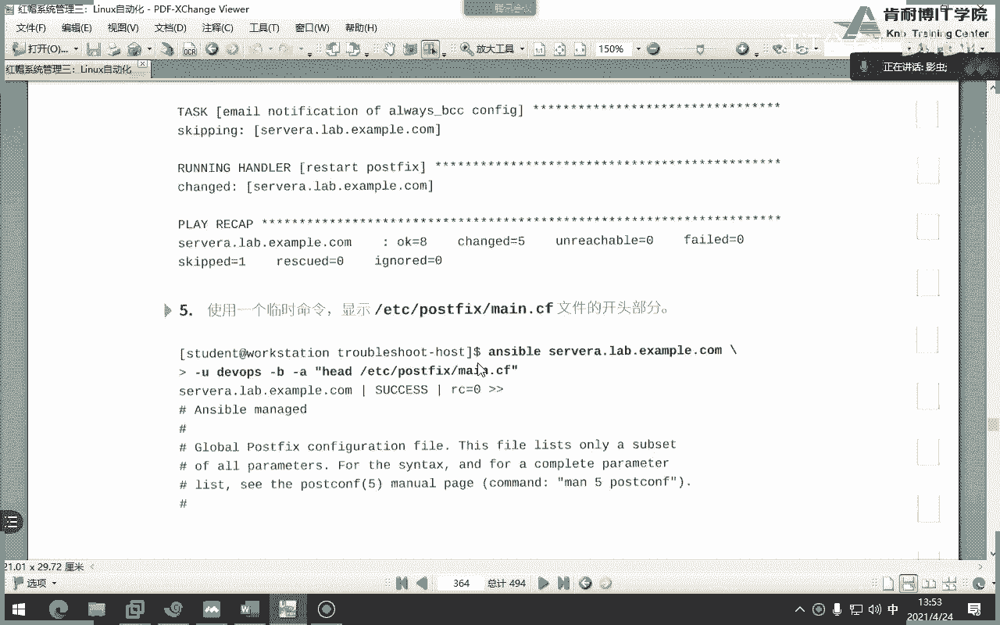

# 红帽认证系统工程师RHCE8-滕老师出品 - P21：23-ansible 管理 - KNBIT认证中心 - BV1up4y1h7MA

这章呢是第十章主要讲的内容呢叫做管理软件和订阅啊，第一部分要讲一下管理软件和订阅，比如说第十章里面讲了好多一些呃，非常琐碎琐碎的一些工具都是用于做自动化的，比如说软件包的安装，用户的建立。

群组的建立是防火墙启动服务，挂载格式化分区对吧，就是一些其实这里面的内容不就是咱们cs cs的内容吗，只不过呢我们如何用enable来实现cc里面的内容，比如建立用户建立文件啊，首先我们先看一下。

就是我们的样样，那么这个模块已经非常熟悉了，我就不再写了，其中呢你要注意这个啊，就是我们那个最新啊最新，那其实呢最新呢可以理解为什么呢，理解为我们的gm update这个命令看了吗。

所以说其实那个latest指的就是最新，那么这边可以理解为更新，比如说题目当中出现更新这两个字，大家一定要打latest啊，不要打这个啊，比如说更新什么软件，一定要打状态，that is代表最新版本。

在这这个这个东西才叫更新啊，更新好，那么怎么样去能够显示出是一个组呢，你看用这个符号at t for 2代表组就等同于你用亚马group install安装一个软件，懂了吧啊这能理解吧。

各位一定注意at代表组，你今天这个地方at是个组，你任何地方都都都代表组，你在linux当中只要表示组都是这个at符号好吧，你你记住它以后，你在任何地方看到这个都代表组啊。

就代表这个组就是这样一个一个一个一个事情，就是圆珠笔吧，哎这个我要把圆珠笔啊，首先那个吧好，那么接着呢我们再来看这个呢，就代表删除吧，remove啊，代表删除。

那这个呢就代表模块emojs install，因为在前面有什么模块的，版本号后面加上这是斜线，后面的是什么意思，谁还记得这是我们的perfect啊，profile对吧。

profile配置文件profile对吧好，那优化多软件包安装怎么优化呢，不就这叫什么列表列表对吧，不说了啊，列表这代表变量吧，loop吧，循环吧，loop loop，别忘了双引号加双花括号变量。

那么这也是一个经典错误，很多同学忘记了加双引号，或者很多同学中间没有空格，看我鼠标这个位置是有空格的，但很多同学忘记也不行，这个书上是写错了，两个引号啊啊这个印错了啊，多了多了个引号印错了啊。

好那么什么叫收集关于安装软件的事实呢，这个大概说一下吧，啊因为咱们课后习题有这一题，就是这个单词，那package fat这个模块，这个模块呢是用于收集被管主机上面已经安装的软件包信息。

而且这些信息他一定会保存在这一个单词当中，就按时把横线fiat下面的package是注意这个没有，为什么，就是个变量，就是一个你必须给我记住，这是个死的，固定的，就叫做uncible下划线。

fat点派对这四它没有，为什么啊，那这个变量保存什么呢，它保存着受管主机上面已经安装的软件包的信息，来我们看一下这个图片，首先定义一个变量叫pg呃。

首先它有一个叫做这个这个package feat这个这个模块对吧，这个模块manager auto啊，manager auto它是一个固定的用法，然后接着大家来看看它是不是直接打印出这个变量的值了。

debug vs不是变量值吗对吧，这是个固定的语法，就是要按下划线fs。pages，这是个固定的语法，它就来打印出我们的软件包的什么这个这个这个人包的信息啊，人包的信息好吧，知道一下就行了。

当然这个绝对不会考唉，考不考哇，好像不考考虑他没有经济，不考，好吧，待会你看注意吗，看到了吗，这就是那个uncible fat than page的信息，就是你安装一个软件包。

叫no叫network manager这个软件包，那么我怎么样打印出来呢，没办法，必须要借助这个啊，如果不借助这个，它打印不出来，你就把它记住了，这就是打印软件包的信息，那么这不重要啊。

你知道一下重要的，在这儿我们有哪些模块装软件呢，第一个咱们常用的是ym，第二个就是我们的dnf，我们说过红毛八当中的dnf其实就是样吧对吧，还有一个是a d盖的，是乌邦图下面的啊。

还有是windows pc package，就是微软的，比如我们说过是不是被关主机可以管理微软操作系统啊对吧，那微软操作系统怎么装软件包呢，叫温下面的pb没有s啊，这注意这边没有s，刚才那个电量只有s。

看到吗，这点一定要细心一点啊，这个没有办法，你要把它死定背好，那么a b d钙呢是非红帽的lambs常用的，比如说欧巴图啊，be bang了这些东西啊，你知道一下就可以了。

大家看在这边你看很显然他做了一个什么判断句吧，如果是红帽的话，是要么如果不是红帽的话，这federa就用dnf，当然了，我们三路s也可以用dnf好，那么刚才那个样品也好，这个dnf也好。

或者是我们刚才那个windows package也好，都可以用一个模块来代替，叫做package，但这个模块呢没有这么智能，这个模块可以代替刚才那三个家伙，但他没有没有这么智能，哪个呢。

就是如果他发现那个软件包，它的名字改了不行，你比如说你看各位这个package模块，它不支持更为专业的模块所提供的功能，举例了，阿帕奇这个包在红帽当中叫h t t p d。

但是阿帕奇这个包在乌邦图当中就叫做阿帕奇二，那么这个时候package这个这个这个这个家伙没有这么智能，它不能够判断出来你当前系统是什么，所以说后面的名字你得就没没没有没有办法去。

你你得手工去写出来才行，所以说这个命令呢大家就不要记了，为啥，因为这个命令不太用，你还是用最多的还是什么样好吧，或者是a p t，所以我们把这个命令就不要学了好吧，不用学，知道一下就行了。

那么前面呢都是讲怎么去安装亚目或者怎么去配置，怎么去安装dnf，那么问题是我们得要配置亚美元吧对吧，考试要怎么配样品源，那么样品元怎么配呢啊如果在我们的cs一阶段当中很简单。

是不是进入到要么点repose的目录里面，但是在我们按xp当中呢，我需要用这个命令叫亚啊，responsible对吧，responsory这个这个这个模块来去做亚美，注意这里面的每一句话都不能省略。

注意啊，这里面的每一句话都不能省略，首先第一个f什么意思呢，注意这个fire其实是最后生成出来的那个亚目的文件的名字，咱们知道如果自己在创创建项目的话，是不是跑到哪个目录。

是不是一直跑到edg这个里面对吧，然后你在里面创建，你看就这个就是fir的名字，看了吗，就这个这就是fil的名字，比如你刚才那个票写的是a b c，那么最后结果就会有个a abc。ip文件，懂了吗。

注意这个name，很多同学会以为是这个name，不是啊，这个name不是这个name，是我们打开仓库的那个name里面的name，懂了吧，可不是文件的名理解啊，千万理解可不是那个文件的名字啊。

好那这个没有什么解释的，叫描述吧，但是你不能没有，我以前尝试过不写，发现不行，你必须写，你写个你随便写随便写，考试没有要求，但你必须写第二个啊，第四第1234，第四个不用解释吧，路径enny不用解释吧。

好那么g p g check，咱们以前是不是在csa阶段要求关掉，那这边呢考试的时候他要求你打开，那么什么叫gp check，各位什么是gpg check。

是不是红包为每个软件包都加添加了一个私钥的签名，你要用他的公钥去验证签名，所以说你这边写了yes，就代表我去验证签名，但是问题是你不要他要手对吧，所以接下来再加上这句话，这句话叫reking啊。

就rpm rpm下划线，king这个模块是用于导入要匙，就是你上面g p g check是yes，你必须加这句话，如果g p t check是no，那么这边就不需要加这句话。

这句话很显示我们导钥匙看到没，这是k吗，导钥匙考试就考你这这样有什么好处，是不是每次安软件包之前都可以做g p g校验，明白了吗啊，除非你这句话不加上yes，你打个弄，下面那个就不用做。

如果这边是yes，一块儿做明白了吗，好最后结果是什么东西呢，你看它生成说的是这个啊，这个就是中间那个名字嘛，name嘛就那个name name啊，好那么gp check倒完之后之后就会出现一个k钥匙。

考试的时候钥匙会给你，ui路径会给你都会给你，只要别拼错，所以建议大家用鼠标复制过去好吧，像那么长的东西，你复制一下就行了，不要自己敲，你有意思吧，那怎么样复制啊，是不是要从虚拟机物理机对吧。

远程连接到虚拟机里面，明白吗，你不远程连接，你怎么你怎么复制，因为咱们的考题是在物理机当中啊，那你做题目是在虚拟机当中，你虚拟机怎么怎么怎么复制，你是不是要远程连接才行对吧好，这张结束了小半截，结束。

简单吧，好必考题，注意这是必考题啊，这个样子啊，它是用shell脚本的题目来考你，所以说这里面单词你都给我记住，按什么doc去查看才行，或还或者或者是你死记硬背啊，这题是必考题，就是我们第二题。

第三题你得考，反正你得考啊，你得考，ok结束题目不做了，不让你们做啊，不让你们做题目，因为很简单，那个题，但是也会啊，题目就让我们做一个软件包安装好，接下来user模块那就更熟悉了对吧。

ut模块当中比较重要的就是group和group它的区别，i group指的是附加组，用逗号来隔开，group指的是主要组，没有s的是主要组，那么如果是附加组的话，为什么要加个追加呢，因为不追加的话。

就不能够连续的加入多个附加组，对吧啊，这个要知道啊，好那么这叫user模块啊，那么user模块呢这个当中是不是还有一个叫可以加u i d啊，啊对吧，还有加password，还记得吗，你可以啊。

那么使用u的模块来生成s密钥是干嘛用的，不是干嘛用，就是生存必要吧对吧，那这个呢你也得去看，比如说2048是什么意思呢，是指它的这个算法的位数吧对吧，2048位这个钥匙的位数啊啊。

然后这个s k fil是指的什么，就钥匙生成到最后在在哪，在点s下面就是最后的你生成完那个钥匙放在哪儿了，放在这儿去，好你看这一堆的参数你得理解，你不用背，你得理解，你比第一是什么意思，第一个是描述吧。

我想问大家用u的a d d哪个命令是描述，嗯嗯嗯嗯猜也能猜出来，肯定是c呗，你看第一个字母是c呗，那肯定是c，懂了吗，描述啊，create home肯定create，默认就create，对不对啊。

system等于这个是什么意思，是指我是否建立系统账户啊，是否建立系统账户好，那么格格不是干嘛的呢，建立组咱们考试就有这题啊，让一个用户建立的时候附加在那个组当中。

那你是不是得用这个单词先把组建立起来对吧，所以group是建立组和删除组，你看三个这样几个选项，同样不用去背，自己去看这几个单词，你现在是应该能看懂的，你要这个看不懂，你回去再把cs搞一遍对吧。

哎group，所以说你看优点有了group，有了不就是又学会了创建用户，又学会了创建组，明白了吗，所以这个是必考题好，那么大家还记不记得noon host的模块。

这个模块是不是保存了所有我曾经登录过的主机，给我发过来的钥匙对吧，因为我们有了这把钥匙才能做加密吗，对不对啊，叫known host模块。

允许能在受管主机上的known host文件中添加或者删除主机密钥，我再说一遍，这个主机密钥是做免密码的吗，是不是睡了吗，看下面，是的吗，我觉得不是吧，这个跟host的指的是什么，是你密码吗。

最美丽的我就是要做那种密钥就免疫了啊，不是不是这个这个密钥是你第一次连接对呀，我第一次连你是不是要给我一个密码，我是不是要点yes那个密码，这个密码是用于免密吗，不是吧，这个密码是用来加密的吧。

加密数据的吧，我连接你的时候，你给我密码，我是不是咱们俩才能才能安全通信，这个密码是用于免密钥了，免密码了吗，不是啊，这是用于安全呀，刚才那个是什么，是不是刚才有一个生成密码诶，在哪啊，我这个是啥。

这是不是生成那个一对密钥，对不对，这个应该才是免密的吧对吧，别混了，你在这里干嘛呢，他也是授权密码，像在向大量服务器添加和线上用户，是他也是他也是，这是空调的public公告。

刚才那个是private私钥对吧，你看刚才那个是没有写的，就private私钥，对吧啊这个对c要么rsa就是要么非对称算法里面的那个啊对了，那是公钥啊，不会你就卖你这个你记不住，而且这个还不讲。

就这个叫loop loop up，这个插件是我们本次课程当中不讲的，但是你猜也能猜到你什么意思呢，是用loop loop up这个东西去干嘛，去访问一个外部文件，抓取外部文件里面的数据，你看能看懂吗。

就说一下是外部文件吧，相当于啊这个public of kings是外部文件吧，就是抓取它的文件内容对吧，好像这个也是你可以去待会慢一下，按那个dock一下，loop up这个，那这张实验是干嘛呢。

我们low演成了不看啊，啊不错，你看这是个变量文件吧，同志们，而且是外部变量文件吧对吧，那么这个变量文件里面有什么，有一个叫做users，注意这就是一个点型的变量，然后里面分组了，这很显然是有点类似于。

对有点类似于那个那个那个那个那个那个那个数组吧，对吧，数组吧，然后去分别去执行users，点ud name，user，点group吧，对不对，就抓取吗，你看它这个外部文件，它是外部文件。

外部的变量文件啊，就这个看item。user，item。groups，item。group，看item。user加上item group，当然这个东西就难了，就是抓取密钥，你不用你不用。

你得去把它抄下来，因为这不是咱们这个课程的内容啊，这个实验很难啊，而且还用到了我们上节课讲的lon fire，这个是啥意思啊，就到表达式下面说明是在这个位置当中修改，只要以这个开开头的吧。

后面把这个单词改成no，原来是什么，还记得吗，这个原来是yes，八一这样你怎么样，你为什么凭凭什么用管理员的登录对方对吧，你看那个单词不是允许管理员登录嘛。

是吧好你看这就是我们刚才讲item user对吧，item。user，那有没有item。root，没有啊，他没有让我们建立组哈，没有主，所以这题总共让我们就是第一个鉴定用户对吧。

第二个去修改一下s s h里面的，让我们的管理员不能登录，对吧啊，然后再接下来干嘛，还有一个重要的事情是分发密钥啊，你看这这封面密钥在哪，还在这儿看分发密钥吧，方法密钥懂了，这波不是分发密钥吗，对吧。

给我们所有用户分发密钥，item。ud name，那么username有几个user name呢，回去给用户看上面，好几个月不是三个12345个吧，是不是相当于我建立五个用户，为这五个用户分发密钥。

最后还做了一个不让管理员s h，是不是结合了上节课所有的东西来引发对吧，就这一章的题目，这个题还是蛮难的啊，不让你们做啊，你们回去自己做，那么用户就下完了呃，群群群组讲完了。

那接下来就开始讲这个叫调度程序，我们以前讲过at是干嘛用的，一次性的at d吧对吧，at d那同样这边也是这个20指什么呢，一定要加un，不然他不知道24分钟还是秒啊，就是20分钟。

那么也就是说20分钟之后做一件什么事，做一件删除，这个用户叫tp user，并且是yes，什么意思，看这个单词就是代表唯一嘛，unit吧，是唯一是吧，就代表这个任务我只做只做一次，一次不会再做。

第二次就是在整个你自己是应该能看懂，就算没有学过，你应该能看懂对吧，20分钟之后删除这个用户，那么crew呢是做轮询的吧，呃做那个周期性的吧对吧，那你这个就更简单了对吧，那个以管理员的身份对吧。

然后是这应该怎么表示，11点是11。45吧对吧，做一件什么事啊，做一件下面这件事啊，job是具体的事情，那么相当于每一次的11点二四十五是不是都做对吧，因为他是轮询嘛啊它是轮询的。

那么这时候就有这样几个东西要指定要指定，那那这个如果过了之后，更熟悉的就是我们的service，注意service其实是在我们红毛期之前的命令，咱们现在应该使用c4 d。

但咱们现在是不是还是喜欢用service对吧，起服务是不是用c service或者cd啊，你看这就是一个典型的老版本的写法，但我们现在是不是还是习惯这么想，那真正的新的写法应该怎么写，使用c4 d好。

如果你使用c4 d，一定要把最后一行给我记住，一定要把它写上去，一定要写好吧，那相当于他把阿帕奇给他重启了，跟这个上面一样，这是重启n gx，这是重启阿帕奇模块对齐就可以了，你看是不是很简单对吧。

但是呢我们我们咱们班啊，我不管别人，咱们班统计一下所有考试的考生，不要用c4 d全用service，因为service是不是写的更加直观一些，还有问题，service好拼啊，这个不好骗啊，对不对啊。

reporter干嘛呢，重启吧，像这句话是什么意思啊，180秒之后重启，如果后面不加任何东西，就代表现在重启好吧，就这个代表180秒之后重启，这个代表立即重启，强制重启，重启reboot模块。

你看这并没什么讲头啊，这东西没什么讲，就自己看就行了，那么share和common模块就更不用说了，是不是一个这两个都不支持幂等性，同时哪个是支持变量呢，share吧。

而这个comment不支持变量对吧，哎不是变量，我以前讲过好，这一点我也说一下，各位就这一点我说一下这个c h d r代表切换的意思，那么在这一题当中，他是想创建一个目录文件，那在哪创建呢。

注意这个pass可不是根啊，这个前面的斜线不是根，它是基于secret下面的path to sequit，明白了吗，听懂了吗，这个c是dr代表称职的意思，就代表cd的意思就改变了改变的意思。

千万要注意啊，这个单词一定要注意称之，你看comment应该更是因为它不受对吧，不受这个变量的约束嘛对吧，所以如果你设两个非得要用的话，尽量大家用这个而不要用sh，但是其实呢我建议大家这两个都不要用啊。

什么时候用呢，查看时候用，比如我写个playbook建立了用户，你用这两个命令去查看是否建立用户了，只要是关于创建的东西都不要用这两个人来做，那考试一样啊，嗯我们看一下这个题目啊。

嗯你看他把become写在这，说明它的配置文件里面没有写吧对吧，然后接着你看这个单词就是怎么怎么理解啊，没两分钟，然后九点到16点就是16点就是四点嘛对吧，然后是1~5吧，就周一到周五的九。

到16点之间，每隔两分钟运行一下下面的这个事情吧，对吧，job是事情吧，job是指的事情啊，明白了吗，其实你你在写的时候呢，你就一定要把它的格式记住就行了，每两分钟是星号斜线二，注意每格都是星号斜线。

这个咱们在cs当中是不是说过对吧，分就是呃不是那个连续的带横线，不连续的用逗号，比如说九点8。十点，这样逗号就可以了，这就代表连续连续啊，这个可能可能性就没有没考，但是如果真考了。

你也应该会因为你百度啊，不是百度的，看着小，行吧，那比较简单，同样也不做题了啊，这个count是指什么，一次unit a unique，那很显然这就是做一次吧，做一次这个事啊，而且是一分钟之后吧对吧。

minutes嘛，因为1111定要注意这个at当中是没有单位人意的，自己写unit后面要自己加上单位的名称，它才最短是一分钟还是一小时，这个一定要注意啊，感觉没啥了一样。

像那个fire呢填充我们的文件对吧，大家有没有发现file其实真的他的很强大，可以建立文件，建立目录啊，就是link对吧，所有所有一个嗯s linux一个就搞定了，另一个file就搞定了。

那么这一块是个重点，同学们这块考试是个重点，让你去分区分区呢，我们用这个就是一个party mei party的模块来分区，怎么分呢，直接看案例，最中间的解释就不用看了，这个很简单嘛。

是不是创建一个分区，并且加v db number 1，那很显示v d v一吧，大小多大，十个g没了，其实也不难吧，但你一定要给我记住啊，这个number要写的好吧。

那我要写你是v db一还是v d d2 ，我怎么知道你得写上，接着还有一个大写的g大写的m大写的k离啊，考试的时候一定是大写的啊，你别来个十小写信，那这个玩意儿，但我没试过，反正书上都用大写。

咱们就用大写，而且你看一下你的doc全是大写，几乎没有消息，那咱们就别试了，人家大写咱们就就大写好吧，如果他加个b你就吃g b，你就老老实实写上啊，别去踩这个雷啊，好吧好，那么这个是分区各位。

但是咱们考试的时候考什么，考l v m哎，我回一下lvm第一步要干嘛，pv vg lv对吧，就这么简单吗，p v v g l v，那问题是我怎么建立pv，我怎么建立vg，怎么去建立lv呢。

下面这两个家伙来干，注意lv g和l v o l，其中lvg是做什么，做v g l v l呢很显l v嘛，做l v的吧，那么什么是p4 s呢，默认p有多大四招，万一考试让你改，你得知道怎么改。

你看这个是什么意思，p side 323 p，这意思对32兆啊对吧，32兆理解吗，你看下面有解释好，那么这个v g呢在这题当中是给你了它v g1 ，那p v是啥，是dv下面的对威力a一的分区吧。

来充当我们的物理设备对吧，那么总体来讲就是我用v g一对吧，然后呢呃不不不，我创建出一个vg 1，并且呢是vda一来当做pv的，并且呢把里面的p size改成32兆是吧，这整体的整个翻译成这个对吧。

翻译成这个中文啊，那么这个时候呢我们要再用一个叫做lv o l模块来创建我们的逻辑卷，就lv那么怎么创建呢，那这这对，而且这个单词很显示调节的吧，嗯对吧，比如说考试当中不让你创建，让你调节大小怎么办。

很简单吗，resize i不对吧，那你来看这边能看到吗，我不信诶，这边有小写的g啊，可以，那他要用小写g，那你用小写g大写用大写，反正你最好是统一下考试的时候，这样你还还好，比较容易排错对吧。

不一样不一样，刚刚那个是做分区的时候，必须有大学必须打这个是吧，对分区是必须大写l m里面是那就太好了，那就太好了，那我们我因为我所有的都用消息，我我所有都用大写，我不喜欢用消息，因为总感觉小写。

你有没有试过，如果你再用那个party的命令或者fdisk命令，就直接分区的时候，你用小写，他是报错的对吧，他是报错的，所以你最好咱们干脆直接大些，少那些记来记去了好了，有分区了，有分lm了。

下一步是不是格式化，所以file system模块用于格式化，就e i t3 e t4 ，你下面的东西不用不用再解释了吧，很简单吧，格式化为x f x谁呀，v0 比一。

那格式化完之后是不是得mount挂载，挂载是哪个选项，mt命令挂载，那pass是指挂挂挂载路径s r c呢，你挂谁啊，是不是指这个设备，对不对啊，就所谓的最前面对吧。

咱们f s table当中的第一个字段嘛对吧，你看最后结果是这样的，看到当然了，他这边使用的是什么u u u u i d号，可以啊，没问题啊，好挂了点ui d号文件系统类型最后是挂载了。

所以你看其实如果你cs没有学会，你根本不知道我在讲什么，如果你cs会了，你这个就不用学了，这个就这么简单，对吧，但是一定要注意，像这个path路径当中，其实你不建立行不行。

这个对d就这边这边如果不见得他会不会自动生成，不会吧，那你待会做一下试试，如果不建立它会不会自动生成，为什么要这么说呢，因为有些同学他他会忘，比如他根本就没有建立，他，那么写完之后他如果看不懂就完蛋了。

这一定要能看懂报错，如果他必须要先建立它的报错，肯定会说pass这个位置路径不存在对吧，所以大家一定要看懂这个报错，所以建议大家把它先建立起啊，其实我觉得不用先创，因为你写进去之后，你想你想过没有。

如果先创的话，下面有1万台机器要先创建这个这个这个过来点吗，那你在上面等，你必须要先看那位问你能不判断一下是否创业，我觉得不需要创就没了，我们可以做一下吗，待会你们可以做一下。

就是我们做完之后呼吁不去创建出来，应该是一个什么，应该它是一个全自动的吧，我觉得是全自动，应该不用，应该不错，其实只有最后一，应该是学生，因为你自己做，因为你自己做挂点，你不用担心磨，做报点的时候。

你就可以知道你挂的时候，如果他们不存在，就不会来失败，对了，如果不用按s，它肯定失败，但这个东西我们不知道，我们自己待会试试吧，看看要不要先写上d，好你看这个这个这个有点意思啊，他做什么swap吧。

但他用什么来做的，大家大家看他是用分区来做吗，不是他不用分析来做，它是不是用的l未来做，按适用分析来做，只不过他命的是lv g里面可以有一个单词叫做pvs粉丝的那个啊，对就是这个就这个是用lv对吧。

lv来说啊，这边吗不是l v吗，啊就是说白了就是这个东西呢你可以用lv来做，而且你也可以用普通的分数来做，大家知不知道，其实我们所有分区我们以前在考试的时候，我们都不用分区来做。

我们直接生成一个文件来做，大家知道吧，举个例子，咱们考虑当中说，请问你的电脑创建出一个g的swap，对吧好，你怎么分，是不是用fdc分出一个g，其实还可以用什么，不用分解来做，只要用文件来做。

就你先给我生成出来一个空文件，这个空文件大小是几个g，然后把这一个g格式化为swap，格式化是哪个命令，make make swap吧对吧，懂了吧，就是你把这个文件先建起来，大小是一个g。

然后把这个文件变成swap就可以了，啊那个不过跟n m s没有关系啊，明白了吗，就是我生成出一个一个g的文件，而且这个文件是空的，那问你老师，我怎么知道我怎么送出一个这么准确的一个g文件，dd啊对啊。

dd命令对吧，好明白吗，也就是你用这个分区的方式来做也行，你用lv这个题目在咱们教材当中的lv做也行，你直接生成一个g的文件做也行，你考试的时候，如果考这个东西，三个随便你，你只要给我做出来。

是不关心用什么方式，你只要有一个g的，最后结果是一个g swap，ok有了满分百分，懂了吧，这就是swap，这是我们的acc的考试，对他不关心，你用什么模块，你给我做下就行了啊。

这个我要说一下各位咱们知道set up是不是收集事实变量是吧，同志们，但有一个问题，收集事实变量刮一堆对吧，整题目都被你占用了，唉我我我只想看主机名了，哎就可以加一个单词杠a这个fter是过滤吧。

单词叫过滤器，那我就可以过滤我希望看到的什么那一组或者那些个试试变量，你可以试一下，如果你不加杠a q的话，这种满屏幕都是咱们整个实时变量绿色的对吧，加这个单词，所以这个单词你一定要学会。

因为未来你自己在写的时候，你省得你用鼠标慢慢的往上找了，是不是慢一定要会啊，同志们，这个杠a beauti，加个关键词一定要回啊，这个提高你的生产效率啊，都会考啊，可能也会考，因为有数值变量嘛，好奇啊。

那你就得学会它，因为你要挨个找的话，那你什么时候能找到，所以一定要加上这个过滤器啊，我就想表达这个意思，好吧嗯，别拼错了啊，f r l t e r过滤，你看这就相当于我过滤出一个叫mount吧。

关键词啊，这张没有哈哈简单吧，那么这一章没了之后呢，他就让你做一个题，就是分区啊，你看纤维区再创建vg啊，再创建什么p v v g l v文件系统挂载和那个来，大家自己把这题做一下，感受一下吧。

你可以不做里面的那个，你可以自己简写，那他这个太变态了，直接用什么来做的，看全是什么来做的变量吧，没必要，你自己可以做一个怎么做，你自己分一个分区，然后自己变成pv v i v y挂。

你可以不做这个输入这种啊，这种太太变态了，这个题目出的啊，但是这个题必考啊，各位你的分区题目是必考的，要不然考分区，要不然考lvm 2选一，艺考同学没有艺考，所以一定要会啊，其实你会发现命令本身不难。

就是你会不会用dock去查去看，说白了就看你查的速度快不快，他那个有点我当时第一次备课的时候，看个题就不想做了，因为那全是那个变量来做的，你看这个能看懂吗，自己再看是不是创建一个多大256兆对吧。

然后接着呢是不是把这256要变成成了变成vg了，然后是不是再从vg里面创建lv 64兆对吧，然后哎这啥哦，他创建了两个lv是吧对吧，你看一个是64到了一个是128兆的，哎，这边你能看懂吗，其实对吧。

你就说能看懂，然后继续格式化呗，然后给你挂在就这样，哎不对，这个帽子是挂载是吧，挂载路径是vr 3大屏就退了，我本命啊，这是变量里面就是变量，这不是命令，这是变量啊，在这儿我也觉得在这套的变量名。

就这个题有点变态，你看的时候还有点晕啊，刚开始，所以你在格式化，你在分区的时候一定要注意三个单词，number是一个star，是一个and是一个，这题有点难，这题是真难，把这个变量写的太太晕了。

这章内容就一个事儿，不断的去改你的这个不断的去打开dos命令，去查看里面各种选项，这章内容蛮蛮多的，就考点蛮多的，咳咳，嗯那么关于网络呢，咱们说一下，因为考试时没有这个，那么网络当中我们需要使用角色。

其中哪个角色呢，就是我们的enable下划线rose，就那个network这个角色level，那么其中呢有一个读read me之后，其中有一个东西是这个。

大家知道什么叫network provider吧，这话什么意思啊，我来说一下红帽八当中的管理服务，管理网卡的服务是叫叫叫叫叫ntwork manager。

在红帽六之前呢是这个network script，所以说这句话代表nm就是network manager，懂了吗，就是你这个电脑是由谁来提供管理网络的，下面写了nm就指的是network manag。

懂了吗，你看看吧，带着我的以前是用那个super方式，就在红包六之前，我们是用亏不死的方式，但在红毛八当中，我们用network manager，所以他告诉我们是哪种方式，那下面就不用解释了，这一对啊。

很简单吧，网卡名类型，rp地址子，网页码都给你了，拼错一下啊，都给你了，所以说你得看得懂nm什么意思，就是network manager它的一个缩写缩写，你有这么多，大家如果当中其实没有必要多要记啊。

你像那个mac地址没有必要记吧对吧，我们一般关于网卡就不会去针对mac地址去改吧对吧，很少对吧，那mac地址还有什么这个zone，这个zone什么意思啊，说一下，因为咱们没有咱们咱们学过方向墙对吧。

大家还记不记得我说过一个流量过来之后，是不是这个流量先被防火墙接收到之后扔到某个纵当中对吧，扔到某个字当中，哎这句话就是你到底用到哪个字当中，后面可以加上你的zone的名字，大家都记得哪些zone吗。

最常见的是不是那个pua对吧，所以你看就这个意思用到哪个当，还有呢你的tab有这么多，一般类型都是is a net，包括第二个桥接，大家知道吧，那你什么意思。

这两个很像红包七当中我们使用的是t就不再讲放啊，tm是双卡绑定的红毛器当中的首选的一个机制，红魔八也是team，那么vr呢不用解释吧，虚拟烂了，虚拟虚拟啥v2 怎么解释，比如虚拟训什么来着。

这个虚拟的二层网络吧，同一交换机当中不同微量是不可以通信的，不同交换机当中像微链当中，通过创口是可以通信的对吧，是不是是这意思吧，啊咱们网络学还不错呢，当年差点考c一了，要不是没钱的话啊。

那么mac微单什么意思啊，没学过，但是我们猜一下是不是通过mac地址来做微单，我猜的我不知道啊，还有最后一个是啥，不是很好，真不知道这会有进步入无线吗，没wifi真不是那个有线的线。

是啊那个r的方式吧啊那真不知道啊，真不知道，我们只知道第一个，第二个，第三个，第四个，第五个回来，别小瞧未来，各位你怎么网络一个公司当中，交换机拍完之后，第一步就开始配备来了，除非你们公司只有两个人。

只要多于几个人，一乌龟案肯定会用到的嘛对吧，不同部门嘛是不是，那么这就是我们常用的网络有一些东西啊，其实就是咱们哪个命令n m c l i嘛对吧，不是那个命令吗，只是他写成那个哎。

就在这卖个b那个例子在这啊好那我们如果不看下面的英文中文解释，这一堆能看懂吗，是不是为1t是零配置，一个地址是250。40，并且把这个地址啊，并且把一体水平跟这个做关联，原来这就是只要是1t是零进来的。

流量一定会升到这个里面吧，但是这个重里面具体是放行，他还是不放心，它是由防火墙来做的吧，明白了吗，所以这就是整体的一个过程啊，那么什么叫自动连接，就每次开机的时候，这个网卡是on boat，等于yes。

对不对，自动连接啊，这个整体就是如果不给你中文，你自己看得出来，英文你得能看懂才行，就算咱们今天不学了，没学过，你一定能看懂的对吧，而且呢有点网络基础的同学，a区基础的同学看了更简单。

你比如说mac地址，看到没，直接指定mac，说麦克里也是不可以改变的，但其实我们人为的软件是不是可以改变改变的，理论上是不可以改改的啊，那咱们是可以改的，你想我面试的时候就面试过一个题目。

他就问你面试官啊，同志们，面试官问阿贝尔跟麦克地址什么区别，这个问题难倒了好多cs一哎没想过啊对吧，因为只有aa讲的是最初级的那个第一天课程才会讲mac地址和ip地址嘛，后面就可能就不再讲。

很多同学已经考完四杀e了，但是这个最简单的问题回答不了不上来，那你说mac地址和ip有什么区别，拿走，很简单吧，一个是逻辑地址，一个是物理地址，物理地址在转发数据包的时候是一直在变的。

而逻辑地址在转发数据包的时候是从来不变的，这样不行了，那你要这个mac地址是不会变的，但是这个这个地址在传输过程当中是不会变的，但mac地址是每过一个路由器的接口就会变成对，就这个很简单。

我从我们老家寄个包裹到你家，这个地址是永远不会变的，但中间变了好多，什么中转站吗对吧，这个是中间变了，这个变的就是mac地址，不变的，就是咱们家的逻辑地址，对吧好，所以所以这些东西如果网络学会。

其实就就简单多了啊，那么你看这个这是干嘛的，哎这个它通过一个角色来配的吧，通过角色来配，因为本身这个network这个角色就是用来管理我们的网络方面的东西，所以他用的角色来配，其实一样，你知道吗。

上面跟他一样一样嗯，这些东西没什么假面，摘了v4 呃，网关吧，d就是对吧，然后然后然后没没然后了，一样跟上等于差不多类型差不多，就这个而已，就按自己点型的n f c r的模块，这个模块不用解释了吧。

就这个模块是跟我命令一模一样对吧，这个模块但有一点要注意，就是他rp 4没有v看了吗，同学们很多同学也写v了，v4 没有没有v啊，就是rp 4 g w4 啊，这样然后嗯诶我说一下这两个名字有什么区别啊。

嗯，一个别名一个证明对吧，个别名就是网卡的真实名称，if name是真实名好了，所以其实这些东西你把ccc带就复习了好，那么怎么改主机名，你发现这个命令就简直就跟我们一模一样对吧。

就是first name改主机名，其实他改的就是e t c m的host的post name文件嘛，对吧啊注意啊，这可不是主机点了，这不是主机密码，先别换了。

主机内文件是在c上面的hostname吧对吧，别混了啊，千万别混，这静态解析嘛对好，接着防火墙更熟悉了，但是注意防火墙当中咱们这样做是不对的，考试一定要加一个immediately，还记得吗。

是不是没点一定要注意啊，他要代表立刻执行就少一个啊，这里其实应该对最好写，因为你当你不是想当时就生效吗，所以需要加一个major啊啊而且这边有问题啊，应该是h t t p d看到吗，不应该是http啊。

哪有这个包d啊，这个错了，我说错了，我说错了，我说错了，我我也想成service service啊，所以如果你为了像我这样发生错误，你最好把service改成p这边怎么写，如果这边写成炮塔怎么写。

炮塔发给你一些线，你别别错了，正好写的炮好吧也行，然后就是防火墙对吧，发过了d下面的防火墙就是z嘛对吧，各种z看都带你看，start enabled都带e d的啊，大家知道是什么意思。

怎么理解这个邵老师，各位回忆一下你们学过防火墙的同学，回忆一下，你如果一个原地址跟某一个字做关联，只要是这个原地址过来的，我都扔到这个zone里面，那在我的防火墙当中怎么表示这个圆呢，就用s懂了吗。

比如我说1+2等于一个8。1。1，跟work这个zm关联，主要是这个来源的地址过来的，我都扔到work里面，绝对不会去其他的z里面，那怎么表示在这里就用sse来表示圆了好这个负规则不讲了。

这个负规则讲的多了，那是红毛七的内容，红包7r c一当中就讲负规则，我们考试就考了，什么叫负规则呢，就是丰富的规则啊，就是这个意思啊，你看中文书把它翻成分数的规则就是特别难，我们考富贵的人。

所有人都趴下了，因为那个命令超级长，而且最关键是没有任何补全命令，都是四金杯啊，现在瑞士就是富贵的工作轨道，但大家都不讲啊，这这有点超对，我们这一期的rs一同学就有点超大纲了啊，因为他不讲了。

那么说了半天，最后艾斯波的事实啊对吧，过滤器啊，有些set set模块是用于收集事实，在赛纳吧，塞纳吧是吧，赛纳吧，然后的话就没了，这就是我们常见的实时变量，考试的时候是用的比较多的。

一个是阿迪v4 的，一个是host name的，还有一个f q d n的，这三个考的比较多的，重点去看看怎么去抓取f q dn，怎么去抓取短主机名，场景精灵i p v4 地址啊，d就是基本上没有啊。

这是你们考试用的比较多的几个事实变量啊，注意一下就行了，注意一下，行吧，这就是市值变量，没了吗，那也不多，那个其实很多是吧，但是此命令但是在里边有几个不考，比如说hos那个不考parp地址，不考行吧。

那来大家把最后一题做一下就行了，其实没啥了，就这一题很很很很恶心啊，因为他特别长，特别是你看就这些这一章主要讲的就这些模块嗯，那么重点要考的第一个各位第一个倒数，第二就是说白了一个支架的那个重点考。

第二个就是我们的分去哪个重点考，就说白了这一章把这两个模块搞明白，其他的就dot命令去看就行了，这一章就这两个模块最重要考点啊，就这两个就没了，那剩下内容呢我来大概浏览一下我们第九章啊。

大概录一下第九章，第一张像排错是吧，刷包出品啊，刷播收听队友，让最最恶心的错误就是拼错了，他给我们做题的时候也会经常拼错吧，题目里面不知道他有没有做第五章课后习题啊，他也不给我们故意弄错。

说一下第九章当中第一个内容就是log日志，就是咱们可以在cfg文件里面加日志，咱们的配置文件我们可以加上日志啊，可以加哪，在这看可以加这个单词，就这个blog path可以指定一个路径，懂了吗。

在指定路径下面应该就表示它就是有生成的话，就会指指到你自己的那个日志里面啊，一半模块不说了，调试两个比较重要的就是vr，一个是msg对吧，g然后这个是啥意思，语法检查我们都不用对吧，不用的东西好。

这个挺有意思，什么意思啊，一步一步吧，比如说你举个例子，你有三个任务，他可以一步一步测试运行，一步点一下y确定吗，确定点一下y再确定吗，点一下y懂了，这就是一步一步的去运行你每一个任务，这有什么好处啊。

这是逐步的去排错了对吧，好当然了，动力我觉得最好用的是这几个v，这几个真的好用啊，各位只是咱们不愿意看，满屏幕都是输出嘛，但真的好用，同志啊，其实一般第一个就够了，后面的你就不好用了啊，满屏幕都是字儿。

你就不知道看哪个了，第一个真好用更贵，下次如果你排除想尽一切办法发现还是排不出来，这个绝对ok绝对ok同志们，刚我有个好处，它会输出很多内容，有时候他会把报错给你输出过来。

因为大家有没有发现那个那个那个语法检查校验有时候叫不出来，对不对，哎但是这个你运行它肯定报错吧，这个就可以校验出来，所以这个是ok的，特别好用，杠v啊，嗯嗯换位，然后接着他让你做一个错误题。

他故意给你做一个错误的题，你自己去做吧，就是他给你做错了题目啊啊让你自己去排错，嗯，这个呢它会让你做一个大写的c，就是那个叫冒烟测试，就是这个嘎嘎写c就是刚刚check的缩写，是这个冒烟测试，空测试啊。

这个冒烟测试主要用在哪里，编程人员的一个数据对吧，空测试，是查看那个两个文件之间是否有区别，这个你得给我好好看一下，u r i考试会考到，因为咱们要干嘛看，网页ui当中的u r l你去浏览网站嘛。

咱们又没有，他不可能让你用浏览器去浏览，怎么办呢，i u r这个要记住它，记住它这一整块能看懂吗，同志们，如果不看下面的任何东西，就这种这一块能看懂吗，这整块来读一下。

结果放到了一个叫做a p i response这个电压吧，然后接着去干嘛，失败总失败呢，当这个变量里面出现了一个version of version的单词，不在这个变量输出里面，回去干嘛，任务干嘛。

天天满足了，你干嘛结束吗，这样吗，懂了吗，3月份就代表这个任务，就是说如果我做完之后发现我是那个单词，没有出现在这个response的变量的内容里面的时候，中止就中止，当然了，如果赛呢，继续对吧。

他条件为为甲嘛对吧，条件为假，这个是代表条件为真，而且哎哟还有什么呀，这好玩，相当于可以执行我们的shell脚本嘛，crets，又是非常稳，啊啊还有一个经典的错误，就是咱们到时候考试时候有个经典错误。

就是你的这个错误，同志们，你权限会有问题，也会有错误对吧，比如说没有t权或者忘记写那一堆那个那个那兽那个叫什么呢，那那那一堆配置或者你写错了，他也会保存考试，他绝对不可能让你管理员登录。

他就考试题目当时直接告诉你不允许用管理员运行，不对不可，比如让你拥有一个学生用户啊，比如说啊，那么这时候你肯定会报一堆的错误，因为整个考试当中有样吧，管理员才能做吧，这时候你要用特权啊。

对啊service样了，什么user啊，要特权用户吗，防火墙对吧，所以说你最好要特权，不是最好是必须配的啊，各位特权是必须配的，这个时候考试的时候，我看那上面有讲，考试的时候我也不知道。

不是这个就你要写吗，对吧，那个vr s u都不要你配，不就是但是这这那那个里面那个框框里面东西要写吗，对啊，你怎么想，不会骗，不一定没关系，百度啊，不是粘贴吗，我当时比较低调，那个比较诚实，我是被害的。

然后就忘了，怎么不知道去拷贝呢，我很我很认真的背下来，因为那段时间天天练习，所以其实你打两遍就会了啊，测试命令就是直接注意这个杠杠，become就是就是我平时号加的小b啊，小b啊，结束。

那么其实呢你们要回家练习的时候呢，你们重点就是除了第五章之外，重点就是我们今天讲的角色那张是好人啊，因为角色那张出了三大题，三大题还是比较难的，各位，红帽考官聊天，他说你发现没有。

现在红帽七日考试要比红帽八的安卓不要难很多，其实我想表达的是，我觉得这个要比那个难很多，这个简单这个这个只要这个怎么说呢，只要其实说白了这个如果你要是把命令背书背下来。

不会出现像那个配置服务器啦那种东西，可能会有一些灵活上的东西，这个是应该是死的嘛是吧，好理解，对不对对，所以可能他他是通过这个角度来说这个这个简单，这个你不管你只要把这个的话，它虽然理解。

但是呢它的格式比较固定，像比如你想搭建个阿帕奇，你不过阿帕奇整个结构包括阿帕奇配置文件，你不了解，你就真配不出来上万的几百行的那个配置文件，你怎么背，所以你必须要理解的配置文件。

但这个呢它不需要你理解配置文件，它就是别人的模块，就是类似于l今天学了l s，你只要被l s里面有杠a杠l的选项就行了，他从那个角度来讲的话，这个是简单就是简单，但为什么这个通过率低呢，第一个它体量大。

这个题量比以前红毛期要大，第二个呢就是咱们没有那种编程思维的话，学的刚开始有点费劲，确实有点费劲啊，因为你可能尤其尤其是写不惯他，如果熟练不程度程度你不够熟练，你肯定就挂了吧，肯定挂了。

所以一定要好好练回家啊。

