# 红帽认证系统工程师RHCE8-滕老师出品 - P22：第十天 ansible 模板和管理大型项目 - KNBIT认证中心 - BV1up4y1h7MA

那下午我们继续来讲安宝的第六章了啊，开始来讲第六章，上午我们完完全全的把第五章讲完了，那第六章呢相比较而言就简单一些了，第六章主要讲什么呢，是跟这个文件和木相关的东西啊，那么这张有两块。

一个是针对文件和目录的操作，一个是我们的新家兔模板啊，两块内容，那么这里面的所有内容，除了最后一个你作为了解或者是你自己学习之外，剩下的都要会不是说一定都考，但是这几个的使用频率非常高。

但其实最后一个也会有啊，最后叫同步嘛对吧，i think同步啊，那么我们来分别解释一下这些模块啊，这个不要看中文啊，没什么意思，直接上来咱们就讲命令，没什么，没什么中文介绍啊。

那么我们来说一下第一个叫block infl，它是对文件进行多行操作，看关键字在这儿多行操作啊，换一个原装笔吧啊多行操作blog嘛，快嘛，而紧接着还有一个叫lying file，它是对文件进行一行操作。

你看书一定要关键字抓出来，那么他们俩就这个区别多好和单行来我们写一个举个例子啊，直接来做题目啊，不然就给讲讲讲不出来什么结果，比如说我现在做一件事，大家看我针对sb来做啊，嗯来嘛，line in f。

嗯来一份怎么写，不知道不会不会，我就卖啊，不过我就dock一下，记不住吧，你聪明，从名字上是不是也可以看出它是单行对吧，那怎么写呢，来往下走，直接看案例吧，好你看这个单词知道什么意思吗，猜一下啊。

正则表达式其实不是不是单词啊，这就是匹配正则匹配正则啊，好那你比如说我这么做啊，举个例子，我来pass，注意这个pass指的是什么呢，当然这里面直接翻译成路径是对的，但其实它表示什么呢。

他表示你要针对这个文件所修改，好比如我要我要我要修改这个文件，也就是下面的，来来来来想想啊，呃，还行，耗死他好，那这时间我再加一个什么呢，我加一句话叫做叫烂内容，比如说啊就就就就就就写好好吧，随便写啊。

好完了就这么简单没了，好我们跑到目标主机server起来叫server b对吧，我们跑到server b身上去看一下etc，有host就会多出这样一行，但它不会删除里面的内容啊，千万大家不要认为是删啊。

并没有删，他只是多了1号这个ln放，那什么什么叫blog info呢，咱们来改一下啊，咱们再来说一下blog info啊，这边要换这个不知名，那么换之后呢还得做一件事，还得做，如果没记错是竖线吧。

忘了真忘了忘了你就看，这也不是什么丢人的事儿啊，lin f，直接看案例看对吧，啊这在下面加blog，嗯出现你比如说你可以加许多东西了，比如说那个玩，好了好了撤撤，ok成功登的sb。

你会突然间发现一个东西，我是不是加了两两句话，你会发现one和two，但中间会过多，begin和end，注意啊，这可不是我家的，就是你只要用block in file加上block。

它就会自动出现一个big gun吧，拉巴拉巴拉和and懂了吗，你在书上告诉我们了，看书上已经告诉我们了，在这儿哪儿了，注释会给你添加一个注释块，是不是注释井号吗，懂了吗。

这就是block 100和这个蓝已经放的区别，那么你考试的时候会考吗，会那他怎么考呢，他要要求用正则来考，举个例子，什么叫正则，你看比如说我的题目是说请过修改这一行内容，其他内容不变，那我请问大家。

我怎么样直接把鼠标定位到啊，就是我怎么样让我的usable直接定位到这一行，同学们不就可以加刚才那个单词了吗，啊这这这这个ln不就可以加刚才那个单词了吗，哪句话，这个对吧，不就可以了吗，你看我。

我给大家举个例子，比如我们这样做嗯，我还用line in fall，我们还用蓝云宝啊，这个哎草草草，咱们考试就考那个蓝牙音符，他让你修改一个文件里面的内容，而不是删除，那咱们pass。

比如说我们还是修改刚才那家伙吧，这样这样这样这样这样这样这样这样这样我还有什么好玩的啊，就就就他就他好，那我给你加上这个单词啊，加个单词，但这个加单词怎么加呢，比如说我可以什么开头呢，是比如说啊172。

二五点，我有什么阿p啊，那就看我幺幺吧是吧，比如说这个啊，比如说这个，因为我只要是这一行开头的，然后我可以加加上句话啊，这一句话啊啊啊，懂了吗，我就不做了啊，明白吧，他就只会修改这个箭头是什么意思啊。

正则咱们说过是以什么什么开头，懂了，你比如我这么写啊，比如我我我写个箭头，你听清楚啊，比如说我这样做这个这个a abc就代表以a b c开头的那一行，下面修改，你去东西，懂了吧，这叫正则表达式。

也就是说我们的lying fall是支持正则表达式的，你考试必考必考题好吧，而且就考刚才修改后四文件嗯，就考那个，清空好继续啊，那咱们接下来不看不看教材啊，咱们直接来讲继续第二个copy啊。

你看我分开来讲，先讲两个关于文件的修改，一个lin for，一个block f都听懂了吧，第二个我们再来说拷贝c o p y是拷贝，这个没什么要讲的，元到目标，但是这个家伙也是拷贝。

但是它是目标到圆是反过来的方向，说白了就是我从你那儿给我抓过来，不是我推过去，是我从你那儿抓过来，懂了吗，别用你的东西给我，我一定要用这个单词fans是吧，这个单词懂了吗，这个单子那具体怎么用。

还是用doc命令去看好吧，我就不写了，那么我要说一件事儿，就是我们copy当中有两个东西比较常用啊，有三个东西比一个比较长，有一个是src圆，还有一个是d e s t目标吧。

还有一个是content c o n t e n t这个东西是直接我自个儿写内容，我们昨天做题的时候是不是用到了对吧，是自己写内容的意思，懂了吧，哎这一点一定要明白啊，啊你自己回头做一下就明白了啊。

就这个c o n t n t这个单词，那么里面呢肯定是你加了很多内容好，有时候会发现这是什么意思，这个啊，比如说这样子，这是什么意思啊，哎换行明白吗，就是我诶拐弯换一行明白吗，好换好好，那我就不做啊。

太简单了，就不做了，那么最后这个单词请注意这个单词是哪个命令呢，其实是咱们lies当中那个s t g t命令，还记得这个命令干嘛用的吗，是不是查看一个文件的信息。

比如说a time time c time对吧，比如建立一个文件叫fl，那我想看他的时间的信息，三个时间的信息，你看a tom toc time，包括它的blog大小，包括in note的节点的大小。

包括u r d g r d权限属性都在这儿了吧，那在acs b当中，哪个命令是这个呢，哎就是这个模块s t a t模块来检索状态信息啊，所以你要这个用的不多，说实在的，这个模块用的不多啊。

啊反正考试不好，用的不多，那么我们今天重点讲的是这一个家伙，这个家伙他有这么多，你看中文这么多，这个家伙还有这么多可以干的事儿，第一个修改权限，第二个修改用人，第三个修改用户组。

第四个s上下文链接时间戳，创建文件，删除文件，创建目录，删除目录都用fell这个单词，这一个模块可以干所有文件相关的事，来直接看看例，各位大家看这句话是什么意思，你怎么又是touch。

因为状态是不是有个touch，那很显示，那如果现在状态变成叫做make，第二个当然没有每个di，我就说这意思，那肯定是创建目录吧，对不对，明白了吗，好最后结果是这个看到吗，而且权限给你了。

是不是640640啊对吧，拥有人u的一拥组group 1，为啥，因为在这对吧，在这儿，所以说这个命令就是创建文件，考试必考啊，考试必考，你肯定要快速，你肯定要创建文件对吧。

但是这个应该是你自己就能看看懂的对吧好，那么这个文件呢，那这个模块呢不光可以修改文件，还可以修改se上下文，你看举个例子叫se太s e type，我们知道上下文是不是第几个字段啊。

不是是上下文第几个字段，第三个字段类型字段吧对吧，我们知道上下文是不是三个字段啊，四个字段哪四个还记得一个文件和一个目录都有安全上下文，总共有四个字段，其中第三个字段代表类型字段。

剩下那三个还有谁记的用户角色类型和敏感度，我们我们怎么样得到一个文件的类型，上下文大叫什么，很好加z，这不就是了吗，这是用这是用户中间是角色，第三个字段是类型，第四个这边s开头的才是敏感度啊，明白吗。

嗯其实敏感度你可以理解为就是一个安全等级吧，你可以这么暂且理解他，但是咱们c当中不关心，只关心第三个字段，但比如说考试题目说请把第四个字段改了怎么办，那你就要去卖一下。

看哪个file里面哪个参数是修改第四个字段啊，明白吗，好但不可能啊，基本上只改这个是只考你第三个字段啊，好这就是这个那个修改完之后看了吗，改了，所以你看这个命令，一个file这个单词模块它非常强大功能。

它可以考你很多的事情，可以考很多，那比如我让你建立一个目录怎么办，各位我如果说不是文件文件，我们都知道是touch，那限定目录呢我们看一下是不是应该叫做，递归，这个单词，递归啊，还有dr。

比如说这就是带这是啥意思啊，在创建链接文件很好啊，明天还可以这样写，看到吗，还可以这样写，这就是一个典型的创建目录，a4 l5 ，他还没有，他真没说，这里面你看这就是典型的支持目录目录。

所以如果万一考试不是这样，你的题目让你说张家目录了，你要知道，应该没录吧啊目录他并没有说a型号是吧，没有说a型到头了啊，没有说a型号，好这个结束啊，哎在这看创建就这个敏感度，修改敏感度，修改角色。

修改类型，懂了吗，还有下面还修改用修改用户，是不是四个都ok了，懂了吗，就万一考到的话，你得看得懂才行啊，就是比如说我让你回去之后要看一下doc，但你看你看不懂，那你就完蛋了啊，所以你要看得懂才行啊。

好这就是我们今天讲的file模块不讲啦，这个模块很强大啊，我们到时候讲考题的时候再说啊，但是你基本上是会用，无非是比较烦，你得去看一下哈，那么这个模块是干嘛用呢。

它是专门用来修改s1 linux的一个一个工具，一个模块啊，你要去就随机听吧，同学们，你看像这一课啥意思，怎么这么模糊，像这句话什么意思啊，是不是target指的是我要针对这个文件做修改，修改成什么呢。

修改成这个类型，听懂了吗啊，那么这个单词是不是代表提供，但是但在这里面不应该叫提供，应该叫添加对吧，修改啊，修改应该最终结果是这个，知道吗啊，所以说有专门用于修改s一的。

其实你看这章内容就是在小模块里面积累一下就行了，没有必要记啊，不用记，你记不住的这些单词，你记不住的，不会就多少可以下好吧，那么copy呢不用解释了，圆和目标对吧啊，圆和目标。

那这个呢圆这个是拉瓦是从那边过来的，对啊哎千万别别别混淆啊，就是过哎，这个时候我们刚才介绍过了，不写了啊，叫做修改一个文件，那block in file呢就修改一个文件，但是修改是多行，比如说跨对吧。

修改成块多行啊，这个要用block in file，所以这两个要区分开来，但基本上如果我们只修改一行的话，肯定不会选择block in file，肯定选择line in f对吧。

所以你把它区分开来也没没什么啊，那么还有这个单词，这个单词opposite就代表缺席，但在这里面就不能缺席了，叫删除对吧，你有没有发现这个单词在不同的场景不同意思，比如说用户那边就是删除用户文件。

这边就代表删除文件嘛对吧，所以你看像这句话的意思就是我要删除pass下面的to，下面的file，如果它存在的话，我就把它删掉，对吧啊，这是检索状态就不说了啊，哎检索状态我说一个事儿，这是东西。

知道是干嘛的吗，对每个文件身上都有一个md 50，知道吧，随便啊随便你看你建立一个文件啊，然后咱们其实用那个md 5 vp啊，你看他他都会有一个都会有一个直的啊，会为会为每一个文件生成一个md 5值啊。

都会有的，就不说了，这个这个这个现在这个能看懂了吧，现在对吧，朋友们啊，所以刚才我们上午讲的这些东西要有要记住，你看他不断去引用这种方式，你要不讲你就听不懂，好这个干嘛的呢，就是做同步。

大家还记得同步吗，各位这个这个这个这个这个这个这个哪个这个，这个命令和这个s p他们俩共同点都是做远程拷贝吧，就一台主机拷贝到通过网络拷贝到另一台主机做同步，那么他俩有什么区别，谁还记得区别在一样。

我们就不说了嘛，区别一个支持什么，一个不支持什么，啊这个我们讲过没有啊，是不是一个支持增量备份，而i c p呢每次都要完整备份嘛，对不对，理解了吗啊这这个要明白，考试不会考，但是你自己要明白。

因为工作当中非常多，那工作当中这个用的场景非常非常多啊，就做一次性拷贝啊，做完就完事了，那这个呢咱们可以做永久性的这种，比如说每天晚上备份数据库，那你每天晚上备份数据库，你肯定是备份那个增量的那一块。

你不要再重复再备份了，那你肯定用第一个啊，不要用s p对吧啊，那么这个是我们的linux命令翻译到ancial当中呢，就用这个模块啊，就那模块相当于这个模块啊，好这一章的内容就讲完了啊，很简单。

全是很零碎的命令，很简单，不会就按错报一下，这个没什么要解释的啊，你也没有必要去看中文，直接上来就做实验好，那么这个实验大家花一点时间把它做出来就行，感受一下就行了。

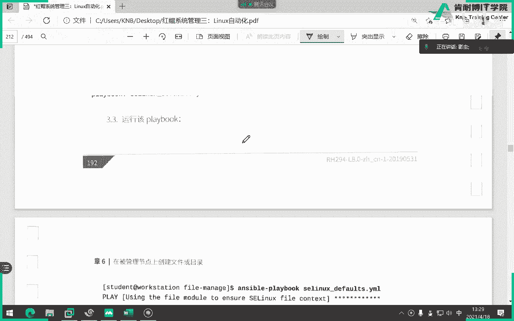

接下来我们来讲一下如何使用金加兔模板来去部署我们的play bo，那么今天图模板是啥呢啊，大家可以百度1下看一看，其实就是其实是类似于python当中的一个模板，毕竟python当中的一个模板啊。

那么利用这种模板可以构建出我们的，可以灵活的去构建管理我们的文件和构建我们的play bo好，那么如果你把书看了一遍，你可能不是能看得懂，所以我们呢给大家用总结的方式把添加图摸完讲出来就不用看书了。

好首先注意金加图模板怎么使用呢，看好有有有有这样几种写法，第一种写法，如果在今天to模模模板当中出现，这样子就是代表什么呢，注释，比如说我这边写一个a abc，那其实在真正运行的时候。

a b c会运行吗，不会他只是一个注释好吧，注释好，那么如果遇到这种情况下，今天从模板当中，如果遇到这种情况，两个花括号，两括号它代表什么呢，代表解释变量，解释变量也就说里面存放的是变量对吧。

里面存放的是变量，好漂亮，好，啊但是如果你发现是这样写的呢，在百分号的，而且是一个花括号，注意这里面只有一种，可能是两个，就是中间那个变量内容啊，那这代表什么呢，代表写判断句或是逻辑运算啊，运算啊。

比如说例如什么循环判断语句等，就写在这种情况下懂了吗，就金家兔就这三种写一个。

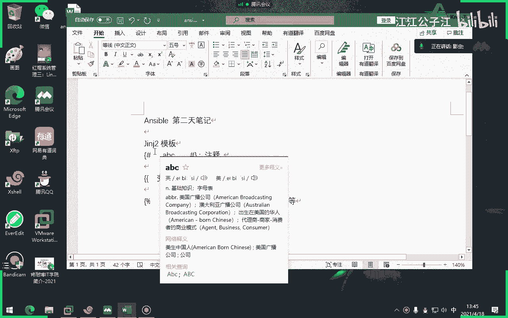

就起码咱们现在书上当中就讲了这三种方式，所以你看大家大家再看这一篇能懂了吗，今天涂抹模板当中，如果是这样子的话，里面是表达式或者是逻辑运算，如果是这个样子的话呢，是用是用于向用户输出最终的变量的值。

如果是这个样子的话，那就代表他是什么注释，听懂了吗，好那你现在你来看这一块能看懂吗，你能应该是能看懂的吧，对不对，第一行有用吗，没有注释，那么真正运行是不是下面的那几个bt电量，是不是好懂了吧。

ok那么这个时候我们暂停一下教材讲到这就结束了。

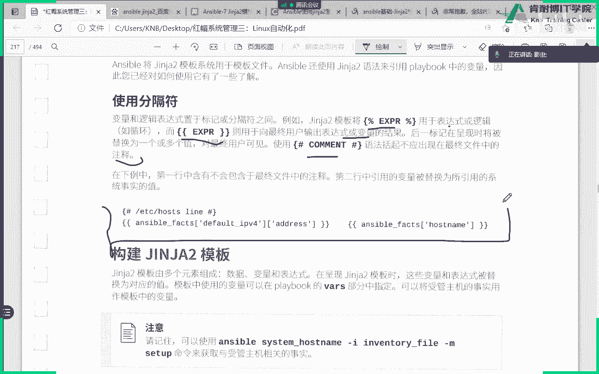

那么我们来跟大家说一下，比注释没什么要解释的，那么我们变量也没什么要解释，那么我们来说一下什么叫逻辑运算呢，咱们一般的运算有些for循环，但如果你遇到for循环怎么写呢，教材当中没讲。

那我给大家举个例子这么讲啊，呃我想想我能想起来吗，嗯我想想吧。

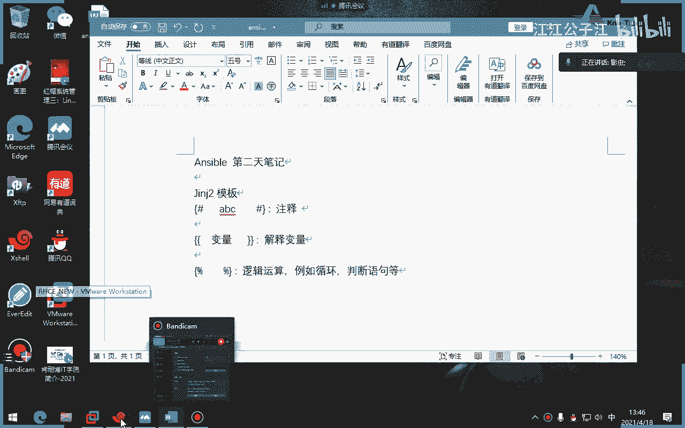

尽量想起来啊，各位尽量想起来。

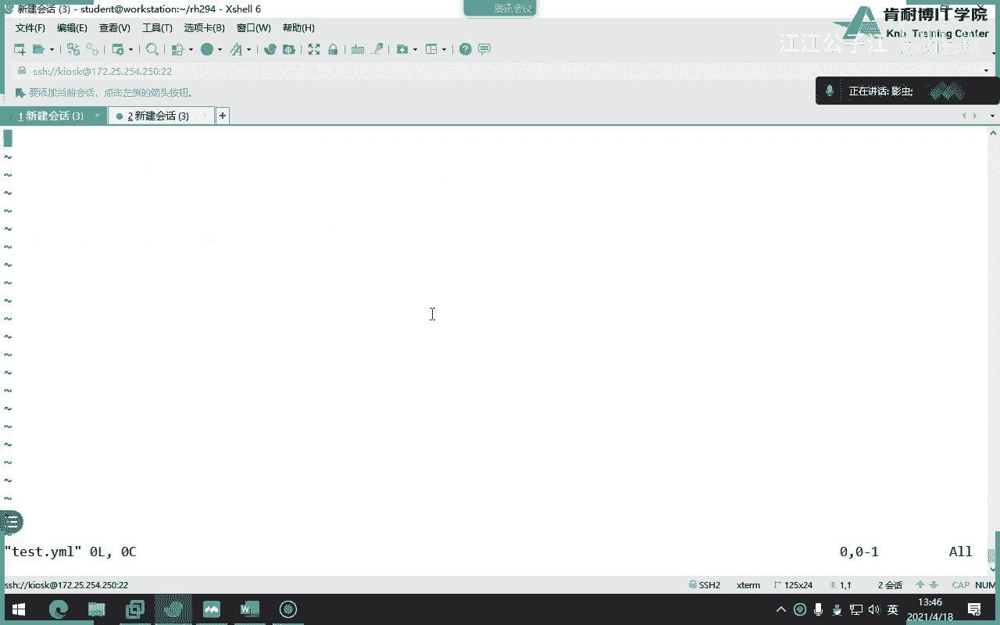

看不到是吧，我往中间点这样写，能看到，啊不对不对不对不对不对不对不对不对不对啊，我想干嘛来着，好我创建一个新加图模板，新加图模板一定要叫做什么什么什么什么点结尾的啊，比如说我们叫做fb点心to。

注意一定要叫这个结尾j to添加图模板一定要叫做点这to好，创建好打开，那我给大家写一个，比如说注释是哪个，怎么写注释，就这样吧，your test ball好吧，其实没有意义吧。

只是给我们看一个模板好，你看我怎么写啊，接着我这么做逻辑运算，用几个分，一个一个对吧，好好爱你，有一逗号，二逗号三，好哎呦错，然后这个对吧好，那中间打什么呢，打变量变量怎么打两个棒，变量名叫什么。

我在里面哎，很好好，然后那你就开始就结束啊，结束怎么办，注意结束一般都是and什么什么，比如你是if就是and if，如果你是for就and for，懂了吗，同学们好，这个教材没有讲，你就抄下来就行了。

好好做，啊对死了嘛，你看固定死的吗，好嗯那么有些同学说了，那我写完了我怎么用啊，对啊，我写完了for我我我我写完了这个模板我怎么用啊，你是不是要为主机用啊对吧，你是不是要发送到那些个主机当中啊。

比如sorry a s2 b啊，那怎么发送呢，来看一下。

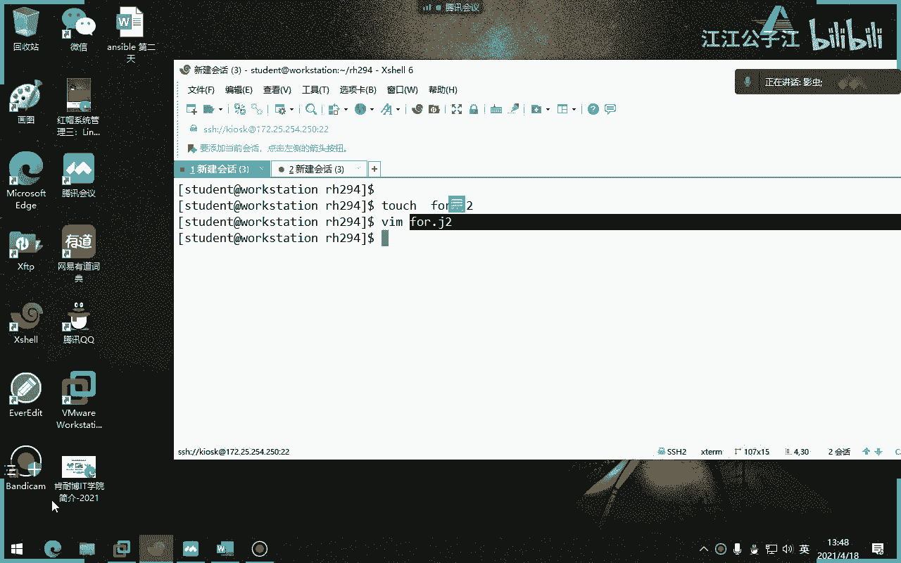

下面继续看教材，当我们构建好模板之后，怎么构建，就是刚刚巴拉巴拉巴拉写了一堆堆，你需要使用什么来构建呢，叫你需要什么来部署呢，注意用template模块来部署，这个翻译成中文叫啥。

这个单词翻译成中文模板吧，是不是样板模板懂了吗，因为我需要通过这个模块去把刚才写的东西发送给，或者拷贝给我想给的机器，那怎么给呢，非常简单，跟cp一样，圆和目标来举个例子，看这个看到了吗。

他就把这个添加度模板拷贝到哪，考不到，这，听懂了吗，同学们非常简单吧，好那我们来开始啊，开始嗯。

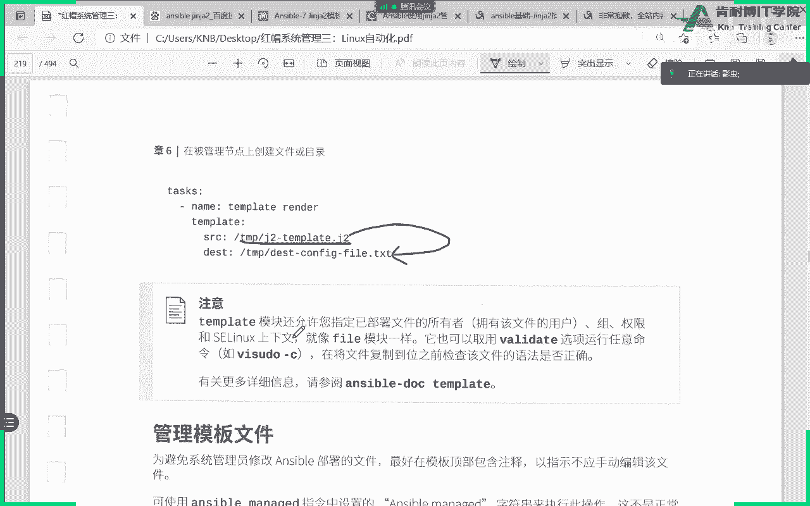

这时候我们在写test啊，好我这么做，第二三，测试啊好嗯，cost，比如给谁打比赛，哎不用pass了吧，直接tm给他吧，哦不不不行，不是还要pass，t e m p l a t是这么拼的吧，好言是谁。

各位言，刚才我的模板名字叫什么哦，是这个吧对吧，好目标的目标，比如说我目标，比如说我叫etc下面的，随便找个东西啊，随便随便写一个吧，比如咱们就叫做config，不要吧，就这么写吧。

他没有就会自动建立好吧，他没有就会自动建立好，按什么回复，走你，好成功，现在跑到svc里面，他就会在etc下面多一个什么，是吧，看一下里面有什么，看，嗯还不错对呀，非常正确啊，坏了吗。

这就是这个添加图模板啊，当然我们这么写没有意义，我只是给大家介绍一下怎么写a鬼剧呃，怎么写这个爆循环，那么a回去怎么写呢，来再写一个app，如果我还能记住的话啊，因为教材没写，我也是前自学的，抄别人的。

那你比如说我们再去改一下啊，加for对吧，咱们改一下怎么改呢，那么这边用if了对吧，if if一样，a回去是不是也是逻辑运算，所以也要写在这个美美这个百分号里面，不是美元百分号里面，a不比如说二大于一。

比如说二代当二肯定大于一了，对不对，然后给我打印出，hello，那你说四中会打印吗，那肯定打印太打印了，对不对好，那我看一下，我也觉得没写对，我也觉得没写对，我也觉得没写对，hello，不行哦。

它是变量嘛，不能写，hello，对吧，他是个变量，那我想想怎么办，我们想一下香，一会儿我把那个取消吧。

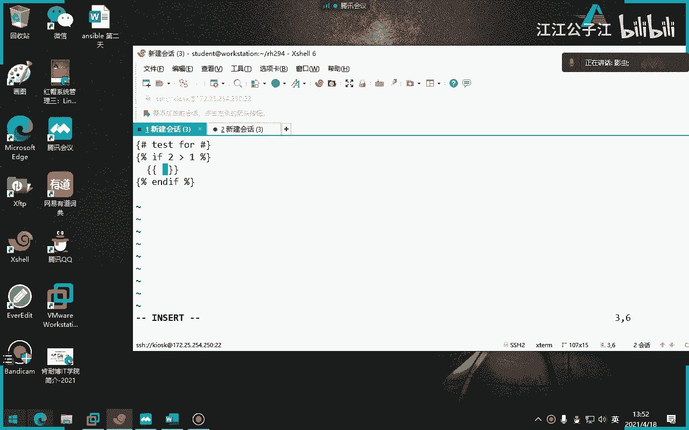

我看教材当中有没有显示东西的东西啊，显示东西的输出，一个值输出一个表达式和变量的结果，那怎么样变量我们知道那表达式。

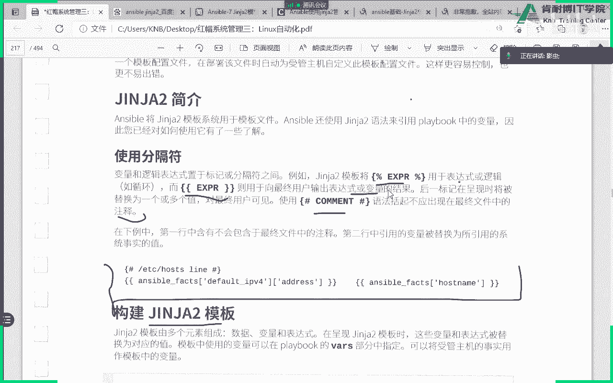

那输出那怎么写输出，刚刚写echo吗，简化注释不是生效嘛对吧，这样不应该吧啊啊不用直接写6123，是是是是是是啥也不行，他必须得是电量是吧，哎可以了，现在可以了，123445串吧，应该是啊行吧。

应该是可以好到了c然后我们是不是看一下a t c下面的咖啡格贝啊，懂了吧，懂了吧，当然有if，应该是不是还有else啊对吧，但是呢这个我就这个我就实在不会啊，忘了啊行吧，我就举个例子啊。

就给你们举个例子好，那么大家知道怎么写了吧，第一步干嘛，是不是先建立一个模板。

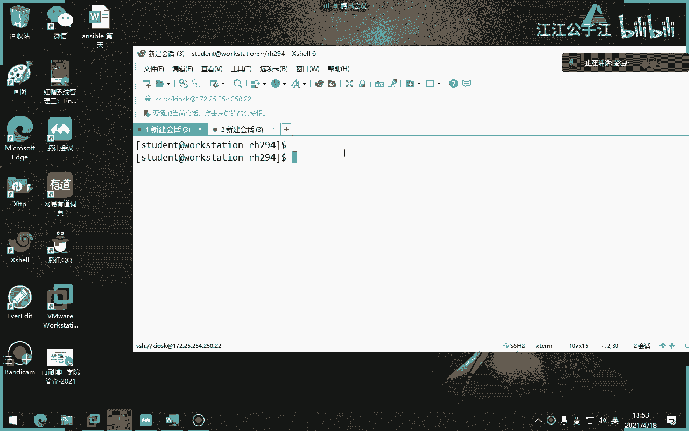

模板名字随便写，但是一定要是什么点解to结尾的，然后我们构建完模板之后，内容随便写啊，比如说循环，比如if，比如说else，写完之后是不是要用template模板啊，不是他们的这个工具。

把这个金加兔拷贝到或者复制到你要生成的这个位置，然后给某些机器，比如某几台机器或者100台一或者是一台机器去使用，那我们想象一下这句话是什么意思，教材当中这句话。

各位同学他是不是希望比如我现在有100台电脑，他是不是希望打出100台电脑的ip地址和100台电脑的名字呀，对不对，那我们想这个模板有什么意义，当然有意义了，因为这个金丹图模板它使用的是bat这种变量。

这种变量是随着机器不同变量值不同吧对吧，但是你想想如果没有新加速模板的话，没有这个模板的话，我们要想抠出来100台这个东西其实是很费劲的，但我有了这个模板直接写考试就考虑啊。

只是我老师我你讲的很复杂的吗，好嘞，这就使用性价组合版会了吗，好吧，那这样教材讲到这就结束了，所以这一章就没了，很简单，那么我希望你们能把我给你们写了个案例。

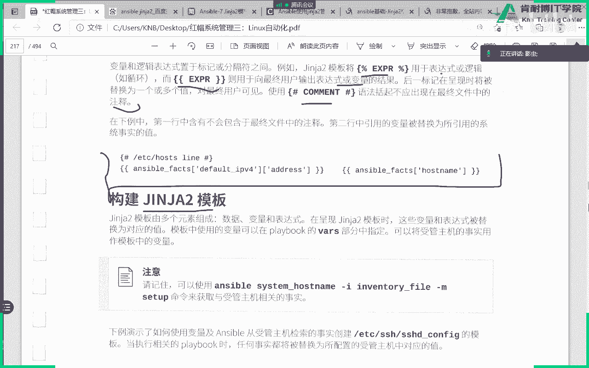

你们抄一下以后，未来如果有机会用，你可以知道怎么用，第一个这个我再复制一份啊，4y y我再写一份是for，我再写一个for啊，这边就应该是test if了对吧，但是这个注这个写错无所谓，因为他是注释好。

那么这边的话我们就应该叫什么呢，比如说我写一个宝，这我只是举例子啊，大家不要去要灵活点啊，那这边应该是吧，and好，我希望你把这两个记一下啊，未来我们在工作当中如果实在忘了可以啊。

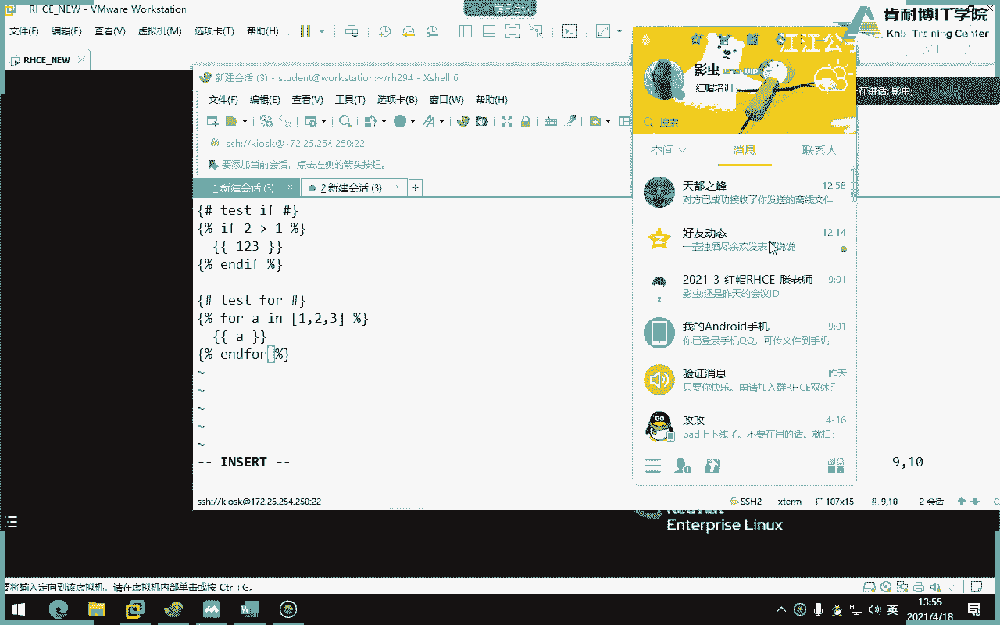

实在忘了可以，这个你说如果说我们刚刚那个投币。

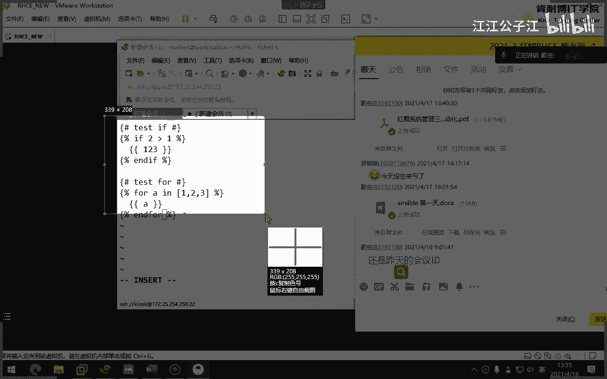

那肯定也可以，set up文件指的是直是啊，哪个什么值，就是说我们刚刚没有问题，文件的一个，ftc上那是拷贝文件，拷贝文件这个也行，你想用这个拷贝过去，不用说，拷贝过去被你考到目标主题上面，给你的目标。

比方就是已经是运行完毕量的结果，比如123对，然后我们再把这个文件再拷出来，在看的话，它会是它会是直还是我认为应该是金家兔模板的内容，我觉得模板内容对不对，它就没有运行嘛，你考过来它就没有运行嘛，对吧。

好，把这个记下来啊，你不用拒绝他讲，你你也没听懂他的意思啊，把这个记下来，接下来之后以后未来你们在参考的时候，你可以这么写好吧，来我们来说一下考试必考的东西。

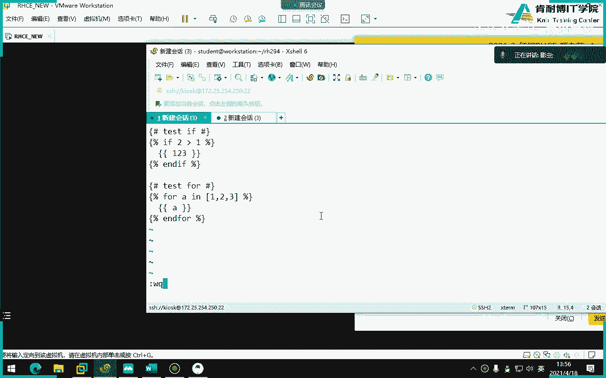

来，这不讲了不讲了，不讲不讲不讲不讲，考试考什么呢，哎这这这这这边有啊循环，我以为没有啊，那不用做了，这边有啊循环，哎这个循环能看懂不，这个有点难哦，各位好，有点难，好我给大家讲，这边，你仔细看。

同学们，咱们先来分析一下这些是什么意思，首先我问大家，这一串是什么意思啊，目标主机的ip v4 ，这串是不是目标主机的完全域名，这边是不是这边呢，玩水精灵好。

那你能感觉到其实他是不是就让我们修改目标主机的三个师，一个是rp地址，一个是f q d n，一个是我们的主题名，对吧好，那么这个时候呢，由于咱们有100台机器，比如说它就得用for循环来做。

所以因此呢它有一个for这个host，大家猜一下什么意思，应该是变量吧对吧，那么for in都懂吧，好很多同学这个地方不懂group，这就是我们昨天讲的魔法变量当中的group。

昨天讲过魔法变量当中group什么意思啊，是不是站在这个地方可以查看所有人的一组里面的所有变量，就我当前可以查看组里面的所有变量，而那个or是什么意思呢。

注意这里面的or是指的你在写那个play box的时候，是不是有一个host啊，冒号那个是or这边叫对应的二，懂了吗，好那么什么叫做host vs呢，是指从当前的位置抓出来别人主机的变量，哪些变量呢。

有ipv 4的地址的变量，有f q dn的变量，有host name的变量，你看了吗，都是用那个看了吗，三个看三个吧，看到了吗，说白了就是我用for循环依次去找其他人的阿贝地址，主机名和f q d。

而且用什么方式用抱的方式看and的抱吗，不是循环吗，现在能看懂了吧，再说一遍这个厚实的袜子，但是不能拼错，这个单词指的是我查询别人机器当中所有的这个这个这个好，那你说这是s，这不得给他后词加s。

变量对呀，变量变量名吗，你能不能把它改成a b c，如果这边改正了就改了，对不对啊，懂了吧，这个你你你你去背一下，那么为什么背，因为你考试的必考必考的啊，但是你理你理解一下什么叫host bus。

指的是从当前的位置找到别人的变量，或者说抠出来别人的变量，那有人说，那为什么要用group呢，因为这是一个组啊，因为考试的时候可能是给你一个组名，给你一个组名，那这边就是我们讲的if语句。

你看直接写结果，直接写结果好，那么新加速模板，请大家把这题做一下，做一下这题就行了，这这这这题很简单，这章就结束了，这题比你刚才第一题要简单多了，今年图模板来说下吧，这单结束了，第八章管理大啊。

第七章管理大项目啊，刷了一堆啊，那咱们哎这张有个重点来了，动态清单，不知道你们能听懂吗，待会儿啊好，那么这张呢前半部分是写，前半部分讲了一堆的，如何引用清单，这个我们不用讲，因为已经会了对吧，怎么写啊。

是不是建立一个文件，但我们文件习惯性的叫英文水，但其实不一定是这个名字吧，叫a b c也行对吧，但是呢请注意咱们现在文件当中是不是可以用这个来当个分组啊对吧，而且在秋生呢是代表什么嵌套好词组，对吧好。

那么我在用的时候请注意了，咱们在写host的时候，不要针对一个清单里面的文件进行写啊，比如说我这句话指的是我针对这个playbook，是针对2。1这台机器做运行的吧，对吧好，那么还有一种写法呢。

是这样子，大家看我可以这么搞，用通配符来匹配多个，比如说二就是一个典型的，所以它就等同于新号，懂了就是你咱们不是一般习惯用all吗，但你可以用星号对吧，下次你想写二的时候不要写了，清好啊。

但注意加双单引号，单引号星号，ok那么像这个这个就太简单了，不说了，那像这个是什么意思，各位这么写，所有的一点儿example结尾了吧，前面无所谓，前面叫123组成无所谓。

但最后结尾一定是点examining com，那这是什么意思，同学们，一般叹号都是什么意思啊，取反就是排除这句话，意思就是只要是test的一，我反而不匹配，那不匹配，那么中间加逗号代表什么呢。

代表如果有多台主机的时候，你可以加逗号来隔开，很简单吗，你自己知道你可以自学了啊对吧，好像这个呢就是后面结尾是无所谓的，前面是192。168。22对吧好，这都不讲了啊，那像这个呢更更更简单了对吧。

更简单了，那么这个也就不说了，主要是这个data对吧，后面是无所谓对吧，无所谓，这个好像没什么要讲的，这张就没了，那这个呢就三个，一个是这个一个这个和一个这个中间有逗号隔开啊，都能隔开好啊。

也可以使用什么冒号来取代逗号，不过冒号是首选分隔符，那人家都说首选了，咱们就别对吧，咱们就别用冒号了啊对吧，为啥你知道吗，他说如果是特别是二倍v6 的时候，rp v6 是不是很多主机名是冒号。

你要是它它它混了，对不对，不知道这个冒号是分隔符还是冒号是i p v6 地址就混了，所以最好的办法不要用冒号，ok继续，那么这个咱们得稍微聊一下，这个是指这个组啊，是组你像这个什么意思啊，就lab组啊。

不是不是说错，是指以下主机将匹配lab组中，同时也属于带着三个一的主，比如说某个主机又属于这个lab组，又属于data 3的一个组，同时这个and的这个符号可以随便写，写在lab前面，也可以写在带的3。

1斜面，所以说你看这两种都行，这两种写法都可以行了，就往往那边放往那边放都行啊，都可以，就前后都可以啊，前后都可以，那么像这个呢就是属于这个组，但不属于这个阻击，对吧啊，这个主机排除啊，没了吧。

没有实验不做了，这实验超级烦，你要把这一堆给我打上去啊，然后就不做了，好吧啊，超级烦，超级恶心，信号代表所有，下次咱们直接来个信号好吧，就不要再想all了，好这一章的前半部分就讲完了，非常简单好重点。

动态形态，讲完动态形态，咱们就下个休息，动态情感，你看他说咱们目前为止使用的都是简单的静态清单，那么它相对于小型的这种架构是特别方便的，不过如果要操作很多台计算机，或者在计算机中更替非常快的环境当中。

那么静态清单就不好用了，这句话什么意思，举个例子，我们现在管理100台电脑，其中有一个家伙他比较讨厌他三天两头的换牙配地址，那你只要换是不是我进的清单，是不是就要跟着跟着换对吧，你你比如说就像你你家。

你换一个手机号，你待会又换一个，我就赶快更新啊，不然我用你老了手机号找不到你了，对不对，所以说这个就比较烦，那么就不适合用静态的，那就是个动态啊。

你看他说大大多数的大型的rt环境中设有系统来跟踪可用的主机，以及他们的组织方式，大家知道这是什么东西吗，咱们同学肯定用过a地狱，尤其咱们公司比较大的对吧，如果咱们在一个比较大的公司，肯定你是a地狱啊。

你比如说你们公司就俩人就别用a d了是吧，还不够还不够麻烦呢是吧，哎a地狱这种a地狱呢，它就是用来监控或者说来跟踪我们的可用主机啊，包括我们的卫星服务器，大家知道卫星服务器吗。

卫星服务器是当年rt c a当中的一门考试，但是现在呢渐渐的很多人就不太学这个，这个首先讲没有人在公司里面用你红帽的卫星服务器很少啊，所以这门课呢慢慢就被淘汰了，服务器呃，呃怎么说呢，反正我觉得挺逗的。

所以很多人就不学了啊，咱们课程也就取消了，还有什么呢，就是e c two啊，呃有点像咱们的阿里云那个e c s虚虚拟主机的意思啊，虚拟主机或者是open stack，知道吗，听过吗，你不做鱼。

你也得听过open stack吧，没有人听过，没有人听过，那算了，不说了啊，云对吧好，你看像这种云啊，虚拟机了，这个卫星服务器啊，或者我们ad活动目录啊。

像这种都是一些大型的环境才会有对你比如说20个人之内，你别你就别用a d了，对不对，好像这一类的主机他都可能会动态的改变，你不适合用静态清单，那怎么办，没关系啊，同志们，静态脚本呃，动态脚本好。

那看这些脚本在当安保执行时，从这些类型的来源检索当前的信息，使清单能够得到更新，加一个别说举个例子，我有一个脚本里面是抓你的ip地址，我甭管你地址怎么变，这个脚本是不是可以抓，抓完之后给我不就行了吗。

对吧啊，是不是有点类似于事实变量，就我只要写好那个变量，你的名字怎么变，我最后都可以抓住你的主机名吧，这叫动态清单，但动态清单呢在我们这一次上课不作为重点，我可以告诉大家，这一章我们老版本考题你们不考。

就我当年考2。4版本，2。3版本，2。3版本的时候，这一章是二啊，不是考试考一题的，但你们21。8版本的同学不考动态形态，他又不考，他也不教你怎么写python，因为毕竟这不是python课嘛对吧。

你说老师来讲，他也没必要讲，我也不会，那干脆咱们就不学，但只要知道怎么用，但是要会用啊，虽然不好，但是他会用，我们看一下，那么由谁来贡献这个脚本呢，有很多，比如说红帽可以贡献啊，为什么。

因为红帽现在不是把那个enzo买了嘛，对吧啊，还有一些比如说呃一些什么cloud啦，包括一些openshift container的plan plan for啊，这个这个卫星服务器啊等等这些这些机构吧。

哎都是贡献我们这个安伯的这个这个脚本都可以贡献出去啊，这个知道吧，可是吧对吧，比如说老师我特别牛，我能写可以啊，你写出你就放放到互联网当中诶，你写的不错的话，别人可以用啊对吧。

就这些脚本是别人贡献出来的啊，好吧，但是这个脚本我们不学啊，主主要是用python写看了吗，所以你要求大家要会学python，那么python我还是非常建议你们去学的，因为未来拟主要是做运维。

python是像以前都是可会可不会，现在应该是要求避讳好吧，但是你要是做那种基础运维就算了，你可能基础运用连shell你都不用写，但是你为了往上走吗，咱们肯定这个不能永远只拿6000块钱。

7000块钱吧对吧，你可能想上万的话，那么你的脚本和python是要会不会啊，那么这个怎么会网上一堆资料根本不用报班，python根本没有必要花一分钱学，随便找资料太多。

因为python很很很很火嘛对吧，所以随便找资料啊，好但这不是我们的要求啊，好吧不是咱们毕竟不是学开发的，那么我要求什么呢，我给你一个python的动态清单，你得会执行并且看懂才行，我不要你写。

但你会用好吧，那怎么用呢，需要使用这个enable横线in v纯命令是学习如何以这是什么意思啊，json格式来编写这个安保清单的，有用工具说白了就是我给你一个清单吧，来各位我给大家一个清单。

我给大家一个清单，而且这个清单是是一个写好的静态清单，你能够用这个命令给我变成json格式的清单，来看一下怎么搞，这个都会吧，是我写好的吧，但是我用正常比例看，怎么玩来着，忘了诶不对。

我怎么怎么怎么玩的，忘了啊，刚刚list对，我以json格式给我显示出来，看能看懂吗，阶层格式都是这种花括号的形式来能看懂吗，比如说我给你这个你能看懂吗，首先告诉我有几个组，哪四个哪来四个组合。

其实是不是只有一个组，就是我们的web angroup是组吗，不是，但但你不能说它不是组对吧，它是一个特殊组，二是组吗，不是但他也是特殊组，而且这个家伙是一个单独的版，看懂了吗，就是我给你这个东西。

你没有必要写，但我给你你会看，这是我们要求的，这是我们红包课程当中要求大家虽然不考试，但你得会好好继续继续，那么这就是一个典型的一个静态清单，他用这个东西来转换成json格式，转换成阶层的人。

比如说这边有一个叫大家贝斯的一个里面有两台机器d b1 b2 对吧，哦那这个呢里面有一个词组吧，是不是，那可以理解为什么，各位是不是可以理解为这个词组里面包含了database。

ungroup和web service这三个组的成员要成员吧，对吧好，所以你能看懂就行了，那么如果大家非得要自己去编写的话，请参考uncle的开发指导，对了说一件事。

如果我现在自己在家学习或者在工作当中学习，突然间遇到一个咱们教材当中，我也没讲，书上也没有的东西怎么办，请看官网，官网有两种，第一种是这个英文版的，第二种是中文版，看有没有中文版，在这中文版。

但是没有必要看看，所以其实你如果把这个搞定了，根本就不用来上什么294的课，肯定要比294讲的要深啊，看到比如循环搞起来，同志们自己去看明白吗，备课想找资料就百度就行了，这就是他的官方文档，懂了吧。

官方文档你看网上什么资料一堆啊，你只要有不会的，直接百度啊，人家写的很好，懂了吗，哎好继续啊，这就是我们的这个，那么如果你非得要编写的话，第一开头要用它来开头，为什么你们都学过视像脚本吧。

12脚本是不是井号叹号，咱们写的是b下面的代对吧，那这句话意思就是下面所有的语言都是通过python来解释的，还是一样叫解释器好了，比如说我们编写好的脚本了。

或者人家给你一个python脚本的一个动态清单，你怎么用呢，需要用斜线点斜线啥意思啊，立刻执行，然后杠杆类似来指出来，这个很简单吧，啥意思，就是我有俩组，一个叫web service。

一个叫带着basis，每个组当中有两个主机看得懂吗，对吧，你这个你看不懂吗，对不对，这肯定能看得懂，所以说考试的时候啊，就我们当年考试啊，就你们现在不考，就是考试的时候呢，就给你两个清单，但是他很恶心。

他故意让你执行不了，然后你才发现原来上面没有x权限，你执行了半天发现没有x，然后你给它加上一个x，它就可以执行了，执行完之后看到了就写出来就行了，这是我们当时考题，其实这题很简单。

我看那是你们现在不考了啊，你们不考好吧，那么难重点在这儿，那边是比较难，前面都比较简单，前面真的是比较简单，这边是比较慢，ansible支持在同一运行中使用多个停板。

这句话想表达的意思是指我们的anth胞，一个清单里面可以包含动态和静态，就我给你个清单，这个清单里面的值可以是动态和静态合并在一块，你看那么怎么去使用呢，你如果直接单看这个东西不是特别好理解。

我想想怎么跟你们讲，先把这边读一下啊，我们先把这个读一下，清单文件不依赖于其他清单文件或者脚本来解析，例如如果清如果静态的清单指定某一个组，应当是另一个组的主题，这句话能听懂对吧，各位这句话能听懂吧。

就如果一个静态清单指定某一个组是另一个组的词组，这能听懂吗，清楚吗，对不对，则他也需要具有该组的占位符，这是啥意思呢，是这样的，各位比如说我有一个静态清单文件，有一个静态清单文件。

这个清单文件里面有一个什么呢，有一个这套像下面这句话来看，我们大家支持静态来看动态的这一串静态的吧，好请注意，同学们，突然间我又新建了一个词组，叫做cloud east，这是一个词组吧，嵌套吧。

但是请注意这个cloud east，它里面的值是动态产生的，我再说一遍啊，service是静态的吧，里面一个里面的具体主机是不是叫test，我现在又有一个动态的词组叫做cloud east。

这个组里面的值不是一个静态，而是动态产生的，那我请问大家，在比如说清单文件，那么在这个清单文件还没有运行的时候，你的cloud a里面的值存在吗，存在吧，那这个时候就会有问题了，他就找不到了。

你要给我写一个空值，你看里边是空的，但是你这个占位符要给我写上去，告诉系统，我这边给你先占一个位，然后运行完之后的结果自动填充，哎懂了吗，就这个意思啊，就这样这么说吧，比如说咱们班上有十个人同学报名。

但有一个家伙呢，他说可能来可能不来中国得先把这个位置给他占着，他万一来了呢，它就有地方做，懂了吧，所以说你看这个cloud is的典型的是谁的词组，在这一题当中是service词组。

而service本身是一个静态的吧，没有关系，但是cloud east是个动态的，那么他还没有运行的脚本的时候，a里面只是空的，但是你得写上，你给我写上去，但是里边空就行了，但你要名字给我写上。

占位不懂直接来做题，来，我带着大家把题做啊，你们不用做，我带着把题做一下，这题就是我们考我当年考试的原题，就是一模一样的题啊，我来做一下，你们不用做，lab，这题必须打lab啊，你们看到下载东西了。

project bmi star，你来看他干嘛了，是当前目录开始当前目录哪个目录肯定是project对吧，好看里面有什么东西，是不是有个英文水文件啊。

不是说cfg文件文件里面指向了一个叫做ementary的清单，对不对，好，接着我们来做下面的一道题目，第一题第一题要创建一个目录，为什么创建目录，因为你指向，但是里面目录是空的吧对吧，所以要创建一下好。

我们创建一下啊，进去看到了吗，进去进去之后开始下载文件，从考官这边下载三个文件，分别是a w和后四次三个文件，我下了啊，各位仔细看下，到哪下到哪下，到哪下，到我刚才建立的英文水目录里面。

为啥他不让你建立一个目录吗，那很显然这个三个清单文件要下到这个目录里面，懂了吧，好现在我已经在这里边了吧，下载，稍等啊，这个比较长，大家知道materry是谁吗，其实就是我们class知道吧。

lex稍等啊，然后将a e n t o y a对吧，py是一般是什么意思，py很好懂，你200就代表成功，第二是不是还有下一个w对吧，成功是不是还要下载一个啥，好来看，很显然后面两个是动态的吧是吧。

同学们好，你看动态动态的话有w吗，没有吧，所以你选择什么啊，有什么哎，对吧啊，可以了吧，是不是两个就变成绿色了，绿色绿色是不是才能代表执行，绿色代表执行好，在执行之前我们先看一下后侧。

这很显然是一个什么静态的来看，能看懂，不是不是service组对吧好，那接着我们开始做什么了，是不是开始运行这两个动态的了，好仔细看啊，仔细看，错了不好意思，稍等重来重来，再来还有一个什么。

我现在有一个需求，同学们，你给我完完整整的写出这个清单来，我们就要分析一下他怎么写，首先但是先从python a开始看起，python a里面python a里面有什么，有个组叫web service。

它的主机是谁造，a，那么w呢是个二组吧，二组里面有一个主题叫做work station吧，好那么这边又出现一个host，一个静态清单文件，静态清单文件里面又有一个web service。

那你能说一下它们三者的关系吗，这么问，请问大家，wework station这个机器独立的吧是吧，ok那我先写出来，同学们，我们可以先写出来啊，在写之前我教大家用这个命令啊。

明天熟悉吧好我们看看怎么怎么玩啊，怎么玩看，来着杠i，对吧，肯定要执行，但是这个引文是个目录啊，所以你要这是个目录吧，这是个目录，5s吗，现在不播，我怎么抓不出来，好听不出来啊。

我已经在我已经在这儿了对吧，到上级目录，嗯，看看看这个就能看懂了吧对吧，再来，应该是什么用户来着，应该是什么组，这边是不是还应该有一个，那边应该是谁，a是吧，稍微a把一把，这个啥来着，我忘了。

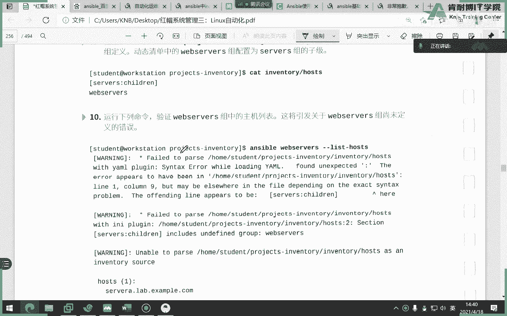

service是吧。

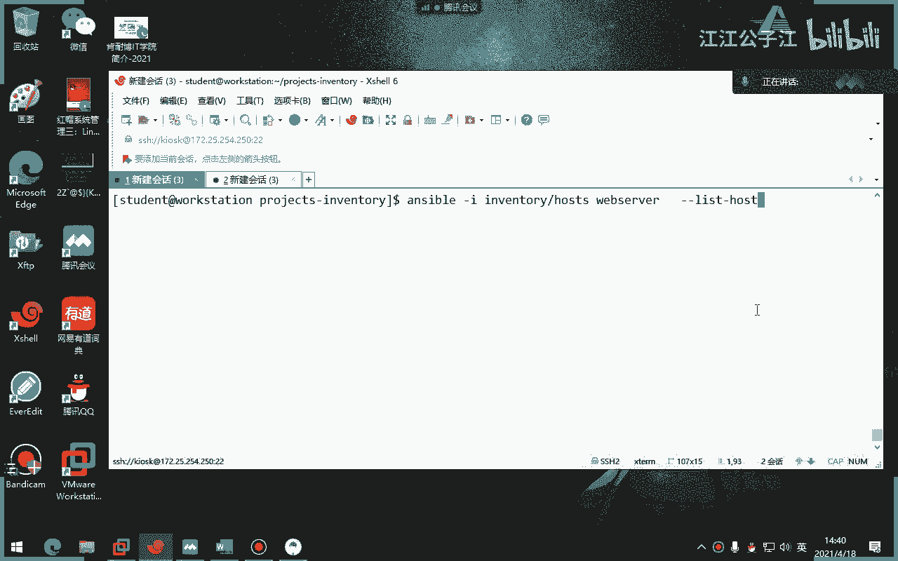

对呀，我知道，但是他应该给我点东西啊，不能一点东西都没有，一点东西都没有啊，在这儿了，看有东西啊，好其实这个结果呢对，但是我不想要这一堆报错，大家现在为什么会有这一堆报错吗，就是缺少商人服务。

就缺少占位符，你来分析一下就可以了，先分析一下就知道了，他是不是缺少这上面服务是独立的对吧，那么web service很显然是个动态形态产生的主机叫service a，那所以说我们在看host的时候。

你缺少一个占位符，那么这边应该怎么写呢，跑到host里面，就是站位加谁呢，关键是，标一下就行了，那么大，这个时候我们再来看，就不会爆肝了，一堆紫色的错误了，他缺少一个占位符。

这一题就是我们当时考试的题目，当一个静态清单里面引用了动态清单的时候，我一定要为那个动态清单先先写好一个占位符，里面内容无所谓，因为它随机产生的，对不对，再说一遍，当一个静态的里面有动态的。

而不是动态里面有静态啊，各位听清楚啊，当一个静态的文件里面host是静态吧，这个这个host是静态的吧，这个静态里面包含一个动态的时候，而且动态用他的词组的时候，一定先把那个动态的占位符给我写好。

这不就是那个祖名吗，当年的考题你们不考，可能他觉得太简单了，你休息会并行用分叉在c罗当中配置并行处理，有个单词叫做fox，如果你不做的话，默认就是五，他们可以进行把它放大，或者把它缩小。

这个fox什么意思呢，来我们读一下这边的英a中文，比如说我们ancier当中把它变成了五，fox变成五单了，也就是默认值是五，那么我们要对十台机器做playbook，做时代机器做play book。

uncible将在前五个受管主机上执行play中的第一个任务，然后在其他五个授官主机上对第一个任务执行第二轮，行了吧，别扭啊，好在所有受欢主机上执行第一个任务后后再做第二个任务，第二个任务怎么运行。

还是按照刚才五个五个运行，明白了吧，那在哪配呢，这个fox，在哪配呢，各位当然在我们的配置文件里面配了，看了吗，在配置文件里面配，配置文件里面配，当你默认是五吧，默认就是五啊，默认就是五，哎。

大家想象没有，如果越多会怎么样，因为值拉力越大，是不是它这个速度要快，也需要对运行时间嘛，对不对，明白吗，那么还有一个值，这两个会容易混淆啊，这个值叫滚动更新，咱们举个例子。

你比如说我现在要更新一个数据库，一版本到二版本啊，一个软件要从一版本到二版本，如果你不加这个不加这个不加这个关键字的时候呢，我现在比如100台电脑，这100台电脑会同时去更新这件事，你有想过没有。

如果中间这个这个软件有bug啊，是不是100台机器全死掉了，外服务是不是中断了，那怎么办呢，我可以用这个单词，比如说这边写个50，意思就是我有100台电脑对吧，我先更新这50台后50台我不动。

如果说有bug，是不是后面50台还可以对外提供服务啊，这个那你来综合一下这个s跟那个fox这个这个他们能你能区分开来吗，能区分开来吗，啊这有点特别像这个两个洞啊，而fox是在哪文件里面写。

他俩能区分开来吗，你们就不下来，你就就不行啊，一定要区分开来啊，没关系吧，他们俩没有关系啊，各位没有关系，一一个是指整个任务需要在几台机器上运行，一个是每每每一个任务在几台机器上运行。

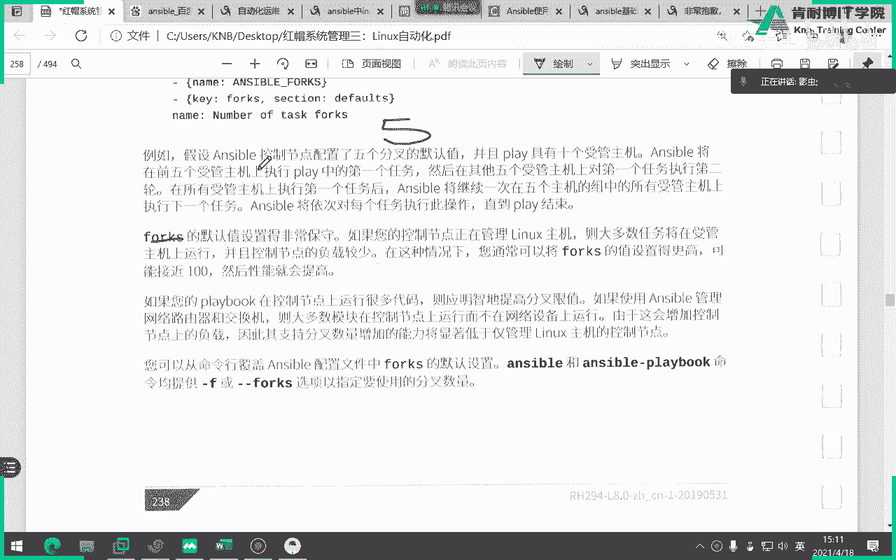

你区分开来啊，各位来画个图。

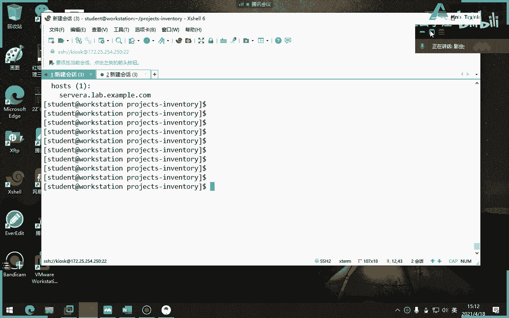

这边有个workstation，我写了一个book，这个playbook呢我写一个book，比如说有这样两件事，第一件事呢比如说user模块啊，ua模块，第二件事呢比如说这个这个第二件事。

比如说这个亚模块吧，装软件好吧，装软件这个事两件事，那么你比如说我现在呢有我写的f中的f可能值，我写的是总共有四台机器，总共有四台机器啊，我想我f值是二，五吧，我不是二，那这是啥意思啊。

第一个任务先在前面两台运行，在后面两台运行好，第二个任务现在两个运行，然后再在后面两个运行，听懂了吧，这是fork，那s是什么意思啊，s是怎么进来的，s比如我写的也是二，那这个s2 是什么意思啊。

是指这一个服务是在现在他们俩运行，然后再在后面他们俩运行能听懂吗，不是吧，没完了，你运行了，你找你运行了，是只运行两个啊，不是只运行两个，是运行完先给这两台运行，因为s是吧啊，先给前面两个运行。

然后运行完之后再给后面两个运行，只运行两个，男的只运行两个，对哎对对对，但是有一点，如果失败了，那后面就不会再运行，我们算是成功了，就分批，说白了s是为了分批。

而这个fault呢是指每个任务要在这个具体的机器上分批来执行，分列表一个人不算，可以这么理解，对s是针对整个playbook在两个机器上去运行，而这个这使每个任务分别在两个g上去运行完，咱们再说一遍啊。

咱们不说s咱们就直接说fs很简单，好理解，f是什么任务，在前面两个机器上运行，因为你f f是二嘛，先运行完，运行完了再来第二个运行，直到这两个机器听完，然后再运行什么，下面这个第二个样本吧，这样吧。

别别别别别聊了，直接做题吧，做题大家做把这一题做，你做题的时候就知道感觉做做的时候你就知道啥意思了，而且你能明显看出什么结果呢，不慢了，数字越小，你的速度越慢呀，各位，四个四个一块并行。

我写一个一抬一抬一抬，哪个慢，这个嘛，数字越大，它并行吗，就是我问你，你你是一个cpu快还是四个cpu快对吧，一个任务在四个同时运行，相当于并行吧，那一个呢那第一个play运行完之后。

所有运行完之后才在第二代机器在运行所有blab，那第三台机器呢得等着第二台机器运行吗，我才运行，我第三个吧，但如果三呢，比如写x等于三呢，三台机器同时运行play bo，对对对对，s如果是三。

就代表三台同属性，对对对对对对对对，对对对，同志们做的时候你们自己仔细观察他的时间，你自己做讲是讲不讲不讲不通的，做你做我也做，你做你的，我做我你们做一下就知道了啊，光听可能有点晕啊。

来同志们一块坐一下，多少也是我这边啊，我这边第七第七章，大概我这边241，你是pdf吧，那你直接写261，261，嗯不考，你不考虑考那个没意义啊，大家知道他为什么要有这个fox和这个s。

这个s是怎么念这个这个单词是为什么呢，由于咱们机器太多了嘛，数量太庞大了啊，只有四台，那感觉不到，但如果你有400台呢，是不是就可以看得出他的这个有效果了对吧，所以你做一下做一下，当我改原来是四。

原来是五，很快当我改成一的时候，你看明显的，他说时间比以前长了，为啥知道了吗，你先做看出效果来，就用实践来证明你的理论，新版本，今天新版本的c当中，一门到两门，比这一章比这一本书要难。

这个我是可以负责任告诉大家，要正难联系，我也觉得有点贵，我以为他3万了，现在35000多，越来越黑了，怎么35000多这么贵。

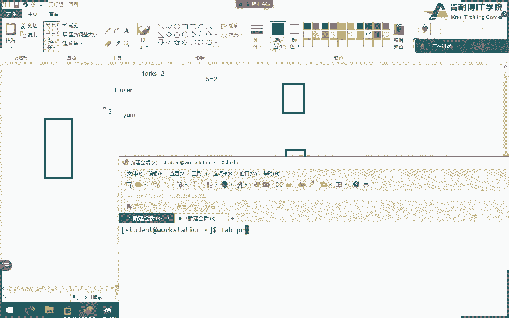

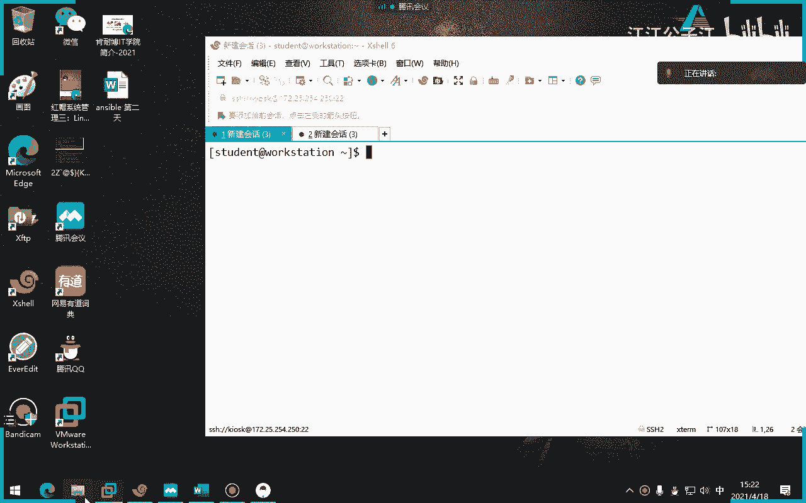

啊，学了两天的安琪罗，大家会发现就是让我们做自动化pay不那只是lip当中的模块对吧，所以你在记的时候呢，你只要记语法格式，具体play book的模块不要气，因为你要通过教他们去看啊。

他们也记不住了对吧，你只要记语法格式，嗯嗯，做内容，感觉一个好的，我说一开始对，这就是为什么，因为你要做完一台再做第二天嘛，你要是这就是这就是我们为什么要学的第一原因，因为咱们现在只有四台感应不到。

但如果我们要几十台上百台，你是不是被动明显速度了，它主要考你的，就是说白了想告诉你就是是不是支持并发，并不是代表把数字调的越大越好，因为如果调的越大的话，虽然速度都有了。

但是呢是不是对于我们的playbook本身的work station的机器，它的压力大了，因为你所有计算都在这边发生计算嘛对吧，大家要注意，而且大家知道吗，我刚才我们昨天讲过。

i c p是不是可以管理网络设备，比如交换机，路由器，防火墙，这个是这个两种这个管理网络设备跟管理我们服务器是不一样的概念。

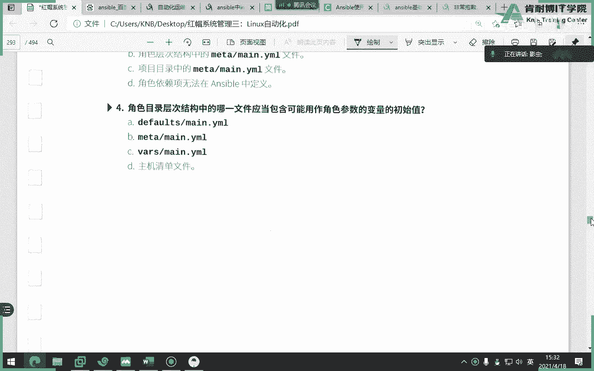

你比如说我们现在管理是服务器端，我work station当中写了一堆的playbook，我是不是发送到server sb当中去运行，那么实时运行的时候，workstation本身有没有cpu的消耗。

没有啊，消耗是在sl sl b身上，因为你是在目标主机当中去安装什么软件啦，删除软件了，建立用户了对吧，但如果你是网络设备，注意这个路由器本身是没有办法做计算的。

所以你最终的压力发生在workstation身上，这是不一样的，所以如果你把这个数字调得特别大的话，对你的workstation就是你的控制控制节点，你的这个cpu内存，这个是不是压力很大，明白了吧。

这是不一样，并不是说我ok往往后拉吧，把这个时间这个扩这个把这个box弄得大一些，不是这样子，你得看你最后的一个是管理网络的还是管理我们的服务器是有区别的，您仔细读教材，教材当中写过这句话好。

那这其实呢呃因为咱们那个太少了嘛，四排感觉不到，所以无所谓跳不跳啊，所以这一张我好像好吧，忘了我去看一下啊，忘。

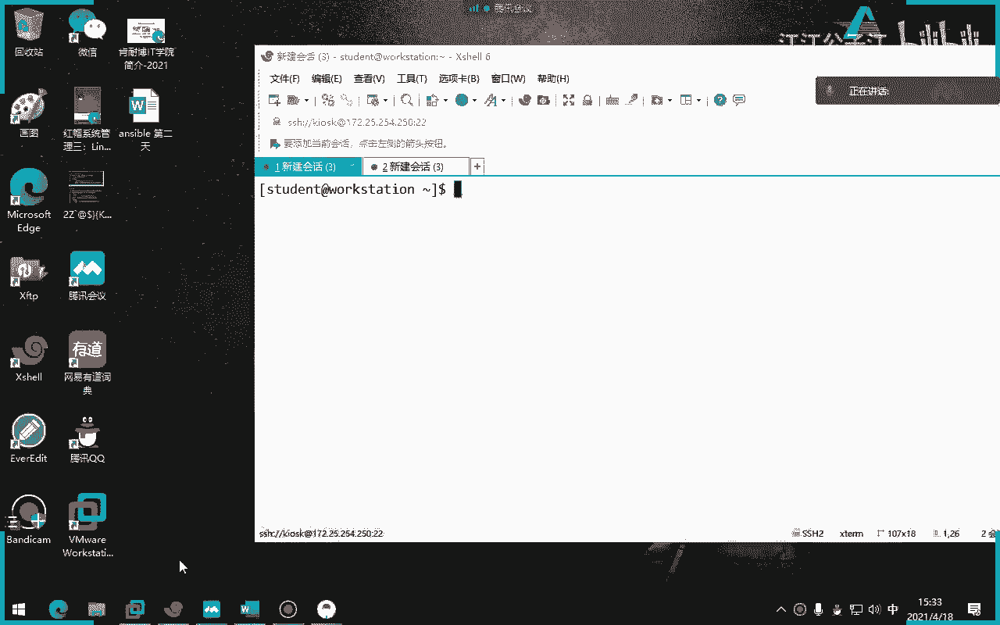

那就大家在下周上九五章第八章的时候，第八章就是我们的叫什么角色，那一张，大家一定要把角色这章从头到尾读一遍，读不懂都没关系吧，角色一定要读一遍，每一个同学啊，每一个同学都要预习一遍，第九第第八章啊。

没关系啊，但你一定要看，因为如果你不看，你到时候上课听不懂内容太多了，角色的题目光考试就三题，而且是三大题，三大题，所以说一定要好好的预习一下第八章啊，没有必要看第九章，一个字都不用看。

这张呢呃全是送分题，因为第十当诠释一些呃，很很很简单，一个一个小模块，比如说装软件的压模块，那咱们已经学会了对吧，起服务的service模块啊，开王永强的那个发过的第五模块啊。

装软件包的那个建立用户的u的模块，咱们是不是已经讲过了啊，它相当于复习一遍，第十章也比较简单，就是咱们最后课程内最难的地方就是那个角色一定要通读一遍那一章，因为你看不懂没关系，但是要读一遍好能看懂啊。

然后做一下气体最好不是不然的话咱们都是讲角色，我就怕你们嗯可能会反应比较慢，因为那个嗯正南那一张正版啊，那难哪呢，结构特别深，这个这个目录特别多啊，特别多嗯，我们一点内容我们把它说说不完啊，就是提一句。

咱们就今天就不讲了，这个，put诶，在哪儿，他在这儿，input playbook，这是s导入对吧，是不是啊，那么说白了我可以你有没有想过，我们如果搭建一个特别超大型的play book。

我们都写在一个文档当中，可能有上百行上千行，是不是不不太不太好读，中文可拆分开来，就像咱们以前做开发做项目一样，是不是都是一些模块化的，然后大家最后再组合一个大的项目啊，百万行的代码不可能一个人写吧。

哎你你写你写点，我写点哎，大家拼拼凑，那所以说我们也是啊，如果你写一个特别大play bo，我可以写成很多小play book，然后只要用什么导进去就可以了，懂了吗。

这就是适合那种写大型play book的时候做这种这种导入引用引用导入啊，好吧说一下就行了啊，因为这个呃因为咱们现在也写不了这么大了，知道这么一回事啊，对，这章不讲完啊，这章不讲完，留一点点内容。

就留那个input和include，这个就下面这两个我们留留一点内容啊，下周的话我们就重点重点重点就第八章和第十章啊。

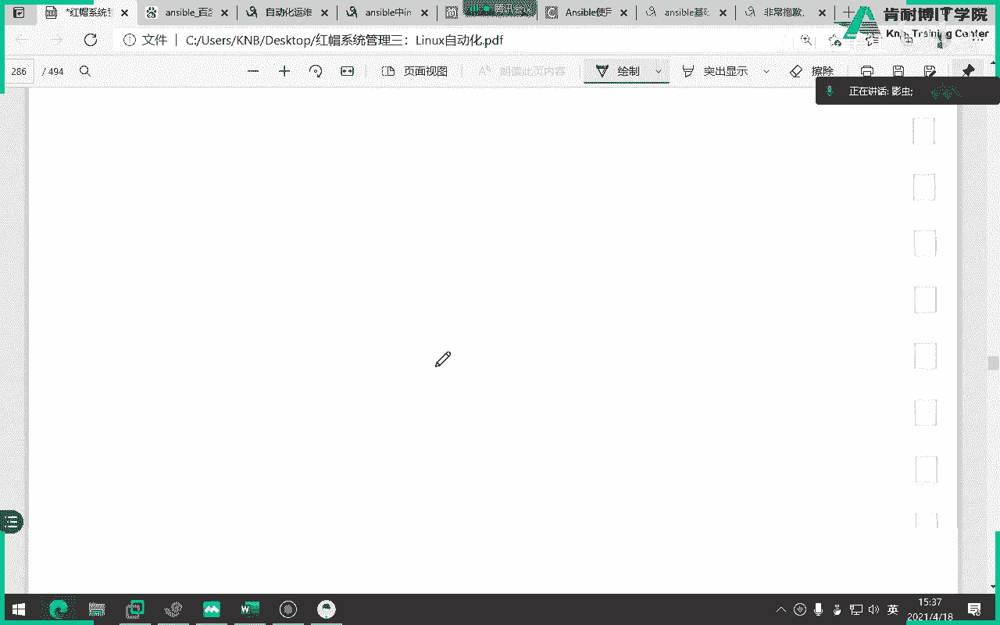

下周六可以讲完，然后咱们就课所有结束了，26号对吧对吧，这两天讲肯定不等晚上可以吗，天香肯定不老啊，随便你们，你说我静等，大家是下了班得几点，一般我到家都九点半啊，你们说都无所谓，今天晚上多长时间。

一个小时，两个半，好吧啊，就咱就就就保险点三个小时吧，昨晚三个小时几点钟，差不多有点累了，其实一如果三老师，我觉得我都可以讲完了，我觉得我都可以讲完了，用不了第二天这样吧，就这样定到26号讲。

比如说七点啊，比如说七点讲一讲，如果说唉我累了，大家接受不了了，暂停行吗，咱也不固定时间不少，咱们就两个晚上，实在不成，咱们三管上，但其实用不到，真用不到，没有你想的这么复杂啊，好。

还有一件事可以我回家发我这个电脑这里面没有，我装在我那个那个我家里面的那个硬盘里面，可以，为什么要给大家这个环节，因为那个题目里面有很多，这个就是咱们当时讲肯定不导的时候，不是模拟那个题目。

那些题目有些关键是没有的，能理解吧，有考题当中说请下载一个文件，这个文件是在咱们这个环境里面没有的，明白吗，那怎么办，我已经给你写好了，我发给大家了吗，啊模拟好了吗，懂了吗。

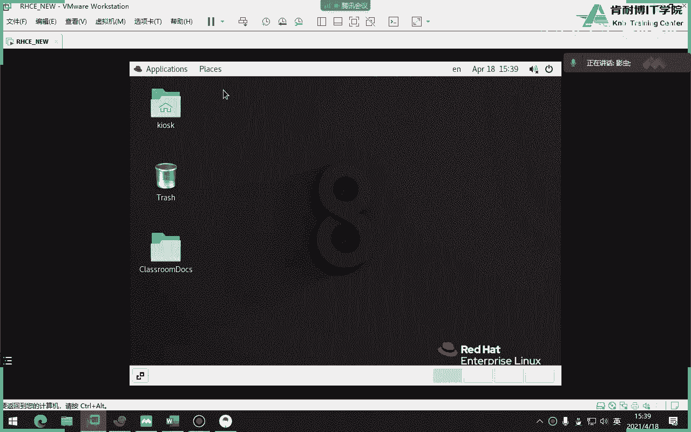

来了，先给大家讲这一堆东西，把跳水里面，全都是我给你模拟好了这些东西啊，像那个哎这个环境没有，看见没有，你们你们这里面有没有东西在里面垫一下，现在这个目录用反对是零线，里面进。

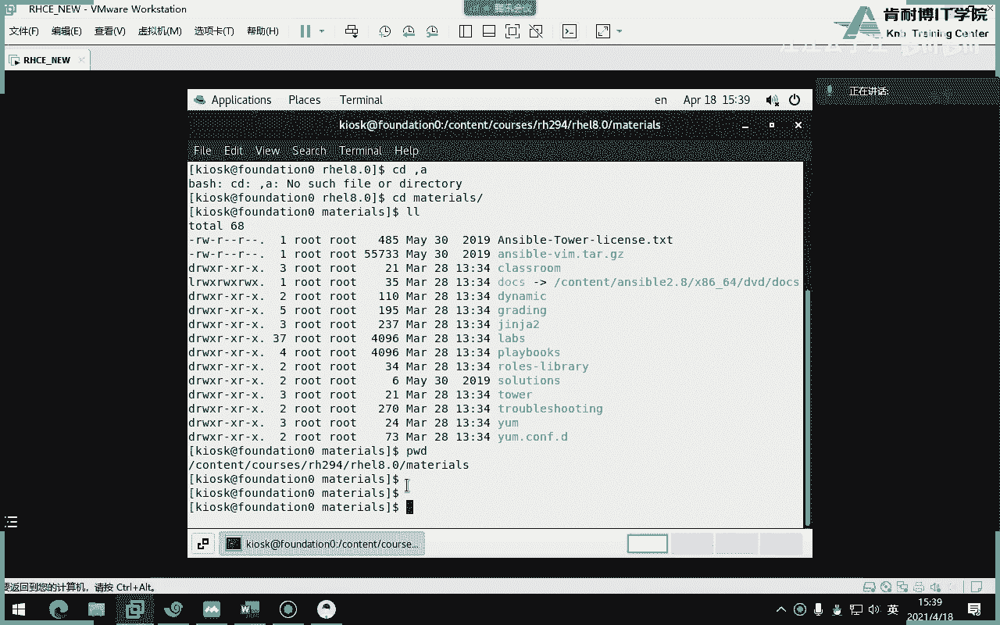