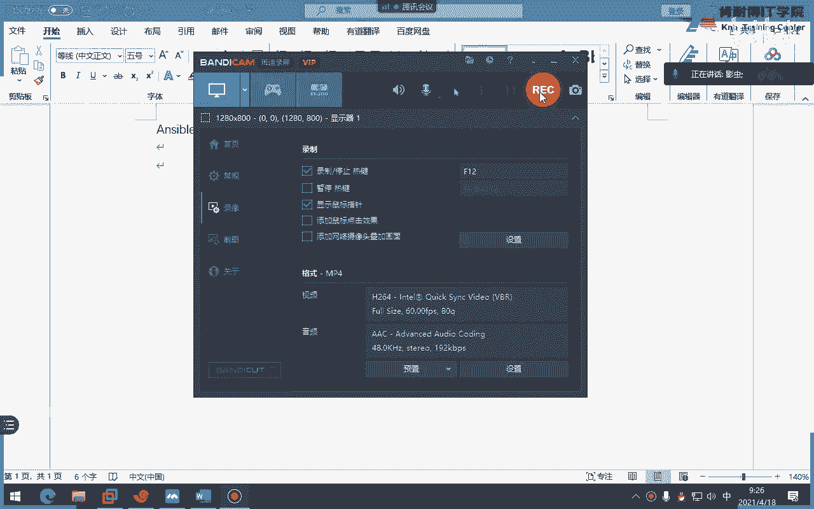
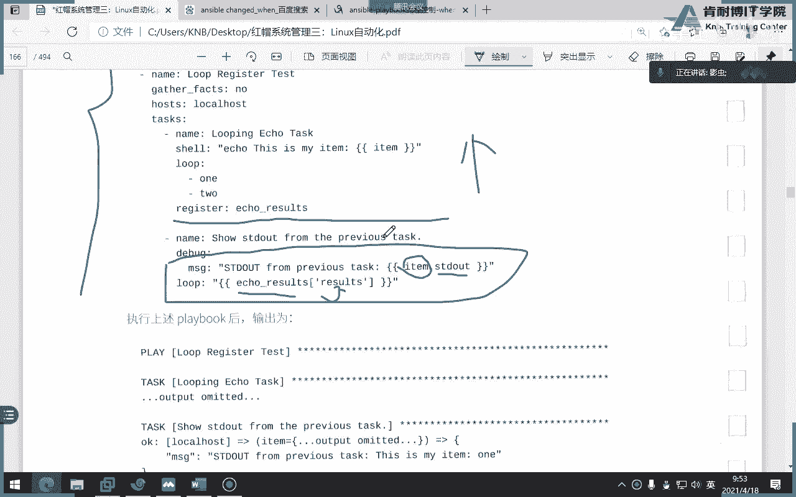
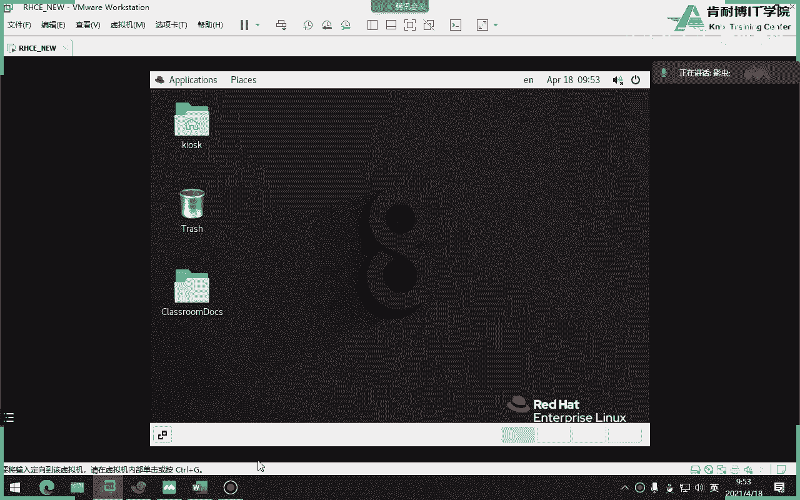
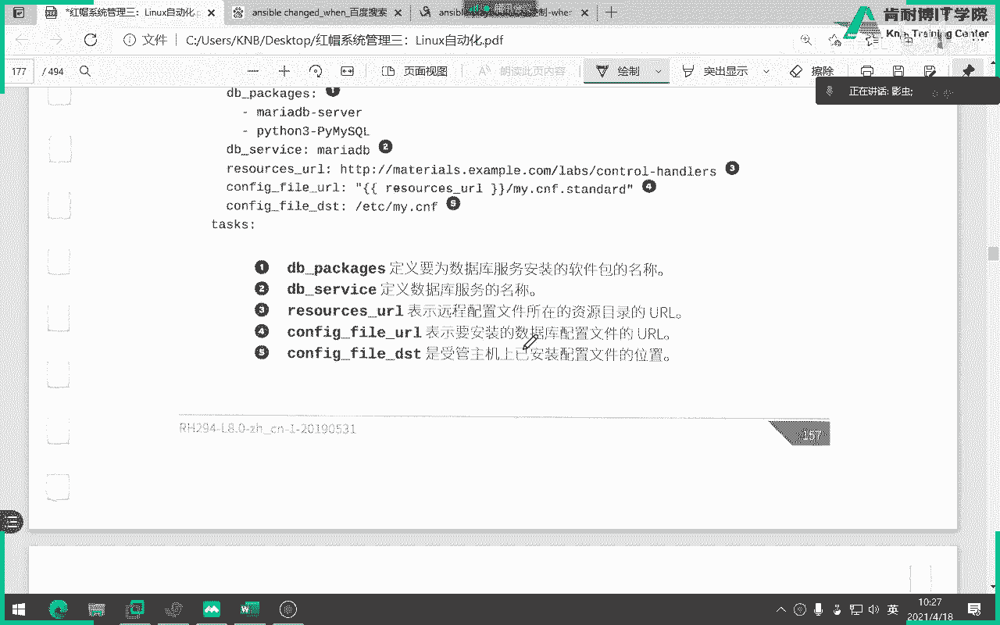
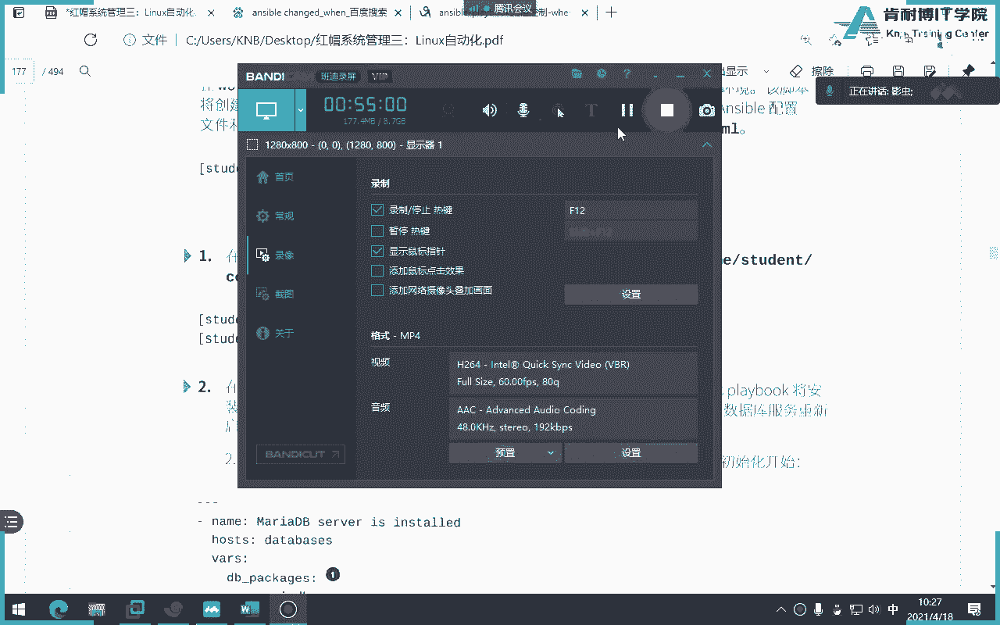
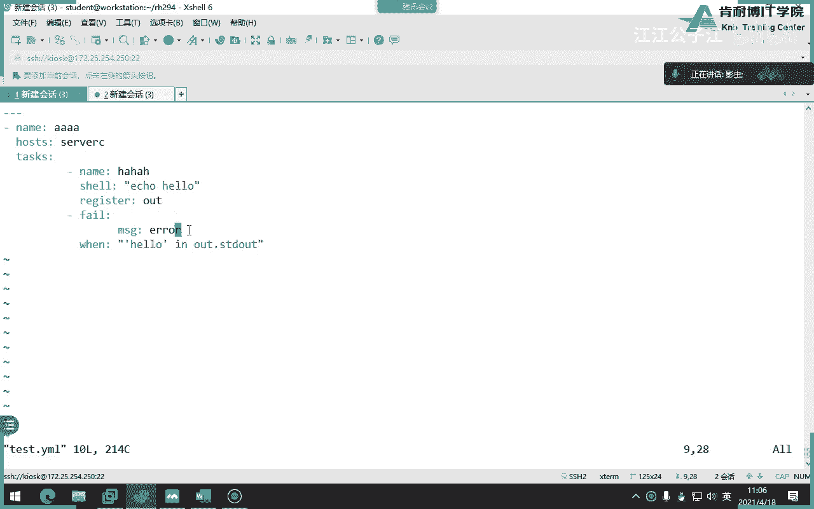
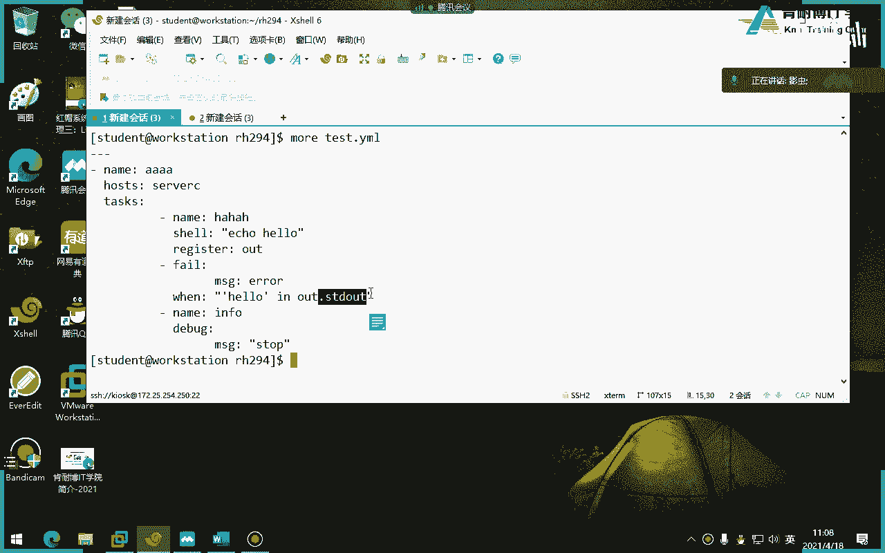
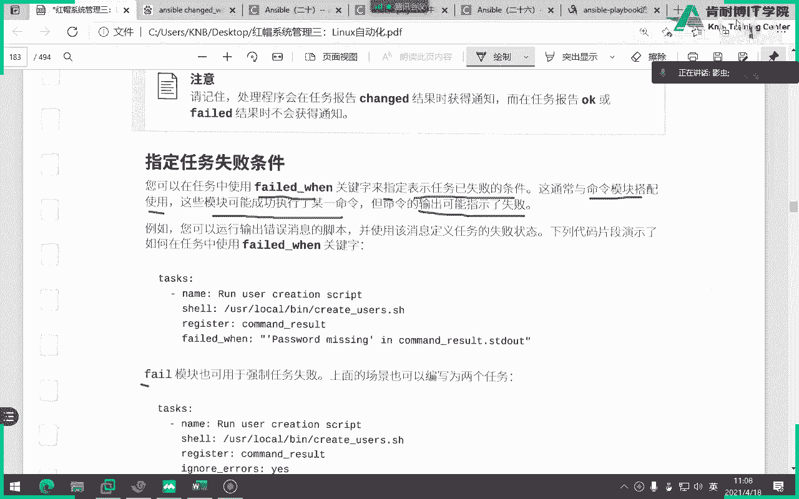
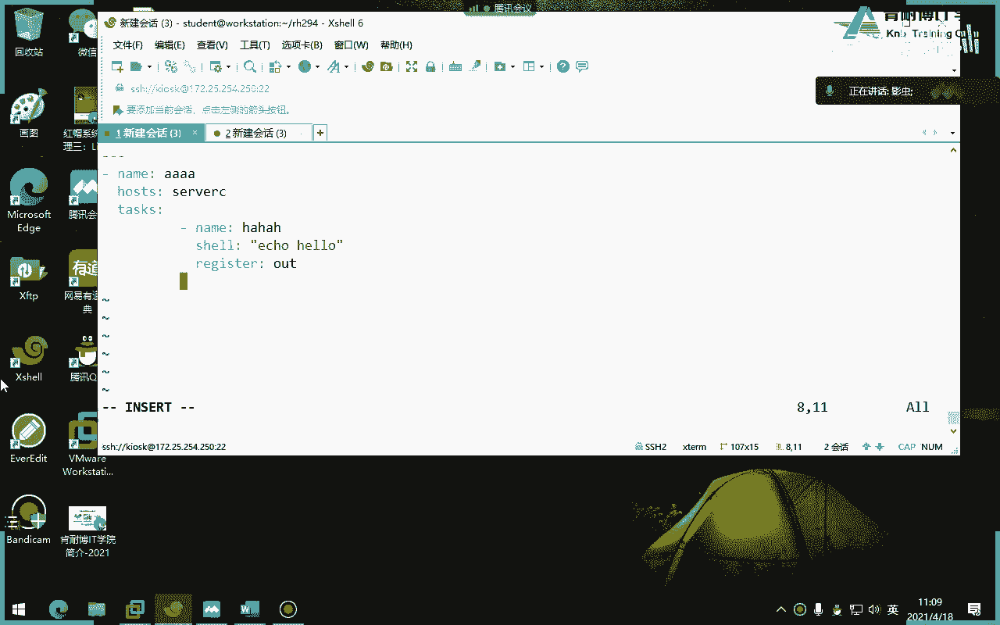
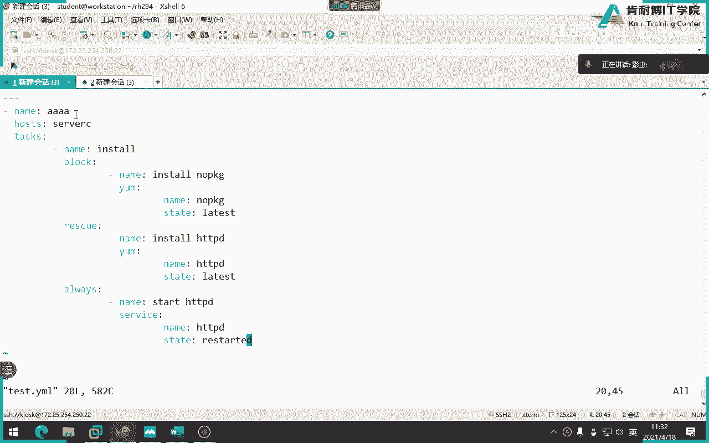

# 红帽认证系统工程师RHCE8-滕老师出品 - P23：第十天 ansible循环和判断语句 - KNBIT认证中心 - BV1up4y1h7MA

那么从今天开始呢，我们要讲第五章，第五章叫做这个循环实施任务控制，说白了从这一章开始呢，我们的play book最开始的灵活一点，像昨天我们都是按照自己的逻辑来做的，第一步安装阿帕奇，第二步拷贝文件。

第三步重启阿帕奇，第四步放行八零根号对吧，他是在咱们人为去控制的，但大家有没有想过一个问题，比如说你的play book比较大大啊，比如说里面的内容很少很很多，那么你想控制它怎么办。

比如说有些可能会发生一些事情，并不是你能控制的，它是一个运行完了一个一个一个结果之后，然后才进行下面一个结果，那这种东西怎么控制呢，比如说有两个任务，第一个任务完成之后，它的结果为真。

我才能运行第二个任务，那像这种必须运行完之后才能做的事情，你是不是不能够事先先把它定死，那这时候就需要一些控制语句对吧，就像咱们以前学脚本叫for循环语句或者是if语句对吧，或者这些函数或者是一些变量。

这些东西都是为了扩充我们的这个playbook的一些属性，或者是它的功能对吧，那么从今天开始呢，我们就要学习一下如何在play book当中控制任务，处理程序和任务错误，那几个灯。

这几个东东西你乍一看比较陌生，学到后面你会发现其实这些东西都不应该翻译成中文啊，你看英文比较好好，那么我们再用简短时间来说一下，上上节课我们昨天讲过esport有三个文件对吧。

那么这三个文件分别是这个配置文件，剧本文件和我们的清单文件，这三个文件呢一般而言都会放在自己的工作目录下面，对不对啊，我们知道工作目录是不是在一个用户的家目录下面建立一个工作目录。

当然不一定是在一个用户的家目录下面，你在任何地方都可以建立，懂了，我只是习惯性的在一个用户的家目录下面建立工作目录，你也可以在根目录下面建立建立建立工作目录对吧好，那你怎么建立呢，你建立完之后。

你要在这里面放置一些清单文件或和配置文件，那么配置文件里面就会就要指向清单文件的位置，在底boss里面，那么同时呢还有一些权限的设置对吧，权限的设置，所以就昨天我们讲的内容对吧，你先有这个知识点。

然后我们再来写play bo，又又又分为很多，比如说嗯一个是由若干play组成，每个play又分三个元素，name host和tess test，又又又又是一个列表对吧，就具体的任务的列表啊。

而且每个polp之前要用三个横线开头，用三个点结尾对吧，然后呢这个之间的缩进是同一级别元素的，要相同的缩进对吧，就昨天讲了一些重要的知识点对吧，你只要抓住这个点，其他就很简单了好那我们来开始讲这一章好。

首先呢我们要讲一下如何实施循环，第二个呢就是这个呃做做一些什么实施，仅在另一个任务托管时运行的任务，第三个呢是控制任务失败时发生的情况，这是三大内容啊，好那我们开始来做第一个，我们的循环是干嘛用的呢。

你比如说我们现在要创建100个文件，各位我想创建100个文件，那像这种创建100个文件，其实创建这件事情是相同的，只是文件名不一样对吧，所以说像这种重复性的东西，我们就要用循环。

那我们知道在shell脚本中，我们用for来做循环对吧，for all，那其实在我们的i sport当中呢，我们用这个关键词叫low来做循环漏漏，可以吗，哎你你你知道它的原理其实写无非就是它的格式。

而已而已啊，我给它格式而已，别说举个例子，大家来看啊，咱们直接就上代码了，不用看这些动，你不用去一个字一个字就掰啊，好我们直接上代码，你来看啊，你像这两个东西其实是不是只有文件名字不一样不一样。

但其他是不是都一样一样对吧，这两个这两个任务其实就可以适合写成循环，看到这两个任务就适合写成循环，因为什么，因为它都是为了启动一个服务，只不过服务名不一样，但其他都是一模一样一样。

那这种东西就是循环的一个典型的用法好，那么他怎么写呢，请注意我们用lob关键字来添加任务，其中用item来保存每次要迭代的使用的值，那这样如果你去直接看这句话，你肯定是看不懂的，那我们直接来看代码。

你就明白了，懂了会看书了吧对吧，因为他那个教材翻译的比较生硬，你直接这么去看，你肯定看不懂，所以你直接看代码就可以了，你来看这个论文里面是不是两个值，看到吗，lob关键词添加到任务当中。

而item的这个呢是保存的变量的什么item其实就是变量，你看到吗，那么是不是相当于往里面进行格吗，迭代啊，是不是往里面进行迭代，明白了吗，所以说loop下面指的是关键字是两个值。

而item保存的是变量，分别去往里面去套用它的变量值就可以了，听懂了吗，就是循环啊，你只要记住它的一个结构，后面你就都会啊，那如果我们要去装一个软件包呢，那很简单。

无非是把这个logo下面的值变成软件包的名字就可以了，然后用这个亚目模块来去装软件包，这么讲能理解吗，啊这是look，那么在早期我们在学习的时候呢，后面教材当中也告诉我们了，我们以前不叫look。

就我们当时学2。3的时候，我们用那个叫with with某个这个单词在这儿我们用的是这个，但是呢这个是2。3版本，现在呢都把这个with items替换成了叫loop，所以这个就不用再学了。

但你看到人家这么写，你要知道这是一种老的写法，好吧，look look look好，那么关于这个小块的内容能过了吗啊无非就是你自己写可能不太熟悉，你慢慢写就行啊，这叫漏好，当然了，还有一种写法。

这就比较难了，大家看我可以直接定一个什么，我们说这个mail service其实是在这里面体现出是一个什么，是不是这个变量，为什么，因为他用vs来定义变量，好相当于我定义一个变量，变量里面有两个值。

变量里面有两个值，那么在那么这个时候在写的时候，我们的logo就要写成谁了，就要写成我们的变量名了，而不能再写成什么post fix啦和dp count了。

因为你这两个值已经被mail service这个变量所引用了，你就不能再写他的名字了，而要写成变量的名字，而不能再写成两个这两个值的名字了，听懂了吗，哎就是变量的使用方式，变量的使用方式啊。

好那么未来我们在工作当中，或者在我们在这个在学习的过程当中，我们会经常使用肉搏后面加上一个变量，所以大家一定要分清楚，因为这个item它也是变量，但这个变量记录的是这个变量的值。

而这个变量里面又记录了两个，一个叫做postfix，一个叫做dove cot，能看懂吗，它是一层一层这种迭代的感觉啊，所以你脑子要灵活一点啊，各位啊，是这样做啊，我就不敲了，敲击也是这样的啊，注意一点。

这个item它是由于是个变量，所以你要加双引号和双花括号，同时这个mail service是个变量，你也用双引号和双花括号才行，还行才行啊，好那么接下来呢我们说一个稍微难一点的东西叫做循环散裂或字典。

还记不记得我们昨天讲过字典，对不对，字典啊，字典其实就是一个什么，你可以理解为就是一个键值，对对吧，好那么loop列表不需要是简单的看不懂啊，他这个翻译看不懂，那这样我们直接来看代码，你看你能看懂吗。

大家还记不记得这个东西，这很显然它也是一个什么，是一个模块，叫user模块对吧，嗯诶它上面没有东西吗，啊在这儿你看这是一个模块对吧，然后那那为什么名字他直接叫一个item。nm呢。

想想这个时候这个什么时候用过，是不是昨天我们说数组的时候用过有点类似吧，啊你看这个不就是一个item，是一个记录变量的一个，你看我们这上面怎么摆来，怎么怎么定义循环动保存，这个卡怎么样。

各位你觉得艾特曼应该怎么理解，其实它是一个关键字，对不对，他是个关键字对吧，哎对对对，他就是一个关键字，然后就用这个关键字来去保存着我们的一个变量的值对吧，或者说去抓取我们变量的值。

那你看他为什么要写成一个item。nm呢，因为在loop里面有两个关键字，一个是nave，一个是groups，那么这个时候它就会循环什么，两个name和循环两个groups，那它怎么怎么循环呢。

要用item来去循环啊，你看当前iem循环变量中每个键的值，每一个键的值，因此可以写成这种和这种，这个能理解吗，好那么我们给大家做一个实验，你就明白了，你比如说，我等到学生啊，比如说做什么实验呢。

我想想啊，比如说，怎么写，你看我像，比如说叫a，不能这么做，想想应该怎么写，随便写啊，我看能不能写出来哇，嗯我想想啊，应该叫做ne，loop一定要跟上面那个模块相对应啊，那么这个时候呢我就要写成，啊。

可能错了啊，我我试试吧，看他起什么名字啊，哎我忘了怎么写了，嗯，哎算了算了算了，不行了不行了，我忘了，想不起来了，呃，我想写的意思就是我我做一个很多用户嘛，然后这个里边我添加的是一个变量啊。

添加这个变量，那你来看这个啊，咱们还是看那个案例吧，这个案例大家刚才能看懂吗，这个案例能看懂吗，是不是就是用it我们来去循环下面的具体的某一个每一个键啊，因为你看这个logo下面有两个键。

一个是name，一个groups，一个name一个group，那么它有两两组name和group对吧，有两组name和groups，因此我要用一个item点什么什么item点什么什么理解吗啊。

相当于去分别去记录name这个键和group这个键，而你又用的是loop，所以他要循环去做吗，这个能看懂吧，我刚才想做一个，也是这个呃，也是这样的做法，但但但是错了错在哪儿了，刚刚写了什么啊。

生效的loop，不生效的loop，上面有个，ui name是不是i后面不应该加冒号，我待会儿想起来再说吧，你去吧，不浪费时间了，你看他说早期的时候呢，我们是用vc。

那么像以前我们会把这个logo换成with item，四with items，但现在你就不用记了，直接用loop就可以了啊，loop就可以好，那这个循环呢语法就是这样，后面就无非就是你多写就可以了。

语法就是这个样子啊，look，好来大家看一下这个我们要结合的register和look一块使用，这一块是有点难，这一块是真的有点难，你看你是能看懂的，绝对可以看懂啊。

你看首先呢他说item刚才讲过的是啥，是不是要记录变量名变量的值，而且loop是one two，那最终结果应该是什么，最终结果是不是打印，这句话一个是一，一个是二对吧，好好讲到这儿都懂。

但最后呢他把打印的结果用register记录到我这个叫echo results，这个这是个啥，这个这是个变量的名字，然后他用debug把这个变量里面的内容给我打印出来了，大家想象一下为什么要vr。

因为后面这次接的是一个变量吧，对不对，哎我们说过debug下面有一个参数叫msg和vr，vr显示的是什么变量值吧，变量嘛对不对，变量嘛对不对好，所以它打印你的最终结果是什么东西呢。

注意最终的结果是会出现一和二，你来看看一这边又打了一遍二八好，这个你都能看懂，但是大家有没有发现他为什么要这么写呢，因为这是一个result，是一个数，啊不不，这是一个中国画，什么来着，是一个列表啊。

这个列表你看看到吗，这这里面其中有一堆东西，其中有一个东西是我们的item值是一，后面就是一个item是二，看懂了吗，你看来仔细解释一下啊，这个画风号赐符表示这个变量的开头是由键值对组成，哪个画框开头。

他说的是哪一块，是不是从这一块对吧，一直到哪儿遇到这儿吧，对不对，好，接着再来看第二项，这个键上包含一个任务的结果，这个字这个就是这个中括号字符表示列表的开头，那这句话指的是哪，这是哪个位。

是不是从这儿开始，一直到到哪，一直到这边，对不对，能看懂吗，是不是相当于相当于这个中括号里面又包含了花括号吧，好吧对吧，明白吗，你仔细看你仔细分析啊，你看这个result是不是我们这个变量名对吧。

这个变量名是用一个中括号开头，这个中括号表示的是列表，而列表里面又有花括号，花括号里面具体是什么字典吗，字典嘛，对不对，其中字典当中有一个值叫做item，那为什么item值是一呢，因为你循环的时候。

loop里面有一个一，那你做完一之后，是不是还要再再做一遍，就是二二，看懂了吗，这就是register跟logo一块使用啊，比较难啊，比较难，这样自己能分析出来吗，能分析出来吧，各位是比较难的啊。

比较难啊，确实比较难，就在这儿开始啊，在这开始，从这开始，那这样我们自己写一个，你看你能分析出来啊，你你你一定要能够看懂这一堆的东西，一定要能看懂，因为这里面的所有值像这个像这句话。

在这句话和这个r c等于零，是我们后面在写判断句的时候经常会使用的啊，你你你从头再来分析啊，我刚才说错了，不好意思，不应该从不应该是从三开始，应该从一开始吧对吧，这才是变量名啊。

辩论明显是用一个花括号开始，然后具体里面会有列表，列表中括号指的是列表，你永远记住大括号，就那个花括号是字典，而这个中国号是列表列表啊，你自己可以写一个这个东西。

你最后结果你看一下是不是跟你跟他一样一样啊，确实有点难啊，这个那他为什么要这么写，不就是想记录它的内容，并且查看出来吗，debug对吧，这一块能听懂吗，各位各位，你们晕，在哪儿哪儿。

就单看代码是不是很简单啊，真的单看代码很简单，就是你从这儿看看到这register之前从那么多一定是能看懂的，只不过可能register这边有点难，因为它要注册变量啊，那注册变量还不行啊。

你要打印变量就用什么打印，用debug来的打印对吧对吧，好那么刚才讲了一堆呢，就循环语句就讲到这儿就结束了啊，刚才是从这从上面讲的都是循环语句啊，从这开始上面讲的全是循环语句。

那么关于循环大家还有什么疑问，你说说，叫什么声明，随便你看我随便起，你叫a b c都可以，你看他这边随便起一个叫echo result，你可以叫a b c。

你你这个register就是一个注册的意思就是变量吗，就保存了，你你想想你有关没有关联，上面是一堆结果，打印出来之后直接扔到一个叫echo result里面，你item是用logo人体的，对啊。

i i i loop里面是不是往里面填值对呀，然后结果扔给register，稳住，哎对对对对对，其实其实你记住了，这register可以放在任何的语句里面，不光可以放在循环一句，可以放在任何语句里面。

你比如说我现在做一件事，但是如果没有register，是不是我看不出后面中间的结果对吧，你随便我现在添加一个用户，但是你中间的过程你不会有，我想看中间的过程和和我想看最后的结果，那就必须用它。

对你有没有想过这个就像咱们以前学c的时候，咱们是不是比如说我现在打一个命令，那你也不知道对错，那么其实他把结果都扔到哪了，都用到这个变量里面了吧，是扔扔给这个变量里面了，当你去打印这个变量的时候。

他说他如果是零的话，是不是刚才你打l s这件事情就是成功的对吧，这个是不是变量对吧，这是个变量，这个变量你就把它理解为就是register后面那个变量名，这个echo代表什么呢。

eq就等同于这个debug命令去打印这个变量的值，如果是零，就代表上面那个任务，我不管你什么任务啊，是正确的，那如果不是零，就上面你那个任务就是错误的对吧，其实也能理解吧，你昨天晚为什么问你妈的。

要是我啊，当不知道就去掉了，没有任何关，没有任何关系，一点点，其实你看我为什么画一个横在方框上面的，跟下面其实是分割出来的，只不过我用register来抓取上面的任务的结果而已，对只是个结果哎，对对对。

你上面什么任务都行，什么任务都可以，啊这个因为你的知识loop 12，所以才跳出了这个奶瓶哥儿子都在外面啊，停就暂停了，就没了，就跳出了，就开始下面的任务了，到loop loop是不是两个值。

那第一个值完了，第二个值，第二个值完了就没了啊，路云好，他现在就是帮我打一个声音，然后他一个船，你要安全那个下面那个，现在叫下冰令的时候，就直接把肉格低，然后就是说这款车值得入，是所谓的对对。

再再往上叠一叠一遍对，就跟for一样，跟咱们的for一样，嗯但是你有没有想过for循环的话，如果是我如果写成这种循环，比我这么写一二，那如果我这么写，我也没有写跳出他为什么到二就没了，不就跟他一样吗。

对吧，跟他是一模一样，因为它的取值就两个嘛，跟跟的是一样的啊，自动跳出，他在这里面可没有什么break啊，没有那个break，也没有那个continue啊啊那个关键词到乐福完之后就直接跳出头就没了没了。

好继续，那如果大家for循环那个lob循环明白的话，我们接下来讲第二个东西叫条件判断肉不循环啊，哎我我我我有问题，我的问题来了，这块大家有没有看过，这块我当时看书的时候，我就我就有问题。

我请问大家一个事啊，各位各位从那到那儿都明白吧对吧，ok都明白上面的东西不明白下面的东西我不明白了，这个东西叫message max，是不是我自个儿定义打印出字符串对吧，比如说不拉不拉不拉。

但是问题是这一块从哪来的，我凭什么这么写，教材当中凭什么这么写，如果我写的话，我得知道我怎么写上去的，哪来的s t d o d o u t，各位item。

我会大家都明白这个点下面的s t d o u t这个值是固定的吗，是一个死的吗，我得记住吗，不是要记住的，各位你得明白他为什么会出现这个s t d o u t，还有下面他为什么会出现这句话。

因为不就得看这个吗，所以如果你上面这个是你看不懂不就完蛋了吗，来这不就是s t d t吗，这边不就是那个echo result，点下面的哪个这个result吗，看得懂吗，请问这句话能看懂吗。

放炮这句话就到这儿能看懂吗，这是啥，这句话是整体是什么意思，我知道结果是不是打印这个变量循环这个变量的结果，其中有一个叫s t d o n t的，你看你们看不懂了吧，看不明白了吧，来来来来来来擦掉擦掉。

咱俩好像，看我再问你一遍，从头到尾问你，你看你能给我回答出来，这是啥意思，什么意思，是我刚刚那个变量名吗，好花括号里面是什么意思，是字典吗，字典好，那下面这一堆都是这个字典里面的值吧。

只不过它入列表的形式来显示，听懂了吗，好那你我问大家，这句话是什么意思，这整句话啊在哪儿，这句话什么意思，这两句话什么意思，开始循环显示结果里面的哪一个字段，result字段，这个是变量。

变量当中是不是有个叫results字段，来来来看看，再往上走，这是变量吧，这是个变量，其中是不是有个results字段，看results段里面有个啥，有个啥，有个s t d o o t是吧是吧。

所以说你看人家写的是对的，我循环你这个变量当中有一个result字段，result段里面有一个s t d o u t，而由于是两个，所以要用items做循环，听懂了吗，所以现在你要让你写，你会写了吧。

你也得会啊，不会我们写一个，我们现在就写一个，来不懂咱们就不能下课。

虽然考试绝对不会考，但是你以后再看别人写的时候，你就不明白干嘛的了。

来我们自己写一个，咱们自己简单写一个啊，在哪啊，这个东西好在这一定得搞懂啊，得了吧，咱们就用q用他，我现在呢是这个sc吧对吧，不能设为c妈的，下面起来就忘了这是谁亏咱们就是说抄啊，咱们就做书上的东西啊。

书上写什么东西，我们今儿就照书抄，唉这是干嘛的吗，不进行收集，所以他就速度快一点啊，好嗯嗯，行咱们就照书抄啊，比如说啊，咱们今天就照书抄，我名字叫做out，可以吧，变量我想叫什么叫什么，你管我不管我。

对不对，好好，空一个，debug吧，好但这个时候请注意，我先给大家打出vr，让你们看出变量值，这样能明白吗，我先不用mc，既然你们看书哎呦变量变量变量啊，没有没有加那个杠，u rot杠b仔细看啊。

唉哟我了个去去，r c等于u27 ，说明啥，说明任务错了啊，是不是他那个哦哦哦哦哦哦哦哦哦哦哦哦脚本错了吧，用a口，嗯是这样的吧，对，因为你是好不认识你啊，你用a口，这就是真正的linux命令吧。

好大家来看几个两个吧，这是out是一个什么各个变量名，变量名当中是不是有花括号，花括从哪到哪，是不是从这个到哪到哪儿，来来来这最后这这这个哎不对，就最后一个就到这儿哎，对的就到这儿好。

然后注意这是我的变量名，其中有一个叫result，这个results从哪到哪，应该从这个括号到哪到到当当当当当当当当当当到不对，到，对吧好明白吗，到这儿好注意看啊。

这是一个out out里面包含result，result里面是不是包含一个值，叫做s巴拉巴拉巴拉在哪，哎我的s呢，咋没有s啊，啊不不在这是不是有一个s d o u t啊，好那我现在问题来了。

我让你们给我循环打印出s t d o d这个值怎么办，或者这样的，我让你们循环打r c的值怎么写，我就想知道我打印，我就想打印rc这个值等于零或者等于非点，无所谓，我就想打印rc这一段怎么写。

用循环来写怎么写，来各位重新来编辑，开始了，那这边继续在第八个位，随便写了好，这边是不是debug，这边就得用什么了，咱们用m s对吧，比如说嗯我写一句话，比如说我这个随便写啊，比如说嗯。

然后然后然后怎么想，怎么写，是不是先写变量名，对吧是吧，对对是自己的话没错，你你你你讲的非常正确，来来来再来一遍，算了啊，不懂这个，你后面你啥也别学，嗯，打印出来啊，咱们做一遍，你们看出结果啊。

咱们照着结果来自己写，我现在让你给我打印出r c等于零，这句话用循环里，为什么要用循环，因为即便2c等于零两面吗，好怎么写，我就要抓住这个值怎么抓，或者这里面任何一个值，比如说艾特我们的值怎么抓。

或者是那个star的值我怎么抓，我想表达的是这个意思，我怎么抓出来，那你选出三就要知道了，这个值也好，或者star值也好，它是不是属于哪个，它是不是属于result里面，而result里面又属于谁。

alt吧，对不对，那你应该怎么写，所有东西，很好，这是个变量是吧，是不是要发货号，我忘了啊，给四个变量用花括号啊，然后呢我循环这个变量是吧，我要去循环这个变量，但问题这个变量在哪呢，变量是谁。

是不是out了，下面的怎么r e s是这个吧，对吧对吧，对吧，哦我这么写吧啊，对吧啊，在这看，是吧，刷出来吧，现在在看这个书能看懂了吧，自己懂了吧，首先我要抓的是这个s t d o n t。

但是s t d o n t在哪呢，是在这个变量里面的某一个哎，那我请问大家为什么这边要中国好，谁能解释一下，很多同学不知道为什么要用中国号，因为你要看上面这边是在懂了吧，这个列表列表里面有一个值叫什么。

result是个列表，而这个echo result是一个字典，result里面包含了伪造的result，这个列表这些都是列表，是这一堆这个列表的值，其中有一个值叫做s t d u t。

其中有一个值叫做r c，其中有一个值叫做star，明白了吗，现在就能看懂了吧，教材他那个书出的就不好，他直接就这么写，你说啥意思，啥也不知道，你要不注意看书，你就把这把这句话略过了。

那为什么我们要讲这个呢，因为在定义message的时候，我们有可能要做新做，做循环的去摘里面的这个这个这个这个值，比如说所有的所有这些显示的参数都各种各样的事，因为我要下面要做判断啊。

比如说打印出所有的r c如果是零怎么样，如果不是零怎么样，那我怎么怎么样去打印出所有的rc，那不就不就得用循环语句来打印吗，对吧，那我们给它起个名字，我请问大家这边我们如果起名字的话。

我们刚才写的这一块应该叫什么，就这一块应该叫什么，黑色的这一块儿应该叫什么，是不是用loop来做循环循环，谁是不是循环我们的字典呀，是不是字典out，是不是字典，因为art是一个最外面的花括号。

而red是一个中国号中二代表列表，说白了就是循环这个字典里面的列表里面，那其中的一个值叫rc吧，听懂了吗，同学们，ok过听不懂，回去看视频吧，你看这一个东西你可以解释这么长时间来下面一个条件判断句。

条件呢就是咱们以前学的a，如果你是怎么样，否则怎么样对吧，如果你是怎么样，否则怎么样，那么他这个概念差不多啊，好那直接来来看，那么怎么样，咱们的条件有哪些可以当条件呢，有很多可以当条件。

比如说你让他告诉我们，我们可以用我们的内存当做条件，我们可以用我们的cpu当做条件，我可以用我们的实时变量当做条件，举个例子，这个电脑的内存大于500兆的时候，我才可以装阿帕奇，这是不是一个条件。

那么这个内存是不是当做条件，比如说当这个电脑的cpu个数为两个的时候，我才可以装mysql cpu的时候，必须是二才能是装扮成对吧，那我问你改了，我怎么就知道我这个电脑的cpu是r的设置变量，对不对。

我是不是抓住了时时变量，发现我的设置变量cpu个数是二马sl才可以装上去，对对这就是控制吗，这不就是控制吗，它是不是比for循环要简单很多好，那我们来看语法格式叫问，那不叫app啊。

咱们怎么没有app这个单词，他要问你看像这一块怎么意思，你自己看，如果让你自己学自己弱化，这意思能看懂吗，应该是能看懂，首先was不是定义一个变量来各位这个变量的值直接是个true，是什么意思。

真吧说白了就是我直接告诉你，你就是个真，你是真的，那是不是这个值永远为生，对我就告诉你是真吗，那不就只有远为真吗，然后你来看当这个变量是真的时候，我才装阿帕奇，是不是不想念了吧。

问对吧啊这这就是很简单的一个一个一个一个判断句，当然你也可以写成boss对吧，但如果写boss的话，这句话这么写出过阿凡提会装吗，这就不会了呗，因为你说是假嘛，只有真永远记住条件方面。

只有真才会做什么事对吧，假的话，那可能就要做else语句了对吧，就不做了好，那你看下面这句话呢，这句话更有意思了，他直接告诉我们定义一个变量叫max service，他的阿帕奇是它的值，hd b d。

阿帕奇是它的值，然后呢直接干嘛，这个单词请给我记一下，如果有圆珠笔同学给我画一下重点，这个值什么什么什么，is define，注意这是一个关键字用法，这叫is defend，叫被定义关键字啊。

这可不是我们随便写的，你会发现xp当中有些是随便写的，有些不是随便写的，比如我刚才讲的r4 就不是随便写的，对啊，像个is defend就不是随便写，它代表被定义，那我问大家这个会不会装上这句话。

中国阿帕奇会不会装上，会呀，因为你定义了这里面就不会判断你真和假了，他直接就定义了，定义它就直接装了，明白吗，当然还有一句话叫is not defined，也是一个关键的字。

以后你也会用到is not defin，就没有被定义啊，也会用到，好吧，这就是条件判断，但仔细听同学们，你落魄也好，文也好，是不是都跟上面是同一级别，看对，千万不要跟那个同一级别，为什么。

因为map是ym的ym模块的一个子选项而已，而one是独立的吧，他不是亚里面的选项，我为什么要跟你这个name对齐呢，所以很多同学就会犯这个错误，所以一定要跟上面的模块对齐。

包括刚才我们的logo是不是也要跟上面的这个模块对齐啊，一样的一样的，就是问一句啊，我就不做了，因为太简单了，就不做了，嗯好这些都是关键词看，但你不用记，上面大于等于等于小于，这是啥，非等于非等于好。

这个关键字在这儿看，前面无所谓啊，前面不一定是那个memory，前面无所谓，但是这个is defined，is not defined，是关键字ed ed啊，不要忘了ed，这是关键字。

那么还有一个好玩的，在这这也是个关键词，这个挺有意思，第一个变量的第一个变量的值存在作为第二个变量的列表中的值，这个有点别扭啊，有点别扭，我们直接看教材来看这个他定义一个变量，各位它定义一个变量。

这个变量里面只是一个是fsa，一个是red hat，然后呢他做了这样一句话，他现在去装，他怕启动软件对吧，xr已经书写错了，各位他等于装不上对，所以应该是htv d啊，因为教材出错好，你问他没说错啊。

h b b d，你看他说什么，acbook下午换线，this bution，死后是巴拉巴拉巴拉是什么意思啊，不就是第一个里面的变量的值，这个里面的值是在这个列表里面，什么叫做debution。

是发布吧对吧，不是说的这个就这两个吗，这两个不是发布吗，这两个值是在这个列表里面，其中一个，最后这个结果是什么，阿帕奇一定会被撞下去，明白了这个，但是请注意这句话是从哪来的，各位这是个事实变量。

你可以用set up看一下，这是个事实变量，这个事实变量里面的值一定是一个什么版本，比如说windows，比如说linux，比如说红包，这是实时变量，因为我通过实时变量抓出来。

我这个电脑是red hat，并且这个red hat在这个变量里面，哪个变量，这个变量里面因此就装，比如我这个电脑是windows，那它不在这个变量的数据列表里面，它就不会去安装，这么看是不是很简单对吧。

其实结果题非常简单，但是让你自己写就可以写，可能写不出来啊，但是你要能先看懂才行，所以这个语言他就是比较直白啊，他的语言比较直白，问能不能放到第二层上面，哪个问问我要放在哪啊，那怎么砍。

你得先你得先判断我理解你的意思，就放在这儿最好对吧不行，你放在家直接告诉你报错啊，直接告诉你报错啊，很有意思啊，这个因为它是它是一条一条，但是人家先停上去了，但这个东西就意思下。

那可能现在已经安装完了对吧，还要再来判断判断，这不罗辑也玩这个，那咱们就不用纠结了，那他既然这么写，咱们就这么搞吧，还有多次判断，就是or和and这个的懂吗。

是不是逻辑与和逻辑或哇哇我们知道或是什么意思，或就是一个条件满足就行了，我不管你第二个，但i的呢就左边条件满足，右边条件一样满足，才能整个是为真满对吧，对不对好，那你像这句话是什么意思。

当这个发布版本注意啊，同学们等于号一定是两个等于啊，就在answer当中，不能是用一个等于号，两个等号才是等于号，那只有一种可能叹号等于号才是这个等于号，这个是对的，那这个才是对的啊，好吧好。

你看这句话，就是这两个其中有一个对的，我就干嘛，就你的版本版本号，要不然是红帽，要不是这个file啊对吧，那么还有一种写法呢是and and是，那就厉害了，就是你你你你两个就必须满足。

还有呢就是那种两次结合，你看这个就为什么要大于号，因为它是分组写了嘛啊这是分组写了对吧，或者把代号换成什么竖线啊，你看这个就厉害了，中括号代表组啊啊不是这不是中文叫什么，这个小括号是代表整体。

千万不要理解是四四行啊，其实这是一行，这是第二行啊，这是这是一组，这是一组啊，虽然写的是四种判断，但是每个分成两个组，那因为这就是这两个中间关系，上面这个是对的也行，下面这是对的也行吧。

因为它中间的行车哦，他用电用的是哦，在这个点一定要注意啊，一定要一定要注意啊，这个没什么解释，你就把它记住就行了，而且再说一遍，an uncible distribution是一个事实变量。

你得自己抓出来的，但是你自己抓出来，别拼错了啊，不要拼错哈，其实这个很显然也是个啥，那也是事实变量啊，kl没ko对吧，这个最难，当时我自己在看这个模块的时候，我都晕了啊，我觉得你们也会晕的。

所以这就是你们要把书上内容抓出来，你看又说字典啊，右手字典来看一下啊，组合循环和有条件循环一块啊，就说白了把刚才的循环语句跟我们今天的app啊，不是这个问语句结合瞅一眼同学们。

他说下面这个案例当中是要用ym去装一个ipad的数据库，数据库啊，这就是马sl啊，装mysql数据库条件是只要跟上面的挂载文件系统，说白了只要根的大小超过300兆，懂了就只要根的大小超过300兆。

我就可以去装这个mysql软件包，那么问题是我得寻我，我怎么知道呢，我怎么我怎么去找到这个跟下面的300兆呢，各位大家知道吗，来我给大家说一下啊，我怎么样知道一个我的电脑的这个文件系统多大。

咱们现在用电脑f dnf可以看到，那如果没有df的命令呢，我想抓出来了，那就要用这个按是否杠m比如说sc吧，杠m set up，你先看我从哪个地方可以看出我的诶啊绿光，从哪个地方可以看出我的根是大。

而是这个这个大小呢从哪边看，你得看那个mount mount m o u n t mount在哪，是什么样的吧，好那mt的话就是这这个这个来来来来来，各位这个mt有一个中国号代表什么，说出来列表好。

列表里面其中有一个值是什么大翅根吧，好那不行啊，光这个还不行啊，是不是得看大小大小在哪，哪个大小，哪根大小，现在是多大，从哪看，是从能开吗，这个是totally吧，总共大小，但是可用大小吧，那我给你。

我得用可用大小，还还还用总共大小可以吧，对不对好，那你看人家你刷出来之后你能看懂吗，首先是logo吧，loanable就是一个实时变量吧，跟我解释吧，而且当这个是个啥。

为什么是个i什么点mt现在能看懂了吧，是不是i这么点mt是不是相当于什么意思，是不是这个这个这个值item。mt里面的值是什么，是根的话，我请问大家为什么要用at吗，因为这个电脑就一个文件系统吗。

就一个分区吗，不止吧，对不对，好，并且大小是看可用大小吧，这大概是300兆吧，听懂了吗，同学们有了刚才那个那个案例，再看那个是不是简单了，懂了吗，哎这就是结合loop跟问一句，结合你下次问问老师。

你怎么看出来这个i这么点m的，是死记硬背的吗，不是死记硬背的，你得能自己写啊，我主要就想让大家不要去背这个东西，下次比如我说我现在我现在不不不写根了，我写别的分区可以吗，可以呀，但我得先知道怎么看。

是不是先用set up先抓出实时变量，这是哪个地方支持变量，肯定是在month里面吧，mont里面吧，对不对啊，明白了吗，那么那为那为什么是这个变量，各位因为是在这儿啊，对不对。

是不是下面的mt是个变量，其中有一个值叫做mt，好那下面还有吗，可能还有吧，哦没有了，因为我这个电脑只有一个，跟大家来看看，是不是只有一个分区，我问大家，如果还有别的分区，刚才那个帽子下面是不是mod。

是不是应该还有别的，比如说比如说举个例子，比如说vr，比如说boss，比如说比如说那个swap，懂我意思吧对吧，因为但是我站在电脑只有一个根，所以它循环不了这么多，没有这个地方听懂了。

听懂听懂就不要再问我了啊，咳咳咳好了，休息会吧，你得一个一个案例给你们解释清楚才行，咳咳，均是正常的，5月10号确定考试，两周了，学校还有两周的cc都应该练完了吧，应该是点完了，有了刚才那些基础。

你现在在看这句话，就知道从哪来的resur c了吧，对对你绝对看不懂，你不知道哪来的，就result的rc，我以前第一次学学的时候，我备这个课，我备课的时候我们都考完了，不考虑个吗，我们都考完了，备课。

突然看到这一章，我就有疑问，因为你说这个你别说人家学生问我自个儿我都不知道是啥东西，你赶快翻书再看，其实上面他没有直白的讲，但是你自己分析上面的，那就咱们刚才讲的那些代码是你应该能够学会的。

你这样看书才有效果啊，原因就在这儿，原来我的名字叫做result，这个变量里面有一个词叫assle，现在我就不再解释了对吧，来解释了好，那么咱们这一章呢实验题我看看有什么实验室，不重要不错，不做了不做。

待会我们自己出题来做啊，不做他的题好，那么可以下可以过了吗，来我们讲下面的东西啊，讲完这边我们一块来做题，就处理一个程序这一块我实在不知道怎么跟大家讲啊，怎么解释，也不知道，直接来上提。

咱们有一个有一个东西叫处理程序，用什么来处理呢，用这个notifa这个这个单词翻译中文，是不是叫警告是吧，好好你来看这句话什么意思，这句话是让我们去拷贝一个东西，他们是一个模板的意思，原是他目标是它好。

也就相当于我把这个配置文件拷贝到这，然后呢，突然间有一个词叫警告，然后里面是一组列表，其中它只有一个叫做重启，还怕奇，那么我们想象一下，你这边说要充钱阿帕奇，那么下面就要有一个hd叫处理处理这个通知。

这个是通知，不是警告，就是通知，然后我就要去用它来去处理通知，那么处理通知用什么来处理呢，用name来处理，你来看你的名字跟上面的名字一模一样才行，看到没等于号来表示一模一样。

然后开始用service来重启阿帕奇，大家想象一下这是什么意思啊，你突然间在这个位置加上一个通知，那下面就要用hd去处理这个通知，就是他啊，就是他去处理通知，那么我们通知你看它既然是横线。

是不是代表列表可以有很多处理，那么怎么对应呢，要跟名字对应啊，一一对应，你这边名字叫restart点阿帕奇，你这边一定也叫restart阿帕奇才行，通知啊，哎对比如我这边随便写，我这边写a。

那你这边就要写证明的，可以随便写，但是你上面写什么，下面就一定要起什么，因为他说你看这也是列表，你看它也可以叫b下面都有个b，那你这边还有一个name叫b，他这个列表列表都是列表啊，这就是通知。

然后你再看这段英文，你就明白了，你看有时候呢我们任务确实要更改系统时，可能需要进一步的人这个处理，比如说我要重启一个服务器，那重启服务器的时候能怎么重启呢，那我们可以用通知来重启，那有什么好处。

各位那张老师，你通知的话啊，你直接重启，这这在下面直接写service重启就是了，为什么还要通知呢，因为有时候我不一定在某个位置想重启，最后重启了，对不对，像最后重启怎么办，随着这边先写一个通知。

相当于先标记一下什么时候进一出现了hd再重启，哎这个意思啊，你看这个关键字表示处理程序任务列表的开头，你看这个开头，而且大家看看它的缩进，注意看缩进要跟上面那个name一个缩进。

啊这个这个test的一个缩减啊，tt一个缩减看到，所以说这个情况一定要注意，因为以前我们在做的时候，经常跟这个泰坦里的一块锁定就错了错了，现在你来看这个整体，你看现在有两个通知，一个叫这个，一个是这个。

你看它的名字一一对应，这个对应这个啊，这个对应下面这个，两个通知啊，两个通知，大家把这个题做一下。

通知这个题目自己做吧做吧。

第二个要讲的东西叫处理任务失败，那么首先呢我们要讲一下一个叫做ignore errors这个结构啊，一个ignore eras这个关键字，它是叫忽略错误。

没想过你写脚本和你写playbook有一个相同点，都是从上往下去执行，那么比如说中间有一个任务，如果失败了，是不是后面的任务就不会再继续了，被跳出了对吧，比如说有三个任务123，但第二个任务错了。

那么整个play不就跳了混乱，第三个任务就不会做了，那怎么办，我们不希望这样，因此我可以加一个error，ignore，you can not errors，代表忽略错误，大家来看这句话很简单啊。

看看装一个包根本就没有，这个包叫no package，就没有这个包好，但是他下面加上这句话，意思就是就算这个任务错了，但是后面的任务继续做，懂我意思吧，非常简单啊，非常简单，就说诶你给我说建，随便吧。

比如说咱们就这样吧，他根本就不可能有这个包对吧，那这个时候我可以加上这句话，nore ignore，变，算了算了算了一个没有n了，没有没有n，没有n没有n，不行啊，好这时候我再做一个，你看。

哎呦我嘞个去的10号，多情不对不对，在这，啊没有logo，house的logo，cos不成不行，真不想为什么就不想，啊这个项目肯定错了，但是你看后面的哈哈哈，还是给我显示出来。

但但是这边你看有nore吧，对吧，看懂了吗，同学们再来一遍，看这边错了，他说什么这个包没有，根本就没有这个包，对不对，但是第第三句话debug是不是还给我打印出来，但是呢这边有个0~1就忽略过一个。

这叫啥好处，但是如果如果如果如果把这句话删了呢，那怎么那会怎么办，就不会出现第三个打印吗，就直接掉，直接就掉了，这个这个中断了，懂了吧，简单吧，过好第三个啊，第二个任务失败后强制执行处理。

刚才咱们不是写那个hl吗，但如果我任务失败了，他就不会处理，但是没关系，我加上这句话，但这句话在哪家看，在哪家，在tt上面加，就是不要在task里面在tt上面加，就是如果遇到问题，但是该有通知处理的。

继续做通知处理，听懂我意思吗，对你你你你你看这个，你比如说，你比如说这个他又要装这个包，这个包肯定没有，这个包没有的话，如果发生错误，这边第三句话就不执行了吧，但是没关系，它在最上面加上了这句话。

就是中间这个错了，没关系，这边照样执行，懂了吗，一定要注意它的家的地方在哪加这些加最上面加，不要在在tt里面加，在最上面加，这个就这一点你要给我注意一下，其他的都没什么要注意的。

他他跟那个艾瑞哥有关系吗，没有吧，没有关系啊，各位这俩你别混淆了，没有关系啊，可以过了吗，下面这个有点难，有点晕，fa问关键词来指定，表示任务以失败的条件，在讲fail的问之前，我们先不讲它。

为让你们能够很好地理解fil的问，我们不讲它，因为这个教材直接讲很多，包括我在内很多同学都晕了，我们讲什么呢，我们讲fil模块，我们先不讲，非要的问啊，我们讲非要这种话，一看就干嘛，失败吧。

好是我故意让一个事失败中断任务这么讲能理解吧，咱们一般都是习惯性让他去成功对吧，但我现在故意中断，就我要达成一个条件为真，只要这个条件为真，我的任务就中断，明白吗，我故意的，我就想让他中断诶。

那怎么做来可以这么做，叫faf反问when看了吗，两个一个是拆开的，看到他们俩是在一块粘着写的，而这个是拆开的，一个是fell模块和模块，能看懂吗，这两个拆开的啊，好那怎么写呢，我给大家写好了啊。

我找了一个例子写还不错，我觉得这个例子还挺好的，你来看啊，我写这句话好，给c用对吧，这个不用解释好，我写一个视角模块能看懂吧，视角模块里面打印出，hello，那我把这个模块的内容记录到out变量里面。

能看懂吗，能看懂吗，好接着fail失败，什么失败呢，如果失败什么事，我就打印出error，那什么时候会打印出error呢，当在这个变量的输出里面，我就中断这个脚本，看懂了吗，哎大家知道这个是从哪来的吗。

这个这个，是不是out里面out里面有个s t d n t吧，好如果这个输出里面包含hello，关键字，你成功吗，成功了，我就是调用fi，我就调用fi这个模块，中断我的进程。

并打印出我这个观念这个字符串，这个字符占随便你打啊，随便打随便打，比如写123456都可以，好，我们来实现一下，我们执行，那你告诉告诉我，他能执行吗，能啊，你看，会打印出error。

看会打印出一个error吧，然后呢中断了吧，不卖了啊，这样看你可能还不是特别明白啊，你看啊我这样这样写吧，嗯，大家能理解的fil的吗，fail的就是我想强行中断一个进程。

这不是强行中断一个playbook啊，你看首先呢我输出这个哈喽呢保存到一个变量当中，如果这个在这个变量值里面，那么就显示这句话，并且程序中的就是我强行让一个程序中断，但是必须要跟when一块。

为什么要跟问一块满足吗。

那当条件满足吗，好但是这个跟我们的非要问有什么关系呢，他们俩类似，同学们，他们俩是类似，我们要改一下就可以了，怎么改呢，嗯我想想怎么改好，嗯，这样这样这样这样这样，我先不改，再来一个。

让你们听清楚再来一遍啊，我问大家，你觉得最后那个stop会显示出来吗，对吧，不会吧，为什么不会，因为到这就中断了对吧，stop就不会打印出来了，能理解了吧，哎就我加一个stop，你可能就更好理解了。

就是不会打印出stop了，因为你这边就强行中断了，为什么强行中断，因为条件满足怎么满足的，因为hello确实在我的变量值里面吧对吧，所以中断了啊。

就这个意思啊，那么还可以怎么做呢，用非要问，但是先把非要问这个单词读一下，你看你可以使你可以在任务当中使用费的问关键字来指定任务，以失败的条件通常与命令模块搭配使用。

第三这些模块可能成功执行了某一个命令，但命令的输出指示了失败，那肯定你们读完之后根本听不懂，我也听不懂，那么我们来做一个各位我们来做一个怎么做呢。

我来仔细看刚才我们在运行的时候，大家有没有发现称的一样，而这边是不是有个fil的一，这个能看懂吗，为什么会称职的一个位，因为确实执行了，哈哈哈，就shall那一块是执行了对吧，但是为什么非要离e呢。

确实那个fail的条件满足了，所以说趁着的e和fil的一，但是我们今天把这个模块改一下，我们不用fail和when了，我们用fail when两个在一块，我想怎么用这个语法。

我忘了，我这瞅一眼，fied when啊，在这fail fail问怎么写，fied when fied when，这，必须加ed啊，好，s t d t从哪来的啊，不要再问了，刚才那个老问题。

请问这个stop能不能执行，看了一下，就第二个任务，stop debug，stop，这个任务会不会成功的执行，不会吧，好还是不会，是对的，我们来看一下，不会啊，好还是不会，但是区别呢看没有用。

而刚才那个fell问就是拆开的那个fell when它的称的是有结合在一块的，是feel when是没有好，那么来回顾一下看这句话，仔细听哦，问可以跟某一个模块搭配使用，在这题当中。

是不是跟我们干了个shell模块搭配使用，这跟我们这个shell模块搭配使用好这个模块可能成功了，执行非要成功了吗，那个是要成功了吗，成功了，但是命令会给你标记为失败，因此没有称职的。

这就是他中文表达的含义，懂了吗，就是他虽然标记为失败，但是需要那个模块成功运行吗，只不过运行完之后把你的状态变成了失败，但是他真的运行了，是这句话的中文表达含义，懂了吗，它是运行了。

但只是怕把把你的状态改变成叫fail，所以说change的不会有任何东西，这就是fa和when的区别，但不用纠结两人都是干嘛的，当一个条件成功，我就把你的playbook干嘛，防止终止，听懂了吗。

这两个不用去纠结啊，不要去纠结它的目的都是一样的，就是我强行终止一个任务，是不是我想跳出啊，明白了吗，这个能听懂吗啊只不过呢fail when是我们用的比较多的一种，现在用的比较多的。

但其实我个人我个人喜欢用这个拆开的带着我喜欢用更明显啊对吧，我喜欢用拆开的啊，反正你记住了拆开的和不拆开的两个意思都是当一满足之后，当一个条件满足之后，满足什么时候满足失败的条件之后。

我要强行终止你的play，这是我的意愿，有人说我为什么要强行种植，那很有可能我就就想种植，对不对嗯，第三个更恶心哈，change什么时候才会有change的告诉我什么时候才会称职的报告，而且真的做了。

在目标就是在被管主机身上真的做了这件事情，是不是真的，但第二次再做，第三次再做，是不是趁着的就不会变了，它只会答应什么，第一遍说建立一个用户做了，当我再运行一遍的时候，它是不是密等性了。

剩下的还会改变吗，不会了，但是它会报告什么，注意啊，这点要注意啊，他会报告一个ok但如果失败了呢，就会报告一个fid，但它不会再报告称职的，因为你已经改变了好，但是由于我们加一个称职的问干嘛的呢。

是我想达成一个条件之后，改变我的称职的这个状态，我想自己去改变自己去改变，我们来想一件事，来我们就做这个实验，这个案例你听不懂这个案例听不懂，不用看不用看，因为这是kpose方面的东西。

你也不知道啥意思啊，我们来看自己做，我们拿我们自己写一个，我问大家一个事，这句话啊，不不不不不不是打人的，说错了，一bug，比较喜欢用啊，哈喽哈喽，那这个这个事情能成功运行吗，能那肯定的。

我又没报错吧对吧，肯定能运行啊，我们来看看桌面，桌面当中肯定会有一个hello，没问题吧，好我问大家，我再打一遍，打一遍了，server c server c就已经有了，我看啊对啊，不是我想要的结果。

啊不是我想的用debug，忘了忘了得用share for common算了，不能用debug，因为debug有密整性嘛对吧，比如这样的，比如说r h c s a啊，ok桌面上肯定会有r c a c对吧。

肯定的啊，看没问题吧，是不是趁着在改变了，因为第一次做吧，但我但我在打呢，有你的吗，会不会会呀，后面的模块是不是永远认为自己都是第一次运行，因为它没有密等性吧，跟上下模块是不是一样的好。

那就是出现问题了，我能不能不让他改变称的一啊，可以啊，这个时候你加一个称职的问就可以了，再来随便加，上走了不见，问什么，问失败，失败是哪个fid还是fs还是fd啊，他就永远不会报告称职的。

甭管成功还是失败，都永远不会报告，看，这个意思就是d打开files之后，就是我不不管你是不是第一次运行，我都不会报告的，但是任务照样还是执行，明白吗，他不报告了而已，但如果任务失败了，他就报告没有。

这是任务成功了，他就报告ok但永远不报告称的明白吗，有人说那做它有什么意义啊，其实我也不知道什么意思，我不但它用在什么情况下啊，就应该是这么意思啊，应该是他想指定，就是我们也知道嗯，大家想过没有呃。

这个称很重要，是不是只有change的一改变才会引起下面的那个hi处理程序，但如果这边的就举个例子，如果我故意写一个称职的，那么他是不是永远不会有这个称职的状态，那下面的hhs的话是不是永远都不会处理。

是不是这一个情况对吧好，也只有任务状态的改变了，才可以做下面的事情，那还有情况呢，就是我自己指定什么呢，自己指定称职的问，甚至的问是一个条件嘛，我自己指定一种条件，我们看下下面有没有这个案例啊。

你来看这个，大家看能看懂吗啊，它运行一个脚本啊，然后呢把这个脚本的结果呢扔到一个叫做呃common result变量里面，然后他说当这个这个字出现在这个脚本的输出里面的时候，看到好吗，那么会怎么样。

各位会怎么样，同你会怎么样，会运行下面的这个通知，运行下面的tx，会不会，为什么不会，这个的意思就是只要出现success就才会触碰，而如果还有一种情况是什么意思啊，还有一种情况是这样的。

各位我们知道我刚才讲过什么时候才会处理通知，只有状态改变之后才会处理通知，但这种情况是干嘛，我用关键字来故意的去改变状态，然后让他处理通知，是这样理解啊，就如果不加称职的问。

这句话是只有真的去上面那个任务成功了，状态改变了才会处理hand这种情况，而我们用称职的when是干嘛呢，是通过我们的关键字让我们的状态进行改变，过去触发下面的是这个意思。

这个意思就是只要是success这个关键字在这个里面输出，我的状态就会立刻变成衬衫，那么我们也可以自己写一个啊，比如说我们这么写，打，我打这句话的意思是，这是我一个条件，180 90 90条件成立吧。

成立加上这个条件成立之后，的状态就会改变成change，并且给我输出好了，这是我自己指定的一种条件，就是趁着后面很灵活，甚至后面很灵活，可以指定一个条件，说白了称职的问指的是什么，条件。

满足了就会把我的状态变成称职的，懂了吗，这叫趁你的问，那如果写成称职的when后面fes呢就是什么条件满足的，我都不会把我的状态变成称的，不会影响称职的这个状态，懂了吗，这个意思啊。

你们不明白的地方在哪，这个有点别扭啊，这个确实有点别扭，那么呃呃但是就算你不明白这个这个这个能明白吧，这个boss能明白了吧，同学能见了，同学们好，那如果明白的话，咱们把这一章的最后一点内容讲完啊。

这个就很简单了，就太简单了，最后一点内容真的很简单，叫做逻辑分组，你听名字感觉很很很很很难的样子，其实不不难啊，是这样的，它分三个组，一个叫block组，一个叫做一个叫block组。

一个叫做rescue组，一个叫always组，这三个是什么意思呢，仔细听一遍过啊，第一个是要做的主要的事情放在blog里面，当block这个由于一些问题执行不了的时候才去执行，rescu。

翻成中文是不是叫救援，对吧好，如果rescue就只有如果block执行了，rescue就不会执行，懂了吗，只有block不能执行了才执行rescue里面的语句好，always是什么东西呢。

就是我甭管你上面两个有没有成功执行，always里面的语句，我永远执行，懂吗，我再说一遍，blog是你要处理的事情，如果它成功了就运行，不会运行rescue，而block里面的任务失败了才会运行。

rescue，always是指什么，我上不关心你们俩，always永远执行，明白吗，来看下面的这个案例，block rescued，好，always，那你告诉我，最后如果比如说这个失败了。

它就会走哪rap，然后呢，always会不会执行，永远执行，懂了吗，这就是这一章的所有内容，那我们来做一个同学们，这张其实都是小点啊，小动作啊，你看啊注意看它的结构体很很复杂啊，比如说安装吧。

它结构体是这样的，你看得这么写对，注意一点啊，它的结构体，比如说安装，别rescue r e s c u e，记一下啊，这是忽略，对的安装对的，其中因为这个结果是不是你们要的对吧，首先这个包没有。

所以它不会运行，不会运行的怎么办，那只能运行谁这边，那最后的结果是永远它都会运行，这个很简单吧，分组啊，这个很简单，好吧好，那么这一章就全部讲完了，就那个录录vlog只能一个人玩。

你看这个你带这种东西都是代表列表，有两个任务就不行，只要里面有一个错误，他是不是跳了对，跳了吗，除非你除除非你要加个rascal，它一定会运行这里面的，对不对啊，设计它它会跳到这里就行，然后进行运行。

always是不是永远都运行，对不对，就这样就可以了啊，结束那么结束了呢，让大家做一下这个题，但这个题有点别扭，你做完之后你会发现呃他的任务他这个做的挺好，他就让你就是复习一下整个的什么称职的啦。

fied了，非要问呢，包括这个，你看这些东西，它全部给你看一眼吧，别做来来咱们一块儿看一下呃，大家整体的一个全部的一个命令啊，看有没有一个整体的一个命令，没有这个整体的，还没有整体的吗，来来来。

咱们一块看一下吧，不做了不做了，首先呢定义三个变量能看懂吧，然后是不是安装这些变量，安装这些软件包，能看到，快速的看一下啊，好接着他就开始运行了，运行完之后它突然间出现一个错误，为什么，没有这个包在哪。

哪个包，是不是这个报错了，应该是http，好因此他错了好，做了之后呢，他就加了个什么，在重新修改了，是不是在这位置加了一个ignore，那么一旦加了一个dos之后，就算错了，后面的干嘛，ok继续执行。

ok这是他们想要的结果，你看就算错了，但没关系，后面继续执行，所以因此称之一是对的，你第一个任务错了，第二个任务依然执行好，接着在这个步骤当中，它又加上一个blog关键词。

那么blog关键字有什么好处呢，那么你看他加了block之后，把那个删除掉之后，他这么去做，他这么去做，那么很显然rescue会被装，blog会装吗，还是因为block是不是还是错的。

是不是a h p p d他没有d，因此block不会运行，只会引谁运行，rescue和对吧，和趋于为什么会因为讲过吗，前面两个我不关心怎么样，always是总是吧，他一定会运行的啊。

最后的结果就是它不会运行，它会运行，它会运行，对不那我就不做了啊，咱们就快速的能分析出来，对你看还是错误，不运行它运行它运行，只要不对的话，那r还会运行吗，不会了不会了，只有always会运行。

rush翻译成中文叫救援吗，就你第一个不成功，我来救援你嘛，对吧好，最后结果是这样的啊，这就好，那接下来继续继续继续，他又编辑重新编这个剧本，然后呢在block前面添加了两个任务。

第一个任务是使用的模块运行data命令，data命令是不是显示今天的时间对吧，并将结果注册到这个变量当中，第二个任务是使用debug模块显示第一个任务的标准输出，在这现在这一段自己能看懂吗，对吧啊。

所以说你看这边咱们当时花那么长时间解释还是有必要的啊，好接着它运行运行运行运行运行，啪啪啪出现了这一堆，这一堆是什么东西，是不是那个时间是不是刚才你注册变量了data的内容对吧，时间的内容好。

然后趁着了一趁你的一对不对，咱们想象一下，为什么会有趁着的同学们想想，怎么会有称职的意义，现在加了一个新的任务，他当然称之为一了对吧，但是我们想象一下，如果现在再变，再按一遍回车，这边的称它会变成一吗。

因为你用的是common的模块吧，用的模块在这边永远会记，因此他在这边又加了一个fid，因此在运行的时候它就变成了什么呢，趁着的变成明白了吧，是不是结果对吧，我们不做，是不是应该能判断出来对吧。

如果你能判断出来，其实没有必要做这个题目好，那接着什么叫做fail，when刚才讲过什么叫fail的，问一个条件成立满足的时候，我就失败了，你条件满足了，我就让我的任务失败终止掉吧，注意好。

你看他加了加了哪句话，你看这个应该是错的吧，这个包应该是什么什么包，应该是h t p d，但他少写了一个d吧，对不对，但是呢他干嘛，这是什么意思，这个条件满足吗，现在不满足吧对吧，不满足。

那不满足会会失败吗，应该不不会吧，应该还会继续运行吧，你还去运行还是错的，因此这边趁着到不会有任何东西，还是继续运行的，接下甚至的任务关键字更改了任务之后，报告的状态并没有更改任务本身行为。

不过报告的失败状态可能会改变，play不拉不拉不拉，什么意思啊，这边失败了会报告一个废，你要装的包装应该是htp d好，这张结束，后面实验你们回家就做的特别大，因为时间特别大，好那么今天暂停一下。

我们讲了这样几个内容，第一个是for循环能过吗，不是爆漏，不循环能过了吧，你说我的老师，你语法记不住没关系，我只要就当场能先听懂东西，乐不循环，第二是不是问一句，就是咱们所谓的a股判断句对吧。

问语句当中是不是有很多and和or就是换一算和与运算对吧，就是什么叫或运算，就是两个条件，只要满足一个就行与运算呢就是所有条件就都必须满足才会真嘛，对不对。

那么接着我们是不是还学了一个叫做这个这个什么来着，就是那个判断对吧，各种判断fail问，change的问，还有这三个一块，lock rescue和always，这是我们现在上我要讲的内容。

你看一上午才讲了一章，大家有哪个刚才有哪些地方不明白，我们不讲了，先把这张搞定，因为这章考题会非常多，我可以负责任告诉大家，这章考题非常多，杯垫集中在一块考啊，他等个第一题就考了这一章内容啊。

这内容肯定很多，大家有什么不懂的，刚听的时候有一点点模糊的，我们在做实验，只要遇到这种大于号的，全部可以变成竖线啊，竖线明白吗，这个随便你考试无所谓，你习惯用竖线也行，大一号也行，他不会算做错。

这是一个你自己的习惯啊，好吧，变量的时候要加双引号和双花括号，别忘了别忘了在循环的时候尽量加个横线再代表列表是什么意思啊，当出现notifa就通知的时候，下面一定要有与之对应，用什么来对应。

用相从name来对应，对不对，比如说你and notify是restart阿帕奇，那我的hle一定也叫做restart阿帕奇，他还能以去对应吗，对吧，发一下教材，看看你们的这张有什么不懂的地方。

刚刚在那个做钢的洗车的时候，有一个他是命名的时候，就在想命名一名的时候，已经变量由变量之后呢，当时我做的时候，我是尽量不用左右双引号，凭什么呀，加速度，我想用工作，比bug吗。

就是在上面你会不会你看你看咱们书就是这样的，书上只要带name那一行加双引号和都是报错的，那咱们书上是不是都没加，他刚才还问问题对吧，我还没注意变量在开除，我在这里，不过不要在太多的话。

我还真没注意这个。

