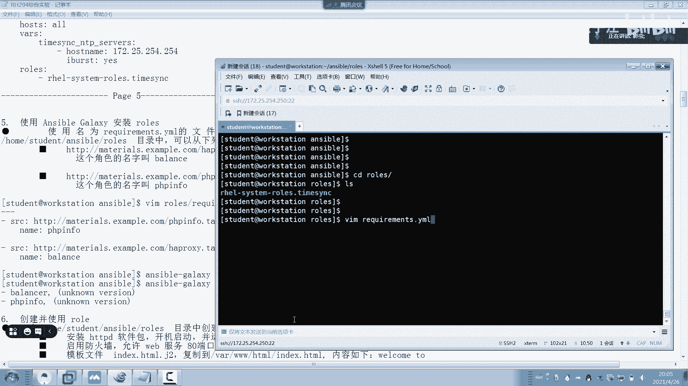
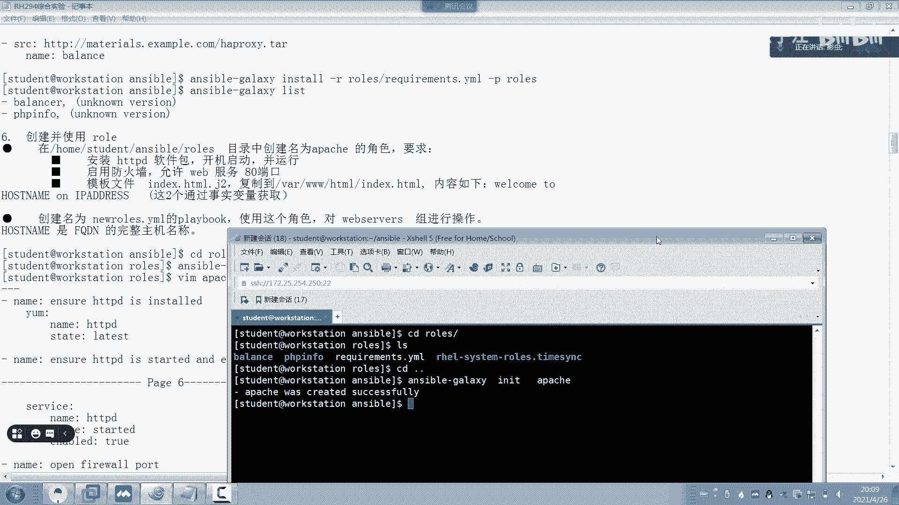
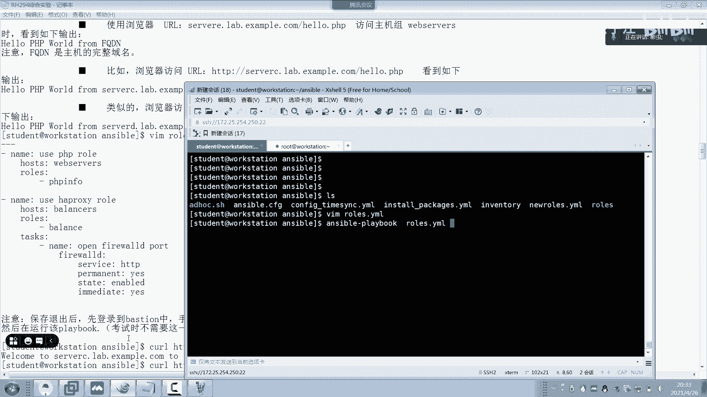
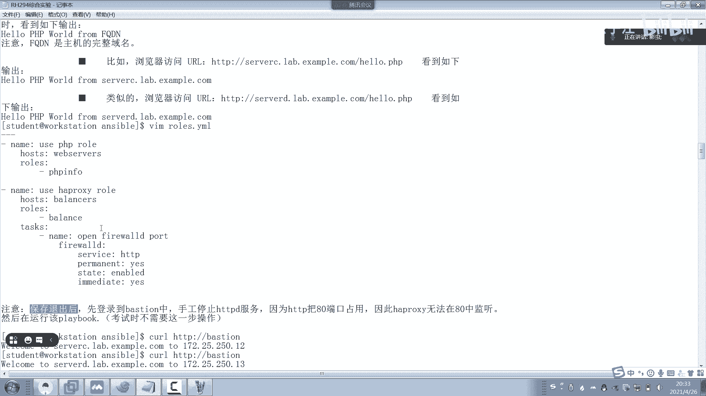

# 红帽认证系统工程师RHCE8-滕老师出品 - P24：RHCE8考前辅导（1） - KNBIT认证中心 - BV1up4y1h7MA

开始今天晚上我们来讲一下r 12294的考前辅导啊，我们分两个晚上来讲，那么首先跟大家说一下294的考试是全中文啊，三四个小时考试300分，满分210，通过考试过程当中不能作弊，同时呢必须拿身份证。

那我们来看一下这次考试的题目，这次考试的题目呢我们会用到这么多的节点，当然了，这只是模拟的，也就是未来我们在真实参加考试的同学，要注意是不叫workstation。

也不叫server a server b它叫什么呢，叫我也不知道，哈哈讲no te 1 note 2应该是我如果没记错的话，但他会告诉你哪些机器是控制节点，哪些个机器是被控节点，他会告诉你的啊。

不是瞎猜的，这是第一点，第二点，所有机器当中的ssh免密钥都已经帮助大家做好了啊，都已经帮大家做好，所以大家不用去担心我是不是要自己做免密药那个东西啊，啊不用担心啊，不用做。

同时呢所有节点都已经放在桌面当中，需要用图标双击下桌面，然后就会弹出来我们的虚拟机，也就是咱们正式考试的时候呢，是在一台物理机当中里面的虚拟机去做题，那么物理机是一台linux，不是windows啊。

各位不是咱们这个上课的这种用workstation去做的啊，不是啊，再说一遍，说白了你们正式考试是这样的一个拓扑啊。

我们瞅一眼啊，正式考试的时候是一台linux。

比如说咱们考试机啊，比如说这是咱们的考试机，那么这台考试机本身就是一台linux，懂吧，它本身就是台linux，比如说是一个r h r h e l8 好吧，还是一八，然后里面有很多台虚拟机啊。

比如说12345 600，比比如说六台虚拟机好吧，你是在六台虚拟机里面去做题，懂了吧啊千万要注意啊。

那么密码呢都会给你啊，都会给你就行了，那么每个人的机器号码是不一样的，比如说我们是一到15台，那就是读慢一动漫二，读慢三，一直到读卖15啊，每个人机器号码是不一样的，是为了防止作弊好了。

那么考题呢是给一个图形界面的一个图标，双击一下，咱们题目就出来了，有点类似于一个桌面上的一个图标，点开它就是一个pdf一样式的，或者是像网页一样式的一个题目，懂了吗啊，所以大家一定要注意。

不是给你的纸质题目，桌面上会给你一个烟草纸，烟草纸可以写一写，画一画，但是考试走走了之后，绝对不可以把烟草纸拿走，绝对不可以，不然他会觉得你作弊，如果考试过程当中不会的同学啊，尽量去卖一下。

或者是dock一下，cc，不会的时候就卖c e，不会的时候就enable dog啊，不要作弊，同时呢还有一点就是如果真的不会了，也不要放弃考试，一定要坚持下来，把题目尽量的用脑子背下来。

回到家就赶快写在你的纸上，然后等到等到下次补考，所以大家不要觉得我不会了，放弃走了吧啊，那就很傻啊，这样做，因为你可以回家之后再整理一下。

ok开始讲课题，那么考虑到刚刚讲过有这么多的东西，那么你们回家自己在做之前呢，先把台reset一下，for reset一下干了，我已经做过了，就不做了，因为太慢了，你们每次做之前就for赛下。

相当于重置到所有的最初的环境好，我们来看一下这个考题，考题当中当中workstation呢是我的被控控制节点，其他机器都是被控节点，那么同时咱们考试的时候会有五台机器。

那么咱们的环境当中呢就有a b c d，那怎么办呢，咱们把这个boston这个机器来来充当第五个节点，听懂了吗，同学们，就当时考试我们会有五个节点。

但咱们现在的练习环境呢就有server a到server d，但是咱们呢可以把这个boston这个机器充当到第五台机器，好吧好，那么下面这一堆是我给大家写的注意事项，我来给大家念一下。

首先所有的考试必须使用非管理员来操作，比如说咱们这边的环境是用一个学生的身份来做，考试会告诉你啊，告诉你同学们考试的时候会告诉你，他说比如说使用一个命运a叫a b c用户啊，你一定要用a b c。

而绝对不能用管理员好，这这个事项听懂了吗，如果你用管理员考试白做了，做了多少分都不给分啊，我我我我以前给大家讲过原因，同时第二个他说了，所有的playbook都要放到这个目录下面。

那么很显然这个目录叫什么，同学们，这个目录是不是咱们的公，就咱们平时上课说的工作目录啊，或者叫当前目录啊，对不对，同学们，所以说你这个目录给我建起来怎么建，make dr好吧好。

必要的时候可以关闭防火墙和s1 linux啊，它是必要的时候对吧，再关好，接下来这一部分是我们要手工打的，但是考试不要你看我。

我已经给大家写的好啊，很清楚啊，是什么原因呢，就是学生啊，学生这个用户大家在咱们这个环境当中，学生那个用户已经被加入到这个组里面了，但是呢它在使用v i s u do的时候。

你会发现这个组当中这个带pass no password的这一行并没有用，所以说我们要打开no password这一行，把不带no password这一行给它禁用掉。

所以说这个时候相当于我们的学生就已经做好了vs由度和免疫药，所以说有两步咱们是考试不用做的，一个是免疫药，一个是vr s由度，但是在咱们今天上课环境，就咱们模拟环境呢这个v i s u度你还要做一下。

因为什么呢，因为这个前面的井号没有被去掉。

所以说咱们现在开始先做这一步啊，我带着大家来做，你们仔细看。

所有机器都做啊，比如像动作workstation，所有机器都做，都是重复性的工作，a s s t a t i n好，直接v i s u度，这一步考试不要做，再说一遍，考试不要做好，找到这个组。

大家看这个组，其中这个组当中把它注释一下，这行注释，把下面这一行no password这一行起开就可以了，保证退出退出来，然后再做第二个。

比如sera server b server c server d依次类推，好了吧，懂了我意思吧啊全打开啊，好同样no password这一行取消掉，但是不带no password这一行注释上同样退出。

在server b考试不要做啊，考试不要做，谁傻乎乎的在做这一步啊，那永远老师你凭什么把这个w h e e l这个组放开呢，因为学生这个用户在咱们这个上课环境当中已经被打开了，懂了吧。

已经不是已经被这个加进去了，也就是说学生已经被加入到这个组里面了，你可以看一下，看到了吗，已经加入到这个组里面了，看到了吗，学生明白吗，啊明白了吧，好，接下来sevd c，w h e l嗯。

同样还是注释起开，vr s u do同样起开，知道怎么搜索吧，直接搜一下就快了啊，这边那么还有一台机器呢叫bustion，对不对啊，还有叫busta b a s t l y，那么同样还是vr s u度。

同样w h e e l，这个w h e l翻译成中文叫轮子啊，就是那个车轮啊，轮胎对吧，ok结束了，那么所有机器都ok了，好吧，考试不要做啊。

好那么第一步呢还还有真实考试的过程当中，咱们是没有v r m的，如果你想用的话，要用亚明斯store v r m，注意啊，这一步要注意，如果你想用啊，我也建议大家一定要用，还有所有考试的时候呢。

做完之后，大家用for reset一下可以再做第二遍，第三遍，第四遍，明白了吗啊，就你考完试做完以后，你我想再做一遍for reset一下啊，嗯q就行了好，那么接下来我们来说一个什么事呢。

第一步叫安装ansible，从第一题开始讲起啊，我现在就想七题啊，或者讲到第八题讲完我们就下课啊，好第一题来看一下，他说要安装uncible，在哪安装呢，肯定在控制节点workstation当中去安装。

那么咱们先装一下吧对吧。

那怎么装呢，说过了考试当中不能用管理员，他说要用学生来登录，那我们就登录一下，啊呃呃呃呃workstation，好请注意，你看我们都可以直接聘通，你看了吗，为什么，因为他是做好了dns域名解析，懂了吧。

好，好装过了啊，考试可能没装，反正你现在装一下就行了，好第一题的第一小问做完了，第二小问大家来看，先做清单。

他说啊创建一个静态的清单，要求放到这个目录下面啊。

要求放到这个目录下面好，那我们去建立这个目录，这个目录就是我刚才讲的工作目录对吧，我们做一下，那么一旦建立好之后，请注意整个考试当中所有的playbook都放在这，言外之意就是整场考试做完之后。

你ios一下会发现这个目录里面有很多的playbook就对了，比如你现在有15题，就应该有15个play，不懂了吧，好进去进去，然后接下来我们来做一个叫做清单文件。

v e n t o r y em准文件，那么这个问文件如果你做不对，你你就不要再做了，因为后面的所有考题都是基于这一第一题的清单文件来做的，懂了吗，也就是说你其实啊各位总共有15题。

这15题是一道特别大的题目，你可以你可以这么理解啊，好了，那么我们来怎么做呢，首先第一个啊看一下他的要求啊，他说啊叫什么组dv这个组属于叫server a，然后test这个组呢有个用户有个机器叫sb。

那么这个p r o d这个组呢是server c和svd对吧，那么还有一个组呢叫pr，还有叫web web service，这个组它是什么子组是吧，什么谁的词组就pro看懂了吗，啊就结束了啊。

不还有个buston，忘了，还有个boston，boston是属于什么组呢，属于balance平衡，balance这个组啊叫bu，好做完了没错吧，别拼错啊，b a l a n c e r k。

那么接下来我们要创建一个清单的一个叫做清单文件，创建好了，接下来我们要开始创建cfg文件，那么再怎么创建呢，肯定在这下面的这个下面这个下面的有一个叫做mc bc f g配置文件，怎么写呢，defa。

d f a u l t s defaults，先写一下remote user吧，刚才讲过如梦的遇到，必须是学生对吧，学生，然后接着我们再来看有个叫做inventory，指向谁呢，home下面的学生。

下面的user，下面的in wintry，对吧，就你刚才不是在这建立的文锤吗。

好接下来还有特权，那特权怎么拼呢，我就不拼了，直接看答案吧，太多了，背不下来，这一块我肯定背不下来啊，所以我直接看答案来写了。

我说过，其实你们考试的时候可以不用看答案的，是不是直接跑到默认的配置文件里面去找到下，把它干嘛复制进来就行了对吧，p r r v r l e t1 e s c a l a t i v好。

become等于yes，然后呢become这个叫什么，这个总监m e t a首位就是叫叫叫方式对吧，user等于管理员，become ask pass等于no，为什么是no呢。

因为我们刚才在v i s u度当中已经做好了对吧，因为我们刚才用v s由度已经做好了对吧，那么v i so度呢是这个，v r s you do是那个什么。

是这个，诶我没录屏吗，确定没有录屏吗，录了录了我也没录屏了，好继续好，那么保存的书就可以了，好那这一题基本上就做完了，那怎么测试呢，ensable先看一下版本号，那么看版本的目的是看它的配置文件。

对不对对吧，对的配置文件对的，接下来我们就要用enable，比如or钢管list host，能够出现这一堆机器也说明是对了，当然你也可以看具体某个组，比如说哪个组呢，咱们是不是有个叫做test组。

对吧啊，但是不是还有一个叫第一位数对吧，我就不再测试了，明白了吗，明白了吗，一个一个来做测试就可以了，好这是第一题，听懂的，打个一，这位同学已经帮别人都都打了，ok第一题如果不做，你后面就不用做了啊。

继续第二题，第二题同样是做亚马云。

那同学们我们来看一下亚美元，你看他题目，他说创建一个亚美元，但它怎么创建呢，需要你用一个脚本来创建，大家知道什么叫a d hot吗，a d翻译成中文就是命令，ad hoc翻译成直白的。

直白的翻译成中文就是命令的意思，它相当于让你做一个shell脚本，然后把要做的东西写成是要脚本，就按道理应该我们用playbook来做了，但他现在呢让你用脚本来做，懂我意思吧，让你用脚本来做，没有区别。

没有区别啊，让你用脚本来做，大家看仓库的名字有两个，一个叫做base，一个叫做stream对吧，那么同时呢仓库的描述信息，包括u i l路径都给你放好了。

包括g p g g p g这个这个这个这个king也给你写好了，那同样第二个叫stream也给你了，我们的什么ur路径也给你了，我们的king对吧，而且仓库一定是enable启用的，其实啊大家想过没有。

这个路径从哪来的，不就是classroom吗对吧，这个content就是classroom，明白吗，好那怎么做呢，他要求我们用脚本来做，各位，所以你要直接用vr编辑器写个脚本，写在哪呢。

写在后面下面的student，下面的answer for，下面有个名字叫ad hoc s h。

注意脚本的名字告诉你了，就不能随便起啊，那么我们直接在这个地方减去a ad hoc。s h，脚本一般都是怎么写呢，肯定是这个呗，对吧啊，这样写好，我们开始了encible，你要给哪个机器啊。

给om是什么意思啊，m是模块，什么模块呢，当我们使用这个ym repository，repository这个模块杠a是参数，什么参数呢，里面可以写一堆东西了啊，比如说name等于什么。

第一个参数叫i是什么，294下面的base。

base，然后还有什么啊，算了我就懒了啊，我直接粘贴了，各位，我直接粘了，我来粘完之后给你们解释啊，粘完之后给你们别随便扎，你们得好好自己敲啊。

各位同学，你们别偷懒啊，你现在粘习惯了，考试谁给你占来，我站出来啊，我给大家解释一下，很显然现在有两个仓库，这个name呢就是我们仓库的这个这个这个名称。

然后紧接着呢我们来说这个description就是描述你从哪看到描述的。

你看题目当中不说说了吗。

描述信息对吧，然后紧接着呢还有一个叫做base url，就是我们真正的那个路径，然后这边呢g p g check是yes，因为有了g p g check是yes，才有了后面的king。

才有了后面的king，那么这个fell是代表什么呢，各位这个fil就代表最终生成出来那个文件叫做i是1922，194base，同样第二个也要再做一遍，一模一样的，我就不再讲了啊，一模一样好吧。

然后保存退出，注意这个脚本你想运行要给他什么权限，给他一个x权限就行了，a ad hoc好运行一下，直接运行，别拼错啊，我我记得我当时考试这题我捣鼓了半天，因为我拼错了哈哈捣鼓了半天好，ok成功了。

那你说你怎么知道成功了，随便我们登录到一台机器，比如我们登录到sora或者sc，大家来看跑到这个下面这个下面，你是不是应该有一个叫294stream和一个叫294贝斯啊。

对不对，好这题听懂的，打一。

我答案当中给你们写的非常清晰啊，看x选项好吧，ok过了这一题啊啊当然我是被我是比较懒啊，我就不想写了，那你们别偷懒啊，各位是不是好，第三题很好玩，第三题能不能成功，完完全全取决于第二题，你有没有做成功。

因为要安装软件了，好第三题来看一下，他说请建立一个叫install packages y m l的这样一个playbook，注意只要考试当中出现了playbook的名字，你就不可以随便起啊。

你不能随便起个叫abc啊。

明白吗，好再拿起，可以在这边还是在那个目录看了吗，还是在那个目录建立一个叫in 4道下划线，派给这四点y l好。

来看一下题目，他说在d v test和p r o d这个组当中安装p 10 p和数据库，但是在dv组当中安装这个包组，注意这是一个软件包的组，怎么装，是不是前面加一个这个符号代表组啊，对不对，好。

第三在dv组的主机升级所有软件包，什么叫升级，谁还记得就是我们的lutist对吧，lattick开始做了啊，ok这题有很多的做法，像我这种做法是被笨的办法，各位同学，这我现在写的这个办法是最笨的啊。

那我们就用这个最笨的办法好吧。

其实有很多比较不错的解法，那我就这么写呗，对不对啊，咱们就install啊，随便起名的名字无所谓，how host在dv下面，逗号test下面逗号p r o d下面，然后什么任务呢，第一个任务装什么。

在这三个人当中装p 10 p和mary db啊。

同志们找mary db啊，简写吧好压，咱们可以用变量喽，item，t h b a拍马屁对吧啊，不是拍马屁，那是拍马屁，是p m p是吧，好，然后是这个m a r r a d b k第二个再做一个注意。

这是一个play book，当中包含多个play吧，你看这是一个play吧，那下面我要开始做第二个play，看到没有，第二个play啊，第二play是谁啊，哪台机器啊。

是dv的机器，看到吗，他不是说了吗，d e v这个组看到d e v别错了。

同学们tk干嘛再来一遍对吧，其实没什么难度啊，直接来了个tos吧，好注意，这个我们要叫什么名字呢，叫ym这个名字叫什么呢，注意要加这个符号，因为它是一个组，所以加双引号。

加这个d e大写的d e v e l o p m n t空格，tooth u有空格，所以要加一个什么双引号，d e v e l o p m，好状态是提供，对吧，第三个在dv这个组升级所有软件包。

再来一个play，相当于这一个playbook当中有三个play对吧，比如咱们直接起名叫阿d是吧，好哪台机器啊，dv这个组，然后干嘛升级对吧，升级是，那咱们就直接升级吧，好然后名字呢ym升级所有软件包。

所有软件包怎么代替呢，星号啊，状态呢artist简单吧，ok开始s4 的横线playbook走，你如果想看过程的话，加个小写的v，当然你可以不加，可以不加。

哇这么多内容对吧等吧，这一步会很长，各位可以去喝个水了，这一步很长啊，因为他装包挺多的，因为他这个组嘛，对不对，development tooth开发组，开发，development，好结束了，对不对。

这一章就结束了，这题也就结束了，听懂了，打个一，我先打，ok这题结束了，听见了吗，那你说老师有没有比较好的办法，有啊，你说老师我能不能这样的，我这边写个or可以不。

我这边写or然后呢我用when判断句对啊，当主机是dv的时候怎么样，当主机是test的时候怎么样，当主机是p r o d的时候怎么样对吧，这样也可以做啊，用when语句，那这样我就这样做了。

我这样做是比较笨的办法对吧，但比较直观是吧，比较直观，好了，同志们，咱们继续啊，第四题哎呦，第四题开始来做角色了，同志们，角色嗯，来各位嗯，他说啊，他说啥，他说你要给我装一个红帽的角色。

然后咱们要干嘛配置时间同步诶，上节课我们说过做时间同步是不是要用红帽给我们提供的那个角色，那红帽既然提供的角色，那是不是要装那个包啊，对吧好，他说在所有主机上都要都要同步，所以你主要写二。

你呢还得给我同步的主机同步神同步到172。2，5。254。54，说白了就是classroom。

第四呢你要给我开启一个快速同步，ok那么第一步先装包啊，装帮你就得用速度了对吧，因为你不是管理员吗，你现在是学生，所以速度报名还记得不，各位报名还记得吗，叫r h e l system下面的rose吧。

果然是好，做完了做完之后老师怎么办呢，我们是不是可以看一下angalaxy list，诶，发现不对啊，虽然你列出来了，但是不对，你看下面有个warming警告，为什么呢，他说了。

在这个目录下面找不到你的角色，所以说我们想过想，想象一下，是不是我们还要自己写一个角色路径呀，所以在哪写啊，是不是在我们这里边要写一个角色路径呀，对吧，明白了吗啊，叫肉surpass。

还要肉pass还是rose pass啊。

忘了看答案，rose path对吧，好rose pass啊。

没拼错啊，好接着路径是谁呢，路径就干脆就咱们这个吧，下面的enable，下面的rose，注意了，那你这个有吗，没有啊，没有你的建立啊，对不对，你没有这个路径啊，所以你建立一下那个dr rose，懂了吗。

然后你进到这里面，你看这样才对对吧，这样才对，然后我们再来看一下，这样再重新的galaxy一下，有了吧啊啊进去吧，先到这里再get了c，嗯对的啊，这是对的好。

那接下来我们来开始做题了，怎么做，同志们怎么做，你第一步是不是要做一件事，要把它拷贝一下，你看我第一步要拷贝一下，大家知道为什么要拷贝吗，你看这是他自己原始的目录对吧，原始的目录。

但是呢你刚才不是指向的是home下面的学生，下面的安宝，下面的rose吗，所以说你要拷贝到这个目录下面，再给我听懂了，给我回个一啊，因为很多同学听不懂这个为什么要拷贝，咱们做题的时候没有拷贝。

因为你的i c p c f g当中，你指向的是这个rose这个目录，所以说你要把你的原始的时间同步，这个角色考不到你的目录下面。

听懂了吗，来我来我来我做出来啊，各位usr shell，enable enable rose，下面大家看我先进去啊，我进去你看里面是不是有很多角色，其中把21l当中的时间同步拷贝到后面下面的学生。

下面的enable，下面的rose里面，听懂了吗，当然要加个r选项，因为这是个目录，所以要加个r选项，这一步听懂的，打个一，如果这一步你听不懂，你就你就后面就不会做了，啊一定要懂啊。

就是因为你指向了你刚才自己的目录，所以你要拷贝过来，懂了吧，那女儿老师，我们为什么第一次上课，我们昨天上次我们上课为什么不不拷贝呢，那是由于咱们当时acc b c f g文件里面指向的是什么。

它指向的是默认路径，所以不需要拷贝了，但咱们现在强行的把它放到这个目录下面，说你要拷贝过去，懂了吗，ok继续啊，别嫌啰嗦啊，继续继续推出来。

还是进到我们的后面，下面的学分，下面下面的对吧，进到在工作目录里面好，接下来我们就开始正式的写playbook啦，那么写什么playbook呢。

随便起了，它要求叫什么名字，他要求名字叫configure，configure，下划线，time sy，c。y m l好，那他要求叫这个名字吗，那咱们只能叫这个了，123。

那我们咱们比如说就叫做就叫做这个时间吧，好然后所有主机对吧，他说了嘛，所有主机是不是可以加打打个，这个也代表所有主机还记得吧，咱们是不是上课的时候说过，这个也代表所有主机好定义一个变量。

注意这个变量从哪来的，各位就这个变量从哪来的，这不是我猜的是不是读read me啊是吧，是不是可以读read me。

就是每一个角色不是都有自己的read me吗，对吧好啊，这样我还给你们看一眼吗，省得你待会就不知道从哪来的，在usr下面的12下面，assb下面的这个里面有一个这个里面有一个这个里面有read me。

看到吗，每个都有个read me，read me，里面里面有一个叫ki，就这个看到了吗，懂了吧，所以不是我猜的啊，不是我们瞎猜的，n tp s e r v i s，注意是service啊。

有s host name谁啊，就是我们的172。25。254。254啊对吧，还有这个阿b u r s，大家知道172。25。254。254是谁吗，就是那个class那台机器啊啊就class好了。

那么最后我们再把rose写上去，你当然要roll了rose ror o l s哪个rose啊，就是那个这个家伙还是一样，当然你可以不用横线啊，因为就自己可以不用好。

然后是s y s t e m下面的rose，点time s y n c ok保存退出，开始运行，第二行，第三列，第二行的第三列，第二行，必须加那个吧，拷贝都拷贝必须拷贝啊，你还是没明白为什么要拷贝。

因为你我不说了吗，因为你的路径指向了你自己的，所以你要拷贝到你那个自己指向路径里面啊，果然要加啊，不好意思，得加横线啊。

各位同学，这个答案是对的啊，我没写横线要加的啊，好这题听懂，打一，我已经瞎了吗，我已经加了，所以说我指向了，我已经加了啊，加路径了，你都得加啊，各位每个人都得加啊，其实我也觉得不用加了个横向，很奇怪啊。

啊无所谓，反正这个不用纠结了，加一个吧，这个不纠结了好了，大家来看，那你问我怎么做对了，我随便跑一台机器，我随便跑一台机，比如跑到稍微a吧，让大家看这个位置哪个位置，大家看是不是多了这句话，172。

25。254。54，对了吧，哎这题就成功了好吧，好这题听懂了，打一啊，行好继续，这个不纠结不纠结，同意一下，加一个吧，好第五题，第五题简单简单的要死，注意第五题，你们之所以能成功。

就是我给大家写好了这两个角色，这两个角色是考试的原题，这个角色跟就第五题跟考试一模一样，一个字都不差，各位第五题跟考试一模一样，一个字都不差啊，这个里面的两个这个大包我也已经在网上给你们找到了。

而且已经给你模拟出来了，但网上里面有错误，各位网上里面那个题目有错误，所以我已经把这个里面的稍微有些参数我已经改好了，所以你们直接用就可以了，懂了吧啊，所以这个考试环境和这套考题。

几乎可以说是99%跟考试一模一样。

那个时候你要再不过你，真的是有点对不起啊，对不起党，对不起人民啊，真的是明白吗，真的是跟考试一模一样来搞起来啊，他说啥，他说啊，你必须要用galaxy给我安装一个rose。

但是呢你不能随便给我galaxy啊，为啥呢，因为他说你要给我用一个requirements的文件下载诶，这叫什么请求文件对吧，也就是说你要把请求文件给我写好，通过请求文件给我装rose对吧。

同志们，那问题是这个情形文件怎么写呢，我们以前讲过，所以说刚才上面那一题是不是建了一个叫rose这个目录，这个目录要用到了啊，怎么建呢，叫requirements对吧，r e q u r e，别拼错了。

这个单词绝对不能拼错，好他说啥，这两个角色，这两个角色都要通过这个路径下载和通过这个路径下载，而且名字要变成这个和变成这个，懂了吗，好那你看这两个东西从哪来的。

大家知道什么叫material examination com吗，啊其实就是我们的foundation 0，注意这个materials就是我们foundation 0，如果大家做过课后习题的同学。

应该经常遇到这个material examination com这个路径吧，那么为什么我们放在这儿呢，因为这个路径是经常在我们这个环境当中经常放文件的地方，但在正式考试的时候肯定不是这个路径。

各位正式考试的时候，路径肯定是会变的，所以你们一定要自己知道啊。

好那我给大家写一下怎么写，s r c圆是http material，example come，下面的h1 py，大家知道什么是h1 proc，各位谁知道谁知道，打出来听过吗，balance。

注意你的角色的名字叫h process，但最终下载完之后重命名叫balance，懂了吧好，什么叫h process，谁知道就是那个谁的那个代理吧，负载均衡嘛对吧，是负载均衡吗，如果没记错对的。

走你你们的钱都给你们，还不过来，戳死我了，好名字是谁，名字叫菲律宾英爆，ok解决了，然后接着退到上级目录，一定要退到上级目录啊，然后我们再安装galaxy in store。

杠r指向requirements文件，杠p指向目录rose回车，这一题满分结束了，那老师你怎么知道满分哎，我get了一下list一下看了吗，你看为什么会有三个角色，第一个是刚才做过的。

第二个是balance，第三个是p h b for，那为什么可以成功，因为你在cfg文件里面已经指向了这个路径，所以成功懂了吧，所以你看这些题目是有连连贯性的，那为什么要指向pc。

因为为了做下面的第四题和第五题，懂了吗。

哎这是连贯性的啊，好这一题结束了吧，这一题这个角色就是送你分的，同志们，你只要别拼错，那你就别给我拼错就行了好吧，好听懂的打个一，同样没听懂的，直接在群里问，啊我我我，我们现在稍微稍等一下。

因为咱们今天就讲到第七题或者第八题就不讲了，就不讲了，然后咱们就不着急，不会同学现在就问，ok或者打一的同学啊，这次一定要一次性过啊，第六题第六题稍微有点难，为啥，因为第六题到第，第六题有点难。

第六题真的有点难啊，因为第六题是依靠于第五题的连贯性的，你看我们为什么要装h a pro c，为什么要装p h p，因为为了做第六题啊，所以第六题有点难啊，各位第六题真的有点难啊，来我们看一下。

他说在home下面的学生下面的这个目录下面新建一个阿帕奇这个角色，哎各位你有没有发现这个题目很有意思啊，你看在做时间同步这一题用的是什么，这题考你是什么，考点在哪，考点考点是使用红帽的角色对吧。

考点是红帽的角色，那么下面这一题的考点呢，第五题考点呢第五题考点是考你的galaxy，相当于从互联网下载一个，第六题考点考点的是自定义一个角色，是不是我们刚才讲第八章角色的时候，我说过这有总共有三题啊。

对吧好，我们来开始看啊，那怎么去创建一个阿帕奇角色呢，我们知道创建角色一定在哪，在肉丝里面去创建对吧，那当然我们要退出一下怎么办，应该这样做，get i r t对吧，然后呢咱们指向一个。

指向什么来着啊，指向一个叫阿帕奇就行了，回车。

啊错了错了错了错了错了错了错了，赶快删掉，快删掉，忘了得进去啊，再读一遍，ok你看看在rose目录下面就会多一个阿帕奇，进去之后会有一个目录结构对吧，会有个目录结构来开始做啊。

同学们，他说啥，你要给我干一件事，什么事呢，第一步装阿帕奇，第二步开启阿帕奇并运行，那接着给我做防火墙，把八零端口给我干嘛，放行，接着你要给我做一个模板，模板名字叫英desk html，添加to。

并且要把这个模板复制到vr 3 w html，下面内容是welcome to host name，on upper dress，注意host name和up pier dress，这是两个事实变量。

你看题目有点难啊，各位题目有点难啊，你来看，那么相当于这个角色要过做这样几件事情，第一件事情安装阿帕奇，第二件事情配置防火墙，第三件事情把金加特模板给我创建好，这就是我们今年新建的角色。

做完那个角色之后，给我新建一个叫做new rose的playbook，这个playbook当中去使用这个阿帕奇角色，并且这个角色针对谁呢，针对web service这个组来操作。

那我们来看一下web service这个组是哪台机器啊，同志们，推到上级，推到上级看一下影音，准没见，web service这个组是谁啊，就是p r o d这个组，那p r o d这个组是谁啊。

是server c和server d好，那你来分析一下最后是不是在server c和server d上面装阿帕奇呀，好这个听懂同学能听懂吗，答案自己写了，我我靠，我要要给你，咱们考什么，考我了个去。

你这个问题问得很纯粹啊，那我别打岔，我刚才问那个问题，其实这题目能读懂吗，我就怕大家读不懂题啊，光知道抄答案做没有用啊，要把答案读懂，意思就是说在server c和server d身上安装阿帕奇。

就是这一整大题的目的，听懂了吗。

好那继续啊，开始，那么大家如果懂的话，我们就开始，那我们知道这个角色在哪做啊，咱们先倒着做，怎么倒着做呢，你得先给我把模板做好好吧。

那么模板一般在哪呢，咱们都知道这个角色当中是不是有个叫template，是不是叫timate，你看是不是有个timate这个目录角色就在这里面，那名字叫什么呢，叫install啊。

叫index html，点进to get to金加兔好，那怎么写啊。

他说welcome welcome，怎么写，welcome，host name怎么做，同志们那个事实变成host name怎么做，是不是这样写，我现在怎么想哎，f q da就行对吧，f k对。

22什么放这个吧，address怎么拼，是不是enable that i p v4 ，就这样吧，我也忘了，看来忘了忘了忘了忘了，ok是的是的，我来对比一下，看有没有做错啊。

多写一个东西啊，没有这个feat，直接ip v4 就行了，然后i dandresses，写反了写反了写反了，大家其实在考试的时候，你可以不用去记，直接用set up把这个实时变量调出来，自己再看啊。

好这样就行了啊，嗯那么我们知道这个模板要写到哪，写到这里面对吧。

ok那接下来我要做一件事，第二件事就是开始真正的安装阿帕奇了，看到了真正开始安装阿帕奇和启动防火墙好，那这是两个主要的事情，那在哪做呢，肯定要在任务这里面，task在里面做，肯定在这里面做，懂了吗。

你要做真正的任务，要在这个角色当中的tasks目录里面做，里面自带了一个叫mean的东西，好开始，啊比如说叫安装阿帕奇吧，状态叫，第二件事呢，第二件事是不是要启动阿帕奇对吧，启动哪个单词啊。

然后able的注意啊，别忘了enable的好，还是不要打开防火墙啊，我来说一下，我得给大家写下来啊，整场考试当中，整场整整整整整场考试中，所有关于服务的题目默认都需要打开相，相关的端口。

但是题目不会告诉你啊，但题目不会告诉你，他会请把八零端口打开，不会告诉你的，你要想到，因为在去年我在无锡上课的时候，有一个学员为什么考试分数比较低，他就是每一题都没有打开防火墙，因为事件当中没写。

考题当中绝对不会告诉你，他就以为不需要，但是会发现很多题目都连不上，所以他分数很低，懂了吧，我今天把这句话给你写出来了，所以你要相关，但是我这一题给你们写出来了，把八零端口打开，考试不一定写。

你知道你要给我想到这一点，懂了吗，你只要发现什么阿帕奇了，ftp了啊。

这样的东西你就要把断口打开，懂了吧啊，不考f t p啊，不考好，那防火墙就open吧好那么防火墙这样式的吧，嗯方向怎么搞，方向怎么搞，防火墙怎么搞怎么搞怎么搞，不会不会不会不会，谁让你会，老师不会。

我们就dock啊，考试的时候一定要这样啊，同志们一定要倒退一下，打开一个窗口，dog as a dog，啊那我们用哪些呢，用哪些用哪些，用这几个可以吧，可以s d t可以，还有什么。

还有一个叫做这个是永久，这个单词叫永久，还有什么immediately，mediately怎么拼，就怎么拼的吧，immediately，immediately d r a t e d e r a t对。

ok木有了，没有了啊，然后呢这事结束了对吧，结束了跑了跑了，上级开始新建我们的playbook了，new ro啊。

new rose 4点y没有，你看他说了吗，建立playbook叫new rose playbook对吧。

然后紧接着打开123，给哪些机器用，咱们就叫做，比如说叫做呃deplo，你有rose吧，给哪个机器做哪个机器做，给web service机器做，做什么事，啥事也不用做了，走你们那叫什么。

咱们的叫阿帕奇吧，好开始运行。

断线了吗，断线了吗，断了断了断了断了掉线吗，哦哦我以为掉线了。

好没有少啊，为什么要少少了吗，哦爽了爽了，忘了做那个汤姆雷特对吧，对对对，忘了忘了忘了少了啊，忘了同志们忘了，我想想啊，忘做了，说着说着自己就忘了，那应该在哪做，那我们应该在在在在，我想在那做比较好。

那我们在哪做的比较好。

他是在打开八零端口之后做那行吧，那我们也打开八零端口之后做吧，题目还是很难的，你看做着做着自己就忘了金兔啊，e s t，ok对吧，其实后面这个东西你可以做啊，你可以可以不做，比如说这个mod。

比如说0644，随便你啊，这个他没有要求你就不做啊，他要如果没有要求就可以不做，那我这个你看我这个答案当中是怎么做的。

我是最后做完之后再剪切到timi的。

我是剪切过来的，但其实我这边就不用做了，因为我已经早就在hamlet里面已经干嘛了对吧，已已已经就是说那个写写进去了，明白了吗啊好那我们重来吧。

邦邦邦邦邦邦错了，open错了，肯定有单词拼错了对吧，这个单词p r e s n t对吧，肯定会拼错了，那怎么做，那肯定哪个地方错了，rose下面的阿帕奇，下面的。

思路一点再吃吃，啊啊啊，我想这个走你，呃得得得得得得cp又错了，哎呦喂，今儿怎么回事，cp怎么说呢，cp的位置是template e m p l a t e template，template。

template，the destination，we are in b，新加图文件错了错在哪，新加兔文件怎么做的，终于吃了，爸爸回来了，呃呃呃呃呃，金家兔肉啊，新疆兔怎么错的哦，default啊。

果然如此，卖的宝宝，就是卖的么，还，这种活力你想不想知道为啥就是没，好像你们家进门有没有卖10万十，ok成功了啊，同学们成功了成功了成功了成功了好了，成功了，那成功你怎么知道成功哎。

搞起来server c吧，svc sd吧对吧，成功了吗，成功了，成功了听懂的打个一。

来最后看一下我怎么写了很长，这个不用看对吧，那么首先我其实先进到阿帕奇，阿帕奇这个角色里面，然后呢就大概其实这题就改了两个东西，一个是tasks，还有一个是template。

template里面我写了啥呢，了个金加速模板，写个金加速模板，这个模板是固定的，必须这么写对吧，必须这么写，然后紧接着我就跑到tasks里面做了这几件事，哪件事啊，第一件事安装阿帕奇。

第二件事启动阿帕奇，第三件事打开八零端口，第四件事把那个金钱图模板给我搞过去，只不过刚才在打开八零端口的时候，我把这个单词写错了，应该写成enabled的，我写错了对吧，我写错了，明白了吗。

好那么就成功了，那成功之后你怎么测试呢，跑到最外头跑到最外头啊，随便你跑到哪都行，看一下这个路径，那如果在svc和svd当中能看到这句话，welcome to，看自己的主机名啊，自己的ip地址。

这是主机名on自己的ip地址，这不就是我们刚才写的那个新加兔模板里面的那个事时变量吗，听懂打一，有点难啊，这些题，所以这题如果你做不成功的，前提是由于你前面的题目没有做成功。

你比如说你前面那个阿帕奇都没做对，前面那个角上的题你就没有做对，那这题就不用做了，这三题是连贯的，同学们这三题的分值肯定非常高，虽然我们不知道多少分，但可以初步判断很高，所以大家一定要好好的做好。

那么同样不懂同学打出来告诉我哪个地方不懂。

这些题更难，我的天，第七题更难，咱们把它讲第一第七题讲完之后就不讲了，我不想讲，第八题，你自己自己看吧，就分区的题，行，我讲到第八，第八题我不讲了，第八题你们自己自己做，咱们留一题不讲。

这样能够拉开分数啊，那么来来来，第七刚才那个题还有谁不懂变量怎么dog dog变量怎么dock的。

哪有变量，你就适时变量是吧，那个胡晓波还是波是吧，事实变量这样，比如说比如说我想知道sara se事时变量就要用enable，注意杠m a server c杠m是模块，setup就行了，看一下看了吗。

那就是实时变量了吗，那我们找一下host name吧，刚才你不是看不懂吗，host name，host name，where is，hostname，你可以过滤对吧。

还记得上节课我们讲的过滤器filter过滤器对吧，你可以自己过滤一下啊，这就是发布版本哈，distribution发布好ipv 4呢，在上面马上要到到i p v4 了，应该是对其他同学有问题吗。

看看看看看看看看看，就是我们的ipv 4吧对吧，ipv 4好，那么其他同学还有什么问题啊，关于这一题好，那没有，我赶快讲下一题。

这一题很难，正好讲到下一题，九点差不多，这题很难，还记不记得我们刚刚装了一个装了两个，装了两个，装了两个变量，一个叫做hpc，一个叫做啥，p是p啊对吧，那么在第七题当中就要使用了，我们来看一下第七题。

一会来读一下，创建一个playbook，名字叫做rose。y ml要求是下面的第一个要求，playbook运行在balance这个组当中，来看一下balance是哪个组，我画个草图，这题必须画图。

不画图，你根本不知道我在讲什么。

同学们不要着急做这题啊，这题我会讲得非常慢。

非常细非常慢非常细，这题是原题，一点都没动。

我画个图啊，原体原体好，首先你告诉我balance是哪个组。

下班了，是哪个组，balancy是哪个。

是buston那个机器对吧，bas那机器好，我们画个图啊，这是boston那个，谢谢boston，boston，boston，它上面运行的一个叫做角色是什么角色呢，是一个ban角色。

它上面运行balance这个角色对吧，那么balance这个角色是谁呢，不就是刚才我们的h pro吗，那很显然我们就可以猜到这个机器是干嘛的，同学们言外之意就是个bus，这个机器是做什么呢。

做什么负载均衡，懂了言外只有一个80的机器在这里面就充当了负载均衡，继续看题来，快接着这个角色配置一个来自外部service主机上实现一个负载均衡，web service是谁啊。

不就是刚才那个service c和sd吗，server d吗，那是不是我们是不是可以理解为下面其实挂了两台机器，一个叫做server，一个叫做svd呀，然后如果有流量过来访问谁。

如果有一个流量过来访问这个boston，其实boston就会把流量分别给server c server d啊，这个top图能看懂吗，d懂了吧，这题就考你这个了，懂了吗，同学们听懂给我回个一。

好然后你看啊，当你使用浏览器，当你使用浏览器啊，当你使用浏览器，我想想它这个有点问题啊，当你使用浏览器访问boston lab examination com的时候，其实就会看到这样一句话。

再刷新一遍呢，就会看到下面这句话，懂了吗，就这个意思好吧，就这个意思就是这个意思，剩下都可以不看了，都是废话，一个意思，懂了吧，叫负载均衡。

什么叫负载均衡，121212，这叫负载均衡，懂了吗，比如我现在有十个流量，前五个给你，后五个给我给我，当然不是前五个，后五个是穿插的对吧，穿插的懂了吧，这就考你这一题，考你这一题啊，好来来来开始。

不要嫌烦啊，同志们，你不懂的话，你光背答案是绝对不行的，好开整。

那ok ok ok起个名字叫什么叫什么。

它要求什么叫肉丝，开整啊，就叫pvp roll是吧，web service，这个机器什么时，哪个角色啊，同学们，balance是吧。

还有哪台机器啊，我忘了那个七七来着。

给我这个机器号都忘了，写反了写反了写反了，是不是还有机器啊，这个是哪一台机器，是不是那个叫b l a n c，也就是说白了就是bustard，嗯然后呢这边是什么角色，bl a a b l a c e。

注意这边一定要别忘了，放心防火墙它没有写，但你自个儿写好吧，放心防火墙忘了，他没有写，但你自己要想到这件事，说白了直接就泡他吧。

tcp port啊。

下面这一堆呢啊，自己写一堆，怎么怎么怎么这样想，我在这里放下啊，啊嗯。

那么按道理考试的时候做到这儿完之后就可以成功了，懂了吧，就可以成功了，你看直接跑就行了，但咱们这边有一个问题，来来我再说一遍。

我已经把注意事项给你们写起来了，当你保存好退出后。

用ssh注意，按道理考试直接开始运行play不就可以了，但现在别啊，现在先别先给我跑到boston这个机器当中，为什么当中运行。

谁告诉我boston来看图，boston是不是运行balance这个角色，说白了就是那个h a process好占用八零接口，h a process它会监听到八零接口。

但是我们的bus那个机器当中已经启动了一个叫阿帕奇，阿帕奇也是八点多万口，hpc不会运行成功，所以说你这个角色永远都不会成功。

为了能够成功地模拟咱们这个题目，所以你要先给我进入到巴斯坦当中跳板机当中。

先把这个给我关了，注意考试没有这一步啊，考试没有，先给我关掉，当然了，你还要disable一下，就永远都关，没有啊，再说一遍好，然后你再退出来再运行这个playbook就可以成功了，听懂了给我打个一。

这个不是必要的，但咱们这个是必要的，考试不要考试，不要这个是个问题，因为我刚才发现了，我们以前在上课时候发现了个事了，所以我给大家关一下。

你会发现哎我第一次做的时候，我就没发现他怎么老是运行不成功呢，我是不是写错了，不是的，当你看日志，我也是通过日志发现的，他说巴斯坦的八零端口被占用了。

就这句话，所以说我我就给你们讲就行了啊，比如说我应该对吧，我应该占八零，但是呢没想到八零被别人占了，我得先把他干掉对吧，就这个意思啊，同学们。

刚才我们在做上一题的时候，咱们是不是直接用手工的方式访问server c和手工的方式访问server d啊，现在我们不用了，现在我们直接访问buston的机器。

它就会自动的把流量分到sc和svd了，做这一题的意思啊，好我们看一下对不对，好成功了好，来访问一下访问谁告诉我访问谁访问谁，我知道访问谁说出来访问谁，看再回车回车回车回车回车回车，没有负载均衡。

一会12，一会13，一会12 13，当然你还可以访问ph p啊。

下面还有个p h p题目方位，我看看。

我不想问了行吗，可以啊，可以不放，哈喽啊，有吧有吧有吧有吧，有server c有吗，上面d4 c4 d，但是老师这个p h d我没写啊，会的，因为角色里面是不是已经给你写好菲律宾了，懂了吗。

你当然不会写菲律宾了，我也不会啊，咱们不是学菲律宾啊，哎这就是满分。

这个题跟考试题目一模一样，我可以负责任告诉大家，如果大家考试的时候，从这一题，从第四题的角色就时间的一个角色，这题的角色45674题，如果都拿到满分，你考试肯定是过的。

你的4567这几题如果都是拿到满分，你的考试肯定是过的，因为这一题这几题肯定分值特别高，肯定分值特别高，当然了，你下面你也得做啊，你不是说做这几题下面就不做了，你肯定是过的，同志们，你肯定是过的啊。

好吧好，那么第八题，不过我不讲，自己看自己看看你能搞出来搞搞起来吧，为什么呢，第八题是这样的，同学们，第八题呢，我写了两题，一个是磁盘分区，还有一个是lvm，考试的时候只考在其中一个，我就不想讲了。

太多了，他那个巴拉巴拉巴拉一堆啊，太多了，考试只考其中一个啊，偶尔考磁盘分区，偶尔就考lvm，这两个它会随机选一个，我们用这个题目给大家拉拉出来这个距离啊，你们自己去讲，那么我们今天晚上再讲一下第九题。

把第五题讲完，今天就结束了，第九题是这个样子的，如果你要给我下载一个host的文件，不是你给我下载一个host点金加to的文件来啊，下载到哪儿啊，下到这儿下下下来啊。

该模板的内容要与etc下面的host相同，格式如下，就是etc hosts的格式吧，左边是主机名，不是左边是r p，中间是主机名，后面最后一个是短主机名，看到吗，你看不是ip地址，中间是长主机名。

最后一个是短主机名，也就是说你要给我编写一个肩胛兔的模板，我我我如果说让你下载的就是让你下载，如果下载完之后要改的一定是改考试，一定是下载完之后改，不可能让你，你不可能不考了啊，再说一遍。

模板一定是最后的结果是先是左边ip地址，中间是主机名啊，中间是主机名，最后是短主机名，主界面注意生成的顺序无所谓，不是说一定是a b c d e没有这个顺序啊，当然这边不应该是e啊，这边应该是bu。

but没有e啊，咱们只是模拟器，明白了顺序无所谓，但是你一定要有，左边是rp地址，中间是长主机名，最后一个是短主机名。

我下载一下啊，怎么下呢，第一步下下东西。

我就we get呗，terrori。

我给你们写好了，注意你们考试的时候没有给你写好啊，你先考试下来之后，里面是错的，是空的，但我现在给你们写好了，你看写好了，看到吗，考试的时候就有前面这两行。

就这白色的这两行后面从for开始到这儿是没有的，你自己写c写，好吧，干嘛呢，来看一下for循环是干嘛的，是不是摘抄，有一个叫or的主机组干嘛，这一步是不是常主机名，看，不这不是ip地址吧，ip地址。

最后一波短，按主题名吧啊。

懂了同学们，我再说一遍啊，for循环，for循环是分别去找出主机当中所有主机当中的什么ip地址，主机名fq对线是常主机名，最后是post name，短主机名啊，这都没有啊，再说一遍，这边没有考试都没有。

或者说考试的时候有是错的。

你得给我改，但好像是没有，不是错的，就是自己写的啊，当时我考试就没写出来啊。

我当时考试就没写出来，死活写不出来啊，然后接着注意开始了啊，开始了啊，我我我比如说写完了怎么办，写完怎么办，各位。

边写呗，不说了吗，要你编写一个host，在y ml对吧，编呗。

谁给所有主机啊，他们说了所有主机啊对吧，所以说就比如说咱们就叫创建etc下面的host，my host吧，对吧，我好，然后呢，干嘛呢，主机啊，主机注意你这边写or吧。

看你这边写二，你的这个for循环在里面就必须是二，这个是一一对应的，比如你这边写的是dv，你这边就写dv，懂了吧，好很简单。

关键是你能不能写出来这个for其他都很简单，就是他们，下面的我是不是下到这了，到这儿，然后拷贝到哪，出现了my host吗，对吧，它不要求考不到这儿吗，对不对，题目当中要求的，然后呢注意这是啥意思。

为什么要加个when呢，啊这个断句吧，当inventory当中的hostname在这个group里面。

哪个group，嗯，我想想啊，为什么要写这个，因为题目当中是不是要求值给谁做的到吗，这个dv做的，那你老师，那我这边写dv不就行了吗，很多同学会有很多同学会有这个疑问啊，那我这边直接写个dv不得了吗。

这边好，那如果你写dv。

你这边写or你会发现你每次运行的时候，他直接告诉你说变量不可用，主机不可不可用，呃大概是这个意思吧，为啥因为你这边写着all，但是你的host里面写的是d v，它就不匹配了，所以为了匹配我才写了all。

但是咱们题目当中呢又说了不能用哦，因为他给谁做啊，他dv这个机器做的这个组做的，所以你要加加再加一个判断句，winter host name，这个是固定的语法格式。

这个单词是固定的，明白吗，听懂了，给我打个一啊，理解了吗，所以你必须要加个这句话好结束了，然后直接运行它就可以了，直接运行可以了，晕完之后，那运完不要建立，这边哪来比外汇数。

develop develop用户，这个用户，错了错了错了，这肯定是拼错了，肯定是s t u n d e t吧，错的啊，还有好多是错的，它不是错的，是因为每个考每个培训机构老师写的题目不一样嘛。

培训机构老师写的就是那个那个那个叫什么来着，那个叫叫叫叫adios这个用户，而我用的是学生的用户，明白吗，所以他的家目录不一样，听懂了吗，都写上，好懂我意思吧，不是这个建立啊，不用建立。

你看他有些题目不一样，不一样，题目没懂了吧，题目不一样啊，也就是说其实咱们电脑当中还有这个用户。

你看你看咱们电脑当中也有这个第1o p s，你看也有这个用户，只不过他用这个用户来做题，我呢是用学生用户来做题，所以他这个位置有错误，那我们这个脚本怎么做的，新加特怎么做的。

v组是哪个用机器，大家知道吗，dv组是哪个机器啊。

这是sva啊，好像是，那我们跑到sa里面看我们跑到sa里面看对不对，建立一个叫my host，name host，你看里面的东西对不对，看左边ip地址，右边是主机名。

后面是短主机名，这题听懂的，打击。

