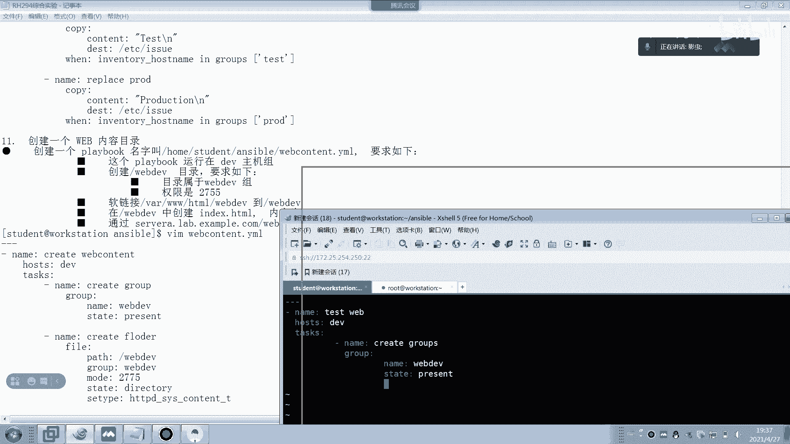

# 红帽认证系统工程师RHCE8-滕老师出品 - P25：RHCE8考前辅导（2） - KNBIT认证中心 - BV1up4y1h7MA

现在呢我换了一个录屏软件，这个录屏软件有点大，但是那个录屏软件很专业啊，那接下来我们来讲一下安伯的后面的几题啊。

这个看一下昨天讲刚才讲到哪儿开始讲实体，那么别忘了昨天在讲那个for循环的时候，我说过这地方一定是all，那么如果这边是or的话，那你的host是也一定是or，当然了，它的考题是用的d e v这个组。

所以说你要再加一个问语，才能针对dv来做，那么如果你没有加问一句的话，那这个考题是一分不给的，为什么，因为你给所有机器来做好，那么接下来我讲第十题，咱们今天把这些讲完，下课啊。

那么这也是我们本次的rc的最后一最后一个晚上的课程，好，我们来读一下题目，他说要创建一个playbook，名字叫做facial。y m l啊，一首事件，那么这个时候的主要目的是为了修改这个里面的内容。

但要求如下，首先在dv主机组上单行显示的内容为development，在test主机组上单行显示的内容为test，注意这边的dt包括这个p都是大写的，那么未来我们在考试的时候，如果他真的也是大写的。

你就必须大写，懂了吗，就比如人家唉这边小写的p，那你就写成小写明白了吗，这个一定要看题啊，不能随便我们随便写啊，这种东西都是要扣分的啊，好那么这一题他说是单行显示，说白了我们肯定要用哪个啊。

这不我们要修改啊对吧，我们就要修改它，那怎么修改呢，我们你看我这个答案当中，他这个使用的诶啥意思啊，看来啊他用的是cbk，他用的copy行不行啊，可以啊，copy也可以啊啊当然了除了用cb。

还有还可以用什么，大家想象一下能不能用lying f对吧，没有固定答案啊，同志们，那么他既然说了嘛，可以单独显示。

可以lying fall对吧，ok我们开始，那么很显然是昨天做的所有的playbook和脚本对吧。

那么今天我们继续还是在这个位置下面，你这边题目错了，这边应该就是s t懂了吗，s t d u n t，所以这边呢就是a手就可以了啊。

那么我们写一个a h a r s s u y ml，那么我们来看一下123啊，比如说我们就随便写吧，就叫做比如说嗯e e v e l o p两命题随便写啊，那么他用copy。

那么我们来试一下copy怎么写呢，首先这是写的内容对吧，什么内容呢，他说大写的d e v e l o t m e n t，然后注意这个斜线是什么意思啊，这个斜线杠n代表回车啊，换行换行吧。

别别不是回车换行好，这个时候呢我们给谁呢，是给这台机器当中的etc下面的a手这个文件来做，所以说death deaddest就是写目标吗，写的是这个文件好，那么我要加一个问一句，为什么要加问一句呢。

因为你的哎呦，错了错了错了错了，不好意思啊，忘少个东西啊，好task好，哦错完了啊，咱们就写就写什么特性随便吧，就比如说test test test吧，好然后这边就写第一个ky啊，这样子对吧，我错了啊。

要忘了写了好，那接下来我们就要写问语句了，问一句当然要跟copy对齐了对吧，when一定要跟copy对齐，什么问呢，就inventory，这个是固定的，有语法对吧，我们在上课的时候说过多少遍了。

这是固定的语法，in group啊，group谁呀，e e v好，那接下来再做第二个任务，第二任务是什么呢，比如说，呃随便写吧，这样写吧好那么同样呢我们用aa，这又还是有问题，哎呀怎么错呢，对吧。

这样对齐啊，好那这边呢还是用拷贝吧，然后这边呢写c o n t n t嗯，写什么内容，嗯对吧，然后这边目标是谁啊，还是etc下面的h对吧，然后做时间呢我们写一个问题行了啊，很简单吧，那么写就可以了。

明白吗，当然你要有别的办法，你也可以做，比如比如说大家老说我有新的不错的想法，能不能做，只要能实现都对它没有固定的答案，明白吗，哎所以说如果你自己在写的时候发现有比较好的做法也行啊，没有固定答案啊。

还写什么，比如说写的，要生产是吧，这个单词啊，二小时我想想错了，pci，同样还是问问什么呢，问inventory，hostname，in groups，在s啊，别忘了是groups，别忘了s啊。

那个带哪个家伙gr o d就可以了，那么我们去验证一下，待会儿啊，为什么会跳过啊，很显然我一定要跳过啊，因为他的机器是dv啊，对吧好，那我们现在跑到dv里面，d v是谁啊，sa sa属于dv对吧。

昨天我们就做题看到那我们只看一下sa，如果sa里面的a手里面应该是有东西的吧，大家看对不对，environment对吧，这一题听懂的，打个一，好把答案截个图给你，简单吧，这一题啊送分题啊。

你也可以像我这样用in啊，mr in group groups啊，in groups啊。

同志们别忘了s啊，别忘了s好，第十题，过11题，他说啊创建一个外部，他说创建一个playbook，名字叫做这么长对吧，这么长叫web content content。

y ml要求这个playbook运行在dv这个身上哦，又到dv了啊，大家你会发现题目当中好多人特别喜欢，所以啊并且要求要创建一个叫web dv的目录，创建一个web地位目录。

很显然大家想象一下创建目录是不是用哪个哪个单词fail啊对吧，然后呢要求目录的数组是它权限是它，那么很显然我们是不是要先创建一个组啊，是不是没有组，那创建组是哪个单词group吧。

这group这个模块对吧，group的模块，然后他说做一个软链接，把这个东西练到这个当中，那也言外之就是vr 3 w html web dv是不存在的，这个软连接真实指向谁，真实指向web dv。

懂大家这个懂了吗，就是web d e v是真的，但它练到那就是谁来练它呢，v r3 w html来练它懂了言外之意，vr 3 w html的web dv是个假的，链到真实的是跟下面的，接着我们再来看。

并且呢在这下面要创建一个页面，页面内容叫development开发要开发吧，明白了吗，还部署部署不是开发部署，明白了吗，并且通过待会儿看那个看那个家伙。

待会看那个路径能够看到里面的内容叫development就对了，好这个题目能听懂吗，那么我们来分析一下，首先你要先创建一个组，你虽然说第一步是创建目录，但是你要先创建组，然后要把目录创建完之后。

属于这个组。

我用懂懂了吗，同志们，所以我们来看一下啊，ok哎呀，我们做一下啊，叫做web content content，点外没有对吧。

他要求吗，叫web content点亮没好，123，那么咱们叫name，咱们就叫测试吧，我比较喜欢用这个单词啊，这个比较简单啊，测试测试好吧，web好，那么谁啊，哪个主机，他说的d v的吧。

那么干嘛做这个事，什么事，第一步先创建，先创建一个组，那组呢就要用group啊，名字呢叫什么叫web dv，好注意它的名字告诉你叫web dv了，又不能随便起对吧，他已经告诉你外部地位了。

接下来我们要创建一个目录，所以创建目录用哪个单词呢，用fail，我们就比如说创建目录好，那创建目录怎么看呢，不会不会打开一个新的窗口，按下uncible dock里面的fell，哪个单词是创建目录呢。

那走开找一下，那里面有关于目录吗，首先pass肯定是要的吧，好这个单词就是创建目录，看了吗，这个单词就是directory目录，ok那我们开始啊，好那么咱们就叫创建目录name啊，不是拍拍拍拍拍啊。

等下跟下面的web dv，然后呢mode权限是多少，二七接着是状态叫做d r r e c t o r y，这个单词不会拼音的同学请百度啊，不是百度，请dock一下啊。

并且一定要设置一下se的tape值是http t cx content，七那么为什么要设置它呢，因为大家想象一下，如果你的s1 linux的类型值不属于它，你是打不开s1 linux呃。

打不开页面的对吧，打不开页面了啊，所以你看这边答案也给大家写下来了，在这儿对吧，把这个线删掉，好那现在呢它我们创建一个link软链接啊。

那我们创建一个软链接，啊创建link file吧，好那么软链接怎么软链接怎么创建，还是fail，但是这个时候呢请注意是圆是谁啊，圆是web dv，那么相当于你要创建的这个人是谁啊。

就这个v a r3 w html下面的web下面因为好状态，那怎么样才能表示它的link啊，这边就表示它是个link行了好，那么接下来我们来创建一个文件。

那么我们再往下看，是不是接下来要创建index html文件了。

对吧好，那我们就用比如create a代词吧，好那么用这个copy就可以了，为什么呢，因为我要写的内容内容叫什么，内容叫d e v e什么来着，l o t m n t，对吧，然后加上一个空格键。

这个换行符，谁呀是vr 3 w html，跟那个web以为下面，对吧没问题吧。

s0 x静音量吧。

它是强，那么我们来设置一下http d，别忘了这个八零端口啊，同志们别忘了八零端口，别忘了八零端口，写来着答题，然后enable的一定要打enable的，我这个答案上面没有，你得给我打。

啊我的答案没有写下来吧，答案上面没有，是不对滴。

懂了吧，一定要写啊，好接着还有一个端端口号，一定给我，别忘了，同志们别忘了端口，你说老师你怎么知t cp，这是常识啊，各位这个你上网肯定是t cp 80啊。

对不对，这个这个就别问我了，这种东西常识哦。

sc少一，好先做完再说吧，永久啊。

好那接下来就完了啊。

咱们直接来运行一下。

少个东西是吧。

好做完之后我们来测试一下car，对吧，ok了啊，别忘了加后面斜线，如果后面不加斜线，大家来看不行，不要加个后面加个斜线啊，wave dv线下面加个斜线才行，那么全称就是什么。

全程写完就是s e r v这个lab example这样的。

然后是web地位一样的啊，好这一题听懂了，回回复一下，我把图截给你们不写了，因为太长了是吧，结了行吧，不行嗯，太长了啊。

12题，这题特别讨厌，因为这一题你要特别长，创建一个硬件报告文件要求下，那么首先从考官那边，这个，首先啊报告的内容有这么多内容，永温水的主机名称，那个什么内存，然后bells的版本v da的大小。

v db的大小，然后呢每一行是一个键值对，也就说这么多的内容是一行一行的，而不是都在一行2l行，然后他说啊，你要先从考官那边下载一个文件，并且把它重命名为这个叫txt结尾。

最后一个如果某一个硬件不存在的时候呢，则把它的值定义为n，举个例子，比如说某个电脑的d v d b没有，就这个值就不应该显示显示大小而显示nn o n e，那么他说你要先给我下下来，怎么下呢。

注意咱们以前啊，同学们。

咱们刚才做的所有题目下载的时候都是手工去下载，大家有没有想过一个问题，那么手工下载的时候，如果到时候考试的时候恢复了怎么办，电脑不就空了吗对吧，那很多同学就会有这个问题。

这个大家不用担心他恢复只能恢复谁呢，只会恢复，考试完了之后，只会那个把那个server a到server e全部恢复了，但是workstation上面的东西不会恢复。

但如果他workstation上面恢复了，那这些东西不是白做了嘛对吧，相当于他把这些脚本playbook，然后在那些个被恢复的主机当中去运行，如果能够运行出来，这题就得分。

但这一题呢它要求我们一定把下载这件事情不能提前下载，要把它写到哪儿，playbook去下载，因为咱们以前在上面几题当中下载的时候，我们都是人为利用w get，但这一题下载要把它写成play来下载。

你懂我意思了吧，好那我们来写一下啊。

那么它名字叫什么，它这个名称叫做hw，就是硬件的思对吧，report压不好，那你看那我先下载吧，然后从考官那边先下载啊，比如说叫做，先下载，那么所有机器啊，接下来怎么下呢。

比如说我们这个就叫wload吧，咱咱就少写点东西啊，down load load，那这时候呢我们又get ur l h下载，然后其中其中有个u r l这个东西是h t t t，然后materi。

example。com，那路径在哪呢，是在这儿啊，叫hw r e report put，点ely empty对吧空，然后最后呢你要把它destination下到哪了，下到管理员的家目录下面的。

hw report。txt，把它重命名为txt，注意这个位置我忘记了，你考试的时候看一下，我忘记了是不是root啊，反正你考试的时候看一眼啊，看一眼，啊这个时候我们在接下来开始修改东西了啊。

这就比较烦了啊，要写很多东西了，首先咱们要修改，先写什么呢，写写呃，cos吧好，那修改成什么呢，叫lying f修改啊，这样这样同学们，咱们做到这不做了，我们先把这个play bo运行一下好吧。

咱们先把这个playbook运行一下。

我问大家这个东西下载到root下面是下的是咱们workstation下面的root吗，告诉我是不是，不是啊，是下载server a sb sc身上的下面的root啊。

明白吗，好下载成功了，那我们现在跑到server a当中，咱们随便找一台机器跑到sc当中也行啊，大家来看root下面就应该有什么看到吗，就应该有这个家伙吧，好看下里面的内容啊，你必须要写。

那你必须要看内容才能做，你不看内容，你根本不知道在里面干嘛的啊，要看一下内容啊，那对比一下这个内容，他说in venture的主题名要写成我们当前的主机名，也就是说hostname这个位置。

host name这个位置，host这个位置要写成我们自己的主机名对吧，要写成我们的这个清单的主机名，那我们应该怎么写呢，就要用lying fire，lon fire来写好，接下来开始开始做了。

root下面的ht对吧，这个文件，然后呢要加上一个正则表达式，为什么要加这个表示呢，你看我这么做啊，你看懂吗，主要是host这一行开头的，对吧，你看这里面是不是只有一个host的开头，这样可以吧。

你这样我就省得少，你看我是直接写全那么多，那其实没有必要，我直接写一个，这不就行了吗，以host开头的不就行了吗，然后写成什么来写内容，写什么内容呢，上post等于。

懂了吗，这样就可以了啊，明白了吗，这样我就省的，我你看这样就省的，我全部都抄下来了啊，我用正则表达式的写法。

第二个写memory size，内存大小写内存大小好，啊怎么写呢，同样还是line in fl是吧，lin fpx是谁啊，还是刚才那个家伙，rot下面的h w r e p，对吧，还是这个家伙。

然后还是用正则表达式，但我就少写很多内容了对吧，所以你看这个答案，你们不要去在死板的去背答案啊，你自己去你去看一下啊，嗯最好加个等于号吧，这样咱们先正规好，然后改成什么了，来来来来来什么啊，来就是。

啊这些不就是我们的事时变量吗，希望同学们试试变量好，继续，再改一个什么，比方说再改一个叫做v da的size，嗯不要，看下内容是不是这样写，这么写吧，边就要写全了哦，同学们不能光写一个diss。

不能放写，此刻，那我们应该怎么写呢，li，写呢等于还是个事实变量，就设置变量怎么写啊，你自己去翻书，或者是你去set up一下，好吧好注意，这边要做个判断句，你看我为什么要加个判断句呢。

因为有可能没有啊，你看题目当中不说了吗，大家看一下题目，如果相应的硬件不存在，就要闲荡，那我怎么知道在不在给我加个判断句吗，我加一个判断啊，就问啊，就是问对吧对啊，vda肯定都得有吧。

大家这样我这么说能理解吧，v da肯定都会有，不可能没有v d a吧对吧。

一台电脑没有vd b，但必须得有v d a对吧，你你你不可能没有威力，怎么装系统啊，是不是，所以我直接加一个，其实没有必要加爱情，就加一下，左边加一下好，这是固定单词啊，enthal下划线device。

这is defined，这是一个固定的语法好，那接下来我们再说第二个v b v b b就不一定有了，对不对啊，v db就不一定有，所以你要做两遍，烦死了，12345yy yy，嗯那这边怎么解解。

那么还没结束啊，还得继续啊，再写一遍a b b，比如说呃no v dd吧，好，那怎么写呢，还是5y y哎呦，重新重新拷贝一下啊，345yy p，那么这边怎么写呢。

这边就要写not is not defined，这边就写改成nb吧，同学们，那结束诶，主角本来对a a空格错了，按空格空错了吧，一眼就发现了，这边也是弄错了，ok试试。

我勒个去，hostname第一个就错了，第九行，第13行，第九页，第13行，错在哪，i infl冰票，错在哪儿了，n v e n拼错了，不好意思，v e n啊是吧，是不是拼错了，这些破破破破什么来着。

看看对不对，可以下载，是下载，这个是not exist，not exist，哎呀哎呀哎呀，哎呦喂，怎么这老拼错，哎，错是最讨厌，ok ok ok ok ok ok完了马说你怎么对不对啊。

你怎么知道对不对，不知道不知道，我们看一眼看看是不是应该用一句boss看这三个c哎，内存没改，内存居然没改，这个票是对的，哎怎么内存没改呢，哦还是有问题，看到吗，内存没改，其他都改了对吧，内存没改。

是不是，同志们哎大家知道哪个v d b是没有的吗，我给你，我给你们讲一下那个bust那个机器v d b是没有的看，所以大家来看八神七七里面的那个一定是个n看是now吧。

所以昨天昨天你们在做那个第八题判断句的时候，他说如果没有v db的话，指的就是八神这个机器是没有a d b的啊，哎我的内存怎么没有做成功呢，内存内存，同志们，内存为什么没有什么，当然没成功，我写错了呗。

唉我怎么把boss写到这儿了呢，内存没写。

对吧，我内存写的不要死，那咱们再来个内存吧，啊bios没写对吧，重来吧，bios再写bios，我写了，重来重来，这边这个延迟有点重啊，我都发现问题了，你在截图，新的东西太多了烦了，写了两个小时。

那我少写，那我多写，那不是不是，28漫步，可以我这，下面题目会经常拼错，待会还有可能还会拼错，因为下面题要写的特别多。

行这一题过啊，但是没问题。

对的，你看memory改变了吗，其他东西都没有改变，memory改了会了吧。

这题这题原题我这题这题印象非常深，就跟我考试一模一样的原题，我敢肯定就是我我我我回忆了一下这次考试用这个题目的话，就跟我当时考试几乎是一样的，后面你们每次考试都是这个题目不会变的，好好练绝对没问题。

这种拼错的东西太正常，正常归正常，但是尽量要避免啊，对吧这就对了吧对了吧，同志们还不对，把这个改了，特别，特别恶心，m e m o r y，懂了吗，我又拼错了啊，同志们再来一遍，一定要去验证。

你看我做一点验验证问题，你不要觉得playbook运行成功，你就直接对，很多同学都以为只要play book没报错就对了，那怎么可能啊，你没拼错，play也会运行成功。

对像我这样肯定会扣分或者一分不得对，喷错了吗，虽然说playbook没有没有问题，但是里面单词拼错了也不对啊，爱会扣分啊，对我现在匹配到，那怎么还跟我得先改回来，先将错就错下去行对，我只能将错就错下去。

先改改错了，然后再拼啊行吧。

你这是自己自己知道就行，自己提过啊，我就是因为拼错了啊，就这个答案是对的，但是他匹配不到答案，现在是对了，但匹配不了了，大家这个ok了啊，考试这样的，你必须重做啊。

将错就错好，第13题，13题是真难啊，13题是真不难，第14题是真难，但13题和14题是两个关联的题目，也就是说13题不做十题，14题做不出来，所以一定先把13题搞定啊，来他说要创建一个加密的文件。

加密的文件叫locker。y ml加密的文件。

那就应该用enable vote create对吧，然后名字叫做什么叫l o c k e r。y没密码是red hat，red hat，red hat，ok写两个内容，写什么内容。

p w e e v e l o p e r内容是a m a d e v对吧，第二个是p w manager manager，大写的rmm gr，ok结束这一题，并且它要求密码写在哪呢，不能写在这儿。

要写在一个文件里面，写在一个文件叫home下面的学生，下面的enable，下面的s e，i s e c r e t。t x t密码写上叫red顶格写啊，中间不能有空格，不能这样啊。

同志们不能这样空格不能空格，一定要顶在最最左边写red head好，这题满分会吗，那你说老师，你怎知道满分，你可以看一下吗，验证一下吗，密码red hat，输入一遍red hat，你才能看到。

如果比如你输错了。

你看他错了吗，董的话，这题满分，但注意很多同学会忘了这一步，一定要把密码写在这里面啊，写到这里面好，这题肯定是满分，没有什么疑问，但第14题应该是整个and sp考试当中最难的一题，没有比这一题还难。

因为觉得小四那个题难不难，但是你一对比发现这题是真难，这题包含了很多知识点，有变量循环导入，外部变量导入好多好多内容啊，他说从考官那边下载一个叫user list的文件。

home下面的学生下面的enable locker，点这个文件啊，其实这个不用靠，这不用下载，这是刚才我们自己创建的对吧，就是我们刚才自己创建的，也就是说也就是说你要从考官先下载一下u的类似这个文件。

那么这个文件里面有啥呢，注意这个文件里面有一堆的用户的信息，信息如下，就这个当你下载完之后，你会发现就这个东西懂了吗，就这一堆东西大家来看是不是有很多用户名。

三个用户名说白了就是让我们用循环语句来建立三个用户，但是在建的时候他说了，请注意test这个组和dv这个组中创建带有工作描述为developer，用户密码使用哪个密码呢，使用这个变量。

大家还记得这个变量是谁吗，这个变量不就刚才第13题当中的哪个值这个值吗，明白了，也就是说密码密码必须是这个值，但这个值又被加密了对吧，又被又被刚才那个bot rt加密了。

所以这一题是让我们借助第13题的加密的文件来创建一个playbook，理解了吗，好再继续这个p r o d这个主机组呢要创建带有工作描述为manager的用户，使用pw manager。

pw manager是谁呢，这上面这个变量的答案，这个变量，而用户的数组呢是这个这个用户的数组呢是这个，那么大家有没有想过又要建立用户，要建立组要输入密码，而且密码格式为哈希百12，所以这题很难啊。

这题很难啊，首先呢我们先去这个先把下载的东西写哈好吧，先把下载的东西好，那你看我们怎么写啊。

我想想啊，创建一个名字叫ud的外表，那么首先第一步我要去先把考官要求我们下载的这个文件下下来，这个文件里面包含了很多用户对吧，所以我们下载啊，下到本地，本地指的就是我自己workstation。

懂了吧啊本地这个大家千万不要下到下到下到所有机型啊，没有必要的啊，没有必要，加到自己身上就可以了，还记得这个吧，刚刚用过对吧，刚刚用过啊，我这边都已经给你们准备好了用户名了啊，都已经准备好了。

咱们就下到本地，本地就是后面下面的学生，下面的按胞对吧，就注意只下在自己身上，不要下载3a s o b server c身上，就下到workstation自己身上可以了，那么运行一下保存就直接运行啊。

天，我先下载啊，看他能不能成功下载这个，如果下载不了，后面就不用做了，先把解决先把这个下载解决了，ok我们下载下来了吧，大家看这个家伙吧对吧，u的list，我们看一下ud list的内容。

你看就这样的内容看了吗，就这样的内容好注意，这很显然是一个什么数组吧数组，那么这时候我们要先去创建什么，这时候我们要开始干嘛了，去创建这些组了，为什么要先创建组呢，因为它要求我们有组的概念。

所以我们先创建组啊，这个时候就直接简写了，这个时候的话，他怎么写在这了，错了，对或者从头写，重新写一个新的play啊，对的啊，所有吧，我要不要说所有，想一下，不用不用dv，就他们俩才需要这样的。

有什么要做什么，d e v o p s，好再创建一个组，对吧，我还得创建一个组啊，还叫group，那第二个这个组给给给给谁做啊，给tt给p r o d来做，不是g l o d对吧。

那那那group是谁啊，叫o p s m g r对吧。

这边看看题啊，看不组织看好，这时候才能创建用户，懂了吧，先把组做完之后，你才能创建用户，你看他用的这个变量，它用的是这个家伙啊，无所谓了，我们就不用了，我直接又重新写了一遍那个play啊。

写了个name task，所以接着我们来开始真正的创建个用户了，再写个play啊，这个就比较难了啊，叫创建用户，那么首先在创建给谁创建，当然是给那个，同样dv吧和test这两个咱们重新来好。

引用外部文件，这是个变量文件，谁呀，一个是user list变y ml，我们刚刚下载的吧，还有一个是刚才上一期的那个locker，点外面那么一个是里面包含用户名，一个是包含的密码键，由于是个变量。

所以你要用外部引用好，接下来我们再用tasks。

就是比较烦啊，他这个内容太多了，item。nm，那是谁啊，我们先看一眼有谁啊，稍等我登到，看一下里面有什么内容，你看name吧。

dbs是developer对吧，他题目当中说什么，大家来看题目，再看一下题目，他说你要为test和dev创建用户，并且工作描述为d e v o p l e r的这个用户，这个用户是谁啊啊这个描述是谁啊。

有哪些用户属于这个描述的，各位不就是这个用户吗，第一个用户吗，bob这个用户吗，也只有bob用户，他的工作描述才是这个develop对吧，开发嘛对吧啊，所以说我们在创建的时候注意了要写成什么。

这边继续写属于哪个组，属于哪个组，属于那个叫d e，o p s的组，并且password这个大家要记下来咯，各位这个要死记硬背了，有点长，这个你得背下来，这个你得给我背下来了。

阿712，是512吧。

因为他要求的它这个格式嘛为512，所以你能给我背下来，大家知道这个是什么吗，谁知道这是啥，你能给我解释一下这个东西从哪来的，这个东西，大家知道吗，这个p w下划线这个东西是从哪来的，对呀。

就是那个locker吗，上一题吗，哎很好啊，继续，这时候我们再加一个判断句啊，描述还是少少描述好这个单词是什么意思啊，这个就是单词去描述的意思啊，我们来看一下，and for dock。

看这个单词就是描述啊，这就是描述一个description描述的意思啊，那么描述为谁啊，dp这也是个循环啊，接下来用loop来做，注意循环的时候变量数组的名字再说一遍数组的名字啊，再来一遍再来一遍。

给谁，下面一个用户啊，主题挺讨厌的啊，挺大的，哦，小这边写，看一下是吧，再来一遍，这就是p l o d了对吧，同志们，这就好写了对吧，从抄照抄一遍，小s，item，是哪个组啊，我忘了。

o p s m g r，对不记得，啊对了，照抄吧，tw下面有d好啊，走走。

a n t e r，后面就照抄了，哎都一样，就是这样子，和c o m e n t，如果没有编程思维的话，这么写就想不起来，你自己照抄答案了吧，比较好的。

要描述啊。

这边怎么运行devote，对不对，你不能直接再来个unable playbook了，对吧，play bot加上这句话就可因为他已经引用一个带有密码的文件。

就不可以直接用ea play book，你看我直接用的话，他怎么说，你看他直接报错吗，这不报错，不运行了吧，诶不直接运行，还会有那他不应该直接运行啊，搞错了吧，因为到加密那个位置你就错了，对不对。

哎对对对对，所以说你得这么写啊，按错哦，刚刚vot，啊不是不是那怎么的，ask忘了忘了忘了help一下。

就是你，red hat是这样的。

用户的直接看他用户建立了吗，这种带箭头符号的说明对了，这种带箭头的。

最后一题，这题就是送分题，从考官那边下载一个这个家伙，这是什么意思啊，这个这个，公司吗。

好先帮我们下载，这个没必要写playbook了。

下载成功，那么原来的密码叫做in secret，40对吧，40那么长，我的天好，那么行吧，我们来看看是不是，s e c u r e s s u r e啊哈哈哈，还有多少我也忘了原来的吧，好像。

反正甭管了，完了然后你知道怎么这个大家应该知道吧，在requ，然后再干嘛修改一下密码。

密码为一二，red head，123，懂了吗啊这个答案就这个就这一行就行了，当然了，测试环节当中呢，密码不是题目当中，这个也就是说到正式考试的时候，密码肯定不是这个让你新改的密码肯定也不是这个啊。

这题能听懂，帮我回复一下，完了听懂了吗，有人吗，卡了，这题简单吧，就是requ，全部讲完了。

