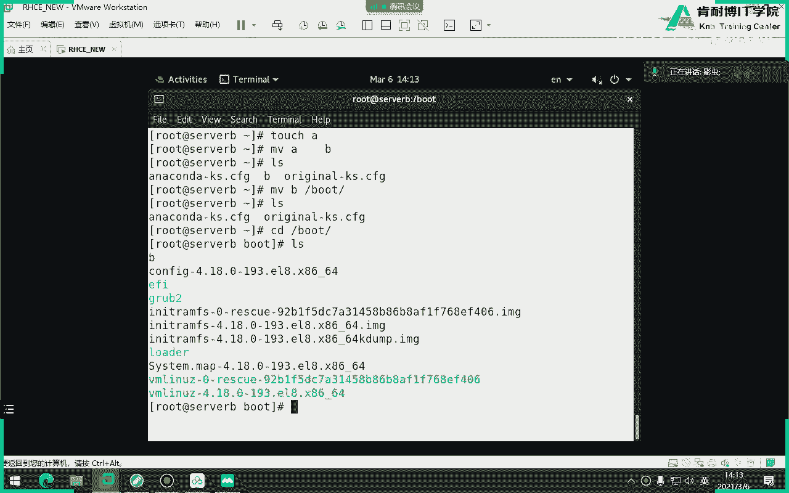
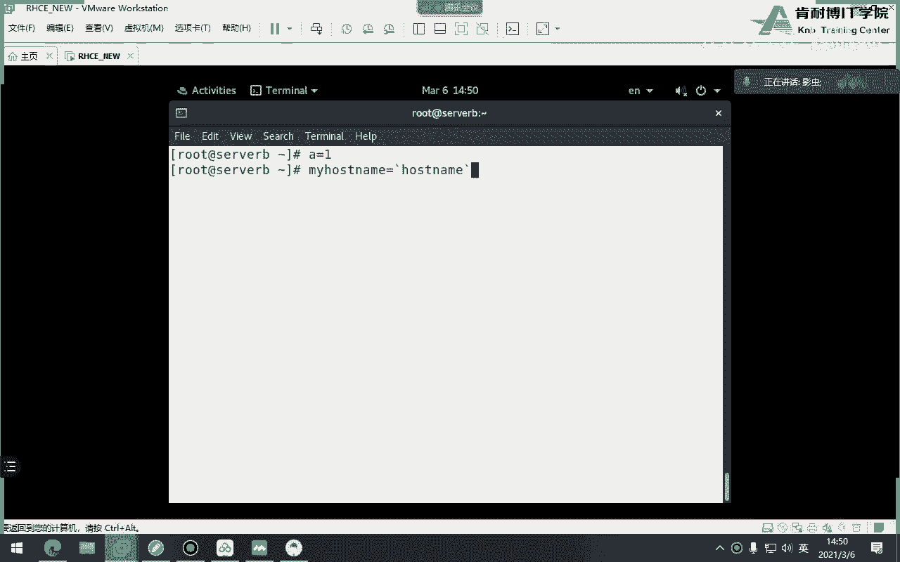
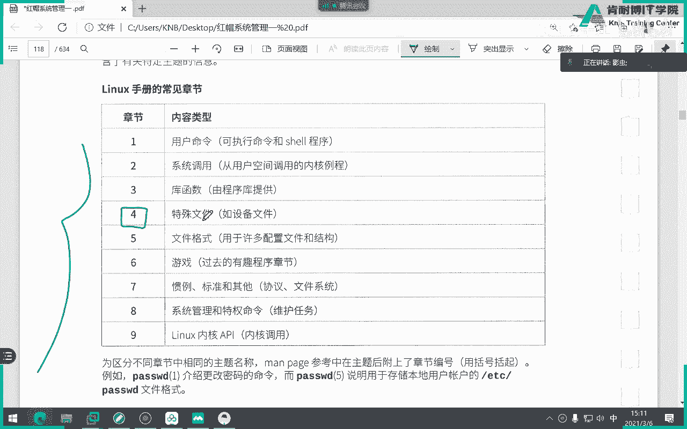

# 红帽认证系统工程师RHCE8-滕老师出品 - P2：第一天 vim编辑器 - KNBIT认证中心 - BV1up4y1h7MA

那么下午呢我们主要讲解的是文件系统的层次结构的下面一些东西，就是常用的文件或者常用的目录，上午我们说过，其实文件对于linux来讲的话是很重要的一个概念，因为所有东西都是以文件形式出现对吧。

那么请注意目录是文件吗，各位目录是不是文件呢，是啊对吧，只是它是特殊文件，为什么特殊，因为它有这个它是一个容器，它可以往里面存放更多的子文件，子目录啊，所以你会看到诶怎么这么多的这些文件夹。

其实文件夹对于linux来讲的话，就是目录，明白吗，各位就是目录好，那么我们来说这个表格，这个表格对我们来讲非常重要，但是不用记不用背啊，我要回家背一下，不用不用背啊，就是你挨个往下看就行了。

好那么这个表呢对于很多同学来讲，这个表我觉得他写的不好，所以我们从头到尾给他把顺序啊，自己整理一下好吧，我们就不按那个表来讲，我来给大家整理一下，你们看这样子是不是能更好一些啊。

我们说关于常见的这个常见的，好吧，关于常见的目录，然后分类第一个呢加盟啊，你们不用记，就仔细听，咱们有哪些项目呢，上午说过有哪个home很好，是home，那我问大家一个事儿，home目录这样讲对吗。

不得不为啥，因为你后面要加上一个名字，这个home是谁的家目录，所有的普通用户的家目，所以说后面要加上一个人的名字，你比如说有个用户叫做user 1。

那么这个user一的家目录就在home下面的user 1，你不能简单的说叫后明白吗，各位理解我意思吧，好那么第二那管理员家在哪呢，对对很好啊，你说好，那这个是啥意思。

这跟那么为什么我要把他这个拿出来讲的，因为这两个目录对于很多初学者来讲容易混，因为这个也不怪大家，很多教材上面它把它翻译的就容易让别人混淆，因为这两个单词都叫这这这个这个这个东西如果翻译成中文。

是不是也叫杠杆的，那你这个要跟这个也也要跟那很多同学就以为哦，原来他们俩是一个事儿，其实不是是两件完全不一样的目录，明白了吗，注意这个不要把它翻译成根，虽然从单词的角度来讲，它叫梗不错。

但你要把它翻译成是管理员的家，而这个才是梗，听懂了吗，别了，千千千千千万要注意啊，第二个，只要etc是配置文件，比如说未来学习的配置配置配置都是在etc配置网卡，配置主机名。

配置各种各样的dns都是etc好吧，第三个，我们称之为叫二进制可执行目录，比如说，对吧，病啊或者这些什么s b啊啊等等，我就不写了等等等等，这些都是二进制可执行目录，千万不要删了，千万不要删删。

因为如果你把它杀了，会造成什么现象，大家知道吗，猜一下，举个例子，我把并删掉了会怎么样，d的，会造成很多命令敲不了，比如说l s为啥大家知道吗。

来我我，我必须要告诉你们原因啊。

你不要死记硬背，老师说了，不能不能删，那为什么不能删，不知道告诉大家，因为很多的密令所在的目录都是在外，什么s b啊，或者b下面，你比如说l s这个命令，大家来看看在哪，which，在哪在这。

如果你把usr并删了，那不好意思，ios命令也用不了了，听懂了吗，我这么说能理解吗，各位那么一定要理解这个概念，就是你的命令不是说我敲l s它是独立的。

它其实有一个执行路径，因此记住位置指令，是这个是用来干嘛干嘛，显示出一个什么指令的执行路径在在哪儿，听懂了，同学们，你可以把指令翻译成中文叫命令。

你看来来来来来，which是不是是不是来列出ios这个指令的执行路径，听懂了吗，为什么会有颜色，因为加加了color，为什么有绿色啊，因为他加了卡了。

懂了吗，好继续，就我给大家讲一些书上没有的啊，继续嗯，设备，这不用解释吧啊不要再问我了啊，比如说网卡在哪，dv下面，硬盘在哪，dv下面对吧是吧，设备啊，好，还有什么，临时目录，比如说咱们的vr看。

比如说咱们的看，那么这个目录很特殊的，同学们，这个目录里面的东西不要放重要的东西，因为它会定时被清空，就跟你们家楼下的拉站一样，你把垃圾放进去，第二天早上没了，为什么人家清洁工帮你打扫了，明白吗。

那一样，如果你把一个重要东西放到tp，不好意思，明天可能就没了对吧，要不是不不不是说明天啊，就是可能某一个时间就没了，所以不要把重要东西放进去啊，好继续，还有什么好玩的啊，还有什么好玩的。

想想是不是还有一些这个叫挂载点目录，啊咱们的lex当中给我们提供了两个免费用的挂载点，一个media，一个叫马，你说老师为什么有时候你加个斜线，有时候不加，无所谓啊，无所谓，加不加都行啊，这样也行。

不加也行啊，什么叫挂载点，我有个u盘，我把它插上去，我把它插到我主机的这个这个usb后面，他就能用了吗，不能他要把这个u盘跟那个挂载点之间做挂载，当我去访问，当我去访问这个挂载点的时候。

就相当于我访问这个挂载点下面所挂载的这个设备，听得懂吗，各位第二个问题，如果我有三个u盘，那么我前两个被用光了，怎么办，能把第三个再放那么一点，或者放在mt这里面里面，这么说吧。

一个挂来点挂来两个设备吗，不能不能，千万别这么干啊，将会容易犯错，好继续，信息目录，比如说cs，比如说p r o c这两个是做显示信息的目录，比如说我问大家，你的电脑cpu是什么型号的。

你们内存什么型号多大的，牛老师，我得拆开镜像才能看。

那怎么可能呢对吧，我能随便拆机箱吗，对不对，不能按，那我就想知道，ok我想知道我电脑cpu什么型号，你看pk什么叫开的，上午说过开头是干嘛使的，看来不是查看文件的内容对吧。

p r o c下面有个cpu info info就是information啊，这就是我cpu型号，看到吗，i3 的看到吗，为什么，因为他跑他走的是谁走的，就是p r o c下面的东西。

我说过p o c是显示信息的目录对吧。

朋友们，我们而且这类目录目录是不占用硬盘空间，同时修改后立即生效，那说明他占的内存的临时空间，但重启失效的，这个能听懂我想表达的意思吗，比如说我针对p o c下面做了好多参数的调优，你不懂没关系啊。

你仔细听，但是我如果一旦重启之后，它会它就失效了，为什么，因为p o c它是占用的内存空间，他不保存进去，听懂我意思吧好吧，那这里空间这两个目录是不占用硬盘的，但它占用内存，修改后就生效。

但是一旦重启又失效了，因为它不是永久性的继续，还有什么好玩的，啊我想想还有好玩的，123456，应该还有一个叫做数据目录啊，或者我随便起名字了，叫数据目录吧，比如说咱们的vr就是啊就存放用户数据的。

举个例子就跟咱们windows当中的c盘以后后面的盘，比如d盘，e盘，f盘对吧，d盘存游戏，还款纯电影，明白吗啊，we are里面是存放一些数据。

比如说你这这哎后面我们两个人制存放在vr下面的log下面，懂我意思吗，哎就是数据数据好，你看看我们随着变聊边写所有的常见的家常见的目的就就有了，当然还有忘写了，叫什么，启动目录吧，是不是启动目录忘写了。

你看说着说着不就是把这幅图片给大家讲完了吗，你说老师还有一个run都不想啊，这就不讲了啊，电影这都不讲了好，那么我们为什么要讲这些东西呢，因为这是一个标准，这个标准叫做f h s4 标准。

意思就是所有版本的能用的时候，它都遵循这个，不是说我今天学了红帽bot的启动，我明天学的不是红帽bot就不是启动了，不是是哪个版本的linux，不都是启动哪个版本的linuetc都是配置听懂了吗。

所以说你看你学会了红包，就一定会用其他版本的linux，为什么想通了，就该这么讲吧，你家你用过windows xp，你直接玩win 7不会有太大的难处吧，就像你像win 7升到win 10，不会说啊。

我我坏了，我一点不会的，从头到尾学一遍，这不可能嘛对吧，只是说可能会有些future一些更新或者是一些特性的更新。

但不至于说我连我我我连这个windows键都找不到对吧。

哎所以说你学任何版本，他都是这个这个东西啊，叫叫f hs标准，好吧好吧行，你看这么多啊，设备哎我问大家，如果一个b设备是放在哪，肯定也放在etc了，那第一位吧。

应该是块设备吧啊这个不用讲这个就知道一下就行了，其实有时候咱们红包七之前的是b先把红包七叫做u s i的b啊啊，关于这个笔记还有什么不明白的吗，再说一遍，就算你没有分这些，装完系统。

它也会自动帮你分出来，当然了，这些东西都隶属于一个叫根目录，对吧对吧，你比如说接下来我们要说说一个就是重一点，就是我怎么去引用这些目录，什么叫仅有叫cd，我想到一个文件，我怎么到两种办法。

第一个是绝对路径，第二是相对路径，咱们先说绝对路径，绝对路径有一个特点，就是最安全，为什么，因为他一定是从根开始，一直要把你所经历的所有目录给你连串的写出来，你比如说我想到这个message。

大家来看我怎么去，是先到哪儿，现在入口在哪跟，然后再到哪不一样，然后再到哪，再到log，然后再到message，哎你看这是一条路，这是一条路，这条绝对路径永远是从哪开始，从根斜杠开始，那这个很好理解。

那什么叫相对路线的，相对于我此时此刻在哪，我举个例子，我还想到message，但是我现在此时已经在这个位置了，朋友们，我怎么办，我已经在vr了，我怎么进去，如果写命令的话，我怎么写，对对cd什么什么。

我已经在vr了，同学们，我怎么进到message里面，我怎么写，我我现在在v r告诉大家我怎么进到message，看图说话，log对吧，那我怎么写log说谢谢老哥，要不要直接老哥，对吧，为什么。

因为我要再加斜线的话就代表什么了，各位我就代表从根下面的log，根下面哪有log是吧，朋友们，但是很多同学就是不知道，他就以为只要写第一个目录，前面一定要加斜线，那就说明一点。

他根本就没有听懂上面讲那个课程，上午讲那个课，他就没听懂那个图他就没听懂，你永远记住什么叫相对无解，我要先知道我自个儿在哪呢，然后再到那个位置相对嘛，那问题来了，我怎么知道我当时在哪。

各位你有没有想过一个问题，我怎么知道我当年在哪，如果从根本的话，我无所谓，当年在哪，不知道从根走就可以了啊，但是我怎么知道我当年在哪呢。

有两种办法，第一种，我看我行不行，我自己用肉眼看，我问大家，我此时此刻在哪，来抬头看我现在在哪，在哪再说，对像刚才有人说的，根部就是根吗，根子是斜线吧，这波浪线代表啥，但我说过忘了现代表加目录吧。

但是我问大家，现在这个家是root还是home，现在这个家是root还是后，想都不用想一看，不是井号，是美元符号，很显然是个普通用户，普通用户的项目录在哪，在后面对吧，那如果我再问大家。

你给我写出来现在哪，对我现在是home home什么，是吧，不说了吗，得是这个用户的自己加入，是不是得加上同名文件的名字，对吧好，所以说请注意，我得知道当前在哪，这是第一种办法，我用肉眼看我看出来了。

还有一种办法吧，这个命令显示这个命令是什么意思啊，我写我说出中文，你仔细听，你看对不对，wd显示的是当前路径的绝对路径，你仔细回忆一下这个话对不对，当前路径，那为什么还来个绝对路径呢。

是不是他把整个给我列出来了对吧，所以说这个命令是最最准确，你用肉眼看的，有时候不准再说一遍，你要想知道你想用啊，你要想用相对路径，绝对路径无所谓啊，那你要知道相对路径，你所在的位置怎么知道p大的，你看。

所以你看他这个知识点它是它是串起来的啊，你千万不要你们有人看书的时候。

千万不要就一个知识点也就去看啊，别啊，今天讲到相对正经了，我来看相处对象，然后待会就讲到p a p a p a w d了，我死劲背p a w d没有意义，一定要串起来就气啊，你把知识点串起来去学习。

所以你看来看下面p w显示的是当前路径的绝对路径，它翻译成中文叫完整路径，像这个我我我我我以后我训练你们的速度啊，你比如说各位来告诉我这是什么，加班来晚了，谁给加加，是不是home下面的u的对吧。

一定要快速啊，一定要快速，你你能反应出来啊。

反映出来懂了吗，嗯，告诉我在哪个速度快，肉不用下吧，因为我现在是管理员，管理员怎么可能在后面呢对吧，这速度一样快，我为什么要老是就是纠正这个错误，你会发现每一期的学员这个总是有人听完之后就忘。

或者是根本就没听懂，他一会儿又哎，这就是跟啊，他一会儿就混了，这就是根，这怎么能是根根是什么，各位这才是根吧，竖线啊，斜线没有啊。

这下次不要说坑了，不要说跟ok好，最后相对理性和绝对理性这个事儿就搞定了，我觉得没有什么难度啊，不用我们老是纠正了，ok结束，那用哪个命用用用哪条命令进去，当成cd好，那么我们来聊一聊cd。

你这cd有什么潦草。

不就是命令吗，嗯好那么这个cd有很多可以跟大家说的事，首先cd后面加上一个目录，代表你可以进到这个目录里面，前提是什么，这个目录存在好，第二cd命令如果加一个加一个横线的，各位这不一样。

代表回到上次工作不，啊咱们通俗点回到原单位，明白了吗，我原来是在a这个位置，我现在到b了，我现在是c d横线，它又回到a了，听懂我意思吗，横线好，那cd包上线了，猜下下回车，啥意思对呀，不说了吗。

这个波浪线是加目录吗，哎那他就等同于什么，等同于什么都不加，你记住啊。

各位你在任何位置敲cd回声都是会降价的，都是回想象的，那你说老师，那我就不用学波浪线了，再这样打有什么意思，对在这题当中没什么意思，但有时候有意思，你比如说我问大家管理员能不能进入到普通用户的价。

可以啊，我是官员吗，对吧，我是管理员，想去哪去哪，那怎么进呢，比如说举例的，我现在想进入到学生这个用户的家目录，我怎么进去来，你说我我打打，首先判断学生的项目在哪，在后面吗，home隶属于谁。

跟ok home，然后呢，学生ok很好，这就是进入到学生的家目录了，很好好，还有一种办法，我能不能这样写啊，同学们，先把法当然形容，因为刚才讲过波浪线不就代表home吗，懂了吗，所以这种办法可以用。

但是前提是你是谁管理员啊，而普通用户能进别人家吗，不能普通用户只能在自己家待着，管理员可以在任何人的家待着啊，这就是我们今天讲cd方线，第三个要讲就是cd点和c d点点的，那么这个点和点点是什么意思。

我们要先明白什么叫点，什么叫点点来，我们用l s今天学了一个很好玩的一个命令，还记得吗，啥意思啊，显示当前所有目录，包括隐藏好，你会发现掉掉掉掉，随便随便进入到任何目录下面，都有第二和第二点。

看到我随便进，是吧，而且你我问大家一个事，你从颜色上判断出来这个点和点点代表什么，是文件还是目录，颜色，蓝色代表什么，目录吧，那我们是不是可以理解为这一个点和这两个点点是目录，而不是文件，那既然是目录。

所以说请注意这是两个特殊目录，这个点和这个两个点点是特殊目录，可不是文件啊，你别给我说成文件好，这个第一个点代表当前目录，第二个点代表上级目录，你能分清楚上一期和上次了，应该能吧。

哎那你告诉我为什么我刚才一点一点给我回到根了呢，因为boot的上一期是谁等等的，听懂了吗，那么有人老师讲这个有什么用呢，太有用了，你仔细回仔细想一件事啊，朋友未来你在工作的时候，你可能那个目录很深。

比如说a下面的b下面的c下面的d，你此时此刻比如说已经在d了，你想回到b怎么办吧，我问大家，如果我此时此刻在d，你想回到b怎么办，两种办法，第一个能不能学出证据怎么样，我这我就这么进行不行。

哎我这样行不行，我老老实实的用绝对路径可以吧，我比较老实了对吧，第二我能不能这样搞cd。二点回来打，这边对我再点点，不要打了，不就这个命令没用哦，搞定了吗，现在是不是觉得这个命令有有有点感觉了对吧。

那我问大家这个斜线代表啥，这不就是中间分隔符吗，白了吗，这不就代表我是回到c回到b吧，那如果再回到回到a理解了吧，就这个时候很有用啊，那问题是为什么每个目录下面都有一个点和两个点点呢。

你看我刚才你看我随便进行任何目录，同学们，我随便进，我现在跑到vr vr里面有一个点和两个点，我跑到tm p里面也有一个点和两个点位，很为什么任何目录下面都有这两个特殊目录，是注意啊，这是个目录啊。

这个点这个点点是目录，为啥，如果是文件能cd吗，不能吧，为什么，因为还是那句话，咱们是不是只有一棵树，那既然只有一棵树，我是不是就得有个东西来表示我自己和表示我的上级枝叶在哪对吧，那一个点代表什么。

自己吧，当前明白了吗，哎所以这些命令都是很有用的，咱们可能现在还没有学过太多的命令，等你学过很多命令，你会发现啊有点感觉了啊，慢慢就有感觉了，好我觉得我讲的比较细了啊，你们仔细听，ok。

这是两个选项，点点点点点点，而且是一，这是一堆的吗，隐藏文件，为啥因为他他他前面文文件名前面加点了呗。

对吧好，那ok ok暂停不讲。

讲，给大家搞点好玩的补充知识，我写补充的都是不高的，但是你得知道就是未来工作能用到的啊，你来看我写几个这个东西，你能看懂吗，各位小伙，啥意思意思意思，回事啥意思啥意思，你就告诉我，你不用敲。

你就告诉我啥意思啥意思，那我这么小心了吗，不加斜线都能看懂了吗，是不是回到当前目录点吗，不是当天吗，好这两个点是不是回到上级啊，不用解释好，那你看我这样加一下，当前目录下面有一个隐藏文件叫abc吧对吧。

能看懂了吗，哎所以你要你得你得你的脑子是迅速反应过来啊，你比如说这两点啥意思啊，哎你得明白那这是什么意思，这是不是有个隐藏文件叫abc对吧好，那这是什么意思，中间带空格了，朋友们不一样了。

这可不是隐藏文件，隐藏文件必须那个点跟那个文件名没有空格，而这个点你们没有学过，我告诉你，你肯定没学过，我告诉大家，这个点在这个里面是一个英文的简写，什么英文呢叫s o u r c e。

这不叫语言上是吧，这叫源码，哎，是这个单词的缩写好，那你可能说不对，怎么缩写成这个啊，那没办法，人家就这么规定的啊，这个调调就代表嫂嫂是干嘛的呢，叫立即运行，运行，a b c文件啥意思呢。

我来说一个事儿啊，咱们现在可能还讲有点提前，但是我们先说一下，有时候有些文件你写完之后必须重启才能生效，但我现在不想重启，我让他立刻成效，所以说就用点空格加上这个文件夹，那里面写的东西就会立刻生效。

明白了吗，那么这个点就等于等于什么sars单词，所以你用sars空格a b c或者是点空格a b c都行，理解了吧，所以你一定要看清楚这个点中间有没有空格，那我问大家，如果这么写的，第二，比如说。

执行当前目录下面的一个隐藏文件吗，对吧，哎那于老师为什么你要斜线，你要这个不加斜线就完了，不可能不加吧，不加斜线，他怎么知道这是目录下面还是上级目录的对吧，在这边就要加斜线，理解了吧。

所以你看这些东西你要灵活，就是当我们第一次学，你可能反应速度慢一点，很正常，你后面你会经常遇到用到这种东西，注意点代表立刻实行立即生效的，比如说咱们未来咱们学习一些，一些一些变量文件。

那么这个变量文件呢有时候咱们必须重启生效，或者或者什么叫重启呢，就给我把电脑关了，还有一种办法就是我把这个用户退出来，再登录在叫重启，但我又不想登录，也不想重启电脑。

因为你也知道重启电脑是不是要浪费时间，对吧啊，所以说立即存盘，立即生效，注意啊，sauce啊，今天说到这儿其实也不算补充吧，因为后面后面会讲到，那我今天就趁着这个讲的，ok。

行吧行吧行吧，这个s，点是当前目录点点是父目录，就是上级目录r是递归啊，后面再说什么叫递归，递归就是一层一层递归好cd横线代表回到回到啥，上一，集还是上一次反刺啊，对不对，上一集是点点，对不对，嗯。

好结束，哎我们做会题吧，来同学们来看做个题，第一题选什么，考的题我自己都没看过，假设当前用户的当前目录为tp，哪个命令用于返回稻妻主目录，啥意思，哪个，谁说b啊，那那我问你哎，好比说咱们选b的话。

应该回答答案，告诉我，不不不，我知道是你说说出来就是答案，跟了吧，因为他说了，你现在在tp，如果你cd点不就代表根了吗，看起来这题答案是错的吧，什么叫主目录不就加目录吗，那你告诉我哪个哪个选项a对不对。

a肯定对，刚才讲过任何地方输入cd是不是都是回家，c对吗，谁更准啊，这啥也没动呗，对不对，我自己在我家里说，我要回家，这么扯吗，对不对啊，cd不对，那是d对吧，根本就没那个命令，大家知道吗，什么叫型号。

咱们学咱们喜欢吗，没有吧，哎那是一对吗，e更扯了，e是迷惑，想刚才讲过，想回到某一个人下目录，是不是后面要加上这个人的具体名字，你来一个home，home是啥意思，我们是一个大的一个家，但具体是谁的家。

他说了，回到自己的甲，那是不是要加一个那个说a是对的，第二题，c d对吧，这没什么说的，第三点，哪个面料会始终是中返回到的，啥意思是中回到再进入当前，不不不不不不不哪个a吧，这牌是除了上一集。

我要上一次是吧，第四天了，两级嘛不就是c吧，两级嘛，对不对，这更扯啥东西，我靠怎么自己变了命令吧，六零隐藏，你看隐藏关键字，b吧，不对b不好意思啊，他还说一个长格式是l是long长格式，什么叫常规式。

想想加l是不是可以显示出一堆的信息，比如说时间大小，用人可以堆很长的信息，对啊就长格式，所以你看我审题不仔细啊，ok这题应该选d，注意观察这个细节，既然没有告诉你当前在哪，你肯定不能使用相对滤镜吧。

你是不是得用绝对力量，谁是绝对力量，b吧，我们还有说c打b吧，什么叫绝对不行，就从根开，绝对路径有一个特点，就是我根本不用关心我在当天在哪，反正我都都得从根开始走，第七题了对吧，第八题呢，各位第八题。

下面还有个秘密箱工作课，还有别的答案吗，那是不是只能选这个对吧，没有办法，第一个肯定错，为啥错，各位第一个错误的前提在哪，你没有一个相对路径，你直接来一个tnt在哪，那比如说第一题。

如果前面加个斜线就对了吧，这题直接对了吧，那第二题更扯，我是谁啊，我就给他上级，如果上级跑到哪了，各位这不跑到后面了，对不对，那这个根本就没有加目录，下面有tnt吗，这我问大家不按了下，后面必须是个啥。

因为是个人名吧，比如说波浪线学生是不是就到学生的加盟国对吧，你这波浪线tnt谁跟谁啊，两个目录加一块谁呀，明白了吗，所以这一题很显然这群你看虽然说这些题目很简单。

但是对于我们第一天来上课的同学说的是一个训练，快速理解这些目录之间的区别，要训练一下，所以这个题目还是有必要做的，你这个技术打不好，你后面就很麻烦，因为我们在写明写常识好几个点，你就懵了，什么东西啊。

所以这个题目还是有必要学一下啊，好过没了，这就是答案啊，这是答案就颜色深一点，就是答案，嗯暂停一下。

看有什么问题，那我们接下来讲一下关于关于管理文件，那么文件和目录都叫文件对吧，但是呢咱们分开讲，就文件怎么操作，目录怎么操作，咱们先从文件开始讲起，第一个关于建立文件命名叫touch，触摸。

要建立空文件，空文件啊，注意啊，空文件这样说也是空的，什么叫空的，各位这里里里里面没有东西哈哈没有东西好看看是不是来开始好，再说一遍，我在我在大姐在哪，名声我知道加不了名声，root k touch。

一个文件叫bobb，ios出来了吧对吧，ios杠l呢是什么意思，常显示好，那么接下来各位这是空的，为什么你看内容这边是空的，这是看内容吧，好空的，ok结束了，很简单，把踏实，这没什么讲的吧。

这个你要待会解释，但是我有一个问题我再踏实一遍呢，会怎么样呀，我举个例子，如果说刚才那个file文件里面有写了一堆的东西，比如写了一篇文章，我touch一下会怎么样，想想会覆盖掉，各位会覆盖的。

但他会新建一个文文件名，也叫file mail哎，windows会吧，我新建一个名字，然后你再新建一个，他会写写一个括号，一对吧，会但linux不会，它并不会新建一个名字叫file的文件。

也不会把已经存在的文件内容覆盖掉，那他会干嘛就打着玩，时间大家来看，刚才是20 32分，现在是33分，所以说他是第二个含义，叫做或者，更新时间点，所以你不要随便的touch一个已经存在的文件。

明白我意思吗，要不就改变时间，改的怎么样，无所谓啊，又不是里面内容改了，大家可能现在还会有时间的概念，比如说咱们是做集群的，各位什么叫集群，继续弄懂吗一堆，那么我们知道做机器有个重要的重要的事情。

就是是不是要文件，每一个机器要同步，那那你想象一下，比如说有两台机器做集群a和b那么两个机器里面都有同样的文件，那么如果某一个文件的时间被改了，那么作为另一台主机来讲是不是同步。

那你这一下子不就引起了所有人都同步了吗，明白了吗，所以不要随便它是一个文件，但是你要知道能干这件事，大家可能只知道建立文件，但不知道更新时间，我讲出来，你们知道第二第二章哪个命令啊，我不想玩了啊。

我不想玩了，把它干掉，我们知道删除文件叫什么叫mo，后面加文件名就可以了，这个不用解释，很简单，但是它有几个选项，先写下来一个选项，f叫强势，就翻译成中文就是强制。

其实这个单词就f o r c k o f o r c e是吧，强行强制，第二个选项，啊选项叫地好，注意未来你在看到命令的时候，如果出现二选项，基本上都是递归的意思，当然我说过只是基本上都是递归。

递归就是一层一层，他是关羽文目录，什么时候用递归，关于目录的时候用地柜，你藏一藏好，第三个这个选项基本上见不到的，叫不叫交互式，我来给大家解释一下，你比如说我现在想删一个文件来，同学们们。

我要把刚才建立那个文件删了，他说啥，你确定吗，我得点个啥y删掉再来看，没了没了，他为什么会出现这句话，各位他为什么出现这句话，是房间里录像啊，给你给你一次重新做人的机会对吧，哎那那那我没有这句话呢。

没有这句话可能一下就删掉了，是不是有点类似于我们把东西先拉到回收站里面，但我不清空啊，昨天我后悔了，是不是可以还原啊，这里是不是，那么问题是谁来提供的这句话的功能呢。

就是刚才的那个i选项目交互是什么叫交互，吃了吗，吃了这叫交互吧对吧，我问你，你回答就叫交互对吧好，那那那你刚刚不对啊，老师你刚才没加呀，他怎么来也有交互呢，因为电脑里面出现了别名。

大家看当我打rm的时候，就等同于打rm杠i，因为这个单词叫做别名，听懂了吗，各位听懂了吗，啊，叫电力，就是系统里面给我们做了好多别名，看到吗，比如说当我们用l s的时候，为什么有颜色的区分。

因为加了color，听懂了吗，考试要考的啊，这个要考的，明白吗，别名好，所以说请注意下次有这种交互式的时候，都是哪个选项，i为什么是i，我们看一下全称，那个单词我不会拼啊，所以我就让他看一下。

就是这个单词，这啥意思，交互吧，明白了吗，我也不会念英文，不老好的，明白了吗，各位啊，就这意思啊，好继续，那二是啥意思，刚才讲过，要删除目录啊，你比如说各位，比如说找一个目录啊，这是建立目录。

我先教大家啊，比如建立目录蓝色的吧，蓝色的目录我要删除，你看，他告诉我不好意思，这是个目录，那我就想上哎，那好架是吧，加二就行了，他就可以删了，他说你确定删吗，加个哪个y，但我连y都不想加，怎么办。

懂什么叫强做了吧，就你不要问我了，我一定是善良，你问外山，你不用外商，所以我们知道这个名字是不是很危险，而且你又是管理员，所以不要随便打个命令，对咱们网上不是经常有这种断的嘛，对吧。

我这三个选项解释得清楚吗，r是递归，f是强制，所以未来你在工作的时候发现，只要是关于r前面不是不知道，但你知道看到有up基本上都是代表跟目录相关的操作啊，为什么，因为目录是一层一层递归的嘛，啊懂了嗯。

好关于文件，三个移动或重命名，什么叫mv，mv叫做move对吧，很激动啊，那那有老师，那什么重命名呢，哎那为什么这个单词又是重命名，就是移动的，因为是这样子，如果他没有跨分区，它就是重命名。

如果他跨分区了，就是一我这么讲能听懂吗，你看各位，我建一个文件，哎如果这样就很没，这是移动还是出门没重命名吗，对吧，我没有跨分区，所以说他把a变成b，那如果我再来a我b然后跑到哪呢，跑到这个下面杀一次。

跨分区了吧，你说老师，你怎么看出法句此时在哪，所以带root，我从root的b跨到了bot，是不是跨平区了，这叫移动，那这个时候我请问大家当天还有b吗，b跑到哪儿啊，告诉你们，而且名字叫什么。

这还叫比特。

对不对，明白了吗，回来吗，有点意思啊，有点意思，拷贝文件c，简称cp好，咱们这个网络老是说你cp啥意思，网络用语，咱们俩是一个cp是啥意思，用网络里面我对网络的应用于一窍不通，就是指team吗。

组合是吧，组合是吧，ok这个叫拷贝跟重命名有什么区别呢，区别就是原文件还是在，对吧，你拷贝的时候原文件在哪，在那移动时候的原文件不在了，对吧好，那我们也有几个选项啊，拷贝怎么拷贝，怎么怎么怎么写啊。

很简单，把cp原文件源到目标，对吧好，那我们有几个选项，拉吧拉吧拉吧拉吧拉吧，选项啊，一般是什么意思啊，对递归还是针对于目录操作，比如说拷贝，好第二个还是杠i叫叫叫叫叫叫叫啊，一样好。

第三个这个有一点意思，嗯叫做pirate，叫做拷贝啊，不不不不不说错了，这段说错了，保留属性，保留属性来我们解释一下，来搞一个。

不会打架，当前是不是有一个文件，比如说举个例子建一个文件啊，叫做a b c，这啥意思，这是啥意思，就是把a b c复制到bot啊，这个没什么解释的好，那如果这是a b c，如果如果说是个目录的话。

我这刚才那个命令肯定报错，那必须得加什么了，啊对吧，哎一定要注意，如果说boot是个不是a b c，如果是个目录的话，就必须这么做，如果是文件就不能加哈，听懂了吗，我就不演示了好，但是我问大家。

如果你这样拷贝过去之后，这个bot是不是文件名还叫a b c，就你考虑过之后，是不是还在boss下面，还叫a b c，那我想变成123呢，就是我把a b c拷贝到boss下面，并且重命名为123。

怎么做，结合刚才学的命令怎么做，c b c p a b c拷贝到bot，然后再进入到bot，用mv改名字，是不是是不是可以这么做，那太麻烦了，我们能不能这样子，来来来，你看我这样做，如果我这么做的。

直接回车，它到boss里面还叫a b c，然后你再跑到boss mv改，这样太麻烦，我能不能这样直接写到这个不就行了吗，听懂的同学吗，就我拷贝过去那一瞬间，我就给他起一个新的名字，叫123了，明白了吗。

那我想问一下，请问大家现在当前目录下面，a b c还在这个家目录下面，还在不在，那什么叫做i呢，刚才讲过i就教故事，比如说我现在再考一遍，再考一遍，还叫123，他就会告诉我，你已经存在了，请问覆盖不。

ok这叫交互，明白吗，你怎么用的交互，虽然我没有加i，但是他帮我们加了一个i，听懂了吗，别名能看到吗，系统帮我们做了一堆的别名，看到没，他帮我们做的，不是我做的，你也不是你做的，是系统帮我们做的。

有时候你会发现诶诶这个命令怎么回事，我没有加，没关系，他帮我自动加别理。

好讲完啊，讲完，精力删除移动靠背，如果原文件存在，他就会问你是否覆盖，比如我已经拷贝过一次，这个其实跟windows是不是特别像，只不过windows是不是叫替换，它不叫覆盖，打不到的地方都不一样式啊。

关于这个东西还有什么想了解的，管理文件当中还应该有一个事情，就是我想知道这个文件的类型怎么看，哪个命令，文件类型file吧，对f r l e file可以看到文件类型，这几个，这个命令呢我没有讲。

待会再说，要删除空目录，没什么要记得，这是拷贝文件，这是拷贝什么，这个很显示移动吧，哦不是重命名吧。

make dr 2叫做建立目录，我们来说一下关于建关于目录的操作管理部，团里目录第一个建立md r r建立空目录，对吧啊，哎来试一下。

同学们看看啊，make dr比现在一个目录叫做叫做dr a，应该是什么颜色啊，蓝色啊，删除呢，i am g啊，好那么教材当中给我们说一个新的上述命令叫remove dr，但这个命令有一个问题。

就是只能什么删除空目录，所以说如果这个目录里面没有空的呢，那就不能删了，明白吗好所以我们一般都不太用那个好，那么说到这儿了，我结束了，这个就就这么简单，就make dr，那我说你来做一个题目。

来各位我每次讲到这都会出道的题目，来考验一下你们从到现在总共听了一个感觉，题目是这样的，你给我建一个文件，扩建一个目录吧对吧，建完目录之后，用p w b看p w b还记得吗，t w还记得吧。

就你给我建一堆目录，用p wd看完的效果是这样的，做完做完做完之后的效果必须这样的，那我们快速来说一下，还有一个选项就是书上告诉我们小写的p选项。

它是叫做负t啥意思。

你会发现如果刚才有些同学比较聪明，他说那我直接这么写行不行，写出来行不行，答案是不行，因为你想象一下有a吗，有没有a怎么建立，b没有b怎么建立c呢，所以你得一层一层建立，但如果你又不想一层层建立呢。

就杠小写的p意思是指自动的建立a然后自动的往a里面建立。

d就是把上级目录帮你一块建立起来，所以叫复目录，懂了吗，这个啥意思，对他前面没有斜线代表什么，什么目录说出来说出来，我知道下一题说出来home有的，那因此做完结果是什么。

home user下面的videos，下面的watch，你要因为咱们第一次上课嘛，所以你反应有点慢是正常的，但是你后面就一定要快，如果你对这个目录的结构你都看不懂，后面的所有命令你都没有办法操作。

因为你命令记得再熟有什么用，我都不知道当年在哪，我在哪敲呢，我不知道，那你就完蛋了，因为我说这节课很难，也很重要的原因就是在这，咱们今天每一个同学要求每个同学都必须把目录结构非常清晰，看图就知道在哪。

就能判断出来错误在哪，复制文件不讲了，cp啊，这都是讲过的，所有都是讲过，只不过这个是递归，这也是递归，为什么这个r和大写啊，那这个就叫死经背了，l s当中的r都是大写啊，这个没办法，这个是经背好吧。

移动就不说了，不说了，都说过了，所以最后的结果就是我刚才讲的，比如删除目录呢，在最后我们说说一下删除目录的什么啊，好那删除这个空目录呢，没办法，你要把这个知识点连贯起来，同学们啊千万不要独立的去背。

比如你回家家就像背英文一样，建立目录是他是删除文件，是rm，你这么学背的，那你永远学不好起来，把知识点串起来，跟同学说，这个四就前前六天的cc啊，都是零零散散的命令，没有没有国际关系。

那是因为你没有不懂，没有看好这个教材，其实是有点关系，尤其像第三章，你看为什么第三张不能上来就讲pa，因为你光会踏实的，但是你文件的结构体你都不明白你怎么建立了是吧，好了，这一章没了，分没了。

还是一张没有，最后说一个这个你看这个我刚才没讲，就是如果你想建立多个文件的时候，你可以先用一个touch后面把文件名全部一次性地写出来，他建了六首歌，六个图片，六个影视。

明白吗啊就是比如我想建立三个文件，我可以touch后面加那三个文件的名字，就一次性建立起来了，touch键一下回车，touch键一下回车啊，知道一下行好，这个实验先回去自己搞吧，不想没了没了没。

这个不讲不讲不讲，不不过我现在直接告诉大家软链接链接，你就更晕了啊，所以不讲，你看我我我我我基本上不会按照咱们教材的顺序讲的，什么时候讲，后面再讲，不是后面讲的啊。

咱们现在的知识点讲的软件接硬链接有点早，把这一章讲完了嗯，讲的什么东西呢，叫通配符，佩服这几个单词啊，这几个字母，通配符，通配符是干嘛用的呢，注意啊，是一种一种用来匹配文件名字的特殊原2400。

我问大家一个事儿，大家有没有学过或者听过正则表达式，没听过，如果你你如果咱们在座有搞编程的同学，肯定听说过吧，正则对吧，那么通病不是正则吗，当然不是，为什么要提出这个概念呢，因为很多同学学完s5 。

哎那不就是通通配符吗，哎这不就是正则吗，不是不要理解通配符合政策是一回事，这是两件事情，好tommy符是干嘛用的，书上讲了一堆，我就给大家总结出这句话，你把这句话给我记在脑子里p啊，不是特色特殊啊。

特殊原字符，原子播了，你来看看这些都是原字符，星号了，问号了，匹配零到多个字符，也叫做匹配任意字符，木板挺好，为什么不行，到了吗，听到了吗。

字符啊，你看各位，目录下面有一堆文件，比如说那么ios信号行不行，是不是显示出所有的东西，所有东西明白吗啊比如说这样的，当然了，因为这下面就只有这三个，所以它显示所有懂我意思吗，匹配零到多个所有所有。

所以会你会发现你会经常搞这个事情，啥意思，删除当前目录下所有对吧，信号这个很简单，不解释了啊，好问号呢，问号不一样了，问号代表匹配任意一个字符，让我们做一个实验，三个都出来没问题吧，好，出来出来。

科二吧，对但如果这样呢，就是二三出来，因为它一个字符明白吗，一个它跟星号不一样嗯，接下来我们再来说下面的，这个难了，这个代表一个范围当中的任意一个，范围当中的任意一个，哎你们是匹配a b c吗。

是匹配或者a或者b或者c，而不是匹配a b c能理解吗，如果把字母换成了数字呢，比如说零是什么意思，给我这么想的同学们，代表匹配012或者三或者四或者五，明白了吗，那这里面谁会出来告诉我。

告诉我这三个人谁会出来，1223会出来吗，不会，我想让二三出来怎么办，两种办法，第一种这样子，第二种再来一遍行不行，当然可以啦，想什么呢，对不对，因为他认为一个字符嘛，哎所以千万不要认为这是匹配0~9。

不是的，你要把它理解理解为匹配0~9的话，那是不是二三早就出来了，他在匹配你里面的一个任意一个，如果是a到z呢，各位匹配所有的英文小写字母的其中一个，那如果大写的a到z就匹配所有的大写字母的任意一个。

但这里面没有这个文件，所以出不来看到吗，出不来好，那如果你写成这样式的呢，比如说啊，可就完完全全不一样了，这代表取反排除，或者a或者b或者c都不在我的范围之内内舒服，那代表什么匹配a b c之外的东西。

懂了吗啊排除看教程。

它就等同于太好了一样的，后面都不用学了，你记不住，你也不用学了，别学了几，不在就是你，你们三个人我都不想考虑，然后谁谁谁其他人的考虑说a b c都不在我考虑范围之内，排除，这啥意思啊。

各位你告诉我这是a c型号还是或a或c，所以和或c吧千万不要把它想的是ac开头，什么什么什么是a开头，或c开头后面的星号代表什么，他这是啥，匹配几个字符走吧，太恶心了，那五个全部怎么写啊，那没办法。

人家就可以，因为是四服是一个吗，波浪线不解释，说过了，代表什么，不解释了啊，就不用写了，那四个是啥意思，某个人的加盟对吧好。

咱们来说大括号，大括号用于扩展任意字符啊，这个很好玩诶，看书看书看不懂，直接来，懂了a b c1 a b c2 a b c3 ，懂了吗，就是有点像咱们以前学习数学那个乘法对吧，相乘啊，把乘法。

什么好说好受多了，比如说我前面的都一样，后面不太一样的地方，是不是可以用这个写参数里面要用逗号逗号隔开啊，逗号，啊这个可以过吗。

挂可以过，咱们就快点变量的扩展，这个稍微有点难，为啥呢，因为咱们还没有讲到变量说一下啊，咱们咱们先把变量提一下变量是啥，大家学过通过变量吧，那你就算没学过计算机，咱们数学当中，咱们中学是不是学过变量。

对吧啊，好变量是什么意思，变量就可变量对吧，这个是不错啊，变量就是说一个值，它里面的这个这个这个这个里面的那个值它不是好恒恒定的对吧，它是一个可以变的，那么变量的好处是什么呢。

就当我这一段内存空间的时候，我会这段内存空间起个名字，但里面的值是不一定的，那我去引用这个变量的名时候，其实就是想引用这个命名的空间对称内存空间，就比比如说咱们这个教室，浙江教室叫做红帽教室。

我每次说红包的教室指的就是这间教室，但是这里面的人是不固定的嘛，你们毕业了，可能下面又来一批学员对吧，你们就是直，但是这个房子就是变量，那所以说变量呢就是当我们去经常使用的时候。

可以为这个只为这再起一个变量名称，去引用这个变量名称的时候，就等同于引用这里边的值好，那么我们说今天讲的并不是变量，我们今天讲什么呢，今天讲的是这个这个符号叫做美元符号，加上这个花，这叫什么话大。

而里面那个值必须是个变量，看这是一个命令或者是一个命令，这是一个命啊，这是不是命令，我必须是个变量，必须是个变量啊，所以说我们这个命令这个符号就是为了引用变量。

你看举个例子，你看我定一个变量a它的值是一单变量，都是大写的字母啊啊一般单你也可以小写字母好，我也想打印出这个变量的值，打a那你就直接a可以吗，当然不可以，如果你直接这样的话。

它就会把a给你输出到桌面当中，是想输出这个变量里面的值，那怎么办，刚才讲过哪个符号，符号加，懂了吗，大家简写成这个就行了也行，可以吧，好所以这叫引用变量哦，不这叫打印变量值，不是引用变量，打印变量值。

咱们没有讲过变量，后面会讲，所以我现在先提一下变量，李老师，那我既然可以省略的话，我为什么要记你这个呢，理论上我们可以不记这个这么写，这两个是一样的，一般咱们学到后面，你会发现很多人是不会写大括号头。

很少有人写，有一个情况，有一种情况是不能省略，大家来看，如果我想这样子，结果应该是一二吧，他会打出一个空值，为什么，因为他认为这是一个整体，但我们现在有没有一个变量名字叫a2 ，那我怎么办呢。

我想这样那样就行了，懂了吗，这种情况是不可以省略括号，大都是可以的，对打印变量可以过吗，可以很简单啊，变量做一遍，echo是用于打印便刻啊，eq其实就是在相当于print，你打什么东西。

桌面上的输出什么东西。

那个print对吧，不打一之后，我们再来说一个替换的命令，命令替换这个符号又不一样了，刚才是美元符号加大括号，这个是美元符号，加什么小括号，这个里面一定是变量，而这个里面一定是命令，这个里面一定是变量。

而这个里面一定是命令，为什么命令替换允许命令的输出，替换命令行上的命令本身，你说这个字谁他妈能听懂，反正我听不懂，刚看了个中文翻译，什么意思，对吧啊，所以很多同学嚷嚷我说老师我要中文书给你书。

你看不懂啊。

我来给大家解释来看，你看啊咱们学过吗。

没有叫做host name这个单词咱们没有学过，但是我来告诉大家，它是显示主机名名叫sera b lab examina com，能听懂吗，显示主机名它是不是命令好，你来看我这么做。

开口我说我的电脑的名字，比如说电脑的pc名字，那我在那啪，怎么样怎么样，就是把这句话原封不动的给我扔出来，不对啊，我的意思是说我的电脑的名字应该他把他，我的想法是应该把hostname的值给扔出来吧。

把b吧，那我怎么样才能把host name的值产生出来，打印的吧，后面呢就用刚才我们学的这个加上什么小括号，对呀，要命令的替换，看到了吗，所以这里面一定是个沙发，是命令，比如我写成a b c行吗。

a b c当然不行，a b c是命令吗，不是懂了吗，好这个命令还总用这个命令，如果你不想写这个比较麻烦的，可以写成这个来这，什么，先说什么再说，是单引号吗，好不好，是吧，放线啊，同学们，鼠标不是方向线。

看到吗，求长线在哪，不知道吧，在你的数字一旁边，当个键就是帮浪线，波浪线是不是还有个写繁体啊，明白吗，好一样的，你美元符号加小括号就等同于两个繁体，而不是单引号啊，总结一下，如果想打印一个变量的话。

是美元符号加上大号吧，这小符号它里面必须加命令，什么是命令，因为只有命令是不是才有输出结果，讲完了，这就是今天要讲的这半部分的内容。

这句话，的变量，而且我们还可以结合刚才使用定一个变量名字叫my hostep。

它的值是什么，你看举个例子，同学们，刚才我们定义变量a值是一，这是我们固定写写写出来的，a值是一，但是有说有个现象，就是我定义一个变量，它的值是可能是随着命令产生的结果是一个值吧。

比如这样的我我我定一个变量叫my host name，它的值是谁，很可能是一个什么随机产生的这个命令产生结果吧，什么意思啊，这条命令在我的基础上叫sora，可能这个命令在你记上叫sorb吧。

不是固定的吧对吧，那怎么办，就是说白了就是一个变量的值，是一个命令产生的结果，那我怎么定义呢，是不是可以主办来定义了，不像刚才说a等于一，那是固定死的，两个命令结合使用，不就是今天我们学的吗。

如果这样打的话，待会我用echo命令输出my hostem这个变量的时候，值应该是谁，2b吧对吧。

歇一会吧。

第四章呢叫做获得帮助啊，为什么要讲呢，就是如果说未来在参加工作的时候，或者公或考试的时候，突然间命令不会很正常吧，突然间这个命令诶这个选项啥意思忘了，或者说就是想不起来了，哎没关系。

咱们可以通过获获得帮助，这个你要好好用啊，因为未来考试的时候，如果真的命令忘了，你怎么办，又不能作弊啊，哎就可以通获得帮助，咱们的雷姆斯当中有这样几个这个方法来获得手册页或获得帮助。

第一个呢就是咱们的help命令，先说的这个慢啊啊行吧，咱们就说慢吧啊，用卖命令慢呢其实是一个系统手册页，你把它想成一本书，既然是书呢，它就有章节，你看1239个章节，九个章节。

说第一章就是我们最用的最多的是命令，用户啊，就是用户的命令所在的章节，比如说咱们今天是从上午到现在，此时此刻学的所有命令都属属于在第一章里面可以找到的，比如说pass了怎么用，不会怎么用，不会建立用户。

建立文件怎么用，不会你都可以在第一章去找关于这个命令的手册来试一下。

对我们是有一个命令叫什么呢。

叫ios ios怎么用，有哪些选项，但我们现在知道有什么l选项，a选项对吧，我不会啊，那我们就可以卖l回车好，这个是啥意思，这句话意思告诉你的是是干嘛的，干嘛的目录内容好，接着就是它的用法。

首先是ios命令，后面是什么，后面是你要加载文件名，而且如果出现中括号，就代表可有可无，是不是上午我们说过ios minutes后面的选项和参数可以没有，而且还可以加多个，你看带点就代表可以加多个。

能不能加多个选项，那你有哪些选项呢，下面就是具体选项的描述，比如说有a就等同于杠杠二杠b，比如说杠c，比如说杠d d很重要的，d很重要，上午也讲，我们今天讲一下d是什么意思，看什么，帮我翻译。

这翻译下列出目录自己而不是什么，内容能听懂这句话吗，我来演示一下来各位，目录当中我在哪，we are，我想列出y p y p这个目录的属性怎么办，y p这个目录的属性怎么办，什么叫属性，就是时间啊。

大小这之类的，嗯，它设定出属性来着，好像没有没有没有，然后呢加y p吗，如果加vip的话，它是不是列出y p里面的内容的属性了，但我只是想列出y p这个目录自己，这里列出这个y p目录自己。

而不是里面的内容，懂了吗，d，听不懂我不加d，他就把vip给我，vip里面的内容显示出来了，为什么为什么我不加d哈，会把y p里面的内容显示出来，为什么ios是啥意思啊，目录内容吧。

所以他他他会把y p里面的内容列出来，但是我又不想看里面内容，我只是看那个名目录本身自己就要加d懂了好，这叫慢慢手册页，你怎么你怎么知道他就默认跑到第一章了呢，大家看几张，第一张吧。

第一章好，那我们来看有几章的，比如说第四章是干嘛的，文件啥意思啊。

哎看一下，各位来慢，后面加q是退出啊，各位q是退出，来看一下一个东西叫zero，好好回事，告诉我第几章。

那第四章对照书看一下，第四章是什么章节，判断下zero是个啥，是个特殊文件，为什么我就就算我不知道zero是啥，但我也不知道zero怎么用，但我可以肯定zero绝对不可能是什么命令，这个设备为什么。

因为是在dev下面，为什么它是第四章的，听懂了吗，所以你看通过章节，你是不是可以判断出啥啥东西啊，对不对，它是个什么东西，明白了吗，好一般情况下我们都在咱们卖手册页，主要目的是为了看用户命令的使用。

所以一般看的是第一章章，这个好处就可以按上下页来进行翻滚，page down配置什么意思，刚说完没书买了啊，他的扯淡啊，那些东西都描述的不用不用看了，语法格式，description，拉巴拉巴拉一堆好。

这个man还有一个好玩的地方，就加k就加关键字，比如说我想看一下password，关于password当中有几张啊，有第八章password，第三章里面有password，第一章里面有password。

第五章里面也有pass的，听懂了吗对吧，那这个命令极少越好用，很少用好用，咱们用的最多的还是什么第一章的。

那么讲到这儿结束了，我想跟大家说一句，一个意思就是卖手册也不光可以看命令的帮助，还可以看一些配置文件的帮助，就为了咱们某一天公司里面老板让你配置一个ftp服务器，没学过，因为咱们红包不讲究，还没交。

你也不会，那老板说你明天早上必须给我搞出来，那怎么办，也就是说max作业当中可以帮助我们查看一些配置文件，关麦可以查看命令的帮助信息，还可以查看一些配置文件，很有意思啊，这是卖的比较强大的地方。

那么慢还可以看一下配置文件。

你一定要经常去看漫水，所以同学们。

我们从现在开始，你要养成习惯，未来你们学过一些命令去看一下吧，包括你以后在工作当中没有见过的命令啊，自学以后在工作中肯定会遇到咱们从来没有见过的命令，那怎么办，要学会自学，怎么学啊，买拿到一个命令。

我没有教，你要很快的速度学会它，有时候你学过一些比较冷门的选项，你不一定学过吧，你要学会它好吧，曼说辞也很重要啊，很重要，做实验我们不做，做，第二个我讲过什么叫基因用，是不是一个组织啊。

还有个命令叫info，它跟半手册一样，所以大家就不要学了，手册也虽然一样，但是不是不好用，就是大家基本上没有人用，所以用的比较别扭，一样都是做这种参考参考，所以你不用学啊，就这啊不要学这个。

但是不是根本就不不不用教你，你就要会，因为这章只要学一个慢就够了，只要会一个慢就不，有用过ping for我也没有用过，我用最多就买了，我们再来说一个就讲完了这一章，这章很简单，就help要求助对吧。

唉唉怎么这个新版连号都没有了。

那么咱们来说吧，你比如说我想知道ios怎么用，除了卖还可以这样的ios杠杠漂亮，不是杠杠，因为它是个选项嘛，选项是个单词，所以说是杠杠回车，你看是不是模一样，跟麦一样，只不过显示的比较乱。

你看这个东西是不是跟麦一模一样一样，所以说help等于一个小的有帮助，而卖呢是一个比较大的，那麦里面有集成了ios的的功能，所以大家只要学慢就够了，剩下的都不要用，最上方就说到这儿了。

那么我虽然说到这儿了，但是你以后要经常看一下，买他的英文，吓到了，一定要看麦，除非你不搞0x，专业的系统管理员拿到一个陌生的命令，应该用最快的速度通过卖出这页学会，这是我们应该有的素质。

比方说动不动拿到一个命令，不会不会我们就百度1下啊，那那那那就太那个了。

说了那么多，你说它本身内容就少嘛，就一个卖一个ping phone，还有我又告诉大家，拼音后，咱们就不用，所以说你学会卖就够了，大家去哪用，这样吧，咱们也别说疑问了，就随着慢慢的学习。

咱们遇到一个命令就大概看一下慢，这样慢慢的去积累，好吧啊，最后一张啊，第五章章，2万无所谓啊，应该是讲不完，讲一下地图上查看创建和编辑文本文件，注意重点是文件，而不是目录。

你一听说创建创建不是刚刚才咱们刚才学过吗，哪个命令创建文件，那查看我们是哪个命令好看啊，more啊，head对吧，哎等等，那边辑呢哎就是我们现在要先讲的v r m听过吗，编辑器好讲了一堆。

不拉不拉不拉不拉不拉都不看，直接关闭。

我连教材都关了，说说你来听，我现在想给大家写笔记一样，是不是要有一个工具，比如相对工具，我们随便新建一个什么或者是word文档的对吧，咱们得有一个工具来编辑这些文字，如果我想在lies当中。

这个文件是不是得有编辑器啊，这个编辑器叫vr，我们的教材讲的是vr m，你可以理解为vr m是vi的增强版，从今天开始，咱们班统一下都用vr m考试，没有vm那天晚上没有怎么办。

那就用vr vr和vm命令是一模一样的，只不过v r m有一些新的功能，但是你又想考试的时候用vm怎么办呢，装装，所以我想告诉大家的是，考试的时候没有人没有的工具，你又想用可允许手工装上去。

好我们来说一下vr m编辑器。

哎呀画个图怎么画的啊，不用。

win 10这个画图吧，是吧，哎这个今今好像大一点了，哎太好了太好了嗯，啊还好，行我们来说一下vr编辑器，哟妈，编辑器或者叫vr编辑器都行啊啊叫vr编辑器呢，你要起来才能用。

但是咱们现在由于是第一次安装操作系统，咱们装的是带有图形化界面的，所以说是个全新安装，一般都会有vr m啊，是没有好vm编写编辑文件，这是第一个要注意的事项，注意只能编辑文件，编辑文件，这是第一个事情。

那女人那不是废话吗，他们写他吗，你不信，很多初学者就特别习惯用它打开目录，他就会报错，然后就会问老师，这是为什么，但是因为你打开了这个目录，你有没有想过你编就像windows一样。

你写东西肯定写的是文件，而不是目录吧，而不是文件夹吧，对吧好，可能编辑文件，三种模式，vi编辑器主要就学这三种模式，但如你看书的话就很乱，因为书上讲的就全是全是文字，咱们用画图来解释一下三种模式来，啊。

是这么画的对，小点声啊叫做命令行模式，这么这个颜色也太模糊了，无所谓掉哎呦，真没有win 7那个好用哈，或者叫编辑模式随便讲啊，啊，底航模式叫末行模式，看到似乎是一个三角形吧，对是个三角形。

我们说有三种模式，主要是这三种模式，vr编辑器打开一个文件的时候，注意再说一遍，是文件的时候，它默认情况下使用的是命令行模式，老师如果这个文件不存在的。

来来比如说文件不存在，有个文件叫abc还能打开吗，而且是新建的问题，比如说a b c就会新建，就是它，并且就相当于tch再打开。

啊走的是命令行模式，也就是说只要打开一个文件，默认情况下就放在命令行模式下面，好命令好命令好命令好，所以说他只能做一些关于命令的方面的东西，比如说粘贴复制剪切，拷贝查询，这不我现在非得写字呢。

你们编辑嘛肯定要写点字呗，哎没关系，跳到写入模式，银行跳了写字，那怎么跳的，比如说按一下小写的i，键盘i i就是insert，这算怎么写这个单词insert，或者按一个小写的a情况下的o都可以。

所以说如果你的脑子比较好，你都记，如果脑子不好，你记一个就行了，一般都记一个，可以从命令行变成写入，但是有区别的，咱们待会再说，写完了啊，比如你写了一篇文章，你是不是要保存退出保存并且退出。

所以推出在哪保存呢，肯定在末行模式下进行保存的数，永远记住，墨行就是最后一件事，你把它这么想不就记住了吗，现在我在哪，现在在写入模式对吧，我在写入模式，那我想从写入转到哎呦。

卧槽能写入转到默航行不行的答案是不行，先给我回去，命令行模式，下面从命令行模式再到末号模式，我怎么从邪恶模式跳到命令行呢，按一下esc键来看一下你们的键盘e sc在哪左边吧，是不是最左边。

然后这时候我就变成了命令行模式，命令行模式下面又不能写东西了，然后再进入末行模式进行保存，对出问题是我怎么进入到末行模式呢，冒号啊，各位，冒号也就代表默行模式，w是行，q是退出。

两人结合一块就是保存退出，编辑器的基本用法，你要不画图的话，光看说的比较乱啊，所以大家这样子用一分钟的时间把他的这个切换，来开始之后我们再来讲每个模式下面的具体用法。

说我们编辑那个文件abc进去，那么那就是命令行模式对吧，那我想现在写东西了，就按一个i，大家来看最下面变成了一，这时候就可以写东西了，想保存退出，是不是先按e s c又回到哪了。

然后按下冒号就是保存退出，懂了吗，ok了不难吧，好这叫保存退出，那么如果你对这个东西练熟了之后，我们接下来就开始讲每一个模式下面具体的用法。

从命令行说起，这模式有很多事情可以做，比如说复制出吧，正好就d d，你敲dd它不会写进去吗，不会啊，因为现在是命令行模式，说你敲dd他不会写上dd两个字。

你看现在给你们演示一下，我鼠标先把第一删掉，你想把第几行删掉，就要把鼠标放在哪一行，按d d看d d没了，啊这样子看不清楚啊，来来重来，比如说一这样子我把第一行删掉，就第第第一行没了好吧。

是整行啊，不是一个字儿，是整行，一整行没了，有一个规律告诉大家，就是只要是字母是一样的，字母的都是行，对行业，比如dd是删除整行，yy是拷贝整号，就主要是那种双字母的，都是对整行做什么事。

cc是剪切正常好吧，ok再来，宝贝，嗯嗯yy对吧，yy来看一下。

比如说把第二行拷贝了，同学们yy拷贝完之后要干嘛，小写的p比如说想我想我想在第三方下面进行粘贴，就小写的p不是p p是一个p粘贴几遍，听懂了吗啊，粘贴是，我要拷贝两行呢，比如说你看一一第二行。

我要把一和二两个都拷贝了，那就先把鼠标放在第一考，然后2y y按小写的p什么意思啊。

这什么意思啊，两行懂了吗，拷贝光标所在的两行，明白吗，好和光标下一行拷贝2号p呢，哈粘贴是吧，和p，你拷贝三款拷贝，我我我我还有个撤销，弄错了对吧，哎呀我这个删多了，比如3号位要删成4号了。

你看举个例子，我杀第一行，哎不对不对，怎么突然脑子想不起来了，bd然后是。

哟哟哟哟哟哟哟哟哟哟哟说错了，哟哟撤销，那你撤销，那你要你要你要按两遍u呢，就这样上一次对吧，咱们都学过word吧，撤销的撤销就撤销了，上了再撤销了对吧，就是撤销这个很有用啊。

比如说你编辑真的是不小心弄错了，是不是可撤销，但你千万别保存住，那什么好玩的，还有那个啊对，还有跳转行号，你比如说我想从第一鼠标。

比如说我鼠标现在是第在第一行，我想直接跳到第四行，立刻变到第四行怎么办。

就四大写的g，跳到某一行，四大学继续跳到第四行，某大学继续跳到第五行，但如果一个墨行加t呢。

符号加气了就代表默号。

这不是不是每个人说错了，就一个大写的戏，跳到末好就加大写的g代表某一行只是一个大写的g代表最后一行，大学记呢就跳到第一行吗，那问题是第一行，同志们，第一行咱们不会不会不会这么写。

咱们一般会用两个小写的g g来表示第一行，就知道这俩是一样的，一大写的g就等同于两个小写的g系，现在感觉不到，同志们，你现在感觉不到跳的行行行的这种这个这个好处，等到我们学到最后一章i xo的时候。

那你会发现他们可能都编辑十几号，20几行那种编辑文本，那我我说你比如说你你你报错了，他说第五行有错误，那你要用肉眼看第五行会很慢，你直接用大这个五个大写的g鼠标立刻到第五行，是不是快很多对吧。

因为你现在感觉不到，不要再问我怎么跳行了啊，你这个自己想好啊，以后自己想好好，还有是搜索，搜索斜线加关键字。

各位我写点东西啊，哈我想搜索当前文件当中有没有出现hello的斜线，hello回车，听到hello那一行了，听懂了吗，高亮明白吗，啊当然了，这个我只是举个例子，如果你里面有很多呢。

是不是所有的海螺都都亮起来了，变成黄色了，懂了吧啊高粱，啊来举个举个例子，你看我这么干的，哎可以，而且还有好处，这高亮的位置进行搜索，这个文件我说所有的出现no的都给我亮起来，我想跳到第三个no怎么办。

按小写的n看它是按什么来跳的，看是按行来跳的吗，而是按不是按方，不是逐行来跳的吧，它是按照关键字来跳了吧，鼠标看懂了吗，高亮，你想那么大的文章，几百行几千行，你要一个用肉眼看，你怎么可能看得过来呢。

对吧讲完了，这就是我要给大家补充的所有的命令行模式下面能做的事，其实我们习惯用的最多的是这些搜索，记笔记的时候，一定要记好这些东西是在哪个模式下面记，别记反了啊，什么叫冒号模式进行保存退出都在冒号。

那就是我不想保存光光退出行不行，可以就wq刚才讲过，如果wq叹号呢就是强行的保存，对吧好，那么默化模式还有别的功能吗，当然有了，比如说，比如说啥，同学们，比如说第一个，刚才是不是有好多亮的地方。

我觉得太难看了是吧。

然后老太难看，但是你然后怎么办，保存退出行不行，再打开，你会发现你只要曾经高亮的东西保存，退出之后还有还亮，那怎么办，莫慌模式当中有一个叫嗯，不要高亮，哈没有必要学，为啥呢。

这个东西它不是一个必要的东西，你知道吗，你不就亮亮了呗，是不是你自个儿知道就行了，学个高亮，没意思，咱们说一个好玩的有意思的叫设置行号，set a number，nu就行了，简写成au，同学们。

set number，这个太有用了，你怎么知道现在多少行，你一眼肯定看不出来，但这我就知道了，这个很好用吗，是不是有行号了，set number，那如果取消行号呢，就set no number这么简单。

set no number，嗯你记住了，在这个里面出现的关闭都是no no什么no什么no弹幕，啊有人老说要替换，诶，注意这个里面是在替换，是在这个里面，刚才搜索是不是在命令行模式了。

但替换是在这个末号模式，大家看我我我我我这个这个里面是有好多yes，这篇文章当中所有出现yes的全部变成note，理解为什么全部变成动，但你想想，如果我要一个一个去弄，是不是容易有啊啊就算你不忘。

是不是速度比较慢对吧，哎咱们windows的word那个里面有没有替换功能，这边有个叫一篇文章替换对吧，类似于那咱们也可以啊，比如说里面所有的也是替换登录来看看怎么写，有点难，首先是冒号。

冒号是什么模式，好替换你记住了，在任何编辑器下面，今天我们学的是vi编辑器，你未来在参加其他的一些培训的时候，如果遇到了其他编辑器，一般都是替换，好吧好，首先是百分号，百分号啥意思。

注意百分号代表全篇文章从第一行到最后一行，你只要打上百分号，是不是代表我从第一行出现了yes，到最后一行里面的所有叶子都替换，对吧好，s是替换，刚才说过先写你要替换谁。

再写乘水小写的g那么这个g是什么意思呢，g是全局的意思，同志们听清楚，你比如说每一行当中现在出现几个叶子一个吧，那如果这一行出现两个叶子呢，当出现多个yes，你不加g的话。

它只会那么它只会替换每一行的第一个，每一行当中多个e全部帮你替换了回车，一个，五个，如果你不加g，它只会替换每一行的第几个，而加g的呢只要出现yes，我不管你几行里面的几个全给你搞定，既是全局b啊。

就第一行到第二最后一行吧，既是全局啊，那么百分号代表行号，代表所有行，我我如果就想替换从第一行到第五行里面的意思，我没有必要都替换的，可以吗，可以呀，好这把百分号去掉，把百分号去掉，写成一逗号五。

比如说yes替换成动，什么意思，不是第一行和第五行，第一行到第五行，明白吗，第一行和第五行是不是俩不要讲完了，补充一个关于vr编辑器的一个配置文件，m编辑器啊，都无所谓啊。

当我每次用vr编辑器或者vm编辑器打开一个文件的时候，是不是里面都没有好好，用set那手工设置吧，那我不想设置，我别来，我每次打开文件，它自动帮我设置，很好哦，我不想每次手工都set number对吧。

同学们，咱们是不用set number好，你能不能把这set number写到一个配置文件的里面，当vr兵器打开这个文件的时候，他首先读取自己的配置文件，而自己的配置文件里面有这句话。

他不是设置行号了吗，听懂了吗，好可以啊，vr变这个文件在哪呢，在江目录下面的隐藏文件，我这么写，现在能看懂吗，各位我如果现在这么先进，就应该能看懂，如果你现在还看不懂，那说明刚才那一课你没听懂，这。

有一个隐藏文件叫vr mrc，牛老师，我v r r c名字能随便起吗，不能注意这个是固定，就必须叫v r m r c，你不能给我起个a b c，好吧好大家，这个文件存在吗，本来存在吗，不可能存在啊。

他不是隐藏，就是不存在，隐藏也代表存在，它就不存在，所以你得自己建，问题是我用哪个命令的建，建立这个文件，各位哪个命令在建文件touch，那我直接用vivm能不能建也可以，对吧好。

所以我们现在大家用vm键，为什么，因为你还要打开往里面写东西啊，所以说我的意思是说你可以用vr m去建，怎么建呢，给大家看看这是不是绝对路径，其实能不能直接写点vmc，能不能到，我这样写，对不对。

此时此刻在哪，就在下午回车，直接写上set number不就行了吗，你说有什么难的，这个人现在这个管理员只要用vim编辑器打开任何文件，会自动显示行号，我们瞅一眼，好结束。

文什么叫标准输入，标准输出呢，各位一个运行的程序，一个正在运行的程序，是不是要进程，对吧啊，那需要从某个位置读取输入，并将你的输出写入到某个位置啊，探测出图片，我们敲了所有命令。

是不是输入ios是不是输入，我敲这个ios是不是进程行吧，是不是把这个进程运行完了，给我们一个结果叫输出，那么如果不进重定向的话，所有的输出是不是都会扔向哪，或者在桌面对吧。

所以说咱们的进程使用一个叫文件描述符的3号的通道来获取输入，并且获取输出啊，文件描述符有哪些呢，就常见的有这样三个，一个是012，120代表标准输入，一代表标准输出，二代表什么错，输出输出范畴。

中文也要正确输出，你看什么叫正确的，各位我打了个命令对吧。

对，不对对呀，好有输出吧，好这叫正确输出，那这个名字对吗，看一下，他说这样长的，但这事，但这是输出吗，输出二次输出，明白了吗，就是甭管你是正确的还是错误，他都给你一个输出。

都会扔向哪儿，默认情况下桌面，正确的错误都都扔下我的窗口界面，但是呢我也可以扔向哪一个文件里面，要用到一个东西叫做重定向符号，有的是大于号，它前面省略了一个数字，一一是谁，刚刚说过，正确还是错误正确。

所以说一可以省略，二是错误，二不可以省略，略，这样子大家来看这幅图片，你能看懂吗，如果有有正确输出，又有错误输出，他现在会把正确的输出写到文件里面，而错误输出依然干嘛，因为你用的是大于号。

就隐藏了一个一大于号，听懂了吗，那如果二代之后呢，它只会把错误的扔到文件，但是正确的呢到桌面听懂我的意思吗，明白吗，这叫做重定向符号。

你工作的时候会经常使用这个符号，或者是这个符号热门的一个符号，你不要觉得冷门啊，这是很有用的啊，各位，哎哎我们写个东西啊，比如说啊，啵啵案例，我现在不是管理员哦，我现在不是管理员，我现在是普通账户。

我打一个命令，这句话的意思是指我找一下etc下面名字叫做，这个样子的文件听懂了吗，回车好注意，这种都是错误的，翻译成中文叫啥，但是你发现有两个正确的吧，看找到了吧，好那在这个命令一回车之后。

是不是既有错误又有正确，好，那就可以用一下我们今天学的命令呢，比如一一大于号就等同于什么，好我如果回车，桌面上有啥，只有错误的吧，上哪了a里面，所以我们看一下a一应该有谁，是不是有那两个正确的对吧。

同学们看得懂吗，好那1号反应过来，如果二呢，那反而桌面上只有，而错误全部正向，唉但是你会发现为什么a里面原来正确的被我覆盖了吧，注意这个符号很危险，如果你在企业里面用这个符号，你一定要小心，什么叫小心。

就是一定要注意这里面的东西不能够有东西，这个文件里面有东西，你这一句话把a里面的东西全部改了，找不回来的，打了一个删除命令很危险，好用啊好用，但你好好用是好用，但是很危险。

一定要确保目标文件里面内容是空的，还有就是我就要不改也行，防止覆盖怎么办，什么意思啊，追加重定向错误，听懂了吗，明白吗，注意加重内向，所以我我非常建议你们以后你们可以用这个，而不要用单个大于号。

因为太危险了，清空人质，这样的情况吗，对比咱们知道服务器里面会产生很多，就是一天可能产生几个g日对吧，你要删除是不是很慢，哎我教大家是一个非常简单的命令，一下搞定，没有再大的，就是瞬间都没了，为啥。

你看什么都没有，你发了一个空字符串进去，把里面送进，全部给你开，很危险但也很好用，文件的方式，那你们公司搞破坏啥的，其实很什么rm rf那种很low的命令，就证明这个命令就够了，文件给他弄弄弄弄丢。

那么哪哪个用户都登录不了系统，我的命令保存的里面都是用的库的文件，业务的文件，你不要来，我们这个歌不太好，录屏不太好啊，嗯，正好啊就这样一下就不该了，就很危险啊。

那两个大于号呢代表追加成立项就不会有危险了，对吧啊，你比如说你看我可以做这样一件事情的，echo，进到a里面里面就有a，那如果这样子的再来个1234呢，那这样两个里面就有几行了，错误的呢。

哎如果我这样做会怎么样，各位，桌面上会有报错，为啥，什么符号，我用二大于号，二是不是把错误的扔到里面，这句话有错吗，啊，这他不会扔进去，在桌面上会有别的东西，懂了吗啊。

就是说白了就是你正确的就要用正确的符号，错误就要用错误的符号，你比如说这个命令肯定是错误的吧，你可以用这个符号进去，这边就会有，应该显示到桌面上的报错。

所以说这个重立项很有用啊，同学们很有用啊，说完咱们就这章结束了，那么，这个也是最佳的，是啥，肯定下什么叫你看各位就是正确的也好，错的也好，都扔向同一个文件，看懂了吗。

你不用冲这个什么来着，不用这种合并的话，是不是你要不然就是正确的，更像一个文件，要不然就是错误的，但如果你两个同时就可以，那比如说我们再来点这个再来一遍，刚才没给你，桌面上会有什么什么都没有。

因为哦明白了吗，这叫合并充电一下，好。

这个教材当中这句话是啥意思啊，看不懂啊，这句话，什么意思，错误吧，那什么叫dv now，你看看这是个啥垃圾桶，那我可以明白一件事，它一定是个什么设备吧，因为它放在哪个目录下面，第一位类似于黑洞。

这个黑很有意思。

是进去的东西就被删了，它是一个很特殊的设备，你比如说啊各位刚才用大号也好，用一大于号也好，它是不是都会重新到一个文件里面，我打开这个文件里面有没有内容好，但如果我刚才用这个符号，那就完蛋了。

什么内容都不会有，什么就全部，你看啥也没，还是空的，就进去就删掉，进去就删掉这垃圾回收站三个月，用写脚本的时候用，我们会用到这个，你要知道一下它是一个设备，因为我们今天学了哪个设备，一个是now。

还有个zo吧，还记得吧，因为下面zero是个什么，那个设备是个空设备，它会产生零零嘛，以后我们会借助这个设备来生成一个文件，比如说4g的空文件就用z的啊，就这么多吧。

再说了这么多吧。

