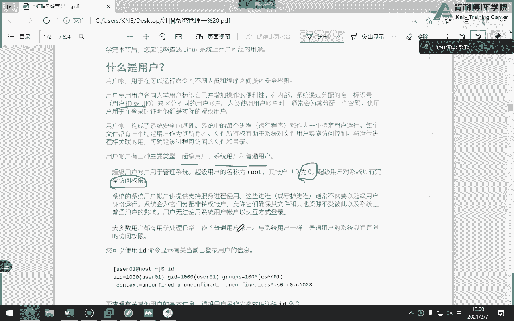
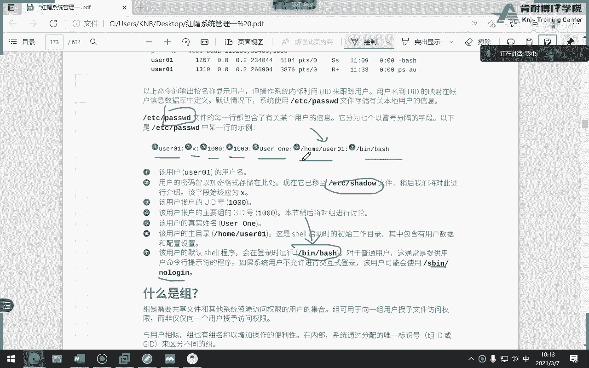
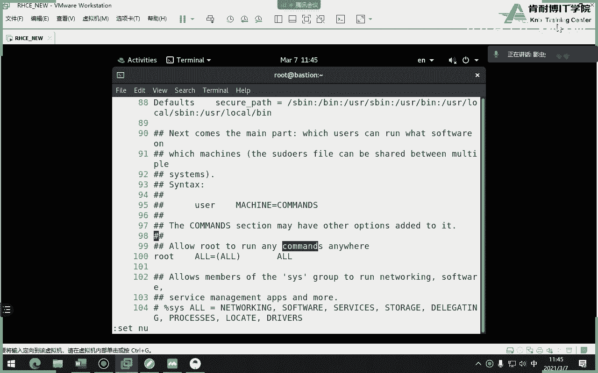

# 红帽认证系统工程师RHCE8-滕老师出品 - P3：第二天 管理用户 群组 - KNBIT认证中心 - BV1up4y1h7MA

好那么我们今天是20cc的第二天啊，继续昨天的第五章的内容没有讲完，那么我们昨天讲到这个叫做管道啊，我们现在开始讲这个管道符号，那么什么叫管道符号呢，一句话用那个竖线是表示管道符号。

就是你们键盘哪个方面，就是你们键盘那个那个哪个地方回车键旁边吧，这个竖线竖线叫做什么呢，叫管道符，什么叫管道呢，一句话一句话结合多个命令叫管道管道，明白吗啊你你你记住了，是管道符号，就是这样的出现。

它是结合多个命令，怎么结合呢，大家可以看到，比如说第一个命令，然后竖线第二个名，当然了，你以此类推，可以有很多更多更多明白吗，好那问题是我们为什么要有这个竖线符号，这个管道符有什么作用呢，各位各位。

为什么说咱们的linux的命令行，它的功能比较强大的，就是体现在这儿的，你比如说有时候一件事我用一个命令搞不定，但我可能用两个命令就搞定，或或者我用更多的命令可以搞定。

所以说管道竖线就是为了结合多个命令来完成一件事情，或者或者是完成一个特定的目标，如果如果大家觉得还是不是很了解的话，我们举一个小小的案例，各位大家应该想过一件事啊。

当我用这个命令ios杠l etc是什么意思，是不是显示出etc下面所有内容，但是这个etc啊我告诉大家会非常多的内容，咱们一个屏幕肯定显示不了，那能不能还记得昨天我们学过哪个命令来着，拍那个帽吧对吧。

那有没有这种感觉，我能不能把l s杠l后面加etc，这个里面的内容通过输出到右边这个冒命令，让那个冒命令进行翻屏来显示，能理解我的意思吧，那中间要加什么竖线，懂了吗，哎这不就代表了就是我按道理呢。

我应该会把所有内容一下子显示到桌面，但内容太多了，肉眼看不过来，怎么办呢，没关系，我加个毛命令，直接进行翻屏显示。

这不就可以了吗，来我们演示一下，你比如说非常多对吧，你比如说我我我想os etc那样很多啊，那还不是很多，那找一个很多的哪个比较多酷吧，少用挺多的啊，得了就这吧，哎我们可以这样的，你看现在可以翻屏。

明白我意思吗，唉放平懂了吧，所以什么叫做这个管道结合多个命令。

当把第一个命令的输出扔给第二个命令当作输入来仔细听我的意思啊，把第一个命令的输出通过竖线扔给第二个命令做输入，当然了，有没有可能就是我还没完成我想要的结果，那是不是要加更多的命令对吧。

哎那也就是说管道符号是没有上限的，就你可以加很多命令，直到完成，你要的结果能听懂吗，朋友们来我举个例了。

各位我做做一个稍微复杂点啊，这个命令呢是显示当前网络接口，就是说白了就是啥网卡啊，显示我当前的网卡地址，我小一点啊，来各位，if configure是显示我当前的网卡地址好吧，但大家看我现在有几张网卡。

各位一张两张单都是假的啊，一张两张，三张四张好，反正好多张好多张，唉，我现在只想看这一句话，同学们，我想看172。25254。56啊。

各位我不需要桌面上一堆这些东西。

我只要最后的结果，我的桌面上只显示172。25。254。250，那怎么完成呢，首先我问大家。

1005。254。250是哪一张网卡的，是不是一个叫做b20 的网卡的地址对吧。

那像后面这个b r e啊，e n s33 这些东西是不是就跟他没关系了，那怎么办，很简单，我能不能这样子，先写成b20 ，这下的是不是过滤多少，其他过滤很多东西了，但是我我想要的结果是。

最后桌面上只出现这四个数字，那怎么办，唉这个时候很显然就要用到我们的竖线，你看是不是你不用管我打什么意思好，你看这个命令是筛选过滤，筛选以关键字i n i t筛选，为什么。

因为这个数字是不是通过它来得来的，对吧好，但是还不行，为啥呢，我再说一遍，我最后只想要这个结果，我根本不想要这个ipv 6的地址，那怎么办，我是不是可以把ipv 6再过滤掉，对不对。

再把rpv 6过滤掉，哎说明号是不是只有这一行了，就上面这一行了对吧，阿b v6 这个地址没有了，但是还是不满足，不满足怎么办，再来，那怎么办呢，我现在只想要什么呢。

我只想要后面那个一七二点二五点这个网段，对不对，那就是你不用管我打什么命令啊，你也不需要知道，你只要看一下效果就行了，这不就完成了吗，所以大家来看我这条命令结合了几个命令，一个命令，两个命令，三个命令。

四个命令中间是不是用了三个竖线，最后完成了一个效果，对不对，所以这就是雷蒙斯的命令行的强大的地方对吧，只要你的命令学的够多，只要你的思路够清晰，你玩的够转，你就可以达到windows做不了的东西理解吗。

咱们现在的教材编的不是很好啊，连是要脚本都不讲，其实你作为一个系统管理员，是要求会写需要脚本，这就是个典型的事，要交不少的啊，就通过各种命令的结合，甚至以后还要学会更更深的，比如什么判断句啊。

这个这个什么函数啊，for循环啊，这东西就像咱们以前学编程一样，能够写出这种脚本，是要求有这个能力，你才是一个合格的系统管理员，所以说像这种东西你要多会啊，当然我们今天才第二次上课，你肯定不会。

那慢慢的就可以了好吧，我只是为了通过这个案例来演示出什么呢，就是我们的竖线，它的一个伟大的地方，好，讲到这儿大家能理解了吗啊，下次有人问你这个管道干嘛了，结合多个命令来完成一个特定的事情。

因为有因为因为啥呢，一个命令搞不定啊，我就要结合两个，三个四个甚至更多，只要我能做出来就行好，虽然说命令之间虽然说这个竖线啊没有这个上限对吧，你结合几个命令都行。

但大家有没有发现每一个左边的命令跟右边的命令，其实之间他们俩有逻辑关系对吧，比如这个命令和这个命令之间有什么关系啊，有啊是通过group命令筛选r n r t把其他都过滤掉吧，懂了吧，它是有逻辑性的啊。

不是说你后面跟着瞎加命令好吧，行这个可以过了，那可以过了，就讲完了，管道就讲完了，没什么好。

继续再看教材，那么你看他说的啥意思，你看这个就很有意思了，这个线能看懂了吗，less什么意思，是不是跟猫一样，也是为了结合翻屏来显示，昨天说过好，那么我们再来说一个叫t e e命令，这个命令呢怎么说呢。

大家仔细看这幅图片啊，同学们啊，这个图片这是刚才学习的管道不好，左边这个命令用完了输出人家output吗，啊不是这个这个这个是输出的意思吧，输出通过这个管道扔到第二个命令做处理，但是这个t命令是干嘛的。

大家来看还是通过管道符号，但是这边多了一个t命令，指的是把第一个文件，不是指的是把第一个命令输出的结果先保存一下，然后再扔给第二个命令做处理，听懂我的意思吗，你仔细看看图片。

有点像咱们以前那个就像个水渠一样，这边的水呢应该按道理应该流到这边对吧，应该是这个方向，但这边他挖了一个这个对吧，唉引流过来，唉引到这儿看到了吗，啥意思呢，就是左边的命令输出的结果应该扔给右边。

但是在扔给右边的之前，先用t e e命令把左边的效果先保存一遍，什么叫效果呢，就是输出听懂了吗。

来我们这样讲可能有点生硬啊，来来来来来来来看一下各位，这是啥意思，昨天说过这个命令是显示李白的文件内容吧，仔细盯着屏幕，仔细看好，你先不用管它干嘛的。

也就是说我现在这一这一票输出是不是password的内容好。

但是呢我比如说啊，我只想看root这一行怎么办，同学们，想想是不是可以通过刚才我们学的哪个命令g r e p grape，是不是gb啥意思，刚刚说我是有点类似于筛选嘛，对吧，哎我可以通过竖线grave。

我只是看看谁root root怎么写，就是root吧，大家来看是不是桌面上只有root这两行了，是不是是不是啊，好那你看这就是一个刚才学过的管道符号，但这时间大家来看我做这样一件事，同学们。

abc a b c什么意思啊，没有任何意思，就是文件名字你也可以写成456123，或者写写写你的名字都行，好吧，是我随便起名字，大家来看这句话，第四是指cat etc password里面有一堆的东西。

对不对，他先给我保存到a b c里面，然后从a b c再进行筛选筛root，那我请问大家，什么叫所有，就是刚才那个八嗦了一堆东西，两行嘛，对吧好，那么这个a abc里面有谁有有所有吧，听懂我意思吗。

同学们听懂了吗，没了这是我要给大家讲的，你看你仔细看看图片，是不是我先引流到这边保存一下，扔给再给扔给第二个命令做处理，懂了同学们讲完了要t一并列，简简单吧，这么简单，但是呢教材当中少了一个概念。

我来给大家补充一个小小的概念，t e命令有一个非常经典的选项，叫小写的a你你给我记住啊，这个a在我们的学习过程当中有两种含义，我说最常见啊，你别给我找那种犄角旮旯了啊，我这两种最常见的含义，第一个是哦。

还记得吗，刚才哪个命令当中，这个用a了，ios杠a吧，就等于ios杠杠二吧，是所有的意思，还有a第二个最常见的含义就是追加a p e n b，那你觉得这个人应该追加还是显示所有呢。

追加也就是我们t e b00 当中的a选项，不是all的意思，是追加追加的意思，什么叫追加的，同学们，昨天咱们是不是学过两个大于号，那是不是要追加好，那么这个意思是一样的，你比如说各位来看一下。

我给你给你们解释一下，来来来来来来来，首先我问大家a b c里面现在目前是什么的文件的内容，这不是趴做的内容，对吧，很好好，那接下来我再做一件事，我这时间我我我我今天啊，我今天不想看password。

我今天想看其他文件，其他文件是什么文件呢，叫做group，这个是保存用户群组的文件，先回车啊，先不用着急，咱们一条一条命令分析回车，大家看，这是所有群组的问题，全这是所有群组的信息。

似乎好像是比刚才那个用户信息要短很多，就是短好仔细看，我能不能这样子，同学们，我能不能这样，t一杠一个小写，a干嘛睡觉吧，a b c，然后干嘛，啥意思。

告诉我是不是我先把group里面内容先保存到a b c里面，然后再从a b c里面只看root对吧，说不上是不是只有root对吧好，那这时候大家看，如果说我看a b c的话，里面会有谁。

是不是有password里面的内容和etc group里面内容，懂了吗，这有什么不理解的，上半部分这些长的同学们，从这开始，这些长的是什么内容，就怕做的内容就到这儿。

而下半部分短的这部分都是谁group，看懂了吗，看懂吗，那如果你刚才会加a，你知道会发生什么事情吗，里面是不是只有谁了，如果不加a6 里面是不是只有gp了，听懂了吗，选项记一下嗯，教材没讲，我说能吸。

那有有吗，教练说了吗，我没说没说我，我就告诉大家，你气为啥，因为有用啊，你们老师什么时候用，我也不知道你们什么时候用到，但某一天你真的用到了，你就得会咱们学这些cs的各种零零散散的命令是干嘛的。

是为了以后你工作当中写脚本用的，虽然咱们教材不讲脚本，但你一定要学会，所以说等到课程结束之后，我要求你们每一个人必须自学脚本，怎么学，百度量上面有免费的视频，你想花钱就花钱，你想免费也有很多免费的。

然后你想买书也行，反正你得学啊，你不学下小百合，你是不可能做linux运维这个工作的，我就可以负责任告诉你啊，如果有些人有十家面试，你的公司得有11家问你会不会交朋，你们朋友啊，我现在就干。

练的时候没有让我写脚本，所以你工资低啊，真的各位没有不不会脚本的，是不可能完成很高深的这种这种工作，你可能只是给人家装个系统，修个电脑，而且现在的实现对于我们来讲，现在的运营工程师要求更高。

他还要要求你会写python，这个听过吧，你别告诉我没听过python，我不会写，我教不了大家，但是呢我还信你们得会啊，我现在无所谓，对不对，我不上班，那你们得会对吧，所以shell脚本是必须会的。

没有什么可商量的，在以前红毛七的歌，在以前我们红毛七的教材当中讲脚本，但红毛八取消，他取消咱们得讲啊，如果有时间我也讲，没有时间咱们就推荐给大家去找资料，百度上还有b站上对吧，这叫b站吧，还有优酷啊。

反正很多免费的视频资料，但是你都可以，甚至淘宝上还可以花十块钱，20块钱买那种，人家就是自己录的卖的那种那种收费的啊，你一定要学好吧，好那么这个t命令什么时候用写脚本一定会遇到。

那么为什么要给大家加个小写的a呢，因为我就怕你们未来写的时候，不知道有a一下子把原来的文件里面内容覆盖了，那你说你恶心吗对吧，你要不用a的话，肯定里面内容覆盖了，看a b c是不是只有grp了。

那你下次完蛋了，那你的工作肯定失误，文件被你给覆盖了，那你肯定你就打辞职报告了对吧，明白吗好那讲到这儿就结束了，这是我们昨天遗留下的一个小尾巴，好vr变器还有什么要讲的吗，说过了吧。

昨天三个模式哪三个命令行二写入第三个底行模式对吧，墨行模式对吧。

如果我不想输入wq这两个字，保存，我又不想这两个字这么多，我想能不能少打一个字呢，可以啊，你打x就可以，x就是wq，大家注意我说的是小写的x为啥，因为大写的x不一样的，昨天课讲到这儿就没了。

好那么今天呢重点呢是我们的第六章叫管理本地账户和组啊，注意看它的用词是本地账户，那说到这儿呢，咱们就得啰嗦一句，除了有本地的，还有副本地，什么叫做非本地账户弄呢，大家有没有公司里面。

咱们公司有没有比较大的公司用到了玉环境，windows的玉听过不像windows的玉环境，就不是你本地的吧，都是谁的，我也不知道，反正反正不是我自个儿建的，可能是管理员帮我建的对吧，那就叫远程用户对吧。

哎或者网络用户，那咱们今天不涉及这些东西，因为太难了对吧，咱们只讲的是本地，什么叫本地，就我现在自己装的系统，昨天咱们自个儿装的系统，最后一步是不是要建一个普通账户，那个账户就是本地账户啊。

那么我们今天讲的是本地商户和本地的组的惯例，跟其他没有关系好首先来看一下这一章的目标，首先描述一下什么是账户和群组，他是啥意思，干嘛的，为什么要有它对吧，第二怎么去切换用户，其实切换用户会用脚吗。

昨天学过吗，哪个命令啊，昨天说过和没学过，哪个是s速八啊，速命令对吧好，那么我们这个得稍微聊一下这个如果不聊，咱们第三本书enable，听不懂，我以前在讲红毛七的时候，我懒得讲那个东西。

我从来不讲不讲啊，有时候就忘了啊，反正考试不考吗，我有时候就忘，但这个时候呢咱们得好好讲一下，啰嗦一下啊，我我会给大家增加个123哈，这个东西仔仔细听啊，今天你们上午的内容就是必须把这个学会。

不然的话想到第三本书播的时候，你就听不懂了，你们老师这个跟第三本书有关系吗，关系大了啊，但到时候我就不会再讲了，你到时候你听不懂，那你就翻视频好，第三个呢就是怎么去创建修改，删除用户。

怎么创建修改删除群组，这个不用解释吧，还有就是怎么去干嘛干嘛干嘛干嘛，设置密码，因为老师不对啊，设置密码咱们昨天学过pass了，对不对啊，咱们今天学的不是pass了，咱们今天学的是什么保存密码的策略。

策略什么策略密码啥时候过期，密码最大的，你那个可用天数对吧，明白吗，就这些个东西啊，咱们得明白好吧，就今天这一章内容蛮多的啊，现在十点整可能咱们会讲到11点看吧，到时候看好第一个什么是用户。

他你要自己看书，你说这些字你根本就不愿意念，其实什么叫用户就不用解释。

每一个用户，每一个系统都必须用一个账户或者叫用户来登录系统来操作吧对吧，那么这个东西就是咱们所谓的用户，你比如说我们现在开始上课了或者上班了，那我必须要用一个用户登录到系统。

比如说像这台电脑用户是这个吧对吧，或者说咱们的root啊，那这就是用户。

那么问题是我们的用户，说白了啊说的比较通俗一点，叫身份证，怎么来区分你们用户的不同呢，不是通过名字，大家一定要理解一个概念，不是说我叫root，我就是管理员，明白吗，是看你的身份证。

你的身份证号就是u r d啊，不是身份证，就就咱们所谓的身份证嘛，这个ui d身份证来决定了你的地位好吗，哎这一点一定要明白啊，各位好，那么有三大类啊，我就不写笔记了，我懒了三大类，第一个是管理员。

第二个是系统账户，第三是普通用户，所有的电脑就是咱们所有的系统，所有人linux系统，甭管是红帽哪个版本用户，就这三类，第一个管理员，第二个系统账户，第三个普通账户，管理员不用解释它的优化t永远为零。

你要给我死记硬背这个东西，只要看到u r d是零的，它就是关理员，我不关心他是不是叫做r o o t，而且超户就超级用户，它具有完全的权限，所以说工作的时候尽量不要使用它。

但是咱们考试和咱们这几次上课都必须使用管理员，那言外之意就是咱们下节课要讲的权限跟root有关系吗，各位有关吗，没关系，咱们所谓的权限限制的都是咱们的普通账户，跟管理员没关系，管理员是不需要有。

就是比如说比如说这个文件，普通用户没有权限诶，但是管理员有啊，明白了吗，哎是这个意思，那么问题是什么叫系统账户呢，大家可能不太理解什么叫系统账户呢，系统账户它并不是我们建立的帐篷。

是装系统的时候就会自动产生的用户，你比如说各位。

咱们未来大家有没有听过数据库吗，销售有吗，听过吧，mysql这个数据是一个服务数据库服务，你会发现当我们装这个数据库的服务的时候，它会自动建立一个用户叫马斯克，那因为我们没信啊。

我不是你建的是系统自动键，为啥，因为他要用这个my circle用户来维护my circle这个服务，像这样的用户叫做系统账户，而且这个账户还有一个最大的特点，就是不可以登录系统。

那么我们可以总结出一句话，系统账户一般情况下是不允许他登录系统，那那那我要他干嘛，我们说了，系统账户的目的不是让它登录系统，是为了维护这个服务而存在，举个例子。

windows当中是不是有个叫服务这个概念，那边有很多服务，你能随便删吗，不能吧，也许也许你某一个服务删掉，就会影响你整个系统那一样，如果你把这个系统的账号删了，很有可能就会造成咱们系统的某些事。

这个问题出现，比如说你把马赛克用户删了，很有可能就造成马赛克这个数据库起不来，或者说怎么怎么各种问题吧，懂懂我意思吗，所以这类账户是不让他登录系统的，但是他还不能删。

而且我们的整个电脑当中充斥着大量的账户，都是系统账户，而不是我们的什么什么什么嗯。

不领导的好，第三个就是普通账户，什么叫普通账户，就是你我建立的账户叫普通账户，比如说我昨天建立了tom用户，我昨天建立的学生用户，原来昨天建立的u的u u的二，这些用户都是普通用户，听懂我意思吧。

这叫普通账户，ok那么接下来我们来说一个事，关于用户，关于用户用户呢，注意刚才说过三类对吧，是通过什么u r d来什么判断身份，那么问题是ui d是多少呢，我们来写一下root u i d多少哎。

就永远是零，永远记住永远是零，而且普通这个普通账户ui多少呢，注意注意是1000是大于等于怎么写，这样吧，大于等于1000好，介于中间的是系统账户，是的吧，一到多少，懂了吗，好注意。

我这样写的目的是让大家知道这些东西是红帽七和红帽八个，而红帽五和红帽六不是这些啊，他是1~499大于500的，是普通账户，但是这里你不用记，因为一没有任何意义。

教材当中也告诉大家这一段话吧，在哪啊，教材当中已经告诉我们大家这句话了，u r d在红帽五和红帽六的时候是500，但在红毛七和红毛八的时候是从八八，是从多少1000开始，但这个不用记，没有没有意义。

他也不会考你啊，为啥因为这些东西都可以改，比如说我举个例子，我就想建一个用户，我我就想他的这个阿里号是这个是是是是是666行吗，可以啊，难道你说666就一定是系统账户吗，不是我是说如果你不改的话。

系统是给我们这样规定的，但你要如果改是可以改的，明白吗，因为考试就让你改改，注意考试就有这题，就让你改改，好吧好，但是永远系统ui d v0 呢是不变的，好吧好，那问题是我们怎么建立用户呢。

哪个力量猜也能猜出来了，user，创建用户，注意这个用户创建的是什么用户，普通用户对吧，你不能告诉我创新管理员对吧啊，普通账户普通账户好，那么如果你不改的话，默就是1000以上或者1000好。

那怎么删除用户呢，我们再说一下u的dl删除用户，注意一定要加个r加上用户名，那么为什么要加个r呢，注意选项r的意思，选项up的意思是指删除用户的用户。

用户中心用户的同时把其家目录删除，那算下来我们得引申一个小小的知识点，同志们，我们新建一个用户的时候，系统会给我们分配一个同名的家目录，还有印象吗，昨天我说过加目录在哪，普通账户，错哪来的根。

据说这个是根，永远记住这个是根，这个是根，这个斜线是根，再说一遍，这是真，这是啥，这是root的下，这是啥，普通账户的加，那么如果建立u的一，他的加盟都在哪，后面下面的u的一定要说清楚啊。

不是跟哪来的根，永远记住这个是如果你这个还分不清楚，你后面就学不会，学不好了就学不会了啊，你注意啊，普通账户新建一个用户的时候，他会新建立一个加目录，当你删除的时候加个r选项。

他就会把这个目录一并给你删掉，明白吗，能理解吗，好那我跟你讲，如果不加能删除用户吗，能但是加目录还在吗，在所以很麻烦，不是home被删了啊，这后面下面用的一删了一定明白啊，千万别把说home删了。

来看看，已经网开，稍等，举例了，你这样明白啊，你看新一个用户叫ue，你看跑到后面下面是不是有个蓝色的目录，这就是一对吧，那我删除用户326。1，你看这个目录就没了，懂了吗，就这个意思啊。

他说的是这个意思，千万不要认为是把home删掉，从后面11点，然后呢继续第二个，然后我们要讲的是关羽，该文件是保存所有，所有用户的信息的文件除了密码之外，月老师不对啊，你那个文件名字叫password。

为什么没有密码呢，对就是没有密码，很奇怪吧，很多初学者以为ek c password保存是密码错的，保存是用户信息，那言外之意就是这三类用户，这三个用户的信息都保存在哪，password。

你看咱们上课老师说passworpasswor，哎就是这个意思好吧，那么每一行是一个用户信息，那如果有多少行，就有多少账户，昨天是不是学过这个命令，刚哪个是行号，l怕是如果现在有33行。

就代表这个电脑当中有33个用户，但不一定是什么账户，对吧好瞅一眼，每一行是一个用户信息，这一行是管理员的信息，这一行是b用户的信息，巴拉巴拉巴拉一堆，那么我要求大家要把这个给我背下来。

就是每一行的单词的意思，你要给我背下来懂吗，哎呦不错，必须背啊，好那么。

就玩写吧，其实我不想写，为啥，因为书上都有啊，不想写了不写了不写了，我来给你们解释吧，你一定要会背啊，一定要会背背，各位一定要会背，第一个字段是用户名，第二个字段是密码问，第三个字段是第四个字段是g啊。

第五个字段是备注信息，第六个字段是加目录，第七个字段是shell环境，那么我来一一解释，第一个字段是用户名，不用解释吧，第二次段是密码，刚才讲过密码保存在e t c password，但是发现不安全。

密码扔到了一个叫做shadow这个文件里面了，但这边又不能空，怎么办呢，就用x当做战法v，懂了吧，就密码原来在这儿不安全，但是扔别扔给别别人了，然后这个地方就用x来代表一下，明白吗，第三阶段的尾u化地。

菊花地，第四段叫做gr的第五个字，那叫备注，什么叫备注，这个教室是红帽教室，这叫备注吧，好第六个字段啥意思，猜一下就能猜出来，干嘛呢，加木有，第七个组件是shell环境，shell总来说吧，壳。

好那我们来看我们的电脑。

你肉眼不用仔细看，你放眼望去，最后一个字段都是什么，是不是都是no login，看是不是好多，你不要仔细看，就大概看一下是不是都no no login，那都代表什么叫no login。

不可以登录操作系统对吧，还有一个上当还没有发现，为什么这些都不能登录系统呢，刚才我说过哪些个用户是不允许登录系统的默认性能账户，那你怎么判断呢，我们判断第三个阶段，第三阶段是啥字段，u i d。

你看u i d范围是不是我说的1~999，看是不是这这类账户都不能干嘛，看看看看都不能登录系统，你看我怎么可能起一个用户名字叫做shut down了，我又怎么可能起个用户名字叫debug呢。

对啊那个nobody呢对吧，很显然这些用户名都是系统给我们起的吧，而且你看u r d像这个14是不是小于999好，我们切换一下试试，昨天说过切换，你看能中路吗，你看不能吧，你看不能吧，不是不是不能吧。

看不能不能，但有这个账户吗，有这个账户吗，有啊，但他不让你登录，为啥，因为就是最后一个字段变成了no老兵，那哪些个账户能登录呢，各位哪些项目能登录，主要是在这种样或者都能登录这种。

bh所以你自己建立的用户，它一定是bb，那我问大家一个问题，咱们的考题来了，他说请建一个用户，就u的音，但是不让他登记了，怎么做，不懂，是不是把最后一个字段从并代时改成no legb nologin。

是不是简单买吧，那你之所以觉得简单，是因为你现在你懂了，原来最后一个死板是决定能不能更新到，一定要改成s b下面no log加目录不用解释吧，是不是每个人都有家目录。

管理员的家目录在哪，在root吧，哎所以说你看管理员下目录，是不是在第五字段啊，不第六个字段就在这儿吧，你看普通账户的家目录就是在home下买的，什么什么什么什么管理员能登系统吗，当然能了。

但operator这个用户能登系统吗，能吗，不能吧，因为它是s0 nologin好，关于这个文件还有什么疑问吗，我要求你们会背下来，什么叫会背，我下次说第四个作战什么意思啊，啊gd懂了吗。

哎什么叫奇亚迪，各位祖八帝好。

所以说我们总结一句话啊，关于组我们总结一句话吧，建立一个用户是用户不会该用户分配唯一的ur d，并且分配一个家目录对吧，并且那啥会创建一个同名的，主因此有gd嗯是吧，你想想我们刚才建立一个用户叫优点一。

我没给他建立用户叫主教u等，有没有先例吧，那他为什么给他分配分配g r d呢，你刚刚说过第四个字，第四个字段是gr d，凭什么，就是因为它创建一个同名的组，我们是通过rd命令。

咱们先来学一个新的命令阿d命令来显示。

其实吧，你比如说各位。

我想知道这个账户在不在乎在吗，不在，那我想知道这个账户在不在这把你看有什么，这是啥，记下id吧，这句话id是108好，所以阿迪那个是不是可以判断一个用户在不在，好来了，别说让你写个脚本。

各位我说你给我写个脚本，你给我写个脚本，写个小程序，当一个当我随便输入一个用户的时候，我来判断他在不在，但你现在肯定不会想你，但你你有什么思路，各位我随便输入一个用户，啪啪给我跳出一个小菜单。

我随便输入账户，输进去，下面立刻出现一句话，这个用户在或者这个用户不在，这是个小程序吧对吧，问题是我要用什么办法来判断这个用户在不在，你肯定不会写语句，但你有思路。

你有什么办法来判断在不在能不能用阿迪是不是一个思路，第二个思路，我通过查找etc password里面如果有这个账账账账户信息是不是也在对吧，为啥，因为阿d命令读的是谁，读取的是谁。

就是他做的这个文件里面的第三个字段和第四个字段吧，看这是第几个字段，u r d是第三个吧，g r d第四个明白了吗，所以你看这是不是思路对吧，但是我知道你们肯定不会写，但这是一个思路。

就是通过rd命令或通过查询pass的文件来找出，如果有这个账户信息，这个用户出现，如果没有说明不在懂了吗，所以rd命令很简单非常简单，这两个字你能记住吧，但是很很很管用啊，rd好，未来我们在工作的时候。

rd命令会正常用，会经常用好了，结束关于用户就说这么多，再说一遍，u的dr l d l是删除用户，并且要加个小写的r加目录能记住不，永远给我记住啊，r选项，为啥如果你刚才忘记了r选项。

你会发现一个好玩的现象，就是这个用户的家目录还在，对不对，但是当你在同名的再创建u i e u d e的时候，你会发现你根本创建不上去，比如说我之前有u的音，但我把u的一删了，但是我忘记加二了。

u d e的加目录还在，但是呢我又想新建一个用户叫u的e，你发现他进不上去，他说啥，他说约了一个项目录已经存在了，所以你见不上去，所以你看你麻烦吗，好但是个事你怎么解决，其实很简单。

你进到home里面把约到一删掉就行了对吧，这个目录删了对吧，但是你会发现很麻烦，所以你一定要加个r方向懂吗，还有pass这个命令，如果是个普通账户的时候，一定要给他强壮的密码。

而且我们昨天说过password命令是不是只能给自己用户密码对吧，你要给他一个强壮一点的一样管理员，那就更不用讲了，管理员要非常非常强壮的密码啊，而且在生产环境当中还不要用窗户。

不要轻易的就切换成管理员，除非你是管理关系，你会发现咱们以后在工作当中，基本上你是拿不到管理原理账户，除非你是你们公司的这个服务器的，就是你管理下的，你不是管理他，你只是个运维人员。

你比如说你每次登录系统，你要用管理员要给你分配一个账号，那个账号一定是个普通账户对吧啊，所以说你要小心哦，密码再说一遍，password文件是保存用户信息，但是没有密码，刚输的密码跑到哪了。

影子文件shadow好吧，第二个什么是组组，就是需要共享和其他资源一块的这种一种用户集合，比如说咱们有三个用户，他们三个用户的目的都是一样的，那我就可以把他们三个人加到一个组里面。

说白了就是目的性一样的，用户的集合叫做组，是吧，你比如说你是学语文的，我是学数学的，那咱们俩肯定不能挨一块儿呗，对不对，所以说咱们家建不了一个组，组就是目的性一样的权限的访问又是一样的。

我们通过组来管理，为啥我现在有100个人，那你要一个一个分要分100个权限，但我现在给他加到一个组里面，只要分一个组的权限，是不是那100个人就ok了对吧。

就这意思嘛对吧好那么一样一样足也要有g r d来区分啊，叫g d，那问题是这是干嘛的，etc password是保存用户的，那etc etc group呢保存组的对吧，人家族也得有个地方保存信息啊。

对吧好，那么我们来说一下关于组嗯，关于群主的话的分类，刚才说了，用户的分类有几类，三类ui这个这个对吧，是分类，那么群组的分类呢，两个主要组室友说不不不不不不不，附加速度，什么叫主要组。

主要组在一些课外教材当中，把它翻译成私有组，所以说以后你看到私有组主要组，你知道这是一个事啊，不要认为这是两个不同的组，不是c组，主要组都是一样的意思，那什么叫负数组呢，我主要教红帽课程。

但是我好像还能教网络课程，那这个网络是不是我的附加的对吧，所以说一个用户加到一个主要组里面能加几个，那能加几个附加组无数个吧对吧，那你能力越大，责任越大对吧。

所以附加组是多个主要组织一个这个一定一定要分得清楚啊，好吧，那你想想各位刚才e t c pass了当中第四个字段是啥，主r d那是谁的组阿d呢，什么组阿d呢，主要的附加的想想想，想，是吧，你有两个组啊。

你有两个类型的组，那我第四个字段到底保存的是主要的d还是附加的d呢，你得搞清楚啊，肯定是主要的吧对吧，附加的那海了去了，那如果我这个人加了100个附加组，那后面是不是应该有100个阿力号。

照你这么讲的话，不可能吧，这只有一个id号，那这个id号一定是主要做的好，为啥呢，因为待会我们讲权限的时候，你会发现有关系，现在可能没有感觉，讲到权限的时候，你会发现哦，那个权限里面的组指的也是主要组。

刚才讲过所有的主信息保存在哪都保存在都保存a t c group没有s啊，不是group 4好好，那它里面有哪些信息呢，我们打开看看各位同样每一个里面是一个组信息，每一行是一个组信息，好是不是短了很多。

那第一个字段是什么，猜一下用户名锁屏，换哪个用户名，左边第二个呢主要有密码，各位这是密码，这密码，第三个呢，记i d吧，哎很好，而且说过是什么，主要做出加点它等。

也就是说这个里面的第三个阶段等同于etc passwor当中的第几个四个，第四个吧，第三个是ur d u r d对吧好，那第四个字段呢，你说哪有第四段，老师有啊，那么画面空白不是第四个字段吗。

你不能说空白不算字段啊，如果空白不算字段的话，为什么还有冒号啊，那你猜一下后面的应该是啥，对称远左嘛，肯定有成员嘛，各位各位，你比如像这个轮子这个组，它的一个成员叫就student吧。

是不是学生这个单词是不是轮子车轮对吧，轮子啊，好，明白了吗，同学们，那怎么建立组，猜一下刚才是u的a add啊，那现在呢呵呵不a d d呗，那怎么上述组group d e l有r吗。

哪来的r2 是干嘛的，二删除加目录猪肉啊，猪肉加目录吗，没有啊，哪来的明白吗，所以你要理解他啊，那么我们总结一下同学们有几个非常重要的文件，第一个bt s8 做的etc grow。

第三个e tc shadow，大家还没讲对吧，是不是叫shadow影子，影子对保存什么呢，口令的吧，其实还有一个文件叫e t c g，它做这组的密码的文件，刚才那个shadow是保存用户的密码的文件。

这个g password就是没有空格啊，就是g password保存的是主的密码文件，但咱们这个教材当中没怎么介绍，我们就一点过了好吧，所以有四个文件是关于组合，一定要记在脑子里。

而且我要求大家这四个文件你一定要保存好，因为一旦被黑客黑进去，就相当于就为了黑你的这个系统的密码和，比如说有个人把他做了给删了，或者有人把那个删的文件里面东西给你弄坏了，那你系统就登不上去了。

非常重要的对吧，大家应该知道windows当中呃，咱们以前是不是可以用工具来破解那个呃mistry那个密码，它破解的就是里面保存的这个windows的密码文件，把它给它擦除掉，就可以成功进去了，那一样。

如果你把t password或者shadow文件给它弄丢了或者弄坏了，是不是人家也可以登系统了对吧，所以这个文件一定要保存好，保存好，但其实平时你也用不到，你也不会去随便去改它啊。

好下个休息会吧，上来一个钟头。

那么接下来我们要讲什么呢，就那个主要组和补充组，就是它翻译成什么叫附加组对吧，附加上好，来我们看这句话，我就不想来，我们看这个i d后面如果不加任何用户名，看的是谁，当前五。

那你来你能给我分析出来这句话什么意思，这个不用看了，这个你根本看不懂，不用管它，就上面这句话你能看出什么信息，就咱们不要光听课，就你如果你现在自己正在预习，你看到这一串，你能分析出什么知识点。

第一个我能知道他当年看的是uzu的三个用户，第二个他的id号1003，左安id号1003，后面有一个s又一堆这个这个这个是什么东西，附加组吧，好那问题是，那我问你当你不看那个时候，不看这一串的时候。

光看后面的三个组，你怎么知道哪个是主要做，哪些是附加组呢，去吧去吧，我现在告诉你了，那你不是你怎么知道一定就是第一个1003呢，永远记住这边是第一个，就是主要的后面逗号的都是什么附加值。

还你还能判断出来这个字段一定是etc pao当中，第四个字段也一定是e t c group当中的第，所以你要能把这些问题一块结合起来去复习，才说明你有效果，就不是说我看一个命令，只是看自己一个命令。

你一定还是昨天我告诉大家的，要不结合起来，上下都要结合起来，打通它整个体系打向他，明白吗，大家还看到一个效果，为什么主r d居然跟我们u r d一模一样，看到没有，这么巧吗，就是这么巧，刚才讲过。

只要你建一个用户的时候，是不是给我们同名建一个组对吧，只要你建一个用户，就会给我们同名的建立一个组，这个组是这个用户的什么组，主要组，因此他的阿里号默认情况下我说默认就会跟我们u r d一模一样。

既然是默认能不能改可以，那我一定要改的话，gd会不会改，也许改也许不改，但下地能不能我手工改，当然可以了，你uid都可以手工改为gd都可以吗，当然可以了对吧，所以这一串知识你都把它打通了，你就明白。

还有为什么有s我们学过英文的同学，同学都知道s代表复数吧，所以你一看就知道后面加肯定是多个附加组负数吗对吧，所以有时候你从命令的输出你也能判断出来一些隐含的东西，一定要懂。

ok他说如果有这这是这是这三个命令，就是这一章的主要内容，i d password和group，对这些东西哎这什么意思，这个五是啥意思，各位打什么5v一是啥的，不就是卖配置的第一章和漫配置的第五张吗。

刚才是不是学过迈迈，第一张是什么用户命令吧，第五章第五章我也不知道，不知道，你就反正再看呗是吗，唉所以你注意这些东西你都要知道啊，虽然我不要求每一个字回家看，但是你要能够把握住这一篇文章。

当从这到这的一些个重点，你这样看出他有效果，好吧好，那么接下来我们就来讲命令，有没有哪个命令的儿子有命令有啊，相信我，我先把窗户说完啊，大部分情况下我们是不允许超过动力系统的，为什么。

因为窗户的这个太太也权限太大了，就等同于windows的什么阿里梅斯吹特，因此大多系统呢是我们是不让它登录的对吧，因为太太太厉害了啊，这就不说了好而且呢如果你是管理员。

一定要注意把窗户的密码做得非常强壮，是大写小写，什么特殊字符啊，什么最好多少，咱们一般都要求多少，十十几位以上是吧，16分18 19都行，反正就是越长越好对吧啊，但你不能太长，参加自己自己都忘了是吧。

忘了你们的考试，第一你们你们考试有一题要有一题，原来是第一题，现在不是第一题了，就要破解密码了，你知道吧，快点关里面没玩了，有一题啊，那么怎么切换用户su横线，好，重点来了，我们说切换用户叫s u。

那为什么要加横线呢，从今天开始给大家养成一个习惯，每个用户在切换的时候都要加红线，但你会发现很多的老的工程师都不加红线，所以很多人就学他学学学学学学坏坏啊，所以我们今天就给大家纠正过来，一定要加个横线。

为什么我们看嗯。

我这边有个用户叫做随便建立啊，身边有一个户user app，随便建立用户叫做user，好吧好，我切换它，我们用一次加横线的优点，一退出来再切换一次不加横线的u得一有什么区别，告诉我快快速的告诉我。

加横线的怎么了，不加横线的怎么了，看不出来吗，明显，小号到了号那一个，那不都是哪来的酒啊，这当然井号了，太井号了，因为这是管理员啊，这当然得到了符号，因为这u了一啊，这是用的一这这这不是区别啊。

对说哪个目录说出来加横线的，正在加工了什么，加，约了一吧，就是后面下面用了一对吧，不加分线的，不加横线的用户是不是沿用了上个用户的站目录，看不出来吗，同学们这么明那么明显，你看我不加横线。

虽然切换过来了，但是不是还是沿用了上个用户，上个用户是谁，root加不住是哪，是root压，是不是root，能看懂吗，有人说难道就必须是root吗，当然不是，如果你上个用户在哪，比如九力了。

比如我上个用户是root，但我上个用户在哪，比如我此时是在tm p，如果切换用户的时候，他就到哪儿了，看懂了吗，你能不能判断出来，就是如果不加横线，是不是指的还是用沿用上个用户的当前目录，不是肉卡。

明白吗好吗，懂我意思吧，那你无所谓啊，不就是目录吗，当然有所谓，只是你不知道的，在系统背后发生了很多事情，如果你不加黄线，它钱用了所有的上个用户的环境变量，而你加红线是为你重新开启一个环变量。

这个变量是属于你自己的，懂我意思吗，那你说要不要加回去，当然要不要去沿用上个用户，你明白吗，你看上个用户是在tm p里面，如果不加红线，切换完之后，他还在t m p。

这tm p其实不是你u的e的tm p的环境是谁上个用户，所以就就会产生后面一系列的问题，所以可能所以你可能感觉用的时候没有什么区别，但其实背后有很多的细节部分，所以从今天开始，我们养成习惯。

一旦先用户记得加横线，明白吗，懂我意思啊，你要不加一有问题就不要再问了，你就自己判断就行了，我用完之后一定要记住切换啊，我发现很多初学者有个特别不好的用用用用用的那种习惯就很多。

就不太就是他喜欢这样举例的，现在又想回到肉肉rot了，怎么回呢，他给我，他给他在理论上行不行，你只要输入密码是不行了，但是你有没有发现，其实你相当于在肉肉的里面又切换谁root了，那你不如这个样子了。

你说了明白吗，为啥我告诉你每切换一个用户，相当于在新的shell当中加上一层新的shell，明白我意思吗，同学们啊，然后你再切换用户又再加一层，再切换又加一层，是你当你的层数很多的时候。

你会发现你的窗口就打不开了，我见过很多同学有个问题，就是诶我怎么不断的冲洗器系统，一个重启系统，为啥啊，最后发现原来它的优点就一直切一直切一直切换，你有一个习惯，反正我我用电脑有一个习惯。

我绝对不让我自己切换两层用度a切换到b，从b切换到a的时候，我一定退出来，而不是在用b再切换到a明白吗，所以你也就是个习惯啊，比如a到b了，然后然后b想到a的时候。

绝对不要再这样切换成a b这样干嘛退回到a明白吗，就e s t退回到a这样子会有很多好处啊，给你们养成习惯，还有一个习惯我也告诉大家，就你从第一次上课，你养成好习惯，就是当我一旦用ls s2 。

当我一旦切换到一个目录的时候，随便啊切换到vr，一定接着养成个习惯，改完为什么让你知道下面这些东西就是这个vr下面有哪些个东西，别随便碰或别随便弄丢了啊。

就跟咱们有时候会这样子，当我们退出到当我们比如说打开一个打开一个这个什么。

比如说c盘或d盘的时候，我们习惯性推到桌面，会习惯性的干嘛是吧，一样的道理好吧，就有些用法习惯就养成了以后，就会产生很多的好处好吧，就当你相关目录就ios习惯性的ios，要不是说一定要看看啊。

这里有哪些目录去看一下，做到心中心中有数，然后未来有什么问题好好排错啊，好吧嗯，那接下来我们再继续讲讲讲到哪儿了。

千万注意啊，这个就不要用了，一定要加横线好吧，ok那么我们接下来说几个常见的命令，什么命令呢，就是如何建立用户，建立用户不就刚才的a d d吗，好我不看教材，教材有点乱，我们来讲几个常见的命令。

关于关于建立啊，关于root a b d user mode的选项，请问大家什么叫user mode，猜一下，mod一般是哪个单词的缩写，现在fi呀，巴拉巴拉巴，忘了是不是修改，是修改的意思好。

那也就是说用的add和u的mod都有一堆的选项，一堆的选项，一个是新建用户，一个是什么修改已经什么用户好，咱们不是昨天学过麦手撕夜吗，我今天教大家用这个来看吧，咱们就用这个命令来看卖手册页。

来学会怎么去学习命令好吧，来我们看一下。

不要去看书啊，咱们来看一下卖什么，比如有的好吧好吧啊，有点mod来回车来告诉我这个命令怎么用，首先这个命令意思是修改用户账户，然后就是是选项好，有哪些选项，大家看a是什么意思，刚才说过a是什么意思。

c的单词翻译成中文叫描述或备注，d，有的new director什么意思，用户的新的家目录对吧，还有再比如说再来看一个什么叫gg rd大写的气氛是group诶啥意思，看我们先来看小写的g啊。

the group name of，这是啥意思，这个单词初始化组，初始化组不就是主要组的意思吗，但是他说这个组必须存在好，那我给大家如果不看书，比如说你现在自学，或者你从来没有见过这个命令，你突然想用。

那你通过这个小写的g你能知道这个是干嘛用的，这是干嘛用的，我刚刚帮你翻译了，是不是指定一个用户的什么组，不要说对吧，唉为什么要指定各位，你不是说了吗，新建用户会自动给我们建立一个同名的组。

这个组是我们的主要组，那你既然是默认我能不能自己改好，我想改怎么改，用小写的t听懂了吗，好那你学会小姐姐诶，怎么突然间来个大解题，大姐记啥意思来再看这话什么意思，number of找成员。

这是一个已经存在的组，我们当成他的成员，是不是我们的附属组啊，啊用的时候可以加组逗号组一，逗号组二，逗号组三，逗号组四，所以说你在用的时候，组之间要用什么来分割，是不是你学会了，你得会看呀。

你已经未来是rg c d的水平了，你连麦你都不会看，这不对啊，我今天教狗肉粉，你死记硬背，你得学会它一定要学会自学啊，好那我们再来看还有什么好玩的，这是s啊，同学们，这个单词我不会读。

买入就是lock吧，锁吧，什么锁啥锁，为什么要锁，来看锁住一个用户的什么密码，然后这是什么意思啊，在密码文件前头有一个叹号，说明这个用户被锁住了，锁住是不是就不能干嘛，那我想解锁呢。

那你又不知道看看有没有解锁，往下走看看这好像都不是都不是诶，咱们先说这啥意思，看这是干嘛呢，是不是新创建一个ui d的值，我默认是1000，那我能不能用u u来指定好，再来哪个是解锁了，往下走。

哎这啥啊，有没有大家有没有发现小写的u是啥，一定u i d大写的用呢解锁，所以说你看你能随便用吗，昨天我们上课第一次我就告诉大家，命令有大写吗，你选项呢太有了，现在是不是验证了对吧，我以后上课就是这样。

绝对不写出来，你们自己去看，大家一定要强行去看慢速设计，这样有好处，就是你以后工作当中你就会学会了有依赖性啊，各位各位好，这些像这样的东西我也没用过，就太冷门了，咱就不说啊。

就把一些特别重要的东西说出来。

ok那我们通过这个命令我就知道了，原来有这样几个选项来我们总结一下选项一是指定什么，你猜也能猜出来对吧，指定r d杠c呢还有印象吗，对吧好，那刚好被l呢，是吧，哎但是问题来了，入密码对吧，就锁住用户吧。

哎但是问题来了，同学们，你来猜一下这个锁住密码是给add用的，还给ut mod用的，没考虑吧，肯定是u端mod，实际我为什么我为什么把这个写在他们俩一块儿呢，意思是指这里面大部分粉的选项是通用的。

但是这个锁住密码的可不是通用的，为啥你新建用户是不是在意思是之前没有这个账户，你没有那个账户，你锁谁一下，所以这个这这个选项只能谁用，唉只能是u的mod，我写下来我简写啊，只能是u的mod用。

所以你要知道懂了吗，你看书一定要看仔细啊，各位明白吗，好那大写的u呢吧对吧，解解解除，你先说对吧，我就简写了，明白了吗，那一样这里也是哪个用对吧，你都没用户呢，你你你你解释一下，对不对，明白吗。

哎好那我们再继续来，我们再来说几个，你刚才说哎对小姐记啥啥啥啥啥啥东西，小小小小小小是指定什么组，很好五，那大写了吧，哎对那就那你猜也能猜了，就是负数吧，哎不加醋，这样学就有意义了。

不是说我先把这个啪啪啪给你打出来，然后跟着背，那就你就背，你就觉得很枯燥吧对吧，你要会学习，你看我竟然没有，我竟然没有写，就说明这些命令都是干嘛相通的，我如果写这句话，就代表这两个只能用在mod用。

明白了吗，好那么如果说我现在出道题目，同学们，我一定让你们自己学会啊，我现在说了题目live题目说建立一个用户，建立一个名字叫做user 100的账户，要求ur d，等于666，然后这个备注信息是卡洛。

请问如何做到说我打你不用看啊，你说你就看着我的这个说，先说遇到mod，还遇到add，可以add吧，你都没有，对不对，ok约到a add，然后呢走，先写用户名还是先写选项。

如果你不知道先写用户名还先写选项，你用自己的脑子想一下，是不是一般情况下我们都是选项写中间。

就算你不知道各位刚才那个用法里面是不是也告诉你了，你看用法是不是告诉你了，写中间写用户名吧对吧。

那所以我们应该是谁干什么，然后呢有有有，然后呢c很好，然后呢中括号hello，因为为什么中国号呢，因为你中间有空格吧对吧，就hello和u的100是不是中间有空格好，然后呢最后呢，100这就是道考题。

听懂了吗，同学们考试就考这个题，简单吧，感觉学的时候很难考试，就这就这个水平，所以为什么我们经常都是300分满分，因为就这么简单，百分满分忘说了，各位咱咱们中午吃饭之前。

先给大家说一下考试的那个那个事情和分值啊，明白吗，就这样，那你现在又说要出一道题目，我说这个用户它已经存在了吧，我说请把备注改一下，那这时候是不是就要用有的mod了，唉我就不不讲，唉，就是这么简单。

这如果我们没有学过，你通过那首c还有一个选项是不是杠杠help，还记得吗，昨天也你能够查找出来这个用法，一定要学会自学啊，一定要学会，这次上课我跟上一个和上上班不太一样的地方。

就是以前我是先把这些命令全部给你们写下来，让大家去自己看，现在我就带着你们一块用麦手册页，一定要学会卖手册页或你就不算，你不会用慢速设计，你也得给我用这个，这也行，查找是吧，帮助是一样的，跟卖一样的啊。

下一个，大题建立，不不不，我我我我我我这样搞，同学们，我这样说，第二题是基于第一题的，说是这样的，打这个把这个谁把优点100加入到windows 10，哎完了就这个题目啊，又这个题目怎么搞的，怎么搞的。

来分析一下，判断一下，第一windows 10很显示这个ui是什么组家族吧，好那附加组你光附加组了，你有这个组吗，测试第一步先干嘛，先立走吧，哎这肯定能对不对，windows 10第二步。

那是不是要把这个用户加到一个组里面了，同志们怎么加很好，因为我我有了，对不对，不能用add了，对很好，然后呢大写小写大写很好，然后呢，先组名还是先写用户名，有的a d d也好，用的mod也好，用。

group a d d也好，group mod也好，永远记住，都是最后最后最后一个字段写用户名和组名应该写一对的选项，明白吗，那这时候应该先写什么著名吗，windows 10很好，最后再说再写谁100。

这个题就解解解完了，这就是考题，听懂了吗，会了吧啊你你记住了，永远是最后字段，写用户名，中间我可以加很多选项，同学们好好再看，这变了，同志们，这些变化你变了，把它变成，八这个数，在干嘛，老办法，然后呢。

是吧，那同同学们，那这个时候是不是我刚才说过一个用户可以加几个附加组，是不是它相当于把它加到windows 10和红红红红红包八，红包八了，对不对，好我们光跟着写，面对吧，咱们敲怎么敲都行。

你搁这敲羊肉串都可以，对不对，那我得试试验一下，对不对，那我们来试试一下啊，嗯嗯第一步，干嘛windows 10由于那个题我没做过所有a a a d d吧，对吧对吧，a d d好，杠什么来着。

大写的windows 10有了180对吧，算了哎，我怎么验证成功来了，一定要注意rd可以看啊，都是100成功没，是不是加了windows 10了，那么请问大家哪个是主要组主要组吧，好第二题是什么。

屁啊对吧，然后紧接着我们重新这样，这是上下键代表历史记录吧，好然后把这个windows改成什么，八相当于把这个用户加到附加组八里面了吧，拼对了吗，哎我靠，好不应该用这个应该叫啥，对我刚才写错好很好好。

到时候我们来看一下180，对了，win 10被我解掉了吧，但是我们刚才讲的时候都知道我们要加附加组，要加好多个可以的，但是他把我给挤掉了吧。

你看我们虽然这么写，但是不一定对啊。

我们还得看漫手c语，过去啊咱们是不是少一个这个，这啥意思啊，所以说如果你不加a的话，他就会把把你踢掉，所以你得怎么样，怎么样，还行吧，windows 10和红毛八都进来了，听懂那我咱们总结一句话。

当一个用户想加入到一个附加组的时候，必须加小写的a大写的g以追加的形式加进去，不然的话会把以前存在的其他附加组全部给你干掉，只加你自己新进来的附加组。

听懂了吗，好了，各位这个要注意吗，当然要注意了，因此这个答案改一下，要给它加个什么，懂了吗，同学们，而且还要注意a一定要写在前面，听，懂了吗，你这样讲就有印象了，明白吗，你这样去做就会有印象。

而不是我啪啪啪把选项给你敲出来，你跟着这a是追加t是这样，是没有任何印象，为啥，因为你会觉得这些这些这些这几个好像似乎都没有重点，这几个里面就是重点，比如让c根本就不用学，因为c是从来没有人用。

很少有人用，c要加备注，疯了吧，加什么备注懂吗，哎你要知道哪个选项是重点，你要着重的去记得a就是重点，所以我们把这个a写下来啊，和a和和谁一块写啊，这关系，太意思了。

同学们这种细节上的东西一定要把握住cc你的你就不牢靠，你后面就不要学了，你也不要去考，从细节中一定要把握，要考试，要我给大家出这个题目，就是跟考试的题型一模一样。

大家到时候不可能叫做windows 10，也不可能叫u到100，明白吗，我我举的是这个例子好吧，那么既然我们都会了，那么这一章就全部讲完了，用户也会了，群主也会，留个思考题，你们来说现在就走。

建荣建建立一个名字叫做200的账户，不可以登录系统，好坐休息一下，有点亮，这样有疑问啊，重来，并且，不可交互，系统开始做，当最后一个小节的东西叫做管理密码，知道密码是放在哪儿，再说一遍。

shadow影子文件里面，因为早期是放在password当中，与password相似，每一行是一一个用户的密码信息，听懂了吗。

好我们来看一下我这个电脑的shadow，他说为什么这一行那么长，拐弯了，对它长吗，它拐弯了，看到吗，就千万不要认为这是两行啊，这是一行，它就是咱们显示屏幕给它拐弯了，明白吗，好第四段是用户名，明白吗。

第二个字段重复看这个第二阶段是不是很长，到这儿看到了吗，红色的部分是不是第二个字段，这个代码这个就代表你了，被加了密的密码，被加密密码，我密码就123，你能你能就跟着写123吗，那如果你选择123。

别人不就直接看懂了，叫123了吗，所以他给你干嘛，而且你知道吗，我这个密密码就是red head，但他给你算出来这么一长串的乱码，这些乱码能可逆吗，不可逆的各位哪怕你写一个字符。

它也给你算出这么长的密码，因为咱们教材当中写了，看自己看啊啊比如说这个啊六代表的是哈七五百12，这个你不用记啊，我也记不住，只是看一下五代表的是256位。

就这个位置这边不是有个六吗，你看我这边这里吧，这里吧，比如说咱们现在红包8m是多少位。

两个是不是越复杂对吧，好巴拉巴拉巴拉一堆，还有就是呃这个是用用于加你密码的，这个是什么意思啊，密钥是吧啊，这些东西吧，反正这个我对密码没有什么怎么研究，大家自己去看一下，但你不用记这个没什么技能。

知道一下啊，你也记不住，怎么可能记住这个乱码呢，对吧，你也记不住，他不是就是一个哈希算法哈，希值啊，好注意啊，第一次，但是用户名第二个字很长的，是一个加了密的密码，第三阶段很有意思。

第三这个字段代表从1970年1月1号算起，一直到你最后一次修改这个用户的密码所经历的天数，这个单位是天，现在是17933天，什么是70年各位，刚才我们说过linux是哪1年91年。

那为什么是70年unix来，70年的时候写出了第一个unix系统，后面就是各种各样的巴拉巴拉巴拉巴，一直到91年的时候有了linux，所以他用的纪元还是用的什么unix的那种纪元。

我们知道unix或者linux通过c语言写出来，所以说如果真正学linux的话，如果你会c语言透彻，但是我们是做运维，不要求大家写写编程，如果你是开发的话，或者是底层的嵌入式开发是必须要学c语言。

就是c语言写出来，它的可移植性非常强，还可以在你的手机，空气有机顶盒上面都可以嵌入到我们的linux，它是这个原因啊，70年1月1号，第五个字段呢，密码可用的最大天数，如果是99999就代表无线了。

我写个30代表什么，用30天吧，那这个七是什么意思呢，井盖而起，可以活动日期就是啥意思啊，到23天的时候，他就开始警告了，哎你这个密码快过期了，赶快改啊，明白吗啊，这个七是代表什么，代表一个警告。

第六个字段代表警告日期好，第七个字段呢这段很有意思，叫非活动日期，一旦密码过期了，就比如30天过期了，但是这边写二就代表你还可以再延用几天，你明白了吗，啥意思啊，比如你你你你你你出差了。

你中考回来的时候是你密码过期那一天，那个那我作为管理员，我肯定不能让你报公司就用不了电脑吧，会给你延用两天给你你你比如你今天才回到咱们公司出差，然后呢我让你多用一天或者两天改一下密码再过期。

明白吗啊这个意思得这个一般是几是零，你来看这个字的保留自我是0a好。

第二个保留字符是谁呢，来这边写了第二个保留字符是什么叫密码了，过期这个过期注意了，最严格的过期时间。

就这就这就在这就在这这个第二个过去，就这个黑色的这一块，第二个这一块能看懂吧，这一块这一块就是最严格的过期时间，比如说我写了2021年1月1号，如果30天没到，2021年1月1号，这一天到了。

你的你的电脑也被这个用户被锁住了，明白吗，国际事件，那么是不是还有一片这边的空白，保留保留，就未来以后有新的功能再加进去，明白吗，好所以说我们从头到尾来一遍，第一次来代表什么，行吧，第二次段呢密码吧。

唉这个如果是个星号。

代表啥，我忘了可以，代表上写了吗，我忘了。

忘了忘了回回本，第三出来了，1月1号算起，总共经历天数，这一点呢，哎，忘了不好意思啊，这个字段忘了，什么叫最短日期呢，是这样的，你拿到这个密码之后，多少天可以改，如果零零代表随时随地可以改。

改一就代表什么一天之后才能改，那这个呢密码的有效最大天数，这个呢，第一个保留字段了，延长期限，第二把字段呢，最严格的过期时间，最后一个字段呢就保留对吧，就保留以后再用未来使用对吧，明白吗，同学们好。

大家仔细看我刚才用哪个用户打开了这个文件，看上面说了吧，但是你看最下面啥意思，是管理员，他都不让我搞，何况你是普通账户呢，这是不是很严格，同志们，大学老师我就想改，比如我想把这个999改成30。

我能不能用vr编辑这边改写于30，不行啊，同志们，因为你是只读的，但他不建议你这么干，那我怎么改呢，更改吗，当然可以改，我们要学下一个命令。

用这个命令来改，是用来改密码，过期策略，来我们看这张图片，特别清晰的告诉我们刚才那所有字段什么意思，首先各位有个选项，同志们就这样几个选项。

我来慢一下，我们来别慢，这个麦有点大，咱们这样杠个黑行不行，这个不就相当于慢嘛对吧，就相当于慢，那你来看一下，告诉我什么意思，小写的，最小参数大写呢对吧，w呢，警告吧，这是第几个字段。

相当于是不是那个七吧对吧。

那你对照这个图片，你能看懂看懂啥来看，这是不是相当于那个m这一串呢，那在还没到大写的前七天，这边是那个警告吧，好那这边是i是什么意思啊，就是那个可以延期的意思吧，比如说你出差了，我可以延期两天吧。

好那么来看这句话什么意思，来从头到尾看一下这句话什么意思，一个用户名是谁，约了三把，它的最小天数是零，然后呢有效日期是什么，90天，但是这是啥意思，到了第几天的时候开始情况了，三天的吧要请客了。

那这个i大写的i呢，我也没明白，这是保留吧，我看看是吧，就也说他是90加上，这个意思吧，对吧啊，这样好，那怎么去修改这个最严格的过期时间呢，有我上面写了30，但是30天没到，2021年1月1号到了现在。

这同志们，这，e e一般是什么单词的缩写，怎么拼的，这个单词e bp什么玩意，怎么信，对吧哎对，就那个你实在不会就算了。

我卖一下，就是他同志们，懂了吗，它好l是什么意思啊，列出当前用户的信息，比如说我想知道管理员的密码信息能读出什么效果来看，不过期对吧，所有都是这样，你不光是管理员，所有人看所有人，我靠，100有吗。

人都一样，因为它通过一个模板刻出来的都一样。

同学们好，教材当中给我们出了一个好玩的题目，在这儿这个一定要记住啊，把它记下来，很好玩，这个date所在学过是干嘛，用的是9月9号吧，这个小写的简d后面加上一个加45days，是个固定的单词。

当45不一定你可以加100或者50，这是啥意思呢，同志们是指的是我想知道45天之后是几月几号，我现在问你啊，还是几月几号，我靠你得算一下吧，对那你肯定就直接说不出来吧。

那怎么办，哎我们就可以用这个命令，懂了吗，来试一下，减d啊，比如说我想知道我想知道50天之后是几月几号，但这个是错啊，我这个日期错了，但就这个而言的话，是不是4月26，4月26好。

那我为什么要加为考，是不是考官那个咱们的教材当中为什么要有这个命令呢，是让你干嘛的，是让你做最严格的过期时间了，明白吗明白，我说50天之后就要密码过期了，那我得要先知道50天之后我怎么写几月几号。

你得因为他要要求以这种写法来写吧，年月日的写法来写，那我怎么知道里面热，这样不就知道了吗，听懂了吗啊这个命令可以记一下，很有用啊，很有用，这个u是啥意思，报告了这种时间格式，u t c的时间格式。

懂了吧，时间格式啊，时间格式，但你可以不加不加u也行，能听懂吗，什么意思，就是你想知道未来几天之后是几月几号，懂了吗，好选项都会了吧，其中这个选项咱们没有讲，咱们要说一下。

如果趁着a的价加上一个小写的d0 ，就代表这个用户下次重启系统的时候，下次登录系统的时候，他会要求你强行修改密码，没说过，那我说一下，三零是指数用户，只要登录系统，第一次登录就要求你重置密码对吧。

还是比较难的，没关系，难不怕，反正有慢，好，关于这个命令还有什么疑问，这个命令是修改什么呢，我问大家，对我现在每天我问你个问题，称这是干嘛用的，不要光记住选项是干嘛用的，或密码的时间策略吧，对不对。

它有密码的复杂性吗，单词修改密码的复杂性吗，十个字母，十个单词，十个大小写有吗，所以很多同学说诶老师这个这个命令能不能修改复杂度，不能啊，它只是修改的过期策略啊，关于密码的复杂度不在咱们的讨论范围。

选哪一门课就20c一当中安全，哪一门课当中告诉我们怎么去设置密码的复杂度，比如我要求你每次设置密码的时候，必须六个小写字母，六个大写字母，六个特殊字符，比如说啊。

但这个不是咱们今天讲的内容，ok结束这张就真的真的真的真的还没有完，还没有完，又妄想了，s优酷是吧啊，这个忘记了，是不是还没明白什么叫s you do呢，好暂停一下，so u do呢作为系统管理员来讲。

这个是你跑不掉的一个知识点，这么讲用途非常广，一句话，或者叫赋予权限。

我看这样一件事情，同志们，我们看这样一件事情，没问题吧，好，告诉我，权限不够吧，好，这，不过，啥意思，是不是发现好像这个建立用户删除用户，建立组删除组这些个事儿，只有谁能干的，才能干。

是不是普通用户干不了，那我就说过，你在工作当中肯定不是管理员吧，那怎么办啊，我是普通账户，我就不能限定用户吗，对呀对呀，你就不能先订户，但我现在比如说有个工作必须要求签订用户怎么办。

各位我现在正好有个工作就要求建立用户怎么办，当然你可以写电子邮件对吧，然后给那个咱们公司的管理员说，你帮我建个用户，我们也知道越大的公司这个流程越慢，可能第二天才给你建立对吧。

我记得我以前在富士通的时候，我以为我装包都不让我装，就全线压的特别死，我要什么包，得先写邮件给管理员，管理员再给我下，他可能没在，可能可能可能可能可能出去洗澡去了，可能下午才给我弄的，明白吗。

这正常正常，这是小公司，好啊，就我一个人担当就行了，其实这时候怎么办，这时候怎么办，第一个s u横线切换性管理员，当然前提是你是管理员才行，第二个就要用到su do提权，集权前提是什么，是啥。

这先赋予你能够提前，不是说我现在打个s u do，怕我自个儿提权了，那如果这样的话，那不就相当于我自己就是管理员了嘛，对吧啊，就这个这个什么法律的确定不能是自己执行吧，对不对，就一样，我想让这个用。

我想让我的普通用户提前，我得先告管理员，先让管理员赋予这个u的100能够使用so u do这个权限，然后再去提前明白吗，好我们今天讲的就是如何让管理员为普通账户设置s由度，使得普通账户能够做。

原来只有管理员才能做的事情，听得懂吗啊所以说比如说我举例子，我现在赋予你权限了，就算我去出去玩了，就算我一个关出去玩了，你遇到了这个事情没关系，你s用度一下，然后再u的a d d u的300就出来了。

明白了吗，那我现在敲命令有用吗，没有用，因为我还没有赋予一个普通账户能够做s5 度好，那么问题是我怎么赋予它呢。

教材当中有两个办法，请大家去编辑这个文件，但我不建议大家去用，这个命令怎么没有空格啊，哎就没有空格，各位不是v r m s由度，就是v r s u度没有空格，同志们，橡皮擦呢在这儿。

其实啊你直接用vr编辑器编辑，这个也行不行行，我个人习惯，因为我当年我学的时候，我只用viso图，所以我也教给你们，只用viso图可以吗，不要打不了，我就用etc速速度可以啊。

但我一般喜欢习惯性的用它好。

我们搞一个啊，咱们搞完这一个就下课，好，我这样子我新建用户啊。

不不不不，我已经有了，就用了100，我这样子啊，同志们，咱们来说一个事啊，关于s u d目的就是弃权吧，好然后干嘛咱们这样做，咱们设置一个设置一个设置一个实验啊，设置一个实验，这个允许100能干嘛。

能够建立账户和建立群组行吧，唉只要让他建立用户和只让他建立群组，他能不能删除用户和删除群组啊，等我二，你干嘛你干嘛，对不对，好好咱们就来做，待会儿咱们就来完成这个实验好吧。

那我刚才讲过怎么去完成一个实验，是不是要用哪个先复一圈，这件事谁在做啊，那当然管理员了对吧，要以管理员身份对吧，以以总结，以root的身份，编辑什么编辑，we are，优酷有液压吗，好吧。

以管理员身份去运行它好吧。

那我们开整，我是ok啊，注意注意啊，我待会让你约到100能搞啊，好吧，走你哇，这么多好走走走走，记住一定是98行，诶，这么多我怎么跳，我说怎么怎么怎么跳到98哈，现在，我就说98怎么跳，就是八大小鼠标。

这个地方绝对是98号，不信我们来设置一下，好好怎么设置行号，就这set number吧，同志们，现在什么模式，就set代码对呀，set number，看看是不是98号没来吧。

好我们来看一下99行什么意思，看啥意思，这句话允许关里面在任何位置运行，啊comments命令吧是吧，同志们，管理员在任何位置运行任何命令，这个任何位置说是啥，我这个主机啊。

是我管理员在任何的目录下面都可以运行任何命令，听懂了吗，比如我现在玩，我在vr下面能运行ios，我在boss下面也能运行ios，懂了吗，好那么紧挨着的第100行就是对99行的一个设定。

看一下他怎么设置的啊，同志们看一下这个下面的教材看啊，不看了不教教材有点乱。

咱们还是看我自个儿啊，看这就是允许root用户在任何位置，注意这一段是指任何位置，最后一个字段指的是任何命令，听懂了吗，允许管理员看太多，允许管理员在任何认定，不知道任何号码，任何位置运行。

那我们大胆的设想一下，如果我这样写呢，同志们，允许优点一在任何位置运行，这就叫t全听懂了吗，就这么简单，就这么简单，实验是这样的吗，不是咱们实验是不是只允许他干两件事儿，你这个太危险了，是不是啊。

你还想干任何事情，那那那你待会是不是不太好好，那咱们这边应该怎么写地方写，还是在后面写后面，因为在因为中间是只代表位置吧，后面是代表一定是等于号，不要写别的，就是固定写法，不写等于号啊。

好那命令哪个命令咳。

来you the moon，有哪有，不是听听。

d吧好，但注意一定要用用什么分割，你看看好这样，退出一下好吧，保存退出保存的怎么都不存，退出吧，或者用哪个就说过x也行，对吧回事好错误，第101行语法错误，101行是哪一行，同志们加了一行吧，好。

那怎么办呢，what now，why，重就点个y就代表重新编辑这个哪个是编辑哦，错了语法错了，怎么错，同志们，咱们网上找一下案例，人家写好的案例语法，咱们来仔细看看人家的语法，仔细看，随便找随便找。

咱们找一下，诶，诶这好像是个命令，为什么唉这是不是也是命令对吧，哎这你你大，大家如果学过linux同学应该知道这是啥，这是个命令，但是为什么人家写的这种这种这种这种这种。

我昨天讲过sb的b什么a什么b这些东西都是什么目录来着，昨天总总总结这个表格，像那个s b啊，什么u s r b啊，b啊，这都是什么什么什么类型的那个执行文件。

所以说意思就是你的ui d d是不是执行文件，你的group a d d是不是执行文件是吧，写上绝对路径，听懂了吗，昨天我们有讲过哪个命令可以调出一个命令的绝对路径，which是不是。

所以我们现在重新打开一个窗口，同志们，我们重新打开窗口，wu的a d d哦，原来是这样写，好明白吗，各位，那我们得照着写啊，那人家规定了嘛，对不对，咱们得照着写呗，对不对。

不知道为什么他就这么规定的对吧，哎咱们咱们来写叫什么，那还有一个命令是啥，不知道不知道，再来看为什么，肯定都是一样的，肯定也是这个对吧啊，你记住了，我教大家一个窍门，只要出现病的。

一定是所有用户都可以敲的命令，只要出现s b的这种命令，一定是管理员才能敲的命令，听懂了吗，窍门，所以说你看如果a d d和u的a d d是不是都属于s b，s b就一定是管理员才能敲的，听懂了吗。

窍门各位来来来来来来来，逗号怎么写，us s b下面是吧，咱们这次再重新保存，同志们，他就不会报错了啊，就直接退出来了是吧，好我怎么验证，各位，谁有我现在就是谁好，我现在要做什么事。

做u的a d d和group a d d来测试一下吧对吧，我们来测试一下怎么测试，看group a d d，咱们创建这主吧，咱们随便创一个组，随便上个，咱们就叫做咱们叫什么。

咱们就叫做rh cs a八点是吧，好我们回车，如果他能成功，说明我们成功了吧，刚才咱们没我之前是不是说什么permission deny，但现在呢，什么事情对呀，你没有加速度。

他怎么知道你提前呢，所以你会发现现在你再来看教材，同志们，刚才你看到了很多命令，人家前面都加s度，看到吗，为啥如果你就按你想想，你现在能看懂吗，这个用户能做you the mod吗。

按道理最大加速度是不是齐全了。

懂了吗，那一样咱们想做u的add，要干嘛要su do，然后干嘛干嘛，ua d d或者是干嘛，然后遇到a d吧啊还是不会a d吧，a b d，然后是r c s a是不是好回车诶。

但是但是但是但是仔细看回撤让我干嘛，是管理员的还是遇到100的，为什么，虽然齐全了，但我似乎好像不太敢相信你吧，因为我不是约了100个人，你旁边跟我坐过来，他是不是系统要先验证一下你是约到100的。

是不是就是按当中的最安全，你现在是不是要先输一下u到140级的密码，如果验证成功，我才让你建对吧，咱们做不了这题，为啥呢，因为我刚才忘忘忘忘忘忘忘忘什么了，我忘了，我刚才忘了让这个用户给他一个密码对吧。

有密码是123，能看懂我意思吧啊我忘了忘了好来重温一下啊，好比如这家伙动作系统了，还要s u two，好密码是多少，123回车，拼死拉拼一手s6 度九一百零一行，大写的记忆，是啊听错了啊，啊没看出来啊。

各位好，来来来重新来，我先下到了100，刚才给约了100，已经123密码对吧，好重来三，好成功，那我怎么确定这个用户把art cs这个这个啥的东西建立起来了，我怎么看，非常有没有最后一个。

提前还有谁听不懂，听懂了吗，现在能删除用户吧，它能删除组吧，因为我没有做这件事吧，但如果刚才加or呢一模一样，明白了吧，没有任何区别，无非是每次打命令之前就要加个什么s组，懂了吧，但很危险吧。

特别信任你啊，咱们俩是拜把的兄弟，特相信你，所以你能这么干，明白了吗，所以说你一定不要随便这么去加，还有你发现红帽操作系统就服务器性质的版本的linux操作系统，没有赋予任何一个人的su权限。

你用的是无邦图啊，一半啦这种操作系统你会发现你只要装系统，它就会就就刚才咱们做的设置，自动帮你设置好了，好那么最后一点时间呢说一下为什么要学习这个，一个是为了咱们以后工作应用。

第二个为了学最后一本书and，中文需要写类似于脚本的东西，但它不叫脚本，它叫lbo，叫剧本，那么我写好了剧本之后，我要下发给下面，比如我一个人管理100台电脑，我要把这个剧本下发给100台电脑。

那么他就要去登录到100台电脑去执行，但是执行的时候有时候会遇到一些权限不匹配或权限干嘛不够的时候，比如举个例子，我写个剧本啊，我写个剧本，那咱们没有学过，简单的就是就是就是说一下。

我这个剧本里面呢说有一个命令是u的a d d add，是不是只能管理员才能用，但我写了剧本的时候呢，我下发给你们这100台电脑，这100电脑里面里面呢用的不是管理员。

比如说你们在100台电脑里面用的是一个普通账户，那它运行在这个它运行这个的时候，突然间运行到u的a d d的时候，是不是就运行不了，那怎么这时候他就要做t全，就是s u度，明白了吗，到时候我们就会讲。

所以说如果当时就是现在如果不讲s6 度，到时候也要讲期权，你运行play book的时候，如果遇到了只有官员才能运行的这个呃，这个这个剧本的里面的命令的时候，你在下面的人就直接卡死了，就看对，比。

如说这个剧本这么长，它运行到一半就卡死不动了，明白了吗，所以必须要提前，主要是为了啊后面咱们讲第三本书都是用好吧，这个目的，因为第三本书的考试的时候是不允许用管理员来操作的。

而rs c s c呢是必须要用管理员来操作的，那你想想下午的考试就c一的考试不允许用管理员写剧本的时候，肯定会遇到像那个又在a d d这种命令吧，那你就运行不了，那怎么办，齐全怎么提s u懂了吗。

这就是今天讲是为了打基础以后用好，关于s组，还有谁听不懂呢，啊mini不要求大家说现场记，但是你要先理解它，所以是我管理员事先为某个人做好了这个功能来直接哪个就用，但是用之前需要验证谁的密码。

还是管理员呢自己密码，因为这说白了就是我得你得告诉系统，让系统相信你，就是那个u的100吧，对不对，它是在运行，你提现就是安全的，再安全，明白吗，但是有一点朋友们，我现在已经验证成功了。

我现在在打别的命令，比如我现在在建了一个，再建一个组叫123，你会发现就不让我再输入密码了，看到吗，为什么，就你刚才已经验证过了，但我五分钟好像是我忘了，还有十分钟，五分钟之后，如果你不动它再做。

它就让你验证密码了，明白吗啊他就他给你个时间段，在这个时间段之内，你不需要验证，等到过了时间段之后再做又验证，这是为了安全安全，宝马操作系统就是一个特点，安全嗯。

趁着还有三四分钟的时候。

我说一下那个考试的事啊。