# 红帽认证系统工程师RHCE8-滕老师出品 - P4：第二天 进程管理 - KNBIT认证中心 - BV1up4y1h7MA

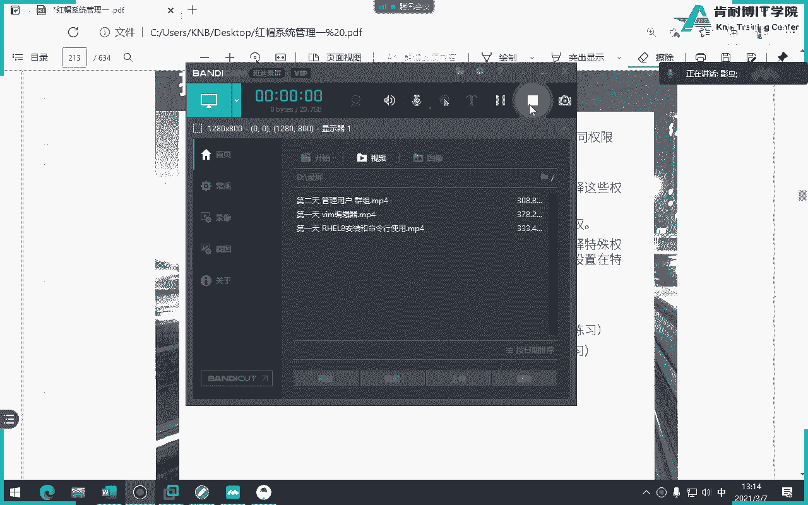

那么接下来呢我们来想一下第七章控制对文件的访问，说白了就是讲权限。在这一章当中呢，我们要学会如何对如何针对一个用户或针对一个组。让那个用户和让那个组能够有权限的去访问一个文件或者一个目录。啊。

那么在讲权限之前呢，我们要先查看权限。我们怎么去查看权性，也如这一章的内容。啊，接着我我们要学会。用命令的形式来去设置权限或者修改权限啊，这这一章的内容。不算太难。啊，好，你开始。

大家想象一下什么时候权限。啊，我们如果不看这一段这一段的描述的话，我们是不是可以理解为一个账户登录系统之后。他必须有相应的权限才能有相应的操作。对吧那权限就是对文件的访问的控制和对目录的访问的控制。

叫权限。啊，关于权限那个知识点。在整个RRTCSA的教学当中，我们主要讲三次。今天是第一次。今天是第一次好吧，那我们主要讲三次权限。好。问题是我们怎么看到权限呢？我们如果不看教材来讲的话。

我我们先来讲一下如何查看权限。第一个。查看。文件的权限。当然了，不一定是文件或者是什么。那录很好。昨天我们说过，如果查看目录权限的话。L杠什么加个什么选项？哦，对啊哎哎，对，还有什么D吧。对吧D啊，好。

那我们来看一下文件的权限。杠材料。或者是L杠L。D。D是什么意思啊？😡。

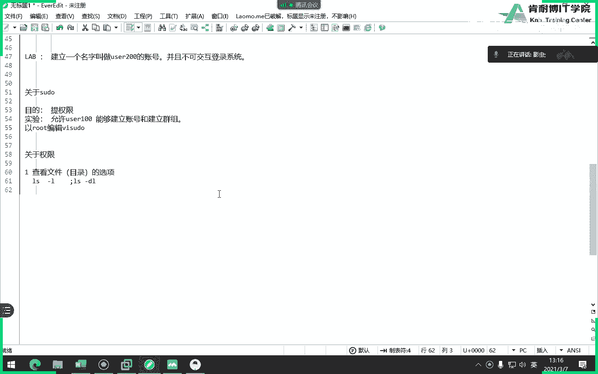

目录好，我们来看一下。还有大家有没有见过这个命令？LL就等同于LS杠LL。懂了吗？你说为什么？因为有个别名。听懂了吗？好，那我们来查看一下权限。各位，这是两个普通的文件，你怎么知道？因们前面是个啥斜线。

而且颜色是不是普通颜色？没有特殊的颜色吧。是吧，朋友们。好了，那接下来我们来说一件事儿。😊，从最右边。来看这是一个文件的名称或是一个目录的名称。对吧第二个呢，这是个啥？时间了。对吧，朋友们是有时间。啊。

这个时间是最后一次修改这个文件所在的时间，而不是创建时间。大家一定要注意，没有创建时间这个东西，没有创建时间这个概念没有，只有最后一次修改时间。

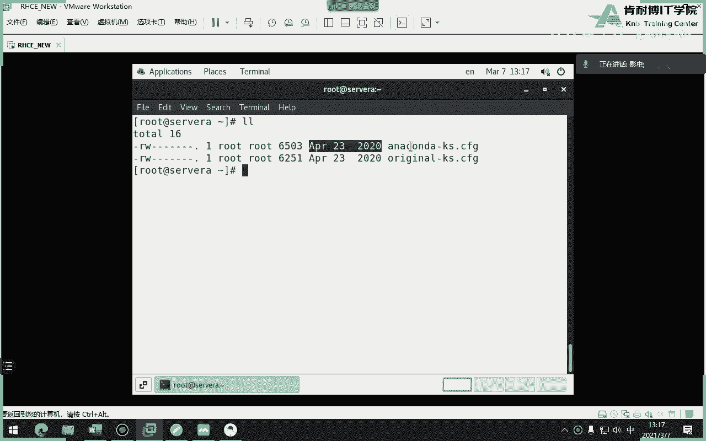

说到这儿再补充一个小试点。补充。补充都是不考的，但是都是非常重要。文件和目录都有3个时间。分别是。秀最后一次。最后一次。修改时间。访问时间。和。状态改变时间。LS命令。干啥呀？只能列出。越冷线。

列出最后一次修改时间。剩下两个看不到。剩下两个只能用STAT来查看。这是我给大家的补充。我需望你们牢牢记住，虽然不考试，为什么呢？你一定在未来的工作当中的某一个时刻能用到。既然我说能你就一定能。

所以给大家记个笔记记一下。好吧，好。我们现在就来看一下这个命令STATT。

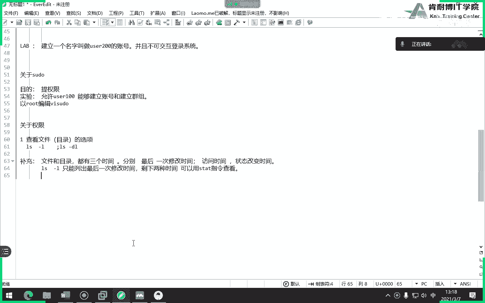

看谁呢？咱们就看这个文件。注意这个命令后面直接加什么？😡，文件名大家来看三个时间，第一个access访问时间，第二个修改时间。第三个状态改变时间。不光可以看到时间，还可以看到是么？同志们。这就是什么？

这接它的信息吧。比如说它的大小。他的。对吧设备。节点号。U压迪G亚迪。最后一个还是权限。啊，我还没有讲到权限，我们先说。那么我们看一下各位。这个是访问。最就是这个是查看所有文件的权限呃。

时间的最好的办法。理解了吗？好。继续还没讲完。这边是最后一次修改时间，能记住了吗？好，这边是什么？Size。大小吧。你看是不是大小s。对吧好，这边有两个名字。左边这一个是文件的拥有者，是谁？

右边这个是文件的拥有组是谁？什么叫拥有制？就是这个东西是我买的，那个拥有者是我吧。😡，对吧好，这左边是拥有者。右边是拥有组听懂了吗？那个这个组是什么组？抓。好，这个数字一是链接号，你不用管它。

你听过就行了。下次人家说你连接号啊，你知道。😡，好，从这儿到这儿鼠标这个位置停。总共9个红线。相信我，不要查。就黑色这一块，总共9个这个破折号。最后这一段黑色的这一块，第一个是代表文件的什么？

类型咱来说过吧。好，总共10个横线，第一个横线代表第一个呃，不是总共10个位置，第一个位置代表文件的类型。如果是个横线，就代表普通文件，如果是个D呢。准目录对吧？剩下9个是代表权限。每三个是一组。9吗？

除以三嘛？不是三吗？每三个是一组分别代表第一组文件的拥有人权限。第二个三个栏位代表拥有组的权限。第三个三个栏位代表其他人的权限。好，我写下来。各位仔细听啊，这个地方看不懂，你后面就不用讲。

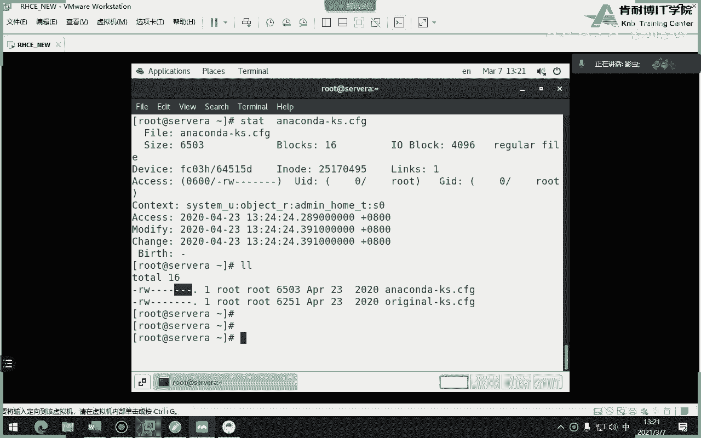

权限。😊，三个身份文件的。拥有人。权限。文件的拥有什么？左。权限和其他人的权限。Other。好，那么我们来仔细看一下同学们是不是在这个文件当中，只有文件的拥有人身上有两个权限，其他都是空啊。

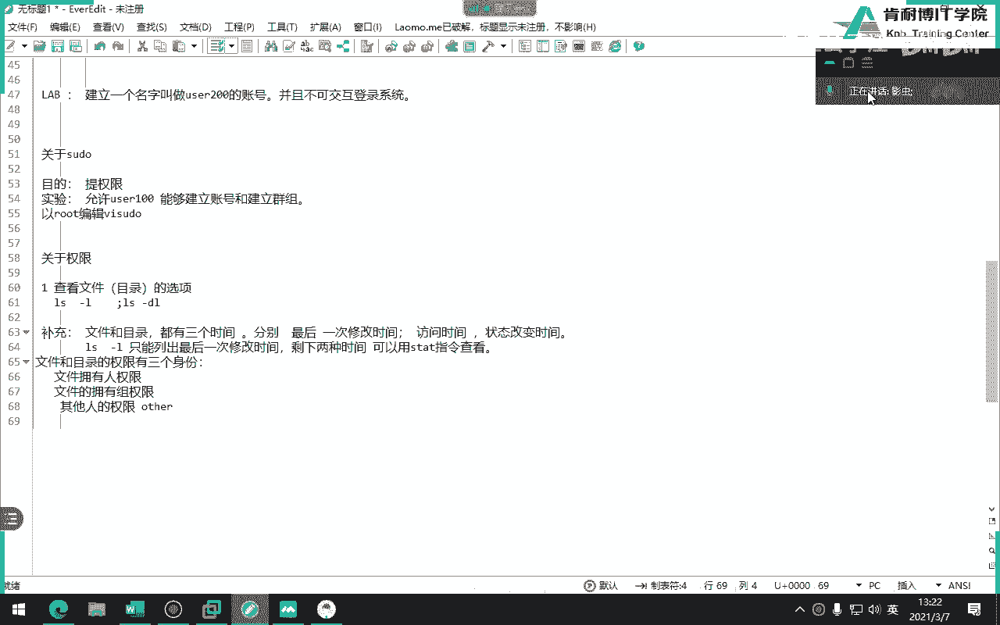

对吧而这个RW又是啥呢？就是咱们今天重点讲的这个表格，R是图W呢。

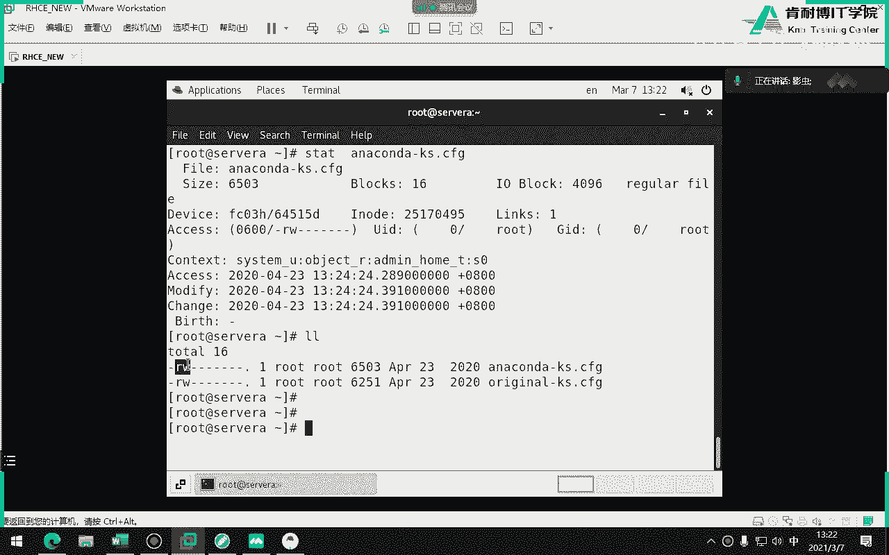

这个不要写翻译成写，给我翻译成修改。好吧，同学们。好，第三个叫执行权限XX。同时，RWX对文件是什么意思？又对目录是什么意思？总共6个权限，你得给我好好记下来。千万不要这么理解啊。

千万大家不要理解为RWX文件和目录是一样的，是不一样的。能看懂这个表吗？那么我们今天先从文件开始讲起。什么是文件？同学们文件就是咱们用touch命的建立的吧。他还记得吗？啊，好，那我们先来说。

读对文件的影响。读文件是什么意思？哎，我们问大家，哪个命令是读文件的内容？看 more。对吧hat。list这些都是查看文件的内容。那么如果一个文件当中没有读呢，他很想就告诉你permission点吧。

权限被拒绝吧。好，这个很简单。好，很简单。好，那么我们来看一下像这个是不是有毒。

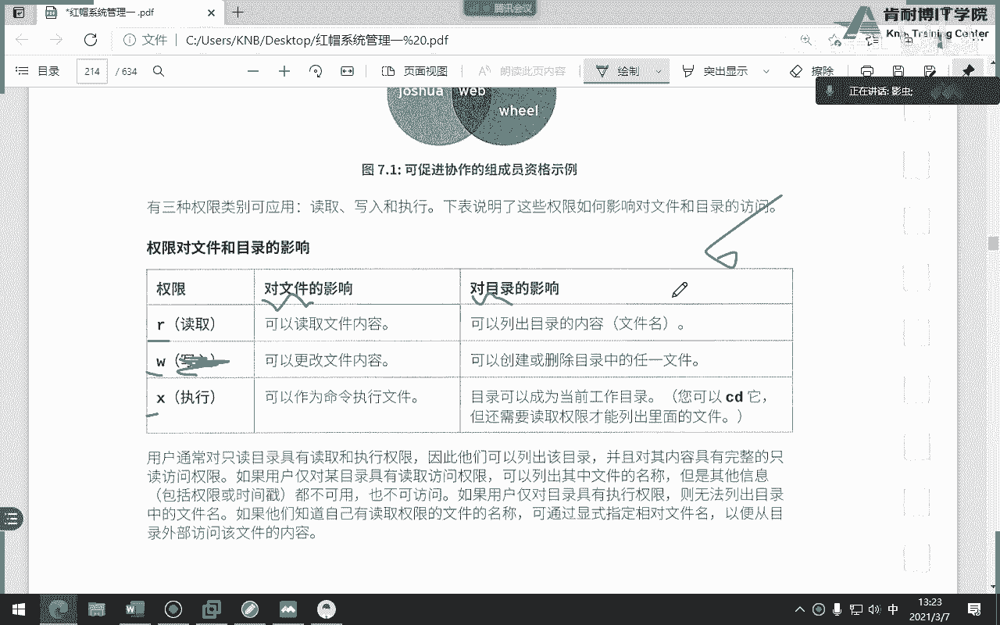

是吧朋友们有图。好，第二个是什么意思来着？且也叫做变形。对吧嗯，什么意思啊？就是。大家学VR编辑器都知道VR编辑器能不能编辑文文件内容。如果有权限的话，是不是可以？就是你II是不是可以写东西啊？

对吧啊I可以写东西。好，那么问题是直接听这个问题啊，直接听如果说一个文件被赋予了W权限，就是写入哦，不就编辑或者叫修改。那么我是不是可以说就可以把这个文件给它删掉呢？考虑我这个问题啊。

考虑一下所谓的修改是什么？修改难道光能写吗？不能删吗？各位修改能不能删？当然了，我写了1万个字儿，但我发现999990百个字都是不太好的，对我是不是可以删掉？编辑嘛？不就是有有增加删除才叫编辑嘛？

你光加叫什么编辑，对不对？是可以的吧。但能不能删文件呢？不的你怎么删内容，听懂了吗？所以仔细看你你的教材翻译的非常好，人家翻译的是删文件的内容吧，各位。对吧朋友们，所以说你注意当一个文件我建立起来之后。

我赋予了它W权限。只能代表。我能够或者别人能够去修改文件的内容。但对于这个文件本身删不了。换句话说。我能不能把这里面的所有字给他删掉？可以，但是你删不了这个文件，明白吗？那么问题。谁能删？

我就想把文件也一并上深东省。关联还可以吧。可以吗？当然可以管理员嘛，还有谁？创建者是不是就所谓的拥有人嘛？对吧我自个儿创建的，我还不能删吗？干农。对吧？好，注意啊，所以你要你要拿个红色的圆珠笔记一下。

这个W指的是只能编辑里面的内容，而不能对这个文件本身进行删除。千千万万注意啊啊，咱们看书要细致一些。咱们说这个书翻译的很烂，但不是每个字翻译的都很烂，人家还是有好的地方的，对不对？好，X呢。X。

前面我们讲过。文件对于linkux系统来讲的话，它是没有扩展明这个概念的吧。你比如说windows是不是。批处里就BET。ESE就是执行。对吧，但是对于lins来讲的话，没有执行啊，没有这个这个后缀名。

所以说如果你想让它变成可以执行的话，我们咱们昨天讲过哪个颜色是执行？绿色你想把一个文件从黑色变成绿色，就要给它加X权限。X代表事行。我们想象一下，什么样的情况下必须要执行呢？我建个文件ABC。

然后给它一个绿色的，它就执行了，它执行啥呢？各位。是不是我们要只有脚本文件或者能够执行的2DG文件才有意义？对吧你比如说你建一空文件，你给他一个X，它执行有有有有什么意义呢？没有吧，对吧？

所以一般情况下第一步先写脚本，第二步把这个脚本变成执行才能去运行啊。这理运行最类似于windows双击。对吧明白了吗？好，对于RWX对文件来讲，还有什么不懂的地方吗？我说的是文件啊，没有装备。什水。啊。

文件。好，那我们再来讲目录。目录啊是什么意思？各位。目录啊是什么？一般啊就是瑞的这个单词的缩写吧，那他读什么呢？😡，想想目录在读什么？各位目录读什么？是不是读目录里面的子文件子目录。那哪个命令是可以用？

啊，各位哪个命令是读文件内容呢？怎么录的LS吧。对吧？朋友们，那言外之意就是，如果一个目录身上没有R权限，它是不是没有办法L？看简单吧。那W呢？是吧创建怎么念？创建字目录吧。对吧就是写嘛。对吧好。

那X呢？X代表能进去，能打开。对。千万注意各位，这个X可不是执行。在这一题当中，在在目录来来来来讲的话，是没有执行这个概念的。你要想象一下什么是目录。朋友们，目录是不是以文件夹这个容器啊。他执行个啥。

他没有什么执行啊。所以说你想象如果没有X权限，你想象一下他是不是没有办法用CD进去。对吗？啊，所以说CD能够进到一个目录，是之所以能进去，就是由于它有X权限。谁来谁来，那么我们就可以想象一下。

就是X对于目来讲是能够进行。X对于文件来讲才代表什么？

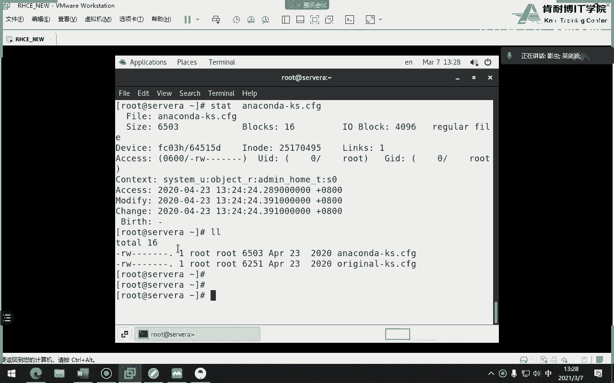

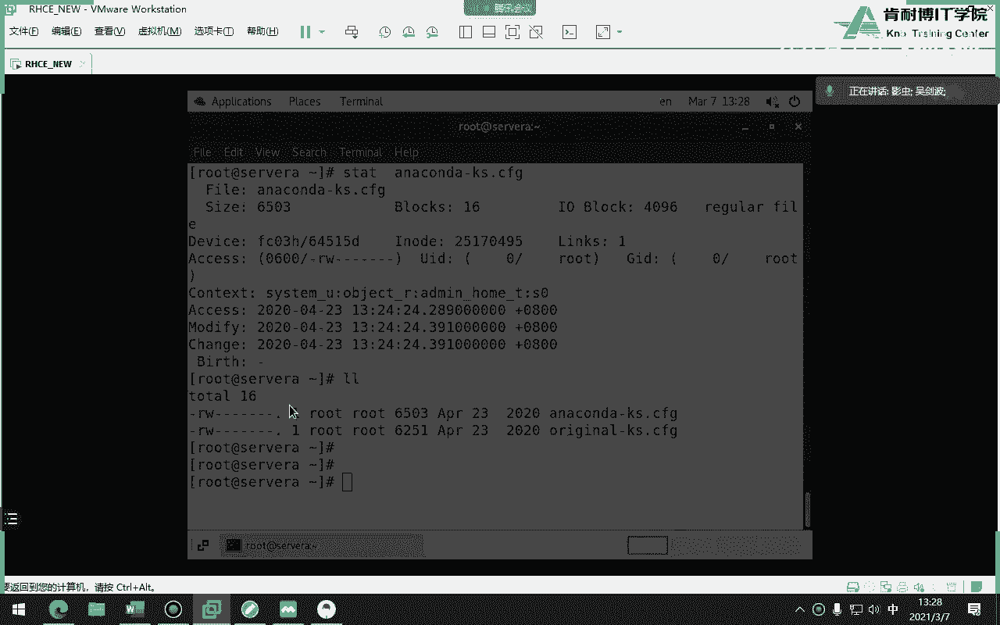

No。执行。懂了吗？啊，他代表吃。

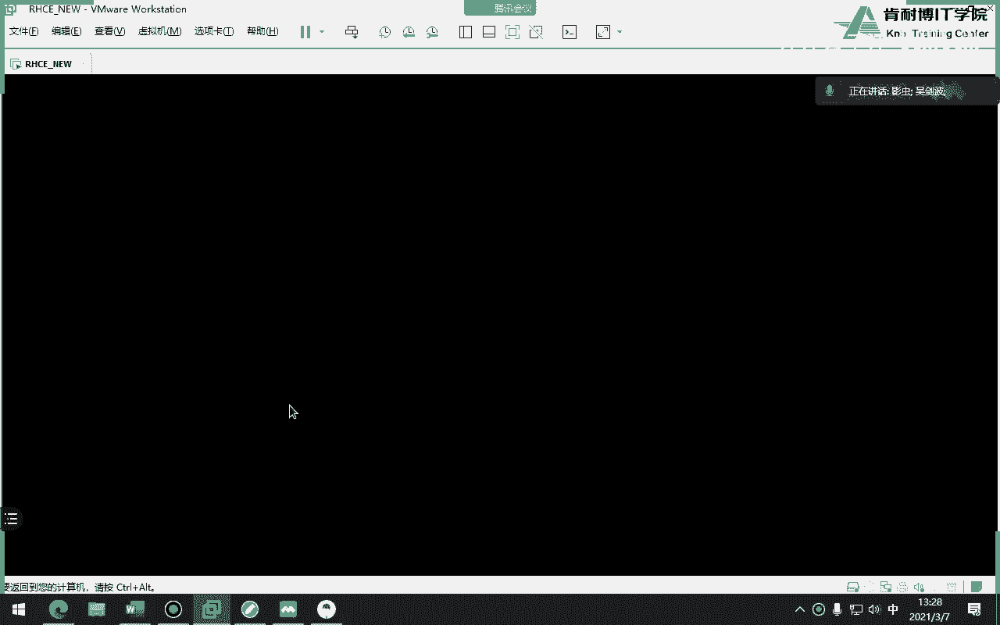

我怎么静音？

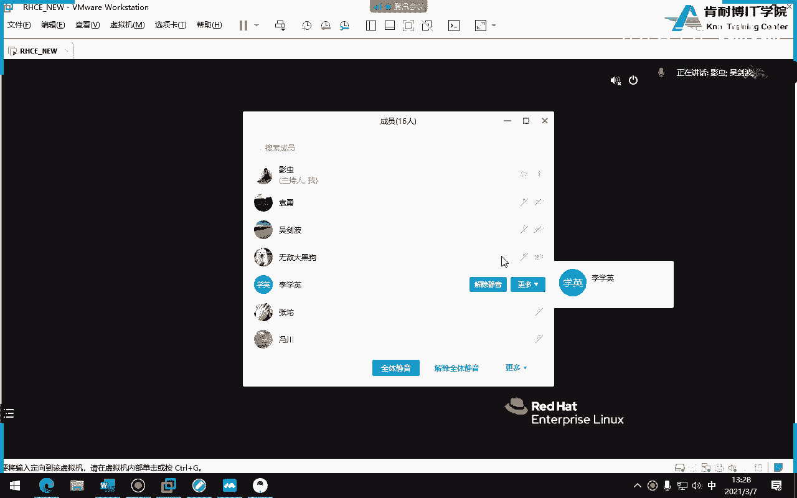

懂我意思吧？哎，X对于啊好，我们总归总结一下啊，X对于文件代表执行X对于目录，代表能够CD进去。听懂了吗？啊，所以你下次人家问你X是啥意思啊？你不要轻易的说执行这是不对。😡，只能说明你说对了一半。

他不能解决所有问题。对吧不能解决所有问题。啊，所以一定要注意X去执行。啊，X。啊，别看别看别看别看太亮。iad亮了太亮了。直接后面关就行了。对应部电器。啊，说先就个。什么对有时候只有什么对一个文件只有。

可以。问题是在门口啊，只能监辑在外面这。哎，对，那我能不能改？改名对好。把文件名改了是什么意思啊？MV。嗯。你要先看你能不能进去，如果能进去的话，就可以改。但是文件的这个这个这个内容改不了。

但就是说你不能删。啊对。可以改。名字是可以改的。我觉得可以改，你试试。我不是你说。注错告诉我。我觉得名字是可以改。

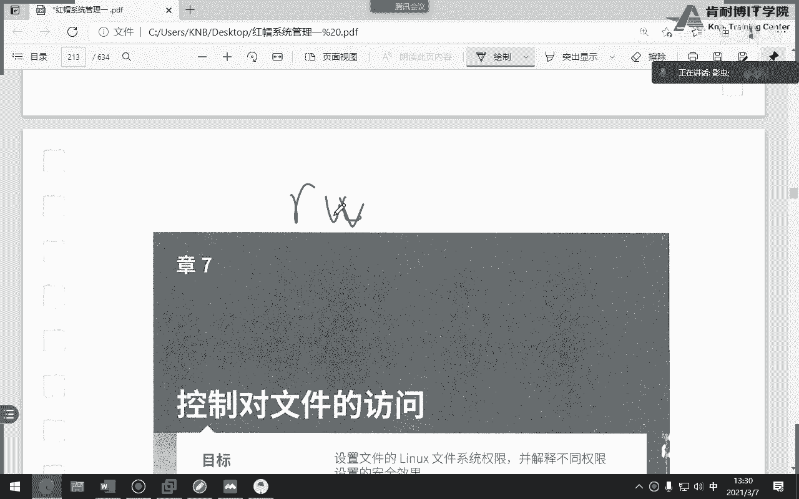

要不要？看了名字改不了。你们不能干。那有说名字不能改，但内容呢。内容可以改，对吧？啊正名字改不了那，我也能改。果然是改不了。我刚才做了一件事，就是赋予他一个W权限，然后往下改一下W啊。改不了名字。嗯。

那他走能干嘛？那怎么编辑了？的功能有点弱。好。

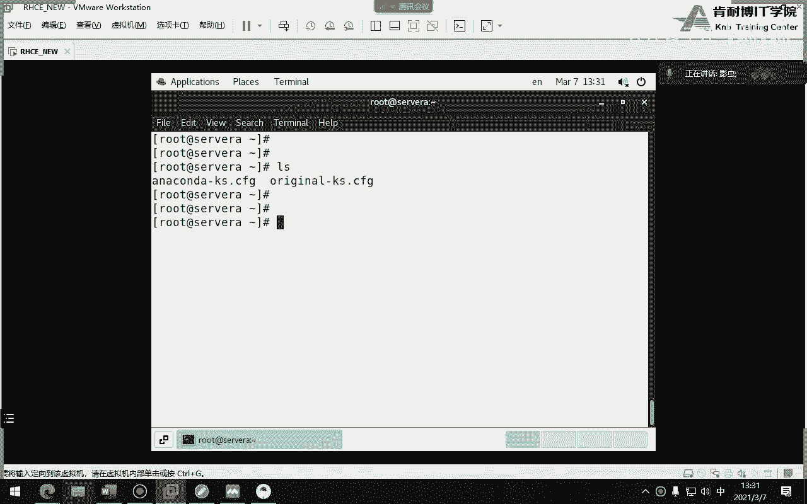

那么这个三个事儿讲完了。啊。就主要重点是在这儿这个。进去。啊，进去。好，大家看还有什么问题啊？想想还有啥？好，没有的话，我继续讲了啊。

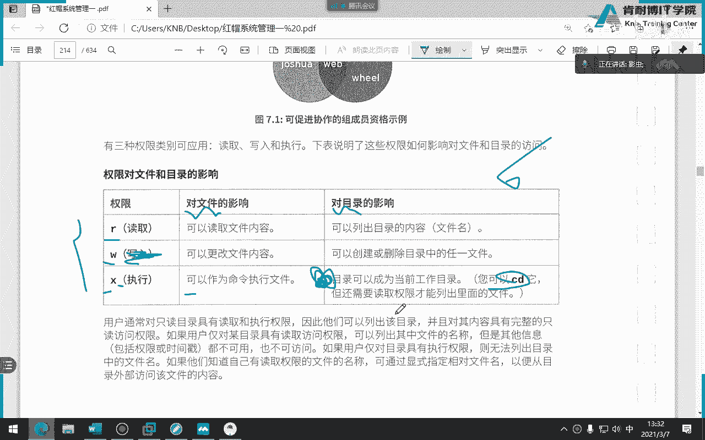

那你来看各位，我怎么判断一个用户，他对一个文件能够有相应的权限呢？举个例子。现在有一个用户叫学生。他能往里面写东西吗？不能。下么我们接下来就来讲一下为什么不能。

对吧他为什么一个学生用户不能往这个文件里面写东西？他是怎么判断？来各位。他是通过这样几个。步骤来判断。首先。😊，这个文件的拥有人是不是这个学生？是是谁是root吧。那既然不是学生，是root。

就不可以读取第1个3个权限。懂我意思吗？因为第一个三个权限是谁？谁的权限？拥有人的权限。第二。判断一下这个文件的拥有组是不是学生。不是。那他就不能读取第二个3个权限。那么是不是只能属于other？

阿的上面有权限吗？😡，因此，写不了多不了。执行不了，听懂了吗？偏判的用人。再判到拥组。两都不是才是谁？所以你看这个步骤很有意思啊，各位这个步骤非常有意思。😊，所以你一定要知道他的他的一个权限。

所以你为什么我要先为什么我要我们要先讲权限的这个。顺序。好吧，先讲权限的一个顺序。啊，我们举再举个例子，比如说刚才我在这个里面TMP。建立文件叫fi。大家看。现在拥有人身上有两个权限。

拥组身上有一个权限，其他人身上有一个权限。那么我现在如果有一个学生。登录系统跑到TMP里边，能否看这个文件的内容？可以吧，为啥？因为other部分是不是有读权限，为什么看other部分？

因为拥有人肯定不是我拥族也肯定不是我吧啊，我只能属于什么？other。好，那现在我想让这个学生写写不了吧。好，那我怎么办让来写呢？因此接下来新的一个知识点修改。😡。

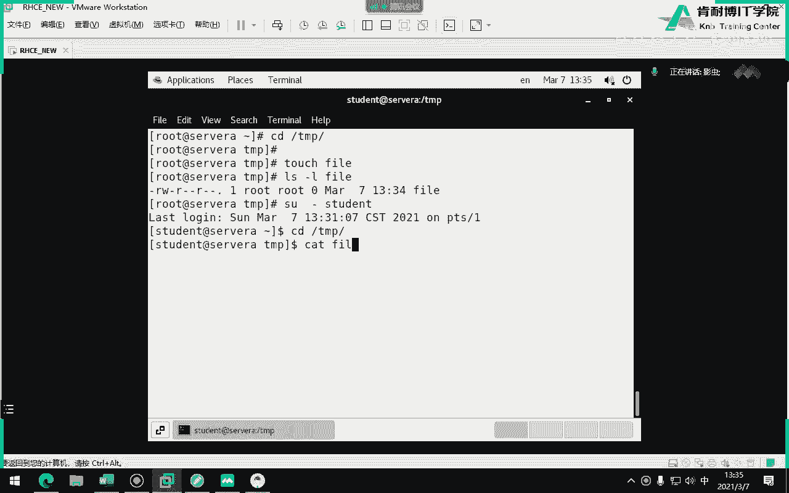

这个命令。抬到啊，各位。这个命令是修改权限。啊，修改权限。怎么修改呢？又是拥有人，既是拥有主殴呢。其他人。加是加一个权限，减是删除一个权限，等于号是重新。赋予权限。R是读权限，W是写权限，X是实行权限。

后面加文件名称，语法格式看得懂吗？各位同学看得懂吗？好，那如果你看得懂，你告诉我这一题。

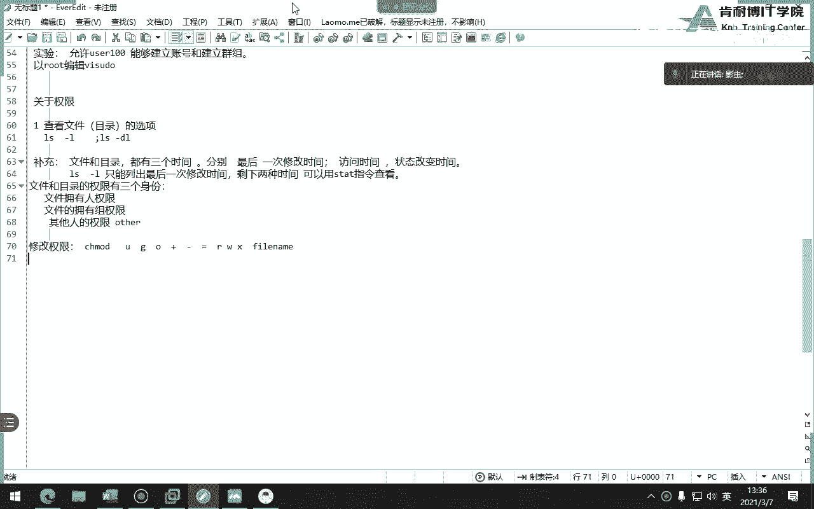

我如果想让。我现在是学生，我想让学生进行写文件，我应该怎么写做权限？

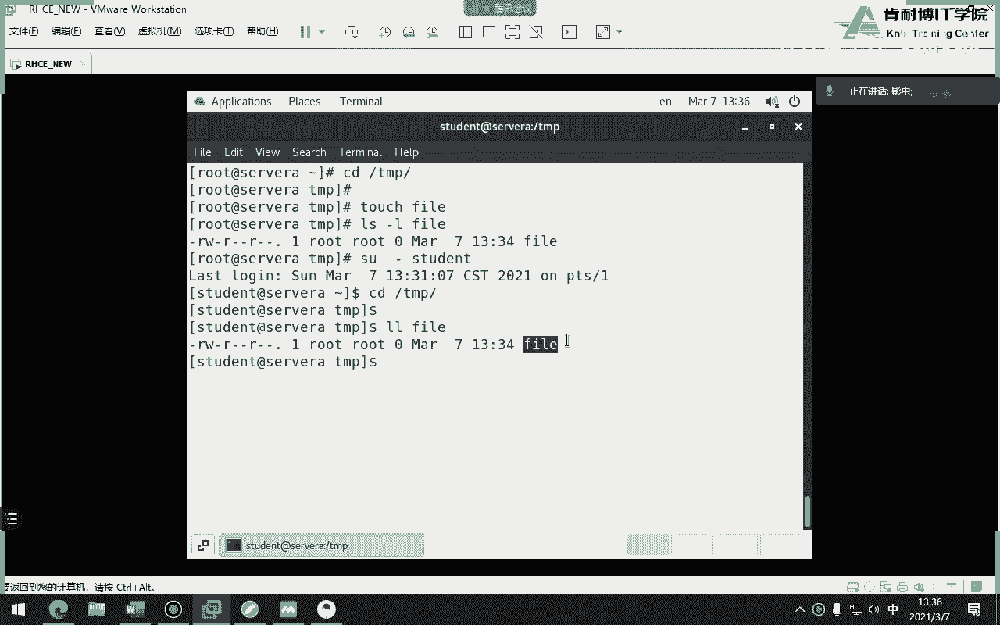

对照一下各位。还有。对照一下。我怎么加权限？先退出来叫到管理员。哎，抬头，我想让那个学生对file这个文件进行写。我告诉大家了是这个命令，那我们怎么写？然后呢。O加W。文建明。

因为我们知道是以O当中不满足吧。所以O加W，这时候就可以写了。听懂了吗？听不懂我就不能讲了，听不懂我就不能往下讲了。所以你你要保证你每一个人都听懂。很多同学会说，R为什么是O？因为我刚才讲过。

因为U不是我，既不是我，我只能属于otherother当中又没有W，所以我写不了，对吧？好，讲完了。没了，这这这就这这就是配这就是配置权限。那如果是等于号，啥意思？各位同学。

刚才如果我把这个加号变成等号，会最后会有什么效果？这上面的R还有吗？没有了，知道吧？没有了啊。Yeah。

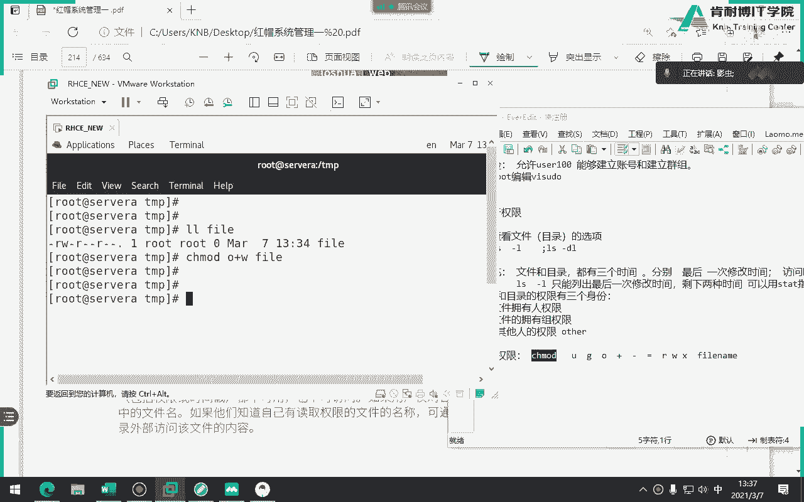

好，我们暂停讲。嗯。

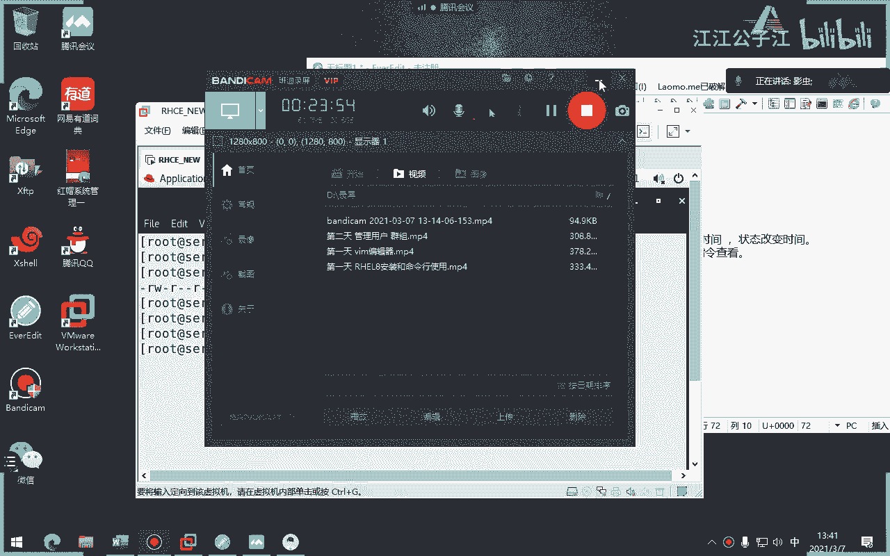

这时候呢我想给大家补充一个小小的知识点。

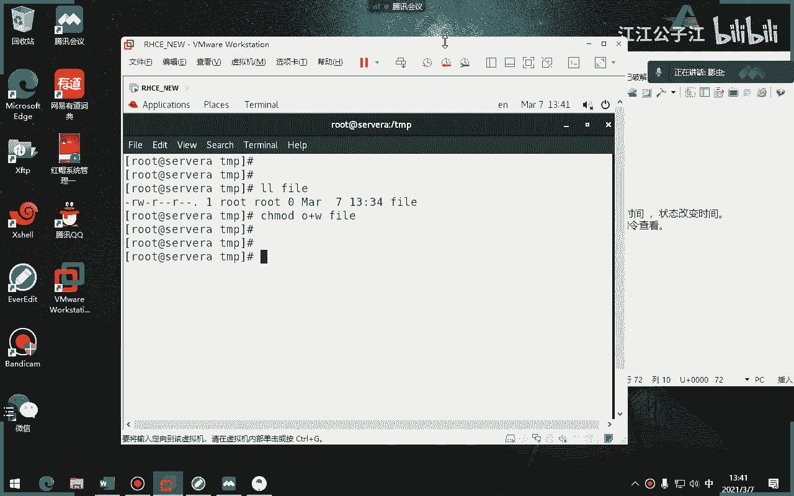

你们来看能听懂不？来，各位，我确实给大家建一个目录。啊，建立目录。是在哪建的？边下面线。这两把线两个文件，有个角一。一个叫2。各位。现在这个学员都能看懂了吧。好。好啊，你们看懂了。

我想看DRRE本身的权限，怎么看L。是么。D。这啥意思啊？估就自己吧，大前目录吧。好，各位仔细看。😊，在这个当中。我想给other部分加上一个。W可以吧？而且我还要干嘛？😡，低跪下去。那如果这样做的话。

会会怎么样？里面的一号2会不会有W？😡，就一定有我就不敲回车了，各位就一定有。好，这个时候我还这样做。那我再问大家，一和二会不会有X呢？当然有了，还有响吗？你都你W，你都说有X难不不会有吗？有吧。😡。

是不是从黑色变成什么？绿色绿色代表什么？可以干嘛执行啊，执行就这样了，点斜线执行。比如说这是一个脚本就直接执行了。好，我讲完了，你们觉对能听得懂。那么问题在哪？各位，这有什么问题？建完了。

从命令角度来讲，没有任何错误。😡，对吧因为因为如果你不加R，那当然没有递归，但你加上了R，它就往下递归了，对不对？没有问题。但你觉得会有一个安全性的东西，有没有发现？我问大家。文件。

当我们自动建立文件的时候。当我们自己建立一个文件的时候，权限上面有没有X？没有X对于文件来讲代表什么？执行是不是很危险？比如说我写一个脚本。里边是删除系统。但是苦于我没有X权限，我想运行，它运行不了。

但是某一天一个很粗心的管理员给这个目录设置了一个权限的时候，他不小心加了个R权限，让我们自己突然间获得了X权限，是不是？这我本身没有这个意思，但是我想给我目录做，但我不小心加了个R权限，下面的子文件哎。

也继承了X，是不是？那这个时候比如说这两个脚本是个很很很很危险的脚本。哎，这个家伙一看，我现在有X了，很开心，我运行了，是不是把系统就给弄挂了，它是不是一个安全漏洞。由于你给副目录做了一个递归。

让我们的子文件获得了重生，对吧？那怎么办？有没有一种防范机制？就是某一天一个管理员他很粗心，或者他根本就没有学过RSCE。啊，他以为只要是目录就要加R，他就加R。但他不希望里面的子文件继成X。

也就是说它继承R没有关系，继承W也没有关系，但我不想让子文件。继承X，除非我确实想让它继承。那这时候就要用大写。X。所以咱们的权限有4个RWX和大写的X。大写X什么意思呢？是指给父目录权限的时候。

子文件不会继承。X。那你说老师那如果我要给他一个大写的W，那是不是子文件也不会继成大写的W，是不是？没有啊，别扯淡啊，没有，只有X才有大写了，明有啊，为什么？因为X对于文件来讲太危险了。好，我们试试啊。

各位来试试。Okay。我重新建一个文件叫3QOUCH。三0上现在是没有是比较干净的吧，啥也没有。好，这是我这样做。其实我来个大起来的词，各位好吧。你来看三有没有记承了吧？😡，没记什吗？听懂了吗？

那你来给我总结一下大写X是是什么意思啊？各位。怎么说？还有怎么表达？对吧我心里知道，但我说不出口，那你不行啊啊，意思是指让我们给父目录加权限的时候，禁止子文件继承X。因为他太危险。但没有大写的大R。

也没有大写的W啊，只有大写的X。好吧，永远记住这个。永远记住这个。啊，因为很多参考书上面是没有讲这个的，我给你们讲，你们就记下来。啊，权限这个东西在各位朋友们千万别糊弄啊，在公司里面。啊。

一定要谨慎一些，就是能够小就不要大。啊，能够小不要大，因为权限很危险，不小心你就给。人家黑客留了一些安全一些方便，对不对？希望你们记住啊，各位嗯。能信着吗？啊，我就不写了，好吧。😊，不懂了。

回头回头再去看录屏吧，好吧。

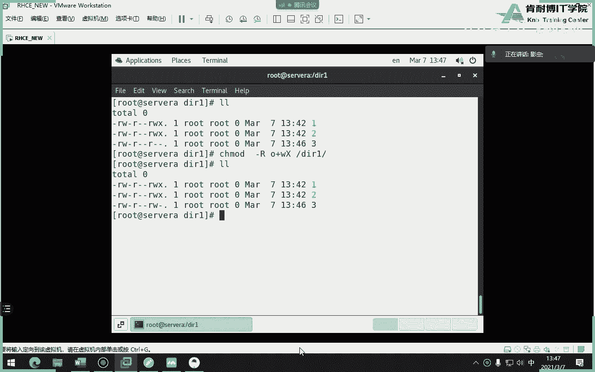

好，关于称之mo的CHMOD就全部讲完了。简了吧，CHMOD啊就权限CHMOD改权限。哈，写的太难看了。😊，就这个。好，我们暂停一下，能听懂吗？啊，能听懂就行啊。要改变模式啊。

最后我们来说一下数字表达式表达方法，大家肯定听不说什么什么6啊7啊这样的是吧？哎，什么意思呢？就是咱们可以用数字表达，咱们不看教材，教材写的它什么二进制，什么玩意儿不管它，咱们只要记住。😊。

这个R是4二是。W是2X一，加起来是7就行。太多抬多抬多，再说一遍啊，R是4，W是2X是1，加起来是7。

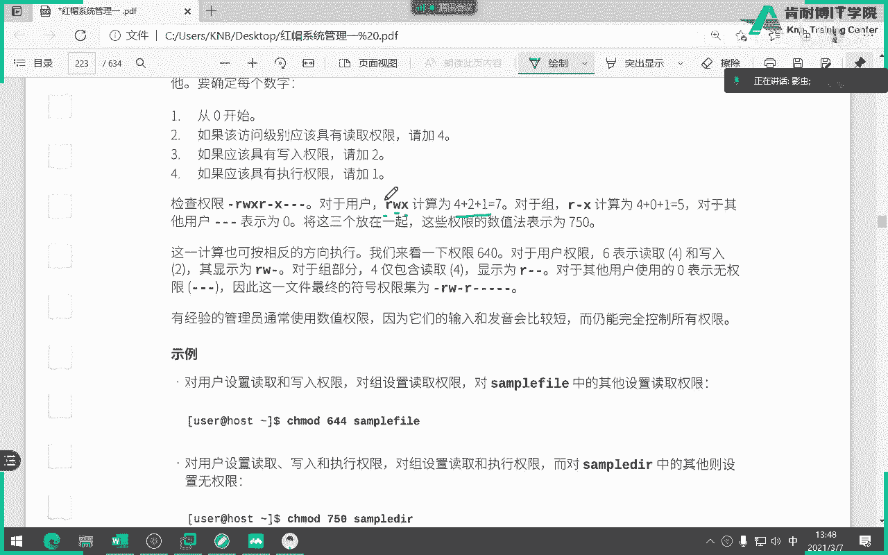

所以说你能看现在这个圈是多少，这是几啊？嗯，6吧。47吧。所以你给权限是不是也可以这么给？😡，6666。666。对吧同同学们。因为每次讲到这儿，很多同友都要晕了，啊，什么玩意？666。😊，啊。

所以你这个真不适合初学者，就如果你要你你你要是不熟的话，你就干脆老老实实的什么O加W啦G加W，你就这么去搞，好吧，你不要这么666啊。好吗嗯。再说一遍，这个是4，这个是2，这个是一，明白吗？啊。

这个还有谁听不懂，这个就这个数字。可以过吗？

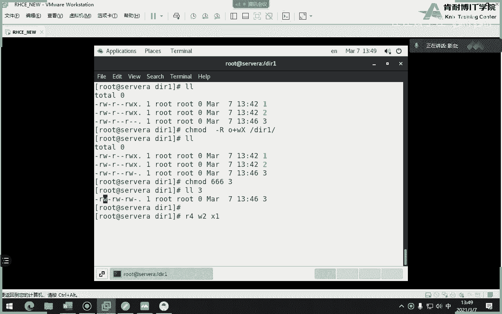

行。暂停一下。

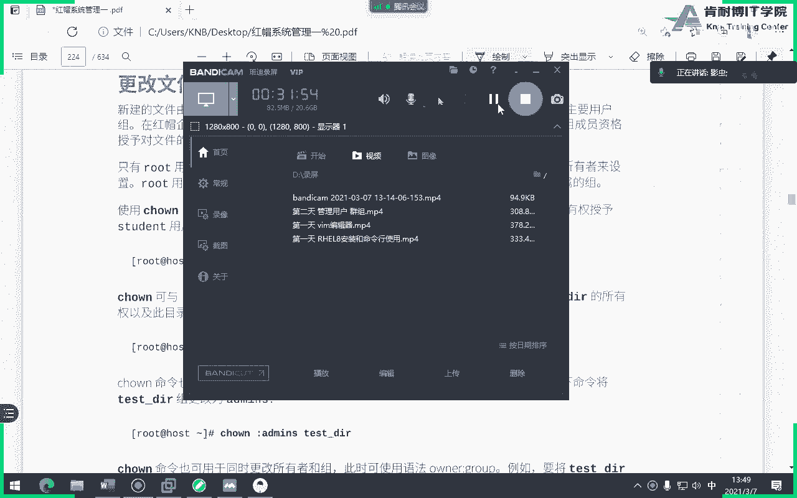

那咱们来说一件事儿，同学们。来跟我一块来看这个思考题。你看。我这个文件。现在普通用户能不能写？可以了吧，那我改一下。现在普通用户还能写吗？😡，不能了。好。我现在让你做一件事儿。普通用户能写。

但是权限不要给我改，就叫644。现在是不是644？我现在就要求644，但是普通账户能写。你还有别的办法吗？是不是改卖幼人？为什么改变拥有人？因为拥有组没有写嘛？那为什么要看拥有组？

因为我们知道拥有人不是我，拥有组不是，我，只能看其他人。😡，但如果现在拥有人是我的话，是不是就可以读取第一个三个栏位？

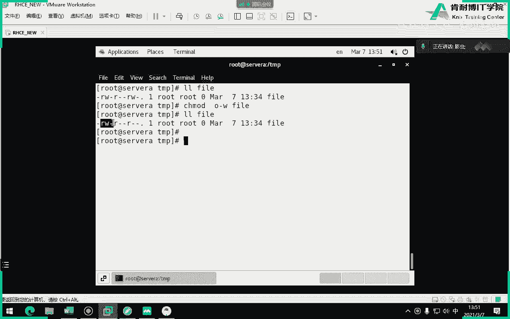

这第一个三个栏位当中，是不是有W？就可以写了。因此这个命令在这儿修改文件的拥有。任和拥有所。好，这个单词很简单，春中owner后面加上人名，后面加上文件名，这个文件就被修改了加。二什么意思？地柜。

那如果你又想用这个命令修改组呢，加个冒号。或者加个点点儿，注意未来你在工作当中有人看到加点儿也对啊，我就习惯加点来修改一下。各位仔细看现在这个文件用人是谁？

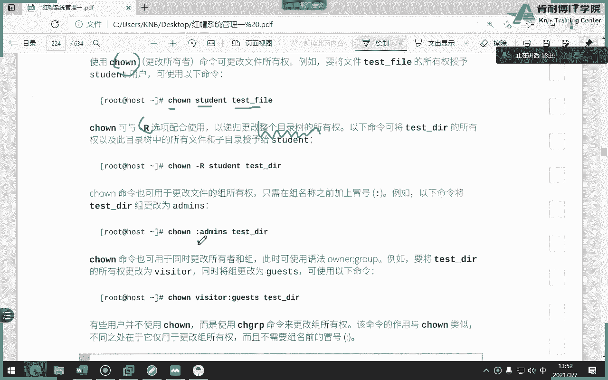

ro吧右组来。热桃改改改改改改改。😊，注意，如果只加这个就是用人。人改了吧。那组怎么改？组再加个点儿或者加冒号都行。这样就改变煮了。是不是俩都改了，各位同学们。好，那你之想改变组怎么办？😡，人我不想改。

只想改变组。😡，冒号或者点儿都行啊，或者点儿或者冒号再改回来。😊，千万注意，如果你不加冒号又变成什么？如果不加点或不加冒号就变成谁了？😡，讲啊。喂。这章讲完。好，但有一点。

该命令CHOWN该命令只能管理员。这个能理解吧。其实很好理解，我啊普通用户没有权限得了吧，我把它自己改成用有人，就我那怎么可能？😡，对不对？肯定是只有管理员才能干。

但是那个CHMOD是修改权限的命令是谁都可以做。普东大会。你是试不是？😡，你是就知道了。好，讲完了。但是未来你在参加工作的时候，发现这条命令你也不要默生这个命令是只能改变拥有。

组而这个命令就能改变拥有人，又能改变拥有主，随便你学。

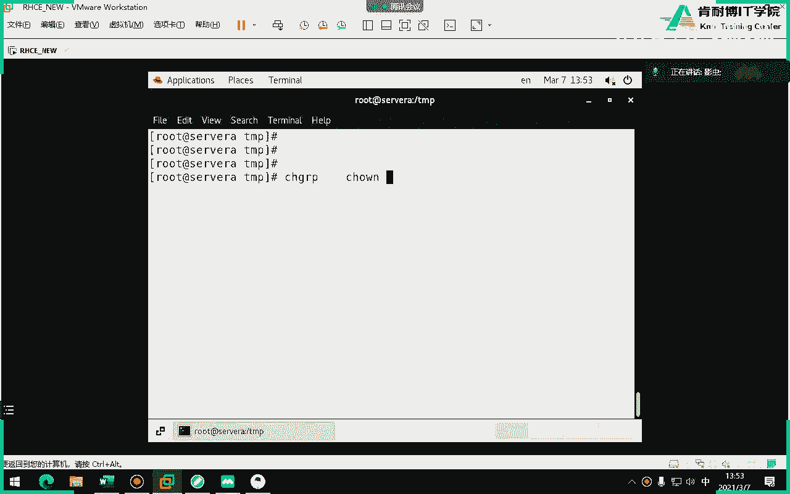

想要改多少。好了，这节课。前面就讲完了，就这三条。下课秀。好，第七呃第八章的内容叫做监控和管理进程。啊，我刚才讲过这一张非常的重要。咱们每天工作就是跟各种各样的竞争打交道。啊，这张两大块。

第一个是如何查看进程，第二个如何查看你想要管理的进程。啊，但在这之前我们再再加一个内容。关于进程的一些个概念，咱们在这边再加一张。小的知识点。进争的概念。请问大家什么是进程？各位。什么是进程？

就咱们现在理解情况下。回忆下咱们大学的时候，大家大家是都学计算机专业的吗？很多事的吧啊，他们我也不是。我也不知。我也是解路的。那么回忆一下。这个咱们读书的时候怎么去定义进行的？

windows右键管理器任务管理器进程杀死他，干掉，OK很开心。😊，对吧这就进程啪干掉。对我们天天都在搞。比如说比如说我说哎你把那个QQ给我关了，为啥你开那么多卡死了，okK你关一个，你知道关哪一个。

你知道这么关，对不对？杀掉鱼进程，对不对？好，那什么叫进程？😡，各位，什么叫进争？用你的话来理解，不用去想那个很官方的数据，就用你的理解，你怎么理解性程。😡，这张是最容易被大家忽略，而最重要的一张。

因为你每天都要搞进程。😡，我们想一下什么叫进楚，先把概念搞清楚，然后再来说怎么玩，怎么再讲命令啊，我非常不建议那种直接上上来就讲命令。啊，说法也没有怎么写是吧，反正你用自己的理解。

你怎么你你怎么去定义进程。各位。啊，随便。随便你你你说都可以。有个最简单的想法就是进程式正在运行的程序，对吧？这句话感觉好像很很搞笑。但对呀。那其实这来讲的话，我们知道一个程序。如果没有运行的时候。

因为我现在没有双击这个浏览器。这个程序是静态。他保存在哪？硬盘里面。当我双击去运行它的时候，它是不是要求从内硬盘调到我的内存当中，等待着CPU去执行它。注意这里面有三个术语啊，各位。一个是硬盘。

我们知道硬盘是不是最终的存储单位，比如买一个手机，我们知道买1个256G的什么那个存储，那个存储指的是硬盘吧。还有说什么256G硬盘，什么运行内存是12G，那个是指内存吧。😡，对吧还有一个是什么？

我们现在是什么那个什么什么什么龙的那个核心，那指的是CPU吧，对吧？那一个硬件啊，不一个静态的文件是保存在。硬盘里面。从硬盘调到内存当中，等待的CPU去执行。一旦去执行了之后。

那么它就会为这个程序产生一个副本。这个副本就是这个程序的进程。当我杀死这个副本的时候，不就等同于杀死这个什么进程了吗？😡，明白了吗？懂了吗？这什么想的？喂。我也可以用这个想法。对，我可用一讲。

系看唔到看唔到。女ちの番とは。对吧这就进程。这是我手机响的吗？还是。Yeah。还是这个想。没有啊，我没有用东西啊。내唔 될까요。好，那不管他啊。不管他还不行，靠，这么想的。哪儿想的？好，不用谈。

明白了吗？各位。这个服务。呃，不这个程序一旦运行之后，就会产生给他一个副本，这个副本叫进程。那我怎么去。区分这么多进程的，比如我又开一个QQ，又开一个火狐浏览器，我怎么区分呢？

是不是每个进程都有一个什么来看各位。对，姓荣浩，你看这边哎，这这边在哪？加力吧。都没有啊。应该有吧。我猜得给得有。对吧。家地吧。警插地耗肯定得有。对吧经常离好。好，那么我们来说下面一个问题。

如何产生进程呢？哦，我已经知道了，进程是一个运行程序的一个副本，那我怎么去产生进程呢？各位有哪几种方式触发进程的产生呢？没记录。第一个。我运行一个脚本可以吧。第二，我与执行条命令可以吧，比如说CP。

比如说IOS可以吧。第三。我开启一个服务可以吧？因为我这边开启一个。阿帕奇服务可以吧？或者开启1个FDB服务器，可以吧？我刚才讲这三种方式是不是都可以都一定会产生一个或一堆进程。为什么呢？

因为有些进程是不不止一个。对吧，朋友们。好，所以请注意。开启一个服务。运行一个命令，运行一个脚本。这几个方式都会触发一个进程的产生。但是只不过运行服务和运行命令产生的进程是不一样的。你想象一下。

我敲IOS是不是瞬间执行瞬间结束，这里是不是进程一下子就开完，接接着就死去了。但如果你开一个服务呢？比如我现在后台开1个FTP服务器，随时随地供大家来去下载电影。

那么这个FDV服务器进程一直是处在什么运行状态吧，说白了一直处在listen监听状态吧，像这种进程叫做守护进程。守护嘛，就我跟这蹲着等着，你一直来找我。明白吗？

对吧所以说你看像我如果想抓一个命令的进程很难，为啥？因为L这个命令是瞬间执行完，瞬间结束。你想抓住它几乎不太可能太快了。但我们如果。放大来想的话，它虽然抓不住，但那那一瞬间会不会产生进场，那肯定会啊。

它再再再短，他也他也肯定也会啊。😡，对吧那如果我们把把这个命令放长了，比如我现在正在拷贝1个100G的数据。😡，那么这个CD是不是得稍微等一会儿，那这时候就是不是就可以抓出来了？明白了吗？这以进程。

懂了吗？好，我们看教材书上讲的还很有意思了。你看他不说了吗？😊，他说啥了？没有啊，那么走直接讲状态了啊，讲状态也行，我们来讲一下状态。那问题是进程我怎么产生呢？一般是通过fuck。😊，派生出来此进程。

来看这个图片，首先我有一个进程，父进程，大家知道父父亲的父父进程，然后通过fok函数派生出一个child。紫禁城，然后紫禁城就开始干嘛，这是这啥意思啊？执行。那么这时候请问大家附进行干嘛？等待。

执子禁程执行完之后，退出结果返回给附禁程，副禁程收回子禁程的一些个资源，然后就没了。那在这个过程当中。他属于僵尸状态。这个单词叫僵尸状态。啊，你来看。你看通过fok函数。

子禁程会继承附禁程的各种各样的各样的资源。比如说文件描述服务端口号巴拉巴拉巴拉巴拉一堆，然后子禁程开始执行自己的程序，就是运行状态。通常，附禁程在子禁程运行期间处于什么？睡眠状态。

对吧然后它会设置一个wat信号，退出的时候，子禁程已经关闭或丢弃了很多的资源，只剩下一个资源叫做什么，比如说PRD。只会留下1个PRD号。PID号等待着附进程收回它的信号。如果这个时候。没有收回。各位。

咱们电脑当中会充值大量的。僵尸状态的形成。加装端载进程不会对性能有所影响，但特别多的情况下就会影响，为啥？你要知道一件事儿，同志们，咱们的PID号是有上限的。如果你没有释放的话，别人就用不了。

那如果大量的是没有释放PRD是不是新的进行就产生不了？懂我意思吗？啊，那什么时候会产生僵尸状态呢？比如说附禁城没有来得及收回紫禁城，或者附晋城这会儿特别忙，没有功夫来收回紫禁城。

而紫禁城呢自己的事情还做完了。就干嘛了？就处于僵持状态，他又不能做事儿，但是呢他的PRB就被占用，而附近程就不收回它。那如果这个样子的话，多了就会造成你的系统为有性能影响，听懂我意思吗？啊，好。

那么接下来我们来说一下进程进程的状态，进程状态这是非常重要。虽然不考这章没有一个考点，但你要懂。什么叫状态？各位来来来，状态给大家写好了。每一个进程都有每一个每每为什么会有状态的概念呢？

因为我们现在的系统是属于多任务的，什么叫多任务？同志们。什么做任务？我看电影时候可以聊天，聊天时候可以吃鸡，吃鸡的时候可以看电影。是不是同一时间可以做很多事？这不叫多人网？

那么大家知不知道在以前多任务或者多任务是怎么实现的？各位。呃，在十几年前，比如15156年前，大家都没有。就单核的时候，大家知道吗？以前老的CPU都单核，现在都是什么16核啊，什么多少核，以前有单核吧。

那单核的时候，我怎么去。实现他的。多任务呢各位。是通过时间分片。比如举个例子，我们我们抽象讲抽象点讲，我现在有10个进程，但我只有1个CPU我们知道同一时间之内是不是只有1个CPU一个进程能被运行。

剩下9个都属于睡眠状态或者等待状态。那么这个时候呢，我们在当年时候呢，我们是这样为每个进程分配一个时间片。啊，每个进程都一样啊，比如说我们我我我们说一个时间很大，比如说放大一点，比如是2秒钟。

那不可能啊就太大了。比如说是两秒钟。好，那么每个进程就运行2秒钟之后就被第二个进程进行抢占起来了，明白了吗？啊，那比如第一个进程运行2秒钟之后就停掉了。

第二个进程再进来但由于咱们不是两秒钟是可能是几好几微秒，对吧？或者是那秒，所以咱们速度很快，就造成了我们这个我们是不可能反应这么快的，就感觉到好像好几个进程同时运行啊，我又可以玩游戏。

又可以看电影又可以聊天。懂了吗？但现在的CPU是不是真的是多核了？那这个时候是真的就可以完成真正的多任务。就是1个CPU当中，如果双核的话，是不是言外区域就是有两个进程，可以同时去并行的去干嘛运行？

明白了吗？这是真正实现了。好，但是你有没有想过，甭管是说多核的还是更多核？咱们现在都动不动就能64盒是吧？就是服务性那种或者更多盒。他肯定要比进程要少吧。各位，你有没有想过你的核心再多，也没有进程多吧。

那么我们想象一下，肯定在某一个时间段有一些进程是不可能处在运行状态的吧。对吧那怎么办？这时候就会有状态的一个概念。什么状态呢？大家可以看到，如果你发现是running状态，代表什么？往里面跑嘛？

就是很巧，现在这个进程正在被CPU锁是吗？执行。或者是。你看我这边写的很严谨啊，各位。run状有两个，一个是正在运行或者干嘛。注意这个等待是在哪等待？队列里面等。这个很这个我写的是非常严谨的。

各位一定是正在运行或正在队列当中等待的进程，都处在run的状态。听懂我的意思吗？各位让你，比如说什么意思啊？就像咱们去。结账一样，大家都排队去结账嘛。那肯定那个前面那个人正在结账，我们只能在等待嘛。

对吧？好，那么什么叫做stop呢？那等待状态的。用R来表示running。那什么叫stop呢？由于某些个原因。我没有办法正在投入到它的运行的时候，我们叫做stop。举个例子，待会我们会做一个动作。

我强行让一个进程变成停止状态。我强行让他变成停止状。我们都可以做到呢。好，stop就是正在没有被运行的，是不是很简单。对吧好，那么除非干嘛呢？除非像这种stop的竞程发送什么？

一个contin这个单词叫continue，这个单词是信号。啊，s个单词信号，除非我给他发送一个恢复运行的信号。那么这个时候stop的竞程就会变成什么了？runundning状态了，明白了吗？啊。

让了转来。好，那说到这儿呢，咱们继续往下讲它的进程是什么呢？用什么来表示啊？T。我想的东西一定要记下来，各位就是未来你在查看进程中发现T，你就不要问什么是T。😡，记住他是stop。不会考试，但很重要。

第三个。这个单词叫做中断。啊，中断是睡眠的状态。我刚才讲过，大部分的进程都处于什么状态？stop呃 sleep sleep睡睡眠状态。为啥？因为只有同一时间之内，只有一个进头正在正在干嘛泡。

其他进程都在睡眠。那么睡眠又分为两种，一种是可中断式的睡眠。通俗一点讲，什么叫可中断？各位。你在那睡觉。我喊你，我说我说你这个起来了，上课了，哎，你又起来了。这个可中断，就我喊你，你给我回。

那紧接着还有一种。啊，不可中转，我喊你。你就不理我。我给你一个信号，你都不理我，这种叫不可中断式睡眠。各位。什么情况下会出现这种不可中断式睡眠？因为可中断式睡眠很好理解，对吧？王一涵你你就起来。

对吧那么什么情况下处于不可中断式睡眠？它一定是什么？你看我这么写的，你看。他一定是等待了某一种特殊的条件。啊，你举举个例子啊。我们现在正在做一个非常大的拷贝工作。拷贝是不是要有。磁拍要转。

对吧就或者说写一个正正在拷贝，拷贝是不是往里面写，还是往里面出。你那写吧，对吧？我正在发起一个非常大的写入动作。比如说这个数据很大，比如100个T。啊，这个就反正很大嘛。好，那在这一段时间。

你会发现这个写入的这个进程就处于不可中断式睡眠。用哪个字母来表现呢？我忘。用D啊D来表示。为什么？这是一种保护机制。各位并不是一种很差的东西，并不是说我你不理我这个这这这这种进程就很坏会很差。

不是这是一种保护机制。你想想你是不是不希望这个在拷贝的过程当中被中断？肯定不喜欢吧。对吧因为一旦中断的话，是不是会造成我们数据之间的不平衡或者是数据之间的。不统一。对吧所以说像这种。

通常像这种发起了大量的这种写入IO的时候，或读取IO的时候，就会有这种D状态的。竞争出现。我们待会就可以做出实验了。我待会给大家写一个很大的文件，你发现咱们进行就会出现D状态。你要要不然我怎么截个图啊。

这是我自己截的图啊，不是从网上截的，你说完之后截个图。明白吗？同学们就像这种这这个东西叫做不可中断式睡眠。可中断式睡眠呢，就是我一喊你，你就理我。哈好吧，好，继续。😊，这就刚才讲了是吗？相似状态啊。

我就不再解释了，僵似状态用什么单词来表示呢？Z如果你的电脑当中只出现，比如一两个，倒也无妨。但你要出现个十几个二十几个，那就完蛋了，那就说明你的程序有问题。啊，你的程序有问题。好了，关于状态能理解了吗？

我们回顾一下，第一个是运行，第二个是什么？stop第三个是睡眠，第四个是僵尸状态，对吧？明白吗？哎，自己一定要会啊定要会。那怎么查看进程呢？你看这win7和win8当中都有一个非常简单的系统工具。

图形化界面呢在这儿。

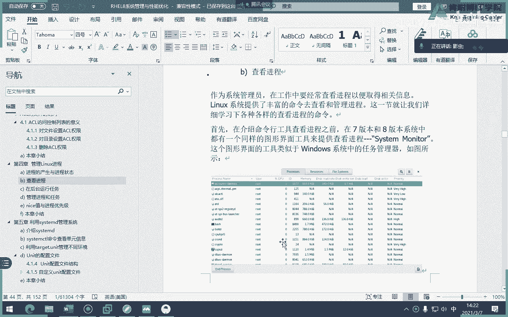

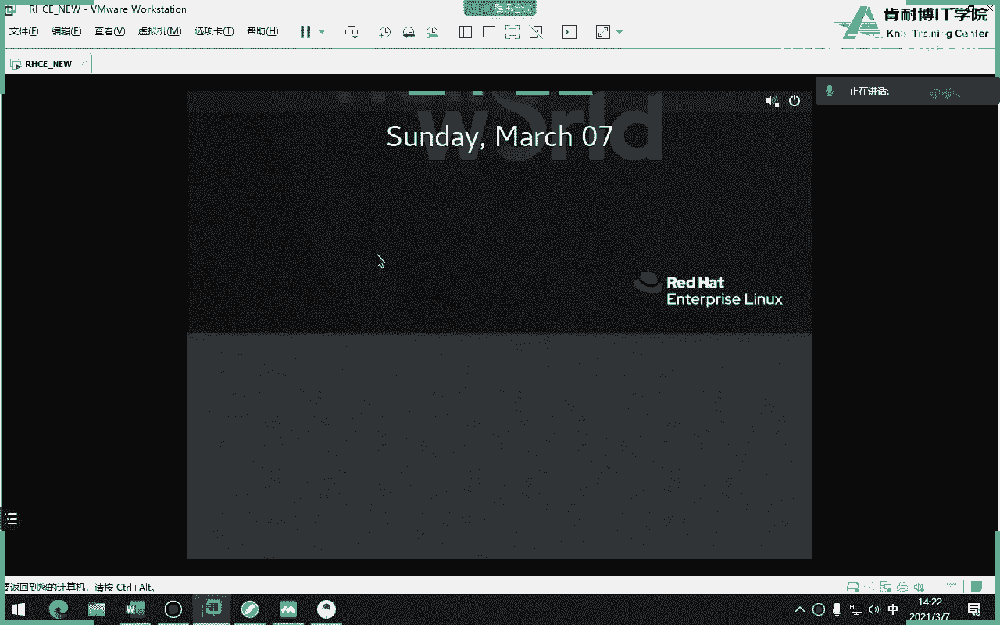

在这儿在这儿在这儿在这儿在哪儿在这儿。没是。嗯，看到吗？是不是像windows的任务管理器啊，同志们。这吗还可以看res呃那个资源，还可以看fire system叫。分区的使用状态对吧？这是这个哎。

右键可以干干嘛？continual stop还可以改变优先级，看到吗？还可以干嘛这个。杀掉比较比较吓人啊。好，当然了，这个咱们不讲为啥？因为咱们重点不是讲通文化界面。

咱们要讲如何用命令行的方式来获得进程。这张很重要。好，那么我们先学第一个经典命令top。

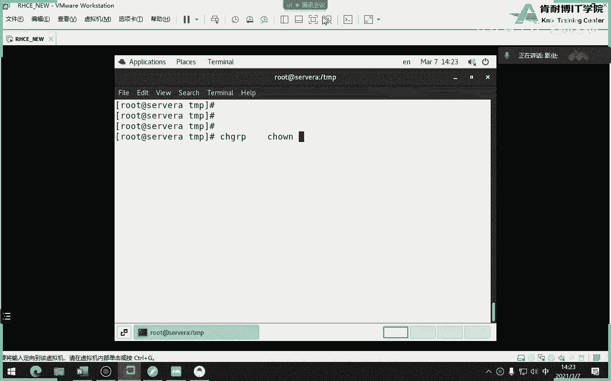

小点儿啊，同志们，我这个电太大了。这个面扭TOP来撬一下各位。TOP。是不是跟我一样的显示？是吧。好。我今天来。给你们每一个同学把每一个字段给你们介绍清楚。只讲这一遍。

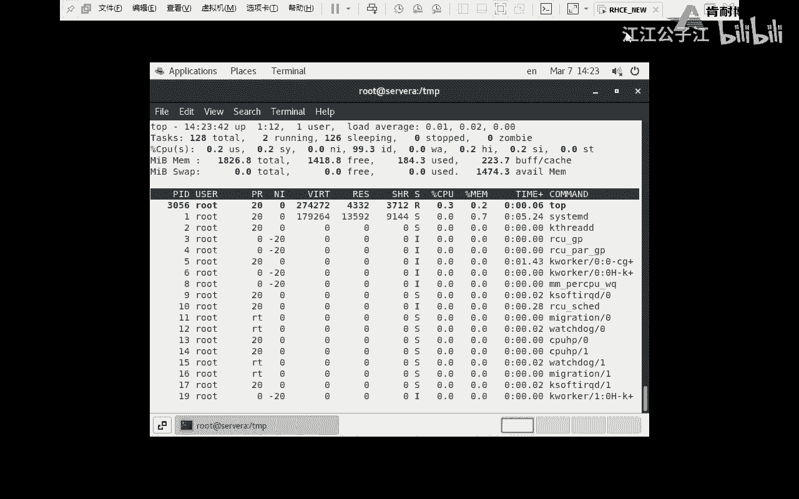

书上有没有讲top命量？肯率也小。啊，也讲但他但但它很简单，就讲那么一点点。🤧。我为什么要给你们费心思讲这个top呢？因为top是作为管理员必讳的。

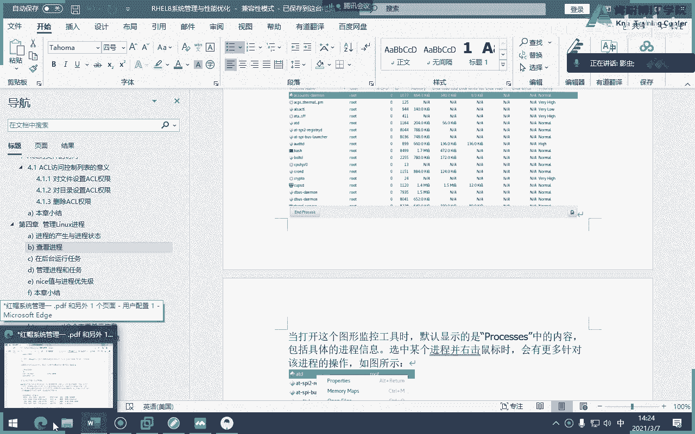

他也是必须很熟悉的那种会。所以我来给你们解释每一个字段。该记的气好吗？该记的气。这个面令大家有没有发现它在动？说明啥？事实的很好。而且这个而且这个命令是3秒钟动一次。但是你可以改觉。我们他改成5秒钟。

可以啊，你看这样改同志们。D。5秒。啊，听没有。好。这个命被一分为二，这中间这个黑色的东西一分为二，看到吗？上面是整个系统的总信息。下一步。具体的什么？他在进场。好，来，我们先看。第一行。

第一行代表当前时间是12点25分。16秒。这个意思是指刚才说错了，不好意思哈。啊，对的对，这就是当天时间啊，up是指我这个电脑已经开机了多久。我的电脑开机了一个小时。一养时多。那我们想如果一个时间越大。

说明什么？是代表好久没生气了。对吧啊。这个代表当前有几个账户正在登录系统，就我这个电脑有几个账户正在正在登录系统。好。这三个有疑问吗？OK下面来啊。南的地方是在这。这个单词外面听成叫。哦。

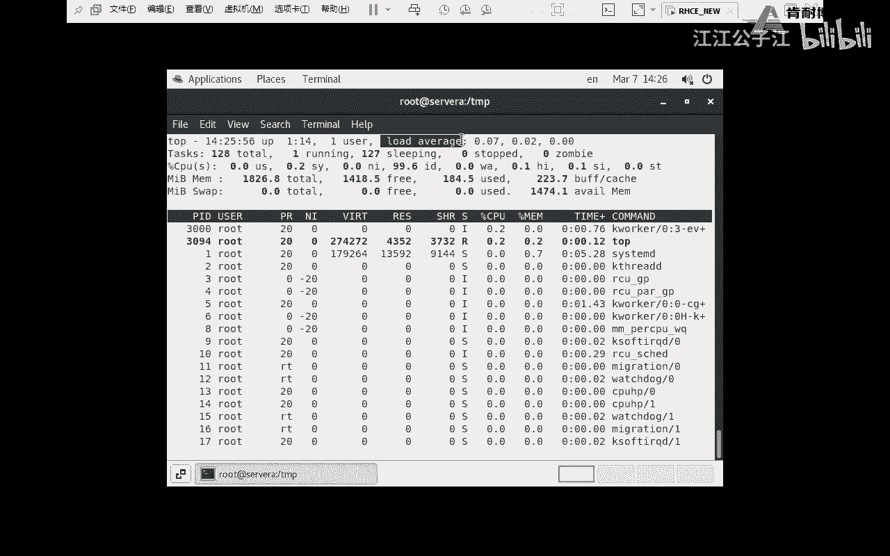

叫平均负载。OK记一下啊，我来写一下。Pa。其中有一个叫平均负载的东西。平均平定平。负在。他分别代表一分钟。5分钟。15分钟的平均负在。所以大家看到有没有三个数字。

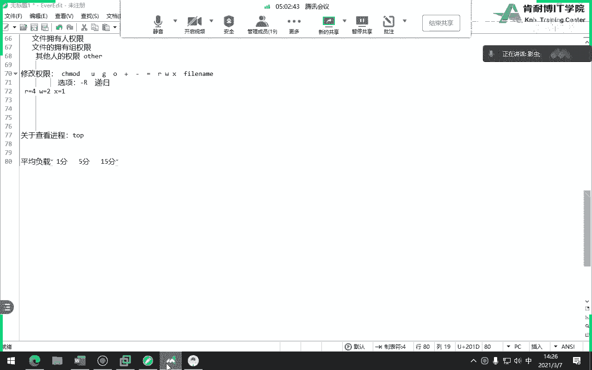

看到没有好同话没？三个数据。下次记住一嗯对。是。Yuhu。好。我不能只是告诉大家这个中文含义，我要告诉你们，这个值它所背后产生的。性能影响。那你来想象下。这个值。你觉得是什么意思？各位，这你没理解。

就你们的知识点去理解的话，你觉得什么是平均负债？这就是什么？这别了什么？CP的进程数CPU的进程数，还有别因理解吗？什么叫负载？负载是不是指的一个东西对我一种压力啊？对吧我天天。今天不上班，我压力小点。

我明天上班，我压力大点，是不是这个意思啊？好，大家在这题当中肯定不是针对别人。资源来说肯定针对的是CPU吧。对吧好，那如果你不知道，咱们来慢一下同学们啊，对，这个top命令按Q退出啊。

各位Q退出你家退出，我们来慢一下。但是慢谁呢？你卖top不好意思，没有。为啥呢？因为平均负载有好多命令可以打，比如说W命令就有平均负载。比如说阿to time路命令。就有平均负担。咱们现天卖就是阿虎他。

来找一下平均负载这一段话是什么意思？来，朋友们就在这儿。来。这谁英文好，帮我翻译一下。这段黑色的就是平均负载的中文解释英文解释。这个单词说一下叫不可中断式睡眠。这个单词。来翻译一下同志们，啥意思？

我给你们一次性解构讲破，你们以后就不要再有疑问了。这句话是哎呦他怎么又变大了？就有点小一点啊。这句话什么意思啊？英文英文英文英文。当你不知道的时候就看卖或者看好，他是最官方的解释。他说。

平均负载平均负载指的是记录。运行状态的。进程的数量和或者是不可中断式状态的进程的。今うな。再说一遍，平均负载指的是记录运行状态或者是不可中断式状态的进程的number数量。

我刚才有没有给大家解释什么叫运行状态？什么叫不可冲在时状态？解释了吧。哦，那你就明白了，原来这个数值是跟这两种状态的进程有关系，跟其他状态，比如跟stop状态有关系吗？没有好。

这就是为什么我要跟大家看会啥？因为很多同学都有一个错误的理解，都以为这个是跟进程的利用率有关系，这是没有没有太多关系。我们可以这么去想象一个问题，是不是说这个CPU现在利用率利用率特别高，负载就高了。

不一定。也可能也也也可能不是也可能是。Weishang。好，我我我问大家一个事儿。什么情况下是利CPU利率利用率比较高的那种。那种那种情景。这样？对，解。或者批述于。或者是那种。高性能运算。

对吧由我们来运算一下。这个DNA的这个啊。是吧某个东西那肯定要密集型。对吧那么这个时候咱们的利率高，这个平均负贷一定会高。还有一种。什么是不可中断式睡眠？不可中断说明。

比如我刚才讲拷贝一个很大很大的文件。我请问大家，拷贝一个很大的文件。CPU这个时候利率高。比如现在正外考虑一个一个电影，这一个电影100P。不得。CPU现在就躺着呢，你知道吗？视觉睡觉了，它一点都不高。

但是你会发现哎，平均负载也高，为什么？龚我刚讲过。他记录是。什么运行状态。和不可中断式状态。而刚才我讲的那个拷贝大文件指就是不可中断式睡眠的状态的。一种情景，而CPU利率这个时候几乎没有。

这请印象中的朋友一定要知道，大家不要觉得只是CPU利率高它才高。懂吗？这个知识演能过吗？好。继续。现在我的电脑以126个进程，一个正在运行，这么多正在睡眠。あの啊。好。

这边是CPUS是指我有几个罗金CPU。什么叫逻辑Cview？就是假的核心。几个。你也不知道爱的数字一，来各位爱数字一。几中。是不是两个。哎，你你可以看到一个是零，一个是一呀。是不是两个。

对吧那这两个的话，你会发现有有有一个什么东西啊。这两方你发现什么？跟他有关系吗？跟他有关系吗？就跟这个有关系吗，平级负债。有啊。各位。如果我们的平均负债。现在我有几个CPU2个吧。

如果你运行状态CPU特别多。那么运行状态的进程特别多，超过了你的核心CPU的话，它的状态一定高。比如我现有2个CPU。但是我现在这边出现了4。就说没下。就说我现在电脑有点累了。各位。

这就说明我们电脑现在比较累，就像我现在此时此刻一样。明白吗？好，那你想想我现在就两条路，但是呢你现在跑了4辆车，相当于全部把我路都堵满了。我后面那两辆车就没法走了，所以电脑就会比较累了。

所以我们的平均负载是跟CPU是有关系，跟CPU的数量是有关系的。我怎么知道CPU数量按一下数字一懂吗？哎，如果你的CPU很多的话，啪一刷屏全是CPU，你知道吗？真的被刷屏了。现在给大家这几个。都然了吗。

啊，你一个是吧。还有昨天你装系统之候没有调CP的个数吧。啊，那就是于这一个对吧？就是C跟0了。对吧。好。那么后面这些是啥呢？这些人签月的利用率。啊，US指的是。用户态的利用率SYS指的是内核态的利用率。

咱们知道啊一个程序它分为用户态和内核态。啊，这个大案就有点深了，你就知道一下就行了啊。好，后面就是啥？这是等待。空闲I等空弦，这个值越高，说明当前电脑越清闲。什么叫空闲值百分之百？

就是百分之百没有用它吧。对吧好，下面是什么？这是啥。man有人啥意思啊？内存我这个当前电脑有将近两个G。加线两个G好吧。当前将近两个G，然后这是啥？这啥昨天说过。帅。啊。降分机我现在没有吧，电脑没有啊。

我电脑没有。你昨天装了吗？你们是不是作用，我没有，因为我没装这个电脑。好吧。好了，关于这些值呢，我们就先说到这，这是当前还剩多少内存，已经什么？使用的对吧？这是可以作为缓存的地方。up catch。

缓存。缓刑大家都懂吗？缓存的目的是干嘛的？各位。这样子加速。对吧我第一次访问一个国外的网站很慢，但第二次访问一个网站就特别快了。为什么有缓求？我们知道硬盘很慢。

我当第一次从硬盘里面访问一个文件的时候会很慢。但是呢第二次访问的时候就很快为啥，因为它不是访问那个硬盘里面了，他访问的是谁？这一块其实访问缓存就是访问谁。Gui。我访问缓存是访问哪个？内存啊。对吧。

剩下的就是巴拉巴拉巴拉巴拉具体的气况。好，第一个先看第一个叫PRD，不用解释。第二个啥什么叫优等。就是哪个用户产生竞争，听懂吗？这么讲啊，这个进程的拥有。人。好，PR叫优先级。听も。哎。

各位为什么有优先级啊？😡，为什么要有优先级啊？那么在以前来讲的话，在以前来讲的话，优先级是指你优先级高，我就先运行你吧。对吧明白吗？啊，好，那么下面这个NI呢？要nice。这个单词的缩缩写。Nice。

这个值呢。很多同学把它说成优先级，因为很多教程会把它翻译成优先级，这个翻译是绝对错误。PR才是优先级。nice值不要翻译，就叫nice。这个值是影响优先级。那脆以再再说一遍，NI是影响优先级。

这个是一个程序占用的虚拟内存是多少？RES是指占用的物理内存是多少，听得懂吗？各位。我问大家，现在这个程序跑完之后占了多少内存，你应该看哪一个？IES吧。那为什么要有虚拟内存呢？这就很深了。

这个东西就我们要讲讲讲到调优了。啊，就不说。就不说了啊。好，这个是。共享内存。这个是S是状态。这个是CPU利用率。注意这个CPU利用率是所有核心加起来的利用率，这点一定要分清楚，各位这个利用率。

这个利用率。跟这个利用的域不是一回事。这边的CPU指的是所有核心加起利用率有没有很可能超过200%？啊，不不有没有可能超过100%？有啊。有时候你会发现这边怎么出现一个100180，比如说为啥？

因为我有几个CPU现在。两个明白吧？所以未来你看到比如说这地方出现了180，你千万不要因哎，这怎么会事？180啊啊，那是因为我现在有2个CPU因为它是所有CPU加起来的百分比。明白吗？

而这个是每1个CPU占样的百分比，听懂了吗？各位。我问大家，这个值可能超过百分之百吗？不可能的，因为是单个CPU的利率，而这个是所有CPU利率，能听懂吗？这是很多人没有注意到的事情。我说你记就行了啊。

这是啥。内存利用率对吧？比如说这个内存占用了整个内存的50%。看懂了吧？好，后面就不讲了，后面的是时间，还有一个啥，就是这个姓程的名字。啊，但是它这里面翻译成不是禁程，翻译成叫什么命令吧。系统管理员。

系统管理员的你们和我们对这个命令都必须要非常了解。

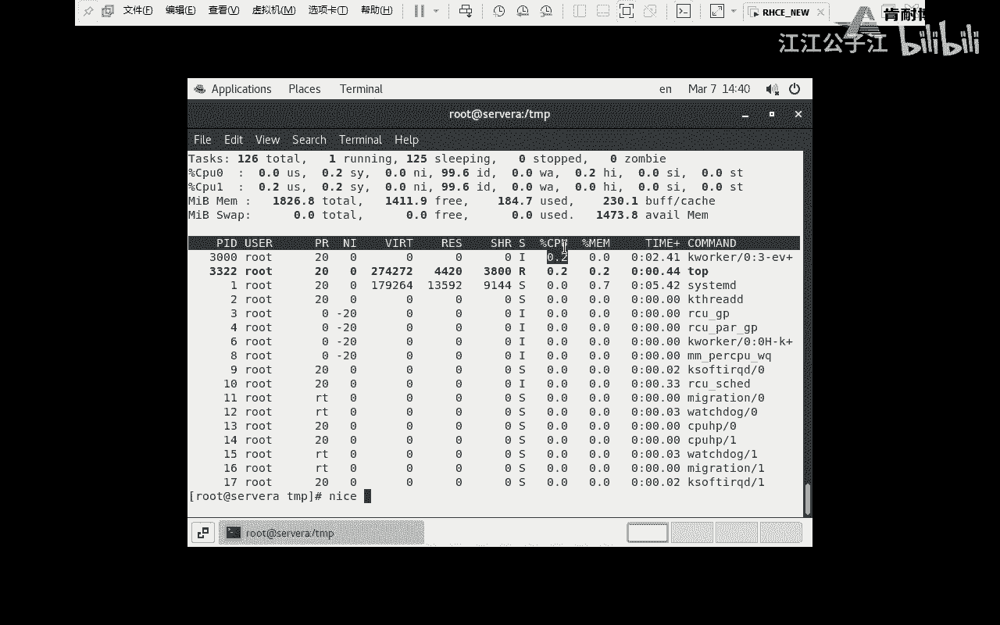

没办法。那咱们教材呢又很含蓄，一带而过。就说了这么一点点。就说了这一点。你说有啥意思？所以我得给你们讲清楚。top命令按哪个是退出？还有哪个是按Q退出？木。啊，不不lessless LESS啊。

more冒没有说错，LESS啊。😡，好，top云定会了吧。刚才我加了杠D是什么意思啊？😊。

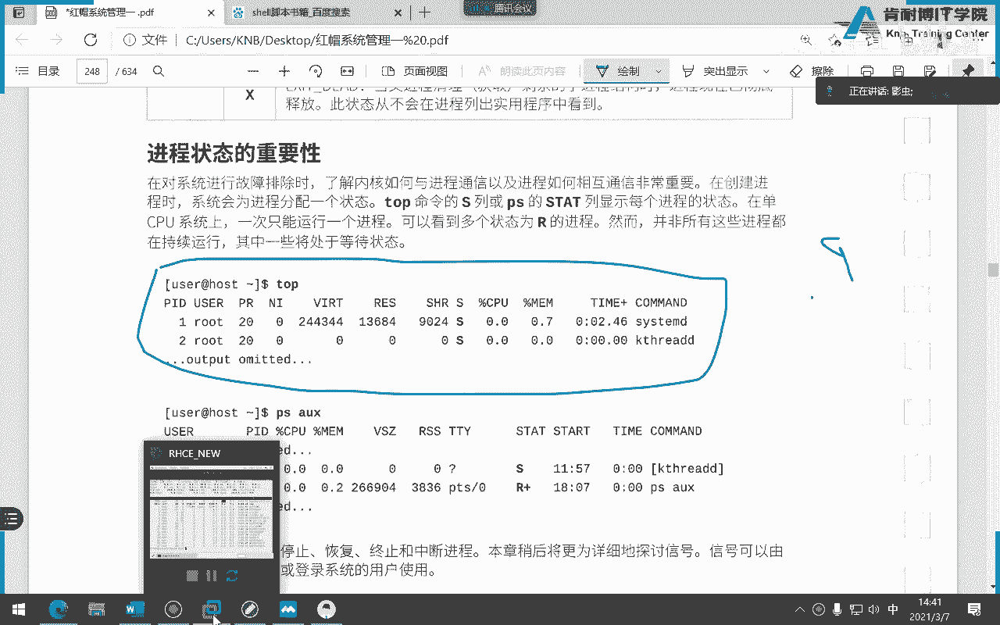

刚我打这个名字啥意思？对5秒钟跳一次啊5秒钟。不打了，就是默尔3秒。哎，是3秒吧。

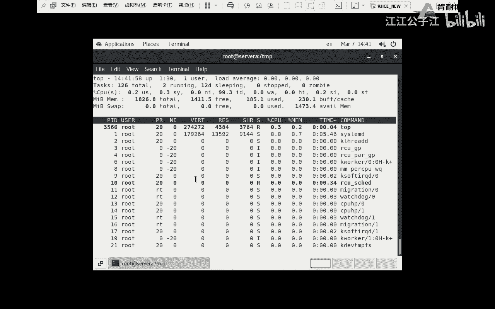

应该是。行，暂停一下。第二个是我们的PS命令哎。P。大家来看PS看进程的，但你会发现它很少。啊，为啥呢？你自细看拜是是啥，告诉我。代是是什么进程？但是。是啊，也就是咱们现在看到的这个吧。啊。

那怎么突然出现个PS呢？对，好，那我问大家。咱们刚刚都学过进程是怎么产生的，告诉我。啊，是通过谁？是通过附进成fck出来的吧。是通过附体上f出来的吧。叫什么派生吧。好，那我们可以看一下他们俩的父子关系。

哎，你。杠一个小卷L。你来看各位哪个是附近商，你来看，你猜一猜。谁是父，谁是子？但是是负进程吧，你着的来看当1个PRD号和PPRD号之间的关系就能看出来。看了吗？这个P就指per。

一个进程的PID号等于另一个进程的PPID号，他们是父子关系，看懂了吗？同学们。看懂了吗？还有就算你不知道，你猜也能猜出来。如果我把这个窗口关了，你PS还在吗？😡，对吧哎废废话嘛，对不对啊？懂了吗？

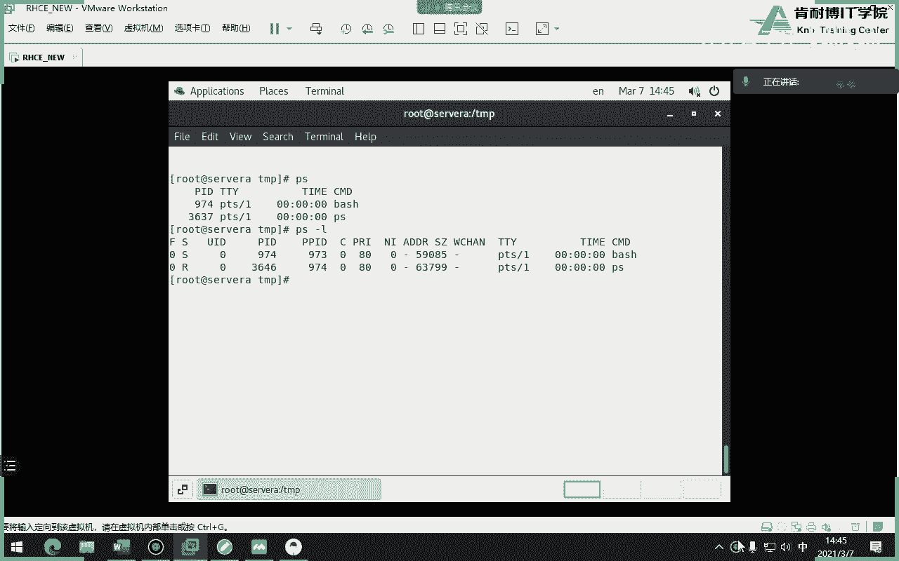

我们刚才讲的是PS命令，你看PS如果没有加选项的话。PS没有加任何选项的话，它列出的只是跟自己相关的进程。你看PS没有加选项的话，只是列出与当前用户相同的有效用户ID。

并与这个调用PS所处同一终端关联的所有进程。但其实我电脑里面不可能只有两个进程吧，大家看。我电脑里面难道就是这两个进程吗？不可能吧啊，所以你要用查看所有进程的命令，比如说PS杠AUX。啊。

还有一个问题就是PS杠EF这两个都是查看所有进程。我们来看一下区别。区别在哪呢？区别它的在它显示的内容上，你看。PSAOX显示了这样一堆内容。比如说。这个是什么？是虚拟内存，这个是物理内存。哎。

刚才我们top命令当中的物理内存叫什么？😡，叫RES吧，这个叫RSS。但是是一个意思。那么PS杠EF呢？也是查看所有进程，但他有什么不一样的地方呢？你来看。它没有显示虚拟内存和物理内存的东西。

但它显示的什么？PPID号。懂了吗？就以这两个命令。都可以看。是吧所有进程只是它显示出来的结果不一样。那么你要看你自己想要哪个。啊。不能说想要哪个。只能说什么。你看的什么？想摘出来里面的信息的不同。

对吧？好，那么所以说请大家一定要分清楚这两个命令啊，这两个命令都可以查看所有进程。也就说我们今天学的top和PS是我们工作当中用的最多最多最多的是么？没得。最多的两个查看进程的命令。好了，讲那么多啊。

PS。😊，O。之后再来说一个很好玩的东西，就是PS当中有一个小选项叫O选项。O是干嘛呢？指定output指定一些输出。你看啊甭管是AX也好，还有还有还有EF也好，它有这么多的输出。

但是我比如说我只想看某一个呢，你比如比如说这样，我想看我只想看关于URD的东西。和PRD的东西。あここお。不行不行，哎，我想想这个怎么搞。嗯。😊，还人呢。随便找一个，看有没有案例。嗯。

啊OO就是我自定义输出。东西2杠一，比如说PS杠E。然后。欧把MPRD。哎，不对，唉，怎么显示了？啊，咱们就说我用它来解释吧，PS杠E对吧？E是什么？呃，查看所有进程O呢就是自定义你要输出的内容。

比如我这样看这几个内容。知了吗？我展看这几个内容，而不是看所有内容。而PS杠U呢是这样，是啥意思？只查看什么用人是root的。懂了吗？你按就这个，比如说看像这个。😊。

就我想看PRD的TRD了class class的不拉不拉不拉一堆，就我定我自定义想要看的输出结果，听懂了吗？啊，就可以用O很有用啊，以后你会经常用到了港，我只查看我关心的输出的东西。如果你不指定的话。

它就会默列出默认的东西。懂吗？啊，哦啊。就是output。好，就这样。那么这个杠杠SORT呢是用于排序。排序就从大到小啊，从小到大排序这种。好了，关于现场的查看，咱们总结一下，比如说有图形化界面的。

有top的，有PS的对吧？好，讲到这儿呢，我一般就会暂停一下，我会给大家补充一些。查看。这个硬件。这个你觉得有有有有必要了解吧？

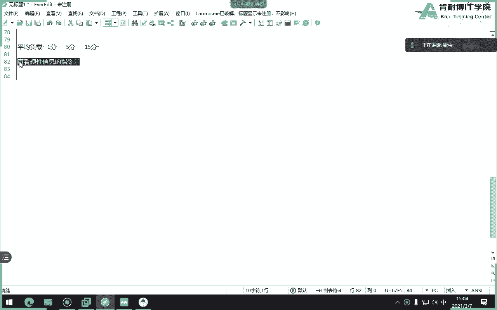

是吧哎，很有必要，你记住啊。咱们以后工作当中或多或少都会跟什么打交道。都会跟我们的。性能打交道。对吧比如服务器的性能或者应用的性能，那么我得先知道我当前的电脑的硬件状况，我才能进行调吧。

也也不也也不一定代表我每个人都要去调优。但是你要先知道我当前的。好比说你是你们公司的服务器的管理员。你都管了34年了，你都不知道你电脑什么配置，这怎么可能呢？😡，对不对？

那么问题是比如说我是咱们公司的一个新来的一员工，我接手你这个服务器，我怎么知道你的硬件配置呢？如果你不告诉我。难道我们非得去去拆机箱看吗？而且你有没有发现，就算你拆机箱。

你也不一定能看看出来这个这个多大吧，对吧？所以我们要有指令。啊，所以呢我们现在花点时间给大家总结出来所有的CPU哦，不是所有的硬件资源，就是咱们知道的硬件资源那些。确定。好吧。

这个东西三门教材里面都没有。啊，你就不用翻书了，你找个空白记一下就行了。咱们从大。王晓硕。咱们先说谁呢？从大往小说，咱们先说硬盘。你比如说各位，我想知道我当天的硬盘多大。😡，我这么讲那个野巴哎。

这个命令其实你记不记无所谓。因为我们在讲到第二本书讲硬盘分区的时候，就会讲到这个命令。啊，查看硬盘来瞅一眼同志们。

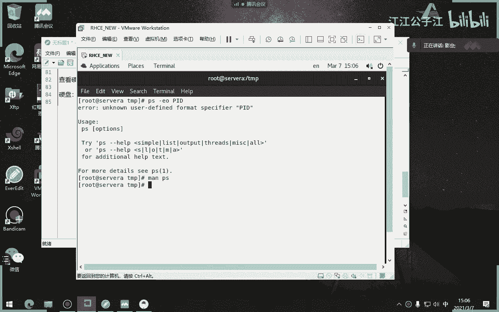

看一下我的我看一下我的。哇，我了那么多硬盘。看。一个硬盘，你怎不知道一个昨天说过A是什么意思啊？😡，BC。第。昨天我们上课的时候还少讲了一个接口，就是威力。威你什么意思啊？去年买。虚拟机。虚拟机。

都是VD开头。还是KVM寻机。所以你们考试的时候千万注意啊，昨天你们传在你们在装操作系统时候，是不是叫NVME。考试时候绝对不会不会可能有NYME接口的。只有VD。

因为你们考试用的是linux的就这个环境。是用了这种虚拟化，这种虚拟化只有VD。而昨天我们装的是VM station，那个虚拟机呢比较牛一些，它可以模拟现在比较新的，所以叫MME或者叫SD。

但现在呢我们是有VD在有几个盘各位。ABCD4个盘吧，每一硬盘多大？是是5G啊。听懂了吗？这是不是看硬盘？会了吗？这个单词什么意思啊？告诉我。什么。上去吧。啊下去。好，继续。

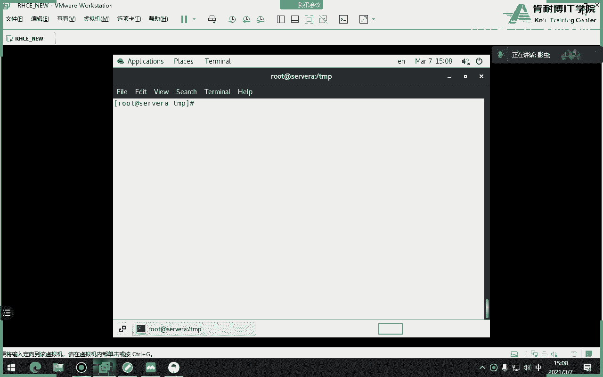

大家还想知道啥？です。我知道内送多大free。

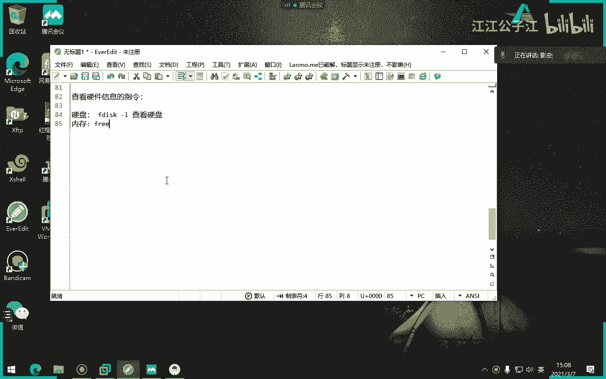

干。不用干也行，不会就行。好 free杠H看一下多大两个G，将近2个G1。8G。还有他可以看是吧？算当然你也可以出一杠MM就照。但你也可以承都不加，就是自节。对吧同志们。

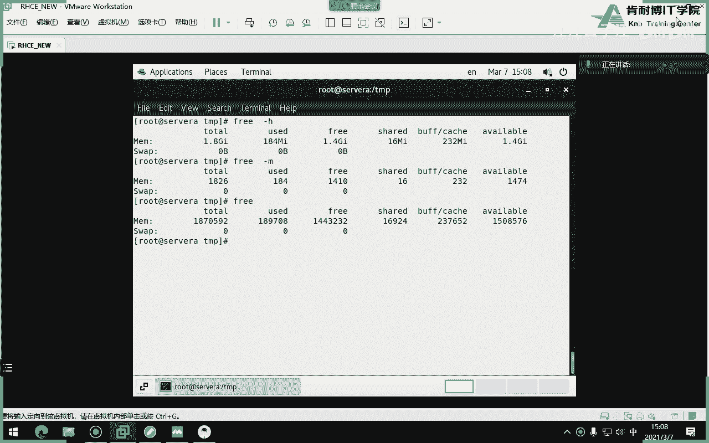

再来。还有什么啊？有人说CPU行，看CPU我想知道我CPU啥情况，昨天说过哪个命令？😊，LSCD。啊，没说过啊，我说一下LSCPU这个命令是在红包6才有的，红包五是没有。

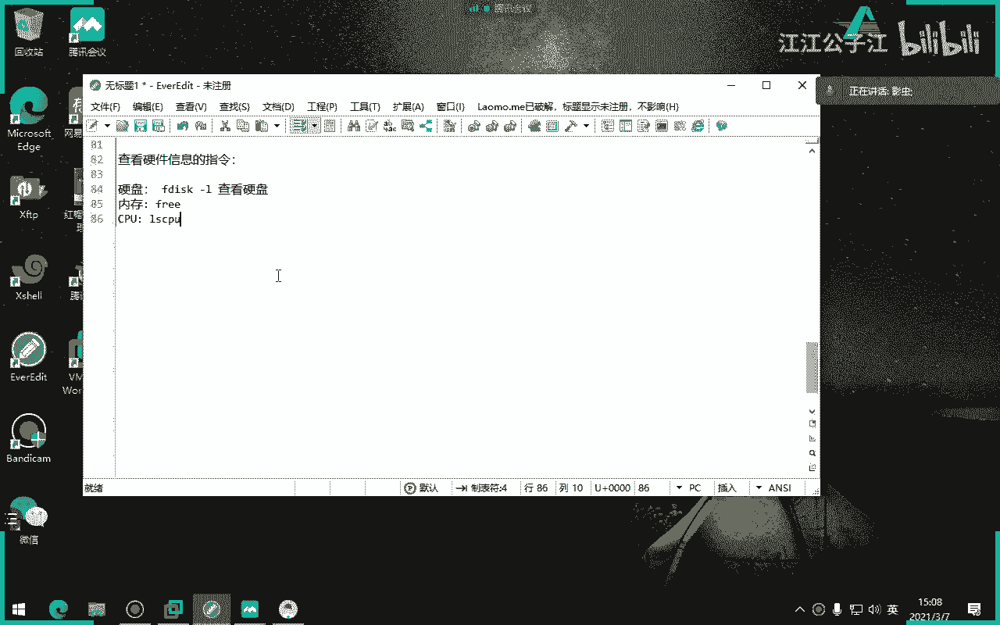

我的个天，我的CPU是这个样子的，虚拟化。因为我现在用的是虚拟机嘛。😊，对吧心里话哎，告诉我，我现在CPU，我现在CPU几个核心。😊，被个。俩吧好。但我的物理CPU有几个？Li。

sock开的指的是物理CPU。啊，大家其实都是假的，我毕竟是虚拟出来的嘛，但你把它理解为就是真的啊。好。😡，我当前的缓存多大？一级划存。嗯。没有4吧。对呀。大家知道吗？CPU缓存大家听过吗？

对吧你多多少少得听过吧。好，CPU的缓存分为一系缓存、二级缓存、三级缓存。一级缓存当中就分为两个，一个是数据缓存，一个是指令缓存。听懂我意思吗？啊，二G环动多大？四兆。是4兆。这4张。啊。

当前那个电脑支持虚拟化吗？真实啊，你看。for全虚拟化。当年CPU的虚拟化是什么牌子啊？QBM。看到了？同志们好。还有一种办法是看昨天我们是不是学过这个，我们说PROC是看信息的目录吧。

里边有个CPU硬货。😊，这个更厉害，你来看啊。你来看同志们，我有几个CPU。两个你怎知道看零是几？零是一一是写。第是2，那我问大家一个问题。这2个CPU是独立的两个正CPU还是1个CPU2核。

你怎么看出来？我叫大家来仔细看抬头。只要看到physical IDD一样的，就说明他们是一个CPU。这个CPU0号的faceID是0这个CPU1号的。basical ID是一，说明他们俩是。这什么？

两个独立的CPU。听得懂吗？啊，这是虚拟机？对对，都是虚拟的啊，毕竟哪来那么两个，你这怎么怎么可能咱们电脑能插2个CP疯了吧，对吧？这毕竟我虚虚拟出来了吧，你知道怎么虚拟吧？你新建虚拟机时候。

你家大家不是可以调CDU吗？对吧？啊，这我是模拟嘛。😡，理会一下啊。好，还有。😊，这个命令我就不敲了，就这个啊。

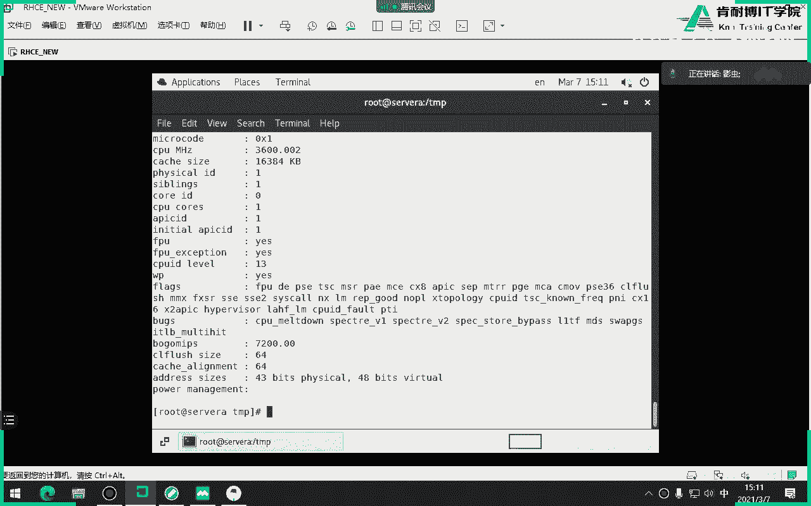

Kt CPUPU info for。还有。还有什么好玩的？L我想知道我是USB总线。对吧SCPUUSB。看见来吧。啊，还有PCR总线。就I。PI。啊，我就我就不敲了，你自己知道一下就行。😡，啊。

都是小写啊小写小写。还个P萨啊。还有什么？王凯就是PC啊。P3里面就看到了网卡。大家真正看网卡的速度功率怎么看呢？我想知道它是全双攻呢，还是多少是百兆的千兆的。Tos。

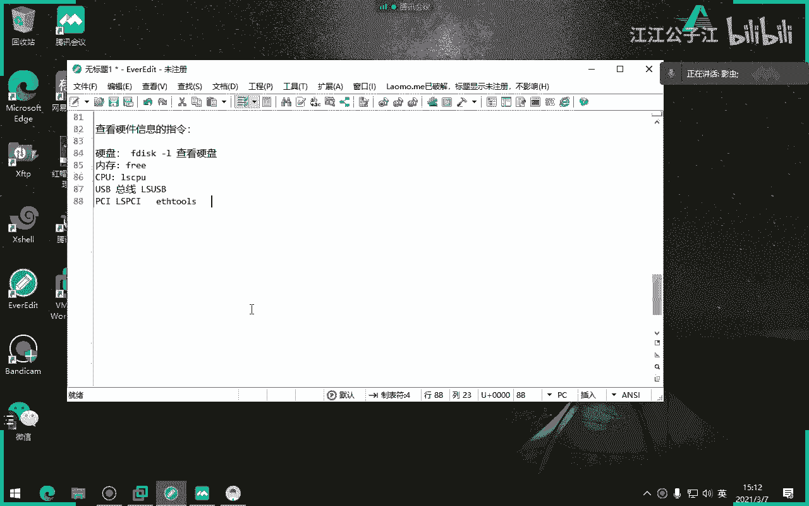

Eer tooth。比如说我看一下当前网卡，easter tools。

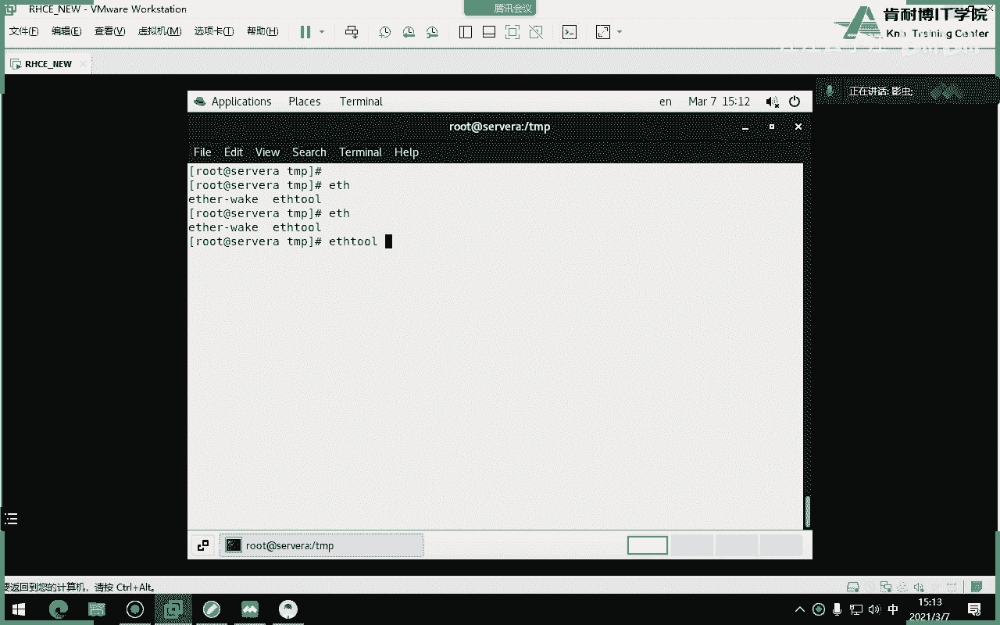

哑铃。没有PPPP屁没有S啊。

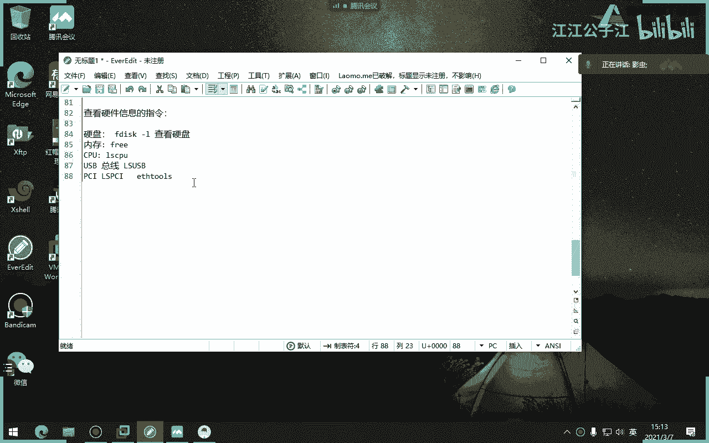

家里没有木有。像王凯什么我也知道我王凯叫啥。这的网卡叫啥？叫ETH0。哇，网卡都没有都没有都没有，都没有那个，我看真实的，我想看一下真实的。真是网卡。啊，对对对。稍等，我看一下我的网卡。ああ、完。

Okay。OK大家来看能看懂啥，我当前是什么速度，同志们。我没看到。到现在还没看到。where is全双宫。对吧同志们能协商吗？no不自动协商。😡，什么叫自动协商？你是1000兆，我是100兆得了呢。

咱们就100兆吧。😡，啊，是不是写上。哎，我现在关闭协商，就是你必须1000兆，我也1000兆。😡，对吧协商嘛关闭了嘛，对吧？全双攻什么意思啊？就你开那车一样啊，一一个路上是不是又可以来又可以去？😡。

啊，全成功明白吗？这个这个命令学会了吗？好好用啊，这个命令最后link就代表它是在线。什么叫在线。各位，如果这边是个no，是啥意思啊？就代表你个网卡没有被激活，或者你的网卡根本就没连网线，明白了吗？啊。

或者举个例子，我有两张网卡，一个网卡被禁用了，这个地方一定是no。好吧，11点钟够。这个明天会了吗？查看网卡了啊，接下来同志们。

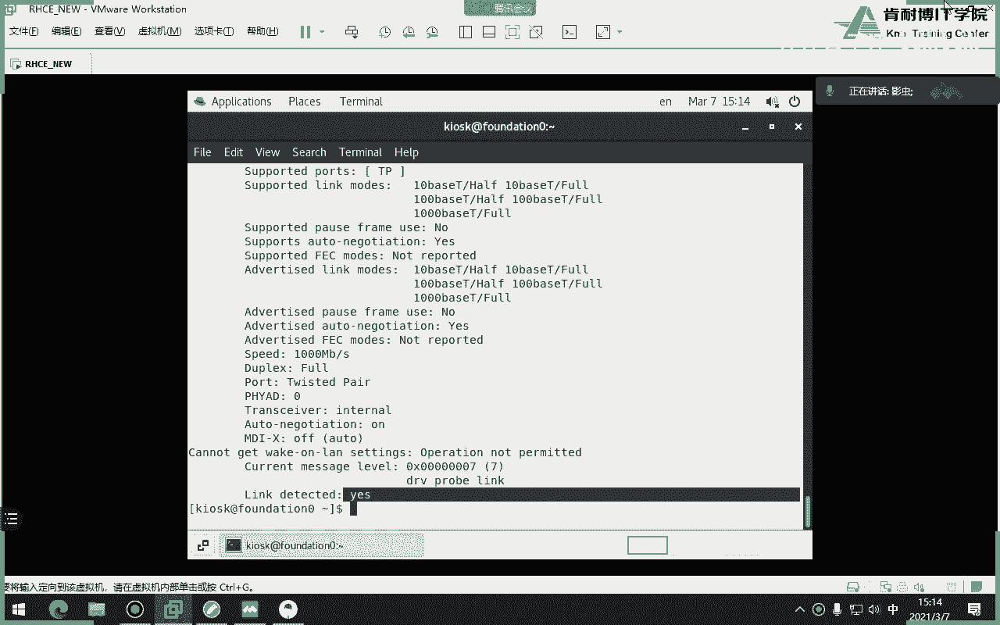

查看我查。看网卡。的信息。这个。是吧，朋友们。还有什么好玩的？这有啥？来咱们一该还看啥。好像就就差不多了吧。

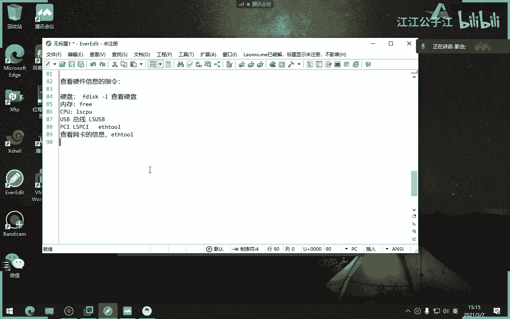

好，再教大家一遍更牛逼了啊。当等当当当当当等等。大加更厉害了啊，同志们。DM messages message件。DM messagessage怎么拼？在这儿。好，注意这个命令是干嘛的，知道吗？

当你敲这个命令时候，它是干嘛的呢？它是查看从开机那一瞬间。系统。识别到的我们系统的所有的软硬件信息。比为这里面可以有硬件，可以有软件回收。我的个天，这么多。从头看。看能这识几个。可。

首先这是我当前电脑的名字，而且是我的内核版本。咱们现在八版本的内核都是4。18，大家知道什么叫内核吗？C啊 kernel内核啊，我说的内核版本跟系统版本是一回事吗？不是啊。

这是我们当前电脑的这个GCC的版本。OK然后往下走走走走走走，这是什么？啊，这是我的bes的版本。Okay。然后这是我们的虚拟化的厂商，对吧？VM的。然后这是啥东西啊？走看不懂哈。

走走走走走走走走走走走走。嗯。哦，这是一票内存信息。64位的内存信息。OK我们当前的内存的页面。啊，然后。噔噔噔噔噔噔噔，然后是啥东西啊？的的的okK这边是加载我的内核，4。18的内核。

并且呢要开始读取我们的根分区，以只读的形式read only的形式加载根分区。然后再开始。这是啥？往下走看。ok这是我CPU的信息，我有1个CPU，我看零是几啊？一对吧啊，注意我现在用的是哪台机器啊。

仿定神灵，防定神灵是不是我们物理机啊？哦，I38是啊那个I3的8100。3。6赫兹。啊，这么多吧，反正就不再一一解释了，看到了吗？DM messagess这个命令是查看软硬件信息。

OK当然了你不一定能看懂是吧啊。O ok ok。是不很厉害？同志们。好。这有什么厉害的，还有更厉害的。DMI code就是最厉害的查看硬件信息。为什么呢？因为它是从bis里面去读取的。

所以说更干嘛更底层，听懂了吗？就更真实。bis影片。表。S对吧？se啊最厉害啊。好，直接回车，它会显示一堆信息回车。不好意思，他说啥权限，我得切换成超户。啊，我就不告诉大家明。

我不告不告诉你们这个超户的密码啊。😡，我自己打。DMI code回车啊，我的个天，这么多啊，看这么多来，我教大家怎么看。我不能光讲，你知道吗？光讲命令，你你你不会看你有什么用？从你咱们从这儿开始看。

你来看同志们是不是都有一个type啊。好，那我从头看吧，因为翻屏怎么翻？很好啊。你看这是DMI code的版本，3。2，这是bes的版本2。7。然后请注意这个type代表了每一个硬件的类型资源。

比如说type零指的是bells方面的东西。啊，那我再走走走走走走这比如说type一指的是什么，指的是系统方面的信息。那么还有很多呢，你比如说bells2呢，这是什么？嗯，这是主板吗？是吧。哎。

是主板吗？啊，有点像。感觉像啊感觉像。好，然后还有这个，这是关于什么进程方面的信息。4还有是一个我在我说完，我再告诉大家一个一个，还有一个是什么呢？被谁。内存是9旺，我看啊内存方面的信息。忘了卫存日记。

哇。DMI口。所以如果你想看某一个，你可以这么看杠T，比如说这样看T4，就看Dtype4，就看谁。四是谁？同志们？四是进程方面的信息。啊，不是CPU方面的信息。懂了吗？CP放为什么我有哎。

为什么我显示这么多这么多次？大家知道为什么这么多次吗？你看几次了。几次。这相当于多少逻辑的逻机的CPU。就有几次啊。啊，DMI code。哎，那个内存是多少？内存是。去吧。不完是，内存是。哎。

那还是几7。我忘了那存是几是7吗？忘自己百度吧，忘27明白吗？DMIcode是最准了，好吗？明白吗？DMI code嗯。特别准。电麦口。行，就这么多。

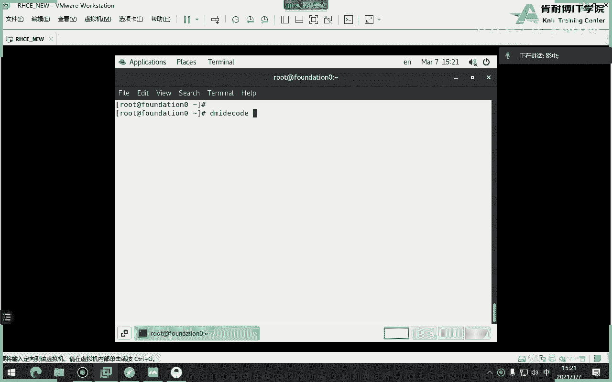

够咱们大家玩的。查看所有信息，基本上你都会了吧。

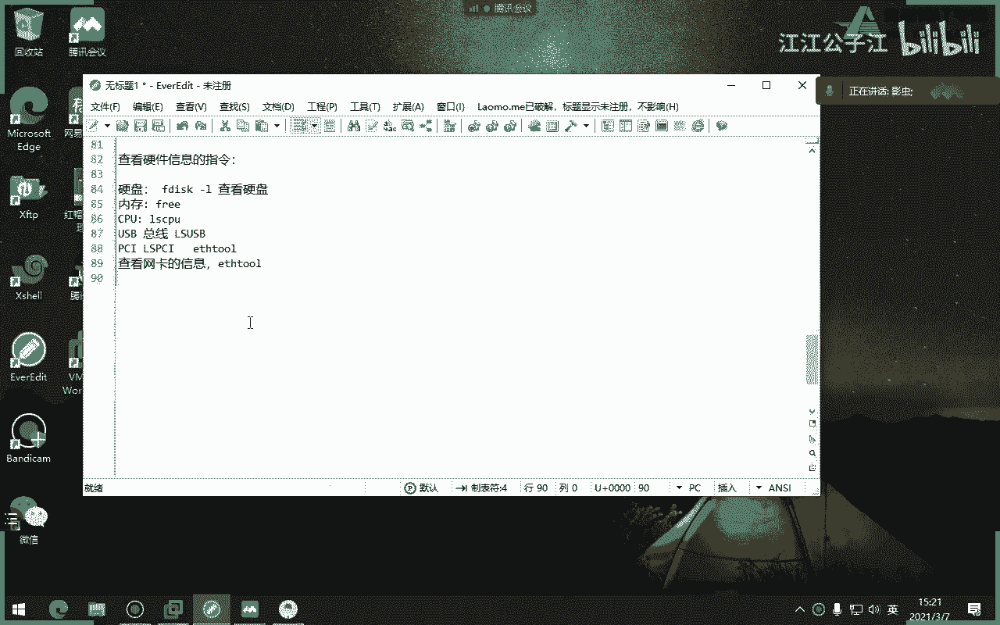

啊。