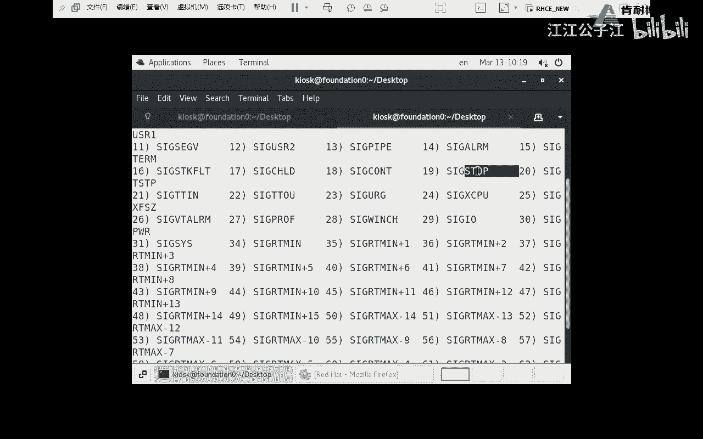
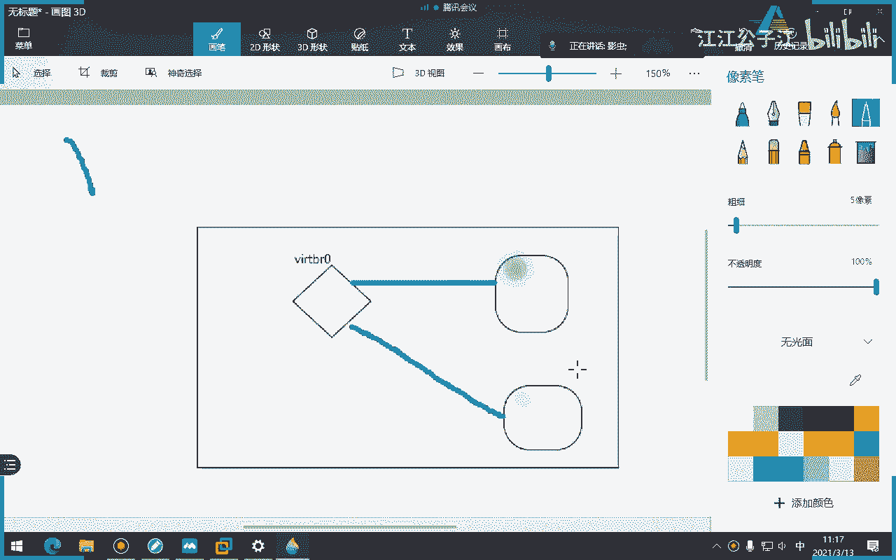

# 红帽认证系统工程师RHCE8-滕老师出品 - P5：第三天 进程管理 - KNBIT认证中心 - BV1up4y1h7MA

那么在讲今天的课程之前呢，呃先跟大家纠正一个，我上节课讲错了一个知识点啊，这个不是不太好意思啊，我上节课讲错了一个知识点，就是这个名，这个命令这个命令我讲错了，为什么呢，因为这个命令我有一个选项讲错了。

大家还记不记得，如果当我打这个命令的时候，是不是查看三个数，有三个，这是啥，各位这是不是看到一个文件的行，那中间呢单词数量，单词数，那这个呢字符数对吧，但是我从我那天讲课时，我说错了一个事儿啊。

我说咱们常见的选项有杠l是看行杠c我说成字符了，这错的各位我说错了啊，因为为啥呢，我以为这个c啊，这也是我以为的，所以我我们都以为这个是不是字符串这个单词的缩写，但错了啊，各位m才是字符，c是字节。

我怎么知道呢，我们通过mac我最后知道是啊，我发现我讲错了，看m才是什么，这个单词是不是字符啊，对吧啊，所以我讲错了啊，不太好意思啊，那也就是说我可能一直以为i s s是那个那个，所以我讲错了。

请大家留意一下，留意一下，还有咱们那天有个咱们那个同学他自己做实验出现一个问题，他说这个咱们的这个文件的权限的这个问题啊，呃我之前讲过，我说一个文件如果上面有w权限，它不能被删掉，对不对，对不对。

对不对，他只能被删掉什么内容，那但是我现在就想删掉怎么办，注意你有两个办法啊，你有两个办法，你必你必须要你必须要满足一个前提啊，各位你除了改这个拥有人对不对，或者说改他的这个拥有上面有个w之外。

还有一个重要的，你是不是要考虑上级目录，这个是不是我我我之前也提过，如果你的上级目录没有权限，是不是你也写不了，我这么讲的理解吧，就是如果你只是说把这个文件上面他用人改成了我自己，并且有w权限。

但如果你这个上级目录本身没有写权限，你也是删不了的，明白吗，为啥，因为咱们无论删文件也好，写文件也好，或建立文件也好，是不是都在一个目录上面去建立删除或是操作，如果你的上级目录没有写权限。

你能往里面建立目录吗，那样如果你上级目录没有权限，你是不是也删不了下面的子文件，明白了吗，因为你一定要看清上级目录有没有w权限，理解吧，不要光看这个文件本身有没有w，这一点一定要听清楚啊。

但如果你说我只是为了删除文件的内容，那上级目录里面有没有w权限，没事吧，没事明白吗，但如果你要删那个文件本身，你要看上级目录有没有权限啊，来做一个，你比如说对我现在一个目录加2c1 。

很显然这个上级目录是没有权限的，对于其他人来讲应该是755，大家看我说其他人啊，其他人是不是755，最后是五吧，各位这2x是不是五翻译成数字好，那你比如说我我我我这样做啊，比如说我这个我想想怎么搞。

我进到这里面好吧，我进到这个稍等稍等稍等，我进到这个r c里面建立一个文件叫123，这个文件权限肯定是64对吧，644644好，那这时候呢我这样做啊，各位我我把它改成学生，这个佣人是不是改成学生了。

有人敢动学生，看这上面是不是有w了对吧，这上面是有w，但是你也删不了，你还是只能删文件里面的内容啊，你比如说我们切换一下s u d n t s t s t t n t好，切换过来，我进到哪儿。

现在24e目录吧，进去了吧好那你看虽然说我此时此刻对123有拥有人的权限对吧，但你看我能删吗，permission吗，但是我能上你们内容吗，什么叫能删内容吗，我在我写内容进去行不行，可以吧。

为什么可以写进去，各位为什么，因为我此时此刻有w吧，不是啊，这不跟二没关系，这是w啊，是不是显示w对吧好，但是我为什么删不了呢，注意虽然你现在是拥有人了，但是你的上级目录有写权限吗。

各位我们来看我们瞅一眼，对于你来讲的话，上级目录有写权限吗，你看上节目录对于你来讲，你来讲是不是啊，是不是other部分对于我学生来讲的话，是不是other部分，other是没有，那我怎么办啊。

我退出来，比如我来一个哦，o o什么加w注意啊，仔细看我这个意思啊，上面有了吗，我们再瞅一眼，我直接直接直接来吧，是不是删掉了我，我我们进行r的c一里面没了吧，空了吧，理解了吧。

就是除了你这个一定要注意啊，就是除了你这个有w之外，你还要看上级目录，为啥因为你所有的山操作是不是针对这个目录本身的下面的内容，删你目录本身没有权利，你怎么做呢，就跟我们上节课我讲过。

如果你们上级目录没有权限，你看为什么我上节课做实验的时候，我不知道大家有没有仔细看我的这个视频，我一直是在在哪个目录下操作的，我是不是在temp目录里面操作的一个叫file文件，我不知道大家还记得吗。

为啥，因为这个目录下面是777的权限，各位看了吗，是不是上级目录他都有权限，所以他不用担心他写不了，删不了对吧，但是我刚才自己建立一个rh c目录，他是不是上级目录是没有w的。

所以有时候同学说哎为什么上不了，这个原因就是你上级目录没有权限，就算你给这个文件的权限是一个77777，但你只能针对这个文件里面的内容做添加删除更改，但对于我这个文件，你想干掉他不行。

你的上级目录有没有，所以一定要记住那句话，因为我当时在自己在写笔记的时候，我就自己我我自己就写过，我说你任何操作各位一定要考虑到你的上级目录，你做任何目录操作之前一定要在哪啊，呃权限啊，哈哈哈哈哈哈。

一定要考虑你的上级目录啊，各位如果你不考虑到你的上级目录，你是没有办法去对目录下面做的任何操作啊，你看你看对于文件的w权限，它代表可以删除里面的内容对吧，但是你一定要考虑到上级目录有没有权限。

但是在这我这里面写的是x，意思是指你能不能进去对吧，但你想象一下，如果我连x都没有，是不是你连进都进不去，你也照照样删不掉，或者或者说你别说见了你别说见你，你看根本就进不去，进不去。

你也没办法去建立此文件对吧，所以说你还是那句话，第一个上级目标有写权限，第二你要有x权限能进去，它才能进行建立这个文件的意思，但对于删除文件来讲的话，我第一个这个人身上要有w权限，第二这个目录上上层。

是不是就是这个文件所在的上层目录也要有写权限，我这样讲的清晰了吧，各位啊好吧，这就是那天咱们那个有个同学问我这个问题啊，咱们正好今天借着这个机会说一下啊，那么关于这个呃权限的，咱们就说到这儿啊。

还有一个事就是那个啊你改权限的时候要注意，咱们有两个命令，一个大写的啊，还有这个命令是不是也有个大写的啊，在干嘛呢，递归吧，所以递归啥意思啊，这是子文件目录下面的子文件也被那啥了继承了对吧啊。

要听要清楚啊，各位这个命令谁能做，这个命令只有观点也能做啊，就改文件的拥有人，只有管理员才能做啊，对吧好，那么这就是上节课我们写东西来，我们今天讲重点，不浪费时间了。

我们今天讲的重点叫做控制作业或者作业的控制，那么什么是作业呢，各位我们可以理解为作业是一组命令的集合，那你说老师那一个命令自己能不能组成一个作业呢，当然能了，就像我们有咱们经常这么讲。

我有一有一有一个群组里面有100个人，那我一个人能不能建一个组也能啊，当然也可以啊，对吧好，所以说营养作业呢你可以理解为是通过管道符号，这个怎么讲关联的一组命令。

但是呢如果只有一个命令能不能做成一个作业呢，也是可以的好，所以今天呢我们就不要太纠结了，什么叫作业，你就把它理解为就是单个程序，单个进程啊，或者说一组进程也可以干嘛，形成一种作业啊。

所以你看作业控制是需要的一种功能，允许单个是要实力运行和管理，多个命令，看到吗，多个命令，但请注意，一个命令也可以理解为是一个作业，千万注意啊，好那么作业呢有两种运行方式，第一种是后台运行。

第二种是前台运行啊，前台运行，所谓的前台就是我们占用到我们终端的叫做前台，所谓的后台就是不占用终端窗口的找后台，你比如说大家大家这个命令知道吗，如果现在写个sleep，后面加上1万，大家知道会怎么样吗。

会造成我们现在的窗口就这样卡在这，一直到1000秒钟之后，1000秒之后咱们的窗口才被弹出来，注意这个sleep是个命令啊，你要学会啊，未来咱们在写脚本会经常用sleep，是叫做秒睡眠，后面加一就睡。

也就是一秒钟一，你看跳出了，明白吗，好那如果我打1万或者打1000，他为什么会一直在这等呢，因为他要读1000秒之后才能跳出好，但如果放到后台呢，注意如果放到后台的话，这个进程运行吗，运行。

但是它不占用终端，听懂了吗，所以这个符号是什么意思，请注意这个符号叫做把一个进程或者把一个作业放到后台运行，会了吗，会了吗，各位很重要啊，啊你你比如说我现在正在呃，咱们再举一个现实生活当中的例子。

我现在比如说正在开启一个大的一个拷贝动作，他可能考十分钟分钟，但如果在拷贝的过程当中，我是不是会占用我中断，但就在这个时候，我可能有第二件事情，我第三件事情要做怎么办，我难道就要等吗，但我又不想等。

我想同时做怎么办，当然了，有一个办法就是我我能不能再开，再开几个终端可以，但我如果不想开终端了，怎么办，很简单，你就把这个占用十分钟的这个动作放到后台，比如cp他放到后台，没关系，咱们继续做别的事情。

他在后台进行拷贝，听懂了吗，还有像这个浏览器，咳咳咳，像咱们firefox浏览器也是很讨厌啊，你打这个，你打这个mini这个浏览器就出来了，但是呢你看我我的双面是不是被卡死了啊，不是卡死了就占用了。

我就不能做别的事情，为啥，因为你现在当前有一个火狐浏览器正在用，但是我一旦把浏览器关掉，你看我一旦关掉他干他干嘛，是不是又又又让我出现做第二件事情了对吧，我又可以弹出窗口了。

所以说这个浏览器能不能放到后台，可以呀，你看我放到后台之后，你看我现在是不是还可以做别的事情，前台，但是浏览器照样给我出来，明白了吗，各位这叫后台啊，一句话不占用当前窗口终端的叫做后台作业。

那反过来占用呢就是前台作业好，那怎么办呢，加上这个符号at，那不是at，这叫什么呢，and是吧，这个符号啊，符号明白了吗，唉利用这个符号把后台作业放到后面。

那当然你也可以用drops命令来显示当前的绘画列表，作业列表啊，你比如说举个例子，我再打一遍啊，你看我现在我我们这样的，比如说我这样就打开了那个sleep，打一个e，打一个100好，那我打job 4。

大家看到什么能看到能看能看到是吧，是不是当天有一个任务正在running对吧，并且请注意这个加号里面的数字一非常重要，同志们，这个就不是加号，就那个中括号，中括号里面的数字表示当前的作业号可不是进程号。

因为很多同学以为这是这啥，这是进程号错，这个6170才是进程号，这个中国号里面的一指的是作业号dp number，而这个幺六啊，这个6170才是我们的p r d，明白了吗，千千万万要这个搞明白啊。

好一个是后台，一个是前台，好，那么接下来我们来学两个命令，如何让我们如何去控制我们的作业，那既然我们能够把一个作业从前台放到后台，那是不是我们也可以从后台把它再调回到前台呀。

所以说这个fg就是前台的意思，那bg呢各位bg，是什么意思啊，后台back嘛，那f应该是什么单词的缩写，front对吧，front啊，back front，明白了吗，好你应该仔细发现一下，无论是f也好。

然后b也好，是不是后面都加的是百分号，注意这个百分号加数字一指的就是左页号，同志们，就是他，千千万万不要理解为是进程号，如果你理解为竞争号，那就完完全全是就是就是两回事啊，各位明白了吗。

一定要注意fg也好，bg也好，后面只能加什么作业，rd好理解理解啊，各位理解好。

那么我们来做一个实验嘛，什么意思呢，什么什么叫前台，什么叫后台，听不懂啊，好我们还是用这个浏览器来给大家讲，你比如说此时此刻我打这句话，我打浏览器，各位各位，我如果此时随便打浏览器。

那么他肯定会把我的作业放在后台吧对吧，放到后台好，那么如果我用fg呢，是不是他又掉到前台了，但一旦调到前台，我是不是我当前的终端又被我占掉了，又被了浏览器占了，明白了吗，这就叫后台和前台啊。

后来有钱的好，明白吗，啊我就不敲回车了啊，你自己就应该是能明白这个意思啊，那么我们接下来来讲一个事啊。

如果说我按这个符号注意，如果我强行按这个符号，这个是很多初学者容易犯的错误，他就特别喜欢按这个符号啊，为啥，因为他把终端你看，比如比如说你不知道你不知道啊，比如你所说哎我的终端怎么被卡住了，怎么办。

怎么调不出来，怎么调不出来，很多这时候的同学都习惯按ctrl加z ok调出来了啊，继续做做事情，但他不知道他其实发生了一件非常重要的事情，注意这个事情就是把作业stop对啊。

他以为现在已经把刚才那个让我们卡住的那个东西给他退出来了，其实没退是干嘛，stop了没有退，各位这个技能在不在还在还在还在还在，但他没有退好，咱不管啊，咱们现在知道ctrl加z就等同于把作业干嘛。

stop stop不是禁止，而是停止stop好，那接下来我们就就着这个，咱们继续来复习一下fg，我现在如果又想看running怎么办呢，注意现在是stop，对不对。

我现在想让它把它变成running状态，就是运行状态，但运行的时候我有两种办法，第一种是前台，第二种是后台，那我如果还想用前台的话，我应该怎么办，fg然后呢别忘记一很好，因为它数字里面是一好。

我一旦回车，大家看我这个这边又干嘛，又又又存在了，但是我窗口又被我干嘛了，占用了，好，我就是再按一下ctrl z好，它又干嘛了，stop语文老师，你怎么知道stop了，大家来看啊，我虽然浏览器还在。

但是你看什么赛，看来看啊，这这个单词能看懂吗，是他已经不给我干嘛回应了对吧，就也说我其实想刚才在那个地址栏里面输入一些，比如说3w点百度点com，他根本不让我输入，为什么。

因为我这个终端的不是这个进程已经被被被stop了，所以stop就是他不接受什么，不接受我的信号对吧，不接受我输入的东西，它只能接受我唤醒唤醒它的信号啊，当然我们还没有讲信号，但是我们再来讲怎么把它唤醒。

现在就stop了啊，那如果我们现在把它又想running呢，各位我怎么running呢，我又可以用b级，b级是什么意思啊，后台你看我回车，你看他哦，哦不好意思不好意思，我刚才把它给关了啊，来重来吧。

重来重来，我帮他开了，把它给关掉了啊，好比如先重来，我要ctrl加ctrl加什么ctrl加z，先把那个服务给他，干嘛，给他stop，然后这时候你看很显然就没有回应了对吧，没有回应，然后用b记百分号一。

这个时候他又给我回应了，你看你看我现在输入东西是不是可以输入了，对吧好，但是这时候窗口没有被占用，为啥，因为我使用的是b级好，你看旁边有一个什么加号，那有人说加号什么意思呢。

加号是指此时此刻我正在运行的作业，你比如我现在作业有两个，一个是中括号，一个是中括号二，那么加号那个是代表什么，正在运行的那个明白吗，好那注意啊，各位我现在此时此刻是在运行的，没有stop，千万注意啊。

没有stop好，那这就是今天我们要讲的f g和b g大家能理解吗，fg和b能理解了吧，很有用啊，很有用，那么下一次你就知道了，如何把一个比如我现在正在做一两件事，一个是现在是必须要赶快做了，交互式。

还有一个呢就是其实不需要交互式，比如说拷贝一个大的电影，这个拷贝这个电影这个动作，其实我不需要交互，我只要放在后台就可以了吧，那怎么办呢，就可以把这个拷贝cp命令后面加个什么数字七。

这个符号是不是你先拿一下数字七啊，这个符号，然后就可以把作业放到后排，但如果说你你你此时此刻又想把它调到前台呢对吧，比如我想把一技能调到前台去运行，注意甭管是f级也好还是b级也好，都是把进程干嘛。

是运行还停止运行，这一点要明白吗啊要明白，不是说stop stop是哪个符号，ctrl和z组合键明白吗，加上z这个组合键啊，注意啊，所以下次同学们如果说各位，比如比如说我现在不小心我没有学过linux。

我不小心打这个命令啊，如果不小心打开命令了，让我的中单卡住了，那你说我应该怎么办，重来啊重来，比如说我打这个命令，我上来卡住了，我想退出，应该按哪个知道吗，不是啊，对不是z啊，是c啊，明白吗。

哎这个时候才是退出，也就是说那个进程被干嘛了，没有了，终止了，ctrl加z可不是ctrl加z是stop，进程还在好吧。

竞争还是在好，这就是今天我们要讲的作业的控制没了，很简单并不难。

而且你看我用p s不加横线的j可以显示出一个带t状态，我们说t是什么意思啊，来演示一下。

你比如我刚才再把一个线程这样，然后ctrl加z哎，怎么就找过c按错了，ctrl加z啊，ctrl加z好，这时候我打p不加横线，不加红线，加横线看不到，不加横线，看有没有杠t选项的，看各位是什么，这很显瘦。

好物流电器的进程，来来来给我放小点，放在小再小再小再小，大家看是不是浏览器by fox，是不是t t是什么意思，各位，stop不是中指，中指跟stop一样吗，中指是没了吧对吧，stop是暂时。

我现在不给我一个回应，明白吗，所以注意t状态就非常明显，非常明显，可以站可以抓出来啊，可以抓出来，注意千万不要加横线啊，如果你可以加横线了，比如我刚才加了一个小小的横线，什么也没有，可以吗。

所以你看到吗，这个命令没有错，刚才讲过不加横线的属于什么样的格式来着，bs d格式的b s b s d这三个单词大家明白什么意思吗，美国伯克利本什么学校博什么利什么学校，这听过吗。

那个在大学美国也是常青藤的一个学生啊，对对对对对对对对对对，你肯定那毕业了啊，你很熟，就他说是那意思，也就是说这个b s d其实就是当年那个大学开发出来的一款unix unia，不明白吗。

这叫b s d，一个比较经典的free bsd，以前一个比较经典的呃，比sd一个比较经典的一个操作系统叫free bsd，就免费一个bsb好吧，但是这个咱们现在慢慢慢慢就已经不太用了。

为啥因为大家现在用的最多的都是linux，也是unix系统呢，可能还是在一些关键性的业务会用到，比如说ibm那些小机上用的啊，像这种这种这种呢可能慢慢慢慢慢慢就开始趋势就往下降了啊。

所以说刚才我们看到这个b p s当中有很多格式啊，我们直接买一下，大家看一下，你看看看看，就这几个格式看了吗，这格式还有一种是g u n格式，就是必须要有加上长的那个选项，就是杠杠，还记得吗。

杠杠那两个，那么咱们一般用的就是第一种的时，明白了还要注意啊，格式的用法，你看，你看他说的什么bsd的格式是不需要什么，加上一个dash，dash是破折号的意思，呈现的意思。

你讲d a s h这个单词是横线的意思，但你看这种呢u s就是unix风格的，必须要有什么，必须要加上一个js，如果是g u n格式的，必须要加看几个两面呢，所以下次如果你看到一个p，人家不加横线。

你不要人有人a你认错了吧，你不加横线，那是因为他用的格式不一样好吧，那你说老师我这么我这么多，我怎么知道有时候该加，有时候不该加，有两种办法，第一个死记硬背，第二个你就看慢啊。

不过我们刚才讲的那个杠杠j那个你能死记硬背能记下来吧，啊如果不加横线的话，可以显示出什么，可以显示出各种各样的形成的一个状态对吧，人们能抓住这个t的，但如果加了横线的话，就完完全全不一样的意思了。

理解了吗啊你细节部分啊，b s d啊，你看你看你上面说了吧，看这个和这个其实不是一回事啊，各位注意这两个命令不是一回不是一回事，加红线不加红线好了。

关于这一章的内容，小结的内容比较简单，咱们就过了啊，给大家讲，给大家看到一个命令，就是这个slap slap，可以做睡眠，后面加单位加个五就代表五秒，加50就代表50秒，它的单位是秒啊秒啊，刚才讲过。

如果后面加个符号加号符号表示此作业是默认当前的呃，不是是默认的这个当前作业，也就是说如果使用的某命令需要加这个参数，百目号做的编号并没有用，对意思就是说我现在只有一个啊。

加号就代表我此时此刻正在运行的那个作业啊，好这个作业咱们就不做了，后面的这个实验就不做了，你看到文明的分享是干嘛呢，把一个作业放到前台啊，drop是干嘛的，查看作业列表的，而且不光可以看到列表。

还可以看到当前的状态，你比如说running状态就代表这个作业正在运行，你比如说stop状态就代表这个作业正在stop，那如果是k就被杀死了，因此咱们接下来就要开始讲下面一个知识点。

就如何管控我们的进程啊，我们作为系统管理员如何管我们的进程呢，你看我会查看top也好，p也好，p s p也好等等等等等等，第二个我就要学会管理它，什么叫管理它呢，比如说右键终止掉windows。

咱们都熟悉吧是吧，任务管理器当中有个什么，是不是不进在哪进程，你看咱们是不是可以这样右键把它干掉，没有啊，哎这位是win 10的膜结束吧，是不是咱们可以把它结束掉，那一样。

咱们的linux是不是也应该有一堆的可以管控它的东西啊，啊这个东西叫做信号，也就是说信号是传递至进程的软中断，那么如果我再通俗点讲就是什么，就我们可以通过信号这个东西对什么，对我们的进程做一些控制。

那么咱们常见的信号有哪些呢，有很多大家看咱们现在学一个非常经典的命令，q杠l l是列出大家来看总共64种信号，但咱们肯定不会学那么多，对吧啊，因为很多很多咱们都不知道什么意思啊。

咱们只学表格当中的这样几个常见啊，咱们只学表格当中常见的这几个里面的这几个都不用全学啊，好不用全学啊，我再说一遍，信号是让我们管理员对我们的进程做管理使用的，那么我们要学这个表格当中的哪些常见的信号呢。

咱们要学信号一，你要把数字给我记下来，信号一啊，这样吧，我自己写出来一个选择里面的定位器啊，关于信号，信号一，我写个简写的一啊，你你别别别算了，我还是写写出来吧，不然你回去看不知道啥意思。

天和一代表重新加载的加载配置文件，或者重新读取配置文件，啊你要重新加载配置文件，或者重新读取配置文件，我们这个举一个各位什么叫重新加载配置文件，咱们现在可能还没有，因为咱们才是第二次上课嘛。

可能咱们大家对这个不是很了解，咱们的linux也好，只要你配置了一些东西，必须要重启服务才能生效，这个大家能理解吗，你比如我现在配置一个网卡，我想让我的网卡生效，你必须restart这个网卡服务。

它才能生效，但有时候啊我们作为一个关键性的业务，我不希望它随便重启，为什么，因为我们知道重启是不是先stop在start，那么stop的过程当中，是不是很有可能造成一些个服务中断。

暂时情况下可能一秒钟可能会甚至时间更长，我们也知道服务器是不是启动会很慢，要比p pc机要慢很多对吧，你比如说你重启的时候，人家正好这个关键性的业务，比如人家正在下载，是不是中断了电脑，电脑对吧。

或者说咱们的服务可能会中断一下对吧，我们不希望这样的中断怎么办呢，我们可以用重新加载，而不是重新重启，所以重新加载就是reload，reload，reload它是不需要stop这个状况。

所以说信号一就相当于reload好。

我们做一个实验啊，各位来看怎么样做实验呢。

那么今天咱们要学这个信号嘛，咱们就要学一个命令，就叫q，注意这个q可不是杀死啊，很多学员以为q是杀死不对啊，千万不要认为q是杀死，q是发送信号的意思，那么咱们发送哪个信号，发送信号一后面加什么呢。

后面加点p i d k，这就是咱们的进程的啊，这就是q命令的语法格式，我再给你说一遍啊，q命令后面加信号的名字，后面加你要管理的那个p r p r d上面有进程id号。

也就是说你要为某某某姓成阿d号发送一个信号为一的信号，对吧好，那么我们来做一个小小实啊，各位，我现在呢给大家装一个装一个咱们永远也不会讲的东西，叫做，ftp服务器，咱们课程不会讲，他因为早就不讲了。

取消了好，这个时候大家来看，我把路堵起来，这个命令你不用管啊，你都不用管，马上就要讲好，我把这服务起起来，我问大家起一个服务会不会产生进程，咱们上节课讲了有三种方式，结构服务。

运行一个脚本和打开一个程序都会产生进程，对吧好，那么此时此刻这个进程后进程一定存在，我怎么知道它的进程进程号多少，各位我想知道一个进程的进程号，我怎么知道，杨老师瞎猜，那怎么可能猜的131172个。

你怎么猜对吧，总之啊ps对吧，可以啊，ps回车，那不行吗，我们知道ps如果不加任何东西的话，是不是只显示与当前用户和与当前终端有关系的进程对吧，那我我我我不可能电脑里面只有他们俩这俩进程吗。

我想知道所有进程怎么办，ok你刚学过u x吧，我刚学过好回车，那这么多我怎么看你，那你可以用肉眼看一看，可以吧，可以还有一种办法，是不是咱们学过这个命令，或者咱们知道我这个命令对吧，好，但这两个又很乱。

到底哪个是第一个开，第二个，你告诉我来咱们分析一下啊，咱们今天说到这儿，咱们就稍微停一下，你告诉我这一下有俩到底是哪一个，就一五开头的，二三开头的很简单啊，二三如果二三很显示什么命令。

是这个gram命令group命令本身自己的进程吧，肯定是幺五，对不对，15005好，大家有没有发现就算这样看也很麻烦，因为刚才咱们还有同学说错了，那有没有一种办法直接抓出来某一个进程的阿列号。

根本就不会出现任何错误的，有啊这个单词叫做p r e o f，后面加上进程的名称，直接就出来了，明白了吗，来记一下各位，这个单词叫做抓住某个进程的i d号。

我要写一下，补充p r t不是补充了，说话有，直接显示a显示某个进程的瞎逼，不是补充啊，这个也不算补充了，咱们教材有啊，只不过我我怕你们昨天预习的时候没有注意到啊，好p i d o不明白了吗。

各位明白了吗，同学们好，ok啊ok来来来。

这个知道一下，赶快记啊，好那我我我我我现在咱们做一个实验，各位咱们做这个实验，我再装一个包，这个包呢叫f t p，袁老师，你不是装过f t p了吗，不是我们刚才装的是vs f t p d，这是一个服务。

我们现在要装一个命令叫ftp，大家能理解我讲的意思吗，一个是命令，一个是服务，言外之意，这个是客户端的命令，刚才那个vs f d b d是真正的那个服务，明白了吗啊这注意啊，这是两个不同的概念。

好现在我用这个ftp命令来去登刚才的ftp服务器，懂了吗，这个是客户端命令来去登，刚才那个我有多少来sa直接登啊，因为我这边有dns，所以直接登回车，密码默认密码回车，加一起来，同志们，失败还是成功。

但如果你用红包七和红包七之前的话，我可以负责任告诉大家是成功的好，那既然那个是成功，这个是失败，咱们就得反过来讲，我想讲什么呢，各位这个单词叫做匿名账户。

注意这个f t p是我们刚刚打了一个命令叫f t p，而这边让我输了，用户名叫f t f t p，这个这个可不是命令啊，这是我们的匿名账户的匿名的名字，明白吗，匿名账户是不需要密码的，直接回车。

但他发现失败哦，也就是说咱们红毛八当中的fdp稍微安全一点，像以前红包七啊，是直接回车就进去了啊，那言外之意就是这个ftp服务器已经把我们的匿名账户登录，这个功能给它干嘛了，禁掉了吧。

好那我们现在反过来讲，我想把它打开，大大是退出啊，我想把它打开，也是我待会希望ftp不需要用户运河的名称和密码就进去啊，好打开这个文件，哎哟我草草草草草手太快啊，没事好，各位大家看这个单词是什么意思。

学过单词同学都知道这个单词是不是匿名好，它默认是no，咱们把它改成yes，啊咱们把它改成yes ok了，咳咳咳，好感觉，yes，还动不了，为什么啊，没重启对，就这个意思没重启，所以我刚才应该干嘛。

我们应该把这个命令重启一下，但大家看如果回收的话，它是重启，重启会有一个stop的过程吗，我刚才讲过，比如比如说咱们模拟一下，现在正在有人正在下载，是不是你一旦说你是会把这个下载中断掉的对吧。

那如果我不想中断怎么办，我很简单，我刚才讲过可以把它替换成什么reload好，除了这个命令之外，咱们要用今天学过的q命令。

q一刚才讲过一是什么意思啊，来看一下教材，再来看一，指的是重新加载，而不干嘛，中断对吧好，那么问题是我们怎么打呢，刚才讲过q命令语法格式是什么，q命令语法格式是不是先加什么信号，信号怎么线上还写中文吗。

one信号后面再加什么，很好，为什么p i d啊，因为这个进程得在啊对吧，这个进程得在呀，对不对好，那么我问题是我怎么打呢，各位我怎么打，你告诉我q杠一杠一啊，说错了，我忘加横线，你得加横线杠一。

然后呢，谁还记得刚才那个作业哈，还有那个进程，阿里号，我靠你们脑子这么好，那我要记不住怎么办，那我可以禁不住怎么办啊，老师再看一眼不行吗，我还得再把这个屏幕关掉，再重新看一下，太麻烦了。

那我怎么选p i d，各位p i d o f vs f t e d行吗，那那那我就想怎么写怎么办，叫什么好，加美元符好，加美元符，然后呢对咱们上节课不是学过一个东西吗，啥东西你学完得用啊。

各位你不是说我学完之后就是啊今天学这个，你就记住这个你得结合啥意思啊，各位什么意思啊，是不是相当于把一个符号框起来的，那个符号里面都有啥，一定是个命令，相当于先运行里面命令的结果。

再把这个命令结果赋予左边或者右边这个呃，左边这个命令当做一个输输入啊，是不是结合了对吧，一定注意它是一定是命令啊，回车就行了，ok就结束了好那所以我们再来登录，各位。

我直接输入用户名l f t p f t p是匿名账户这个单词的缩写，就是匿名账户的意思，明白吗，没有回车，大家看说啥是成功登录了，是不是，所以说现在是不是验证了我们刚才那个配置文件生效了，而我重启了吗。

没有充气，也就是说如果此时此刻有下载的话，是不是不会中断，对于那些人来来讲的话，我根本不知道发生这件事吧，因为他没有充气吧，所以说注意这个单词叫做重新加载配置文件，好再说一遍，这个符号可以换成什么。

上节课我们讲过了，如果你觉得打这个命令比较考验比较长，是不是可以换成那个反斜线反应线，如果键盘当中哪个反应线告诉我，就是你的数字一旁边那个波浪线吧，是不是波浪线。

波浪线不就是反反其现在这个跟波浪线是一个符号吗，啊不是这是一个按键吗，对吧，理解啊，理解啊，再说一遍，这个当时你可以翻成了，你就是大家一定要学完就要知道啊，各位你不能光学啊，光学就没意义了。

你不是说我尽量让你背哪个符号是什么意思，那波你用起来各位理解了吧，好关于信和一。

大家还有听不懂了吗，包括线上的同学也听不懂听听不懂，那19个人这么多，都听懂了吗，再说一遍，信号一代表重新加载配置文件，能懂了吗，各位不要解释了，不要解释好，继续信号一，咱们再来说一个信号信号。

18和19哪有老师你们俩怎么重新一块讲哎，因为18代表什么呢，18代表继续18大啊，19代表stop，各位刚才那个符号也是stop的意思，哪个按键ctrl加z哎，注意ctrl加z就等同于19信号。

19信号就等同于ctrl加z，这可不是我说的教材当中写的原话。

那我们来瞅一眼，咱们还拿刚才浏览器来搞搞这个实验啊，我打一个命令发box fifx firefox怎么拼，他怎么不拼回去，各位我现在回声啊，他是不是得把我终端占用了，对吧好，我不想让他占用怎么办。

我把它倒，比如说我我不想玩了，我想给它停止掉，那问题是我怎么停止，我得先知道这个浏览器，它的这个哎怎么不出来浏览器p r t o f f f x，是不是你们俩，那我打开了两个，可能后面。

稍早上我是不是有一个浏览器，登登咚咚咚咚啊，你看我现在浏览器出来了，但是呢我想让他stop，怎么stop呢，怎么stop，各位我可以这么做，q杠多少来着，九，然后是p r d，注意我用的什么符号啊。

注意看啊，不是单引号啊，p r d o f y fox，各位这个信号一旦发送之后，这个精神还在对吧，但他不干嘛了，看不干嘛了，不给我响应了，不好没关系，我再把它干嘛，18走，你然后你看它又活了。

看又活了啊，那问题是你怎么知道18是continue呢，因为上面写着呢，18杠l大家看18是什么单词的缩写continue吧，19呢听懂了，同学们厉害了，这个很简单，不用我解释吧，因为他们俩是一对吧。

这个没什么要解释的啊，那么注意你打stop就等同于打ctrl加z，所以你刚才你可以不按头加z，你可以直接调出一个新的窗口，按一下q杠18 18啊，不是99啊。

18是那个继续啊，好这两个讲完了，这个这个很简单啊，这我们再来讲一个15信号和10 15信号和九信号啊。

我们来先看一下教材，再来写笔记啊，你来看什么叫做19 19啊，不是95啊，15信号叫做默认的一种叫terminate终止，而九呢各位是我们最常用的是吗，注意很多人说q命令是杀死错的。

只有九信号才是杀死15，人家是正常的中指，什么叫中指，哎，你说什么叫中指，就是从这个进程开始启动到运行，最后释放死亡结束，这叫正常的终止对吧，但是呢九呢就是比如说他正在正在运行中。

然后你突然给他一个强制的一个干嘛，哎强制把他给他干死了对吧，强制把他这个进程给他杀死掉，咱们一般什么时候会用九呢，就什么时候都会用到，你比如说进程特别多的时候，会先把它控制掉。

或者是一个进程造成你电脑会比较卡，一会是吧啊，有时候是比较卡的时候，你把它干掉都可以好，那么我们看这两个最后的结果都是什么，我把15号还是9月好，最后结果是不是都是干嘛，都是没有。

这个现象都是被我他在我电脑当中给他弄消失对吧，把终止掉，只不过呢上面写什么15是比较友好的方式，允许自我清理，而酒呢是致命的，咱们为了能够演出效果来，我们用vr编辑器来演示一个东西，学过vr变器吧。

ok，啊我我这样吧，登到我的虚拟机里面，我用vr编辑器编辑一个文件叫a b c，我写点东西好，我写完了，我干嘛，我保存我不退出，我光保存不退出，行不行，当然行了，我我当然可以了，对吧好。

这时候呢我做一件事，我再开一个窗口，动到12a，我做了这样一件事，各位啊，我得做哪件事啊，现在我没有退出吧，a b c没有，但是我现在又开一个窗口，我把它强行了，干嘛把它用15 15是正常的吧。

好我这么做，t r d o l f回车了啊，再再来看一下，我现在只有这个没有退出啊，回车好，你看这边哎，怎么是不是说退退，并且是finish，并且上面写了一个terminate，终止吧，终结吧，对吧好。

那么退出来了吧，退出来了，这就叫15信号，那我请问大家，当我打开a b c的时候，能否打开，刚刚你没有管，是通过15信号把它关掉，但我现在再打开a b c能不能能不能正常打开，里面还有东西吗。

ok没问题，为啥，因为它是正常的一个结束好，但是反过来，如果我现在用19，那就完蛋了啊，如果我想我现在用九比还写点东西，我还是只是w不退出啊，w好，但这时候我用的是九九，是强制杀死对吧。

强行中止的把他干掉啊，你看九回车还是推车，但你看看这边写什么，看退出了吧，也退出了，但是它上面写的是q的，刚才写的是finish吧，还记得吧，而且分的是下面有一个叫终结，但现在终结都没有了。

直接告诉你叫q的被动语态被杀死是吧，那能打开吗，就会产生一个比较经典的错误，这个错误是我们当时在讲vr编辑器的时候没有讲到，我当时只提了一句，我说vr编辑器啊，千万不要两个人同时编辑一个文件，还记得不。

那如果第二个人就要编辑，怎么办呢，就会出现现在这个错误，就会出现这个错误，这是一个碎片文件啊，swp你把它理解为叫碎片文件，就会在当前的文件身上啊，当前的文件所在的目录下面产生一个一点开头的。

是什么意思啊，隐藏文件，并且一点s w p结尾的碎片文件，那为什么呢，因为你没有正常的结束，那如果你非得要变，你怎么办，按一下e再按一下e继续编辑，按a还是e按e啊，看继续编辑。

但是你每一次开机打开的时候都会出现这个图片，为什么，因为就会因为有碎片那个原因，老师我怎么解决，很简单，只要把碎片关了，只要把碎片杀死，就可以了，那问题是碎片在哪，刚才说过。

碎片是和你的真实文件处在同一个目录下，那言外之意就是a b c现在在这儿，那碎片是不是也在当前啊，我怎么看杠，看了吗，看了吗，看了吗，碎片把他杀死就可以了，懂了吗，也就是说如果下次有人突然打开的时候。

你发现如果出现刚才那个窗口，就说明第一个人绝对没有正常关闭它，或者是根本还没有编辑完，你就打开了，好，这就是刚刚那个碎片原因，为什么会产生碎片，各位为什么15就不会产生，而酒会呢。

因为九是一个非正常死亡，咱们再说一个你们可能能够理解的，就跟我现在编辑office word文档一样，是不是你突然之间拔掉电源再开机的时候，它会出现什么什么上次恢复还记得吗，那个类似感觉就是这种感觉。

明白吗，哎就是因为你们没有正常的保存退出，而是终止它，终止它，下次下次他打开的时候就会有一个原来的文件的拷贝吧，跟拷贝不是有碎片文件吗，对吧好，你也可以理解为他明白吗。

你是不是很明显九和15之间的关系了对吧，你这理解一个是正常死亡，一个是非正常化，非常好好。

那这就是今天要讲的这几个型号啊，那我行吧，这些这个就不说了啊，这个是20也是啊啊，可以被拦截忽略，通过处理这行差不多就那么多啊，ctrl加c是什么意思啊，软中断，这是中断。

这就是我们讲的把这个进程干嘛干嘛退出啊，不是退出，比如有个卡死了吧，咱们不是用ctrl加c吗，如果你ctrl加z的话会怎么样，stop窗口退出来，但是进程和stop，但如果你考试加c的话，是也退出窗。

窗户也给我们呈现出来，但是呢那个进程也被我们中断了啊，以上就是这个命令q命令，大家来看q命令，这个命令q命令好，那你看这个q后面可以加p i d号对吧，可以加p i d号啊，你看像这个是强行杀死。

那如果不加呢，不加信号呢，各位，我们看一下可以通过名称或编号指定将信号指定为选项，用户可以中断自己的进程，但需要谁肉疼，那q命令根据p i d号向进程发送信号，虽然起名叫q，但是他的意思是什么。

发送信号而不仅仅终止信号，明白吗，因为q命令大家不要认为就是杀死为止，只有谁才杀死，就酒吧，对就是九，那如果你看像这个同学们，但这个它没有加任何信号或只是中止一个进程，明白吗，那应该是十几。

应该是15吧是吧，各位你看他不说了吗，default行为默认行为吧，所以我们今天要知道q杠l可以列出当前有好多好多的信号，你看q跟l列列出所有可用的信号，但是只有九是强制杀死55啊，它是一个正常的中指。

像那个什么来着，像那个像那个什么18了19啊，你到自己去区分开来就可以，那说到这儿了，还有一个继续再讲一点命令，就是什么，还有个命令叫做q2 ，这是我个人比较喜欢的命令啊，我个人比较喜欢用啥意思呢。

有时候咱们一个进程会产啊，不是有时候一个服务会产生n个进程，不止一个，比如阿帕奇h t p d的服务，大家听过吗，这个服务就是一个典型的不止一个进程的进程，但如果你想杀死他，或者你想终止他，你怎么办。

难道你用q比如它有八个进程，当你要写八遍吗，不可能吧对吧，那你用q杠九后面加上八变那个p i d吗，不太好，怎么办呢，咱们用q2 ，但是注意q2 后面不能加什么，后面就不能加p i d号了。

q2 后面要加进程名。

我这么说个乐吧，你要我举个例子啊，别我这么做，29h t t p d意思是指只要是h a t b d相关的进程全部都干嘛，明白了吗，你不不要再加什么，比如说信号100，信号200。

信号300就不要这么加了，明白吗，q2 那各位我们q命令也好，q2 命令也好，除了后面可以加p i d号能不能加，刚才我们学过的百分号座也好，能不能这样做，各位比如说有一个作业啊。

比如说有个作业叫做作业一，我能不能这样做，那么，当然可以了，各位不用想了，可以你想象一下作业其实是什么，作业什么任务进程其实说的都是一回事儿吧，那你想想我如果q让九后面加1%。

不就相当于对这个作业进程发送一个信号吗，那不就是进程吗，一样明白吗，比如你是对作业也可以做q的所有的事情，比如说q 18 q 19，q9 ，q 15，q20 等等等等都可以，只要是七进程能做的。

那么你后面加座位号也是ok的，明白了吗，好吧这点也要强调啊。

接下来还有一个叫p q p q，使用pq命令向一个或多个符合选择条件的进程发送信号，选有条件可以是命令的名称，特定的用户设定，用户拥有的进程和所有系统范围进进程啊那么多。

那么q q命令可以加的选项有这么多，比如说你可以加命令，你可以加u i d可以加哎到底什么意思，你比如说我举个例子，我说只是是tom用户产生的进程，我把它干掉，怎么样，我怎么我怎么知道这个行程是透明。

无产兄弟哎，有个选项，什么选项，指定ur d的是吧，像这个啥意思啊，是不是我只想干嘛终止拥有人为user这个账户了。

这个小写u还大写用，很显然是大写的嘛对吧，明明命令命命命令明白了吗，同学们啊，pk啊，pk，这个命令呢你也可以学会用啊，都可以用，那么我们学到哪一个q命令，q2 命令p q命令。

我记得还有一个命令叫叫叫叫p叫pp q吧，有没有pq没有啊，就就pk啊，就pk啊，嗯咱们这样啊，来来来来来，同志们，咱们这样，我给大家做个小小实验啊，我用学生产生一个进程，注意这个这个是学生产生的啊。

因为我现在时刻是学生读磁盘，一直在读，我的磁盘会造成我的磁盘i我很重，而且我放到后台怎么放到后台，怎么放到后台，各位同志们放到后台啊，然后我退出来top命令，各位top就有点有点小放小点。

是不是有一个进程是dd，而且是谁选用产生的，它的阿迪号多少，24372，ok我把他干掉，怎么干，叫pq啊，就很好，然后是学生吧对吧，回车，然后我们再来看一下top命令，还有dd吗。

同志们是不是立刻被我干掉了，是很明显，就是我想知道是哪，我待会我要先知道对吧，比如我知道那个d d命令是那个那个谁来来来来来产生的，我们知道d d命令呢会如果刚才不杀死他的话。

咱们你会发现待会cpu就开始转的很厉害，因为他们不断的去读我的这个硬盘读读读读读，所以会造成很大的i o把它干掉好那么关于今天的pq内能学会了吗，再看一眼啊，pq，那如果是大写的g呢。

就是学生这个群组吧，是吧对吧好，那么今天关于这章内容呢就告一段落好，最后呢我要跟大家说一个小小的补充。

这个也不是补充，但是这张我不知道有没有涨，咱们先写到这吧啊系统当中linux中有一个有一个特殊的变量，名字是，美元符号问号问号啊。

美元符号加问号，就这个同志们。

好该命令啊，不是该进程啊，不是该变量，保存，最后一次命令退出的退退退退出的状态之，范围0~2550为真，零是真背景，就不是真，那于老师我学的干嘛，还是那个意思，写脚本时候用什么叫做退出状态。

各位运行完之后是不是得退出，退出完之后它就会返回一个值，给变量变量给个美元符号问号啊，而且是最后一次命令状态推出啥意思，两个命令一个是一和二命令，那最后只会退出退出，如果是按顺序是一二这两个命令的话。

最后这个结果是保存谁，只保保存命令二的那个状态，明白吗，好那么这个值里面是0~2550是真废电。

都是假，那啥意思，我们做个实验啊，一看就懂，没什么难度，我问一下我这个命令敲对了吧，这边的对吧，怎么打，怎么去打印出一个变量的值来，在我们上节课讲过这个不加变量名好，大家看零吧，但如果证明了对吧。

对面哪有这个命令好，我敲错了，大家进来看，应该是几，肯定不是零吗，哎就不是零，就是127而起，反正就是甲，你不用记啊，不用记死硬背，我只是告诉你，只有零是真，其他都是假。

那么这就是一个进程运行完之后给系统返回一个值，咱们学个语言是不是一句return的意思啊，特别像啊，就是一个返回值垂直，那么我们借助这个返回值，未来在写脚本的时候可以做一些判断句。

所以咱们未来如果写脚本的时候会有一些a主语句，大家知道吧，什么else if那个东西，那我怎么判断呢，比如说我说第一个命令如果是正确的话，怎么样，我怎么怎么样，那我怎么知道第一个命令正确呢。

就通过这个值来判断，明白吗，继续返回值，永远记住零是真，非零都是假，不用管非零是几，你只要看到不是零，那都是条件为假，我们下课休息吧，这章内容就结束。

这样的同志们，这条环境其实不应该坐在虚拟机里面，一在物理机里面，就像咱们在这每一台都有一台物理机，但是为了大家方便嘛，所以我把环境设在迅捷，留着你们带走，如果做了虚拟，如果做的真机的话。

你们你们你们你们每个人的笔记本都没有windows啊，只有这个环境了，明白吗，对只有这个环境了，没有windows，所以我把它做到虚拟机里面拷给你们，就这个意思。

但在真实的培训和官方要求培训和未来咱们参加考试的培训，是在真实电脑里面就没有这个windows的，懂懂我是吧，好，所以我们现在呢你把它想成这就是一个一台物理机，那个房地产就是物理机。

不要把它想成vm里面的虚拟机，懂了吗，好房地产是物理机里面是不是签到好多虚拟机对吧，哪些虚拟机的各位是我们第一天上课那个图片还记得吗，哪儿啊，再看一眼图片啊，我再瞅一眼，习惯用那个环境。

如果咱们在座的哪位同学学完c再学c的情况，你就对环境熟悉了，因为c也是这些内容差不多啊，差不多好这些咱图片当中显示的东西都是虚拟机，那这一堆虚拟机都放在哪台物理机。

名字叫做foundation的物理机里面，我给大家的环境是不是叫反对是零啊，为什么要防震水零七，其实在真实的上个环境，如果是真实的那个上环的官方要求的是你们每一个人都是房地产，一定是二房内是三房内。

4e是20台一，这二台也是最大的销售里面，这个环境可以装20台物理机，但我现在只做个房子是零，所以考给大家每个人都是防弹是零，明白吗，这个意思好，那么咱们所有的实验是在这三台当中去做。

这三台都处在1200。二五点250点的网段，而这边的class这个机器呢处在2521网段，所以中间就要有一个什么对于交换机的东西，因为这个boston就相当于交换机连接两个不同网站，这个能看懂吗。

我们第一天也讲过，如果想启动这些虚拟机，先起谁，而且卡拉卡拉总统一旦起来一次之后，你下次每次过来上课的时候，只要一开机foundation 0，只要一开机就会自动的吗，举起来那么简下去。

咱们只要写字后面的几台就可以了，懂了吧啊classroom不用写，那么卡拉斯是干嘛的呢，注意class不要你登录，你也不要问我要密码，我也不给你，你也不要登录，为啥只是一个这里面的环境当中的服务器。

class相当于服务器装载了咱们所有客户习题用到的所有的文件啊，环境啊，软件包啦等等等等，包括d，这个mtp因为那会客户客户c里面出现的所有的dns解析出现了，要下载的东西都是通过class上下载。

它就到时候模拟的，到时候考试你们的考官去模拟了，到时候你们考试的考官我也知道考官什么拿台笔记本给你们装系统啊，怎么装就装这些，就是这个台式机它通过网线来装的，所以其实你知道吗。

这个环境有个功能可以帮我们自动装系统，可以装出那个房地产1~20台电脑，你不信，这样你再新建一台虚拟机，新建各位，我给大家新建一下，你看我要把这台机器开开，我新建虚拟机，虚拟虚拟机会自动装系统。

就通过这个房子水电自动下发系统好吧。

那我就不我就不演示啊，好我们现在呢先把那个打开吧，打开啊，这个环境我由于是用15做的，所以你必须用vm 15以及15以上的才能打开。

如果低于15是打不开这个环境的，同时你要在你的windows 7或者windows 10里面打开bios的虚拟化功能才能打开。

这个都懂了，虚拟化功能都会吧，现在因为现在cpu都带啊好，这套环境的仿真ation 0这个虚拟机这个物理机啊，物理机必须用这个用户登录，如果你用管理员登录咱们刚才所有的虚拟机环境是就不生效了，好吧啊。

就你理解为不生效，所以你必须要用k r o s k用户登录，红帽七的环境，也是卡红帽ca的环境，也是这个用户啊，好那我们进去密码多少，red hat，红帽进去好，哎呦，我忘了。

刚才那个同学说想变成红爆七的系统，红爆七的版本，为啥，因为他想出现这些图标，对吧对啊，你们是不带这些图标的，为啥呢，因为我调了对吧，那怎么办呢，我给你们logo的重来啊，我忘了说了。

是logo抬头抬头抬头单位界面之后点一下这个，这边有个小齿轮，你看到没有选择第一个，你默认情况下，你们默认情况下是第一个，我们选择第二个，如果你们选择第一个就变成红包八了。

如果你选择后面这个就变成原来老版本了，class这个单词叫经典吗，classical吗，经典嘛，好然后再输入就进去，就变成红毛七的老的那个没那个那个那个那个那个桌面了，明白了吗，为啥呢。

老的桌面有个好处，是不是都有图标啊，还有这些东西是不是用惯了吗，红毛八是不是没有左边这些东西是不是对吧，这个无所谓啊，你说我不没有没有百度的，没有必要，那个你改不改无所谓啊。

好那么接下来我们来说一下怎么去。

去那个打开虚拟机啊，一定注意咱们此时此刻在哪，此刻是不是要反对，是零啊对吧，你想打开去，你一定要打这个命令啊，哪个学，但我这边已经打开了，为啥你看我现在卡拉斯绝对已经开了，为什么。

因为我不是第一次开机啊，这个环境我不是第一次用，所以它已经开了，但其他呢你看我们用奥里面是不包注意all，所有的针对二的操作都是不包括classroom，明白吗，所以你看当我打开二的时候。

你看其他都是什么都是没打开的状态，明白吗，那如果想开开一台虚拟机怎么办，比如我只想开sa要用star什么，那如果我想开启所有呢，明白了吗，好如果我想把所有虚拟机重置呢，比如说虚拟机全挂好，我不想重冠。

我只是说我想重做实验，比如我第一张实验做完了，我想重新做一遍，因为我学的不好吗，不想再做一遍，怎么办，没关系啊，哎呦我靠大叔，你看用哪个，我不建议大家用reset，为啥reset清理的不干净。

但是set是重新下载，你看下次我不敢回去啊，我想回家等等，好在我只给大家重置一个吧，比如我用for reset重置一下，叫做boston workday什么，大家来看它会重新下载下载reset。

你发现没有下载，为啥大家猜一猜从哪下载的，其实我也不知道，好像是跟他走还是function，可难受，反正无所谓，反正重新下载，重新下载好，明白吗，这种方式会更加的这个怎么讲啊。

这好关于这个命令还有什么理解的吗，但注意这个命令要在哪敲，防ation的这个用户来敲，明白吗，为啥我说这个事了，因为那天有同学说，老师你怎么在a敲不了啊，关键那个环境还有什么意外，一旦你看完之后要打。

我，怎么知道我成功打哪个位置，你还记得吗，他如果出现出现什么绿色的就对了，还有它绿，还有一种可能就是绿色的，它现在只是正在启动，没有启动完，他也拼不通，所以你最好建议大家直接p它并通。

说明这个机器才彻彻底底的干嘛，打开了，现在能拼通吗，通了吗，好冲了之后，咱们再用真机去远程连接进去，兄弟会吧，没学没关系，但是你这个命令大概就知道啥意思吧，就进去了，明白吗。

这个关于这个环境还有什么疑问，明白了，那下次不要问老师的环境怎么用啊，我就不讲了，还有所有的密码。

所有的运用到的网络，所有用到的ip地址都在这个表格里面，太好了，每一本书三本书嘛，每一本书都有这这这这这个环境的介绍都有这一本书关于环境的介绍，未来我们在学到第三本，第二本书不用看了。

第二本书跟第一本书一样的环境，到未来这本书的时候，我要教大家怎么切换到第三本书，为什么老有人说老师你这环境怎么这么大，70多个g，我要把三本书的环境全给你做到了一个虚拟机里面，那当然大了，看到了吗。

咱们学校第三本书的，我来教大家怎么样去切换成第三本书的环境，其实第三本书只只比这第一本第二本书多了哪个呢，多了一个server c，多了一个server d，就更考验大家电脑的内存了啊。

问你的内存比较小，比如说不到八个g，你不要去打开这个环境，绝对开不了八个g以及ssd才能勉强打开，所以最好是16个g，你看我们现在上ca课程的，必须要求35g，如果自己配笔记本就32级，那没办法。

他要求的吗，不然你打不开虚拟机，同学们，关于大家理解了吧，注意class千万不要动啊，只要打开不要登录，也不要去登录，放这个还有这台机器也不要动这个路由器充当跳板，这个机器也不要登录。

只要打开就什么叫打开，就是能拼通就行啊，因为所有实验都是在a b workstation身上去做啊，classroom是模拟的，到时候咱们的未来的红帽考官他是模拟，所以你不要动它，不要动它啊。

好一定要保证做实验之前，同志们一定要保证你开了虚拟机都能拼通，比如我现在全开了，你要多拼一下，你要只看三维，你只拼一下三维就不要做实验，因为你ping不通，你实验一定做不出来啊。

因为我发现很多同学就是上来就做啊，做为什么他排错了，反正都对，二命令其实不是他做错了，他根本就环境有问题，还有如果并不通，也不知道怎么解决，最好的办法就是for reset，明白吗，这是最好的办法。

基本上可以解决所有问题，你由于上次你没做好虚拟机挂了，你也不知道啊，你以为美国，但其实可能比如说被被你说挂了，你下次开机肯定开不了啊，所以后会再加就行了，比如说a好言外，就这台机你不要碰啊，最近不用管。

还有class，你不用管其他剩下的三台虚拟机一起长命令呢，刚才讲过啊，reset for reset，还有star，还有就就就就就就还有那个看那个状态，然后set这个啊，就这么多，都是172。

二五点250点网络，而gg的网络是172。25。254的网络，而网络是172。25。252的网络，你看这么多的网络，但你不用管，你既不用不需要记，每次想知道用查看ip地址的命令，地址命令。

咱们今天下午就要讲，大家应该知道哪个命令吧，configure啊，大家不用管，待会就行啊，下午就行啊，没有必要记啊，因为我这个课其实你你你你如果把这一整套课全之后，咱们对环境很熟了。

因为咱们还有两次考前辅导要用到的环境呢，你会很熟悉，好吧好，最后一个问题就是还有谁没有这个环境，以及这个环境不会用的，没事我待会儿中午给你烤，你带u盘了吗，我已经下了70多，ok就这个。

哦那你下一个咱们这边网络快15以上，要迅捷给这个东西一个也行，15 16都成啊啊都可以免费下，因为这个东西这个东西不要钱吗，不是吧，不要钱不用不用我，我也用pro，但但他这个不是假的吗。

注册码随便找一个就行了啊，所谓啊反正你找一个就行了，很很百度上一堆啊，好这个环境就讲完了，大家一定要会啊，那么下次我说请动到三可以给我做实验，你要明白我，我我表达的意思就是你要先开几次b。

然后ss进去就行了。

还有这个办法，这个命令我得教大家，这个是咱们书上绝对没有的，就有些同学说，我可能此时此刻来抬头，我可能此时此刻我不想用这个远程登录，为什么有时候我不想用远程登录，我想真实的就像这个窗口一样。

我想真实的灯到这台这个虚拟机身上，我不想用那个远程方式灯，能理解我意思吧，就说白本地灯，那你就要把虚拟机给我调出来，这个命令咱们就在当中好像没有，你看咱们再来有多少台虚拟机。

同志们说都出来v圈横线manager没有空格啊，各位我不是选项啊，中间这是一个连接的命令啊，你双击它什么叫双击，比如说你看再来下面a不是黑的吗，你双击它它就开了，明白吗，也是双击它就登进去了啊。

比如说你看各位，我现在登到class那边，你看就是卡拉奇，看到吗，看看看同志们，这是传送门窗口，明白吗，你也可以关机，怎么关，这边有个什么电源吧，这个就跟我们vx是不是一样的，会用吗，就讲了这么多啊。

所有虚拟机的环境，所有的环境都交给你们了，歇一会儿，今天给大家普及一个叫kvm的知识点，所以我要我要给大家做笔记啊，这个kv m什么东西，大家有没有听过，是虚拟化的意思对吧，但是k是什么意思呢。

k是kl，注意k是kernel单词的缩写，它是基于kl的一种虚拟化，现在不是红包啊，红帽这2年都在做一件事，说过啊，我看你不错，我帮你买了，我看他不把你买了。

然后上面印了red head kb m改点东西啊，kpm不是红包了，各位不是红包的啊，好km从什么时间开始引入到红包呢，从红包六版本开始引入，也就是说从红包六版本开始的，所有的红包考试都用kvm了。

你像我们以前考，各位像我以前考c一的时候，我10年考啊，我们当时是红包五，没有km都在争议上考，也就是说如果你把电脑做挂了，关你把电脑锁挂了，那你就真挂科室，但有了虚拟机，我们不用怕谁，你说怪老师。

我那虚拟机挂了没事，老师给你重置一下，是不是可以再再重做对吧，只要你时间够好，以前我们不是做挂了，就真真挂了，因为我们在征集上考试好，从红包六开始之后，我们kvm就引进来了，好吧。

引进来之后我们知道什么是km，它就跟我们今天用的什么，we are workstation啊，where more啊，包括还有什么四级，还有什么，比如说大家知道微软有红包吧。

不是微软有那个虚拟化叫什么哈普威是吧，咱们就hp吧，对吧啊哈we have weather是吧，怎么拼呢，反正就微软吧啊还有什么，还有咱们那个很多的，像那个嗯，听说了吗，有个比较经典的红包五。

以前就用它then对吧，红毛红毛五以前就用它啊，我也不知道他怎么发音叫z的，不是x开头吗，啊明白吗，以前红包我就用的这个虚拟化好，甭管什么样的虚拟化，你要知道咱们今天讲的kv m是跟虚拟化有关系。

但这种虚拟化请注意，这三种虚拟化都有个共同的特点，无言波也好，k vm也好，还有in也好，而且必须要写，因为不加，可能很多同学会误解为那个，那么这个三款虚拟机都有一个特别大的特点，它都属于单机版。

注意我们写一个词叫单机版，为什么要单击它，必须有os的支持，知道什么叫os操作系统。

你看我现在装个我我我我今我今天给大家上课，我装一个vm station，请问大家他能没有系统吗，不他是不是得装在一个windows上面，甭管是win 7还是win几，对不对，好。

所以说你看咱们有一个有个很有意思的一个现象图在哪不画了，首先底层是什么，是硬件，上面是一层操作系统，操作系统里面才是什么，记列为对吧啊他是我还是说一下你图吧，他的操作系统啊，各位你没有操作系统。

我是没有办法去装那个kpm的对吧，新建是吧，他得先有什么先有一个我就直接画了，他先有一个操作系统，有个硬件，然后硬件里面呢在上层是我们os这边是os windows 7或者windows 10。

这个里面在装什么，在装各种各样的vm vm，我们能不能装很多，可以啊，你说你内存很多的话，我可以装五台，十台甚至更多，那每个vm里面是不是可以装不同的操作系统，我虽然我真机现在是win 10。

但我可以里面再装一个红对吧，哎这就是虚拟化好，这种虚拟化是基于什么，基于我们的操作系统平台啊，所以是单机的吗，啊是单机的好，那么我们现在讲的k v m，它也是跟vm workstation一样。

是属于单机版，你必须要有一个操作系统，当然这个操作那肯定是linux，不可能是windows吧，对吧好，那么这个kv m的发展到现在呢已经更新了很多的一些区，所以很多驱动特别棒啊。

很多驱动都几乎跟我们的硬件这个性能几乎是一样的啊。

那么我们来说几个事儿啊，各位咱们不讲，那么性能方面有很深的东西啊，咱们说几个比较常见km的几个常见的一些知识点，第一个它的安装安装了kpm呢，有前提，第一必须有四位系统，这个其实不是前提。

你现在还能下到32位的吗，好比windows 7好像可以对吧，但是没有必要用32位的吧，因为32位有很多局限性，比如最大最大局限性就是它的内存条不能超过统计，对吧啊好，还有一个问题就是必须支持气功能。

啥意思啊，就谁网吧，那怎么办，它必须要有vt的功能，怎么样打开空调室里面打开啊，这两个是必须的前提好，接下来什么叫装cm，就直接亚米斯特，当亚米斯特这个单词同学可能不懂，但你就知道这是个装软件包。

怎么要装几个软件包，站起来，第一个是kpm，还有一个叫做q a，还有一个q吗，就是其实教那几个就够了，还有就是我们刚才学过的manager m a n m a n a t e r是吧，这个命令啊。

他刚刚这个没有啊，没有这个这个没有这个没有这个没有这个就够了啊，其实还要再装一个，同志们再装个最重要的one label wor，红帽七的书上写的就这么多，我就记得这么多啊。

来分别给大家解释一下这三个人你知道什么意思，注意我现在要做什么事，我现在要做的是给大家装一个kv m对吧，那你们现在不用装啊，我给的这个环境是不是已经装好km了。

好我来解释一下亚军四道是我们是我们明天要讲一个知识点，是装软件包好，第一个就是q2 横向跟kvm不是ky m v啊，km就是我们的什么，就是我们的kv m的主程序包好。

第二个是一mage i m估计都一般都是英语这个单词缩写吧，干嘛了呢，注意这是管理我们镜像所使用到的命令的软件包啊，那我不管你镜像了，可以你可以不管你镜像，如果你不管你镜像这个包配不到，第二包可以组装。

但第一包必须装，第一包就是我们km的什么主程序包吗，你必须得装好，第三个就是就是啥，这不就刚才那个啥啊，图形操作界面，你要是我不用图形，我很牛，我行可以可以不装好，第四个注意了，第四个叫做live。

what没有d啊，软件包是红包自己开发了一个管理虚拟化平台的一个软件包，它提供了很多的api接口，就是建议大家把它装上好吧，如果你想管理虚拟机，比较方便的管理它，方方便的管理它。

建议大家把lab bot撞上好，说完之后，软件包跟刚才这一堆软件包有一个最大的区别，就是装完之后默认情况下不能用，你必须用启动它，待会就讲这个system control respect mini下。

待会吃完饭，我们下一章就讲把它提起来。

既然是一个服务，因此要加个小写的d，你说不对呀，老师你没有d啊，为什么这里有d啊，你给我记住就行了，没有小写的d，但请不要有d，这个d是一个守护进程那个单词的缩写，守护这个单词的缩写。

比如说刚才我们是不是学过叫vs f t p d是tvp d，懂了吧，这些d都是守护单词守护进程从单词那个缩写啊，好注意，你装了lord之后，必须起这个服务，能理解我意思吧，理解啊，理解啊才能用好。

现在说完之后，咱们就可以去qm了，好那么比如说咱们这台电脑，同志们，比如说这个电脑我已经装好了对吧，装好之后我们怎么去虚拟机呢，打开这个命令就会弹出这个图形化界面，好。

我如果现在想在虚拟机里面新建一个虚拟机，会听懂我意思吧，比如我现在想在这里装一个windows 7，装windows 7，你是不是得新建虚拟机，就跟他vm cn是不是要新建一个，那怎么新建。

看这个小电脑，小电脑看了吗，点开然后干嘛，下一步这个会了吧，光驱装的还是用网络装的，还是装什么的，还是怎么装的，我用光驱装，比如说下一步好，光驱在哪，是不是把光驱塞进去啊。

这个是不是跟windows一样的，是不是一样的，然后干嘛把握就可以了啊，我当然没有光盘行了，下一步就可以就可以就一路下一步吧，相当于就跟那个一样啊，一路下一步就可以装起来了，好讲到这儿了，都没什么难度。

讲到的都没有什么难度，关键是重点讲什么呢，怎么去管理这些训机装系统，我肯定不告诉大家怎么装的好，比如说咱们就拿那个找一下吧，啊好好同志们，咱们就拿work station这台说是。

比如说我现在刚才就是新建了一台虚拟机，work station，就是我们刚才装好的这台虚拟机，比如说啊做完之后我要做两件事，你想想大家你们比较关心的是做完训，就你们比较关心什么事。

装一台win 7或者状态红包七的虚拟机，你比较关心什么事装吗，你得用吧，对吧好，那你用的时候你比较关心什么事，各位，你比较关心的是你最关心的就是联网吧，我的工资能不能上，能不能上腾讯，能不能聊天。

能不能上互联网，比较关心的吧好，那我们接下来就来说一件事，咱们今天就围绕一点网络来讲，虚拟化的网络当中，虚拟化网络这个知识点是比较难的，咱们今天这个知识点差不多能讲完，请问大家怎么样虚拟机上网。

别说这个km，咱们就说这台虚拟机，就这个vm station，我现在想要这个vm上网怎么办。

物理系的先上网对吧，你比如我这个v 10都上不了网，就像刚才那个同学说无线网断了，那就好，我要先保证我这个windows 10现在此时此刻能上网，应该能上就是网页对吧，不愿意好。

那我现在想要这台物理机里面虚拟机想上网怎么办，说一下，咱们先讲vim o station，vo station，装完之后，在我的网卡里面会出现两个网卡，不用温室，跟着根本是不是哦，太好了，我比较老土啊。

我还用了win 7呢，好各位，这个以太网不用我解释了，这个以太网就是我们的win 7的或者win 10的那个自己的网卡吗，你会发现你装好了vm workstation，它会出现两张网卡。

一个vm net 1，一个vm net，两张网卡是虚拟，注意这两张网卡是虚拟网卡，你选一个是vm nt，一是代表着本地的这个你把它理解为叫内部网络，一个是vm net 8。

注意这个vm net 8就是一个带有nat转换功能的网卡，你来看我选一下，这边最右下角右下角有个网络，注意我只要现在选择net 8，各位我只要选择点一下net，点一下确定就可以上网，可以上网。

咱们的kvm刚才我们学km也有这个功能，也有类似于vm net一和vm net 8的功能，选择net都可以上网，net大家听过吧，学网络的同学应该知道吧，什么叫ne地址转换吧。

是不是内部地址通过net转换成外部地址上网了对吧。

那一样咱们这个kv m也有那个nekm也有类似于net这个功能，再说一下为什么当我选择net它就可以上网啊，我知道点他带来上网原因呢。

好我给大家说个事啊，这个这个不太会画的这个家伙怎么用啊。

就像以前那种画笔，就是不是这种这种颜色的，刚开始我的学习啊，怎么去用这个这个这个。

普通的那个好像是这个吧，这个唉不不不，那个方框在哪个框框框框框框，哦对对对，就是，比如说各位咱把它想成这是虚拟机啊，这是物理系啊啊啊难看死了好，这是物理系啊，同志们，谢谢，越写越好好，物理系。

刚才我们是不是装了一个软件包，叫live what。

好这个layout是干嘛用的呢，我来给大家写出来，先写再告诉大家这个layout这个工具，可以模拟什么呢，交换机，t d n d是cp，dns这几个单词不用我解释吧。

好因为这个lb对这个电子这个libert软件包，它可以模拟交换机，还模拟带有路由器功能的交换机，同时还要模拟的地狱cp，什么叫地狱cp，同志们，网络配置协议就是我只要连到咱们凯电波。

是不是给我们一个地址上网，对吧好，这个雷波尔的工具就可以模拟这么多好，那么他也什么形式模拟的呢，他一张网卡的形式来模拟，也就是说待会儿待会儿我在物理机当中输一条if config命令。

查看地址的命令会出现一个叫做what b20 的网卡都没有敲啊，我们来验证一下来，同志们在物理机一定要在物理机啊，你不能再虚拟机敲，一个叫what b20 的网卡，大家看有没有来帮我看一下。

错吧没说错吧，好这个网卡不是你的，不是我建立的，是只要装live what这个工具，它就会自动生成出来一个网卡，而且这个网卡就是192016版的幺二王呢，对不对，没骗好。

充当着什么呢，咱们画一张图片，这就是大网卡，用这个随便找个符号吧，就是这张网卡换在哪呢，比如画在这，就是那个libert产生的网卡，好吧，他充当了一个cp的功能，同时充当着我们的路由器的功能。

同时还充当着交换机的功能，同志们，他很厉害，好就是这个lb我们写的写的写到这儿吧，叫什么，啊这这怎么越来越难用了东西，what b，二零，这张网卡是握着比二零，它有交换机的功能。

还有d是cp的功能等等功能，好，一旦我们现在新电台虚拟机，同志们，我们现在开始新建虚拟机了啊，这个符号三角形代表不用那个型号代表虚拟机啊，好算了，还是用那个吧，我现在还是新建一台虚拟机。

新电台虚拟机可以吧，当然可以新建很多台都可以对吧，好，那么我问大家，我只要新建虚拟机里面装系统之后，它里面会不会有一张网卡，比如我现在这台装的是红包八，这台装的是红帽七，它里面难道没有网卡吗，也得有吧。

这个网卡叫什么网卡好，那比如说这边有一张网卡，同志们，用来表示这是网卡，这是网卡，好这两张网卡它就会被连到哪呢，会被连到你刚才看到的这个电脑当中，真这当b20 啊身上，而且由于你你选择的是net模式。

它就会连啊，这注意你想用word b20 必须选择net模式，一旦选择net模式，就相当于用到这个网卡，一旦用了个网卡之后，刚才讲过它充当什么，一个叫d是cp的功能。

那么下面这两台虚拟机里面的网卡的信息，子网掩码ip地址都是通过word b20 来分配出来的，明白了吗，那你请问大家，这两个网卡ip地址一定是什么网站。

网站诶刚说过一是1216122点什么什么段。

明白了吗，比如说这个机器是12。2，这个机器是12。3，有没有发现他还充当了路由器的默认网关的功能，因为它的结果是12年级一，是不是网关好，一旦你充当了一个net模式，刚才他还我还讲过。

他还还还有什么功能，是不是还有路由器的功能好，但真机可以上网，一旦我们的征集可以上网，可能一旦我们真机可以上网，同志们这边如果真g能上网，那你想象一下所有的数据包都扔给谁，你想上网的话。

所有数据包都是不是都会认为这个网关刚才讲万能b20 ，还充当了路由器的功能，路由器是不是可以带动不同网络进行net上网，这才可以上网出去，我们的what net net模式的一个经典的一个应用，简单啊。

怎么简单呢，首先你只要装好lab work就可以了，什么操作都不用，只是在新建虚拟机的时候选择这个网卡，听懂其他剩下什么都不用你管了，然后装好之后直接就上网了就叫，但请注意这模式缺点是啥，你来看一下。

啊有什么线，有一个缺点，这他凭什么上网，因为我刚才讲过，它是不是有net功能路由器，所以它有net的功能，但是这个net注意它是什么，net是s net，网络同学是不是就知道有个叫s n t。

还有什么来着，应该听过吗，叫目标地址转换，什么叫目标地转换，各位net是原地转换，就是我出去，那什么叫不要进行转换，啊什么叫目标地址，相对于他来讲，他不是目标吗，就外面的人想聘进来聘他，这不是目标吧。

不好意思，网卡只有s net的功能，也就是说我可以在你下面的所有虚拟机一块咱们上网，但外面想聘进来，不好意思，骗你进来，因为没有地带的这个功能，没有地带，也就这个没有dna的功能，它只有s net功能。

虽然可以向我提取，有个优点就是特别简单，只要对于我们的不太懂的同学，我也想上网怎么办，你不要管我这么复杂，哎没关没关系，我只要选择net模式就行了，net模式就是我们的这个模式。

只要选择net还可以上网，而且下面所有所有的vm配配分配的地址都是192网段，为啥为什么网卡充当的地狱cpu的功能。

他自己是一件192168网站，它当然分配的也是这个网站了对吧，但这个网卡能不能改地址可以，只要这个地址改了，那下面分配的地址是不是也随之改了。

好关于这个拓扑图，还有谁听不懂吗，这就是net模式。

通过这个图片你也可以解释出来，为什么我们vm station也能上网，一样的原理。

只要选择net 8网卡，就是刚才你看到了，同志们，你看不是看到这里面有vm net 8吗，这样选择vm net 8，它就可以上网，好你们知不知道s5 卡在哪，你们知不知道这两个网卡其实是个啥。

大家用过没有，咱们天天光玩vm，这两个网卡其实是你把他想的是交换机。

经常有同学问我，老师你你你看你这个伤口环境怎么用那个软件登上去的。

各位怎么登上去的。

我怎么登啊，很简单啊，首先首先这边先选的vm nt 1，注意我说的是一啊，不是八，但你也可以用八，我选的vm nt 11选完了。

选完之后，你在这个里面，同志们，你在你的物理机网卡里面的设置里面，在在零一里面也设置一个跟虚拟机同样一个网段的，跟虚拟机不就平衡不就可以s吗，听懂了吗。

我我的windows 10怎么样用登录软件动到刚才那个仿真是零当中去做实验，原来是你windows 10能跟访问选灵能拼通吗，我怎么让他拼通，网站光强的一个网站行了吗，不行，你得用同样的网卡呀。

你看我，我比如说我现在仿真ation 0用的是什么。

各位我现在仿真是零点一下，右下角我用的是v1 ，那么我的windows 7或者windows 10或者windows等等等等，就要使用什么，就要使用点一。

同时把v m n一的网卡要调成跟仿真是零同一个网段，他们俩不就拼通了吗，听懂了吗，换了我今天虚虚拟机vm vm box，等我换成vm net 8了，那这个时候我就要配谁的地址了，也要配同一个网段。

他们俩就能拼通了，所以他们俩就能ssh了，明白了吗，所以你他想成这两个不是个网卡，这两个其实是一台什么交换机啊，哪个往下趴插进去去，你哪往下趴插进去，你通了吗，但是这个虚拟机器你看不见摸不到的虚拟的。

所以为什么现在网络比较难，网络现在不都抽象化了软件定义吗，这不就是典型的软件定义网络嘛，对吧，我哪来的虚拟机啊，不我哪来的一张交换机，就是他呀，不过只不过这两个相机有个区别，就是这个没有上网的功能。

而这个v圈内的发展有什么有上网的功能，明白了吗，就这个区别啊，这么讲吧，一个是三层交换机，一个纯二层交换机，三层交换机，这大知道吧，是不是能入由的，懂了吗，这就是啊，咱们km当然没有这个。

但咱们km刚刚有那个live work，那个lor what，只要一装重启它之后，就会在物理以及当中新建一个叫做what b20 的网卡，这个what的b20 就充当着net路由交换dd是cp。

懂了老师，为什么我虚拟机自动给我分配一个192。168。12网段呢，那是因为你当时在新建虚拟机的时候，选择的是label works这个网卡，所以帮你分配的地址，那我们大胆设想一下。

同学们，如果我新建这两台虚拟机的时候，各位我新建下面这两台虚拟机，比如说我现在又新建一台虚拟机，我不选择这个零二是网卡，能上网吗，能但是就没有那么简单了，就你自己设置很多参数了。

比如说你自己要设置上能上网的地址，比如说你自己要设置dns等等等等等等东西对吧，他没有帮你分配了吧，还没就可以了，懂了吗，你没有选择它的这种模式的网卡，就相当于我刚才没选择net 8。

我选择vm net机就纯二层的网络，它没有上网，懂了吗，所以这种方式v m8 的方式好处就是我们比较简单。

来我教大家怎么选，能选对吧，你好，咱们就拿这点，咱们就拿这个where workstation说事，比如这台workstation是刚刚新虚拟机，他想上网啊，那怎么办呢，我们打开一个叫做。

啊双击它打开它这边有一个详细的东西，详细看了吗，好你看这就是这台虚拟机的所有配置，哪个是网卡这个吧，同志们，你看他现在选择网卡，是不是他现在选择网卡，如果我选择刚才这个net，这就是刚才那个选择net。

一旦选择ne做这个ip地址会立刻变成192。168。12网段，并且可以干嘛上网，刚才你看看刚梦选的哪个，我靠忘了关了吧，反正肯定不是nt吧，我们再来一遍啊，他刚才选的是哪个，随便找一个找他也行。

你看他这个网卡选的是谁，没有选择net，那他没有选择net的话，这个机器地址能不能是192。168。92，并不是啊，这是虚拟机的网络部分，比较难一点啊，还不明白，我今天说完了，你要明白。

那你要懂得举一反三，就是我们今天讲的kv m，它还可以同时应用到所有虚拟化，都是同样的原理，你把这个what比亚迪想成一台交换机，同时带有路由器功能的交换机，就跟咱们家里面买那个就就那样。

你说它到底是路由器还是交换机，他是计算机计算机，那他怎么能上网，你要说他是路线路线什么，后面还有这么多的这个内部那个以太网接口，他们就带有路由器的净化器吗，而且还带有无线性的吗，你能听懂吗，同志们啊。

现在玩儿的虚拟化是虚拟化里面在嵌套虚拟化，所以会要求你的性能很高，比如说你的内存要大啊对吧，因为你看你本身就vm里面再嵌到km km里面。

再再再再嵌套，所以就很慢，我们稍微说单命令命令没有任何命令。

因为命令我都记不住啊，所以我每次都是图形化界面操作，你不要问我命令啊。

如果想希望了解q v m一些知识点，请去红帽的官网当中，大家一定要学会看官网，同志们，你们有没有看官网。

悄悄告诉你们一个小信息啊，这就告诉完之后，你们可能连都不想报名了。

因为红帽官网当中包括c一的资料都是免费，临时不知道而已，来，3w。red hat，资料都有，找想要找这个这边有一个这啊手册吧，好手册里面分为很多类，点一下你为什么比较慢，点一下，我备课都用这个资料。

你这里面有关于光，这里面有关于光，光是系统的资料，还有关于云计算，open open stack，听过吗，还有等等，还有你看这是啥，这是啥好，咱们比如red h所有的资料7678都有，它默认现在是八啊。

你看里面有什么，比如我们现在想学什么，比如我现在想学磁盘方面的东西，我们看磁盘在哪啊，各方面的资料还有什么，我想学磁盘，看story是磁盘吗，我想学磁盘方面的东西，还有些集群方面的东西，看到吗。

不想学虚拟化方面的东西，不选loud云计算方面的东西，但我现在用的不是吧，我现在用的七怎么办，没关系，点一下七，啊啊啊，虚拟化那些资料，以前我们在备课，备课的时候都是从那个里面去找。

之后各位从红毛期之后啊，为什么当时红毛期变化大家觉得这么大，就是这这样造成的原因，就这一张造成的原因啊，再加上我们要了解一下什么叫做c4 d。

回顾一下同志们，刚才我在打ps ree的时候，大发现有一个进程树。

看来是个进程树吧，最最最最最第一个进程是谁，d是吧，朋友们好，说一下，我们回顾一下上节课我们讲的进程是怎么产生的，怎么产生的，如果你现在怎么产生，你应该知道是不是通过负近程放出来的，派生出来的。

那你父亲是怎么产生的，不仅产生的对吧，所以说终归得有个根吧，那谁啊，到期之后的版本就是cmd，但之前呢比如红包五，红帽六或者红帽更早的版本叫做in it，初始化的缩写，它的p r d永远为。

永远唯一的p i d是谁了，刚才说过cd听懂了吗，d就是手会进行一个单词的缩写好那有人说难道就只是名字变化吗，当然不是，当然不是，同志们当时14年刚出来七的时候就用过红帽，你会发现全球一片骂声。

为啥因为这个东西大家用的可习惯了，已经用了十几20 十几多年，是十多年，突然间变成这个很多人用不惯，包括我都用不惯啊，好但是现在已经发现很好用了，好吧好，那么为什么变化了呢。

好处对吧好，我们来看一下这个p i d为一的进程，从七当中就变成c4 d，是作为所有进程的父进程，他管理着所有的进程和所有的系统资源，不光管理进程和管理资源，关于我们系统的一些资源好。

那么在以前红帽七当中呢，不在以前红帽老p i d为一的时候呢，叫in n。

大家有没有印象，你你仔细回忆一下，如果咱们在座的在座的有没有同学用过老版本的系统呢，看up一下，就你以前重启网卡的时候，怎么重启service network restart，他告诉我。

他以前写网卡的时候用的是这个单词，我们刚才做实验，我是不是用这个单词来起来，我说我我说我刚才还起的啥，我说起一个l t p还记得吧，我刚才是不用这个名单起的好，这两个命令就能够体现出来老版本和新版本。

那么在以前老版本，为什么你打service network restart这个network这个服务就启动了呢，啊或者这个咱们换一个不一定network，不一定带着我随便，比如说啊。

比如说a s s d吧，随便随便啊，为什么只要打这个命令，这个服务就起来了，s d服务起来了，因为它等同于打这个命令，因为打这个命令等于号一模一样，是这样的，在以前因it管理的时候。

同志们在以前in it当老大的时候，所有服务都是脚本的形式来管理，scripts在管理，所以说所有的服务都放在e t c下面的it today d下面，什么什么什么什么，比如说s hd。

比如说network，比如说什么什么服务，明白了吗好，所以说你敲这个命令的时候，后面加一个star，它就start stop就stop了，但从咱们以后的七版本的ccd之后。

就不他是用脚本来去管理各种服务了，所以说这个命令就把他干嘛了不用，但是你袁老师，我敲个命令行不行行，你看，算了吧，等你你看，再开一个，你看我现在插了个命令，居然让我敲，但他说什么不好意思，请你干嘛。

打哪个命令，你了他说你别敲了命令了，你还是敲现在最新的命令嘛，是不是告诉你了，对吧好，这是为了过渡向前红包期是成功的，现在红包还直接不让你敲了红宝七，那时还给你个过渡。

就是说你最好敲现在那个cs d卡都抗命令，要过度兼容啊，好所以他现在以现在的命令，现在的服务都是由ccd来管理的。

所以就不在新京内了，理解了吧，这是一个大的变化，而且第二在以前老版本当中，我们的unit还存在着一个叫运行级别的概念，大家有没有听过run level这个单词，运行级别翻译成中文。

我来说一下什么叫运行系列。

这我在这说就有点多了，你别嫌烦啊，在前老版本的系统当中，我我我只要说老了就七版本之前的，它里面有01234567个级别，都存在于七个级别，我来说一下这七个七个级别分别代表啥，零代表关机，好了啊。

一二百单位户啊啊，一代表单用户那个零代表关机，一代表单用户，二代表单用户，三代表字符界面，四代表单用户，五代表图形化界面，六代表重启，重启，那么咱们常用的是三和五啊，三就代表字符界面，五就是图形化界面。

咱们现在是不是也是要不然字符，要不然图形了，对吧好，但是在红炮七之后就没有就取消了装label运行级别这个概念就没有了。

同志们，刘老师不对啊，有啊你看我打这个命令，还有啊，你看我现在打run label，他们有吗，好注意，这个单词是为了兼容而有的，但它理解它是没有了，好我告诉大家这两个单词。

我打完装level这两个灯和五代表什么意思，首先n n代表你上一次是什么样子的级别，如果是n的话，就代表你从来没有上一次一直用的是五级别，刚才说的五是什么意思，明白了吗，好那比如说我现在切了。

先从三切2x5，那这边应该前面有个啥，有个三，看到了吗，好，但注意从红包七之后，包括未来红包的九，我都可以判断出来，咱们以后就不要再用装包了，只是他为了兼容，明白吗，好那你说那没有rulevel了。

那肯定有一个东西与之对应，对，有的unlabel了，但是有一个新的东西来代替ryl，待会我们会讲到他的名字叫target，target这个单词翻译成中文叫什么mo就注意了。

你把它理解为pit等于当年的什么装，我不行，等于当年的wrong label，好记住啊，先记住，待会儿再重点讲啊，待会就重点讲好，你看你有没有发现你发现你有没有发现你有这样几个区别。

第一个没有了运行级别，第二个是不是也不再用脚本来管理服务了。

这是最大的一个区别，好接着再往下看，那么一样红帽八当中继续沿用c4 md，下次有ccd的进程号是多少，不要再想了好，那我们来看一下重点，什么叫c4 d它是向下兼容的一个手绘进程，但是它有它自己的特点。

它主要是为了去引导我们的服务，开启我们的所有进程，而且所有管理的资源都被划分到不同的unit单元这个概念当中，注意有一个新的概念出现在ccd当中，叫做unit，没有记错，是不是翻译成中文叫单元对吧。

要单元好，那么既然你把所有的系统当中可见的资源都分门别类地划到单元里面，那我要给大家看一下有哪些常见的单元再说一遍啊，从cs从csm d之后，我们所有的系统管理的东西都被分到不同种类的单元里面。

是不是大家想象一下，是不是一下子就集中起来了，只不过呢咱们有很多单元，比如说你看这个表格上这个表能看到吗，后面同学们放大啊，比如咱们常见有哪些单元呢，啊说一但书上没有讲的特别多。

我给大家列出来就送到单元，比如说一点结尾的都是单位名，点三位就是服务单位socke，我就不念了不念了，好你就只要一点结尾的都是单元名称，那我问大家，刚才我们说的网卡服务应该是属于这里面哪个单元。

比如我现在网卡应该是哪个单元，想都不用想喷，第一个，我我我我我我现在要取一个阿帕奇服务餐厅，哪个单元，我想起刚才那个mtp服务它属于哪个单元，应该你只要注意我刚才用词上服务服务，而且还有一个特点。

主要是什么，什么d结尾的都是什么，大部分都是什么服务，s h d vs ftbd啊，咱们红毛八的课程已经不想服务了，如果你学过红包七的话，咱们要讲各种各样的服务器搭建对吧，那红包八不讲了。

但你要知道它属于服务单元好，还有那什么叫做挂载单元呢，就是为了挂载一些设备是属于这个单元，还有交换交换分区swap，还有一个叫重点，就是干拉架的是吧，目标来源啊，它是一组什么单元的集合。

它你可以理解为什么叫目标单元，同志们，目标单元其实就是一组单元的集合，你可以把它理解为是一组单元的集合，我们叫做target，那我们再延伸来讲，就是这个target下面有很多的什么单元。

很多的单元明白吗，好你看，那都有一个自己的配置文件，各位一个单元，每一个单元都有一个自己的配置文件啊，起一个服务，比如我刚才写system control restart network，它就提起来了。

这个network它是存在于哪个单元，存在于这个单元就要去调用service这个单元所在的配置文件去读取它，它就可以重启甚至是关掉啊，明白吗，好那么我们先说一下啊。

csd是一个守护进程的名字叫system d，它的p r d号永远为一，那么我们要学一个命令叫system control，这个命令是用于干嘛管理system，你这个进程的明白了吗。

要听要知道之间的区别啊，好就cc ctrl这个命令，csd的一个经典命令啊，一个经典命令，好吧好，那我们接下来仔细跟大家分析一下每一个单元的配置文件，这个是说是没有的，书上不会讲那么深。

但是呢由于教材当中没有，我们也只是提一下，不要讲那么深，你只要知道每个单元都有这样三个配置文件，但咱们常用的是哪个，下面这样，啊说下就行了好吧，不要求大家去记，因为咱们c一阶段不要求大家学这么深啊。

你指导一下啊，为什么要因为那个书上这个书写得很含蓄，就稍微提一就不再讲了，所以很多同学看看看看，看不明白都会给大家讲一下，每个单元都有他的自己配置文件，我们凭什么启动一个单位可以启动。

我凭什么把他服务关掉，它就可以关掉，就是读取的配置文件里面的内容，这个大家这样讲的，你懂了吧，懂了吧好，那么我们今天重点呢是这些怎么去敲cm ctrl各种命令，你比如说啊我想列出所有正在运行中的单元。

那可以这么打试，从考trl list横线unit，但想看服务单元了，我刚才讲过单元是不是有一堆啊，但我想只想看服务单元就要加一个杠杠。

tab等于什么service，来看一下，同志们，我现在想看所有单元，有点大啊，放小点，这些事都是什么单元看不只要一点结尾的，那这个是很显示挂载单元吧，好那这一堆都是什么，你可能老师我看不懂这些服务。

但你通过名字就知道这是服务，比如说这个能看懂吗，对吧，你这个你能看懂吗，对不对，哎这都能看懂对吧，明白了吗，哎这一堆图看到吗，还很显字是啥，是不是网卡服务对吧，明白了哎。

lboard哎是不是刚学过libert对吧，明白了吗，啊那我问大家，labd此时此刻是什么状态，并且是这后面是它的一个备注说明啊，这是个虚拟机的一个手术进程，看懂了吗，明白了吗。

所以说你看这个命令能看懂吗，哎查看所有经验，那我只想看服务，因为我我我不想看挂载单元，我这样看服务，可以把所有服务单元给我列出来，你看是不是只只列出什么点，这个命令不用我解释吧对吧，唉很好用很好用。

这些你要会啊，这可是这不是补充知识，这就是咱们书上本来就有的知识点。

你得会啊，你会好，啊，嗯第二可以查看所有单元啊，所有已启用或者你禁用的一些个单元，就要打这个list横线，unit files，注意像在这种enabled就代表下次开机的时候他也开。

像带这种disabled就代表下次开机的时候他唉，那我问大家一个事儿，比如说现在这个单词是enable，确定这个服务在此时此刻是开着的吗，很多同学不明白，以为这个饮料宝就代表现在也是开的，可不要跟你讲。

这引内保和只代表下一次开机的时候，它会不会伴随着开机要开，但不代表此时此刻是开，那我想知道此时此刻的服务开不开，我应该用哪个命令，我们学过的那个list unit是不是可以。

刚才那个命令才是指的当前是否ring，或者说当前是否不运行，懂了吗，千万要理解这两个命令，你看一个带files的，一个是不带files的，看了吗，不带的一定要分清楚它们之间的区别，一个是看当前的。

一个是看下一次的启动的状态好吧，一定要分清楚啊，不用管它了啊，哎这边的还有一个好玩的地方，还可以看，我可以看只看什么啊，我现在不想看成功，我只想看我有没有启动失败，是什么意思啊，对吧，可以看啊。

好当然了，这个命令就厉害了，这是直接查看某一个服务或某个单元的状态，比如说ssd诶，大家有没有发现我那个ssd后面没有加点series，看到吗，它会自动帮我补全，我们重启的时候可以加ssd。

service，也可以把点service干嘛不写，他就会看得出来ss是属于哪种类型的代表，明白吗，各位你你你注意啊，s hd后面就算你不加，他也不会认为自己是别的单元，他一定认为自己是服务单元。

好以下这些命令就不用我再介绍，只只不过把这个命令换成stop stop restart reload，听懂了吗，啊我就不再写了啊，你看就在下面，你看star stop restart reload。

好赢那波什么意思，刚刚说过，如果打你的话，像以前我们考红毛期的同学，我要我当时就建议大家，我当时就严厉的告诉大家，一定要答应，那每一个那道题目后面都要大家引了一波，为啥，因为不答应。

考官在收上来试卷之后，他要重启电脑，一旦重启，你没有打eniable，是不是相当于这个服务不不不会启动，都启动不扣，你只是当时启动了，但你不打enzable，他下次开机的时候，他就不会赢，able。

那你这题不相当于没做吗，好就代表下次开机的时候不会开启，好在两个一个东一个东西叫做嗯，一个咱们说这个叫mask和这个，这两个命令是以前老版本没有的，之后system control新加的命令。

这个单词叫屏蔽，防止一些意外冲突而产生的命令，我来高尔代这个事，在红帽七的时候，我不收红包八啊，在红毛七的时候，防火墙有两个，一个叫老的ip tables，一个叫做far word，当你用这个时候呢。

我建议大家把另一个屏蔽掉，因为它就不会产生冲突，那有人说，那我不能停掉吗，比如我用我就把发过的diss stop掉不就行了吗，我为什么要用mask呢，注意了，stop的时候它只是停掉。

会不会被其他依赖关系给他restart气起来，有可能有可能比你你的本意并不想，并不想去启动它，但是很有可能你启动其他服务的时候，带着把它启动了吧对吧，但是你用mask的时候注意了。

就永远不会出现这种情况，mask代表什么屏蔽，你只有用那个解除屏蔽这个单词的时候，他才能把服务干嘛解除，听懂我意思吗，好这个单这个命令一定要学会啊，比如说什么时候用。

当你觉得两个服务之间可能会有冲突的时候，一定要用把另一个干嘛懂了，千万千万，屏蔽掉好吧，讲到这儿呢，咱们暂停一下，今晚咱们就下课，心里面会有一个疑问，我打这条命令，同志们，服务名是不是服务器起来了。

凭什么，你像以前service network restart服务起来了哦，我知道了，因为他都跑到哪儿，刚才讲过跑到哪儿，这是跑到下面的rt。d下面去读取自己的脚本，但你刚才讲我们现在服务不用交代了。

那你凭什么打他就起来，你凭什么打stop，他就他就他就不起来了，他就stop了吗，哎我们说一下刚才是不是大家让大家记一个配置文件，还记也配置文件，我刚才让你们记得哪一个诶。

这最后一个吧，好我们看一眼，看完咱们就下课，为什么为什么我一打这个命令，它就等同于加service啊，都可以，他就记起来了，是因为它读取的这个里面的这个里面的这个里面的这目录吧。

我没记错吧。

是个带地啊，这个后面不带地啊，别别别记反了，好里面就会有，就会有补全一下，看能不能补全，没有吗，诶没有输出，嗯哼错了吗，跑到这儿还有这儿这儿这儿这儿这儿这儿这儿，然后呢嗯，对咱们不管了。

咱们跑到这里面应该有ssd，有没有有没有有没有还没有，应该我刚才怎么看呢，应该有呀，唉是第，再换一台机器啊。

嗯记错了吗，我没记错，应该，稍等a再来一只，长了我自己都忘了，对呀，我就在这儿吧。

嗯嗯稍等啊，对吧，我得先骑起来，现在还没起来吧对吧。

还拼不通，那我突然间忘了呃呃呃呃呃。

起来起来了，稍等稍等稍等稍等稍等，没记错啊，就这么多，你为什么敲大命令，它可以骑起来，同志们就运行这条命令，这一幅图片展现给大家的就是每一个服务的自己的配置文件，其中有一条叫做执行大命令。

就执行了这一条语句，黑色的这一串语序就造成了我们ssh服务起来，那如果我打的是reload，他要执行下面这条鱼，听懂了吗，来q是什么q解，这是，这是几啊，刚才有没有仔细，同学看书是几e吧，明白了吗。

懂了吗，就执行这条命令，懂了吗，其实就在这个配置文文件下面，每一个服务都有，同志们，不光s s h，比如我现在装了个阿帕奇，他就会读取，只不过这里面的命令肯定不不不是这个，但对不对，那你们老师。

那下面这个environment fails代表什么呢，environment犯罪犯罪中文是叫环境对吧好，也就是说它会先加载这里有一些环境环境文件啊，或者一些环境变量啊，懂了。

那么再说一个这个after after翻译成中文，是不是后面是后面还是前面，后面after指的是注意指的是依赖关系，什么依赖关系呢，你不是想用这个s s hd吗。

好先把network这个服务提起来才能用ssd理解了吧，依赖关系，after指的是我当前这个服务要先把after里面列表当中运行完之后才能启动，我懂了吗，那反过来举报呢，是不是之前啊对吧啊，懂了吗。

下次人家问你，为什么你启动一个服务，当你打这个，为什么当你打这条命令就可以把那某某服务器起来，你告诉他应该跑到这个路径下面，你一去读取，去读取里面的配置文件，这个配置配置文件里面，比如我再举个例子。

我们再来看一个，比如在看firefox叫什么fire work好看，为什么当我打什么csm control restart防火墙起来了，因为读取的这条命令，啊你要知道啊。

