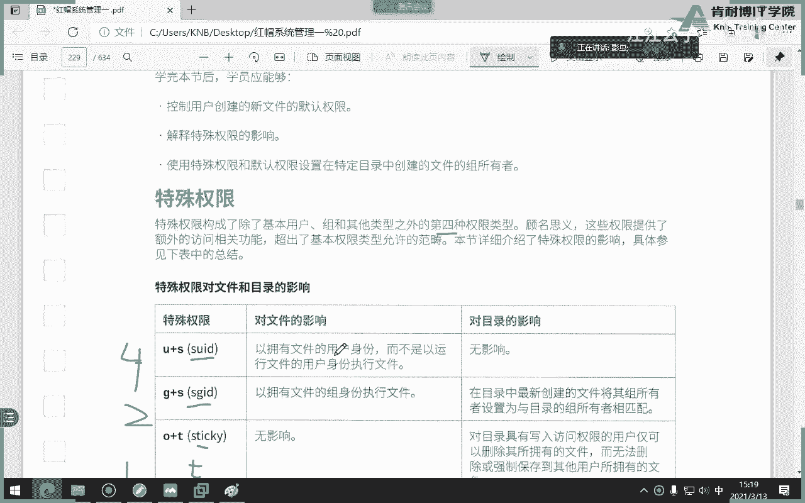

# 红帽认证系统工程师RHCE8-滕老师出品 - P6：第三天 进程管理，特殊权限 - KNBIT认证中心 - BV1up4y1h7MA

好那么接下来我们来讲一下变量，之所以要讲变量，原因是因为我们未来在写脚本的时候会用到变量啊，之前我们大概提一下对吧，变量，那么在我们的红帽操作系统当中，或者在我们linux当中有这样几种变量。

我给大家分一个类，因为这样分类比较好学啊，变量分类，第一种呢环境变量，这是必须要讲，跑不了，环境变量有哪些呢，有太多了，我只说几个吧，比如说p1 p2 p user pac i d，看一下等等等吧。

太多了太多了啊，通过使用用，b mv啊，environment命令显示所有环境变量，来你打个ev，同志们是不是刷屏了，是吧，是不是很多我就不打了，你们打完e v是不是刷屏。

也不是刷平均一整面全是全是变量e n v对吧，这些东西你注意能够被e n v命令所展示出来的全是环境变量，那么问题是什么是环境变量，一听就感觉像什么。

是不是跟我们操作系统的一些当前那些配置环境有关系的对吧对的，环境变量就是系统自带的一些个关于操作环境有关系的这个变量，比如说我给大家列出的ps 1，ps 2 pass就是环境变量，你来看什么是ps一呢。

来看怎么样展示出一个变量的值，niko很好，ps一回车大家看啥东西是什么，像什么像什么，像你此时此刻的他呀，对不对，就是命令提示符u是什么意思啊，hoa是host吧，w当前目录吧，懂了吗，哎那我问大家。

变量变量可以改吗，当然可以了，要不然为什么叫变量，要不然就衡量了，对不对，好变量，那我怎么改，我们改一个，同志们，p s一怎么改呢，你看我这么改好吧，我们也叫斜线有，但是说我不加。

我在at前面再加个斜线，你看原始的情况下，at前面是不是没有斜线对吧，咱们加一个，那我们再来一个，这次周五再加一些，但这时候我加一个大写的h是吧，试试呗啊，然后我再加一个百分号，那我喜欢百分好。

所以我想加百分好，言外之意就是我把p一的值改成了这一对，听懂了吗，等于号不是等于号，是赋予的意思，回车，你看我的命令提示符变了吧，把这个at加了斜线，前面就多了什么，变成了时间了，把那个h变成大写。

h变成什么了，完整出，我老师说server a server b其实他真实的名字叫server a。lab exam com，server b lab exam com，明白了吗，懂了吗。

这叫命令提示符，你想想变量你当然可以改了，这是不是跟我们环境有关系的，是不是哦，但是我已关机，再进来又恢复原状，这说明什么，上面什么，那你刚才改的环境变量持久吗，不是持久性的。

你只要一关机或者一退出再登录，就又又又恢复到原状，明白了吗，同学们好，第二个是不是还有一个变量叫p s2 ，我现在给你们讲完啊，各位讲完你们以后未来再参，因为咱们教材不讲环境变量不讲了。

反正你以后未来在读书的时候看到就知道就行了，他那个ps 2的这个值啊是个大于号，大家有没有遇到过，大约号可能没有，因为你们可能才学第二天，第三天就当一个命令没有敲完的时候，当一个特别长的命令没有敲完。

你想拐弯，在敲的时候，你加一个这个符号，它就自动帮你大于号，后面意思是指我后面那个命令继续让你敲明白了吗，比如说一条命令很长，它会提示一个大油耗，意思是说你给我继续敲明白了吗，好吧好，是不是。

还有一个变量叫做p wd，我首先问大家，p w d命令是什么意思，很好，那这个也一样，我当年为什么在root，因为我当年此时此刻是在加目录吧，那如果换了呢，你看是不是跟随着你当前的目录r8 变的。

是不是也跟环境有关，还有什么方向，还有啊，说话没，咱们刚才没讲，还有language，为什么我当前是英语啊，看了吗，朋友们，这些都是环境变量，而且大家有没有发现环境变量不是你定的，是系统自带的。

而且都是大气的，看到没有，e n v是不是都是大写的，同志们看到都是大写，因为老师这是啥意思啊，那么数字38 39的都是颜色，看了他的减四好吧，那你来看你还是属于什么，这是啥，很显然这是什么意思哇。

这里面是指当前用户是谁，不能说用户，我如果现在把这个用户变成tom用户，这个值就变成tom了，明白了吗，那么这是language，这是啥历史啊，这是hostname，主机名，主机名。

这是我们的tip i终端啊，等等，咱们今天重点只讲这一个关于path变量。

咱们重点来讲path变量叫做路径啊，或者叫什么啊，就位置吧，号叫路径变量对吧啊，啊听错了，路径变量，windows有没有路径，有啊，当然有啊，对吧好，那么我们说这个path变量干嘛用的，我知道叫路径。

我听不懂，但问题它是干嘛用的呢，来咱们先来显示一下路径变量的值，咱们再来说，还有我以前说过，如果变量的话，如果比较严格的显示，应该加什么，对吧哎来各位你给我看它里面的值都是什么路径啊。

我去我去不是我说我内容内容内容，都是什么类型的录像，是什么u s啊，还是什么地位没有吧，为什么都是都是这个病啊，s病啊，我说过这种都是什么什么什么什么都是可执行文件的路径吗，那是不是我们可以理解为。

这个pass变量肯定也跟我们可执行文件有关系啊，比如说命令有没有想过一件事儿，我为什么在任何命令，我为什么在任何目录下面都可以敲任何命令，我在vr当中我可以敲ios，我在boot当中我也可以敲ios。

也可以敲cp，也可以叫u的a d d等等等等等，我学过的所有命令都可以敲，为什么就是拥有环境变量来举个例子啊，我问大家，我想知道ios这个命令的绝对路径怎么看，ok which哦，原来它在哪。

它的usb下面，那我为什么每次敲的时候没有这样敲呢，我为我为什么没有没有这样去敲ios对吧，你看我我我我我我为我，比如说在更下面，我直接敲i os就可以了，但我为什么没有这么敲呢，这样敲行不行。

当然行了，但是疯了吧，这么敲谁能记得住，对吧好，为什么没有这么敲呢，这就是由于当我们敲命令那一瞬间，他先会读取，仔细听我下面讲的每个字啊，当我敲命令那一瞬间，他先会读取这一个用户自己的环境变量。

ok我们看一眼这个用户，每个用户对于这题来讲就是root吧，好那么请问大家，这个路径的值里面有没有u s r b，这个值得反，倒数第二个吧对吧好，所以听完当一个用户敲一个命令的时候。

例如这一题是管理员在敲ios的时候，他首先会查询管理员的path变量，发现path变量当中有usr，并因此就可以列出us b下面的所有命令，其中usr bin下面其中有一条命令叫做ios。

所以会直接执行，听懂了吗，再说一遍，我知道很难，我知道很难的，一个用户在敲一个命令的时候，他会先看这个用户自己的path变量，这个变量值里面有没有它的绝对路径，如果有就列出来了，如果没有，就不能执行。

侍卫试问，如果把usb从那个path变量剔除出去了，我能不能在任何目录下面直接敲l s，答案是绝对不能，为啥你都把这个pass变量里面的值有，你看我这个pc变量有一个值是不是叫usb。

如果你把这个usr并踢掉，从这个环境面上踢掉了，同志们，那么所有usb下面的所有命令是不是都不能直接调，那怎么才能跳动力，机甲动力加绝对路径了吧，动力怎么跳斜线，usr bin i os，明白了吗。

那都是疯掉了吧，好那我们就来看一下有哪些啊哈海海了去了海了去了，你看不是，你看全都是明，也就是说usr b下面有这么多绿色的可以执行的命令，比如说学过吧，top学过吧，那这两个命令都不能直接敲了。

这是路径的好处，那么我们学的你能够衍生出来什么，我是不是不是说我们听懂就就结束拉倒，你要能衍生出一件事，未来我们自己在写脚本的时候，我们自己在写脚本的时候，我希望我这个脚本变成绿色了，怎么办。

第一步给他什么权限x第二我想我不光变成绿色，我还想在任何目录下面直接运行，而不需要加绝对对应怎么办，是不是只要把我们这个路径写到path变量里面就可以了，是吧，同志们，或者说怎么办。

不用加不用修改path变量，我只要把那个自己写的脚本加到刚才那个值里面的任意一个值里面，不就行了吗，啊对吧，同志们明白了吗，所以你学pass面的目的不是让你知道啊。

有一个path你得知道怎么去用来我做个小实验，我做一个，咱们就来做一个，比如说咱们现在没有学过path变量，我们写脚本，咱们脚本叫做测试点s h啊，一般脚本都用s h结尾，但它有意义吗，没有啊。

只是告诉大家是脚本，他能不能执行，不能得有权限x才能执行，明白了吗，好我们写个脚本，脚本名字叫你没学过脚本啊，我就不解释了，我就直接写好，我写一个叫hello，我写完了啊，这就是脚本，你得承认啊。

各位虽然很简单，但他是个脚本好，什么颜色肯定黑色吧，好我给他一个权限，绿色的吧，绿了吧，问题是啊，各位问题是我怎么运行，它是绿色啊，我我怎么印象我双击吗，在哪里哪里有双击啊，哎我是不是得那样的同志。

同志们，我是不是可以点斜线，点斜线是什么意思，告诉我当前目录，当前目录下面有个文件直接执行出来了吧，这个脚本都很简单，你也能听懂，那我现在如果跑到这个目录下面怎么办，这个脚本是我写的。

ok我知道是在这个路径下面有一个test。s h，那如果是你写的呢，我怎么知道你的test。s h是在哪个路径下面，除非你告诉我对吧，你说是在root下面，ok我每次都跑到root下面，或者我直接干嘛。

直接加绝对路径行不行，这样行不行，这样行不行，也可以吧，好那那那那那那你比如说我能不能像人家一样直接敲ios就行了，或者说我想在任何目录下面直接敲太色点s h就行了，前面不需要加路径，我这句话能听懂吗。

这样行吗，他告诉我啥，为什么找不到，难道这个脚本没有吗，有啊，那他为什么找不到，因为他以为你要在当前找，当前有吗，刚才没有好，那我现在就要求大家做这件事，我就想像l s一样，只敲ios这个命令的名字。

而不需要敲u s2 ，这个bin ios怎么做的，它就等同于什么直接敲ios对吧，那我一样，我现在直接想敲test。s h，而不需要加当前路径下面的test等于l s h怎么办。

哎你看我们知道刚才i test的ios是在哪，是不是在当前的路径下面，我每次如果在，如果不在当前，如果我在另一个目录当中，我如果敲是不是得这么敲，加绝对路径对吧，我不想加绝对路径。

因为我不知道这个脚本是在哪，我现在告诉你了，是在root下面，我不告诉你，你怎么知道，你不知道，那你不知道你能不能这样的，我直接直接就在任何地方直接敲s怎么做的，各位你，你刚才都听懂了对吧。

你们都说听懂了，我怎么办，很简单，我能不能把这个拷贝过去，拷贝到哪，这样行不行行不行好我我进去之后，我请问大家当前这个用户的path变量有没有usb那个值有没有有吧，那这不就结了吗。

随便我现在信不随便我进去随便随便随便不就ok了吗，听懂吗，各位这才是你尽量学派s变量的目的，而不是知道有一个path变量，那下次未来我是不是写脚本也可以这么干，那第一种办法，第二种办法，我如果不拷贝。

我能不能把我这个脚本所在的上级目录写到path变量当中，这句话能听懂吗，我再说一遍，我刚那个脚本放在哪，是不是在线上，我能不能把这个斜线root这几个词，这几个字母写到pss变量里面，可以吧。

但是没有人这么干，为什么，因为你随随便便把root加到path变量是非常危险的一件事，但是不是一个办法，从理论理论上讲是不是能成功能，但你不要这么干，明白吗，不要这么干好吧，哎可以好。

现在知道pss变量了吗，下次不要再问我了好吗，哎你学东西要你学东西一定要通吗，一定要知道为什么，同时更重要的是知道什么时候用这个就是重点，当然咱们不讲脚本啊，但是你要知道下次未来你自己学会脚本了。

不能光会写脚本，你得知道怎么执行，那再说一遍，刚才我们说点s h代表当频率下面直接执行，而这种方式呢，这种方式是用什么什么什么路径，绝对理性来执行，听懂了吗，而我如果直接写了判词变量呢，那就没有路径。

为啥，因为tx变量帮我解决了路径，我只要关心脚本怎么写，以及脚本里面的逻辑结构会不会是会不会是正确的就行了，因为它怎么执行，太子帮我解决，那你现在想象一下。

path变量对于我们来讲是不是极其重要的一个变量，举个例子，如果没有pass变量，你是不是要记住所有命令以及所有命令的什么，那怎么可能谁也不我也不会学这种词了，疯了吧，那那那有的在usr。

有的就sb线吗，我能记住吗，谁也记不住对吧，所以test变量非常重要，那这就是我们现在讲的环境变量，第一个能听懂吗，大环境变量有多少，那太多了，你刚刚用e n v可以看到吧。

好第二个我们再来讲自定义变量，就不是环境了，同志们，同志们是自定义的。

就是我们自个儿搞的叫自定义变量，这种片自定义变量，那我就没什么写的了对吧，比如说我们自己起个名字叫a，它的值是一可以吧，当然可以了对吧，自定义变量好，但我要讲的是什么呢，自定变量有几个小小的注意点。

第一个自定义变量的变量名是区分大小写的a和这个a是两回事，明白吗，你比方说哎我有一个a是小写的，那它能不能用大写，那不是大写，这是两个变量，不是一个变量，好区分大小写，区分大小写。

同时同时变量的名字绝对绝怎么写，绝对不可以用数字特殊字符开头，比如说我我我想起个变量名字，他的名字叫点儿行不行，当然不就成了，你想什么呢，明白不能，那我能起个名字，变量叫一吗，等于一行不行。

那看看不懂啊，系统不行，但是如果它放在中间行不行，可以明白吗，比如a12 可以明白吗，但你绝对不是什么12a那就不成，还有如果咱们的变量名字啊，你写得特别好玩，那中间有空格行不行，这样行不行。

a空格b行不行不行，那我就想要怎么办，我就想要a b，那你可以这样干，懂吗，同志们，你不能给我来个空格，如果来个空格，他认为是啥，他认为是两个名字了，你懂吗，哎你就你你不要太奇怪，你知道吧。

那那种那种哎那种不要太搞这东西啊，好继续，这第一个好，再来要注意事项好，同时这重点来了，我用红色标记了，这颜色怎么标，不太会用啊，同时同时同时自定义变量的默认生存啊，默认有效的有效七为是当前。

嗯这个这个翻译不对啊，不叫有效期，就是，不要生存周期吧，就是就我自己定义的变量，它能显示的值是在当前定义它的值。

定义它的是，你看举个例子来，同志们，我可能不太好意思，不太好表达啊，你给我定一个a，它值是一，那我显示怎么显示echo到了a吧，当了啊，不能加a啊对吧，你直接a来变成什么了。

你直接直接来个a他就变成啥了，a了吧，它显示注重了，你想看什么，你想看人家得给人家钱啊，对不对，是不是一啊，好朋友们，现在是不是我在当前这个shell当中定义的a，因此它的值是一。

但是如果我现在敲这个重点看，大家知道发生什么事了吗，我其实开启了一个新的姿势，肯定没有啊，不是还是那样的吗，当然了，紫色要跟富士要长得一模一样，你看不出来，那我怎么样才能看出来ts啊，行不行。

ree可以呀，来走看这，刚才我在这儿打的拜师，然后我在这又开了一个紫的拜师，紫的拜师里面是不是敲了个p帅，听懂我意思吗，那我请问大家，我刚才在哪个地方定义的a第一个第二个第一个吧。

是不是在这儿定义的a好，但是你来看，不好意思，看不到，会控制吧，那我这句话应该怎么翻译，就是我们自己定义的是呃，这个这个自定义的变量默认它的值的那个有效期吧。

这么说吧啊是不是只能是在当前自己定义它的视角当中，阿紫禁城是不是没有办法，还是要继承嘛对吧，应该要继承对吧，是不是不能看到对吧好，这是特点啊，各位特点，但是环境变量，我问大家，我现在已经在紫禁城里面了。

能不能看刚才的附近程的px变量，你问我问他家有值还没直有啊，一定有啊，因为它是环境变量，哎那我那这就产生一个问题啊，同志们，我现在就想让the shell也看到，怎么办，提升为环境变量就可以了。

这么简单，export退出来，退到附近城，ex pa这个单词叫做提升为环境变量，也就是你把a从普通的进程提升为环境变量，那这时候再进入到败事，比如说你看我现在又敲一个bt又进去了，然后再来看就哎呦。

再来看就ok了，听懂了吗，要提升为环境变量，这个单词叫提升环境变量，这是个特点，请大家记一下啊，所以一般，我们都比较习惯性这样做，定义它的同时直接提升这句话能看懂吗，定义它的同时直接提升。

那如果我现在还有一种验证办法，如果我用e nv，如果能显示出a是不是也对了对吧，刚才我们说过e n v是显示环境变量，那如果用set命令是显示所有变量，不光是环境变量，所有变量应该更多了。

所有变量不光是环境变量啊，同志们啊，set好了嗯，那我怎么解除那个呢，我背上要a了对吧，我要on set a也有这个意思，是指什么变量的值取消，或者说叫取消变量，变成控制了。

on set叫做取消一个变量的值，或者叫变量值取消，或者是就是把这个变量给它对吧，弄没了嗯，值弄没了啊，啊关于自定义变量，大家还有什么想了解的吗，再说一遍，自定义变量有个最大的地方就是要区分大小写。

而且变量一般都是什么，不一样变量一般都是大写的变量什么时候用到最多，写脚本特别多，所以一定要好好学啊，再再来，还有一个是，叫什么叫只读变量对吧，尺度的啊，瑞龙美定义变量的时候直接加一个reno。

比如a等于一，那这个那那那那那这句话就是把一个a的值赋予，把这个a的变量赋值是一，但是它变成只读了，只读就代表什么不可以更改它的值了，明白吗，同志们，比如说really only a等于一。

那我在a等于二，你看它说啥。

视图吧不能改了啊，好最后一个变量啊，第三类，第四类叫位置参数，也叫未知变量，位置座位啊都是以数字开头的，哎你们老师不是不能用数字开头吗，那是因为数字开头的变量都保留给了未知变量。

比如说到了一代表第一个参数，到了二代表第二层，到了三代表第三个依次类推，到了零呢，到了一代表第一个参数到了二代表第二个，那到了零呢，到底有两种情况，第一种情况代表整体，第二种情况代表这个脚本的名字。

自己比起一个脚本叫a b c，那么到了零就会打印出这个脚本名字叫a b c，明白了吗，来我们做实验，各位位置参数，什么叫位置，各位来来来来写一个脚本。

这样看不懂啊，咱们用脚本的形式来，我现在答案说两个参数，第一个参数和第二到了一些代表第一个参数到了二代表第二个参数，听懂了吗，好运行它，请问我运行这个脚本书加参数了吗，算是空啊，靠怎么还是hello。

哎我怎么还卡了，哦对对对对对对对对对，这样吧算了，我我我我我我我改一名行吧行吧，这样行吗，啊，可以啊，好来来来来，我运行的脚本的时候，我没有加参数，因此只是空的，能看懂吗，那我加个参数，比如第一只是一。

第二就是二，因此一二就出来了，听懂了吗，这是第一个参数和第二个参数，那如果加三个，请问三能出来吗，不能啊，哪有三，你你写多少三了吗，没有吧好，那我们来下一个来编一个，同志们，咱们编一个，哎呦呦呦。

我错了，同志们，咱们来编一个东西，咱们编一个到了零yy，八零在这一题当中代表是当前自己的脚本名称，是不是懂了吧，那么我们什么时候用到了，就什么时候到了二呢，大家回忆一下，咱们那天讲这个的时候。

管道符号时我是不是用到了一个a wk命令，其中是不是有一个叫print到二对吧，在这里面呢到了二就代表第二个字段，还有像etc password当中总共有几个字段，还记得吗，127个字段吧。

你比如说我现在让你们让你们给我写一个脚本，我说了，你只把第一个字段给我打印出来，那问题是我怎么知道第一算从哪到哪呢，是不是要用到了一对吧，说到了一是不是代表一个字段在这在这里面明白吗。

这时候这时候就可以用到，我们今天学到了一，就代表未知参数或者未知变量，明白了吧啊啊，所以说你要知道这个什么时候用啊，不要光知道这个知识点好吧，那今天借此机会这个事就讲完了，但我们今天借此机会。

我们把所有美元符号开头的东西全给你们讲完，我讲一下，你记住，美元美元，抬头我运行，你来猜是什么意思啊，很好p r b，所以美元符号表示的是答案数p i d，非常好啊，这个哎呦。

代表打印当前p r d不是当前打印数，是当前脚本的p r d啊，完全程序的p r d对吧，听懂了吗，那你我我我今天给大家补充的都是非常非常常用的命令，虽然教材当中没有怎么重点讲，你得知道好吧。

也就是未来你如果不会写脚本，你看别人脚本时候出现了叨唠叨唠，你得知道啥意思好吧，你这也也也也也不能说你没学过linux啊，好再来，dollar，dollar问号，咱没学过了，什么意思啊，保存。

保存退出值吧，0~255对吧，好继续，还有一个刀了，他代表代表什么，答应所有参数你来看，打印所有参数大家来看什么意思啊，各位，我有几个参数函数，有一个叫一个叫二，所以他就把两个参数全给打印出来了。

明白了吗，懂了到了at啊，打印出你刚才在执行的时候输入的所有参数，你输入什么，我给你打印出来，打印出什么，它等同于这个值，未来你在参考书上如果发现这个值也是一样的，叫美元符号加星号等同于美元符号啊。

这个当然里面有区别，但是我们先不关心啊，不关心它两个都是打印出什么所有参数好吧。

我说你记啊，各位，到了井号打印参数的，各说白了有几个参数啊，懂了吗。

哎参数的个数，参数的个数，那黑线我这个基本是几了俩吧，一二加，到了井号代表打印参数个数，我知道第一次学可能会大家记不住，你记不住，你天天背，你也得给我记住，因为太重要了，你一定要背啊。

回家就像你以前背单词一样，一定要给我背下来，你不要背，最好就是这样练练练练，记住你不要死劲背啊，好吧，背下来，然后呢，行吧，就这样吧，这么说吧，不常见，这种做。

咱们来说一下特殊权限，特殊权限，三个它分别是s u r d s g i d和一个叫做t权限，我们简称叫t啊，t，那么这个特殊权限上次课之外，那第第四类权限，上次我们是不是学过2w x之外的第四种权限。

那么这个权限呢它跟我们rw x没有不是一样的事情，它比较特殊，它是为了完成某一种特定的功能而产生的一种权限，分别也是421，是不是也是七啊，是不是跟那个r w x加起来一样，也是七啊。

好那么我们现在呢从头到尾一个一个来讲，先说s u r d，我们不光要知道这个命令这个这个特殊选项是什么意思，还要知道在哪用，注意s u r p给谁用呢，给命令使用，一般是给命运使用。

好我们来说一下什么是s u r d u r d，你来看这个翻译，你能看懂吗，这句话，以拥有文件的用户身份，而不是以运行文件的用户身份执行文件，这是个越南人翻译的中文，可能根本听不懂，我也听不懂。

所以有时候你发现你这中文书你都看不懂吗，那你就看不懂。

我来跟大家写出来啊。

我可能写的也是看不懂的，但是我们解释完你就明白好特殊，全新，首先先说s u r d，当运行一个命令时，使用的是该命令的拥有人的权限去执行，而不是，执行者自己的权限好像似乎比刚才的关系稍微人性化一点了啊。

但依然听不懂对吧，很多同学依然还听不懂，那我就没打算让你听懂，因为我们接下来要用一个比较经典的案例来说这个解释这个问题。

记好了吗，这句话好，我们来看一件事儿。

书上用了一个命令叫password，那我们也用这个命令来给大家解释，因为只有这个命令用到了s u r d，发错了是干嘛用，改口令密码，那么请问大家，你改密码改的是哪个文件，是一个文件，他有权限吗。

可是普通用户能修改密码吗，能能行吧，那谁说不能，普通用户不能修改人员吗，但只能修改自己的吧，那你说这句话不是矛盾吗，shadow没有权限，可是你居然还能给自己修改密码，你以为你是谁，你是管理员吗。

答案不是，当然我，但但但这就很矛盾啊，你又不能去修改一个没有权限的文件，可是你又成功的修改了一个没有权限的文件，那我们就来看一下，肯定是password出现了一些这个猫腻对吧。

出现在papassword当中，我想知道password这个命令的权限，pass我命令前面怎么看，这样看吗，不对，你得知道它的绝对路径在看，是在上，听懂了吗，有没有你不熟悉的权限啊。

s而且这个s占用的是谁的位置x而且这个x是在哪个身份当中呢，拥有人因此叫s u r d，如果这个s是在拥有组当中，就叫做s g r d，听懂了吗，当然了。

s u i d和s i d的它的含义是完完全全不一样的。

各位来我们来做个填空题，当运行一个命令的时候，这一题使用的是什么命令，相当于爬树的使用的是该命令的拥有人的权限去执行，请问他做的用人水，root br，而不是执行者自己的权限，比如说此时此刻。

我现在是个tom用户，我问大家或者文学学生，学生用户能不能自己修改自己密码能，所以说在这题当中就是谁学生，现在能看懂了吗，使用一个命令的时候，比如说password的时候，使用的是该命令的管理员的权限。

而不是自己的权限，看懂了吗，管理员能不能修改一个没有任何权限的文件，因此成功修改了，听懂了吗，这是个填空题，所以你再来看这个哦，哦我终于明白他表达什么意思了，使用的是去问文件的拥有人身份。

不就说白了就是谁呀，管理员吗，而不是执行者自己的身份是谁啊，不是学生吗，各位理解了吗，那我问大家，如果我把这个这个家伙的权限改了，我把这个文件权限改了，或者说我根本就没有没有这个s权限。

请问普通用户还能改密码吗，不能了，还有谁听不懂，我不要求大家能够记住命令，我只要求你能听懂，当使用一个命令的时候，比如说password使用的是这个命令的拥有人的身份，而不是执行者自己的身份。

而不是学生这个身份，这叫s u r d，好第二个我们来说s g r d这数字是几啊四啊注意啊，444，我们来说s g r d来，我们再来看它的翻译，以拥有文件的组身份执行文件，看不懂看不懂。

我们再来看下面这句话，哎算了吧，咱们直接来上面密码，因为我发现他书上翻译的实在看不懂啊，ok ok ok ok ok，建立一个组叫做算了，不见了，我们新建一个目录吧，建目录叫做r9 c a。

请问x c的用人用组是谁，很好root，root好，这时候把庸俗改了，哎这个命令啥意思啊，更改组啊，改了改了成功了吧，然后跑到rc里面去建文件，请问123的用户人谁用主是谁，i rot。

但是我要求继承什么叫继承，就是123这个文件它的拥有人是root，我不关心，但我只关心拥有，主要跟随着父目录rtca的庸俗叫学生听懂了吗，太简单了，老师我这样搞不就行了吗，穿着mod啊。

不不不穿着owner对吧，主嘛加个大写的r就过去了吗，因为递归了吗，我这么加啊，大家能听懂吗，行不行，他回去，那不有点吗，你点的中路没有点代表去带人了啊，如果没有点代表拥有人了，好这样行不行。

我如果回车，同志们，我如果回车行不行，命令不会错对吧，那那下面有没有继承，继承了，那也继承了，那你说那那那我那那那我用这个办法不就行了吗，但是这个问题有一个事儿，你只能针对什么，你只能针对已经存在。

我如果新建一个文件，它是不是又不继承了，因此这时候就要用s g r d s t i d是给谁用的呢，注意s加i d不是给命令用s i d是给文件家用。

就是目录用change mode g加s r c a好，这是我在r c里面的建立文件，看到了吗，而原来老的会继承吗，不会听懂了吗，确定不，s t r d数字是几啊，s u r d是四。

s g r d是2s g r d是给是不是给目录设置拥有主，使得这个目录下面的子文件子目录继承父目录了，拥有什么人还是多，自动继承，这题是必考题，上午cc得到原题，原题我都说原题了，同志们，那就一定考。

那你老师，那我我我我我拥有人，他怎么不继承，因为我家里我没有要求啊，因为我们的s g r d只能拥有祖继承，拥有人继承不了，明白吗，那么通过这个实验，你也可以判断出来。

默认情况下我们的目录是没有继承权限，那个子目录是不会继承父目录的东西的，你只有加s g r d才能继承，对吧对吧，你要不加这个是不是刚才还是root root对吧好，这个可以理解，可以理解了吗。

那么你理解的话，我们来看一下它的权限，同志们，你会发现是谁啊，是不是在s t身上了多少个s啊，你刚才是不是拥有拥有人身上多少s，现在是不是拥有组剩下多少s啊，叫做s u i d和s g d，都听懂了吗。

这个考试的必考题，最后一个叫做安全味儿，也叫做t值，对目录具有写入访问权限的用户，仅可以删除其所拥有的文献，而无法删除或强制保存到其他用户所拥有的文件，啥意思呢。

比如说tmp这个目录身上默认就带有一个t权限，大家看不是我做的，也不是书上做的，你不信你可以自己看一下，你t m p身上一定会有一个t不用做啊，自带的，在带了吧，下了吧好，那那那大家想象一下。

为什么tm p会有一个t呢，因为tm p大家来看权限是什么，权限是爆满的权限，谁都可以写，谁都可以读，谁都可以执行吗，就爆满的选项，那有没有想过一个问题，同志们，你想象一下，如果一个目录上面。

咱们不看幼儿园，不看庸俗，咱们只看其他人，不要看那个t，如果是x的话，r w x如果其他人身上是r w x，我们是不是可以理解为其他人可以往里面干嘛写东西，而且还能干嘛，很有可能还能删吧。

我说很有可能为什么，因为你得看那个文件夹本身的用户人是不是自己好，很有可能删，那是不是很危险，比如说这是一个公共型的目录，咱们公司有个f t t都可以往里面上传，也都可以下载，但如果大家是个七的权限。

就2w s权限是不是很有可能会造成你上传的东西我能随便杀，有x啊，而且还有w是不是就可以，你可能不删，但能不能随便改，但是为了防止这种情况怎么办，带个t t就是指的是什么安全，问什么叫安全呢。

就是你看你也能上的吧，ok但即使能干嘛，你只能干嘛，对对对对对，这几个词很关键，你只能动你自己，刚才上传，你不能动别人，既然你有x权限和虽然你有w权限，但你只能动你自己，就是这个意思，听听懂了吗。

有点像什么同志们不给你锁定吗，你看过了吧，能看你也能看我的，我也能看见，那你想改没人，如果大，但是如果没有这个t呢，那就危险了，因为大家都有w是吧，都有w不就危险了吗，明白了吗，嗯我们看一眼。

这个所有者及root才能干嘛，啥意思，root不用关心我，root想删还是删，这个没有没有什么疑问吗，那为什么只有拥有人才能删了，所有者就拥有人的意思，定一下题，如果你不加t会怎么样。

各位那就谁都可以删，因为你的r的当中有w对不对，很危险啊，数字是几啊，ok太棒了，数字是一讲完了，问题来了，我不是讲完了吗，来各位帮我看一下，用权限的表达法，这个应该是积极体，你不是知道了吗。

如果权限的情况下，那么我现在就有个疑问，请问这个t占用是x吧，下次下次，那这是多少，88吗，你，大家有同学说了，所有选项写在最前头，所以说请注意没有把q群要写在最前头，因此是t是几啊一，然后后面呢。

七七几77吧，你你刚刚告诉我x z嘛，对不对，77听懂了吗，哎也就是说q群一定要写在最前头，明白吗，不要受他影响啊，不要说这是不是七大一啊，明白吗，同学们，行，先看特殊权限有没有有。

而且是s t u i d吧，s u i d是几哦，四四再说四对，然后呢，那你怎么知道七呢，你怎么知道s就占xx还在呢，你不知道的，你怎么知道xx还在呢，你怎么知道x大于就就不带了。

那你怎么知道是大姐都不在呢，我想知道这个意思，哎对他问他看了，那大家预习了吗，如果从肉眼上看，如果s是大写，就代表x不在了，包括t也是，如果t是大写，就代表x不在了，你不光怎么可以判断。

你不用看大小写键，应该知道x肯定是在，为啥，因为对于一个文件来讲的话，如果对，尤其是对于目录，尤其对于目录，你会发现一个现象，目录身上都会有x身上都会有x所有目录你只要我说默认啊。

只要你建一个目录都会有个x，但是不一定有w，但是你新建一个文件的时候，就一定会有r权限，但是绝对不应不会有x x对于文件来讲代表执行吧，很危险好吧，所以你看主要是看到是s也好，或者是t也好。

如果是大写的，就代表原来的x干嘛，好吧你可以试一下就知道了啊，你不用去看，比如o减tx t n t，你再来看tm p很显然就变成一个大写的t了，就这样明白了吗，你看啊啊行。

那么这就是我们上节课留下的一个小东西啊，为什么要讲的了，那么考试必考权限是考试题目比较多的一个章节啊。

必考，暂停一下。

什么叫做vm state呢，这是一个很典型的监控命令，这个包默认情况下，还没撞无所谓啊，如果你没装，我就告诉大家装哪个包啊，s y s s t t s y s s t a t，如果你没装啊啊，是由。

如果你没装，比如老二，我打了个vm 4的，打不了，那你给我把这个包装起来，听懂了吗，啊不要我解释了啊，好这个命令首先告诉大家，他是看一个系统整体信息，注意这个命令不会很细致，他只能看一个整体信息。

比如说大概是读他写字盘啊，你要说唉我想分析具体的信息，不好意思，他搞不定它是一个总体总体的信息，好我们来看一下啊。

启动起来啊，这电脑挺快的啊，好。

要学会啊，你是一个管理员，这个命令要会。

他哪来着，你是一个管理员，所以你要会，没有啊，在这，我就不敲了，我直接给大家列出来，那么这个vm state呢它是一个哦，不对不对不对，说错了，你想幸亏看一下书，是这个软件包啊，我记反了。

不好意思不好意思不好意思，是这个软件包提供的叫p r什么p r o c p s n g啊，大家放心，默认都装，不用担心啊，默认都有啊，不用担心，好四命令呢会有两个参数，如果你不给它参数。

它只会显示出一次结束了，但是呢我们可以给它参数哪两个参数呢，一个是这啥意思啊，这个单词就是间隔，一个是次数，你比如说像这一题就是一秒钟显示显示一次。

总共显示杠s指的是单位把里面的所有的值换算成什么m是什么单位，当然我们默认情况下不会加s。

不会加s，就直接敲就行了啊，直接敲你看再给大家敲就行了，不用加s，你看we sp，直接敲就行了，就代表一秒钟显示一次，总共显示100次好了，大家看这是一个总的信息，它分为，相关的东西。

你看你发现它有几个列，你看了吗，tr加c啊，它有几列进程相关的，这边呢存相关的，这是所有不相关的，这是io方面的，这是系统方面的，这是cpu，那么我们今天一个一个来分析啊。

首先是进程相关的进程相关当中有两个值，一个是r值，一个是壁纸，指的是正在等待或者运行当中的进程，指的是不可中断式睡眠状态的进程的数量，各位能听懂我的意思吗，就是r是指运行状态的。

b是指不可中断式睡眠的状态，后面是第二个，第二列是关于近内存方面的，首先符位代表什么，目前buff和catch呢指的是，好swap这一列指的是什么，web相关的swap i呢叫做换入。

swap out呢叫做换出，大家知道什么叫换入换出吗。

给大家画一个小小的图片，你比如说这边是我的内存，这边是我们的硬盘，我们硬盘会牺牲一部分的内容当做swe，比如说这一部分是swim，当我的内存里面的，当我的内存不足的情况下，为什么。

因为内存里面会有一些不太活跃的一些page，这个很专业啊，这个术语p a g e翻成中文叫什么，一会有一些不太活跃的页面，我我为了腾出来更多的内存，我把一些不太活跃的书页面扔到我们的swap里面。

这叫swap硬，我们cpu此时此刻要用到一些页，而这些页又不在内存当中，在哪，在我们交换分区里面，那就要从交换分区干嘛，再给我弄到内存里面，这个叫swap，说错话，这叫swap硬，刚才那个叫swap。

明白了吗，out听懂了吗，好大家想象一下，如果这个in和out，in和out特别高，说明什么嗯，不足了啊，一会儿换出去，一会儿换进来，一会换出，是不是循环了，明白吗，这说明直估值不高。

就是free剩下的内存不高，对吧好。

所以说你看可以监控到这一部分，i o呢是关于磁盘的，bi是读bo是写读写读写，听懂了吗，读磁盘和写磁盘，但是问题是它的单位是什么，我忘了这个单位是什么，我忘了看一下，你看忘了你就看吧，那没关系。

你告诉我什么单位，每秒钟，来这是四节吗，vlog多大，512字节还是直接对吧，所以你所以所以所以同学们，你有没有发现其实很不好，因为有些磁盘监控但默认是k，而有些你看他就不干了，单位你要不卖。

你以为你是k的，是不是就会造成我们的单位换算不统一，没办法，所以你要最好去看一眼是block还是，可能照不可能照不可能是照对吧，block q明白吗，好所以你要自己去换算一下啊，继续。

那么这个读写明白吗，b i是读bo是写好这一串巴拉巴拉巴拉，一直到这儿，这两个关于系统方面的这个硬呢叫做中断，不知道什么是中断吗，对咱们系统当中存在着大量的中断，比如说现在敲一个回车算中断吗，算了。

我现在正在看电影，突然我qq弹出来了，不要用鼠标去点一下qq，那么这个时候凭什么我们的鼠标就能用，因为我给内核发送了一个中断信号，只是要处理一个紧急的事物叫中断对吧，那么这个时候就会发生中断。

如果中断过高呢，就是相当于你的这个我理解够跟个人理解，是不是你中段如果过高的话，是不是你事物现在特别多，好cs叫什么上下文切换，如果上下文切换比较多，就代表你的进程特别多，而cpu资源已经不太够了。

一个cpu现在要干1万件事，而每一个人只能干不到一秒钟，那是不是得切换来回切换，cs好，后面这些值就是关于cpu这些值，比如i d大家都知道是什么，i6 把空弦吧。

那么这个weight呢代表i o i wait，这个s t不用看了，s t默认以后会取消的，你看告诉我们了，s t这个值以后就不用看了，因为它会取消，不用看sd，指的是从虚拟机偷取到的cpu时间。

虚拟化偷取到了cpu时间，啊你看这是中段吧，每秒钟的每秒钟的中断次数，包括时间，包括时钟，那那这个指的是上下文，每秒钟上下文切换的次数，那你作为系统管理员。

你通过这个值是不是可以看出看出来一个整体的情况，那我刚才打那个d d命令会产生什么，那很显然会写，那写的话哪个是高估值高吧对吧，那如果读呢，第二值就会高，而且bo值如果高的话，或者b压值高。

很有可能会造成weight值也高，如果位置值高，咱们这个事务性很强，那很显然i d值就会减少，你现在正在忙，i地址是不是得减少对吧，i地址二地址指的是空弦值，你现在越忙，当然阿离值就越越少了，对吧好。

那如果我们现在有大量的写操作，请问哪个值还会高，我现在写操作特别大巨大，请问哪个值还会高，你猜也能猜出来，肯定b也会高吧，对比是不可中断，是程序吧，同学们，所以你看vmc的。

它是一个引起的一个概括概括的一个信息，但是你要通过这些信息，大概就知道我此时此刻我的系统存在了哪些问题或者是平静，所以它是一个监控啊，还有默认情况下前两行不要看，因为前两行它它会有一些突发值。

比如说很高，它不是一个平均值，所以从一般从第三行开始看正面，你也可以这样不加次数就直接来，不加次数就直接这样，它就一直往下看吗，但如果你什么都不加呢，它只显示几次四就退出了，明白了吗，v m d好点。

