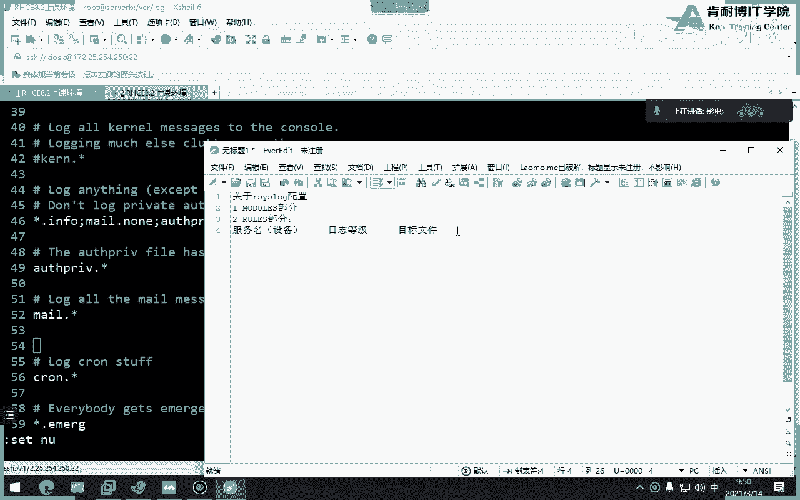
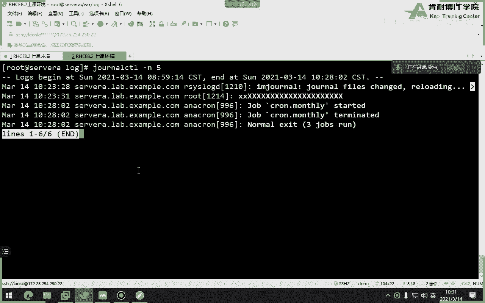
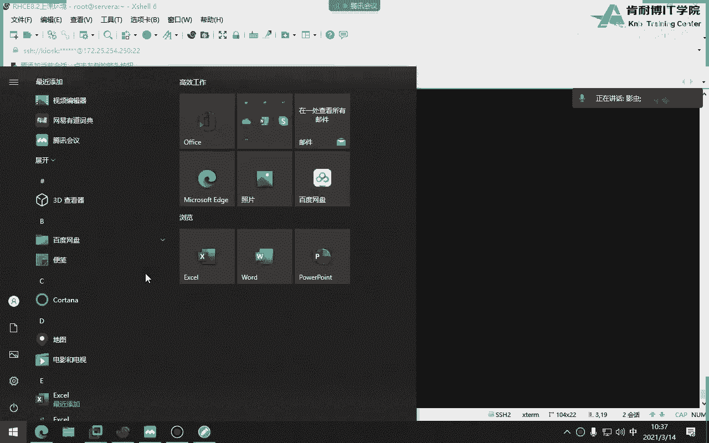
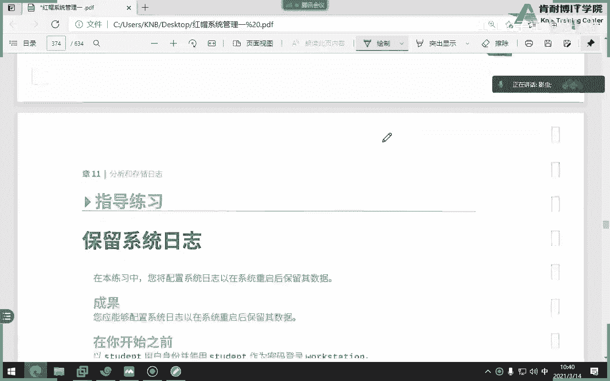
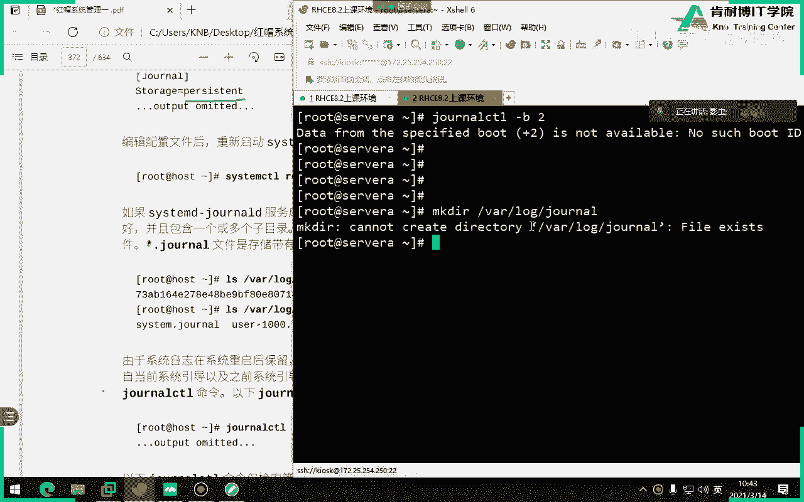
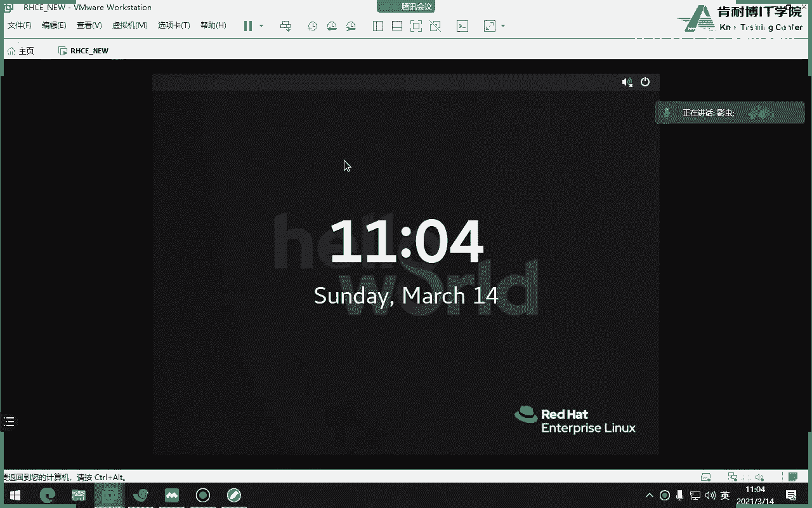

# 红帽认证系统工程师RHCE8-滕老师出品 - P7：第四天 日志管理，网络管理 - KNBIT认证中心 - BV1up4y1h7MA

行吧，那我们上课吧，我们先来讲一下第11章叫日志管理啊，那么讲完日志管理之后，接着我们就来讲网络，这是我们今天应该是上午比较重要的一个知识点，尤其是网络是必考点啊，也是一个怎么说比较容易拿分的啊。

但是网络这一章的命令确实很长，这张命令特别长，但是呢也比较比较容易拿分，因为它属于那种基础性的题目，所以到时候考试呢嗯很少出现，因为网络ct不会做，因为咱们现在可能刚讲就觉得阿斗这么难，什么都不会。

所以你讲完所有的课程之后，你还要做半个月的题呢，那个时候你已经命令就很瘦了啊好吧，所以不要担心啊，觉得啊好像感觉很难，那么也也有过遇到过那种网络没有做或没有做出来的同学，挂掉了，整个考试的也有呃。

所以说呢我们通过一些经验去判断，因为我们不知道扣分怎么扣，也不知道扣多少分，我们能不及格没有人知道，所以大家也不用问我啊，我这一题做完不不会做，是不是就挂了，没有没有人知道啊。

也不可能就一题不做就挂了吧对吧，但是网络这一题不做或者做错呢，会会扣很多分，因为可能我个人猜测很有可能就是咱们的网络会不通，造成其他的一些题目会有影响，甚至是可能就直接就挂掉啊。

所以网络这个一定要会做好吧行，那我们先来讲第11章叫存储日志，那么对于系统管理员管理员来讲的话，这一章很重要，因为我平时去检测或者是发现问题的一个手段，就是通过日志啊，当然了。

像我们昨天讲的那个vm c的命令呢，它是一种呃调试或者查看我们当前性能的一种瓶颈的一种工具，像今天我们找到这个日志呢，是用于排除故障使用的，你比如说有人有有人说这个服务登不上去了。

或者有人说我这个系统本身产生了什么问题，那就要通过日志来排错，所以作为系统管理员，我们要对日志很熟悉啊，但这章没有任何考点啊，他没有考试好，那么在老版本的红包七之前的课程呢，就比如红包六之前的课程呢。

红毛六这种课程他在讲ccs log的时候，他就只想在一个服务，那从红毛七开始之后到红包吧，我们要讲两个关于日志的东西，所以这一章呢有三个内容，一个是讲两个关于日志方面的服务。

还有一个就是如何同步我们的时间，这题是必考题，但很简单，一条命令就搞定了，好n t p时间，这这一章其实n t p服务器时间这一章大家自己看也能看懂，这是一个同步时间，就跟咱们现在自己买一块手表。

你跟谁对，你肯定肯定不能跟咱们合肥对对时间吧，肯定跟跟咱们那北京对吧对吧，哎就是那个时间服务器就这个意思要同步时间好了，我们先来说就是那么在我们红包八当中有两个服务是管理日志的，大家来看，一个是这个。

大家来看这个单词是一层，就这个单词，这个单词怎么念，我们家有没有有没有，我们来听一个比较正宗的伦敦音，这个单词就叫日志，知道吗，不是log啊，但是log日志，但这个里面是指这个，那我可以放声音。

一定要注意，一般所说的日志不是log啊，应该是指这个单词，gal gal对吧，journal journal对吧，一定要注意这个单词是日志，为什么要跟大家强调一下这个单词呢，啊因为我我也怕我怕读错嘛。

那么同时还有一个比较重要的原因，就是未来我们在工作当中经常会看到这个单词，所以你不要再问这个单词什么意思，人家说日志的时候，千万不要把它翻译成log啊，各位虽然log是日志对吧。

从英文的角度来讲没有问题。

但咱们说的日志只是这个文件系统当中的日志，只是这个好，还有一个叫做us slog，注意红包八当中有这样两款，第一款和第二款就是管理日志的一个服务啊，所以我们挨个一个一个一个一个来讲好吧。

那么首先呢我要先讲哪个呢，很显然我们要先讲us slog，所谓的as slog呢是一个比较老的一个服务啊，那么在红毛七当中也用这个服务呢，是默认情况下，我们只要装系统，它就已经启动了一个服务。

所以大家不需要再用什么那个安装软件的命令把它安装上去了，不需要啊，他呢他把日志注意，他把认证收集起来，那么什么时候收集呢，其实就在后台一直在收集，只是我们现在此时此刻感觉不到。

但其实他一直在后台收集我们的日志，并且并且保存在vr log当中，明白吗，注意咱也就是24g是一个服务，他把日志写到哪呢，写到vr log当中，但是我们看一下啊，比如我们现在进到vr log。

你会发现有好多蓝色的东西和对吧，有一些蓝色的，还有一些这种白色的，那么很显然这些就是日志，明白吗，各位这些就是日志，只不过呢只不过我们这些日志啊，它会被分到不同的文件里面，有哪些呢。

大家来看这个表格，你比如说we are log message，这是大多数的系统当中的日志信息都存放在log message里面，所以这也是我们比较常用用到的或者常看到的一个信息。

你比如说一一般情况下我们日志发生的问题，而我们系统发生的问题，想看想想查看日志的时候，可能大部分情况下我们会先看message这个日志，为啥呢，因为它包括了大部分的一些数据都放在message里面。

就姓张当中的一些日志都放在message里面，比如说有什么身份验证啊什么对吧，还有这个他刚刚讲的那些调度作业啊，啊包括我们装一些软件包，那会都会都会产生一些日志放在这个message里面。

在这个日志呢是我们比较重要并且经常查看的一个日志，第二个呢你看这个单词是安全吧，安全的很显示关于什么关于安全方面的，比如说身份验证，比如说我登录用户，比如说我退出用户对，如果一个用户没有登录成功。

是否记录日志呢，也记录啊，各位啊，那那那所以说这个日子请注意，大家就要经常留心一下，你比如说有一个你比如说你当你在查在查看明日志的时候，你发现诶怎么这一会儿总是有人来登录我，但他从来没有登录过成功。

哎你是不是要留意了，是不是他在正在暴力破解你密码，很有可能一个月登录你，但都没有成功吗，对吧，你比如我自己这个账户怎么可能登三面就不成功呢，这个这个几率太太太少了吧对吧，你三次密码都输错吗。

不太可能吧对吧好，第三个呢是male mallog，那很显然是关于什么啊，跟我们的电流有关系的对吧啊，电子邮件有关系的日志，第四个呢咱们还没有学到这个计划任务，是第二本书，要重点讲的是一个考题。

叫计划任务，windows当中有这个有这个功能吗，当然有了，我记得我当年在学22003的时候，我们就就做了一个计划任务啊，我记得一个一个一个一个图标样式的一个东西啊，跟那个红红绿灯一样的东西啊。

当你到了一个时间段，他就会做这个计划任务，那一样，咱们也用，而且在真正的生产环境当中，我们基本上计划任务是用的最多的一个技术，为什么，因为要写脚本脚本，比比比，比如说我说我写了一个脚本。

12点钟备份模式数据库，那么我们把这个数据库备份的一个脚本写写好之后，他怎么怎么就这么准时12点去去执行呢，哎就要做一个计划任务，明白了吗，好那么跟调度计划任务相关的日志存放在这个pro里面，懂了吗啊。

从不在口号里面，ok ok，写码啊，cslog协议标准行好，最后一个呢是关于什么启动啊，你比如说大家来看，每次我启动计算机的时候，很快就过去了啊，很多同学就不知道他背后发生了什么事呢。

我没有看清楚，没关系，我们可以看哪个啊，这个大家有没有印象，这个是不是启动计算机的时候会有了这个大家知不知道，这里可以看到，大家知道吗，就比如说你在启动计算机的时候，它没有显示这个页面。

大家知道怎么让它显示这个页面吗，因为我们现在你不信，你可以把你的红帽操作系统重启，你会发现它启动的时候是不是是一个是一个黑色的界面，他他怎么他应该他应该是出现这个界面，但他现在变成黑色了吧。

像向前红包六，红包六下面是个滚动条，他也看不到这个界面，我怎么样才能调出六界面。

大家知道吗，按数字啊，不按f1 ，明天我来给大家举个例子啊。

你比如说我现在，怎么跟大家举例子呢。

比如说我那个啥来着，我想重启workstation啊。

当然我得先干嘛，我得先到workstation的终端里面才能让大家看到对吧，比如说我现在重启了workstation啊。

注意我的进去怎么进去，昨天学过这个命令吗，which manager对吧，你看我你看我我他现在没有让我重启，没有看到对吧，其实黑色的怎么按按f一就可以了啊，还没出来啊，这个f一按不了啊。

我这个啊它就可以出现刚才那a6 了，明白了吗啊，如果他不出现，就很快就进去了。

这个系统如果他不出现，就按f一就可以调出来，它有什么好处，可以看一下我开机的过程当中，哪些服务是坏掉的吧，或者哪些服务是失败的吧，明白我意思吗啊但你说老师我就不会看怎么办，没关系。

你你不知道按f一也没关系，你你是不是可以看哪个日志，是不是可以看这个日志啊，对吧，明白了吗，好这个日志是关关于什么的，启动了啊，在哪啊，在vr log下面的bot。log，注意路径啊，注意路径好了。

那么除了这些东西，我们再来说说一个，你看同学们再来，大家再来看，像这个呢，嗯我再给你们讲一个啊，像这个单词，各位当我直接掉，当我直接打last命令的时候，你来看日志，很显然是关于什么，大家猜一下啥意思。

这不是跟用户登录有关了，那你知道那个last它调用的是哪个日志吗，大家看哪个是这个吗，是吗，不对不对，各位不对啊，这是很多人认为的，但不对，last调用的是w看，这个家伙啊，千万注意啊，不是啊。

当你last stop调用的是这个，那你老师为什么我用last stop，我直接看不行吗，你看就像我看my log一样，我直接这样看不行吗，那咱别比如看message不行吗，你还可以。

那我这个拉斯这个可以吗，当然不行，它会出现乱码，看到了吗，给了这个日志，注意w time这个日志很特殊，它跟其他日志不一样，其他日子都是一个普通的文本文件，直接cat就可以了。

但这个日志必须用last这个命令把它转换成咱们能够看懂的字符串，明白吗，好那么last log日志怎么看呢，last log日志直接用last log，直接回车就行了，各位明白吗。

他们之间的区别看懂了吗，啊下次人家问你last命令调用的是啥，你别告诉我last log调用是这个，明白吗，i last log这个日志调用的是谁，last log好吧。

ok那么大家有没有发现为什么日志有些像那个日志，怎么还有后面有时间啊，2021年3月13号，那是因为我们知道日志是不是是不是有那个轮转的功能啊，啥意思，你比如说有一个就是我写满了怎么办。

我规定每个日子只能写一兆，但我写满了怎么办，我是不是要保存一份，然后再新建一份，我这么说能理解吗，啊那我保存一份，新建一份那个保存的那个东西，你怎么区别呢，你比如说一个日志名字叫做a b c。

那当你写满了之后，你新建一个文件叫a b c，那行吗，肯定不行吗，那怎么区分哪一位老，哪个是新的呢，没关系，他是不是可以用时间来标记一下，懂我意思吗，比如2020年3月13号。

那你比如说再过一周可能就变成4月呃，就是比如说3月是多少号了对吧，明白了吗，它就是轮询的，明白吗，轮转的啊，轮转的日志有轮转功能啊，就是不断的去给你打包，然后再创建新的。

这样你可以通过日志区分哪一天哪一天的这么讲能听懂吗，好那么还有一个是值得大家看啊，这边没有啊，哎这就是刚才说的那个啥来着，计划任务吧啊当然了，有些服务还有自己的计划任务，你比如我现在装了个桑把服务啊。

三把服务大家知道吗，当我装三把之后，可能有三把自己的日志啊，当我装阿帕奇的时候，可能有阿帕奇自己的日志，当我当我装那个某某某服务的时候，可能有这个服务自己的日志，听懂了吗。

比如他那个dnf log看到吗，很显然就是软件包安装的日志，dnf咱们后面会说一下，可以吗，好你看，那你给我记住一点，就是vr log下面记录的都是什么日志，只不过分分为很多很多种类型，听懂了吗。

同学们哎，日志好，那接下来我们来说一个事儿，为什么会放在这个目录下面，以及为什么会分类，哎你比如说我们都放在一起行吗，他为什么会放在vr log，我非得放在vr log嘛，我就不想放，我想放在一个。

比如说举个例子，咱们公司啊买一个服务器，各位这个服务器我买一块硬盘，硬盘特别大，这个硬盘什么事都不干，我就用于放日志行吗，可以啊，那你想想你你你你放日志那个目录是不是可以自定义，自定义一个你喜欢的目录。

然后把这个目录跟这个你买了特别大的那个磁盘，之前说挂载每次日志都放到这个挂载点里面，写到的挂在里面，点里面不就写到你这个特别大的文件，这个这个什么来着磁盘里面了吗，能理解吗，所以我们是可以改的。

那我们接下来就来说一下啊，cslog他怎么去管理，其实说白了r c slog它会把日志放到一个他会有自己的配置文件，就是通过这个配置文件来读取配置文件里面的信息，把这些日志放到不同的文件或者文件夹里面。

我这么讲的页了，所以接下来如果你想自定义一个日志，不想放到vr里面，比如放到比如我想放到a b c里面，可以吗，可以呀，那你就要去干嘛，编辑rs slog的配置文件，使得它自己定义。

使得我们自己定义一个目录，让这个日志放到你自己喜欢的目标里面，听懂了吗，所以请大家注意这个文件是什么意思啊，配置文件请注意，配置文件一般都在etc下面，你一定要能够看得清楚这种格式的文件。

你就算没有学过这个配置文件，你只要看到名字，你就可以猜到这一定是一个配置文件，明白吗，未来你们在学习其他的配置文件，也是你只要看到这种类型a t c开头，或者以什么什么点com结尾。

他百分之百是什么配置文件，好回声，那么大家来看他说了，这是一个configuration file，这是一个配置文件，懂了吗啊，就是如果你想了解更多的信息，请看这个这是什么，很显然是个帮助菜单吧。

但如果你想了解更多信息的话，或者最新的版本的信息。

请去这个网站看，很显然这是什么网站，各位这很显示我们什么网站，一看就是24号的官方网站吧，对不对，就是如果你想学学一些更高深的us slog，一些一些future或者是一些特性的话，请看这个日志。

哎你看我有啊，比如我我怎么怎么翻译了，你比如说我不会啊，我没有学过，但我们老板让我们用怎么办，看官网自己学啊，所以大家一定要学会看官网的能力啊，懂吗，哎你比如我一般都看，我也没看过官网，一般都看哪个看。

比如说有help哎这个吧对吧，现在是哪个版本哇。

现在已经第八个版本了是吧，而且这个还要收钱吗，广告一下啊，不看了不看了好。

明白了吗，各位这就是一些啊，包括这个trouble shooting，很显然是干嘛的。

排错的，对吧好，那么我们来说一下这个这个24的关于24号的配置文件，你得能看懂啊啊它分为两块啊，分为两块，分为其实有好几块，咱们重点说两块，第一块是这个models部分。

大家可以看到这个单词翻译成中文叫啥模块对，也就是说我们默认情况下as stock有很多模块的知识，那么有人说老师什么是模块，各位我们怎么理解模块，你就可以把模块理解为是什么一种功能或者是工具啊。

或者是工具好，那么我们看啊，咱们现在先不讲模块，咱们先讲重点的第二块内容就是咱们必须要掌握的内容叫rose。

这什么意思啊，规则好，我们来说规则不规则r u l e s好，那你想象一下我们为什么就会把刚才那个message放到vr log里面，我们为什么会把电子邮件的就是也放到vr log里面。

听什么哎，就是在规则里，大家看到同学们好，从这儿开始仔细看啊，看黑板，仔细看，从这儿开始，从哪儿呢，从这一行我们把行调出来啊，sa number，我们从第46行开始看起，同学们来。

我给起我跟大家解释一下46行是什么意思，你看啊，让你自己看的话，你会很晕，这什么东西对，但是这个后面能看懂吧，对吧好，其实呢我们说日志这个配置文件能不能自己改的能吗，当然能了，配置文件。

配置文件就是我们可以自己配置的东西。

对吧好，那么我们来说一下这部分怎么去解释，那么一个日志写到配置文件里面，它有语法格式，首先最左边写什么呢，选设备或者写服务名或者叫设备好吧，咱们就是设备好，然后中间那一边呢写的是，日志等级。

大家知道什么叫日志等级吗，你看教材当中。

各位你来看教材，咱们有很多等级，那么是不是到这儿就已经非常严重了，系统就挂了吧，那这个debug是什么意思啊，翻译成中文调节，也就是说这个日志近不太紧，不是不是特别就是就是怎么说，对系统没有特别大的伤。

没有伤害，但是一旦到这个位置了，是不是大家就应该有所警警惕了，但如果你还不公关心他的话，是不是越往上咱们的日志的危险性就越高，懂我意思吗，哎就是要等级这个等级好，所以说我们第二个配置文件当中。

第二第二块的内容叫日志等级，第三部分就最右边是谁写什么目标文件所，你想把日志放在哪。

那么我们来看一下这个这句话，同志们，那你如果咱们对比一下，咱们说这件事吧。

咱们来说这件这一行，那你来对比一下，你觉得这个a u t是pv是什么意思啊，你猜一下一下黑点是个服务名吧。

而且你看是什么类型，你看名字你猜一下大概是什么意思啊，20是不是认证这个p r i v是private单词吧，差不多吧，好那你是不是可以理解为这是啥，这是不是关于身份验证方面的服务对吧，朋友们好。

你就能猜到是的。

关于身份验证服务好，但是中间那个位置我们刚才讲什么，中间位置是啥，这是等级。

那你能看这是啥等级，你直接来一个新号，哎我们以前学过啊，星号一般是什么意思啊，啊说有吧对吧嗯，那你你你你你如果学过这个语法的话，你是不是可以猜到，是不是相当于这个服务当中的这个所有的等级都放在哪儿啊。

we are log secret，是不是这个意思能听懂吗，再说一遍，这是一个服务名，这个服务所产生的所有等级的日志都升到哪，用到后面那个文件，大家能看懂吗，现在能看懂了吧。

好那我问大家这句话是什么意思啊，第一行46号，46号最左边它变了个新号。

那代表什么，来我们对比一下啊，所有服务。

然后它中间有个英镑，英镑是个啥啊，你看我们刚才看到的书上当中英镑是不是一个等级啊。

注意等级啊，那言外之意就是所有服务的什么等级，应放性等等等等级，然后呢都放在哪儿，都放在message里面，但是你会看到这个单词是none是什么意思，否定的意思吧，这个单词也是not是否定的意思。

这个单词也是否定，那是不是相当于mail这个服务，还有这个刚才你说的这个认证的服务，还有这个叫什么来着，我刚才说过，计划任务，这三个服务都放在这里面，不放在这里吧，因为不想，因为有个闹嘛。

为什么他们三个人不放，因为不说了，你看这个这个这个是不是有自己单独存放日志的地方，能看懂吗，现在现在看懂了，同学们好，那么这句话完整的意思是指所有服务对吧，应for等级。

但是这个服务这个服务和这个服务之外都放在message 4里面，看懂了吗，好那我们来说一下这个点是什么意思呢，点代表大于等于的意思，也就是说所有服务大于等于英镑级别的，都放在message里面。

那像这句话什么意思啊，这个服务大于等于所有级别的都放到哪，安全那个单词里面，对不对，明白了吗，同学们，那你是不是咱说老师，那我如果在我自个儿能行，我能我我我这么写行不行，我先画点新号行不行。

点暴力一点都放在哪，比我都放在我自己建一个文件夹里面这样写，比如说log。123行不行，可以啊，意思是所有服务的所有等级都放在那个a abc 123里面，听懂了吗，当然这样写可以。

但是咱们不不不不不要这么做啊对吧，因为你这样不分类啊，但我们只是说是可以啊，可以明白了吗，好那么我们再来说几个常见的东西啊，嗯他这个等级啊。

咱们刚才书上有写了那么一堆等级，大家不用背啊，不要说我去背下来，你只要知道大概的，比如说info就是信息，但上面的debug呢就比英for a肯定要更低一些啊，那么里面有这样几个东西，一个是点点。

就代表什么，大于等于，还有呢是一个点等于它就等于等于，还有一个呢是点叹号，是非等于就是排除，我这么说能理解吗，点r代表大于等于d r等于是什么，写错了，就是等于没有别的。

但点叹号呢取反，那你比如我这边啊，比如说举个例子，我这边加个取反是什么意思，就是比如这边加个叹号就代表什么，只要不是info级别的对吧，没有比我在fo前面加一个叹号就代表什么。

只要不是info级别的好了，关于这个日志的写法。

大家还有什么疑问吗，来看书，各位同学，你看星号代表匹配所有的分配服务，你看这个服务所有的等级日志都存放在这个目标里面，看懂了吗，接下来接下来我给大家说一个事儿啊，咱们说自己能不能配配，可以那么放在哪呢。

有两两种地方，我发现从红帽七开始之后，教材当中只要出现自定义配置文件，就咱们自个儿配置文件，他都不建议大家直接编辑，刚才你看到的主配，看来咱们这叫主配文件，他都希望你干嘛呢。

他就希望你自己建立一个什么什么什么点结尾的目录，然后在这个什么什么点结尾目录里面再创建一个什么什么点com的文件，在这里面配这个大家能理解吗，你看你看各位，咱们如果刚才自定义的话。

咱们咱们能不能直接去修改这个原始配置文件，可以吧可以吧，可以好，那你看但教材当中希望我们这么去干一件事，先在24到这里面，注意啊，看得懂啊，先创建一个啊，这个已经啊已经创建过了。

不要不要不要不要已经创建过了，你看我能补全，说明他有啊，你看他希望我们跑到这个目录里面，然后自己创建一个b。com文件，比起随便起个名字，比如咱们叫rh c s a点好，然后把那个日志。

把刚才那一堆东西写到这里面，比如信号点信号，然后写到比如说we are log，下面我们起个名字叫123吧，听懂我意思吗，他希望你这么干，但是其实这句话能不能直接写到这里面，能不能，因为我我就这么写。

可以吧，我直接写到哪，我直接写rose在哪，rose我直接这么写行不行，就是星号点星号，然后直接写到这二log 0。3，是不是也行，听懂了吗，也就这两种办法都行啊，但教材当中希望我们用这种办法。

就是这种一种，那你觉得他有什么好说的，为什么用这种方式呢，不光是今天啊，后面你仔细看书，所以只要让你自己编辑的配置文件，他不希望你直接编辑原始配置文件，他都希望你干嘛自定义一个什么什么目录，当然了。

有些目录是自带的，像这个就是24log。d是目录，是自带的，那么他就希望你在这个目录下面自己建一个点com，是不是不希望你跟主配文件做冲突啊，比如说你主播文件被你搞坏了，怎么办，对吧好。

那问题是你凭什么就跑到rs店log。d下面建一个，比如说r是c c。log它就生效呢，各位很显然我们猜测一下，是不是在这个原始的主配置文件里面，会有一句话去调用这个目录下面的所有配置文件。

我这么说能理解吧，那我来找一下有没有这个调用，应该有一个include吧，你搜一下，有没有有木有有吗，同学们这句话能看懂吗，就是如果你在这个目录下面配置了一个什么什么点com的话，生效吗，生效。

因为人家加载include，加载吧，调用吧，听懂了吗，还没听到哎，一定要明白吗，就是你看书要看得懂啊，你不要觉得哎为什么书上跟我们老师讲的不一样，因为他希望你用这种方式，但是呢我比较懒。

还有一个我觉得这个对于初学者不太友好，为啥你也知道你自己新建的什么什么点com里面应该是空的吧，但是如果我们比如说我们第一次学，我不会写怎么办，我是找一个案例来，我超越别人家。

但是如果我们直接编辑这个文件，各位我们直接编辑这个文件，主配文件是不是里面有很多应该写好的模模，模模相当于模模板吧，咱是不是咱们是不是能照着抄人家，比如说这句话，你看咱们是不是后面直接抄别人就行了对吧。

所以这种方式好就是应该有模板，但是呢不好的地方就是万一你你你自己写的东西，把人家主控文件给搞坏了，那就没得玩了，但是由于我们自己在这个字幕下面对吧，我们在这个这种这种字幕下面点d下面自己建立一个文件。

坏了就坏了呗，不至于把我的主配弄挂了吧。

懂了吗，书上应该是这样去考虑的问题的，好吧好，所以说咱们要知道它的意思好，那么关于这个主配文件的说明和写自定义，大家都会了吗，语法格式再说一遍，最左边是设备名，中间写等级，最右边写目标文件ok吗。

各位那你要ok的话，咱们来看一个命令，这个命令我们第一天就说我是啥意思，去看尾巴，但如果加个f呢，就跟踪了，你看这啥意思啊，他就跟踪，你看很显然他跟踪这个日志。

这个是刚才讲过这个日志是关于用户登录和用户登录失败的吧，然后他做一个什么事，看他做一个用户登录的时候，然后再开启一个终端，它就会看到这一堆的信息，来，这一堆信息能看懂吗，我来教大家怎么看。

咱们不能光学日志，你得看得懂日志啊，首先就跟咱们以前学写作文一样，时间地点人物时间，你知道了，去匹配啊，同志们，时间地点人物事件时间有了吗对吧，哪个地点这个机器机器就是地点人物呢。

哪个人物就是他把s h d事件就是后面那一堆听懂了吗，那言外之意就是s s h发生了一个日志在哪发生呢，在一个主机名字叫host的主机，你看是不是一台主机叫host主机发生了什么事，尝试登录，从哪登。

254，最后是成功还是失败，各位成功吗，你看的就是如果不让你看上面，你光看的就是成功还是失败的，登录能看懂吗，我只要你开始去，你你你你能看懂吗，就我现在问你这个用户有没有成功登录，当然成功了。

因为现在写open吗，如果失败的话，他肯定说什么refuse吧，或者是拒绝吧，对吧，或reject吧，反正类似这样的字字样吧，我这么讲能理解吗，好你一定能看懂啊，同志们，你不能光知道我们今天学日志。

为什么，为什么我们现在讲日志很重要，虽然没有考点，但是你作为一个系统管理员，你任何事件的发生或者是有问题，你要先从日志干嘛找线索嘛，对吧好吧，ok接下来他给我们讲一个新的指令叫log。

这个命令是干嘛的呢，手工模拟发生日志，他就有点像那个echo命令啊。

比如说举个例子，你看我这么说啊，举个好玩的例子，你让我这么干啊，啊比如说杀杀杀杀，这就是条日志啊，这就是发生日志好吧，就给我们手工发送一个日志啊，这是一个测试啊，你看为什么我在max里面就看到了。

因为我们说过所有日志一般信息都放到哪个目录message里面吧，我这么讲能理解吗。

好就出现了好，也就是logo这个命令是手工的，发送一个日志用，一般用于做什么test测试，明白了吗啊，不用我纠结啊，不用纠结啊，那个还有几个那个notice是指日志级别对吧。

然后t呢是指除非通除非通过p选项另有所指，意思就是什么意思啊，p是一般猜一下什么意思啊，等级吧，应该是的吧，日等级对不对好，那你如果不加这个p一般是什么等级，就这个等级啊，就这个等级对吧。

这个等级是什么等级，网上看一下这什么等级啊，各位哪一个哪一个正常的吧，对吧对吧，你就记住了，从567都是比较安全的吧，但一旦到六四了呢，就567都算没有太大的事，但1~4了呢。

是不是开始你你你你这有锁那个啥了，就开始警告你了，但是如果电脑到二的时候，各位基本上你就可能挂了，那基本上你可能机器都开不了，明白吗，你如果到一肯定开不了机了对吧，那挂了继续啊。

所以就是等级你要大概知道一下，我不要求你们背啊，你说几个单词你使劲硬背没必要啊，你能看得懂大概意思就行，比如说这个肯定是错误error嘛对吧，像这个就是就是什么单词，是不是那个紧急啊对吧。

emercy嘛是吧，那就完蛋了呗对吧，因为debug肯定没问题，debug不是调试吗，那for呢inform就是一般事件信息嘛对吧好，所以你看我如果不加我log这个命令。

如果不加p它默认情况下应该是这种等级的，好吧好，关于这一章能理解了吗啊应该能理解啊，好你要一定要能分析出来，你看人家说了吗，第一个是时间戳，第二个是什么日志，第二个第二个是指的哪台机器。

就是就是咱们所谓的使时间地点，第三个呢就是什么什么事的p i d，第四个就是具体的什么事儿吧，能看到吗，哎你得能看得懂日志才行，这边呢就是说的日志轮询，日志轮转，因为我们知道磁盘是有一定大小的。

你不能随便把，就是一直一直把我们磁盘弄爆满了吧，所以我们一般怎么办呢，一般会把一个日志做切割吧，比如我说一个日志啊，我只能存在，比如说存100兆，我总共存四份，这句话什么意思，我我我任何一个日志只能存。

每一个只能存100兆，然后总共存四次，如果第一个mess者，比如我举个例子，我message满了满了100，那怎么办，是不是再新建一个文件，把第一个100就不再存了吧，从第二个100里面。

那第一版买了满了怎么办，存第三个亿吧，100里面，然后第三个呢存第四个，那如果第四个人也也那个到了100，是不是开始成第五个呢，是第五个吗，是存第五个吗，不是是吧，是不是相当于往前推移啊，这样子对吧。

所以说你看这时间是什么意思，就你怎么区分这四个日志，我通过难道都叫message吗，不可能啊，这是用时间来区分，所以第一个第二个，第三个，第四个明白了吗，好那问题是我怎么配这个轮转的工工工具呢。

就是这个服务啊，唠到这个服务来做轮转是吧，当然了，这个教材当中就说了这么一点点，他就没再具体讲一下啊，你自己去看一下，一般在在这我给大家提示一下，你自己可以自学一下，一般我们想配轮转的话。

一般是跑到这个服务的配置文件在这，就在这里面啊，你看你比如说像这个我们我我我我我们来看看啊，没有了没有，你看你像红包七，还有个案例，现在没有了，你自己去看啊，你看这句话有什么意思。

这句话他这是不是希望如果你自己配轮转，是不是希望你跑到这个目录下面建一个什么什么，大家会念什么点com吧对吧，哎你看都是这种啊，你你你要如果看你后面看书，你就明白了，好多书就书上好多。

这个事儿都是希望你在一个什么什么什么点d下面配，不希望你直接在这个点com里面配，但其实是一回事。

听懂了，同学们好，这一章的前半部分就讲完了，那我要求你们把这个实验做来，开始怎么做，还是那句话，先开服，不先开什么环境吧。

环境怎么开，是不是跑到房子去那边跑到，因为所以说你们每次上课之前先打这个命令，省得我们每次上课的时候再在才再打开。

再慢了，打完之后你来看一般绕着绕着都在哪个地方打他这个lab the wastation，不要用学生动啊，再说一遍，直接用管理员工，管理员等管理员通登完之后，在哪做一半。

你来先看一下这个这个题目是干嘛的，你看他希望你配置一个叫debug的服务，并且放在哪儿呢，并且放了一个we are log下面的message debug日志，这句话能听懂吗。

是不是希望你自己创建一个存放日志的文件，让所有的新文件都放在这个里面，对吧啊，那你看教材当中，希望我们是不是跑到这个下面自己创建一个debug。com，但是我不要求你们，我不行，不要求你们一定要照书做。

随便你们做，你们可以直接跑到这个下面做，你也可以直接在那个哪儿主配文件里面做，好吧，能理解吧，好大家知道这句话是什么意思吗，我刚才讲过，如果你们直接用管理员登录，是不是就不需要做这一步了，对吧好。

那你自己做吧，其实这不就是答案吗，他是不是希望所有的服务都什么级别，100级别都放在你这里面，不是这张不就结束了吗，很简单的一个实验，你们能做出来吧。

那么接下来呢我想跟大家补充一个小知识点，叫做日志服务器，日志服务器，也就是说我们可以借助as slog这个这个服务啊，我们来做一个日志服务器，所谓的日服务器呢。

就是相当于把所有日志都集中在一台专门用于服务器的这样的一个service，这样一个server啊，那么举举举个例子，比如说我们公司买一个特别大的一个硬盘，他什么事都不干。

就是收集咱们公司所有的服务器发来的日志，那问题是我们知道每一个服务器身上自己都有arc slog对吧，比如现在有sa和sb，它自己就会有日志，但是sy a a的日志他绝对不可能跑到sb身上。

那我们现在就要做这样一件事，你说上面bc台机器性能特别好，内存特别大，那个磁盘的转速也特别特别快，我就希望呢当a当中的日志除了可以保存在自己身上之外，还可以保存在sb身上。

相当于sb是公司里面一个集中式的一个一个一个什么日志，服务器日志都保存在他身上，我这么讲可以啊，这不就是一个服务器了嘛，对吧，其他人都发给他，那么我们怎么去做这一点呢。

那接下来我们就要配合的第一第一第一个内容就是我们的模块啊，那么我刚才没有讲模块，现在就要讲到了，那么这个教材当中呢没有没有讲这个图集中服务器这种说法，我我我来分享给大家怎么做，我们想一下怎么去做。

其实这个原理超级简单，比如说sb是一台很好的一台性能很好的计算机，他是不是只要处于一种处于一种监听状态就可以了，让别人来去访访问他不就可以了吗，对吧，所以你要打开一个监听端口号，让别人去访问。

你就这么简单，但如果中间有防火墙的话，一定要把防火墙那个那个那个那个端口给它打开才行，就这么简单就这么简单，所以说我们要第一步要放行所需要用到的模块，第二步是不是指向骚扰b啊，得对吧。

因为你比如说我是sora，我是不是要指向你sb，我才知道810只发发给谁呀对吧，就这么两步很简单吧。

那你来看我怎么做，比如说我现在有两台电脑啊，我们做一个实验啊，咱们模拟一下怎么模拟呢，你看我我现在动作骚扰b啊，sr b然后呢这边呢黄色的部分呢是sr a啊，我们说一下server b是服务端。

server a是客户端，那你觉得应该在哪个地方打开监听，是a上还是b上，肯定b啊，对不对，跟监听吧，肯定是服务端嘛，ok我们打开怎么打开呢，还是这个配置文件啊，刚才你看看看到的配置文件没什么要解释的。

但只不过呢这次我们不使用这个，哪不使用这个规则部分了，我们使用谁模块部分，刚才没有讲到好，这个模块部分当中有一个比较重要的概念，大家有没有有没有发现这个单词u d p和t4 p啊。

学过网络同学应该听过吧，好你看下面有两个模块，看到关于udp当中有两个模块当中也有这两个模块，我们随便打开无所谓，感觉老师我习惯用ud p，ok那我就用udp，你喜欢用t4 p，你就打开t4 p。

但你不能都打开，打开两个啊，注意两个啊，甭管是下面的tcp还是udp，都是两个，我们今天上课只举udp的例子好吧，大家看状况多少，514，所以说如果你有防火墙，要把514号端口放行。

那么接下来要你要记住一件事，就是514就是日志端口号，听懂了吗，就跟我们每次问大家二幺段位号是多少，你知道是ftp啊，那么514是日志的端口号好吧，没有就这么简单，没有直接重启服务就可以了。

它只要作为作为作为监听就可以了，这个重启服务是不是学过，刚才学的吧，好，那你说server a干嘛，server a要不要打开那个514的舰艇，那你说sora干嘛，sora干嘛。

哎server b放心了，对不对，svb放心了，因为它是它是服务器嘛，所以他一直处在监听状态，那ser a干嘛是不是指向，所以言语原理就这么简单好，那所以说你还是要打开上面也是打开的例子。

也是打开这个靠谱文件好，他不需要去打开这个端口号，对不对，那就不用管它了，直接跑到哪，刚才我们学过的规则，这个位置怎么指向各位什么指向很简单，咱们写一个比较暴力一点的，那么问题是我后面怎么指向你呢。

怎么指向他呢，直接写下的rp地址就可以了，明白了吗，但你写的时候前面加个i172。二五点254点应该是多少，要要要要各位，如果说你刚才放行的是t cp，仔细听我说啊，这边就要用两个，就这个区别没了。

如果是一个就u t p，如果是两个，就是t4 p，听懂了吗，没有区别啊，没有任何区别，保存退出要不要重启，当然要了，你只要不碰它就要重启，他懂吗，好那么这时候我们来做一个实验，怎么做。

现在server a当中自己模拟出很多的日志信息，如果在server b当中看到了，是不是成功了，我这么讲能理解吧，好好那应该看哪个啊，各位mc的mc的mc是没有，很有可能是防火墙啊，把防火墙先关掉吧。

这个单词能看懂吗，来咱们用这个期权的命令放f吧，follow follow follow啊，跟踪其实就等同于f啊，就这样写也行啊，哦不行，红毛八当中不支持这个这样写法，红帽七就可以，红毛六也可以啊。

我们一直在处在监听状态啊，而且这个跟踪状态我们随便再发展，太没用了，放错防火墙了是吧，我刚才在放炮啊，对就在这4号a啊，什么防火墙啊，我是出去啊，我怎么能在sva放防火墙呢，sb是服务器啊，但但但但。

哦哦哈哈哈，光给你们演一个有五六个，我刚才用的tc越来越离比ub就一个，对啊，我拼错了，是0。11，接下来的2500。11，你怎么确定的，你你250。110是吧，哦错了，原来如此，对吧是这意思吧。

对吧是吧，兄弟们好，其实很简单，就是服务端放行ud p或者tcp客户端指向它就行了，u p是一个tcp俩，明白吗啊来最后看一眼，但是很多朋友老师我为什么做不成功，就是防火墙没放，当然我们没有学过方向。

所以我们干脆先把方向stop明白吗，为了做的实验stop，还有一个就是这个位置，很多同学也会错，甭管是u p也好，t c也p也好，你打开模块的时候一定要注意是两行啊，光看到modex这一行。

这个input这一行也要给我放行，明白吗，好那么如果你们做的话，可以换成t4 p随便，那你再来看一下怎么指向的和两个at和一个at的区别，这样指向啊，我们就说那么多啊，这个咱你你你也别做了。

咱们就就是指导一下行啊，单词是比较一个简单的一种做法啊，当然其实可以真实的情况下，我们可以再做复杂点啊，比如说可以做流量过滤啊，这个流量过滤很有意思，但是，做时间点久就忘了，好像是这个单词吧。

忘了怎么做，哎这就是咱这有个时间过滤在哪呢，忘记时间过什么叫什么叫什么，什么叫做日志过滤呢，就你比如说我希望某些日志存放到这在什么地方，有些日子什么到那的什么地方，就是我可以做日志过滤，明白吗。

好啊好了，其实这个rs 4 log的功能非常强大，那么有机会呢大家可以看一下刚才你看到的那个官方网站，学习更多的东西好吧，但是咱们教材当中讲很简单，就那么一点点啊，就那么点就结束了。

好那么咱们今天的24讲到这儿，那么你要注意未来你在发生的一些系统层面的一些个，你要知道跑到这下面去找一些日志，找一些日，还有相对于日是什么意思，你要看得懂啊对吧，你比如你看这个看不懂这个单词。

你都不知道啥意思了，就完蛋了，你可以不会读，你也可以不会拼，你甚至不会默写，但你只要看什么意思就懂了好最后再强调一点点小东西来，各位大家有没有发现刚才这一堆日语当中，其中有一个带减号的。

这个单词指的是什么呢，这个减号在这个段地方指的是滞后写入啊，如果我不是很紧急的话，我不是很紧急的情况下，我不想希望总是去打扰四盘，这个减号就相当于我这个日志，如果不是很紧急。

我可以待会儿再写到磁盘里面啊，明白吗，这个不行，他那个是非常紧急，就有点事情就同步到磁盘，它这个呢减号就是我尽量不打扰磁盘啊，能够让我们的磁盘io稍微的啊清闲一点，懂我意思吧啊对简化就代表滞后同步版。

相当于啊就是异步，应该是这个意思对吧，那么这就是今天要讲的这个us rock，那么接下来我们来说第二个同步器当中新加了一个内容。

叫做jo对吧，这个单词，第二个我们来看一下这一款操作系统自带的一个日志，地点gal在哪呢，这个服务是将日志数据存储在带有索引结构的二进制文件，注意这个用语用词。

这就是我们不可以像rs slog一样直接用cat命令了，为啥编辑器啊，echo命令啊，这样的编辑它不可以，因为它是一种二进制的索引结构的文件，你不能直接用看是智能cat命令，直接看是不不不可能的。

同时第二个东西就是在八当中，我们的默认的这个家伙管理日志是存放在哪儿的目录的，而刚才我们那个是存放在哪个目录了，vr vr目录是永久的，而raw目录是临时的，言外之意，就是当我们下次系统重启的时候。

这个里面的日志会被除掉，听懂我的意思吗，同学们，vr当中是永久的，但是呢r log它不是永久的，好吧不是的好，再来看，那么去检索查看日志信息呢，刚才讲过，你不能够直接用k和命令看，那怎么办呢，没关系。

用这个c t l没有发现好多明星都是什么什么什么c t l看到没有，system ctrl c啊，general c c c p啊，是不是这个意思啊，好来同志们直接敲了个命令，就一堆的。

一直显示就这么简单啊，就是你直接敲这个命令，它就相当于什么从日志中去检索我们的日志的message消息，去打印到我们的桌面，当中给我们去看啊，跟我们去看好，当了你直接这么敲呢，可能这么乱。

一看就好多日子，咱们可以加加什么，加加a q是什么意思，啊咱们可以加什么，可以加一些日志的等级，比如说小写的p没加上什么。

懂我意思吧，哎你看比如说举个例子，你看我直接搞，直接这么敲，太乱了，那我可以这样子，我只看我只看等级，为什么呢，error的错误的红色，所以桌面上应该是红色的，这是红色的错误，就是听懂了吗。

这个是这个也挺好的，各位这个比是不是vr的vlog命令更更有用，还有你们现在没有学过红包七的2c版本，如果你们当时学的是红帽七的rs版本，你会发现这个命令在你整场考试的过程当中，你会不断去使用。

因为你总是会配套服务服务，它就会提示你使用这个命令排错，但是很多同学就是不看，所以他挂了吧，您能告诉你们，请看那一排错，那还同学就不看啊，我觉得他是不会看，你要会看啊，同志们，你要会看啊。

好接下来我们再来看。

那么杠n是什么意思啊，n一般都是什么，我们以前讲过n一般就是什么意思，你没有学过的命令，只要你看到n参数一般是什么意思，要不是number对，一般都number吧对吧，就是那你很显然这显示什么。

最后是行，那如果加了加五呢，就显示五行，明白吗。

懂了同学们哎，就像我们刚才那个命令一样，就像我们刚才的命令一样，这是不是看尾巴，那如果在五呢，就是看什么后五行对吧，从后往前数还是从前往后不会往前吧，倒数五行对吧好，但是未来你在生产环境当中。

或者看到人家写脚本的时候，你经常会看到人家这么写来，这是啥意思，这可不一样了，你不要告诉我是五行，再加五行，不是这意思啊，记一下笔记，你把书翻烂了都不会有，但是你会工作当中会经常看到人家写这句话。

这叫从第五行，从第五行和倒数第五行有一样吗，那不一样，豆腐地往上是从后往前吗，从地往上是对吧，你你懂的对吧，明白吗，哎从地往上看诶，但是我问大家，从第五好像是个起起点，它有终点吗，没有。

他不是说我从第五行看到第十行没有，那也是从第五一直看到哪，必须看到末尾没了就结束了，明白吗，所以你会经常看到人家写什么加号什么什么东西，哎我以前不知道，有次我百度才发现哦，原来加号就等于从哪一行看。

我以前也理解错了，我以为是从哪一行加上多少，这样子这样子看，不是啊，我们经常会看到什么什么加啊，比如说加加比如说加什么玩意儿啊，加了多少行，比如加11行就代表从第11行看不了啊，好了继续。

那我们刚才讲过这个命令怎么搞，那我们可以直接开看五行对吧，哎直接看这个后五行诶，看谁先回事啊。

c那么杠f是什么意思啊，跟刚才那个一模一样，都是什么意思啊，follow不解释了，不解释，那c呢，也是stop用词要准确啊，是stop stop好，那么这个我不再演示了，这个命令跟q跟f一样。

都是follow follow啊，跟踪跟踪，那么这就是这就是我们刚才举的例子，比如说你可以加p p一般是什么单词的缩写，大家知道吗，它这里面的p一般都是那个呃就是那个你就先级那个单词怎么拼。

p r巴拉巴拉巴拉那个单词啊。

明白了吧，哎我还是慢一下吧，别又说错了，看一下，别别我我我错了错了错了错了，我经常胡扯，经常自以为是啊，来各位看看p是不是一个单词的缩写，v一般都是这个意思，v是输出的意思，为什么。

因为都是这个单词的缩写，v就是v r s o那个单词，v r b o s e这个单词都是输出的意思好那我们来看p是什么意思呢，p p p p p p什么是一个单词吧，优先级吧。

但这里面可不要把它翻译成优先级，就应该翻译成什么日志等级，什么error debug inf了，还有mercy对吧，这些东西啊好那你说老师我记不住怎么办，那你就卖对吧，你你最好去卖好。

这个是什么意思啊，这个单词是不是只查看什么等级吧，好好更厉害的，在这儿同志们有俩选项，你不是说我们我们可以看什么呢，我可以看从几号到几号，厉害了，但请注意它的格式是什么，这年这月这种日志这种小事。

这种分这种秒都是双字母吧，有两分，你怎么写，你不能来个二，你在写什么，懂了吗，你不能来个二啊，明白吗，好那你看同学们这是什么意思啊，那如果只是since，它对呢，我只看是吧，就看这个了对吧。

就看今天了对吧，那还有还有一个更厉害的是这这种呢，我只我从2019年看，一直看到2019年的13号，厉害吧，很厉害啊，同志们，咱们现在感觉不到，如果真的你的电脑服务器出现了故障。

你是不是想定位到哪哪一天的日志，就跟咱们家，如果小区被盗了，是不是你想你想查监控，你得知道从哪天到哪天查，是不是这个就很厉害了，但we are log下面的日志可以看吗，不可以啊对吧。

这个是不是这个命令特别好，我觉得特别好的啊，像以前比较复杂，咱们就自己写脚本来完成这个时间的这种抓取，现在不用了，人家那个命令自带时间的抓取多好啊，这这是什么意思，简易什么意思，你可以用。

你可以指定相对于当前的某个时间以后的所有条目，是什么意思啊，就是定上一个小时的所有条目，上一个小时是不是从怎么理解，就从上一个小时之后吧，这个意思吧，好这几个都常用的，这几个不太常用。

各位说实话这个不是特别常用，但我们来看一下o呢options单词的缩写，先来看一下有哪些选项，注意这个不是命令啊，这是告诉你有哪些常见的选项。

下面这一对是真正常见的选项，我们看一下啊，我想知道有哪些选项，我想知道有哪些选项，这些才是真正的选项，明白吗，比如我想查看名称哪台主机呢，比如说我想知道日志，想看svb产生的日志，对啊我都是下划线啊。

你看这些音质输出都是下划线，如果想看u r d为为为零的一为零是谁对，对管理远远啊。

好啊，不用记抄不抄，回去看书去啊，回去看书就好了，这就是所有这些单词的缩写啊，还有这个更厉害了，不想看系统为我想查看单元是这个单元产生的日志，和这个p i d为1182产生的日志，啥意思。

就是说我想查看是s hd和为11822这两个人产生的日志，听懂了吗，中间有什么没有什么什么都没有，没有逗号啊，各位没有没有，那这次先命令说实在的不是特别好记，不太经常用啊。

所以每次我也得就是慢一下或者查看一下，你也是最好用o杠webs去看一下，巴拉巴拉巴拉，你看看这个外观，查看p i d为一的，嗯结束了，刚才我们说这个general这个日志存放到哪个目录当中。

默认。

默认默认默认默，很好log，大家来进去看，你看就他这就是二进制一种索引文件，你看你虽然说哎这不就是一个文件名吗，能不能这样看，很显然不能，你看全是乱码，明白吗，不能看。

你说你你你得用什么c t l命令给他转换调出来，明白吗，你不可以这样，你说我考的啥东西，看不懂，对不对，明白吗，接下来有一个新的问题，同志们，既然它每次重启都不保存，我想让它保存行不行，你别问我为什么。

我就想保存，因为我觉得保存之后为了以后的，比如说这个备份好吧。

那大家想想怎么样才能让它备份保存，其实很简单，我改变路径不就行了吗，你既然是放在run里面run，我们知道run目录是因为咱们第一次上课的时候，我忘记讲状目录了，让目录是跟这个p i o c特别像。

是一种临时的虚拟目录，我们既然它是一个临时的虚拟目录，那能不能把它变成不临时，也就是说我直接放到vr里面，不就行了吗，r vr不是在as slog里面吗，可以呀，那as slog可以把日志放到vr里面。

那人家这个家伙就不可以把日志放到vr里面吗，也是可以的。

理解了吗，所以接下来我们来学习下面一个小章节，就是如何这中间的实验不错啊，如何让我们的日志永久保存，它既然放到这个目录里面，我就不让它放到这个目录里面行了吗，我放在这个目录里面不就得了吗，理解了吗。

各位这不就这么简单，我只要把这个目录改成这个目录，它就一定是永久保存了，问题是我怎么放呢，首先你得创建它，对这个目录没有，就是we are log这个单词就在用这个目录是不存在的，用make dr创建。

明白吗啊这个很简单对吧，咱们创建一下好之后，各位你得还要明白一件事，因为我们当时在自学的时候，我们在看的这章的时候，你看很乱，其实很简单，七当中跟那个六跟八当中改的日志又不一样。

我以前用的是七版本的方式改，怎么改呢，当你当你创建完这个目录之后，他的用人肯定是root吧，庸俗肯定也是肉腿吧，不行，你一定要改成等着他拥有祖，是他这个就离单词庸俗，是他这个时候就行了，就完了没了没了。

把用户改成他就行了，他就会把日志放在这里面，但是八版本它怎么做的，我看看啊，是通过这种单词来去做的啊，我们来直接做一个实验看吧，咱直接做课后习题吧，开了它是通过这个以某一个配置文件来完成的。

只要把这个单词变成这个这个单词不是叫永久的意思吗，持久吗，红包不是这样做的，各位我刚才讲过，红毛七是先创建这个目录，创念完之后直接把拥有组改成这个就可以了，那红红八是怎么做的。

红八当中是通过修改这个配置文件，把里面那个storage值改成哪个，它这个单词是翻译成中文叫什么，持久好，我们来改一下吧，直接来做做核习题。

不用打lab，不是说所有题目都要打lab。

我就不打了，不打直接在哪做a上做好，直接做了。

打开打开日志在哪，有什么样，对线干嘛呢，由于这个目录不行了，现在都没有过。

让我创建吧，好那直接来这直接来直接来直接来，我扒了这东西不太好玩，还是七那个比较有八这种简单了啊，七你还得自己创建目录好，只要把那个storage它默认是auto。

auto是什么意思，我们来看教材，auto是什么意思是啥。

看一眼啊，哇哦r c s log决定要使用持久存储还是易失性存储，如果这个存在，那么是持久，否则不存储哦，这个目录默认情况下是不存在的吧，如果不存在的话，你又是auto，那说明是什么一失的，对不对，好。

但现在很显然是不存在吧，但是如果我问大家，如果我存在了，还需要去修改这个值吗，因为它只要存在，它默认就是永久的好，但是我不存在，所以我要修改一下，把它变成这个单词，是永久的意思，把前面放行。

然后改一下叫做p啊，s r s t n t，然后保存退出就结束了，就这么简单，比红毛七要简单，说实在的，红七还得自己建立那个vr log gle，然后再改成英文组才行啊，嗯，键盘怎么回事，ok就抹油了。

好，有没有没有没有来，是不是多了一个这个对吧，多一个，然后我们进去，就是他知道吗，就是持久了，gb是啥意思啊，是显示条目对吧。

因为系统日志在系统重启后保留选择使用杠b选项，用于这个命令，我们重启吗，没有让我们重启了，还要重启吗。

重启无所谓啊，无所谓，好就结束了，其实怎么做，各位是不是就一句话。

哪句话让一个日志保留，哪句话，是不是直接打开配置文件，把那个单词改成永久，就这么简单，像以前不是啊，我真的以前我们红毛七不是这么做的，但是我觉得红毛七这种做法在红毛红毛八当中支持吗。

这都是都是system general，怎么能不试试，我们得这么做，mac dr自己创建这个日志，而且名字必须还叫做这个u r a l，必须要这个创建完啊，当然它已经创建好了，然后修改。

注意只修改用入组人还是他root组，怎么修改，修改成它就可以了，横线，唉哪个横批改成什么来着，好像是这个吧，然后是这个，然后修改完之后重启服务。

然后就可以一定要重启服务啊，这个也要重启，这个没说重启对吧，好把它改成就行了啊，就这么简单啊，当然这个这个没有什么考点啊，不会考试好啊，好了，关于这一小节能明白吗，不做了不做了，因为太简单了。

不做了不做了，最后一个实验我们做一下叫做时间服务器，这个咱们一带而过啊啊时间服务现在是必考题必考题，所以咱们做一下，首先呢在讲时间服务器之前，我们先来说一下怎么去设置电脑的时间。

你说老师我连时间都不会做，那就完蛋了对吧，你比如说有同行界面。

可以吧，可以你看在这边是不是设置时间，这个会吧，这个你点一点就会了。

这个不用解释吧，好那有如有人说老师我想自己用命令行怎么办呢，可以我教大家经典这个命令是这个命令是查看命令去查看时间吧，那么可以用s来去设置，但咱们今天要讲的是什么命令呢。

咱们今天讲的是一个新版本，你只要看到这种c t l肯定是新的命令，叫time是，c t l回车，它不这个命令管更强大，为啥呢，它不光可以显示时间，还是显示时区。

全时区吧对吧，哎然后呢还可以干嘛列出什么时区，也就是说这个单词不光可以设置时间，还可以设置时区，last time zones，这都是什么非洲是吧，再说一说好，然后呢单词是什么。

设市区这个单词是什么劣势区，就是设置时区，明白吗，我我我不再敲了啊，我不敲了好，相当于这句话有什么意思啊，我设置一个美国的时区对吧好，那接下来呢这个是设置时区是set。

那直接是set time是什么意思啊，是时间懂了吧，哎你看这就是把时间改成九点了，我不打了好吧，应该会吧啊明白吗，这个命令呢叫做启用和禁用nt p服务，n t p大家听过吗，服务器对吧，时间服务器啊。

好但是在我们的八版本当中，我们的考试的时候不是用这个服务，同学们考试的时候不是用那个包括七也不用，我们用这个服务，ntp，也就是说八当中我们用这个服务来与nt p服务进行同步去做呢。

用vr编辑器打开这个配置文件，写上一个时间服务器就行了，另外这就是你跟这个时间服务器同步考试的时候，题目会给你一个已经做好了时间服务器，你只要用vr编辑器打开这个配置文件，把那个时间服务器不要拼错。

我保存退出，这题满分会了吧，就是我们现在这个怎么做呢，很显然就指向的就是class，明白吗，class还记得吗，那个虚拟机，因为我刚才讲过class是不是模拟考官，对吧好。

那么我们只要打开这个配置文件server这一行，写上classroom就可以了，比如说这句话就可以了，你看就这句话，这是一个固定的单词，这个是一个固定的单词，不能够这个和删除啊。

最后重启一下服务就可以了，关服之后，你可以在这个当中打开这句话来验证一下是否成功呢，你只要看到下面有class这句话，说明你确实跟classroom进行了同步，明白了吗，也就是说咱们这个上课环境当中。

classroom这台机器扮演着多角色，其中有一个角色是时间服务器，懂了吗，好我们来做一下，这个不用做了，你们这边电脑都已经给你配好了。

我直接看一下就行，就这么简单，config，大家看看已经做好了，254。254就是class的地址，这个单词不要拼错，这个单词不用拼错，然后重启服就可以，考试的时候重启一下服务，别忘了啊，重启一下好。

做完之后我们怎么办呢，用这个单词来这个设置一下，就是看一眼啊，o u，最后一句话，如果出现这个，但到我考试的时候，是不是出现考官给你提供一个手机没这题简单吗啊这叫时间同步，你们都不用做了。

因为这边都已经写好了，这是咱们环境里面都帮大家写好了，就已经写好这句话啊，写好这句话啊，你也不用死记硬背，考试的时候我可以把这些当做模板抄一下，就后面这个单词如果你不会拼，抄一下就懂了，明白吗。

好只要中间这个换成考官给你的时间。

服务器ip地址就行了，那么我们稍事休息会儿吧。

等一下我们叫做网络管理网络，那么这一章呢呃主要描述的是关于网，网络方面的一些概念和一些呃配置啊，重点呢就是配置ip地址，因为咱们毕竟不是讲网络的课，所以你不用关心什么协议啊，我没有啊。

就是简单的一句话让你配一个网络，能不能上网，就这么简单啊，咱们前面这些网络知识呢，咱们对一分钟两分钟大概的过一遍啊，不做特别深的了解啊，大家想关于像网络有一些新的了解呢，那我们就可以去学网络的课程对吧。

那么网络大家都有所了解吗，没有说我连网络都不懂了吗，网络你有一个有一个a的水平，就是如果你不是专做网络的话，有个a的水平就够了，比如说网线会做普通交换机，会调路由器回调就够了啊，我我我要是有。

我又不是做那种专业的，比如我要调bgp，那你太专业了对吧，咱们只要np就是a水平就够了啊，np都用不到，要知道一些常见的东西，比如说osi 7层模型，你要知道吧，你必须要学网络，要不学网络。

你可能osi 7层模型你肯定是不知道，所以所有的模型啊其实是一种抽象的集合，它其实是一种抽象，它的好处是干嘛呢，用于教学和用于网络分析，我们知道osi系统模型听过吧，它是一种国际标准。

那么咱们所有的设备，比如说像一些路由器，网线，甚至水晶头，找到一个水晶头都要遵循的osi 7层模型，这样的一个一个都要遵循这样的一个国际标准吧对吧，比如说这个对吧，rt 45条件你甭管是什么颜色的。

但都是可以用的对吧，你不不里面的线线序都是一样的对吧，甭管是哪个牌子的，这个这个网线你都应该是那几个颜色对吧，什么橙光橙绿白蓝蓝白绿，青白宗那种东西对吧好，所以说这都是要遵循一种协议的标准。

我还学过一种协议叫t c p i p，它就变成四层协议了对吧，从sr又浓缩到四层啊，还有哪些层，七层哪层，大家还能背出来吗，学过网络的物理层，数据链路层，然后呢常数层或二层标准层和定制层对吧。

还能记住还可以啊，那么t c p i p4 层模型呢就把它压缩一下嘛对吧，那你比如说什么叫层呢，你看咱们要说交换机是哪一层的，对吧啊，你要知道什么什么叫二层，很多现在云计算当中有一个概念叫大二层。

但那这叫什么是二层，说白了就是全是d的一种网络，没有跨路由吧对吧，那第三层呢，三层就是一种快路由的协议对吧，那四层的传输层传输当中定义了两个非常重要的协议，一个ud p，一个tcp tcp。

这是面向连接的，udp是不面向连接，tcp是可靠的，udp是不可靠的，对吧啊，所以说你看我们刚才讲的22号端口也好，21端口也好，或者u d p514 或者t4 p514 。

你要知道在放行的时候是放学是哪种协议，那么绘画层呢控制绘画的，对不对啊，还有什么表示层，什么应用层对吧，应用层就是咱们上层协议，比如qq，比如说htp，比如说咱们的这个mdb就使用了上层协议好。

那么还有这就是我们说为什么要讲这个协议呢，那两个之间传输数据的时候，不就是从一个包封装到另一个包进行解封装吗，从一端到另一端的传输啊，一就是封装的过程，另另一边接收端呢是解封装的过程。

这个可以形象的大家比喻成你买快递嘛对吧，从北京到河北一路向给你封装过来，等你拿到这个包裹之后，你再一路给他拆拆封装嘛对吧，解开嘛，这么装上是相反的过程嘛，对吧好，那么网络接口请注意，在红帽七当中就变了。

传统的网络结构都是e t e是开头，大家听过吧，e t是零一，t是1t 12，但从红包七之后就不再使用e t h命名了。

不对啊，为什么我网卡就提示你看你的网卡为什么还是1t是啊，那是因为咱们改了，不改的话，从红毛七不改的话，从红毛七开始都不再是e t h开头，大家知道e t是什么单词的缩写。

net以太网is a net以太网以太网好，那么你既然不叫e t h了，那么你叫什么呢，为什么，因为你来看他的名字是通过，的接口板载的一些信息，或者是你的网络拓扑，或者是你的固件的信息。

随机生成出来的一个网卡名字，所以说我们每一个人的网卡很有可能都不一样吧，因为你是集成的网卡，你是不是集成的网卡，可能名字就不一样。

会不一样好，但是咱们不咱们这个环境不都是用那个vm work station来装出来的吗。

v神装出来的时候，他的网卡名字都一样，叫做n s33 ，如果没记错的话，大家看，是外省，但如果咱们用真实的，比如说咱们现在用这个真的电脑来装一台真实的电电电脑的话，你的网卡很可能就叫不知道了啊。

什么p啊之类的东西对吧。

为什么我们看一眼就行了，不要死记硬背啊，不用背啊，不用背，知道一下，比如说这个什么意思，o n表示一个板载设备，然后不啦不啦不啦，然后sn呢表示一个热插拔的对吧，然后呢gm是你自己看吧，好吧。

就是很有可能不一样，很有可能不一样，但你不用记啊，不用记没有意义了。

明白吗，好好好来来，我们来熟悉一下我们此时此刻的环境当中的网卡，我就怕大家上完课了都不都不太熟悉咱们的，首先不要用虚拟机退出到房地产灵当中，我们直接用cfier来查看物理机当中的所有网卡。

这个单词是干嘛的，查看网卡啊，if configure查看网网卡管理网络，a full configure的查看网卡，那么我个人喜欢用rp空格a查看网卡，我用横线了吗，我没用横线啊。

你别给我擅自主张加横线，我是rp空格a，一样的好吧，我个人习惯了，没有别的原因，你因人而异啊，好我们来看一下各位，这是我们的物理机，你说老师你的物理机为什么这么多网卡，其实注意只有一张网卡叫es 33。

你说你怎么知道的，你来看各位新建虚拟机的时候，咱们有几个关卡，下面咱们是不是有这一张网卡，我鼠标的位置你们只有一张网卡。

但为什么我们现在有那么多网卡。

这些网卡全是假的，只有1s33 是真的，其他网卡都是假的，比如说像那个b2 连d r e是桥接网卡，位置条件明白吗，好像这个是啥，昨天我们学过这个，装出啥来着，有的是不是装了个label，what对吧。

他就充当dns冲到d是cb充当网关，充当交换机，充当三层交换机，是不是啊，哎就这些功能好，那注意啊，这是我们征集，但是如果我们随便登录登录一台虚拟机，比如说登录到sa里面，我们再来看的话。

它就变成1t是零了，e t是零之后，因为我们这个环境把它改了，1t是零，什么意思啊，第一个以太网卡，那a t是一呢，以此类推，什么叫l0 ，windows有l0 吗，l0 是什么，loop。

缩写是吧是吧，回环接口它的地址永远都是r七点点0。1，它有什么作用，同志们，它是一个假网卡，那他为什么要有呢，既然是假的，我为什么要有呢，大家知道吗，为什么要看，为了测试你的tcp ip软件还坏没坏。

比如说你连127点点0。1，是这就这个东西你都拼不通了，那是不是你的网卡协议有问题，不一定是网卡问题，很有可能是你网卡网卡协议，软件方面的层次方面的东西有问题，明白了吗，好好app configure。

ok走起，我们当前bt是零是谁，就这个网盘好，这是啥意思，我问大家一句话，什么叫做网页码，谁来回答一下，干嘛用的那个地址当中又有四关一码，为什么一句话为什么说那么高深的，我也不知道为什么你告诉我一句话。

为什么决定咱们俩是不是同一网段。

是不是为了区分不同网段用的好，说到这儿呢，咱们要大概聊一下啊，大概大概的聊一下啊，因为我不是专做专业做网络了，我可能讲的不是特别特别专业啊，那么咱们知道ip地址如果分为v6 地址和v4 地址。

那么ipv 4地址是不是32位的app，这个大家知道不多少位吗，128位吧，我没记错吧，好那么并且呢它是四个十进制的，是不是可以换成成四段十进制，但同时是不是可以把十进制再换成对吧，2年就来做。

那么00201这种东西好，但范围都是0~255嘛对吧好，并且呢也好，ipv 6也好，都有两个部分组成，一个是主机部分，一是网络部分，所以子网掩码是不是用来确定哪个主机部分是网络部分好。

那你问我问大家一个事，咱们阿b地址是不是分为a b c d e这几类，用于科学计算，不说了，a是哪个a是哪一类，如果学过网络同学一块来回忆一下，i p地址是不是分为a b c d e c系列。

是这就是解码是八吧，这是第一就是二五点点零点，b类呢5。二五点点零，八四类呢就是三个二五就24 五对吧，所以说你看当你写24位的时候，不就等于25。25。二五点吗，未来你们参加考试的时候。

一定要看清楚它是24也好，r5。二五点也好，说的是一回事，一一件事吧对吧，说的是一件事啊，好看就这样，这很显然就就是16位，16位的话就是b类吧，应该不能这么说，不能说我说错了，不好意思不好意思。

是指嗯，b类是不是杠16万，我忘了忘了，说错了说错了，a类指的是那个指的是那个什么私有地址对吧，应该说这个我说错了，不好意思不好意思，忘了，时间太久了，忘了啊，但是我我我有一句话是对的。

就是子网掩码是不是分为a b c这几类对吧，分类啊好那么这个页码呢要注意像全腰呢，就是就是你想这种全腰就是16位吗，两个全腰嘛，16位嘛，那如果是一个全腰呢，就是八位嘛，像这三个全腰呢就是24位嘛。

那那这边就是网络部分，那剩下这边就是主机部分吧，而且主机当中是不是有两个不能用，一个是广播地址，一个是，一个是用于广播吧，还有用于啥，我反正就一两个地址不能用了，你要扣除这两个吗。

有二而且ip地址又分为丝网和公网吗，像192就是典型的丝网嘛，所以我们才要有net转换功能的丝网转换到公网才能路由嘛对吧，什么是ip路由，路由器是用于连接不同网段，不同网段的一个一个三层协议。

而且呢我们来看一个这个就是一个典型的公司这个拓扑图对吧，那么中间是一个交换机啊，不是说下面这两个是交换机对吧，那是两个主机，它连接的这个横线了，就相当于交换机对吧。

这个时候呢我们中间那个大的东西是路由器，一个连接1200网段，一个连连接192网段，那因为他连连接了两个不同网段，所以他里面就会有两个不同的路由，两个就两个路由表吧。

不是就有路由表里面记录两个条目吧对吧，如果你有数据到这个网关的时候，他通过查询表查询路由表，是不是可以把包转发到你另一个另一边的网网段过去对吧，那dns是干嘛用的。

我们知道dns是用于做rp地址的域名解析的对吧，做域名解析啊，比如说现在上网的话，当然通过dns来去解析去找到你目标地址的一个服务器是吧，这就是一个典型的网络top嘛对吧，典型网络拓扑，看懂了。

就是这些横线都代表什么，都代表咱们一个统一网段啊，一般网关是不是都是要不是最大的那个开头，比如254，要不然就是一对吧啊，像这个呢就是一个254是加一个网关网关，什么是路由表。

路由表就是路由器当中最重要的一个功能，就是通过路由表来查询网段嘛，啊来说查询网段好，接下来我们就来讲一下这个这个ipv 6就不讲了，自己自己看吧，接下来就来说一下怎么去配ip地址，这些信息都不讲了。

说一下这个如果你想pr比v6 的地址要加p66 ，别忘了这个命令，如果你拼rp v4 呢。

就是p还有在红帽七，不是在红帽当中，或者在linux当中，你拼一个地址是吧，各位一直拼下去，通不通的，一直拼，除非用考试加c，但如果你想拼几次呢，gc比如gc p3 次，就你最好加个次数。

三次就跳出来啊，好那我们说一下这个ping包当中的一些信息，首先这是什么，返回的延迟有去有回嘛，延迟嘛对吧啊延迟，那么这是什么秒m秒秒是对吧啊，秒毫秒微秒纳秒是这样吗，还有还是说错了。

是微秒大还是纳表大，肯定微秒小a大纳纳纳秒更秒要小对吧对吧，应该是微表在前面，还是那个在前面，应该是吧，我这个老晕了，而且我而且是不是1000进制等于1000，毫秒1000ms等于1000是吧。

是这样的吧，哎所以你要看到啊，还有还有这下面有个具体的，那么最小的平均是最大的啊，咱们一般都去看中间的平均的啊，当你psb的时候，他会把地址转换成ip地址，除非你没有dns。

但我这边的classroom都已经做好bs，就咱们的class信息都已经帮我们把所有的虚拟机都做好了域名解析，所以你直接ping主机名就可以了，好这是一个东西啊。

而且我们也知道pm使用的是不是r c m p协议，king包使用是s m p协议啊，好这是这个时间，t t l呢是它的一个那个就相当于每到一跳就减去一嘛对吧，t t l，那么还有什么信息可以看啊。

它的一个丢包率是多少啊。

汇报率是多少对吧好，这些信息要知道，ok那么我们来说一下怎么去配地址，首先呢教了我们几个常看常见的识别网络的命令，其实不用记了，只要记configure就可以了，或者是rp空格a就可以了。

就像这个就是你继续记无所谓啊，好很显然这是一台什么真实的ip地址了啊，真实的那个网卡，这个呢好，那这个很显然这个电脑只有两个真实网卡和一个假的虚拟网卡，look back，look back，对吧好。

那么同时呢呃地址都没有地址吧，这两个网卡当中都没有地址，但是这是啥，同志们，在windows当中我们可以有一个dos命令叫get mac来查看我们麦克地址，但在我们的红包当中。

用a f ctrl直接看到后面的mac地址，按照mac地址是不是不可以改的，理论理论上是不是一个网卡，mac地址是全球唯一的，跟我身份证一样对吧好，那么mac地址呢是不可以改的，随意不可以改啊。

因为每个地址是物理地址，物理地址啊，而我们的你看咱们说有时候说ip地址是逻辑地址，而mac地址是我们的物理地址，对吧对吧好，怎么去显示ip地址呢，就是这个单词rpa就行了，不用后面加那么多。

但是呢如果只想看某一个接口呢，你可以ip address show，只看某一个接口的地址，一个接口像这个单词的link代表up的话，就代表什么，你这个网口是活跃的。

如果是当代表你的网口被关了吧啊或者被禁了对吧，哎这个倒一下行了，这都不用解释，这是阿b66 的地址啊，阿贝六的地址，红帽七呃，不是红包，这个ipv 4下面的话就是p就没有p6 ，如果是六的话，就p6 。

杠四呢是指定次数啊，就刚才讲过相当于也是p6 啊，指定次数，这个我们就快速讲完它啊。

好那么我们来说一下怎么去配地址，你可咱们不用图形化界面配啊，各位咱们考试没有图形化界面啊，我记得我当时考试第一题配地址我就没没配好，没有发现红毛八里面那个配置文件没有了，考试的时候没有了。

我们得用命令行，等命令好好。

那我们来说一下啊，来看这都不用看啊，待会我们再说啊，咱们随便翻到配地址那边，这边都都都先不说啊，待会说咱们先去直接翻到这边退地址这边，这也不用看，i就从这儿开始，尽量讲的是从命令行配置网络。

那么学了一个命令叫nm cli，这个命令是红帽七下面的一个新命令，红包八继续沿用这nm ci之前，我要先说一下什么叫做network manager，注意network manager是一个守护进程。

在红帽八的时候，我们使用的网卡的守护进程使用的是network manager，而在末期的时候，我们还用以前老人的一个network。

但是红八当中默认情况下我们用的是network manager来监控和管理网络，所以这个时候进程大家不要把它丢了啊，或者是stop了啊，不要不要，然后我们所有的配置信息它会自动往这个目录下面进行写入。

其实这个目录是一个经典的目录吧对吧，咱们以前学红毛五的时候，或者红毛六的时候，其实也是用这个配置，也就说这个其实是我们网卡的配置文件的真实存放的路径，路径好。

我们先说一下这个n m c l i是什么意思，nm就是network manager这个单词的缩写，c l i什么意思啊，命令好好啊，那么在做这个命令之前呢，我想先跟大家说一下，这个命令不是很好学。

因为这个命令很长，所以大家一定要记得用tab键补全，tab键补全，因为这个名字特别长，我们看一下啊，nm cli当中呢，我们直接用这个命令static来显示所有网络设备的状况，看懂啥呢。

但这个设备是什么意思，这一行是不是没有干嘛，七对吧好，这个命令咱们了解一下就行了，用的最多的其实是下面这个命令，这个单词c o n就是这个单词的缩写啊。

咱们可以缩写成cn show，好了，不看教材了啊，因为看教材有点晕，就拿我这台电脑来给大家讲吧，好吧，词指的是查看我当前那个电脑当中所有的连接，你也可以加一个叫a a a c t i v。

一直看所有激活的链接，看所有激活的链接，添加两个横线就好，两个所有激活的链接，但你不加呢也行啊，但是我们要跟大家有这个颜色看不清了，但是我们要跟大家说一件事，这一堆显示的是什么内容。

也能分清楚这一堆是什么意思啊，这后面同学能看懂吗，咱们能不能改一下颜色怎么改，先这样看吧，首先这边有个name这一列吧，还有uid这一列，还有tab和device，请注意这个name这一列。

千万注意不是网卡名，强调一遍啊，很多同学在学的时候以为这个name是网卡名，这是错的，这个name不是网卡名，而device才是王卡名，什么什么什么什么意思呢，本来脸也不叫链接名，链接名。

这个name是连接名，device是真正的王卡名，能听懂吗，那么为什么要强调他呢，因为待会我们在敲命令的时候，你要知道哪个是连接名，哪个是王卡名，如果你记反了命令一定是错的，会造成很严重的一个后果。

好吧，那什么是连接名呢，因为它是一个别名啊，别名啊，别名好，那么当前意思就是说我有一个真实网卡叫e t是零，它真正的一个啊，它连接到一个别名叫什么啊，这个这一串明白了吗啊。

这一串好嗯，你看看你也可以不加啊，那你看像这个这就是一个一个连接名，这是第二个连接名，而这个是真实的王卡名，这是一个真实的王卡名，听懂了吗，不用我说了，u2 这号是一个唯一识别设备的一个标签，毕业吗。

咱们学到磁盘的时候也会有一句vr id好啊，而且这个是随机产生的，也不会变啊，那么我们先来学第一章添加网络，先学第一个添加网络连接，再来说选完了之后，我们再来说如何修改网络连接。

好我们我们为什么要添加网络连接，那种可能性就是一个网卡有多大屏，那么我怎么样去实现一个真实的网卡当中有多个ip地址呢，我们有了一个a m c i之后，我们就可以做连接来实现。

说白了一个网卡有不同的连接名，每一个连接名配置不同的ip地址，不就实现了吗，理解好好画一个小小的图片啊，你比如我现在当前有一个网卡啊，我当前有一个网卡叫什么呢，这个网卡比如说就是我们的随便起吧。

比如咱们这个e n s33 叫1c是零啊，好那么我希望这个网卡有两个网段怎么办，那就特这特别简单了，你这边可以放一个网段，比如192网段，那这边呢也可以放一个网站，比如1111172网段对吧。

但是这个网卡怎么去，要通过不同的连接名的识别，叫rh c e，这个连接名叫做r hc，但是请注意，同一时间只能有一个连接名正在备用，我这么说能理解吧，啊比如说你现在时时刻用192。

那么这个127现在就没有被使用，但反过来一样明白吗，就一个网卡能有多个连接名没问题，但是同一时间只能有一个连接名正在被使用，那么我如果想变怎么办，可以用切切换命令把它切过去，那么一旦切换链接名。

那么链接名所带的ip地址也被你切过去了。

所以他只能同一时间只能有一个啊，只能有一个，这一点要注意，所以我们接下来就要学习一下如何为网卡设置清廉，说白了就起一个新的假名字，别名好，有点常会给大家演示一下，各位那么为了演示成功呢。

我们我这样我不能登进去做啊，我就登进去做吧，来吧好，那么做之前呢，我先给大家看一下我这个i p地址是多少，先来看一下rp地址，是不是1200网段的，那这样的同志们，我给大家做一个192网站的。

好吧好，一二网段的来开始，我那么先打这个命令干嘛，先知道我的网卡名是谁，叫t是零敲命令了，add添加是啊，你后面记不住，记不住，我也记不住，你按tab键深能记住，谁也记不按tab键好。

tab键当中有一个这个单词是什么意思，电竞名吧，哎那你就记一下呗，你知道一下就行了，odm我起个名字随便写，别人就叫做r c e，因为连接名嘛无所谓好，你写完零件名就要加真实的名字。

真实名字叫if name，注意啊，在这儿在哪儿，对对if name就是真实实的名，咱们这个电脑真实名叫什么叫ak，这里你看你都你都可以补全，你看到吗，要打这个补全就补补出来了，好也就说gt是零。

新建一个假名字叫r4 c，那接下来干嘛呢，忘了忘了，我再来泰国，好，让我们仔细看一下，应该还有什么，应该还有一个叫这个单词the type类型，那你告诉我是什么类型，这是什么类型，属于什么类型。

这个网卡属于什么类型，各位，不要，没有eastern吗，这样式儿啊啊有有对吧，有的以太网好，做完了做完继续ip v4 ，注意啊，各位一定要是我们去拼，因为你不要自己拼，一定要补全，因为你要自己拼的话。

很有可能那个s就忘记了，你好，我们看一下有192。168点，比如说随便啊，比如说一点，能理解吧，好好我，我不想做了，直接回车吧，好他告诉我什么，新建一个连接好之后，我们再看一下2p地址的同志们变了吗。

你只是新建一个连接名，对不对，好，那我们看一下确实变了吗，当然没变对吧，瘦下你来看是不是多出了一个白色的这一串对吧，你仔细看这边两个横线，两个横线就代表我没有使用，如果这两个横线变成了a t是零呢。

那上面就变成了两个横线了吧，好那我现在想变怎么办，比如我现在就是想用20ca下面对192网段怎么办，就要用这个命令up补一下rh c a千万不要up 1 t是零啊，一的i是c a，我不能up了。

我一up就断了，中断了。

我算了下up，我现在断了，因为我是远程连接啊，好吧，我断了，那断了怎么办，来看吧，是不是用这个来看了，怎么看哪个命令可以调出图形，那个what manager好，我们进去看这里进去了就进去哪一台电脑。

我靠咱们得进去，red hat现在ip地址应该是多少，啊同志们有点小啊，对了吧好，那又又后悔了哈哈，但是在在在在干嘛，其实越来越那问题是你看这个切很恶心啊，为啥呢，因为他们名字特别长，你看到没有。

你看第一个这个签这个这个名字特别长，而且中间有空格，你得干嘛，你看他这个名字有空格对吧，你得干嘛，引号注意别忘了引号啊，引号双引号引起来，这样就可以了，此时此刻又变成了172网段，听懂了吗，会了吧。

好会的话，请大家看一下笔记啊，可是这个什么来着，看一下这个这个我们刚才敲的这个声音啊，177号，你先不用死记硬背能看懂吗，左边是连接平a，那是什么名，真名吧，哎if那这个代码证明了。

超177 170还是不对的，是你加了个a name了，我是每次做一下就空格就回撤一下，所以他没有记录整个完整的一条命令啊，那给大家敲一个完整的命令来重新记一下，行那我就我我这么写能能理解吧，好吧啊。

直接回车就可以了，我就这么简写啊，你能理解，一旦这么做，就代表我这台电脑多了一个新的连接，而不是多网卡，而而不是多了一张网卡，请大家注意不是多网卡，是还是那一张张网卡，只不过我有两个名字了。

那能不能在家，另外我可以只要你想加明白了吗，哎但是你甭管加多少，同一时间只能重在一个被使用，你不能说1200也正在用一卷，也也正在用，那不行，明白了吗啊，所以它正在只有一个正在使用啊。

你这一点要听清楚啊，嗯呃来你们做一下，别做征集啊，做那个sva，一件事儿啊，这个东西做完之后永久吗，同志们，这不是临时的啊，那我想删了呢，我不想要我我我不想要，刚才r c e啊，我不想要对吧。

上面你看山竹，你别上了，你上了，你先看一眼，还是那句话，先收一下好，你一定保证现在没有用的时候再删，我这么讲能理解吧，那怎么删，这你就注意这个单词是这两个单词是固定必须都有的，每条命令都会有这两个单词。

只不过把show有时候add，有时候变成修改，有时候变成delete，听懂了吧，或者变成up，听懂了吗，前面俩命令都是一样的，只不过把第三个命令换成up或者delete或者是修改，或者是什么什么什么。

明白了吗，这就删掉删掉了，那么还有192吗，当然你没有，就只有他一个人了，明白了吗，up啊，delete，就万一你做错了，你要会删，考试的时候绝对没有任何删除的题目，但如果你做错了，你得知道怎么删。

这是很多考生，他们在自己在准备考试的时候，他光知道准备题目里面所用到的命令，他就不知道扩展一下，一旦你你怎么办，你都没有任何机会删你怎么办，有这个能力啊，就是你注意咱们学习的过程当中。

只要出现加什么东西了，你要一定要把相对应的删什么东西的命令也记在脑子好吧，这个没什么要解释的吧，那我们来学第二个东西，这个才是我们真正考试要用到的，叫为网卡创建或者修改一个地址。

你考试的时候能用add吗，绝对不，因为a d d指的是新建一个连接，考试的时候已经有链接了，只不过这个链接上面是没有地址，我这么讲能理解吧，你要给这个新建啊，你要给这个已经存在了连接修改地址。

而不是新建连接，这点大家一定一定要能够分清楚，不要看到题目说添加新的地址，你就以为啊用a d d那就完蛋了，懂了吗，咱们这么理解吧，各位大大家看，你就把成现在此时此刻这个连接名已经存在了。

但是这个连接名上面没有地址，弄懂了吗，好那怎么做就得这么去敲了，修改了好，修改后面加什么股权加什么，加什么看名人能提示你加了个连接呗，不是我卡屏连接，没有人能提示你了对吧，你就加呗，这就不用引号了。

为啥因为它前面加斜线，把空格给你转移了啊，好继续，后面变成r p d j9 ，v4 吧，哦不行不行不行不行，少一个v，我们要把地址改成什么呢，比如说考试的时候要求改成1。1。11，我我我我我随便说的啊。

1。1好，然后还有什么，该网关怎么办，同志们，网关是get，哎get away 4 k get get away，怎么拼，get v4 ，比如说1。1。一点，比如说是2222 200吧，啊我随便说。

大家不要太相信，哎我还想说dna怎么办，有啊dns看有没有d n s能补片d d d n s啊，不太行啊，哈哈，补不了就算了，补不了算了吧，同志们，那不让我补，哎有是rpv 4 dns是吧，还在这儿啊。

好那我们来再坐坐坐坐坐加加啊，阿pv 4，哎怎么骗点子，这边的解，比如8。8。8。8，谷歌的好，别别别别着急回事，我们还要做一件非常重要的一件事，rp v4 max这个单词，你这个地址是什么方式获得的。

当然打的是手工的，还是b 14 p玩dcd，我跟着敲什么呢，对不对，这就是m a n u a l单词是手工的意思，继续考虑到一个问题，你难道信吗，这个地址每次临时生效吗，还是说每次开机的时候。

这个地址被激活了，希望每次开机的时候，这个这个地址就被激活了，对吧，说你还得再加一句话，但书上好像没写，我也忘了，反正你甭管写不写，你给我死劲硬背，这个单词叫做auto，这叫自动自动，怎怎么翻译。

自动连接吧，yes，好干了没有，为啥，因为考试并没有让你修改dns啊，因为dx我们有一个专门修改的地方，咱们今天不用那个地方，我待会单有一个专门修改dns的地方，你可以不记dns。

在其他最好给我记好不好，这是什么题啊，不是添加再说一遍，你看为什么不是添加，你看我根本就没有新联机啊，你看我还是得还是这一行没有新链接啊，同志们，没有好，那我做完了生效吗，你你觉得这个1。1线的生效吗。

我得我是不是得看一眼对吧，肯定不生效，如果生效是不是断了对吧啊肯定，但我我还是看一眼啊，不生效，各位19172网段，如果这样，你考这肯定挂了，因为它要求你修改成b。一，你还是1200，那肯定挂了。

当然了，高考时候这边连地址都没有明白吗，没有1200就没有地址，懂我意思吧，好那我怎么样才能生效，各位祝你服务，还有什么办法，哎我那天我当我记得我当时考试很紧张，我up了半天居然没生效。

我我有一个比较大招啊，更不充气，我告诉大家为什么不充钱，你看你看你知道咱们以前服务是不是简单的work，我上课，刚才我上课直接告诉大家了，红帽八用network吗，太用了，你要从红毛八当以后。

我们就没有network就服务了，那怎么办，我当时压焊出来了，我比较聪明，重启电脑行不行，反正这才第一题呢，你管我呢，对不对，重启电脑好，当然了，其实不用重启电脑，我们是不是可以这样子的，同志们。

别别别练，别这个up 1 t是零，是不是这个名字看什么情况，不知道看成功，如果这个不成功，到了考试你们只能干嘛。

明白吗，现在肯定成功了，你卡死了，卡死说明是不是已经断了，我们来进去看。

应该看一下地址啊，同志们，一把成功了吧。

一好我们记住，如果up不成功就重启电脑，反正你考试的时候想重启就重启，没关系，明白了吗，好，那么我们把整个命令记一下，这个地址叫这个这个命令叫做为已经存在的网卡或者是连接修改地址。

而刚才a d d是新建，可不要混淆了，那我们来把整个命令调出来，完了卡死了啊，来吧我自己写吧好吧，因为它卡死了嘛，所以我只能自己写啊。

怎么我在这吧，我就冲过去再改回来，说不不不不不，up是怎么能up呢，我现在就一个地址，你up谁修改吧，咱们再修改到再修改回来啊，修改这个这个网卡没看，立刻可以补全那个网卡。

然后是ipv 4 addresses，地址是多少，原来是172。172。2，5。25，0。10对84，然后然后就不写了，我直接连我们不写dns可以吧，当然可以有点好，然后我们直接来个连接这个单词里记啊。

然后然后然后然后干嘛，然后这时候再up一下，up谁up它吧。

看看地址ok就ok了是吧，同志们，那一旦ok的话。

这边就什么了，ok了，完全立刻连上了是吧。

ok那么我们最后看一眼是成功了。

来把命令记一下，在这，啊敲出来有点小字啊，同志们都有点小，从哪从这开始，手这个位置，有点小有点能能看到吗，能看到吗，到qq平台啊，好今天上午到此为止，你们把这个做完之后，咱们就下课吃饭。

谁做完谁就吃饭去啊，那线上的同学咱们也是啊。

