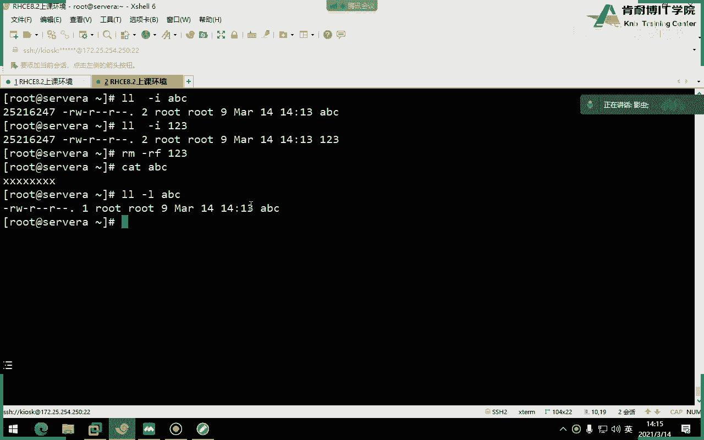
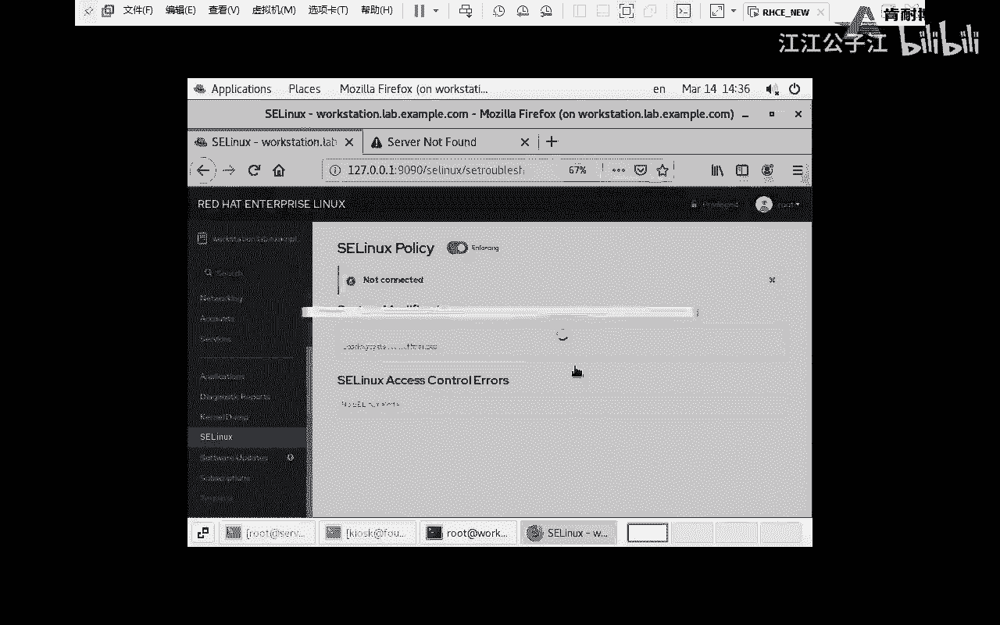
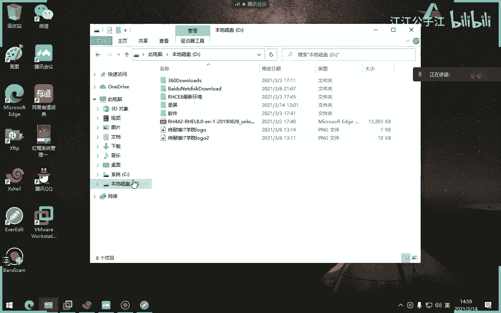
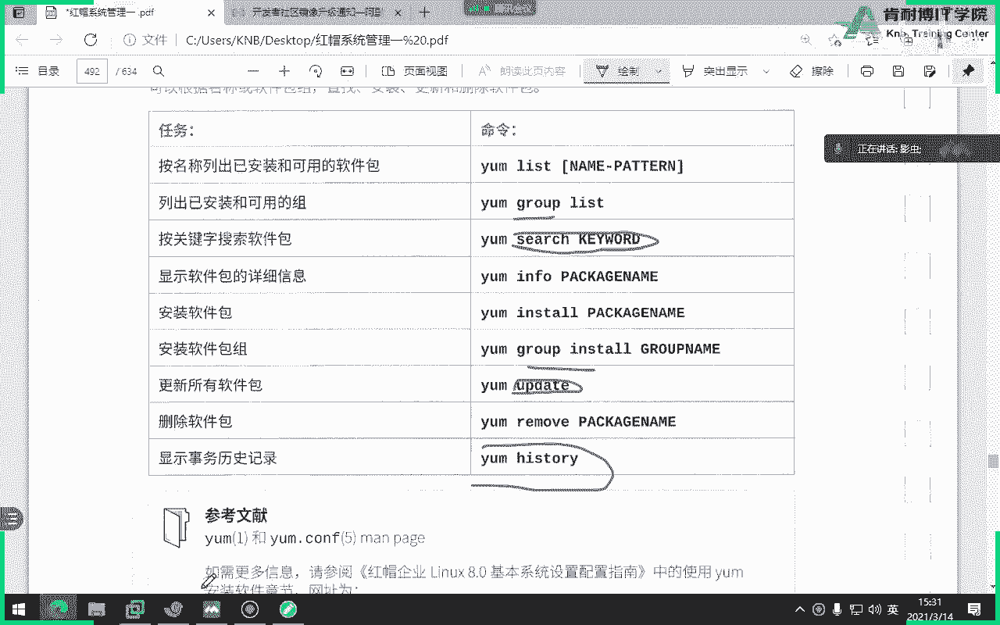

# 红帽认证系统工程师RHCE8-滕老师出品 - P8：第四天 压缩文件，软件包管理 - KNBIT认证中心 - BV1up4y1h7MA

今天下午我们继续讲一下网络部分，那么请注意今天讲的n m c i命令，不管是修改还是添加都是永久的，为什么，因为你会发现它会自动往这个目录里面去灌自己的配置，理解了吗，刚才谁在群里截了个图，又截了。

这个很好啊，你会发现它就是往里面写内容啊，就是往里面写明白吗，好那么所以说如果你用vi编辑器也可以直接编辑，可以的，但考试首选这个命令首选啊。

好吧，来我们看一下这个配置文件。

这配置文件要很熟啊，要很熟，就这个，大家看你刚才配了这么一堆，其实就是往里面写这一堆，看是不是有个dns啊，而且为什么有个d2 呢，因为这台电脑当中已经配置好了一个dns。

刚才我是不是用一个加号ipv 4的dns啊，这是d2 ，明白了吗啊好你来看这句话，就是刚才那个是否手公配置，如果把它改成dj cp，就是动态，明白了吗，唉动态好，还有这句话默认一定是no。

大家一定要把它改成yes，如果你不把它改成yes，你每次启动计算机的时候是没有地址的，听清楚啊，如果咱们用vr编辑器去编辑的时候，这边里面是no，一定要改成yes，千千万注意，因为很多同学忘记改。

看完之后发现哎怎么还没有地址，原因就是这个地方没有改成yes，好，如果你想手动手动的去写，就要写rp a d d r这个单词后面写上ip地址，然后24位是什么意思呢，这玩意吧好。

你可以写成这个单词就perfect，但是我个人建议大家也可以写成老的这个命令叫net mask，都可以啊，等于二五五点二五点都可以，都可以，随便你啊，随便你都可以get way啊，这就没了。

好device是我们真实的设备名，真实的设备名uid号不用管，它，是它自动生成出来的，你不用管它，你也改不了好这就是我们今天要讲的这个文件，注意文件路径在哪，再看一遍，一定要记住它是在这儿。

这是一个系统管理员必须要熟悉的一个配置网络的一个文件，嗯，为什么不建议大家用了呢，因为这个文件考试的时候是没有的，你想想我的个天没有的话，你这个里面你怎么拼，你能记住吗，你肯定记不住对吧。

所以说现在大家用nm 4 l i命令，但在红包七之前的版本里面，这个配置文件是默认自带的，默认自带，你可以随便改一下就可以了，但是红包八现在它没有啊，还有不是什么w好像反正考试的时候是没有。

所以建议大家就是用a m c l i命令去敲，因为敲完之后它也是往里面干嘛，写配置文件永久的，大家不用担心好，这就是网卡的设置啊，我们今天上午讲了什么呢，讲了一是网卡的设置和一个网卡添加链接名好。

那么接下来我们讲点其他零零碎碎的东西，比如说第一个怎么修改我的主机的名字，首先host name这个单词直接回车是显示主机名，当然你直接用hostname，这样也可以改主机名，那这种改是没有用的。

它是临时的好，那么真实情况下怎么改呢，请大家注意这个单词是修改主机名的啊，不是这个配置文件是修改主机名的，你只要把主机名写进去就可以了，这是考试必考题，考试当中有一道题目叫网络设置。

其中包括了让你做主题名的题目，写进去就可以了好吧，那么这是第一种办法，能记住吗，好第二种办法，你想学就学，不想不想学就算了，这种办法你想学就学这种，呃叫什么来着哦，host name，对对对对。

这种办法也行，回车就行了好吧，这种办法啊，但是呢我不太习惯用，你看我自己都都忘了，所以我还是习惯用这种办法把这个名字写进去就可以了啊，写进就可以了，讲完之后保存退出就可以了，这一题就可以满分。

比较简单好，除了主机名之外，还有一个文件叫做静态绑定名称，就是咱们windows是有个叫host的文件，这上面也有e k c host，注意它是代替dns的本地解析，你看我这么写是什么意思啊。

前面是什么ip地址，后面是主机名，另外这就是当我ping主机名就相当于ping地址，懂了吗，好那么为什么后面还有一个classroom呢，就是简写的短主机名，所以说你看各位当我们直接psa的时候。

可以直接psy sy b的时候也可以对吧，或者你写成全名的也可以，为什么，因为dns当中做好了解析，同时host文件也做好了解析，听懂了吗，就是你你把你的前面这一串名字写上去，和你写整个名字都行。

别忘了host文件啊啊别忘了s这个单词s啊，s这个不是dns啊，同志们，这不是，这是我们的本地解析啊，那么真实的dns在哪配呢，在这这个你也要给我死劲背回车，写上句话就写这句话。

name server空格，你看刚才我们是不是加了dns，它往里面自己写dns了，明白了吗，懂了吗，同学们哎，就写d就是name server空格，写上dns的地址，听懂了吗。

好所以说你看有几种配置dns办法，这是一种，还有这是一种吧，看到这种是不是还可以直接在哪，刚才你配的这个那长串什么来着，里面也可以配对吧，这个这个配置文件里面也可以也是可以的对吧。

也是可以站在里面配也行，但是注意有一点细节部分，就是如果你用vi编辑器去编辑网卡配置文件，写dna的时候，一定要加一个dns一或者dns 2，这个数字要加上去，如果不加不生效好吧。

一定要加一个一或者是二或者是三，懂了吗啊，所以说dn的配置办法这样两种都行，这是b口，如果你不指定dns，各位你正常考试是ping不通classroom，那台机相当于classroom的那台机器。

那你整个考试很多事情都做不了，比如说亚美元做不了，比如说下载文件下下不了都做不了，dns一定要做，但考试的时候不考d也是d搭建，不是你考的，你只要指向dns就行了，d里面的配置是考官已经配好了。

你指向他就行了，就像我这台电脑，大家来看我的dns到底指向的是谁，各位你们刚才看到了指向的是谁，这个不要是不是指向的是254，254是谁，不就是classroom吗，就这台懂了吗，就来继续懂了吗。

哎好了，那个那个什么来着嗯，d讲完了，主机名应该讲完了，host也讲完了啊，那么host是跟dx有什么区别，一个是本地的，一个是通过dns来解析的，听懂了吗，好咱们现在继续往下讲什么呢，如果我配好了d。

我怎么测试，啊你你写254，你写你指向classroom就成功了吗，咱咱们是不是得解释一下好，有这样几种办法解析，第一个ping行不行，我考试建议大家用品为啥，因为它又可以做连通性的测试。

又可以做dn的解析的测试，这我直接拼，如果能通就说明ok了，还有什么就是我们的post命令，直接host后面加上sa，比如说他说啥，是不是稍微a解析成ip地址是一零。

还有一种办法叫n s look up，这是windows的命令，是不是windows也有这个命令对，成功了，254是谁是dns，注意53号端口，你要给我背下来，53号端口是dns的端口。

咱们今天学了两个端口，514和53，对不对，514是谁，日志，明白了吗，同志们，也就是说这条命令可以显示ip地址，这条命令也可以显示ip地址，就选这两个就够了，好吧，就你一定要验证。

你考试的时候不验证就不行，我要求你们考试每一题都要验证，没问题，就你怎么知道你做对了，你怎么确定你做对了对吧，你得验证，所以以前有些同学说老师我不知道我能过吧，我说你一定知道你能不能过，通过尸体。

你有九题都验证不出效果了，你还想什么呢，那一样反过来我有10t，但我九题都验证成功了，最后一题没成功，那你肯定是过的，你不可能挂的对吧，所以你看你每一道题目都验证了，它怎么可能挂掉呢对吧。

所以你自己要学会验证啊，好了，那么今天我们讲的关于网络的这一小块内容，大家还有什么疑问吗，我讲的比较快啊，用这个命令，这个命令比较简单，我们就一带而过，那么如果没有问题的话，我们来说下面一个事。

我想测试网络之间的联通，或者是我想测试一下这个这个这个这个这个我想看一下，我之前的这个电脑打开了多少端口号，我怎么办，端口号就是，那么这个命令有很多参数。

我们来看一下教材当中，这个命令有很多参数，这些参数一定一定都要记住，每一个都要记在这，太多小写的n是显示接口和端口的编号，而不显示名称，t是tc p u是u d p l是listen，注意这个单词。

l是listen监听a是显示所有套接字，p是显示呃使用的这个p不用不用管它，就是nt l pa这几个都要用啊，我习惯性这几个都用啊。

你看举例子，我想知道我这台电脑现在打开了哪些端口号，啊那么我只看的是t cp，没有看u p吧，回车好，首先看local address，这一列显示的是本地，这边呢这个单词是不是远程显示的是远就是外边人。

那你能够看出什么效果来，各位这个图片你能看出啥，是不是看到了，我172。25。250点，一是我自己，标点是自己吧，自己的22号端口被25。25。02250。250点，这个家伙干嘛干嘛了，连接了。

并且状态是excablish，学的网络同学都知道，大家学网络同学都应该知道一件事，我去连你或者你去连，我就必须要知道我的端口号和我的地址吧，对不对，所以说你看你要想连我。

你要知道我的ip地址和我的端口号，也就是说你要用你的ip地址和你的端口号，却连我的地址和我的断口号，你这边的多少号一定是个随机产生的，而我这边的22号是固定死的吧，因为如果我这个断开之后，你再连。

我肯定这绝对不是58442的吧，肯定是随机产生的吧，对不对，明白了吗，好你看这就看到了连通性，明白了吗，因为我2号端口现在被这个人连了，而且是建立连接，所以如果你不加a。

你就看不到各位如果你不加a就看不到后面的状态看了吗，所以建议大家加个a，好这个命令我就讲到这儿，书上讲的是s命令，这个命令等于这个命令选项也一样，所以我就不再解释了。

好吧，书上讲的是s命令，但他们俩是一模一样的，几乎雷同显示的内容，所以你就懂了吗，看一个就可以了，好那么请注意啊，这个s命令如果你是最小化安装电脑的时候，什么叫最小化安装。

还记不记得我们当时在装系统有个最小化安装，那么它是没有办法用这个命令的，因为这个命令是由这个软件包提供的，这个软件包最小化安装的时候是没有装这个软件包的，所以你会发现一个现象。

你想用if configure，你都用不了，为啥，因为if for configure就是net tools这个软件包提供的，那你最小化安装的时候没有装的软件包，那我问你，我问大家。

如果考试的时候没有configure怎么办，我告诉大家，为什么，因为考试就没有a股上证，但我要不讲，你肯定不知道这个包吧，你肯定不知道，我刚才肯定没有人知道，那怎么办。

你就不需要装有rp空格a不就行了吗，懂了吗，阿p空格a这个命令是带来，所以你们考试的时候，建议大家用rp空格a来看rp地址，除非你现在我告诉你了，知道装哪个包叫net横线tooth，懂了吗。

呃考试的时候，咱们的所有考试机，除了物理机之外，里面的所有虚拟机都是最小化，安装很多命令用不了，比如说vr m用不了，只能那个app卡密尔用不了，好吧，那我就告诉你们啊，心里心里有一个有个底啊。

别到时候一看哎怎么命令用不了，是不是敲错了，一紧张啊，别紧张啊，没有就是没有好，最后再来跟大家说一下，咱们作为系统管理员，要稍微知道一些端口号吧，咱们来复习一下，你比如说，邮件是多少多少，25对吧。

110143对吧好。

那你说我记不住对吧。

那么多记不住，那你别去了，不记。

但是你给我记这个就行了，把这个文件系数打开，里面是所有账号，你不要去啊，当然你最常见的知道，比如你上网八零，你不知道，那就完蛋了对吧，明白了吧，好这个文件是记录者所有端口号service。

你想想你未来在工作的时候肯定要有防火墙的设置，那你不知道断网号怎么办对吧，所以还是要知道一下最常见的53，刚才讲过d n s514 ，53，8022252123，这些都要知道最常见的啊，你说那种冷门的。

你实在不知道，没关系，我们找一下就行了，那个啥行，那么咱们今天这个网络的这一部分呢就讲完了啊。

这个书上给我们提了一句啊，提了一句，好那么下次我说你给我看一下，咱们现在这个机器它们之间的连通性怎么办，你就要知道用命令了啊，这个max或者是s命令知道他们之间的连接啊，连接连接。

行这一章内容你看了这么多，其实最关键就那就那几个，一个是知道pd，一个是知道配ip地址就够了，应该是在哪配，最后一种办法对吧啊，再说一遍，能补全的就补全啊，尽量补全哦，你看还可以还可以配置啥。

我们当年在考红帽七版本的时候，就考ipv 6的配置，哎现在还考不，其实ip v6 不就把那个阿p v4 换成六嘛是吧啊，没什么难度啊，好删除网络连接，看看删除delete再说一遍，那个ds什么意思。

就关闭disable啊，千万注意啊啊就这么多，你看就这些都会啊都会啊，这两个是反过来的，因为是up用peace反过来，别列斯是删除，永远记住这个删除一定是删的，是谁，听名字便签名。

你别把真实名字删掉了啊，你不能把1t是零删掉了啊，知道吧，删的是链接名好了，这就是本章的内容，后面的实验，那我们就不做了，因为就是刚才那些东西啊，好这张，最后大家看一下。

如果你非得使用这个配置文件的方式的话，你这边应该怎么写，我已经给我是不是已经介绍过了，比如说ip address address可以写成什么network对吧。

a net mask对吧啊等等等等等等等一堆啊，这些都不用看，做完了之后啊，好这个要知道，如果咱们公司里面网络是一日cp，要选择cp，如果是手工的话，就要选择，那你明白了吗，而且那个静态那个单词的时候。

那个那个全拼也行啊，但你没没没没必要，之前n n e就可以了啊，default是第这个default是默认路由吧对吧，输入路由，然后呢先这样做错了，reload，看到吗，reload啊。

这是这个什么来着，关闭某一个链接，这个up是启动一个连接，关闭这个命令相当于以前那个if done if up，大家听过这个命令吗，if done it up好吧。

就启动某一个接口的时候就if done，然后再启动一个呃，呃down是关闭up是起if done up，a不到a web，这两个这两个命令是连在一块的啊，不是分开的啊，a不到好了。

这就是这一章的所有内容，你看你如果仔细看书的同学，你会发现每一章后面都有一个参考的教材，这三个教材就我昨天告诉大家那个红帽的官网，如果你比如说他说在当地还有其他疑问，又想更深入学习，他参考这个文档。

你可以去看，但咱们由于是打印的教材，所以不太清晰啊，不太清晰，行啊，这张实际上还是一样不做，那你回家做啊，咱们不做了，好更改主题名，看host name，显示主题名，还有这个get host name。

列书主义呃，设置啊啊那真实的话就是应该这种办法也行，这个办法是永久的对吧，永久性这种写法啊，那么在以前老版本的时候用的是这个，注意红包六和红包六之前的版本的主机名是在这儿，千万别把他认成认为是网卡啊。

注意很多同学以为这是网卡错了，网卡应该是横线script是吧对吧，千万别记错了啊，好文件解析名称就是host，它是一个静态的，静态的，前面写ip地址，后面写主机名，主命两种写法，第一种是写全部的主机名。

第二种写法是只写短的主机名，那么etc reserved。com文件写的是dns，只要加上这句话，name server就可以了，后面加上d的名称，像这个指向dns，像这个可以不加search。

可以不加啊，sch对于较短主机名尝试搜索的域名列表，你可以不加，因为比如说我们现在只有一个，那就没必要加了啊，这就是今天的所有内容全部讲完，关于网卡的东西我们就全部说完了啊，关于网络我们这路口看一下。

还有什么想了解的吗，那么在以前红包系列版本当中呢，我们还要讲一个叫网卡，双网卡绑定，现在也不讲了啊，也不讲了，因为咱们你给那个要讲那个uno了啊，所以就不讲了，双网卡绑定嗯。

昨天谁在群里说那个网卡的事来着，说什么那个两个方法怎么用，我没明白他想表达啥意思啊，嗯。

路由是吧，如果你想配路由，如果你非得想配路由，我们可以用一个单词root杠a，再查看路由，那么很显然大家看到的这边是destination目标，那哪个是默认路由，注意ug是默认路由，只要看到是ug的。

就是默认路由，就是网关，然后如果你想配的话，就用root a d d去添加就行了，怎么添加呢，我买一点吧，往前嗯嗯在这儿各位看添加路由表啊，这句话什么意思啊，添加一个网段是192网段ip地址。

子网掩码是这么多，metric是度量值，dv是什么出接口吧啊metro大家知道吗，度量度量，当然了，这个度量就很专业了，对术语啊，你可以不加啊，这种删除呢就是delete好吧，就是添加路由表，添加路由。

那么教材当中用的是app root，但我觉得rp root看的没有root杠n看的清晰，所以建议大家用root杠n不要用rp root，一般情况下咱们主机当中也可能会添加路由表。

但是更多的情况是应该放在路由器当中去做啊，那么咱们也主机当中也当然也可以添加路由表。

好关于这一整章，大家有什么疑问吗，这一章的考点非常多，就是一题大题，一题里面好几个小题非常多。

那么我们今天要讲一个新的命令叫做tb啊，归档和传输文件，这是一道考题，这个大包呢大家要认真学，因为我们在工作当中，踏包的利用率非常高，我给你一个大包，你都不会压缩，也不会解压缩，你怎么办对吧。

所以我们来讲一下什么是t在这一章学习过程当中，我们要学习使用t命令来进行归档，同时要使用ssh进行安全的远程拷贝两个内容，大家知不知道什么是塔宝，各位什么是他吧，你觉得压缩包是吧，错，塔包不是压缩包。

它包就是归档，那人说老师什么是归档，归档就两个字，打包套包，之所以很多同学会认为是压缩包，是因为咱们拿到了很多塔包是被压缩了，但单从它这个命令解释的话，它没有压缩，是你在用它的时候又压缩了。

才变成压缩包，如果你不压缩，它就是一个打爆它没有压缩的概念，所以一定要先把这个概念性的东西先纠正过来啊，好吧，那么什么叫归档呢，就跟咱们搬家一样，我收拾一下，打一个包就走了啊。

那也是咱们把tr呢理解为把一堆文件，子目录或一个文件弄成一个大的文件，里面包含了很多子文件，怎么录归档归档好，没什么要解释，直接来讲命令，这个没什么原理啊，各位没什么原理。

但是请注意这个表格里面的所有选项，我要求你们每一个人都要会都要会，比如说从第一个开始讲起，c创建，你可以这么记，同学们c和x是反过来的，c是创建x是什么提取，这说白了一个人打包，一个是拆包。

这么讲的理解了吧，好t是列出可以理解为什么看浏览浏览的意思，注意了这个单词是什么意思啊，我们以前讲过，只要是v基本上都是什么意思，显示过程。

比如说第一次课我给大家补充了一个命令，l s u s b还记得吧，岗位岗位gv v gv v v还记得吗，哎这里面就是显示过程，显示里面的过程。

好吧好吧好，f是文件名的意思，既是保留属性，但这个一般用的比较少，咱们先不可以不记啊，保留属性好，c x t v f，那你为什么我在网上看到的包都压缩呢，注意那是由于它有了下面几个选项。

第一个z第二个j，第三个大写的j，咱们一般情况下应该说就三个方式，geip baip和x z格式这个三种，也就是说如果你不加这三个选项，你的包只是一个归档包，但是我们可以在归档的时候借助压缩命令。

因此它应该叫做压缩，并且归档明白了吗，这只是从单纯的讲它它没有压缩功能，这一点一定要分清楚，好吧好，那这几个选项你得给我背下来，z是zj是be z to大写的，j是x z x z的话，我记得没错的话。

好像一般是压缩内核用的比较多一些啊，大宝宝，但一般我们用到的最多的还是b sato，因为b zito要比jip压缩的压缩率更高，好吧啊，等更好，这才讲到这儿就结束了，我在讲之前呢。

给大家介绍两个命令来记笔记，关于压缩，鸡肋不压缩命令就直接加鸡肋，后面加文件名，就把一个文件压缩了，明白吗，就自自动就压缩了，那样如果想解压的选项杠d是解压好be，这不to想压缩一个文件，怎么压缩。

busy to后面加文件名称就压缩了，选项，杠d解压听得懂吗，同志们，就如果我直接用jz不，或者直接用busy to。

能不能压缩文件呢，当然可以了，你来看我们来演示一下，我们跑到vr当中log，我们这样子，咱们先看一下这个是啥，哎这是很好，我们先看一下日志文件多大，没有再来看看mesage哎，这个大这个大一点。

再来看更大，有没有14哎，这个号176k给我压住了啊，各位看直接回车，直接回车，会出现一个红色的，第一节课我们说过红色那个什么很好压缩文件看了吗，但是问题是，但问题是它原文件还在不在不在不在了啊。

同志们，没有啊，各位没有了，那你想解压怎么办，easy g很好很好很好，血压又回来了一样，busy不一压缩怎么办，我就不写了，我busy不吐，啪啪啪啪回车解压怎么办，杠地懂了吗，好记好一个小写的选项。

b内部比g内部还有一个好处，就是你可以压缩的时候保留原文件47里面没有的选项啊，来各位，大家看原文件还在吧，解压文件还在吧啊不压缩文件还在吧啊注意啊。

也就是多一个选项，这个比比点击这边要多一个选项是k保留相当于什么，我猜的应该是tap吧对吧，就保留原文件的意思，懂我意思吗，那么我们刚才讲过，塔包当中可以借助jz比加速，可以借助b z b加速。

可以借助大写j变成x一格式，明白吗。

好再来，我们来直接做一个实验，咱们没什么要讲的了，咱们直接做实验，那么这个卡包的格式怎么写了，很多同学觉得踏包比较难，因为它格式没有掌握，格式是这样的，但是它中间一些选项啊，比如说gz啊，gc啊。

在巴拉巴拉巴拉一堆选项好，注意先写什么目标文件，在线圆，这个跟我们的这个思维不太一样啊，咱们一般都是先写语言，在写目标，这个不是先写，你要打包到哪儿再写，打包谁听懂了吗，同学们先写打包到哪。

所以我们现在先下来给大家做个实验，打爆，利用他把这个home目录吧，拿不，拿不到tnt当中，就这个实验看清题目能看到吗，利用ta命令把home目录给我打包到tnp当中。

ok坐下来一块，咱们先进到后面那边，咱们啊就这么多好吧，这样还好，咱们再建一个文件吧，对吧，咱们有这么多文件和这么多目录，咱们把这一堆目录和这一堆文件一样打包到哪，tm p吧，对吧好，那我们来做一下好。

先写他命令打包是哪几个选项，来告诉我，这我还想看过程，或者而且我还想用be sato压缩，b c也不错，很好，最后再加f永远记住f一定要放在最后。

为什么f是什么意思，同志们，文件名什么文件名，就你要打包，后边那个文件叫啥，就要打包。

写到后面好打包，这其实是不是先写目标，我们打不打不了，哪天p好，要起个名字，注意这个名字可不可以起成123，当然可以了，你爱写些什么，但你不要这么干，为啥因为你要起一个别人能够看得懂。

知道用什么命令来解压的名字吧，比如你可以使坏坏，你明明是buzb，但你起个g z不行吗，当然可以，但不要那么干啊，好b z ok然后再写打包到谁家，不然后再写打包谁打包home，对不对。

千万不要先把home写上去，要先写打包到哪，要再写，打包成回车，这都是啥过程，ok有没有tp的，应该有红色的吧，对吧，朋友们，这题原题啊，我又不小心把题目露给大家做一下吧，原题啊，比如说我们搞定了啊。

但是我们比如说我现在给大家出一道题目，比如说题目是这样的，说电脑当中，电脑当中已经存在了一个压缩包，你不用搞，但是你要给我写啊，咱们题目变了，那几下怎么讲，嗯嗯，b这得b b b吗，哪来的b啊。

对吧很好，因为你看你的名字叫鼻子不to，所以应该得用j吧对吧，后面加这个吧，后面就加这个，我写错了吗，啊不需要啊对吧，就完了啊啊你看是不是解压出来一个就home了。

然后我们进到home这里面就应该有这么一堆东西啊，明白了吗，对的我刚才命令没敲错啊，他补不了就是补不了，补不了，好，太解压了，但是问题是这样的，同志们，你在解压是不是太解压到当前啊，对吧。

我我我们比如说题目在变相，我不想解压到当前，他一解压就解压到当前了，我不想解压到当前，那你就可以给我加一个选项，注意了，大写的c指定某一个目录，比如说加到v a r g，大写的c指定解压到哪。

小写的c指的是create，创建。

这算有吗。

不知道有没有管它有没有，反正你自己知道就行啊，g大写的c指定解压到哪里，小写的c是创建，x是抽取，特别不规范，所以不要学我啊，各位咱们应该叫home。tb c two吧，这样好听一点对吧，我可不规范了。

各位不要学我啊，咱们一般应该这样写是吧，起码来个这个吧，对不对对吧，一般这样做会更好看一些对吧，这样人家知道是个大包更新对吧啊，我这个不太好啊，行你知道就行，好讲完了就这么多选项卖。

不会的话，自己卖就这么多，看够你学的够多。

不用背啊，人家都是选项。

你看，好，那么我们来看一下教材，教材这是啥意思啊，同志们，这个是指把已经存在的啊，把已经存在的fil 1 f2 f3 全部给我归纳到一个叫这个名字，一定要看清楚，先是目标，再次言啊，那如果他没有加目录。

他没有加上目录，应该是压缩到哪了，当前目录对吧，很简单，ok这是啥啊，这种就是就是长格式怎么写法啊，这么恶心吗，那就我记得不是借这个，对不对，疯了吧，还有同志们，还有一个就是列出列。

我没说是哪一个什么叫列出，就是我在我不解压的情况下看的内容，对不对，我不想解压出来，能不能看，那可以用明白啊，可以啊，好啊行吧，就这么多，xz也相对较轻，但是现在再说较新也也也也没什么意义了。

因为也不新了，不是多心了，但是相比较而言，要比这个心率不要轻，因为比基利浦的话有点老了啊，所以你会发现大部分电脑就是我们去互联网上下很多包，都是bz不结尾的，b ip呢也有也有。

那么下次你在公司里面拿到一个b这个压缩包，你得会解啊，你有没有发现在公司里面装自己装二进制软件包的时候，它都是他包形式，你得先会压缩和解压缩啊对吧，你得先会啊，有时候你会发现这个选项前面没有横线也行。

没有这个横线也行，啊啊提取呢就是我们说的这个x就不再一个一个给大家解释了，x x，这个命令用过吗，这个命令linux当中有很多啊，就是用于做zip格式的那种吧，这道题目不做了。

因为题目跟我们刚才那个意思是一样的，a t m p里面不要不要求你们再做了，好这章的第二块内容怎么去远程连接，我们学过open s s h对吧，open ss指的是当我们去连接文连接目标主机的时候。

它是作为安全性的一个保障，同样我们如果用拷贝文件，你是不是也希望有安全性，那就叫s a p k s a d跟我们c a d命令一样，它是用于做文件拷贝，只不过cp是在本机之内拷贝，那sp呢跨主机对不对。

跨主机拷贝这里面的s是什么，它的语法格式跟open啊，跟跟那个ssc是一样，先是用户名at主机名，懂了吧，s s是不是先是呃这个用户名艾特主机名那样，s b也是这个格式用户名i的主机名。

但是后面要加一个什么，加个冒号，加上你的远程目标目录，懂了吗，比如说我把一个文件从当前目录拷到对方的主机当中的vr目录，你要把那个vr写出来，不然的话你想想他怎么知道你考不到目标主机哪个地方对吧。

所以有时候你不用去背命令，你去理解它，你不写目录，我怎么知道你考不到哪，你光跟我讲，咱们上课是在31层，哪个31层全合肥多少三级称，你告诉我哪个，对不对，明白了吗，所以你要加目标目录。

就一定要指定他的目标目录，那我们来做一个实验，没有不要看这个书上了，不用看了，直接来做，谁来你比如说各位，我现在先听一下server b，ok能拼通，你要先保证通啊。

我现在新建一个文件叫做叫做test吧，比如说啊那我要拷贝就是这，然后root下面的server b好，这是什么意思啊，就这么简单吗，过去了吧，但是我为什么现在没没我考这么大，哈哈哈哈是啊。

我的个天我勒个天，你这么这么大啊，他为什么不让我输密码，因为我们是不是昨天做的互信啊对吧，按道理来讲，它是不是应该让我输密码好，我就不我就不不回声了，会了吧，这么简单好，同样这个root是指的谁的肉。

它32b的对吧，哎就这么简单啊，好那么问题是，如果我想拷贝目录呢，如果这个test不是文件，是目录呢，下一个，很好啊，小写了，你目录你当然要递归了，但是有一个要区别，注意大写的c记一下。

我说你记大写c你猜一下吧，对的，压缩那个单词，每个单词那叫co什么玩意儿，怎么进来着，咱们看一下什么p o p什么玩意，这个单词大写的事，压缩里啊，为什么要压缩啊，因为你在拷贝的过程当中。

我们占用的是带宽啊，如果你的文件很大呢，那是不是有一个压缩更好一点对吧，好记一下杠大写的c h加缩杠小写的r是递归，s b很有用啊，工作的当中经常使用对吧，好了各位我们现在说一件事。

数据是a比如说这样吧，我跑到home下面，那比得随便吧，比如说我建了一个文件啊，比如说我现在有一个文件是一拷贝了，明天早上就变成个二啊，那你会发现在拷贝的时候呢，他还会先把一再拷贝一遍，再把二拷贝。

那第三天的时候呢，突然出现一个三，他要先把一二拷贝一遍，再把三拷贝一遍，其实一和二是不是重复了对吧，按道理来讲，我是不是应该只拷贝三，就每天新增的那一块，但是没办，没办法，它不支持这种增。

这叫差异还是增量增量吧，它不只是增量拷贝啊，这是它的缺点，优点呢安全呀，对不对，但他那那怎么办呢，哎没关系，咱们可以用这个命令，这个命令可以支持增量拷贝，也就是说如果他发现有一二了，就不会再拷贝一遍了。

只考那个三，听懂了吗，好但是这个命令怎么用呢，根本里有很多选项，各位你看我勒个天超级多选项啊，但是一般情况下咱们会用一个v是显示过程，还有一个是小写的a啊，a又a是什么意思呢，这个这个单词叫归档模式。

它等同于打这么一堆选项，这是av就可以了，明白了吗，好也就是说你打a就等同于打了巴拉巴拉巴拉这么一堆选项，明白了吗啊，但是具体在选项什么意思，你可以看一下，比如r什么意思，这是什么意思啊。

诶那啥意思是递归吧，对吧对吧，还有这个什么t啊，什么g啊，o r d大写的d啥意思，我们看一下大写的d哎呦喂是300的设备吗，是设备吧，对啊，g呢是groups对吧好，我们来做个小小的实验啊。

同志们来做一个实验，比如说创建一个rh c e，比如创建一个叫做具体的dr了，然后跑到dr里，现在一堆东西，现在大号1~4文件好，这时候呢嗯拷贝一下吧，ok走，你r s y n c好，也是杠av。

然后是目录对吧啊什么来着，是root啊，跟那个s s s命令一模一样，格式明白吗，ser b啊，sorb，然后拷贝到哪了，比如我们考虑到也叫d啊，好吧，这个名字你说老师我没有电压怎么办，没关系。

它会自动自动建立的啊回事，看过剩了吧，拷贝过去了吧，但是这是速度吧，我的速度对吧，速度好，那么这时候我们跑到sb看一下，来看自动建立了吧，好里面有什么东西啊，好那比如说我这边突然间只创建一个小写的五。

再创建一个呃，我刚刚在哪创建，比如说我现在又创建了一个小写的五，那这时候是不是应该只拷贝五那一样，我们还是看过程，因为有过程才能看出效果嘛，对吧，你看过程是不是只有五个同志们，哎那你看这边了。

那你不用我不用，我说这边了，立刻有个五吧，会吧，这种方式在我们企业当中经常用于做什么文件备份，比如说我们我们写个脚本，每天晚上12点把我的某某某目录备份，要把我的加速度备份了，因为我觉得加速度很重要。

对我来讲啊，那么你每天晚上12点备份的话，那如果每天的量很大，你会发现很慢很慢，但是有了这个，这个单词是不是同步，同步吧，那are是什么意思，一般是mote吧是吧，远程吧，好像面面能记住吗。

那我在上一个班当中，我讲过这个命令，还有一个小小的异常的地方，请大家一定要留意，咱们也在做一个，你会发现有一点点不太一样的地方，就在这啊，就是如果你把这个这个地方减去了一个，减去了一个斜线，就不一样了。

嗯就不一样了，来看看啊，嗯嗯嗯什么意思呢，全部删掉啊，就骚扰b就没有立案了，好我们重新做这个实验，但这次呢我我我不加这个斜线，同志们，我不加啊，不加你来看过程好过去了，它会自动限制电压对吧，没问题吧。

但这里面你看l os，发现现象了吗，同志们，什么现象，是不是多出一个电压，上级目录啥意思，哎你看各位，你来总结一下，你自己总结，我们第一次在做的时候，前面这个地位就加斜线了吗，如果加一个斜线的话。

它只拷贝什么，只是拷贝里面的内容到对方，但如果没有加斜线，其实你也很好理解，没有加斜线，他认为这是啥，它不是一个目录，它就会把它拷贝到对方的同时，先创建一个目录再拷进去，明白了吗，好如果你加斜线的话。

他就知道那就是目录了，我就不用在目录里面再建一个子目录，再拷贝文件了，懂了吧，就这个意思啊，所以说你看你加个斜线和不加斜线，区别大了去了，我这么说，能理解吧，要不理解自己做出来，自己做一下。

你有没有你能感觉到好吧好看它会多一个目录出来，就像咱们统计一下，就是加斜线，只考内容，附加斜线，连同目录数一块拷贝，是不是这意思啊，这个很简单啊，i s c p什么时候用最好。

我只是一次性的拷贝一个东西就完事了啊，那这个命令呢好在就是做同步，所以你看各有各的不用处吧对吧，咱也别说谁比谁好吧。

那么给大家点时间，自己把这些实验做做吧。

我们接下来再来补充一张，不是补充，就是上节课没讲的，叫软链接和硬链接，说白了叫链接文件，链接文件呢大家看很多咱们的文件名称上面，比如说ios你会看到很多l开头的东西，看了吗，同学们。

这个l开头的东西就是链接文件，但是链接文件呢通过它的属性判断又分成两种，一个是软的，是硬的，那么在讲链接文件之前呢，在讲链接文件，甭管是软还是硬的之前，我们要补充一个小知识点，这个知识点如果不补充。

可能我们听不懂，要铺垫一些东西来。

我们看关于文件系统，什么叫文件系统，比如说咱们学过，咱们知道windows的文件系统，什么n t s是吧，还有呢，但是linux当中很多，比如e t3 d i t s x f x等等等等等等对吧。

有很多文件系统，那么咱们先不关心文件系统它的一些深层的一些定义，知道一点文件系统当中有一个重要的东西叫innote i n o d e啊，inno的节点，这个节点当中是是一个符号，而是一个数字。

各位这个运动节点当中会有会有一个数字，这个数字就表达了你这个文件建立的时候会给你分配一个节点号，每一个文件和每一个目录都会只有一个节点号，听清楚，这只有一个，它并不会随着你的文件大，我就给你分多了。

你就小就分少少少，一个不是只有一个那么一个节点号标识的一个文件，或者说一个目录的存在，那么文件它只认识接点号，文件系统来讲的话，它只认识接点号，他根本不关心你的名字，你叫a也好，你叫b也好，无所谓。

我只看你的节点好，所以说请注意，当我们创建一个分区的时候，现在咱们还没有讲顺序吗，我现在跟大家先说一下，接着是不是要格式化对，就算你没学过，你是不是应该有这个经验，是不是先分区再格式化。

那么一旦格式化之后，我们就会把这个减2号的数量给它固定死，除非你改一改，除非你改，你要不改的话，就给它就固定死，那么我给大家说一下啊。

你来看这个美女df杠i，因为你会发现这是每个磁盘啊，这比如说这是根本区，能看懂吗，这根本局当中总共有5190114，用了46132，啥意思，就这个在根本句当中，如果不关心创建文件的大小的话。

你能创建5190144个文件，明白吗，我这么说能理解吧，不关心大小啊，但肯定不可能创建那么多，因为有些可能一个文件就已经很大了对吧，好不关心大小，只能创建那么多，当年我就遇到一个问题。

就这个节点号被我浪费完了空间，居然还有很多，我一个文件都建立不上了，我这么讲你能听懂吗，就是我们的节点号被我消耗光了，但是我的size我觉得空间size还有很大，但是你也没有也没有用。

一个文件都建立不了，为啥我刚才讲过了，当你建立一个文件的时候，是不是要给你分配一个系列号，但如果你见的都是小文件呢，比如说几个字节，它会不会分配对啊，但你比如说你一个硬盘好几个t。

但你每个文件只有几次节或者几k是不是也给你也会给你浪费光，也就是说你的size还有很大，但是你的节点号没了，理解了吗，所以有时候我给大家一个经验，就是不要认为是空间不足了，建立不出来，建立出来文件。

而有可能是空间还很足，但是你接点号没有了，我这么讲的理解吧好好，那么我为什么要讲减2号呢，是这样，每个文件都有节点号来，现在学一个新的指令，ios杠i注意i对精度的，大家有没有发现每个文件前面都有数字。

每一个包括目录，包括普通文件，包括等等等等，你看随便进，随便随便都会有一个ios不用看了吧，但ios杠i你看都会有一个节点号，同学们好，这个前脸号唯一的识别你这个文件的属性也叫做原数。

未来你在读一些课外资料的时候，如果出现原数据这三个字，你不要陌生，它指的就是文件的属性，就是记录这个文件的数据叫原数据，要记录数据的数据叫原数据，比如说大小时间用用户链接号懂了。

但是请注意原数据里面不包括文件名，各位这个命令都能看懂吧，可以长出来都能看懂吧，也就是说这堆东西一直到停到这儿都保存在这个节点里面，只有文件名不保存在里面，ok吗，他说能理解吗。

好那么我们知道这个东西之后，我问大家一件事，有没有可能有没有可能建立两个不同的文件，但是前2号一样，一个叫a，一个叫b，有个叫是一个在c盘，一个d盘，那这个号一样可可能吗，windows很有可能。

但是linux呢没有，因为我们知道结尾号是不能够干嘛相同的吧，哎不能相同的好，所以说请注意windows alyx他只认节点号，linx只认节点号，文件名是我们给我们人看的。

就像什么用户名跟什么u r d之间的关系，理解吧，这个意思啊好，那有了这个知识铺垫之后，我们再来说链接文件，当我新建一个文件的时候，系统会给分配节点号，会不会，那我怎么看，哦原来是2521这么多。

这个计量号是这个好，同时再来看一下，大家看这个数值，我们以前曾经让大家记过是什么意思，链接数量，链接数现在是一好，现在我要做一个硬链接，ln a b c到123，注意ln这个单词叫做链接啊。

做链接的意思啊，这个时候你会发现咱们链接号的名字一立刻变成二了，一现在变成二，那么我们知道链接啊，比如说我现在如果访问abc其实就等同于访问123，明白吗，123就等同于防备a b c。

所以如果我针对a b c里面写一堆东西，请问123会不会有，有吗，当然有了，刚刚不讲了吗，你针对那个就相当于针对这个不一样的，那我请问大家，这是一个文件还是两个文件，为什么有一个为什么是两个。

我还没看清脸号呢，对吧啊，我来瞅一眼，我也不知道，尽量多对吧，因为是a b c一个是吧，还有两个两个，那有人说一个，有人说两个，那如果我把其中一个删了呢，我现在把123删了，a b c还活吗，还在是吧。

你想清楚了，同志们，我把123删了，a b c还在在，不做谁呀，咱们就猜对不对，然后反过来我把a b c删了，123，来吧，同志们，123，我们来看a b c里面，如果能看出说明还在。

在但是你的链接号就变成c，我问大家，如果刚才我删的是abc呢，还是一样一样的，没有区别，因为你的链接号删的只是链接号，我再说一遍，硬链接删的只是链接号，把二变成一没有关系，但如果再把再把一再删了呢。

那如果我现在把a b c给删了。

那是不是就这没了好，那你如果你画一张图的话。

是什么意思啊，同志们，其实这个图片很有意思啊，各位应该这么解释，这是一个文件a b c，那如果说这边有个接点号的话，如果说这边是个节点号是比如说刚才是二，比如一三吧，我要我随便啊。

那么其实你做硬链接的时候，他也还是什么，还有一个链接好，它也叫26121模一样，那人一样，那他怎么那他怎么怎么怎么怎么怎么删除，它，怎么引用呢，其实说白了是两个什么不同的文件名，引用一个什么节点好。

根据两条路指向了一个什么，in no，你能想象出来吗，就相当于我这个文件这边是文件文件好，但是呢我有两个文件名，这个这个比如a b c吧，然后这边是123，所以都指向同一个什么同一个block。

大家知道吗，far far同于blog，只不过呢我删除一个还可以从这条路走，那样我从上面这个呢还可以从这条路走，就他们俩指的都是同一个block，他们指的都是同一个in no的节点号。

大家注意不是两个文件，是一个文件，如果你删除一个的时候，我其实删除一个节点号，链接号或者一个名字，那其实另一个还可以进去，明白吗，这就是硬链接，就两条路嘛，相当于只向同一个vlog。

只要你的blog可没有删掉，这两个无所谓，明白了吗，这样，但是硬链接呢我们说教材当中写的非常明确，硬链接它的缺点就是不太常用，为什么，因为它有几个缺点，第一个它不能给目录做，第二个它不能跨分区。

真的你看我刚才有没有做跨分区吧。

我是不是就在当前做的跨分区，所以说我们用软链接更多啊，软链接是什么呢，删除角就从来也删了啊，123也上了，咱们重新来，我还是建立一个文件叫a b c，写点东西，对，写点东西，会写这些东西啊啊。

肯定有东西吧，对吧好，原来就是l n杠s s就是sop啊，s比如a b c到123，那么这时候我们再来看它的类型号就不一样了，一下就变成两个了，链接号不一样吧，好安静，哎你看还是一这边呢，那我我问大家。

这是一个文件，两个文件，删除a b c呢，123还在不在删除a b c，123还在吗，在还在不在，那我上去123呢，a b c在不在，为啥，因为你看123指向了a b c，如果你把a b c删了。

123是不在的，你反过来你把ab 123删了呢，没关系啊，同志们，因为123相当于指向的主体是a b c，只要那个主体没死就ok好，我们来验证一下，现在如果把a b c删了。

各位你会发现我如果把a b c删了，你会发现一点，那个123立刻变成黑色的，带红色，看了吗，他一直闪亮，今天咱们那个汽车那个叫什么灯来着，是你的啊，吃货灯是吧。

为啥因为你的a c a a b c给你干掉，所以说当我去访问123的时候，他会报一个错，知道吗，他会报什么，input output error，好像是这个，我看，他说没有告诉你，这直接告诉你，没有。

为啥，你刚才讲两个文件的那些同学就是错，如果是两个文件的话，他怎么可能会说没有呢，你刚刚说的这两个文件，如果是两个文件的话，他不可能报这个书，没有这个文件吧，还是英文，那你说不对。

那你这个文件为什么两个不同的线引号呢，你肯定有这个疑问吗，好我来跟大家讲一下，这是为什么软链接那些不同的地方是。

它其实其实它指向的不是真实的blog，如果是硬链接，同学们，我画一个啊，如果这咱们刚画的图是硬链接吧，硬链接的话，注意它其实两个名字，我就擦掉，把它擦掉，刚才写错了，这个不应该这么画，它其实是两个名字。

我先说我先画硬链接，这是两个名字，这两个名字比如这个名字叫什么，这个名字叫a b c好，这边有一个名字叫123，那么这是啥，这是真实那个文件啊，比如这是那个我我我就就是随便画的。

就是那个文件里面是那个文件的内容，block block连接指的是这两个都指向它，所以你用ios杠l会发现那个链接号是几啊，如果你删除一个时候，是不是立立立立刻从二变成一了，因为你路死了一条吗。

断了一条，但是软链接是什么，各位大家，我再来画一遍，软连接是这样式儿的，还是block，还是刚才的一堆文件啊，还是格拉巴拉巴拉巴拉一堆文件，但是这时候请注意我有一个什么呢。

我有一个这个这个这个这个比如说链接号名字是这是100吧，1000吧好这个时候它是软件机啊，它是在这二两千，他其实啊这边1000指向的block没有问题，但是这个2000没有指向block指向的是谁。

那是他看得懂了吧，所以你会发现它是两个不同的名字没有关系，但是这个家伙指向了真实的blog包，或者指向真实不落g就变成谁了，而且也不对啊，就算100，你不应该有两个不同的号吧。

好所以你看如果把这个两两千这个家伙死掉了，没事吧，那不就行了吗，但如果你把这家伙给切断了吗，那我找谁去，我怎么讲都理解吧，这还是一个文件，只不过这个家伙指向的是上一个的文件的一个什么那个标记。

然后一个符号而言，这叫转链接，那么你想想转链接有什么好处，被划分被划分是吧，它只是只上一人的名字而已，我当然可以发出去了，哎那你想想如果验证件，为什么，我个人认为如果用那些划分区的话。

首先号码就不一样了，还有一个事儿你也能看出来硬链接呃，你也能看见看出来转链接的一个一个不同的地方。

就是在在在在在在这。

你来看我们在创建软链接的时候，你看这边链接名是l吧，而你发现它的权限是多少和，难道他真的是能777吗，不是吧，它能不能777，是不是得看真实a b c，因为如果a b c没有读权限，它这上面有毒。

它能读吗，我这么说你能理解吗，同志们一定要能引力啊，他们七只是一个假的标记符号，那不是真的，第二个还能看出一个效果来，大家看我重新做一个，比如说创建一个叫r 14 e或者这样吧，我想咱们重新啊。

这样咱们重新创一个，随随便随便创一个，比如咱们创建一个叫做呃十好吧，然后呢我们l n杠s啊，我windows 10变成了链接到哪呢，链接到比r c e吧，这样的对吧。

你看比如说我现在编辑一下windows 10啊，应该写的东西，那你来看windows 10，它的链接好，不是一二十一，那么大小是多大，24吧，是不是24大小好，那你觉得24 一大小多大。

我这个问题能听懂吗，就windows 10现在是是真实文件，是的，它的大小我刚写了一堆，变成24，那你说这个r c e是指向它的对吧，它的大小多大，应该是五，如果要是一样的文件的话，它也是24。

它只是指向同一个文件名字，这是512345，懂了吗，所以它不是一个真实文件，你通过这个也能判断出来，它如果是项目像一个真实真实文件的话，它的大小是不是得变成24，因为它正式占用blog了。

所以你通过这个大小你也知道它一定不是真实的一个文件，它是一个指向文件，它是五，为什么是五，因为windows的字母是12345，好吧好吧，就像那个只是一个文件的名字而已，这叫软链接。

链接删哪个都成那个还在原链接就不能随便删了，软链接啊行吧。

直接先说一下这个b 16章叫分析服务器和获取支持，啥意思呢，这是but当中啊给我们用了一个新的工具，那么以前呢每个工具都有刺激的图形化界面，但现在红包八之后呢，他弄了一个什么什么起了一个图形化界面。

里面可以管很多东西，比如以前建立用户有自己的图形化界面啊，网卡有自己的图形化界面工具，现在呢就是这一个图形化界面工具，既可以建立用户，又可以管理网卡，又可以管理服务，又可以管理防火墙等等等。

就有点类似于咱们一个机监控程序一样，明白我意思吧，就他把所有的资源都汇总在这一个界面当中，并且是一个外部界面web，我们现在知道现在是不是都是动不动就是web窗口对吧，哎好我们来看一下啊。

这个叫copy，那么很显然，但是我们做的实验要在哪台机器上做，为什么，因为sora没有没有没有图形化界面啊，好那么外部控制台用于控制这个红毛八的一个管理界面啊，安装的是一个科普的，所以没有什么要讲的。

直接压密斯塔就装了啊，知道这个命令咱们没有讲啊，待会儿再讲，你要知道是干嘛的，装包，注意这条命令是干嘛呢，注意红帽七之后的红帽八七这个命令，这个命令等同于两条命令，一个是先打start，然后再干嘛。

明白了吧，你会发现红包八都是这个命令，如果你拿过红包七的时候，他他是这样先写，再写一个enable，现在相当于这一条命令干了两件事，好再没有给大家讲过，这个现在就可以讲了，这啥意思啊，提示什么意思啊。

之前我都没讲，现在可以讲了，它其实是不是创建一个软件，昨天咱们是不是学过叫mask啊，对吧，它其实是把屏蔽屏蔽在哪，你知道吗，一个叫dv下面的n，各位你看。

随便评定一个服务，各位我随便评论一个，比如说这种图啊，看他干嘛了，看他是不是把这个服务，这个服务我们昨天说过，这是啥，这个目录还有印象吗，谁还有印象，就是我们说服务单元的配置文件就在这儿啊。

有个啥是扔到这儿了，我们说这个是黑洞吧，是不是不予理睬，所以这就叫mask，它的原理就这么简单，把你的服务直接倒向你的黑洞，所以他就不理不理你了，你想把它打起来，他也不理，你明白了。

那如果on mask呢，它其实是把这个链接干嘛，不是取消，是删掉，学校干嘛remove把你这个链接给你删掉，哎所以其实就是这个原理，只不过咱们以前没讲软链接，你可能看不懂下面的提示，这个单词是原链接吗。

是现在能理解啊，好那我们接下来来做一个实验，做什么实验呢，先把科比的装起来，然后把它启动，然后注意一定要干嘛，这个单词咱没有学过，但你猜也能猜到，那干脆咱们别这么干了，直接关闭方向不就行了吗。

因为咱们不讲防火墙了，这是红帽七的课程，讨厌你，因为这个别人没有上过头报的课，你直接来这条命令，你告诉人家讲防火墙，那肯定人家不知道，所以他那个课程出来，然后装完之后一定要在浏览器当中输入你的地址。

加上9090，地是谁的地址啊，记得吧，好然后先安装一个自签名的证书，就首次首次连接的时候。

他会要求你装一个证书，就输入用户名和密码，就登录到这个界面了，开整搞一个，咱们在哪装啊，咱们直接搞起来啊，同志们。

对。

直接用管理呀，哎呦我靠，直接用管理诶，这不让我打的，我打命令做这个键盘的事吗，十几分十几，那这样子吧，嘿嘿逼我出杀手锏啊，看到没，这样行不行。

c啥c o c k p r d。

亚美元已经做好了，所以直接装包就行了哦，ready install，ok嗯嗯，防火墙就不是我们的，而这个浏览器就不是我foundation 0的了，应该是workstation，那怎么不能用呢，起来了。

我们好，我们输一下，还有一件事没做，我是不是忘记服务了，如果你不起服务，他能搞吗，他也搞不了，就先把服务起起来，如果不起服务，他也是打不开图标，打不开那个界面了啊，嗯，啥东西，地址多少，不知道多少。

写127行不行，我觉得行，9090是吧，可以密码是多少来着，忘了，应该是root吧，应该是red hat走，你。

ok就是你我这个图片能不能放大一点，小一点，那个怎么调的，我怎么调，小再小再小再小再小再小看不到，哈哈，虚拟机就是差了，你看同志们他是不是有总的信息，你要有日志服务信息，有story的存储信息。

还有网络信息，比如说你说老师我不会跳放火墙，在这里面就可以搞了啊，你都不会吗，可以搞搞，还有什么用户是啥意思啊，比如建立用户看，比如我想新建用户看懂吗，还有冲，这是管理所有服务。

你比如说你想管理service的，他给他就可以管理他给他，比如你想把一个服务你点点点进，它现在是什么running状态，明白了吗啊，下面是这个服务的介绍啊，好还有一些应用s linux。

巴拉巴拉巴拉一堆，玩这个做的不错，真的啊。

这个咱们得红包啊，他做的这个图形化界面还是不错的，然后呢你可以选择语言，可以在这里面选择语言，别人选择中文就可以了啊，更改密码，更改密码，然后学完命令再看那些同学学的可low了是吧，你觉得你看。

所以有时候你发现吧，其实没有学过那种同学啊，同一环界面界面好，这真不是命令行快，你发现没有这个建立或者点一点点，你点那么多下，我早就使用或者建立好了，是不是啊，所以说其实命令好不好。

这个命令有个致命的地方，我不知道大家有没有认同感，就是如果你点错了，你不知道从哪返回配置，如果是命令行的话，我我搞错了，是不是可以用vr编辑器打开配置文件，重新编辑一下，那如果命令行，如果同样的界面。

你点错了怎么办，你说只能重做，有时候，所以说其实我觉得还是命令好像更方便一些啊，趋势嘛是图形，所以红帽现在也得搞图形了，系统方面的，这是系统监控，看到吗，比如说有现在有两个cpu内存，这是i o。

这是我的网络负载，网络流量系统这里面去监控啊，我看了，因为比较小诶，我想起来了，我这个这个界面能看不，这个是这是日志，日志里面又可以看等级啊，可以看等级啊，这样子优步，界面里面还可以再调出什么界面。

再可以敲命令，这个很厉害啊，各位就比比如说你觉得命令行哎，不想用了又想掉，你想用的话，你可以调出来自己在敲命令啊，报告就是我想汇集一下来自linux当中的这个信息啊，系统信息啊，诊断信息报告报告之后呢。

放到一个地方里啊，放到这个create create创建出来，你可以保存一下报告，比如说发给红包，一个服务什么东西啊，这点一下重启就起来了，你多low啊，对吧啊，行吧行吧，过了过了。

不考说老师我能不能到时候考试的时候把这个装起来做题，我告诉你有这个功夫装那个东西，做的题，你早就好几期就做出来，没必要啊，没必要好，这个实验就这么简单，所以就是一个小章节。

最后一章节他教大家怎么去用红帽一些自己的命令，比如说red hat support tooth，红帽的门户订阅，但是呢好像这我没做过这个解决，要求你收费的，因为你订阅了吗，是不是要收费呢，咱没做过。

因为我们从来没没没订阅过，这张没什么，就是看看行，呃行吧，而且这一章的内容没意思，纯是红帽自己的东西，如果不用红包怎么办，那就不能用这个单命令了吧对吧，红包开发者计划就是如果你是一个很牛逼的人。

比如说你会开发什么的，你可以加入他，是这个意思吧，一个网站要自己留意留意一下啊，就没什么要做的了，红帽智能分析就是这个sos sos是不是求助的意思对吧，report还是啊，也就是红包自己的产品。

有点广告的嫌疑啊，对吧啊，不是巴拉巴拉巴拉巴拉，你看过，所以我从来没看过，就最后一章就结束了，总复习，其实咱们还有哪一章没讲呢，咱们只有一个软件包安装没讲，对吧啊咱们所以咱们待会就来讲这一章。

讲完这一章，这本书全部结束了，然后下周过来讲的是那个第二个，嗯我们来这个计划一下啊，下周六天的时候，我们尽量，能讲完，比如说能讲完啊，哦可能讲不完，如果讲不完的话，咱们只能到27号。

7号的上午肯定讲完了，那么27号的下午咱们干嘛呢，以及28号干嘛呢，注意咱们不讲新课，做r 10 cc的保全辅导，以前呢我总是习惯把所有课程讲完再做考研辅导，但你会发现这样效果不好。

因为很多同学学到c一的时候，c a c都忘了，所以我们是c s c对吧，把c s c讲完之后，咱们就不讲了，先做考前辅导，不是考试，不会考试，考试得某一天考试是一天考试，上下5c c和c一块考。

没有人单独考c一的，没有人单独考cc的，明白吗，这一天我说是考前辅导班辅导，懂吗，如果你肯定忘了，你肯定会忘了，所以一般会讲一天的考研辅导，然后剩下时间你们就开始练，就带就开始练了。

不要等着再讲c讲完再练啊，各位就是我讲完可能辅导的时候，你们就已经有那个题库了，就拿着练了，明白了吗，一直练到讲完c，然后在c练的时候，c e s就简单多了，所以如果你把c e讲完之后。

你会拿到两份题库，这个压力太大了，明白吗，这个意思，我们比如说讲到c e的最后一天，我们讲一下c e的考研辅导，然后12天全部结束，一般就是讲两次考研辅导，cc和c应该来应该来讲的话。

28号这一天咱们就不讲新课，那天讲可能不到，不讲课，然后的话接的是清明不上课是吧，这去清兵不上传的话，就会让你们有一大段的时间来练习cs，我要求大家一周的时间把c c练得非常熟练，这么叫非常熟练。

就是如果你能考试，就直接去考试的那种程度，因为cc不难，你拿到题你才发现真不难啊，你那cc你要拖个两三周再再再再熟练，那你肯定是挂了，我所说你看正好清明这一周都不上课，你这一周你找时间。

你给我练c c练到那种，哪怕第二天就要考试，就能直接考那种程度，然后剩集中所有时间里来c因为c e部分要四个小时考试，你可想而知这个题量多大，做完能是你有题库，并且早就提前练的情况下。

如果你现场解题几乎做不完，我的计划就是清明这一周先把cc搞定，剩下只要一开班，c就整，是的开始练了，不要轻敌啊，各位因为很多同学觉得有题库就能过，不是那么简单的，跟大家实话实说，上个班差。

剩下来因为上班同学好像有点觉得简单了啊，题库拿的早，那么觉得有点简单了啊，那其实发现一点不简单，大家千万不要轻敌啊，我们来聊一下软件包安装，统管理员呢咱们肯定要装软件对吧，肯定要装软件。

那么这个软件包安装呢，请注意每一个版本在软件包安装的时候都略有不同，你比如说你用的是，的话，那我们今天讲这个命令似乎就用不了，这个版本都有自己的安装管理软件的命令，但是咱们由于上的是红帽版本。

所以咱们只讲红帽自己的软件包管理，再讲两个东西啊，一个是rpm包，一个是咱们的jy u m好，那我们再算了，不不翻书了，我来找一下那个rpm在哪，咱们先来看一下rpm。

pm就是红帽软件包管理器这几个单词的缩写，通过名字是不是你也可以看出来它是由谁红包开发的吧对吧，它是一个标准的打包文件，哎这一点很重要啊，就是这个红帽自己把软件包给你打包了，拿来直接用就行了，封装好的。

早些年考r c a的时候就有这门课，就教你怎么去封装成软件包，这个呢你也不要，你也不要觉得很新鲜，你也没有必要学，要求我什么都想学啊，没有必要啊，咱们现在用的是什么呢，rpm包是红包给我们打包好的。

这个软件包的优点就是由于它是同胞提供的，所以第一个比较安全一点，第二这个软件包呢我们在安装和管理的时候非常方便啊，来看一下软件包的组成部分，首先是包，明明中间是它的版本号，这个e很重要。

e是enterprise linux 8 e l是企业级linu架构，64，沃尔沃点rpm是整个ip包的一个软件包的格式，不用背背，要了解一下就行，如果架构当中是这个单词，就代表没有架构限制，解了吧。

没有下路线好，那么rpm包呢有三个东西组成，一个是软件包的文件，第二个是与软件包相关的属性信息，比如名字了，开发者的license啊之类的，第三个呢是我们的脚本，注意脚本很重要。

那么我们凭什么就安装了呢，其实是红帽给我们写好了一个脚本，它按照这个脚本定义好的东西给我们安装或者删除，所以说ip包这三个东西，第一个是你要安装那个原文件，第二是一些属性信息。

第三个就是管理这个软件包的脚本，不会唉，就这个意思啊，那么至于他怎么打包，你不用关心，我给你，你直接用就行了啊，而且红帽还有一个好处，我刚才讲过它安全，它怎么安全呢，红帽为每一个ip包注意了。

同学们一个字前呃，提供了一个私钥签名，就是我把软件包发给大家之前，我自己在在这个软件包上面签个名字，为什么这样权威一些，如果你有问题，你直接来验证的验证我这个签名如果能够验证通过，说明这个软件包是安全。

你可以装好，你看每一个软件包都用gpg钥匙对软件包进行了数字签名，这几个字这几个字大家听过吗，数据啊，数字签名，那么我们怎么去验证签名呢，回忆一下昨天我们学学s h的时候，我们说过非对称算法是什么。

非对称算法，是公钥和私钥，那么注意啊，昨天我们学的是用公钥加密私钥验证它，对不对，但数四签名是反过来是用私钥签名公钥验证签名，这里面有没有包含加密啊，啊各位私钥是做签名的啊，验证签名。

但如果用公钥来加密私钥只能去验证它的加密性，这两个不一样的概念啊，还有那不一定是我怎么得到，你不是用你红帽，不是用他自己的私钥签名吗，那我得用红帽的公钥来验证你的签名啊，我怎么得到呢。

诶在我们的安装光盘里面有，我是不是给大家考那个镜像，那里面就有好，我给大家演示一下嗯。

yeah，we are in the，好把它塞进去啊。

塞进去了，因为当前电脑里面是没有rpm包的，所以把它塞进去啊，嗯嗯嗯，这个这个这个。

我说这个光驱一定要变成绿色才能用啊，同学们很多同学在上面没有没有，那这个没有点那个连接啊。

好那么光驱是一个外接设备，对于这个外设来说的话，我们必须干嘛。

哇塞好好，我们把它挂起来，但是呢这时候我都要切换成管理员了，你们不用做全程，我来做就行了，意思是指我把光驱cd是不是光驱啊，我把光驱挂载到一个目录当中，叫m t，它为什么叫real类，因为光驱是。

设备好，那我当我访问那个mt的时候，其实访问的是谁，大家来看就是这一堆东西，其中这个家谱就是我们的公钥，同学们明白了吗，啊你不用把案例就是看了一下好，那么既然公钥呢我得先放到我的系统里面。

导入到系统里面，才能用这个公钥去验证所有的签名，那怎么导，我们就用这个rpm命令杠杠in hot，dm比类似啊，进去了，那我怎么去验证一个软件包呢，那问题是我要先知道软件包在哪。

咱们一般情况下在这在贝斯os里面随便找一个晚上就进到贝斯os吧，里面全是红色或者蓝色的软件包，红色的你看都是软件包，验证一个，咱们随便一点，咱们就验证它吧，验证它二pm杠大写的k，明白了吗。

这就代表我的验证通过能过，就是你这个包并没有被人篡改过，我在安装的时候，心里面就会比较安全一些，懂懂懂了吧。

各位k啊，我只演示一下，没必要，你自己不用做，知道一下就行，嗯，好了，那接下来我们来讲下面的东西，就是怎么去安装删除查询，三块安装删除查询，这rpm吧，所以咱们的命令就是以rpm开头。

各位我们从咱不看教材了，咱们从哪开始讲起呢，咱们先从安装开始讲起，这个答案答案就在这，刚才那个v e r b o s e输出，是的，就是这个井号，可以不加wish无所谓啊，不是说一定要加v。

是因为我不想看过程行吗，当然可以了对吧，好好搞一个，嗯嗯嗯找一个包。

找哪个包呢，我就退出来，退到一个app rs开啊啊里面也是软件包啊对啊，随便抓一个，我装成功了，但请注意我装的时候很快，为什么，因为我补全了，你看到吗，如果能补全，说明啥，当前有这个软件包好吧，有啊。

再装一遍，他就告诉我already install，但我就想装，就想装杠杠boss，强行，啊就告诉大家有这个单词啊，强行按住，更新安装，就如果有最新版本的，他也能装，叫u大写的，you are be。

安装好吧好吧，更新安装啊。

u wish啊，第三方软件包要小心，不仅是因为他们可能安装软件，而且还因为rpm包可能会含有不啦吧啦吧啦吧啦啊，最最最好那个啥对吧，那个安全啊。

安装讲完了，那我们再来说删除吧好吧，删除动作注意了，删除可以不在当前的挂在点里面随便跑了当中直接打大片杠杠e来，发现没有，后面不要加什么，这船不要加。

那边所以我安装的时候必须加绝对路径和绝对的这个文件的名称，但是删软件包可以在任何目录下面删，而且不能够加后面的什么版本包名称，听懂了吗，这个包我怎么知道什么版本啊，又不是我撞的，这山不行了。

而且我怎么知道你当时当时在哪个目录撞撞的，我非得在你那个目录吗，不用地方删，那你说老师我就想加行不行不行，各位如果你刚才就加了个版本号，我告诉大家，他直接告诉你删不了不了，不能加报名。

它就规定死只能加包名，不能加后面那一长串包名，什么版本号吧，拉巴巴拉，会不能，他只能加了vs tt，明白了吗，好告诉大家好，这是安装会了，删除会了，更新也会了，没什么讲的，就就就就这么简单好吧。

因为它是一个什么给你打包好的一个工具，所以你直接用就行好吧，当你在你在你什么前提，在你对这个软件包很放心的底下再撞，对吧啊，你说我我都对他不放心，那那你别撞啊，好那么接下来我们再说什么呢，重点查询。

你看咱们教材当中关于查询有好多内容都是查询网上。

这都是查询，来说q这个单词是查询，只不过q里面有很多子选项，比如q a q f q i好。

那我们来先说q a2 tm杠6a回车他会刷屏，是查询所有已经安装的软件包，哦啊a是all的意思，看看你自己知道啊，a应该是二，a应该是对，好好好，接下来我们再来说一个。

比如说我想知道一个软件包的它的信息，i think follies i，比如我想看什么软件包了，我想看他的兴趣啊，咱们兴趣，现在的目录是什么，目录来忘了什么目录来，咳咳咳血的路径相对路径啊，随便找一个。

这个还不行，这个命令嗯，去干嘛，后面加报名也可以啊，报名，但啊我没装，所以你见到不了，装起来装起来了，名字叫vs ftp版本发布号就是i是information信息，懂了吗。

最后还有一个description描述这个非常安全的守护进程，嗨剑心，就是小写的c vs f t p的配置文件在哪，配置文件c是configure配置文件。

知道rpm的vs f t p的那个帮助信息在哪儿呢，在这儿，dog帮助菜单，这个没有没有必要记，因为我觉得没有人会用它，很少这个命令啊。

duck各位，软件包安装的文件。

包装的时候他装了哪些文件，装了这么多文件啊，行了累死，大家一定要明白一件事，你们记笔记一定要知道，都记等于什么都没记，你就记一些重点就行了啊，那这个就不是重点。

接下来我们再来说一个q i q c q d q q q q半天q杀q f q f。

自己看看吧，cf啥意思，看一个文件啊，眼线嗯，知道这个文件名是由哪个软件包提供的，比如说这个我想知道这个文件是由哪个软件包提供的呢，是由下面这个软件包提供的啊，我要就是就相当于后面加上一个文件名。

然后列出这个文件名是哪个软件包提供的，是script，我想知道他的什么，这个软件包它里面涉及了哪些脚本呢，就这么多看到吗，听懂我，那这个呢我想知道软件包改变了哪些change log啊。

这其实没什么意思啊，这就不用讲了啊，你想可以吧，自己看安装和卸载和查询，这是rpm没了，什么，安装包的时候要给他一个绝对路径，加上绝对的名称，只要加包那个包头的那个名称就可以了。

肯定在任何地方你都可以卸载了对吧，卸载啊，有一个比较经典的题目，好像咱们八版本就不怎么考了，十多年的一个题目叫更新内核，现在也不考啊，就用rpm来操作就行了，更新内核啊，这会涉及到这样几个命令。

自己看这些都是相当于就是一种压缩压缩的格式，这样呢我们可以看一下，不做了，打一下lab命令，因为你不打的话，你你电脑里面是没有ip包的，所以打给他生成本章实验环境，然后首先这个是干嘛的。

这个是t是什么意思啊，怎么是p呢，哦是p，这就i i是information，p是什么意思啊，哈哈，懂啥意思，一点都记不住，你想过去玩一下再哦哦最i的对吧好，那这个i是什么意思呢。

i就information啊对吧对对信息，然后l呢是自然的这个软件包在装的时候有哪些文件吗，那么scripts呢想知道这个软件包在安装或者卸载的时候，会读取哪些个脚本，它是一种打包格式，一种打包格式。

是一种打包格式啊，然后去安装啊，你就退出这些命令，其实虽然很基础啊，很熟练去看啊，知道啊，所以考试的时候不会靠近rpm，因为我们不可能给你rpm包去考试，知道rpm是很有用的。

我们在这个生产环境当中给你一个rpm包，你得会装啊，就在你起码你会装对吧，你你卸载咱们先不说，你你装你会install就行了，那么还有一个好处就是它的卖手c页特别丰富，如果有不会的话，直接开麦手c页。

我们暂停一下，关于rpm，我要讲一下，就是ym，那刚才讲了吗，他不是说明你书上说要么是一个低级的命令，那么咱们呢也就尽量别用对吧，为啥呢，它有一个比较致命的，就是不能解决依赖关系啊。

这个比较讨厌啊，依赖关系啊，失败，说啥，那你得给我先装这个家伙，这家，所以装不了三了没有，是不是依赖好，那我去装，然后再装三个mail，大家看一下，成功了吧，那你有没有想过依赖关系，所有依赖关系啊。

太可能了，而且基本上咱们依赖关系是解决不了的，你先装一个包还好，如果你装很多包，那可能几这个上百个依赖关系很正常，就是rpm就是个讨厌他们没有办法解决的关系，因此用的这个场景非常有限。

样子是我们今天重点讲，你考试只考样，好处是你现在工作当中用到的软件包，基本上网络当中都可以给你找到，只要有互联网，阿里的云在咱们国内用的最多的是阿里的云，阿里，哦不对不对不对，m i，用的所有软件包。

阿里云都提供给你，你只要指向阿里云这个亚目包就可以了，怎么还没还还还正在升级，怎么办，懂了吧，基本上你能工作当中用到的所有，比如你现在流行的什么容器啦，什么虚拟化或者第三方的监控软件。

都可以通过阿里的软件包下载，只要有网，就这就是亚麻的好处，第一它能解决依恋关系，第二你根本不用关心我自己去找你，直接指向一个镜像站点，这个菜单里面几乎都会有，还有咱们中用的最多是最多的是那个网易吧。

126的这个两个最多一个是阿里的一个126的。

你不要指向，你看咱们红帽就不行，红帽你只要装好系统，但默认指向的是红帽子那多远，而且还有一个问题，红包的样品是收费的，那咱们一般情况下会把这个样品给它改成了，比如说阿里的，或者改成因为是免费的。

啊所以一定要改啊，好那么考试指向谁呢，考试是没有互联网的，同学们，考试是指向考官，在我们今天来讲指向那个classroom，那你看你刚才为什么装任何软件包，直接压misgo。

我刚才是不是直接敲亚运到就装了，因为它全部都指向了classroom，所以说你们都可以装了classroom，这台机器也扮演着亚美圆，小说是一台什么11f tp服务器就行了。

你所需要的东西通过亚服务器下载，并且自动安装，先下载再安装，先下载改装，而且中有依赖关系，它会先下载这个包所需要用到的依赖改装，现在没有互联网，怎么办呢，没关系，比如咱们现在是一个公司。

我能不能自己做一个内部的内部服务器，所有人都指向我会就行了吗，好那这是ym服务器里面是不是得有成千上万的软件包啊，那我们从哪来呢，对面里面是不是有一堆啊，红色的对吧，那不就是软件吗。

就说你看这么多的软件包是不是可以组成一个仓库，那么大家都指向我这个仓库就可以了，明白了吗，养养，还支持两种形式，第一种是我刚才讲的，你指向一个远程的网线，这种下载网络，还有一种呢就是本地的。

就是我自己给我自己做个亚力压，我指向我自己，你看举个例子，我刚才在装那个我刚才在装那个sand，我我刚才在装那个smail的时候，它是不是出现依赖关系了，那我能自己给我自己做个做，做一个亚目仓库。

然后我在装的时候，我就不用亚明，我我就直接用亚名号，它不就自动一的关系了吗，这样讲能听懂吗，对吧好，那你首先第一步要干嘛，要把光盘挂上去。

不要把光盘挂上去，你看你比如我要制作制作什么，制作制作仓库，同志们，制作本地，本地一样，那你第一步要干嘛挂载吧，光盘光盘出来，对吧，挂挂上去的原因是不是待会就指向这个挂载路径啊。

第二点重点重点就是第二个，这个挂载之后，你是不是还得写什么，这都不用看，不用看不用看不用看，你还得写文件，不好了，这个书这就告诉我们亚明4号了，他也没有要求教大家怎么去做本地亚美院，为啥呢。

因为它默认是用咱们环境上课的环境已经指向了，他就直接让，但他没有教大家怎么做，我来教大家怎么做啊，给大家补充那个知识点就怎么做，自动的自己的压部，原来就是第一步要先把挂吗挂上去，第二步写一个这文件。

接下来我给大家看配置文件，脚下没想，没事，你自己要编辑一个配置文件，在这个目录，要么点地下面，随便建立一个什么什么点ipo的文件，项目的配置文件，仓库配置文件好吧。

放上去了吧，第二步爬到这个目录下面，表示a b c一点一定要叫做i p u，你考试不是一定要注意i p o啊，别忘了，好久没想要这三句话，第一步是仓库名字，随便随便，第二步。

this u r l这个就不能随便了，这个就是路径url是个路径好，我们是自己给自己做样品用，就要用file这个单词，这个单词本地我指向刚才自己的怪来点，那么我们刚才指向的是谁，我们刚才把到哪了。

mn t所以是122斜线下面的mt，好那么mt里面有什么软件包在哪呢，a b一个和base一个对吧，所以你要指向两个，听过吧咳咳，看不一个是对。

为什么待会我们再解释好g d g check等于零校验一定要关闭校验，永远记住linux当中零是什么，明白吗，好再来一份1233yy，明明可以改一下啊，应该没改啊，有点b谁向谁a p p也拼错啊。

他是大姐，也是大写的。

发现教材当中可不是这么写，教材当中写了很多，比如说写了一个enable，还写了一个name，这两个都可以不写不写，由于我写的是零，所以也可以不写，三九哪三句中国话。

一句a p g check一句和哦u r l一句，听懂了吗，那么在以前老的红帽八之前的所有版本。

只要做一步就可以了，因为咱们只有一个仓库，以前红包八之前的软件都放在一个地方就行，让它分别放在两个地方，所以你要写下两懂吗，懂就这个意思，但至于为什么我们今天不讲。

等到下一次我们来解释这两个路径的概念啊，你要知道这是两对，这是本地啊，哦当你们正式考试怎么办，会给你题目，会给你的同学们对这个路径会给你的，你只要给我别拼错就行，这谁啊都是指向考官，但你还有一个前提。

你是不是要把第一题网络配好，如果不做，是不是亚名肯定也做不出来，因为当时你指向是考官嘛，他通过网线来下载软件，懂了吗，还有什么不理解，再来看一下路线，记住好，这叫本地样的原。

就结束了，那剩下的就是各种各样的命令，记笔记差不等于一啊，一定要写成零，也不要写引内包的，不要写，不要写，多写一个，那么拼错了，完蛋了，像这个很显然就是htp形式吧，那么既然会的话。

我们就来讲各种各样的秘密啊，讲完我们今天就结束了，首先第一零还是先从安安全全来得了吧，直接搞了啊，第一个那叫列出列出这个亚目语言当中能够安装的软件包，所以基本上我们做完项目之后，要用ylist来列一下。

那我我就比较懒了，我就直接删掉了，因为咱们这边都做好了，所以最好别这样删掉啊，我登录到谁了，我动到server啊，我们来直接压，你看我的指向了谁，各位看咱们环境都做好了，咱们我也不是我自己做的。

咱们都做好了，应该指向了谁，这个第二个第二个第二个第二个第二个第一个是红帽自己的啊，你看它指向了谁，各位指向的就是classroom，最后的base os，这是classroom的base app。

是不是，对不对好，那么第一步要list，这个仓库里面能够装的所有软件包，ym report list列出我当前那个电脑当中有几个仓库，看看懂吗，小点小点，俩对不对啊，第三个一样。

in for后面加上一个软件包的名字，比如hdvd，这个软件包的详细信息有点像谁，qi yin store，不拉不拉不拉装包好，我们来看一下这个包它的安装过程啊，你看。

ttp t你来看他仔细看他首先要装的包是他，但是突然发现1233456个什么dependence，依赖关系，他问你是装吗，你点个y装，装的时候他会先下载依赖关系，并且装，然后再装真正的软件包，听懂了吗。

好来个验证，你看他要装那么多包，才能装一个http，当然每个电脑的环境不一样对吧，有电脑不需要依赖关系对吧，因为有些电脑依赖关系早就装好了，装好了，那要我删删呢，就是要么一木，有木。

他就不会再问你是否删了啊，直接就删了，发现删除的时候其实呃啊删了啊，对删掉删掉，你看它有这么多依赖关系啊，删掉那呃你看他把依赖关系也删了，但有时候咱们有个开关可以控制不删除依赖关系的啊，不删除依赖关系。

亚马逊斯豹亚马是move，就是如此简单，而且大家还发现一个现象，我压的时候是不是可以不加路径，而且只要加包头名就行了，不用加什么二点四点版本对吧，不用加，像我这样美元里面能不能有一个电脑。

有有没有一个软件叫mt p呢，我不知道我仓库里面存在这个软件包吗，我search一下。

啊看看诶就它，group类似的呢，用什么in store呢，什么叫做group remove呢，就代表山就叫代表装一个组包，一组软件包啊，这个怎么理解，大家都装过office吧，office是泥装。

里面有全部安装，或者你只想装p p t可以吧，哎这个意思，那group install就相当于我全都装，把整个套件也都装了，懂了你就是你你想全删了，就group赢水幕府。

那你想列出呢就group list，而且红毛八当中的这个group和类似之间可以加什么。

就可以直接粘在一块，也可以让m group store加o u p，这样也可以，或者你分开写都行都行，好吧都行啊，你要不列一个看一下，你看一下，看到这一堆都不是一个软件包，都是一粗人，比如说虚拟机。

虚拟机时，你老师我不会装虚拟机，没关系，把这个组件给我装上去，所有虚拟机用的环境全部给你装起来了，但你装的时候是不是得用arm group install对吧，如果软件包有空格怎么办，开开开开开。

引号千万注意，带空格都要引号啊。

命令就不用解释了吧，那么update干嘛呢，我要升级一下，完了咱们现在就别升了。

因为没互联网对吧，试一下，不敲东西直接回车，是把仓库里面所有软件包能升的都省，哈哈是吧。

这里面命令必须会，好现在同学们就可以直接搞了，因为你们这边都已经指向了classroom，大家就可以自己装包了，红帽八的这个亚目其实现在用的版本是m4 版本。

一个叫dnf的一种技术，也是一种新的亚美的一种技术，所以说我们刚才打的亚军，其实打dnf in store就行了，考试也是无所谓，那其实我们来看一下，which啊，我们which啊。

which young，我们看这个其实它只是一个指向它的一个软链接，看到没有同学啊，打架的时候其实打的是谁呀，看了吗，要么只是一个软链接，看了吗。

