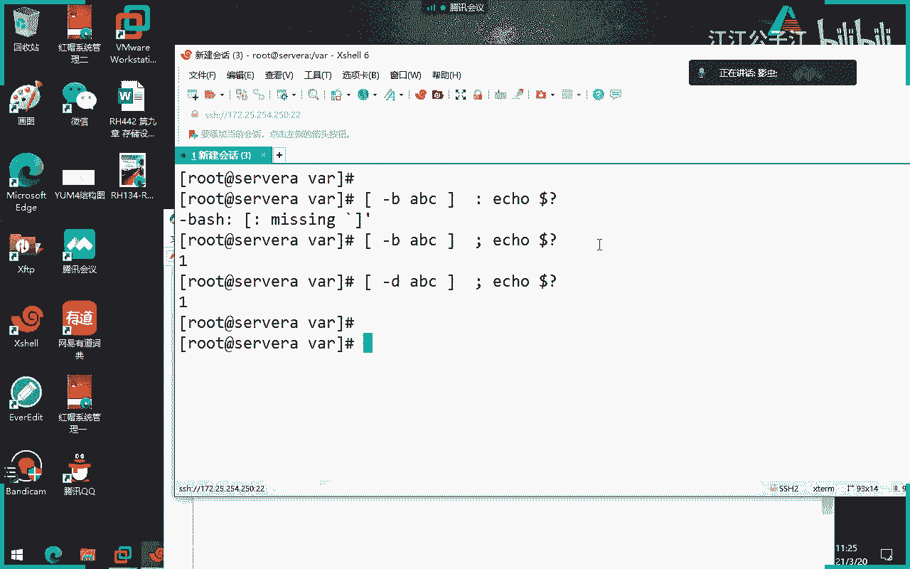

# 红帽认证系统工程师RHCE8-滕老师出品 - P9：第五天 shell脚本 yum源 - KNBIT认证中心 - BV1up4y1h7MA

呃那么今天呢我们要继续讲亚美元啊，要么使用方式来去安装和更新软件包，那么之所以讲一下我们的原因是我们上节课讲过，是由于rpm呢它有一个最大的一个问题，就是他没有办法解决解决包与包的依赖依赖性啊。

所谓依赖关系就是你装一个包的时候，他说需要先装其他的包包啊，所以说这个在生产环境当中会觉得很麻烦，而且有时候一美元的这个呃，有时候二天猫的依赖关系会非常强，你根本就没有办法解决的。

可能有几十个甚至上百个亿的关系，你不可能解决对吧，所以说我们用亚那所谓的亚呢，就是一种能够自动帮我们解决依赖关系的一种方式，其实就这么简单啊，那么要么呢有两种，请注意，要么有两种形式。

第一种呢是本地形式，所谓的本地就是上节课我们自己想就我自己给自己做一个亚目仓库啊，什么是仓库呢，就是里面包含了很多很多的什么，各位i pm所谓的仓库就是里面相当于给你一个箱子对吧。

里面有很多很多的ipm软件啊，那么这种本地的亚美元是只提供给我们自己去使用的啊，我们也知道在做亚美元的时候，你是不是要用base url等于fl那个单词啊对吧，f i l e那个单词指的就是本地的意思。

那么还有一种呢就是我们要指向网络共享的一种形式，就是别人做好的一种亚美元，它里面包含了成千上万的ip包，或者说可以安装的软件包，然后你指向它的地址，然后你每次下你每次想装软件包的时候。

从他那边下载并且安装就可以了啊，那么你来看啊，咱们那个环境当中，无论是我进入到三维a也好，或者是进入到任何一台虚拟机也好，我为什么直接可以用亚明store去装软件。

比如你看我现在直接压不in store，比如随便装一个，比如装一个dot pot d o v e c o t啊，我干y这个软件y就是代表呃直接安装就不不会再问你是否安装了啊。

好你来看我为什么直接可以装呢，就是因为它其实指向了谁呢，指向了咱们环境当中那些叫classroom，那个虚拟机，还记得吧，那么classroom其实在我们的电脑当中扮演的就是亚美亚美半年，下面大家看啊。

你看它自动帮你装什么，装一个dp cod，但是装db cd之前，它会先装一个这个东西，cor看到吗，很显然这个什么car这个东西就是这个软件的依赖关系，也就是说如果你不装那个car这个软件。

我就没有办法装dot cot这个软件对吧好，那么大家来仔细看它是通过这个版本是什么，1。26版本对吧，然后呢呃大小是多少，五点兆和590k对吧，然后开始装给你下载，并且装起来它其实指向的是谁呢。

指向的就是我们的这个那个环境提供给你的一样好，那我们可以知道我当天提供了哪些呢样report list report嘛，就是那个呃仓库对吧，然后我们可以直接回去看一下我们当前的仓库id号。

你看这是123对吧，这么多，为什么有声音有声音，有声音没有吗，qq里面吗，你们听不到吗，那我们呢是指向了咱们环境当中的一个样源，那咱们现在呢啊还有一种办法就是指向，比如说我互联网当中呢。

咱们现在国内用的最多的就是阿里云吗，阿里提供给我们亚特别好用，特别推荐给大家用啊，甭管你是装几乎你现在能够用到的开源软件，亚姆的这个阿里有阿里的那个这个官方网站，都给你提供了一些语言，特别好用啊。

当然了，如果你用红帽的话也可以，但是可能要收费对吧啊，还有一个呢就是呃特别特别用的最多的是那个网易对吧，网易的那个亚马逊也是咱们国内用的比较多的啊，好那么我们来看一下我这台电脑，咱们知道亚美在哪配了。

一定记住是在这个目录下面配啊，一定记住考试也是千万别记错了，别记错了，然后里面呢一定要有一个点r e t u结尾的文件，那么在我们这一题当中使用的是第一第二个第二，因为第一个很显然是红帽的嘛对吧。

咱们是用这个啊，你来看一下这里面写的什么内容，你看他做了两个仓库，这个叫仓库名，这个叫仓库名，然后base u r l呢指的就是你的路径，你看它指向的很显然是一种远程的路径，h t t p吧。

enable等于数据代表是否打开亚美元呢，g d g check等于false，是否关闭校验呢，是的，关闭一定要注意，同学们考试的时候一定要关闭校验，一定要关闭校验啊，你可以不打单词。

你直接打个零就行了，但我们从来都不写单词，直接写个零，零就代表关一就代表k还有你在正式考试的时候，两个东西不要写，一个是我们的name，这一行不要写，一个是我们的enabled，这一行不要写啊。

你要写行不行，当然行，我不建议大家写，因为这样相当于少写一些字母啊，对吧，不用再多浪费事，就只写三行，第一个中括号这一行，第二个base url这一行，第三个g p g check等于零，这一行零啊。

再说一遍，零关闭校验啊，为什么要关闭经验，各位因为如果你打开true的话，你打开一的话，你就要再写一行，把你们k钥匙给它导进去，但是考试的时候不给你提供钥匙，大明什么，你又要校验你有没有钥匙。

因此校验失败永远装不成功，懂了吧，所以考试的时候就会出现这个问题，就是你只要打开校验，你有没有把钥匙导进去，你就永远装不上软件包，所以干脆我们直接force或者是零好吧，一定要注意啊，零好。

那么咱们就跟大家说一下，这就是一个标准的远程共享的形式，如果你把它改成file，后面指向你自己的做的那个路径，那就要改成什么啊，那就是什么本地了，改成本地了，明白吗，本地好。

那么请注意我们如何自己做本地按美元，这是我们的每一个同学要会的，虽然考试不考啊，第一步就是把我们的光盘给它挂载起来对吧，挂在我们光盘是不是就挂载镜像嘛，或者i i i i i o对吧，挂载镜像。

那么第二个呢就是干嘛，第二个就是你要去指向你的样美元的路径，那怎么指向呢，你肯定要在a t c下面对吧，刚才我们进到哪个目录etc下面的这个一点r i p p o。d对吧，然后下面随便建一个文件。

并且叫i report r e p o，然后在里面指向base u r l，写一个文件里面指向u r u r l等于fil开头对吧，后面加上你的指向路径就可以了啊，指向路径就可以了，一定要注意好吧。

懂不懂一定要注意啊，这样做就可以了，这个不光是红包八，红包几都是这样做的啊，宏观七也是这么做的，以前老版本也是这么做的啊，这叫本地一样，原当然不考试，为了你们参加考试的同学，请注意。

你们指向的是考官给你们提供的一个仓库，那也就是说所有的考生都指向了考官有关啊，那么你看的这些题很简单，但是我在这个这么多年的培训过程当中，我发现很多学员亚美元又做不出来，考试我见过好多次啊。

其原因无外乎有以下几点，你仔细听过人机构，你仔细记，如果你们在考试的时候，或者你在工作的时候，发现以下人不成功，第一步检查就检查一下有没有拼错，因为要么你也看你也你也你刚才也看到了。

这里面东西很有可能有拼错的可能性对吧，这里面有很多很多单词有可能会拼错对吧，但这是最低端的一个错误，就不解释了，第二个你再拼一下这个地址能不能拼通，如果ping都ping不通。

那你就知道为什么做不了对吧，那你就知道他为什么装不了，因为你都拼不通嘛，因为你是相当于访问这台机器里面的软件包，但你都听不懂他，第三个问题就是我们gb check，很多人写了一个单词叫一嗯。

就这几个就这几个问题没有别的，所以未来你在考试的时候发现你的亚美颜做不成功，就从这几个角度去排除，一定能排出来，那么所以就要要求大家第一题一定要做成功，因为第一题是配置网络，如果网络都不通。

你的亚比最低，你肯定做的失败，明白吗，各位好，这个就不多说了，这是上节课的一些内容，那么我们最后再来说一下，第一个是亚明斯特装人包，第二个是亚list，是列出所有可以用的软件包。

第三个是要么就是move删除软件包，还有什么咱们学过，还有什么亚马update是更新吧，更新仓库原地址里面的所有软件包对吧，还有什么，sch是吧。

如果想知道我这个圆里面有没有一个软件叫做什么什么什么对吧，search对吧，还有一个呢就是jam history，列出一下之前你做了哪些动作啊，打错了历史记录，你看你刚才做了这个事儿。

这个事儿这个事儿这个事儿这个事儿对吧，咱们做了一些事情啊，嗯而且动作是一个是安装，也是删除，看到了吗，哎这些历史八乡的云，那么还有什么命令呢，就是亚我们说过是不是还支持群组方式，比如说不是一个包。

是一组套件，那是不是叫亚美一group list，列出所有套件，你看这里面列出的都是些什么一些个所谓的一些软件的一些套件对吧，那么一样需要装的时候就要用store group in store。

注意一定要加引号，为什么，因为你刚才看到了软件包之间是不是有空格，那包与包之间有像这个是有空格的，那就要加双引号，如果不加双引号把它引起来，它代表的是两个，对不对，它代表是单独的，那电脑肯定不认识。

那像这个workstation那就不用演了，不用引号了，因为还没有空格嘛对吧，那样ym store m group list，ym group store那样group remove是删除一个套件对吧。

删除一个组啊，当然你说老师这样行不行，也可以，中间有空格也可以写啊，可以这两个点可以连在一块，也可以，空格都可以啊，好这是上节课我们讲的内容，那么从今天开始来讲呢，就本来本来按照这就讲到这儿就结束了。

但从红包八开始之后，我们的亚美元有个特别特别特别大的一个变化，咱们今天就开始讲这个比较大的一个变化，可惜考试不考啊，考试不考啊，那来我们来讲一下，考试不考这个特性啊，但是你得知道知道从哪开始呢。

咱们从下一代稍等啊，在哪啊，在这k4 点第14章，模跨流，来各位从我们的红帽八开始引入，引入了一个应用流的概念，这个单词不应该把它翻译成中文，注意这个单词翻译成中文。

特别容易让初学者以为是一个简单的一个中文，它其实是一个叫app stream这个单词，就这个它把它翻译成中文，叫应用流了，但这个地方不应该翻译，就应该叫a p p stream，就有些它是一个固定的。

这这这种叫计算机的一种术语，它不应该把它翻译成中文，明白吗，但它给它翻译成中文了，所以很多同学以为应用流和a p p stream是两个东西啊，不是啊，这两个是一个事儿啊，明白吗啊是一件事。

不应该把它翻译啊，好红包八当中引入了一个叫应用流的概念，所谓的应用流是干嘛呢，是这样的，各位像咱们以前红包七版本之前，或者是红包期，咱们的软件包只放在一个地方，就叫做package。

你看你把光盘挂载起来之后，咱们所有的rpm包就放在一个叫packages目录里面。

但在我们红毛八里面，你看它放到哪，放了两个地方。

我们来看一眼，我先把光盘挂挂挂起来给大家看嗯，光盘呢等等，我把光盘挂起来给你们看一下，哦已经放好了。

我来给大家挂挂起来这个光盘啊，好我把光盘挂起来，挂到m n t了对吧，这边这个这条命令能看懂吧啊，然后我们访问访问mn t，大家看看到吗，这两个黑色的在这儿app stream和一个贝斯os。

像以前我们的软件包就放在一个目录当中，但是现在把软件包放在一个叫app storm应用流和一个放在base os里面，他放了两个地方好，那我们接下来就来说一下为什么会有两个。

那么首先来讲什么叫贝斯os呢，你看教材当中怎么给我翻译呢，再来说倍增os存储的是一些以rpm格式的软件包，并且是一些核心操作系统里面的一些内容，说白了就是贝斯嘛，基础嘛对吧，base os指的是什么。

只是一些比较核心的软件包，而且里面是不太更新的软件包，据它的生命周期跟我们的linux发行版本是一样的，什么叫发行版本，从8~9是不是一个发行版本，理解了吧，因为倍速os里面的软件包。

它的更新频率很低很低，几乎是跟我们系统一样，什么时候更新，这里边软件包才更新，理解了吗，就是比如说跟我们操作系统相关的一些软件包，都是放在被子os里面的，但是什么叫应用流呢，什么叫a p p呢。

a p比如手机app对吧，是不是各种应用啊，好这里面的软件是不是会经常更新呢，你比如说你看咱们现在微信很快变成八点对吧，是不是像这里面的软件很可能是什么经常更新的，比如说阿帕奇，比如说邮件。

比如说这个我们的ftp啊，比如说我们的这个这个一些ask sci对吧，这些软件啊，这些软件都属于应用，那么这里面的软件呢会比base os的软件更新的频率可能要高一些。

那么像早期没有这种两个存储库的时候，你看现在是两个存储库，像以前只有一个，刚才讲过，以前只有一个目录，那么所有软件包都放在一个目录里面，那现在有什么好处呢，好处就是比如说像这种应用流里面的软件。

我可以随时更新，而不会影响我们操作系统里面的核心软件，理解了吗，就你更新你的跟我的倍速s没有任何关系，而且还有一个好处，就是有时候我们呢作为开发运动员，很有可能这个软件希望有新的东西，他就上不上。

但作为我们的运维人员来讲的话，我是不是为了稳定安全，我能不更新就不更新，那像这种要求怎么办，各位一个软件，我作为月人月人员想更新但不更新，但作为开发人员，他想特别快的更新怎么办，像以前没有办法。

因为以前就一个目录嘛，一更新大家都更新了对吧，但现在没关系，有了这个应用流这个仓库之后，你们我就可以针对不同的人，不同的工作环境来进行对同一个软件包不同的使用方式，你比如说你还装老版本可以啊。

那个人他可能想装新版本版本为什么，因为他可能是测试啊，或者是开发人员，那没关系，我们可以跑到应用流里面去找软件好，那接着这个应用流当中还有一个重要的概念，就是我们刚才说的版本的意思。

但这里面翻译成叫模块啊，所有的模块是什么东西呢，注意所有的模块你可以把它理解为是是是是是版本的啊，你你可以理解为什么模块就是属于一种啊啊不是不是说错了，这个流是属于一种版本啊。

啊这个stream把它翻译成版本啊，版本你比如说每一个模块里面啊，每一个应用，每个软件里面它都有不同的这个版本嘛对吧，那你原来是大家都一个版本一更新，大家都更新了。

现在有了这个流这个概念就可以针对不同的版本来去进行操作啊，进行操作好，然后还有又引出一个新的概念叫模块啊，你看咱们现在这个这几个概念有点模糊啊，我们先来说一下，一个是应用流，它跟倍速os一样。

它属于一个两个仓库，这个仓库存储的是跟系统相关的各种软件，而这个应用流呢存储的是什么各种应用方面的，比如说刚才讲了什么阿帕奇的ftp好，所谓的流是什么意思呢，流就是针对不同的软件，不同的软件。

同一个软件的不同的版本的，所谓流就是版本的意思，你把它翻译成版本啊，好那接着又引出了一个叫模块的概念，模块是什么东西呢，模块是一组软件包的集合，一组软件包的集合，明白吗啊一俗软件包的集合。

这组软件包是为了干嘛，是为了做统一的事情而产生了一组软件包啊，你看它属于一组整体的协调一致的rpm包，那也就是说这个模块里面其实底层还是rpm吧对吧，组成一个模块好，接着他又说了一个叫模块流的概念。

你看这很很晕啊，这个教材好，那所谓的模块流就是什么呢，刚才讲过模块是不是一组软件包啊，那模块流就是一组软件包的不同版本，好你看你看你看每个模块具有一个或多个版本，你把这个翻译成版本。

其实不同的版本可以干嘛，独立的自己更新，你比如说一个软件包十版本，一个软件包是九版本，那么你十版本想更新是你的跟我九版本没有任何关系，就可以独立更新，理解了吗，各位好，那讲到这儿了，我第一次在学的时候。

就我们第一次拿到这八点教材，在备课的时候就特别晕，因为我拿到这个中文版啊，看了看了看了半天，就是觉得很晕啊，怎么办呢啊终终于有一天我理解了我。

为了让大家也能理解我，因此我自己画了一个图片，你看了这个图你就懂了。

放大了吧，我给大家画一个图片。

这个图片我在上节课就用了，然后我也分享给大家，我们一个一个来解释啊，各位首先呢要跟大家说的是，咱们红包八当中使用的亚是第四个版本，这个是我刚才没讲，先跟大家解释一下什么八的亚美元啊。

亚这个工具使用的是第四个版本，那言外这就是以前红包三是用三版本对吧，使用三版本，那么样四版本呢使用了一种新的技术，是叫dnf，那大家也不知道有多少人听过这个单词啊，dnf啊也是从红毛八当中。

我们亚原使用是基于dnf的技术啊，其实咱们现在用的命令叫亚明store，亚remove对吧，直接命令，其实啊各位它都是一个软链接，指向的是谁呢，指向的是dnf。

所以说你未来在工作当中看到人家用dnf install dnf remove是一模一样的，大家看我不知道上节课给你们展示了没有啊，位置一样的，大家看到吗，它其实指向的是谁，各位指向dnf。

所以你看我们刚刚学的dnf install一个软件包也行，明白吧啊我这就跟大家说一下啊，好咱们红包七当中使用的三版本，红包八当中使用的是四版本好么，四要么四版。

要么这个四版本呢在在软件仓库这个方面呢变成了两个，一个叫贝斯os，一个变成了app stream，这个能看懂吗是吧，呃我们再说一遍，贝斯s里面都是些什么包，都是一些更新频率比较低的一些什么。

跟系统相关的一些核心软件包对吧，而a p p里面都是什么，都是那种更更新频率比较多的，都是些什么应用方面的软件包，比如说我们的web服务器啊，dns服务器就f t p服务器就各种应用吧，能理解吧。

好一定要注意，这是两个不同的，然后紧接着app storm当中有两种形式提供给你，一种形式是以二篇包的形式提供给你，一种是以模块的形式提供给你，现在想到这能能听懂吗，好什么是模块，我问大家什么是模块。

模块就是什么，就是一组软件包的集合，r9 s的软件包是什么，软件包，什么格式，rpm对啊，很好啊，就是你看a p p storm里面都是一些应用里面有模块的形式，好模块下面又有一个概念叫模块流。

模块流是什么意思啊，那模块里面又有一种概念叫模块流流，模块流就是代表的一个版本的意思，听懂了吗，你看咱的教材讲的很很乱，但你看到图片就应该能看懂了啊，我再说一遍啊，这个模块指的是一组软件包的集合流。

指的是这个模块的不同版本可以独立更新，不影响其他人，不影响其他的流，不影响其他版本的流，明白了吗，哎就这个意思，现在讲到这儿能听懂吧，好那我们再继续书上教材当中又给我们出现一个新的概念，叫什么呢。

叫模块的配置文件，这边的英文教材不是这么翻译的，各位英文教材把配置文件翻翻译成两种形式，未来你在读英文教材的时候，你看配置文件有两种翻译，一种叫configuration file。

还有个叫做prefer，注意这个单词prefer，你要把它翻译成配置文件，咱们这边的英文教材写的是profile这个单词啊，但是咱们俗称叫配置文件，你不要理解为是这个配置文件啊，不是这个不是这意思啊。

好吧好这个profile好，那么什么叫做模块的profile文件呢，来一套所谓的模块的profi文件指的是什么呢，每个模块可以有一个或多个配置文件，配置文件是为了特定的实力一起安装的某些软件包。

注意单词在这列表，那么有哪些常见的用例呢或实力呢，有服务器的，有客户端的，有开发类型的，有最小化安装的，如果你看英文教材，你就不会晕了，但中文教材会让大家觉得很晕，什么意思，就是我们这么理解啊。

这里指的是什么呢，每一个模块又有不同的配置文件，你可以是服务器版本的，你可以是客户端版本的，你可以去开发类型版本的，你可以是最小化安装版本的，明白了吗，他是这个意思啊，这个意思啊就相当于什么。

就相当于咱们拿了一个软件，它有最大化安装，自化安装，普通安装自定义安装，懂了吧，这个大家能理解了吧，好所以说你看我下面再接着讲这个图片，大家看模块下面又有profile文件配置文件配置文件是什么意思。

是一组软件包的列表，比如说你最小化安装的时候呢，各位想想，如果是最好安装，是不是只列只装这个模块的里面的几个软件，那如果是全新安装的，各位是不是把那个模块里面的所有包都装一遍。

那如果你是选择服务器版本呢，那就只装这个模块里面关于服务器相关的软件，那如如果是客户端版本呢，就只装客户端方面的软件，这个大家能理解了吧，好这就是咱们今天要讲的这几个概念来好，我暂停一下，有没有听不懂。

因为如果你听不懂，待会命令你就不知道怎么用，各位这里面每一个每一个方框里面的概念你都要懂，不然的话你待会就不知道命令怎么用好我，我如果你们懂的话，我们来看一下这个事儿，我怎么去改这个这个这个这个模块。

它的这个配置文件啊，大家往下走，先走一下，看一下这个单词，看看有没有啊，稍等我看一眼哎，在这各位这就是配置文件，咱们拿这句话来举例子啊，你把这句话看懂就明白，要model install。

很显然装的是什么模块，注意啊，如果是亚密斯store装的就是咱们上节课讲的东西啊，这个意思指的是装模块好，装什么模块呢，注意看他装了一个python，而且是什么模块呢，python 36模块。

而且用的是哪个版本呢，也就是哪个流呢，3。6这个流就是指指的stream好，后面加个斜线，common指的就是你用的是哪个模块的配置文件，它使用的是这个单词，翻译成中文叫什么，是普通是吧。

对吧哎一般对吧，普通他所谓的就是使用的是普通安装好，那整体来讲就是我要安装一个模块叫python 36对吧，然后我使用的是什么流呢，六这个这个版本流就是版本啊，我使用的是python 3。6这个版本。

并且我装3。6版本的普通安装，听懂了吗，好注意用斜线啊，同志们看斜线后面加profile就是配置文件，那么咱们其中一个配置文件是common，当然还有service叫服务器版本。

还有client client端，就是客户端版本最小化版本，懂了吗，待会我都可以去看一下啊，就在这儿，同志们就在这就这个看它使用的配置文件是com最普通的，明白了吗，好理解啊，一定要注意，一定要理解啊。

理解理解你就把流翻译成版本好吧，你就为了理解哈，你就把流想成版本发文件呢，想成版本里面的这种不同的安装形式啊，就跟咱们那个怎么说office一样是吧，你看你装office是不是你可以全线安装所有的装。

你也可以自定义装某个软件对吧，哎就一个一差不多了，差不多的感觉好，讲到这儿能听懂吗，这幅图片我待会发到群里面，如果你自己回家看，哎，又晕了，你把这个图片给我拉出来对照一下就不用了，好吧，好了，兄弟们。

希望大家回去看这个图片，我没删的原因是有时候我时间一长，忘记了，我自己备课时突然忘记了，我就会看一眼啊，我也会忘，很正常好，那接着我们来都懂了吧，各位啊，那如果你都懂了，咱们直接来看命令。

从头到尾看命令，各位从头到尾看这张有点有点，你说难吧，也不难，你就说这就是有点晕啊，来咱们从头开，第一个就这个不用我解释吧。

亚明store young module list是列出所有模块要压model install是安装某个模块对吧，这个不用解释，就跟ym list一样一样对吧好，但是问题有几个概念要跟大家解释清楚。

各位虽然说这个命令很简单，但是里面有几个输出值，你不一定能看懂，咱们来看，首先name这一行指的是什么，这一列是不是指你的魔化的名字对吧，这个我不用解释好，那这个呢这是版本吗，不是说了吗。

模块下面有留啊，对吧好，然后这个是什么，刚才翻译成中文的配置文件，后面是一个这个不不解释的，就是相当于描述信息好，但是问题是为什么有的带带方框呢，注意带方框是哪个单词呢，d d是什么意思啊。

d是default，注意这句话意思就是各位，如果我现在给大家写出来这句话，就是当我去装这个nt软件模模块的时候，如果不指定留它默认安装的是1。10这个六这个版本，并且如果我不指定它的配置文件的话。

它装的是common这个配置文件，听懂了吗，同学们，这d是default的意思，就是我如果装模块的时候不指定版本，它就在用d那个帮我去装，如果不指定补发文件，他也选择那个带d的补分号文件，ok吗，好。

那e是什么意思呢，意指的是我打开某一个模块版本，enable disable呢，就是关闭某一个模块的流版本的，那i呢就是已经被注意啊，这e d e d指的是完成时对吧，指的就是我已经被安装了，被安装。

比如这边讲，举举例子，比如说这边有个括号写了一个i指的是什么，只是此时此刻这个container tooth，这个刘已经被装了1。1版本，为什么，因为后面有个i听懂了吗，同学们看懂了。

所以你一定要能看懂，不是说只记命令，只记命令没有用啊对吧，你记命令有什么用，好继续，那各位这句话什么意思，同志们，你通过这个图片，你你能给我得出什么概念来得出什么结论。

你是不是也得出了一个我只想看炮这个模块泡，大家知道吧，这是个编程语言啊，炮好它默认情况下，如果我现在直接，如果把现在这个单词换成了in store，它最后会装什么版本呢，5。26吧，很好明白吗。

哎你看有comment的版本，这是什么单词，这个单词怎么念最小化，懂了吧，也就是说我如果这边是个d的话，那就是最小化，但很显然它不是，它是在call门，也就是说我如果不指定它fer文件的时候，就是5。

26的流以及common这种profile配置文件，听懂了吗，同学们非常简单吧，现在能理解了吧啊好那后面就不再一带着大家解释了，当然了，这就是干嘛in for就就information看信息的对吧。

看信息好，不解释了，不解释了好这个也是啊干嘛，很显然是为了查看某一个模块对吧好，那接下来我想这样子，你比如说你看各位，我现在此时此刻装的是5。6，因为他后面有个default嘛。

哎那你说老师我我我现在变了吗，哎我现在由于工作原因啊，我们我们不能装那个最新版本，我要装老版本2。2。4，怎么办好，你要先给我干这样一步干嘛，如果你想装某个，你必须要先启用某个流才能安装，啥意思啊。

什么叫启用，就是你想装老，你想装某个版本，你得先把这个版本给我提起来，懂了吗，好，那么怎么去写呢，就是enviable活动这个单词，你看你会发现这个单词其实蛮有意思的。

in store安装enable是开disable是关闭，对吧好，那你看他这句话是什么意思，使用默认流和默认，你看他现在直接就装啊，这个单词就是装啊，注意装它后面没有加版本。

就会指定装default那个版本对吧，default版本，你看各位他装完了，并且它这边有个d，你看有个i吧，i说明他已经装了啊，装那删除模块呢就是亚model remove对吧，remove啊。

那么还有一个是切这个切，那怎么理解呢，就是相当于把呃切模块，通常需要将内容升级或降级到不同版本，有点类似于什么从一个版本切换到另一个版本啊，这有点类似的感觉，为了确保顺利切换。

应首先删除模块流提供的模块，删除模块的配置文件，所安装所有软件包以及这些软件包的依赖关系，这样吧，咱们直接来做个题目，再来做题目，来来来解释吧，直接来做题目，来我直接来教大家怎么做题目啊。

然后我们直接用那个客户环境，首先在workstation当中要敲这个命令，我们之前讲过，这个命令是一般都干嘛用的，是为了生，是为了生成本章实验环境，对吧好。

你只要看到带lab的命令都是在workstation当中桥一定要记住啊，包括以未来你上c c课程也是只是为了生成本章实验环境，你千万不要随便敲，一定要在我给的这个环境里面敲啊，你们在家别随便敲。

我们只要在题目的都在管理员这个用户来做啊，因为教材当中用的是学生，教材当中用的是学生，但我们都直接用管理员来做好，敲一下，so这不我我都不知道好，你看他干嘛了，他做什么事，各位他是不是开启了一个仓库。

并且装了一个包，叫做post grave circle，他给我们装了个包啊，很显然不是包是个模块对吧，他装了一个这两个，一个是数据库的9。6版本，一个是python 36的3。6版本，看懂了吗。

他就帮我装啊，他帮我装，然后大家开始做题，在哪做呢，在哪做，他说了在哪做，在sa当中做，那你就要在server a当中去做，直接动到管理员，直接用管理员，直接用管理员，不要用别的，不要用别人。

那么我们来看一下题目，你看他你说恶心吧，他用学生蹬过来再枪声管理员，那你不如直接用管理员了，对吧啊，但是人家这么做是有是有是有好处的，从安全性角度来讲的话，他不希望你直接用管理员啊。

首先呢它开先列出一下可用的模块和硫，怎么练呢，就这么就这个单词啊，我就不敲了啊，你看它中间那些带点儿都代表省略，那么你会发现咱们python有两个，一个是这个流，一个是3。6这个版本的流对吧。

然后呢加上杠杠installed指的是列出已安装的模块和已安装的流啊，这我也不列了啊，那很显然带i的都是什么，已经安装了对吧，很显然他装的现在什么版本，9。6版本，并且使用的是这个bug下面板吗。

他没有装clem版发文件，它指的是server，而不是指的是clid，对吧，好，让我们一ing for来确定一下，果然是他装的是版本不对，有问题吧，他不是装的server吗，为什么这边显得扣啊啊。

数据数据库数据库嗯好吧，那我们来来这从从头到尾做一下吧，好那我们开始装一个软件包了，装什么呢，装了一个python，这个这个屏幕有点意思啊，咱们来装一下，直接装啊，亚马，python 36冒号3。6。

诶这么快，装过了是吧，那行吧，那我们来瞅一眼，错了打错了，你放，是吧，是不是装的这个对吧，哎装的这个，那接着呢他要求我们干嘛，他要求我们切换一下server的配置文件哦。

他开始就刚才我们装的是python，现在开始做这个事了啊，现在呢此时此刻我们如果你直接看这个数据库的话，用的是9。6对吧，如果你直接看数据库，用的是9。6模块，你看他现在此时此刻启用的是9。6对吧，9。

6，并且安装的是server版本，但是题目当中要求我们干嘛切成十版本对吧，你现在用车了，现在给我切一块十，怎么切呢，他他是这样做的，他没有直接切，他是先删除老的版本啊，那我们也跟着他一样，直接删吧。

直接删，你看他上的9。6吧，因为你撞了9。6嘛，对吧嗯，ok你看现在只是e了对吧，只是e是enable的意思啊，然后接着呢我们做一件事，这个注意就respect reset，重置我们的流。

让我们重置一下，然后再来看一眼它会不会变成十呢，对吧，那你在装呢，这时候装的时候我要不要再指定，其实不指定也行吧，因为你已经是变成十了吗是吧，我如果不指定的，直接装试试，不是已经湿了，就会有个i吧。

那各位比如说咱们现在这个题目就结束了，如果我们我们现在我自己想扩展一下，我先把它删掉呃，打错了打错了，我把它删掉，我们扩展一下这个题目啊，嗯如果我现在我撞的时候，我我想指定，侧写配置文件啊。

我就可以这么怎么做好吧，大冒号是不是得这样，比如这样装客栈端，是不是这样可以诶，你不能不行吗，我打错了吗，就这么写诗吧，是直接在后面写还是猫好，是冒号吧，冒号是对的啊，哎呦我的个天，很显然包要少很多啊。

装的是屎吧，应该是i看到吗，client哎他们会出现2mm，明白了吧，就是你想这样说，一定要注意这个命令，首先冒号加的是流，后面斜线加的是配置文件，你怎么知道配置文件是clid。

我也不知道我是类似列出来的吗，谁能知道谁能知道你哪个模块是什么配置文件，你得列出来啊，比如说python 36有哪些配置文件，不知道看一眼哦，原来它有build comment这两种。

它这里面就没有client和service了对吧，你得先列一下啊，好了，这就是今天的模块，60页，讲完了，考试不考，但是你知道就行了，好后面咱们就不做了，那接着我要跟大家讲的一件事。

就是由于咱们红包八把软件放到了两个目录，你自己在做本地假名的时候，请注意同学们要做两层目录哦，不这就叫做两遍吧，一个叫a p p那个目录和一个贝斯os目录，所以你看咱们的课程当中呢。

题目里面还有课程里面他给我们做好，是不是也是两个，一个是被作s，一个是a p stream，但是两个懂了吗，它也是指向量，那样未来我们在参加考试的同学，请注意这个路径会给你两个，你给我做两个点。

我以前的同学问我，能不能把这两个做做在两个不同的r e p u文件里面，好像我没试过，但我不建议你们坐，你们还是坐在一个吧，做成两个ip，好吧好，我来统计一下，考试的时候，首先进到这个目录里面。

然后删掉所有，有没有你都给我这样把这个命令删掉所有，然后自己新建一个，比如说a。i p里边写哈里面那堆东西听懂了吗，一定要先把那个里面的内容给我清空，有就删掉没有，那就反正敲敲都没脸给我清空。

清空所有内容，然后自己做一个ip啊，然后里面指向刚才那一堆东西，当然这一堆东西都是考试会直接给你的地址，不给你地址，我怎么知道指向沈阳的，明白了吗，各位好，这里是亚马原，讲完了。

这是上节课遗留下的小尾巴，你暂停一下吧，那第二本书的环境跟大家说一下，跟第一本书没有什么区别，几乎没区别啊，来看一下这个图片，那么之前咱们上课我给大家看的图片，有的图片吗，咱们第一天还有印象吧。

但那时候图片是老的八点的课件的图片，这是新的8。2的课件，你会发现它多了一个什么，原来只有server ex 2 b吧，它多了一个听着听。

注意咱们现在环境也有啊，只是我当时图片当中没有注意，咱们现在的环境是有有天地这个机器的，你看是有这个utility，咱们只有当时只有堡垒机，workstation server a s b。

但咱们现在有了。

只不过我当时的图片没有，因为我还用的老的教材，给大家看的是全英文版的正版教材，你看有了utility这个机器是干嘛用的呢，是为了讲最后这本书的最后一章容器需要使用它，然后咱们不是8。

2可能加了一门容器课程吗，这个机器是为了待会儿讲容器课程用的好吧，唉所以说你现在不用管它了，你现在知道有这个机器好，那么同样这四台虚拟机连到的网络是1200。25。250，中间那个机。

或者相当于它是充当路由器，它连接了172。二五点252点网络和250的网络，这个环境跟我们现在环境一模一样，1234这本书你知道咱们大家咱们现在课程叫什么了，你们第一本书叫124啊，第二本书叫134。

第三本书叫294，这个知道吧，你别上半天不知道上的哪门课啊，理解吧，咱们134的环境跟124是几乎一样的，但最后一本书1294的时候就会多一些虚拟机就不一样了，到时候我们再来教大家怎么去切换环境啊。

现在就不用切了，因为现在这个环境是那个第一本书是一样的，就没必要切了，2p地址给你，给你这个这个正版的好处呢，就是你可以直接复制一些东西到我的虚拟机里面啊，好这个就不解释了，包括这些东西都会了吧。

重置虚拟机啊，这些东西都会了啊，好那我们来看一下第二本书主要讲什么内容啊，讲什么内容了，同志们来看一下第二本书的第一章，我们主要讲的是bshell的script脚本和变和多种的什么多种的工具对吧。

还有一些工具，还有一些变量，还有一些grape meaning，教大家如何写一个简单标准的脚本脚本啊，并且如何应用，我们用这个loop是指循环，如何使用循环语句来做脚本，明白了吗。

哎也就是说这一章我们讲的是脚本，虽然说只用了几章，但是你得好好听，给大家抛砖引玉，回到家之后，你们买一本shell脚本的书啊，shell脚本书不可能只有一张吧，肯定人家几百页了对吧，好好学。

咱们现在只是引个头啊，所以这一章主要已经汇成一句话，脚本sucps，每一个做系统管理员的人，这一章都应该好好学，其实我个人认为前面就是都没有这一章重要，但你老师前面中文不学行不行。

你如果前面那些章节你不学这章，你反而听不懂啊，所以说很恶心啊，这这你你得知道啊，视角脚本，那么需要脚本是干嘛用的呢，一般情况下为了视觉脚本就做一件事，自动化运维，简化管理员的工作。

你比如说你比如说我我们在生产环境当中，咱们所谓的运维啊，各位不是让你报个笔记本去连个网线去调，当然了，这是工作范围之一，最多的是干嘛，运维当中最多的是维护啊，谁能天天让你搭建阿帕奇上，你到一个公司。

从早上八点到了，到了下午六点，阿帕奇怎么可能主要是已经做好的环境嘛对吧，除非咱们公司是新的一个部门或者新的一个公司，要要求你从头到尾搭建一整套的环境，但其实你来到一个公司，人家环境已经早就稳定好了。

那要你干嘛呢，让你去进行维护，那怎么维护呢，是用脚本来维护，如果你不会交呗，你会发现第一个你工作几乎找不到，我可以肯定告诉你找不到工作，第二你找到的工作都是那种低端的，不需要用脚本。

比如说只有3000多块钱，4000块钱这样的工作，随便拉了一个，稍微学两天，利用死人就可以干，比如说做个水晶头啊啊，给他重装个系统，这样的工作他当然不不需要脚本了，你只要是有编程，带有编程东西的东西。

这种这种工作一定不可能这么低端，肯定工资要高，所以说要求也要高啊，现在我们做运维的同学不只要会一个语言，吃药，脚本就已经不是要求了，就他认为你已经会了，咱们还要学python吗，各位没有没有骗大家吧。

是不是还要学python，python是不是得会，第二是不是还得学自动化，就咱们第三本书什么，所以说整体而言对我们现在的系统运维人员要求越来越高了，你起码会三种语言，社交脚本，python和自动化。

但这三个都是为了做自动化的，只不过场景用的不一样和效率不一样，shell呢虽然说它没有python强大，但是要确是很好用，而且入比较入门，为什么，因为shell里面全都是咱们cs学过的各种命令。

就算你没有学过shell，脚本成本，你给你个脚本，你能够起码你能看懂40%吧，能看懂吧，但如果给你个python，你没学过，你可能10%你都看不懂，理解了吗，所以说这个shell是必须要会啊。

那我们就来学习shell，下次有人问你是干嘛用的一句话，简化工作，简化那种重复性的工作，好吧好，那这段因为咱们就不看了，但就是就是我想跟大家表达的意思啊，那么我们用哪个东西来去做视角脚本呢。

那肯定要用编辑器嘛，加了两个电器，一个叫vm，一个是这个，这个咱没学对吧啊，没学就不用，那么咱们就用vm去编辑啊，编辑器，同时呢它什么带有颜色图标，高亮了就只是vm，那如果是vr有颜色吗，没有啊。

都是黑色吧对吧，所以他建议大家用vm使用高亮的形式，而且还有好处，就是如果单词拼错了，通通过颜色可以直接一眼判断出来哪一行有错误对吧，尤其啊各位等到学第三本书的时候，你你如果不用vv vm。

你用vr的话，你会发现你的排错了，这个效率会很低啊，你这个一定要注意啊，好吧好，那么怎么去写shell脚本呢，不压兵器，打开试要不要脚本的第一行要写这句话，这个英文我肯定不会带大家念啊。

因为我英文也不好，那么这个shell脚本第一句话指的是什么呢，井号叹号翻译把它念成shub，那么这个单词指的是我使用的是并败，是这个解释器来解释下面所写的各种命令和各种语句。

首先注意shell脚本的第一行一定要写，这句话指的是我下面所有的脚本是通过by是这个shell来做解释，各位各位有拜师这个事啊，是不是还有别的事啊，咱们之前讲过，但是不需要的一种啊。

只不过现在是lemon中用的最多的就是bh对吧，你看你去书店买书都是by是shell脚本，他们有说k是要脚本啊，那有没有k是要有啊，各位k k shall啊，还有b share。

还有c sh s h shell，各种shell，但咱们用最多的是bh shell，所以这一行的意思只是我用bshell这种东西来解释下面的所有语句，注意第一行当中的井号叹号不是注释。

只要是出现再有次有井号的都代表注释不生效，听懂了吗，对只有第一行的井号，没有任何不是注释的意思，而且是井号叹号，你别忘了是叹号，井号叹号叹号井号了啊，是井号开头好，这个单词叫沙棒啊。

那么你说老师我不写行不行，我可以告诉大家，其实我写脚本从来不写，那为啥没关系，因为你此时此刻咱们用的是什么，你不写，其实用的是谁，不还是拜师吗，咱们现在是不是拜师啊，各位对吧。

就就是你不写第一行其实也能运行，为啥因为你此时此刻用用的这个白色的这个东西不就是败事事要么，所以我们来写个脚本啊，下个目录吧，就这样吧，咱们在这儿好吧，这个小本小本叫一叫什么点s是吧。

一般脚本名字叫点s h，但注意不是不是说点s h它就一定是脚本啊，就习惯性的，而且呢他得得得得得得得有什么权限才能运行回事，哎我靠，打错了，没事也可以啊，你看第一步干嘛，井号叹号。

并下面的bh言外之意就是下面所有的东西都是通过这个它来解释的，明白了就这么简单好，那么怎么去执行一个脚本呢，我写完了吧，写完了对吧啊，经过一番努力，我终于把我的视角写文写好了，那我怎么执行呢，第一个不。

你们刚刚告诉我，你不复权，你怎么怎么运行，所以因此用change mode把一个命令加上一个这单词，什么意思，执行权限吧对吧啊，还有一种形式呢，干嘛这啥意思，看这是什么意思。

我教大家看英文教材一定要看关键字，同志们，因为你英文不好啊，我没有伤害大家的意思，如果英文不好的话，要看关键字，比如说你看这个称轴呢，很显然干嘛改变，有人一看知道吗，这个吗，这边所有人嘛对吧哎对吧好。

但但但是一般情况下我们都是干嘛给权限这种方式，懂了吧好那么还有一个问题，如果我希望我的脚本在任何目录下面都可以执行，你是不是要引用咱们之前所说的pass这样的一个环境变量啊，还记得吗对吧。

我如果希望只要在任何目录当中都可以执行，而不是每次都得跑到你这个脚本所在的路径，执行的话，我是不是要引用这个path变量，有两种办法，第一种把你这个脚本所在的目录放到这个pass当中。

但这种是绝对不推荐，第二种就是什么，你直接放到一个pass里面的某一个目录里面不就可以了吗，咱们一般会放到哪儿，u s，ok咱们来搞一个啊，同志们，hello，echo，hello，经过不断的努力。

我终于写出了哈洛的，同志们，给大家一个权限啊，哎如果前面不加什么什么x就代表什么，加x2 懂了吧，就上面都是x所有都有x就a加x底，诶，怎么诶，这不是绿色吗，我这个颜色没调啊，大家大家别被我迷惑了。

这应该是绿色啊，同志们，他有这个配色配的不太好啊，这是绿色啊。

绿色不绿色，看不清了啊啊不管了，先来执行当前路径下直接执行，直接执行，hello，又出来了，就这么简单啊，这么简单还是配回来了，这个大家看不清啊。

就直接执行了，好或者是干嘛，这是什么路径，这样写是不是全全绝对路径，就是绝对对象好，那么刚才说过怎么样去在任何目录下面直接打s h呢，他这样打肯定说什么，各位如果这么打，会跳出他报什么错。

猜一下看一下下，找不到文件，因为根本就没有嘛，那怎么办，两种办法，第一种我可以这样做，pass这个变量，然后定义出新的变量怎么办，各位同志们，我怎么定义，这教你啊，拼音pass这句话能看懂吗，没听到啊。

p是pvt是吧，t是第一个单词，p t是注意第一个单词指的是变量名字的，是第二个单词指的是老了变量后面追加了一个新的什么，这个对这个井号不是这个美元符号。

path才真正的变量path这个只是我的变量名叫path，因为老的path里面追加一个新的路径叫v啊，可以吗，当然可以啊，大家来看我们再来看一下，多了个v啊。

那这样子我是不是在任何地方都可以直接敲s哎呦呦呦呦呦，s 10退了吧，我我不建议大家这么做，为什么各位为什么为为什么不建议大家这么做，从理论上可以ok没问题，为什么不建议大家做，你想过没有。

如果vr下面海了去的脚本，那怎么办，那是不是里面所有脚本都可以直接运行，是不安全是吧，明白吗，就是如果vv r下面有很多很多脚本，那你这样做相当于什么这个vr下面所有的脚本是不是直接人家ok了。

直接执行了对吧，那怎么做，教大家这么说，你先把哎怎么取消一个脚本，大取消一个变量，那我我我刚才定一个pass变量，我想取消on set，很好啊，ok大家再来看里面就没了吧，我靠坏了坏了坏了。

我错了错了错了错了错了哎呦，怎么能这么搞，赶快退出啊，错了错了错了再见，因为这种定义它是不保存的，你知道吧，ok啊，吓坏了，不应该这样啊，那我应该怎么办，同志们，你应该这么说。

我们不要在拍这部路径下面追加任何东西，咱们直接把刚才你写那个脚本写在哪，会写在vr吗，考到哪不是考到这不就行了吗，同志们，考到一个目录里面，当然不一定考到usr变logo。

usr logo变考虑usb的，因为usr bin是几乎所有用户都可以读取的配置文件啊，都可以读取的路径，如果我把它拷到u s s b，我想问大家，普通用户能能能能运行吗。

不能因为我知道s是不是管理原理，思不就是特权用户的意思，系统账户的意思对吧，所以说你最好放到usr b下面哦，这个时候怎么办怎么办，直接预警行呗，明白了吗，这时候教我们就可以运行了。

所以说他刚才噼里啪啦噼里啪啦说了这么一堆话，你看不懂没关系，你只要看到派四变量就知道啥意思，明白了吗，同学们，所以你看你学东西要要相通啊，各位你学东西一定要把它通起来，就是为什么要学px变量。

就是为了引用的时候直接不需要加上绝对路径啊，过了吧可以吧，什么位置，echo echo指的是看一个变量的路径的值啊，值你看如果有时候变量咱们还要学一个新的东西，叫什么呢，叫转义字符。

注意转义字符是干嘛的，干嘛用的是这样的，咱们有时候啊遇到一些特殊的字符，你得你得把它给屏蔽掉。

啥意思呢，是这样的啊，各位嗯，咱们没有学过这个正则表达式啊，咱们比如说我想做一件事，我想打印出一个，诶他怎么打印不出来，就是我想在屏幕当中过输出这个斜线，这个大家能听懂吗，但它不出来，哎这是什么变量。

以前说过什么意思，p s2 就相当于命令他，他以为你命令没有输完，你知道吗，因为当我命令没输完的时候，我们一般习惯性的按一个斜线拐回来再输，他以为是这个事，我本意是我只想打印出斜线，那怎么办。

ok这是特殊字符吧，特殊字符，所以接下来我们就要学习一下如何打印出这个特殊字符，把那个特殊性给它屏蔽掉，我们以前都玩过三国杀吧对吧，有些是说你你是有特殊身份的人，他就没有咱们把他的特殊身份给他屏蔽掉。

对我们要把它特殊设置屏蔽掉，需要用三种办法，第一种斜线，第二种双引号，第三种单引号，有三种办法屏蔽特殊性，第一个是斜线双引号，第三个是单引号，请注意斜线跟单引号可以屏蔽所有特殊性，但是双引号不可以。

双引号只能屏蔽某些个一些的，但有哪些它不能屏蔽呢，比如说一个典型的就是遇到美元符号，它屏蔽不了你，咱们不看教材，咱们直接来，你看我想我想打印出斜线，那怎么办，就应该斜线，可以吧，哎还有什么叫斜线斜线。

同志们，第一个斜线是什么，为了屏蔽吧，然后哦那他把弦线打印出来，那同样咱们可以再来一个用哪个单引号试试，那双人号试试行不行，不知道试试呗，我也不知道为什么不行哦，那你记下来双引号遇到斜线不行。

你因为因为刑法咱们就不不记得吗，咱们只记得特殊性了吗，好那双号遇到谁还不行呢，再来看我要美元符号，各位我这样子是什么意思，别人打印出四美元，这样做它会认为什么是什么，我们先学过的，到了四代表什么。

学过的，上节课哪个变量变量只读变量z定义变量和位置变量吧，他就以为这是第四个位置变量，但是错的，我们就想干嘛，我们可以这样做对啊，但是同志们，如果你用双引号就不行了，它又变成了美元，它又变成了变量了。

双引号遇到美元符号也没有办法屏蔽特殊性，记一下，同志们，这种特殊性记下来，我们今天想办法，咱们今天现在几点，今天上午就讲这一章啊，咱们就讲视角脚本，这一章不讲，定要好好学脚本啊，好总结一下。

直线和单引号可以屏蔽任何特殊字符，这是第一句话和单引号可以屏蔽任何特殊字符，什么屏蔽，就你把你那个特殊字符一些特殊性，你给我屏蔽掉，你长什么样子还是什么样子，而双引号遇到美元符号。

3号斜线是不可以被屏蔽的，不行啊，碳化碳化还有碳号。

说错了应该是，我记得是太好了，来一个吧，就不太好了，诶不是诶，我记得我们老是脑子里就会有个叹号了，那别记叹号了，别记看号了，别记太好了，也双引号遇到美元符号和斜线的时候对吧，那斜线的时候。

那它长成它是没有办法屏蔽的对吧，我给大家评评，好中了一定要记住啊，好那个老师，我为什么要学呢，因为在写脚本的时候注意咱们有时候会遇到这种特殊字符，如果你不加这种屏蔽符号的话。

他是不是把它的这个特殊性给你打印出来，而不是打印出它本身的样子对吧，那有时候我们我们就会想到，那干脆不学双引号，不就行了吗，我我我就只要说一个斜线和代号不就行了吗，不是有时候啊。

你还真希望它有特殊性怎么办，那你就得用双引号了，明白了吗啊要看你的脚本而定，所以请注意啊，好这一章就结束了，这小节结束了，你看他说这句话啥意思，各位干嘛的，那如果他不加斜线，他这个井号是不是出不来。

不来能看懂吗，如果他直接这么做，他的警号是空的，但如果加了斜线，好好或者加什么单引号，这句话能看懂吗，我们试想一下，如果这句话他加双引号行不行，不知道试试呗，他加了双引号，行是吧对吧，哎双号也可以对吧。

双引号也可以好，结束啊，像这种东西干嘛的，各位他这句话，我请问你们一句话，这句话能不能用单引号，用蓝色字体框出来这句话他能不能用单也好，不能好吧，如果这边用单引号了，请注意这个边就不是变量了吧。

他的目的是不是还是想打印出这个变量，为啥，因为它定一个变量叫vr值是什么，是叫house name，只是什么，同志们，主主主敬明吧，加个s是看短主题名，是应该是shut对吧，短主界面。

你看如果如果说你这边用了单引号，那完蛋了，那这变的特殊性给你屏蔽掉了，那最后打印出是什么结果了，是不是打印出美元符号加上vr了，所以你看这边就是我想表达的意思，就是有时候你还真不能用单引号。

就得用双引号，老师你不用微信了吗，不行，如果不用双引号，看这边是不是有空格，这边是不是有空格，如果有控制端，它是不是表独立了，那就不是一个整体了，这就得用双引号，而里面又有特殊性，你就不能用单引号。

你看到了吗，别晕了，各位别晕了，自己回忆一下啊，这一句话他如果用单引号就代表什么，把它特殊性屏蔽了，现在就变成这样子，这样啊，这你得懂啊，你你你得看得懂啊，各位你看像为什么这句话又有双氧化，又有弹药号。

因为很显然这里面的双氧化是为了引起他俩是一个整体，其实这句话可以不用的，不用单引号也行啊，所以他不用也可以还call me的，是啊啊不用了，他要把双引号打出来的话，他就必须加引号，如果不加，没有双引号。

那直接这两个单词了，如果没有外面的单元号，只有这两个单词了，就没有这个双引号啊，用echo命令可以despair显示出什么一个字符串，文本字符串啊，我的命令同时呢如果你加上一个美元符号。

可以打出我们的变量值对吧，这个就直接过了，这个太简单了。

直接过了，但是我教大家一个ex mini的特殊用法，来来来，a o a b c总你很简单吧，好ex a b c我就稍微放大点，同志们，a b c没事好，但如果这样的，比如echo，变化，哎这啥变化啊。

同志们，可以讲一句话，换好，小写n参数代表不换号，你有没有发现当你打不加的同时，同时按a b c直接换一行，打n h a b c了，你大a是不是还在同一方大a b c，所以代表不换房子吗，不换房。

我学他干嘛，因为你在写脚本的时候，如果写那种特别多的脚本的时候，你想输出内容的时候，有时候你还真不能换啊，你要加个小写，代表强制不换行，默认是换行了，各位默认是换行。

你有没有发现你看你是在这边写的a b c吧，但是到换行答案出来了，但是加n是不是还在同一行，是不是写在前面了，同志们，但这是写在前面了，但他没有换到，诶，好吧好，第二个再给你们补充一个。

也是你在未来生产环境当中看云淡写脚本会遇到的一个命令叫这个啊，我希望做这两件事，a b之a和b之间用tab键分割怎么办，tab是几个空格，这个吧我没记错吧，我想用tab键怎么办。

哎你们这样子斜线这个t tab的缩写啊，这就代表这个翻译成中文叫制表符，是表表怎么，对所以tab键翻译成中文叫制表符啊，下次人家说请按制表符，你别问我什么意思啊，好那你再这样行不行，当然不行。

你这样做谁认识你啊，你不把斜线器把它翻译成制表符，他才知道我怎么翻译啊，用打错，用扩展性来翻译，ok那得加个哎，不ok，我忘了就这样吧，哎这样，和b之间是不是有空格了，制表符明白了吗，同志们，那牛老师。

我能不能不加e，不行啊，别问这种问题啊，不行，如果不加e，他把这个字符字符过完完整的打印出来了，明白了吗，e是什意思啊，一般e你注意一般在命令当中e都是什么意思啊，不知道不知道看一眼。

扩展这个单词的缩写吧，但这边是不是我们看一眼，不是对这个这个e不是扩展，这个e是打开什么，这是这个单词，这不是扩展，不是扩展，按e啊，那一样，这个e后面还可以加很多别的符号啊。

咱们咱们今天只学第一个制表符啊，就是如果你想带制表符的话，一定要加e，但这个e不是扩展啊，我理解错了，我也是扩展好，继续两个选项有小写了，a什么意思啊，这波换房杠e是指就相当于使用一些比较特殊的符号啊。

好继续，学过吧，我不用再问了，问大家了吧，这啥意思，二大约号，那很显然这没错，我说桌面上还是有的吧，啊做输出那两个二，那如果是二大于号，大于号来啊对吧，那就小于号来，忘记了，没讲校园号吧，好没讲。

那咱们来讲标准输入，小号代表标准输入，说输出啊，没说输入啊，数一般是来自于谁，键盘吧，哎你给我敲兵不是输入吗，对吧，那你回我的时候，你既然说来自键盘误呼博，为啥还要来个小于号呢，是这样的。

有只有咱们是一个，有时候咱们输入的东西，它不是一个键盘打的字，用文件里面的内容可以吧，比如说我我我我e t啊，这样我etc password里面是不是有很多内容。

能不能把这里面的内容我到某个文件里面当做输入啊，我这么说能理解吧，好那这时候就要用这个符号，有啊我写一个脚本，我写传命令，一个一个比较经典的用法是这个单词，这个单词叫做翻译，那你要这么做。

这个t r就是那个翻译的单词，怎么怎么拼，为什么啊，就这个意思吧，就是这个是代表所有的小写字母，a到z不是所有字母吗，还有别的吧，转换成大写字母谁呀，是指把etc passwor的所有内容输入到左边。

左边是谁，tr命令回车，哎呦卧槽又错啊，你看是不是全全变成大写了，明白了吗，懂了就是我我知道我的输入一般来自于键盘，但我能不能不来自于键盘，我能不能来自一个文件，可以啊，就是这个文件里面东西全部干嘛。

用tr给我变成什么啊啊这个标准输入你不要哎，这个有二吗，没有啊，这个没有什么二啊，这没有什么错误啊，就是大于号啊，不小于号，啊，啊为啥你以后看到别人写的脚本书，看到的时候你就不要再问啥意思。

tr价值是短发，他没有症状转换它显示出来的时候转换它没有真，所以你待会你再去看这个内容，我还是小小，他没有真转换，它还是小写，是干嘛，给你展示出来的时候变成大写啊。

至于我们今天学的什么这个命令啊啊啊这个不说了，继续，继续了题目了，题目不不不做，这个题目太简单了，不错不错不错不错不错不错不错，哎呦，我的天开始来学男的了，上来就学什么，学go的话能听懂吗。

他为什么这样安排呢，咱们我也我也我也老是用老老实一点啊，咱们用教材来讲，我以前讲教需要脚本，从来不看教材，咱们今天也按教材讲，我们也先讲难一点的报脚本讲a以前我们都是先讲a再讲for。

现在我们先讲for all好吧，一般一般情况下呢，咱们的系统管理管理员呢可能会要经常做一些这种重复性的工作，那么典型的就是for循环，你看他不拉不拉不拉，说了这么一堆，其实代表的就是这句话。

我们可以做for循环来做什么，做重复性的劳动的工作，就说最简单的就是给我建立1万个用户用的add打1万遍，你们累死了哎，一条命令搞定for循环，解解解解束掉好吧，好在教材当中讲的for循环呢。

嗯简单哈哈，这就讲就连一页ppt都不到啊，就一这个二三个就三个例子就没了没了啊，咱们呢稍微的稍微多一点点啊，我也没备课，讲到哪儿就是哪儿啊。

那么咱那么一般情况下的for循环使用的是这种带有列表是的for循环，list列表，for循环，这就是一个典型的列表式循环，什么呀，双循环来来大家看它的语法格式，注意学脚本，先学语法。

你不老师他为什么这么写，那么别扭，它就那么规定，好吧好，首先for是关键字，不用我解释对吧，你看c语言当中for也是循环对吧，是不是发现所有的不好都循环这个单词是什么意思。

这个单词变量注意这个单词叫变量应用，只带对吧，在在哪儿，在一个表里面好用分号隔开，我们以前讲过分号指的是什么，是一行命令当中，如果有两个命令是要用分号来隔开好。

根号do和done之间写循环语句一定要注意，如果你想做循环这个事儿，一定要写在do和done之间，如果你把循环这件事写在度但外面了，那它就不做循环了，这个大家能听懂吗，度和弹之间循环好。

什么叫列表式循环呢，相当于需要同志们他往这个列表里面去取值，直到这个表里面只取完了这个循环就死掉终止了，这就看这句话，很显然在这里面host是个什么，对比一下是个啥，这样吧，这个变量硬是取值，取什么值。

注意host 123这三个什么列表里面的值，然后分号do和done之间写循环语句，它写了什么语句啊，同志们，什么echo这个变量，因此最后结果是123，这个脚本能看懂吗，你给我回复一下，能不能吗。

那我看不懂同学怎么办，看不懂咱们就来一遍，咱们搞一遍for，但是我们企业家们不是要写一个vr编辑器吗，他现在是在命令行当中给你做一遍，好吧好，咱们举一个host是吧，它它叫host。

咱们也host in，比如说呃host 1，do和do和done之间写语句对吧，down之间写语句，写什么语句呢，比如写答案说这个变量，不少东西，诶我是不是少东西啊，这边这边少一个少一个更好。

你看出来了吧，1233123出来，但如果写成脚本呢，那咱们写个脚本试试，脚本的话，那应该怎么写，第一行是这样的吧，是吧好，那就是应该怎么想，post in注意啊，然后呢列表post一咱直接写一吧。

123好，然后do和done之间是一句，红毛八当中当你有空格的时候，它会帮你自动缩进啊，当然了，脚本不需要缩进，就注意需要脚本可以没有缩进，我们它自动缩进，它是自动的，你可以不缩紧，但是为了好看。

咱们还是缩进一下啊，好这样就可以了，执行它必须要给它权限，这是一个完整的脚本，会了吗，注意我们写脚本时候应该怎么写，没关系，你可以它是会自动缩进，你可以不缩进啊，还有自动再往下缩进的好，这叫列表是什么。

叫列表式就in后面这里是列表，什么值123，这个值好，循环三次吧，你们说了吗，列表列表是循环一个最大的特点是什么，各位我说你记列表表示循环最大的特点就是我明确知道循环几次，讲个理解吧。

比如给你出一道题目，如果能明显带出来循环几次的首选带首选用这种列表式循环，没有固定答案，同志们，脚本你可以，你随便写，没有固定的答案，但是什么时候选这种小列表式的呢。

就是首选列表式的循环的前提就是能明确知道循环几次，咱们的教材讲到这儿就结束了，你看就结束了是吧，他只不过无非举一个例子而已，下面咱们不用看啊，好那你看下这个啥意思，这样写是什么意思，是不是b到c对吧好。

那，说一件事，这个列表是循环，有一个问题啊，那如果你这个列表是1~1万呢，我知道我的这个循环次数，我那我当时写12345678 90 11，小了1万吗，小1万不累死我是吧，那应该咱们怎么做呢，同志们哎。

就模仿他刚才那么写就行，怎么写，就是一到10万，啊这样写，你你你可不能是123456781就写到1万啊对吧，那这样累死了，懂了吧，哎这样写就可以，哎，关了吧好，那这样做咱没意思啊，来咱们来做一个案例。

做什么案例呢，我说你给我建了一个叫u的一到u的五账户一块来做啊，同志们啊，咱们一块来做，全部删掉啊，我们要创建一个叫u的一到u的五，这五个账户怎么做到，等会，这样咱们变量随便。

一般变量咱们一般是不习惯用i，学过编程语言同学是不是都知道用i对吧，好i无所谓，你就你你用rc也行，无所谓啊，没有规定啊，咱们用i硬好，那么怎么办，你看我我我刚才讲这句话的时候。

是不是明显带出要循环五次对吧，你给我建一个u的一到u的五，那这边应该是怎么想，12345可以吧，好然后do这边写一句，咱们先把down写下来，那这里边怎么写，将用户呗，那将用户哪个命令才学过吗。

user add对吧，那后面怎么后用户是不是要后面加用户名，用户名怎么写怎么写，就这样想就不简单，不运行了，结果绝对是对的，就这么简单，上一个班的我再给大家扩展一下，我说你还要过密码。

比如密码都是red hat，我个人的密码都是red head，密码是哪个单词，那怎么办，同志们，你们这样吗，你们这样吗，如果这个样子的话，大家有没有想想象一下，当我建立于玩用户的时候。

他是不是让我输入密码，是不是屏幕肯定停在那儿了，你想想来来咱们搞一个重来，输用用用，用过一个密码，我输完之后他才干嘛，用了二吧，那你想想这这叫脚本吗，什么意思，自动化了，写完脚本我就可以出去玩去了。

那跑完脚本了，然后工作也做完了，那你在这儿还得跟着盯着，那你这半自动化了是吧哈，我不能我不能去去输入密码吧，朋友们，那怎么办啊，我能不能这样了，我把密码那个red hat这几个字不算给它导进去啊。

自己读啊，我们来看一下啊，咱们学过password，但咱们没有学过这个password，咱们用麦看一下，看到这个单词吗，一般翻译成中文叫什么，标准输入，那个s t o u t是标准输出。

一个s t d r n标准是标准输入，不知道哎，找一下，没吗，我的天，ok这选项一般是用于特定的password来读一个密码，从哪呢，从标准输入来读，通过是教师吗，哦哦也就是说整体翻成中文。

就是我们通过管道符号，一个字符串类型的命令文件，干嘛，通过这个管道符号的标准输入读到password命令里面，那你怎么办呢，哎咱们得改一下，得这么玩，是red hat echo主板。

然后通过竖线管道把password，谁呀，st，提什么，啊是s k di，明白吗，好来，2345完了，没有你记，这是工作当中一定会用到的一种方式，没有命令，不是哪个命令重置直接破，p t r s t。

那么r h打，没有控制横线vm，ttl吧，对对对，然后空格或是下载的，每一个教材的第一章前言部分介绍环境的命令有，好吧，命令用会用啊，没关系啊，慢慢就会了，时间长了就会了，结束，这种方式是什么意思呢。

eq是什么吗，大家知道吗，s e q是顺序，你看，比如一到十，你看那是不是它可以采用这个命令，怎么采用呢，你来看教材，各位这是符号，这个符号，美元符号加这个符号，是不是把这里面的东西先打印出来。

二到十没有什么意思，很简单，那中间那个二是什么意思呢，叫不长，那不成指的是两步，哈哈对吧，就二二再迈两步是四四代末，两步是六，在打印出所有的偶数二到十当中，所有的偶数sq。

我刚才解释了sq指的就是一个顺序，借助这个命令，各位他怎么借助的，他是不是前面加了这个符号，这个符号是不是先打印出里面的东西，美元我看见那个美元美元，他是这么打的吧，借助这个符号把里面的值输出出来。

懂啊，还有这这种想法等于什么，你们复习的同学告诉我，不是等于怎么写，这句话我除了用那个美元符号，括号还可以怎么讲，对，这个，这这这什么，以后啊不是那个反撇吗，还有印象吗，你要注意啊。

这这个东西就代表先打印出命令值产生的结果，懂了吗，先打出命令，之所以你看你要就你自己能看懂才行啊，你看你得看得懂啊，这个符号咱们以前学过，在上本书学过对吧好，这就结束了，这就是for循环，就这么简单。

当然了，这么简单，对啊，因为他只讲了这么简单的for all，那你得会啊，下了个脚本啊，当中没有，我来给大家补充一下，for当中除了有列表式循环，还有什么循环，什么叫分列表示，我你知道几次循环用列表。

那如果有没有一种情况，就是我这个脚本我不知道要循环多少次，有没有等可能了，你怎么知道你每次做的事情都是明确几次呢，好像形式就是我没有固定的列表，同志们，我没有固定的列表，哎我问大家。

dollar at是什么意思，写的东西绝对没有抄大纲的，我在上节课给大家补充过，这是什么意思，这里答案是所有参数吧，哎答案是所有参数，就是我在预脚本的书，我明没有明确说一次两次三次。

而是执行的时候我再给它参数，我才知道我又要循环几次，那怎么办，那就这样说，那我加四四就是我没有固定的次数，是我在输入的时候自己加的参数，我没有固定的，我没有固定这种方式就不是列表式循环，什么都能看懂吗。

列表是吧，你看列表是我写好了123次，ok第四次就没了啊，第三次就没了，但这个呢我不知道啊，是我输变量，我自己输入的次数而判断，是列表式理解啊，这个很重要啊很重要，会啊，像那种at a到a点点。

c at一点点，一三都要会啊，就是那大括号要知道啥意思，再来说一个叫使用退出状态值，我们知道dollar问号指的是当一个命令退出的时候，会返回一个变量，返回一个值，给一个变量。

一个变量叫做dollar问号，是不是在上节课我们在学镜头的时候说过对吧，范围是多少，还记得吗，问号它的范围是0~2550是什么，非零都是错误啊，但是呢有时候我们可以用这个单词。

这个单词来强行终止一个正在运行的同时，后面赋予一个值，啊啊啊，不不不能是零，比如说其他值，那比如我给它加个一，或许给他加个三，好，各位这句话什么意思，我打印出一个变。

打印出一个词叫hello world，后面退出去值是零，然后咱们去看一下，果然是零，为什么，因为你这样定义的指示零看懂了吗，它的值是指退出状态值，你可以后面随意指定它保存在哪儿呢。

保存在dollar问号里面，如果你我问大家，这个小美如果不加，这个退出等于零，请问大家最后打出的结果是几，请问这个运行完之后打印出这个eo问号应该是几，那当然认定了，因为hello word，没错啊。

对不对好，但是我们可以自己做一个脚本，咱们可以自己写啊，比如说咱们就用这个招牌，来个三本，来是小美，没错吧，但我自己来个三，它其实就是就是干嘛，相当于他应该是零吧，因为脚本没错吧。

但是呢我强行用那个单词给它覆盖掉，在我强行这么做的啊，就是给大家举个例子啊，好吧，就这样可以，这就说完了，你可以自定义退出状态，是自定义啊，自定义啊，这就是我们这个指导一下，而且这个值你要知道一件事。

各位如果我写在这，我这样做吧，如果刚才写到这儿会怎么办，我写到这儿会怎么拍下来，各位稍等稍等稍等稍等稍等稍等稍等，同志们，你知道会发生什么事了，看一下一的时候就没了，你明白吗，它不会给你建立三啊。

因为你想想脚本的运行过程是怎样的，先用i取一个值进去打印，接着再退出脚本，用i h2 ，可是你这个退出完之后，它就开始读取下一个命令了，直接退出了，就不会让你再i在读二了，所以他永远只是一。

你要知道它的逻辑结构啊，好脚本都是干嘛，先让这个值变成真先进去，咱们任何脚本一定要先是真条件为真才先进去，但这个时候突然退出来了，就不会再循环了，不会再循环了啊，有点类似于这个命令。

各位在这一题当中有点类似于break，终止也是一样的，终止还有一个终止是continue，这个continue指的是跳出本次循环，要继续下边的循环，而这个break是整个完整的循环，直接搞搞出来不玩。

你不会要记一下啊，b i e k记一下，以后会写脚本会用到啊，好这边ppt可以过了吧，可以过了啊，啊不是这这边可以过了，就是一个退出状态值可以过了啊。

退出状态的话就是这个知道他们俩之间的结合就是美元符号加问号，待会会用到，咱们讲if you的时候就会用到啊，那本次课程最后上午的最后一点内容就是我们测试脚本叫test，这个单词是测试的意思测试啊。

那么一般情况下我们用测试怎么测试呢，比如说像这个这个单词是一是否是gt是什么意思呢，啊没学过对吧，我来先给大家补充一下什么叫gt然后你才能明白这句话什么意思，gt叫做，小于小于大于大于大于大于啊。

一大于零吗，echo下，对不对，这个事儿对吧，一大于零，所以说这个值是真，那零大于一吗，因此对值是假的。

不一定不是甲吗，明白吗好，那说到这儿呢，来给大家补充很多内容，ok，当中的判断句啊，判断有很多东西要讲，那我回书上就讲那么多了，不应该吧，讲座ok我来说你来记，必须会啊，没得商量，gt是小于。

嗯嗯小于gt是大于，这是小明机体是大于大的字，怎么变大，继续l e是等于，好等于加借借借借快记是等于，然后，e是等于那，不好意思不好意思，eq这东西，啊有最好，那那我就不用我写了，那就这些下面有是吧。

还有，你看到就这是吧啊，ng是非等于，n是n非等于就不等于，等于，eq等于切好了吗，eq就等于n e是不等于切好了吧，记忆是大于等于大g是等于吧对吧，2000块就大于等于l e呢，好诶。

这个解释你让学生的人是怎么知道呢，还不是说明书，说明书还有解释，还有谁不懂，eq是等于这单词缩写吧，记大于lt是小于lg是小于等于g e是大于等于n e是不等，可，我这么说完了。

接下来我们再来说一件事儿，各位来说这件事，我那个教材没有写，我还没来说，test呢咱们可以这么做，有一，对吧对吧，大概地方，所以它的值是这个好，但一般情况下我们不会用test，注意了。

有两个东西代替test，一个是这种，一个是这种形式方括号，一个是双方括号，就这种形式也是这个单词转成test，这个单词转成test，你刚刚不是写test吗，现在写成这样就行了，换成两个单括号三大。

但是大括号是吧，我四加上中括号是吧，好好一个比较经典的错误，如果不讲，咱们现在做的肯定有错，很多人不知道空格空格空格空格随便再来一遍空格，汉语空格吗，有吧有吧好，该怎么去记test一中间有空格吗。

有啊那这个空这不相当于test一空格吗，这不相当于test空格吗，你打test你能做多少空格，为什么你用这个不用不知道空格呢，我发现很很多人都不知道空格说，原来老师让我报错排坐，排了半天就是不，这里边。

一二，一定要注意啊，四个空格好吧，注意它啊，这个号，所以你以后不要用test这个单词了，因为test单词有点low啊，一般情况下我们都用这个形式来写，所以未来你在工作的时候看到人家这样写。

千万注意这叫什么，test test对比比较，还有一种形式是这样想的，双括号，我指的是在bh 2。02这个版本提供的一个功能，它可以包含什么呢，它里面包含正则表达式，这里面你加了双手表达式的时候。

我们可以用，双重不好，你看这个等于号等于号，这是什么意思，什么意思，永远记住啊，linux当中只要看号等于了，就代表不等于，那这种数字的等于还有什么等于还有什么对比呢，除了这种数字的对比。

还有这种这两个单词叫非常留意，z是指是否你的变量是空，这个是指是否你的变量不为空，杠z是指是否变量值为空，是否变量值不为空，好那你来告诉我这句话是什么意思，第一行，这个变量是它吧，值什么，你怎么表达空。

不能说直接来个等于号就空啊，最好来个单引号代表空，但这个变量值是否为空，是不是，零是对的吧，但是这个值是否不会封，是否不为空，不是吧，这不有吗，a b c吗，这是你的什么，这你得你得明白啊，是否不为空。

是否为空，这个里面会发生一个经典的错误，就是这个变量忘记加双引号了，如果你不加双引号，你会发现值绝对就不一样了，他这种用法双引号一定要用双引号，双引号那用了，但我刚才你那个123这个对比为什么不加。

这里面加和不加都行，但这个对比字符串的字符不是对比这个变量值的这种形式，一定要加双引号，能否再答应好，现在要加单引号，这个变成什么了，独占了，是不是，你这你这干嘛，你特殊性给我屏蔽掉了吧，懂了吧。

哎ok结束，啊那些脚本的可以想无所谓啊，可以这么写，可以就是比如说我给大家写一个啊，你看比如说定一个值number 1，定义变量number 2变量是不能看懂吧，能看懂吗，这是我定义的两个变量对吧。

a判断，双引号双引号，双引号，双引号，双引号，行不行啊，算了，还有那个eq对吧，你看我都有空格啊，同志们一定要空格啊，为什么不按空格呢，判断数字这个变量一和变量二是不是一样的，是啊对吧啊，有问题吧。

这边不应该这么做，是不是得这样做嗯，得得，诶我怎么错了，算了算了算了，都不好意思吧，这定义错了，这，对吧，写错了，因为对吧，那不能解释一怎么能等于二呢，所以你的值是假非零嘛，非零就是甲哎，很简单。

别忘了空格，别忘了双引号啊，就说这一遍，ok很简单啊，test test，除了这些还有吗，当然还有，我说你记来同志们，你以后经常会遇到人家这么写，我写一个，你来看啊，绝对会遇到，看到人家这么写是啥。

我说你去判断一个文件是否有毒权限，读权限读不懂，看a b c有毒吗，有毒权限吗，那w呢，那x呢，那e呢同志们，e呢，a b c我不关心你是什么m呢，所以呢，这b呢，懂了吗啊，你会看到的。

只是咱们现在还没讲，那你会了r不就会了w了吗，你会w就知道x除了那个e有点别扭，那个e是代表exist是否存在对吧，那么是否存在，还有f是文件，b是块设备文件，c是字符串文件l呢，对吧。

所以你先把知识点全部串一下，你会发现其实不难啊，这么做ok肯定是啥啥也不是，啥也没有，我哪有a b c挂了啊，哎呦我靠啊真好，当前路径下面哪有a b c文件啊，不是哪有a b c这块文件没有吧对吧。

没有，这意思是他判断a b c是目录嘛，那更扯淡，我根本就没有a b c哪来的目录对吧。

嗯他写的比较少啊，同志们，他没有了，但你以后一定会遇到，你就结束了，所以我们来总结一下咱们学了哪些啊，咱们学了权限的判断，rw学了文件的类型，判断什么杠b杠c杠f是吧，还学了什么大于号。

小于号等于号不等于什么，非等于大于等于这些东西对吧，那么我最后今天再给大家补充一个，是这个同志们逻辑与与逻辑或初中都学过吧，云算什么东西或运算什么东西都知道吧，好你看我这么做怎么说啊。

与运算o就是o或运算好，你看这么做啊，我这么做啊，同志们，我说啊，那个，不行，怎么想我a b c，能能能能这样做吗，我这样我到时候创建一个a abc啊，这个文件，是否是存在的，这么做不对啊，肯定不对。

肯定不对，肯定不对啊，啊这是是啊，能看懂吗，啊是不是文件，并且它是不是存在对吧哎那如果这样式儿呢，如果a的all呢就是，也对，这货是吧，那我这样做，我随便来一个，比如说是个目录吗，啊也对。

所以我觉得我用错了，为什么用错呢，我觉得这样用，是傲慢还是a啊io啊，慢点忘了，是不是这样写，不得分开吧，对不得，分开写吧，我是不是得这样做，同志们，真就忘了真忘了真忘了真忘，这个。

这个是这个是什么蓝色的，怎么样，不要对吧，那如果货呢就要用两个什么或者什么，大家知道吗，竖线很好很好很好嗯，但是有a和有哦，真的有啊，真的有，我忘了怎么写呢，格式怎么写来着，稍微百度1下，我就直接写。

我想想怎么写，让我想一下，嗯，比如说，或和与运算或运算的区别是在哪，各位在哪，两个条件必须都满足，或就是无所谓，一个就行对吧，哎我这地方行错哪了，我想不起来了，树上有吗，树上没有没有没有木有。

这叫什么来着，叫，什么，对这就是货吧，哦不是就是雨这货本货啊，欧洲是怎么写的啊，你看你看看网上还是单引号，还是一个一个一个还是一个还是一个，只不过，还是一个这样写啊。

你知道就行了啊，你知道就行了，知道吧，运算或运算注意，还有有时候我们打我们有时候打命令也是这样，我们习惯这样打bz，然后这样这样这样这样这样这样这样这样是这样算啊，就一定要成功了。

然后才能运行第二个命令，明白了吗啊y你就不能运行啊，明白了吗，或许代表前面第一个条件不满足，影响我后面吗，我还算要做明白吗，哎混一算云算混一算，注意啊，这个你还是遇到咱们教材怎么写的这么少。

我记得以前红包七写的很多，怎么写这么少啊啊这样的啊，各位你你会不会来看到人家在at at或者两个竖线，要知道啥意思才行啊，好，运算或运算怎么样，差不多，就你们知道就行，知道用双引号你也知道啊，各位啊。

是否为空岗位是否不为空，这个说过了啊，可以找找，你根本就不用买书，网上很多可以人家写好的，这个自己去搞就是了，你看你看这个啊，就是这个双括号和括号的区别，这个是算算术扩展不算啊，你看哦要用这个符号的话。

写到这里就要用双括号啊，如果a的话就要用单括号，所以我们刚才写的时候，各位我们刚才在写的时候也可以怎么做，下面写的什么，你看懂了吗，这样做也行啊，如果你在这里面想用at和或而且是用这种单词的形式啊。

而且是用符号形式的话，就用两个括号，如果你用杠a呢和o呢就用哪个，如果是跟欧洲有哪种，你反而用你看你反而用双的时候，他会干嘛，直接报语法错误，但如果你用单的话，就不会报语法错误，听懂了吗啊我也忘了。

百度1下就知道，但你要知道就有这个印象就行，你不可能把还能记住，有印象，下次百度1下就行了啊好了，这就是，结束，if同志们来看书，if语句判断句在哪儿，if then结构来进行条件判断。

这是一个判断特别简单独立的，if后面中间加你的条件，then注意冒号then，但我不太习惯这么写，个人习惯我习惯把then写到下面来，就不要加分号了好吧，各个语句块，然后if开头fi结尾千万注意。

很多同学忘记加fi，i fi结尾能理解吗，一定要注意这个语句块的结构体，咱们说一个很简单的啊，比如说我们那个，定number吧，不要number等于一，好吧好让我这么做啊，a组好看，这个number。

对吧，这个number是否是一，写到后面随便你啊，好如果是一的话就出现，比如说比如说the number is，比如说第一吧，好，fi结尾，啧，就是e吗对吧，很简单嘛，哎就这样就结束了。

当然教材当中是把这写的第一行，如果你把字写在第一行，由于是两个命令叫加分号吧，那首先你要又有要求啊，你觉得哪个好看就用哪个好吧，人家说的是书上觉得这个好看，但我觉得把then放到后面好看，随便没要求啊。

但你一点fr开头，if开头，f i结尾，do开头down结尾，这些都是固定死的啊，固定死了啊，这是一种单循环，非常简单啊，中间写语句块，你看这个是不是刚才学的判断句啊。

所以说if跟我们刚才学的test语句一块结合使用，非常简单，非常简单，if在fi结尾发这个能看懂吗，来特别好，结合了我们之前学过了好多名言。

你来每一个字每个字段给我分析一下什么叫做system control is active，这句话什么意思，这是什么意思，不是他是判断是吗，他会说出一句话，什么计划，注意一下这个判断什么服务。

判断这个服务好，那这句话是什么意思啊，同志们，大于号nd v2 大于201，你没说过，意思是把正确的扔到和错误的装到一个里面，为什么他要把它扔到now里面，大家知道我教大家一件事儿。

就是咱们以以前没有说过dv下面的now，其实今天我们就要用到dv下面的，那是相当于黑洞进去之后就被删了，那么我们为什么此时此刻要用它，因为我们知道脚本在运行的时候，有些病人会不会有输出，会啊。

像这上面的就会有输出啊，桌面上就会有一个is active或者inactive，我不想要输出，我就可以把输出扔到这个黑洞里面，我说我怎么知道你上面命令判断对还是错的意思。

它接下来用判断句判断一下上面的命令是不是不等于零啊，是不是不等于零，不等于零是什么意思啊，就错误了呗，然后接下来干什么干什么事重，但如果你的服务不是激活的，我就把你的服务干嘛抢，为什么要加su do。

管理员你看所以说你看在命令你要结合起来学，不就把我们第一本书他们综合起来了吧，你得看得懂啊，各位，这个命令你看为什么你比如说我这样做，来我做一件事，我写个脚本。

同志们，我们来接刚才学过的for循环一块来做什么脚本呢，我这么做，我说啊，for循环的脚本，想想ok ok啊，谢谢风呦，我靠，忘记关了屏幕啊，我想想啊，一个简单的，比如说我聘啊，你看我骗谁呢。

杠c一拼色啊，别说拼命命命命命命命小宝b2 b是ok的啊，要是加v e r b，我这样说，如果我这样写的话，就完蛋了，因为他会把结果扔到桌面，我不想要结果啊，我不想要结果，甭管正确也好，错也好。

都不养了，然后再判断判断判断判断判断什么，上一个命令是否为零，比如说ok吧，你看简单吧，那如果我不加这个dv now，他桌面上就会有东西，同志们，你看像，但如果不加dv呢，如果不加他就会有很多的什么。

有很多的ping的命令产生的结果，一堆ping命令产生的结果，这就是什么时候用d v那里的一个地方，明白了吗，所以未来你在写脚本的时候，不希望一个脚本了一条。

因为我们知道脚本是不是由各种各样各种命令组成，我不想要有命令的输出，结果就把它装到里面，这什么错误，当时这个模块当中的窗口是没有干嘛关闭的，没有正常关闭，所以当我打开的时候，它就会出现什么，就碎片吧。

这是今天要讲的内容，那么关于这个p命令啊，不是如果关于这个if语句也好，和这个test句的也好，会了吧，嗯。

那大家来讲，那除了这个吗，当然还有else else是什么意思啊，不是语句吧，如果第一个条件不满足，我走第二个条件啊，很简单，你看语法格式更简单啊。

没比如像那个如果不是1l的吗，出现了他比如说这个不同，咱们来改造一个，咱们来一个这个机器，我根本就没有c，他肯定不同吗，肯定不同，没有c，好这把手借我干嘛，啧啧我电脑里面没有c，他p不通那个c。

那很显然它的值就不是零，不是零，就不能打k那么else就打什么，后面的懂了吗，这是很简单嘛对吧，就是你想象一个一个图片，左边一个右边两条路，第一路不通就走第二条路吗，分支语句嘛对吧。

好l后面也是加a fa结尾就永远都是f i，最后最后最后f i结尾啊，比如说写到后面再来一个大，比如echo就整个脚本就结束了，你非得来一句这句话，那一定要把down放到最后啊，看起来吧。

会经常使用fl去，上午就讲了这么多，一上午就想脚本还没讲完啊。

