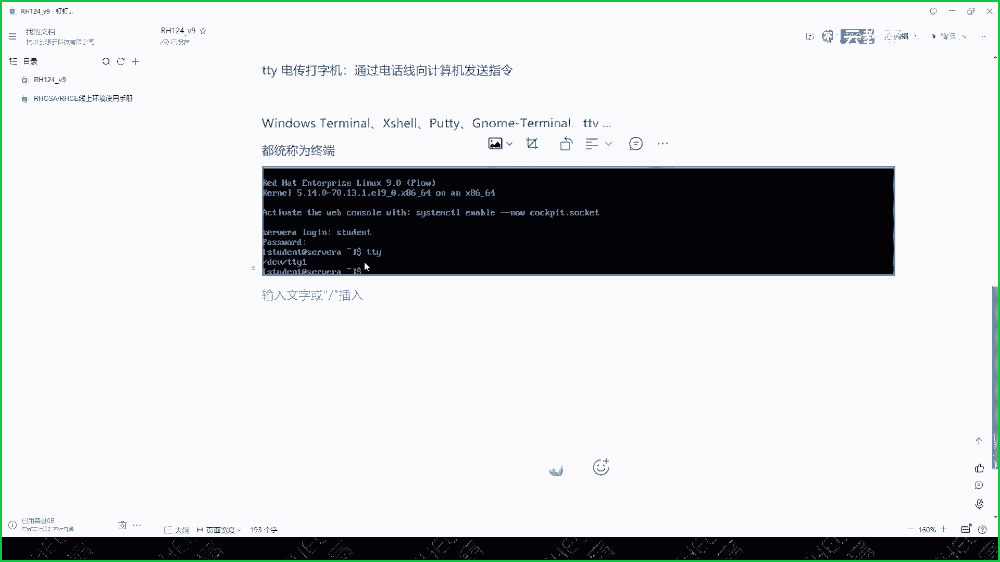

# 红帽认证系统管理员RHCE 9.0 (2023年最新版） - P1：RH124开营1-1 - 杭州创想云教育 - BV1qo4y1K7ie

啊那么治疗上课环境的话呢又分为两种情况，一种是线上的，一种呢是线下的，线下呢就是咱们在座各位呢来到现场，然后呢用我们的真机直接去演演习啊，直接去用啊，优点呢就是速度肯定是最快的啊。

缺点就在于你需要早上早上早点起床是吧，来现场啊，ok但是现场的话呢，我可以看大家练习的情况对吧，哎这是好处啊，ok也希望大家能尽可能的来我们的现场啊，那第二种的话呢就是实在来不了现场，原来我这个对吧。

我在西安是吧，我不能说周六来上课，我还得跑去杭州是吧，那这个成本有点高了是吧，那怎么办呢，那你就老老实在家啊，好好的学习啊，然后呢用我们线上的环境，ok那么刚才那个啊，那个思明老师呢也给大家介绍了。

我们有一个best b b c啊，这是我们给自己的线上环境起个名字啊，那么这套环境的话呢是啊是什么呢，是这个我们目前国内啊，我们只有我们是有的一个线上环境啊，只有我们有啊，不仅交付了红帽的初级课程。

红帽的一些c的课，还有一些定制的课啊，都是由我们来交付的，那么其他合作伙伴的话呢，可能也有类似的东西，但是呢它只交付vivr的虚拟化产品，但是我们不一样啊，我们是所有的培训我们都可以交付的。

所以说呢呃从疫情开始到目前为止，红帽所有的交付都是走我们这边的啊，环境都是走我们这边的啊，有的时候还要用我们的教室的机子，为什么呢，因为我们教室的机子呢是配的是，至少是64g b内存。

ok然后呢最起码也是个500g左右的，n m m e的磁盘，网络呢是双网卡的一，严格来说三个网口啊，双网卡三网口网，千万兆网络和千兆网络都是有的，啥都是有的，那么这个条件呢是符合当前最新的红包课程。

最高的配置啊，你去全国找不到，绝对找不到第二家啊，咱们不违反广告法，这是咱们实事求是，ok啊，然后呢，并且呢咱们的环境是大家只要报名之后，都可以去免费使用的啊，不属于你不需要额外的付费啊。

不需要额外付费啊，ok然后呢红帽的话呢线上环境也马上要交付了，但是具体交付时间不好意思，我因为根据保密协议，我们不便也给大家透露啊，啊快退出了，我只能告诉大家，快退出了，具体什么日子我不能说啊。

那么他们的话呢就是大概啊，他们的价格呢就和原厂的培训价格是一样的，三本书我就说第一本书培训价格啊，价格介于1万以上，ok 15000以下，一门课124啊，我们是三本书啊，它的线上环境啊哈同志们。

ok是收费的啊，我们这这个是可以说大家一定要珍惜，我们的环境的使用，好吧，嗯你上课期间，那么从你上课今天开始到你考完试，那么这个期间的环境都是开着的，大家都是开着的，但是呢中间是有两个时间节点啊。

第一那个节点呢就是我们从上个第一天开始，到上课的结束之后，往后延期一周，每个人参加本次培训的账号都是活动的，因为我们上完一周之后干嘛呢，会参加考前辅导，这时候你要确定你是否参加本次的考试，如果你不参加。

那么你的账号呢会被临时的收回资源释放掉，然后呢把资源给我们准备考试的学员，那我什么时候用呢，等到你说艾老师，我要报名考试了，ok我会提前一个月，我会把这个账号分配给你啊，为什么这样子呢。

因为有的人上完课了，老师我不自信，我不要考试，一等等了1年多，我不可能把服务器一直开着，等1年吧，中间的不说别的了，不说运维的可以用了，除了电费这块，对不对，咱们算笔账，是不是一一台服务器。

至少是两个龙右电源吧，对不对，你给我算算这1年电费多少，是不是啊，不得了啊不得了，所以说我们一定要记得啊，一定要珍惜我们的环境的使用好吧，ok啊，线上的环境的话，因为走的是虚拟化的嵌套啊。

因为我们的环境本身就是个虚拟化啊，然后呢又放在虚拟化平台上面，是个嵌套虚拟化，所以说性能这一块呢没有办法得到很大的提升，就可能速度就没有线下的这么体验，这么搞了这么好了啊，你线下呢是做高铁啊，坐高铁啊。

然后呢这个这个线上的环境呢，就有点像坐公交车了啊，就这么大差距好吧，有可能还会偶尔遇到交通堵塞，是不是卡顿一下什么的，但是呢还能忍受啊，还能忍受啊，这是没办法的办法啊，这个ok啊。

这是给大家简单又唠了一课啊，然后呢我们的课程的话呢是上课时间是十天啊，十天三本书的时间呢基本上属于是啊，433的是这样一个一个比例啊，433啊，433，那但是呢我们本次课的话呢。

我尽量把我们的时间呢它调整成是334啊，这第三本书我尽量给大家多留点时间啊，但是因为第三本书我们以前讲，以前讲4a的时候，也就是讲三天啊，啊c一的话讲三点也肯定是足够的，并且c里面的这个自动化。

要比c里面自动化要讲的要简单啊，说三天来说是可以的啊，三天是可以的，第一本书的话之所以放的时间长，是因为照顾大家呢是很多人是零基础啊，我们又讲得慢一点啊，慢一点，ok啊，是这样的一个。

大家就目前按照433的这个时间啊，去去准备啊，就说我们上课的进度的话，每天啊白天，那么上课呢是基本上是一天是四张啊，一天基本上四张啊，然后呢晚上的话上课的话是两张，这样的一个进度啊，这样的一个进度。

ok所以说我们四天的时间就上完了啊，所以大家呢上课的时候认真听啊，该敲的时间呢要敲啊，下了之后呢，回去之后呢要趁热打铁，还要调实验啊，红帽的学习呢就两个途径，第一个途径呢是啊抄实验。

第二个途径呢就是抄实验啊，没了啊，就没有别的办法，如果你只想看看看看东西，听老师讲，讲完之后回家就倒头睡大觉了，不好意思，你学到70岁退休是吧，你也考不了这个认证啊，不认证啊，好啊，咱们废话就不多了。

不多唠了啊，然后呃我的名字很好记啊，哎行万里，ok人如其名啊，老家是河南南阳的，然后就跑到了杭州定居啊，啊也快属于千里之外了啊，ok啊然后呢这个我这一块的话呢，这个因为因为红帽的认证这块改变之后啊。

那么我的证书呢就目前保留在level 3啊，然后就没有在去升这个级啊，因为费用太高了啊，唉不得了啊，如果大家感兴趣的话，咱们课下可以聊聊红包的认证啊，现在变得有点成本有点高啊，ok啊除此之外的话呢。

云这块呢主要是阿里云，还有cover list啊，这块看啊，虚拟化呢也有所涉猎啊，但是我目前主要还是以红帽为主，ok其他这些呢只是为了什么呀，偶尔用一用而已啊，不讲课啊，不做各方面的啊。

这个技术支持各方面的，我们主要还是相当于红帽红帽产品产品线啊，ok为什么主主要做红烧的呢，因为嗯从技术角度来说啊，那么虽然说啊linux的学习的门槛越来越低了对吧，大家可以在网上找的非常非常多。

linux学习的视频啊，但是呢啊这就是正规军和什么呀，野战部队的区别了对吧，那么你在网上找到的话，那视频能学吗，能学，但是呢这个知识点可能没那么新，那没那么新，第二个呢就是你会发现很多人对吧。

他给你上传的视频，目的就是让你去报名哈，去报他的名，然后呢去参加一些其他的培训对吧，然后去花这个钱做认证，比如说我们国内某某培训中心培训，费用非常非常低啊，就属于类似于零元购啊。

然后呢然后呢这个考试费等到你上完课了，哎我要考试，你的考试费收入，你交钱是我们正正规啊，官方报价的两倍，ok ok懂我意思吧，这叫套路啊，我们我们不套路，ok所以说呢我们主打线的话呢。

还是红帽红帽的系统管理，学完之后呢，希望大家都能进入到linux运维这个门槛，ok注意啊，是门槛不代表你需要什么东西，公司就抢着要你啊，这个人有红包证书啊，工资1万 2万随便给，没有这回事。

ok你学这个东西，只能说你是正规军的一个成员，唉你是一个什么呀，你是一个士兵啊，你要想当军官的话，你还要求好自己去奋斗啊，ok打仗的时候冲在前锋呢，还是你啊想要在后面做指挥，再靠你个人奋斗，好吧啊。

想想快速进入军官的话，将来可以考虑个人，根据自己情况去学学c一的架构师，那么架构师更加的符合我们企业里的需求，是不是啊，哎就好像什么呀，学了c e哎，你知道这个砖是怎么放的，但是你不知道怎么盖房子的。

对不对，因为人家是找你干嘛呀，盖房子的，不是来找你干嘛呀，搬砖的，ok更需求更更好一点啊，但是c的话呢价格比较贵，大家根据自己的情况和职业规划自己做调整啊，我们从来不会说这个费用高，你就报这个吧。

不会啊，同样有些学员我们的学员抓老师，我想续证，我们第一不说价格，第二会告诉你你有没有必要去续约，基本上十个人来咨询，我们会劝退九个哈，全体九个好吧，ok呃这些这是客观的问题啊，我们比较客观讨论问题。

ok啊，然后呢，咱们今天啊，第一天呢咱们学习的课程呢叫i h124 ，rh开头的就是红帽系统管理的课，ok系统管理啊，rs有系统管理，因为我们的课程呢叫系统管理，一管理，二合自动化。

所以说呢我们的课的简称的叫hsa，红帽系统管理的英文缩写啊，然后呢三本书124134和294这三门课，你会发现这个数字是不是越来越变大呀，哎意味着你的学习的难度呢是越来越升级了啊，升级的。

那么咱们的第一本书呢，主要是给大家来介绍一下啊，这个针针对于小白的比较多啊，什么是linux是吧，哎聊一聊，然后呢怎么去用它对吧，介绍介绍命令行的使用，图形化界面的使用，然后通话界面是修完之后就翻篇了。

因为我们后面还是用命令行啊，还是用命令行啊，因为命令行更高效哎更高效啊，然后呢这个接着就开始慎重的去学习，什么是用户对吧，怎么改用户的密码，什么是权限，怎么改权限，对不对，哎怎么管理文件。

怎么管理目录啊，怎么管理磁盘等等这样的一个课程啊，呃对系统的伤害性越小，那么克隆东西现在越往前啊，越往前啊，所以124的东西呢就比较单一，所以将来考试的时候呢，他的成绩只占了40%左右。

第二本书呢章节比较少，但是呢含金量更高啊，涉及到一些系统管理的深入层次的，必须要用超级管理员身份，比如说磁盘的管理，容器化的管理对吧，融化其实不一定非要用root啊，但是呢更压什么呀，更加的先进是吧啊。

新的课程啊，ok那么这些都是分值很高的，占了60%啊，60%，ok啊，那么将来呢我们第三本书的话呢，就是占了100%啊，100%啊，那么红帽的考试呢历来都是210分过啊，满分是300分啊。

考的第一考的高啊，没有什么奖励哈啊过了就过了，没过了，你的乘法就是交补考费重新考啊，这些钱都是给红帽的，所以说呢我们一定要好好学啊，我上课说的说的知识点了，大家一定要记下来，ok然后呢上完课之后呢。

大家呢就根据进度呢去，一定要抽出时间去干嘛呀，准备考试，然后呢最后呢我们会给大家时间去做模拟啊，啊，这个模拟的话呢，就可以评估出来大家自制的掌握，然后呢由我来确定大家是否要参加这场考试。

但是呢这个模拟是有前提的，你只有你的练习准备的差不多了，你才能参加模拟，因为每个人的模拟只有一次机会，ok只有一次机会啊啊，然后呢如果你没有准备好，你参加模拟的话呢，第一没有达到我想要的效果。

第2年把这个资源浪费掉了啊，所以说呢我们的思路是这样的，第一先上课，上课之后呢，我们每上完一本书啊，比如第一本书和第二本书啊，上完了我就会跟大家说，哎我们的练习题在哪里，大家可以深入的去练习了。

这个练习呢就是用来管我们干嘛的呀，准备考试用的o，这时候呢这个时候你的压力就大了，因为你要既要上课去做练习，还要干嘛呀，课后去干嘛呀，做这个练习题的练习，那么这个练习的练习呢。

可能是跟着学第三本书的进度而来的，那么第三本书你学的时候呢，哎学完之后呢，你要学就意味着第三本书你学完之后，你的第一本书和第二本书的综合练习题，应该是怎么样了呀，练得差不多了，o然后我会再给你一段时间。

这段时间是干嘛的呀，你去练第三分数练习题，这时候呢我们会参加考前辅那个考前辅导，那可以知道，那目的呢就是你听听我给你讲的方法，和你自己做的方法有什么出路，哪个地方我经常做错，为什么会做错啊。

这是你需要关心的事情，而我关心的事情呢，只是给大家演示一下这个题该怎么做而已，其他事情我是不关心的，因为大家都是成年人，需要自己知道自己的重点在哪里，而不是说老师我什么都不干，等到你讲完考研辅导了。

我再去村头桥啊，那么那么问题来了，这个时候如果你去决定的话，我们这时候就该干嘛了，让大家报名考试了，你怎么知道你能参加考试和不能参加考试，对不对，你如果你说我我我我心里没有底气，那我就不报了。

你不报的话，你就没有模拟，你没有模拟的话，就影响你后面的证书的一个需要，所以我们设计的目的呢就督促大家去学习，ok去学习啊，你就按照我们的进度来好吧，这次我给大家说的比较清楚啊，比较清楚啊啊啊。

那么第一本书呢主要是基础的内容啊，基础的内容，那么我先呢给大家，咱们先聊聊前面的一些知识啊，讲完之后呢，给大家介绍介绍我们的环境的一个使用方法啊，然后呢再给大家分配账号啊，然后呢我们再讲真正的内容啊。

好那么我们的课程呢大概的进度呢，就是如果我们ppt上的这个样子啊，一共是16章，16章，16章的话呢，大概是1233，正好四天看到没有，四天吧啊两个晚上是一天，那两个晚上是一天啊，正好14天的时间啊。

这具体的进度呢要根据大家的情况，但是呢如果前面大家学习的慢，那后面肯定就稍微的会快那么一点点啊，和大家一定要尽量就是跟跟上我的节奏好吧，但一旦但是有问题，一定要当场我们解决掉啊，有些人就是不吭声。

等到看下之后呢，我们讲第二章的东西了，哎前面的我还没搞明白是不是，那我再回过头，你不可能再讲第一章内容了对吧，那时间就变慢了啊，ok好，那么给大家介绍一下我们的环境啊。

第一本书和第二本书的环境呢都是一样的，都是一模一样的啊，一模一样的，所以说呢官方的话呢是两两个环境，我给大家呢二合一了，起名叫1992099，那么这个环境里面呢有哪些资源呢。

那那么这个地方啊给大家介绍一下，那么首先呢在我们的这个窗口的左边呀，啊创作左边这块呢是我的讲师端啊，讲师端k由我来控制好吧，控制啊，然后呢右边呢是我们的学生端啊，这里的base深啊。

word station server a server b是我们的学生端啊，原来老师我怎么现在看不到呢，别着急啊，我先给大家介绍一会给大家分配账户啊，线上的线下的话呢你也看不到是吧。

我只看到现在有一个壁纸是吧，什么都没有啊，没事啊，一会儿咱们就看到了啊，ok那么这里面的机子是干嘛的呢，给大家说一说这些机子的重要性啊，server a和server b呢就是我们的服务器。

ok就是将来你工作当中需要管理的服务器好吧，服务器aa服务器b，然后呢，word station呢就相当于公司给你分发的笔记本啊，让你来干嘛的呀，远程连接到服务器做管理的啊，所以它是一个图形化界面的啊。

那么我们的我们的这个word session，还有服务器，我们的网络怎么和外面联通啊，唉我们我们知道要有一个什么呀，是不是要需要有一个所谓的路由器啊，对不对啊，路由器，ok你会发现这个流量啊。

有一个机子叫bash堡垒机是吧，那么这台机子的话呢既充当了保底机的做角色，也充当了一个叫做路由器的角色，负责的将我们的流量呢转发到我们的讲师端，ok所以说呢大家的虚拟机啊在启动的时时候。

一定要确保你的basic是开着的，懂我意思吧，很多人学习的时候呢只关心wastation，sorry，sorb，不关心business，你不关心是不行的呀，因为我们的虚拟机在开机的时候呢。

会从左边的这个classroom上面，去临时的去归档一个止盈脚本啊，要开机的时候要去后面，系统会自动去下载一个脚本啊，然后验证一下哎你的环境是不是正确的，然后才能正常开机。

那如果你的这个这个杯子写没有开机的话，它能不能下载到呀，下载不到是不是，那你说能不能开机呢，开不了机啊，所以说这个business是一个潜在的机子，一定要保证它开机的，好吧好，这是我们的角色啊。

然后了解一下就行了啊，这些书上都有啊，ok好，然后呢虚拟机的使用方法，那么思路呢就是如下，第一步呢就是检查一个文件，这个文件是红帽咱们开发的这套环境当中，特有的一个文件啊。

叫做rh t red hat training对吧，培训啊，那么在这个文件当中包含了一些培训的信息，那你会发现我们现在的课程呢叫ht cos，是r h999 啊，然后呢想看汛期有没有跑起来对吧。

那么这个地方就问题来了呀，红帽呢为了学习啊，给我们装了一台机子叫做foundation啊，这个机子呢我们是没有权限的啊，因为你要直接在这台机子上去操控的话呢，可能会对系统产生一些致命性的影响。

比如说常见的问题啊，网络的修改，很多人嗯，嗯每年吧培训当中总会有那么五个人以下左右，会把绑定的网络做些调整，它一旦调整就会出现什么问题呢，把网络改掉了呀。

一改掉我们训机就没有办法存business business网络，网络是桥接到了我们的fdition，房地震呢再来到哪里啊，我的我的房地震，我的房地震的网卡呢在流量转发到classroom上面。

你把你的网络改变了，就意味着网络是通是瘫痪的，哎你就拿不到机子呀，对不对，所以大家房地是什么事都不要干啊，你只能干一件事情，就是打开终端做敲我们屏幕上这些命令，其他事情就不要做了。

还有一个呢就是远程到你的训机里面抄实验，仅此两件事啊，其他事情一概不要做，ok啊一概不要做啊，只要我不说的，你都不要做，我说可以做的，你才可以做，这是我们的房地震，注意啊，这个时候重点啊。

因为这个环境是特殊定制的好，那么既然我们没有权限，那么又为了我们学习方便，它里面装了一台几台虚拟机，你这虚拟我怎么去管理呢，我没有管理员权限，所以说呢虹猫呀给我们开发一些脚本。

叫做i t v m c t l，这个命令i t还是什么意思呀，红帽培训vm虚拟机control控制，红帽培训信息控制软件啊，通过它呢可以来查看我们虚拟机的状态，是不是接通电源的啊，是否可以打开电源启动。

开启虚拟机啊，关机这样的一个操作，甚至呢我对信息做了一些操作之后，我想给它恢复到原状，我还可以干嘛呀，把它重置掉，好吧，哎这是我们这些命令啊，现在呢我们来感受一下啊，感受一下怎么感受呢。

现在呢大家呢关注自己的钉钉群，啊公路精灵群啊，可，好钉钉群啊啊，我把这个笔记呢给大家分享出去啊。

分享出去。

哎呀好像给大家一个查看权限啊，好给大家是一个查看权限啊，好，那么大家呢，你会发现我们有一个介绍文章的链接啊，我现在给大家打开看一下，那么在这个链接当中呢，我已经根据咱们本次报名的学员啊。

做一些账号的分发，ok左边呢是我们的名字啊，然后呢，接着呢，中间有一个外网远程跳转机的登录用户名，那么这个呢要结合上面的远程桌面，官网地址来使用啊，要一起使用，那么这两个部分是干嘛用的呢。

就说我们在家的时候，比如咱们线下学员回家了，要想练习，是不是，还有呢，就是我们现在线上的小伙伴，要跟着老师做随堂练习的时候，就需要用到这个账户，那么我这里呢以windows为例啊。

我们首先呢使用远程桌面连接这个软件啊，然后呢去访问red hat。best vd c。com，23353这个地址，ok去访问这个地址，然后呢接着呢我们需要在用户名这地方书上。

我们这里给大家分配的外网远程跳转机，登录账户名，根据自己的名字去输入，ok啊，我这边就用我自己的了啊，我就输款了，然后呢选择连接，密码呢就是我们跳转机的密码好吧。

这是我们跳转机的密码啊。

根据自己的账户和密码进行登录，ok登录成功之后呢。

接着干嘛呢，同志们，登录成功之后呢，我们发现啊，我们在这个表格的右边，是不是又有一个叫内网实验机的ip地址，使用跳转机桌面的谁啊，什么连接v n c连接啊，一定要看成协议好吧，i v n c连接啊。

然后呢每个上面都有地址啊，都有地址啊，我这里呢就以谁呢，我就以陈超的为例吧，因为我我我是没有的啊，ok那么就打开我们这个桌面上。

有一个有一个什么呀，有一个youtube sauer，就这个绿色的大眼睛，看到没有唉，那绿色大眼睛啊，双击在server冒泡泡的地方输入我们的地址，ok好，那么我这里呢以陈超的为例啊。

好像我这个上面有一个线程的啊，那我就用现成的吧啊然后输进去之后啊，左边是ip地址，冒号端口号一定要注意啊，看清自己的，别输错了，然后呢选择连接，这时候我会弹这个窗口，叫我们认证吧，密码是多少呀。

同样密码的话呢，大家呢要根据自己分配的虚拟机的密码，看清楚了，有些red head，有些是谁呀，h s8 啊，ok然后呢输进去r h sa 8，哎，sorry，我说错了，这是red hat的密码。

重新来一次好，这时候呢，我们是不是就可以看到有一个小的窗口o啊，一个小窗口，那么在这个窗口上面我可以干什么事情呢，我给大家介绍一下啊，因为我们的环境呢这个地方一定要注意听了啊。

因为我们的环境是虚拟化嵌套出来的，所以说呢可能会导致一个问题，就是偶尔呢这个界面会卡顿，知道吧，或者出现问题了，怎么办呢，我们建议大家给这个机子重启，重启的方法有两种，如果我这个窗口能操控。

那么我们就使用右上角，就是我们桌面的这个窗口啊，右上角有个电源的地方，点击这里的power off或者learn out按钮，然后呢这里面有个谁呀，restart看到没有哎。

有个restart，那么去重启。

但是呢有的时候他可能卡在那里不会动了，那怎么办呢，我们的这个窗口呀，这个vn c本身有一个组合按键，在这个任务这一排啊，菜单栏这里面左最左边有个三个键的按钮，这个键很小啊，一个一个按钮会发现。

我们鼠标放在上面的时候呢，有一个消息叫什么呀，send control alt delete to host，是不是给我们的虚拟，我们的这台机子发送一台什么呀，ctrl delete组合键呀，你点击它。

那么你的这台机子呢就重启了好吧，ok这个地方一定要注意啊，可以自主解决，ok如果你发现这个问题解决不了，那怎么办，群里面艾特我啊，我我远程给你操控，好吧啊，这种实验的话呢，大家尽量在晚上十点前去操控啊。

十点以后的话，我是不接受消息的啊，ok不是消息，不是7。24小时给大家服务的啊，我到了晚上十点啊，好吧ok啊，但是呢我们第一次打开这个窗口，是不是太小了一点，对不对，很多人啊，50%的人讲完之后。

还是不知道怎么改分辨率啊，老师这vn c上面没有改分辨率呀。

放大老师这这是不是左边是不是看起来很大了，左边还是这么小吗，是不是啊，那是因为你根本就没有干嘛呀，你根本就没有去操控啊，就没有操控，然后这个vn c的话就很很恶心啊，因为我这边是嵌套给大家来演示的。

看放哪去了，我记得是f 11，因为我这边东西是挡着的啊，首先看一下，嗯鼠标呢，嵌套的话一点好不好，处，地方就在于这里容易那个，我先给他，先给他处理一下吧，嗯我看一下这个组合按键可以，哎我的鼠标。

因为我们嵌套的话，这个vc有你这个软桌面，嵌套起来就容易出问题啊，我为什么不建议大家一直全屏，就这个原因，然后一不小心我中招了。

我就给他先关掉。

啊关掉，ok我再重新连一次。

啊啊那么这个地方就不要操控了，那怎么办呢，那么我们可以这样做啊，就是我们的屏幕的右上角，这边有一个电源按钮的位置啊，点开这里有个settings设置。

看到了啊，然后呢点击啊，然后呢在我们的左侧啊，找到谁呢，找到一个显示displace，然后右边是不是有个分辨率啊啊resolution啊，点开我们建议大家呢，如果你的你的分辨率是1019。

20x1080的，那么这个vn c的分辨率呢，我们建议调整多少呀，1440x900。

这个是大小是最为合舒服的一个大小，是不是唉这样的话呢你给他关闭掉。

哎这样是不是舒服很多了，是不是啊，哎好那么这个登录界面啊，我就给大家演示到这里了啊，演示到这里了啊，然后呢这个剩余的东西呢，我就接着在我这本地给大家演示了啊。

好这边就关掉了。

好现在呢给大家，现在呢给大家123分钟的时间啊，按照上面账号呢，大家呢完成我们ppt上这个步骤好吧，大家登录上去，登录成功之后呢，大家呢在钉钉群里面扣个一啊，可以线下小伙伴暂时不用管啊。

线下小伙伴们不用管线上的啊，登录成功之后再全面定个一好吧啊，然后呢我们休息个十分钟啊，休息个十分钟啊，然后呢我们15了嘛，那就是多少呀，25是吧，好我们继续啊，休息个十分钟。

好我们继续啊继续，嗯然后呢，我们刚才大家呢都已经来到了自己的环境当中，啊，然后呢咱们来感受一下怎么去用好吧。

怎么去用啊，好那么我这边呢也登录了一台啊，登录一台，ok，那么登录上来之后呢，那么大家都能看到啊。

我们看到一个类似于我这边的一样一个桌面，对吧，大家分辨率呢也根据自己的情况做一个调整啊，然后呢我们在这个屏幕的左上角呀，还有一个activities，大家看一下唉，有一个activities。

把activities左上角教室的话在这里哈哈，actions点击鼠标点击一下啊，点击之后呢大家会发现啊，我们在下方有一个有一个小窗口是吧，这个窗口呢我们称之为是大师bod啊，叫仪表盘。

在仪表盘的最右侧呢有一个九个点是吧，把鼠标放上去会显示show applications。

显示应用吧啊点开啊，点开点开之后呢，我们看的非常非常多的应用的图标对吧。

然后呢我们看这里啊，我鼠标的位置有一个叫做一个叫vm的一个logo。

上面写了一个谁啊，叫做vial machine major，看到了吧，在这里啊。

聚焦啊都看到了吧，好大家点开啊，点开点开之后呢，稍等片刻，你又能看到这里呢有几台虚拟机啊，因为我是讲之端嘛，所以比大家多一台classroom，现在的basic呢sa sol b啊，这些基层数都没有开。

对不对，唉都没有开啊，如果你打开这个窗口的时候，如果提示你没有权限，那么你艾特我，我告诉你原因啊，肯定是是使用的方法不对啊，是不对啊，啊都看到了吧啊都看到了，在这个界面的话呢。

其实我们就可以执行开机关机了，是可以的了，看到没有鼠标，右键是不是right啊，对不对，但是呢这样操控呢有一个缺点，什么缺点呢，就是说因为我们这套环境呢，它是有先后的顺序的，呃你你手动开的话呢。

那么就同时开嘛，那也没问题，但是外为了防止出现问题呢。

我建议大家呀，咱们刚刚学习的时候呢，用谁呢，就大家呢还是点开左边的这个activities啊，然后呢，在最下册呢，找到一个有一个名字叫做terminal的软件，我们打算打开。

关了怎么回事。

第一次遇到这个情况啊，稍等一下，估计是我刚才那个终端敲击的问题啊，哎，大家稍等我一下，我给它重启一下，因为我这边嗯是左r d p协议啊，然后里面我之前打开过，应该是这原因导致的。

稍等我片刻啊。

嗯啊然后呢我们接着呢在我们这里啊，敲个命令啊，敲一个命令，什么命令呢，叫做r s t杠v m c t l，但是敲之前我们要干第一件事要干嘛呀，是要看一下我们的这个e e t c r的一个文件。

叫i t啊，看一下哎，我们的我们的这个这里写的是999啊，都可以用来学习第一本书和第二本书的知识啊，看一下啊，看一下我这边把这个字体再调整一下，能看到吧，同志们啊，有一个问题啊，好接着呢，我们干嘛呢。

我们组个命令啊，这i h t杠v m c t l，这是一个命令空格啊，start空格a a l l啊，回车，你看大家依次的在启动我们的虚拟机，是不是啊，依次在启动啊，依次在启动。

这时候呢我们这个软件上面的这个状态呀，就变成什么了呀，是不是正在装订了嗯，那装订说明我们的训机怎么了，通电了，只能说是通电了，你能不能保证你的系统是正常运行的，嗯不能不能啊，注意啊，不能的啊。

所以我们我们线下的话基本上没有太大问题啊，主要是线上的特别的慢，所以呢我们要等个片刻干嘛呀，你可以拼一下，知道吧，ping比如说p两次啊，p谁啊，base是最关键的，我先拼他通诶，通了没有，通了通了。

然后你再p谁啊，我cj通了没有也通了对吧，我们最好验证一下，ok哎还有server a通了没有也通了，哎sb呢也通了，这时候就意味着你可以干嘛了呀，基本上可以理解为可以使用了，同志们。

那基本上就可以使用了，啊然后呢再做最后一次保保险啊，就是走个命令叫做什么呢，大家呢可以这样走啊，因为我们的这个vocation是图形化界面的，我们线上的小伙伴注意了，我们建议大家不要打开啊。

因为虚化嵌套本来资源效率比较多，你再打开的话很容易卡死啊，所以说我们建议呢远程啊，锁这个命令叫s h空格，student at vacation，哎去连上去，那么大家连的时候可能会产生一个消息。

什么什么什么，yes or no，是不是有没有我这个微弹啊，是不是会看到yes or no，就是yes，哎说个yes好吧，为了让大家感受一样的，我这边给我的文件做一些调整啊，大家稍等一下好。

我给我的文件做一个稍微的调整，这个密码就是刚才给你发的文件里啊，不是啊，不是的，这个不是的啊，是虚拟内部的，这个在我们教材当中稍等一下啊，我给大家演示一下，因为我这边好像有我我做一些改变啊。

然后轻微的有点不太一样，调整一下啊，好我重新来一次啊，回车哎，我们输个yes之后呢，在这里说个什么呀，输个密码，这个密码在哪呢，在我们的教材的我们一个教材啊，教材前面是有的啊，那么但是呢密码也好记。

我的密码是谁呢，记住了，只有student，密码呢是student，ok只有student账户的密码呢是student啊。

我一会把这个地方整理之后给大家发一下啊，那么student账户虚拟机啊，虚拟机内部啊，那么student账户的密码是谁呀，是student，ok其他用户当然包括水下root了啊，那么密码是多少呢。

密码是red hat啊，来很好记吧，哎你可以试一下大尤其大概率是rehead。

不是的话就是谁啊，student啊，然后呢我们输进去啊，student回车唉，你会发现我们是不是来到一个新的主机名啊，新的主机名啊，我这边变成student，啊省电台，试一下。

然后呢再去打开e t c r的etc i t看一看啊，这里面是不是写的和外面是一样的，哎是一样的啊，哎看一下标题是不是系统管理一就可以了啊，系统管理一，ok这是给大家的一些什么命令的一些技巧吧。

啊我把这个东西呢给大家复制下来啊，复制下来。

哎。

啊然后呢登录来之后呢，一定要检再检查一次。

啊这是给大家的一个内容啊，这是使用方法的一个步骤，一个步骤看，这是我们的real 9的。

好吧哎上步骤啊，大家一定要切记，好吧啊，然后呢我这边呢为了记笔记方便，我就不再用图形化界面了啊，我会用用另外另外一个啊。

那用到的时候呢，我在切换过来，我这边的话呢会用一个终端，啊这个东西大家就不要眼红了啊，因为线上的环境是远程不了的，只能走vn c啊，因为我们里面会放一些比较敏感的资料啊，反省的有人给他拷走了，ok。

现在呢我呢还是在我的呃这个房地置顶上面啊，那么大家都都都成功了吧，成功的话在群里面再扣个一扣个一，这就是我们的现在的一个使用方法，大家一定要切记啊，一定要切记，咱们今天主要的目的呢。

就是给大家上午把咱们的环境怎么使用啊，讲清楚啊，讲清楚啊，好啊，说这么久了，我们还还没有正式的开始讲东西，是不是哈哈没有讲东西啊，ok目的呢是大家会用啊，没用好，然后呢接着接着我们来讲咱们的硕士点了啊。

讲地址哎，第一章第一章的话呢是介绍一下什么是linux，什么是开源，让大家听一听就可以了，好吧，我们尽量花最短时间把这个事情呢，给大家说一说啊，所以说首先啊我们来聊聊一聊啊，为什么要聊需要了解啊。

linux啊，linux，ok那么是这样的，就说啊对于我们而言呢，我们肯定是专业的对吧，是专业的啊，然后是专门从事一linux相关的工作的啊，那么这个现象工作就非常多了呀对吧，你可能是搞运维的对吧。

搞运维的啊，那么也有可能是搞开发的对吧啊，你有可能是一个什么架构师啊，想了解新产品的特性的对吧等等等等，哎你都是需要了解的啊，因为什么呢，因为linux从那从另外一个角度来考虑啊，它是开源的。

所谓开源就是开放源代码，任何人呢可以干嘛呀去使用，那么这个任何人呢大概率不会被政治边缘所所，这个干预啊，大概率啊，没有绝对的事情好吧，那就意味着它的发布的时候呢，全球的任何地方都可以干嘛呀。

都可以去使用吧，啊你像开源的站点都是全球都是分布式的，它不是一个站点，它是全球分明咱们国内养中科大呀，阿里云呐，对不对，清华大学呀，网易啊是不是都有竞价仓库啊对吧，哪怕它垄断了哎。

也不影响我们这一时半会儿的使用，是不是啊，哎不影响，这是一个好处啊，更关键的是什么呢，它其实就是开源里面的开放源代码，任何人在使用之前，可以审计这个代码里面的内容，你能看到里面干了什么事情，对不对啊。

这样的话对我们而言是不是更加的安全呀，来安全，那么从我们的学习角度而言啊，和使用角度而言，那么越来越多专业人士呢离不开linux操作系统了，哪怕以前的windows操作系统，现在也在拥抱开源。

ok他的windows当中可以安装什么呀，windows linux子系统对吧，对于开发人员的使用，ok那么以前的时候大家就装虚拟机嘛，是不是要么就是用什么呀，我直接装一个linux操作系统是吧。

桌面人桌面的话呢，大概率很多人喜欢用u盘图看做桌面，ok当然如果你是专门做一企业级的开发的，你用的就是红包的产品，那么你可以选择红帽的桌面，然后去做开发啊，也是可以的啊，也是可以的。

ok那么如果是服务器的软件开发的话，那你肯定要在哪里跑呀，你的软件肯定是在企业级的操作系统上去跑，是不是去测试，那么红帽是首选啊，红帽首选k呃，然后呢这个现在的一些新兴的技术啊，比如说这个大数据。

人工智能网，物联网，对不对等等等等，这些其实都离不开所谓的什么呀，linux操作系统啊，就这支持啊，所以我们很有必要去学习啊，学习，ok然后呢我们通过学习这个开源软件，也可以从中受益对吧。

比如说研究里面的源代码啊，可以帮助我们更好的提升，那这个叫培训了啊，培训不单单是来这里学习啊，只要你通过一些途径学习内容，这个要培训啊，培训ok还有安全性，大家都能看到里面的元旦嘛对吧，还有稳定性。

那这个稳定性呢呃指的是啊指的是什么呢，就是我们要分分场景来讨论啊，就是说我们的软件的话呢，就是呃因为开源的嘛，很多人都能去干嘛，做一些更新和改变啊，那么就意味着呃如果某当中某个人发一些啊。

安全因素或者不稳定因素，都可以快速去排除掉啊，这这块儿讨论啊，那么基本上我们的开源软件，都是一些常见的虚客，比如说精u g p l，ok还有什么lpl啊，什么11啊，b s d阿帕奇啊，对不对啊。

然后国内的话呢，还有一个我记得一个一个国内有木兰啊，木兰社区嘛，他有没有协议，我还不太清楚啊，但是呢咱们现在国内有个干什么呀，有一个啊有原子基金会对吧，唉他也是有许可协议的，那也有许可协议的啊。

那么大家会发现这里面有一个啊，有一个关键词呢叫g n u啊，g n u给大家聊一下什么是gnu，g n u的全拼呢叫g n u is not unix，金庸是一个操作系统啊，gu是一个操作系统。

但是呢他的全拼呢为什么叫这个ju unix呢，是因为它的表达意思是说，我的金庸的操作系统和你的unix长得非常像，但是呢我们不是一家人，只能说像而已，我能够实现你能实现的事情，对不对。

但是呢我又跟你不一样，为什么我是开源的啊，我是开源的，我的代码呢是可以任何人去查看的，去修改的，去干嘛呀去使用的，而你unix不是unix呢，你是专有的，对不对，哎，专有的啊，我和你一样强大。

但是呢我给你用起来更加的free，更加自由打更加自由哎，叫g u啊，呃因为在早期的时候unix的原因，然后诞生了g n u ju出现之后呢，它的内核叫hard hu r d啊，但是它不好用好。

那么正好呢在这个统计时间呢，雷纳斯他把自己的代码啊，他这个代码也不是说自己啊，这个就是生下来就是一副圣人的身躯，是不是啊，我要改变这个世界，对不对，他把这个代码放在互联网上的原因呢，也是他身边的朋友啊。

然后呢说要不放在互联网试一试吧对吧，后来自己当时有那么一个玩玩一玩的心态嘛，对吧就好像现在有些短视频一样，当时就拍着玩的，没想到就火起来了，是不是啊这种感觉啊啊然后大家都去下载，去去使用啊。

然后呢呃所以说呢雷达雷达斯，他发明的这个东西呢叫linux kernel内核，它不是一个操作系统，它只是一个内核，是一个心脏，而j u呢是一个躯体，上面有手足啊，心肝肺是吧，完整的，但是呢他心脏不太好。

所以说呢他们就把它叠在一起了，哎所以说呢现在呢我们称为金u斜杠什么啊，linux，啊那个死，但是呢只有这些还有的地方不舒服呢，就这地方在于什么呀，哎是一个完了躯体的，但是呢它是个模型啊。

就是你自己拿来用，要自己组装很不方便，那怎么办呢，所以说呢一些社区一些公司呢出于自己的目的，比如说让大家更好用，或者为了出于盈利的目的，比如红帽就把这些常用的软件和内核，把它封装在一起，然后干嘛呀。

把它打包成一个可引导的什么呀文件，然后呢再进行发行和发售，那么这个文件呢我们就称为什么啊，linux的发行版，所以说我们身边在接触到的时候呢，我们其实都是在学习谁呀，它的发行版啊，同样的u盘图的。

就我们市面见比较多的，包括现在国内open欧拉对吧，奥马linux u s深度，对不对，中科麒麟对吧，等等等等等等等等，全都是linux发行版啊，没有没有一个人说哎我就玩纯粹的linux。

那你需要一个载体装一个操作系统，这个系统上面下载一个坑呢，坑呢你玩去吧啊这个坑呢啊没有什么东西，就一颗心脏给你了，是不是啊，没有了啊，ok那么g u的标志呢是一个非洲的牛羚啊，非洲牛羚。

而我们linux的吉祥物呢是雷纳斯啊，是雷纳斯起的名字叫tx啊，看到tt之后，你可以想到一个什么呀，一个慵懒的刚刚吃饱的企鹅啊，往地上一坐啊，就坐哪里了，我看这是给人比较舒服啊。

另外一个和长得非常像的叫unix，但英文字是特有的呀，说他还有一个有一个有一个开源的版本，叫b s d，有没有听说过b s d啊，b s d的话，它的它的logo呢叫什么呀，是一个西方世界的。

你的小恶魔，头上长着尖尖的角，尾巴上有一个有一个什么呀，有一个尖，手里面拿一个什么呀，武器的这种ok同全体通红，小恶魔啊，是b s d的，而我们的linux呢是一个小企鹅，但是呢。

现在很多人就把这两个当做一种消系统了，其实不是的啊，但是呢会把它放在同一个网站上面去比较，去使用看好，那么红帽的话呢我们了解它的产品啊，了解产品的目的不是在做推广，而是让大家知道在我们身边。

有多少优秀的开源软件可以供我们去选择，去使用啊，红帽的话呢在开源界里面是世界领导者啊，人家是真真真世界领导者啊，不违反广告词对吧，ok那么ky里面玩的最好的就是红帽啊。

那么红帽呢他自己其实相对来说并不产生，并不产生从零到有一的这样的一个东西，而是干嘛呀，从别的地方拿好的东西拿过来，我再做一些调整啊，别的地方是0~1的红包，就把这个一拿过来，把这个一干嘛加粗了。

这是它的一个使命，然后呢再推广出去，ok你像这些产品，都是我们身边比较优质的开源软件，大家可以去选择，不一定非要用商用的红红色字体的，有商用的就是你要付费去订阅的，你说我不付费行不行可以。

但是没有技术支持啊，开源的东西你可以随便用啊，ok然后呢，但是呢你不能说拿着红包东西去卖，卖给别人，你你来盈利，那是不行的啊，那是不行的，但是你可以把源代码拿过来改一改，再封装再去销售，那可以啊。

那可以，但是你要说明你为什么要收这笔钱，是不是啊，哎你为什么要收这笔钱，你红包的话为什么要收这笔钱呀，我的系统不要钱，我的产品不要钱，我卖给你的什么呀，是服务，我给你提供技术支持，我给你提供软件的更新。

漏洞的修补等等，但这是特色花钱的地方，哎软件本身是不要钱的啊，不要钱的，你像我们的红装起了那个死的，最上游的产品呢是ba fda是什么意思，中文，帽子啊是帽子，帽子大家应该都看过西部牛仔电影吧。

你在图上扣了个什么呀，毡帽是不是ok我有一个红色的啊，红帽的正儿八经红包啊，ok很少啊，我拿了一顶啊，然后呢这个fda呢你看他的logo啊，logo feta啊，他的翻译过来就是粘帽，毡帽呢。

这个毡帽你肯定是工厂里面帮毡帽啊，很多很多很多个啊，然后呢呃全球的开发人员可以参与进行改进，然后呢改进之后呢，然后呢黄毛呢干嘛呀，发现诶这就这个产品稳定好用，拿过来封装变成了红帽企业4%。

那这个帽子呢就原来的颜色蓝色的变成什么呀，红色的了，商用的啊，商用的了，ok，但是呢这个地方呢在前年，大前年发生一些改变啊，因为红猫在14年的时候呢收购了cdos啊，然后呢在八发作。

同时呢将sl s这个项目呢不在继续下去了，而变成了新的项目叫windows stream，那然后呢从real的下游变成了real的上游，也意味着fedora和cl s stream是一个并行的一个产品。

然后呢这两者之间的优点集成在一起，变成了红帽704，最新的技术呢在pda上面，相对来说比较好的技术哎，给放到sm s steam里面，等它测试的更好更稳定的时候放在real里面。

ok所以说呢按照红的方法，你也可以将co s steam放在生产当中，是可以的啊，是可以的，ok啊，然后呢除此之外呢还有中间件，只boss全部虚拟化over这个over这个东西，这个除非万不得已啊。

就能不能用，不要用啊，用起来性能不是特别好啊，虚拟化这块其实说实在只有一家，ok这个没办法啊，这个不明白的地方回去好好想一想，有些东西必须要用，没办法啊，垄断垄断下来的。

然后其存储他以前有个对象有一个文件存储，那叫glaster啊，glaser啊啊，然后呢现在不做主推了，而是用了s ok咱们当中有人感兴趣，sap的话，当时可以专门来学习cf这门课啊。

我们后面的会推出专门讲sp的课程啊，k sap呢现在这关系很微妙，你说它是红帽的话，它是红帽的logo，红帽的产品，红帽的产品一，但是呢他的团队已经被拿走了，搬到拍bm了，哈哈哈啊，已经全部全部搬走了。

一个人不剩啊，ok啊，因为sf的话，作为i b m的所有的存储解决方案了，因为现在红包是ibm的嘛，被被买了买了啊，买了呃，如果如果将来咱们国家强大到一定程度，可以干预了是吧，把v再买过来就好了。

是不是估计不太现实是吧，因为ibm也是美国的，红包也是美国自家的对吧，绝对不是外人田嘛，没什么区别，但是给别人了，那就不一样了是吧，肯定国家政府是比较干预的，是不允许你卖的啊。

然后呢同号的over 3个项目，上游呢是r dur duo，上游呢是over spk社区啊，同样这个东西呢，目前红帽也没有放在太重心的上面，一般用这个产品呢，现在受众频率比较小，主要倾向于啊通信啊。

空气行业还有什么呀，这个这个金融行业啊啊用的比较多，其他就没有了啊，就没有了，然后呢另外一个呢叫orange orange呢，下一个就open shaft。

openshift呢我们又称为是企业级的cooper的意思，算ok 10个半的啊，十个里面九个半啊，讲openshift，但这个东西呢好是好，特别好诶，就好像一样啊，生的臭豆腐，中国特别出名。

中国臭豆腐是吧，特别出名，来了六个人，你大家都吃吗，不一定是不是啊，不一定就像我们国内一样啊，主要倾向于进入行业啊，金融行业，特别是银行这块用的多，一般这种重要的行业，用的都是红帽的企业级产品。

而互联网公司啊，还有不少企业用的都是类似于windos这种项目，期待的知道吧，哎这样的产品啊，不要说我身边怎么没有用红包的，那是你去的公司可能不对，我们接着我们每年接受培训的定制的课。

都是用红包产品的啊，红方产品，但是这些培训里面有一个要求，不能打红包logo，为什么，因为它是美国的，开明白我意思吧啊还有这样的情况啊，但是用了还得用，没办法，真的是没办法啊，你想举个例子呃。

国内上去i o e对吧，去i oe，然后有个银行花了将近10年的时间，将自己的产品业务线存数据，比如oracle存单机的oracle产品，迁移到了其他开源的平台上面，花费了10年。

啊这是说明他们团队还是比较厉害的，因为oracle一个数据库完成事情，我用开源决方案，一个产品绝不了，然后很多个开源产品一起组合才能实现啊，然后是这个，然后呢这个另外一个呢就是什么呢，是这个就直接说。

不好意思，我们的团队不行，实现不了，我们必须用oracle数据库，这个这两个新闻基本上在同一周的时间出现的，这是我们目前国内的一个场景情况啊，呃i t这一块对吧，没办法啊，还是望其项背啊，嗯差别稍微远。

所以说靠大家了，同志们啊，更多是靠开发人员了，能够从零创建一个东西，而不是拿了原来都去感应出来的，这是我内心里面希望的，但是我现在看到的是，99%都是改出来的啊，那个1%目前我还没有发现啊。

啊然后他的云平台呢有一个东西的表面窄，只有这两个就现在就就较少了啊，呃红帽现在大家想关心的东西呢，就是如果你开发里面的结构是关心一下啊，sp这块啊，无论是你干什么工作的，测试运维这一块。

我们建议大家一定要把sam搞一搞啊，sl bl还有bgm的话，你说我们不用没事，大家可以搞谁啊，他上有谁啊，cover medi啊，搞一搞啊，现在是云的另外一个新的时代，要云原生啊。

以前的基础设施云的时代已经过去了，在06年的时候，欧美国家刮起了云计算的风，大家知道这个风刮到我们中国，到哪1年才刮过来吗，差不多一一几年对一几年啊，一几年才刮过来啊。

然后现在呢这个open style呢，在国际上的反响就变得很一般了，但是咱们国内这会是在用用电信行业，像华为啊，对不对，什么移动啊，中国电信啊是吧，还有一些工商银行啊，这些都在用啊，没办法。

因为这个摊子太大了，你说我哎我自己创业公司，我搞奥运赛场吧，可以首先你要有个研发团队，无团队至少100人以上，先把这个镜搞定，你能搞定吗，110箱啊，你去新建的小公司，你能实现这样的规模吗。

呵呵玩不转吧，是不是哎，但是呢你要玩cocoa nest，还可以是不是还可以的啊，可以的啊，现在的话我们可以搞云原生还还来得及啊，虽然原生在也是一几年的时候就出现了对吧，但是对我们而言还来得及啊。

因为很多公司在讨论原神，但他并没有在用啊，并没有在用啊，很多公司是没有那么激进的啊，没有那么激进的啊，新的产呃i t的前沿大家知道一下，看自己的发力点在哪里，好吧嗯好。

然后呢呃常见的一些linux发行版，我们可以给大家看一看啊，塞拉维尔特别老的一个那个翻译版，那我们用过啊，很古老，最近刚刚发布了更新了一次啊，这个更新速度特别慢啊，人家都是半年一更新。

他这个都是按年来算的，ok按年来算的啊，幸亏不是在中国，要在中国的话，这一家子人算了就变成了啊哈哈更新很慢哈，但是很稳定啊，很稳定，其实你说这里面所有系统我都能够用于生产呀，miss可以的。

你说那windows系统，那我用生产可不可以全部用生产，其实说实在的这些系统现在能拿出来，让大家大家都火起来，这系统肯定是有原因的，都是优秀的，你说哎这个系统在我们环境不好，又老是出问题。

那你要考虑考虑，你们的人员是不是整体上需要提升一下嘛，对不对，比如说国外的意外，早些年的时候还听说人家用的温度2000，服务器上面一次故障都没有，你说我那两天不好吗，人家一次故障都没有，那确实牛逼的。

是不是啊，哎没有你你这个做文件吗，诶我互联网上没有一个人晒出来，我的这个系统运行了好几年，没有关过机的没有，相反晒出来的有的是跑linux系统的，好几年没有关过机，没有断过电，也没有充过气，一直在运行。

ok有啊是有的，所以x这一块其实还是要现在已经死的，有点太大了啊，太大了啊，但是呢优秀的东西非常多啊，比如红帽子对吧，哎jo links，同志们将来有兴趣的话，可以玩一玩，玩桌面的终极就是镜头啊。

刚开始呢可能选择谁呀，右边图啊，一般图links mate，对不对啊，在上高端一点，arch linux对吧，鄙视链就是这样的啊，哎玩这个u班图和肥皂的人对吧啊，这个被24给鄙视。

你说哎你们的系统有啥玩的，装起来几分钟就装完了对吧，我20又不一样了，我可以自定义，我可以呃，怎么装系统，我自己自己去设计是吧，ok骨灰一级玩家金to linux好吧，我每一个包都源代码包对吧。

这个系统啊在装的时候是最难的，但医院装完之后最好用的，为什么呢，因为它的它上的包都是源代码包，就意味着所有linx的包他都有，无论是你是原理性，我是得病的系统，我想用赛道上ip包没有进度里面有。

因为你的所有的包都是二源代码包封装出来的，然后呢你在装的时候，源代码它会根据你的硬件的配置，和你用户的策略进行安装，所以你的系统就好像你去裁缝店定制了一套，吸不出来，和你的身材是百分之百匹配的。

这意味着这个系统装完你的硬件之后呢，是和你硬件性能是什么百分之百匹配的，性能最佳，最稳定，不易出错，但是呢装起来很痛苦啊，建议呢至少有两台电脑，一台子是用来浏览，怎么去安装，另外一台子是用来安装的。

你的时间至少准备一周的时间，就把这个信给装上去了，一周的时间啊，其他的姓一般都几分钟就做完了，ok但是这鼓励级玩家啊，我那个笔记本等到淘汰的时候，我就要装镜头了啊，耽误个人工作站来用啊，性能最好啊。

你想你想改什么logo就改什么logo，绝对不会一玩家强烈推荐，ok也可以帮助你理解linux系统的一个，更方便的一个信息啊，ok然后呢sl s这个项目被砍掉之后呢。

那么他的创人呢又发起了rookie啊，原来的你是搞snl s的，现在你搞roy听起来是不是很诱人呀，对不对，有人说了，你当初就把sl s给抛弃掉了，你会不会再把rocky给抛弃掉，是不是，哎。

然后这个哎呀，这个马jo马jo的话呢是h linx的一个发行版，也很好用，我用过很好用，ok呃links light的话呢轻嘛像羽毛一样轻啊，你你的资源配置比较低。

比如说好些年以前流行的上网本闲置不用了，那你可以装一个wx ne open user，open ser的话呢，它是社区版本的，他的企业版本的叫suser linux server，简称s l e啊。

是现在是哪个国家的，我不确定了，因为他经常被买来买去啊，啊然后非常优秀的一个国内培训的话，没有合伙伴都是他的原厂培训啊，也是非常优秀的啊，他的包呢是按平包啊，但是里面的面包不能装在我们的红包里面啊。

ok还是有点区别的，非常友好啊，你像早些年的时候，据说像也是华为啊，腾讯呢也都在用susan，但是呢这种大厂都不是说全部用一种系统啊，都是根据不同的产品去选择不同系统的啊。

宿舍的环境下还有工具特别好用啊，特别好用，我以前红包一个呃，我一个朋友，他以前工作的场景就前天天用susan啊，sus呃，我本宿舍在很早以前，国内有大量的粉丝，粉丝超有班图，它有个优点。

就是早些年的时候呢，其他linux方向盘都不能装一个软件，但它能装就是qq qq对，因为早些年的时候q是可以装在open ser上面的，其他那个方法都没有，只有欧文四二。

还有ok你就知道当时当时是qq最火的时候，你就知道为什么那么多人喜欢他了啊，但是后面就没有了啊，哈哈就没有了，ok pc mix os没用过啊，u盘图对吧，这个咱们可能也比较多，桌面服务器。

现在很多搞运原生的人都喜欢在u盘图上去跑，好容器pk 8 s对吧啊，呃现在我装的qs集群也是在有版图上面的啊，因为他的培训安全课也是在有班子上去跑的，当然了，其实你装在什么系统上无所谓。

真的哎跟土机没有太大关系，更好的话你就跑在哪里呀，跑在容器化的操作系统上面，ok这个系统就是个容器，r系统是只读的，ok跟容器一样，是只读的，升级呀，更新呀很方便，我们这些幸福是标准的操作系统啊。

ok还有奥马利克也非常优秀，那现在企业级的就和红帽很类似的，就是要么rookie，要么奥马利克斯都非常优秀啊，啊然后二派这个的话非常小，一般我们在做容器镜像的时候，会用它作为汽油系统，你像u盘图啊。

或者是左边的技术系统的话呢，大概呢就是个几十兆100多兆啊，然后呢上面在朋友软件做一个镜像跑容器啊，然后呢红帽呢斯莱斯呢就几百兆，二三百兆400兆，大家猜这个多多多多大操作系统，一个非常小的系统。

然后里面可以跑那个装一些软件当做容器来泡，封装成镜像的，这个当时学那个y s的时候有讲过，即使机镜像用的是对这个九几兆大小，是说实在的，就是我这里没说当中见到的一个最小的一个，没有之一啊，特别的小啊。

经典特别经典，okay lex mmma的话呢，它是由于u盘图的一个方形板，它的界面和windows非常像，说实在的我的个人的使用经历呢，我用过哪些啊啊个人的啊，linx桌面我用过了，给多少来加入啊。

然后呢后来又用了一段最先用的彩装上，后来发现搞早期版本的时候不好用，然后呢我就切换成了一本图，u盘图用的时间不好用，我就看到按照那个u s啊，js用了一段时间感觉不舒服，然后我就当时呢深度就出来了。

我装了一段时间深度啊，后来深入了身体之后身体疲劳了，然后呢我又用了一段时间的ash ash，发现装起来很麻烦，我又换成了买胶肉忙，第二个段时间之后呢，我就想找一个适合因为打显卡更好的驱动的。

我选择pop o s快速，后来用了时间后就就不用了，又用了一段时间，我又装了太多人，发现好用了，但是软件呢我的生态还是受欠缺，我就换成一盘图，然后现在呢我在用这个，哈哈对啊。

我现在我在用这个list mt啊，啊个人比较喜欢这个啊，现在比较喜欢这个系统啊，深度的话呢好好，但是现在的新的那个那个界面哎呀太好看了，好看的东西就在于什么呀，容易产生神秘批了啊。

啊反而一些比较经典的是吧，就好像电脑主题一样嘛是吧，新手选干嘛呀，换回默认主题是不是还有一个道理啊，哎朴素一点更舒服啊，我现在比较喜欢这个ai的，我家里的pc，还有公司的，还是在虚拟机里面。

我都用的是lsweet啊，我就喜欢看啊，ok这些都是我们的方向，这个呢cr是英特尔发行的一个linux发音版啊，这对于英特尔的cpu做了一个优化啊，但是呢它这个系统就是怎么说呢，可能不适合大众化啊。

小小众的人啊，可能对于英特尔人各方面要求比较高啊，ok你要对国内的系统看好的话，我就看出深度了，我个人看法，桌面的深度深度商业版本是u s now u s，ok那么这些呢都可以大家去这个例子。

说过程当中去查看啊去看，然后呢我们的生态的变化呢是这样的，ok那么红包的产品啊，那么在19年之前呢，就是他把linx内核发言之后呢，去构内构建一个linux的发行版，叫fedora对吧。

那么受众群体是开发人员啊，然后呢东西比较新对吧，新啊就是你在写作a里面看的东西呢，在未来就出现在红包当中，ok当时real 8还没发布的时候啊，我就给大家说，我说将来红帽会用dnf作为软件的管理包。

然后就一就给我说中了对吧，网络管理方面都比我说中了啊，ok更新发的比较快啊，每九个月更新一次，最早期的时候我不用的就是一更新我，我我的棋子起不来啊，害我就两次之后我就事不过3万，我就不用它了啊。

现在的话呢这个片段还是非常优秀的，大家可以也感受一下啊，非常优秀啊，用了gnog的桌面对吧，ok流畅运行啊，非常舒服啊，我也不喜欢太高了，现在现在没有，我现在对系统没有一个明确的界限，都是很模糊的。

无论是linux windows还是mac，对我而言没有明显界限，我都无所谓，呵呵我都无所谓，所以说呢就你说让我说哪个秀最好，我没有选择都可以啊，都可以，然后呢红方打开改啊，生产里面用啊，稳定啊。

稳定就意味着我们的运营人员可以好好睡觉啊，不会出现因为系统问题而出现，一些其他尴尬的情况，不会出现，ok订阅之后呢，安全漏洞的更新补丁特别迅速，哎呀还响应啊，都是特别快的，然后呢按照开源的系许可。

那么火上呢就会把那个源代码的发行，然后呢sl s社区呢就把它拿出来，然后进行再发布，发售好发型，ok就可以用了，所以国内很多人喜欢用sl s，但是呢在19年的时候是吧，这个风啊。

k y k y s宣称说哎我这个底层不再用docker了，刚说完那个红包，说s o s o s项目被砍掉了啊，这个大家都跑恐慌，哎，完犊子了，我们的公司用的是cl s。

上面跑到k8 s k8 s那边跑到容器docker啊，你一下子砍了我2/3，是不是好慌啊，是不是，ok那1年真的大家在讨论怎么办啊，都在讨论怎么办，那怎么办呢，这时候呢u盘符呀。

就是各种发行版上的那些打广告了，干嘛呀，我们这边提供cl s迁移到u盘存解决方案，就拉客户了，哈哈来吧，来我们这边是不是就开始了啊，开始了啊，但是真的有影响吗，其实影响是有限的啊，影响是有限的。

因为底层并linx了是吧，ok那么虽然广告呢在19年啊开之后呢，就2020年开始呢，就发改变了它的产品的一个策略，听说海拉尔呢还是作为上游是最上游，然后呢尝鲜对吧，尝鲜重创新。

然后呢把好东西拿出来放在新款s里面做，做一个什么呀，做一个测试，那么但是不叫自动s，你看它的logo都变了，我我换了个logo，变成snos stream流嘛，更新的比较快。

然后我们可以把企业与用软件呢，在上面开发和测试哎，做测试，宋庄呢你说他能不能生产呢，也能办，那就看你的场景了，我的服务器呢就是个开发环境，开发环境就是我的生产环境，生产不代表是一直没有人一直在稳定运行。

让客户去用的，我的生产环境也可能是专门用来做开发的呀，对不对，就好像笔记本一样，你买个游戏本，但是呢我上面我不玩游戏，我天天用office写ppt办公，我就是个办公本，对不对啊。

你不能说的系统是一个可能流动标派，他就是个开发的，没有这类事，没有的，就像费罗二一样，我就用最新的技术，我就上面跑服务器不行吗，可以啊，人家也有solo版本，是不是也有哎。

所以说开发和生产是看你怎么去理解了啊，ok当然你要纯粹的稳定的生产也是可以的，因为有些事需要新的软件啊，以前的红包就是老软件稳定，现在的老软件稳定，有新软件稳定也有，看你需要啊。

因为很早以前可能会出现这种情况，就说我这个公司呢，既要生产里面稳定的老的软件，又需要开发新的测试，你的库太老了，我开发的软件落后了怎么办，我去源代码仓库里面去找源代码去装，很很麻烦，很头疼，现在不用了。

你想用新的软件，新的软件你想用用老又流脑的，我都没提供啊，红方现在这么玩的啊，那么红帽产品呢，新的产品u bi专门封装定向的容器镜像啊，real操作系统装在一组进入服务器或虚拟机里面。

来装跑业务的i h c o s，红帽收购的q os是一个专门用来跑容器，生产环境的底层的操作系统，它上游呢叫fda cos，我们我们公司前两天发的公众号啊，我写了一个fedcos的使用方法。

大家可以简单了解一下啊，这是我的系统跑云原声，我不想用传统的操作系统来跑，因为性能损耗可能所影响，也有可能导致系统的不一致性而导致这些问题，我跑一个容器化操作系统来跑容器，是不是很很很得很得劲儿是吧。

ok cos啊，这东西啊，这些是虹猫的啊，相相关的网站大家可以下去看一看啊，hdr的e pl一个扩展仓库啊，很多bro呢大家可以选择安装啊，这个是没有售后的，是扩展包是非多少来维护的，不是红包来维护的。

你像sn s呢，我们可能会装一pel，但红帽呢本身是我们是不推荐的，红帽的系统，我们只用谁啊，红帽订阅的软件包有质保呀，你用的软件没问题，出问题了，我给你负责，你这个呢出问题了，你你你在哪用，你找谁去。

跟我没关系是吧，斯诺s的项目啊，还有红包，大家呢想下载红包系统呢，可以去红帽的官方网站，ok然后呢去注册一个账号啊，然后呢申请开发者账户去下载，ok然后呢咱们的线上环境当中呢也是有iso的。

咱们教育环境当中也是有的啊，嗯特别是线下的，如果你想拷贝的话呢，也可以下载一个，但是呢如果你问我要的话呢，我这边不是不可以提供，但是呢我一般不提供，为什么呢，因为红包系统是商业版版本的。

ok我们不是虹猫的销售合作伙伴，我们不是经销商，ok所以这个东西呢我们就不太适合给大家啊，不太适合大家啊，好然后呢这是他的一些产品的更新及支持啊，下去看pg好了，我不讲了，然后它的产品啊。

边缘计算容器的，还有这个镜像的，刚才给大家提到三个产品，现在如果你是红帽的纯粹用户，那么你会对这些产品非常熟悉啊熟悉，然后他们产品线的一个变化啊，看到没有并行的啊。

以前呢是phora real ctos，现在的是fedora and real and那个什么呀，saland real啊，这样一个过程，这些是一些inx相关的网站啊，大家可以感兴趣的话呢去看一看啊。

可以看，ok嗯聊了这么多啊，聊这么多，然后呢全是唠嗑的唠嗑的，然后呃我们简单再休息个，十分钟好吧，我们11点半的话，咱们再稍微讲一点点东西啊，这些网站大家可以自己去访问看一看好吧，还有红包的网站。

看一看它里面的架构，因为我们后面很多资料啊，都在红毛晚上都能去查看的，他的博客呀，他的产品文档都是非常优惠质的啊，大家可以去看一看啊，咱们知道这里的机子是没有联网的啊，是没有联网的，所以看不了。

用手机上去看一下好吧，我休息个简单休息一会儿啊，然后我们继续好吧，休息十分钟，啊那么这个时间呢干嘛呢，就是咱们现在的环境大家应该都没有问题吧，如果有问题的话，就是在地灵群里面我们来解决一下啊，解决一下。

然后环境一定要都打开啊，都打开，第二章啊，第二章我们就需要动手了，动手了，前面都是暖场的，可以理解为ok好，那么第二章的话呢，我们分成了三个部分啊，三个部分，那么这三部分都讲什么内容呢。

首先我们要介绍如何在本地控制台当中来登录，那个ok那么这里一些术语啊，我们都是需要了解的，什么是本地控制台，是不是这样的一个术语，然后呢还有什么呢，第二部分啊，那么呃如何在图形化界面当中去使用啊。

第三部分呢就是一些快捷键的使用，ok好，那么首先我们来，看看第一部分啊，第一部分，那么第一部分的话能给我们介绍了一些什么呢，一些这个所谓的价格文档啊，啊ok那么首先呢我们来看这东西啊。

就说呃我们前面讲到了，那么我们可以和linux交互呢，既可以走命令行，你可以走通话界面，ok那么你像总命令行的话呢，其实是一个传统啊，是一个传统，就是说他继承了早期unix里面的这些一个特性啊。

是支持的，那么在早期的时候呢，我们我们的这个用户啊，在和unix交互的时候，会用到一个推到一个shell壳诶壳，那么要想理解这个壳是什么东西呢，我们先来给大家解释一下这个术语啊，什么是shell啊。

什么是shell，shell需要的话，我们三个白叫什么叫壳嘛是吧，哎壳这个壳的话呢你可以理解为贝壳也好对吧，乌龟的壳也好，那么这个壳的目的是干嘛呀，是不是对于我们以贝壳为例吧，他是把外界和内部打隔离了。

对对吧，也是连接的一个频道，也是打也是隔离的一个是吧，你乌龟也是呀是吧，哎速度乌龟所谓害怕了，躲在壳里面是吧，它是个屏障，所以呢这个壳的话呢指的是谁呢，你可以理解为是用户和什么呀。

系统中间的一个什么呀啊一个层是吧啊，一个层啊，那么这个层有什么目的呢，这个层的作用就是将用户执行的什么呀，命令输入的指令对吧，将用户输入的指令吧，输入的指令干嘛呀，通过我们的share传递给谁呀。

我们的系统吧，对不对，他不仅要传递，还要干嘛呢，还要翻译对吧，还有翻译，传递并翻译，为什么要翻译呢，因为我们人类输入的指令是我们人类能看懂的，但对计算机而言，他只认识谁啊，零和一对吧。

他不认识你的东西怎么办呢，而我们的shell呢就负责把它翻译过去，所以说呢我们又把笑称为解释器，啊一种啊解释器的一种应用解释器，它是一种解释器啊，ok the shell，那么在早期的时候呢。

在unix时代啊，那么用户和我们的系统交互呢，使用的shell叫什么呢，叫做s h shell，唉这个s h shell啊，叫s h shell，后来这个呃j u呢又对这个shell呢做一个什么呀。

升级，对s h shell做一个升级，升级之后呢叫什么呀，叫做burning game shell，简称谁啊，b a s h对吧啊，我们但是呢一般写写好看的是什么呀，fish shell。

再加上一个小h外面少了个字母啊，bshell i f h k，那么怎么验证呢，好那么我们现在呢打开我们的房地产的终端啊，然后呢s先s s到虚拟机啊，因为我们的所有实验都在虚拟内部操控的，好吧。

哎这个字大家能看清吗，现场的这个字小不小，好好still in the ether wastation啊，然后呢我们做一个命令，做个什么命令呢，做一个找一个呃。

这个命令叫做cat空格etc下面有个shell，诶莫非九版本上面变了，shells，ok shells啊，shell打开这个命令看一下，哎，你会发现我们这里是不是有很多呀，啊有非常多的shell啊。

非常多的shell，那么这个shell里面有s h shell吧，有白色压板对吧，那你说这怎么名字一样跟路径不一样啊，其实是一个位置啊，据说user bean相当于在根目录下创建一个快捷方式。

懂我意思吧，在磁盘的顶级啊，具体什么意思，我们后面再说，你可以理解为这两个之间是什么关系啊，同一个文件只是快捷方式，那同样这里也是一样的，另外一个叫t m u s啊，这个是一个多用户的，我们一般不用。

但是高级特性会用的啊，我们重点是来介绍s h和bh，然后呢接着我们再找到命令，建命令是什么意思，咱们暂时不解释啊，l s杠l b，s h，走过这个命令l s空格，s空格。

斜杠b斜杠s h你会发现它有个尖叫符，指向了谁啊，bh所以说在我们linux里面，其实默认就是谁呀，就是vx，那么t m x呢，还是tm对吧，这是一个新的shell啊，新的shell。

哎所以说啊我们的我们的linux里面的s h呢，还是bh他不是s h j l啊，好那么shall明白了，那么shall明白了，那么shall cs，对不对，那么这个载体呢就是系统本身了。

我们在装系统的时候呢，会这个系统呢会给我们抛出一个shell，让用户来进行交互啊，来自交互，但是不可能每个人都来到计算机上面去，敲命令吧，对不对，特别早期的时候大型机对吧。

大型机不可能说一个人给你配一台，是不是那得多好呀，多好为人性啊，是不可能说到这时候就想办法干嘛呀，来把这个大型的计算机啊，给它连出来一些设备，一些线缆，这些线缆的连接一个新的小的设备。

我们可以在这小的设备上敲敲干嘛呀，敲用户的指令传送给我们的大型基因，那么这个小的设备叫什么呀，就叫终端中点的设备吧，中端中端中端中点中中指端端点终端的设备啊，那么所以说呢我们的ppt上的这张图。

二张图里面的左边的这个，就是我们的一个终端设备，哎有点像一个非常迷你的计算机是吧，哎但是呢它本身是不提供计算能力的，当我们在键盘上输入指令之后，可以在上面的这个什么呀，小的显示器上面显示出来输入内容。

然后呢当你回来之后呢，他就把这个信号传送给谁啊，通过网线发送到我们的计算大型计算机上面，然后呢再把这个结果返回出来啊，反映出来哎，那么这个设备我们处理终端，英文呢叫terminal。

叫terminal啊，另外一个术语来了啊，terminal，叫终端啊，终端目的的是什么呀，设计的早期的目的是什么呀，便于多个什么呀，用户使用该设备干嘛呀，进行和计算机什么呀。

交互是不是哎交互这终端那终端，ok然后呢，接下来我们再来加一个术语，叫console，啊叫console，console呢，我们翻译过来叫控制台，控制台，控制台控制计算机的一个台面是吧。

唉那么长什么样子呢，我们图片上面啊，第二张图有点像一个什么呀，你说像机柜吧上面一些白色的调调按钮什么的，是不是这个呢就是我们的所谓的终端啊，那么你可以理解为呢这个就是干嘛用的呀。

它就是用来管理计算机行为的一个界面，上面都是物理按钮啊，然后呢让他开机啊，关机啊，用计算呀等等啊，终端，那么这个终端呢，但是呢现在我们看不到了呀，那怎么办呢，那么现在呢我们当现在计算机当中有一个位置。

同样可以用来实现执行的时候，输入指令和执行的结果的，通过它呢来控制是谁呢，比如说我现在给大家在上课，我是通过什么来翻译我的ppt的，就是我们看到这个界面啊，反馈过来告诉我们有没有翻，我有没有翻这个动作。

有没有翻成功，谁给我们反馈出来的，反馈出来效果的是我们的屏幕呀，对不对，唉所以说呢在现代的计算机当中，啊console啊啊叫控制台，ok控制台，那么在现代的计算机当中，当中。

然后呢根据一个写一个兼容协议叫p o x i x，ok那么认为个人的计算机就是所谓的pc啊，是什么呀，属于小型机，我们的显示器用于显示输入的什么呀，指令和执行的结果，因此称为什么呀，console。

ok所以大家看到这个界面呢就是我的console。

然后呢在我们的环境当中，那么虚拟机的console是谁呢。

比如说我以worst station为例，双击那看到你这个抖动的窗口。

就是虚拟机的什么呀，console，虚拟机的控制台，啊控制台啊控制台，这个东西呢大家不要把它全屏啊，不要全屏啊，线上的环境一旦全屏了，大家很难摆脱，因为你v n c里面又套了一层v n c哼。

那对于vn c来说，他都不知道听谁的命令了，ok他不知道正定是哪个指令啊，就是出问题啊，大家不要全屏啊，看好这是console的概念。

好接着我们继续来看右边的这个叫什么呢，叫tt y电传打字机，他的情况和终端差不多，但是不一样的地方在于它是没有显示界面的，只有按键啊，按键有点像什么呀，有点像那个电报机是吧，嗯啊有点像电报机啊。

但这个设备一看就很现代是吧，相对于电报机那个时候来说，可现在啊哈哈，对现在来说是很很落后的一个东西，那么它的连接线呢指的是电话线，同样通过键盘上的指令来发送给计算机，键盘打字机，啊电传打字机，ok。

啊那么这个呢是通过什么呀，电话线啊，像什么呀，计算机发送指令，指令，那结果呢看到刚才上面有个纸了，没看到上面有个纸了没有，哼结果在这里打印出来，哈哈ok啊，但是这事呢这些东西呢我们都没摸过对吧。

都没有摸过，要想建的话呢，可以去美国计算机博物馆，你们我要去美国吗，互联网时代，你打开打开你的浏览器就可以了啊，就可以浏览美国博物馆里面的东西，好吧，ok但是呢这里面有个共同特点，现在我们都看不到。

那怎么和计算机交互呢，那你的share对吧，要通过这里所谓的terminal console和t t y对吧，作为一个介质，硬件介质，然后呢给我们的shell shell呢，再把它给我们系统了。

那这些硬件我们都没有了，怎么办呢，所以说我们当前的这些，我们当前的这个时代，你像你像什么呀，你像这种windows terminal，啊然后还有什么呀，还有这个excel对吧，pupy呀对吧。

还有什么呀，还有我们桌面上自带的啊，gu gomm呀，这种啊，gomm tino呀，还有什么呀，还有虚拟控制台自带的t y，这些我们都统称为什么呀，首页号啊，统称为什么呀，都统称为终端，ok终端。

比如说我们刚刚看到这个这个界面对吧。

这个界面的话，我会再换一个虚拟机好吧，我把它关闭掉，我看看这个server a双击打开。

打开之后呢，我们看到这个黑色的背景，然后呢我在这里输入账户名student，再输入一个密码，student，我输个命令叫t t y，哎打印的消息叫dv下的t y1 。

啊哎叫t t y一啊，一个这样的信息，那么这样一个信息的话，它其实也是一个终端，不过这个终端是用软件。

用仿真协议来模拟出来的啊，还有呢就是我们我们这里的那这个终端。

虚拟机里面切换出来，是用ctrl alt ctrl alt，从虚拟kvm的虚拟机里面切换到外面的终端。

console啊，ctrl alt键啊，ok那么你像这个窗口也是一个终端啊，也是一个终端，叫基诺姆terminal啊，像鸡蛋乳产品的，如果是k d e的话，那kd里面也有自己的终端软件。

都有所有软件模拟出来的唉，来发送指令都统称为终端啊，同为终端，那么无论是哪一个终端，它的工作原理都是一样的，那么在我们需要发动使用之前，都会有一个这样的一个信息界面。

唉都有一个这样的一个信息界面啊，那么这个信息界面都是干嘛的呢，啊都是干嘛的呢，啊这个呢我们把它称之为是什么呀，用来提示用户的提示符，那么可以用来提示我们输入指令啊，树指令，那么有两种啊。

一种是结尾是以dollar符来结尾的，一种是以井字符来结尾的啊，那么以找到用服务来结尾的这种呢，我们称为是普通用户的终端界面，以井字符来结尾的呢，我们称之为是超级用户管理员，root用户的是要见面。

但是呢无论哪一种，它只是提示我们身份不一样了而已，嗯那么对于我们而言，我们需要知道在这个相这个前面，东西都代表什么含义啊，那么对中国户跑路的部分呢，是我们的当前用户和主机等等，其他的信息信息啊。

就告知你你你是谁，你在哪里，对不对，告诉你这样的信息啊，那么上面是显示你的登录名好吧，log in name和用户名都行，at你的什么呀，主机名空格后面的这个波浪号呢，是我们shell里面一个特殊符号。

代表的是用户的家目录，那么你可以理解为是代表的什么意思呀，当前用户的什么呀，用当前所在的，目录目录在windows里叫文件夹啊，然后后面就有个dollar符了，那我们来试一试，怎么试呢，好我们来cd。

用cd命令可以帮助我们切换工作目录，cd到哪里呢，跟第一个斜线呢就跟啊，然后呢写个路径叫tmp回车，有没有发现这个地方就变了对吧，哎这个地方就变了，cd可以用来帮助我们切换位置。

好cad命令用来切换什么呀，工作目录啊，你要想验证你自己在哪里呢，我们可以输个命令叫p w d，print work directory，打印工作目录啊，英文全拼，ok。

啊这个命令啊可以帮助我们打印没有，打印当前的工作是不是唉就能看到啊，看到了看到啊，好认识一下我们的终端啊，终端ok那么接着呢在这个dollar符的后面呀，我们讲了这么多，像这些的都称之为什么呀。

我们的指令啊，指令，所谓指令呢它在windows里面就相当于你打开一个，在桌面上双击一个logo图标，然后呢我们的后台呀就会提供一个应用程序，然后以图形化界面展现给你，然后你在里面做你的操控。

这是叫什么呀，叫交互式的图形化界面，而在我们的linux或者类unix当中，这种场景也有，但是呢更多在服务器行业，那么我们所做的操作呢就是字符的界面，字符的界面，ok。

这意味着我们需要用我们的大脑去记着，我们要敲什么样的命令，然后来实现什么样的工作，对于我们初学者而言，这个地方是有一定难度的，那么学习方法怎么办呢，第一就是口口相传，对吧啊。

我们根据教材的知识给大家解说，第二种呢就是干嘛呀，我们根据自己需要什么样的场景，去找什么样的软件，那么这个软件里面就会包含一些命令，然后再去了解这个命令，可以实现一些什么样的特点啊。

具体这个软件包含了一些命令，就需要我们后面的知识了啊，知识了，前面最入门的命令呢都是需要大家学习的啊，学习的好呃，然后呢然后呢干嘛呢，我们来介绍一下在中间的后面干嘛啊。

输入的是三个部分的内容，我们先暂时的先简单了解一下啊，在我们的终端的后方，需要竖三个地方要运行的命令，要调整命令的行为的选项和参数，其中命令是必须的，选项呢是根据需要来确定要不要的参数。

同样也是根据情况来选择要不要的，只有命令是必须的，命令呢就相当于就是个工具，实现达到某一个目的，而要选择的工具就好像我们来中心来学习对吧，你可能开着车来的，你可能坐地铁来的，也可能坐公交车来的，对不对。

那么这里的各种各样的车都是我们的工具，在我们这里呢就称为是命令还是命令o，后面我们细讲细讲这个结构，这是命令行，还有一种呢，就是说我们我们需要在我们的本地的console。

上面去操控本地的console啊，本地的console就是我们刚装完系统啊。

前期阶段可能有些事情，需要在本地的环境当中去做一些维护。

或者说后期我们的服务器出现故障了。

没有办法远程登录的时候，也需要我们走本地的控台来进行一个使用，方法对吧，那么这个本地空调呢就简单来说呢，就是服务器通过vga线连到一个显示器上面，看到的结果哎，就是然后再两个键盘。

或者用k p m切换到这个的上面对吧，那么我们在这里呢，现在的黑白的界面就是啊，就是我们的本地控制台叫本地的console，那么默认情况下呢，我们的csol有几个呢，有六个本地的控制台有六个。

那么我们可以给他发送一个快捷键，注意啊，这个咱们不要用键盘啊，因为是虚拟机，你要用虚拟机的管理工具来发送快捷键，千万别按键盘啊，你的键盘的话，你的物理机就操控了啊。

然后呢我们发送一个out的ctrl f一没反应啊，是有反应，我们因为什么呀，因为我们当前就在哪里呀，就在本地控台一上面，大家看到没有，在这里在这里啊，我鼠标的这一行啊。

正好有一个标识叫斜杠dv下的t t y1 ，你刚进来的时候呢，我们就在做第一个空载上面啊，第一个上面，然后呢我们可以切换啊，我们再举个例子，比如说我切发送一个f5 啊，ctrl alt加f5 。

哎这时候呢我们的界面呀就没有刚才的内容了，因为我们切换了位置，这时候呢我们再登一次，输个账户，student，再输入一个密码，student再执行一个命令叫t t y，你会发现我们干嘛了。

我们是不是切换到不同的终端了，不同的这个本地控台了。

啊可以干嘛呀，可以发送control，加alt再加什么呀，fx吧，因为fn这个键有特殊含义，有些笔记本上面有，以前的时候我复习个f n g的人，老师我问我的fn键怎么没反应啊，对吧啊。

fx啊啊fx ok因为f键其实就是功能键对吧，fn英文缩写没毛病，但是呢笔记本里面恰好有些地方有f的按键啊，所以就搞得很尴尬啊，max啊好，那么这里面啊或者写成nm好吧啊，nm这样来写一个小写吧。

来来进面切换不同的本地控制台，默认几个呀，默认六个，那么就意味着我们的f n u m一共有几呀，相当于f一到f6 啊，那么这个图呢就是我们切换到谁的呀，例如发送谁啊，control加alt加f6 。

这是f5 吧，好像是我记得啊，是f5 啊，就会变成一个这样的界面，那应该这样，前面ok那前面，啊是本地的，但是呢更多的时候呢，我们都是远程的方式来连接的，远程的方式来连接的啊。

就是我们在个人pc上面利用一些终端软件对吧，比如mac上面我们用item to啊，和自带的console啊对吧。

windows里面windows terminal和安装qt y secret c r t对吧，s需要等等这些软件啊，然后呢来连接到我们的服务器上面啊，利用s h协议来实现啊，k，那么更多的时候。

好那么管理员会使用啊，远程，终端软件进行连接，比如说谁呀，刚才提到的windows，perry呢对吧，唉这个pot t，啊x shell啊，secret cr t啊等等等等对吧。

还有这个什么atm to也写上去，等等这些软件都是可以的啊，都是可以的啊，然后呢方法呢就是在我们的终端上呀对吧，输入x命令，然后呢空格跟上张宏明，比如说还是以student为例。

然后呢at后面跟上主机名或者是ip地址，比如说我写个server a啊，回车就可以来登录啊，啊不同的配置呢会有不同的显现，有时候会输密码，像我们这个呢配了免密码登录，所以就不会输密码啊。

哎比如说这种方式对吧，哎这种方式来实现的啊，来实现的，ok啊，无论是本地的登陆还是远程登录，当我们执行完命令之后。

一定要记得什么呀，登出哎，输一个logo out也好，exit也好，登出哎exact也好啊。

去登出我们的环境好吧，比如说我们这个呢也是exact去登出，唉等出这样我们的绘画呢就结束了，啊结束什么呀，绘画啊，做这个命令就ok了啊，ok啦嗯嗯这个usp还有那个用卡，用那个快捷键的话，它有区别吗。

没有区别的，那么如果是我们的什么呀，如果是我们的best shell，best shell的话呢，那么可以使用快捷键谁呢，叫做ctrl加d就行了啊，一样的效果，哪个效果呃。

意思是只有这个bsl有这个排线的，其他shell我没用过啊，没用过zs shell的话，好像ctrl d我我很少用，现在我很少用ctrl d，我都是用的是命令，啊这是我们今天上午讲的内容啊，内容啊。

o大家呢可以笔记里面的这些命令，自己再试一试，下午啊中间休息的时候好吧啊，咱们下午一点半继续啊。

