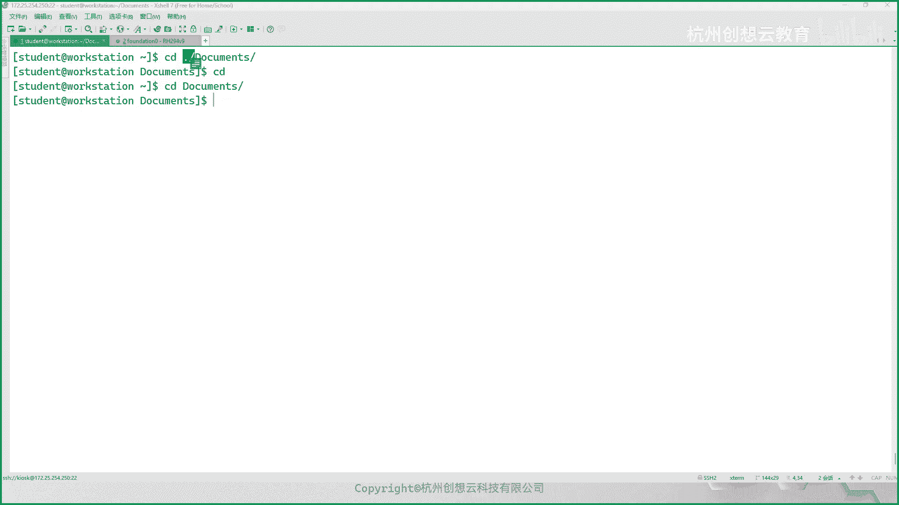

# 红帽认证系统管理员RHCE 9.0 (2023年最新版）-1 - P1：1-2 - 杭州创想云教育 - BV19z4y1q724

好咱们开始啊，开始咱们接着上午的内容继续啊，好那么我们来接着看第二部分，第二章，第二章第二节啊，那么使用桌面的来访问命令行，好准备好，ok那么这一小节的话呢不是很重要。

那么主要的目的是给大家来介绍一下呢，如何去使用我们的桌面啊，那么对于我们限额，对我们的课堂上而言，那么主要的目标呢就是我们大家要知道啊，怎么在桌面上做一些设置，很多人不用啊，不用。

我觉得这东西吧就和windows是一样的是吧，哎只不过位置什么的不一样，但是里面的设思路是还是都是一样的，哎都是一样的啊，ok好，那么首先呢我们在介绍第二节之前呢。

我们先简单说一些啊，这个知识点啊，知识点ok图形化界面啊，看这边，那么是这样的，ok在linux当中啊啊x当中，那么是那么我们的图形化界面是非必须的，啊是非必须的，为什么呢。

因为我们的linux的所有的发行版当中啊，发行版当中，那么桌面只是一个可选的部分，哎你又理解为是一个独立的软件啊，它不是系统里面的必须的啊，唉不是必须的，不像windows我们的桌面版对吧。

哎你要想装系统呢，你桌面肯定要装的呀，人家的产品叫windows对吧，fire叫视窗操作系统，你没有涂完界面还叫视窗吗，是不是啊，所以必须要有啊，但是呢我们的linux只是一个可选一部分了啊。

好那么我们的linux的立任何的发音板，在安装完之后，默认都是只有字符的，哎只有字符界面或或者叫文本界面都是ok的，那么如果你想安装通话界面的话呢，首先要装一个什么呀，你要安装一个图形驱动服务器啊。

然后呢再去安装一个什么呀，桌面诶，啊桌面，那么对于图形驱动服务器而言，那么我们目前为止有两个，一个呢是叫做x d o r g啊，这个呢是一个传统的啊图形驱动服务器啊。

传统的一个啊我们也简称叫做x 11啊，第11代图形服务器啊，然后呢另外一个呢是新的叫van，啊van那么这个是新的啊，一个新的啊，一个图形界面服务器，那么对于linux软件而言呢。

那么很多的软件都是基于qt来开发的啊，qt来开发的呃，那么早期的时候呢，那么很多软件啊，那么他在和我们的这个x。o r g的，这种图形服务器的兼容性是比较友好的啊，是比较友好的。

ok那么而对于v land的话呢就不是很友好，但是呢好在于啊，这个qt呢在新的开发的时候呢，也都是支持未来的啊，也都支持微软的啊，ok你想还有些什么gt 3 gtk 3对吧，这种版本的啊开发。

ok你想对于未来的事，为什么我们要选择未来的呢对吧，你既然x o r g对图形，老的软件支持的比较友好，为什么我们选择未来呢对吧，因为linux的软件本来在图桌面领域又比较少，那你还更新了新的软件。

变得更少10k那你为什么用用新的呢对吧，因为新的的话呢，我们知道在现代的新的这种计算机而言啊，像这个我们的笔记本，你在买的时候怎么一般来说都有个雷电口吧，稍微高端一点点的是吧。

你的你的分辨率怎么也得2k3 k吧，4k是不是哎，那这种的话呢对于bliner而言是支持的，而对于x。o yg呢就支持的不够友好，唉，所以说我们要适合当前的硬件的环境而更改啊，看你像我的那个个人pc啊。

等到了我在我一直等到了real 8。8。2的时候，严格来说是八点啊，要是8。18。2的时候啊，我那个笔记本才能装上去，早期的时候直接裸装，装不上去的分辨率太高了，装上去就是画面就撕裂掉了，那就撕裂掉了。

ok还有对雷电口的支持也是比较为友好的啊，啊这些，那么装完之后呢，我们就可以选择什么呀，啊自己喜欢的桌面软件了，那么这个桌面常见的有哪些呢，比如说呃有这个对吧啊，然后，一个sorry啊。

s p c e啊，哎有没有这个a来着，嗯搜一下还是f a c e k f c e啊，这是一个比较轻量级的桌面，还有我们红帽现在用到的gnm桌面对吧，现在基汤姆像右边图啊，他现在也在用启动桌面。

早期他还有utt桌面对吧，还有一票流程的kd e桌面啊等等等等吧，大家都可以去选择啊，都可以选择好吧，找你自己喜欢的桌面去用啊，红帽因为咱们是企业版嘛，早期的时候呢会给我们提供kd或者gtm 2选一。

但是呃因为是服务器版本的，所以它默认的主题呢还是比较丑陋的啊，不像自己装桌面啊，比较漂亮，所以说呢在我们新的成real 7开始，那就不再提供kd e的桌面了，那只有gnm哎。

gnm因为gdp是以精简而著称的，哎今年到太经典了，很多人都不适应，桌面上什么都没有，就一个activities啊，非常非常的非常非常的经典啊，非常非常经典，看ok好，那么那么你像我们现在啊。

像我们现在的话呢，用的就是一个van的驱动的一个gomm 40版本啊，四星版本，那么在登录的时候呢，大概呢就是我p p t上的这个样子，那p点这个样子，当我们你像我们的pd上啊，那么登录成功之后呢。

你可以选择。

因为我们其实也可以选择谁呀，也可以选择支持对传统的驱动的支持。

但是我们如果你的是个人pc的话呢，我们建议走b line啊，左边land你可以在登录付密码的时候呢，你的屏幕右下角有一个齿轮啊，你可以选择不同的驱动服务器，ok那么当我们登录成功之后。

会看到一个类似于这样的界面啊，当我们按下windows键啊，windows键，那么就会看到一个这样的一个界面啊，那么这个界面都是干什么用的呢，给大家介绍一下啊，我们在标记号为二的位置呢。

是我们的一个activity活动概览啊，当你点开之后呢，会将当前所有窗口呢进行一个缩放啊，缩放啊，嗯然后呢接着呢这个，右上角呢是我们的一个什么呀，一个功能区域啊，在共区域的话呢。

我们可以看到我们的本地连接对吧，然后运我们电源模式是走的节能的，还是均衡的模式啊，然后呢还有就是设置settings，那还有是否锁屏电源的管理啊，这一块是有的啊，那么在最下方呢标记号为四个部分。

就是我们的dashboard了，仪表盘啊，上面有我们收藏的应用程序的图标，也有刚刚打开窗口的这些应用图标的一个缩，缩略图啊，啊在dashboard的右侧有一个show applications啊。

可以用来干嘛呀，可以用来这个显示我们所有的应用程序啊，然后中间呢就是我们预预览图了啊，最上面的话呢呃我们称为是面板啊，面板啊，上面可以显示我们的时间和日期，还有搜索啊，六的话呢是一个另外一个工作空间啊。

啊比如说我们我们教学环境当中也好啊。

啊那么用迅捷也好都是可以的啊。

比如说我这边用word session啊，大家看一下我们的这个图形界面对吧，唉我点击账户名啊，输入密码啊。

右下角有一个齿轮啊。

我们点开嗯，默认我们走的是s 11吧对吧，你可以选择经典的呃，这个主题自定义的都可以啊，然后呢回车。

我们来看一下，啊唉这时候呢就登进来了对吧，默认啊整起来就这个样子，因为我们虚拟机里面没有做壁纸，是黑的背景啊，黑的背景，activities的搜索栏对啊，然后呢这个功能区这个面板还有功能区域。

但是bot等等啊，我们点击，这时候呢我就出来了，想换个壁纸，鼠标右键选择change background啊。

然后呢就可以选择自己喜欢的壁纸了对吧。

比如选一个带real 9的标志的啊啊，然后关闭掉诶。

什么个情况。

分辨率的问题吧，可能是分辨率的问题啊，然后这个壁纸怎么显示的不完整啊，大家可以在物理机上测试也行啊，虚拟机要是感觉不舒服的话呢。

那么咱们就在物理机上测试也是可以的，选择change background对吧。

比如说选择real 9哎，双击一下就可以了，是不是哎我们的壁纸是不是就变了，哎b着就变了啊，这就是这个换壁纸，然后除此之外呢还有什么呢，哎右上角有一个功能区域，我们点击一下啊，点击点击一下。

然后呢我们干什么呢，注意啊，这里的网络大家千万不要去做任何的更改好吧，不要去动啊，不要去动好，然后呢下面有一个settings啊，三行4k啊，三行四点开对吧，但那么这是一个整体上的啊。

那么我们关心的有哪些呢，比如说蓝牙对吧，蓝牙设备啊，背景啊，多任务对吧，哎点击哪里会显得做任务是吧，左上角啊热点是吧，还有什么你的，所谓啊然后还有什么呢，你已安装应用程序的一些设置对吧。

有没有发现这个界面，有点像我们手机上面的那个设置界面，是不是啊，唉特别像啊，还有隐私对吧啊还有这个什么呢，往下还有这个比如说声音电源对吧，电源的话呢对我们来说，你可以选择什么高性能模式。

平衡模式或者节能模式，这个我们一般不用啊，不用管它嗯，然后下面有一个有一个节能的一个选项啊，有一个细屏时间对啊，现在时间啊就是一个呃呃这个叫什么呀，叫做那个，暗屏啊，就是说亮度就降下来。

ok下面一个screen blank的话是熄屏时间，默认的话呢，我们的这个桌面是五分钟就锁屏了对吧，你觉得时间太短，你可以去调整对吧，比如改never永远不会锁屏，对不对，哎你根据自己需要去做调整。

displ，咱们上午呢给大家简单介绍了啊，可以用来更改我们的分辨率啊，没有特别谦让的小伙伴啊，那么分辨率这块呢是要改成适合自己的啊，自己的，ok嗯因为我们的分辨率比较p还是蛮低的啊，只是1080p的。

如果你是2k3 k4 k的话呢，这里还有个缩放对吧，比如说4k的话，你可以缩放成150%或者是200%，250都是可以的啊，根据你自己喜欢是吧，其实玩linux的话呢。

你的显示器的分辨率呢建议是2k左右，是最友好的啊，因为linux对桌面不是很擅长啊，你分辨率太高的话，对他来说对他而言其实是有伤害的啊，有伤害的啊，ok等等和其他的选项吧。

大家根据这个内容可以自己去看一看好吧。

哎就在物理机上去去看一看，长什么样子就行了啊。

这个大家一定要会用啊，会用简单的很这个啊啊。

然后呢如果我们想想打开一个终端的话，那就点击左上角的activities，然后呢再点击dupd当中找到tina就行了啊，就可以打开啊，打开一般我们就选择这个，因为新版本的机能模式不支持。

鼠标右键打开终端的啊，以前是有的啊，然后还可以自己呢干嘛呀，在虚拟机里面去测试啊，啊虚拟机里面可以锁屏啊，注销啊啊咱们线上的就不要锁屏和注销了啊，还有关机和重启啊，线下的话呢不要关机啊，不要关机。

ok现在就关机了，我还在给你开机，很麻烦啊，很麻烦，ok啊这个呢给大家几分钟的时间熟悉一下，然后如果你没有如果你没有目标的话，怎么办呢，大家把教材看到26页，上26页吗，我看一下啊，别着急，看一下啊。

看下是几下，稍等一下，啊25页啊，教材25页是不是有一个指导练习，25页啊，一个指导练习使用桌面访问密行，看到吧，啊这个呢大家可以试一下好吧，试一下实验啊，给大家两分五分钟的时间吧，啊五分钟的时间啊。

嗯给他们改密码啥的也没问题是吧，那没事，上面有步骤，你改完之后，你还原的，赶紧敲呀，咋还有三分钟嗯，啊对了啊，再说一下啊，大家说一下诶，呃是这样的啊，就说给大家说一下啊，就是我们我们线上的环境啊。

我们现在的环境，还有咱们上课的环境，用的是九教材是八嘛，是不是，那么大家的脚本呢是这样来执行的，我发到自定群里面，就说我们的书上就real 8的教材的命令呢，大概是这样子的。

叫lab叉叉叉start对吧，我举举一个命令，那么在我们的real 9里面的环境啊，应该怎么敲呢，变成level什么呀，start是个啥，ok就是把那个动词换个顺序就可以了，就可以了啊。

是不是就可以了啊，就这么点变化，其实都是一样的哈，这是红毛新开发的课程，讲课的环境啊，好这个这个实验比较简单啊，就是帮助我们熟悉一下桌面啊，别的也没什么东西，这个不重要啊，不重要啊。

嗯然后呢我们接着继续好吧，接着继续啊，有大家一定要记得有问题的话，其实说啊啊好，然后呢我们来看第几节呀，第三节对吧，第三节我们来看一下啊，第三节，第三节的话呢是给大家介绍一些常见的命令啊。

常见的命令ok，嗯首先呢我们前面讲过命令的语法结构，我们要知道啊，命令的语法结构，ok，啊这个基本的命令结构啊，对吧，我们知道dollar符呢，在这里呢代表的是提示符啊，在提示符的后面啊。

那么需要输入命令啊，啊是这样的一个一个组合啊，就是命令空格，然后呢选项，大家发现我的水晶是用中火红火起来的对吧，那么就代表是这个地方呀，要根据需要进行去写，也有可能这个命令后面是没有选项的啊。

好然后呢选项后面还有个什么呀，参数诶，参数这是一个标准的一个结构啊，命令选项和参数，那和参数，那么解释一下什么是命令，命令的话呢，那么它就是以本质上来说就是一个软件对吧，哎本质呢是一个软件。

但是当这个软件呢在我们的linux里面啊，它是一个什么呀，它是一个可执行的，就文件啊，可执行的文件，啊严格来说是一个二进制的啊，是可执行的二进制文件，ok那么那么这个命令通俗一点理解呢。

它其实就是个什么呀，唉就是一个工具，是不是啊，一个工具啊，要工序，那么我们以windows为例对吧，我们要想聊天对吧，来我们桌面上可以选择qq微微信对吧，还有丁丁唉都可以对吧。

那么我们在mix里面的话呢，就需要找到什么呀，和这个软件匹配的命令就可以了啊，那么我们可以把它给做成一个汽车好吧，我们可比喻成一个汽车，哎汽车对吧，可以动起来对吧啊，然后呢选项选项的话呢。

它是干嘛用的呢，选项的话，它的作用是用于那更改命令的行为的啊，密切行为的，ok那么对于选项而言，它有两种语法结构，常见的一种呢就是unix风格的，就是短横线后面跟上一个字母这种的，另外一种呢叫什么呀。

叫gnu风格，金庸风格的话呢，他呢是全拼，风格，那么就例如杠杠什么呀，杠杠这个format啊，两个短横线，然后呢加上一个英文单词的全拼啊，这是这两种是常见的，还有一种呢是我们不常见的是bsd的风格。

对啊，那么例如写个c没有大数符啊，没有大数符，就这种的啊，就这种的啊，ok然后呢要注意的事情，就是有有有些场景情况下，有些场景下，啊有些场景下的话呢，这个，我们的选项啊，有对应的值，啊对应的值。

ok我们给大家举个例子好吧，举个例子啊，举个例子的话呢，我们把这个参数讲完之后给他举例子好吧，那么我们给它把它比成什么呀，我们举举个例子，比如说呢把它当做一个导航设备好吧，啊这个导航设备ok好。

然后呢最后一个是参数，参数的话呢指的是我们命令什么呀，执行的目标吧，哎这个目标啊，哎我们举个例子，例如谁呢，例如我们的目的地，对吧，那么问题来了呀，我可不可以只开着车，也不用导航仪，也不选择目的地。

可不可以，可以的吧，是不是漫无目的的去开车，可以的吧，哎然后呢我去这个地方呀，我不知道怎么去，是不是啊，唉我干嘛呀，我用的导航设备，导航说往左走，我就往左走，然后我就往右走，我就往往右走。

是不是更改过的行为了，对，哎或者说或者说我我知道这个路往前走就可以，但是呢今天那边修路了，导航说你往左走吧，是不是也是改变了我们的行为，是不是哎，ok参数呢就是目的地咯对吧，哎我设置目的地去哪里啊。

我要去上海是吧，今天要去上海出个差是吧，开着车去上海，ok怎么去走高速，是不是目的地，ok好，我们举个例子，比如说在我们的终端上面啊，走一个命令啊，走个命令加什么呢，比如说l s只有一个命令对吧。

唉列出当前目录的所有文件啊，所有文件列出了没有任何的选项，也没有任何的目的地是吧参数，那么这时候呢我加一个选项，ios跟l，啊这一看是一个什么格式的选项，是不是u类unix风格的对吧，哎回车y回车。

但是呢我们一旦回车，你会发现他把当前目录的信息虽然也列出来了，但是和以前是有有所区别的是吧，哎比如说显示一些很多，我们目前可能看不懂的东西啊，看过东西，那么问题来了，那么这个l是什么意思呢。

啊大家说的是list，那如果你没有接触过命令，那你知道他是list吗，刺激对吧，唉你不知道呀，为什么呀，那l带l的单词的东西多了，但是问题来了，这个l真的是list吗，不是吗，他不是ok是什么意思呀。

我们先超纲看一下好吧，哎我们换一个这样的命令，l s用个gu风格的杠杠help走一下，是不是好多小姐，我们用鼠标往上找一找，我们找小l看看啊，小l应该代表是什么呀，一使用什么。

long listening，listing format是一个长的列表格式，那这个l是long呢还是list呢，是不是哎有点牵强了吧，你说他是list吧，你这里的list好像感觉像是一种名词是吧。

哎动名词了是吧，名词哎长的，所以说这个l的话呢对吧，好像不太合适，因为你说这意思的话，那我l s本身就是类似的意思呀，是的对吧，我list list啥意思，是不是我列出列出是吧，啊好像这个这个l的话。

long可能更加合适一点是吧，哎language合适一点啊，所以说就意思就不一样了，但是呢我刚才这个命令在执行的时候，我不用问大家这个是什么意思，大家能猜出来吧，啊什么意思啊，帮助吗，是不是哎帮助。

所以说这种兼优的风格呢，优点就在于，我一眼就能看到这个命令是干嘛用的，是不是哎，然后呢短格式的话，那只能猜，但猜肯定是不行的啊，猜的话会出大事的，对不对，有些命令这个选项在a命令上可能是无害的。

你在b命令上你猜可能是有害的，嗯这个很危险啊，说不能拆啊，不能拆，那么你说的短格式既然如此，为什么我们还要读懂短格式呢，哎我们再来一次l s杠l谁呢，i我加个i回车，相当于走了一个杠。

l杠i或者是l s杠i杠l都是一模一样的，是不是没有任何区别，那么这个短格式的优点了，有些短格式呢它是不分先后顺序的，但有些是分的，并且呢短格式可以合并在一起，啊合并在一起，ok这就是短格式的优点。

那么长格式呢你肯定不能这样写了吧对吧，只能单独的选项啊，拿来用，你不能说我把hr和什么什么写一些长串，是不是，那肯定不行啊，你不能说啊杠四杠什么呀，哦啊然后呢这个这个我们help一下吧。

找一下长格式的选项对吧，比如说这里面有一个什么呀，看看我们我们比如这样子啊，l s什么呀，哦杠杠cn tt，哎这样可以，但是你不能这么写呀，是不是你合并在一起是什么个意思嘛，对吧，不能组合哎。

这就是各有缺点啊，没有说绝对的优势，你像那个power shell呢，它的选项基本上都是长格式的，长格式的话其实是属于更高级的语言对吧，唉更高级的语言啊，简单的话呢就是好记。

前提是你你你记我才感觉好记对吧，你第一次接触你就感觉不好记，哎全是二个字母，一会儿这个意思，一会儿这个意思，我说记得住呢，对不对，会出现这种感觉啊，其实唱歌是来说更加友好，但是挑起来累啊，敲的多了。

你会发现短格式是友好的，这个友好是刷双引号，只是对你的我们的劳动力而言是友好的，但就是记忆而言其实并不友好，哎最友好，ok就是这种，然后还有一种呢是bs避风格的啊，我们来一个啊p s a u x啊。

ax哎，这里面我没有加任何短横线和，长的两个短横线吧，哎一有能够执行，可以打印出来我们的进程信息对吧，就是bsd风格的啊，b sb风格的ok好，那么除此之外呢，我们再说参数对吧，参数参数的话。

那就意味着是我们的目的地呀，比如l4 杠l d我的目标是谁呢，这里有这么多的目录，我的目标只有一个，就是d o c o m e t s这个目录会车，他就不会打印其他消息了，这就是我们的参数目的地。

ok好，接着再来说这种情况，还有一些选项呢，它是有自己的匹配的结果的，比如说举个例子啊，举个例子，现在呢我换个身份啊，s s h root at server a，那我用root身份。

我怎么命名叫usr i的杠u2000 啊，然后后面写个，啊作为一个人名sara，ok那么这里的2000是什么呢，可用是什么，对吧，杠u是干嘛的，对不对，ok那么这里的user i就是命令了。

杠u的是我们选项了，那么这个2000呢是我们选项的参数，而这个呢是我们的什么呀，命令的参数是不是啊，哎面参数或者我更多更难复杂一点，杠s写个b s h又来了一个选项，又来了一个选项的参数。

你说那我能不能省略一点，我这样写udi杠u s2000 ，s h对吧，sara行不行，no不允许对吧，这种的话呢就是有严格的规格的，因为老师你说这么多场景我怎么去记呢，当你发现不好记的时候，就不要去记。

因为这些命令都是一些命令特性，你随着使用，你会发现就能干嘛了，就记在心里面了，不用刻意去记，记记那玩意干嘛呀，太累了对吧，哎开玩笑，就举个例子，我把你的双眼蒙上去，然后呢你你手里面干嘛呀，拿一个饼。

我就不相信你放不到嘴里面，呵呵是不是啊，哎你不需要知道你的嘴巴在哪里，为什么呀，因为你的你的各方面都在告诉你，应该往哪里送东西吃，是不是当你形成肌肉记忆的时候，你就可以了，不用去刻意去记啊。

记好这是我们给大家说的命令的这些内容啊，内容ok好，那么除此之外呢，我们要知道一件事情，就是说我们的一个终端上面呀，一次只能执行一个任务或者一个作业都行，或者要叫一个命令啊，我们举个例子。

我举过这样一个命令，叫写个sleep，sleep是什么意思，睡觉睡觉啊，睡多长时间呢，写了个三睡觉三秒钟回车，这时候我能敲命令吗，能敲，但是刚才能不能执行呢，不能ok那那怎么办呢，我这样写sleep。

但是我又想敲一次，我不想等待它结束对吧，比如说人家要休眠多长时间，要休眠一个六秒对吧，但是呢我要着急回家，假如这六秒是24小时或者是一个小时对吧，执行完之后才能执行另外一件事情，但是我要着急回家。

是不是我不能等等等等一个小时吧对吧，唉我们可以干嘛呀，加一个分号，唉后面再走第二个命令，那么这个封号就代表的是命令的先后执行顺序，分号前面的先执行再执行封号，后面的一次还可以再加吧，还得再加啊。

然后hello，可以呀，走起123456出来，你看先执行了sleep之后，l s跟l吧又执行了echo hello吧，是可以的吧，但是呢这种命令啊，他只是说按照你的信用顺序，就相当于你写了几个封号。

就相当于干嘛呀，你在终端上依次去执行了哪些命令，他对命令的执行成功与否是没有任何的校验的，嗯ok你你想想校验怎么办，比如说只有sleep 6秒钟成功了，才能去执行ios，那怎么办。

我们会用这个符and符，要and的跑哪去了，and and ok走这个命令，这叫逻辑与啊，上面这个叫逻辑或啊，不不这个就没有逻辑逻辑关系啊，这个没有逻辑关系的，只是强顺序，而已啊，这个叫逻辑逻辑快。

叫逻辑和逻辑合都行，逻辑宇宙行，ok那么就前面只有前缘成功了，后面这个才会执行成功啊，那他单独一个和两个有什么区别啊，省事儿哈哈，方便一次就敲一个就行了，你举个例子，我们编译反正装一个二进制软件的时候。

要先编译成功了，我才能去安装，这样那我就先去干嘛呀，先编译嘛，and and install对吧，起个前条件吧，是不是很一般，我们在写脚本的时候会这么用啊，那么命令行的话用的少啊，用的少k逻辑这个啊。

这个因为这属于是shell里面的特性啊，我们只是给大家提了提啊，提了提好，那么这个注意了，在我们的视角当中，同一个绘画，啊下同一时间干嘛呀，只能执行一个作业对吧，哎作业，那么要想连续性的话呢，是吧啊。

这是一次性的话呢，可以干嘛呀，command一封号，command 2，代表的是命令的先后执行，command 1，and and command 2，代表的是命令信号执行，但是前提是什么呀。

前面哎command一成功才会，执行command 2啊，那我要想写两个命令，任何一个成功都可以，用这个符号好，为了更加清晰啊，我干嘛呀，我加个空格啊，这样大家看笔记的时候要更加的清楚一些。

唉这个呢是也是命令的什么呀，先后执行，但只会好呀，执行一个吧，一个啊哪个成功，第一个成功了，第二个命令就不执行了，第一个失败了才会进行第二个命令，是不是，比如说举个例子，第一个是代码做判断。

如果磁盘存在就干嘛干嘛，是不是有点像if一哎成功了啊，如果先判断第一个命令，先写个判断啊，干嘛干嘛，如果没有成功，就只能第二件事情对吧，比如说我按我这个是一个两个服务有依赖关系。

第一个服务是web服务器，web服务器重启成功之后才干嘛呀，让我们的前端的负载均衡服务器成功嗯，你不然你前面你失败了，你后面起来起不来没有意义，是不是啊，那第二个命令呢是吧，哎第一个命令是干嘛呀。

这个这个充充气阿帕奇，第二个呢是重启nginx，那这两个呢都是为了提供外包服务，任何一个都可以无所谓，虽然这个例子不太合理啊，只是想说明问题啊，你看说明问题好，就是这个命令啊，书上就讲了一个。

我给大家讲两个啊，两个这是我们在写shell的时候经常用到的好，然后呢接着啊接着我们介绍一些简单的命令啊，比如da date命令啊，日期吧，日期啊这个命令简单来说呢，我们在普通用户的身份下呀。

可以用来打印时间，它的格式呢是周日期和时间时区啊，市区o这个时间就有点偏差，是不是哎3月5号凌晨的一点分啊，嗯然后呢我们还可以干嘛呀，使用这个命令啊，data杠杠help啊，然后呢这里呢有些特殊的格式。

我们来看一下这个帮助信息啊，也是要会看的，刚刚还好的，一般是用来打印帮助信息啊，一般啊也就意味着还有二班的情况对吧，人家有个名可能不识别这个选项是不是，ok那么语法最常见语法就是data命令啊。

后面后面跟上什么呀，没了，你看都是中国红吗，我也可以不加嘛是吧，还有一种呢就是跟上选项，还有一种呢就是data命令跟上一个中括弧，加format啊，哎加for it是什么意思呢。

那我们要看看这个form还有这个option，option，像这种都是option啊，那么这个加format什么意思呢，我们往下找一找，哎你发现这里面有我们叫什么叫formula的，哎，format的。

ok那么这就有意思了呀，比如说这边找一个，比如说我们找一个谁呢，找一个大地，大家d的话就是七类似于什么呀，小m小d和小y那小m有什么意思呢，小m是什么呀，月份小d是我们的日期日对吧，小y在下面了。

应该是找一找，小y是代表的是我们的什么呀，年的后两位数字对不对啊，唉那么就意味着我们如果写个小，我们如果写一个这个这个这个大d的话呢，就类似于应该会输入个什么小效果呀，这个应该是个解压三吧，嗯小m月吗。

现在不是3月份吗，三那小d应该是5号吧，三斜杠5y的是二三吧，哎那我们来试一下对吧，大百分号大d啊，是format，但是人家这个语法里面是有个加号呀，对不对，所以说应该是什么呀，data加百分号大d唉。

就是这样来看帮助的啊，这样看帮助的，ok还有说其他的，比如说小x年变成了长格式，是不是还非常非常多啊，哎那现在呢我想看一看我们当前的系统时间，距离1970年1月一日过去了多少秒，怎么办。

因为这个时间非常重要啊，因为计算机的时间实际是，你可以理解为这个相对时间，它是从由千年1月一日算起的，这就是计算机的他的神诞生那一天，是不是啊，这样很理解k的元年啊，说计算机哎对外的时间，那么怎么算呢。

哎我们来hero玩家看看有没有，啊来找啊，找一找，又出来了，小s描述从哪里，从这一天看到没有，小s来试一下呗，贝塔加百分号，小s吧，是不是就出来了啊，说出来了，这个这个这个语法一定要会算呀。

同志们一定要会算啊，那我说我不想看今天的了，我想算一算，2023年5月1号，这一天距凌晨吧，就是凌晨零点秒钟好吧，这天距离197年1月一日是几秒钟，怎么办，啊我说我是一个应用程序，这个应用程序呢。

它的时间有效期，就是按71年7月一日的描述来计算的，我希望这个应用程序对某个用户的有效期，就到那一天过期，你只能用这个秒数来添加，啊比如web界面上面哎，有效期到什么时候会写备注。

距离17年1月一日的描述，你需要粘贴上去怎么办，ok小s我们已经到这描述了，那怎么办，再去帮主看一看好吧，这里面有一个选项叫什么呀，找一找找一找，杠d是什么，杠杠date日期什么日期啊，显示的时间什么。

我们后面描述的时间吧，不是现在的，不是现在的，ok那么我们这样那么试试行不行，杠杠贝塔等一个2023年的0501，这一天后面再出一个加百分号s，可以变了吗，变大了吗，对不对，变大了，那变大了。

那那你到底对不对啊，我们来算一下吧，bc这个数减去当前的这个时间，这描述吧，好秒数再除以一天是几秒呀，是不是86400秒还是多少呀，是不是56天，56天是56天的话呢，是几个月呀，不到两个月嘛。

那么我们现在到5月1号过两个月吗，3月5号4月5号一个月吧，4月5号到5月5号够不够一个月，是不是正好差那么一点点啊，啊不差四天，对不对，对的啊，ok，这是data命令啊，像临时改时间。

除非你root权限啊，也是可以用data命令临时改时间的啊，我们现在就不要改了啊，不改了啊，这个下去自己去看帮助，好吧好，接着呢我们再来介绍个命令叫wc，那单c呢是这个w呢是word的意思。

c是count统计的意思，哎又统计我们的单词的数量啊，可以用来可以用来干嘛呀，可以用来打印我们这个文本当中的有多少行，有多少个字对吧，有多少个字符啊，这个字的话呢我们可以理解为是什么字呢，上来去看一下。

啊这个字啊，字的话呢，这是什么呀，word对吧，word哎word单词吧，嗯注意啊，这个这个和中英文是有差异的啊，翻译和中文是有差异的，ok好，那么我们来试一下吧，比如说wc杠l呃。

etc下的pass lil d啊，用几行呀，41行啊啊就这样来用好吧，刚刚还可以获得帮助啊，获得帮助，嗯嗯然后然后呢我们再说下命令，比如说想那既然41行呀，那这个文件里面放什么内容呢。

是不是哎是什么内容呢，哎我用cat命令吧，有人说对吧，cat命令哎可以看这个文件，但是注意啊，cat命令只能来查看常规文件，就是说这个文件打开之后呢，我们人是可以看得懂的，才可以开cat命令。

用来查看文本文件，ok啊，查看文本文件啊，cat命令可以试一下啊，cat命令，好cat命令，ok好接着刚才既然说到了，我们cat命令是查看常规文件的，那么问题又来了呀，哪些是常用文件啊。

哪些是非常规文件呀，是不是啊，唉比如说我们来到dv下面，那这些文件是不是常规文件，对不对，这么颜色这么多颜色，是不是，如果不是它，那么它又是什么文件呢，ok注意一句话，咱们linux里面有句有句话叫叫。

这个叫做一切皆文件，所以说当你不知道什么文件的时候，你说他是个文件哈哈对不对，百分之百对，是不是哎100%对啊，一切一切皆文件啊，老师我们这边有啊，你去我们办公室那个拖把好，一起建文件啊。

ok这是我们的一句话啊，一句话ok这个就跟北方似的对吧，我们北方就是对吧，哎这个菜对吧，馒头米饭啊分得很清楚啊，不是的，我们一般鉴定的诶，你吃饭了没，我们这个饭代表了一切可以填饱肚子的东西啊。

南方的话吃饭了吗，后面才意味我肯定还要吃菜的呀，是不是哈哈不可能只吃米饭呀对吧，我们这里的一切皆文件，就这个意思啊，比较龙给它是一个描述啊，一个描述啊，老师那边再拿一个啊，他那边拿着呢。

然后还得等一下啊，他让我先过了，ok这一切皆文件啊，那既然一切皆文件，那我不可能那得分个类吧是吧，你到底什么文件呢对吧，哎我们可以用这个命令叫f ok fell命令的话呢。

可以帮助我们去判断文件的类型啊，非要可以帮助我们判断文件类型，比如说比如说谁呢。

比如说我们刚刚见到的这个t t y1 。

ok这里的t t y一啊，到底是干嘛的是吧，哎我们来分享一下t t y一是个什么呀，是一个特殊的字符文件，唉是一个特殊的字符文件，ok那么这里的block对吧，fb l o c k是个什么文件。

是一个目录文件，ok是一个目录文件啊，那么那么刚才我们的那个etc下的pass wd的文件呢，它是一个阿斯特码文件，唉，我们都可以通过file命令，帮助我们验证文件的类型，那文件的类型。

ok虽然一切皆文件啊，但是呢我们可以通过file帮助我们来判断啊，排版啊，啊那么刚才呢我们判断好了，这个etc的pass打入d啊，那么问题来了，我刚才通过cat命令看到了这个文件当中的内容，但太多了。

是不是太多了，那有没有什么方法帮助我去筛选一些，就是看看起来更舒服呢对吧，比如说我只关心文件的前面几行，那么我可以使用这个命令叫hand，对hand的意思就是头的意思嘛，哎从文件的开头往后看看几行杠。

n我要看三行啊，后面跟上etc pass wd，二三行哎，三行就ok了啊，那我想看文件的末尾的五行，tail杠n5 行etc下的pass单位d，啊非常舒服，啊非常舒服，ok但是呢我们这样操作呢。

依旧没有办法将整个文件内容看完，并且呢可以进行控制，对于这种长文本的内容，我们可以使用这个命名，叫more更多哎，后面跟上文件名，这时候呢我们可以使用空格键进行向前翻页啊，来浏览文本的内容。

啊more命令啊，more命令啊，这一页看完了，按个空格就来到前面了，好吧啊，莫名令啊，可以试一下啊，猫咪好，再来一个，你这个能往前看，不能往后看呀，对不对。

我们还给一个less etc加的pastd对吧，我一往前看，往回看都可以啊，往前看呢分屏空格键换行，往那个方向键的下键，往回看方向键的上键都是可以的，好这是给大家举的几个命令啊。

我们来简单总结一下cat命令可以干嘛呀，cat查看文本是吧，ok非要用来判断文件的类型，ok wc呢用来统计文本文件的行啊，字还有什么呀，字符的数量，啊数量啊，然后呢这个tail命令可以干嘛呀。

文本的后面若干行对吧，啊其实太阳没，你说我能不能倒着数对吧，我除了第一行不看之外，剩下我都看，因为我不知道这个文件有多少行，我不知道这个文件有多少行，但是呢我前面的两三行对我来说没有用，我不想看。

我只想看后面的，我不可能先看多少行，数一数，然后再减去前面三得出结果吧，能懂吧，我们可以把那个正数变为负数就可以了，叫倒数唉，倒数杠n杠三，那就变成了不看前面的三行，只看后面的几行，ok懂我意思吧。

他要杠n3 是倒着数，三行kr杠n杠三就是倒着数，前面的三行不看看剩下所有，同样hd命令也是可以的啊，hd命令啊，看文本的前面几行几行，ok嗯，然后还有什么呀，明明刚才没说到less和more是吧。

more啊，还有less，啊用来干嘛呀，查看文本进行一个什么呀，分页分页显示，啊分页显示特别看长文本，我们特别好用啊，特别好用，啊这是这个命令啊，然后呢接着接着啊，我们再给大家介绍一些快捷键，ok。

呃从real 7开始呢，我们可以在我们的系统当中啊装一个包，这个包我已经装过了啊，大家不用装了，但是你自己在工作当中如果想实现的话呢，需要装一个这样的包，叫谁呢，给大家找一找有包啊，啊就这个包啊。

这best condition，这个包啊，接下来我们学习到软件包安装的时候，大家就可以去安装了，这个我们隐藏过了啊，就不用安装了，那么装完之后有什么效果呢，唉我们来举个例子啊。

比如说比如说啊我们敲一个命令nm c l i，唉但是呢我呢记不清了，我就记nm怎么办呢，按下t宝键，按一下没反应吧，这样一来，这样一次哎，他就会把所有的和nm匹配的命令，都已经拿出来了，嗯ok啊。

然后呢哎我我我要c l y啊，哎就当唯一的时候立马就补齐了，是不是我想看看我的连接情况，在table连接的吗，connection吗，你看c table了，干嘛呀，再table一下哦。

好多是不是这里面有一个show就show一下吧，回车就行了啊，利利用table按键可以帮助我们补齐命令，防止我们敲错啊，当你命令记不清楚的时候，你用table键好吧啊，不要人家怎么敲的单词。

你有一个一个字母不差的，你以为一字不差的抄上去了，实际上呢你可能敲错了，是不是就直接报错啊，就这样报错啊，啊这是我们的table按键啊，希望大家能够善于使用啊，sin sin。

然后呢如果呢我们的命令比较长，我们可以换行来显示啊，放上来显示，举个例子，对吧，比如说我用cat命令啊，这个不准确啊，嗯我用echo eq是打印消息吗，打一个什么消息呢，这个hello，哎。

我我空格不写了，写个反斜杠啊，回车诶，他并没有执行，哎，在等待一些新的内容输入，hello，谁呢，hello啊，这个这个这个这个感叹号逗号是吧，这个i m又不写了，空格看下个对吧啊，i m什么呀。

im这个i n s t r u c t o r啊，没了回车啊，然后呢，因为我们这个单引号嘛，再竖个尾，啊是各位啊，因为我们是echo嘛，他就把那个东西都已经打印出来了，我们再换一个长一点的。

因为单引号的话哦，sorry，我们不应该用单引号，我们应该用双引号哈，因为单引号有特殊含义的啊，ok我们重新来演示一下啊，echo双引号，hello，对吧，都写字画写在这里吧，空格啊。

反斜杠i m a i n s t r u c t o r好吧，据点啊，我再写一个反斜杠好吧，唉然后呢写个什么呀，就写个那姓辅助吧，好回车，双引号回车是不是一行啊，好像单词写错了，碰到一个按键啊。

但是呢我们这个东西是一行输出啊，换行换行特别适合屏幕窄的时候，命运又很长啊，我们适合换行，这样的话呢更加清晰啊，清晰，然后呢我们可以在终端上执行一个命令，叫做history。

啊history可以列出来我们当前绘画之前，所有的历史命令记录，啊，history，啊当前用户绘画的历史记录，那么裂开之后呢，我们可以使用感叹号啊，跟上之类的行数或者感叹号跟上关键词，他会去匹配啊。

根据行数的话呢，它就会去执行该行的内容，比如说36行，写个感叹号，36啊，感叹号36是不是帮助呀对吧，说这个帮助命令就执行了，那如果是感叹号跟上关键词呢，它只会打印什么呀，从下往上去匹配最近一次相同的。

比如说这里的rpm是不是有两个对吧，我就是一个感叹号，rpm看什么结果感叹号啊，tm因为有一个错的嘛，一个正确的错的那个没有效率输出，正确有效的输出是不是正确的，唉是第二次执行的啊，就能执行。

是历史命令，啊历史命令，好接着呢大家动一动手啊，在我们shell里面一些快捷键，比如ctrl a啊，可以用来跳转到把光标啊跳转到命令行的开头，对啊，我们随便输点吧，a b c d e f啊。

问一下ctrl a光标是不是来到最前面了。

嗯ok就这个最前面。

如果ctrl e呢就来到光标大最后面，看最后面啊，然后ctrl u啊，u呢是前面啊，把光标前面内容的清掉，那我再写一个1234a b c d，我把光标移动到四这里，我输了。

ctrl u ctrl k光标后的就被删掉了啊，光标后的被删掉，然后呢，ctrl键加方向键的左键是往左移动单个单词啊，右键放方向键，右呢是往往后面跳上单词哎，都可以试一下，啊都可以试一下啊。

好然后呢接着呢我要敲一个命令，这个命令我记不清楚了，我想搜索一下我的历史记录，我用history吧，信息量太多，可能我不方便，哎，我可以走这个快捷键叫ctrl键加r键，ctrl键加r键。

r键就是rain什么呀，reverse啊，反向的什么呀，搜索历史记录啊，反向搜索历史记录，然后呢我们执行的关键词，比如n哎你看他学到一个单词字母n的，他是把这个命令给列出来了。

但是我不想要这个命令这么慢呢，继续写nm a p p当一个吧，看到没有，这个地方是我说的内容啊，右边是匹配的结果，如果匹配发现正好是你想执行的命令，你就回车，如果你不想执行怎么办，按方向键左或右都行。

就调出来了，并不执行啊，并不去执行，然后你可以做些调整啊，再去执行啊就可以了，ctrl键加r，然后输入关键词啊，它会进行反向的去匹配啊，反正去匹配，啊然后呢接着呢给大家15分钟的时间。

把我们教材的38页的实验执行一次啊，这是一个综合练习题，脚本呢是这个啊lab start c l i杠review啊，这个命令啊，书上的啊，把那个start放放放前面好吧。

就可以在我们的环境当中去练习了，咱们三点继续上课，中间你尽快点敲，敲完之后可以多休息一会儿啊，啊这个实验敲一下啊，我们一会讲下一部分，咱们线上的小伙伴啊，如果有问题的话呢，在冰冰群里面就说啊。

发语音也好，打字也好都可以啊，第三章啊，第三章讲的是从命令行来管理文件，那么说白了这章讲的就是文件的管理了啊，呃那么这张我们的知识点都是哪些呢，那么这章我们需要大家的了解啊，了解就是第一。

我们整个文件系统的组组织架构啊，组织架构，第二个呢就是我们需要大家了解，就是啊怎么去查看当前所在的位置，其实这个我们已经学过了对吧，p代入d嘛是吧，还有切换工作目录cd嘛是吧。

唉只不过呢我们会介绍一些啊，这个特殊的用法啊，一些便捷用法也不能叫特殊啊，ok然后呢接着第三部分呢就是创建呀，复制移动啊，删除啊对吧，这些这些动作怎么来实施的啊，嗯然后接着呢就是链接啊。

链接其实呃你像我们windows里面啊，就是所谓的快捷方式啊，在我们这里呢换一种说法而已啊，就是我们其实在学linux的时候呢，就是这些叫法就是最标准的唉最标准的叫法，只不过windows的话呢干嘛呀。

是为了让大家更容易干嘛呀，理解更容易使用，让我们去用，因为毕竟是桌面的嘛，所以起了一些名字，比如说文件夹，是不是你想的文件夹就知道我是干嘛用的呀，放文件用的是不是你来说目录，那就问题来了。

目录这个目录我就在书看书的时候知道的目录，目录里面能发生什么东西呢，你可能会疑惑啊，会疑惑啊，ok最后一部分呢是给大家介绍一些常见的试药，里面通配符的一个啊一些用法用法好，我们首先来给大家介绍一下。

我们的整个目录树结构啊，啊只要是类unix操作系统啊，类unix就类似于unix的操作系统，那么它的整个的文件系统啊都是一样的，所谓文件系统，什么是文件系统，嗯什么是文件系统，唉我们天天说文件系统。

什么是文件系统，身体的路嗯，我个人是这样说的，我个人理解的所谓的文件性，是指的是专门用来存放文件的，具有特殊格式的系统对吧，比如说windows里的文件系统叫什么呀，叫n t f4 对吧。

哎我们linux里面常见的就有e t4 between fs，还有什么呀，还有这个x x s哎，这就是文件系统啊，并且呢文件系统与文件系统之间是隔离的，这样的话呢可以干嘛呀，保护我们的数据啊。

保护了数据，这个是文件系统作用啊，那么在我们的linux里面的话呢，它和windows是不一样的啊，我们linux里的文件系统呢，它是一个造纸的树状结构，树形啊，树状的数我们知道最下面是什么呀，根对吧。

然后呢往上的是枝干，然后再有是e对吧，那么把它反过来就好像水里的倒影一样，哎那么就是我们的文件性的结构了，最顶级的目录呢叫根目录啊，root directory，根目录我们用一个斜线来表示。

那斜线来表示啊，以斜线开头的啊，这个第一个那个斜杠就是我们的根目录，在根目录下呢能看到的目录呢，我们称之为是顶级目录，顶级目录啊，比如说bin啊，bot呀，d v啊，这些都是的，你像我们在动态当中啊。

啊中单当中啊，我们cd一下啊，或者ios吧，哎这个斜杠，那么这个斜杠呢就是我们的根的意思啊，根目录的意思啊，回车，那么就能看到这些目录呀，就是我们的顶级目录，ok大家想想。

如果把这些目录呢变成这些内容会是什么样子，我变成根目录下有哪些呢，有有com有rog，有cn有io，什么呀，比如说有hk就变成什么了，如果我们在目录下面啊，根目录下看到的不是这些bot d v。

而是看到什么com o r g c n l h k，大家想到什么了，是不能域名啊，嘿域名啊，你看我们举个例子，比如说3w点百度点com来，这个点我们一般省略不写吗，是不是啊，但其实有的呀。

这个点就是谁呀，是根据嗯对吧，这个点com呢是不是我们的顶级域名，哎你看我们这个目录叫什么顶级目录啊，所以我们的域名其实也是一个倒置的，树状结构图，因为unix最先出现。

所以说我们的网络的这个域名结构也是这样的，还有没有发现都是一样的东西啊，一样东西啊，好，好嗯然后呢在这些目录当中呢，我们给大家介绍一下都是干什么用的啊，都是干什么用的，我们把这些常见的给大家介绍一下。

ok首先在我们的根目录下能看到b boot呀，dv啊，etc啊，home呀，root呀，red等等，这些目录呢大部分我们书上都有啊，如果没有的话，那你记一下就可以了啊。

比如说第一个目录叫b b目录下的内容呢，放的是什么呢，b就是二进制英文的缩写，啊存放的是二进制的可执行文件啊，2g的配置文件，ok然后呢boot就是什么呀，启动的英文缩写bot strip啊。

这样一个缩写，ok，那么里面存放的是我们系统在启动的时候，所需要的文件，我们来看一下，把窗口放小一点，然后我们上面呢敲命令好吧，下面呢我们来建个目录，我们先看一看啊，bin啊，全都是这种命令啊。

哎比如说这里有个z s t d啊，they more than lizip，哎z cat刚才咱们抄实验是不是有一个命令，对不对，哎就在这里了是吧，命令好，接着呢，l s谁呀，boot。

那这里呢就是我们系统啊，在引导的时候所需要的文件，比如说我们的kel，ok这是我们的科，这是我们的一个初始化的，一个只读的一个镜像文件系统啊，里面包含了系统在启动时候，所需要的所有驱动啊。

在这里面还有grab to引导配置文件啊，都在这个里面的啊，一般来说我们的boot在安装系统的时候呢，是一个独立的分区瓷板啊，会发会划划分一个独立的分区来用啊，好接着呢，dv dv的话呢是一个什么呢。

dv的话呢是一个设备device，是我们的设备目录啊，设备目录我们进去看一看l s d v，这个我们刚才见到了对吧，各种t t y吧，还有谁呢，还有比如说我们的watchdog，看门狗是吧，嗯还有这个。

比如说比如说什么呢，比如说我们的，但是我们可能会认识的啊，诶跑哪去了哦，在这儿啊，vda这是我们的磁盘啊，磁盘啊都是的啊，好接着etc etc的话呢，就是我们平常所说的那个英文里面啊，平常举个例子啊。

啊a啊，b啊，c啊等等，etc点是不是哎等等，其他的意思啊，etc里面存放了除了其他的文件之外的，剩下的东西，这是谁呢，我们一般在etc里面存放的是某个，应用程序的配置文件。

那这些配置文件呢都存放在对应的目录当中，对吧，比如说举个例子，比如说我们，我们的，比如说举个例子啊，比如说啊这里有个cni对吧，我们容器的网络插件啊，啊比如说我们的，比如说我们的谁呢，g d m哎。

我的桌面是吧，哎gd m e t c下的g d m哎，这里面有文件呀，可以看看默认的话呢有没有使用van的呢，我们定义的没有用对吧，他用了gg nm的xo r g唉，我们刚刚在演示突发界面的时候。

默认是不是x 11，等一下吗，他估计没印象了吧，s 11啊，哎就是因为这里的作用啊，ok好，然后呢后面是我们的主目录啊，用户的所有主目录，或者用户加目录所在的位置啊，我们来看一看ios home对吧。

就能看到我们有个用户叫什么student，我们自己的家目录吧，啊你可以来到四真的看一看home build，他哎你发现前面是拨浪号，对不对，面积算执行了，其实我们有没有换位置，并没有对吧。

哎我们因为在家目录里面看到的家目录，又进到家目录里面，相当于转了一圈又回来了，就好像你在原地干嘛呀，跳了一下，对不对啊，你说哎我又来到地球上了哈，是不是哈好然后呢，再往后这里有一个目录叫root。

root呢也是一个加目录，只不过呢它是root用户特有的加目录啊，run run就是run time运行时的意思，指的是我们的操作系统在运行期间，产生一些临时产生的一些数据啊，存临时存放的位置。

那么我们系统运行时，临时场数据一般会放在哪里呢，比如我们以一个应用程序产了数据，然后呢这个数据会放在哪里呢，才最终才会放在磁盘里面，是不是内存啊，唉所以这个run呢，就是内存里的一些用户空间的数据啊。

空间数据ok是一个假的文件系统，就是说一旦关机呀，里面就空了啊，什么都没有啊，什么都没有，以前的时候呢，这个run呢再挖下面，现在变成了这里啊，然后再往后呢，s b好，s b和b多了一个s啊。

这个s呢就是指的是谁呢，指的是system系统的可执行文件，就是说我的sp里面存放的是谁呀，存放的是用来管理系统的一些命令，就需要特权才能执行的命令，那么大家可能发现了，在我们的这个图当中。

并和s b都有个虚线是吧，这个虚线的话呢指向了谁呀，比如说bin指向了另外一个病，而这个病呢属于是user下面看到没有哎，所以说它是个快捷方式，我们暂时称为快捷方式，ok啊。

然后呢s b呢同样指向了user，s b他们是同一个位置啊，那么tap的话呢是临时那个单词的缩写啊，里面用来存放了我们我们的这个应用程序啊，产生那些临时数据啊，用于后期再次去读取所用到的啊，tab哎。

然后再往后挖啊，user user的话呢里面东西就多了，我们的命令啊，自定义的命令啊，对吧啊，还有我们的帮助文档呀，啊我们的库呀等等都在user里面啊，就在里面啊，然后while呢是可变动的数据。

一般我们的个人网，我们的网站呀，邮邮件服务器啊，数据库产生的数据啊，都是在挖目录当中的，好都在挖目当中，还有我们的性质质对吧，都在这里面，那我们来看一下这个挖啊，i s y对吧，都有的啊，都有的。

这些目录呢我们书上都写过了啊，这些表格啊下去之后再看一看就可以了啊，啊ok那么接着呢我们来看第二节，第二节呢是介绍了我们的如何呢，去认识一下相对路径和绝对路径啊，那么咱们看到这张图呢。

是我们嗯平常在查找文件的时候啊，那么我们打开目录结构的时候的，一种一种浏览图吧，啊浏览图对吧，最常见的还是左边吧，对不对，是不是左边我们以windows为例，或者以我们linux为例都是一样的。

你看我们linux。

啊啊打开文件左边是不是导航栏。

对吧，哎左边是导航了，你看home啊，路径呢在上面显示啊，然后呢windows的话呢是什么样子。

对吧，哎我们以windows为ad，是不是哎左边是不是我们的目录数结构呀，你看是不是唉左边是一个目录结构。

右边呢是我们的资料，对吧啊。

就这种结构啊，然后呢这个右边的这种的话呢，我们用的少啊，右边的就用的少啊，很少见啊，很少见啊，一般我们在讲课的时候，讲原理的时候会用到右边的这种，左边的话呢是我哪怕我们的命令啊，也是左边的这种符。

你举个例子，比如说我在我的终端当中执行一个这样的名，也叫谁呢，叫tree，tree型的traman啊，你看，是不是看到没有我们的这个结构，看到没有，是不是也是从左的，是我们刚才那个图片的左边啊。

这种结构啊，这种结构，啊那么无论是哪一种啊，我们要想从一个位置来到另外个位置，那么就要涉及到路径的概念啊，就是你怎么去的概念是吧，那么去的话呢，那么有两种方法，一种叫绝对路径，用相对路径。

所谓绝对路径呢就是这个路径是唯一的，把描述起来，你不用关心到底是不是在哪个操作系当中，那这个位置呢肯定是唯一的描述啊，是有完全限定的，那么它的特点就在于一定是从根开始的。

就类似于我们在网上购买一个商品的时候，你写地址是绝对的对吧，正常情况下会不会把你的邮件给你寄到其他地，方，不会吧，是不是哎，不会的，因为你这个位置是不是绝对的哎，就好像我们身份证上的家庭住址是一样的。

道理是唯一的，i是唯一的啊，ok那么相对路径的话呢，指的是相对于我们当前所在的工作目录啊，然后呢你来到另一个位置怎么去对吧，哎这种适合于什么呀，比如我们人啊人啊人比如说你从家里面出发。

来到我们的中心来学习，你肯定做出相对路径，相对于家里面出门吧对吧，比如说你在楼上住，哎，出门下楼是不是出小区对吧，然后呢乘车，然后进我们的园区，记得我们这个写字楼是不是上来对吧。

你不可能你不可能从哪儿呀，从外太空跳伞下来了，就是啊，然后哎看到下面这个版图像是中国区域进去，是不是，然后看到这边是浙江，是不是不可能这么来吧，这是绝对路径，是不是哼ok所以说我们肯定是走相对路径啊。

那么问题来了呀，你说相对路径方便呢，还是绝对路径方便，啊哪个哪个方面，比如说我说哎这个这个呃，你帮我去隔壁拿个资料吧，你会不会先出你们公司的门，然后下楼出小区，然后再从小区再进来，然后再写楼。

然后去你们公司，然后再去隔壁啊，会不会啊绕这么大一圈，不会吧，那反而可以出门，右拐是最方便，是不是啊，又很方便，ok然后呢，然后呢你呢开发了一款应用程序，开发一款应用程序。

那么这个程序呢这个你是跨平台的，这是在啊这个各种各样的linux发行版当中，包括mac，还有这个呃bsd这种类unix系统当中去去安装，去编译，去执行，那么你做完之后呢，要确保要确保你的课程文件放在了。

比如说usb下面，那你要这个路径，你选相对的还是写绝对的，是不是要用绝对路径啊，因为你不知道用户在编译的时候，到底在哪里编译的，是不是哎，所以说相对路径和据路径没有说谁好谁坏，要根据场景来判断啊。

要判断，ok那么相对路径肯定是从当前目录开始的，那么它的一个特点呢就是与有一个据点啊，cd当前目录设置和据点当前目录的什么呀，哪哪哪，比如说when documents里面对吧。

和直接写个单分词有什么区别，有没有区别，是没有区别呀对吧，因为在我们写相对路径的时候呢，这个点斜杠呀一般会干嘛呀，省略不写这个东西在power shell上就不一样了。

在power shell上面，我们在写的时候，一般它会干嘛呀，比如说比如这里啊，那cd到desk top，我准备要执行etable，你看他是不是加上去这个据点了，能看清吗，附加一个据点，看到没有。

可以把这个相对路径给我加上来，其实是一样的，加不加都无所谓，我们那个四面就反而把这部的省略掉了，哎省略掉了啊，好相对路径啊，下路径好，那么查看我们路径的命令呢，我们已经介绍过了，不再举例了。

p w d啊，想切换到具体位置呢，用cd命令查看目录下有什么内容，用ios啊，这些我们都举过例子了啊，不再举例了，来看第三节，第三节的话呢是给我们介绍了如何在linux当中啊，去做一些文件的管理啊。

直接命令啊也不难，就是命令比较多啊，比如说我们之前举的例子啊，我们先大致混个面熟啊，一会给大家举例啊，比如创建目录make dr是吧，唉复制文件用cp，你看他这个语法mdr的话呢。

后面就直接跟上目录名称是不是就可以了，对吧啊，然后cp的话呢就是源文件嘛，复制到另外一个位置，那你可以起个新的名字是吧，因为名字是不能重复的啊，说明名字不能重复了。

要注意的是在我们mix里面大小写是区分的啊，windows里面是不区分的吧，对不对啊，呃如果有目录的话呢，要加一个r递归，啊移动的话呢是mv删除呢是文件的，是rm，删除目录呢。

加一个r删除空目录呢是用的是谁啊，md r啊，后面后面就是举个例子了，我们不看这个例子了啊，我们直接给大家演示一下命令，啊现在呢我们是student用户的身份好吧，然后呢我们干嘛呢。

我们计划呀来到挖下面的time，在这个目当中，我们计划的创建一个目录，我想创建一个父目录，啊这个父目叫什么呢，叫仓库，啊这时候呢我们的目录是不是就出现了对吧，来创建一个目录啊，好在目录好，接着嗯。

然后呢我接着来到我们的这个目录当中，我要干嘛呢，我在这个目录当中啊，要创建一个目录，专门用来存放一些资料的归档文件，那么这些归档文件包括的有啊，有这个，首先有一些常规的文件叫木叫什么呀，叫文件啊。

叫fail啊，叫file files吧，非常多这个files里的资料呀比较杂，既有中文又有英文的，哎我这里呢还要再创建两个目录，一个是中文目录，一个英文目录啊，然后呢，那我怎么写呢啊，我要用一个这个。

shell里面的扩展符啊，花括弧我写了写个什么呀，z c h下划线，cn逗号写个n下划线，u s，好我这来创建，那么首先我们要知道的是，对于当前目录而言，有没有files这个目录，没有吧。

然后呢你创建了一个files下面的一个z啊，z h cn又创建了啊，e n u s，那你这个目录没有，当你执行征兵的时候呢，他对于他而言，他理解是直接在fs里面创建这两个目录，你因为你没有非要死。

能不能创建出来，不能啊，那怎么办呢，唉我们可以加上一个选项叫parent，简称p，诶创建子目录同时要创建什么呀，父目录，回车，看一下traf是不是目录就出来了，ok p啊，创建父目录。

ok好接着附录创建好了，接着呢，我干嘛呢，我呢在当前目录下呀，创建一些文件，把它当做普通文件啊，我们来试一下touch写文件，新的文件啊叫什么呢，就叫fail，非要谁呢，花火符吧，我们再来个扩展好吧。

一据点九吧，啊这个z h下划线cn d r t s t，再来一个dn下划线u s，我们创建了几个文件，大家猜猜，20个吧，啊不对，算18个是吧，我们不是从零开始的，从一开始的九个18个文件啊。

18个文件差点算错是吧，18文件啊，好创建完之后呢，我们通过ios命令呢去看一下，非常多，现在我要干嘛呀，要求我们把中文的文件放在中文里面，目前呢我们需要大家复制一份过去，复制过去一份，那怎么办呢。

copy因为因为这里的文件太多了，我一个一个复制很麻烦呀，我们用的通配符吧，c e或者直接写个新号吧，新号杠z h下划线cn。txt到files下面的谁啊，zh cn，同样我们再复制一份英文的过去。

复制啊复制。

啊这复制文件好吧，复制文件，啊复制文件，我用通配符啊通配符，好接着我们再来继续啊，我复制完之后呢，那么这个这个这个突然想起来哎，那那这些文件都属于什么呀，都属于dos呀，我需要备份一份啊，备份一份。

我想把files这个目录备份出来，就被分出来一份叫什么呀，起名叫做bak哎，那怎么办，copy跟个谁呀，杠r代表递归fs，起名叫bk，杠r来复制目录，啊复制目录，但是呢这个b a k的文件名目录名称呢。

这个识别度太低了，我要改名字啊，改名字啊，叫什么名字呢，叫起名叫f。bk哈，那怎么办，move b a k吧，空格fes。b a k，唉是不是名字就变了对吧，唉这个叫移动目录啊，移动过去又重命名了嘛。

是不是又修改名称了，是不是如果你不是在同一目录，是不是就移走了啊，就移走了，看你位置了啊，看位置了好，接着，现在呢我们需要做一件事情，就是，我现在呢要把我们的这个文件呀删掉，啊我要把所有的文件删掉。

就是以tc结尾的文件删掉，那有rm信号，点77，删掉了吧，啊删除文件啊，删除文件，那我要想删除，我这时候呢我要又创建一个目录，这个目录干嘛呀，用来存放一些视频啊。

make dr v e d i o s啊，视频，啊放点视频，那么这个视频里面的话呢，我干嘛呀，我就创建一个文件吧，就叫做一点mp 3好了，那mp 4吧，视频嘛是吧，看mp 4。

现在我要想把videos模删掉，能不能删，试一下rm dr没必要死啊，你看table table不出来，看到没有，因为我们的md r只能删除，为什么呀，空目录，ok所以这时候呢我们要想删的话。

只能用这样i m杠f杠r啊来删掉，啊然后呢我们再创建一个目录叫music，啊不要弄这款，我们创个那个别的吧，我们去创个pk t吧，啊pictures，那么这些pictures里面的话呢。

要有很多类型的图片，有什么的呢，p n g的，有gpg的啊，有gf的啊，三种，这三类，同样后来用了一段时间之后呢，里面也没放资料，我要删除掉，那么可以用谁啊，i m dr吧。

那么这个时候呢我们加一个选项啊，加个p，删除目录同时可以删除什么呀，啊这个因为里面的子目录太多了啊，这样这样还不行啊，那么我们加一个这样搞还不行啊，那么这样子我们接着呢，诶，他已经给他干掉了啊。

干掉了好吧，因为我们删除这个时候呢父母就干掉了，所以顺便就把这个目录也都清空掉了，我以为失败了，他就报两个错啊，删掉了一般一个地位就可以了啊，一个地位就可以了啊，这是删除空目录啊。

但是呢我们需要值得注意的地方在于啊，你像什么呢，你像这个move i m cp命令ok默认都会什么呀，覆盖啊，move move i m啊，cp会默认什么，默认会覆盖原有的文件，建议，使用什么样。

杠i选项好吧，然后rm呢默认删除文件，不会干嘛呀，不会进入到回收站，唉不会听到回收站好吧，那么因此呢无法很难无法因此很难恢复啊，很难恢复数据，建议执行的时候干嘛呀，建议使用杠i选项，然后这样可以干嘛呀。

会询问我们要不要删除好吧，要不要删除啊，所有这些命令都是危险的，那都是危险的，那么因此我们要备份这个习惯一定要养成啊，因为你个人用的话对吧，这个备份也是要要要养成的啊，你不能说我们生产里面有备份。

我个人用就不备份了，好，你个人用也要备份啊，要备份，呃要想把这个杠i的功能给它砍掉呢，可以加个f强制就不会再问你了，你像root的话，我们的红包里面啊，我们自带加了i会问我们。

但是但是呢普通用户是没有的啊，一定要注意，呃你像2m的话呢，我们怎么实在不行，怎么办呢，我们可以网上找一个叫safarm，安全的存储来使用，使用别名机制来气坏掉m命令，那么那个脚本的话。

当我们删除一个文件的时候，它会在我们家目录里创建隐藏的回收站啊，相当于给你备份了一份啊，当你后悔的时候呢，还可以还原啊，safe rm，啊网上都有的这种脚本啊，可以可以网上找一找啊，github上面。

这是我们给大家举了几个例子啊，举个例子，好接着呢我们来看第四节啊，呃第四节的话呢是介绍了什么是硬链接，什么是软链接啊，啊这个命令很简单，但是我们要知道这两个之间有什么区别好吧。

ok首先呢我们来说说硬链接，那么在理解什么是硬链接之前呀，我们先画一张小图好吧，我们这里以机械式硬盘来存放数据为例，来说明问题啊，假如说呢我们有一块机械硬盘，硬盘呢被我们的格式化了，格式化之后呢。

里面的区域呢可以分为两个部分，前面的这块区域呢我们称为是什么呀，原数据区域，啊然后呢右边的这块区域呢我们称为什么呀，数据区域，对吧啊，所以右边的话应该是看起来大概这个样子的，有很多的什么呀小方格吗对吧。

这项方程就是我们的快嘛对吧，说话太密集了，啊简单一点啊，这里呢就是我们每一个的数据库好吧，数据化，左边的是我们的原数据啊，原数据呢在我们格式化的时候呢，它就建立了，它又是一个数据库一样。

它里面包含了我们这块稳定系统当中，存放了多少个块，设备，多少个块，每个框都有一个什么呀边框，那么这个编号叫什么呀，叫i know的，啊叫i note啊，叫i note。

那么当我们当我们去查找一个文件的时候对吧，查找文件的时候，我们是不是有个文件名啊，对不对，一个文件名啊啊比如说叫a吧，那怎么找呀，他首先呢会去找我们的这个，去找啊。

它首先呢会根据文件名去找它对应的i no，啊然后呢，根据io呢去检索我们的数据，到底是在哪一个块里面，诶，假如说就在这个块里面就找到这个数据了，可以简单这样理解啊，那么这么的一条线路呢。

我们就称为什么呀，一个硬链接，啊一个链接啊，这是一个一个链接好吧，那么为了出于某些需求，这时候呢我呢又创建了一个文件名叫b，啊又出来的文件名叫b，那么这个文件名呢再去查找数据的时候呢，他是这样去找的。

他发现呢我们在创建的文件的时候呢，它同时呢它的名字呀指向了同一个i know的，啊那么这条虚线呢我们就称为什么呀，他的link，ok硬链接啊，应链接好，这时候呢我又创建了一个文件叫文件c。

啊c这个文件呢干嘛的呢，它并没有指向a的i n的值啊，然而是干嘛呀，它只是又又占用了一个新的磁盘啊，然后呢创建了一个链接，我换一个颜色黑色的吧，唉他来到了这里，那么这里呢还有个i know，好吧。

我们又来一个i know，我们区分我几个i know的谁呀，安卓的一吧好吧，那么经过检索l的一发现这个数据呀在哪里呢，在这个地方，当我们访问c的时候，c根据我们的原数据，找到了i m1 a一呢去索取。

找到我们这个快，但这块里面并没有数据，它里面存放的什么呀，它里面只是存放了一个一个指向，这个指向指向到了谁的指向到了我们文件a，这个地方可能画质有点看着模糊啊，ok指向了我们的文件a，不手动画一个吧。

他并没有直接去指向我们的数据啊，而是指向我们的文件a我换一个a，i指向了文件a所以当我们去访问c的时候呢，我们的文件系统啊先去找到i know的，找到安卓的，去找到这个跨数据。

然后又去找到了指向了文件a的数据，a a在哪里呢，在这个i know的上面，然后呢再去安装到这里，a去读取这个数据块，那么c呢就显示了文件a的内容，明白我意思吧，嗯哎那么这时候呢。

这个我们创建的这个c的这个深色的，这个链接呢就称为什么呀，这个实现的就是什么呀，符号链接，啊叫符号链接，啊叫符号链接，那么这个放链接呢，我们也可以把它当做什么呀，软链接，来理解啊，都可以，符号链接也好。

软链接也好，都是他来理解的，就说我们在这里面并没有实质放数据，ok就好像一个什么呀藏宝图一样，软件t就好像藏宝图一样，你打开这个盒子了，里面是个藏宝图，里面并没有宝藏，是不是里面这个图。

这个图呢告诉你宝藏在哪个位置啊，苏州呢，如果我们做一件事情，我如果把文件a给删掉了，对于b而言有没有影响，a删掉就相当于把这个这个链接给破坏掉了吧，那么b能不能找到数据，能。

因为n的和数据之间的映射并没有被破坏掉，是吧，哎他好像有个plan b一样，但是对c而言就不一样了，c他也找，哎，我的安德值在不在在呀，那我去找我的快快里面有没有有数据，数据告诉我a在哪里。

他去找a a说不好意思，a不在了，这时候呢它会显示什么呀，源文件找不着了，这时候呢如果你再创建一个文件，也叫a，他就把这个链接指向谁啊，选a因为它是根据什么来找的呀，他只是根据名字来找的。

对他不会找n m的值，唉找a的a a又来了，这个a和a是同性a吗，不是这个a可能是谁呀，是另外一个数据，是不是可能是另外一个数据啊，所以说这个itx软链接它没有校验的功能啊，没有这样功能，这就是软链接。

硬链接它们实现的一个一个简单的一个原理啊，一个简单一个原理，ok好，那么问题来了，那既然如此，那么我们的硬链接能不能跨文件系统，就好像我这边又有一个磁盘或者另外一个分区，我格式化了。

里面有好多个文件系统，哎我这个b能不能指向这里的c啊，这里的d能不能这样，啊不可以的啊，因为他们之间是物理的隔离，不是可以做那个什么吗，不可以的啊，硬链接是不可以的，但是呢你说那我指向这里的e。

我用一个软件就可不可以，这是可以的啊，这是可以的，我们就拿windows为例，很多人喜欢把这个大的软件装在非c盘，比如装在d盘，但是我们桌面上是不是有依，依旧有这个应用程序的图标，对我们桌面默认是在哪。

是不是在c盘，这是两个不同的文件系统吧，是支持的，但硬链接不行，为什么呀，因为你在这块文件系统上的安卓的值，比如说是1000，你在这里呢，找到一个1000的是同样的数据吗，啊不是不是吧。

是不是就举个例子，我们我们用的身份证号来作为识别的，是不是，假如说我们全球的这个这个身份证号，都是固定的号码，对吧啊，然后这个长度是一样的，但是呢这个编号方式还是有区域的，比如说你在中国呢。

你的编号你是个平民老百姓，恰好的在美国那边，村民证也是这么长位数，正好有个人跟你的id是一样的，但人家干嘛的呀，当上总统了，那么你就是总统吗，不是吧，是不是因为你们在不同的区域嘛，是不是隔离的呀。

就好像我们的文件系统一样，是隔离的，是不可以画啊，不可以画好，那么既然说了这么多，那么怎么去创建硬链接，怎么去创建软链接呢，硬链接的方法，ln link原文件的位置，跟上目的地的文件名就行了，就可以了。

是不是简单吧，如果加个s就是符号意思啊，创建一个软链接，那么需要我们注意的地方在于，如果跨了目录不一样啊，那么我们的路径啊要写绝对路径，不要走相对路径好吧，来做绝对路径啊，就仅此而已啊。

然后使用过程当中，这些就是它里面两个之间区别了啊，下去好好看一看啊，这个书上没有我写的多啊，啊看一看，然后你就明白了啊，然后呢我把这个截图直接给大家放下来好吧。

啊，这是软链接和硬链接之间的区别啊，啊这是什么区别好吧，然后呢我们这边举个例子，举例子，那你看这里的文件这么多是吧，嗯我们就再创建两个文件吧，就touch一个哦，哦不太成负的份吧。

copy a t c下的fs k宝，我起个名字就叫做level一点txt，然后呢，我给live一呢创建一个软链接和硬一个硬链接，好吧，为了区分呢。

我就起名叫做soft一和r1 l n杠s lab源文件吧，然后呢soft一点tt好，接着再来个ln level一写个part一点tx t，这时我们看一下啊，ios杠l a。

我们当前目录里面的这些文件有什么区别，来看一下，你看这是我们的源文件啊，你看他的爱动的是多少，1004341吧，嗯然后呢硬链接呢是不是也是同一个，这意味着身份证号码是不是指向同一个人。

但是发现身份证名字不一样，是不是这种感觉啊，好然后呢这是一个新的吧，你看和原来不一样，你看它指向谁啊，lab一点txt，我们把live一删掉，然后再来一次，链接在不在在也在，但是呢目标丢失变红了。

看一看soft一告诉我们没有，但是我看到有没有有吧，目标就是因为他要去找真正的lab一没有好，这时候呢我就有意思了，我coy一下嗯，随便找个文件好吧，tap下载的，我把这个文件复制过来。

起名叫lab一点cs 7啊，这时候呢杠li你看又正常了，是不是，但是但是只是链接恢复了，但是对于他而言真的变了吗，你看数据肯定不是f s table的文件对吧，哎hard一呢是原文件数据你看不一样啊。

就这样一个用的啊，一般我们用的软链接比较多啊，软软件比较多，因为它更加方便吧，那更加方便啊，啊ok这是给大家举个小例子啊，希望大家能够加深理解。

加深理解。

好接着继续，我们来看第五集啊，第五集，第五节的话呢是讲了一些外设里面，一些长个符号啊，符号啊，希望大家能够熟练的去使用，首先啊，首先啊我们best shell当中有非常多的匹配模式啊。

我在这里呢揭露出来一部分，比如说新号信号的话呢，代表的是通配符里面的，零个或多个字符的匹配啊，问号呢是一个字符的匹配啊，一个字符的匹配啊，如果是中括弧里面加上了字母那个字母的话，那就代表的是去匹配。

我们中国湖当中的任意一个字母，你加上感叹号或者建小符就代表不匹配啊，b不b如果你只想匹配字母的话呢，就是中国湖中国湖冒号阿尔法就是字母嘛对吧，数字呢小写字母写成lower。

带字母u er数字加字母l number，就阿尔法i的number哈，打印字符这个pk对吧，还有只要数字digital啊，空白字符space啊，都可以拿来用啊，这个看一眼肯定记不住的啊。

那么咱们书上有一个表格在啊，咱们这小节的里面可以下去自己试一试，好试一试，我们就不再一个一个举例了啊，因为我们前面创建文件的时候呢，给大家都举的新号，是不是好问号的话呢，我们可以感受一下。

啊比如说我们来到我们的files里面，这里面有个e n u s啊，这里面文件非常多，我只想去啊，匹配什么呀，我想再创建一些文件，是两位数的，从十开始到19啊，sl几呢，团火弧。

据两个据点到19杠1n下划线u s d t s t，这样的话呢我们又多了一些文件对吧，哎又多了一些文件啊，做了这些文件之后呢，我们干嘛呢。

叫做扩展数啊，哎那么我们需要创建一些文件之后呢，接着我们只想匹配个位数的，哎我就这样来写l s谁呀，fail问号啊，问号啊，然后呢杠什么呀，e n下划线，u4。2线线，你看是不是只有个位数的，个位数的。

当然了，你也可以去用其他符号，自己创建一些具有特性的文件名，再去举例，都是可以的啊，都是可以的啊，我我我就给大家举了一个小例子啊，一个小例子，你说我想去匹配两个呢，那怎么办，一个问号变形啊。

两个嘛是不是看就可以了哈就可以了啊，这是通配符啊，我们将来还要学习一点点的正则啊，和1134里面去写写啊，除此之外呢，我们还有一些符号需要大家知道的，比如说波浪号，啊波浪号波浪号的话呢是什么呢。

波浪号是用户的家目录啊，加目录，对吧，cd不按号回车，可能架不住了吧，是不是啊，如果我切换到我，我换个身份啊，root at server a，然后呢，l s home下，那这里面有很多用户是吧。

哎我这样走cd波浪号student就来到哪里啊，是不是是不是来到了student用户的家目录，是不是，但这种操作仅限于谁啊，超级管理员权限比较高的，你普通用户这样操作是不行的啊。

普通用户你只能回到哪里啊，自己的家目录啊，自己也架不住啊，嗯因为你权限不足，不是不可以，是权限不足，当然你要弃权了就可以了是吧，然后还有什么呢，还有比如花火符啊，扩展的顺序扩展用逗号连续扩展。

用双击据点，就举个例子了啊，不再举例了，好变量扩展的话呢，就是我们在shell上面写个名称，这个名字呢在我们所有变量当中都不包含啊，都没有存在过，后面跟个值后面可以引用的啊，可以用的，你举个例子。

我给大家抽个缸啊，比如说vi啊，速度打开之后呢，有九上面还略略微有点不太一样啊，啊没事，我们让它变形的一样嗯，因为因为普通用户的话是做的别名啊，我记得还没有做，避免看全局的，唉我们这样换一下。

我看这里面有没有这个软件啊，难度哎有的，你看我们刚才走这个命令vr速度呢，它会打开调用一个文本编辑器，打开一个文件啊，我这个给大家演示看，大家不要操作好吧，因为这个文件咱们还没学。

我害怕以后之后会出现一些问题啊，这时候呢我们是来到了v m v m编辑器，然后呢这时候呢我干件事情叫做什么呢，叫做嗯，b d i t y等于谁呀，等一个nano，哎这时候我们来看看有没有有没有啊。

定义好好吧，dollar e d i t o r是不是生效了，然后让他让他这个用户能够使用expo，b d i t o r好，editor编辑器改为nano好，接着我再走刚才的命令啊，vr修路。

看到下面了没有，我们是不是变成了一个变换了一个编辑器，好我们看nano了啊，ctrl x退出了，就就给大家举个例子啊，定义变量，引用变量和变量生效的一个方法啊，ok然后还有一些命令置换啊，命令置换。

我们可以使用dollar的括弧来实现命令置换，就是说包含在括弧里面的命令会优先的执行，以前老的语法呢是用反单引号啊，就是数字键一左边，拨浪号旁边那个哎哎那个那个反斜杠点啊，返点啊，就是的好。

我们举个例子，比如说我想我想输出一句话，写个today is年月日怎么输出，echo t o d a y是2023年，3月5号是吧，2023年3月5号是不是这样写啊，那我写之前是不是要第一件事情。

要知道今天几月几号对哈，但是我不知道呀，那怎么办，哎我可以这么来看啊，到这括弧让性告诉我贝加百分号f是不是，那么就意味着我这个是不是永远这样写，他就都没问题啊，他都会获取时间，是不是也可以这样写。

把这个dollar火狐呢换成一个反弹引号，低压效果，但是呢这个反对引号有个缺点啊，如果我们的字这个字体，不是那么的友好，它会和单引号长得一模一样，字体不是那么友好啊，因为你像我们编程的时候呢。

字体一般用的是什么呀，用的是这个mono字体，是m o n o的字体，但这种字体不代表每个人的电脑上都有的，嗯对吧，你你写好之后呢，你把它把这个代码拿出来了，然后呢写到一个文本里面，然后另外一个打开。

另外一打开哎，还带引号给他带引号了嗯，那么他在参考的时候肯定会出错，对是不是啊，哎所以这个单引号现在的话呢，你要想区分就写谁啊，用这个dollar符啊，括起来就比较稳一点啊，稳一点。

好还有呢就是啊扩展啊，单引号和双引号啊，双引号的话呢，和单引号在大部分情况下，基本上没有什么区别的啊，没有什么区别啊，啊唯一的不一样的地方在于，当我们有变量的时候，双引号可以直接引用。

但单引号呢就会给它干嘛呀，进行转移，你的变量就不能引用了，就不能引用了，就比如说我们刚才的这个editor，dollar e d i t o r能引用吧，还是难度变成男的吗，是不是我换成单引号试试。

没有引用，是不是还没有引用，回归到本质了啊，当然了，我们也可以用谁呢，也可以使用我们的反斜杠啊，反斜杠作为转移也是可以的，放在特殊符号的前面，转移放在我们命令行的结尾叫什么呀，换行啊，哈哈ok好。

大家有没有问疑问的，呃如果没有的话呢，大家呢看一下我们教材的87页，有个实验啊，有个实验，大家看一下这个实验在做的时候要小心一点，他这个中文翻译呀可能多多少有点问题啊，你要你要你要注意了。

可能如果读的不通顺的话，你看上面联系上下文，他可能单词写错了啊，然后呢给大家15分钟的时间敲这个实验啊，然后唱完之后呢，我们再讲一张啊，讲一张讲个慢手册就结束了，慢手册很简单啊，给大家20分钟的时间吧。

正好这样是四点半嘛是吧，我们一会儿讲第四章啊，这个实验呢是在87页啊，来咱们再讲一遍啊，好那么我们来看第四章啊，第四章的话呢是讲的是如何自助来获得帮助，ok非常实用的一个工具啊。

那么在我们的real 8当中的话呢，里面还讲了一个帮助呢叫g n u info啊，那个存在了很久了啊，早些年红猫的系统管理肯定都有，但是呢发现这个这个精英info呀很少有人用，还是说没有人用啊。

放在九的版本呢，就把这个这这一张啊，把那里面的那个金油音缝的给砍掉了啊，就不再讲了，只留下了大家平常用的最多的慢手册啊，所以说我们只讲慢手册啊，呃那么我们在使用nex性功当中啊。

因为大部分的情场景呢都是在用一些命令啊，对吧，命令啊，还有就是除了命令之外，我们还还需要对一些应用程序的配置，文件做一些调整对吧，或者说后期呢我们对系统的一些参数呢，做一些调整等等。

那么这些的话呢我们不可能说就像干什么呀，就好像脑子就好像一个存储卡一样，把这个相关的知识点都记下来，这个不现实对吧，并且大部分的命令呢都不是常规的，经常用的命令，你你不可能记得那么清晰啊。

呃你像我们三本书学完了，可能会学到很多命令，但是实际上我们工作当中用到命令了，就屈指可数，非常少啊，那么这么多的命令，我们一旦不用或者从来没有接触的命令啊，就会很生疏，那怎么办呢。

那么这个时候呢就需要我们有一个说明书对吧，帮助我们来了解啊这个命令啊，这个应用程序的配置文件呀，系统的一些参数呀，代表的什么含义啊，就需要了，那么这个东西呢唉我们称为是啊linux里的手册啊。

mu啊mu啊，因为这个manual的话呢，英文缩写的叫mn s，称为是慢manual啊，卖手册啊或者my page都可以啊，都可以，ok那么在我们的man手册当中啊，他把我们的这些命令啊。

啊文件呀等等的做些分类啊，做一些分类啊，做成了一共九个章节啊，九个章节，那么我们来看一下这每个章都代表什么含义啊，第一章呢就是我们平常用户所用的命令，主要体现在，在我们的根目录的bin啊。

或者user bean当中的这些命令，ok然后呢第二个第一章呢我们来举个例子啊，举个例子，比如说对吧，比如说什么呢啊我还还来个vstation啊，比如说我们前面学习的这个命令当中，我们找一个啊。

找一个谁呢，我们找一找ios吧，行不行，这个命令我们用的比较多啊，慢ios，那么它是第一章节，第一章节是不是哎我们就后面跟个章节，再空格跟上我们的命运的名称啊，那么这个命令的名称呢在我们这里啊。

我们把它称为是话题啊，topic话题画的哪个话题啊，ios的话题啊，回车唉就能看到这个卖手册里的信息了啊，mesh的信息了啊，那么在这个当中，你看上面有l s括弧一是不是man的第一什么呀，章节啊。

q退出啊，q就退出了，ok好，第二章的话呢是讲的是一些系统调用的，那么主要是介绍了从用户空间调用的一些，内核的历程啊，系统调用的系统调用，那这个东西就要找一找了啊，呃不好找怎么办呢。

我们我我我我去反向找一找啊，给大家举个例子找一些东西啊啊user share my，我卖二，嗯找一个比如说这里的谁呢，哎folk好吧，看一下folk folk函数啊，慢二啊。

f o r k follow什么意思啊，分支是不是看我们的用我们的命令敲完之后呀，我们的bs都会要与创建个分支啊，ok走起啊，用来干嘛的呀，复合函数用来帮助我们创建一个什么呀，紫禁城的是不是哎紫禁城的。

那就可以理解，通过这个内容啊，就可以了解我们的一些工作机制啊，这第二章的，啊这是这个好，第三章，第三章的话呢是我们的库函数，一般是程程序来提供的啊，那么同样我们刚才复制了一个来看一下满三。

啊打开看一看是干嘛的呀，是一个异步同步的一个读操作是吧，哎一个函数啊，你像第二章和第三章，开发人员用的相对来说可能会多一些啊，啊用来使用这些函数开发，也有程序来用，ok好这是第三章的内容啊。

好接着呢我们再往后看，比如说第四章，第四章的话呢，是帮助我们来介绍一些特殊文件的，比如说我们的t t y，我们来看一看慢4t t y这个设备啊，告诉我们是个什么呀，是不是一个控制的一个终端吧。

啊控制终端啊，第四章啊，t t y这个设备，啊，第四章的设备，就是dv的那些目录里面的这些设备啊，dv里面的这些设备，然后第五章呢第五章是介绍一些文件的格式啊，比如说我们安装了一个应用程序。

它的相关配置文件呀，我们不知道该怎么去配置对吧，或者说有些配置文件呢代表了什么含义啊，我们都可以通过第五章节来获取，哎比如说慢一下谁呢，慢下五pass w d，那么这个命令呢就相当于去读取了谁呀。

etc下的pastd啊，然后呢告诉我们这个文件里面带有什么含义，啊什么含义啊，里面有详细说明啊，世界举个小例子啊，ok啊，那么第六章的话呢是游戏啊，我们就跳过了，我们没有游戏啊。

第七章呢是什么一些惯例协议等等，比如说我想了解了解tcp协议相关的一些内容，mg 7 tcp告诉我们tz撇一下啊，在x的实现啊，那么相关的参数代表什么含义，一般这东西我们更多的会干嘛呀，查看的时候。

我们在在linux当中做一些性能调优的时候，会用到啊，调优的时候做一些参数的调整啊，各方面，第八章的第八章节的话呢，是介绍了一些系统特权的命令，比如说uguri的对吧，只能用用户root身份来执行的。

那那么慢慢八啊，user add啊，大家都看得到啊，看到嗯，第九章的话呢是一些内核的调用啊，这个我们就不再举例了啊，这个就比较少了啊，我们不做开发，六章基本上用不到啊，啊这么多，那么既然这么多。

我到底该怎么用呢，是不是啊，怎么去导航呢，那么多信息代表什么含义是吧啊，我们来给大家介绍一下啊，这些表格里面的按键呢是呃，用来给大家介绍如何去在慢手册页面去导航的，啊。

空格键三平page down page up呢是用来什么啊，一行一行的啊，啊也可以用d和u啊，斜杠跟上关键词是用来在慢手册当中进行搜索，关键词的，在搜索期间我们可以使用n向前查找。

大写字母n呢往回查找啊，g呢来到卖手册的开头，大写字母记呢来到文章的结尾，q退出啊，好那么我们来给大家感受一下啊，感受一下啊，我就以慢慢五吧，p a s s打中地啊，回车我们来看一下啊。

那么在这个文件当中呢，我们顺便看一看这个慢手册里面，到底包含了什么内容，首先在第一行，告诉我们的是一个linux程序的一个手册，那么这个章节呢是五啊，15章节，如果我们看到这个章节的后面带了个字母p。

则代表了他是兼容谁啊，posix的，因为我们的unix有些应用程序迁移过来了嘛，我们拿来用了，你要做兼容吗，还有一个这样的协议啊，name的话呢，是我们整个当前的这个手册的主题的名称啊。

一般是个简要的说明，告诉我们大致呢告诉我们这是干嘛的啊，pass大数d是来干嘛的呀，它是一个pass word的文件哎文件，然后呢接着呢往下呢是有一个叫什么呀，description啊，描述。

那么描述内容呢则是详细的来介绍了，我们这个文件相关的信息，比如说啊比如说我们当前的这个啊，就会告诉我们什么呀，他说这个文件呀是一个文本，来描述用户登录时候的，登录系统的时候那些什么呀，账户信息是不是。

那么这个我们所有用户呀都拥有什么权限呀，赌权限唉，读权限，但是呢只能被谁来写啊，超级管理员是吧，哎告诉我们是干嘛用的诶，甚至有还有些还有一些啊，我们这边我再连一个，哦这复制一个就好了，比较快啊。

比如说呢我们再卖一个卖一个谁呢，卖一个嗯，买一个八吧，uzi的啊，你看这种命令的话，他可能还有一个什么呀，还有一个概要来告诉我们嗯，一些基本的命令的一个用法啊，命令的话这个概要啊，那么描述信息对吧。

哎都是有的，然后再往下呢会有一些oceans选项啊，会告诉我们这个命令啊，啊这个命令啊到底有哪些选项，以及这些选项都代表了什么含义，那么我们在看的时候呢，要仔细的阅读啊，看看这个含义。

比如说这个b命令是吧，杠b诶是干嘛的呀，哎是用来这个用来这个，如果我们在创新用户的时候，没有指定用户的目录哎那么它就走默认的，那你要用用b的话就可以指定啊，怎么指定呢，你还要和谁用啊，和刚d一起来用。

是不是会告诉你注意事项，哎都会告诉我们的啊，都会告诉我们的，如果你看了半天了，还是云里雾里的，不知道这个选项该怎么用，因为这选项太多了呀，甚至有些命令还有什么呀，例子，那我们搜一下吧。

你这样这样找是不是很不方便对吧，有个空格键往前找嘛，p down b up找，或者方向键上下，或者d和u哎这都不方便呀，那我搜一下吧，斜线输入关键词。

examples e x a m p l e s有没有，好像没有是吧，找到一个关键词了啊，我输n再去找，没了吧，啊这个例子不舒服呀，啊那就没有例子了吗，那我们再找一个别的有没有例子，比如说我找一个nm。

c r i有这个不是八啊，不是八，怎么办呀，我不知道是八呀，是几呀，那怎么办，那我可以不加章节，知道吧，不加章节，不加章节的话，他会从第一章往后找啊，找到第一个才匹配到的，那么你看是不是嘛，不是的话。

你那往往下看，帮助它里面会告诉你和它相关的其他的章节的，告诉你打开第一章里面就有啊，这做个例子吧，e x a m p l e s走起，哎是不是有例子啊，嗯哎告诉你命令该怎么用，举个例子。

哎这样的话就就就告诉你这个选项是什么意思，又有样例，是不是理解起来就方便了，唉就方便了啊，那么除此之外呢，还有一些啊，还有一些的话呢还会涉及到一些什么呀，文件啊，文件就是说你这个你这个命令啊。

在使用期间它可能和他有关联的文件都哪里唉，都有哪里给你告诉你是干嘛用的啊，还有呢就是会告诉我们，比如说报错的时候先退出马是什么意思，是不是啊，还有就是什么呀和关联的一些其他的命令对吧。

这些每个呃topic章后面带的括弧里的数值啊，就是他的章节呀啊，还有一些作者呀，版权信息呀，还有已知的bug呀等等，哎都会在我们的卖手册当中去告诉我们啊，告诉我们哎这就是去查看它的一个方法啊，一个方法。

但是有的时候呢我们的目的性不是很强，为什么不是很强，因为我们不知道我们要检索的这个命令，到底是几个章节的，比如说pad它既可以是第一章的，也可以是最后一张的对吧，第一章的一个第五章的，我不确定怎么办呀。

这时候呢我加个key k的关键词去搜，唉，怎么办，他说什么呀，找不到有没有啊，这个东西刚刚还看到，是不是哎，那么这是因为我们的卖数据库啊，没有更新，那怎么办，main数据库没有更新。

必须要用弱身份走这个命令啊，就是我们现在还没学到，大家可以记一下啊，速度md b，啊然后sorry啊，是我们的命令呢叫做，那不然让我加个速度记不清了啊啊叫做update db啊，走这个命令啊。

因为我们是普通用户嘛，要提前输入速度啊，输个密码诶，不是这个命令吧，我怎么卡壳了，突然啊，不对呀，就是卖db啊，就是卖db啊，就是卖db，没有没有比他更合适的命令啊，卖db啊，更新啊。

更新就是偶尔突然感觉这名字突然变得很生啊，这种感觉啊啊man db啊，ok就好像平常写字一样，有时候突然写写哎这个字好像不对，这样写其实也对，是吧啊啊然后更新啊，如果你是root的话。

那就可以直接卖db就可以了，但这边必须要有入的权限才能执行啊，执行完之后呢，我们再去k一下，是不是就出来了，那么左边呢是啊，我们的话题和章节，右边的是一个简要说明，你看看呀。

所有符合关键词是pass wd的有哪些吗，对吧，这个是干嘛的呀，用来更改组的密码的，还批量的，是不是哎，pm是改用户的密码的，这个是获取密码信息的，巴拉巴拉巴拉都有介绍，具体的内容要进去细节就看。

比如这里面有两个更新的，还有文件的到底是哪一个嘛，是吧，你再慢章节去看就可以了啊，这是这个啊，这是小k啊，这是还大致呢我们还能够啊，知道我们想说的什么内容，但是呢有一天你连搜的东西你就记不清了。

你只记得当时看文档的时候呢，有那么几个字符串啊，我记得清楚，那怎么办啊，那怎么办，比如说我就记记得我我要做一件事情，这个事情里面有个选项啊，或者有个参数叫什么呀，嗯叫做这个。

叫做ttp下划线forword，那怎么办啊，我这样来试行不行，tcp下划线f o r w a r d没有吧，刚才我们也也也也更新过了，那现在没有，是真没有，那怎么办，我们把这个k换成什么呀。

大k大批的话呢，它会便利我们所有的man手册，从文件当中去找，这个包含有ttp下划线for word关键词的那个文档，去找，啊比较慢，这个效率就比较低了，啊还是没有，那就真没有哈，那就真没有啊。

你放弃抵抗啊，真没有啊，那你可以干嘛呀，把这个p c p p掉，这个forword试试，有没有啊，立马就找到一个呀，看看是不是不是q跳过退出，他问了下一个是谁呀，s h要不要看看的话回车不看的话。

跳过呢就看出d我们不看跳过这个也不看，跳过帽呢，哎好像是的是吧，哎我输个回车就打开看掉了，打开啊，打开，搜索哎搜索，嗯基本上给大家举个例子都都都都一样了啊。

那么大家呢可以用你的word station啊，这个实验不太好对。

对我们而言不太友好啊，就是大家需要登录啊，需要这样做啊。

下面一个实验呢，就是需要大家呢先打开你的谁啊。

打开你的word station。

打开你的word station，ok。

如果咱们现在的小伙伴，打开这个界面比较卡的话，大家也可以那么玩啊，就直接在你的房dc上面去敲，这个实验也是可以的，懂我意思吧，线上的小伙伴，如果你打开这个word session比较卡顿的话。

那么你可以直接在你的fdp上面去做这道题，ok那么如果真的要做的话，需要打开这个通话界面啊，因为这个实验里面需要用的图画界面，我们的时间呢在102页，啊感兴趣的话呢做一下这个实验不重要啊，不重要啊。

你可以按照我们讲刚刚讲的这些知识呢，去敲也是可以的啊，我把刚刚的命令呢都拿下来啊，拿下来，这是搜索的。

这个是，模糊搜索的。

然后这个使用方法的话呢，在我们教材上一个表，然后我这里呢就截个图吧，放在这里，啊这个图啊，ok然后。

啊啊笔记呢都发到群里面了，大家下去之后学习看一看啊，呃今天第一件东西呢不算多，但是大家呢能秋游实验是最好不过的对吧，可以自己想一些问题啊，然后呢去去模拟一下特效实验，对吧啊好嗯，今天的课程呢就到这里了。

大家有什么问题的话呢，可以在钉钉群里面去讨论啊，现场大家有问题的话，咱们就现场讨论啊，咱们，下次过来晚上上课呢，我们讲第五章和第六章啊，编辑文本和用户管理啊，好今天我们的课程就到这里啊。

