# 红帽认证系统管理员RHCE 9.0（2023年最新版）-2 - P1 - 杭州创想云教育 - BV1Cj411D7Gg

🎼变成。🎼么是。🎼By up。🎼And I。🎼，🎼This。🎼忘记了。🎼爱我。🎼一变上。🎼falling。🎼And。🎼どしょ。🎼慢慢的延续。🎼This。🎼忘记得。🎼爱我。🎼お願します。🎼I am慢的眼。

🎼谁。🎼就了。🎼忘记我。🎼放你。🎼是。🎼就了。🎼忘记我。🎼给一个。🎼给你个话。🎼。🎼The。🎼等单。🎼等待。🎼なんです。🎼なでさ？OK我们准备上课啊准备上课。好。那么咱们今天晚上呢上第五章和第六章啊。

要比咱们第一天的凶东西呢要。要多一点啊要多一点啊。OK我们准备上课啊准备上课。啊。那么咱们今天晚上呢上第五章和第六章啊，要比咱们第一天的胸东西呢要。要多一点啊要多一点okK。呃，那么咱们老规矩啊。

然后呢先做一个回顾，好吧，回顾啊回顾。嗯。好，我们先来回顾一下唉。呃，那么咱们老规矩啊，然后呢先做一个回顾，好吧，回顾啊回顾。好，我们先来回顾一下啊回顾一下。那么咱们上周日对吧？OK那么讲什么课呢？呃。

咱们只回顾重点的啊，那么非重点咱们就不说了，对吧？那么首先呢我们呃给大家介绍了一些关于什么呀shall的概念，对吧？哎，什么是shall啊，那么和sll之外呢，我们又介绍了什么是终端。对吧哎。

什么是consl啊啊，回顾一下。那么咱们上周日对吧？OK那么讲什么课呢？呃，咱们只回顾重点的啊，那么非重点咱们就不说了，对吧？那么首先呢我们呃给大家介绍了一些关于什么呀？shall的概念，对吧？哎。

什么是shall啊，那么和sll之外呢，我们又介绍了什么是终端。对吧哎，什么是col？哎，什么是conole，还有什么是什么呀？这个这个TTY对吧？哎，这些呢。都是干什么用的？啊。

然后呢我们又介绍了什么呀，介绍了如何通过什么呀SH和什么呀。图形界面OK来登录到我们的什么呀图形界面啊，不应该投应该本地吧。O本地cl对吧？哎，来登录到我们的什么呀控制台，登录到我们的linux。哎。

什么是conl，还有什么是什么呀？这个这个TTY对吧？哎，这些呢。都是干什么用的？啊，然后呢我们又介绍了什么呀，介绍了如何通过什么呀SH和什么呀。图形界面OK来登录到我们的朋么呀图形界面啊。

不应该应该本地吧。ok本地cl对吧？哎，来登录到我们的什么呀，控制台，登录到我们的linux。服务器哎服务器。啊，介绍这是我们的第二个小的知识点，对吧？OK呃，那么还有什么呢？还介绍了那么在。本地的。

控制台那么如何利用什么呀？alt键加ctrorl加F什么呀？哎，这个数字键是吧？进行一个切换啊。因为FN是功能键嘛，我们为了和服务器哎服务器。啊，介绍这是我们的第二个小的知识点，对吧？OK呃。

那么还有什么呢？还介绍了，那么在。本地的。控制台，那么如何利用什么呀？alt键加ctrorl加F什么呀？哎，这个数字键是吧？进行一个切换啊。O因为FN是功能键嘛，我们为了和笔记本上的NFN做区分啊。

我们起名为FN numberumber啊，那么进行什么呀？切换本地。控制台对吧？还讲什么介绍了如何呢使用。几ome姆什呀？图形界面对吧？系。啊，界面。那么重点我们介绍了什么呀？比如说分辨率的问题是吧？

啊，比较适合我们上课用的啊，介绍了一下啊。嗯，然后还有什么笔记本上的NFN做区分啊，我们起名为FN numberumb啊，那么进行什么呀切换本地。控制台对吧？还讲什么介绍了如何呢使用。几ome咩呀？

图音界面对吧？诶。啊，界面。那么重点我们介绍了什么呀？比如说分辨率的问题是吧？啊，比较适合我们上课用的啊，介绍了一下啊。呃，然后还有什么我们又介绍一些常见的一些啊基础的命令，对吧？啊。

例个词啊比较常见的命令啊，那么来加深什么呀？links命令的一个理解，对吧？那理解OK那么这个命令里面我们知道语法结构呢什么呀？哎，后面跟叫什么呀命令，对吧？哎，命令。啊，然后呢根据需要呢。

跟上我们的选项。对吧最后面呢是我们的什么我们又介绍一些常见的一些啊基础的命令，对吧？啊，in啊比较常见的命令啊，那么来加深什么呀？in命令的一个理解，对吧？

那理解OK那么这个命令里面我们知道语法结构呢什么呀？哎，后面这叫什么呀？命令，对吧？哎，命令。啊，然后呢根据需要呢，跟上我们的选项。对吧这后面呢是我们的什么参数。哎，参数对吧？然后呢，又介绍一些。

比如说类似于什么呀呃，什么这个这个这个fall的命令，对吧？哎，WC。对吧more。唉，less死。把tail哎hand。是不是哎等等这些常见的这个meing，还有data，对吧？啊。

以及使用方法啊和简单的获取帮助啊，是我们的参数。哎，参数对吧？然后呢，又介绍一些，比如说类似于什么呀呃，什么这个这个这个fall的命令，对吧？哎，WC。对吧more。唉，less死。

把tail哎hand。是不是哎等等这些常见的这个me令，还有date，对吧？啊，以及使用方法啊和简单的获取帮助啊，是我们的。内容啊，然后还有介绍什么呀？在linkux里面啊。

那么我们的这个整个文件系统目录数结构，对吧？哎，目录数的结构。以及什么呀作用哎作用每个目录到底起到什么作用了啊呃同时呢介绍了如何使用什么呀？PWD命令啊，CD命令啊，进行一个导航是吧？啊，导航啊。

我在哪里切换到哪里对吧？还有介绍什么呀？从么相对。内容啊，然后还有介绍什么呀？在linkux里面啊，那么我们的这个整个文件系统目录数结构，对吧？哎，目录数的结构。以及什么呀？

作用哎作用每个目录到底起到什么作用呢？啊？呃同时呢介绍了如何使用什么呀？PWD命令啊，CD命令啊，进行一个导航是吧？哎，导航啊，我在哪里切换到哪里，对吧？还有介绍什么呀？从么相对路径。对吧绝对路径。

怎么呀软链接硬链接对吧？啊，还介绍一些管理文件和文目录的命令。比如说什么CP呀，对吧？touch呀。是不是还有MV呀，makeBR呀，对吧RM呀，还有什么呀RMBR呀哎，这些命令啊，然后被录径。

对吧绝对路径。怎么呀软链接硬链接对吧？啊，还介绍一些管理文件和文目录的命令。比如说什么CP呀，对吧？touch呀。是不是还有MV呀，makeBR呀，对吧？RM呀，还有什么呀RMBR呀哎，这些命令啊。

然后呢，最后一个支点呢是介绍了什么呀哎M。page是吧？哎man page。那么我们可以借助my page进行什么呀？使用M命令进行一个搜索，对吧？后面是我们的什么章节。再往后面是我们的话题，对吧？哎。

这样的一个语法结构，或者通过man小K跟上我们的什么呀？跟上我们的关键词。对吧进行一个搜索啊，那么进行一个章节的一个搜索，对吧？后呢，最后一个支点呢是介绍了什么呀？哎man。page是吧？

哎man page。那么我们可以借助my page进行什么呀？使用man link进行一个搜索，对吧？后面是我们的什么章节。再往后面是我们的话题，对吧？哎，这样的一个语法结构。

或者通过man小K跟上我们的什么呀？跟上我们的关键词。对吧进行一个搜索啊，那么进行一个章节的一个搜索，对吧？啊，然后呢man什么呀大K很上关键词。听清什么呀？进行一个什么呀，进行一个这个。嗯。😊。

精准的查找是吧，但这个很慢啊，精准的查找。对吧进行查找啊。好，这是我们上一周讲的内容。啊，不知道大家。是否还记得啊是否。啊，然后呢man什么呀，大K喷上关键词。听清什么呀？进行一个什么呀？进行一个这个。

嗯，精准的查找是吧，但这个很慢啊，精准的查找。对吧进行查找啊。好，这是我们上一周讲的内容。啊，不知道大家是否还记得啊是否还记得。然后呃。大家下去之后啊，练习的如何了啊，理解之何OK那么我们下周的话。

我这边啊就会给大家呢出一些实验题了。啊，实验题了啊，实验我们会给大家写一份实验手册啊，大家呢可以在课下的时候呢，根据自己的需要呢去做啊。然后呢我们建议呢是。自己去玩一玩的啊，直接玩O。啊。

那么咱们今天晚上的话呢，还记得然后呃。大家下去之后啊，练习的如何了啊，理解之何OK那么我们下周的话，我这边啊就会给大家呢出一些实验题了。啊，实验题了啊，实验我们会给大家写一份实验手册啊。

大家呢可以在课下的时候呢，根据自己的需要呢去做啊。然后呢我们建议呢是。自己去玩一玩的啊，直接玩O。啊，那么咱们今天晚上的话呢，咱们就讲第五章和第六章。啊，不知道大家有没有预习啊预习啊。

那么第第五章和第六章大致都讲什么内容呢？第五章呢我们是给大家介绍了一下，在linux里面啊一些呃这个文件本身的一些特殊性的一些管理啊，比如说如何呢去创建啊文件的时一些方法，还有文件的一些。

相关的一些比较特性吧啊呃那样咱们就讲第五章和第六章。啊，不知道大家有没有预习哎预习啊。那么第第五章和第六章大致都讲什么内容呢？第五章呢我们是给大家介绍了一下。

在linux里面啊一些呃这个文件本身的一些特殊性的一些管理啊，比如说如何呢去创建啊文件的说一些方法，还有文件的一些。相关的一些比较特性吧啊呃内容比如说编辑器的使用方法，对吧？还有一些重新项啊之类的啊。

OK然后呢第六章。啊，我们讲的是用户和组的管理啊，用户和组的管理OK。啊，OK那么又意味着我们的知识点呢，按照考试来说，那么第六章就是开始考试的内容了。但是其实我们的第二章和第五章啊。

其实也是考试的知识点，只不过呢。没有那么的什么呀，明显告诉你啊必须要考啊这比如说编辑器的使用方法，对吧？还有一些重新项啊之类的啊。OK然后呢，第六章。啊，我们讲的是用户和组的管理啊，用户和组的管理OK。

啊，OK那么又意味着我们的知识点呢，按照考试来说，那么第六章就是开始考试的内容了。但是其实我们的第二章和第五章啊，其实也是考试的知识点。只不过呢没有那么的什么呀，明显告诉你啊必须要考啊，没那么明显啊。

就是我们非常非常基础的基本功啊。好，那么我们首先来看第五章啊第五章啊创建和查看我们的啊文本文件啊，文本文件O看下。呃，那么这张的话呢，一共是三个目标啊。

第一个目标呢就是我们要求大家掌握什么是shall里面所谓的重定向啊，重定向OK。边加一个。加一个东西啊。没那么明显啊，就是我们非常非常基础的基本功啊。好。

那么我们首先来看第五章啊第五章啊创建和查看我们的啊文本文件啊文本文件。呃，那么这张的话呢，一共是三个目标啊，第一个目标呢就是我们要求大家掌握什么是shall里面所谓的重定向啊，重定向OK。边加一个。

加样一个东西啊。啊，我们需要知道什么是我们的重定向啊，重定向这是一个支识点啊。然后呢我们还要啊掌握如何干嘛呀？如何将我们的这个上面所谓的重定向呢哎做一些操控。啊，这操控啊，比如说。什么呢？

比如说我们如何将这个文件呀给它呃把输出的结果放在一些文件当中，对吧？啊，我们需要知道什么是我们的重定向啊，重定向这是一个支识点啊。然后呢我们还要啊掌握如何干嘛呀？

如何将我们的这个上面所谓的重定向呢哎做一些操控。啊，这操控啊，比如说。什么呢？比如说我们如何将这个文件呀给它呃把输出的结果放在一些文件当中，对吧？还有一些呢就是什么所谓的管道哎，管道处理啊。

管道处理这些以前可能我们都没有听说过啊然后呢，第二个部分呢就是给大家介绍一下如何使用变编器。啊啊，V变器呢是学起来痛苦啊，用起来舒服的一个东西啊啊，那么第三部分的话呢。

则是给大家介绍一些啊在我们的linkux当中啊，常见的一些变量啊，以及如何去使用啊，怎么去使用。这是我们的第五章的主要点啊，还有一些呢就是什么所谓的管道哎，管道处理啊。

管道处理这些以前可能我们都没有听说过啊然后呢，第二个部分呢就是给大家介绍一下如何使用变编器。啊啊，V变器呢是学起来痛苦啊，用起来舒服的一个东西啊啊，那么第三部分的话呢。

则是给大家介绍一些啊在我们的linkux当中啊，常见的一些变量啊，以及如何去使用啊，怎么去使用。这是我们的第五章的主要点啊。首先呢我们来看第一部分啊，重印向啊。

重印向OK那么首先我们来介绍一下这个我们正常的计算机的一个工作流程啊。那么大家呢看我们下面这张图好吧，这张图。那么这张图的话呢是这样的，那么我们按照标准的计算机模型来理解的啊。

那么标准计算机当中的数设备呢，我们理解为是键盘啊键盘。那么通过键盘呢敲击指令，然后呢，我们的指令。首先呢我们来看第一部分啊，重印像啊。

重印项OK那么首先我们来介绍一下这个我们正常的计算机的一个工作流程啊。那么大家呢看我们下面这张图好吧，这张图。那么这张图的话呢是这样的，那么我们按照标准的计算机模型来理解的啊。

那么标准计算机当中的数设备呢，我们理解为是键盘啊键盘。那么通过键盘呢敲击指令，然后呢，我们的指令呢通过我们的shall对吧？哎，传递给了我们的什么呀，Knel，对吧？哎。

我们的Knel呢在将我们的指令呢进行一个转变。啊，转变哎，那么转变成之后呢，就变什么了？就变成一些啊我们CPU能够识别的指令了，对不对？啊，CPU的处理了，然后呢就被处理了哎，就被处理了啊，处理之后呢。

那么将指定的结果，对吧？然后呢反馈给我们的用户。那么它如何反馈给我们的用户呢，通过我们的shall，对吧？哎，传递给了我们的什么呀？Kel，对吧？哎，我们的Kll呢在将我们的指令呢进行一个转变。啊。

转变哎，那么转变成之后呢，就变什么了？就变成一些啊我们CPU能够识别的指令了，对不对？啊，CPU的处理了，然后呢就被处理了哎，就被处理了啊，处理之后呢，那么将指行的结果，对吧？然后呢反馈给我们的用户。

那么他如何反馈给我们的用户呢？那么按照我们前面讲的知识点，那么他会把这个消息通过我们的控制台打印出来。啊，所意是打印出来啊，哎不是显示出来啊，其实意思是一样的。但是呢我们不用显示来说啊。

这个地方呢是因为我们遵循了计算机最原始的输出。因为我们知道计算机在很早很早以前的话呢用的是什么呀？哎，用的是这个打孔，对吧？哎打孔啊，打孔之后呢，是在纸上面能看到结果。然后呢那么按照我们前面讲的知识点。

那么它会把这个消息，通过我们的控制台打印出来。啊，注意是打印出来啊，哎，不是显示出来啊，其实意思是一样的。但是呢我们不用显示来说啊，这个地方呢是因为我们遵循了计算机最原始的输出。

因为我们知道计算机在很早很早以前的话呢用的是什么呀？哎，用的是这个打孔对吧？哎，打孔啊，打孔之后呢是在纸上面能看到结果，打印出来的。哈，所以说呢我们现在呢虽然是显示器啊，我们还把它说成打印啊，打印。

OK那么我们的处理器呢将执行的结果啊就打印在我们的控制台上面了。那么对于执行的结果而言，那么。都是有两种的，要么是执行成功了，告诉你succio，要么就失败了，告诉你啊fa尔的。啊。

菲尔的okK那么这个流程呢这个流程呢，那么我们就把键打印出来的哈。所以说呢我们现在呢虽然是显示器啊，我们还把它说成打印啊打印。OK那么我们的处理器呢将执行的结果啊就打印在我们的控制台上面了。

那么对于执行的结果而言，那么。都是有两种的，要么是执行成功了，告诉你successful，要么就失败了，告诉你啊f的。啊，菲尔的OK那么这个流程呢这个流程呢。

那么我们就把键盘这里输入的过程称之为是标准输入。啊，标准输入，然后呢，被处理器处理之后执行的结果我们就以输出。啊，因为输出呢有正确的，也有错误的。那么因此呢我们要把它分为标准输出和标准错误。

OK那么整个的这么流程，我们把它称为是一个通道啊，一个通道啊通道。所以说呢含这里输入的过程称之为是标准输入。啊，标准输入，然后呢，被处理器处理之后执行的结果我们会输出。啊，因为输出呢有正确的。

也有错误的。那么因此呢我们要把它分为标准输出和标准错误。OK那么整个的这个流程，我们把它称为是一个通道。啊，一个通道啊通道。所以说呢这里啊我们一见到了三个术语啊。

三个术语标准输入、标准输出和标准错误OK。啊，标准输入。标准输出和标准什么呀错误。哎，那么就是用户呢干嘛呀？利用啊一些输入的设备。进行一个输入。对吧我们称为是STDIN这里啊我们一见到了三个术语啊。

三个术语标准输入标准输出和标准错误ok。啊，标准输入。标准输出和标准什么呀错误。哎，那么就是用户呢干嘛呀？利用啊一些输入的设备。进行一个输入。对吧我们称为是STDIN啊，而个输出的话呢。

是指的是计算机执行的。正确结果对吧？正确结果啊返回了正确值啊，我们称为标准输出啊，STDOUT。啊，那么这个呢就叫什么呀？计算机执行的错误结果都没法处理啊计算机。啊，返回的错误。那我们称一是标准。啊。

而个输出的话呢是指的是计算机执行的。正确结果对吧？正确结果啊返回了正确值啊，我们称为标准输出啊，SPDOU器。啊，那么这个呢就叫什么呀？计算机执行的错误结果都没法处理啊。计算机。啊，返回的错误。啊。

我们称为是标准错误。啊，标准错误OK这是一个流程啊。那么无论是标准输出还是标准错误。啊，STDar和什么呀，和我们的STD error默认啊，打印在我们的什么呀ctl当中。啊。

这个地方那打印在我们的conl当中。啊，co诉当中OK。就这个呢啊你像你像我们在处理错误。啊，标准错误OK这是一个流程啊。那么无论是标准输出还是标准错误。啊，STDout和什么呀。

和我们的STD error默认啊，打印在我们的什么呀ctl当中。啊，这个地方那打印在我们的consl当中。啊，考s当中OK。在这个呢啊，你像你像我们在处理的时候呢，因为我们前面讲到一切接文件，对吧？

一切接文件啊，那么又意味着我们的计算机，我们的linux操作系统啊，在执行你输入的结果和输出的结果的时候呢，它会有一个线程吧，啊一个进程啊，我们这样说一个进程，那么我们既然是文件。

那么我们的计算机如何去标注我们每一个进程呢？对吧？我们的进程在处理不同的事情，怎么去标注呢？啊，我们的linux里面呢会用到一个术语呢，叫文件，这的时候呢，因为我们前面讲到一切接文件，对吧？

一切接文件啊，那么又意味着我们的计算机，我们的linkux操作系统啊，在执行你输入的结果和输出的结果的时候呢，它会有一个线程吧啊一个进程啊，我们这样说一个进程，那么我们既然是文件。

那么我们的计算机如何去标注我们每一个进程呢，对吧？我们的进程在处理不同的事情，怎么去标注呢？啊，我们的linkux里面呢会用到一个术语呢叫文件描述符啊，文件描述符我们简称为FD啊FD。啊呃因为。

一切接文件。OK那么因此啊因此那么我们的linkux呢为了区分。不同的文件。啊，文件。那么计算机我们linkux当中呢引入一个概念啊，引入了一个关键词。一的术语。描述符啊。

文件描述符我们简称为FD啊FD。啊呃因为。一切接文件。OK那么因此啊因此那么我们的linkux呢为了区分。不同的文件。啊，文件。那么计算机我们nux当中呢引入一个概念啊，引入了一个关键词。

一个术语啊一个术语叫做文件描述符。啊，顾名思义文件描述描述文件的符号。Ofeel describer啊，那么简称FB。啊。

FD我们将来遇到了就知道了FD啊FD你像你像我们的标准输出和标准错误这些三个设备，它也有自己的描述符。那么我们来检查一下这个描述符长什么样子啊。好，那么我现随便一台linkux系统术语叫做文件描述符。

啊，顾名思义文件描述描述文件的符号。okfeel describer啊，那么简称FB。啊，FD我们将来遇到了就知道了FD啊FD你像你像我们的标准输出和标准错误这些三个设备，它也有自己的表述符。

那么我们来检查一下这个表述符长什么样子啊啊，那么我现随便一台linkux系统都可以啊啊，那么我们走一个命令L杠L啊，L呢是列出嘛，杠L呢是长啊长列出我们的什么呀，long对吧？长格式输出啊。

那么我们来看一个东西啊，因为我们的键盘呀，控制台呀，是不是设备呀哎，我们来到DV下面啊，我们去找这个关键词STDIN。接着我们找一个再走一个al。再做一个ar。懂都可以啊啊。

那么我们走一个命令L跟L啊L呢是列出嘛，杠L呢是长啊长列出我们的什么呀？long对吧？长格式输出啊，那么我们来看一个东西啊，因为我们的键盘呀、控制台呀，是不是设备啊，哎，我们来到DV下面啊。

我们去找这个关键词STDIN。好，接着来我们再一个再走一个alt。再做一个ar。哎，你会发现呢我们的这个执能结果呢都会反馈一个消息。啊，那么标准输入呢，它告诉我们的值呢指向了一个谁呀？叫做文件描符。

看到没有？SB指向数字0啊0，然后呢，标准输出呢指向了一。啊，标认错误呢指向了2。因此我们在描述的时候呢，我们用这样来描述啊，就是谁呢？FD呢把它等于几啊，等于0啊，等于0。啊。

那么这个呢FD呢哎你会发现呢我们的这个职能结果呢都会反馈一个消息。啊，那么标准输入呢，它告诉我们的值呢指向了一个谁呀？叫做文件描符，看到没有？FB指向数字0啊0，然后呢，标准输出呢指向了一。啊。

标认错误呢指向了2。因此我们在描述的时候呢，我们用这样来描述啊，就是谁呢？FD呢把它等于几啊，等于0啊等于0。啊，那么这个呢MD呢等于多少呢？这个MD呢等于1。OK那么这个FD呢是等于几呢？

FD呢等于2。OKF2啊，这是它的一个呃数字表示方法啊表示方法OK好，因为今天晚上大家呢都走在线上啊，那么呃所以说大家有问题一定要积极一点，OK更要积极啊。那么现在呢我们给大家介绍的这个三个概念。

大家是否明白啊，如果明白的话呢，群里面扣个一好吧，等于多少呢？这个MD呢等于一。OK那么这个FD呢是等于几呢？FD呢等于2。OKF2啊，这是它的一个呃数字表示方法啊表示方法OK好。

因为今天晚上大家呢都走在线上啊，那么呃所以说大家有问题一定要积极一点，OK更要积极啊。那么现在呢我们给大家介绍的这个三个概念，大家是否明白啊。如果明白的话呢，群里面扣个一好吧，钉钉群里面扣个一啊。哎。

大家抓紧时间啊。好。OK好，那么如果大家哪个地方不明白啊，然后时间如果来的那群里面扣个一啊。哎，大家抓紧时间啊。好。OK好，那么如果大家哪个地方不明白啊，然后时间如果来得及来不及输入的话呢。

大家呢可以在群里面扣个2啊。我看到之后呢，就立马终止，然后问问题，好吧。好嗯，然后呢我们接着来讲重定向。O。那么什么是重定向呢？对吧？那么要想理解重定向呢，我们还要拿着刚才的概念呢来去理解啊理解。

那么我们刚才呢给大家提到了，那么标准输出和来不及输入的话呢，大家呢可以在群里面扣个2啊。我看到之后呢，就立马终止，然后问问题，好吧。好嗯，然后呢我们接着来讲重定向。O。那么什么是重定向呢？对吧？

那么要想理解重定向呢，我们还要拿着刚才的概念呢来去理解啊理解。那么我们刚才呢给大家提到了，那么标准输出和标准错误啊，默认的是干嘛呀？默认是打印在我们的控制台上面的那如果我们不让它打印在控制台呢。

那就是重定向了啊，就是重定向了啊，OK那么又意味着。我们可以这样子啊，那么如果呢我们将标准输出啊啊标准我们把这个谁呀？SPD out次和或I我们的SPDI标准错误啊，默认的是干嘛呀。

默认是打印在我们的控制台上面的那如果我们不让它打印在控制台呢，那那就是重新项了啊，就是重新项了啊，okK那么又意味着。我们可以这样子啊，那么如果呢我们将标准输出啊啊标准我们把这个谁呀？

SPD out和或I我们的SPD error。啊，然后呢这两个啊我们将这两个东西。干嘛呀？那么给他。给他定义。那定义将结果啊存放在哪里啊？文件中。哎，文件中，那么就叫做什么呀？就是所谓的。重电下。

对吧就好像火车轨道一样，对吧？这个列车呢本来是要去啊云南的啊这种。啊，然后呢这两个啊我们将这两个东西。干嘛呀？那么给他。给他定义。那定义将结果啊存放在哪里啊？文件中。按，文件中，那么就叫做什么呀？

就是所谓的。重定下。对吧就好像火车轨道一样，对吧？这个列车呢本来是要去啊云南的啊，半路上呢我这个。铁路工人对吧？哎，这个这个这个这个什么呀调度的啊，然后呢将这个轨道呢给它切换到了广西是吧？OK重定向了。

哎，重定向了。OK那么因为我们我们这里呢既然是重定向，那肯定输出嘛，对吧？输出。那么输出的话呢，因为这里呢又有标准输出和标准错误，而计算机一般情况下呢，我们肯定是希望是执行成功的对吧？哎，执行成功的。

所以说呢我们这里呢呃半路上呢我这个。铁路工人对吧？哎，这个这个这个这个什么呀调度的啊，然后呢将这个轨道呢给它切换到了广西是吧？O重定向了。哎，重定向了。OK那么因为我们我们这里呢既然是重定向。

那肯定输出嘛，对吧？输出。那么输出的话呢，因为这里呢又有标准输出和标准错误，而计算机一般情况下呢，我们肯定是希望是执行成功的对吧？哎，执行成功的。所以说呢我们这里呢呃这里呢就有两个结果了。

那么就是说我们在做重定向的时候呢，我们把它区分一下啊，一个呢叫标准输出重定向，一个呢叫标准错误重定向OK。根据重项的结果。那么分为什么呀？分为标准。输出成下。和标准呃，这里呢就有两个结果了。

那么就是说我们在做重立项的时候呢，我们把它区分一下啊，一个呢叫标准输出重立项，一个呢叫标准错误重立项OK。根据储存项的结果。那么分为什么呀？分为标准。输出权下。和标准。错误出来一下。OK那么标准。

那么那么使用谁呢？那么其中哎这个大于号代表的什么呀？代表重定向符号。哎，所以所以哎就变成了这个什么呀，一大于号叫什么呀？叫做标准输出错误出下。OK那么标准，那么那么使用谁呢？

那么其中哎这个大于号代表的什么呀？代表重定向符号。哎，所以所以哎就变成了这个什么呀，一大于号叫什么呀？叫二做。标准输出重定下。啊，因因为这个一呢我们是需要默认的，所以说呢一可以省略不写啊。

一呢一般省略不写OK那么二大于号呢就变成什么了呀？哎，我们后面跟加上一个数语吧，加一个fall吧啊，加上一个fall啊，那么叫什么呀？叫做标准错误属项。重电一下。啊，又因为这个一呢我们是需要默认的。

所以说呢一可以省略不写啊。一呢一般。省略不写OK那么二大于号呢就变成什么了呀？哎，我们后面再加上一个数语吧，加一个fael吧啊，加上一个fall啊，那么叫什么呀？叫做标准错误属序项。O。标准错误一下。

那么用有时候呢，我们。这个什么呢？我们在执行的时候呀哎又想把标准输出重向到一个文件当中。对吧哎那么又又又又想干嘛呀？把标认错误重叠向一个一文电头，那怎么处理呢？哎，我们这么干啊，2啊这个这个这个。

我们的做法啊哎那么我。O。标准错数一下。那么用有时候呢，我们。这个什么呢？我们在执行的时候呀哎又想把标准输出重新向到一个文件当中。对吧哎那么又又又又想干嘛呀？把标认错误重叠向右一文件中，那怎么处理呢？

哎，我们这么干啊，2啊这个这个这个。我们的做法啊哎那么我们先有一个老的语法叫什么呢？叫做这个嗯。二大于一个。哦，sorry啊对。在这里啊大于哎呦大于一个文件。哎呀，这个这个这个。发现呢加个排气盖。

我们先有一个老的语法叫什么呢？叫做这个嗯。二大于一个。哦，sorry啊对。在这里啊大于哎呦大于一个文件。哎呀，这个这个这个。发现呢加个番卸盖。大于fi2大于什么呀？and一。删掉。那么这样一个语法呢。

就代表的是将什么呀？标准错误和标准输出进一个重复定向。按重一下，那么前面的这个呢是如果我们的输出结果当中既有标准输出，又有标准错误。大于。fill2大于什么呀？and一。删掉。那么这样一个语法呢。

就代表的是将什么呀？标准错误和标准输出进一个重物定向。哎，重一下，那么前面的这个呢是如果我们的输出结果当中既有标准输出，又有标准错误，对吧？哎，那么经过这一步之后呢。

那么我们的文本我们的这个终端上啊应该只剩下标准什么呀，标准错误了。对吧哎，标准错误了，那么标准错误之后呢，干嘛呀？又给了谁呀？标志输出啊，标志输出啊，哎所以标志输出呢又来到了文件当中，哎。

所转了一圈又回来了，对吧？所以说呢我们可以把这个重定项呢当做一个筛子。哎，这个筛子这个筛子的话呢可以选择啊这个对吧？哎，那么经过这一步之后呢，那么我们的文本我们的这个终端上啊应该只剩下标准什么呀。

标准错误了。对吧哎，标准错误了。那么标准错误之后呢，干嘛呀？又给了谁呀？标准输出啊，标准输出啊，哎，所以标准输出呢又来到了文件当中，哎，所转了一圈又回来了，对吧？

所以说呢我们可以把这个重定项呢当做一个筛子。哎，这个筛子。这个筛子的话呢可以选择啊这个。这个筛选的既是是错误还是还是标准标准数呀？标是错误，还是这个正常的啊进行一筛选啊就可以了。OK嗯。

然后呢这个除此之外呢，我们还有一个Q入设备呢，给大家介绍一下啊，叫什么呀？叫DV下的AYLL。这是一个特殊的设备啊特殊的设备。那么这个设备是干嘛的呢？这个设备呢是用啊是这个我们linkux当中啊。

那么一个永远。好。这个筛选的既是是错误还是还是标准标准数呀？就是错误，还是这个正常的啊进行一个筛选啊就可以了。OK嗯，然后呢这个除此之外呢，我们还有一个出入设备呢，给大家介绍一下啊。

叫什么叫DEV下的AYLL。这是一个特殊的设备啊特殊的设备。那么这个设备是干嘛的呢？这个设备呢是用啊是这个我们linkux当中啊，那么一个永远。也填充。啊，一个设备OK所以说呢我们一般会这样来用。

比如说例如啊2大于一个DV下的谁呀，no那么代表的是将标准什么呀，错误丢弃。游戏OK那么说了这么多了，那么标准输出也好，标准错误也好，到底有什么作用，对不对？有什么作用也填充。啊。

一个设备OK所以说呢我们一般会这样来用。比如说例如啊二大于一个。DV下的谁呀？no那么代表的是将标准什么呀错误丢弃。游戏OK那么说了这么多了，那么标准输出也好，标准错误也好，到底有什么作用，对不对？

有什么作用啊，说了这么多，对吧？到底是干嘛的对吧？来，我们一般呢这个文件呢，你可以理解为比如说我写了一个应用程序。我开发了一款应用程序。那么这个应用程序呢在安装或者使用过程当中，我们知道有可能会报错吧。

对不对？哎，我们就可以利用这种符号干嘛呀？是不是生成一些日志？哎日志哎日志呢放在一个文件当中。哎，可不可以呢？是可以的吧。哎，是可以的啊。哎，正常啊说了这么多，对吧？到底是干嘛的对吧？哎。

我们一般呢这个文件呢，你可以理解为比如说我写了一个应用程序。我开发的一款应用程序。那么这个应用程序呢在安装或者使用过程当中，我们知道有可能会报错吧，对不对？哎，我们就可以利用这种符号干嘛呀？

是不是生成一些日志？哎日志哎日志呢放在一个文件当中。哎，可不可以呢？是可以的吧。哎，是可以的啊。哎，正常执行的日志放在一个文件当中，报错的日志放在一个文件当中，或者是将所有的日志都放在一个文件当中。

也或者是我将不想要的日志呢丢弃掉。那都是可以的。哎，这个是重标准输出或标准错误重立项的一个用途啊，我们举了个例子啊，举了个例子OK那么为了加深大家理解啊，我们来看一下我们的图啊。

图执行的日志放在一个文件当中，报错的日志放在一个文件当中，或者是将所有的日志都放在一个文件当中。也或者是我将不想要的日志呢丢弃掉。那都是可以的。哎，这个是重标准输出或标准错误重立向的一个用途啊。

我们举了个例子啊，举了个例子OK那么为了加深大家理解啊，我们来看一下我们的图啊，图你看这张图呢就是我们的重立项，我们先看这个大于号的啊，两个大于号的，我们暂时先忽略掉。

你看这个图键盘执行的结果给我们的处理器做了一个标准什么呀？这一看就是标准输出重定向吧，对吧？来到个文件当中了，哎，那么标准错误呢就来到了我们的conl上面。啊，我们来感受一下好吧，来感受一下啊。

比如说我们L一下，先我们当前呢呃目录里面没有任何的文件，我们创建一些文件。你看这张图呢就是我们的重对项，我们先看这个大于号的啊，两个大于号的，我们暂时先忽略掉。你看这个图。

键盘执行到结果给我们的处理器做了一个标准什么呀？这一看就是标准输出重定项吧，对吧？来到这个文件当中了。哎，那么标准错误呢就来到了我们的conl上面，好，我们来感受一下好吧，来感受一下啊。

比如说我们L一下，先我们当前呢呃目录里面没有任何的文件，我们创建一些文件，好吧，比如touch一个啊example1点TST好吧，哎，然后呢我们走个命令L杠Lex1点KST。那么这个过程呢就是标准输入。

然后回车。回车呢就是proces处理了。处理之后呢，我们在控制台上面看到了这一串内容，那么就是标准输出。OK好，接着。假如方呢我把这个文件名啊固一下，好吧。

比如说touch一个啊example1点TST好吧。哎，然后呢我们走个命令IS杠Lexamp1点TST。那么这个过程呢就是标准输入，然后回车。回车呢就是proces处理了。处理之后呢。

我们在控制台上面看到了这一串内容，那么就是标准输出。OK好，接着。假如方呢我把这个文件名啊故意写错，写成example2。那么在改的时间呢，同样是标准输入回车之后执行的结果，因为这里呢报错了。

所以说呢我们称为标准错误。唉，标准错误。好，那么我们接着呢给它过滤一下，怎么过滤呢？我这里呢以标准输出为例，我们把标准输出。啊，给它重进下那个文件当中啊，这个文件呢我们就写成什么呀？

我们就写成随便写写错，写成example2。那么在改的时间呢，同样是标准输入回车之后执行的结果，因为这里呢报错了，所以说呢我们称为标准错误。唉，标准错误。好，那么我们接着呢给它过滤一下，怎么过滤呢？

我这里呢以标准输出为例，我们把标准输出。啊，给它重进下那个文件当中啊，这个文件呢我们就写成什么呀？我们就写成随便写这个文件名都可以。好吧，比如说我们写一个lab点log。回车。对比前面的命令。

原本这个命令执行的结果是打印在控制台上面的。但是呢因为我们加了重立项。我们的控台呢就没有消息输出了，相反放在了我们的文件当中。OK好，那么反过来，那如果呢我们查看的是example2这个文件。

这个文件名都可以。好吧，比如说我们写一个lab点儿log。回车。对比前面的命令。原本这个命令执行的结果是打印在控制台上面的。但是呢因为我们加了重立项。我们的控台呢就没有消息输出了。

相反放在了我们的文件当中。OK好，那么反过来，那如果呢我们查看的是example二这个文件，那么是标准错误吧，我同样。来加上一个标准错误重叠项，放在我们的文件当中。是不是一样是一样的，显示不出来吧。哎。

我们的文件当中呢存放了我们的错误的日志。啊，错误的标准输出。反过来，那如果我在执行这条命令的时候，我们已经知道了这个命令执行的结果呢是标准错误。啊，标认错误。但是呢我这里的那么是标认错误吧，我同样。

来加上一个标准错误统一项，放在我们的文件当中。是不是一样是一样的，显示不出来吧。哎，我们的文件当中呢存放了我们的错误的日志。啊，错误的标准输出。反过来，那如果我在执行这条命令的时候。

我们已经知道了这个命令执行的结果呢是标准错误。啊，标准错误。但是呢我这里的重叠下呢走了标准输出。也就是说他只会把这个命令的标准输出放在这个文件当中。啊，好，那么标注错误呢，我们并没有处理下。

因此呢它还会来到我们的控制台。啊，控制台OK。工制台啊，这就是标准输出和标准错误的一个样子啊样子。如果呢我们不希望看到这些信息啊，我们可以干嘛呀？比如说我不想要这个标准错误，我们会冲一下呢走了标准输出。

也就是说他只会把这个命令的标准输出放在这个文件当中。啊，好，那么标注错误呢，我们并没有处理下，因此呢它还会来到我们的控制台。啊，控制台OK。工制台啊，这就是标准输出和标准错误的一个样子啊样子。

如果呢我们不希望看到这些信息啊，我们可以干嘛呀？比如说我不想要这个标准错误，我们后面跟上一个设备叫no。就没了啊，因为这个设备特殊呀，你看不到的，你丢进去看不到的呀。没有东西。哎，没有东西。

所以说就这样子了。啊，这样子了，并且呢我们需要知道的事情就是我们刚刚执行的这些内容啊，你发现呢里面没了啊，为什么呢？因为我们这里呢走了一条执行标准输出的重项，而个人输出呢是空的。

所以说呢这个文件也变成空的了，而已变上一个设备叫no。就没了啊，因为这个设备特殊呀，你看不到的，你丢进去看不到的呀。没有东西。哎，没有东西，所以说就这样子了。啊，这样子了。

并且呢我们需要知道的事情就是我们刚刚执行的这些内容啊，你发现了里面没了啊，为什么呢？因为我们这里呢走了一条执行标准输出的重定项。而个人输出呢是空的。所以说呢这个文件也变成空的了。

而以前里面存放内容呢去哪里了呢？被覆盖掉了，所以说标准输出首定项也好，标准错误重定项也好，它都会覆盖掉文本当中原来的内容，啊，这是我们举的例子啊举个例子OK大家明白否？如果明白的话，群里面扣个一啊。

以前里面存放内容呢去哪里了呢？被覆盖掉了。所以说标准输出首定项也好，标准错误重定项也好，它都会覆盖掉文本当中原来的内容。啊，这是我们举的例子啊举的例子。OK大家明白否？如果明白的话，群里面扣个一啊。

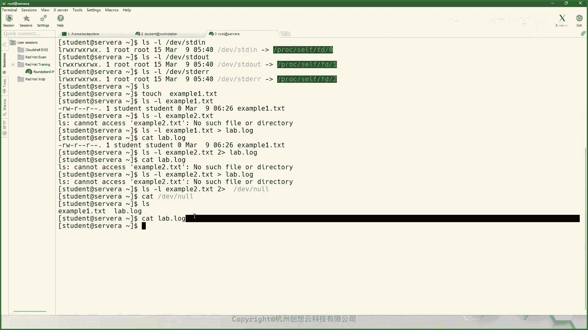

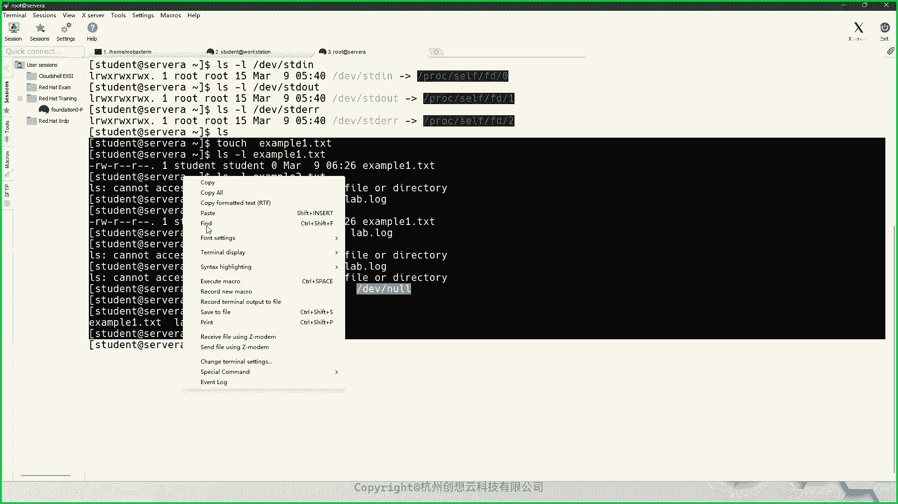

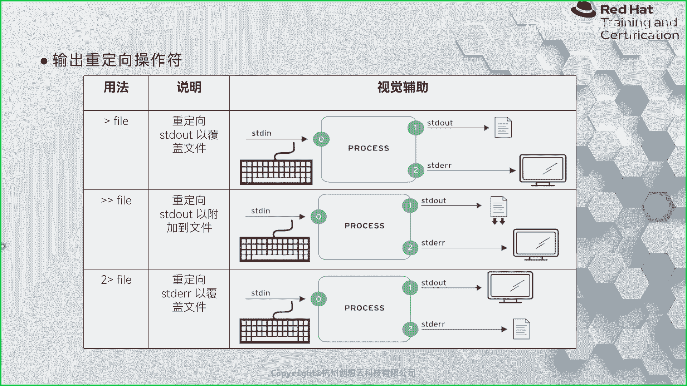

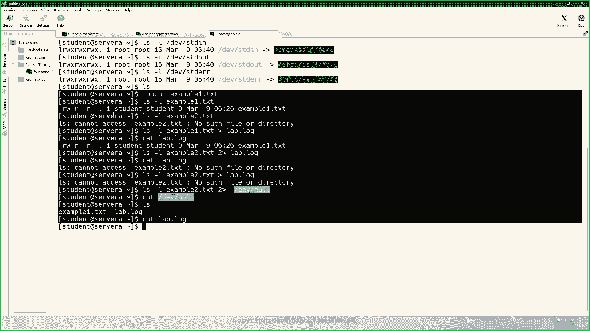

啊。好，这是我们的标准输出和标准错误重定项。那么如果呢我们把这个重定向符号呢累加变成这样子，两个大于号。哎，那么这样一个符号呢代表什么呀？代表追加。啊。好，这是我们的标准输出和标准错误重定项。

那么如果呢我们把这个重定向符号呢累加变成这样子，两个大于号。哎，那么这样一个符号呢代表什么呀？代表追加。哎，追加那么最佳顾名思义，它和什么呀，和我们的一个大于号存以项的用法呢是一样的。但区别在哪里呢？

区别在于我们的重向这个符号啊。啊，重新要这个符号是干嘛的呀？是是不会覆盖掉原来的内种的。啊，不会覆盖哎，追加。那么追加顾名思义，它和什么呀，和我们的一个大于号乘以项的用法呢是一样的。但区别在哪里呢？

区别在于我们的重定向这个符号啊。啊，重样这个符号是干嘛的呀？是是不会覆盖掉原来的内容的。啊，不会覆盖啊，这是我们的这个符号。OK好，感受一下。好，现在呢我们。还拿着原言命令好吧。

我们来试一下大于号走起叫sorry。Lb点儿浮起。那，我们来看看这里面有这个东西，有标准错误吧。好，接着呢我再走第二遍，走起，再看一下。就多了一行内容。对吧多一行内容啊。OK那么这个来啊。

这是我们的这个符号。OK好，感受一下。好，现在呢我们。还拿的原来命令好吧，我们来试一下大于号走起要sorry。lab点儿左起。那我们来看看这里面有这个东西，有标准错误吧。好，接着呢我再走第二遍，走起。

再看一下。就多了一行内容。对吧多一行内容啊。OK那么这个的话呢，就是什么呀？就是重定向了。哎，重定向了，同志们重定向啊。OK从定向。加上一个内容。啊，这是我们的一个例子啊一个例子。的话呢就是什么呀？

就是重定向了，哎，重定向了，同志们重定向啊。OK从定向。加上一个内容。啊，这是我们的一个例子啊一个例子。呃，然后你像我们在还有一些比较比较一些特殊的场景用啊。

比如说有的时候呢我们需要筹取一个怎么说的场景吧。比如说我们需要一个什么呀，非交互式。啊，那么书写一个文件。啊一个文件，哎，那么我们可以怎么办呢？我们可以这样来玩啊，呃。

然后你像我们在还有一些比较比较一些特殊的场景用啊，比如说有的时候呢，我们需要抽取一个怎么说的场景吗？比如说我们需要一个什么呀非交互式。啊，那么书写一个文件。啊一个文件，哎，那么我们可以怎么办呢？

我们可以这样来玩啊，我们举个例子好吧，比如说我左命令cat。啊，我我不管这个文件里面有没有东西，我每次希望都是新的文件啊，我写一个写个什么呢？写个啊cud shareEDU点TT。然后呢。

因为是非教务式的嘛，对吧？那么我后面也要加要加一个结束符。啊，那么我把那个大于号呢反过来写，这边读取了啊，读取一个符号叫EOF，相当于发送了ctrorl D啊。好，那我写那个我们举个例子，好吧。

比如说我左命令cat。啊，我我不管这个文件里面有没有东西，我每次希望都是新的文件啊，我写一个写个什么呢？写个啊cloud shellEDU点PST。然后呢，因为是非教务式的嘛，对吧？

那么我后面也要加要加一个结束符。啊，那么我把那个大于号呢反过来写这边读取了啊，读取一个符号呢叫EF，相当于发送了ctrlD啊。好，然后写了一个消息，写了一个。This is my costume。

cloud小丢对吧？然后写个welcom。负什么呀？哎，这个这个这个rd hat。ing啊啊结束EOF走起啊，然后呢我们来看下这个文件。来，这个文件是不是写了一个文件内容，是不是？哎。

这是一种啊我们去消息写了一个。This is her coach。cloud小丢对吧？让后 saywelcom。负什么呀？哎，这个这个这个rightdha。ing啊啊结束EOF走起。

那然后呢我们来看一下这个文件。来，这个文件是不是写了一个文件内容，是不是？哎，这是一种啊我们去做一个非啊教务式的一个文本编辑。啊。好，再来一个场景。比如说我们干嘛呢？我们这个呃想啊这个修改。啊。

修改一下我们系统当中的一些参数。但是呢这些参数呢是禁止我们使用一些编辑器进行修改的那怎么办呢？我们给大家举个例子啊，这个大家只看好吧，后面学的多了再去操控啊，做一个非啊教务式的一个文本编辑。啊。好。

再来一个场景。比如说我们干嘛呢？我们这个呃想啊这个修改。啊，修改一下我们系统当中的一些参数。但是呢这些参数呢是禁止我们使用一些编辑器进行修改的那怎么办呢？我们给大家举个例子啊，这个大家只看好吧。

后面学的多了再去操控啊，比如说以现在为例，我去拼一下我的思A。哎，是一直通着的对吧？好，这时候呢我要给大家来一个魔法啊，我先切换到root。然后呢，我来到这里proc下面。下面呢我去找一个东西啊啊。

让我想想啊，去找谁呢？Propro。啊，比如说以现在为例，我去拼一下我的思路A。哎，是一直通着的对吧？好，这时候呢我要给大家来一个魔法啊，我先切换到root。然后呢。

我来到这里pro下面pro下面呢我去找一个东西啊，啊，让我想想啊，去找谁呢？Prolockpro。哦，去错位置了，应该是去。好，对的啊，去我们的哪里呢？n网络。啊，网络这个网络也不对啊，应该是。

Sorry， since。FS busDDDDDDdriver，dver， driverver driver。奶奶。那去我们换个位置去s里面啊，ss里面。sin里面呢去找我们的。哦，去错位置了。

应该是去。好，对了啊，去我们的哪里呢？n网络。啊，网络那个网络也不对啊，应该是。Sorry， six。FS busDDDDDdriver， driverver ， driver， driver。奶奶。

那去我们换一个位置去ss里面啊，ss里面ss里面呢去找我们的。DV设备。啊，设备里面去找到用也不追。deviceice啊diceice。这也不对。嗯，突然之间。想不到地方了。prolock里面。

看一看啊，pro克里面。F， night。哦，这里面sorrys啊，sDV设备。啊，设备里面去找找用也不对。deiceice啊deiceice。这也不对。嗯，突然之间。想不到地方了。prolock里面。

看一看啊，pro壳里面。F， night。哦，这里面的sorrys啊s。ss里面去找一个n啊n。net里面呢我去找个IBV4。啊，IV4IV4里呢这里面有一句话呢叫ISMP echo ignore对吧？

就是SMP的这个报文的响应，忽略所有啊，那这种文件的话呢是不允许我们去修改的啊，同志们不允许我们用编辑器的方式去改的，我们可以看下里面内容它写的零嘛，就布值嘛，零就代表的什么呀？s里面去找一个net啊。

net。耐里面呢我去找个IDV4。啊，IV4IV4里呢这里面有一句话呢叫ISMP echo ignore对吧？就SMP的这个报文的响应忽略所有啊，那这种文件的话呢是不允许我们去修改的啊。

同志们不允许我们用编辑器的方式去改的，我们可以看下里面内容它写的零嘛，是布尔值嘛，零就代表的什么呀？我SMP的报文的响应呢是忽略掉的，是否忽略呢？不不忽略，那是我同我我给你响应是不是？

所以呢我们的客户端在pin的时候呢是有结果的。这时候呢我利用命令 echo一。啊，是适合飞嘛，对吧？哎，你忽略掉所什吗？忽略一嘛？同意你忽略我走起一。啊，sorry啊，我家停一下吧啊，加个大号走起。啊。

然后呢我们来我SMP的豹纹的响应呢是忽略掉的，是否忽略呢？不不忽略，就是我同意我我给你响应是不是？所以呢我们的客户端在拼的时候呢，是有结果的这时候呢我利用命令X1。啊，是适合非嘛，对吧？哎。

你忽略掉所什吗？忽略一嘛？同意你忽略我走其一。啊，sorry啊，我家停一下吧啊，加个大号走起。啊，然后呢我们来看一下，哎，你会发现我这边怎么了？是不是这个这个这个这个地方就不动了，看到没有？哎。

就不动了，为什么呢？因为我我忽略掉，相当于我把你的SMP的报裹干嘛照不掉了，哎，照不掉了，相当于啊但没并没有丢，我只没有响应而已。好，我再把它零恢恢复原样。哎，是不是又又通了，对不对？

所以说我们也会利用这种重定项啊做一些文件的一些，看一下。哎，因为发现我这边怎么了？是不是这个这个这个这个立方就不动了，看到没有？哎，就不动了，为什么呢？因为我我忽略掉。

相当于我把你的SM的报告干码照不掉了，哎，照不掉了，相当于啊但没并没有丢，我只没有响应而已。好，我再把它零恢恢复原样。哎，是不是又又通了，对不对？

所以说我们也会利用这种重定项啊做一些文件的一些什么呀参数的一个调整。哎，比如说我们在做一些调优的时候，哎会做一些调整啊，可以临时的改一改。哎，这样来用好吧。呃，这是给大家举了个小例子啊。

大家一定要知道我们的大于号反过来代表是读取的意思啊，读取的意思OK没有参数的一个调整。哎，比如说我们在做一些调优的时候，哎会做一些调整啊，可以临时的改一改。哎，这样来用好吧。呃。

这是给大家举了个小例子啊，大家一定要知道我们的大于号反过来代表是读取的意思啊，读取的意思OK。嗯，然后呢接着啊接着我们继续来看我们的PPT啊PPT这些图里面啊，就把我们刚才提到的这些知识点啊。

都给我们用图片的方式给我们举例了，看到没有？哎，个示输出啊，个人错误，对吧？追加两个代号呢追加对吧？这是覆盖啊。啊，然后呢你会发现我们的刚才呢举个例子，这是老的写法，这个新的写法用按的符号大。嗯。

然后呢接着啊接着我们继续来看我们的PPT啊PPT这些图里面啊，就把我们刚才提到的这些知识点啊，都给我们用图片的方式给我们举例了，看到没有？哎，本输出啊，个是错误，对吧？追加两个代号呢追加，对吧？

这是覆盖啊。啊，然后呢你会发现我们的刚才的举个例子，这是老的写法，这个新的写法，用按的符号大于号就可以了。这是新的写法啊，新的写法所以大家老的新新的都要知道，因为呃开发人员的时间对吧？都不一样，对吧？

有些人可能学的早，有人学的晚，我们一定要知道啊，知道。现代的写法啊。更加现代啊，小and。and反音号啊and反音号OK。啊，这是我们的重项啊，重项，大家一定要找尾号就可以了。这是新的写法啊，新的写法。

所以大家老的细新的都要知道，因为呃开发人员的时间对吧？都不一样，对吧？有些人可能学的早，有人学的晚，我们一定要知道啊，知道。现在的写法啊。更加现代啊，叫and。and反号啊艾反号OK。啊。

这是我们的重像啊，重项大家一定要掌握啊掌握好，大家有没有问题？啊，网络是吧，应该大家没问题吧，网络这块。啊。诶。然后大家有没有疑问这一小节这个这个重新下。有没有问题？啊，没有问题，我就继续了啊。

掌握啊掌握好，大家有没有问题？啊，网络是吧，应该大家没问题吧，网络这块。啊。诶。然后大家有没有疑问这一小节这个这个重新下。有没有问题？啊，没有问题，我就继续了啊。好，接着呢我们来看下一个知识点啊。

叫所谓的管道符。管道服O。啊，什么是管道符呢？对吧？我们可以脑洞大开一下，对吧？我们想想水管啊，水管哎，水管呢是一节连着一节的对吧？OK那么那么这己的水管呢，这个管道符呀，就相当于一个什么呀？

就相当于一个水管一样啊。好，接着呢我们来看下一个知识点啊，叫所谓的管道符。管道服O。呃，什么是管道符呢？对吧？我们可以脑洞大开一下，对吧？我们想想水管啊，水管哎，水管呢是一节连着一节的对吧？

OK那么那么这个水管呢，这个管道符呀，就相当于一个什么呀？就相当于一个水管一样。啊，它呢连接了上一个水管和下一个水管对吧？哎，那么在我们这里的这个管道呀，就是我们的什么呀？

我们的这个标准输出的这个啊流啊哎，那么通过我们的管道符。啊，就是我们的一个单单的一个竖斜杠啊，通过我们的管道符将上一个命令执行的标准输出传递给我们第二个命令。

我们的第二个命令呢就把上一个它呢连接了上一个水管和下一个水管对吧？哎，那么在我们这里的这个管道呀，就是我们的什么呀？我们的这个标准输出的这个啊流啊，哎，那么通过我们的管道符。啊。

就是我们的一个单单的一个竖写杠啊，通过我们的管道符将上一个命令执行的标准输出传递给我们第二个命令。我们的第二个命令呢就把上一个命令的标准输出当做标准输入进行处理。啊，表示出处理O。呃。

二大于N一和大于非2，为什么有区别？嗯，二大于按一啊大于fi尔2。大于1OK是这样的啊。的命令的标准输出当做标准输入进行处理。啊，表示出处理O。呃，二大于N一和大于非2，为什么有区别？嗯。

二大于艾特一啊大于fi尔2。大于1OK是这样的啊。嗯，sorry，好像我刚才说的是不是有问题。我看一下我的笔记。我看一下。我写在二在前面二在后面。啊，O是这样的啊，那么我们的这个写法呢是标准的啊。

你说的那个。你说的那个什么呀？二大于N的一大于C啊。嗯，sorry，好像我刚才说的是不是有问题？我看一下我的笔记。我看一下。我写在二在前面二在后面。啊，O是这样的啊，那么我们的这个写法呢是标准的啊。

你说的那个。你说的那个什么呀？二大于N一大于C啊，那么其实是一样的呀，没有什么区别。直播顺序的而已。但是呢你写的那个写法呢，可能我们写的比较少啊比较少。OK我们可以试验一下，好吧，试验一下啊。

看会不会报错，好吧，我们试一下。嗯，走一波试一下啊，我们我们举个例子好吧，写个什么L杠L。呃，example一。一个大2。好吧，我们这边结尾呢就写个谁呢？啊，那么其实是一样的呀，没有什么区别。

只播顺序的而已。但是呢你写的那个写法呢，可能我们写的比较少啊比较少。okK我们可以试验一下，好吧，试验一下啊，看会不会报错，好吧，我们试一下。嗯，走一波试一下啊，我们我们举个例子好吧，写个什么L杠L。

呃，example一。一个大包2。好吧，我们这边结尾呢就写个谁呢？就写一个。这个1点2KST好吧，这是一个啊一个。然后呢，我们用我们输入的方法大于fill空格2大于and1。好吧，好。

接着呢我们再请个demo2，我们用你说的这个方法啊，我们把这个二大于NN一放在前面。然后呢，接着呢我们再放一个大于fiil。啊，大于非啊哦，sorry。我怎么我怎么就写一个。

这个demon一点2KST好吧，这是一个啊一个。然后呢，我们用我们输入的方法大于fi空格2大于and1。好吧，好，接着呢我们再请个demo2，我们用你说的这个方法啊，我们把这个二大于NN一放在前面。

然后呢，接着呢我们再放一个大于fail。啊，大于非啊哦，sorry。我怎么我怎么写名糊啦？啊。啊。重新洗啊。这个呆龙一是fill啊。demon一点KST。好。接着我们来写第二个啊，我们把点迷糊了。啊。

Sorry啊。重新洗啊。这个呆龙一是fill啊。demon一点KST。好。接着呢我们来写第二个啊，我们把这个什么呀二大于and一放在前面啊，文件呢放在最后。早起。写个2啊写个2走起来，同志们。同志们。

那么。我们第一个命令呢是成功执行的那你第二个命令有没有成功执行？没有吧，是不是啊？因为你这个命令呢，你表面上看起来好像没有什么毛病是吧？将这个什么二大于and一放在前面啊，文件呢放在最后。走起。

写个二啊写个2走起来，同志们。同志们。那么。我们第一个命令呢是成功执行的那你第二个命令有没有成功执行？没有吧，是不是啊？因为你这个命令呢你表面上看起来好像没有什么毛病，是吧？将标准错误呢给了一。啊。

给了一啊，然后呢，一给了这个东西，但是他们之间没有逻辑性而言啊。OK所以说这个是我们没有见过的，好吧嗯没有见过的啊。没有没有没有这个写法啊，没有这个写法啊。O还有问题吗？叫小弟是吧，OK明白了没有？

可以大胆的试一试啊，标准错误呢给了一。啊，给了一啊，然后呢一给了这个东西，但是他们之间没有逻辑性而言啊。OK所以说这个是我们没有见过的，好吧嗯没有见过的啊。没有没有没有这个写法啊，没有这个写法啊。

ok还有问题吗？叫小弟是吧，OK明白了没有？可以大胆的试一试啊。郑小弟还有没有问题，明白了没有？你的那个Y写法是错的啊。郑小弟还有没有问题，明白了没有？你的那个Y写法是错的啊。OK赵小弟还在不在？😊。

OK赵小弟还在不在？😊，离线了吗？呃，刚才给你解释过了啊，没有你说的那个二大于按一这个用法。啊，然后大于费啊，没有这个用法啊，这个语法就是错的。离线了吗？呃，刚才给你解释过了啊。

没有你说的那个二大于按一这个用法。啊，然后大于费啊，没有这个用法啊，这个语法就是错的。啊。O啊。没有这个语法。哎呀，你那边网络很差呀。那个延迟有点高啊，这我这我都感觉过去10分钟了。Okay。嗯，好。

就是这个啊。好。呃，然后呢我们。啊。O啊。没有这个语法。哎呀，你那边网络很差呀。那个延迟有点高啊，这我这我都感觉过去10分钟了。Okay。嗯，好，就是这个啊好。呃，然后呢我们接着往后。啊，往后。啊。

管道啊管道这个地方啊，刚才说到这个原因啊。好，那么同样我们管道呢来举个例子啊举个例子，我们举个例子啊，比如说。啊，比如说。呃，然后呢这个什么呢？比如说我们嗯组个命令好吗？组个命令管道组个什么命令呢？呃。

我们有想想OK那么接着往后。啊，往后。啊，管道啊管道这个地方啊，刚才说到这个原因啊。好，那么同样我们管道呢来举个例子啊，举个例子，我们举个例子啊，比如说。啊，比如说。呃，然后呢这个什么呢？比如说我们。

嗯，组个命令好吧？走个命令管道组个什么命令呢？呃，我们就想想OK那么比如说我们前面学习一些简单的命令的时候。O。对。啊，那么我们就我们干嘛呢？我们这个RS4杠杠help对吧？啊，我们走个命令回车啊。

这个消息很多是吧？好多好多啊，那么如果我们有鼠标的话呢，那么这个内容啊就会很被动，对吧？输出的结果，那比如说我们前面学习一些简单的命令的时候。O。Okay。啊，那么我们就我们干嘛呢？

我们这个RS4杠杠help对吧？啊，我们走个命令回车啊，这个消息很多是吧？好多好多啊，那么如果我们有鼠标的话呢，那么这个内容啊就会很被动，对吧？输出的结果太多了，我们看不到怎么办呢？哎，我们用管道伏。

啊，把这标准输出。给谁呢？给我们下面一个命令，哎，我们前面学过less吧。Nice。左起。啊，就可以走分页了。哎，我可以用空格往前走。啊，OKctrol B对吧？回退对吧？

OK或者说上下上方向键的上下键。啊，太多了，我们看不到怎么办呢？哎，我们利用管道伏。啊，把这标准输出。给谁呢？给我们下面一个命令，哎，我们前面学过less吧，less。左起。啊，就可以走分页了。哎。

我可以用空格往前走。啊，OKctrol B对吧？回退对吧？OK或者说上下上方向键的上下键。按上下键都是可以的。OK。啊，都是可以的。诶。然后那个席斌，你能不能把你登录的时候那个截图发下群里面啊。

我怀疑你写错了。按下键都是可以的。O。啊，都是可以的。诶。然后那个席斌，你能不能把你登录的时候那个截图发下群里面啊，我怀疑你写错了。好，那么。可以处理了啊，就管道伏的一个作用啊。好，大家能明白吗？

这个管道伏的作用。管道伏啊管道服。啊。用于干嘛呀呃。好慢的。commentd一。反到好，那么。可以处理了啊，就管道伏的一个作用啊。好，大家能明白吗？这个管道伏的作用。管道服啊管道服。啊。用于干嘛呀呃。

好慢的。commentd一。管道符COMLND旁面的2。O。re hat点儿best VDC点comM23353。系。呃，地址是写对的，但是呢。呃，你检查一下你的。呃。

这个CB你检查一下你在你的符COMLNDcom2。Okay。re hat点儿best VDC点儿comM23353。Okay。呃，地址是写对的，但是呢。呃，你检查一下你的。呃，这个CB。

你检查一下你在你的你你用的是家庭网络呢，还是你们公司的网络？啊，如果你是公司的网络的话呢。你连不上去呢，你可以用你的手机热点试一下，好吧，你公司的网络你要连不上去的话呢，请联系你们的公司的网络管理员啊。

这可是你们公司的策略的问题导致的啊。佳丽的话应该没事的啊应该没事的。啊，23353没有问题的啊，这个名名字是没有问题的。你你用的是家庭网络呢，还是你们公司的网络？啊，如果你是公司的网络的话呢。

你连不上去呢，你可以用你的手机热点试一下，好吧，你公司的网络你要连不上去的话呢，请联系你们的公司的网络管理员啊，这可是你们公司的策略的问题导致的啊。家里的话应该没事的啊应该没事的。啊。

23353没有问题的啊，这个名名字是没有问题的。啊，域名是没有问题的啊。然后正好你的你的用户名写的也有问题啊，我们是预成员，不是单个用户啊。你为这台机子上是没有这个用户的。好，那么这个解释一下啊。

那么com慢的。COMMNcom2。啊，这个将。啊，好。啊，域名是没有问题的啊。然后正好你的你的用户名写的也有问题啊，我们是预成员，不是单个用户啊。你为这台机子上是没有这个用户的。好。

那么这个解释一下啊，那么com慢的。COMMAcom2。啊，这个将。啊，com曼一的标准。输入。啊，标准输出啊标准输出作为。标准输入来处理。对吧来处理啊，然后。然后呢，我们的样例就是这个就行了。

非常简单啊，这个例子没有什么特殊的用法。对吧或者说再来一个我们能看到的。啊，M一的标准。输入。啊，标准输出啊标准输出作为。标准输入来处理。对吧来处理啊，然后。然后呢，我们的样例就是这个就行了。

非常简单啊，这个例子没有什么特殊的用法。对吧或者说再来一个我们能看到的。啊，比如说我们。嗯。转一个什么例子呢？搞一个例子，我想想啊，想想。好。这个我们学下一章吧，我们会用到，好吧。

我们举一个下一章的一个例子啊。嗯，我们先做一个简单的。OK好，接着呢我们来再看一个知识点啊，知识点。叫什么呢？叫做系命令好。T呢比如说我们。嗯。转一个什么例子呢？搞一个例子，我想想啊想想。好。

这个我们学要下一章吧，我会用到。好吧，我们走一个下章的一个例子啊。嗯，我们先做一个简单的。OK好，接着呢我们来再看一个知识点啊，知识点。叫什么呢？叫做T命令哈T命令。那么这个T命令的话呢。

它和管道差不多，但是呢又和管道呢有所区别啊，什么区别呢？我们来看这张图来理解啊这个T命令啊。那么我们通过管道符可以将上一个命令的标准输出作为后面命令的标准输入。

但是呢我可以在这个管道符的之间啊中间我加个T的命令。默认情况下呢，我们的T命令呢，会把上一个命令的标准输入，相当于干嘛呀？fk出来一份命令。那么这个T命令的话呢，它和管道差不多。

但是呢又和管道呢有所区别啊，什么区别呢？我们来看这张图来理解啊这个T命令啊。那么我们通过管道符可以将上一个命令的标准输出作为后面命令的标准输入。但是呢我可以在这个管道符的之间。啊，中间我加个T的命令。

默认情况下呢，我们的T命令呢，会把上一个命令的标准输入，相当于干嘛呀？fok出来一份，或者要clo出来一份克隆出来一份镜像出来一份啊，传递给我们的文件或者是其他的设备。啊，克隆出来一份镜像出来一份。

但是呢不会影响原来的这个管道的一个输出的结果。啊，T啊T好感受一波。啊，怎么感受呢？我这边啊再打开一个终端，好吧。然后呢，SSQ这要克隆出来一份，克隆出来一份镜像出来一份啊。

传递给我们的文件或者是其他的设备。啊，克隆出来一份镜像出来一份，但是呢不会影响原来的这个管道的一个输出的结果。啊，T啊T啊感受一波。啊，怎么感受呢？我这边啊再打开一个终端，好吧。然后呢，SSK到我们的。

student at server啊，然后呢在这里呢我走个命令叫TTY。啊，我看一看这里的消息啊，DV线的PE。同志们，我呢还用这个命令，但是呢我这次加了个TT谁呢？T刚刚那个设备上面看好了。

命令的并输出通过管道符给了气一份。啊，然后呢又又给了谁呀less一份啊，我们来到我们的。Student at server。啊，然后呢在这里呢我走个命令叫TDY。啊，我看一看这里的消息啊，DV下的PE。

同志们，我呢还有这个命令，但是呢我这次加了个T气谁呢？气刚刚那个设备上面看好了。命令的并输出通过管道符给了气一份。啊，然后呢又又给了谁呀less一份啊，我们来感受一下回车。

我们这边正常的执行左边我们并没有执行命令，但是呢依旧能够看到标准输出。因为被我们这个命令怎么了？弃了一份出来，镜像刷一份给了我们的谁呀，给了我们的终端。哈，当然了也可以给文件呀。比如说气哥谁呢？

demon一点TST。啊。看一下我们的demo一一来抽一下回车。我们这边正常的执行左边我们并没有执行命令，但是呢依旧能够看到标准输出。因为被我们这个命令怎么了？弃了一份出来，镜像刷一份，给了我们的谁呀。

给了我们的终端。哈，当然了也可以给文件呀。比如说气搁谁呢？demon一点TST。啊。看一下我们的demo一。你看是不是留了一份哎，我们还可以干嘛呢？我们还可以追加啊追加一份。啊，还可以追加。

哈同志们还可以追加。这时候呢我们的文件呀就变成了多更多的内容了啊。啊，240行再来一次。360行对吧？哎，T杠A是追加啊，不不加A的话呢，就是覆盖了哎，覆盖了，相当于覆盖了啊，覆盖了OK。

你看是不是留了一份哎，我们还可以干嘛呢？我们还可以追加啊追加一份。啊，还可以追加哈，同志们还可以追加。这时候呢我们的文件呀就变成了多更多的内容了啊。啊，240行再来一次。360行对吧？哎。

T杠A是追加啊，不不加A的话呢，就是覆盖了哎，覆盖了，相当于覆盖了啊，覆盖了OK这就是我们的T的命令的作用。啊，T的命令作用K。可以。在。😊，谁呀？我们写个例子啊。

command一管道 tip后面跟上一个文件或者设备都行啊。然后呢，command2。啊，T命令。可以在什么呀？卡曼的。哎，这就是我们的T的命令的作用。啊T的命令作用K。可以。在。😊。

谁呀我们写个例子啊，command一管道 T一份，后面跟上一个文件或者设备都行啊。然后呢command2。啊，T命令。可以在什么呀？卡曼的。commd一将输出的结果传递。给我们的comman。

二期间干嘛呀？镜像一份。啊，病。从定向到哪里呀？文件或设备当中。默认。comment一将输出的结果传递。给我们的comman的。二期间干嘛呀？镜像一份。啊，win。从定向到哪里啊？文件或设备当中。

默认啊T跟上一个文件或者设备是相当于什么呀？相当于。标准输出。从殿下。OKT杠A一个文件呢相当于啊标准输出。追加。啊，C加从定向。对吧比如说有什么例子呢？比如说我们写一个应用程序，对吧？

当他报啊T跟上一个文件或者设备是相当于什么呀？相当于。标准输出。我殿下。OKT杠A一个文件呢相当于啊标准输出。追加。啊，C加从定加。对吧比如说有什么例子呢？比如说我们写一个应用程序，对吧？

当他报错的时候呢，我既希望他同通知给我们当前操作的用户，也希望把这个消息呢存放在本地的日志文件当中。哎，我就可以用T来实现啊。O。好，这是给大家举的这个例子，大家是否明白有没有问题，如果没有问题。

请扣一啊，有问题就扣2啊。不错的时候呢，我既希望他同通知给我们当前操作的用户，也希望把这个消息呢存放在本地的日志文件当中。哎，我就可以用T来实现啊好。O。好，这是给大家举的这个例子，大家是否明白？

有没有问题？如果没有问题，请扣一啊，有问题就扣2啊。3。呃，其好，接着我们来继续啊，这是我们这一小节的内容啊。好，那么接着我们往后。看。呃，你那边做不到的话呢。下次。呃，7好，接着我们来继续啊。

这是我们这一小节的内容啊。好，那么接着我们往后。系。呃，你那边做不到的话呢，检查你的D颜。啊，电视。诶。好，那么接着我们来看第二个知识点啊，就来检查你的DN。啊，电视。诶。Okay。好。

那么接着我们来看第二个知识点啊，第二知点。嗯，第二支点的话呢是介绍V央变器的。啊，不要编辑的OK。呃，那么首先我们要知道我们为什么要学习一个编辑器，对吧？因为对于我们而言。

其实相信大家啊用编辑器来编辑文本文件，大家肯定都会啊，肯定都会的啊。但是我们为啥要学OK那么我们来说一下。呃，那么是这样的，就是说无论天气其实蛮多的这。嗯，第二支点的话呢是介绍V央变器的。啊。

不要编辑的OK。呃，那么首先我们要知道我们为什么要学习一个编辑器，对吧？因为对于我们而言，其实相信大家啊用编辑器来编辑文本文件，大家肯定都会啊，肯定都会的啊。但是我们为啥要学？OK那么我们来说一下。呃。

那么是这样的，就是说无论编辑其实蛮多的。啊，比如说我们常见的有什么呀，比如sli呀。对吧windowsnet的那个pad呀。是不是啊，这个这个还有什么VS code也是吧，也是啊OK等等等等等等啊。

非常多啊。但是呢这些编辑器的话呢有一个特点啊，什么特点就是说方便是方便，但都是基于什么呀？都是基于图形的。哎，图形的二本。啊，比如说我们常见的有什么呀，比如sli呀。

对吧windowsnet的那个pad呀。是不是啊，这个这个还有什么VS code也是吧，也是啊OK等等等等等等啊，非常多啊。但是呢这些编译器的话呢有一个特点啊，什么特点就是说方便是方便。

但都是基于什么呀？都是基于图形的。哎，图形的。而对于我们的linux服务器而言。OK而言，那么大部分呢对吧？大部分呢都是什么呀？都是。文本界面的。就是说没有安装通话界面，对吧？你没有装的话呢。

又因为我们linux呢是一切键文件。所以说管理linux的服务器。那么其实我们可以理解为什么呀？理解为管理什么呀，理解为啊管理。对于我们的linux服务器而言。OK而言，那么大部分呢对吧？

大部分呢都是什么呀？都是。文本界面的。就是说没有安装通话界面，对吧？你没有装的话呢，又因为我们linux呢是一切旧文件，所以说管理linux的服务器。那么其实我们可理解为什么呀？理解为管理什么呀。

理解为啊管理linux的文件。对吧那去修改这个文件，让它起生效而达到一个不同的目的。OK所以呢我们就需要一个什么呀？需要一个基于。文本界面的什么呀，编辑器。那么这种编辑有很多啊。

那么什么比如说老牌的imax。啊，伊asOK还有我们身边所听说过的，比如说VI。啊，linux的文件。对吧那去修改这个文件，让它起生效而达到一个不同的目的。OK所以呢我们就需要一个什么呀？需要一个基于。

文本界面的什么呀，编辑器。那么这种编辑有很多啊，那么什么比如说老牌的im。啊，伊asOK还有我们身边所听说过的，比如说VI。啊，难no。对吧爱了。nano还有VMOK其中VI的话呢是默认干嘛呀？

安装在我们的link系统当中的啊，安装的。而nano和VM的话呢，属于是个高级的。一个编辑。啊，高级的一个编辑器。啊，然后一般来说，以得变为首的发译板会默认按 nanono。对吧爱了。

nano还有VMOK其中VI的话呢是默认干嘛呀？安装在我们的link系统当中的啊，安装的。而nano和VM的话呢，属于是个高级的。一个编辑。啊，高级的一个编辑器。啊，然后一般来说。

以得变为首的发译板会默认安装谁呀？它会安装我们的nano。REC多吧。为主的那怎会安装怎呀，安装我们的这个。ZMOK是这样的一个关系。但是现在这个情况呢也是发生一些变化啊，你像斐高啊这种。百这种的话呢。

现在桌面的默认也是装的是nano啊，因为nano简单啊，呃上手呢更加的容易。它打开之后呢，基本上会装谁呀？它会安装我们的nano。RE赛多吧。为主的那则会安装着呀，安装我们的这个。

ZMOK是这样的一个关系。但是现在这个情况呢也是发生一些变化啊，你像匪刀啊这种。百度这种的话呢，现在桌面的默认也是装的是nno啊，因为nno简单啊，呃上手呢更加的容易它打开之后呢。

基本上和我们用到的note pad什么都是一样的。你打开就是编辑界面，就可以编辑了啊啊，但是呢VM的话呢显得更加的专业，对吧？哎，更加专业啊，所以说的红帽呢就是一直还在给我们讲VM编辑的一个实用啊呃。

那么因此呢对于我们而言啊对于我们而言，如果你掌握了其中的一个啊，你可以不学习VM啊，是可以不学习的啊，你只需要掌握其一种就可以了啊啊，这个地方上之后我们用到的note pad什么都是一样的。

你打开就是编辑界面就可以编辑了啊啊，但是呢VM的话呢显得更加的专业对吧？哎更加专业啊，所以说的红帽呢就是一直还在给我们讲VM编辑的一个实用啊那么因。对于我们而言啊对于我们而言，如果你掌握了其中的一个啊。

你可以不学习VM啊，是可以不学习的啊，你只需要掌握同一种就可以了啊，啊，这个地方要知道啊，但是呢我们课堂还是要讲的啊讲的OK啊，那么对于VM编辑而言。

那么它呢呃因为我们红包里面咱们上课呢都是装的非最焦发行模式啊。哎，所以说呢我们的VM编辑呢是装过了的啊，那么将来大家考试的时候或者工作当中啊，系统啊可能就没有安装，那怎么办呢？

那么这时候呢就需要我们啊自己呢使用软件包的管理软件啊，然后呢进行一个安装那么啊但是呢我们课堂还是要讲的啊讲的OK啊，那么对于VM编辑而言，那么它呢呃因为我们红包里面咱们上课呢都是装的非最焦化行模式啊。

哎，所以说呢我们的VM编N7呢是装过了的啊，那么将来大家考试的时候或者工作当中啊，系统啊可能就没有安装，那怎么办呢？那么这时候呢就需要我们啊自己呢使用软件包的管理软件啊，然后呢进行个安装。

那么安装的这个软件包名称呢，就叫做VM杠inhd。啊，这个包一安装就可以了。啊，就可以了啊，就用起来比较舒服，好吧，还没默认的话呢，只有个最小化的就只能用VI命令啊，只能用VI命令OK。

那么当我们装完这个VM in has之后呢，我们可以使用啊VM tutor命令啊啊这个来获得一些帮助。啊，可以获得帮助。那么安装的这个软件包名称呢，就叫做VM杠 enhancedh。啊。

这个包一安装就可以了。啊，就可以了啊，就用起来比较舒服，好吧，默认的话呢，这个最小化的就只能用VI命令啊，就会用VI命令OK。那么当我们装完这个VM in has之后呢。

我们可以使用啊VM tutor命令啊啊这个来获得一些帮助。啊，可以获得帮助啊。OK好，那么我们先了解一下对于VR编辑而言啊，编辑而言，然后呢，它的几种模式。啊，这种模式OK呃，那么对于VI编器而言啊。

VI编器而言，那么它有三种最基本的模式、三种最基本的模式啊，分别叫做命令模式、扩展模式，还有墨行模式。啊，或者因为这个这个扩展模式啊啊。OK好，那么我们先了解一下，对于VR编辑而言啊，编辑而言，然后呢。

它的几种模式。啊，这种模式OK呃，那么对于VI编器而言啊，VI编器而言，那么它有三种最基本的模式、三种最基本的模式啊，分别叫做命令模式、扩展模式，还有墨行模式。啊，或者因为这个这个扩展模式呃。

叫法不一样啊，有些人叫扩展命令模式，有人叫呃墨行模式都行啊。OK那么你像我们的PPT上啊，那么左边的这个图呢其实就是一个编辑模式。啊，下面的这个图呢就是我们的。按照咱们书上叫法呢，就叫做什么呀？

叫做扩展命令模式。啊，那么中间的这种模式呢，就是我们拿着变辑器。啊，直接来到文本当中啊呃叫法不一样啊，有些人叫扩展命令模式，有人叫啊墨夯模式都行啊，OK那么你像我们的PPT上啊，那么左边的这个图呢。

其实就是一个编辑模式。啊，下面的这个图呢就是我们的。按照咱们书上叫法呢，就叫做什么呀？叫做扩展命令模式。啊，那么中间的这种模式呢，就是我们拿着编辑器。啊，直接来到文本当中啊，那么模式叫命令模式。

哎命的模式OK我们先把这三个基本的模式搞明白，好吧，搞明白啊。好，那么我们这里呢来个例子。例子啊，比如说呢我们现在呢刚才生成了非常多的文件呀，对吧？非常多的文件啊，我比如说拿这个demo一啊拿来用。

你说那我们一个文件都没用，那怎么办呢？对吧？那你可以复制一个谁呀啊，FStable文件到当前目录啊，来编辑是可以的，或者是你直接打那么模式叫命令模式。哎，面的模式OK我们先把这三个基本的模式搞明白。

好吧，搞明白啊。好，那么我们这里呢来个例子。例子啊，比如说呢我们现在呢刚才生成了非常多的文件呀，对吧？非常多的文件啊，我比如说拿这个demo一啊拿来用。你说那我们一个文件都没有，那怎么办呢？对吧？

那你可以复制一个谁呀啊FS table文件到当前目录啊，来编辑是可以的。或者是你直接打开一个新的空白的都行，哎，都可以啊，那么只要编编辑，后面跟上一个文件就行了，我们初选那么这个文件要么不存在。

要么就是一个有内容，但是你复制过来的一个副本，你做任何操作，对系统来说都是没有伤害的啊，一定要注意这件事情。好，那么我这里这里呢打开一个demo一点7ST啊，demo一点7STOK啊。

或者打开一个新的空白的都行哎，都可以啊。那么只要VM编辑后面跟上一个文件就行了。我们初血那么这个文件要么不存在，要么就是一个有内容，但是你复制过来的一个副本，你做任何操作，对系统来说都是没有伤害的啊。

一定要注意这件事情。好，那么我这里这里呢打开一个demo一点切ST啊，demo一点切STOK好，回车。啊，我们来试一下来试一下啊。那么这个时候呢，我们的模式。就是命令模式。OK就是命令模式啊，然后呢。

我们在键盘上的所有操作都是有特殊含义的。啊如果我想进入编辑。那么我们一般来说呢，都会把这个光标移动到一。啊，我们来试一下来试一下啊。那么这个时候呢，我们的模式。就是命令模式。OK就是命令模式啊，然后呢。

我们在键盘上的所有操作都是有特殊含义的。那如果我想进入编辑。那么我们一般来说呢，都会把这个光标移动到要编辑的位置。啊，比如说我用方向键。啊，移到这个L这个地方。

OK我现在光标的位置啊光标的位置OK那么这时候呢我输个字母I。字母键I呢就相当于键盘上的insert这个按键插入。哎，指的是在光标前插入我输个I。啊，然后呢我输个。Q哎。

你发现呢在L前面说了个Q要编辑的位置。啊，比如说我用方向键。啊，移到这个L这个地方。OK我现在光标的位置啊光标的位置OK那么这时候呢我输个字母I。字母键I呢就相当于键盘上的insert这个按键插入。I。

指的是在光标前插入，我输个I。啊，然后呢我输个。Q哎，你会发现呢在L前面输了一个Q光标前插入啊，QQQQ对吧？WWW啊，就是编辑模式。你看我们的键盘的下方会提到一个insert。啊，inert。啊。

insert ok好，那么当我编辑完成之后。啊，编辑完之后，我想退出怎么办呢？对吧按照我们的逻辑。啊，按照我们的逻辑啊，那么当我们退出光标前插入啊，QQQQ对吧？WWW啊，就是编辑模式。

你看我们的键盘的下方会提到一个insert。啊，insert。啊，insert ok好，那么当我编辑完成之后。啊，编辑完之后，我想退出怎么办呢？对吧按照我们的逻辑。啊，按照我们的逻辑啊。

那么当我们退出的之前，一定要干嘛呀？是不是要把当前的文件做一个保存呀？对不对？保存哎，所以说呢我们要干嘛呀？我们要把当前的模式。啊，当前的模式OK从编辑模式回退到命令行模式。

才可以来到所谓的扩展命令模式。因此，我们需要按下键盘上的ESC按键回退到word的之前一定要干嘛呀？是不是要把当前的文件做一个保存呀？对不对？保存。哎，所以说呢我们要干嘛呀？我们要把当前的模式。啊。

当前的模式OK从编辑模式回退到命令行模式，才可以来到所谓的扩展命令模式。因此，我们需要按下键盘上的ESC按键，回退到命令模式。

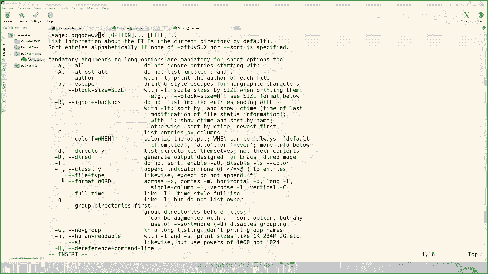

OK好，所以说呢我现在呢出一下ESC那你会发现我们左下角呀就不再有insert标识了。然后呢，我输入上一个冒号，对吧？shift键加冒号啊，冒号键。那么在左下角啊。

这时候呢我输入了保存并退出W right保存Q退出保存之后退出。

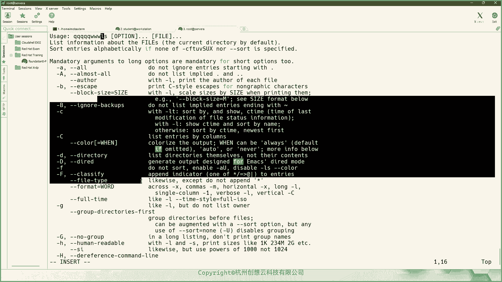

那那么这样一个命令模式。

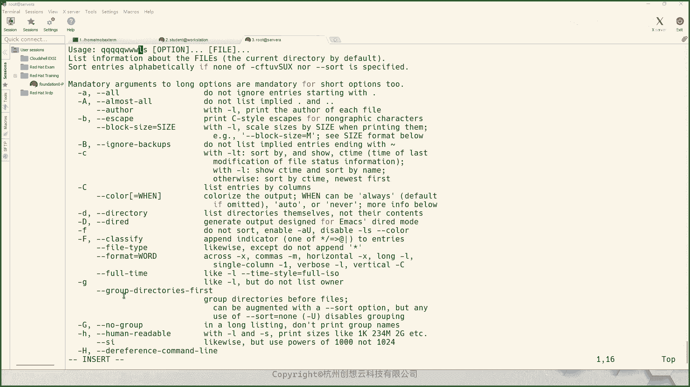

OK好，所以说呢我现在呢出一下ESC那你会发现我们左下角呀就不再有insert的标识了。然后呢，我输入上一个冒号，对吧？shift键加冒号啊，冒号键。那么在左下角啊。

这时候呢我输入了保存并退出W right保存Q退出保存之后退出。

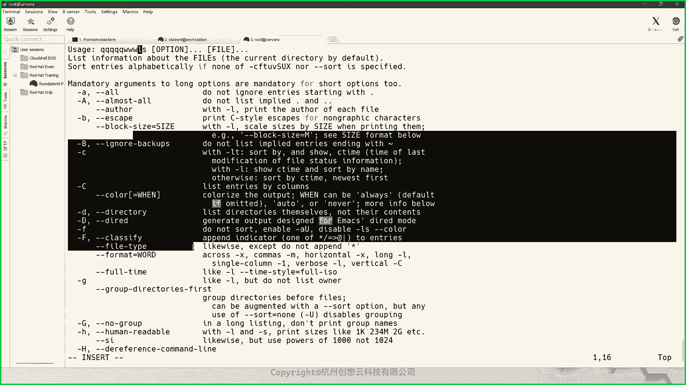

那那么这样一个简单的一个过程呢就结束了。啊，一个结束了，这是给大家演示了一个最简单的一个基础的流程啊，一个流程OK啊，那么除此之外呢。我们为了丰富我们VM编器的功能啊，是VIM的编器的功能。注意了啊。

不是VI的啊。那么我们可以加上一个所谓的可视模式。啊，大写的V小写的V，还有是ctrol键加V进入到一个VO模式，简单的一个过程呢就结束了。啊，一个结束了。

这是给大家演示了一个最简单的一个基础的流程啊一个流程OK啊，那么除此之外呢。我们为了丰富我们VM编器的功能啊，是VIM的编器的功能。注意了啊，不是VI的啊，那么我们可以加上一个所谓的可视模式。啊。

大写的V小写的V，还有是ctrorl键加V进入到一个VO模式。啊，进噪模式我们可以做一些批横那个水平的批量操作，垂直方向的批量操作，或者说是什么呀？多行的操作都是可以的啊都是可以的啊。

我们今天呢给大家讲的内容啊都比较基础。啊，比较清楚。我们这里呢以咱们PT的几个例子给大家举点小例子啊，最低限度的一个设置是。啊，进噪模式我们可以做一些批横那个水平的批量操作，垂直方向的批量操作。

或者说是什么呀？多行的操作都是可以的啊都是可以的啊。我们今天呢给大家讲的内容啊都比较基础。啊，比较清楚。我们这里呢以咱们PT的几个例子给大家举点小例子啊，最低限度的一个设置。OK我要举个例子啊。

按照我们这个上面的这些键来来演示一下啊，演示一下。okK嗯，然后比如说我们打开这个文件。现在呢进入到了命令模式。okK刚才iins模式，对吧？inst模式啊，我把这窗口呢放放小一点，好吧。

这样的话呢我们看起来更加的清晰啊。哎，我们这样走，好吧，哎，这样对比一下啊，OK我要举个例子啊，按照我们这个上面的这些键来来演示一下啊，演示一下。okK嗯，然后比如说我们打开这个文件。

现在呢进入到了命令模式。OK刚才iinser模式，对吧？ins模式啊，我把这窗口呢放放小一点，好吧，这样的话呢，我们看起来更加的清晰啊。哎，我们这样走，好吧，哎，这样对比一下啊好。

左下角insert模式啊，EIC回退到了命令模式，下面没有标识了啊，什么都标识都没有啊，就是命令模式了。然后呢接着干嘛呢？接着干嘛呢？哎，我们接着啊再摁下I键。我们做一些修改，好吧，随便输点东西。好。

ESC回放命令模式。然后呢，我说这么多。啊，我想个撤销怎么办呢？摁一下U键好，左下角insert模式好，ESC回退到了命令模式，下面没有标识了啊，什么都标识都没有啊，就是命令模式了。然后呢，接着干嘛呢？

接着干嘛呢？哎我们接着啊再摁下I键。我们做一些修改，好吧，随便输点东西。好，ESC回放命令模式。然后呢，我说了这么多啊，我想给它撤销怎么办呢？摁一下U键。OKU啊撤销OK按下U。啊。

摁一次撤销你的这样动作一次。啊，摁两次就要两次，对吧？就看你的历史记录了。啊，我们打开这个文本之后呢，就操作了一次，所以说呢它只能回退一次。OK好，现在呢我要干嘛呢？我要把这里的QQ删掉一些。

那我就把我的光标使用方向键或者是。OKU啊撤销OK按下U。啊，摁一次撤销你的这样动作一次。啊，摁两次乘要两次，对吧？就看你的历史记录了。啊，我们打开这个文本之后呢，就操作了一次，所以说呢它只能回退一次。

OK然，现在呢我要干嘛呢？我要把这里的QQ删掉一些。那我就把我的光标使用方向键或者是。HGKL的4个干键来移动我们的光标啊，移到第1个Q这里。啊，我要X键XXXXX删掉啊。OK删除单个字符啊。

是我们的Q啊Q啊。那我想把当前行都删掉呢，对吧？哎，用谁呀，用DD同志们用DDOKDD。当前行就删掉了。你说HGKL的4个按键来移动我们的光标啊，移到第一个Q这里啊，我一下X键XXXXX删掉啊。

OK删除单个字符啊，是我们的Q啊Q啊。那我想把当前行都删掉呢，对吧？哎，用谁呀，用DD同志们用DDOKDD。当前行就删掉了。你说我想删除两行怎么办？输个删输N个数字写2再滴D删除两行。你输个十B例。

删除十行。啊，但是这个真的删除掉了吗？并没有。啊，最近一次的地例。它是把你的数据呢缓存到你当前的缓冲区了，你可以使用YY进行粘贴啊，sorry P呀进行粘贴。OK比如说我现在输个，我我想删除两行怎么办？

输个删输N个数字，写个二再摁个弟弟删除两行。你输个十BD删除十行。啊，但是这个是真的删除掉了吗？并没有。啊，最近一次的地例。它是把你的数据呢缓存到你当前的缓冲区了，你可以使用YY进行粘贴啊。

sorry P啊进行粘贴OK比如说我现在输个，我把我的光标往下移一行，输个P。就把刚才那两行呢。粘贴过来了。哎，如果你没有粘贴，那么就相当于删除了。啊，删除了OK好，那么YY呢复制它和滴滴是一样的。

只不过是复制而已啊，复制而已。OK那比如说我呢同样输个在这里边呢，我输个2YY2YY好，往下走一走，输个P。是不粘贴两行，把我的光标往下移一行，输个P。就把刚才那两行呢。粘贴过来了。哎，如果你没有粘贴。

那么就相当于删除了。啊，删除了OK好，那么YY呢复制它和滴滴是一样的，只不过是复制而已啊，复制而已。OK那比如说我呢同样输个在这里边呢，我输个2YY2YY好，往下走一走，输个P。是不粘贴两行？就出来了。

O你你搞完了，你说哎我想保存一下。对吧。末行命令命令扩展模式啊，而叫扩展命令模式，输个冒号W。冒号W哎，就保存了。啊，想退出在Q对吧？就退出了。你说我既保存又退出WQ。你说我改了有毛病，我不想保存了。

就出来了。OK你你搞完了，你说哎我想保存一下。😡，对吧。末行命令命令扩展模式啊，而叫扩展命令模式，输个冒号W。冒号W哎，保存了。啊，想退出再Q对吧？就退出了。你说我既保存又退出WQ。你说我改了有毛病。

我不想保存了。Q感叹号啊，sorry啊，Q感叹号。啊，小写的Q版单号啊，OK代表的是强制退出。啊，然后呢这个cl V这个模式呢第一次用会比较痛苦啊哈啊比如说我要干嘛呢？我我想这个。呃。

比如说我想一般我们会做注释的时候，用会crl V用的比较多啊，比如说这是个脚本啊，Q感叹号啊，sorry啊Q感叹号。啊，小写的Q版单号啊，OK代表的是强制退出。啊，然后呢，这个。

comV这个模式呢第一次用会比较痛苦啊比如说我要干嘛呢？我我想这个。呃，比如说我想一般我们会做注释的时候，用会colV用的比较多啊，比如说这是个脚本啊，我想把前面的几行呀。都注释掉怎么办？对吧？

ctrorl键加V。啊，下面就变成了visel block。啊，微缩b啊，这时候呢我们按一下我们的方向键来选中。啊，我又我又我又到这里，然后呢摁下大写键I啊，shift键加I。哎。

我们就进入到了编辑模式了，然后输入我要注释的东西，九字符。啊，这时候呢并没有生效的啊，就就我想把前面那几行呀。都注释掉怎么办？对吧？ctrorl键加V。啊，下面就变成了vissel block。啊。

微缩b啊，这时候呢我们按一下我们的方向键来选中。啊，我要我我又到这里，然后呢摁下大写键I啊，shift键加I。哎，我们就进入到了编辑模式了，然后输入我要注释的东西，景字符。啊，这时候呢并没有生效的啊。

就就标记一个地方就可以了。然后呢摁一下EIC。啊，批量增加注释。对吧我也可以增加，也可以删除嘛。哎，还有大写的V。对吧按行来选择对吧？自由选择啊，小Z。对吧。每一行的长度去选择啊，比如哎我又选到这里。

我要删除掉X。看你怎么组合了嘛？哎，怎么组合了啊，这是给大家简单举了一些例子，一会儿呢大家做个练习，加强加强练标记一个地方就可以了。然后呢摁一下EIC。啊，批量增加注释。对吧我也可以增加，也可以删除嘛。

哎，还有大小的V。对吧按行来选择对吧？自由选择啊，小V。对吧。😊，每一行的长度去选择啊，比如哎我又选到这里，我要删除掉X。看你怎么组合了嘛，哎，怎么组合了啊，这是给大家简单举了一些例子。

一会儿呢大家做个练习，加强加强练习，好吧。嗯，然后呢我这边呢又做了一些知识的扩展。比如说我们也可以在ETC的VMRC那这个就需要我们有管理员权限了啊。啊，或者说在在加盟录里面写一个隐藏的文件。

叫点儿VMRC是隐藏的文件啊，来干嘛呀？来这个增加一些自定义的内容。比如说这里的set number就相当于在命令的木航模式显示什么呀？显示习好吧。嗯，然后呢我这边呢又做了一些知识的扩展。

比如说我们也可以在ETC的VMRC那这个就需要我们有管理员权限了啊。啊，或者说在在加盟录里面写一个隐藏的文件，叫点儿VMRC是隐藏的文件啊，来干嘛呀？来这个增加一些自定义的内容。

比如说这里的set number就相当于在命令的木行模式显示什么呀？显示我们的行数。啊，行数OK呃，因为这个知识点还是蛮那个的啊，然后呢为了让大家加深印象，呃，大家的教材呢我给大家说翻到第几页啊。

大家先练习练习，好吧。练习练习啊。OK练习练习大概是在我们我们的行数。啊，行数OK呃，因为这个知识点还是蛮那个的啊，然后呢为了让大家加深印象，呃，大家的教材呢我给大家说翻到第几页啊，大家先练习练习。

好吧。练习练习啊。OK练习练习大概是在我们的133页啊，133页。大家来到133页啊，把那个呃实验大家自己敲一敲，好吧啊，133页啊。给大家10分钟的时间啊，敲一敲啊，敲完之后呢，休息5休息一下。

我们等到35，好吧，继续啊。K的133页啊133页，大家来到133页啊，把那个呃实验大家自己敲一敲好吧啊，133页啊，给大家10分钟的时间啊，敲一敲啊，敲完之后呢休息5休息一下，我们等到35好吧。

继续啊。来。我们的第几页呢133页啊然后呢，我们的20点的35分继续啊。我们的第几页呢133页啊啊，然后呢，我们的20点的35分继续啊。好，咱们继续上课嗯啊。啊，咱们来看第三节啊。

第三节的话就很简单了啊。第三节的话呢是呃介绍一下我们的。好，咱们继续上课嗯啊。啊，咱们来看第三节啊，第三节的话就很简单了啊。第三节的话呢是呃介绍一下我们的室要环境啊。呃。

然后呢我们的那个刚才我们讲的那一小节的VIP器啊，咱们书上的例子啊太少了啊太少了。然后呢呃大家呢下去之后呢，就是随便找点文件啊，然后自己多练一练啊，一定要多练，好吧？

因为这个东西还是比较蛮重要的啊蛮重要的。呃，那么咱们第三节的话呢，是介绍一下我们如何去定义我们的一些环境变量，以及怎么去使用我们的环境变量啊的设要环境啊。呃。

然后呢我们的那个刚才我们讲的那一小节的V编器啊，咱们书上的例子啊太少了啊太少了。然后呢呃大家呢下去之后呢，就是随便找点文件啊，然后自己多练一练啊，一定要多练好吧，因为这个东西还是比较蛮重要的啊蛮重要的。

嗯，那么咱们第三节的话呢是介绍一下我们如何去定义我们的一些环境变量，以及怎么去使用我们的环境变量啊OK。呃，那么首先要知道的事情的话呢，是我们的环境变量呢，你可以分为临时的和永久的。哎。

我们的黄金面料啊。环境变量呢分为那临时的。和永久的。那么其中永久的也好，也临时的也好。那么我们要分什么呀？又要分OK。呃，那么首先要知道的事情的话呢，是我们的环境变量呢，你可以分为临时的和永久的。哎。

我们的环金面量啊。环境变量呢分为那临时的。和永久的。那么其中永久的也好，也临时的也好。那么我们要分什么呀？又要分这个。啊，这个针对用户和针对全局的。啊，要要区分好啊区分好。呃。

你像所谓临时的啊所谓临时的。那么临时呢是指的是在当前汇画当中。啊，当前的后当中啊，然后呢在哪里呢？在我们的shall。那个。啊，这个针对用户和针对全局的。啊，要要区分好啊区分好。呃。

你像所谓临时的啊所谓临时的。那么临时呢是指的是在当前汇卡当中。啊，当前的课当中啊，然后呢在哪里呢？在我们的shall。中直接定义的。啊，仅待于当前的绘画有效。也如你你换了绘画，不好意思，就没有了啊。

那么永久的呢。永久的的话呢，意味着把它这个什么定义在哪里？定义在文件当中了。OK那么这里的文件呢，如果是临时的用户的这种永久的，那么就是在用户的加目录下面。啊，一般我们是写中直接定义的。啊。

仅单于当前的绘画有效。也如你换了绘画，不好意思，就没有了啊。那么永久的呢。永久的的话呢，意味着把它这个什么定义在哪里呀？定义在文件当中了。OK那么这里的文件呢，如果是临时的用户的这种永久的。

那么就是在用户的加目录下面。啊，一般我们是写的是点be2C。啊，一般是点beRC啊，然后呢，全局的话呢在哪里呢？全局的话呢，我们就在ETC下面的beRC或者是ETC下的profile点D下面啊。

按着全局的位置。啊，全体的位置OK好，那么我们首先来看一看怎么去。呃，定义这些所谓的变量啊变量。那么在定义的时候呢，我写的是D二倍12C。啊，一般是点beRC啊，然后呢，全局的话呢在哪里呢？全局的话呢。

我们就在ETC下面的beRC或者是ETC下的profile点D下面啊，按着全局的位置。啊，全体的位置OK好，那么我们首先来看一看怎么去。呃，定义这些所谓的变量啊变量。那么在定义的时候呢。

我们的这个变量名称啊大小写是不区分的。啊，sorry啊，就是大小写我们没有限定啊，啊，就是你大写也可以，小写也行啊，下划线呢也OK啊，但是呢我们要遵循的就是写的这个变量名称啊，一定要什么直观。

并且呢不要和这个系统当中已存在的冲突对吧？冲突，因为一旦冲突就被你的值覆盖掉，原有的值，对吧？可能会。呃，出现一些我们的这个变量名称啊，大小写是不区分的。啊，sorry啊，就是大小写我们没有限定啊，啊。

就是你大写也可以，小写也行啊，下划线呢也OK啊，但是呢我们要遵循的就是写的这个变量名称啊，一定要什么呀直观。并且呢不要和这个系统当中已存在的冲突，对吧？冲突，因为一旦冲突就被你的值覆盖掉，原有的值。

对吧？可能会。呃，出现一些相反的结果是吧？OK那么我们举个小例子，比如说我们定一个非常非常非常简单的一个变量值，好吧。比如说我们经常这么玩。哎sorry输入法中文的。

简单号OK比如说我们举个小例子啊啊我们。定一个什么呢？我们定一个。相反的结果是吧？OK那么我们举个小例子，比如说我们定一个非常非常非常简单的一个变量值，好吧。比如说我们经常这么玩。sry输入法中文的。

简单号OK比如说我们举个小例子啊啊我们。定一个什么呢？我们定一个。我定一个这个这个my home。啊，DR等一个谁呢？我等一个这个叫做remote。啊，remote啊，这个下面写个user。谁呢？

user。01啊，然后呢我们来引用一下好吗？引用的话呢，我就直接啊这个输出就可以了啊，输出那么引用的时候呢，我们一一种写法是doer符，直接跟上我们我们定一个这个这个my home。啊，DR等一个谁呢？

我等一个这个叫做remote。啊，remote啊，这个下面写个user，谁呢？user。01啊，然后呢我们来引用一下好吗？引用的话呢，我就直接啊这个输出就可以了啊，输出那么引用的时候呢。

我们一一种写法是doer符，直接跟上我们的便利名称my home DIR。对吧，但是这种写法的话呢个缺点。比如说我这个变量的名称后面还有其色字符，哎，那么就会出现一些呃错误，那怎么办呢？为了让它隔离啊。

我们用花火糊把它裹起来。啊，来引用。啊，来引用啊，这是。定义变量和引用的方法啊，下面这种的更好啊。来变的名称my home DIR。对吧，但是这种写法的话呢一个缺点。比如说我这个变量的名称。

后面还有其色字符，哎，那么就会出现一些呃错误，那怎么办呢？为了让它隔离啊，我们用花火糊把它裹起来。啊，来引用。啊，来引用啊，这是。定义变量和引用的方法啊，下面这容呢更好啊。那么要注意的是。

我们定义的这个变量呢，它是针对当前绘画有效的。はい。看来。啊，它只是针对于当前的绘画有效的。因为意味着如果我们在另另外的一个上面，比如说是serv A，对吧？我这边再登一个s A。啊，我可。

那么要注意的是，我们定义的这个变量呢，它是针对当前绘画有效的。はい。先死看来。啊，它只是针对于当前的绘画有效的。因意味着如果我们在另另外的一个上面，比如说是soA，对吧？我这边再登一个s A。啊。

我退出再来一次。然后呢，我们来ecle一下我们的这个dollar谁呀？dollar my home DIR哎，是没有的啊，是没有的，为空嘛，哎，就没有定义啊，就没有定义。okK这是当前的啊。

只对当前的绘画临时有效，或者说你登出了啊，重新启动了等等，它都没有了啊，都没有了。那怎么查看呢？我们自定义的可以用s命令可以查看当前设置的所有支出再来一次。然后呢。

我们来e一下我们的这个dollar谁呀？do my home DIR哎是没有的啊，是没有的，为空嘛，哎，就没有定义啊，就没有定义。O这是当前的啊，只对当前的绘画临时有效，或者说你登出了啊。

重新启动了等等啊，都没有了啊，都没有了，那怎么查看呢？我们自定义的可以用set命令可以查看当前设置的所有设要电量啊，我们将反道符去去less一下吧。我们说个斜线好吧，搜索一下啊，my home走起。

是不是有啊？然后我们这边来看一看set反乐符，less一下，搜一下my home。哎，没有，因为不是一个绘画，对吧？不是会一个绘画啊，OK就找到了啊，就找到了啊，set set。啊，okK好。

那么需要电量啊，我们将反道伏去去less一下吧。我们说个斜线好吧，搜索一下啊，my home走起。是不是有啊？然后我们这边来看一看set广道符，less一下，搜一下my home。哎，没有。

因为不是一个绘画，对吧？不是会一个绘画啊，OK就找到了啊，就找到了啊，set set。啊，OK好，那么那么我们一般会定义遍来干嘛用的呢？举个例子啊，举个例子，比如说呢我们。写了一个脚本。啊。

写了个脚本嗯，这个脚本呢叫run点SC就好了，我就放在了我的当前目录下面SC。RIPPS下面好吧，然后呢，在这里呢，我去写一个脚本。啊，sorry，那现在脚本叫run点SH。啊，然后呢我写个什么内容呢？

我先我们先不管事，那么我们一般会定一遍来干嘛用的呢？举个例子啊，举个例子，比如说呢我们。写了一个脚本。啊，写了个脚本呃，这个脚本呢叫run点SC就好了，我就放在了我的当前目录下面IC。

RIPTS下面好吧，然后呢，在这里呢，我去写一个脚本。啊，sorry，那这在脚本叫run点SH。啊，然后呢我写个什么内容呢？我先我们先不管什么意思啊，我们先写一个，让大家看一看效果。哎。

我写一个这个这个这个ele。啊 echo啊，this is什么呀？ red。Hight inN。TRRPIC enterprise。啊，然后呢linux。啊，然后呢在ee下干嘛呢？ee一个什么呢？

ee一个啊dollar大写的house name。哎，我应用了一个什么意思啊，我先写一个让大家看一看效果。哎，我写一个这个这个这个ee。啊 echo啊，this is什么呀？ red。HightBN。

TRRPRIC enterpriseter。啊，然后呢linux。啊，然后呢在ee下干嘛呢？ee一个什么呢？ee一个啊dollar大写的house name。哎，我引用了一个系统内置的一个行情变量。啊。

然后呢我保存并退出了。啊，然后呢我给他加上一个直用权限啊，我们全员还没学习到，我先给他加一个啊。哦，我们先不用管它哈。现在呢这个脚本我们要想执行，只能以一种方法，就是写什么呀，相对直接写这样子写啊，哎。

可以执行。但是呢我我我我不想这么干，哎，我想让。我的系统啊当前用户在执行这个脚本的系统内置的一个行情变量啊，然后呢我保存并退出了。啊，然后呢我给他加上一个直行权限啊，我们全员还没学习到。

我先给他加一个啊。哦，我们先不用管它哈，现在呢这个脚本我们要想执行，只能一种方法，就是写什么呀，相对直接写这样子写啊，哎，可以执行。但是呢我我我我不想这么干，哎，我想让。

我的系统啊当前用户在执行这个脚本的时自己去检索这个目录啊去执行。那怎么办呢？哎，我们系统当中有一个变量叫pass路径，哎，pass路径，我们可以使用icical dollar pass来查看当前用户呢。

他在执行命令的时候，他会按照这里的顺序从左到右的依次去查找啊，先找home啊student点 log bin里面看有没有如果没有哎去这个home studentdent bin里面有没有如果没有去user log bin说自己去检索这个目录啊。

去执行，那怎么办呢？哎，我们系统当中有一个变量叫pass路径哎，pass路径，我们可以使用icical dollar pass来查看当前用户呢，他在执行命令的时候，他会按照这里的顺序。

从左到右的依次去查找啊，先找home啊tudent点。里面看有没有。如果没有来这个home student bin里面有没有？如果没有去user logo bin，对吧？再找user bin。

再找user logo S bin，再找user S bin。如果都没有，就会告诉你command not found。好，那么我们先在加一个好吧，咱么加一个呢。

我们这样来写定一个变量pass等于一个老的pass。冒号C的路径啊，home下面的student下面的SCRIPTS走起哟，sorry，刚才是写错了呃，这个这个。切对吧再找user bin。

再找user logogoS bin，再找user S bin。如果都没有，就会告诉你command not found。好，那么我们先在再加一个好吧，咱么加一个呢。

我们这样来写定一个变量pass等于一个老的pass。冒号C的路径啊，home下面的student下面的SCRIPTS走起哟，sorry，刚才是写错了呃，这个这个。TH啊好，我把刚才的取消掉un set。

啊，PAHT啊，好，我把这个写错的去掉了啊，iside取消掉了。这时候呢我们走个命令叫run，哎，我们先不走run，我先挨一下，好吧，挨一下。哎，你会发现我们的后面是不是多了一句。

对吧然后呢我们来执行啊run yourSH取回车。我并没有去指定我的路径啊，对吧？艾他能找到是不是哎，找到你像这种特殊H序啊。好，我把刚才的取消掉un set。啊，PAHT啊，好。

我把这个写错的去掉了啊，iside取消掉了。这时候呢我们走个命令叫run，来，我们先不走run，我先挨一下，好吧，e一下。哎，你会发现我们的后面是不是多了一句。

对吧然后呢我们来执行啊run yourSI雪灰车。我并没有去指定我的路径啊，对吧？哎他能找到是不是哎，找到你像这种特殊的，我们一般要想让的生效，我们还会加上一个命令叫export。哎导出啊。

然后呢啊这个新的到那啊这个这个命令啊，把前面这句话一写啊，一写就可以了。那么但是呢我们刚才说了呀，那么这种写法呢都是临时性的是吧啊，临时性的。那么临时性呢，那么我怎么让它永久性呢？对吧怎么让永久性呢？

哎，我们的方法呢就是在我们的当前目录里面。哎，刚前目录里面或的我们一般药想上的生效，我们还会加上一个命令叫export。哎，导出啊，然后呢啊这个新的到那啊这个这个命令啊，把前面这句话一写啊。

一写就可以了。那么但是呢我们刚才说了呀，那么这种写法呢都是临时性的是吧啊，临时性的。那么临时性的，那么我怎么让它永久性呢？对吧怎么让永久性呢？哎，我们的方法呢就是在我们的当前目录里面。哎。

打下目录里面啊。就比如说。比如说我要对当前用户让你有效，哎，我就这么干啊。先把这个句话呢拿下来啊，哎我们可以这么玩儿。啊，VM啊用户的加目录下面的点儿。flash RC。

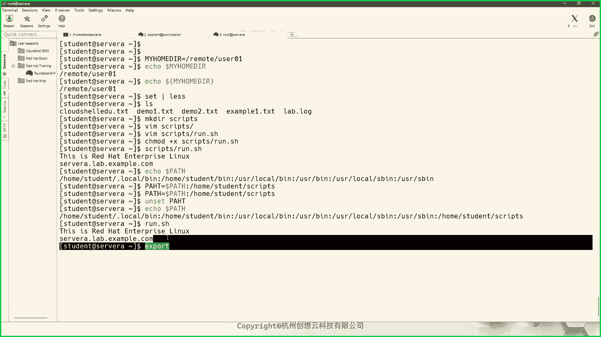

哎，然后呢我们写在这里写完之后呢，我们干嘛呢？在这里面去写上这么一句话啊，哎我们先把这句话写上来，然后呢让它生效XPRT。

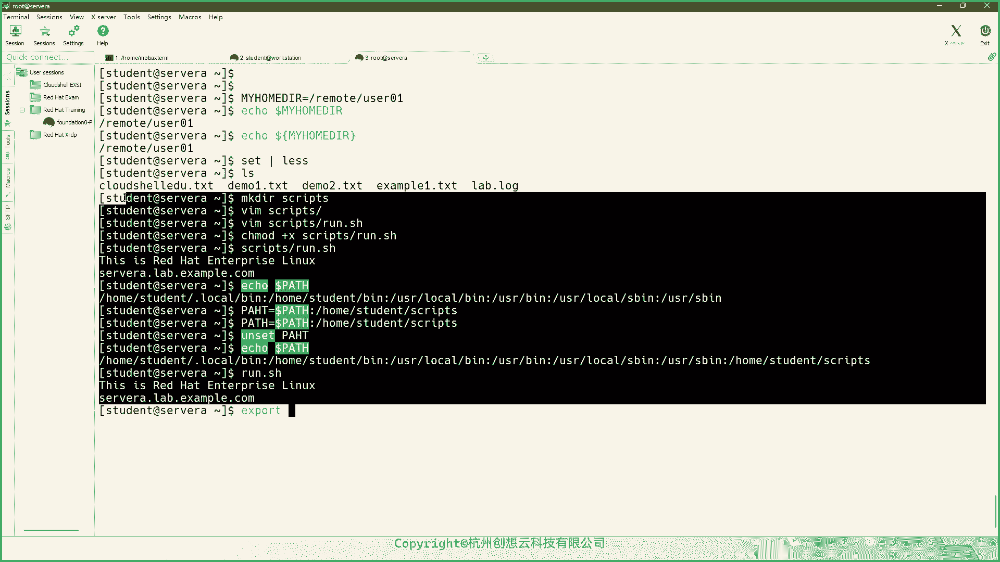

就比如说。比如说我要对当前用户让你有效，哎，我就这么干啊。我先把这个句话呢拿下来啊，哎我们可以这么玩儿。啊，VM啊，用户的加目录下面的点儿。flash RC。哎，然后呢我们写在这里写完之后呢。

我们干嘛呢？在这里面去写上这么一句话啊，哎我们要把这句话写上来，然后呢让它生效XPRT谁呀？

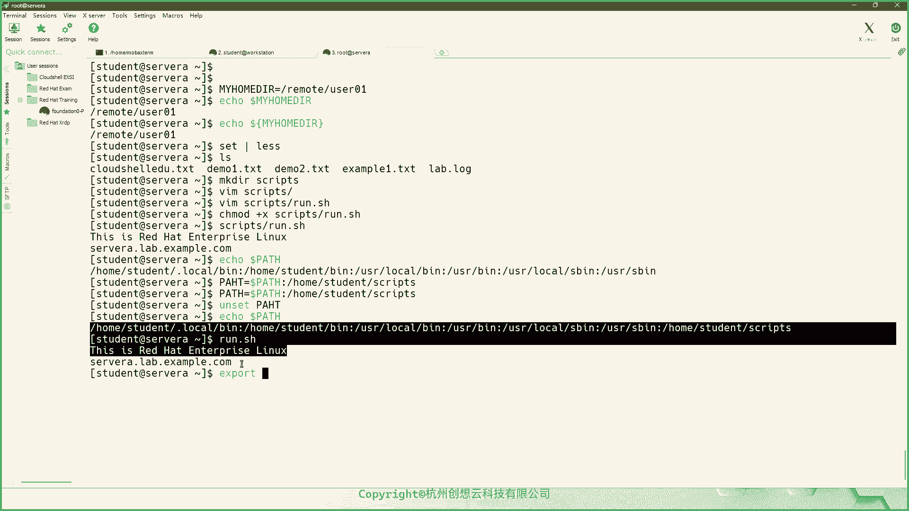

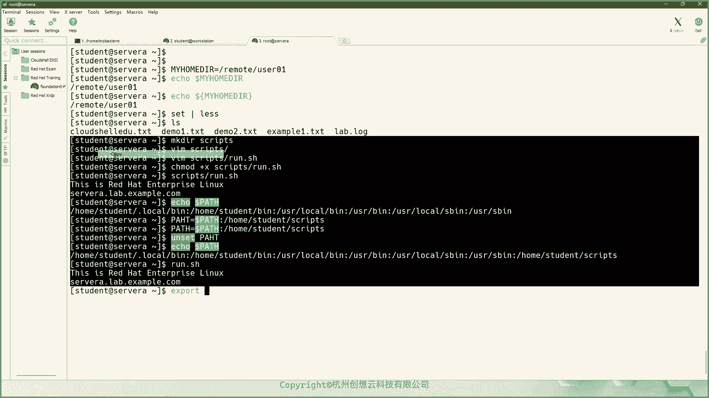

啊，好，你话请上来。OK其实。其实这个地方的话呢。呃，你直接这样写也可以啊，也可以啊。好，我们来试一下。这时候呢我们这边啊灯出一下，重新连上来，好吧，走起。这时候呢我们并没有走定义变量的名称啊。

我们来试一下，好吧，eical dollar PTH。是不是立马就生效了？然后呢一。谁呀？啊，好，的话请他来。OK其实。其实这个地方的话呢。呃，你直接这样写也可以啊，也可以啊。好，我们来试一下。

这时候呢我们这边啊灯出一下，重新连上来，好吧。走起。这时候呢我们并没有走定义电量的名称啊，我们来试一下，好吧，eical dollarPTH。是不是立马就生效了？然后呢，我们再走个命令叫什么呀？

这叫run点SH。是不是就立马识别到了，对吧？那么刚才呢这个例子呢就是一个临时的永久的，我们定义在了点 byRC当中。啊，点白杀C的。当然这个文件你写的时候一定要注意啊，如果你写的写错了的话。

会影响一些操作的啊，那时候你可以人工的去排错啊排错啊。我们再走的命令叫什么呀？这这run点SH。是不是就立马识别到了，对吧？那么刚才呢这个例子呢就是一个临时的永久的，我们定义在了点 byRC当中。啊。

点白杀等。当然这个文件你写的时候一定要注意啊，如果你写的写错了的话，会影响一些操作的啊，那时候你可以人工的去排错啊排错啊。定义。哎。😊，定义什么呀？用户的环境。

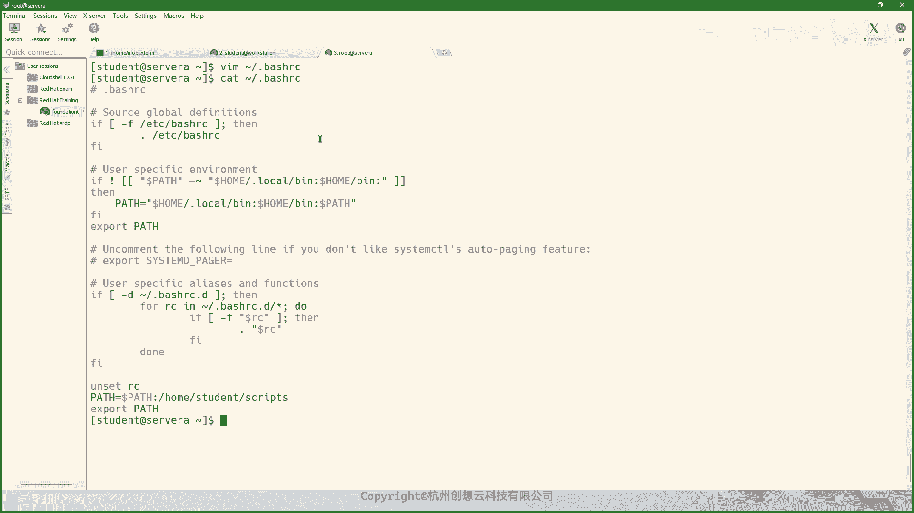

变量啊是永久的。啊，永久哎。

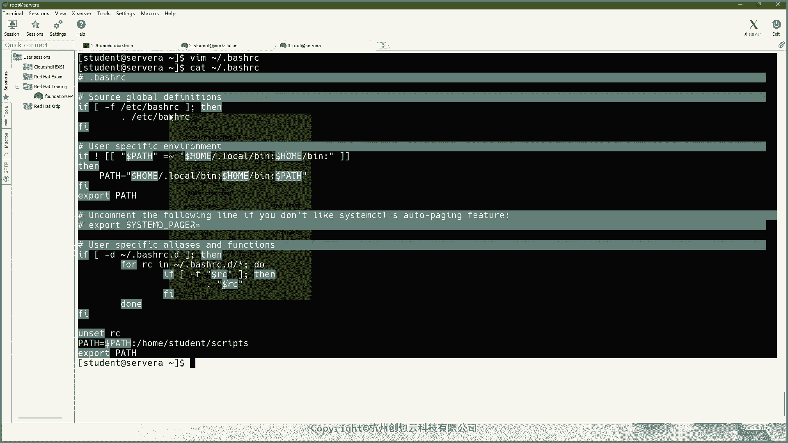

啊，永久的。就是给大家举了个小例子啊。那么如果呢我们将来学的更多了。定义。哎。😊，定义什么呀？

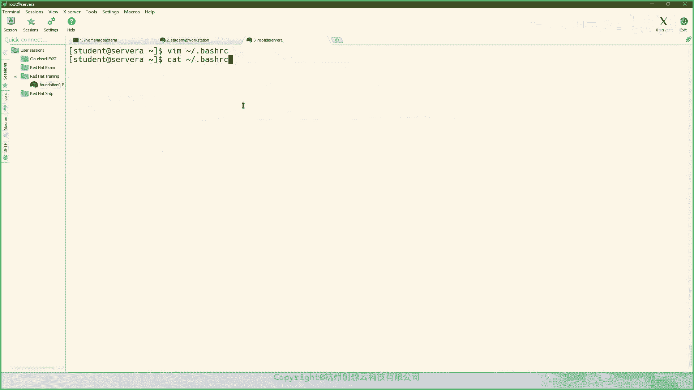

用户的环境。变量啊是永久的。啊，永久哎。

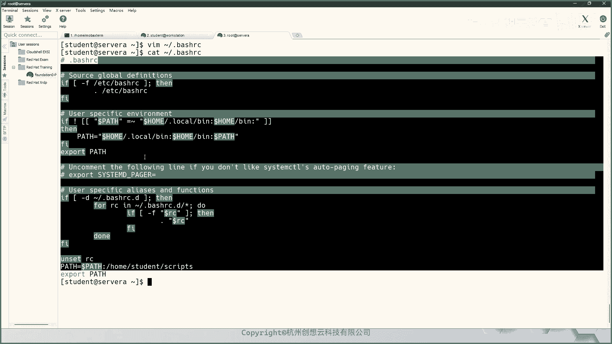

啊，永久他。这是给大家举了个小例子啊，那么如果呢我们将来学的更多了，那么我们可以去编辑ETC下的bechRC啊，这些文件就可以了。好吧，因为我们现在呢这个学习的这个知识还不够丰富。

大家不要轻易的去改我们的这些bechRC文件啊，很容易翻车的啊，很容易翻车的啊。好呃然后的话呢这个。

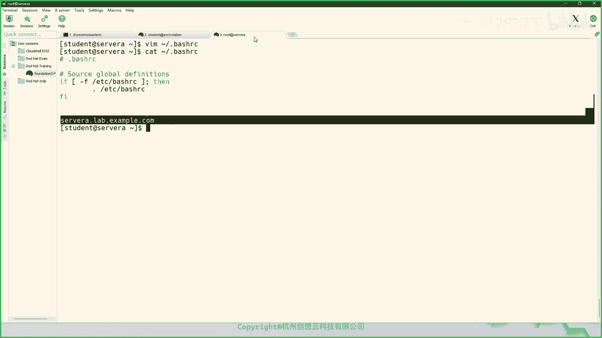

嗯。

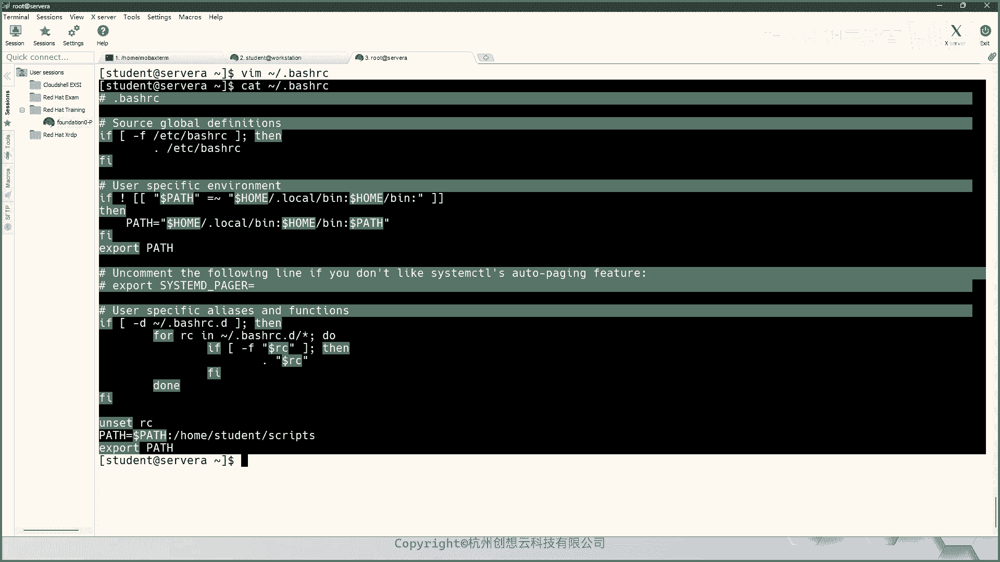

你比如说我们有时候临时的改谢，你看因为这个export的话呢，是让它生效嘛，对吧？比如说我们有时候临时的改些事情啊，就举个例子。比如说我们的语言apple long。对吧sorry加了do符啊，哎。

默认的话呢是ESUTF8，对吧？我们可以改一改呀，比如说我们改成改成什么呀，改成。

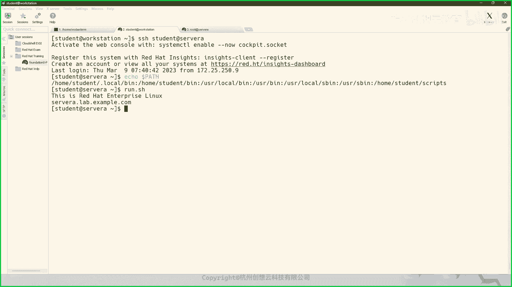

你像双栗子改成法语，对吧？好，我们写export love。

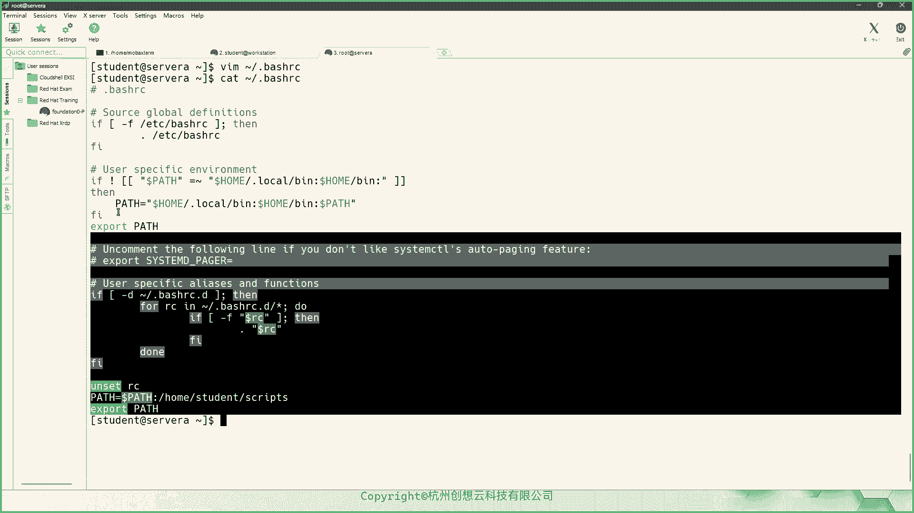

直接定义等于个法语啊，这个法语不知道的话呢，我们可以看一下IOCATE。

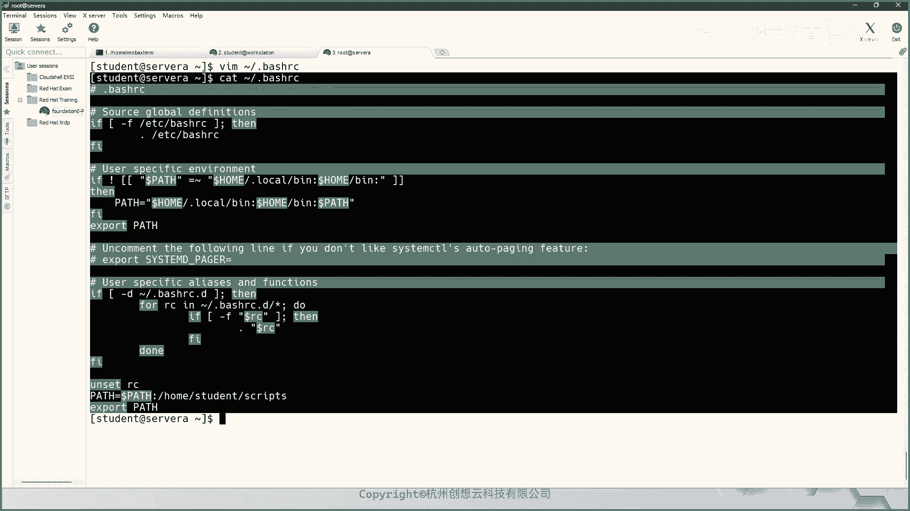

然后杠H。好，所以这个找帮助的，然后有一个文件啊，paACCR的LO。C。ALE。点儿com。这么干净。啊，有一个。一个命令啊。CLECT2。那么我们可以去编辑ETC下的beRC啊，这些文件就可以了。

好吧，因为我们现在呢这个学习的这个知识还不够丰富，大家不要轻易的去改我们的这些beRC文件啊，很容易翻车的啊，很容易翻车的啊。啊呃然后的话呢这个。嗯。你比如说我们有时候临时的改些。

你看因为这个export的话呢，是让它生效嘛，对吧？比如说我们有时候临时的改些事情啊，就举个例子。比如说我们的语言apple long。对吧哎sorry加了do符啊，哎，默认的话呢是ESUTF8，对吧？

我们可以改一改呀，比如说我们改成想要什么呀，改成。你像双栗子改成法语的，对吧？好，我写export love。直接定义等一个法语啊，这个法语不知道的，然后刚刚。累死了现。listLO哎。

我们看一下有哪些语言啊，非常非常多是吧？非常非常多，我们搜一个，比如说找个法语。啊，法语找个知法语按，这个好吧，我们来搞一下试试。啊，但是我们要知道自己现在的啊，省得一会改回来了，不知道怎么回事啊啊。

我们来改一改export long等于个谁呀？的话呢我们可以看一下IOCATE。然后杠H。好，so以这个找帮助的，然后有一个文件啊，看下ACCR的LO。C。ALE。点儿com。这么干净。啊，有一个。

个命令啊。CLECT2。然后刚刚。累死了下。listLO哎，我们看一下有哪些语言啊，非常非常多是吧？非常非常多，我们搜一个，比如说找个法语。啊，法语找个知法语按这个好，我们来搞一下试试。啊。

但是我们要知道自己现在的啊，省得一会改回来了，不知道怎么回事啊。好，我们来改一改export long等于个谁呀？立即生效。这是我们的S4杠L家看看。喂，好像没有什么变化，但是仔细看一看。

就是这个这个单词变了。对吧单词变了OK然后呢，d塔的日期呢，你看。变得不认识了吧，同志们法语啊法语啊，然后呢我们再给它变回来好吧，临时性的啊，我们让它立即生效EN下划线US点UTF杠8立即生效。

这是我们的S4杠L家看看。喂，好像没有什么变化，但是仔细看一看。是是这个这个单词变了。对吧单词变了okK然后呢，d塔的日期呢，你看。变得不认识了吧，同志们法语啊法语啊，然后呢我们再给它变回来好吧。

临时性的啊，我们让它立即生效EN下划线US点UTF杠8对吧？再来走一下日期，是不是又认识了，对啊，我们都可以改的啊，改的啊，然后这个还有呢？就是什么呢？就是说我们那些环境变量啊啊也可以去查，知道吧？

也可以去查啊。啊，比如说我再查一个，比如说。我走过ENV啊，ENV是专门来查看我们所有的恒原变量的那这里的输出的结果当中的等于号左边我们都是可以拿来用的。都是可以拿来用的OK你看对吧？再来走一下日期。

是不是又认识了。对啊，我们都可以改的啊，改的啊。然后这个还有呢，就是什么呢？就是说我们那些环境变量啊啊也可以去查，知道吧？也可以去查啊。啊，比如说我再查一个，比如说。我走个ENV啊。

ENV也是专门来查看我们所有的环原变量的那这里的输出的结果当中的等于号左边我们都是可以拿来用的。都是可以拿来用的。OK你看刚才用过housese name吧。

我们PWD命令其实就是调用了这里的PWD的参数值啊，还有什么home对吧？home，所以说我们一般说哎回到加目录CD的dollar home。

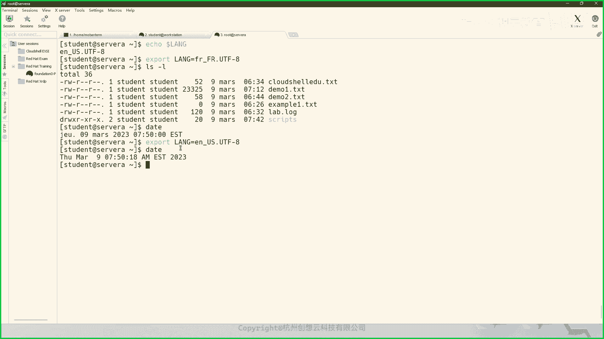

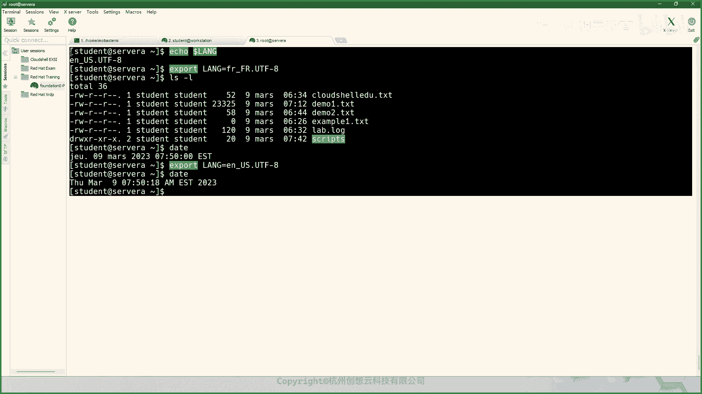

对不对？还是可以的。啊，是可以的啊，这是给大家介绍的这些命令啊，因为来查看我们所有的环境变量，对吧？s呢是干嘛呀？查看我们设置的变量啊，然后因为因为因为这个。呃。

inV的话呢就相当于已经刚才用过housese name吧。我们PWD命令其实就是调用了这里的PWD的参数值啊，还有什么名home对吧？home。

所以说我们一般说哎回到加目录CD的doller home。对不对？还是可以的。啊，是可以的啊，这是给大家介绍的这些命令啊，因为来查看我们所有的环境变量，对吧？s呢是干嘛呀？查看我们设置的变量啊。

然后因为因为因为这个。呃，inV的话呢就相当于已经生效了嘛，对吧？哎，然后呢s话是定义了啊，iet是取消定义。啊，export呢可以让它生效，对吧？我们可以写在点白杀子啊这些当中啊OK。呃。

然后我们将来学的多了，那么大家呢就可以来到这些地方啊就是。点beRC呀或者点be profile当中去定义。全局的话呢，ETCbe是RCATTC profile和ETCprofi生效了嘛，对吧？哎。

然后呢s的话是定义了啊，i set是取消定义。啊，export呢可以让它生效，对吧？我们可以写在点白杀子啊这些当中啊OK。呃，然后我们将来学的多了，那么大家呢就可以来到这些地方啊就是。点是RC呀。

或者点b profile当中去定义。全局的话呢，ETC是RCATTC profile和ETCprofi点D。啊，都是可以去定义的啊可以定义的。当然了，这些文件是不一样的啊。呃因为区别在于什么本地登录啊。

网上登那个远程登录对吧？还有部分用户，他们刷新刷新的结果是不一样的，是登录还是切换啊。这个我们后面讲到这个一些内容的时候呢，再给大家详细介绍啊。介绍O。这是这一小节啊，东西比较简单啊比较简单。

大家有没有问题？啊，如果没有问题，大家在群里面扣一。啊，都是可以去定义的啊可以定义的。当然了，这些文件是不一样的啊。呃因为区别在于什么本地登录啊，网上登那个远程登录，对吧？还有不同用户。

他们刷新刷新的结果是不一样的，是登录还是切换啊。这个我们后面讲到这个一些内容的时候呢，再给大家详细介绍啊。介绍O。这是这一小节啊，东西比较简单啊比较简单。大家有没有问题？啊，如果没有问题。

大家在群里面扣个一啊，有问题扣个2啊。扣个一啊，有问题扣个2啊。啊，因为咱们晚上的时间比较紧张啊，咱们的那个大实验就不在这个中间敲了。大家明天好吧，明天抽点时间给他敲一敲啊啊这个。啊。

因为咱们晚上的时间比较紧张啊，咱们的那个大实验就不在这个中间敲了。大家明天好吧，明天抽点时间给他敲一敲啊。啊，这个142页的这个实验。好吧，明天的话给敲一敲啊，咱们就继续讲课了啊。

因为晚上的时间比较紧张啊比较紧张。OK那么接着呢我们来看第六章啊，第六章很重要啊很重要啊，因为属于是用户管理啊，用户管理在任何的任何的操作系统的管理当中都是比较重要的啊。

无论是windows还是linux啊，都是非常重要的。我们来看一下啊，呃咱们142页的这个实验。好吧，明天的话给它敲一敲啊，咱们就继续讲课了啊，因为晚上时间比较紧张啊比较紧张。

OK那么接着呢我们来看第六章啊，第六章很重要啊很重要啊，因为属于是用户管理啊，用户管理在任何的任何的操作系统的管理当中都是比较重要的啊，无论是windows还是linux啊，都是非常重要的。

我们来看一下啊，呃咱们能讲多少讲多少啊，因为这张东西蛮多，书上的话呢不多，但是我这张喜欢啰嗦，比如说的比较多啊，OK。呃，这张的话呢是讲了一共是4个5个大的知识点啊，分成了5个小节啊。呃。

那么第一个部分呢，大家需要了解的是什么是用户，什么是组，为什么要有用户和组，对吧？第二个部分的话呢就是介绍如何去切换我们的账户。能讲多少讲多少啊，因为这张东西蛮多，书上的话呢不多，但是我这张喜欢啰嗦。

比如说的比较多啊，OK。呃，这张的话呢是讲了一共是4个5个大的知识点啊，形成了5个小节啊。呃，那么第一个部分呢，大家需要了解的是什么是用户，什么是组，为什么要有用户和组，对吧？第二个部分的话呢。

就是介绍如何去切换我们的账户。啊，还有就是设置修度权限啊，非常重要。O。第三部分的话呢，就是介绍如何呢去创建我们的用户和组。ok最后一部分的话呢是来设定密码的策略啊策略这是我们今天第六章的。

内容啊内容O。啊，这是我们先把这个标题搞下来啊。啊，还有就是设置修度权限啊，非常重要。O。第三部分的话呢，就是介绍如何呢去创建我们的用户和组。

O最后一部分的话呢是来设定密码的策略啊策略这是我们今天第六章的。内容啊内容。啊，这是我们先把这个标题搞下来啊。嗯。2。第六章哎。啊，第章讲的是管理。本地。用户合子。嗯。第二。这是第六章哎。啊。

第五章讲的是管理。本地。用户合子。OK那么首先我们来介绍一下什么是用户啊，什么是组啊，我们就放在一起了。O。呃，那么要想去深入的去理解我们用户和组的概念的话呢，其实这个东西和什么呀？

和这个安全是分不开的啊，用户和安全是分不开的。O那么首先我们来介绍一下什么是用户啊，什么是组啊，我们就放在一起了。O。呃，那么要想去深入的去理解我们用户和组的概念的话呢，其实这个东西和什么呀？

和这个安全是分不开的啊，用户和安全是分不开的。而安全的话呢，我们把它可以理解为是权限的一个管理。啊，你哪些人可以访问，对吧？哪些人不能访问。啊。地方。缩进好K。啊，是和权限是又是划分起了啊。

那么所以说我们要两个结合在一起去理解啊，就是我们的系统的话呢。而安全的话呢，我们把它可以理解为是权限的一个管理。啊，你哪些人可以访问，对吧？哪些人不能访问。啊。警方。缩进好K。啊。

是和权限是又是划分起了啊。那么所以说我们要两个结合在一起去理解啊，就是我们的系统的话呢。对吧现在系统都是多用户的吧，对吧？都是多用户的。OK多用户的。那么我们的系统为了给不同的人员。

人员来分配什么呀不同的资源。对吧资源这个资源你可以理解为，比如说张三对吧？我允许他来使用我的计算机，对吧？但是使使用的时间对吧？比如说每天呢使用30分钟。对吧哎我有时间对吧？现在系统都是多用户的吧。

对吧？都是多用户的。OK多用户的。那么我们的系统为了给不同的人员。人员来分配什么呀不同的资源。对吧资源这个资源你可以理解为，比如说张三对吧？我允许他来使用我的计算机，对吧？但是使使用的时间对吧？

比如说每天呢使用30分钟。对吧哎，我有时间的限制这一块对吧？然后呢，他可以访问哪些资源，对吧？这些啊设定。哎，所以说呢我们的是为了给不同的人员来送资源。然后呢，这些人员呢对吧？要以一个身份。来登录系统。

那么这个身份的话呢，其实就是我们所谓的什么呀，用户的概念。哎，通过用户就是用户的概念。然后呢，我们可以根据用户来给他划分不同在线制这一块，对吧？然后呢，他可以访问哪些资源，对吧？这些啊设定哎。

所以说呢我们的是为了给不同的人员来送资源，然后呢，这些人员呢对吧？要一个身份。来登录系统。那么这个身份的话呢，其实就是我们所谓的什么呀，用户的概念。哎，通过用户就是用户的概念。然后呢。

我们可以根据用户来给他划分不同的权限啊权限。但是呢对于我们的系统而言啊，系统的话呢是不识别，不不去区分用户的。哎，不会区分用户的那怎么办呢？我们的系统啊是以谁呀？是以用户的ID。进行一个什么呀？

区分身份。那么这个ID呢，我们就称为是UID。啊，成为UID用户的ID叫用的权限啊权限。但是呢对于我们的系统而言啊，系统的话呢是不识别，不不去区分用户的。哎，不区分用户的那怎么办呢？

我们的系统啊是以谁呀？是以用户的ID。进行一个什么呀？区分身份。那么这个ID呢，我们就称为是UID。啊，称为UID用户的ID叫用户UIDOK这是用户的出现的原因以及。目的啊以及目的OK然后呢。

所以说呢我们的系统当中。啊，性当中你那么。系统当中的文件啊，文件也好啊，一定。啊，一定。属于啊特定的某个用户。我UIDOK这是用户的出现的原因以及。目的啊以及目的OK然后呢，所以说呢我们的系统当中。啊。

性统当中你那么。系统当中的文件啊，文件也好啊，一定。啊，一定。属于啊特定的某个用户。OK一定属于我们特定的某个用户。那用户okK。呃，你像。你像有的时候你的权限划分的不合理啊。

就会导致我们的普通用户的身份可以去访问一些特权的信息啊，所以大家将来在需要权限管理的时候呢，一定要把用户的权限分配的非常的精细才可以。OK那么前面我们提到了，既然我们的系统是给不同人员分配的不同的资源。

一定属于我们特定的某个用户。那用户okK。呃，你像。你像有的时候你的权限划分的不合理啊，就会导致我们的普通用户的身份可以去访问一些特权的信息啊，所以大家将来在需要权限管理的时候呢。

一定要把用户的权限分配的非常的精细才可以。OK那么前面我们提到了，既然我们的系统是给不同人员分配的不同的资源。那么按照用户的话呢，就是系统给不同的用户分配了不同的资源，对吧？

那么资源的话呢又分为三大类啊，系统资源和普通资源，对吧？啊，所以说呢我们的系统的话呢，也分了用户呢分成若干类，比如说可以使用普通资源的呢，就是普通用户。对吧那些运行服务的，比如说运行外包服务对吧？

负责开关机的对吧？哎，负责时间同步的资源。那么按照用户的话呢，就是系统给不同的用户分配了不同的资源，对吧？那么资源的话呢又分为三大类啊，系统资源和普通资源，对吧？啊，所以说呢我们的系统的话呢。

也分了用户呢分成若干类，比如说可以使用普通资源的呢，就是普通用户。对吧那些运行服务的，比如说运行外包服务对吧？负责开关机的对吧？哎，负责时间同步的这些呢都属于系统里面的用户啊，系统用户。

那么我们理解为是服务嘛，运行服务的用户叫做系统用户。其实就是我们的运行的服务啊。那么无论是系统用户还是普通用户，总是要有人去管你的吧。就说还有更大的boss，我们称为是超级用户。

这个超级用户在我们linkux上呢叫root，那么类似于谁呀？类似于windows操系统当中的这些呢都属于系统里面的用户啊，系统用户。那么我们理解为是服务码，运行服务的用户叫做系统用户。

其实就是我们的运行的服务啊。那么无论是系统用户还是普通用户，总是要有人去管你的吧。就说还有更大的boss，我们称为是超级用户。这个超级用户在我们linkux上呢叫root，那么类似于谁呀？

类似于windows操系统当中的administr这个用户。啊，类似于这个用户。OK呃，有个特点呢，就是你像我们的这个ro用户的话呢，他的UID啊。是多少呢？一定是0。一定是0啊，而普通用户的话呢。

从reo。从re耀7开始，我们的用户的UID呢是从1000开始的。啊，以前开始adist trait这个用户。啊，类似于这个用户。OK呃，有个特点呢，就是你像我们的这个ro用户的话呢，他的UID啊。

是多少呢？一定是0。一定是0啊，而普通用户的话呢，从reo。从re7开始，我们的用户的UID呢是从1000开始的。啊，以前开始的啊以000开始的啊，后面我们再起说啊。

这是他们的1个UID的一个大致啊大致OK那么我们可以在linkux当中执行一个命令叫ID来识别用户的信息。比如说ID回车查看的是自己，我ID跟上用户名，比如说DVOPS看到的是另外的用户。啊。

来查看用户的信息啊，你们比如说。比如说我们。ID的时候，那么这里面会告诉我们UID这个啊之前开始的啊，后面我们再细说啊。

这是他们的一个UID的一个大致啊大致OK那么我们可以在linkux当中执行一个命令叫ID来识别用户的信息。比如说ID回车查看的是自己我ID跟上用户名，比如说DVOPS看到的是另外的用户。啊。

来查看用户的信息啊，你们比如说。比如说我们。ID的时候，那么这里面会告诉我们UID啊，用户的ID号码映射的用户名啊，然后呢，GIDGID的话呢是用户属于的哪个组啊，因为艺术来源于生活嘛，对吧？哎。

我们人一样离不开群体啊，因为人是群体动物。那同样这里也是一样的啊。那么用户的话呢，它一定属于某个组，哪怕这个组里面就他一个人。啊，也是必须的啊必须的OK。啊，然后呢，后面啊用户的ID号码映射的用户名啊。

然后呢，GIDGID的话呢是用户属于的哪个组啊，因为艺术来源于生活嘛，对吧？哎，我们人一样离不开群体啊，因为人是群体动物。那同样这里也是一样的啊，那么用户的话呢，他一定属于某个组。

哪怕这个组里面就他一个人。啊，也是必须的啊必须的OK呀。然后呢，后面的groups代表的是对吧？我除了第一个组是主要组之外，我还属于哪些组的成员。那如果没有写，只有一个和主要组同名的话。

就意味着他没有属于其他组。你像我们的student的用户，对吧？他就属于谁呀？除了属于自己之外，还属于will组这个组的成员，啊，后面这个是安全相关的，我们先暂时忽略啊，不管它啊。

不管它那groups代表的是对吧？我除了第一个组是主要组之外，我还属于哪些组的成员，那如果没有写，只有一个和主要组同名的话，就意味着他没有属于其他组，你像我们的student的用户，对吧？他就属于谁呀？

除了属于自己之外，还属于will组这个组的成员。啊，后面这个是安全相关的，我们先暂时忽略啊，不管它啊不管它。OK这是查看用户的信息。除此之外呢，我们性当中运行进程呢也是分为不同的用户的。举个例子。

比如说我输个PSAUX我说个EF吧啊，你看这里啊，右边呢是我们的进程，左边呢就属于是用户。哎，这就是一个root用户的进程啊，这个呢是一个debus的。进程，那迪巴斯就是一个服务账户，对吧？

下面的这个呢。OK这是查看用户的信息。除此之外呢，我们性当中运行进程呢也是分为不同的用户的。举个例子，比如说我输个PSAUX我说个EF吧啊，你看这里啊，右边呢是我们的进程，左边呢就属于是用户。哎。

这就是一个root用户的进程啊，这个呢是一个debu的。进程，那迪bu斯就是一个服务账户，对吧？下面的这个呢哎是一个什么呀？普通用户的一个进程，它都会属于具体的某个用户哎，都是有的啊。

那么这些用户存放在哪里呢？存放在一个文件叫ETC下面的pass。这个文件我们称之为是本地用户的数据库文件。在我们的ETC它哎是一个什么呀？普通用户的一个进程，它都会属于具体的某个用户哎，都是有的啊。

那么这些用户存放在哪里呢？存放在一个文件叫ETC下面的pass。这个文件我们称之为是本地用户的数据库文件。在我们的EDCpaWB。好，既然我们这里说到了说到了这个什么呀，本地用户。

那就意味着我们还有用户叫什么呀？叫网络用户。OK我们简单说一下网络用户啊，因为在企业的企业级啊，企业的环境当中。环境当中，使用本地用户管理计算机。啊，管理师是WB。好。

既然我们这里说到了说到了这个什么呀？本地用户，那就意味着我们还有用户叫什么呀？叫网络用户。OK我们简单说一下网络用户啊，因为在企业的企业级啊，企业的环境当中。环境当中，使用本地用户管理计算机。啊。

管理服务器。是非常成成本是非常高的。因为什么呀？因为不利于。啊，不利于啊给。不利于权限等。管理。啊，等管理。所以说呢在企业级当中，我们需要借助一些什么呀？服务器。是非常成成本是非常高的。因为什么呀？

因为不利于。啊，不利于啊给。不利于权限等。管理。啊，等管理。所以说呢在企业级当中，我们需要借助一些什么呀？需要借助啊集中用户管理的方案进行管理。例如。我们使用windows的活动目录。啊。

那么这windows上面的那如果是nux上面的话呢，我们可以使用一些目录服务。啊，目录服务。比如说我需要借助啊集中用户管理的方案进行管理。例如。我们使用windows的活动目录。啊。

那么这windows上面的那如果是nux上面的话呢，我们可以使用一些目录服务。啊，目录服务。比如说红帽的IHDS产品，红帽的目录服务，或者说使用红还有一个产品呢叫free IDDIPAlinux啊。

红帽的话呢我们称之为是ride。我们称为是呃这个r hats。ID飞呃，然后呢magemate。啊，我们是一个bread hat1个IEM的一个帽IHDS产品红帽的目录服务。

或者说使用红还有一个产品呢叫free IDDIPAlinux啊。红帽的话呢我们称之为是ride。我们称为是呃这个r hat。ID飞呃，然后呢magagemate。啊。

我们是一个bd hat1个IEM的一个产品。啊，来做。那么这个的话呢就类约等于什么？类似于谁呀？类似于windows的AD啊。AP它你你这个产品的话呢是管理windows的嘛。

那么这个产品是专门管理linux的啊，如果你的呃管理的单一，就有一个目录服务器就可以了。如果管理复杂，那么肯定是要选择这种企业级的产品。啊，当然了，我们国内呃目前用IDM的用户量比较少啊，据小道消息。

IDM咱们国产品。啊，来做。那么这个的话呢就类约等于什么？类似于谁呀？类似于windows的AD啊。A它你你这个产品的话呢是管理windows的嘛，那么这个产品是专门管理linux的啊。

如果你的呃管理的单一，就用一个目录服务器就可以了。如果管理复杂，那么肯定是要选择这种企业级的产品。啊，当然了，我们国内呃目前用IDM的用户量比较少啊，据小的消息IDM咱们国内也可以用了。

目前啊就最近几天啊啊windows A的话用的比较多的。如果你的企业环境是复杂的，那么你可以既可以装用windows A再装一个红帽的IDM。啊，进行一个协同。那么国内的话呢。

更多的可能会选择这种解决方案，就是自己搭一个open air带火。啊，做用户的存放，然后再搭建一个cros。做一个身份验证啊，这些服务啊，企业级肯定是要用的啊，那也可以用了。

目前啊就最近几天啊啊windows A的话用的比较多的。如果你的企业环境是复杂的，那么你可以既可以装用windows AP再装一个红帽的IDM。啊，进行一个协同。那么国内的话呢。

更多的可能会选择这种解决方案，就是自己搭一个open air带。啊，做用户的存放，然后再搭建一个cbo。做一个身份验证啊，这些服务啊，企业级肯定是要用的啊，肯定要用的啊。

一个呢支持是目录协议啊LDEP另外一个呢是做科OS身份验证。啊，我们今天讲到这些呢是做的是本地用户啊，本地用户O不涉及网络用户啊，因为这节课的这种的话呢是呃另外的一些课程里面的，因为比较复杂啊。

不像本地这么简单啊，这种管理起来很复杂的啊，复杂的啊O。嗯。啊，呃然后呢可要用的啊，一个呢支持是目录协议啊LDEP另外一个呢是做科OS身份签证。啊，我们今天讲到这些呢是做的是本地用户啊。

本地用户O不涉及网络用户啊，因为这节课的这种的话呢是呃另外的一些课程里面的，因为比较复杂啊，不像本地这么简单啊，这种管理起来很复杂的啊复杂的啊，O。嗯。好呃，然后的话呢这个一定要注意啊。

我们本地的用户是存放在这里的啊，对于我们计算机对我们的。系统而言啊，无论是windows还是呃linux。那么他在登录系统的时候，他都会首先去看本地的用户有没有。如果有去登录，如果没有。

再去找网络用户啊，网络用户OK。嗯，组我们其实。简单了就啊，组的话的目的就是为了干嘛呀？为了让我们更加的容易去管理的话呢，这个一定要注意啊，我们本地的用户是存放在这里的啊，对于我们计算机对我们的。

系统而言啊，无论是windows还是呃linux。那么他在登录系统的时候，他都会首先去看本地的用户有没有。如果有去登录。如果没有再去找网络用户啊，网络用户OK。嗯，组我们其实。

简单了就啊组的话的目的就是为了干嘛呀？为了让我们更加的容易去管理我们的用户。啊，用组的话信息放在ETCgroup当中。好，那么组的信息。啊，名称GID啊，这个简单啊我们就不说了。呃。

然后附属组啊或要补充组都okK啊，那么就是说我们的我们的用户呢在属于某个组的同时啊，也可以属于其他的组。啊，这个是可以的啊是可以的啊。那么这些呢组呢就称为补充组，也叫附属组，附加组都可以啊。

这都是英文翻译过来的都行，你怎么叫都行，反正不是主要组啊主要组。好，接着呢我们来说第二节啊，超级获得超级用户的防御权限OK。在我们的linux当中的话呢，拥有最高权限的用户呢叫root。

OK类似于administrator用户。对吧当我们使用普通的用户，对吧？有些任务呢没有办法去完成。比如说添加用户。对吧比如说修改服务的配置文件等等。哎，这时候呢就没有办法去实现了。

那么我们可以采取的一件措施，就是切换到一个权限更高的用户上面身份。比如说我是一个普通用户叫张三。我发现我没有办法去修改文件A。但是文件A呢可以被经理去改。那我可以把经理的账号拿过来去。登录，然后呢去改。

哎，这是方法一，发现那经理也没有权限是吧？或者说经理不愿意把打把这个账户给我，对吧？那么我要想去改怎么办呢？找到一个终极解决方案。就是说呢我用root的身份去登录，然后呢去改这个文件的信息。啊。

改了信息，但是。ro的权限是最高的。啊，你一旦允许任何人我们的用户。啊，用组的话信息放在ETCgroup当中。好，那么组的信息。啊，名称GID啊，这个简单啊，我们就不说了。呃。

然后附属组啊或要补充组都okK啊，那么就是说我们的我们的用户呢在属于某个组的同时啊，也可以属于其他的组。啊，这个是可以的啊是可以的啊。那么这些呢组呢就称为补充组，也叫附属组，附加组都可以啊。

这都是英文翻译过来的都行，你怎么叫都行，反正不是主要组啊，主要组。好，接着呢我们来说第二节啊，超级获得超级用户的防问权限OK。在我们的linux当中的话呢，拥有最高权限的用户呢叫root。

OK类似于administrator用户。对吧当我们使用普通的用户，对吧？有些任务呢没有办法去完使用热身的来登录，那么你的系统就会处于非常危险的境地。啊，因为大家可以使用密码直接登录。

又意味着有可能会被那些所谓的黑客来登录，做一些他想做的事情，而你对吧？是不安全的。所以我们不建议大家使用root身份来登录系统OK而是呢可以切换一些权限比较高的用户，这是方案一啊，方案一。

那么怎么去切换用户呢？完成比如说添加用户。对吧比如说修改服务的配置文件等等。哎，这时候呢就没有办法去实现了。那么我们可以采取的一件措施，就是切换到一个权限更高的用户上面身份。

比如说我是一个普通用户叫张三。我发现我没有办法去修改文件A。但是文件A呢可以被经理去改。那我可以把经理的账号拿过来去。登录，然后呢去改。哎，这是方法意义，发现那经理也没有权限是吧？

或者说经理不愿意把打把这个账户给我，对吧？那么我要想去改怎么办呢？找到一个终极解决方案。就是说呢我用root的身份去登录，然后呢去改这个文件的信息。啊，改了信息，但是。ro的权限是最高的。啊。

你一旦允许任何人。我们使用SU。注意啊SU的命令呢是SU后面对上用户名或者是SU这样一个。大sh再跟上用户名，但是不一样啊，那么这里的大使呢相当于杠杠log in。

soSU杠跟上用户名代表的是以该用户的身份。啊，全新的登录到系统当中。而前面的这个命令，我们一般把它理解为是使用热身份来登录，那么你的系统就会处于非常危险的境地。啊，因为大家可以使用密码直接登录。

又意味着也可能会被那些所谓的黑客来登录，做一些他想做的事情，而你对吧？这不安全的。所以我们不建议大家使用root身份来登录系统OK而是呢可以切换一些权限比较高的用户，这是方案一啊，方案一。

那么怎么去切换用户呢？我们使用SU。注意啊SU的命令呢是FU后面跟上用户名或者是SU这样一个。大师再跟上用户名。但是不一样啊，那么这里的大使呢相当于杠杠log in。

soSU杠变上用户名代表的是以该用户的身份。啊，全新的登录到系统当中。而前面的这个命令，我们一般把它理解为是切换用户。OK我们来举个例子。比如说我现在呢这个这个想去看一看DVOPS目录里面东西没有权限。

那怎么办呢？哎，我切换成dops用户SCU杠DVOPS回车。这时候我们需要输入的是dops用户的密码。Red hat。这时候呢我们切换用户okK我们来举个例子。

比如说我现在呢这个这个想去看一看DVOPS目录里面东西没有权限，那怎么办呢？哎，我切换成dops用户SCU杠DVOPS回车。这时候我们需要输入的是dops用户的密码。Red hat。

这时候呢我们就来到了，我们就可以干嘛呀？来到加目路里面去看了。切换用户。啊，我们建议大家用SU加横线啊，不要SU直接跟用户没有OK。这个下去可以试一试啊，是有区别的啊，是有区别的。OK这是切换用户。

OK这个地方大家有没有问题？如果没有问题，大家扣个一啊，扣个一。我们就来到了我们就可以干嘛呀？来到加目路里面去看了。切换用户。啊，我们建议大家用SU加横线啊，不要。SU直接跟用户没OK。

这个下去可以试一试啊，是有区别的啊，是有区别的。okK这是切换用户。OK这个地方大家有没有问题？如果没有问题，大家扣个一啊，扣个一。OK啊。啊，然后刚才说的方法一对吧？

切换到一个权限比较高一点的用户身份上面，但是人家愿不愿意给是吧？是另外一回事啊，呃，这个毕竟不安全，对吧？万一。OK啊。😊，啊，然后刚才说的方法一对吧？切换到一个权限比较高一点的用户身份上面。

但是人家愿不愿意给是吧？是另外一回事啊，呃，这个毕竟不安全，对吧？万一。对吧哎，这个这个张三进了这个经经理的这个账号之后，干了一些不好的事情，对吧？经理只能背锅了是吧？肯定不行。哎哎。

并且这样的确不安全，也不太合适合适啊，所以说呢有没有什么方法呢？对吧？也不能说大家都拿着root密码去搞是吧？这样太危险了，所以呢有没有一种方法，就像windows一样，对吧？比如说。

我用普通用户的身份去登录。哎，我想装一个软件的时候呢，哎我的普通用户是没。对吧哎，这个这个张三进了这个经经理的这个账号之后，干了一些不好的事情，对吧？经理只能背锅了是吧？肯定不行。哎，哎。

并且这样的确不安全，也不太合适合适啊。所以说呢有没有什么方法呢？对吧？也不能说大家都拿着root密码去搞是吧？这样太危险了，所以呢有没有一种方法，就像windows一样，对吧？比如说。

我用普通用户的身份去登录。哎，我想装一个软件的时候呢，哎我的普通用户是没有办法去装的。但是当我双击1个ESE的软件包之后，它会弹出来一个窗口，这个窗口呢就是一个UAC嘛，对吧？

用户的这个这个访问控制的一个窗口。那么通过这个窗口呢，我点击试之后就可以临时的获得管理员的权限，然后呢去安装软件包，有没有这种方法呢，答案是yes。那么在我们Lux当中，我们用到的方法呢。

就是在生命之前啊走加上没有办法去装的。但是当我双击1个ESE的软件包之后，它会弹出来一个窗口，这个窗口呢就是一个UAC嘛，对吧？用户的这个这个访问控制的一个窗口。那么通过这个窗口呢。

我点击试之后就可以临时的获得管理员的权限，然后呢去安装软件包。有没有这种。方法呢答案是yes。那么在我们的linkux当中，我们用到的方法呢就是在生命之前啊，就加上一个定令叫做虚度啊，叫虚度。

OK速度命令的话呢，可以帮助我们使用自己的密码来获得临时的权限提升。但是我们要想去使用这个速度，前提是我们的用户已经被加入到速度列表当中，对吧？就好像我们在windows里面一样。

你的这个用户要想去安装软一个命令叫做速度啊，叫速度。OK速度命令的话呢，可以帮助我们使用自己的密码来获得临时的权限提升。但是我们要想去使用这个速度，前提是我们的用户已经被加入到速度列表当中，对吧？

就好像我们在windows里面一样，你的这个用户要想去安装软件，前提是你这个用户已经被加入到什么呀？admin这个组当中才可以。啊，类似啊类似okK那么我们来试一下这个速度。啊。

在我们的re当中有一个组呢叫willL组啊，叫willL组。这个willL组呢就类似于windows里的administrators这个组。当然了，links的方行板不一样，那这个组名称是不一样的。

你像在U般图当中，见前提是你这个用户已经被加入到什么呀？administrators这个组当中才可以。啊，类似啊类似okK那么我们来试一下这个速度。啊，在我们的re当中有一个组呢叫willL组啊。

叫willL组。这个willL组呢就类似于windows里的administrators这个组。当然了，links的方向板不一样，那这个组名称是不一样的。你像在U盘组当中，那么这个组呢叫修 do啊。

我们的红包里面呢叫will啊，我们来感受一下，你像我们的student。啊，student，那么我们就属于是will组成员，那么就意味着我们是可以修度的啊，修度的我们来搞一下试试修度。哎，速度干嘛呀？

CD到home下面的DVOPS。你会发现这个密码要求输入的是自己的密码呀，是边你看那么这个组呢叫修 do啊，我们的红包里面呢叫will啊，我们来感受一下，你像我们的student。啊，student。

那么我们就属于是will要组成员，那么就意味着我们是可以修度的啊，修度的我们来搞一下试试修度。哎，速度干嘛呀？CD到home下面的DVOPS。你会发现这个密码要求输入的是自己的密码呀。

是吧你自己的密码肯定要知道喽，对吧？你不需要知道别人的账户的密码就可以了。哎。这时候呢我们呀CD怎么没反应啊？我们加上A4看一下。啊，因是空的OK呃，里面什么都没有啊，什么都没有。呃。

那么我们再来一个啊，比如我caless一下吧，less一下这个挖下的logme。😊，没有权限，按我家速度。自己的密码你肯定要知道喽，对吧？你不需要知道别人的账户的密码就可以了。哎。

这时候呢我们呀CD怎么没反应啊？我们加个L4看一下。啊，又是空的OK呃，里面什么都没有啊，什么都没有。呃，那么我们再来一个啊，比如我tless一下吧，less一下这个挖下的log messages。😊。

没有权限，按我家速度。走起。哎，就可以查看了啊，哎，没怎么没输密码呀？因为刚才我们已经输过一次了，在短时间内不需要再输，除非你重新登录，或者长时间没有执行命令。啊啊短时间内都是可以的。

并且呢我们也可以通过速度切换到root的摄影。秀度肝癌。啊，切换到root。这个速度临时获得。走起。哎，就可以查看了啊，哎，为怎么没输密码呀？因为刚才我们已经输过一次了，在短时间内不需要再输。

除非你重新登录或者长时间没有执行命令。啊啊短时间内都是可以的。并且呢我们也可以通过速度切换到root的设。速度肝癌。啊，切换到root。这个速度临时获得齐全。那么我们所做这个操作的话呢，是有日志的呀。

我们来看一个日志好吧，挖下的log secret啊，我们来看一下。好，我们来看一看，倒着看好吧。你看。私个用户在终端PDS0上面，在自己加目录当中。啊，使用lesss命令。以弱身份来干了什么什么事情。

OK我们是日志的。哎，是有日志的，所以说集全。那么我们所做这个操作的话呢，是有日志的呀。我们来看一个日志好吧，挖下的log secret啊，我们来看一下。好，我们来看一看，倒着看好吧。你看。

4个用户在终端PDS0上面，在自己加目录当中。啊，使用lesss命令。以弱身份来干了什么什么事情。OK我们是有日志的。哎，是是的，所以说你齐全了可不可以可以。但是呢你的所有的操作呢都在监控之内啊。

这样会更加安全。O。更加安全啊啊，这是我们修度，但是大家也看到了。我这里呢你虽然没有告诉我密码，但是呢我的确也修度到了修度了root呀。大家这么搞也会对系统有所所害嘛，是不是不好啊，然后有没有些限制。

对吧？或说我这个觉得这个这个未要组你齐全了可不可以可以，但是呢你的所有的操作呢都在监控之内啊，这样会更加安全？O。更较安全啊啊，这是我们修度，但是大家也看到了。我这里呢你虽然没有告诉我密码。

但是呢我的确也修度到了修度了root呀，对吧大家这么搞，也会对系统有所所害嘛，是不是不好啊，然后有没有些限制，对吧？或说我这个觉得这个这个未要组，你不能说每个人都加到未邀组里面嘛，是不是？啊。

有没有想要更加精细化的管理呢？有啊，那么我们需要用入ot身份。做一个命令叫VI速度。啊，VI秀度VI秀度的话呢，可以帮助我们啊修改一个专门来定义修ers文件的一个命令啊回车。OKETC下的修的。

你不能说每个人都加到微O组里面嘛，是不是？啊，有没有想要更加精细化的管理呢？有啊，那么我们需要用root身份。做一个命令叫VI速度。啊，VI秀度VI秀度的话呢。

可以帮助我们啊修改一个专门来定义huers文件的一个命令啊回车。OKETC下的修ers这个文件啊，因为你在改的时候呢，它用了VM编器打开的，然后呢缓存这是个缓存文件啊啊，然后你保存之后呢。

它会把这个缓存文件呢覆盖到我们的ETC修这个文件当中。那么在这个文件呢是什么意思啊？大家呢需要理解啊。首先呢我来到我我我来到最后啊，我来到哪里呢？呃，我来了100行啊，100行和E这个文件啊。

因为你在改的时候呢，它用了VM编辑打开的，然后呢缓存这是个缓存文件啊啊，然后你保存之后呢，它会把这个缓存文件呢覆盖到我们的ETC修这个文件当中。那么在这个文件呢是什么意思啊？大家呢需要理解啊。

首先呢我来到我我我来到最后啊，我来到哪里呢？呃，我来到10行啊，100行和107行，以及95行给大家解释一下啊，那么这个文件是默认用来定义秀度权限的文件。O。啊，总文件啊主文件。如果你想改其他的话。

也是可以的。那么你可以在ETC修。点D当中OK去写也是可以的。啊，语法是一样的啊，我们推荐写在修点D当中，然后根据不同的组啊07行以及965行给大家解释一下啊。那么这个文件是默认用来定义修度权限的文件。

O。啊，总文件啊主文件。如果你想改其他的话，也是可以的。那么你可以在ETC修。点D当中OK去写也是可以的。啊，语法是一样的啊，我们推荐写在修ors点T当中，然后根据不同组或者不同用户来创建文件名。

然后呢按照。ETC修的语法来定义他们不同的用户不同的组在秀度的时候可以执行哪些事情啊，然后呢做一个精细化的权限管理。OK好吧，修修这个命令啊是用来修改谁的呀？用来专门改。

这个命令啊或者不同用户来创建文件名，然后呢按照。ETC修的语法来定义他们不同的用户不同的组在秀度的时候可以执行哪些事情啊，然后呢做一个精细化的权限管理。OK好吧，修修这个命令啊是用来修改谁的呀？

用来专门改。这个命令啊是默认。修改。EC下的SUD压修这文件的对吧？但是我们建议放在哪里啊？建议呢？是修改ATTC下的SUD修点D下面，然后呢一组对吧？起个名字或者是。以谁呀。

以不同的用户名名的身份是默认。修改。EC下的SUDE修这个文件的对吧？但是我们建议放在哪里啊？建议呢？是修改ETC下的SUD修点D下面，然后呢一组对吧？起个名字。或者是。

以谁呀以不同的用户名名的身份去创建一个。啊，创建个这样的一个。文件好吧，创建个这样的文件啊。okK。去写啊，那么我们要想无论是哪一种方法，我们都要搞明白啊，这个文件当中里面的每一行代表什么含义。

该怎么写，是需要我们掌握的。okK好，那么我们打开一个啊打开一个。啊，啊VI秀度啊去创建一个。啊，创建个这样的一个。文件好吧，创建个这样的文件啊。OK。去写啊，那么我们要想无论是哪一种方法。

我们都要搞明白啊，这个文件当中里面的每一行代表什么含义，该怎么写，是需要我们掌握的。O好，那么我们打开一个啊打开一个。啊。啊，VI秀度啊，那么核心的话呢就是例子呢和这里的差不多。那。啊。

冒号C的NU显示行号啊，那么比如我们的语法呢就是第一列写上你的用户名。啊，然后呢是个machine啊，machine哪个主机是不是等于comms那些命令。那么翻译过来呢。

就代表的是该用户可以在指定的主机上面使用速度来执行哪些命令？OK好，那么第100行呢就是来定义的。我们来看一下root用户在all奥话是个特殊的代表所有的任意的主机上面等于。怎么样？等于这个是组啊。

以任何组的身份去执行。命令啊，你可以这样理解啊，这样来理解。OK那么你说哎那我为什么这里面不写个sorry那么核心的话呢就是例子呢和这里的差不多。那。啊，冒号C的NU显示行号啊。

那么比如我们的语法呢就是第一列写上你的用户名。啊，然后呢写个machine啊，machine哪个主机是不是等于commans哪些命令。那么翻译过来呢，就代表的是该用户可以在指定的主机上面使用数A呀。

是不是我们是soA，因为我们当前是本地的用户知道吧？本地用户的话呢，就这个地方要么写logohot，要么写哦就可以了啊，要想写个精细的话呢，要结合IDM服务器啊，几用身份服务器啊，然后呢来做策略。啊。

我们这些目前不需要考虑太多啊，那这里的主机呢就指的是自己OK无论你写的是哪个啊，都是自己哦，也好，loho也好，都是自己啊。写奥比较好，因为有的时候我们有主机名嘛，录来执行哪些命令。okK好。

那么第一0百行呢就是来定义的。我们来看一下root用户在all奥的话是个特殊的，代表所有的任意的主机上面等于。怎么样？等于这个是组啊，以任何组的身份去执行。命令啊，你可以这样理解啊，这样来理解。

OK那么你说哎那我为什么这里面不写个throw A呀，是不是我们是throw A，因为我们当前是本地的用户，知道吧？本地用户的话呢，就这个地方要么写logohost，要么写奥就可以了啊。

要想写个精细的话呢，要结合IDM服务器啊，几用身份服务器啊，然后呢来做策略。啊，我们这些目前不需要考虑太多啊，那这里的主机呢就指的是自己OK无论你写的是哪个啊，都是自己哦，也好，loho也好。

都是自己啊。写奥比较好，因为有的时候我们有主机名嘛，对吧？你写个loho的话，万一对吧？它匹配不到就就出问题啊。然后呢，107行呢则代表的是任何的will组的成员可以执行任何的命令。

OK又意味着will要组的权限和入权限是一模一样的，这就很危险了。同志们。OK所以说我们不可以保持默认啊，我们要去做一些管理。那么根据需要呢，我们需要对组的成员做一些精细化的权限管理啊，对吧？

你写个loho的话，万一对吧？它匹配不到就就出问题啊。然后呢，107行呢则代表的是任何的will组的成员可以执行任何的命令。okK又意味着will要组的权限和入权限是一模一样的，这就很危险了。同学们。

OK所以说我们不可以保持默认啊，我们要去做一些管理。那么根据需要呢，我们需要对组织成员做一些精细化的权限管理啊，那么对于我们而言，就需要把后面的这个奥改一改。怎么改呢？对不对？改起来不好改呀，对吧？

因为你后面是命令啊，对吧？你不能说我把用户可以执的命令全部都罗列，后面写好长好长好长不方便，那怎么办呢？我们可以把命令啊这样来写。来举个例子。你看我们上面啊有些各种各样的语法，我们来看一下。

你看它可以走这个命令啊，就就叫做什么CMD啊啊，那么对于我们而言，就需要把后面的这个奥改一改。怎么改呢？对不对？改起来不好改呀，对吧？因为你后面是命令啊，对吧？你不能说我把用户可以执的命令全部都罗列。

后面写好长好长好长不方便，那怎么办呢？我们可以把命令啊这样来写。大举个例子。你看我们上面啊有些各种各样的语法，我们来看一下，你看它可以走这个命令啊，就就叫做什么CMD啊。爱斯。sorry啊，喝点水。

嗓子干。我们可以定一个别名啊。对吧比如CMD下划线。啊，别名。然后呢，定一个别名叫什么叫stone存储，等于巴拉巴拉巴拉。又意味着我后面啊可以把那个or写成什么呀？story。艾瑞斯。sorry啊。

喝点水，嗓子干。我们可以定一个别名啊。对吧比如CMD下划线。啊，别名。然后呢，定一个别名叫什么叫stone存储，等于巴拉巴拉巴拉。又意味着我后面啊可以把那个or写成什么呀？storage。

就意味着这个组成员可以执行定义为trange的命令。啊，是可以来执行的。啊，是可以执行的啊，别名这个类似于我们呃我们links里面的那个别名啊，有点像，只不过这个是用于修度的。啊。

旭度我们把这个讲完之后给大家提一下那个alice啊，那那个好像漏掉了啊。啊，漏掉了啊。OK没事，我们如果漏掉了，我们下次讲课之前回顾的时候把它解。就意味着这个组成员可以执行定义为trange的命令。啊。

是可以来执行的。啊，是可以执行的啊，别名这个类似于我们呃我们linkux里面的那个别名啊有点像，只不过这个是用于修度的。啊，旭度我们把那个讲完之后给大家提一下那个alice啊，那那个好像漏掉了啊。好。

漏掉了啊。OK没事，我们如果漏掉了，我们下一次讲课之前回顾的时候把它讲一下啊。ok storagerange这样来用，对吧？比如说举个例子好吧。比如说我这样写。哎，我定一个组。

比如说呢叫student的组。2等于。啊，好。啊，然后可以走那些命令呢，STORAGE。啊，SQIG前提是我们要把那个呃storrange呢给它注释掉才可以啊。讲一下啊。

OK storagerange这样来用，对吧？比如说举个例子啊。比如说我这样写。哎，我定一个组，比如说呢叫student的组。2等于。啊，好。啊，然后可以走的一些命令呢，STORAGE。啊。

SQIG前提是我们要把那个呃storrange呢给它注释掉才可以啊。啊，比如这个地方我都注址掉。除掉除掉之后呢，那就意味着什么呀？就意味着我们的。student的用户啊。

这个组成员可以执行上面定义的sorage的所有命令。OK好，这是定义别名啊，你可以定义命令啊，也可以定义用户，也可以定义组，也可以定义主机组都可以啊。这是那个前面的别名，大家理解吗？

如果比如这个地方我给注址掉。除掉除掉之后呢，那就意味着什么呀？就意味着我们的。student的用户啊，这个组成员可以执行上面定义的sorage的所有命令。OK好，这定义别名啊，你可以定义命令啊。

也可以定义用户，也可以定义组，也可以定义主机组都可以。啊，这是那个前面的别名，大家理解吗？如果理解的话，扣个一啊，这个别名就是为了简化我们的命令，不然的话你要写很长很长很长很多很多。啊，你像。

你像我们的。你像我们的这个这个本地的这个机子啊。你看我给大家看一下，你看我们也有的啊。那Ks我觉得是0吧。你看我们的普通用户kis用户就可以干嘛，不理解的话扣个一啊，这个别名就是为了简化我们的命令。

不然的话你要写很长很长很长很多很多。啊，你像。你像我们的。你像我们的这个这个本地的这个机子啊。你看我给大家看一下，你看我们也有的啊。那Ks我觉得是零吧。你看我们的普通用户kis用户就可以干嘛呀。

就可以走别名啊。对方我们定义了个定义了一个什么呀，别名KS04MB可以走这些命令。对吧你看我们有熟悉的，比如说set course，对吧？所以说我们线下的环境呢。现在的环境呢是不是就可以自定义了。

对不对？哎，然后呢我们就可以定义到哎K ask这用户可以干嘛呀？执行K ask0tMDS这个命令，那就是上面这些命令了。在修度的时候，OK哎呀，就可以走别名啊，对为我们定义了个定义了一个什么呀。

别名K ask0tMD可以走这些命令。对吧你看我们有熟悉的，比如说set course，对吧？所以说我们线下的环境呢。C在的环境呢是不是就可以自定义了，对不对？哎。

然后呢我们就可以定义了哎K ask这用户可以干嘛呀？执行K ask0CMDS这个命令，那就是上面这些命令了，在修度的时候OK。啊，赵磊说，如果定义组主机组和主机命令怎么定义？啊，OK简单怎么定义。

还是刚才这个文件。啊，这里就有现成的组的。用户的。O。赵磊的明白没有？然后再讲一下啊，你谢斌，你是哪个？啊，赵磊说，如果定义组主机组和主机命令怎么定义？啊，OK简单怎么定义，还是刚才这个文件。啊。

这里就有现成的组的。用户的。O。赵磊的明白没有？然后再讲一下啊，你斜斌，你是哪个地方不太明白，还是全部都不明白呢？别名嘛，你是别名不明白呢，还是秀度这个文件不明白。嗯。还是都不明白。啊。示范简单呀。

那那那这不就行了吗？就可以了。但是没有意义呀，因为我们没有集中用户的管理方案，除非我们现在有一个问题方案不太明白，还是全部都不不明白呢？别名啊，你是别名不明白呢，还是秀度这个文件不明白？嗯。

还是都不明白哈。啊。示范简单呀，那那那这不就行了吗？就可以了。但是没有意义啊，因为我们没有集录用户的管理方案，除非我们现在有一个windows A或者是IDM。服务器才可以生效。你现在的话呢是单个主机。

你你写了也没有没有注释的啊，没有注释的。啊。主机你你就改呀housealice，你你根据自己的情况嘛，你定一个主机组名称，后面跟上你具体的主机就可以了。用户也是一样的。你定一个主你定一个用户的别名。

字AD或者是IDM。服务器才可以生效。你现在的话呢是单个主机，你你写了也没有没有注释的啊，没有注释的。啊。主机你你就改呀housealice，你你根据自己的情况嘛，你定一个主机组名称。

后面跟上你具体的主机就可以了。用户也是一样的。你定一个主你定一个用户的别名，对吧？或者组的别名，后面跟上具体的用户或者具体的组就OK了。啊。好，赵雷这个你明白了没有？咱们两个人啊一个一人搞定啊。

就比葫芦画瓢就抄呗就可以了，也没有什么特殊的地方。嗯对吧或者组的别名，后面跟上具体的用户，或者具体的组就OK了。啊。啊，赵雷这个你明白了没有？咱们两个人啊一个一人搞定啊。就比葫芦画瓢就抄呗就可以了。

也没有什么特殊的地方。啊，对呀，你就比画画瓢就可以了呀。那你你这是用户嘛，那你。比如说这个fe service，你就套呀，比如绘花瓢嘛，我们还以这个组为例，那你主机那不就这里了。对。

吧那就是FSserv位了。就可以了，是不是哎留个画条嘛啊，然后这个地方啊。别名这个地方启斌，你听没。啊，对呀，你就比画画条就可以了呀。那你你这是用户嘛，那你。比如说这个fe service，你就套呀。

比如绘画表嘛，我们还以这个组为例，那你主机那不就这里了。对，吧那就是FSserv位了。就可以了，是不是哎留个画条嘛啊，然后这个地方啊。别名这个地方启斌，你听明白了没有？Yeah。O。别棉这个地方喜斌。

你听明白了没有？明白了没有？O。别名这个地方喜斌，你听明白了没有？有个给用户添加。速度权限啊修度权限啊，然后啊然后呢。打字慢可以发语音的啊，这个这个这个是应该是可以发语音的吧，钉钉没用过。

直接在root那一行下面添加用户名。有个给用户添加。速度权限啊修度权限啊，然后啊然后呢。打字麦可以发语音的啊，这个这个这个是应该是可以发语音的吧，钉钉没用过。直接在root那一行下面添加用户名。

不哎这个这个这个级别，你在101行添加和在108行添加有什么区别吗？没有区别啊，你在上面添加也可以呀，这个无所谓的呀。啊哎这个这个这个写别你在101行添加和在108行添加有什么区别吗？没有区别啊。

你在上面添加也可以呀，这个无所谓的呀。我看一下嗯。嗯。诶。你说添加权限的问题跟这个用这个别名有什么区别？去没有什么区别呀，就是说你添加的话可能会添加很多个嘛。比如说你要细分，对不对？比如说张三。

我看下嗯。嗯。诶。你说添加权限的问题跟这个用这个别名有什么区别，区没有什么区别呀。就是说你添加的话可能会添加很多个嘛。比如说你要细分，对不对？比如说张三来管理存储的，对不对？李四呢管理网络的，对吧？

存储管理的命令很多，对不对？然后呢，你给他定义一下，他只能管理存储，是不是？然后呢。另外一个人他只管理网络，那我就指定给他管理网络呀，我细分了嘛。当然了，你也可以。不细分，所有权都给他。

他可以干任何事情。就看你的权限的精细程度了，你想细致一点就细致一点。你想你想这个这个这个什么呀呃粗糙一点，单来管理存储的，对不对？李四呢管理网络的对吧？存储管理的命令有很多，对不对？然后呢。

你给他定义一下，他只能管理存储，是不是啊？然后呢。另外一个人他只管理网络，那我就指定给他管理网络呀，我细分了嘛。当然了你也可以。不细分，所有权都给他，他可以干任何事情。就看你的权限的精细程度了。

你想细致一点就细致一点。你想你想这个这个这个什么呀呃粗糙一点就粗糙一点。根据你的根据你们公司的这个安全这一块怎么去定义，你就怎么去去写这个文件就可以了。那比如说。比如说我就规定你这个用户只能装软件包。

对吧哎，我允许你使用DNF命令啊，样命令啊，对吧？或者说这个RPM这三个命令，其他我都不允许啊，我就定义你只允许这几个命令嘛。我们修路最好的就是要细化管理，而不是说我就给你们粗糙一点。

根据你的根据你们公司的这个安全这一块，怎么去定义，你就怎么去去写这个文件就可以了。那比如说。比如说我就规定你这个用户只能装软件包。对吧哎，我允许你使用DNF命令啊，样命令啊，对吧？

或者说这个IRPM这三个命令，其他我都不允许呀，我就定义你只允许这几个命令嘛。我们修度最好的就是要细化管理，而不是说我就给你个奥。OK给你个哦，我你给我一个号，可以呀，那我就是root了嘛。

我可以干任何的事情，是不是？OK主要是细化啊，你因为你太粗糙了嘛，你细化这个问题，命令太多呀，你命令太多，你要写很长呀，那不方便吗？我就把这些命令全部归类为一类嘛，是不是哎归类一类就可以了嘛？

是不是OK明白了吧。一定要细化啊，因为从。OK给你个哦，我你给我一个哦，可以呀，那我就是root了嘛，我可以干任何的事情，是不是？OK主要是细化啊，你因为你太粗糙了嘛，你细化这个问题，命令太多呀。

你命令太多，你要写很长呀，那不方便吗？我就把这些命令全部归类为一类嘛，是不是哎归类一类就可以了嘛？是不是OK明白了吧。一定要细化啊，因为我们从安全角度来考虑，一定要细化权限啊。

否则的话有些问有些问题是非常致命的啊。好，这个文件我就没有，我就不改了啊，我就把这样删掉了啊。好，然后呢你像109行。那。你像这109行的话呢，和107行有什么区别啊？

是不是多了一个no pass WD。对吧如果我把107行注射掉。我们从安全角度来考虑，一定要细化权限啊，否则的话有些问有些问题是非常致命的啊。好，这个文件我就没有，我就不改了啊，我就把这样删掉了啊。好。

然后呢你像109行。那。你像这109行的话呢，和107行有什么区别啊？是不是多了一个no pass WD。对吧如果我把107行注射掉。对吧，注址掉，然后呢只留1009行。

那就意味着will要组成员在速度齐全的时候不需要走，不需要做密码验证。OK我们来试一下。呃，然后我重新登录一下，好吧，这样的话呢，理论上来说我们是需要走什么呀？我们理论上来说是需要走这个齐全的啊。

OK速度刚安一下，走起，你看对吧？注着掉，然后呢只留1009行，那就意味着will要组合成员在速度齐全的时候不需要。走不需要做密码的验证。OK我们来试一下。呃，然后我重新登录一下，好吧，这样的话呢。

理论上来说我们是需要走什么呀？我们理论上来说是需要走这个齐全的啊。OK速度刚按一下，走起，你看不需要输密码了。哎，不需要输密码了。因为我们刚刚在这里加了一个什么呀？哎，我们加了一个no passWD。

哎，加了这样一个东西，好吧，这是no pass WD的作用。好，这是这个啊，刚才呢我们讨论了精细化权限的管理，对吧？怎么把用户也好，主机也好，主机组也好，对吧？这个这个这个命令也好，我们给他做了个别名。

对吧？总结成一起，然后来简化我们的操作，不需要输密码了。哎，不需要输密码了。因为我们刚刚在这里加了一个什么呀？哎，我们加了一个no passWD。哎加了这样一个东西，好吧。

这是no pass WD的作用。好，这是这个啊，刚才呢我们讨论了精细化权限的管理，对吧？怎么把用户也好，主机也好，主机组也好，对吧？这个这个这个命令也好，我们给他做一个别名，对吧？总结成一起。

然后来简化我们的操作。然后呢，现在呢有个问题，比如说我们就以现在的环境为例。那么我们的vi组成员可以做任何的事情。对吧但是呢我又希望他有些事情呢做不了，那怎么办呢？我限定我反过来。啊，我给你很多。

但是少部分拒绝，对吧？前面是我就给你这么多，其他我不该给你是吧？现在呢我给你很多，但是呢我限定你其中的某一个不执行，对吧？比如说我允许student可以。然后呢，现在呢有个问题。

比如说我们就以现在的环境为例，那么我们的will要组成员可以做任何的事情。对吧但是呢我又希望他有些事情他做不了，那怎么办呢？我限定我反过来。啊，我给你很多，但是少部分拒绝，对吧？前面是我就给你这么多。

其他我不该给你是吧？现在呢我给你很多，但是呢我限定你其中的某一个不执行，对吧？比如说我允许student可以干嘛呀？使用pass WD来改其他用户的密码。啊，因为默认情况下。

普通用户是不能改别人密码的对吧？你看passWD，比如说改谁呀，DVOPS是改不了的呀，对不对？但是呢我现在呢有虚度了，它就可以改。那就可以改啊，比如说密码是改成123456，123456是可以改的。

那么就意味着给干嘛呀？使用passWD来改其他用户的密码。啊，因为默认情况下，普通用户是不能改别人密码的对吧？你看passWD，比如说改谁呀，DVOPS是改不了的呀，对不对？但是呢我现在呢有虚度了。

它就可以改。那就可以改啊，比如说密码是改成123456，123456是可以改的。那么就意味着我也可以改谁的密码呀，我也可以改ro的密码呀，你看。我甚至不用问密root你的密码是多少。

我就能改名root密码，对吧？我同样123456123456，并且。有告警我也无所谓，因为我现在相当于提全程root了，所以说呢我这边加一个限定逗号。啊，逗号什么呀？干呃控制。哦，sorry。

这是中文说法啊啊OK。逗号空我也可以改谁的密码呀，我也可以改ro的密码呀。你看。我甚至不用问密root你的密码是多少，我就能改你root密码，对吧？我同样123456123456，并且。

有告警我也无所谓，因为我现在相当于提全程root了，所以说呢我这边加一个限定逗号。啊，逗号什么呀干呃控格。哦，sorry，这是中文说法啊啊OK。逗号空格感叹号斜线啊，B下面的谁呀？

PASSWD跟上root。代表的意思是我允许你执行任何命令，但是不支持使用pass FD改root的密码。OK我们再来试一下。我已经保存了好，剩下这次呢我再改入的密码。啊，ride ahead。

readd hat哟，sorry还没有生效啊。比如感叹号斜线啊，B下面的谁呀？PASSWD跟上root。代表的意思是，我允许你执行任何命令，但是不支持使用pass FD改root的密码。

OK我们再来试一下。我已经保存了好，剩下这次呢我再改入个密码。啊，ride hat。readd hat哟，sorry还没有生效啊。We要组。哦，这个要走绝对路径啊，不能走那个软链接啊。啊。

user B passWDrootO。枸旗red catred。出外的看看哎。Red hat， red hat。有forry red hat。外的t哟啥情况？保存的还不。V要组。哦，这个要走绝对路径啊。

不能走那个软链接啊。啊，user B passWDrootO。枸旗，red hatred。另外的看看哎。Red hat， red hat。有forry red hat。之外的t哟啥情况？保存还不行。

报分并退出。再来一次。你看他要退出一次啊，你看立马就不让我执行了吧，对不对？说你没有被执行这个命令的权限，但是我可以改其他用户的是不影响的。是不是哎是不影响的啊，哎，我们可以使用感叹号的方式干嘛呀？

来限定用户速度执有某些命令。行，报分并退出。再来一次。你看他要退出一次啊，你看立马就不让我执行了吧，对不对？说你没有被执行这个命令的权限，但是我可以改其他用户的是不影响的。是不是哎是不影响的啊，哎。

我们可以使用感叹号的方式干嘛呀？来限定用户秀度执行某些命令。啊，限定用户OK。啊，限定用户啊。好，同志们虚度呢就这么多了。大家还有没有其他问题？如果没有的话，扣个一啊。我把它恢复恢复啊，恢复恢复。啊。

限定用户OK。啊，限定用户啊。好，同志们秀度呢就这么多了。大家还有没有其他问题？如果没有的话，扣个一啊。我把它恢复恢复啊恢复恢复。大家没有问题的话，扣个一啊。有问题一定要及时现场问啊，同志们。哎。

这是这一小节内容啊啊。那么接着呢我们往后看啊，第三节。呃。大家没有问题的话，扣个一啊。Okay。对，有问题一定要及时现场问啊，同志们。哎，这是这一小节内容啊啊。那么接着呢我们往后看啊，第三节。呃。

第三节介绍的是用如何呢去创建用户。啊，创用户OK。串用户的话呢，命令呢就是user I。啊，user id。OK好，那么我们来看一下啊，这个书上写的很简单，一句话就过去了。那么user ID里面呢。

我们可以通过H来获得帮助。啊，因为发现这里面又非常非较多啊。呃，第三节介绍的是用如何呢去创建用户。啊，创业户OK。串用户的话呢，命令呢就是user I。啊，user id。OK好，那么我们来看一下啊。

这个书上写的很简单，一句话就过去了。那么user ID里面呢，我们可以通过H来获得帮助。啊，因为发现这里面又非常非常多啊非常非常多。呃，比如说C选项。啊，来创建用户的时候增加一个备注啊，全名。

我我说一些常用的啊。然后呢，G。跟进我们的主要组。因为有的时候我想改组嘛，创建的时候直接定一个组来给他了。然后还有一些，比如说谁呢？比如说杠S两票格。呃，比如说C选项。啊。

来创建用户的时候增加一个备注啊，全名。我我说一些常用的啊。然后呢，G。跟进我们的主要组。因为有的时候我想改组嘛，创建的时候直接定一个组来就他了。然后还有一些，比如说谁呢？比如杠Sshall。啊。

shall啊，我在创建用户的时候呢，来指定用户的shall是哪一个shall。O。😊，小优。用户的UID。啊，UID我把这几个最常用的几个给大家列出来啊，因为这个命令的选项太多了。

就需要大家自己下去之后呀。啊，好好研究研究。杠C啊，全名。啊，干谁睡了。啊，shall啊，我在创建用户的时候呢，来指定用户的shall是哪一个shall。OK小优。用户的UID。啊。

UID我把这几个最常用的几个给大家列出来啊，因为这个命令的选项太多了，就需要大家自己下去之后呀。啊，好好研究研究。杠C啊，全民。啊，在谁呀？S。这よ。张油。用户的UID。啊，这我们常用的几个啊啊几个好。

我举个例子好吧，举个例子，比如说我要创建个用户。叫做叫什么呢？叫newbie好吧，哎，新生啊，newbie啊user I。那么这个new币的用户的UID呢是1500。刚油1500。

那么我希望这个用户的shall呢是IS。せよ。担油。用户的UID。啊，这我们常用的几个啊啊几个好，我举个例子好吧，举个例子，比如说我要创建用户。叫做叫什么呢？叫new币好吧，哎，新生啊，newbie啊。

user eye。那么这个new币的用户的UID呢是1500。刚油1500。那么我希望这个用户的shall呢是SH shellll啊，虽然我们红包里面的SH还是还是bash，对吧？哎。

我们就手动去指定啊，哎它的shall是并印下面的SH。okK好，然后呢接着它的全名叫什么呢？呃，newbie对吧？我们就起个newbie user首字母大写。牛逼 user。叫牛逼。啊，就出来了。

然后呢，我们通过这个命令就SHsha。啊，虽然我们红包里面的SH还是还是blash，对吧？哎，我们就手动去指定啊，哎，它的shall是并印下面的SH。okK好，然后呢接着它的全名叫什么呢？呃。

newbie对吧？我们就起个newbie user首字不大写。牛逼有点。叫牛逼。啊，就出来了。然后呢，我们通过这个命令叫ge进。啊，来获取啊passWD这个文件。啊，获取谁的呢？new币的。啊。

相当于读取ETC下的pasWD，然后呢去找到牛逼这一行啊。啊，去找到这一行OK哎，这就是信息。你看第一列。啊，第一点，那么是用户名吧，1500是用户的Y该进的。啊，来获取啊passWD这个文件。啊。

获取谁的呢？new币的。啊，相当于读取ETC下的pasWD，然后呢去找到new逼这一行啊。啊，去找到这一行OK哎，这就是信息。你看第一列。啊，第一点，那么是用户名嘛，1500是用户的UID啊。

我们后面给大家详细介绍这个嗯pasWD这个文件啊文件。呃，然后这是全名用户的加目录，用户的sh有。啊，就出来了。这时候我们举个一个例子啊一个例子。呃，那么我们在创用户的时候的话呢。

它会读取非常非常多的文件啊，我们后面给大家详细介绍这个嗯passWD的文件啊文件。呃，然后这是全名用户的加目录，用户的shall。啊，就出来了。这是我们举了一个例子啊举个例子。呃。

那么我们在创业用户的时候的话呢，他会读取非常非常多的文件啊，非常非常多的文件啊，那么这个地方大家可以去man userer ID的时候呢，就能看到啊，这个下去之后，大家自己深入去理解一下啊。

我顺备最近写一篇文章，就介绍Uer ID到底干了什么事情。他这里面都有介绍的。啊给介绍的啊，可以下去之后自意研究一下啊Uer ID啊，然后你像我们在创用户的时候呢，你看啊这里提到了一个什么呀件啊。

非常非常多的文件啊。那么这个地方大家可以去man userer ID的时候呢，就能看到啊，这个下去之后，大家自己深入去理解一下啊，我准为最近写一篇文章，就介绍Uer ID到底干了什么事情。

他这里面都有介绍的。啊又介绍的啊，可以下去之后自己研究一下嗯啊 right呃，然后你像我们在创用户的时候呢，你看啊这里提到了一个什么呀？用户的加目录，对吧？还有shall啊，还有UID这些概念，啊。

这东西到底是从哪来计算的呢？我们系目当中啊有一个这样的文件叫ATC下的。老音。啊，有一个这样的文件，这个文件非常重要啊，我们需要读懂啊需要读懂它的里面的含义。并且有时候根据需要呢，还要干嘛呀。

还要去这个修改啊修改。打开啊啊，我们用户的加目录对吧？还有shall啊，还有UID这些概念啊，这东西到底是从哪儿来计算的呢？我们系统当中啊有一个这样的文件叫ATTC下的。老印。啊，有一个这样的文件。

这个文件非常重要啊，我们需要读懂啊需要读懂它的里面的含义。并且有时候根据需要呢，还要干嘛呀，还要去这个修改啊修改。打开啊啊，我们找到一些。有用的。啊，目前来说有用的啊。啊，找一个找一个。啊，找谁呢？哎。

在这里。啊。比如说144行到148行。啊，那这里呢定义的是我们在找到一些。有用的。啊，目前来说有用的啊。啊，找一个找一个。啊，找谁呢？哎，在这里。啊。比如说144行到148行。啊。

那这里呢定义的是我们在创建用户的时候呀，哎默认用户的UID从哪里开始计算到哪里结束啊，如果创建系统用户。他的UID从哪里开始到哪里结束？O。哎，怎么复制的少嘞？啊。这个地方。在创建用户的时候呀。

哎默认用户的UID从哪里开始计算到哪里结束啊，如果创建系统用户。他的UID从哪里开始到哪里结束？O。哎，怎么复制的少嘞？啊。这个地方。复制一下。啊。呃，还是你那边的网络啊，应该有问题。

你可以把你的DS改成阿里云的DS。因为因为我们公司复制一下。啊。呃，还是你那边的网络啊，应该有问题啊。你可以把你的DS改成阿里云的DS。因为因为我们公司的话呢，用的也是阿里云的DS域名。

然后钉钉嘛也是阿里云啊，也是阿里云。O。呃，这是这几个内容啊，代表用户的UID和GID啊OK。呃，然后呢再往下的话，我们目前关心的就不多了啊，就其他就不多了啊，我们不用管它，你看默认是否会创建组是吧？

yes社否的话呢用的也是阿里云的DS域名，然后钉钉嘛也是阿里云啊也是阿里云。O。呃，这是这几个内容啊，代表用户的UID和GID啊OK。呃，然后呢再往下的话，我们目前关心的就不多了啊，就其他就不多了啊。

那不用管它，你看默认是否会创建组是吧？yes是否会创建加目录，yes哎，都是有的啊，都是有的OK。呃，这是这个文件啊。然后呢，如果我们后期要想更改用户的信息。

那么我们可以使用user mode啊进行修改。那么它的这些选项呢和我们user艾里面的选项基本上是一样的，只不过唯一的区别在哪里呢？我们的user艾呢是创建用户，就这个用户从前没有，对吧？哎。

增加了一些属性。而我会创建加目录yes哎，都是有的啊，都是有的okK。呃，这是这个文件啊。然后呢，如果我们后期要想更改用户的信息，那么我们可以使用user mode啊进行修改。

那么它的这些选项呢和我们user艾里面的选项基本上是一样的，只不过唯一的区别在哪里呢？我们的user艾呢是创建用户，就这个用户从年没有，对吧？哎。增加了一些属性。

而user mode的话呢是用户已经存在了，我要去改一改。啊，去改一改啊，C全名G组大G附属组。大G的话要和A一起用，增加附数组。

不然的话呢只有一个G大G的话呢是替换掉附属组OK后D呢是指定用户加目录啊，小M呢是移动加目录一般。我们在修改用户名的时候，我们建议大家呢M和D一起用。啊，user mode的话呢是用户已经存在了。

我要去改一改。啊，去改一改啊，C全名G组大G附属组。大G的话要和A一起用，增加附属组，不然的话呢只有一个G大G的话呢是替换掉附属组OK后B呢是指定用户加目录啊，小M呢是移动加目录一般。

我们在修改用户名的时候，我们建议大家呢M和D一起用。啊，小S是用户的shall啊，大L和大U呢是锁定账户或解锁账户。啊，我这里呢给大家举个小例子，比如说呢我呢就要要把这个new逼用户改成na塔莎。

OK在改之前呢，我们来先看一下加目录长什么样子。那么这里有一个牛币。啊，我要把这个牛比改成娜塔莎。啊，那么加木路的名字呢，我顺便改成哪他啥，怎么改呢？小S是用户的share啊。

大L和大U呢是锁定账户或解锁账户。啊，我这里呢给大家举个小例子，比如说呢我呢就要要把这个new逼用户改成na塔莎。OK在改之前呢，我们来先看一下加目录长什么样子。那么这里有一个牛币。啊。

我要把这个牛比改成娜塔莎。啊，那么加目路的名字呢，我顺便改成哪他啥，怎么改呢？user mode。啊，杠谁呀？M杠Dhome下面的改成叫做娜塔莎。啊，移动到新的目录叫娜塔莎。然后呢，登录名呢叫什么呢？

叫做这个这个这个娜塔莎。现在叫谁呢？叫牛比。这时候呢我们再来看一下home。哎，Uer mode。啊，杠谁呀？M杠Dhome下面的改成叫做娜塔莎。啊，移动到新的目录叫na塔莎。然后呢，登录名呢叫什么呢？

叫做这个这个这个娜塔莎。现在叫谁呢？叫牛比。这时候呢我们再来看一下home。哎，就变拿大傻了。啊，就变成他啥了啊，一般会这么玩啊这么玩。OK修改用户啊，举个例子啊，下去之后大家自己随意发挥，好吧。嗯。

然后呢如果我们的用户不再使用了，那么就要我们把它删除掉。那么删除的话呢，有分为两种场景。第一种场景呢就是说就变来大啥了。啊，就变成他啥了啊，一般会这么玩啊这么玩儿。OK修改用户啊，举个例子啊。

下去之后大家自己随意发挥，好吧。嗯，然后呢如果我们的用户不再使用了，那么就要我们把它删除掉。那么删除的话呢有分为两种场景。第一种场景呢，就是说我把只是把用户的记录删除掉，用户的加盟录的数据呀。

用户的邮箱啊，里面的数据呀，我都保留。啊，这一种另外一种呢就是说删除用户的同时啊，将用户的UID啊，用户的那个那个数据库啊。就是说这个这个这个ETC pass这边记录啊。

这个数据库呃或者是用户加目录的数据呃，邮件等等也都删除掉。那么我们可以加1个RR选项。啊，我把只是把用户的记录删除掉，用户的加盟录的数据呀，用户的邮箱啊，里面的数据呀，我都保留。啊。

这一种另外一种呢就是说删除用户的同时啊，将用户的UID啊，用户的那个那个数据库啊。就是说这个这个这个ETC pass这边记录啊，这个数据库呃或者是用户加目录的数据呃，邮件等等也都删除掉。

那么我们可以加1个RR选项。啊，R，那么从安全角度来考虑的话呢，我们要加一个R删除干净。OK从数据呃数据这一块的话呢，我们建议是不加R，为什么呢？因为我给大家解释一下啊，就是说。

如果我们删除用户的时候没有加R的话呢，它数据是保留下来了。但是呢它缺点就在于这个用户的还属于删除的那个用户的UID和GID所拥有啊R。那么从安全角度来考虑的话呢，我们要加一个R删除干净。

OK从数据呃数据这一块的话呢，我们建议是不加R，为什么呢？因为我给大家解释一下啊，就是说。如果我们删除用户的时候没有加R的话呢，它数据是保留下来了。

但是呢它缺点就在于这个用户的还属于删除的那个用户的UID和GID所拥有。啊，如果我们后期又创建了一个新的账户，而这个账户恰恰它的UID和GID和以前的这个用户的UID和GID是相同的。

那么我们新的这个账户就可以去访问以前被删除用户的数据。OK明白我意思吗？比如说张三。他用户UID呢是1万。啊，如果我们后期又创建了一个新的账户。

而这个账户恰恰它的UID和GID和以前的这个用户的UID和GID是相同的。那么我们新的这个账户就可以去访问以前被删除用户的数据。OK明白我意思吗？比如说张三。他用户UID呢是1万。然后他自己有很多数据。

然后删除的时候呢，我为了保留数据，我没有加R选项，没有加递归，用户呢只删掉了。但是用户的所有权还在。那么用户的所有数据呢都属于UID等于1万的这个用户。后面呢我又创建用户叫李四，我给他UID呢。

假如正好也是1万。那么李四呢就可以访问原来张三的数据。就不安全了。O。然后看自己有很多数据，然后删除的时候呢，我为了保留数据，我没有加R选项，没有加递归，用户呢只删掉了。但是用户的所有权还在。

那么用户的所有数据呢都属于UID等于1万的这个用户。后面呢我又创建用户叫李四。我给他UID呢，假如正好也是1万。那么李四呢就可以访问原来张三的数据。就不安全了。OK明白我意思吗？啊。

所以说我们删入用户的时候呢，最好呢第一件事呢做备份。啊，备完之后呢，用user be杠R删除干净。啊，这样是比较好的。OK大家是否明白啊，明白扣个一啊。明白我意思吗？啊，所以说我们删入用户的时候呢。

最好呢第一件事呢做备份。啊，备完之后呢，用Uerd杠R删除干净。啊，这样是比较好的。OK大家是否明白啊，明白扣个一啊。OK好。😊，嗯，然后我们在创建完用户之后呢，这个账户是不能登录的。好吧。

比如说我们现在使用刚才的na塔莎SH娜塔莎。At serve a。y一下不能登，因为你没有设置密码。或者说我们SU。OK好。😊，嗯，然后我们在创建完用户之后呢，这个账户是不能登录的。好吧。

比如说我们现在使用刚才的na塔莎SH娜塔莎。At serve a。y一下不能登，因为你没有设置密码。或者说我们SU到娜塔莎也是不能登过去的，因为没有密码，甚至本地也是不可以的。

OK所以说呢我们需要干嘛呀？需要给这个用户呢增加密码。那么增加密码这一块的话呢，就需要我们有特权身份啊，你可以是用修度，也可以用root身份啊。好，那么现在呢我们加个密码啊，passWD。

这是走一个交互式的啊，跟上用户名，娜塔sha密码red hat都到娜塔sha也是不能登过去的，因为没有密码，甚至本地也是不可以的。OK所以说呢我们需要干嘛呀？需要给这个用户呢增加密码。

那么增加密码这一块的话呢，就需要我们有特权身份啊，你可以是用修度，也可以用root身份啊。好，那么现在呢我们加个密码啊，passWD。这是走一个交互式的啊，跟上用户名。

那他上密码read hatre hat。来，这时候呢我们再切换一下。啊。走起readd hat登录成功了吧。OK这是方法一。方案2。做一个非交互式的嗯。🤧icical写上您的密码。

比如密码是123456。班道腐。啊，PASSWD杠杠STDIN给我们的娜塔啥。意思呢是ve。来，这时候呢我们再切换一下。啊。扶起，ra。登录成功了吧。OK这是方法一。方案2。做一个非交互式的嗯。

🤧icical写上您的密码，比如说密码是123456。班道福。啊，PASSWD杠杠FTDIN给我们的娜塔莎。意思呢是ele输出对吧？打印啊，一个字符串反道符传递给了pasWD。看上这个选项呢。

我们passWD的命令呢，就会将上一个命令的标准输出作为我们的标准输入传递给娜卡莎用户，作为密码。非交互式的。O。各有优缺点啊，就是呢密码是隐藏起来的，别人看不到。对不对？但是呢输入反apple输出。

对吧打印啊一个字符串管告符传递给了passWD。按上这个选项呢，我们passW的命令呢，就会将上一个命令的标准输出作为我们的标准输入传递给娜塔莎用户，作为密码。非交互式的。O。各有优缺点啊。

就室呢密码是隐藏起来的，别人看不到。对不对？但是呢输入反锁啊反锁嗯，然后呢这种利用利用了管道服这种方式，交互非交互式呢方便是方便了。但是呢密码是暴露的。但是呢其实也没事儿，为什么呢？

因为我们一般给用户的就是一个初始密码。对吧他拿到之后要干嘛呀？要重置密码的。哎，要重置的，哎，我给我我我给他之后要干嘛呀？我走个命令杠E。那他上让它失效。啊，密码失锁啊，反锁。嗯。

然后呢这种利用了利用了管道服这种方式，交互非交互式呢方便是方便了。但是呢密码是暴露的。但是呢其实也没事儿，为什么呢？因为我们一般给用户的就是一个初始密码。对吧他拿到之后要干嘛呀？要重置密码的。哎。

要重置的，哎，我给我我我给他之后要干嘛呀？我走个命令杠E。那他啥让它失效。啊，密码失效。哎，这时候呢我们来试一下啊，来密码大家都知道了，对不对？是123456，我看它能不能登123456。啊。好。

密码123456，看到没有？当前密码验证一下，123456要必须干嘛呀？输入新的密码。新的密码必须要符合密码策略。OK那么我们随便。掉哎，这时候呢我们来试一下啊，哎密码大家都知道了，对不对？

是123456，我看它能不能登123456。啊。好，密码123456，看到没有？当前密码验证一下，123456要必须干嘛呀？输新的密码。新的密码必须要符合密码策略。OK那么我们随便。

我们随便找一点醋汁吧。好，走这块啊吧，走起。粘贴。左起转贴。哎，必须要一个复杂的密码，简单密码是不可以的啊是不可以的。啊，OK这是我们说的创建用户啊。那么从今天开始的话呢，我们后面的内容啊。

包括今天讲的最后这一章啊，那么就意味着我们。我们随便找一点出汁吧。好，走这块啊吧，走起。粘贴。左起转贴。哎，必须要一个复杂的密码，简单密码是不可以的。啊，是不可以的。啊，OK这是我们说的创建用户啊。

那么从今天开始的话呢，我们后面的内容啊，包括今天讲的最后这一章啊，那么就意味着我们从现在开始往后呢，所有的命令基本上都需要有root权限或者通过修度来实现。为了学习方便呢。

我后面呀就用root的身份来登录了。考试也是可以的。但是工作当中，我们强烈的不推荐大家使用rootOK这个地方大家要知道啊。我们上课是为了方便啊是为了方便OK然后呢我们需要知道的一件事情呢。

就是说用户的UID的范围啊，里的是root，对吧？从现在开始往后呢，所有的命令基本上都需要有root权限或者通过修度来实现。为了学习方便呢，我后面呀就用root身份来登录了。考试也是可以的。

但是工作当中，我们强烈的不推荐大家使用rootOK这个地方大家要知道啊。我们上课是为了方便啊是为了方便OK然后呢我们需要知道的一件事情呢，就是说用户的UID的范围啊，零呢是root，对吧？

我们前面提到了啊，然后普通用户的话呢是1000啊，sry这少了个0啊，是1000啊，1000开头，我加现在加上去吧，省的忘了。OK是1000啊。OK1000开头到多少呀？到默认6万啊。

6万okK那么如果我们的用户的UID呢是介于1到999，属于是系统用户。其中1到200呢是静态已经分配好。我们前面提到了啊，然后普通用户的话呢是1000啊，所ry少了个零啊，是1000啊。

1000开头我加现在加上去吧，省得忘了。OK是1000啊。OK1000开头到多少呀？到默认6万啊，6万okK那么如果我们的用户的UID呢是介于1到999，属于是系统用户。

其中1到200呢是静态已经分配好的，不希望用户去管理的啊201到999呢，就说如果没有被使用的话呢啊我们用户呢可以去分配。比如说你装一个服务器软件啊，那你可以给它指定1个UID是不是哎可以走这个啊。

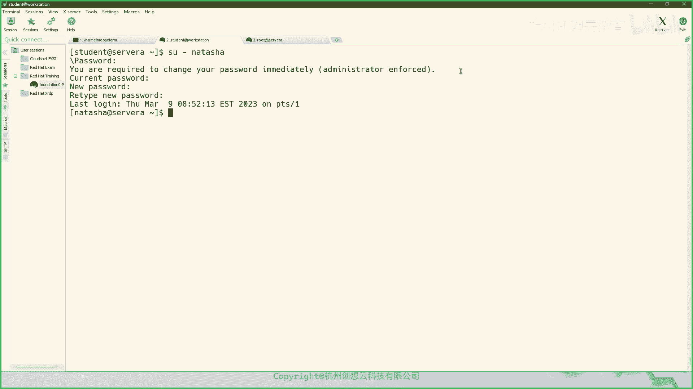

那么需要值得注意的是，在real6和real6之前，那么用户的UID普通用呃系统用户的UID呢是1到499。而普通用户呢是500以上啊，这个地方所以说如果你是错的，不希望用户去管理的啊201到999呢。

就说如果没有被使用的话呢啊我们用户呢可以去分配比如说你装一个服务器软件啊，那你可以给他指定1个UID是不是哎可以走这个啊。那么需要值得注意的是，在real6和real6之前，那么用户的UID普通用呃。

系统用户的UID呢是1到499。而普通用户呢是500以上。呃，这个地方所以说如果你是从re6升级到re7，或者是real6升级到8re6升级到9的，那么UID的地方一定要注意。

先把用户的UID呢做做好迁移，再去升级系统，否则会出大问题。啊。这是我们今天讲的这一小节啊啊今天的内容大家有没有问题的？啊，如果没有问题，大家扣个一啊。

re耀6升级到re耀7或者是re耀6升级到8re耀6升级到9的，那么UID的地方一定要注意，先把用户的UID呢做做好迁移，再去升级系统，否则会出大问题。啊。

这是我们今天讲的这一小节啊啊今天的内容大家有没有问题的？啊，如果没有问题，大家扣个一啊。我们涉及到这些文件呀，大家下去之后呢，一定要看一看啊，里面都有注释啊，都是带表什么含义，一定要好好看一看啊。

同志们。我们涉及到这些文件呀，大家下去之后呢，一定要看一看啊，里面都有注释啊，都是带有什么含义，一定要好好看一看啊，同志们。好，大家今天晚上讲内容有没有问题？如果没有问题，大家扣个一啊。好。

大家今天晚上讲内容有没有问题？如果没有问题，大家扣个一啊。啊，这个延迟是蛮高的。哎，过去都感觉。3分钟了。O。好，那么大家没有问题，我这边就把直播断开了啊，直播断开了啊。我们周日见啊。

大家咱们讲东西一定要实验多敲啊一定要多敲同志们。啊，这个延迟是蛮高的。哎，过去都感觉。3分钟了。O。好，那么大家没有问题，我这边就把直播断开了啊，直播断开了啊。我们周日见啊。

大家咱们讲东西一定要实验多敲啊，一定要多敲。同志们别积累到后面啊，越往后面命令越多啊，你的时间越紧张，平常就把它消化掉。啊，就把它消化掉啊，我这个。呃，等两天会给大家写一个实验手册啊。

到时候大家按照实验手册敲实验，好吧啊，书上的实验要敲啊，实验手册也要敲，我们重新开发一套新的实验手册啊，给大家来练习啊。别积累到后面啊，越往后面命令越多啊，你的时间越紧张，平常就把它消化掉。啊。

就把消化掉啊，我这个。呃，等两天会给大家写一个实验手册啊，到时候大家按照实验手册敲实验，好吧啊，书上的实验要敲啊，实验手册也要敲，我们重新开发一套新的实验手册啊，给大家来练习啊。好。

那么我这边就把直播断开了。好，那么我这边就把直播断开了。

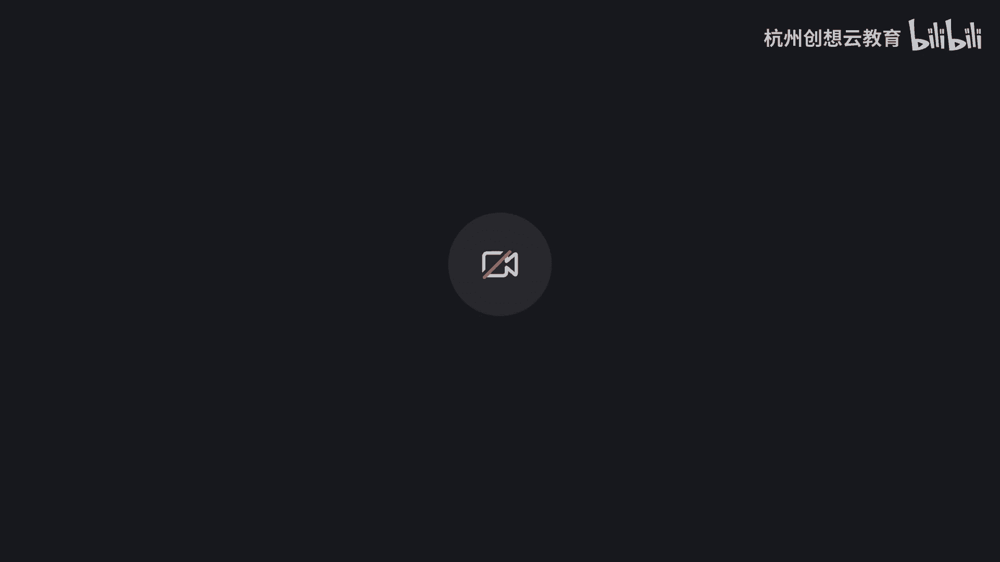