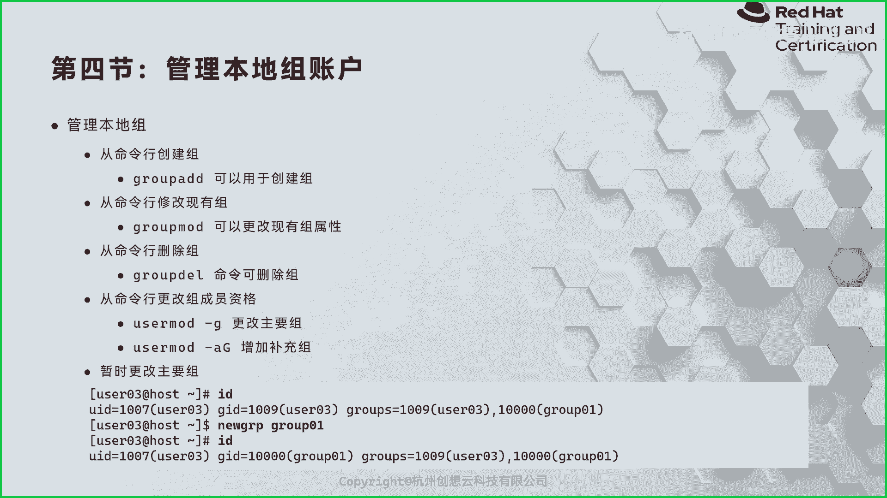
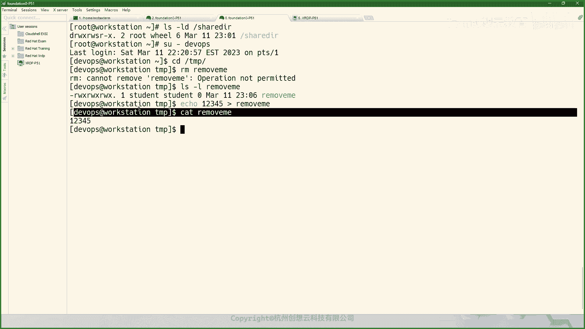

# 红帽认证系统管理员RHCE 9.0（2023年最新版）-3 - P1 - 杭州创想云教育 - BV1dj411D7yh

对。这个位置是最好的啊。そそす。咱们咱们准备上课啊。把那么。嗯，咱们先来回顾一下咱们嗯上周四晚上对吧？我们讲的内容啊。大家回顾一下先。哎。

第啊。好，那咱们这是第二之后啊。嗯，第二周，那么我们先来回顾一下。啊，回顾一下咱们的是呃，咱们上周四晚上讲的内容啊，那么咱们上周四的话呢是介绍了一张半左右，是吧？啊，一张半左右啊。呃。

那么我们的内容是什么呢？那么介绍了这么第一个知识点，那么是介绍了那么所谓的纯定项的概念啊。对吧重一的概念。然后呢，如以及那么如何去使用。对吧那么我们用到符号，有比如说一个例如是吧，哎一个大大于号对吧？

后面跟上一个文件是吧？那么这是一个什么呀？标准输出重类项，是不是？那么还有什么呀标准。错误重立下啊，还有一个什么呀，将标准输出。和标准错误。进行重定下。啊，对吧还有什么呢？还有这个。

大一号呢两个大型号加角示追加对吧？哎，追加啊。又学习了管道服。啊，海到符。管道服。还有什么呀？还有T命令对吧？T命令啊，又学习了如何使用VI或者编编器进行文本的编辑啊，还有一些啊变量，对吧？

还有环境变量，我们可以通过set呀来查看我们设置的环境变量，或者通过U什么呀Set来取消我们的变量啊，然后使用export呢让我们的变量的生效，对吧？啊。

让我们生效啊呃以及使用ENV来查看我们系统默认的这种环境变量啊。OK那么这是第一个大的章节里面知识点啊，那么讲到的同镜像啊，然后这个地方应该是写在这儿啊，第三个是我们的。编辑器啊编辑器。以及一些什么呀？

一些需要的变量的使用方法啊。需要的一些电量。啊，这些内容啊啊，那么后来呢我们又学习了一些用户的管理，对吧？用户的管理这块呢，我们主要是介绍什么呀？介绍了如何使用Uer I的命令去创用户啊。

然后和用户创建是相关的一个文件呢，是ATC下面的什么呀log in点DFS。啊，然后又介绍了呢如何呢去修改用户的信息，还有更改用户的密码。对吧就是我们呃上周四晚上讲的内容啊，那么咱们只要回顾重点的东西。

肯定都是。我们需要严格掌握的，比如说一些文件里面的每一行的含义，对吧？哎，都是需要我们去了解的啊去了解的。呃，那么咱们今天的话呢继续啊继续啊，那么今天。咱们开始接着讲来讲这呢第六章的这个。

第六章的第二条节啊。九张啊第六章ok继续啊继续。

好，那么来看我们的PPT啊啊，那么用户的管理完之后呢，那么接着就是组的管理了啊组的管理了。那么在组的管理当中啊，组织管理当中命令还是相对来说要比我们所谓的user id呀，user mode呀。

这些命令要简单很多。哎，很多。okK那么我们以user啊，我们看这个这个用户的这个啊，我们来看一下，比如说创建创建组对吧？那么咱们之前学习创建用户的时候的命令呢叫user艾。

那你现在组呢就变成了group add。啊，就就单词变一下啊啊叫group IO啊，那么在创建组的时候呢，一般没有什么特殊的用法啊，呃无非就是来指定一下组的ID。啊，然后除此之外呢就没有了啊就没有了。

所以非常简单啊非常简单。

OK你比如说我们现在呢我去我在我的这个word station上面，对吧？我切换到我切换到哪里呢？我切换到我的管理员啊身份。啊然后呢我通过这个。Gro。艾那么创建一个组哎创建个组。那么在创建之前呢。

我通过group的命令来获得帮助啊，你看这里面有一个选项，我们偶尔会用到啊G来指定组的ID啊，组的IDO那么如果是大U的话呢，是列出来我们某个组的一个成员啊，某组成员OK好，那么我们来增加一个。

比如说我跟上一个G多少呢？2000。啊，2000什么组呢？叫做这个webADMS啊，哎创建一个这样的组啊，那么这个时候呢，我们的组信息放在哪里了呢？我们的组呢信息呢就放在了ETC下的group这个文件。

然后呢，我们使用gettting命令。啊，来读取啊我们的这个group文件。啊，然后呢谁的信息呢？webad信息。啊，你又看到了我们的组的信息啊，web groups啊，webad。啊。

然后呢他的组的ID呢是2000，那么后面没有内容，就说明我们这个组呢是是没有成员的那里面我们还可以拿着前面讲到的什么wills啊，will啊，拿过来看一下，你看这个will组里面有一个tudent用户。

对吧？哎， student的用户啊，这是组的一个创建。啊，那么组的命令创建完之后呢，那么我们后期如果要想改组的信息，那么怎么改呢？okK那么就是第二个命令了。

第二命令的话呢叫做group mode。g mode啊g mode的话可以帮助我们去改这个组的一些信息啊，组的信息。好，那么我们来执行一下啊来执行一下。

呃，刚才呢组的UID呢是2000，组的名称呢是叫做we博adminok那么我们来同样gbal mode杠H获得一下帮助。OK那么这个命令啊，你看同样杠G呢来指定我们组的ID杠A呢是来更改组的名称啊。

我们改个ID好了啊，modode啊。杠G刚才是2000嘛，我们改成3000啊吧，然后后面跟上我们的组名称啊，这个叫做。叫什么呀adweadmiss。啊，webad。

那这时候呢我们再重新的去获取一下我们的web a信息，组的信息是不是就变了，对吧？哎组信息变了。那么大家还记得我们周四晚上创建的一个用户叫什么呀？啊，叫什么来着？我忘记了。啊，今天在soA上啊。

我去SH去到soA好吧。艾他。serA。啊，home下面。哎，这是我们呃周四晚上啊创建的这个账户叫娜塔莎啊。娜塔莎的话呢，我们当时是只是更改了他的用户名，对吧？因为我们初次创建的时候。

我记得叫new币好像是啊，然后后面呢我们给它改成了娜塔莎。那么这时候呢我们来看一下这个组信息啊，哎我们来看一下L杠LD娜塔莎。你看这个这个这个呃木加目录的话呢，属于是娜塔莎的，但是组呢还是牛逼。

为什么呢？因为我们前面在创建用户的时候呢，它会默认创建一个同名的组啊，那么再加上。用户默认属于自己同名的组。因此呢呃na塔莎原来叫牛币嘛，那它属于牛，它属于new币，那无可厚非是正确的对吧？

那么现在呢我们这样看起来可能不舒服是吧？哎，我们要把new币呢也改为谁啊？na塔莎，那我们来看下效果。group mode啊杠N名字叫什么呀？叫natasha，改谁呀？改new币这个组。哎，改好了。

这时候呢我们再来看一下哪它让用户的账目录，哎就变成正常的了。那正常了啊，就是改了一些命令。

O。啊，那么后期呢如果我们对某个组不需要了，那么我们需要通过group dial来删除。那么设置之前呢，我们要确定组里面没有成员啊。啊深啊，group dial啊group dial。

OK好，那么我们回到我们的ver station。啊，把刚才创建的webadmin删掉啊，group dial啊，web ADMINS是不是很简单？啊，都出来简单啊很简单啊。好，这个我没要记笔记啊。

给它抄下来。

这是一个创建我们组的命令啊。

OK组的命令，还有呢就是。

修改组的命令。

然后。再往后呢是。删除组的命令。啊，删除组合命令啊啊，这是用户的啊组的常见的几个命令啊。那么后期我们你说那我呃组有了，那我能不能通过用户这一块这个角这个角度对吧？去管理我们的这个一些信息呢。

当然也是可以的那比如说我们PPT上的这个命令叫什么叫user mode的杠G哎杠G。那么我们就可以在已经有组的情况下呢，把这个某个用户的主要组啊改为我们姓当中现有的某个组成员。

啊，用大G来来指定，当然了也可以使用user mode杠A大G呢来增加附属组，对啊？你增加附属组或者补充组一定要加A啊，A的意思呢就是追加的意思。那如果你不加A呢。

那你这个大G后面的跟着这个组会替换掉你现有用户的它的那个默认的那个那个那个那个补充组会替换掉它，这个一定要注意啊。呃，暂时更改的这个我们就呃不用演示了啊。

那么你可以通过newGRP命令跟上组名称来更改啊，我们可以试一下啊，可以试一下。

嗯，我们刚才删掉一个组是吧，删掉一个组，我们来看一下ID studentdent吧。对吧未要组啊，这个三个组我们给它加一个啊，叫做这个这个这个newGRP啊，newGRP啊这个这个。呃，sorry啊。

我现在能这样走啊，SU啊到我们的sdent用户啊。好，现在呢我是stutudent自己啊，我自己呢我想临时的添加到一个组里面。OK那么我就这作这个面叫new GRP啊，然后呢，我后面跟个谁呢？

我给他root吧，走起啊，输你加入这个组里面要输密码的啊read hat。哎，为什么呢？因为他说你的密码没有通过，说明人家那个物钥组有没有密码呀？是不是没有密码是不是？OK没有密码啊，那么怎么办呢？

我们回到root啊，我们再创一个组。group艾这个组呢叫做一叫做这次叫做BBad means吧。O然后呢，我们把这个组呀加个密码，那么组密码group啊。P啊。

G password啊IBDad means那我们给他加个密码，比如说加个re hat。哎，加之后呢，我们再来切换到student。然后呢，跟上一个命令叫newGRP啊DBadmin。

密码r hatO这时候呢我们再ID一下自己，因会发现我们的组数就变了。

是不是啊哎，组就变了，但这种方法我们现在用的少了啊，现在少了，以前的时候会会比较多啊，现在这个组加密码什么的。

啊，比较少，你你也可以理解为这个自助增加到某个组里面啊，增自助的啊，自助的。啊，这个了解一下啊，知道啊要知道好吧。啊，知道啊。唉。那怎么感觉复制之后少东西呢？

这里。啊，这是。又另外的一个命令啊另外一个命令。啊。嗯，然后接着我们继续啊继续。啊，继续我们来看如何呢去管理我们用户的密码啊密码。呃，那么在早期的时候呢。

我们的用户呢密码呢是放在了ETC passWD的啊？那么我们也提到过，那么对于啊ETC passsWD呢？这个文件呢是一个什么文件啊，是一个本地用来存放用户信息的一个文件。

我们打开看一看它里面什么内容啊，呃，用普通用户也是可以的啊，ca EC下面的passWD啊，非常非常多啊，非常非常多。那么虽然多呢看起来很杂乱无章。其实你仔细看的话呢，你就发现它规律了。

那么这里呢分成了若干行，每个行里面呢都是以冒号作为分格符，分成了若干列。啊，非常若干利OK啊，那么我这里呢就以我们的谁呢？

cloud user点为一吧，我把那个内容给大家粘贴出来，解释一下这里的每一列所代表的含义啊，OKAPC。PASWD文件的含义。啊，那么这是摘出来的一部分啊，摘出来一部分。

那么它这里呢都是以冒画分隔符的。啊，冒号呢作为分隔符。那么其中我们的这里的cloud谁呀？user就代表的什么呀？本地的用户。啊，价格粉低啊，正正规一点是吧？然后接着呢这里一个X。

那么这个X代表什么意思呢？这XX呢其实就是密码位。哎，就是密码位啊，但是呢这个密码位呢那么就有点尴尬了，为什么呢？你看啊，我们刚刚在复制这个内容的时候，我用的是哪个用户命令去查看的这个文件啊。

是不是普通用户，对吧？哎，普通用户你都能看到密码，你想想那是什么概念？因为意味着我给大家提供了一个什么呀啊，有个柜子。我说哎这个大家上课的时候呀，可以把这个自己重要的重要的啊物品放进去是吧？

上课的时候这样啊，不用把桌子上堆的好多是吧？哎，这这时候发现那这个柜子干嘛呀？每个人都能打开。

啊，每个人都打开，那你说放进去还安全吗？对吧？就不安全了。啊，所以说呢这个密码位啊，那么在。后面啊后面的在发展过程当中就把它这个改了啊改了。那么在发发展过程当中，okK在早期的时候啊。

早期呢存放的就是我们的密码。那么后期呢那么将密码转移到了哪里了呢？转移到APC下的shaow当中。啊，转移到这个文件当中了啊。OK好，接着接着呢后面有1个2个1002啊，那么我们来说第1个1002。

那么第1个1002和第2个1002呢，它分别就代表了我们。用户的什么呀UID和他的GID。嗯。啊，用户的UID和GID。啊，用户的UID和GIDOK好，然后呢接着。啊，接着再往后呢。

这里一个cloud user。好了，user这这一列的话呢，它其实就是我们使用user id呀或者user mode的时候，那么对应的一个选项叫C，哎，叫C啊，那么C这个选项。

那么其我们把它称为是金co啊。啊，金那么说人话呢，就是谁呀？我们一般把它理解为是1个CMNT啊，就是备注。哎，叫备注。那么我们再引申一点的话呢，我们可以理解为什么呀？叫全民。一般我们备注呢写的是全名。

你你也可以写别的嘛。比如说呃我把这个地方写成我的联系方式啊，对吧？住址等等都可以啊。但是那个信息太长了嘛，哎，我们一般就写个全名啊，全名。呃，然后homecloud。Uer那这个就不不用说是吧。

就知道这是干嘛的呀。是不是用户在加目落？哎，加目录的位置啊。再往后呢，最后一列呢是谁呀？是binbash，那就是声明了我们当前用户使用的什么shall啊，使用那个shall。啊，是这样呃，注意啊。

我们的re耀9上面其实严格来说只有两个shall啊，一个呢是be by式，一个呢是一个什么呀？一个是我们的那个TMUX啊。啊，TMX啊，好，这是我们给大家下这个文件啊。好，那么接着呢下面又说了。

那么刚才我们提到了，那么早期的时候呢，我的密码呢是放在pass地了。那后面呢有为了安全，我们就把密码放在了哪里啊？

ETC筛子当中啊啊放在这里了啊，我们去看一看啊，这个这个文件长什么样子。那么我现在呢还是一个普通用户的身份啊，who am I对吧？我是student啊，我去看一下EBC呃，下面的shadow。

and你没发现会提示什么呀？permission denied对吧？权限拒绝OK那就意味着我们的普通用户啊是没有权限去啊获取这里面的内容的啊，那么我们因此呢就要使用秀度呢来获得一个提权啊。

我就直接提权root了。然后呢，我们再去读取ETC下的Cttle。哎，你会发现啊这里面就非常非常多的东西。啊，同样看起来和这个ETC下的passWD呢是大同小异，是不是啊？哎也是分成了若干个列啊。

若干个列，但是不一样的地方在于啊要么很短，要么就很长，对吧？为什么呢？你像。你像这里的啊每一每每一每一列都要什么意思啊？你看我们的PPT上写的非常清楚。那么第一列的话呢，同样是我们本地用户的名称啊。

就是我这个标红是一的地方啊，那么第二列呢，这个很长的这一块呢是什么呢？是我们用户的密码。但这个密码呢不是铭文的啊，而是被加密之后的密码O而我们刚刚在终端里面所看到的这些密码就是被加密后的密码非常长。

然后呢，但是呢你像和它紧挨的一个用户呢，叫什么sstemDOOM啊，那么写这个感叹号星号是不是啊，然后再往上呢有一个什么呀？TCP大。啊，然后呢写个双感叹泡，那么这什么意思呢？那么这里的两个种情况呢。

我们都给它统称为一种就行了啊，不需要过详细的去分啊，就指的是呢哎我们的这些账户呢密码是没有设置的。OK那么像这种的话呢，一般是指的什么呀？就说这个这个呃密码是是什么呀？啊，这种密码呢就是为空啊，为空哎。

然后呢被锁定了啊，锁定了啊，那么你像我们哎我忘了怎么办是吧？慢的话，我去埋一下啊，慢级。我想卖一下sle这个文件。帮助我们应该满级。啊，同志们来给大家考察一下大家的掌握的情况啊，把这个章节的数字。

大家线上的小伙伴打在群里面啊，把现场的呢，然后。这个卖第几章题。看大家回去有没有练习啊。第一道题。注意啊，这个是第五章节啊，一定要把曼手册的章节编号一定要记清楚啊。OK第五章节打开啊，我们来看一下啊。

你看呢就告诉我们了，对吧？每一行都有几列啊，包含了九列9个部分啊，中间呢以谁呀？冒号作为分割服啊，然后呢有一下内容啊，log in name是吧？哎必须是个有效的账户名啊，就是姓当中存在的。

是不是本地的意思呀？本地用户名是啊？OK第二个列呢叫什么呀？叫做这个啊加密后的密码是吧？哎，那这个地方可以是空的啊，空的意思呢就是没有密码。那没有密码啊，正儿八经没有密码啊，你创建完用户之后呢。

可以通过user。呃，sorry呀。通过pas入D命令啊，杠D啊，然后呢删除用户的密码，那本地登录就没有密码认证了。注意啊，仅仅限于空密码是本地登录啊。然后呢，如果我们后面啊有些符号。

比如说包含一些符号，哎，那么符号比如说哎感叹号或者星号是吧？哎，那就意味着我们没有使用unux的密码来登录。啊，或者用了其他的方式。那么还有一种意思呢，就是我们的密码是被锁定的，没有设定密码。

都是都会看到这样一个信息啊啊，那么具体加密的内容的话呢，我们可以通过man三啊cra去看一下。因为因为这里面的信息是很非常丰富的呀，对吧？你看这里do6 dollar什么什么这么多信息都代表了什么含义。

对吧？我们肯定是要理解一下的啊，那么去man一下啊，m一下m3三是什么。

是不是系统的？库啊酷O好，那么说了啊这个这个这个函数呀，那么是用来什么呀？是个是一个字符串，用来什么呀？Ecoding啊，然后解密的一个函数。那么这个算法呢是这个这个怎么怎么怎么样的啊。

他说这个这个关键词K部分啊，包含了一个字符串可以用来这个这个解密，然后呢，颜值巴拉巴拉巴拉巴拉什吧这颜值啊，然后呢有两个字节的什么什么巴拉巴拉巴拉巴拉巴拉巴拉说了很多啊，很多很多啊。

那么这里是这个解密码的时候的一些它的源代码啊，源代码O等等信息都是有的，都是有的，还有加密的是吧？加密的都有啊，都有的。

O因为现在这个请8版本之后呀，它这个地方变化还是蛮大的，就是它这个慢手册OK然后这个你看它涉及到一个加密啊，我们来看加密的这个函数试一下啊，慢3。啊，麦三我们来看一下它这个函数啊。

那么这个函数的话呢是告诉我们如何去加密设置C啊等等等等这样的一个啊一个内容啊一个内容。然后。看这个有没有我们想要的东西吧。没有。没有哎没有啊，没有敲过啊。

因为现在这个他这个介绍家密的这一块还是很难找的啊。那么你像我们。PPT上的这个介绍的内容啊，那么你像这里的啊这里的那么第一个是他写的个doer6，看到没有？这个doer6不是白写的啊。

这个doller6是有特殊含义的。呃，从早期real6啊re耀7里面我们见到的这里呢都是基本上都是doll6了。那么再往前re15啊，re15的时候呢，我记得是刀这里写的是。

dollar一好像是啊记不清了，那个那个太太远了啊嗯。因为我第一次接触的re系统就是re耀5啊，re耀5，那它时间太久远了啊，记不清了。那么你像这里如果是一的话呢，就是MD5啊，那么后面后面的话呢。

其实这里也有其他的，但是红帽没有用过啊，红帽用的话呢就是还有一个就豆26。6的话呢是哈西512啊，如果看到这是5的话呢。就说明是doer，它是哈西256。啊，如果是二开头的，比如2A或2B。

那么代表的是blue fish的这种加密啊，blue fish。呃，了解一下就好了啊。然后呢，在第二个这个doer符和第三个doer中间的这一串呢，就是我们的颜值。I thought。哎。

那么大家知道颜值是干嘛的吗？啊，比如说我们有一个密码啊，输进去字符串A。那么我们的系统根据我们加密的算法，生成一个颜值，随机的一个字符串啊。然后呢把这个颜值呢，这个字符串呢每个啊这个字符随机的。啊。

分散在我们的字符串当中啊，比如说字符串A0当中，然后呢再使用哈西512进加密，然后呢就生成了第三个doer符后面的这个内容啊，然后呢，解密的时候呢，同样对吧？根据你输入的密码，再加上这个颜值，然后呢。

推测是否能匹配后面的内容就能证明你的密码是不是正确的。你举个例子，比如说。比如说我们该进他下吧，该进塔。我们的这个root。shahadow啊shadle SHA shadowdow。扫了一下摆万。啊。

root的啊哎，那么你看root的话呢，它的颜值是9KL据点啊，那这个是。O啊，然后呢Y9S巴拉巴拉巴拉这它的颜值。那么密码呢我们知道的是red hat呀，我们测试一下，对不对？怎么测试呢？

open SSL呃，这个pasWD。那然后这个杠doar6啊就6啊，然后呢杠st。啊，SLA saltt salt的话呢，这是我们的颜值把它抄下来。然后呢，我们输进去我们推测的密码。

看验证一下是不是re hand。SALT啊。好，走，那么这时候呢你会发现它生成了一段新的内容。我们来对比一下密码文件当中的这个字符串和我们的这个字符串一样不一样。看一下。这高亮部分一样不一样。

是不是一模一样？对吧哎一模一样啊，哎，那么就验证了你的密码是不是readhead呀。是的，你对不对呀？对我就允许你登录进来了。哎，简单。啊，这是一个验证的方式啊验证方式。OK好。

那么接着呢在我们的这个shale后方啊，那么这里的底下还有个第三啊，标记为二也介绍完了啊。那么第三的话呢，代表的是我们重我们的密码，上次修改的时间啊，那么这个时间呢那么乍一看呀，感觉啊很奇怪，是吧？

怎么写这个15775呢，不是年月日呢？O那么这个时间呢它走的是一个我们称为是ippo时间啊，apppo对吧？apple可以翻译成什么呀？周期啊，也可能是翻译成是一个朝代，对吧？你可以理解为是什么呀？

这个时间是从什么呀？是从我们公认的计算机的元年开始的啊，计算机里面的计这个近年是用什么呀？用计算机的这个时间来记的是吧？比如说现在这个这个这个。对吧比如说我们现在这个所谓的这个呃日历对吧？

那么用的是什么呀？国际用法，对吧？是按照这个基督教的那个那个时间来算的对吧？有些不是教授说嘛，哎，中国人应该用什么呀？中国人的日历，对吧？按照咱们中国的这个历史的元年开始记。

那就现在怎么也得5000多年了，是吧？O反正都对哎，都对，都是一个相对的而言啊，那么同样呢我们这里也是一样的，那么这里的三呢就代表了是啊距离197年11月1日啊的天数。啊，天数OK是个天数啊。O。

这个天数啊15775哎，15775OK。呃，然后你像这个时间的话呢，我们也是可以用来计算的。大家还记得那个。贝塔命令吗？有印象吧啊，对的命令呢我们可以算一下呀，既然是天数嘛，我换算成秒。

然后那个变成日期啊就可以了啊，15775啊OK。呃，然后群里面消息一下啊，是延迟还是延值？呃，sorry，我说的既不是延迟，也不是延值，而是sought啊，是这个颜啊，是单词英文sought啊。

翻译过来叫颜值啊。O。你说的我你说的这两个字我都不对啊。OKs叫颜值啊。跟颜值无关啊，上这门课不凶，颜值很高啊。啊，那么接着呢第四啊编辑编号是四的位置啊，那么是什么呢？

这个地方呢代表的是我们从啊这个编号为三的位置，这一天开始算起啊，你距离多久最短的时间啊，从啊这天开始算起，对吧？你中间啊隔多少时间隔多少天之后啊，最短可以改密码时间啊，那么我们这写了零啊。

那零代表的是距离你修你修改完密码之后的那一天算起最短几天呀，是不是零天呀，就当天就可以改对吧？你当天改呢，就意味着你是是不是可以随时随地的改不受限制，对吧？OK那如果改成一呢？那就是说你今天改了密码了。

你还想改密码，那就等到什么时候是不是要等到明天才能改啊？OK。啊，按按着明天才能改啊啊，这是我们的这个这个。第四列的意思啊，那么第五列啊第五列，那么这里呢有一个5个9啊，5个9的话呢。

同样也是指的距离我们上次修改完密码之后啊，可以改密码时间。但这个密码时间呢指的是最大的。你要改变了时间，也就说你你到这一天呢要干嘛了呀？啊，你你你你改完密码之后，呃中间隔了这么多天之后啊。

就需要改密码了啊，但是呢5个9是多少天呢？你看我们三第三列，对吧？那么我们创建完用户之后，密码才151575了啊，你这都5个9，那就记意味着多少年以后了，你想想一年365天。

你这90099999是多少多少年以后了，是不是啊？哎，所以说呢我们就把它理解为是没有对密码的有效期呢做限定。哎，做限定。OK你像这个时间呢，我们是可以改的啊，是可以改的，改的方法呢有两种。

一种呢就是直接改ETC下面的log in点DEFS这个文件。第二种。啊，第二种呢就是呃我们通过后期给用户的针对用户来改这个密码的有效期啊。那么相对而言。

那么在ETC log in点DEFS当中去改密码的周期的方法是一劳永逸的啊，一劳永逸的。我们举个例子，好吧，比如说呢我们先看一下我们的哪个用户呢？我们get一下shale。

我们去看一下我们的na塔莎这个用户。哦，sorry，这个na塔莎我们在哪里啊？在serv A上面是吧？好，那么我。远程到我的sA。然后呢，get it。我们的C文件。然后呢，获取那他下这个用户的密码。

那么他的你看他的时间是多少呀，是不是零和5个九，对不对？我们改一下嘛，怎么改呢？我们看改了这个文件啊，login点DF。那么在这个文件当中有这么一句话。啊，有这么一句话啊，在哪呢？在这里。

在我们的131行和132行，在这个位置，我们有两条有行内容。你看pass max base对吧？密码的有效期最长的天数和密码的有效期可以改密码的最短的天数。你看上面有解释的。啊，那么我们再改一改好吧。

比如说密码呢，我允许三天之后才能改，不能太频繁。那么密码最多呢用能用几天呢，用20天。啊，20天我们来感受一下好吗？

啊，我把这个内容先记下来啊记下来。这叫什么呀？修改。系统用系统中用户默认密码的什么呀？默认更改密码的生命。周期。啊，周期啊，文件呢是ETC下面的login点DFS啊，login点DFS。好。

那么改完之后呢，我们看一看我们的用户有没有变有没有变。是不是没有变OK然后呢，我们再创建个新的用户，好吗？user I。啊，Uer ID这次呢我我在创建用户的同时呀，给他加个密码杠P。那密码是多少呢？

密码呀就是这么一串内容啊，一样的啊，也是readd hat啊，就它的铭文就是read hat，密文是这么一串内容啊好，然后呢空格啊，叫谁呢？叫做。叫做什么呀？叫做这个这个这个。起个人名白，起个谁呢？哎。

起个。jack好吧，哎GACK。哈，然后呢我们这次看看jack呢。😊，啊，这 okGACK好起。啊，哎你会发现它的密码的最短时间是多少，什么时候呀？是不是三天以后才能改密码，最长时间呢是20天。啊。

20天啊就这么，也就说就意味着你改完之后什么时候才能生效呀？

是不是改了之后，对他只对谁有有效呀？只对。什么呀后期增加的用户有效啊。OK这个文件非常重要啊。啊，这是给大家说了第四行第四啊第四列和第五列。那么第七列是什么意思呢？第七列的话呢，它代表了我们的密码。

就第五列这个部分的时间到期之前几天来给我们警告。哎，比如说我们刚刚。是不是改了这个系统范围内的密码，是最长是2天吧，对吧？哎，你二你你这个密码改完之后啊，等到第15天的时候，你登录系统。

你会收到一个警告，说你的密码将在5天后干嘛呀？过期请更改密码，第15天的时候。哎，如果你改的是5啊，如果你把这个地方改成5啊，如果是默认就是7的话，那，就是几天呀，13号那一天相当于是吧？

第13天的时候。啊，那么会提呃接到这样一个警告。同样我们也可以啊。在这个地方啊去给它更改也是可以的。然后默日7天啊，这个这些改的方法呢都是看你的需求要不要改啊，不是说老师讲了，我回去呢。

就把我们的都改掉了啊，不是这样的啊，那么看着你们的你们的这个啊，这个你们的这个单位内部，然后这个安全的这块怎么去做限定的。

啊，也是可以改的啊，是可以改的。那么默认是7天哎，7天啊。好，再往后呢是什么呢？再往后呢就是第六列了。第六列呢这个地方是空着的是吧？但是呢同样我们是可以改的。那么代表的是呢也是一个数值，数数值啊。

那么这个数值的话呢，就代表了啊，那么比如说我这里呢写了一个三啊，比如说我七的这个地方，我写了个三就代表了我们第五列的部分，这天开始算起，我再增加三天这个时间段之内。啊。我还允许你改密码。

我给你延期三天嘛，你密码第五你第五列这个地方是不是就到期了，对不对？你像我们的终端里面的这个，比如说这个jack，它是不是密码改完之后，第二天的时候，密码是就到期了，是不是哎，到期之后呢。

你你你如果你今天没上班，正好你没有登录系统，你第二天来是不是登不进去了，你密码过期了呀，那怎么办呢？

哎，我呢可以在这个。第几列啊，在这个第七列的位置，我干嘛呀？比如写个三，那有一位置。就意味着你密码过期之后，我还给你延期了3天。在延期的这三天之内，你随时登录系统的时候呢，你的账户没有被锁定。

你只要改了密码，你还是可以登进去登进来的。但是这三天之内是必须要改密码会强制的。因为你的密码已经过期了，但是我还允许你登录来更改密码。啊，就这么个意思啊，如果你还不改。OK你的密码就被锁定了。

账户也被锁定了，就你只能联系管理员了啊，管理员了OK那么第八列呢是指的是我们定一个日期。哎，这个日期呢和密码的周期没有没有直接的关系。啊，比如说我写了一个时间对吧？啊，比如说这个哎换算之后呢。

是2023年的10月1号，哎，那就等到这一天，你的账户就被锁定了啊，你的密码过不过期，我不关心，反正到一天你的账户是被锁定的。第九列呢是保留参数啊，目前都是空缺的哎空缺的啊。然后这是我们说的这个内容啊。

然后呢，密码的这一块呢，我也给大家解释过了啊，解释过了啊，一定要注意。OK saltt啊颜值啊。

好。呃，如果我们没有使用修改log in点dos文件啊，就log in ETC下的。老给你点DFS文件去改用户账户的密码。不如我改了，后期只想针对某个具体的用户去更改它的密码周期。

我们可以使用CHAGE命令来更改CHchan更改AGE周期。啊，周期O。那么这个图上面的这些括弧里面啊，其实就是我们CHAGE的选项啊，杠D来指定上一次改密码的时间啊。

那这个日期比如说我要把这个D后面写个0。就代表了距离上次改密码的时间，距离197年1月1日是几天呀，是0天。啊，是零天。好，那么问题来了，那么这个零天代表什么意思？啊，想象一下这个零天代表什么意思。

如果啊我通过CHAGE命令，然后杠B写了个0，后面定了一个用户的账户名，那代表的是该账户的密码的上一次改密码的时间，距离197年1月1日这一天是0天，哎，就相当于197年1月1日那天改的密码是对了？

他那么它的潜台词什么意思。想想。那你的密码真的就是那天改的吗？是不是？想想。什么意思啊？问大问大家一个是历史问题，我们的linux是哪一年出现的？我那个词是哪一年出现的，知道吧？是不是1991年呀？

1991年，那你linux系统是1991年出现的那你的账户的密码是197年1月1日生成的，可能吗？这个事情。可能吗？大家想一想不可能吧，这违违反常理，是不是？那么潜列词就是说你的这个密码怎么了呀？

已经过期了，知道吧？已经过期了。就是说你下灯的时候，要必须强制的更新你的密码啊，指D的一个巧用啊，杠D等于0啊啊，然后呢小M呢就是来指定我们最短的时间默认值是0嘛，我们可以改成几啊啊。

1234567都行啊。随便啊。大写的M呢是最长的天数。那么我们系统里面默认值呢是5个9哎，5个9，同样你可以改啊。大写的W呢是警告时间啊，默认值是7，你也可以改OK啊，大写I呢指的是你的密码过去之后。

这一天开始，我再给你预留几天那比较7，对吧？那我们来感受一下，我们来验证一波啊，验证一波，怎么验证呢？

刚刚呢我们我们的这个jack的用户的密码呢，它的时间呢是啊。197年呃19428这天改的啊，那么这一天其实就是谁就是哪一天呀？啊，就是我们今天嘛，对吧？今天啊好，那么现在呢我们准备干嘛啊。

我们给它转变一下，怎么转变呢？

那么这个转变的话呢，我们没有必要啊真的用d命令去转啊，这个就太累了。我们这里呢就直接的。

啊，直接的啊，然后呢干嘛呢？直接的把它写在这里啊。好，然后呢我们给它执行一下。

OK来执行一下，那么怎么执行呢？

好，我们来做个命令叫CHAGE。杠LJ。那么通过这个命令呢，可以打印出来什么呀？打印出来我们这个。用户的密码的周期。啊，你看上次改密码的时候呢，是3月12号，对吧？过期时间什么呀？4月1号。啊。

4月1号，那你3月12号到4月1号是几天呀？啊，几天是不是2天？正好20天吧，是不是？哎，我们刚刚这里面是不是写了20啊哎，然后呢，你的密码。最短的更更更改密码的时间是几天啊，是不是三天，二天7天。

你看是不是一一对应的啊，一一对应的。然后密码的呃不活动日期呀，账户的过期呀，我们都没有定义啊，都没有定义啊。我们现在改一改啊，CHAGE杠D0。这看。好，然后那我们再来看一下，你会发现密码都怎么了。

必须要更改，是不是哎，必须要更改了啊，就必须要更改了。好。那么这个时候呢，我们接着干嘛呀？我们接着呀这个。

我们接着呢这个验证一下试一试啊。好，我再启一个终端啊，然后呢我们SSH。tu我们SH。啊，这个这个这个什么呢？嗯，因为这个账户的话可能啊直接把 studentent at one station。啊。

然后呢然后呢搜A。啊，SU杠GACK。密码出来的看到吧。REDHAT。哎，不是不是readad吗？我记得是re海的呀。あ。嗯，我哦，不对，是12345，我们拿的是这串密码，哪里改的是12345密码。

还不是不是redhead啊，123456哎，不对，咱们昨天咱们周四晚上这个哪拍展的码是多少呀？12345忘了。12345也不对呀。诶。忘了哼这个密码多少来着？忘了那手动改一下吧。啊，我先我先改一下啊。

😊，呃，ele。Ride hat给谁呀？STDIN嗯GACK啊，好改一下，改了之后呢，我重新重新再给改为0啊啊。这样才能效果好，登一下readide hat，哎，你会发现怎么了？是不让我们立即改密码呀？

哎，你被请求什么呀，需要立即的更改你的密码，谁要求的管理员强制的先输入当前密码做实份验证。再输入C的密码REDHAT123。21DHH123行不行，不行，太短了是吧？哎，不行太短怎么办呢？

那我们找一个内容啊，当做密码，就就复制这块吧。我密码还用。感谢。三题哎，成功了。这时候呢我们再来看一下这个密码信息。CHAGE杠LGACK是不是更新了？第二更新了啊，接着我们再把这个密码的这个什么呀。

我们再把这个密码的这个周期呢改一改啊，怎么改呢？

我们这样改啊。CHADE。啊，杠小M一天啊，杠什么呀？大M啊，大M啊，改成这个30天。警告时间呢呃提前3天啊，然后呢往后密码过去之后，不同的时间呢是也是改成两天吧啊，给我们的ja。好，也看一下。

你看上次改的是今天什么时候过期呢？4月11号。4月11号是不是比刚才的4月1号多了10天，是不是30天？对吧那密码过期时间呢，我后面是不是延延期了两天？是不是1313号嘛，对吧？11加2等于13嘛。

是不是？然后这个最短时间变一天了吧，最长的时间是密码有效期呢是30天。过去之前三天会警告哎，就改出来了。然后呢，我们来验证一波啊，怎么验证呢？

呃，那么这种方式要想验证呢，就是我们需要改时间啊，不可能说等到那一天是吧？哎，我们来改时间啊啊，怎么改？

data呃我们改成。改成4月的。几号呀？他提前三天是吧？11减38号是吧，我们改成8号吧。这个4月8号啊，04082023年。啊，O。走起。那啊4月8号了啊，然后呢这个时候呢我们。

登出一下进来密码是谁来着？这个密码太那个了，太尴尬了。是这一块对吧？啊，我先给它复制上一份啊，省得一会儿又忘了。好，然后呢粘贴进去。你看是不是提示我们的密码将在两天之后过期。对吧OK然后呢。

接着呢我把时间呢再改一下，改成什么时候呢？我再改成4月8号，我改成4月啊。4月几号呀，我看4月14号好吧，哎，1呃改成12号好吧，12号是不是密码已经过期了，但是又不属于什么呀？

不属于那个不可用的情况是吧？所说我们改到4月11号。啊，12号。啊，4月12号好，这时候呢我们再来登出重新新来一次。密码。sorry，没说错了啊。密码复制。哎，这时候要求我们干嘛呀？必须要立即改密码。

那我还是不改。😡，啊，我还是不改，我再把这个时间干嘛呀？改成4月几号呀？14号14号是不是已经超出了。人家提供的最什么时候呀，是不是最长期限，你相当于逾期了嘛，是不是哎，这时候我们再来登一下试一试。

输完密码。能不能打？是不是不能登了，过期了哎呀过期了啊。OK这就是我们给大家演示的这个密码的这个时间啊啊然后我把这个笔记整理一下。啊，这改完之后啊验证。啊，验证。首先呢改了时间。然后呢。

我们这边呢就登了一次。

哎，会看到一个这样的效果。

啊，然后呢，这边呢我又改了时间。

变成了这个样子。好好。

最后呢我又改了时间。

对吧就登不上来了啊，你你被被冻结了。

啊，冻结这时候我们冻结之后，我们再去看一下那个该进一下吧，该进我们的shadle。还有什么变化？谁呀？JACK是吧？啊。你看好像没有什么变化，是不是？但是我们已经登不上来了，因为时间超过了啊。

已经超过了啊啊，这是我们的这个命令。好，我现在把这个日期呢改成改回来，改成今天啊2023年的3月12号。啊，3月12号OK改好了，它左ETD时间，哎，持序怎么变ETD了？诶。还有得 data。Site。

Time zone。上海。听下啦哈。😊，正常了。什么上午的事跑到下午了啊。好，这是给大家演示的这个更改密码的周期啊，密码周期。啊，然后呢我们如果这个要想锁定账户密码的话呢。

就是可以使用这个命令叫user mode杠L或者是password杠小L都可以锁定账户或锁定密码。来限制密码登录，用户登录都是可以的啊。解锁的话呢。就是us mode什么大U啊，password小U啊。

这个可以试一下下去啊。呃，如果我们想创建一个用户，那么这个用户呢是用来提供服务来使用的。那么我们可以给用户的sha要改为SBlogin。啊，这个地方一定要注意啊。SB能log in好吧。

非常重要的一个shall。非常非常重要啊。very important。啊，然后呢大家要干活了啊。对。好，那么大家呢把教材翻到我们书的187页。1月87项的一个实验。大家执行的时候呢。

在我们的reo9上啊命令是这样命令的啊，叫lab u labb，我确定一下啊，别的别整错了。叫lab start users杠 review。啊，把这个实验呢大家敲一下，好吧。嗯。

然后我们45继续上课啊，45继续上课啊。啊，如果你你你中间累了就休息一下，然后晚上瞧都可以啊，都可以啊。但是敲是必须要敲的啊。好，咱们继续啊继续。那么我们来看第七章。啊，第七章。呃。

第七章介绍的是什么呢？第七章讲的是权限啊，那么也是非常重要的一章啊，非常非常重要OK。啊，第七章。

呃，权限的话呢，我们前面讲第六章的时候呢，给大家也提到过，对吧？用户和什么呀？权限是不分家的啊，那么为什么出现权用户呢？我们是为了给他分给他区分不同的身份，对吧？然后呢从而出现了权限啊，然后呢分配。

他可以访问什么样的资源。Okay。那么这一张的话呢，一共是3个大的支点。那三个大的知识点啊，那么分别有什么呢？比如说这里面提到的这个如何呢去查看文件权限，文件系统的权限信息，如何去查看啊。

我们需要掌握权限的一个具体的含义。O然后呢。呃，第二部分的话呢，就是要学习如何利用命令行来修改我们的权限和所有权。第三部分呢就是文件的默认权限啊，默认权限还有特殊权限啊，特殊权限OK。

呃，那么说理这个权限的话呢，在我们整个的红帽的培训当中啊啊权限啊。权限这个部分，那么其实是有三个的啊。那么第一个部分的话呢，就是什么呢？就是我们介绍的叫所谓的普通权限。哎，第二个部分的话呢。

我们把它分类为叫特殊权限。第三类呢叫什么呀？叫做文件防控列表。啊，三种。但是呢第三种的话呢，在我们的re耀酒当中干嘛呀？不再介绍啊不再介绍。那么就瑞耀8的话呢，是有的。啊，re耀8是有的。

咱们re耀9是没有的。啊，那么将来我们。上课上课上完了啊，如果我们考试的是8的话，那么我们能考八的话，那么我们再把这个文件访块列表再再说一下啊，如果这个。将来我们考试就直久了。

那么文件控制访问列表呢就不再介绍了啊，这个大家嗯指导一下啊。啊，能能用吗？能用，但是呢培训里面不再介绍ACL了。因为ACL这个东西比较特殊啊比较特殊。呃，目前他用的人比较少啊比较少O。好，呃。

那么首先我们来说说权限啊，权限。那么权限的话呢，我们可以在终端当中啊使用这个命令来查看IOS。

啊，加上一个杠L。啊，LS加上个杠L啊，那么杠L的话呢，就可以帮助我们列出什么呀，列出我们对应内容啊。那么其中我们随便找一行对吧？你像这一行它的左边啊，哎这里面有些RWX的这些东西。啊。

其实就是权线位就是权线位啊。所以说对于我们而言，我们需要知道的是是对于权限啊权限的话呢是这样的，所以说呃。我们的权限是这样的。那么对于性当中。中的文件啊，那么都有具体的权限。啊，具体的权限。

那么这个权限的话呢是什么呢？那么这个权限的话呢，是按照。按照啊文件的所有者。左手组。和其他人。啊，这样的一个优先顺序。优先级的顺序。进行匹配的。啊，进行匹配的OK呃。

你像我们刚刚在终端里面看到的这个命令呢，就是。从左到右分别去判断是啊文件的所有者是什么权限，对吧？啊，这个文件呢属于哪个组，那么它组的成员是什么权限，然后再往后其他是什么权限，这样一个分类啊。

一个分类OK。那么在这些权限当中啊，那么我们在匹配的时候呢，就是匹配规则啊，规则但就是从左到右。然后呢，从大到小。哎，到小okK。就是刚才给大家说的那个规则啊规则。啊全上行。嗯，然后。Yeah。然后呢。

那么刚才我们在工单当中。看到的这些字母啊，就是我们的权限啊，我们来具体的来讲一下这个权限的一个内容。

OK那么我们在讨论这个权限的时候呢，我一般都会给我的学员呢这来强调啊，就是说呃一定要分清楚。虽然我们说一切接文件啊，但是呢我们在讨论权限的时候呢，还是要尽量的细分一点啊，那么我们把这个权限的RWX。

那么统称为什么权限呢？R呢是读取W是写权限，而这个X执行。但是呢哎我们要具体一定要分清楚，对文件而言，那么这三个权限该如何去理解是最为恰当的。还有对目录的。这个权的影响到底怎么去理解是最为恰当的。

大家一定要去分清楚啊。其中对于文件而言，那么R权限的话呢，就是指的是我们的用户可以对该文件呢拥有读取的权限。那就是言外之意，我就可以干嘛呀？打开这个文件能打开这个文件，然后呢阅读里面写了什么内容。啊。

写什么内容？OK。然后W权限呢。代表的是我们的用户可以啊可以比如说修改文件名，删除文件。啊，或者呢在文件内部进行一个修改这样一个操作。啊，这是写权限。而执行权限而言。

那么我们的常规文件是没有执行权限的啊，当我们。准备啊写一个文件，而这个文件是一个什么呢？是里面写了一些可以用来执行的指令。啊，可以用来指定，比如说脚本，比如说是一个应用程序，比如说就是一个一串代码。哎。

我希望通过这些代码，然后呢来达到一些对系统发生一些改变的。这样一个影响。那么这种文件呢，我们需要给它增加一个执行权限。啊，精权线一般来说是没有精权线的啊，一定要记得这件事情ok。啊，那么对于目录而言。

啊，对于目录而言，那么如果啊如果啊那么。啊，如果我们给这个目录加了1个R权限，那代表的是用户呢可以读取目录当中的其他的。文件。啊，或说里面的其他的目录。啊，这是R。啊。

OK而W呢则代表的是我可以对该目录本身进行一个修改。啊，比如说改名字。啊，删除啊，或者在目录当中创建新的文件，新的子目录，删除新的文件啊，删除文件子目录或修改文件子目录啊，这些名字是可以的，这是W。

而X而言，X的话呢则代表的是我们啊能够管理这个目录这些权限能够实现的一个基础。能不能进去哎，能不能进去？所以说一旦我们的目录拥有了R权限，那么它一定会有什么权限啊？X权限。啊，对于目录而言。

其实你可以理解为就三种权限，一种呢是R权限加X权限，一种是R权限加W权限加X权限，还有一种就是没有权限，一丁点都没有。这目录的权限，其他情况不会出现。OK这个这是文件和目录权限的一个理解啊。

大家有没有疑问的地方？啊，有没有疑问的地方？

啊。我举个例子。比如说。我先问大个问题啊，比如说我这样说啊，我现在呢有一个目录。目录谁呢？目录DRE。拥有一个权限，我们既不分是谁谁是谁啊，我们说拥有读写权限。啊，那么我们应该这个权应该多少？好。

大家把自己的答案。啊，打印在我们的聊聊天框里面啊。嗯现场你要是不想说话的话，那你也把你的答案打在聊天框里面。我看大家理解的情况啊。咱们新学院啊注注意了。特别新学员啊把自己答案答出来。啊。

如果我们的是什么权限？O。啊，把你的答案打出来啊，几个字母打印出来。啊，如果你记不住这几个字母的话呢，我们再来看一下PPT啊。

啊，三个三个权项啊是R是W还是X是吧，怎么组合的，根据自己的理解呢把它写出来。

DR一拥有读写权限啊。好，时间倒计时了啊。O。倒计时了，马上就结束了啊。好，我公布一下大家的答案啊。那么我们呃群里面大家提供答案的分别有这个贾梦元啊、洪凯、王洋、赵小弟啊，罗景乾，然后陈晓航。

那么在咱们这些回呃回答问题的学员当中，只有陈晓航是正确的。只有陈交行是正确的OK其他都是错误的。哎，都是错误的。为什么呢？刚才我们非常强非常非常的强调了，我们说了，那么我们的目录你要想去管理。

必须要有什么权限呀？有一个X权限，这是基础。所以说我们的目录的权限只有三种情况，要么是RX，要么是RWX，要么就是什么都没有。

啊，就好像你把这个目录呢就当做一个什么呀，当做一个盒子。你当一个盒子，对不对？哎，盒子的话呢，我说哎我允许你看我允许啊这个盒子啊，我允许你看一看这个盒子当中放了什么东西。

我也允许你给我这个盒子呢去改颜色啊，也允许呢你在我的盒子当中呢放其他盒子。但是呢我说了你不能够打开我的盒子，不能摸到我的盒子。请问该如何实现。是不是啊？这是没有X的作用啊，我说我给你个盒子啊。

里面你给我放个东西吧。但是我说你不能摸到我的盒子，你不能看到我的盒子。哼你说你怎么这怎怎么可能那件事情吗？是不是哎，不可能的啊，所以说X呢是基础的啊基础的OK。😊，现在回答错误的同学明白了没有？

是否明白啊，明白扣个一啊。是否明白啊明白扣个一。好，王洋明白了，其他其他人呢？O。快点抓紧时间啊，因为还有一道题呢个大家呢啊还要再出个题嗯。

啊好，接着我再出一道题啊。😊，嗯，然后呢我写了一个文件。我写了个文件。啊，这个文件是个什么文件呢？这个文件它本质上啊是一个脚本。哎，脚本。打这个脚本，那么这个脚本呀干嘛呢？我希望用户呢可以执行。执行啊。

仅此而已啊，那么试问给他应该分配一个什么样的权限？啊，哎这个应该是什么权限？好，大家把答案答一下啊。啊，用户可以执行啊可以执行。是个脚本啊，哎我要执行啊，具体干什么事情呢？啊，具体什么事情呢？

我们不关心啊，但是呢他必须要有执行权限，试问权限多少？啊，大家把答案同样打在聊天框里面啊。哎，思考一下啊。快速的思考一下。啊，抓紧时间啊抓紧时间。给大家个现实吧。嗯，改个现时嗯。一分钟好吧。

给大家来个一分钟的啊一分钟的时间。连抓紧时间啊抓紧时间。啊。呃，罗定前的你这个答案我看不明白啊，你自自己再想一下，然后你重新打一下啊，打一下，你这个我没看明白什么意思嗯。给一次看物的机会。啊。

还有20秒钟啊。还有10秒钟。好，时间到啊，公布答案。好，呃，这次的话呢和上次回答的学员基本上人是一样的。然后呢，这次答案当中唯一出错的呢是陈晓航同学。😊，这个这个对也是你啊，这次错了也是你啊。

okK你你上次是不是蒙蒙对的？😊，啊。啊，答案是2X啊2X。啊，2XO。你你要执行，你是不是要你要读到这个文件呀，你你你你文件你都读不到，你怎么去执行啊，是不是？对不对？哎，你没有办法去执行啊。

没有办法去执行。O。啊，这个这个只有这次是还是同一个人啊，只不过上次是正确，这次是失败了啊。OK好，一定要一定要注意啊，一定要注意好，讲内容啊。好，那么接着呢我们具体该如何去查看这些全信息呢，对吧？好。

我们来看一下啊啊，那么我们试一试好吧？比如说呃我们我们我们这个这个给大家随便介绍一个文件，比如说我们。

L下这个ETC下的FST报这个文件啊，这个文件那么这个文件的权限我们就是一般来说用杠L来查看。如果是目录本身的话呢，我们有为一般会加个D啊，加个D，比如说t，对吧？哎，就这种方式来看啊，只看目录加个D。

如果看目录项目的文件，我们加只有一个L就可以了啊，那么这个里面的信息都代表了什么含义呢。

要什么含义呢？啊，然后这个是这样的啊，那么在我们我们以这个为例吧，你看这个这个内容啊，比如这为例，你像这个为例当中的话呢，我们分析的内容啊，那么左边呢这一块呢就是我们的权限位了啊。

但是权限位里面它其实就分了三个部分。啊，三个部分啊，那么第一个部分呢就是第一个短的大使幅这个地方。然后呢，第二位置呢就是呃被我选中的这一块啊，我给它标个颜色吧，好像是可以标颜色的。啊。换了这个颜色哎。

这样的话就能看到不一样了。哎，这是分成三个部分。同志们分了三个部分啊，那么其中前面的这个短大式呢，这个地方呢，这个位置啊这个位置呢我们把它理解成什么呀？这个短大式呢它代表的是文件的类型。啊，位置啊。

那么在这些当中，我们有什么呀？比如说。啊，比如说我们的什么呀，比如说我们刚才提到的这个短横线呀，就代表的是一个常规的文件。OK。文件啊文件常规文件。我们严格来说叫常规文件。那然后呢。

如果是看到是一个D的话呢，代表的是一个目录什么呀，文件啊，是一个目录文件。啊，如果看到是一个L，那就是什么呀？链接文件软链接嘛哎软链接文件啊叫链接文件。呃，常见的还有什么S啊。

S的话呢就是我们的套节字文件，就是sockcket文件。呃，还有什么呀？还有还有B文件啊，那么就是快设备文件block。啊，block这种快设备文件。那既然是快设备了，那也有字符设备啊，C啊字符。设备。

文件。好，这有我们常见的这些类啊常见这些类。然后呢，再往后呢，这里的RW什么什么什么的，就是我们的权限位了啊，权限位OK那么这个权限位当中都有哪些呢？这个权位呢我们又分为一分为3RW横线空格啊。啊。

RW空格R空格哎，这样一个又分成了三个部分。那么这三个部分分别代表了什么呀？分别代表了文件的所有者，不是所属啊所有者。的权限。然后呢，还有是什么呀？文件的缩出组。啊，的权限，还有就是其他人的权限。哎。

其他人的权限OK呃，分成三个，没有的话呢，就用一个短大的符来定义啊。你不能说没有就不写，那不行啊。然后呢，再往后呢，这里的一呢这个一啊这个一。啊，代表的什么意思呢？这个一呢代表的是。我们的这个。

文件的什么呀链接。数量。啊，这个链接呢其实严格来说只能硬链接了啊，这个是软链接。啊，它叫符号练习啊，这个题实指的是硬练习啊，hard。好，然后再往后呢，两个root。

这两个root呢分别代表了文件的所有者。还有什么呀？文件的锁属组。哎，说说组啊，再往后呢就是207，那这个是文件的大小。207嗯，就是文件的大小。单位是自己啊。哎，单位是自己啊呃，然后呢后面的这个妹。

32022呢则是文件的什么呀？文件的什么时间呢？文件的修改时。啊，几个时间。啊，呃这是我们在使用L4杠L或者LS杠LD的时候看到一个内容。那么所以说那么我们就可以把这个理解来理解一下了呀。

那么对于F呃ETC下的FS table这个文件而言啊文件而言，那么它呢。他呢他的这个文件啊是属于root用户的。对吧属于弱的用户的。那么他拥有对该文件拥有什么呀，读和写的权限。而对于这个文件而言。

那么它又属于root这个组的。那么root组的成员呢，对于这个文件而言是拥有只读的权限的。ok读权限，其他人呢也是有读权限啊。OK那么这里的t的话呢。这个目录而言，对于入ot用户而言呢。

是读写执行权限啊，对于组组呢同样读写和这个权限。对其他人呢读写哎，这里面有个T是吧？T的话呢，就是我们后面要讲到的所谓的什么呀？特殊权限当中一类啊，它把这个X位呢占用了，它只是挡着了。

X还有只是被挡着了而已啊。所以说也是按WX上面又加了个T而已啊。所以说我们还没有学到的话呢，就先把这个T呢忽略掉，变成X来理解就可以了。哎，说任何人对吧？就对这目作用什么权限呀，读写和执行吧，对吧？

多线和执行啊多线和执行。啊，希望大家能够看明白啊。好，现在还有人不明白的没有，有没有？我们有同志们。啊，没有问题扣个一啊，扣个一。嗯。啊。有问题大家一定要及时说啊及时说啊。接着呢我们来看第二个部分啊。

怎么去更改文件的。

权限。啊，权限。嗯，是这样的嗯是这样的。啊，是这样的OK。呃，然后呢我们在更改文件权限的时候呢，有两种方法。

啊，更改文件权限的有两种方法。更改。更改文件的。线。啊，有两种方法。啊，方法。那么第一种方法呢，我们称之为什么呀？称之为是叫做字符法，哎，字符法或者叫符号法都行啊。

符号法其实符号法呢就意味着我们会用到一些什么运算符啊，加减这种啊，还有呢叫什么呀叫数值法。数值法就意味着就是用数字嘛，对吧？用数字来代替。啊，其中其中在符号法当中，我们是如何进行管理的呢？

在符号法当中的话呢，我们会用到一个这样的命令啊，叫做CHMOD。你看这里面提到了 change计modode啊，哎老师，你怎么叫 change级modode呢？对吧？

前面我们啊命令里面这个权限的命令不是应该叫promation嘛，怎么这里变成modode了呢？注意啊，我们nux里面表述权限的时候呢，一般都是用modode来描描述的。就为系统而言啊。

我们用的是modode，就是模式嘛。哎，你访问这个文件的模式，是读的模式，写的模式执行的模式，你可以这样理解。啊，所大家在将来看到这个mod的时候呢，就翻译成什么呀？翻译成权限就可以了啊。

OK更改文件权限。然后呢，它的语法呢就是什么呢？就是CHMOD后面跟上whowhat which再跟上文件或者是目录。哎，那 who是谁呢？哎，或呢哎我们下面有解释代表了么四类。Uus啊用户。

组group用英文G来代替OK其他人other有O，你说我记我想对用户组和其他人都去做限定，哎，我可以写个A。而这个A呢又可以省略不写。注意啊。要么要么一个A。要么不写。嗯啊，要么只有UGO的三种组合。

你不能说A和U出现了吧，不可能的啊，因为A包括了前面的三种，明白了吧？啊，你不能说看我我写个我我我我混合吧，不能啊不能混合啊，OK然后呢，这个what呢就是我们的符号了啊，比如说增加权限加号对吧？

哎删除权限用减号啊，把这个权限呢做一个精准的设置，然，用等于号。啊，用抖音号OK然后呢，这个whichch的话呢则是什么呀？which的话呢则代表的是具体的一个呃一个一个一个权限啊一个权限啊。呃。

okK好，那么我们来给大家感受一下。😊。

感受一下啊。嗯，然后我们干嘛呢？因为我们现在是普通用户呀，普通用户的受限制比较多啊，我现得切换到root。啊，我希望的root。然后呢，我们我们来感受一下好吗？我就在哪里呢？我就在tap里面做演示了啊。

因为t的话呢，大家都都都是。公平的啊公平的。好，现在呢我在这里面创建一个文件啊，文件呢叫做read me，好吧。然后呢在里面洗了东西。Hello。word。啊，至条不是空的嘛，是吧？哎不是密。好。

那么接着呢我们来看一下这个文件的权限。这个文件的话呢，对于入的用户入锁而言是什么权限呀？是不是读写啊？是不是哎可以读写啊读写好，接着呢我呢换一个终端啊。然后呢，我来我也来到了tamp里面。啊。

然后呢我在这里呢也创建个readme。但是我这个readme为了区分我加一个用户名啊。touch一个什么呀？read me点啊，这个sit吧。那然后呢我里面呀也写上一句话，叫hello。啊，hello。

什么呀？刘振他吗？放在我们的read me点。四当中啊，我们L4来看一下。哎，那么我们tudent的用户啊，student的用户创建的这个文件呢，对于用户本自己呢是读写的好。接着呢我们先干件事情。

我呢来到右边的这个终端，现在我是谁呀？输入它，我走的命令叫catread me点student。能看到内容吧，为什么我们是不是其他人是读？那么对于root而言。

他要访问read me点 studentdent是不是。是不是堵的权限？是不是是的吧？好，现在呢我要干嘛呢？我要把这个文件的权限呀，对其他人这一块呢给他这个R呢取消掉，怎么取消CHMOD。

other是不O呀？去减减去权限是减号R啊，readme点student。检查一下是不没有权限了。好，这时候呢我们换到右边的中终端，我现在是换root了啊，我再看一下这个文件，发现哎怎么还能看呀？

好像没有起效果，是不是啊？然后呢，我再切换成普通用户嗯，换成DVOPS用户，然后呢来到tap里面同样去读取read me。D儿斯能不能看到？是不是反而看不到了，为什么会出现两种不同的结果？

你弱的用户也是aser呀。对不对？为什么就就有效了呢？注意啊，在我们整个CE里面学习到权限管理。这个这个范围对于入的用户来说是不生效的。OK不生效的啊，普我们学习到的特殊权限也好。普通权也好。

对于入的用户而言是没有任何意义的。你哪怕对于入来说，哎，我不给你任何的权限，那么入的用户呢依旧可以干嘛呀进行管理。啊，这个地方一定要知道啊，所以说呢我们这个群员要想验证的话呢。

又用同用户身份去验证是准确的啊是准确的。好。刚才可以改到权限的命令啊，叫这个命令啊。

这是给大家举的这个例子，以及得出来的结论。

备注。啊，我们的RHCSA这门课。啊，CSA中，那么涉及到的权限管理。啊，对谁呀？root用户。不生一效啊。啊，记得啊，方下啊，你你说那有没有办法让不让用入的用户干什么事事情呢？当然有的啊也是权管理。

但是呢不是这些命令啊，我们有别的命令。啊，有别的命令好。嗯，然后接着呢我们再给他改一改权限吧。比如说。我是个的用户呀，我希望。我的组成员呀也是写权限。但是呢我不想用加号，我想用别的符号。可不可以？

可以的啊，CHMDG。等于我希望我们的组成员用用读写权限啊，读写权线那就RW跟上文键0。就可以了。啊，你说我能不能组合呢？对我想给他恢复原样啊，原样是什么呀？原样的话呢就是用户。啊，是读写的。

组成员还有其他人呢是只读的。可不可以？这也是可以的。大有没有发现UGO这三个字母我是可以合并在一起的吧。

啊是可以合并的啊。啊，希望大家呢能够。举一反三啊，来管理我们的权限。

啊，管理我们的权限。好。啊。那么在我们设置权限的时候呢，这个C年全目的呢有一个选项啊，叫谁呀？有个选项呢叫大写字母RR翻译过来叫什么呀，是不是递归呀？是地归啊。好，递归。又意味着呢我们可以这么玩。

看好了啊嗯看好了，见证奇都时候出现了。我创建了一个目录，叫share。在share当中呢，我有文件文件啊，文件比如说叫fill一。费要2。好，现在呢我要干嘛呢？我要看一下我的目录权限是多少。还有文件。

啊，权限我现在呢我是这样有一个有一个这样的要求啊，看好了，我的要求如下。

啊，问答问什么问题呢？我希望。希望希望什么呢？希望这个其他人。对目录拥有。啊，拥有这个读写权限。对文件呢有读显权限。啊，但是呢只能。使用啊一次命令。那如何更改？怎么来实现？

那是不是意味着我们需要把这个share的权限，把所有人这个地方改成给啊？改了多少？想想。是不是要改成是不是要把这个地方改成IWX啊？对不对？然后文件呢是不是要改成RW？对不对？好。

现在我要求一个一次性实现怎么办？哎，我们可以走这个命令啊，叫CHMD加一个阿尔玛。读写什么执行谁。说other。等于个RWX。Sre。这样可不可以？可不可以？啊，可不可以？可不可以？觉得可以的话。

扣个一，不可以的话，扣个2。想想可不可以啊？OK可不可以？同志们想一想。那么答案的话肯定是不可以，为什么呀？因为你这样执行的话呢，那么你是把目录share。他的所其他人增加了RWX。

但是呢你的文件也也干嘛了呀？是不是你的你的文件里面的用户也变成IWX了，那肯定不符合我们预期嘛，那怎么办呢？这个时候呢我们可以把这个X也换成大写的X。那么这样的话呢，就意味着当我们遇到一个目录的时候呢。

它会增加一个X权限。遇到是用文件的话呢，X权限是失效的。走起。好，我们来看一下。Sre。是不是RWX。好，然后呢这个目录下面的文件呢。

是不是按W标。是不复合OK。大X啊大X。

好，大家明白了吧？这个是这可以通过这个方法来实现啊大X。好，接着我们来看数值法啊数值法。

唉，数值法的话呢是这样的。那么我们呃利用计算机二进制的原理啊，然后呢我们把这个用户的权限呢哎进行一个。进行一个描述啊一个描述。呃，因为我们的权限呢是这个这个一共是9位嘛，对吧？9位，那么9位的话呢。

我们把每一共是分为三个部分啊，那么用户的呀，组的呀，还有其他人的啊，那么每一部分的权限呢都有RWX这三三位来根据不同的情况进行一个组合。那么因此呢我们就把这个三位啊，分别用二进制啊来描述。比如说。

二进制三个权限位啊，那么这三个权限位的话呢，如果存在，那么就标记为一。啊，如果没有的话，标就为0。啊，更记为0。比如说啊比如说如果呢我的权限呀，对吧？比如说我的权限啊。

是多少呢？是RWX。啊，是RWX，那么都存在嘛，那么就是3个111。啊，然后呢，如果啊如果啊这个不存在，比如说R空格X，那么就是101。啊，1011。那么标记一下，然后呢，因为是二进制的。

那么就变成了二的1次方。有一的话，就是有就是有数值嘛。那么刚才这不是三个一嘛，是吧？说明三个位都有，那么用二进制的话呢，都变成了什么呀？二的2次方。啊，加二的1次方，再加二的1次几7次方呀。

1次方sorry。Sorry。呃，EE1啊2的0次方。啊，一次方啊O那么这个地方的话呢都变成了什么呀？啊，二的几次方呀。二的。一次方对吧？加没有嘛，那就是零嘛，对不对？啊，0再加二的几次方呀？0次方。

哎，那么上面的这个和呢就变成几了，4加2加1。哎，那么下面的这个呢就是谁呀？就相当于是。啊，sorry啊。啊，二的2次方啊，那么这个地方就相当于是4加减0。啊，加一来描述。啊，来进行描述。

OK那么求和嘛，那这个是代表是最终的最终的这个什么呀？十进制，那么它的这个数值啊，那么那么就变成了什么呀？就变成了这个R的权限嘛，就是4嘛，那么写的权限就是2X权限呢就是一，那你没有权就是0，哎。

那么你RWX呢求和就变成了多少呀？7是吧？那你这个权限就变成几了。是不是就变成了这个五了嘛，是不是哎就变成5了，是这样来运算的来这运算的。那么所以说你像我们的这里的这个非2。啊，C2的这个权限。

那么它的权限是RW横线对吧？R横线横线RW横线那么就变成了谁呀？R是4嘛，对吧？那么W是2嘛，那么后面是没有，那就是4加2加0嘛，就变成几了，是不是6，然后第二位呢是R开头的，后面都没有。

那么R的话是几啊？是4，后面都没有，都是00嘛？4加0加零几啊，是不是4啊？那么同样RW呢空格没有，那还是6。所以说fi要2的权限呢，我们可以描述为谁呀？646。I646。那么六呢就是所有者的权限。

四呢是所有组的权限。六呢是其他人的权限。啊，这样来运算这就这样来运算啊。呃。这个能看明白吗？大家。

明白否？啊，你看他这个图上也是这样来算的，你看我二进制去推算嘛，我有了，我就是二的2次方得四嘛。啊这个地方第二位权项位有，那么就是2，最后一位的一嘛，都是二的0次方，2的1次方。

这个就是我们以前搞什么IDV4运算的时候，对把那运算方法是一模一样的啊。一模一样的，然后最高权就7了，加求和嘛。那么你那么这个你看有RWX啊，RWXOK那么。用户的权限，它是什么呀？一看就是一。

那就是有堵嘛，哎，有写嘛，但是没有执行吧，那就是4加2得6是吧？组呢只有什么呀？赌权限是有的，写执行没有，就是00100100那就2的2次方加0加0加0，那就是4，那这个同样也是4，所以变成了644。

哎，所以说。么如果你文件里面权限是这个样子，那么权限都是644。那你要想给它改成这个权限呢，就是CHMD644就可以了。哎就可以了啊，就这样来用的啊。好，如果明白的话，扣个一啊，不明白扣个2。啊。

赶紧时间啊。嗯好，那么我们来感受一下吧，感受一下啊，感受一波嗯。

嗯，我们来到tamp里面。那么我们的这个readmi点sent，那么它的权限就是多少呢？来，同志们把我们的这个文件的权限。打出来。是多少呢？哎，这个权限啊，如果用数值法应该是几呢？哎，对。

644啊644，那我再改一改好吗？我再改一改啊改一改哎，要改，我就该偷偷摸摸改是吧？我们这样吧，我现在呢希望这个文件呢对于所有者而言是读写的。😊，对于锁有组。也是读写的，对于其他人没有权限。

那么我应该怎么写？啊，所有所有者是读写的，所有组，还有其他人是没有权限的，应该怎么写？几呢？啊，所有者呢是读写，其他人和组没有权限啊，应该是几，我要改了啊。这三个数啊是什么权限？O。有600有660。

啊，还有600到底是几呢？算一算啊，自己算一算。OK是600对吧？600。看验证一下。是吧只有所有者有读写嘛，所有组，还有其他人没有权限哎，就零了啊，就零了啊，这是我们给大家介绍的这个方法啊。

当你用的熟练了，你会发现啊，这个方式是最省事的，但它也有缺点呀，比如说我们刚刚前面的这个例子，是不是啊？你就不能用数值法吧，对不对啊，就不能用数值法啊。

各有优缺点啊。

对吧所以说那么既然全学权限管理了，那么这里呢给大家的一个一个建一个建议。OK那么进行权限管理的时候。按照。啊，最低权限的需求。进行管理O。什么意思啊？比如说张三。需要读取这个文件内容。

那我就给它分为一个什么权限呀？R权限仅此而已。啊，仅此而已，你又不能给他加一个W好吧，按最近要求来。啊，不然的话会非常的危险。给大家举一个比较经典的例子啊，呃以前我在一家公司的兄弟公司。

隔壁公司就是其实他就是同一个老板啊，然后是做线上的，然后这个开发那个网站。然后呢，这个前端啊就是上传资料的时候呢，总是觉麻烦啊。麻烦呢他就把这个权限呢改成777了。因为他每次上传用户不一样啊。

改成777了。CD之后呢，不到一个月，然后呢网站就访问不上去了啊，上去一看啊，阿里云呢给他这个。这个机子呢这个这个IP啊给封了啊，为什么呢？因为侦测到他的网站当中有一些。哎。

这个不太健康的内容哈OK然后你呢一看呢干嘛了呀？网页上被挂码了啊挂码了。哎，挂码之后呢，然后呢，这个让我来给他看一看啊，我看说你的权限太高了呀，是不是反正各方面都做到位之后。

我说你给你加个加个啊精准的控制吧，对吧？啊，改完之后呢，那么不到一个月，哎又又挂码了，我说很奇怪是吧？今又看了，他又把权给气齐了。啊，然后呢，我告诉他，我说这个你要么按照我的方案来。

要么你自己你自己搞定啊。第二次呢我就不再管他了啊，因为是兄弟公司啊，跟我跟我本人是没有关系的，我只是帮个忙，对吧？嗯那你权限你都这么玩了，你说啊。😡，你说怎么怎么搞呀，我给你给你改改正常了，没问题了。

是不是不到一天哎，你的网站能用了，你你你又把全给我改回来，是不是改成为了方便改成信息，然后又又中招了，你说你图什么呀，对吧？啊，然后呢我就不再管了。所以大家在权管理的时候，一定要注意啊。

一定要按照最低的要求来，不要为了省事儿，把权给的非常高啊，非常危险啊。啊，非常非常危险。

好，接着呢我们往后再看啊。那么刚改是刚才刚才刚才呢我们给大家介绍的是改权限呀，对吧？我们还可以用CHOWN来更改文件的所有者，所属组的命令啊。CHOWN最简单用法呢，就是直接更改文件的所有权。

就或者叫所有者啊，都是一个意思。

啊，举例。呃。这个是命令的话呢，我们就要全比较高了啊，所以我这边换成ro换成root了啊。L4杠L。好，read me点儿s。我要改一改，把它改成所有者的是deops。CHO达伦。啊。第一V。OPS。

那read me。第二次在哪。检查是不改了？啊，它的变种。啊，变种student冒号WEL那么代表的是同时更改文件的什么呀？所有者和所有组部。那我这个命令如果只跟上一个冒号。跟上一个root。

比如说这样来写，那么它代表的是只更改文件的什么呀，所属组，这很直白，是不是？还很简单的啊，还很简单的。同样呢加上一个选项R大写字母R代表是必归。

啊，然后接着坑来了，我这样写CHOWNDVOBS冒号。那这个代表什么意思呢？哈。什么意思啊？这个容易坑的人啊。三思而后行啊，什么意思？想一想。

我加个横线啊，代表的是和前面意思不一样，代表的是更改啊更改。文件的所有者的同时。干嘛呀？将文件的所有所属组。改为谁呀？所有者的主要组。能明白吗？能理解吗？什么意思？明白吧？扣个一不明白，扣个2。啊。好。

好，这是这个啊是这个嗯好，那如果要改组的话呢，就简单了。如果我们要想改组的话，命令就是CHGRP，这个没有什么用，特殊的用法啊。CHGRPCHGRPWEL。

啊，搞定。

啊，就改好了，这个没有任何的特殊用法，就这么用。啊，就这么用。系。

这是给大家介绍的。更改组啊改组。

好，然后接着我们来看下一个知识点啊，特殊权限。啊，特殊权限。那么特殊为什么叫特殊权限呢？好，我们。

举个例子。举个例子。嗯。举个例子，举个什么例子呢？大家想想，咱们咱们既然学习权限了。既然权限了，那么普通用户。是否可以。直接。管理我们。这个OSI7的模型里面的网络层。可不可以管理普通用户。

想想可不可以管理。啊，觉得可以管理的话，扣个一啊。觉得不可以管理的扣个2。啊，普通用户是否可以管理网络层？啊，关理网络层的东西。啊，我们的普通用户肯定是在哪里啊？肯定在应用层上面的啊。

想想能不能管理网络层。OK觉得可以的话，扣个一啊，不可以扣个2。啊，可不可以？啊。两个人在回答问题啊，两个人一个人啊两个人啊呃其他的小伙伴啊抓紧时间啊。没有，因为马上就中午了啊。OK注意啊。

是不可以的啊是不可以的啊，是不可以的啊。因为因为越低啊，我们性能模型里面越往下面其实要求越越高嘛，是不是啊越越高啊？那么要想管理的话呢，就意味着我们要想管理网络层。那么你怎么也得是一个管理员身份吧。

对吧比如说root对不对？我也要组成员啊，你普通用户是不可以的。哎，不可以的。啊，然后呢我们找一个例子，比如说我们平常直接可以进行测试网络通信的命令是哪个命令啊，是不是较拼啊？对不对？

哎是拼聘的话走的就是网络层啊，对吧？然后呢我们来试一试普通用户能不能拼。哎，外卖，我是student吧，是不是我去拼一下啊，拼。sA拼几次呢，我拼两次。能拼吧。那。

就意味着我们的普通用户现在能不能和调用网络层，哎，可以，刚才说又不可以，现在又可以，为什么呢？哎，为什么呢？对不对？哎，我们来看一下这个命令啊，IS userer bin下面的pin。发现。啊。

发现这个命令啊，因为这个地方看着可能不是那么的真气啊，我给你们换一个换一个界面啊，换图一化界面。OK我这样子来看。我把这个换成白色的啊，白色的那个那个对比度啊非常的明显啊，我给它改一改。やす。好，好。

这子看一看啊，root at3啊S杠L。啊，杠Luser B下面的P。感觉好像也没有什么特殊的呀，是不是啊哎好像没有什么特殊的。好，我们先把这个pin啊给它跳过啊，接着我们再来举第二例子啊。

第二例子是什么呢？大家还记得我们改密码的时候用的是哪个哪个命令？是不是这个命令？passWD吧。对不对？paFD的话要改密码，其实相当于它改了什么文件。不是相当于改了这个文件。切个吧。是不是改这个文件。

因为密码放在这里了嘛？然后呢，我们现在看一看这个文件是什么权限。没有权限吧。没有权限的话呢，就意味着我们系目当中哪个用户可以改这个密码，改这个文件。root吧OK。但是普通用户可不可以改密码？可不可以？

普通用户可不可以改密码？这个咱们第一天内容啊，想想能不能改。不能改是吧？好，不能改。好，不能改的小伙伴，请问一下你自己买的笔记本。😊，你第一次买的时候设置密码，你能不能设置密码？啊。能不能改这个密码。

你的手机用了一段时间了，你想改下P码能不能改？能不能改啊，还这个密码出厂的时候就给你设好密码了，你都用它来登。啊，能不能改？啊。说了不能改的人是怎么想的啊？😊，是可以改的啊？是不是啊，是可以改的。

自己按密码还改不了，那还得了，是不是哎，可以改的啊，可以改的。但是刚才那那这样就充足了呀。刚才呢我们说了，你这个文件是对于任何人来说没有权限的那你入他才能改，但是呢我们朋友会又能改是不是很矛盾呀？😊。

好，这时候呢那就只能一个原因了。那这个问题呢就不出现在优酷上面了，也不是筛le文件本身的错，而是谁的而谁的问题啊。而是这个位Uer bin下面一个PSWD。哎。

有没有发现这个文件的权限和刚才我们看到的这个pin的权限好像颜色不太一样是吧？这个发红吧，背景色是红的。然后往左边一看，你看它的权叫什么呀？RW什么呀S。IRWS不是RWX，而是RWS。

那这样有什么作用呢？好，我们比葫芦画瓢感受一下啊。好，怎么感受呢？我们来看一下touch命令。touch命令的话呢，它的权限这里是RWX呀。我们前面讲权限的时候，要想让它增加一个什么权限。

是不是CHMOD什么什么的，对不对？我们我们比如画瓢试一下嘛？CHMODU加S那，你这里面不是S吗？对吧啊？我这里呢也加个S试一试给谁呀，给user be touch改一下。我们要验证了啊。

这时候呢我们来看一看哎，变得是不是和passW一模一样了。是不是一样了？因为我刚增加了什么权限，U加S嘛。看到没有？是不是又加S或是比比葫芦画表啊，以前我们不是通过CHMODU加I呀，U加W啊。

是可以改权限嘛，对不对？你既然你这里是是是是这个S嘛，那我就加了S，发现哎成功了。这时候建能启的时候出现了。好，我切换用户了。我是在哪里呀？在work station上做的啊。

我现在呢也在work station，然后呢，我是谁呀？是student。好。接着当我们原来的时候。创建的这个用户，大家还有印象吗？

我们创建这个用户的时候是student用户创建的那这个地方是不是student，因为我们改过了嘛，看我们的笔记。往前找一找。在这里。有印象吧，你看我们用s个用户创建的这个文件，是不是所有人是sge。

你看是不是？好，接着啊，我现在呢再创建一个类似的。Touch。啊，因为刚才我们改的是touch啊，我还有touchtouch干嘛呀？touch改一个呃，这个叫SUP啊sp吧，走起。

你看我创建之后有没有对着文件更改它的所有者？没有改吧，但是你会发现这个文件的所有者是谁？是root。有没有发现什么地方？OK好，给大家解释下，不卖关子了。那么之所以出现这个原因。

就是因为我们把这个命令啊增加了一个S权限位。那么增加之后，那么我们的这个命令啊，在执行的时候，无论是张三还是李四，在使用这个命令的时候呢，都是以该命令的所有者身份去执行的。

所以说我们的student的用户在使用touch命令的时候呢，表面上是我们student在执行，实际上相当于谁在执行啊？植入的身份在执行，也就解释通了，为什么我们的passWD可以改密码。

当我们普通用户在使用pass WD改密码的时候，相当于借助了谁的身份呀。root身份去改了实验的文件。在这过程当中是没有齐全的。哎，这个权限呢我们称为是SUID。叫SUID啊，作用呢就是。10。啊。

该命令在执行的时候呢，以命令的所有者身份去执行。而不是以执行者的身份去执行。OK明白不啊，明白的话扣个一啊，这个地方是为了给大家举例子。啊，明白了扣个一。而我们刚才之所以说king命令的话呢。

是因为在以前reo6版本以前P命令也是这样子。但是呢我们现在看不到了，是因为P的这个工具呢已经经用在科目当中了，内核当中了，不需要我们去管理了啊，不需要去管理了。好，为了恢复原样，那我给它取消掉啊。

U点S。啊，UDS然后呢，我们再去创建一个文件，你会发现。啊，就恢复原样了。啊，就这样了啊，这就是SUID。那么它的场景就是你像这种pass word呀啊password呀，是不是？哎。

每个人都都有改密码需求。如果如果我没有这个SUID大家想想会出现什么情况，如果没有SUID这个透殊权限位。那么我又希望我又想满足大家改密码。我又想保证安全能不能实现。想一想啊。

那如果我要想让每个人改密码的话，那么是不是这个这个筛的文件权限应该多少？咱们不提这个SUID啊，如果按照咱们以前学习的知识，shalow文件允许任何人去更改，那么shalow这个文件密码应该多少？

这看张嘴都来P一期应该多少，想一想。你改完之后，你登录的时候是不是要读取啊？啊。又来个777都都不好好想一想吧。啊，是不是要666吧，哎，666你66的话，那我你你张三能改自己的密码。

那我李四呢是不是也可以改张三的密码？对不对？是不是又乱了套了，那那那简单那还是000，我就让root改吧。😊，啊，你去公司上班了，举个例子，公司的考勤啊，工作的工作的安排全部让老板给一个人干了。行不行。

那也不行，是不是？那总要分工吧，是不是哎，分工，所以说也不行是吧？那那那入的用户只有一个职业叫什么呀？公司招聘招聘一个什么呀？用户密码管理员，对吧？给你一个入的身份啊，你就天天给用户改密码。😊。

是不是啊又做了个职业，那也不现实，是不是？所以说也不行，那怎么办呢？又能让用户改自己的密码，又不需要齐全。那只有一种方式就是SUID。啊，SUIDOK就是解决这种。权限需求不一样而诞生的啊。好。

那么我们来看PPT。

啊，PPT你看。一用户啊以应用文件的身份来执行啊，而不是执行人去执行啊，我不管你张三还是李四啊，都是以。这个可执行命令的所有的身份去执行。好，那么哎这是SUID的这个这个特点啊，一定要记得啊。

OK第一个呢叫SUYD。SUYD。啊，只作用于谁呀？只作用于。啊，这个作用值作用于。啊，可执行的二进制命令啊OK。嗯，然后方法呢就是CHMDU加S后面跟成一个什么呀？写个二级制命令吧。啊，命令啊。

U加S，因为它是特殊权限位又在用户这一块。所以这个SUID呢，我们就用啊二的2次方来描述，那么就是4。2，4，那么所以说你像我们刚刚看到这个。谁呀？你像我们的passWD这个权限啊。

那么它的数值呢就变成几了呢？

那么它的数值啊它的数值呢就是啊。因为普通权限多少呀？是755嘛，对吧？那么to殊权位不能和不能和普通权限合在一起，那要独立出来就变成了4。干啥呀？755。啊，4755后面的三位呢是普通权项V啊。

前面的这个呢是我们的啥呀？特殊权限为。好。这是这个啊，哎消化吸收一下啊，我们再耽误大家几分钟，我们把这个知识点讲完OK那么另外一个呢就是什么呀？SGID了。

那么它的用法和SUID差不多啊，当当我们的目标是命令的时候，那么这个命令啊就以命令的谁呀？所书组的身份去执行。啊，这个不用再说了吧。不用再再演示了啊。然后如果呢我们把这个SGID啊附加在一个目录上面。

OK那么就有意思了。那么这个目录呢，它的在该目录下新创建的子目录文件会自动继承副目录的所有所属组的。啊，这个这样名字。OK比如说这个目录呢属于是张三组的。啊，你加了个SGID之后。

任何人在这个目录下创建子的文件，子目录都属于谁啊？张三这个组。OK我们这个演示一下啊。

演示一下。呃，我们make点啊，根目下写一个share。DR吧，然后呢，我把那个组呢改成will要组，好吧。啊，我要煮。啊，我要组，然后呢权限呢给它增加上去。现在这目地组是什么权限呀？诶。

然后我就加个权项吧。组有了嗯CHMD。呃，组等于个RWX。然后4点全目的G加S。share好，这是我们创建的这个。

好，SGID啊。好，接着见证期的时候出现了啊，然后呢我们看这个目录啊，叫做什么呀？share加，你看是不是多了S。然后呢，属于未要组啊，然后呢换一个终端，我的设备呢是不是属于未要组？

对吧那我对这个目录是不是也也可以创建啊，我进去了啊。CRD。啊，我我创建个文件吧，叫什么呀？叫做这个这个fi一。检查一下。

你看是不是这个组。那就变了啊，就这样一个效果。

啊，这样的效果啊，那么SGID的话呢。SGID呢。啊，既可以。啊，既可以啊作用在。文啊命令。也可以作用在目录。啊，也该做目录。那么它的用法呢就是CHMDG加S。啊，跟上文件或者是什么呀目录啊。

这个文件指的是命令啊。陈命令。写汉字吧，这样可能大家记错了啊。好目录。那么数值法呢就是二的1次方，就是2啊。SGID呢用几下二来表示。啊，用二来表示。那么所以说我们系统当中有一个目录MS杠LD啊run。

啊，log general的这样个目录。那么这个目录的权限是多少呀？

看一下用数值表示是多少权限。那这个目录按照普通权限是755啊？又增加了SGIDSGI几啊2，因此是275。啊，2500啊好。

接着最后一个啊，最后一个呢是谁呢？叫粘置位啊，O加T啊，可不是O加S了，是O加T啊。那么它的作用呢是指针对于目录本身的。啊，那么有什么作用呢？我们这次呢先不看它的结论，我们去试验一下。

现在呢我我们来找一个目录啊，在根目录t。你看这个目录的话呢是多少呀？看我们不管这个T啊，是7T吧？是不是啊你说这个这个我是不是必须要组成77，我能不能组成755或者是其他的选项，可不可以？

这个tap大家想想，如果是你设计这个操系统，那这个t目录在没有特殊权限的情况下，你说这个目录有多少权限是最为合理的，最合适的？想象一下。首先我们要知道这个目录是干嘛的。是不是用来产生一些临时文件的。

谁来产生临时文件呀？系统当中的任何用户都可以创建吧。那创建是不是要给个RX吧？你你弄完之后，你还要看吧，你是不是还有个R呀，那说只能属于谁呀，777吧。那我一来了，一山不容二虎。

那就是说哎你这个目录就因为大家都是管理员呀。你说如果打仗的话，有两个主帅，你说行不行？三个主帅可不可以？我们这节课是系统当中有多少用户都是多少主帅，你说行不行？那不用打仗了，自己就打起来了，是不是哎？

你说哎往前走，他说往往后走是不是不行，那怎么办呢？哎，必须要加单手备，为什么呢？我们来感受一下啊。好，那么我呢还是在tamp里面创建一个目录，好吧？这个目录起一个比较比较这个猛一点的命令。

文件名叫什么呀？😊，叫做remove密吧。删除我是不是权限多少，来个77吧。7夕就意味着任何人是不是可以删掉它。好，能不能删呢？好，我换成另外一个用户d。来到t里面。3。能不能拆？是不是不让删？哎。

你是77呀，我怎么删不了呀？😊，能不能删不能删。这就是粘职位的作用。在这个目录下呢，你大家呢都可以存东西，也可以读取，但是呢就不能删，除非是文件的所有者。啊，为了保护我们的数据。OK这是它的特点。好。

咱们来个小人之心，好不好？你不让我删，那我你能不能改啊？就比如你缓存个文件，就是个常用文件里面放了很多的一些，比如校验码之类的，你不让我删了。哎，我学过重镜像呀。还能不能改？来。是不是能改？OK注意啊。

他只能保证我们不让删啊，这种小人行为是防不了的啊，防不了的啊。OK一定要注意啊，那么这个地方啊只对目录有效啊，叫SBIT啊。

啊，第3个SBIT。OK只作用于谁呀？只。作用于。只作用于目录，并且这个目录的权限一一定是你的，一定是西稀的啊。啊，一定是77啊，那么它的用法呢就是谁呀？CHMD。O加T啊，跟上一个这种目录啊。

这个目录非常的。不正经啊不正常okK然后它的竖值底啊应该能猜到了吧。二的0次方是一啊。数值是一样啊。是1。所以说呢对于我们的t而言，它的权限多少呀？1777。啊，不要洗洗洗洗。啊。

OK这是我们的詹志威啊詹志威啊。好，今天上午呢我们暂时呢就讲到这里啊，我们下午一点半继续好吧呃，然后。咱们下午再讲默认权限啊默认权限。好，这个特殊权限位置大家有没有问题的啊，如果没有问题，扣个一啊。

我们上午就结束了。OK好，那么我这边直播就暂时的结束了啊，咱们下午一点半再会啊。

。