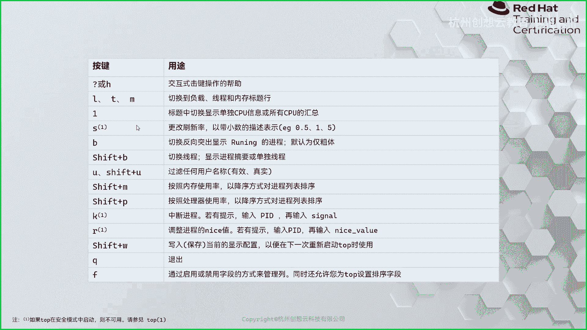
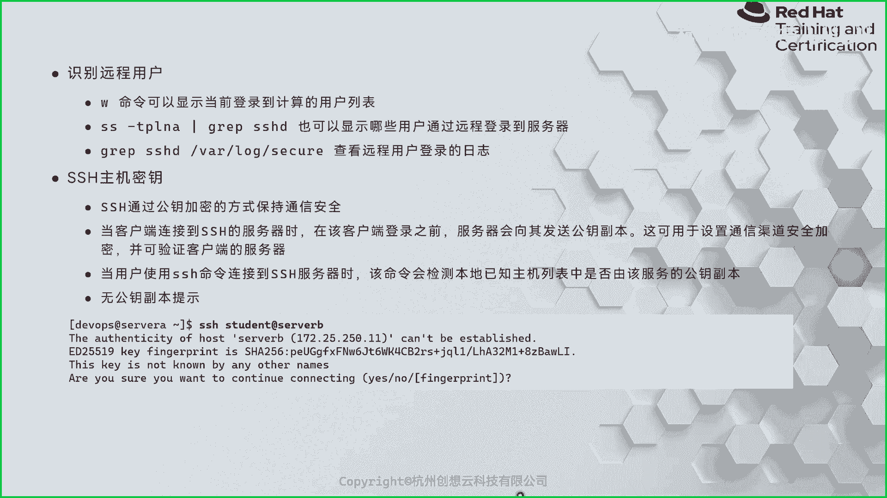

# 红帽认证系统管理员RHCE 9.0（2023年最新版）-4 - P1 - 杭州创想云教育 - BV1kX4y1n7fj

好咱们不等了啊，咱们开始上课啊，好呃咱们接着昨天不，sorry啊，这个今天上午的内容啊，最后一个知识点啊啊这章的最后一个知识点，ok啊，那么最后一个支点介绍的是所谓的默认权限啊。

默认权限什么是默认权限呢，就是说我们在使用用户的身份啊，在创建任何的文件或者目录的时候，我们并没有做任何的权限管理啊，那么这些被创建的文件和目录呢，它就拥有了一个初始权限啊。

那么这个过程呢就用到了默认的文件权限，这样一个概念啊，一个概念ok嗯，那么你像我们啊在终端里面对吧，敲一个a命令啊，比如说make dir test对吧，我说有目录啊，那这个目录权限就出来了呀。

755对吧，755哎，我们并没有做任何的权限管理，那它却分配了权限啊，那这个过程呢就是被默认文件权限所支配的，那么这个默认文件权限如何去查看呢，啊那么查看的地方的话，我们可以对于当前用户而言。

那么我们可以使用这个命令叫u mask命令啊，来查看，那么使用you must meeting，打印出来的这个权限值呢是四位啊，那么有特殊权限位还有什么呀，普通权限v啊，但是对于我们的u max值而言。

那么我们一般来说，不会去考虑前面的特殊权限位啊，只会考虑后三位啊，那么它这个值的话呢是啊反的嘛，you mask是反的，所以说呢我们在算的时候呢，要拿着最高的值去减这个数值。

ok那么我们在拿的时候就777-022，得出一个755，哎那么七五呢正是我们目录的权限啊，因为目录的话那比文件多一个x嘛对啊，所以说呢我们再减去111就得到了64啊，找乐子，所以说对于我们当前用户而言。

那么如果我去创建一个文件的话，那么这个文件比如说123这个文件，那么它的权限就是644啊，644好好，那么反过来，那如果我现在呢啊切换到哪里呢，我切换成root身份，我切换成root身份。

那么我通过u max的值呢来看一下，哎发现我的职能也是0222022，那么我们拿着信息啊，是0002277-022，得出结果呢还是755，也是755啊，那么我们来试一下啊，midr test，对吧。

755，ok是这样的啊，那么这个you must值，我们用you must的命令来获取的当前用户的啊，那么这个这个值在默认情况下它是从哪里呃，读取到的呢，其实我们姓当中呢分了一个嗯有很多的文件啊。

有个文件啊，那么我们可以去看一下啊，呃那么这个值的话呢，一般都是在etc的profile或者是etc啊，by 10 r c当中去定义的啊，那么我们来看一下全局的a t c下面的啊profile，ok。

那么在这里呢我搜一个关键词叫u m a s t，u mask啊，u m a s t u mask，哎发现没有是吧，没有的话，那么我们去找谁呢，我们去找bh r c，再搜一个u mask来这里面就拿到了。

那么这里来看一下啊，那么默认情况下呢，那么我们可以通过啊这里面的代码段啊，来设定我们的u max的值啊，you must sk值，那么这里告诉我们他有个判断语句啊，那么虽然我们还没有学习视角脚本。

但是我可以给大家翻译一下啊，那么如果啊来如果如果什么呢，如果判断啊判断我们用户的u i d是大于啊，是大于我们199的话，并且啊，我们用户的g d和用户的uid呢是相等的，按相等的，那么这个时候呢。

它会设置我们的u max值呢是002哎，反过来，如果我们的用我们的用户的uid，是小于等于199，那么它会给我们分配一个u max值，是02i022 ，ok你像我们刚才的这个这个dps呢。

也是00022呀，好像和他说的不太一样是吧，也有可能是被定义了嘛对吧，改过了，那么我们现在呢给他换成谁啊，普通用户selint来看看它的u must值多少，他这个max得值的话也是022啊。

我记得619里面是这个地方是有些啊，变动的啊，一些变动的，那我们去找一找吧，到底谁去给他改了啊，那么这是个全局的，那么除此之外呢，那么我们来到home下的，或者直接来这里面也行啊，我们来到加目录里面啊。

那这里有一个文件是隐藏的啊，vm d2 bh r c，那这里面看看有没有啊，这里面有没有这里呢它也没有，但是还有一个这个目录啊，看看存在不存在是吧，dr by 12 c。d没有啊，没有没有的话呢。

我们还要找一个东西啊，因为我要去etc了，留住的身份去找profile。d里面，profile。d的话呢，因为这里的文件还是蛮多的，我去搜一下啊，搜一下grape下，you must也没有，也没有的话。

我们热情上，我上次我记得是哪个文件呀，他给我们，他给我们搞了个搞了一个，想一想，我们九上面，嗯我看过的房间是零吧，因为我们的训机里面可能会被改动过啊，所以说呢我用个防地震啊，来看一下是多少。

唉这个也是有也是什么呀，022啊，是变的权限，我们要找一找啊，这个上次讲的时候也遇到这个问题，后来是在哪个文件里面来着，我给他找到的酒里面还是稍微有点不一样的嗯。

mask etc下面的profile没有，奇怪了，看看这里面有没有说，啊这里面也没有说啊，奇怪了啊，因为我们现在的话，master只是按照他写的那个if语句来说，肯定是不对的哦，想起来了在这里想起来了。

在tc下面有个文件啊，我找找哦，在这里ok 9里面，九里面的话呢是在etc的login。dfs当中，他也做了个定义，它定义了个什么呢，他说默认情况下呢我们的u码四个值啊，会在登录的时候呢会进行设置对吧。

那登录的话呢，就是就意味着我们的用户会加载etc下面的by，10r c i e t c l的bh r c，然后呢去读取里面的u mark 4个值，但是呢我们这里呢，他又做了一个默认的一个定义啊。

他说我们的用户呢，022是我们所有用户的默认值啊，是默认值嗯，所以说，这个地方啊这个地方是受限制的，我以前七版本的时候是002，我记得对切的时候也是00202，它这个优先级会更高一点啊，会更高一点。

大家知道一下就好了啊，就是我们的九版本上面的话，用户无论是啊，一比199的u i d大还是小啊，那么它默认的u mask值都是022啊，零二啊，这个地方是要注意一下的啊，注意一下的啊。

you mask啊，那么在我们的real 9当中，有当中，那么默认的you must的值是多少呀，是022啊，那这个是在我们的etc上面的l log in，点d f s当中啊，定义的。

ok那么全局来定义我们的you must的值的话呢，是在a t c下的be上c啊，或者是在a t c下的profile啊，那如果你想自定义的话呢，我们建议是啊，我记得是在哪啊。

我如果我们是自定义要改我们的u mask值的话，那么我们需要去这个用户家目录里面，或者是去这个etc下的啊，by 10 r c里面去改啊，去改，那么用户的啊，用户的呢是在我们的家目录下面。

点bash r c就可以改啊，就可以改，我这里呢给大家演示一下，我们就拿谁呢，我们就拿这个我们我们这里的student的用户，我也理好了啊，sin用户的话呢，它的只是零二嘛呢，改成002好吧。

v m home下面的student。by sharc好，我们这里面加上一句话啊啊，you are mask等于一个0022002好，然后呢保存并退出好，我们这边登一下啊。

s h student at wastation啊，worth station，然后呢，you must走一波，有没有生效，不生效了，剩下之后呢我们再来创建一个目录啊，叫做new di，对哦。

sorry，是文件哈，声音调一下啊，make dr，那么按照这个的话呢，它的目录权应该是775775，看一下是不是775啊，谢谢我就起到一个这样的作用啊，那么你可以根据自己的需要来改呃。

虽然这个用的场景比较少，但是还是有的啊，那么有些企业会要求，用户默认的u max的值是多少，多少是有的啊，是有的，我们可以根据需需要，那要上对全局的去定义呢，那就去etc的带10c当中去写对吧。

你可以写个判断语句吗，当用户的ui d或者g i d什么时候，那么用户的这个他的u max值是多少多少对吧，如果少的话呢，你可以直接在用户家目录里面去生成，都是可以的啊，都是可以的啊。

那这个就是我们的you must的值啊，给它设置一个初始的权限，你看我这里啊，我的皮条洗了啊，还故意写了一下啊，ok那么你看我这个地方呢，就是你可以写个etc profile d里面放在这里了啊。

然后呢写一个local，you must sk本地的哎，写了一个写了一个，那这个值的话呢，就是说啊，当我们的用户的ui d是大于199，的时候呢，它的u master只会分配给007007。

你可以自己写啊，根据需要来写就可以了啊，这是you must值好呃，ok大家有没有问题，关于这个u mars的啊，有没有，没有的话扣个一啊，没有扣个一，好怎么没动静了，同志们在不在。

好那么给大家多长时间我看一下啊，给大家十分钟好吧，大家呢把教材翻到217页，217页，然后呢把这个时间敲一下十分钟啊，然后脚本的话呢是live start p r m4 杠review啊。

看看能不能敲出来啊，能不能敲出来四个四四个四啊啊十分钟啊，十分钟热身啊，想到下午犯困，哎，对，好咱们继续上课了啊，好咱们来看下一章啊，下一章第八章，第八章，ok都在的吧，都回来了没有，小伙伴们回来吧。

扣个一，啊嗯啊，第八章第八章讲的是监控和管理linux的进程啊，那么这张其实呃蛮重要的啊，蛮重要的啊，虽然考试不考察吧，但是还是蛮重要的啊，嗯那么希望大家能够明白这章的那个，那个相关的一个知识点啊。

ok啊那么这张啊我们来看一下都有什么内容啊，那么第一章的话呢，就是要求我们通过一些命令啊，来获取我们啊进程的状态信息对吧，第二部分的话呢是给我们介绍了如何呢啊，控制我们的一个作业啊，ok第三部分的话呢。

则是用来终止，或者控制我们这个linux当中的一些进程，最后一部分的话呢，则是来看一看，我们的这个关于负载平均值的一个概念啊，到底是怎么个说法啊，怎么个说法，ok好，那么首先呢我们来说一说什么是进程啊。

进程，那么进程的话呢简单来说啊，那么可以理解为是干嘛呀，将我们的计算机对吧，将什么呀，将我们存储在磁盘当中的一个应用程序，实例化的一个过程对吧，因为我们知道，那么默认情况下呢。

我们的应用程序呢是一个静态的哎，存放在我们的磁盘当中，这算盘当中，当我们需要运行它的时候，它就会被啊我们的这个kernel啊，用户发送一个指令啊，然后呢去把这个应用程序呢，从磁盘当中呢去读取啊。

加载到我们的内存当中啊，那当中，然后呢啊那么比如说我们的student，用户去执行的这个命令返航运行的一个程序，那么这个进程啊就会包含该用户的所有的信息，比如说它的权限呀，对吧啊，所有者呀。

所有组呀啊等等，那么有些应用程序的话呢是多线程的啊，那么它会啊，它会显示到非常多的这个进程啊状态，ok那么除此之外呢，还能看到一些进程的一个状态信息啊，它是在运行当中还是在休眠等等啊，还有环境变量啊。

啊调度的上下文啊，啊分配的资源呀等等啊，是说的蛮多啊，但是呢我们今天的课程里面的话呢，可能啊学习的命令啊，并不能够把进程里面的这些所有的属性啊，都能查出来啊，因为呃因为这种命令还是蛮多的啊。

还是蛮多的啊，呃你看我们你看我们这个前面咱们讲过对吧，讲过那个什么呀，比如说嗯有一个目录叫pro是吧，那pro里面全部都是我们已经运行当中的进程了，非常非常多非常非常多，那么这些目录的话呢。

就是这些数字的目录呢，就是我们的进程号哎，进程号我们找一个大一点的，比如说4190，哎这就是进程里面的所有的信息啊，我们可以l4 杠l看一下啊，你会发现这里面非常非常多啊，比如说架构的状态呀。

属性啊对吧，自动的组呀对吧，一个什么，还有主要看我们看看cpu的指令集啊，cpu集合嘛，还集合io的情况呀，受受限的映射啊，内存啊，挂载的信息啊等等，唉都是有的啊，都是有的呃。

比如说这个state我们来看一下，哎这就是哎哪个进程呢，是s h d进程啊，现在什么状态，sleeping状态啊，这些非常非常多的信息啊，那么我们来试一下啊，我们后面会学到一些命令啊。

比如说a x grap 4190，s90 是不是我们的s h d什么状态，你看一模一样啊，s啊s哈一模一样啊啊一模一样，那这些呢就是我们进行的各种各样的一个呃，原音那个什么呀，嗯元素吧啊元素啊。

好，那么我们的进程到底是怎么啊发起的，发起的呢对吧，因为我们的系统起来之后啊，起来之后，那么你在去启动新的进程的时候，那到底怎么起来的啊，嗯有个命令，我们可以先看一下一个叫p s t r e e啊。

p s t r e p s trap s的话呢，就是proceed snap shop啊，这个进行的一个快照啊，啊然后呢tree呢是数个意思对吧，那么这个命令就是获取当前执行的时候。

系统进程的数的一个状态，ok我们加上一个管道符吧。

看哎你看跟树一样对吧，分了非常多的分支啊。

那么最上面的这个呢就是总的进，它的进程号是一一的进程啊，叫system d c d好，然后呢给大家介绍两个函数啊，一个呢叫谁呢，叫做clone啊，克隆这个函数，那么坑这个函数呢。

那么你就按照他的字面意思就可以了啊，是干嘛的，是用来啊，这个系统调用的是创建一个新的紫禁城的啊，资金承担，那么它呢和谁呀，和这个folk呢差不多啊，那么fog是干嘛的呢。

folk呢使用也是创建一个紫禁城的，那紫禁城的，但是呢这个紫禁城是干嘛呀，它是一个哎，他是我们的一个呃调用进程的一个副本诶，副本ok那么啊那么这个呃那么这个副本啊副本，那么他的一些信息呢。

其实是和他是参考我们的这个什么呀复进程的，ok那么整体来说到底什么意思啊，我们来看一张图，我们看下面的这个深色的图啊啊那么，比如说我们打开了一个终端啊，那么我们的终端嗯是什么呀，是可能是金蛋。

金道姆汤米的，也可能是x shell，但是无论哪一种，那么跑的应用程序呢都是bash啊，都是bh shell，因为我们real 9里面用的是bshell，ok那么这时候呢假如说我在敲一个命令。

那超上一个命令，交一个命令之后的话呢，会发生什么事情呢，对吧，我们来看一下好吧，看一下我们来两个终端好吧，两个终端啊啊我就这里呢总的命名叫sleep，多少呢，2000吧，1000吧，600呢。

610分钟，两分钟，120秒吧，啊让它跑着，然后呢这边呢我走个p s t啊，然后去筛选下sleep，我们来看一下，你看到没有，我们的这个sleep的话，它的上一个进程的是bh。

哎就是说我们的这个shell是一个谁呀，sorry啊，我我这个设想的是一个bash，bash上面fork出来的一个sleep啊，一个sleep，那么这时候呢我们去p s aox去看一个东西啊，就看这个。

我们就看这个谁呢，hd grab下，因为这个时间很快的啊，我们的这个进程上面是student的，student的，然后来我们来看一个东西啊，但是我给大家解释一下啊，这个就是我们右边的这个bh啊。

shell那么是s状态，然后呢这个命令我们再搜一搜啊，搜s l e p120 秒，那么它是个加号，在前台正在运行啊，因为这个命令四六本身就是休眠意思，那这个s呢还是休眠。

但是我们的休眠的休眠就是运行嘛啊，你要你要分场景来理解啊，ok那么那么这个过程看完之后呢，我们大脑里了，现在暂时有个印象啊，然后我们再回过头看我们这张图，那么我们的这个第一个这个process呢。

我们就把它理解成谁，理解成我们的这个best是谁啊啊，然后呢我在这个bshell上面去走了一个命令，叫sleep 120秒啊，走了一个这样命令，那么走完之后呢，我们的附近程啊就会干嘛呀。

就会调用一个函数呢，叫fox函数啊，复合函数叫分支对吧，也就意味着在我当前的技能上面，再另起一个新的进程，哎新的进程，那么新的进程呢，它属于原来的这个进程的一个分支，所以说呢我们就把这个新的进程呢。

称之为是子进程，而原来的这个进程呢我们就称之为是负进程啊，称为负进程，当我们的新的进程出现之后啊，那么我们的复进程呢。

这时候他是做不了任何事情的，所以说呢我们这里呢，我们的这个复进程呢就进入到一个状态，叫做s状态，那么这个s状态的话呢，我们翻译过来叫什么sleep休眠状态。

唉所以说呢我们的这张图上面啊，那么看到的这个上面浅颜色的部分，就相当于是我们的bh已经进入到休眠状态了啊，为什么要休眠呢，因为他现在什么事情都干不了啊，他要等待紫禁城处理完任务之后才可以。

我的父进程才可以做其他事情，所以他要等啊，ok这是负进程，那么分开之后的紫禁城而言呢，那么分开之后，紫禁城它不是说凭空就出现了一个的啊，唉这个从零穿就有了，不是的。

那么我们的fog函数生成一个子进程之后，那么这个进程里面肯定要有什么，是不是要在内存里面申请一个地址空间，对不对，还要有一个什么呀，还要有一些其他的信息，那么这个时候呢它的地址空间呀等等各方面。

其实是还有一个函数呢叫lm复制啊，它其实是把负进程的地址空间呀，各方面复制出来一份哎，负进三分，就意味着这时候我们看到的这个紫禁城啊，如果是个房间的话，我们进去会发现，和负增程其实长得是一模一样的。

那是一模一样的，ok但是呢我们目的是跑一个新的应用程序，或者提供一个新的进程啊，哎这时候呢，我们的子进程又会触发一个另外一个函数呢，叫e s e c。

那么e s e c是干嘛的呢，我们卖一下e s e c这个函数，那我们再加一个三啊，因为它是个函数，我们需要掌握的是二啊，e s e c，那么e i c e c的话呢是一个函数，用来干嘛呀。

用来置换当前的进程里面的内容的啊，用一个新的进程来来来来镜像啊，一个一个镜像，一个进程的镜像啊。

拿过来，那么理解了的话呢，就是说我们的我们的紫禁城，这时候呢利用excel函数，将我们真正要运行的，那有个进程的相关属性信息，比如说内存的地址空间呀等等，全部干嘛呀。

拿过来加载到我们刚刚的这个紫禁城当中，那么这时候我们的紫禁城，才变成了真正的紫禁城啊，就是我们刚刚sleep的命令啊，这相当于sleep的命令在这里在执行的，当它执行完之后呢，干着干嘛呢。

这时候呢我们的紫禁城啊要要执行完了，要释放资源了啊，释放释放资源了，然后呢他就会发送一个exact的函数，一个信号啊，那么这个这个信号呢给谁呀，给我们的负进程，那么我们的复进程因为是休眠嘛对吧。

哎负进程休眠嘛，哎然后呢，这个这个呃我们的这个我们的这个附近程呢，是他就是其实在等待子进程的完成，所以它还有一个他也他虽然休眠的，但是它有一个进程状态叫wait等待，那要等待进程哎。

等待到紫禁城发送了一个exce信号，这时候呢干嘛呢，这时候我们的紫禁城i自定程呃，你发送的信号之后，我们复进行收到了呀，那么这时候呢我们的复进程，就说这个这个这个唤醒了，开始清理掉我们紫禁城的资源哎。

清理我们自定义的一些资源啊，ok那么这样的过程就结束了，这时候呢又回到了负电动状态啊，那么由此可以判断出来，当我们的子进程在执行的时候，负进程是不能做任何的事情的，哎不是个事任何事情的啊，ok还有呢。

就是说如果啊，如果我们的紫紫禁城在发送退出信号之后，我们的父进程啊，我们的父进程，然后呢干嘛呀，这个这个这个这个也也也收到信号啊，燃烧信号开始清理工作，然后呢，这时候呢。

反而我们的紫禁城并没有把这个资源呀，释放干净啊，释放干净，留了留了一部分进程还在性当中去运行，那这时候负增程呢已经发送完，清理资源的信号了对吧，那么他认为已经结束了呀，这时候呢我们的进程就游荡在性能中。

那么这种进程呢我们把它称为是zi啊，叫江停进程啊，这家庭进程，那么这个图呢，就给我们简单的描述了我们的进程，新的紫禁城从零到有，以及又回到零状态的一个过程啊，大家是否明白啊，如果明白的话呢，扣个一好吧。

明白扣个一啊，不明白扣个二，关掉好，大家啊，明白了，扣个一啊，不明白，扣个2k，唉什么个情况，我又没动静了嗯，那就签到一下吧。

好诶，五个人在线啊，咱们的有人可能在忙啊，然后咱们上课有问题啊，然后一定要及时的回答好吧，嗯然后呢这个图的话呢，就是我们一个进程的更加详细的一个状态图啊，更加详细的一个状态图啊，好那么我们来看一下啊。

来看一下，那么刚刚的那个图是比较简单的啊，这个是更细了一点啊，你看我们从从那个新的，我们有个for函数对吧，然后呢在复进程上面啊，负进程上面那么分支了一个新的函数，那么新的函数呢这个sorry啊。

新的这个这个进程啊，新的进程，那么生成之后呢，它会通过调度把调度，然后进入到某些状态啊，如果我们的cpu资源正好是非常充分的，那么就会开始进入到运行状态啊，准备运行。

然后呢我们的cpu呢因为是做任务的嘛对吧，做任务的，那么这时候呢该轮到他了，那么我们的进程就会开始进入到运行状态啊，就内核态的一个应用状态，然后呢这个通过系统调用，然后呢我们用户变成一个用户哎。

用户态的一个运行状态，那么这时候我们用户就能看到诶，这个程序呢才跑起来了对吧，那跑起之后呢，那么i发挥，那么当我们这个这个这个状态呢，就会再通过return告诉给我们的科闹啊，然后呢运行啊，当然了。

某些原因我们也可以把它重新调度回啊，这个带运行状态对吧啊，或者发送一些指令呢啊，使我们的进程进入到停止啊或休眠状态啊，都是可以的啊，都是可以的啊，那么正常情况下呢，我们的进程结束之后呢，会退出啊。

退出最终变为x状态，那如果没有退出的不健康，那么就会陷入zb啊，江停状态，ok这是这个啊，这个好呃，那么我们要想去查看我们的进程状态的话呢，那么我们要首先要识别我们进行的一个状态，信息啊，信息怎么看呢。

这里呢给大家做一个小灶啊，那么我们很多命令啊，都有介绍技能状态的信息啊，我们可以通过这个命令来看啊，man p s啊，mp 4，那么在这里面我们搜一个关键词叫做code。

哎，有一个进程的一个状态啊，我们来给大家解释解释一下，这个关键词什么意思。

好，第八章，啊，走下来啊好那么介绍一下，那么d状态呢是什么呀，是不可中断的休眠状态啊，不可中断休眠状态，那么一般来说是io，那么这里的i o呢就指的有两种i o啊，啊两种i o它不是因为指数了i o吗。

那么这个i o指的是哪个i o呢，有这种词派o，啊有smil，还有网络io往往有，所以这个地方，那么我们要分情况，比如说磁spl s8 l的话呢，如果我们看到这个进程状态呢是d的状态啊，d状态。

那么就说明我们的这个进程啊，正在将一些关键的数据写入到磁盘当中啊，如果我们给他终止掉了对吧，那么就会导致数据丢失对吧，网络l呢也是类似的啊，比如说我们正在传输一个关键的数据啊，那么你给他终止掉了对吧。

数据也会丢失啊，也会丢失，ok第二种状态呢是我们这个real 9里面啊，新增加的一个进程状态不对，应该是八里面增加的啊，i呢是idol啊，就闲置空闲的kernel的一个什么呀，线程啊，它的一个状态。

ok那么大写字母r呢则代表的是啊，我们的进程呢处于啊准备运行，或者是已经在运行当中的一个状态信息，大s的话呢是可中断的，休眠状态，一般呢都是负进程在等待某一个事件的完成啊，哎是可以终止掉的。

但是你要知道的延续性就是一旦他终止了，那么它的紫禁城呢也就结束了啊，就结束了，那么你要看一看紫禁城是否是山把它终止掉，是否是有害的，对吧啊，有害的啊，这个地方也要注意嗯，然后t的状态呢是我们管理员啊。

一般来说人为的发送的停止的信号啊，中信号，ok小姐t的话呢也是新增加的一个状态啊，代表的是我们啊使用是吧，第八个对吧，就是调试器啊，然后呢做跟踪的时候的一个状态，比如说我们在linux上编程对吧啊。

然后呢我用调试器呢去调啊调试，那么这个进程的状态呢就是小气的状态啊，这个是课呢五的时候里面增加了一个呃，w呢是咱们就不用管它了，老的东西了啊，给忽略掉嗯，然后df的x呢是我们的进程时代的状态对吧。

死亡状态啊，死亡状态ok那么should never been seen对吧，我们从未见到他，那么这个进程呢也是正常的对吧，那么当我们的进程彻底的结束之后，那么它就是带的状态，因为已经dead了。

它已经结束了，所以我们看不到它的进程啊，看不懂的进程，带字母z呢是江停状态啊，一般来说呢就是哎附近城对吧，没有正确的把它终止掉导致的，所以z呢是我们要关心的啊，关心的好，那么除此之外。

它还有一些其他一些子子状态啊，那么这个死状态呢就比较难记了，因为它的语法结构呢，走的是bsd里面的这种格式啊，如果我们在上面的这些进程的状态的后面啊，跟上有小写的啊，或者或者这个这个其他状态。

比如说小于号，就代表当前的这个进程，是一个高优先级的进程啊，如果是n呢，就是低优先级的进程，什么是高优先级啊，就是说在同一个时间单位之内啊，它可以使用更多的cpu资源啊，然后呢定限期的话呢。

就是使用的资源比较少啊，比较少啊，啊大l代表的是我们内心当中锁定的页啊，锁定的页，因为在我们的计算机当中，内存里面的最小单位就是页，一个页一页呢是4k24 k啊，小s的话呢代表是绘画领导者。

一般指的是比较重要的副进程啊，负进程嗯l啊小l的话呢是我们多线程进程，多线程进程，因为它使用了clone three的这个这个函数啊，因此会多一个l的状态好l的状态哎，加号的话。

那说明我们的进程呢正在前台运行啊，嵌在一起，ok你看我们啊，我们前面啊，你看这个对吧，加点加号对吧，还有这个加号对吧，哎这个加号呢是因为我们是在这里啊，gram的时候出现的。

而这里呢有个加号呢是因为什么呀，我们sally sleep的时候执行的都是在前排的，我们都能看得到，哎所以说呢是这样子的啊，是这样的，那么你像你像这个这个这个进程是吧，哎大s休眠，小s绘画领导者啊。

都是能够看到的，都是有看到的，o好这是进程的一个状态信息啊，状态信息，那么我们我们在查看进入状态的时候呢，我们一般来说会有两个命令，一个是top，一个是p s命令，那top的话呢是一个动态的啊。

top命令是一个动态的，那我们后面再细讲这个top啊，那么它也是有这个一个一个开一个大s啊。

大s的这一块啊，我把它截个图啊，那么大s里面的这个地方啊，就是我们进程的一个状态信息啊。

这是top里面的，那如果呢我们用的是这个命令叫什么呢，叫做p s命令啊，p s命令，比如说我加个杠e f啊，刚e f也好，杠ax也好，那么也是有进入状态的，因为太多了，同样我再走个别的命令。

加上一个li啊。

截个图哎，那么ps命令里面的话呢带有state的关键词的。

是我们的进程的一个状态信息啊，这个是上面的这个图是谁呀，是我们的top命令啊，下面的这个呢是我们的ps杠ax 0，能看到的信息啊，ok那就是我们的状态啊，状态希望大家能够读明白啊，一定要读明白好。

那么我们这里呢来给大家介绍一下ps，p s的话呢，我们可以通过man命令啊去查看，你会发现它非常的强大啊，啊，它可以报告我们当前进程的一个状态，信息的一个拍照，ok那么具体怎么个报告法。

完全取决于我们用什么样的选项，那么它的选项呢有三种语法都是支持的，unix风格，bsd风格和兼优的风格都是支持的，就意味着两个大师，一个大师或者没有大师，他都有啊啊，并且不能组合呢，代表含义是不一样的。

你比如说他举个例子，p s杠1p s e f p s杠一大f什么，这些都是用来干嘛呀，列出来我们性当中每一个进程的啊。

然后呢这个是我们新b s b风格，来查看我们所有进程的啊，还有打印我们进程数啊，p s杠，比如这个命令对吧，p s杠1j h j的话，后台的一个后台的啊，我们做一个，那还进行数就出来了。

你看他们之间的一个关系啊，然后呢下面呢这个也是啊，我们来看一下啊，啊啊，这个的话呢，是把这个结构呢也给我们打印出来了啊，结构也打印出来了，技能书啊，然后还可以干嘛呢，还可以查看现成的信息对吧。

杠1l f a x m4 ，或者说来获得我们这个进程的安全信息对吧，哎这些命令啊每个指定进用户的进程对吧，或者说具体用户定义的进程，那像这种啊什么pad是什么意思，什么td什么意思等等。

这些都是在下面的啊，都是在下面的，你看a什么意思对吧，然后呢，我们的进程的一个列表当中的一些关键词，那都是有的啊，都是有的，你看非常非常多啊，非常非常多，所以这个命令的话呢，我们是给大家简单介绍一下啊。

具体我们要用什么功能，需要我们自己去深入的去挖掘啊，去挖掘啊，这部分状态看代码功能非常非常强大啊，这就像一个瑞士军刀一样啊，还是旗舰版的瑞士军刀为所欲为，可以ok我们常见的命令呢，比如说就刚才举的例子。

p s杠p s u s，那么打印出来的是我们linux当中，所有用户的所有的进程啊，所有终端所有用户的所有进程，我们来less一下看一看啊，那这里面有什么呀，用户对吧，用户的进啊，进程啊。

这个进程的id嘛对吧，还有进程消耗的cpu的百分比啊，消耗的内存的数量啊，然后啊申请的地址空间啊，运行的时候申请的地址空间啊，运行的当中实际消耗的内存空间啊，终端啊，进程的状态啊，什么时候运行的。

因为我是我是这个前两天都开机了，没没关过机，所以它变成了啊这个月份对吧，和日期，如果当天的话呢，可能只看到几点几分啊，那么这个time的话呢代表的是我们的这个进程啊，实际消耗了多久啊，消耗自由。

因为这个时间因为怎么都是零啊，没有消耗时间吗，不是的啊，那么我们的cpu的时间最短的话，我们在优化的时候，是按照这个纳秒这个级别来去算的啊，就是秒的下一个单位是毫秒，毫秒，下面是微秒，微秒纳秒。

他们每个建制的是1000啊1000，那么我们用这些命令看到的这个时间呢，都是秒单位，所以说就就看不到那个单位了，其实很也有什么时间非常短，就忽略掉了啊，那么后面的这些呢，就是我们具体的进程或者命令了。

那如果是中国服的话，那在是内核里面的一些比较重要的线程啊，线程比如说比如说这里面有一个什么呀，常见的有这个watch dog，watch dog，watch dog，看到了。

watch dog a在这里啊，watch dog啊，watch dog翻译过来叫开门狗对吧，看门狗啊，看门狗的话呢非常重要的一个进程，他要啊定时的，并且是准时的，要给cpu来报告啊。

我们的一个状态信息啊，ok如果cpu没有收到这个信息的话，那就认为是那有问题啊，系统就会立马就报错了啊，课堂里面的看门狗啊，非常非常多哎非常非常多对吧啊，不同的与不同的命令可以显示不同的结果啊。

比如说我想看另外一种格式e f是吧，那就能看到另外一种风格的进程的一个状态啊，那这里的c啊，p y d你看又意思又又变了，看到没有啊，所以这里的每一列什么含义呢，我们都可以通过map s来获取啊。

来获取，这是p s命令啊，p s命令啊，这个呢大家呢可以去试一试下去啊。

试一试，ok好，关于这一小节啊，大家有没有疑问的地方，有没有，我们要认识ps里面输出的各个列代表的含义，以及各种各样的组合，还有就是知道我们的进程是怎么起来的，和进程的一个状态啊，如果没有问题。

扣个一啊，好那么有人回答了啊，我就继续了继续了，既然大家不愿意多说话啊，那么我这边只要看到有一位小伙伴说没问题，我就过了啊，我就认为大家每个人都明白了，都懂了啊，所以后面我遇到问题的话。

大家就必须回答上来，好接着我们来看第二节，第二节第二节的话呢是叫什么呢，介绍了我们如何去控制，我们进程的一个作业对吧，木制和金融作业，比如说我们如何实现一个在一个学校当中，去运行多个命令对吧，怎么实现。

因为我们前面讲过呀，那你附近程生成一个紫禁城之后，那么附近程就会进入到一个休眠状态嘛对吧，我们可以来验证一下对吧，我们就用谁呀，刚才能sleep好吧，来个十秒钟吧，按十秒钟啊，默认单位就是秒啊。

我就不加单位了，这时候呢我求命令ios跟l回车有没有执行呢，唉并没有，因为父进程刚才正在运行当中啊，它只有等到了四进程结束了，然后呢我们的不负进程又收到了我们新的命令，然后再去执行。

所以一个绘画的shell，默认一次只能执行一个任务啊，执行一个任务啊，然后呢我们的这个我们要想去实现这种，原来我想实现一个绘画当中去执行多任务，可不可以，当然是ok的啊，就是我们把它放在后台就行了。

比如说还有sleep，我先写个120，这次呢我加一个符号就是and符啊，数字键七上面的那个符号啊，回车，这时候呢，你会发现我们的进程就会进入到后台啊，然后呢，我们当前的绘画呢是有是可以继续工作的啊。

是工作的，那么这个后台的话呢我们可以通过jobs来查看啊，如果是就当前绘画的这个作业，那么我们就用job来查看，如果是另外一个用户对吧，另外一个用户比如说worth station啊，我换个身份。

那么可以通过p s j来查看啊，fi看不到呀，除气象权吧，啊看到了120秒好，120秒就能看到啊，通过jobs job或者是jobs或者psg，然后呢来打印放在后台的作业啊，放作业。

还有就是在命令的后面跟上一个and符啊，把这个指令呢放在了后台运行，然后呢还有一种方法呢，就是利用什么呢，利用管道符来做啊，管道符来做呃，比如说，cat ios吧，ios pro。

然后呢管道符排个序就排个序啊，然后呢再去干嘛要赖一下回车对吧，哎那我在同一时间我也执行了很多个命令，但是呢它其实还是先后顺序的，它只不过是一个管道，唉，我们把这些所有的命令放在一个管道当中了。

那一个管道当中啊，通过管道服务来实现，也是ok的啊，也是ok的啊，好这是给大家介绍的几个命令啊，记一下记一下，诶然后呢一个好一个shell的绘画，啊那么每次呢只能什么呀，执行一个作业。

那么如果呢我们要想去执行多个作业的话呢，如果啊实现多个作业，那么方法如下，第一啊，那么将作业，好将作业放在后台运行，那么方法如下，dollar符啊，command，后面跟上一个and啊，这种方法。

第二种啊，第二种呢就是什么呀，第二种方法呢就是说使用管道啊，利用管道哎，同样那么它的语法结构呢就是command一管道服，command，二管道符，command 3点点点啊，这样一个语法结构来实现好。

然后呢使用啊，使用jobs来查看当前绘画的后台作业，然后呢使用谁呀，ps j这个选项来查看系统所有的啊，所有的啊系统的或者是什么呀，或当前用户的啊，所有的后台作业，为什么我这里强调了系统或当前用户呢。

因为如果是普通用户的话对吧，那那看到的就是自己的，如果是超级用户root，那么就能看到系统当中所有用户的后台作业，那后来作业ok啊，那如果我们万一因为出于某些原因对吧，我我把那个作业呢放在后台了啊。

那么我如何去把它调回到前台呢，那么我们有个命令啊，叫做啊jobs之后啊，能看到后台作业的编号，那么这个编号是二呀，那我就把它恢复到前台，那么就是f g百分号减二，就能恢复到前台运行啊，恢复到前台运行。

那恢复到前台运行，ok那我们还有一种情况，比如说出于某些原因啊，这个命令执行了很久对吧，我想暂停一下，或者说我们这个误碰到了暂停按键对吧，我怎么给他恢复作业呢，是不是啊，我们这里以这个为例好了。

比如说我同样走这个sleep，这次来个200吧，唉我我一不小心碰到了ctrl键加z不暂停了，然后呢job能看到作业是暂停的，我想恢复在后台运行怎么办，bg百分号后面书上当前用户绘画的作业编号。

哎它就运行了，啊恢复后台的作业运行。

啊恢复回来做一些，ok好，这就是我们的控制作业，有没有问题，如果没有问题，扣个一啊，好啊继续啊继续，因为这些命令还是比较简单的，其实但是我们真正管理的时候，还是比较复杂的啊，还有些东西讲的越简单。

你实际用的时候反而越复杂啊，越复杂，这个地方要大家不要把这个进程管理，放的很轻松啊，很轻松，然后呢接着我们来说如何呢去终止我们的进程，或者或者是干嘛呀控制我们的进程的啊，ok那么我们用户的话呢。

可以给我们的进程呢发送一个信号啊，是来从而来控制我们进程的一个一个行为吧，啊你看这里面给我们列出了非常多的信号啊，信号，那这个地方的话呢我们可以干嘛呀，可以去卖一下啊。

因为因为我们在做进程的管理的时候呢，大部分用的命令就是q命令好，那么我们卖一下啊，m一下，那这里呢就能看到非常非常多的什么呀，内容了啊，哎那么它的语法基本上就是q跟上一个信号啊，然后呢再跟上什么呀。

进程或进程的名称，点下单这个名字的话，那要看具体的情况啊，一般来说我们用的都是进程啊，ok那么使用q杠l的话呢，跟上编号可以列出我们具体的进程的信息，好我们先用个小l吧，列出锁进程啊。

你看他也会告诉我们会在哪呀，在user include linux cd s h里面有介绍啊，有介绍啊，呃这种信号的话还是这种啊，这个这个懂c语言的啊，可以去研究研究好吧，我们就没有必要了。

那么来k杠l就能看到我们所有信号哎缩形了，那么数字的话呢是呃，linux系统给我们的这个信号呢做了个编号，这个编号不是通用的，相反右边的这个大写的sign up，这个这个三什么呀，s1 e1 g v啊。

这种带字母的是标准的信号啊，标准的信号是通用的啊，是通用的，ok，感兴趣的小伙伴可以线下的去去kernel的官网啊，然后呢去查看信号篇文文章啊，里面有介绍信号的一个内容啊，是有的啊，可以看一看研究研究。

那么我们这里的p p t啊，就把常见的这种信号呢给列出来了，123 90 58 20和呃19 20啊，信号一挂起啊，信号二中断相当于发送了ctrl键加c啊啊，信号九是最猛的啊，它会立即终止我们的进程。

但是注意啊，虽然说立即，但是呢我们系当中非常非常关键的进程，是不会被终止掉的，比如说我们的system d是受保护的啊，不会被干掉啊，然后呢15信号呢诶就是terminal对吧，中中中止信号啊。

那么这个信号的话是默认值，比如说我们正常的关机哎，就是信号15啊，信号15啊，那么会通知我们的进程要要释放资源对吧，如果资源没有，比如数据没有保留，还会提醒我们要保存数据啊，这种的。

信号18呢相当于恢复我们的进程作业，然后19是停止掉啊，然后二二十的话，那是相当于发生了ctrl z也是暂暂停啊，但是但是呢这个19的这个信号，是没有办法拦截的，说暂停就停了啊，而这个stop掉的话。

我们可以去处理啊，比如恢复啊，各方面啊，各方面ok这几个信号啊，这个信号，那么我们用的时候就q命令跟上信号就行了，再跟上我们的进程的i d啊，比如说我们再来一个啊啊，还有sleep吧。

因为sleep又简单又不费资源，来个1000秒，然后呢我们来看一看啊，p s aox去筛选一下sleep哎，筛选到了，那么在这个里面就有我们技能号，比这个量太多了，我们可以筛选一下p杠a ox。

那进程号和c o m m哎，那么去找谁啊，simple usc y m m o n，哦这个o必须要放在后面啊，axo a a a a a o，哎呀别着急，ao，啥情况不会下sleep哎。

我们就立马就能搜索到了，因为我们加了个o代表是只要进程和什么呀，和他的这个命令啊，所以说这样的话呢是414461，然后呢我们组合命令kill杠九，然后呢sleep啊，sorry啊，记账号呀，4461。

这时候呢我们右边看一下，你会发现被提示被干嘛了呀，被q的哎被干掉了啊，被干掉就这么来用啊，但是九是给大家举例的啊，是为了方便啊，大家可不要看到进程了，就不想用了，就就q杠九吧，我告诉你会出事的啊。

我们是为了举例啊，举例虚拟机里面你想怎么玩都行啊，生态里面可千万别这么干啊，有些人就是一个呃这个这个初生牛犊不怕虎啊，有些人诶这个地方我这个刚接触linux系统对吧，我我这个不不不怎么会用哎。

不怎么会用那个呃这个群里面问问大佬们吧，群里面一问这个有些人呢就会开开开玩笑是吧，q杠九吧，然后rm杠2f是不是，或者说自己网上百度1下，搜到一些解决方案，也不思考原因是不是一样的。

会不会产生一些负面作用，就负粘贴命令，就人家敢写，他就敢敲人家，人家群里面敢回答，他也敢敲，对不对，到时候出事了啊，都会出问题啊，出问题千万一定要三思而后行，所有命令都要考虑到执行之后的结果啊。

啊这是我们单个进程的啊，单个进程的注意了啊，单个进程的啊的管理，那么命令的就是kill啊，后面杠是什么信号啊信号，然后呢再跟上什么pad就可以了，那那那那如果这个这个这个什么呀，那我有多个进程的。

都属于是一个什么呀，都属于是一组怎么办，我们称为是技能组啊，怎么办，举个例子，比如说我这边跑一个服务吧，简单跑一个服务s h root，写一下sa啊，跑一个啊，装个软件包吧。

人家说的学习我们还没有讲到啊，我这里只是举个例子啊，然后嗯装一下htp d哎，装完之后呢，给它跑起来，好好这时候呢我们干嘛呀，我们p一下p s aox scrap http t哦。

你会发现有非常非常多的hd p进程是吧，乍一看的感觉名字又一样，是不是你会发现它们的进化基本上属于什么呀，是不是连贯性的啊，然后接着呢我们走个命令p s什么呀，有一个技能数有印象吗。

啊一个进行数哎就是这个对吧，我们给它拿出来看一看它们之间的关系吧，非常多非常多唉我们来看这里，正好是在最下方啊，你看这些这些进程的话呢，它都属于谁啊，说都属于是技能号是16200的附近程。

是不是都属于这个，而左边的第一列的话，数字一和二呢就是负负进程，也就是我们的，而这个一呢又是谁啊，一是我们的，跑哪儿去了，唉一在这里啊，一是我们的谁呀，seed d啊，setmd生成了谁呀。

1620016200呢，又创建了非常多的子分支，162831直到16286，是不是都有，那么这种进程的话呢，就是一个进程组，如果你用q命令的话呢，一个一个干掉，那不太现实对吧，不方便。

所以说呢这种情况下怎么办呢，我们就是用pq命令来管理啊，pq啊，然后信号比如说我还以我还是以九为例啊，同样为了效果啊，这个不要盲目用酒啊，然后呢后面跟上进程的名称，这时候我们再来看一下。

是不是没有没有h g b d了对吧，被我们干嘛呀，给他干掉了啊，然后呢我们看一看诶还有没有服务在跑啊，p s a u x，没有了吧，是不是端口，那有没有真听，r0 是不是也没有了，因为被我们干掉了。

唉干掉了啊，所以说我们在管理技能组的时候，那么命令的话呢是p kill，然后呢信号再跟上什么呀，你自己能组个名称啊，啊这是第二种延伸好，第三种啊，第三种啊，我还用su命令啊，sb写个20。

and来一个来一个来一个来一个好，我还用我用先用ps命令去看一看，我去搜sleep，而同样发现这里有非常非常多，长得一模一样的sleep，那这些sleep与sleep之间有什么关系呢。

我们用金融数方式来看一看，你会发现这些sleep之间都属于是bash的，而bash是我们的附近程啊，我为bash和sleep本身是没有没有没有，功能是不一样的对吧，不是同一个软件呀。

所以说这些sleep之间和bh只是父子关系，是不是，而sleep和sleep之间呢，是不是都是都是独立的个体对吧，那么像这种的话呢，进程啊都属于是同名的进程，那么我们要想管理的话呢，用的命令呢是q谁啊。

哦跟上对应的信号走上你的命令啊就干掉了，这是同名的进程啊，同名的进程，ok用的是ko 2杠的信号，在后面可以上我们的进程的名称啊，名称哎就可以了，好这三个命令大家能区分出来吗，如果觉得没有问题的话。

扣个一，啊如果觉得没有问题的话，那扣个一啊，嗯然后我们接着继续了啊，小伙伴们，呃我们来看这个其他一些命令啊，所以说我们还可以干嘛呢，我们还有其他命令，比如w命令，w的话呢。

可以帮助我们来查看系当中哪些用户登录了，感受一下啊，w啊w ok然后哎我们看到了，现在呢我们的sera上啊，有几个用户呀，有一个用户啊，有一个用户，其实这个用户的话呢，我们更更理解的话。

应该理解绘画更更严谨一点啊，然后呢用户叫root，在p t s0 上面什么时候登的呀，12：22对吧，然后那个那个那个闲置了一秒钟啊，然后呢g cpu和p cpu诶，这是什么意思对吧。

哎我们要去卖一下吧，卖一下w命令啊，去看一看，他说这个命令有什么登录名，终端名，远程的主机登录时间，闲置的cpu，g c p u p cpu等等，那我们来看看g cpu什么意思，看有没有介绍没有吧。

哎没有介绍没有的话，那像这种呢，我们去去卖谁啊，卖ps因为大部分状态呢cpu这个里面都是有的cpu，有没有没有没有的话，那怎么办，杠大k一下吧，g cpu是吧，模糊搜索一波，哎哎啊。

下面有介绍啊啊这个g cpu呢是所有的进程，然后呢附加附加到我们这个终端上面的时间啊，啊pcpu的pcpu p cpu啊，p cpu的话呢是当前进程的时间是吧，他就进了时间啊，ok这样就破案了。

是不是就破案了呃，红凯在群里面说下面两个有什么区别啊，同名的和金融组的，那就这么个区别啊，能看明白吗啊，如果看不明白，我带你举个例子，看这个能明白吗，看看字技能组合同名的进程，因为你pk的话呢。

关键是竞争组呀，所以你肯定跟的是竞争组的名称嘛，名字，还有什么其他的问题，好，啊然后，接着往后啊，我们还有一些其他命令啊，比如说p rap p呢就是进程graph的筛选，筛选进程的命令啊。

l的list杠u bob，那么就代表的是列出所有用户包裹的进程啊，这个我就不再试了啊，你想试的话呢也可以对吧，首先你要你要你要登一个用户是吧，比如说我们我们再登一个啊。

比如说这边啊s h student at谁啊，sa好吧，我们来这里面干了很多事情，比如说一我们这边筛选一下p rap杠，l杠u student，你看它有非常多的金堂啊。

这些金融都是和student用户有关系的，那就意味着你在使用这个命令的时候，那你也可以去筛选呀，是不是一模一样对吧，唉一模一样啊，一模一样，还有呢就是我们也可以去干掉，具体某个用户的进程。

因为用户的话呢所有进程都属于某个用户，他们有一样有有有这个依赖关系，所以呢我们用pq命令去去处理，但是呢后面还有个u哎，只要用户啊或者是具体某个终端哎都是可以的，这个大家下去之后可以自己试一试啊。

比如说把某个人踢下线是吧，都可以用这个命令啊，但是玩归玩啊，这个不要，除非这个用户或者终端上有些什么呀，这个这个这个不好的行为对吧，比如说这个用户我没见过，是不是啊，可能是黑客呀之类的，你可以这么干啊。

如果人家正在工作是吧，你要干掉了，小心拿着80米的砍刀让你跑两步，嗯然后呢我们来接着看第四集啊，第四节的话呢，介绍的是一个，如何去监控我们技能的一个活动啊，一个活动ok啊，那么我们监控技能的活动的话呢。

其实是干嘛的呀，其实主要目的呢就是看我们的比如说cpu的负载，内存的使用情况，对不对，哎那个和我们的硬件的资源做一个比较，然后看看是不是变高了还是变低了啊，主要是做这些事情啊，做这些事情。

那么我们一般来说来监控啊，进程的这个对系统的资源的使用情况的话呢，我们有个非常重要的一个参考值，叫做什么负载平均值啊，叫负载平均值，那么负载平均值的话呢，我们最简单的方法就是使用update命令啊。

sorry up啊，up time这个命令哎，那么就能看到，比如说我当前的系统啊，现在时间是12：33，已经运行了两天对吧，哎这个什么时候开的机呢，是19：58开的机哦，sorry，不对啊。

应该是2000 19个小时，58分钟了啊，ok然后两个用户啊在修当中，然后负载值0000000，因为因为我们在sol上没有跑任何东西嘛对吧，我们让他跑一点东西吧，跑一个md 5 sm校验校验谁呢。

校验dv下的no，这个设备是空的呀，他永远校验不出来，所以我一直去校验，它还出不来，台取校验就消耗资源比较多啊，好然后再来一次啊，然后一直叫验诶，密码就结束了，那就叫验谁呢，再来一个，zero呢。

唉这个让我一直在后台好吧，后台好，up time，哎我们的负载平均值是不是在变化了对吧，哎我们就要看这个值，那么问题来了呀，什么是负载平均值，啊什么是负载平均值，你像我们的这里的三个值。

分别代表了我们的计算机在最近什么呀，最近什么呀，一分钟一个情况，最近五分钟的一个情况，最近15分钟的一个情况，那这个负载平均值是高了好呢，还是低了好呢，是不是哎怎么在哪个区间是比较合理的呢，对不对。

那么负载平均值又代表什么含义呢，啊这需要我们都要掌握啊，那么对于负载平均值而言，指的是我们的系统在干嘛呀，在单位时间内，他统计了我们系统当中所有的在运行当中，和不可中断的这些进程的一个数的一个。

活跃度的一个平均值，ok那么大家应该听听过，我刚才解释之后，发现我并没有说cpu的事情，是不是啊，为什么呢，你虽然这些任务是有cpu来负责工作的，但是呢我并没有提到cpu，为什么呢。

因为这些进程在运营当中可能会导致我们，它会导致我们的四平均值发生一些变化，但它不一定是消耗cpu导致的，也有可能它是磁盘的，或者其他的io的设备导致的，因为我们的任务分为cpu密集型和io密集型的。

好运行的，你像我们在使用p s的时候，那么那些在r状态的进程或者说在那种什么呀，这个这个这个地状态的进程对吧，那么这些进程都会影响到我们的这些进程的，这个这个负载平均值的一个结果啊，结果。

所以说我们的进我们通过这个值啊来看来看，那么是上升的还是下降的，那么如果真的是高了高的高出一定范围了，那么就要去定位到底是cpu密集型的任务导致的，还是io密集型的任务导致的啊。

那么怎么去找这个区间值呢，首先我们的判断依据呢，还是虽然说刚才说和cpu并没有直接的关系，但是我们还要依赖于cpu，我们首先的话呢就是看看cpu的核心数是多少个。

那么我们可以使用这个名ios 4 cpu啊，然后再管道符，那么在这里呢有个cp 5 s啊，那么这里告诉我们的cpu是两个核心的，两个核心的话，那就意味着我们的负载平均值呢，它的理想值是2a 10。

二是最好的啊，是20最好的啊，就意味着我们的每个核心呢都是满负载的，也没有超出，也没有比他低，但是我们知道真正满负载肯定不行，是不是，一般来说我们可能到80%左右，就要就认为干嘛呀，就很忙了哎很忙了啊。

不会说100%的理想是100%吗，是不是ok诶，那么因此呢，我们这个只是要要根据cpu的核心数，来做判断的啊，并且呢在判断的时候呢还要这么看啊，还要这么看，就是说看这个趋势。

如果这个趋势你像我们打印出来的结果一样啊，左边的多，右边的少，就说明我们的计算机的负载正在有什么呀，有正正在呢资源越来越吃紧了，并且呢大于了二，说明我们的cpu已经忙不过来了啊，忙不过来了，哎。

相当于你看马上就三例啊，就说明我们有一个cpu，一个人干了两件事对吧啊，另外一个人呢就是一个人干了一个人的事，另外一个进程呢就是说哎一个人干了什么呀，哎两个人的活对吧，那再等一会可能就变成几个呀。

变成四了啊，就变成四了，就好像他这门工作呢本来是一个人对吧，完成好好的，但是呢这个诶你的领导又给你安排些活，这个活呢需要另外一个人来玩，但是呢没有这个没有这个人干嘛，全部让你一个人去完成了。

你完全超负载去运行了，ok i会跑一直跑一直跑一直跑啊，然后呢等等等有可能会超什么呀，两个不够一直跑一直跑啊，炒的跑的多了，你会发现你的cpu就扛不住了，所以我们这个值最好呢就是什么呀。

把它的值呢限制在二以下啊，二或二以下是最好的，哎不要超过二啊，不要超过2k，你超过二的话呢，哎都会出问题是吧，哎就会出问题啊，因为你的cp就忙不过来了嘛对吧，就就好像就算再让你上班，是不是啊。

唉上学上班你说怎么办，是不是，那你很累很累很累，是不是很累很累很累会出问题的啊，但是偶尔的短时间内对吧，你的这个值突然上升了，其实倒问题不大啊，超出的资源从哪里来啊，还是从cpu里面来呀对吧。

只是说你忙得更更忙了一点嘛，啊忙一点，本来你可以轻轻松松的把这个活给干完对吧，现在就会很累啊，把这东西干完，效率就下降降低了，你像我们的虚拟化里面的cpu资源，一般就百分之七八十左右就要要那个了啊。

嗯语音平台的话一般也是80%，70%左右就要做一个伸缩了，不可能说等到cpu达到90%多呀，100%才会在扩容之类的，不会的，就达到百分之七八十就已经不错了，因为真正的话中间消耗各方面对吧。

也是有资源的啊，资源的ok嗯然后你像我们这个的话就高了，高完之后怎么办呢，就要去找进程到底是哪个技能导致的，我们的资源多呀，最最简单的方法就是ps命令去看对吧，去看去找哪个资源多啊，看cpu诶。

我要按cpu排序对吧，那怎么排呢，呃cpu的排序是卖一下啊，找cpu啊，cpu cpu p cpu i p cpu，然后继续往下找，cp cpu一个排序啊，我们，排序，ps。

xo p i d c o m m n逗号com m逗号p cpu对吧，然后呢接着呢我们再去排个序啊，salt杠t第三列啊，杠n排哎，排出来之后呢，那么它就是按照右边的三列嘛，左边第一列，第二列，第三列。

那么发现我们有一个命令叫md 5 sum，它的cpu消耗了72。2%对吧，就三个嘛加起来都百分之多少了呀，100 140，那140 210是吧，哎210了，210了。

啊我们的这个cpu指的是逻辑的逻辑的核心数，但是你那这个还要看你的cpu是多核是是什么呀，是极限程的，你都要去看的啊，就要去看的好，那么我们的这个呢就是一个核心两个逻辑cpu的。

一个核的两个逻辑cpu的，ok大家去看，这是最简单最最笨的一种方法啊，但是真正的话呢我们有专门的命令去看啊，但是呢不属于我们的范畴啊，不属于我们的这个今天讲的这个范畴啊，唉比如说举个例子吧。

比如说我们会稍微扩展一点点啊，比如说我们有一个包啊，有一个软件包叫什么呢，叫做呃这个size sea啊，这里面就包含了非常非常的工具啊，非常非常多的工具，比如说我们去去监控一下mp state。

来监控cpu，监控哪些cpu呢，我不知道哪个cpu类啊，我所有cpu来监控几次呀，一共输出五组数据，啊五秒钟啊，在这五秒钟之内输出一组数据，我们来看一下，你会发现用户的cpu非常高呀，唉非常非常高啊。

非常非常高啊，你看一和二都被资源基本上都满了，那基本上都满了啊，123还有两个，稍等一下，一直持续的用户的，肯定是某个用户跑了某个命令导致cpu很忙，那说明这个cpu密集型的一个任务。

导致我们的负载平均值上升，好ctrl c一下啊，然后呢接着干嘛呢，我们去找一找啊，怎么找呢，去去监控我们的进程啊，杠u来同样来五次，每秒钟输出一次，用监控物组带着频率啊啊五秒钟啊，五秒钟好。

那么找到你呀，谁呀，md 5是不是也找到了啊，然后如果这个任务不关啊，不重要，那我们就q到2q2 杠九，我们的md 5 sam就得干掉了，哎就干掉了，那么我们呢我们的什么呀，那么我们的这个。

uptime就立马一会儿很快就会下降啊，很快就会下降，你看已经开始下降了，三五十五三十五啊，就已经在下降了，好像这样的啊，只是给大家呃出了个题外话，题外话，那么动态的监控的话呢。

我们可以使用top命令啊，透命令来监控啊，top来监控啊，嗯我们来看一下p p t啊。

top命令，ok然后这个在使用top的时候呢，有这些内容啊，123456是个双都有，我就不带记笔记了啊，ok那么第一行显示的是系统时间也运行时间啊，这一啊二呢是什么呢，当前性当中登录的用户。

第三呢就是我们的负载平均值啊，然后第四行呢是我们系当中所有的进啊，我们的任务的数量一定是你，比如我们的截图里面啊，一共是270个进程，有一个在运行，有270，一个在休眠，零个停止的，零个江停的。

然后呢这里的一个摆放到cpu啊，代表是我们所有的cpu的资源的一个使用情况啊，那么这里的最大值呢，肯定是你的cpu的数量的倍数，比如说我是两个核的，那么就是200%啊，200%啊，用户呢消耗多少。

系统消耗多少，优先级，消耗多少，闲置多少等待的资源啊，消耗多少，然后呢硬中断的，软中断的，还有被虚拟化软件偷走的资源啊，这第五行哎，第六行的话呢是我们的内存的一个使用情况啊，内存一共一共多少兆内存对吧。

一共剩余的多少内存没有用，已经用了多少啊，然后呢缓存或者缓存了多少，那这里提到了一个buffer，还有一个catch啊，那么buffer的意思呢指的是啊，我们的数据在写入到磁盘时候的缓冲的大小。

o长大墙啊，然后呢那么我们在内存当中有一块数据，然后呢把我们内存当中比较高效的速度呢，呃就是内存当中一些需要存放的数据，先放在我们的buffer当中，然后呢，buffer呢再把这个数据呢。

慢慢的写入到我们的磁盘当中这八分，而这个catch的话呢，是我们同样在内存当中的一部分空间，但这个空间呢是从内存，是我们从我们的磁盘里面读取到的，放在了catch当中。

然后呢后期呢再被我们的内存去加载啊，是catch啊，是catch ok啊，还有交换空间啊，物理内存和交换内存，它们中间的和我们称之为是虚拟内存大小啊，总和，啊然后下面的这线呢是我们进入状态啊。

这是这是什么呀，这是我们这个top命令的内容啊，大家一定要搞明白啊，搞明白好，嗯然后接着呢，你像我们要想提高计算机的性能啊，我们可以创建一个缓冲盘对吧，比如说不差钱可以用奥腾是吧啊。

八份和catch都放进去，放的比较大对吧，那你的加载数据，或者说后期写的时候就会飞的非常快对吧，因为我们有些服务嘛是吧，专门做内存的内存的缓存服务的，是不是啊，比如memory catch。

是不是就类似就是提供这种性能性能的啊，呃这个截图的话呢是另外一个包叫什么呢，叫做h top，htp的话呢，它来自于epl这个仓库啊，那么红帽的系统当中默认是没有的，那么你要想装的话。

需要去启用一配套仓库，一票仓库是由fdr来维护的，就意味着你要用的话呢，里面的软件用到的话呢，如果是如果如果你用的话呢，这个东西不是红毛，不会产生质保的啊，没有质保啊，但是如果是用的ctos呀。

或者其他的linux衍生版本的u盘图等等的话，你可以直接用用这个h top，这个包更加人性化一点啊，啊其他无所谓，其实top也好，h top也无非就是另外一个看起来更加人性化，但是结果呢都是一样的。

ok然后好最后一个问题啊，说那个swap是不是应该为零，表示内存充足，sp 0的话，那只能说明我们的数据，没有存放到我们的交换数据当中，没有介入使用，你不能说表示充足啊，因为什么呢。

因为我们有些调优的时候会改这个参数的，就内存达到百分之多少的时候，我们的交换内存才会介入，可以调整的，可不是说你是零了，最后充足了，我还可以干嘛呀，我还可以把swap这个值调到调到这个最低。

我的内存基本上消耗完的时候呢，我我的smile才会介入，当然了，我也可以调整的很小，我的内存刚刚用了一点点数据呢，就往swap里面去跑都是可以的，这跟空间满不满没关系，ok好，这小d这个这个明白没有啊。

我们可以调整到这个东西啊，好其他有什么问题没有，不是啊，不是的，不是没有开启交换空间啊，呃因为我们是可以更改交换内存的积极性的啊，积极性的，这个是我们在调优的时候会会做的一些事情。

比如说比如说我们如果服务器跑的是oracle数据库，对吧，那么我们就可以把swap的积极性呢，调得非常非常低，低到什么程度，低到甚至可以是可以可以就不参与，不参与使用是可以调整的。

我们这个交换空间是有的啊，还有没有其他问题，还有没有，如果没有的话，扣个一啊，啊在没有没有调度的情况下，可以这样说，还是不是很严谨啊，不是很严谨，因为这个东西性当中，默认是存在的一个东西的啊。

我们来看一下，呃csc tl杠a，我们去三去筛选一个值啊，scrape swiveness，马三立四，那么你看这里面就有个虚拟内存嘛，然后sy新和性30，那就意味着当我们的物理内存啊。

物理内存我称为简称为p memory吧，当我们的物理内存，达到消耗了70%的时候，那么我们的swap内存啊，swap空间呢就会开始进入什么介入使用，这是默认的啊，就是默认的，ok这下一个值啊，下一个值。

值这个值我们是可以调整的，啊默认是70%才会介入啊，并且条件是我们的内存当中的数据对吧，这个可能可能是可用户啊，我们这个打完之后，他会把那些不不经常活动的数据呢，就开始往这个swap当中去放了啊，放了。

还有没有问题，还有没有问题，如果没有的话，扣个一啊，如果没有的话，我这边就给大家说下一个知识点了，看，好啊，那么我们p站的这个图呢，就是我们的top命令的一些快捷键啊，快捷键，那么下去之后呢。

好好看一看啊，我们就不再演示了，那不是自己可以可以敲一敲。

然后把它粘贴到我们的笔记当中啊，这是top的一个快捷键啊，好快捷键啊，可以试一试啊，试一试啊，然后呢我们休息个15分钟啊，15分钟，然后我们一会再讲第九第九章和第十章，第九章东西非常少啊。

那么我们一会儿休息一下的话，讲第十章啊，我们准备继续上课啊，那么ok那么我们接下来讲第九章，第九章，第九章是不是很重要啊，然后呃呃不是说不是很重要的，是这张诶知识点我们需要掌握。

然后呢这个内容没那么多啊，没那么多，好第五章，ok那么我们来看一下这章在讲什么知识啊，嗯第五章呢其实严格来说呢就两件事，那么认识一下什么是cd啊，然后呢去管理它就可以了。

ok那么咱们书上呢分成两个部分两部分，那么咱们也是要知道的，好知道的，ok呃那么首先我们来看第一部分，ok啊是这样的，所以说我们的系统啊，前面咱们讲不是讲了进程嘛对吧，那么进程应该也都知道了。

那么我们的启动器在启动的时候呢，会有一个进程唯一的啊一个进程，然后呢其他的对吧，进程再一次呢这个生成啊，生成什么一一周有二是吧啊，34567891 1000多，1万多的这种啊，ok那么那么简单来说呢。

就是说我们的系统啊，开机之后啊，那么我们的系统会找到我们的根据bios的设置，找到我们的引导设备，那么根据引导，然后去读取引导设备里的bootleader啊，然后呢在bot leader当中呢。

里面定义了我们的系统啊，是它的内核在哪里啊，他的这个一个初始化的镜像在哪里对吧，然后呢他就去读到之后，就把这个内核呀，还有这个镜像啊什么的，给它加载到内存当中啊，然后呢。

这时候呢我们就有一个哎会起到一个进程啊，就是进入一的一个进程就起来了，那么这个进程呢就是初始化进程，那么简称叫in it啊，in it，ok那么这个init的话呢起来之后呢。

我们的系统又经过一些复杂的一个过程啊，那么他会给他转交到我们真正的系统的，第一个进程，那么也是音译，但是呢从real 7开始，那么这个音译呢我们就不叫音译了，而叫谁呀，叫c d唉，叫cd ok啊。

然后呢这个我们的这个触发进程呢，就以手提升的方式来存在，ok那么我们是可以看到的啊，那么比如说我们当前这个系统上面，我们组个meeting，citimcity of status啊。

systemd system d啊，非常非常多啊，我们只带一个d来看一下有没有没有是吧，接着加一个单词啊，这里面有谁呢，找一个啊，找一个，诶这个量还比较大，我们这个进程吧，唉有一个有一个进程叫cmd。

哎他的技能的话就是一啊，有一个这样的一个进程就起来了啊，就起来了，然后呢这个开起来之后呢，我们其他的精灵就跟着起来了啊，跟着起来了，然后各种各样的服务啊，呃为了让大家更容易理解我们这个发展史啊。

我呢把ppt呢做一些扩展，那么了解一下就可以了，ok那么这些原始的音译的系统呢，就是在reo 5上面啊，我们我们不用再往前翻了，再往前翻是太古老了啊，因为我也好，四也好，还是以前的三二版本啊。

再往以前的啊，real linu啊，红帽的linux对吧，现在是红帽前版的x吗，以前的说是real linux啊，呃就red hat linuk，额，那么都是用的是这种啊。

叫six five in it，ok这个v的话，ok你可以读v吧，你可以读five是吧，这个都行啊，啊堵v吧，cv in it好吧，ok那么这种风格呢，最早期的因为因为我们的unix。

它的思想是借鉴了unix嘛对吧，unix那么unix变成了linux啊，linux linux呢，然后后面才带着我们的linux，他们之间都是有借鉴的啊，借鉴的，那么所以说呢在早期的时候呢。

我们的系统起来啊，它就保持这种unix的风格对吧，因为b s d就是unix的一个分支嘛，啊unix分支，ok诶一直在用啊，一直在用，那么那么这种这种方式呢在启动的时候呢，我们的csv啊。

in it呢会检查系统当中有个文件啊，叫etc i i t table这样的文件啊，就是初始化的一个表啊，在这个表当中有一个选项呢叫做init default，就初始化的默认值是解啊。

因为在很早很早以前呢，我们的系统在启动的时候呢，是有一个概念叫运行级别啊，叫run level啊，那么这个级别的话呢用用是这个啊，这是我这里面写了八个模式啊，但是我们一般都是用六种七种七种啊，零关机啊。

一呢是单用户模式，六呢是重启，五的话呢是退化界面模式，其他就就不用了，哎那么这里面要定义啊，一般来说呢这里的值是几呢，是三啊，三三的话那就是多用户模式，ok如果需要重置密码呀，或者说系统出问题了。

那么我们会把它改成一啊做一些管理啊，管理是最早期的时候啊，那么在在很早上以前，那么如果我们安装了一个服务的话呢，这个服务本身其实是一个脚本，它会放在了etc rc。d里面，然后呢再会创建一个软链接。

那么这个软链接就看管理员了，比如说管理员希望这个服务在运行级别五啊，启动的时候去起来这个符，那么它会成为一个软链接，来指向到r c5 点d里面，那就大概就这种比k01 k02 是吧。

代表了我们的服务的一个情顺序，每个服务呢基本上都是一个视角脚本啊，为什么呢，因为因为我们的link系统是遵循unix的风格嘛，那么就有一个这样的一个哲学，叫做一个服务只管理一件事情啊。

啊一个服呢就管理一个事情，所以说在很早很早以前，我们的命令e t c i t比d哎，进去可以做一些命令，比如说很早很早以前，我们要想让一个网络服务呢重新启动，那我们也可以这样写，大家也可以这样来写。

ok啊出init的啊，那么这时就是一个服务，那么这个脚本只负责他自己网络的事情，其他事情都不负责哎不负责，ok啊，这是早期的啊，那么这样一个变化，那么但是呢这种方法他有他有自己的缺点呀，什么缺点呢。

比如说比如说那么这个这个它的顺序啊，那么虽然我们可以通过编号的方式来定义，但是它的启动呢是走一个，相当于是一个串行的执行，就意味着只有k01 成功之后，才能取代k02 啊。

那么这样的话呢就会导致效率很低，并且呢并且呢还有个问题，就是说呃如果我们在性情之后，然后呢增加一些硬件啊，那么这个硬件的话呢，可能不会被我们的系统识别到，那么就需要我们重新启动系统才可以啊。

那就很痛苦了，是不是很痛苦了，ok那么怎么办呢，后来呢在大概是real 6的那个时代啊，那么u盘图的一个一个开发人员对吧，s啊这个scott是吧，然后呢。

就呃开在原有的旧址上开发了一个叫做upstart，那么upstart的话呢，它是一个事件驱动型的一个一个机制，就是说比如说我们我们插一个u盘之后对吧，我们的ud v就是我们设备环境工具。

就会得到内核通知，哎内核发现一个设备，然后呢ud v呢就会激活我们的设备，去查看啊，去查看，ok啊，那么所以说在real 6和real 6以前呀，我们如果安装了一个系统，然后想给它封装成一个训机的镜像。

我们就要去做很多的工作啊，就比如说这里的ud v，我们要把里面的规则要删掉，否则的话会出问题啊，会出问题，ok那么他经过这个改变之后呢，那么系统啊就是少部分的进程，少部分的服务呢是以并行的方式来启动的。

那么所有的情顺的速度就快了，并且呢因为事件驱动型的嘛对吧，所以说你你加硬件的时候呢，哎这个相关的服务呢会起来阴间拔出了，那么相关的服务呢也被停止的呀，然后呢相关的命令呢，这个命令呢。

我问我身边很多老的这个五linux的人啊，那么但这里面的命令其实还不很熟，因为虽然六里面是发生很大变化，但是在管理的时候呢，还是按照了五里面的这种方法去管理的，就是就是最最为传统的。

就是走这种方法去启动某个服务啊，或者是或者是借用于谁呀，或者借用于这个这个脚本叫services啊，后面加上network啊，reset哎这样去做啊，其实还是调用了谁啊，还是和这个是一模一样的。

没有本质上的区别啊，没有本质上的区别啊，这是呃早期的阶段的一个发生变化啊。

一个发生变化啊，然后呢那么再往后呢就到了什么时候呢，这个是个图啊，我们不用看了，再往后呢就是在real 7发布的时候，那么就抛弃掉了，那么这种传统的init啊，那么换了一个叫c tmd。

那么换成四项问题之后呢，就意味着我们系当中所有的守护进程啊，服务等等全部托管给我们的cmd来进行管理了，也就是一个一个工具来管理的所有，而以前呢是一个工具管理一个啊，所以在刚发生这种事情的时候呢。

很多比较传统的linux啊，这个爱好者呢还是比较反对这种方式的啊，但是对于我们而言嘛，发现使用std的确更好用了，哎更好用了，所以大家在用啊linux的时候，那六版本可以，ok sorry啊。

那么六版本的话呢可以作为一个分界线啊，就六六版本和六版本，以前用的是传统的方法去管理的，然后从七之后呢，我们用的是synb呀管理的，那不过在七版本的时候呢，你说我还想用传统方法去管理，可不可以。

唉当然也是可以的，支持部分的应用程序啊，这么搞啊，就是你装完之后呢，那么他的脚本呢放在了etc in it。d里面，是可以的，但是八之后呢就弱化了特别久，找不到了，8k的就找不到了啊，找不到了。

那你就只能通过step d的方式来实现啊，sp的方式来实现，ok管理起来更加的方便啊，那么它优化了我们所有的服务，比如说都只允许并行启动，按需所启动，还有就是一个依赖关系，其中还有一个优优秀的地方呢。

就是说它增加了一个概念叫控制组的概念啊，c group i see group啊，唉通过这个方式来来管理我们进程的资源，的一个使用和限制啊，你看容器的发展就离不开控制组的概念啊，就离不开这个东西啊。

你没有听说过在在real 6里面跑容器的吧，是不是都是在七版本和七版本以后才出现，呃那这个图的话呢是我们什么呀，是我们这个cd的这样一个一个一个，一个一个图表吧，它可以干很多事情，对于用户空间而言。

我们使用命令呢，就是system c t l命令来管理这些东西啊，将来大家学到一定程度了，还可以使用general ctrl，这个我们后面讲日志的时候会学到对吧，后面还有notify呀，分析呀。

cg l s cg top啊这些，那这些命令我们将来你像这个图里面啊，你像我们这个图里面的话，我们将来会学习到什么呀，这个图里面我会学习到这个命令啊，还有这个命令，还有这个命令啊，用户空间的啊。

唉会学习到这些啊，会学习到这些啊，其他的话呢我们在后面的内容当中呢，再给大家将来有机会了再来介绍啊，介绍我们一些高级的课程当中会用到啊，ok那么那么通过它呢可以管理什么呀，比如说我们的一些守护进程对吧。

比如日志的呀，这里的网络其实就有点冷了，这个图比较冷啊，现在应该叫什么呢，叫network major啊，不叫network d了啊，还有一些启的目标啊，目标就是相当于我们以前的那种。

relevel的概念啊，嗯启动的时候是多用户模式，还有什么模式啊，唉图形化界面模式什么的，o你像我们的word station在开机的时候呢，就是这个图形化模式。

我们sera servb呢就是多用户模式，还有一些其他的，比如说管理服务，还有你会发现这里的服务，我们放在一个框架当中，叫单元啊，变名词了叫单元，各种单元负责计划任务的是吧。

定时器单元负责挂载设备的mount单元对吧，哎这个负责打印机路径的pass单元等等，负责通信的socket单元是不是都有的啊，等等等等啊，如果对这块感兴趣的话呢，那么下面有两个网站。

大家可以去好好看一看啊，看一看呃，那么这个截图呢是给大家来验证啊，我们的音译的程序到底是哪一个啊，你看real 5对吧，我们使用state命令，那can proper唯一的excel哎，指向了音译，它。

那六呢也是只要init，但这个音是升级word in it up start，看到没，它是一个你可以认为是init的plus版本啊，本质上还是原来的就加一个加一些新的功能啊，啊从七开始我们去看的时候。

你会发现它指向的是c t m d啊，八的话呢是239啊，然后九的话我们来看一下九的版本。

我们九的版本看一下啊，啊s d g pro一下面的e s e c啊，sm d是吧，esc tmd，然后呢我们去看一下他的版本啊，然后呢杠杠vision，我们现在的版本是250，哈哈250啊。

然后哎反正他升级还是蛮快的啊，升级很快，你看他能做事情的都有啊，都有啊，版本一直在更新啊，我们是9。0九点，现在9。1已经发布了，那就肯定更更多啊，更多可能是260多是吧，不是250多都有可能啊。

啊这个了解一下就ok了啊，好那么接着正题。

那么对于我们这种啊cnm d的这种是吧，怎么去管理呢。

首先我们要换个概念，就是说我们以前呀管那些服务啊等等，我们都变名词了，叫单元啊，最常见的单元是服务单元，就后缀的是一点sis，那么除此之外，我们在学习过程当中，还有一种单元呢是负责通信的。

叫soy的单元，一定要写清楚，否则会出错的，默认的话呢你要是没有加后缀，那么就是服务单元啊，服务单元，你像我们今天是啊装的那个htb d服务，它就是一个服务单元c用这个命令啊。

有system c t l c t c t l对吧，c t l控制对控制setm的setd的工具，然后呢status状态状态谁的状态呢，h t t p d。s e r v s一啊，它是一个服务单元啊。

你看后缀啊。

服务单元ok你说我要不加后缀行不行，唉可以也是服务，默认的话呢就是服务啊，但是有些不是服务来控制的，而是由套接字来控制的，所以说一定要写清楚是top socket，而不是sources，你写反了。

那么这个服务是没有办法正常工作的啊，没有办法去正常工作的，啊啊你像我们三上面这个啊，那么我们如果命令忘记掉怎么用，那么大家可以通过这个指令叫system c t r杠t help。

来查看我们可以管理的单元啊，杠t类型吗，啊可以管理单元，以及我们可以使用cc t l list unity列出所有单元，哪些单元呢，刚刚pet等于sources啊，只列出啊服务的单元啊。

那么想查看状态的话呢，就是six city status，跟上你的管理单元的名称，点单元的类型啊，又比如说我们刚刚的这个h b d对吧。

你看我们的命令system city of seats h e b d对吧，相当于后面加了一个点sources啊，那么我们打开之后呢，一定要看得懂代表什么意思啊，ok比如说我们这个啊。

htvd sources是我们单元的名称啊，后面是他的描述信息是干嘛用的，loaded，如果呢load的状态是loaded的，那么就意味着这个相关的单元文件呀，已经被装载好了，是可以来管理使用的。

那么这是它的装软件包的时候分散的位置啊，这个位置这个文件我们将来会用会用来管理的，但是呢我们不会在这里去管理啊，会把它迁移到etc下面去管理，ok为了做迁移的啊，做迁移的，因为这个文件你改了没有意义的。

一旦软件包重新安装或者更新，就会被覆盖掉，然后呢再往后呢，这里呢有一个dc bd dc board的话呢，则代表什么意思呢，代表了这个，代表的是这个这个这个开机的时候，我们的这个服务是否是什么呀。

是否是这个根据，是否是这个根根据我们的系统启动而运行啊，后面的是一个厂商的一个预设，咱们没有禁止的，就是有些东西是吧，开机就有是吧，你预设的，然后active的话呢是我们这个状态。

那这个状态就非常丰富了，你比如说我们的这个的话就失败了嘛，因为我们前面用这个pq给他干掉了对吧，好，我现在给他起来啊，我们来看看怎么起来，啊c项目c p r da h b b d d sources。

然后呢我们再来看一下它的状态，i就变成active了啊，active那么这个active的话呢就是它的主状态了，一般这个状态就是两个，要么是active，要么是什么inactive啊。

然后后面的话呢是它的它的子状态啊，子状态啊，ok然后后面的是我们这个单元什么时候起来的，以及起来多久，你像这个状态的话呢，是非常考究的一个事情啊，我们来看一下啊，你比如说比如说我们这边提到了啊。

那么active的话有running状态是吧，已经在运行当中的，也推出了完成配置了，第三种呢叫waiting，等待好，那么我们这里的active的这三种状态，是否是都正常的，编号是123。

啊编号是123123是否都是正常的，如果呢你觉得他们其中某一个不正常，比如说一是不正常的，你就把这个一打在我们的聊天框里面，如果你觉得它都是正常的，那么请输一个零。

好吧，零食都是正常的啊，啊，大家在在我们的聊天框或者钉钉群里面，发个消息啊，看大家对这个东西感觉是什么样的理解法，啊第一个一啊，123，如果觉得都正常，那么输个零啊，编号123啊。

大家觉得哪一个是正常的啊，然后标上去，如果觉得都正常的，输一个零啊，好然后一个小班，两个小伙伴，还有没有其他人，对吧来个倒计时啊，ok其他的人呢总有个答案，啊还有十秒钟啊，没有回答问题的，抓紧时间。

好那么这三个状态都是正常的啊，都是正常的，为什么呢，因为年度活动状态啊都是正常的，正常的嗯，你像这种外形的话，那是活动的等待某一个事件，对某个事件，比如说收到在真题当中收到一个消息来活动了。

那么会触发这个起来啊，啊u i t的话呢，就说人家已经完成了某个配置，同样真听啊，真真听，然后想你的任务的啊，这种，ok嗯还有一些呢是static对吧，静态的，那么它会有被其他的单元会做关联啊。

也不用去管理，它会自动去连带连带，所以说一定要看清状态啊，然后呢再往下呢就是还有一些其他信息，比如说这里我们以这个为例啊，那么这里看到dos的话呢，就说明他的man手册哎，还有他的技能号状态对吧。

真听了八零端口哎，任务啊，任务的这个这个什么消耗的这个情况是吧，ok是限限制数量什么的，内存的情况，cpu消耗的情况，还有控制组的一个资源的情况等等，都有啊，都有啊，一定要能看明白的东西啊。

ok那么我们在使用当中的话呢。

我们的命令的话呢如下啊，那么命令cnm什么is active啊，看看他有没有在运行活动是吧啊，is a mod啊，这个服务有没有开机运行，允许开机运行啊，还有is failed对吧。

那么我们的服务有没有失败啊，然后哪些东西在失败是吧啊，这些命令啊命令细节的话呢，都可以去看这些帮手册以及我们的红包，rar 8里面有个setv的一个介绍啊，这个八里面的这个介绍非常详细的。

要比九的要介绍详细啊，可以去看一下啊，我的个人建议呢，就是说你花个半天的时间，把这个系统定的全部搞明白啊，半天时间够吗，注意了，这个东西很简单的，非常非常简单啊，一个人来说半个小时就差不多了啊。

就能搞明白啊，非常简单，让大家自己下去试一试啊，里面的文件也是语法呀什么的啊，自己搞一搞，那么要想去控制的话呢，我们的命令呢就是system c t l，后面跟着一个动词啊，跟着一个动词。

比如start启动啊，stop停止，那么后面呢这个name的话呢可以是一个，也可以是多个啊，比如说我seldom ctrl start a服务，b服务，c服务d服一些，可以啊，可以。

还有呢如果我们改完配置文件之后呢，就需要重新加载我们的配置文件，那么需要用restart命令啊，restart命令ok才能生效，但是呢一旦restart的话呢，我们的进程id呢就会发生变化。

可能有些不会受影响，那么你可以用reload reload，但是呢在新的系统上面啊，这种reload东西越来越少，你不确定的话，那就做一个这样的名叫reload or a resu啊。

就是让系统帮助你做决定，到底是它是支持reload还是支持restart啊，呃我不知道咱们当中有没有人用过老的系统啊，如果用到的话，你会发现这些命令和以前是不一样的。

有没有人咱们当中有没有人用过real 6啊，六real 6以前的有没有啊，有没有，看有没有这个老司机啊，或者说公司里面有那种老系统的，当时我那时候讲real 7啊，认证的时候呢。

还接触过rap 4的版本啊，哈四的版本啊，那时候还没有按ym命令啊，都是rpm命令去装包，ok，有没有没有人吗啊，好那么如果想查看依赖关系的话呢，某些单元的依赖关系啊。

可以使用cm c t l list啊，这个用的少啊，更多的是前面这些命令我们用的比较多啊，还有一个比较给力的东西啊，就是我们想屏蔽掉某些服务的话。

哎我们可以使用这个名叫c tom city l mask，后面巴拉巴拉巴拉啊，比如说我这个例子就是禁止我们的机子呀，发送control alt第一个键来重启，因为你你像这种组合键其实也是比较危险的呀。

比如说你你是一个windows的管理员，是不是啊，windows管理，windows管理我们在登录系统的时候，是不是要发送一个control delete才能登录，是不是，那你习惯了。

然后你你这个还要管理什么呀，linux服务器对啊，让你本地控制台搞一下啊，你进去先敲了一个controt delete，都完犊子了，服务器重启了，是不是又中断了，哎你可以给他屏蔽掉啊。

屏蔽掉啊就可以了啊，就可以了，ok嗯要想让我们的服务呢开运行走一个营业包，像我们的这个我们的这个上面啊，因为这个服务呢我们没有开机运行，我们可以给他给他引爆一下，来看看他是往去哪创建个软链接啊。

引爆hd，你看他就创了软链接，看到没有，这是user里面的默认的诶，创造一个软链接放在了这里啊，放在这里，那么我们这里是个多用户模式吗，对吧，盾护模式通话界面模式是依赖于盾护模式的啊。

虽然所以说呢他开机的时候呢，会启动这个服务啊，就这个服务嗯，咱们这个图的表，咱们这个p p t的话呢，上面还有一个表格，是给大家做一些做一些什么呀，命令啊，大家可以用用用它来搞一搞好吧，大家呢怎么玩呢。

给大家点时间好吧，我给大家时间，大家就可以在sl上用web服务来测试就可以了，那么web服务的命令呢，我给大家发到钉钉群里面啊，你在sl上走这个命令叫什么呀，叫做颠覆inside杠y httd啊。

装完之后呢就可以了，这些命令你都可以自己敲一敲试一试啊，悄悄试一试好吧，自己熟练熟练啊。

一定要掌握啊，一定要掌握，就c3 m c t l这块命令啊。

希望大家能够熟练的去使用啊，然后呃试完之后啊，你要是没有目的的话，那那那你也可以去干嘛呀，那你也可以去这个呃，按照书上100 220，285页的那个实验去敲也是可以的，书上的200 200几200。

200 200 200 285页啊，大家就按照285页的时间敲一敲吧，时间太紧张了，285页的实验啊，我给大家五分钟的时间啊，那这个脚本叫什么呀，285页啊。

这个lab脚本的话呢是在是在word上去执行的，那么叫做lab stars vs s杠，还有v review v i e w06 页面的话，大家别着急啊，我看错了啊啊页面的话是在，诶跑哪去了。

是在我们的教材的嗯，289页，这个实验我给大家五分钟的时间好吧，大家敲一下，那我们一会儿讲下部分内容啊，五分钟，因为这个时间非常非常小，敲完之后，群里面扣个一啊，一八，ok好，那么时间到了啊。

时间到了啊，咱们到今天为止啊，我们知识点呢就第一本书啊，我们学了一半了一半了，ok诶，两天半两天半，大家感觉怎么样，有没有什么问题，有没有，啊啊咱们这个第十章，大家前面的知识掌握的怎么样啊。

如果觉得可以的话，那我们继续讲第十章，如果觉得，说不出来那种感觉的话，那我们就开始练习了啊，啊这会儿大家感觉怎么样，前面的学习过程当中有没有什么问题，还行是吧嗯其他人呢。

其他人啊有没有什么前面有些地方不明白的，还是没有吸收好的，有没有，有的话赶紧说出来啊，因为已经有人说没问题啊，一分钟倒计时啊，我没人回答的话，我就继续了，哎因为咱们前面的一半嗯，目前还不是很难的啊。

还不很难的，我们基本上到到第几章呀，到第11章开始，这十张也还好啊，14章哎，第一本书怎么说呢，整体来说难度都不高啊，难度不高，稍微难一点的话，可能是用户的管理权限的管理，ok然后日志的管理啊。

啊咱们继续啊，收个尾啊，来讲第十章，第十章是什么呢，是介绍了我们如何去使用s h服务器啊，怎么去用，ok哎书上讲的也是比较简单的嗯，没有没有没有很多的配置让我们去介入啊。

不像以前七的时候讲某个服务的时候啊，巴拉巴拉讲了好多选项是吧，这个没有吧，基本上就是一两个选项就过了，那么这一章我们需要掌握的知识呢是什么呢，是ok掌握的是第一呢，就是如何通过s命令来登录到服务端。

ok那么这里乍一听啊，前面我们不是都啊登过了嘛对吧，怎么这里又讲了呢，那这里肯定讲一些不一样的地方是吧，ok那么其中重点的就是我们要学习掌握，如何利用密钥的身份验证来登录系统啊，这是非常重要的。

ok最后一部分的话呢是服务端的配置对吧，禁止root面部的一个认证啊，认证好，首先我们来介绍一下open s h，open s h的open表明了它是一个开源的软件啊，一般前面加了open啊。

free啊，这种的啊都是开源的啊，开源的，因为还有商用的s h啊，ok那么这open s就开源的，那么这里的s h呢，后面的这个s h指的是shell。

那么中间的这个s呢就是安全secret shell啊，那就是开源的secret shell，安全的shell啊，那么它是一个软件，那么支持s3 s协议，那s允许我们的客户端利用i sa协议啊。

然后呢和服务器之间建立一个什么呀，安全的绘画通道啊，那么他的绘画呢是加密的，所以可以可以什么呀，啊，这个尽可能的降低这个中间人的劫持这一块啊，窃取数据啊等等啊，现在基本上网络设备啊。

操作系统都是支持sc协议的，大家都支持的啊，那么我们要想登录的话呢，方法很简单啊，s h后面跟上远程主机就可以了啊，执行完任务之后呢，直接一个excel退出，那如果你你像我这种方法啊。

那么直接去远程连接，那么他就使用我们当前系统上面的当前用户啊，登录到远程用户啊，这种方法省事是省事，但是前提条件就是服务器上正好呢，有一个和你本地一样的用户，对不对啊，更多的时候呢，我们远程肯定是本地。

都是以mac或者windows为去读对吧，windows上面的用户，可能和你的服务器用户不是同一个呀，那你这样灯肯定是不太现实是吧，所以更多的话呢我们走的是第二种方案啊，直接s h后面跟上用户名啊。

然后艾特远程主机的名称，或者ip地址的方式来登录的啊，如果你只是建简单的在服务器上走一个命令，或一两个命令啊，那你可以直接在啊这个登录主机的后面呀，跟上一个命令。

让他把这个命令利用s h的隧道传输到服务端，执行之后呢，再退出啊，我们来感受一下，那么我们这里的感受的话呢，就要用sa到sb了，就不要用呃，就不要用word station到sa或sb了啊。

好那么s h s h到我们的server a啊，sorry好接着走一步啊，再再去对吧，然后呢我换了身份dv o b s at server b啊，server b好回车，哎。

这时候呢它会弹出来一个消息啊，我们说个yes啊，这个消息是什么内容呢，他说这个这个这个有server b来，梯子呢是不被信任的，然后给了我们一个公钥的，什么叫指纹信息啊，然后是用哈希256进行运算的啊。

问我们要不要把这个公钥拿过来用，我们一会再解释它的原理啊，我们肯定要同意了，这就跟你要用一个软件，要同意人家许可是一样的，你不同意就不要用嘛对吧，我们要用的啊，别然后输入啊这个密码，那就登不上来了。

对吧啊，用完了登出，ok，那么或者说呢，我直接在目标服务器上走一个命令，比如说走一个hostname验证密码对吧，写的是svd，哎sorb啊，只要放方式啊，当我们登录到这台机子之后。

而对于我们的sb而言啊，sb而言，那么就可以通过w命令来查看谁来登录了对吧，加上一个f对吧，就能看到是从哪登录的from对吧，from从哪里登录的，那突然有一天哎呦，怎么有个ip地址是国外的是吧。

那你肯定恭喜你了，中招了啊，或者说这个ip不属于你认识的ip，里面的某一个是吧，恭喜你中招了啊，那么我们登录之后呢，在我们的日志当中也是存在的呀对吧，我们组个命令叫grab s h d啊。

挖下的log i s secret，就能够获得我们客户端，连到我们当前服务器的时候啊，一些信息啊是能看得到的，这样可以提高我们的安全性，安全性好，再往后啊，那么刚才我们登录的时候呢。

看到了和p p t上一样的界面啊，问我们哎这个什么不会信任啊，怎么怎么怎么样的啊，为什么呢，为什么会这个样子呢，ok是这样的啊，就是说我们在刚才登录的时候呢，我们我们是不是做了一个密码的验证对吧。

你看我们在登的时候呢，在这里是输了个密码，所以呢这种认证啊我们称为是密码认证唉，密码认证也就意味着我们说完我们的，我们在尝试登录服务器的时候，服务器呢会给我们一个公钥唉公钥，然后呢我们接着呢就干嘛呀。

输入密码，输入密码之后呢，就会使用啊，之前我们接收到的这个公钥啊，进把这个密码呀进加密，然后呢传送给我们的服务端，我们的服务端收到我们的客户端的，加密的密码之后，那么对于服务端而言。

它有一套自己对应的什么呀，和这套这个公钥对应的私钥啊，然后呢使用对应的私钥进行解密，解密之后呢，再和它的去干嘛呀，去这个啊检索它的本地etc下的pass wd，看看有没有用户。

如果有再去找对应的etc shadow的密码进行解密，看是不是一致的，如果是一致，ok允许你登录对吧，这是本地的用户，当然了，你的服务器的这个用户也有可能是网络用户啊，我们用我们用本地用户来举例的。

因为咱们目前学习的知识呢就是本地用户啊，这样一个绘画过程就结束了啊，就要结束了，ok那么但是呢还有一种情况，还有一种情况什么情况呢，比如说我来到server b之后呢，我干一件事情啊。

etc下面的s s h里面，我暂时呢把这里的我创建一个目录，叫做叫做什么呀，ak吧，我暂时把刚才的那个e c d s a的，好e c d s e的所有文件呀，给它移动到bk里面。

然后呢我再重新启动一次我的s p d服务，那么我们在real上面呢，我们的s d服务呢会重新生成一个新的密钥，对如果是u盘图或者变的话呢，有可能是不会生成的，需要我们自己再去创建啊。

啊那么咱们real上面是自动生成的啊，生成之后呢，我们的客户端再去登一次试一试，red hat，诶，我我我我我我我我我这个备份备份了呀，m我看一下啊，我知道了，因为因为他这里面的公钥有很多嘛。

啊有很多说他用了别的公钥，我们在一以啊，原来没有移到的也移过去啊，e cd sa的也移进去看，我刚才不是移的，是一cd sc 255吗，哦哎呦我天sorry，我这地方移错了是吧。

哎我已经e c d sa了，我要移的是这个啊，1d25519 ，因为我们刚才客户端在登录的时候，那么这里告诉我们是d2519 ，要以他不是e cd sa啊，诶好我来到这个dk里面，把这个文件给他恢复啊。

好然后呢恢复之后呢，在move s s啊，host d啊，这样才对啊，好移过去了啊，然后呢再重新启动一下我们的s h d好，我们再来重新登一次啊，走起哎，这才正确，那么这时候我们在登的时候呢。

我们的客户端呀，客户端呀干嘛呀，哎这个去登的时候呢，服务端又给我们抛一个公钥过来了，公钥公钥过来了，那么抛开之后呢，我们的客户端一检查诶，我的本地呢之前存放了一份公钥呀。

在我的new house里面已经存放了不公钥，同样的叫做server b，但是怎么和公钥和你给我的公钥不一样呢，对不对，那么我们的客端呢，就认为你这时候的server b和我在no host里面写的。

那个server b不是同一台，那么我就认为你这个server b啊有可能是假的，伪装的，可能要干嘛呀，你可能要当着中年人来劫持我，哎我就自动就断开连接了，我不相信你是不相信你哎。

之后会出现一个这样的问问题啊，一个这样的问题，ok呃那么该怎么解决呢，解决方案有两个啊，最好的方案就是第一，先确定服务端的公钥，和我们现在介入的公钥是否是一致的，那么就看那个指纹信息呀对吧。

e c d s e e d25519 的对吧，比如说你你你在家里面要连对吧，然后你让你的同事帮你去验证一下对吧，那么来到sb去验证，怎么验证啊，ssh啊，这个这个k进，啊k进来杠去看一下命令忘了哟。

sorry，啊s h杠，啊k进，咱们能不能不要执行，ok这里面有个命令叫做什么来着，叫做叫做叫做，小f去哪了，数字妙键l我记得是按l指纹的哈希啊，刚e是哈希杠l i e的是哈希杠f呢是文件。

ok get s s h杠k进杠l杠e这个哈希是多少呀，是不是256256，然后杠f那么就是e c e c d谁呀，e c d s s h host e d2 啊，比pub看一下。

那么看一下我们的这个公钥是不是u w结尾，因为太长了，我记个关键词是不是u w，然后这边给的是不是有w是的吧，那么就说明这个sb给提供的功效是真的是假的，是真的吧，那么我那那那么这时候啊是真的。

我把这个记下来啊，大家记一下，这个就大家平常用用，到时候呢注意这个事情。

对吧，我这个之前存在过呀，存在过一个一份公钥。

然后呢，你现在呃这是出现了冲突，那么这时候怎么办啊，那这时候的话有这个这个这个这个截屏，加上一个代码块试一下，我们舒服一些哎舒服很多啊，说了很多，有什么什么歌什么歌，他这个笔记怎么每次空这么多。

好那么这是验证的方法，验证通过之后怎么办呢，那我就可以把这个原来的老的公钥给移掉了啊，因为这个就相当于我们手机上的通讯录，一样对吧，突然有一天你的朋友张三来打电话了是吧，哎呀手机号和你原来的不一样。

托特张三对吧，那你要小心点了是吧，可能是诈骗是吧，ok好那么那么我们我们来看一下，来看一下，那么1t1 c d s a的人，看这里面有两份工，要啊啊sorb的，你看这是原来老的，我们要移调啊，怎么移呢。

就是s s i h杠k进杠r是remove啊，大写的r一到server b的，如果你之前连的时候是server b。lab。一个3。com，那这主机名就lab server server b。

lab一个一个单位也come，归根结底你前面的这个地方主机名叫什么，就以什么好好走起，更新了之后，我们再来看一看这个文件是不是少了一行啊，对吧，这时候呢我们再去连啊，再去连的时候。

发现是不是和第一次是一样的了啊，允许要不要提出公要，我说yes啊，密码red hat哎，就就连接了啊，就连接了啊，ok那么为什么要这么干呢，为什么要这么做呢，是因为啊是因为这个。

你说那我把这个文件no host删掉可不可以，当然也是可以的，但是呢那个不生产量太多了嘛是吧，我们给大家介绍的这个是专门的命令啊，专门的命令，那么之所以我们先去验证再去移除，而不是直接移除再添加。

那么就是为了防止他们在绘画过程中干嘛呀，做一些手脚作，为什么手脚呢，中间人的劫持啊，就是啊你看正常的协商呢就是这样的啊，我们的客户端在连接服务端的时候对吧，客户端做一个初始化连接。

然后呢服务端呢会给我们发送一个公钥，这时候呢我们的客户端啊，会首先检查当前用户家目录里面的点，s里面的no host，看看里面有没有对应主机的公钥，如果有，下一步并且是一致的，下一步如果没有。

就会提醒我们是否要把服务端提供的公钥，放在我们的no house里面，ok假如说我们现在已经有了，那么我们就输入密码嘛，对不对，然后呢他就干嘛呀，哎然后呢协商啊。

就是那个呃哪个版本是把密码发送给服务器点。

建立连接是过程，那如果在这个绘画过程中。

假如说出现了一个这样的事情，因为我们是通过网络连接的对吧，我们并不知道对方的一个信息，假如说我们出现了一个这样的情况，假如说啊我们这边呢是客户端client，那么这边是服务端，好然后呢，我这边有一个。

有一个什么呀，我们就写一个bad啊，然后带的这个server吧，这个beat不是坏的啊，就这个坏指的是这个这个不是机子坏了，是这个性质是坏的啊，ok那么我们假如说呢是这样的，那么按正常逻辑呢。

假如说我们的这个这个服务器啊，干嘛呢呀，劫持了我们的路由，啊或者是劫持了其他的方式，比如污染了dns等等啊，反正反正你的流量现在呢没有办法去server了，而是被被做一些处理了。

那么你的流量正常来说是不是从这里，然后来到这里的，对不对，现在被干嘛了呀，被动手脚了，你以为是到了真正的服务，其实你的流量干嘛的呀，被转发到这里了，那么被转发到这里的时候呢。

那么因为已经被已经被欺骗了嘛对吧，那你连着说ip地址呀或者主地名啊什么的，你都感觉是没有问题的，但是呢你连的实际上是这台服务器对吧，你你那你这台服务器，你连的时候同样按照绘画呀，你的嗯。

那么我们的这个server端，是不是要给我们泡一个公要过来啊，对不对，抛有公要过来，有公钥，那么这个公钥，你以前你的本地存放的那个公钥是不是正版的，我们就把它理解为正版的，是不是哎是这里的公钥是一对儿。

是一样的，那么这时候你这个公钥和这个公钥是能匹配吗，不匹配了，不匹配的话呢，就会告警了，就会提示不允许连接，是不是，如果你没有验证你的公钥是不是真的是假的，对吧，那么就允许了，允许之后呢。

那么就意味着什么呀，就意味着你的客户端呀，会使用这个假的公钥基因和你的密码进行加密，然后发送给你的这个假的服务器，那么这个假的服务器收到之后呢，就会干嘛呀，利用他的私要啊，私钥干嘛呀，去解密啊。

被公钥加密的密码串，然后进行解密，解密之后呢，他就可以拿这个密码去干嘛呀，去登录你真正的服务器了啊，那就被劫持掉了，ok所以说密码认证是不安全的啊，是不安全的，ok啊，就是我们为什么要先去验证公钥。

再去移除的原因，而不是先移除去连接再去验证，ok这个地方明白的话，大家扣个一啊，这是密码认证，看密码验证明白吗，扣个一啊，群里面，ok好，所以说呢我们要干嘛呀，所以说我们为了保证安全呀。

我们是强烈建议呢使用迷药的方式来做认证，唉那么什么是密钥认证呢，我们先把这个图给擦掉，我来给大家解释一下密钥认证，它的原理是什么样子的啊，密钥的原理的话呢，是我们要事先先创建一个密钥对，ok注意啊。

我们已经我们我们需要啊事先去生成一个密钥，对这个密钥对在哪生成的不重要，ok你可以在windows上生成，也可以在linux服务向生成，也可以在另外一个linux客户端生成，都是可以的。

我们成了一个密钥对，啊key pair啊，我们生了一个密钥，对啊这个密钥对，ok那么正了这个妙对之后呢，这个妙堆里面有一个私钥，还有一个公钥呀，对不对，里面包含了一个私钥。

我们就称为是k一和公钥对应的pub 1，好吧，唉那么因为是一因为是这个他们直接非对称嘛，那么所以说这把钥匙只能解这把的锁，ok然后呢干嘛呢，我们啊客户端啊，客户端这里啊拿着一把钥匙，拿拿着一把钥匙。

这个钥匙是谁呢，是k一啊，然后呢，我得把这个公钥呀给它上传到服务器上面，上传到服务器上面，他用的是pop音啊，上的是pop 1，那么这时候呢我们开始走密钥认证了，不再走密码认证了。

那么他的绘画是怎么来走的呢，ok那么同样我们的客户端去连接服务端啊，去连接，那么在连接的时候呢，在连接的时候呢，那么他会做的初始化吗，那么因为不再走密码了，那么但是还需要用pob加密吧对吧。

没有密码怎么加密呢，我们这时候的话呢，这个这是个初始化啊，i n i t啊，初始化的绘画，那么这时候我们的公钥公钥会，我们的服务器呢会生成一段随机的字符串，我们就暂时称之为是字符串a吧。

字符串a那么哪个不字符串a呢，加密之后呢，给了谁啊，给给给返回，给了我们的客户端，那么扣端客户端知道，不知道服务端这个加密的东西是什么呀，他不知道呀，但是它可以干嘛呀，解密如果服务器是我连的那台服务器。

那么他用的加密的东西我就能解密，是不是这个道理，哎所以说呢他就干嘛去解密这个a啊，他用这个k去解密我们的a解密之后干嘛呀，他就把这个解密后的结果，发送给我们的服务端做验证，因为它只能解密。

他不知道这个字符串到底对不对，对不对，唉对不对啊，那如果他解密的对了，那就说明服务器的公钥是我原来一对的，那个公钥，对于服务器而言，他收到一个解密后的字符串之后呢，去验证是不是由原来生成的。

是就说明客户端是原来生成，喵对的，拿着私钥的那个客户端，他们两个之间就互信了，互信了唉互信了，这时候呢他们之间就干嘛了呀，就建立联系了，哎这个过程呢就是什么呀，公钥认证或者叫密钥认证。

相对来说有必要钱啊，他们两个之间对吧，这个绘画建议成功了啊，但是呢这个地方呢这个私钥就是关键的东西了，你一定要保护好你的私钥，你可以把私钥再加密，是不是也可以放在放在你的一个隐藏的地方啊。

一个隐藏的地方，这是公钥认证，同样这个公钥认证大家明白的话呢，大家扣个一一，这个绘画就比刚才的密码上要安全很多了，嗯这个好，接着我们继续了啊，嗯啊嗯啊，这个就是我们怎么去做的啊，那么第一件事情呢。

我们首先啊我们需要生成一个密钥队，那么我们是上的linux课，所以我们的密钥队呢就是在linux上面去生成的啊，那么我们有个专门的命令叫s kg，你可以走交互式啊，就就在你的终端上调一个命令s杠k进。

根据他的提示来就可以了，我给大家演示一下，啊s s i t杠推进啊，回车唉，他问我们要不要这个，它会默认生成一个2s一算法的密钥对，那么放在哪里呢，默认放在加目录的dei s s里面。

然后呢以id作为开头，下划线，后面以算法为结尾，这是个私钥啊，如果你不想换在这里或起个名字的话呢，后面就行路径和文件名，ok如果保持默认就回车啊，然后呢问你要不要给这个私钥再加密，那我加个密码。

这时候密钥对的就生成了唉就生成了o啊，当然了，你也可以用第三方的软件，比如说我们的这种我这个term对吧，也能啊，不是这个这个mobile sum啊对吧，还可以是吧，excel都有这样的一个工具啊。

可以生成啊，都可以的，你像windows啊，新版本的windows 10啊，11对吧，windows 10都有也有s命令是吧，也可以直接生成，都是可以的，你说我这个客户端有客户端不支持。

是不是我也没有装这些东西，我我我我我要用别的更方法，那怎么办，那你可以在服务器上生成对吧，然后再下载下来，唉都是可以的啊，都是可以的啊，ok啊，那么生成之后呢，我们就需要把这个公钥呀拷贝过去了啊。

拷贝方法呢我们也有专门的命令啊，也有专门的命令来拷贝啊，ok我们的推荐方法就是走这个命令，s s h杠copy i d杠i d s s下面的谁呀，好家目录下面的diy si里面的，为什么不能提able。

好家目录下的d o s s下面的i d向下，rsa。p u b啊啊然后呢给谁呢，dv o p s at server b好吧，回车啊，那么在考之前呢，先做个密码认证，唉就考过去了啊，考哪去了呢啊。

你看我们的指纹信息啊，是哈希256叫什么g2 f是不是，那么我们来到sb去看一看，因为我们在拷贝的时候呢，是给了dios这个用户，所以呢我们这边要来到dios的加目录里面，然后呢来到他的点ss里面。

那这里面就一个文件啊，叫什么呀，authrist kiss，那么这里面有那么一句话，这个就是一个公钥了，哎就是供养了，我们来验证一下怎么验证啊，咱们不用敲命令验证了。

咱们直接d s h i d i s d的pob，看一下就好了，后缀大于等于号对吧，是不是一模一样，考到这里来了，然后呢我后面在连的时候呢，我就这样来连了，i s s h杠i加目录下面的谁呀。

dr s h i d私钥，然后呢，dv at这个这个这个server d回车输入私钥的密码，就意味着如果我没有给cl加密，那这个地方回车之后呢，就立马就登录到哪了呀，服server b了。

好我们输入密码red hat，唉又登上来了，你像我们教室里面，你看我们教室里面我们的student对吧，你看无论用任何身份来登录sa sb，是不是都没有输密码，是不是都没有输密码，就走的是密钥认证啊。

就走的是密钥认证啊，啊并且不再验证他的那边那个公钥啊，这个是他那个密码认证里面的公钥啊，就不再做验证了，他直接走了自定义的那个认证啊，那么我们在生成s s k进的时候，如果我们想自定义。

你可以做个非调式的命令也是可以的，比如说杠t i sa算法，杠b长度，杠f生成文件的位置是吧，杠n后面跟上密码，我这地方没有写，就是空密码啊，空密码，然后再拷贝过去连接就行了。

嗯这个方法啊大家一定要会啊，一定会好，然后呃如果我们的私钥是加了密码的，那么就意味着我们每次连的时候呢，可能都要输密码是吧，验证很不舒服，那么我们可以在一次绘画当中干嘛呀，给他做一个代理，r代理。

利用s h k g命令，将我们的密语缓存到内存当中，只要不当前的绘画不离开，那么再去做认证的时候呢，我们的这个缓存会自动给我们做认证，那么方法就是先走个e v a l命令，dollar火狐s k进。

然后呢他又问我们，你你这个这个什么呀，你的你的你要告诉我们私钥的位置是吧，私钥的密密码，然后添加上来就可以了啊，我们来试一下，来试一下啊，好接着si去啊，哎不对啊，我们是谁呀，sat s上，刚才对吧。

在这里啊，好我们再走一个是啥啊，e v a l dota火狐，dollar火狐谁呀，s杠a g e n t唉，已经代理跑起来了，你看你在当前绘画嘛，它是后台嘛，所以说只对当前绘画有效，然后呢走了之后呢。

接着看命令s s杠i的，去增加我们加目录里面的br cs，去d i s a输入密码，grahat啊，诶不对吗，red hat好，ok了啊，我说错了啊，这时候呢我们再去点dv下面的o b s。

这是我加个v好吧，加个v看细节干了什么事情啊，啊at server b走起啊，发生了很多事情来看一看，读取到了我们的配置文件啊，这是我们教育环境当中写的一个呃，这个我们跳过函，然后然后然后哎看到没有。

建立了一个可信的一个连接，然后呢用了我们的私钥吧，是不是私钥，然后协商对吧，版本是二点版本啊，然后呢登录用户是dios，是不是啊，然后呢一看本地的主机里面有没有，是不是没有哈，没有的话。

那就去继续发送消息，是不是，ok然后巴拉巴拉巴拉，因为这个地方的话，no host有没有，其实无所谓啊，无所谓啊，因为它不是密码认证嘛，对吧啊，然后呢啊这个用，然后接着呢去干嘛呀，使用往下啊。

唉又在建立绘画啊，然后呢最终用的什么算法去协商就连上去了啊，这是我们的气功的一个公钥是吧，哎公钥对应的私钥允许连接啊，就出现了出现了，ok那我就连接成功了啊，成功了啊，这个还是非常有用的。

我们学到第三本书的时候，我们的数环节点和控制节点之间的绘画，那么就走的是这种密码认证啊，那个那个密钥认证啊，密钥认证啊，ok然后刚刚的这个演示呢，大家都已经显示过了啊，你比如说这个一对一的部分呢。

就是我们的s h的版本号，二呢就是读取到的配置文件啊，s开头的是客户端的配置文件啊，三的话呢就是远程主机和对应的端口号，四的话代表是我们登录时候用的用户名，五的话呢则代表的是我们身份验证的一个方式。

对吧，哎做了什么验证啊，我们这个的话呢首先走的是公钥认证是吧，再走j s a p i的认证啊，啊或者其他其他类型的j s s a p i，最后呢再是密码认证啊，所以说如果又意味着我们的客户端。

在连服务端的时候，如果我们秘密认证啊，我们公钥认证失败了，那么会尝试js s a p i，如果js a p i没有设置，那么就会尝试做密码认证啊，如果你只想让你的服务器只允许走公钥认证。

那么就需要把密码认证干嘛呀，都禁用掉啊，就禁用掉啊，呃然后这个下面是678，则是各种各样的密钥的一个算法啊，一个算法，ok呃如果我们经常连接服务器，又为了方便，那么可以有不同的公钥啊，不同的密钥。

对的话呢，我们可以写一个这样的文件啊，叫config啊，然后呢这个细节的话大家可以去卖啊，s h下划线，config这个文档里面有介绍语法，比如我这个上面就是哎host定义一个server a主机名。

全拼sl a。lab啊，一个3。com登录的时候用的user a，然后呢i d的文件是这个文件，那么它会自动去找啊，sa。examining com，然后登录的时候用user a用户理登录。

并且使用这里的私钥和生份验证啊，那么下面的这个的话呢是做了一个什么呀，做了一个代理啊，那么这个代理的话呢，就相当于我们有一台机子呢叫internal，这个internal就相当于一个跳板机，堡垒机。

我们直接连堡垒机，当我们连保利金的时候呢，保理机会跳转到external这台机子，而external台机子的主机名叫external，点exo。com就是表面上我们连了external，其实连到了谁啊。

啊表面上我们连了internal，实际上连接到eternal啊，跳跳吧，这个书上有问题，但是我们没有九个版本的书呃，语法有问题，这个才对啊，这才对，ok啊这个下去之后呢，也试一试好吧。

我先把这个截图放到咱们的笔记里面。

因为这个咱们书上八的版本里面没有介绍啊，好放在这里了，下次自己可以试一试好吧，试一试，啊你像我们的这个文件其实也有啊，你像我们的这个谁呀，我们看一下东西啊，你看我给大家感受一下啊，好我去感受一下。

大家看好了啊，比如说哟我签到了这么多，比如说我们的k s的用户在物理机上面，我s h谁呢，sb你看我就写了sb，我也没有定义用户名，我也没有定义方法，你看他会干嘛呀。

直接是以student的用户来登录的吧，为什么呢，就是因为我们的这个文件当中，有有有有有定义啊，看到没有哎，example，点com这个域的主机啊，不会去验证主机的什么呀，这个key啊。

然后呢首选用的是公众认证，以谁的身份呢，以student用户的身份去认证去登录啊，我就这样来写的啊，写的，嗯这是可以便捷的方法啊，辩解方法，ok你工作当中可以这样来写，可以省很多事情。

好接着呢我们再说最后一个知识点，保护我们的i采取服务啊，reo 9在安装的时候是可以选择禁用root的啊，进入登陆的啊，但是呢安全是安全的，但是可能用起来可能有时候就没那么舒服了啊，所以我们可以先打开。

后期呢再禁用啊，本地呢可以入用户的登录，远程的不允许啊，可以这样来做啊，那么要想实现的话呢，那么怎么办呢，我们需要在a t c s h，s h下面的s h d cf当中去定义啊。

我们可以禁止root登录，那么就找到permit root login这一行，把它改为no啊，改为no，禁止入远程登录，这个非常重要，因为你如果默认，如果因为我们的这个上面的话。

是默认我们教育环境当中默认是可以的啊，是可以的啊，生产里面的话呢real 9你自己安装的话，就看你自己的设定了啊，ok那么如果你开放的话，那就意味着如果你的机子就是连着互联网是吧，那大我的天呐。

就简直简直就是送给黑客的一个礼物啊，因为互联网上每时每刻都有人在扫描，有能不能使用root去登录你的你的服务器啊，都是在扫描的，所以我们一定要把它关闭掉啊，关闭掉你特别是现在我们很多都是云主机，是吧啊。

云主机有有些工资小，可能这个云主机啊就那么几台啊，为了管理人员也不专业是吧，那么就就直接啊root就暴露了很危险的，我们一定要关关闭掉，最好是再搞一个堡垒机是吧，堡垒机啊，那么我们服务器的话。

那我们就把这个工艺给关闭掉啊，然后呢接着呢干嘛呀，再准备好迷药，对，把公钥呢导进来，导进来之后呢，再把密密码认证关闭掉，只允许混到认证，就可以实现我们最低要求的一个安全机制了啊。

我们这里呢给大家演示一下，好那么现在呢我来到server b啊，server b好，那么要想实现的话呢，就是来到了a b c下的s h h，那这里呢配置文件有两个，一个是客户端的，一个是服务端的啊。

我们去看服务端的啊啊我把那个行号拿出来，好好好拿出来，那么我们就直接去改呀，啊九的上面的话呢是可以这个不允许密码登录，但是允许公钥认证登录，我们就杜绝了你公钥我也不允许说，万一我死要丢了怎么办，是不是。

ok那我把它关闭掉啊啊no啊，第40行，啊40行，啊40行嗯，然后还有第几行呢，我们的工作已经导进来了啊，导进来了，所以就不用担心其他的选项了，那么我们就把这个允许密码的认证的这块，65行给它改为no。

i got no，ok，啊然后还有一个就是强制我们公钥认证，强制啊，yes，但是你强制的时候其实还有一个选项，就是这个49行啊，一注释千万别去掉啊，去掉之后你的公钥认证就没地方放公钥了。

然后改完之后干嘛呀，重新启动，啊重新启动，那么重新启动之后呢，我们来再来感受一下，看能不能登啊，好回到这边啊，s h s h root at server b是不让登了啊，然后呢我们用一个用户吧。

我们用这个谁啊，dv o k4 哎，这个允许灯啊，因为我们有公钥嘛，好我退出啊，然后呢来到我们的student at server a啊，我这里试一下。

s h student at sour beer也不让登，因为我们的4a到b，这个过程是a是没有没有配谁呀，student用户的这个密钥认证的没有配，所以但是我们可以干嘛呀。

使用这个东西来登录e v o p s啊，密码rah啊，就等你来了，哎你怎么没有加i，因为我们放的位置比较特殊啊，这个是默认的默认的位置，所以就直接读取到了，如果你这里的文件有很多。

一定要加一个i来手动指定就可以了，那么我们书上给大家演的这个方法，也非常非常简单啊，那么大家开学之后呢，可以研究一下怎么去限定ip地址来登录，还有登录的次数，密码认证的话。

密码验证的次数都要可以设定来调安全性啊，安全性ok好，那么这个是保护s h服务啊，那么关于第十章大家有没有问题，如果没有问题的话，大家扣个一啊，扣个一，看一下抓紧时间啊，有问题赶紧说。

那么大家晚上一定要抽时间练习啊，练习咱们今天我后来看了啊，然后只有非常非常非常非常小的个别的人，没有没有没有好像没有练习啊，那么你下去之后一定要多练习了啊，其他人有没有问题，现在就一个人。

d r s h和e t c r的s s h有什么有什么，有什么区别，然后存放密钥的时候，etc下面的s h，etc下的s h的话是系统级别的配置呀对吧，s s b上没有没没看到密钥。

那sl b上没有密钥啊，放密钥干嘛，ok我先回答王洋的那么点，s s是用户是一般是客户端，用户家目录里面的，etc下的s s h的话是服务器端的配置一般啊，当然了你也可以。

你像那个s s e t c啊s啊，etc下面的s s s s s h，然后下面的ssh config的话呢，其实也是对客户端是有效的，但是全局的吗，你家目录里面的d s，s h肯定是对用户本身的嘛。

ok然后呢照小弟的话呢是wastation server b的证书，从哪里得到的，怎么做到的，这个是我们封装环境的时候就封装好的啊，封装好的，并且没有在没有在用户的家目录里面啊。

我们是放在了一个隐藏的地方啊，你们看不到的啊，我们定义的有啊，我们隐藏起来了啊，那是为了我们教学方便，我们隐藏起来，一个公一个一个公钥，所以大家看不到，ok，好还有没有问题，唉张小弟。

你这边还有没有问题，怎么实现的，改就改那个etc下的s h d，里面有一个有一个定义，austication文件的一个那么一句话，ok然后你就可以去改了，是我ground，ground。

ground是什么东西，我没听说过这个东西啊，the ground什么，我没没没有听说过这个东西是个产品吗，嗯如果把密钥放在etc s h d下面，然后其他服务器时是不是s h i i哎是的。

你你是要加的，你因为你放在了一个非常规的路径下面啊，a t c s h，那你放在这的话就会很尴尬呀，你放在下面的话，那就意味着普通用户是没有办法去用的，对普通用户应该是没有权限去访问你，你这个位置的啊。

那么root用户才可以，是不是你放那个位置不太好吧，好大家还有没有问题，没有问题吧，扣个一啊，好那么这边直播就断开了啊，终于断开了，后面有什么问题，想起来的话。

