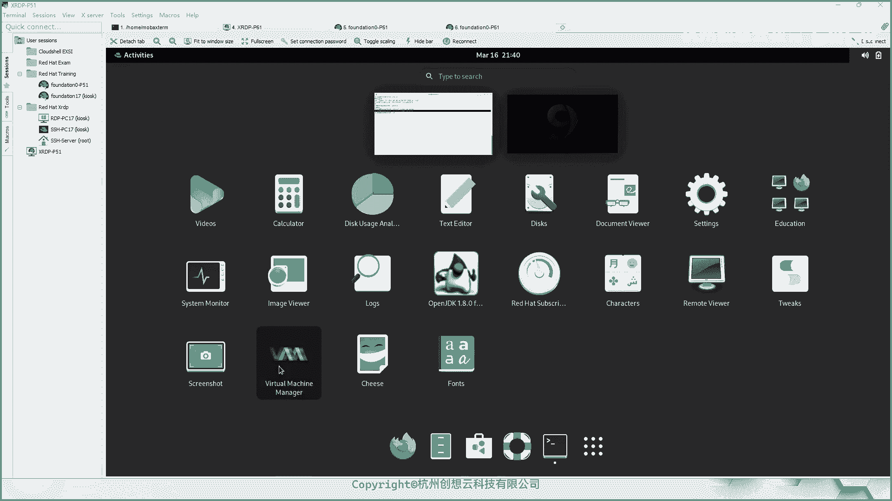

# 红帽认证系统管理员RHCE 9.0（2023年最新版）-5 - P1 - 杭州创想云教育 - BV1Xj411m73S

🎼，🎼The。🎼，🎼バば。🎼，🎼う。🎼ある。🎼Oh。🎼The。🎼嗯。🎼，okK我们准备上课啊，小伙伴们ok。哎，点个台来成是吧？OK那么咱们啊然后上课了啊，上课了。😊，OK好，那么咱们老规矩啊。

然后先来回顾一下，好吧，回顾一下咱们呃上周日讲的内容啊。我们来回顾一下啊回顾一下。哎，今天怎么感觉有点卡呢？大家直播看着这个我这边的界面流畅吗？咱们是第二周晚上啊，第二周的这个晚上啊。O。哎。

这是个什么个情况？哎。嚯这个这个这个有点儿。那啥有点那个。不知道为何啊。好，那你写这吧。回复啊。呃，咱们上周日啊讲的什么内容呢？咱们重点回顾一下啊，那么咱们上周是周日嘛，那么讲的是四张啊。

其实是四张半对吧？然后因为咱们上上一次的内容没有讲完嘛，哎咱们回顾一下，那么。首先呢我们重点的话呢就是介绍了这个组的管理，对吧？哎，组的一个管理啊，这个其实不是很重要啊，组的管理。🤧啊，然后。

他叫什么呢？组的管理之后呢，我们又介绍了用户的密码的管理，是吧？啊，密码的管理。那么密码管理这一块呢，大家一定要啊知道这个关于如何使用passWD啊，来更改用户的密码，对吧？还有什么呀？

设定密码是否过期啊，然后是否锁定或者解锁用户的密码啊，然后第二个知识点的话呢，就是我们要求大家掌握如何使用CHAGE对吧？来更改用户的密码的这说命周期啊，还有呢就是比要编辑什么呀ETC下面的。啊。

这个老兵啊点DF文件啊。啊，然后去干嘛呀？全范围的啊全局的，然后呢来设置后期新增加用户的这种默认的这种密码的生命周期之类的啊。啊，用户这一块呃，还有一个呢就是一定一定要记得我们系当中有一个shall。

呃，在re19当中呢没有写啊，但是但是可以的啊，其实从8开始就没有了，其实它是可以用的就是SB。那就是SB。下面的这个诺loV。哎呦，今天这个这个笔记好卡呀。哎，Is been no lonely。啊。

有这个啊有这个okK好。然后呢，接着呢，我们学习了一个权限的管理，对吧？那么介绍了关于linkux当中的基本权限的一解释。啊，解释ok。啊，然后呢我们说了什么呀？说了这个诸如啊诸如这个。

哟很多很多回顾吗？我这边没有哎。很多回复嘛？我这边没有哎，一个我我这边就一个回复。啊，有点卡啊有点卡。啊，这个让我们重点回顾啊。OK那么介绍了R呀，对吧？W啊、X啊这些权限对于文件啊文件。还有什么呀？

目录他们不同的含义。啊，然后然后又卡了。哎呀。主播大家卡不卡？什么个情况啊，什么卡不卡，同志们。直播卡不卡？我这边打字都换行就那个啥了，直播还好是吧？那看来。啊，应该这个问题不完全是网络的问题啊。

那就是这个软件的问题啊，这个软件的问题OK。好，然后呢接着呢我们还学习了什么呀？这个如何使用什么呀CHMD对吧？啊，然后呢使用所谓的字符法。哎，字符哎，字符法啊，然后还有这个什么呀数值法，对吧？啊。

来更改这个什么呀权限啊权限O。嗯，然后还有什么呀？还学习了这个特殊权限，对吧？哎，特殊权。那么特殊权限里面哟现在我的这个出来了好几个回顾。但是我这边看不到。啊，这个这个这个。

刚刚一不小心的这个什么呀目录里面我也看到了好多回复。那么特殊权限里面我们介绍了SUID对吧？啊，针对于用户的针对什么呀？针对二进制可执行的命令有效，对吧？那么还有SGID对吧？既可以针对于命令。

又可以针对于目录啊，还有SBIT。那针对于特殊的目录。那SBIT啊呃以及这些权限呢使用的数字所代表的值啊是四是2是1，对吧？然后呢一定要记得啊，一定要记得啊。然后还有所谓的什么默认权限啊。

you must啊ma的话，你一定要记得针对用户的啊，用户的话呢，我们是放在ETC下面的beRC。对吧beRC或者是哪里呢？或者是加目录下面的点儿beRC啊，然后呢，系统范围的话呢。

我们一般系统这个环境变量之类的，我们一般会放在ATTC的profile之类的，一般一般自定义别名啊，呃，这个呃对啊，说别名，好像我们我们之前乐落掉了，我们一会儿先给他说一下啊，别名OK我先记下来啊。

别名。这是之前遗漏的一个事情啊。啊，原名OK哎，我们一般可以放在这里啊，然后呢系统的配置啊，一些定义什么的，我们会放在ATTC下的profi啊，profi啊。这个上面啊如果大家啊有一定的需要的基础的话。

那么就编程的基础可以去看一下这文件的描述，那么你就知道它优先级了啊。如果不知道的话，也没事啊，那么大家可以等到。我们学了事效条本之后再去看，都是OK的啊啊，然后呢我们第四个知识点呢是什么呀？

第四个知识点我们学习了，那么在建成的这一块，对吧？哎，如何使用PS命令啊？top命令啊，对吧？还有什么up time呀。啊，去查看我们的啊这个这个所谓的啊什么呀，负载均衡是吧？啊。

然后还有这个so这个平均负载值啊，然后还有什么呢？还有这个。嗯，比如说W命令啊，对吧？啊，还有这个这些命令来监控我们系用资源啊，然后呢以及啊使用Q啊这种命令对吧？PQ还有Q2来管理我们的进程。啊。

还境的进程的一些指令啊啊，那么第五部分的话呢，我们则介绍了如何使用什么呀？我们如何使用SS的客户端啊，SSH的配置啊。那么一个是SS的什么呀密码认证。还有一个是呃公钥人证，对吧？哎，公钥认证。

那然后呢我们第二个呢是非重点啊，但是我们其实在生产里面还是非常重要的。但是我们书上讲的比较少啊，就是说如何去保护我们的。来，保护我们的这个open SHserv啊，一定要记得如何去保护啊。好。

那么我们先来补充一下我们之前遗漏掉的一个知识点啊，叫别名啊叫别名。这个是应该是在第一章啊，应该是在第三章第四章的时候，我们应该介绍的啊，漏掉了。ok我补充一下啊，别名。什么叫别名啊？别名的话呢叫als。

啊，叫alice。所谓别名的目的呢，就是说使用一个什么呀简洁的命令。啊，简洁的命令。那么这个简洁的话呢，必须是没有和性当中现有的命令是冲突的啊。一个简洁的命令。okK然后呢，干嘛呀？去。

去这个代替复杂的命令。并且呢这个命令一定要是经常使用的。如果不经常使用的话呢，你把它替代了也会忘记掉啊，反而这个麻烦啊。所以我们大家说怎么做啊，那么这个做法的话呢，就是首先查看别名啊。查看别名的话呢。

那么命令如下，那么我们可以在我们的终端当中。诶。这个网络是有点问题，我这个网络怎么又断开了啊？大家稍等我一下，我去看一下。そ。こで。Yeah。嗯。稍等一下啊。那个识别器网连了，没没电了啊。休眠了。好呃。

那么查看别名的话呢，我们用的命令呢就是al名的本身啊，al命的本身。然后那么我们设置别名的话呢，哎突然就流畅了，什么个就什么个原理。呃，设置别名的话呢，我们又分别啊分为两种情况啊，一种呢是面向用户的。

面向用户。那样用户的话呢，我们在写的时候呢，就直接把它写在我们的这个加目录下面啊，写个点by2RC。在点白杀当中去追加一个内容。比如说增加一个什么呢？alice。啊。

AA等于个啊BB那么就代表了是我们可以在当前用户的终端上面使用AA命令来替代执行BBOK。那么第二类呢就是面向于全局的啊，面向系统的。喵系统的话呢，我们则建议呢去书写在哪里呢？EPC下面的beRC。啊。

拜是2RC。那么同样那么追加一句话呢叫al。啊，aliceAA等于BB。啊，就是系统当中任何用户都可以使用AA命令来代替BB啊，代替BBOK好，那么我这边看有没有能连没有能连啊。哎，奇怪了。

刚刚好好的啊。哎，还没拿到。目前啊。う。

好，可以了。Student administration。好，我们来以这边为例啊。好，那么我们大家还记得我们前面讲这个文件管理的时候啊，文件管理的时候呢，我们曾经只过执行过一些命令。

比如说IM比如CP对吧？不能用户的话呢，在执行这个单纯的命令的时候呢，效果是不一样的啊，不知道大家有没有试过啊，比如说入用户。如果用户在使用RM删除的时候呢，它会提示我们要不要删除。

但是普通用户在执行RM的时候呢，不会提醒。那么其实这个地方呢就是我们在使用别名再出效果啊，还有一个呢，就是说我们举个例子啊，比如L命令I的话呢，我们在终端上打印消息的话呢，是有颜色的对吧？哎。

如果呢我把名令前面加一个反斜杠。反斜干的话呢叫转移嘛，对吧？我们来执行一次。哎，那么你会发现它就不再有这个不再有这个色彩了啊，就不再有色彩了啊。这个地方如果大家看的不够真的话呢。

那么我这边去速度刚压一下。啊，因为这个终端颜色可能和系统上面不太一样嘛，看着没那么的。真啊，我去来到DV下面。啊，来看一下对吧？哎，颜色你看都有不同的颜色，对吧？我加了反斜YYS。

那你会发现都变成这种普通的，为什么呢？其实就是别名在作怪啊，那么我们走个命令alice。啊，s你会发现在当前用户的话呢有非常多别名啊，比如说我们刚刚执行的L的时候呢。

相当于执行了Lda大color等于auto这样的一个指令。哎，那么就意味着我反斜杠L杠杠。COLOR的那个什么color啊，color凹头我们来试一下。啊，我们要去看一下DV。

是不是啊你会发现和前面单纯的去执行L呢是一样的。我加了反斜杠啊，加了反斜杠。那么那么加了反斜杠之后呢，就相当于是执行了命令的绝对路径嘛啊相当于走到user bin下面的L命令。那DV来看一下效果，对吧？

哎，相当于做了这样一个效果啊，就取消了别名啊，你会发现这里面很多的简单的命令，比如LL对吧？相当于LS杠L杠刚color等于outto都是有的但是这些不是说你今天在红帽前晚九里面看到了。

那么在其他的系统当中也是有的啊，这个这个不一定啊。那么具体的话呢，我们要检查一下。不同的linux方向版或者不同的版本都有会有所差异。哎，都会有所差异。这个地方大家要知道啊。

那么举个例子，比如说我们使用PSAXO哎，我筛选PID呀，还有这个Vsize呀，对吧？啊，虚拟啊，这个这个资源大小还有什么呢？还有实际消耗的资源啊，然后呢后面跟上指令。哎，这样去执行。

那么我想做个别名啊，这个别名的话呢，就是来替代我们这样一个命令。那怎么做呢？哎，我们可以这样来做啊，就是啊那如果是普通用户，如果是面向用户的话呢，我们就去编辑用户下面加目录DRbeRC。然后呢。

我们再其中增加，你看这里面是不是已经有被系统已经写过了一个，对吧？我们写一个alice。啊，然后我们写个决例对吧，写个写写个什么呢？我们就写个。呃，写个什么呀，写个几个US吧，好吧，US用户的。啊。

用户的这个统资源的统计信息啊，好吧，或者写个写个什么呀，或者说写个别的，想随便想一个。突然想在有点想不出来啊，呃想个什么呢？就写1个CS好吧。S4S啊O我们来走一下啊粘贴。哎呦，sorry。

我刚才那个地方没有分下来吗？O。啊，重新启啊啊，粘贴啊，然后呢我们粘贴进去好，下好之后呢保存退出啊，保存退出。然后呢我们让它生效。那么生效的话呢，我们就没有必要去退出，再登录了啊，那样太麻烦。

我们直接ss一下就行了。这时候呢我们输S呃输个什么呀，输个CS。哎，就会产生这样的一个效果。啊，成一个这样效果就替代掉了，对吧？替代掉了。然后呢，我然后呢，这个如果是系统范围的。

对吧比如说我写个带beC，我写在这里。同样在最后呢。我追加一个X。啊，在最后一行啊，okK最后一行alicealice谁呢？我说ABC好吧，等一个谁呢？这次等一个up。time好吧，up time啊。

我们来再试一下全局的啊，全局的话呢就意味着我可以换个用户，对吧？比如SU谁呀tudent。啊，我这个命令刚才执行了一个叫啥来着？ABC对吧？ok。ABC哎，然后呢就成了了一个别名。哎，就产生那个别名。

OK啊，这就是我们这个设置别名啊，那要是取消呢，那么取消的话呢，那么就是啊直接查看啊。那么如果全局的话呢，么就需要意味着呢我们需要去删除掉或注释掉这这这一行就可以了啊，注释掉。如果是。改了文件的话。啊。

给它删除掉或者注释掉就可以了，让它不再生效啊，然后呢再使用ads命令去查看哪些是生效的啊，然后呢再把它取消掉。比如这个命令，哎，刚才我们生生效的，我让取消掉，那就是UNad。啊，取消别名叫CS。啊。

取消别名就可以了啊，就可以了。OK啊，这是取消的一个指令啊，取消别名啊，这个别名大家是否明白了啊，明白扣个一啊。这这个啊还是比较有很很有作用的。你比如说不知道大家有没有玩过K8啊，你看K8里面默认的话。

那个谁呀？默认的话那个库波CTL。对吧是没有色彩显示的。哎，我们可以干嘛呀？去装一个coer color。哎，装一个cobra color，然后呢我们就使用别名啊，别名alice什么呀。

alicecober cTL等于个cobra color。哎，这样的话呢，我们在这cober cL的时候呢，哎那么呃获得的这个各个资源的信息啊都是色彩的啊，彩色的啊非常舒服啊非常舒服。呃。

这是一个别名啊，咱们前面那那一次说要要补充的，然后时间原因又忘记掉了啊，那么今天呢我们今天晚上讲什么内容啊，今天晚上讲的内容也是蛮重要的啊，但是呢我尽量的简单给大家讲的啊，尽量的简单一些啊。

因为这个东西呢就这两张东西呢考察的到考察的不多，但是我们要会用啊会用。因为呃因为什么呢？因为这两张就是我们在日常的当使用当中啊，甚至考试当中，如果遇到问题了，都是可以帮助我们的，为什么呢？

因为今天我们讲的内容呢是啊要讲这个第几章啊，要讲我们的第11章和第十2章。啊，第11章第11章介介绍的是分析和存储日志。O然后呢，第十二章的话呢，介绍什么呀？第十二章介绍的是网络的管理。啊，网络的管理。

那网络管理那么网络是非常重要的啊非常重要的。因为考试肯定会直接考察我们的啊，就是你这个配置个网络之后才能答题啊，否则是答不了题的啊。OK那么第11章呢是介绍了如何去分析和存储日志啊。好。

那么我们来看PPT啊PPT。那么在这一章当中的主要支点呢有哪些呢？这边把这个红色的标记拿出来啊。今天感觉这个环境怎么。不舒服啊。啊，那么首先我们要知道啊，那么在我们的linux当中啊。

用来记录日志的架构啊，其实就是位置。还有这个不同的目录存放什么东西啊？O然后第二部分的话呢，就是介绍一下所谓的slog这是干嘛的啊，slog是干嘛的OK然后第三类的话呢，是什么呢？

叫做啊这个用来解读系统日志。哎，系统日志啊，最后一次呢是配置系统日志。啊，然后呢再往后呢就是配置NTP的客户端了啊，那么这张要想充分的去理解啊，前面的这个四个支点讲了什么内容啊，我们先给大家列个目标啊。

给大家介释一下这个。之间的关系啊。因为这张的主要目标呢其实就两个，一个呢是日志，一个呢是NTP的时间同步问题啊。那么其中在日志这一块的话呢，我们的lins呀它它的这个日志的发展史啊。

那我们是经历了这么一个阶段啊，在re6。啊，在reo应该在reo5吧。那个时代啊，那么负责系统日志的呢是叫做slog。哎，叫sslogO然后呢，从reo6开始，那么叫Rs log。啊。

叫RlogOar全新的一个系统日志，按字面翻译啊，按字面翻译叫系统日志。那么我们举个例子，我们在终单当中做一个命令sst cL statuslog。是有的。但是呢如果你只行一个s log。看有没有？

是不是啊它没有它没有这样的一个信息啊，它只有一个叫阿 clog。那么翻译过来叫系统日志服务，对吧？系统日志服务OK那么这个系统日志服务的话呢，更主要的是啊这种服务叫做st term login。

System。啊，servs。啊，字面翻译过来呢叫做系统日志服务啊，但是呢这种日志呢主要呢是来记录啊记录什么呢？记录这种我们系统当中通信。各个组件啊，各啊系统当中的各个服务呀、服务呀，各种服务啊。

各种服务。等空气的时候。产生的是。哎，成日志，比如说我装一个外部服务器，对吧？外部服务器的运营当中还有通信吧，对吧？通信啊，那么哎产了一些日志啊这种的也是比较传统的。所以说呢我们未了和后面的志区分。

我们把这个日志呢称之为是传统的日志服务器。OK。啊，我们可以称为啊这个是我是为给大家区分的，那么我们称之为是传统的日志服OK。啊，传统日志服务。那么这种日志服务器的话呢，它产生的日志在哪里呢？

它产生的日志呢存放在我们的蛙 log当中啊，产生在这里OK然后呢，在我们的real7开始。啊，那么增加了一个什么呀？专门负责记录谁呢？用来记录我们的这个。C参D产生的就是。哎。产生日志。

那么这个日志叫什么呢？叫做system D杠general。啊，叫了个叫这个名称。又因为从七开始，我们的系统呢就是以sstem D。为引导的那你可以理解为科 now加了一个tD就是我们的操作系统了。

所以说呢这种日志呢我们称之为是系统日志。啊，系统日志。哎，我们因为我们这里面也叫翻译过来，也叫系统日志嘛，你这个也叫系统日志，那不是冲突了嘛？所以说呢我们就把以前的这种呢称为传统的日志服务啊。

叫sslog。而这种的话呢，我们称为是系统日志给大家解释一下这里的术语啊，术语OK大家是否明白啊，如果明白的话呢，扣个一啊，扣个一。有没有不理解的这个地方？啊，这边有消息啊，我不知道什么时候发的啊。

okK然后这个而对于我们的这种sstem d的啊general的这种日志的话呢，它的默认存放位置呢在哪里？在run下面。啊，log。啊，gene到这样一个目录当中。啊，在这步当中啊。

只是给大家做了一个区分啊，一个区分啊。OK前面这些啊我们都称为是sslog，你也可以简单理解为是谁呀？你也可以简单的理解为是啊这个传统的日志啊。然后下面这种的话呢，我们称为系统日志OK。啊。

做一个区分啊区分。O。好，那么我们来看这里啊，你看提到了。那么日志呢主要目的呢是。干嘛的呢？就是我们的进程啊，操系统的内核呀，发生的所有事情把它记录下来，对吧？用于后期的这种审审审核呀，对吧？

问题的查找呀，哎等等，然后会以用到一般呢会保存在one log当中。那么我们可以使用一些命令，例如less。tailll命令啊，还有我们将来学习的一个gra命令都是可以用来查看日志的啊查看日志的。

O那么我们的real当中呢，一直以来都使用了slog啊，这种协议来记录标准的日志啊，这日志O那么从7开始呢，我们系当中有意味着有两个负责日志服务记录的手务进程啊，一个呢是stem dgene的。

一个呢是rlog这样一个服务啊。你看这里也提到了，你看这种sem d general的这种服务呢是核心的啊核心的那默认存放的位置呢，在run log。当中，那么run呢我们立起前面讲过对吧？在运行时啊。

那么因此呢一旦重启呢就没了啊没了。那么所以说我们在后面的这个章节当中，我们要介绍的如何去配置系统日志啊，让它保留在我们的系统当中啊，ok然后那么阿log的这种的话呢，是放在walllog当中的啊好。

那么这里这个表格的话呢，给大家摘录了几个关键的这种日志啊。但是呢我们的日志很多啊，我们给大家呢都来介绍一下，希望大家呢能能看能记得住啊。哎，那么来看一下呃，那么这些日志的话呢，其实分了两类啊。

我们来给大家介绍一下。那么首先这里一个idit啊，idit的话呢，审计对吧？审计的话呢，虽然它是存放在了我们的挖log当中，但是呢并非。啊，并非是完全由我们的sslog来记录的。啊，那么这个审计的话呢。

是谁来记录的呢？在我们的clenal当中啊，linkux kernel当中默认呢就存在一个审计的模块。那么这个审计模块呢，负责将科上发生的事情记录下来，作为审计来使用。啊。

但是呢为了保证我们的审计在不工作的时候，依旧能够记录下来这些关键的信息。因此呢他还把它托管给谁了呀，托管给了我们的rslog来记录。那么为了方便他访问，因此呢就放在了walog当中。

所以这个里面是审计啊，它不是日志，它严格来说是审计。所以呢这个地方大家知道就可以了，我们不去看啊啊，因为这个是我们同样是在其他的课目当中，大家想看的话呢，自己下去看一看。

你会发现和我们后面讲的这些知识呢，里面是不一样的，哎，是不一样的。好，然后呢这里呢有一个bo。啊，启动的收字日志对吧？哎，然后呢这个 curll哎这个。crony啊cony啊，还有多tony啊这个。

这个啊那么这个东西呢是干嘛的呢？这个是一个。呃，时间同步的一个服务。O变了啊。如果你以前用过real6real7的话呢，你见到这个名字可能会比较陌生啊，但现在呢就变这个名字了，然后还有谁呢？

Cn啊Cn呢是计划任务DFDF的话呢，它其实就是原来的y啊YUM啊，然后呢是用来记录我们装软件呀，更新软件包呀等等相关的信息的啊这DF开头的后黄浩强啊faair worldO不再是every tables了啊。

是faair world嗯，然后后面还有哪些呢？啊 up的这个d备份是吧？就是我们的系统啊在崩溃的时候他会把内核当时的状态啊备份出来一份数据啊记录下来。那么这个 up呢因此我们。

翻译的时候呢称为内核崩溃转存机制。啊，一般。我们在装系统的时候呢，会做这样的一个设置啊，那么在内存当中会有一定的空间啊，这个空间呢干嘛呀？这个空间是用来这个记录这个日志的一个信息的啊。

OK然后mail啊，mail log。那么这个呢是什么呢？这个是一个用来邮件。啊，记录邮件的日志okKmessage休息，对吧？啊，这个里面丰富比较多啊。

基本上我们百分之八九十的日志呢都是记录在我们的message当中的。然后还有什么呢？secreorysre的话呢是我们的认证和安全相关的日志。比如说用户的登录哎，这个速度的齐全啊，FTP的用户的登录哎。

都会记录在我们的secreory当中，还记得我们前面讲SH的时候，我们通过开断日志来判断什么时间每个用户通过哪里来登录到我们当前计算机节点，对吧？啊， secret啊。呃，其他的就不是很重要了啊。

主要这这些啊这些啊大家知道就可以了哎，知道就可以了。啊，好，接着我们来看第二部分啊，第二部分的话呢是给大家介绍了。那么我们如何呢去查看啊系统日志文件啊，系统日志文件啊，不是系统日志文件啊。

是系统日志文件啊，OK呃，这个中中中中文断字是吧？博大精深啊，查看你可以理解为查系统的日志文件是吧？呃，那么我们real9当中啊同样在使用这个谁呀？所谓的啊RC log。

然后利用sslog协议呢来进到日当中啊，然后呢这个日志呢按照一定的级别啊，还有优先级类型等等，进行分类存储在不同的文件当中啊，那么这些所谓的设备呀、级别呀，到底。是谁来定义的？那么我们来看文件啊。VM。

ETC。有一个文件RC。唠个点康复。啊，这个文件我带大家呢过一眼啊看一看。好，为了让大家容容易理解啊，容易记啊，我把它加好号啊。呃，你像这种第九行呀，global directives。

那么这个部分呃变化还是蛮大的啊，和七版本、八版本都不一样。但是呢意思没有变啊意思没有变啊，我们来看一下什么意思啊。呃，那么我们重点呢是哪里呢？就是第十三行有它一个模块啊。

这个模块呢是加了一个内置的一个啊干嘛呀？内置的一个用来记录日志的一个设备，你可以这样理解啊，然后呢它的格式呢就是走的是Rlogtraitional feel format，你可以理解为。

就是记录传统的这种日志的文件的格式啊，所以传统的日志文件格式呢，其实就是什么呀？其实就是我们平常看到那些格式。

那么我们看到日志长什么样子呢？比如说哇下面love messages。哎，你会发现这些日志呢从左从左到右啊什么时间啊什么啊日期时间对吧？等等这样的一个信息啊，哎，这就是传统的日志格式啊。

在这里那么配置文件啊，那么是ATC下面的什么呀log点D点什么什么c复，还有我们当前的文件本身啊模式呢是可选的，就是你附加的可以写啊，呃我们这个课堂上啊，这个地方是不介绍的啊。

但是呢我们其实我个人觉得是非常有必要的。为什么呢？就是我们可能会需要一个这样的日志服务器啊，日志服务器到底该怎么记录日志，我们需要自己呢在这种自定义的文件当中呢去定义啊。

在十8行开头到37行呢，中间的这个位置主要是来定义了我们使用支持什么样的功能。而这个功能的实现呢则是通过模块的开关来实现的，比如说20行，对吧？它加了一个模块呢叫什么呀？

叫IM啊IM导入这个模块叫什么呢？这个叫做这个UX socket啊US呢就unix嘛，对吧？就传统的unix的so通通信的时候日志啊，然后呢，第二个呢就是它加了一个模块呢叫general模块，对吧？啊。

就意味着我们的啊log也支持记录general的日志。那就是我我这个不仅支持老的，我还支持新的啊，我这个呃不仅向下兼容，还向上什么呀啊，兼容是吧？哎，非常完美啊。然后呢，第二8行到33行大概的位置啊。

那么这里有什么东西呢？给大家说一下啊，但是我们不需要去管它啊。O那么28行还有33行定义了两个端口，一个呢是UDP的，一个呢是TCP的。那么这两个端口是干嘛的呢？这两个端口呢都是514号端口514。

对吧？那么这两个端口呢，主要目的是用来打开这个端口之后，用来接收其他的服务器发送到本地的日志。啊，什么意思呢？就是说我可以将当前的这台机子打造成一台专门用来记录日志的服务器。哎。

然后呢我打开514端口专门来接收。哎，接收，那么接收的时候呢，就可以选择了呀，你是走UDP还是走TCP对不对？那么你要想效率高就走UDP，对吧？你想安全性高，加个密什么的，那么就走TGP。啊。

看你的选择那那么当我们打开之后呢，就要结合前面的第十六行内容去写些规则啊。那么这个规则的话呢，其实下面这些语法也是可以参照的。就是说我可以分类过滤。不同的服务器放在不同的目录下方。

然后呢在目录当中去生成一个不同应用程序的日志。进一个分类OK这个感兴趣的话呢，大家可以去安装一个软件包啊，叫什么呢？嗯，叫做RRClog dock好像是。啊，是这个包啊，把这个包装一下。

那么里面有帮助文档，可以看一看啊，可以看一看啊，非常非常有用啊，非常有用。这个里面的文档写的非常的简单。啊，非常简单，可以看一下OK。那这个不在我们的学习范畴之内啊啊，然后呢关键的地方来了啊。

我们书上要掌握的知识在这一行啊第一行呢，在我们的第38行，这里写个规则，规则当中就是我们啊记录了什么呢？记录了我们定我们的日志服务器定义了我们什么样的设备，什么样级别的日志记录到什么样的位置。

OK那么在这些文件当中，每一行啊，我们找49行来给大家举例吧。49行的话呢，这里呢你会发现左边的这一排啊，左边的这一列它是有一个关键词的。那么这个关键词呢又一分为2啊，据点的左边叫做设备名。

据点右边呢叫做优先级，最右侧呢则是我们的日志O。好，那么因此我们对我们而言啊，那么对Ris log而言，那么通过ETC下面RRC log点com。啊，这康谱，我怎么感觉今天晚上的字儿再放大还是小？嗯。

这样差不多。哎，这样什么？好，那么在这个文件当中来定义啊来定义okK。那么是设备面。据点啊优先级后面呢则定义了日志。文件的位置和名称。啊，这是我们的这个信息啊这个信息。那么这个设备名啊。有哪些呢？

这个说没有讲，对吧？哎，没有讲，好像我看有没有。啊，说了啊，我摘有下来了啊。那么大家如果想查的话呢，大家可以直接m一下第五章节RClog点儿com。啊，是有的啊是有的。这里呢详细介绍了啊所有的内容。

在slects啊slectors那这里呢就记录了哎，那么包含了两个部分，对吧？中间呢用句间隔开啊，左边呢是设备，右边是优先级啊，设备啊有哪些？啊，优先级有哪些啊，都是有定义啊。那么我呢为了大家方便啊。

我把它拿出来了啊，我们拿出来了，我们来看一下。呃，这个的。这个这个这个sorry这个地方写错了，不是优先级啊。啊，这叫设备名啊。啊，叫设备名。不数。OK啊，写字这写错了啊啊。

那么设备呢有比如说cor啊KRN corn内核啊，那么内核消息对吧？字面啊意思内核消息。然后呢，第二个呢叫user啊，用户级别消息，对吧？邮件邮件消息demo收集成oss认证sslog内部的啊。

然后LPR打印机啊，linux printer啊，所以这个打印机的话呢，很搞笑的啊呃那么设备名呢叫LPR。但是呢我们如果在linux里面去搭建一个日志服务器。那么这个日志服呢叫caps CUPS啊。

caps。啊。啊，通用用户打印服务吧，我记得是全拼啊。okK然后呢，news啊网络新闻类啊，这个咱们在real里面看不到啊。咱们当中有没有人接触过金兔？镜透，我记得我好像印象以前问问过是吧？

啊金头在安装的时候。呃，比如说有没有更新pro是吧，我们就会看这个news啊，新闻哎，看一看有没有更新，或者说最近有什么软件啊，什么漏洞都会发布这样一个新闻啊，news。UCP啊。

这个unix to unix啊这个CPcopy啊，就是unix系统之间通信的时候的一种协议啊。那么现在有些应用程序呢在开发的时候呢。

还会使用这个协议啊cor呢计划任务play认证对吧特权相关的啊啊FTPFTP协相关的。然后呢，还我们预留了8个啊logo零到logo7啊，logo零的logo7来自定义啊，设备名。

那么设名的右侧呢是优先级啊，优先级的话呢，它的数字呢是0到7啊，用8个级别数字呢越低，优先级越高，对吧？我们来说最高的啊emerence对吧？紧急的啊单词是吧？emeraging啊，这个这个这个什么。

啊，非常非常明险啊非常非常的这个。登级高啊，那么这时候呢我们系统是不可用的啊。呃，a lot那么需要我们立即采措施啊，呃，然后呢create呢是临界啊，需要同样其实也我们需要来来采措施了啊。

那如果你不采取措施的话呢，其实。就非常严重了啊，arror对吧？报错啊，那这些呢都不影响我们的生产啊，那么aror从 errorr开始往上呢，字体都是红色的啊，并且呢以红的加粗，对吧？更深啊。

就明事情越紧张啊啊往下的话呢就级别降低了啊，比如说 warningning啊警告对吧？啊，notice一般的到重要的啊。

infer呢信性事件一般来说我们的日志呢都是从infer级别开始的infer和infer级别以上啊，然后呢第八个呢是调试的消息。啊，调上消息。那么我们要想去自定义的话呢。

也可以参照这个啊ETC下的rslog点com来定义。对我们我们写一个猛一点的吧，然后我们写一个al好吧，所有的好吧，我们写一个啊。EDCRC log。点com啊，我们点点D吧，我就写个奥点com啊。

我们来写个猛一点的，让他感受一下。我这个所有的设备的所有级别的全部放在哇下面log。啊，挖的log。前面叫奥，就叫奥好吧，奥点log。啊，我们来感受一下啊，保存并退出，让它生效。

re start arelog点serv。那么我们来看一下挖下面的logo。哎，这里面多了个二吧。我们来监控一下啊，tailll命令杠N零行follow一下，跟踪一下。啊，Y下面的look。哦。啊。

什么都没有啊，这边呢我们打开一个新的界面，我复制一下。啊，SS去tudent吧。At卧 station。这边有没有？啊，有一个绘画是不是登录上来了？啊，并且一开是走的什么公钥认证。啊。

从250这台机子上登录上来了。哎，就看到了是不是哎就看到了啊，我们根据自己需要呢，可以去自定义啊。一般来说，我们不用去干预的啊，因为我们在安装应用程序的时候，不同应用程序都有自己的日志定义啊。

比如说阿巴奇是吧？哎哎HTBD服务把in等等，他们都有自己的日志啊，都有自己的日志，除非你自己开发的对吧？哎，那么没有定义，那么你可以去干嘛呀？那你可以去写一个规则啊规则。这是日志啊日志。

那么大家有些细心的小伙伴可能发现了一个问题，什么问题呢？就是说我们这些都不容易理解啊，比如说第一这个行啊。比如这一行这行的话呢，星号点infer对吧？哎。

任何设备的infer级别和infer级别以上的日志啊，然后呢，mail点那邮件的呢就不记录了。然后呢，ospre呢也不记录了。那Cn呢也不记录了。那么我就可以理解为信当中所有的括弧不包括邮件。

安全认证计划任务之外的日志全部将其infer和infer级别上的日志记录在我们的wa log messages当中。那么既然你这些不记录，那谁去记录呢？哎。

定义了的所有优先级的记录在we log secret当中。邮件的所有级别呢记录在wa log mail当中啊， mail mail log当中，但是呢这里面加了一个短的大使符，什么意思？

那么因为这种日志呢，它的量非常非常的大啊，mail那种日志。那么但是呢又不是很重要啊，没有前面的这些重要啊。那么为了不影响我们的IO磁盘的IO。所以说呢它这里加了一个短横线代表的是异步同步。

就说呢产生日志呀，我暂存在内存当中达到一定的级别了，和时间了，哎在会写在我们的文件里面，具体多少，那么根据系统各方面定的配置设置有关啊？然后计划类的呢放在Crome里面，然后呢，下面这个就蒙了。

你看啊所有任何设备对吧？它只要是amG级别的冒号on MUSR message在系统当中登录的用户可以收到消息。哪些用户呀？冒号星号所有的用户。哎，所有用户对吧？你你系统都不可用了，发广播了，是不是哎。

发送广播了啊，每个人都能收到消息。啊。OK这是我们说的这个日志里面定义的语法啊，了解啊了解就可以了。ok好，那么但是呢我们这种日志呢它有个缺点，什么缺点呢？对于我们的这种日志而言呢，它其实以前的时候呢。

我们使用fill命令去看我们挖下面的这些日志啊，他会告诉我们，它是一个呃阿斯特嘛，什么什么文件。那现在叫什么UTF8的unicode的编码文件。但是呢有非常非常非常多的行。非常非常多的行啊。

那么并且呢这种日志的文件呢，它是一种它是呃UTFun8编码的啊，这种编码的文件呢，这个通俗来说它不属于二进制的，不属于二进制的话呢，就意味着什么呢？当我们的人类。去读取的时候，它首先我们的计算机啊。

计算机呢会把我们的这个文件。啊，文件干嘛呀，去给它翻译成二进制。啊，翻译成二进制，翻译成二进制之后呢，再干嘛呀？再给它给它转变成这个让我们的科呢能识别呀。科目识别之后呢，再给它干嘛呀？

再给它转成我们人类可读的语言。啊，再展现给我们人类。所以呢这个过程呢是比较复杂的。啊，是比较复杂的，因为计算机不。他不不认识这种这种文本啊。啊，虽然人类读懂对吧？但是你要经过什么呀。

计算机的处理才能看得到呀，是不是啊你不能说。就像地成一张纸一样是吧？你捡起来看一看就可以了。哎，你要通过计算机的加工才可以。所以呢这个过程呢是比较漫长的。当我们的日志达到一定量的时候呢。

你会发现它非常的慢。啊，比如说我们生产环境当中的日志对吧？那都那都不是，那都按G的来算的是吧？几十个G对吧？这种算的。那么那么这种的话呢，就意味什么呀？就意味着它打开的时候呢，会非常非常慢啊。

我不知道大家有没有这种经历啊，就是使用lesss或gra的时候，哎回车对吧？哎，感觉好像卡了一样，好一小会儿，对吧？可能短快的话呢，就这个几秒钟，对吧？慢的话呢，还能还要再晚一点，然后呢。

我们的信信息量呢才能够打印出来，那么这个过程呢就是。他要给你翻译呀，哎翻译呀对吧？哎，就比效率比较低啊，那么并且呢呃它的量数据量，因为它不是二进制的嘛，所以它占的空间也比较大。哎，大到什么程度呢？

如果没有干预的话，它会将你的这个磁盘所在的空间全部给你占完。哎，那怎么办呀？所以说呢我们为了防止这种情况的出现。我们的系统当中呢有一个内置的功能叫做logro，叫日志轮转。啊它是个工具啊。

它不是一个服务。OK它是一个工具。那么这个工具的话呢，会结合系统内置的计划任务，定时的会轮转我们的日志哎日志轮转按照logro的这个文件的配置文件啊，然后呢进去轮转啊轮转。OK那么当然了。

我们也可以根据自己的需要呢去做。你举个例子，比如说我们现在很多的业务放在云上面，对吧？云的话呢，就意味着我们在比如说阿里云为主吧，对吧？国内肯定阿里云为主，我们使用1个ECS的实力。啊，EC的实例。

然后呢构建一个系统。那么这个系统呢肯定是从镜像来部署的吧。那这个镜像很小的呀。一般来说，linux的镜像都是10个G，对吧？如果你不增加数据盘的话，那10个G乘认日志呢分分钟钟就给你填满了，很快的啊。

那非常危险的啊，所以呢我们可以做一个轮转啊，做一个轮转给我们的空间达到一定的容量啊，然后呢进行一个轮转分割，你可以利用一日志的分割啊，你像我们看一下配置文件吧。比如说EBC下的logro点com。

那么在这个文件当中，它全局定义了我们的日志是怎么个轮转法啊，给大家解释一下。维克里每周做一次轮转，那么保留4个包，唉就相当于是一个月。相当于是一个一个什么呀循环嘛，一个循环，对不对？啊，一个循环啊啊。

就好像我们有一个盒子啊，盒子里面呢呃这个这个两两两边都是通的那里面就能放四个球，对吧？你放第五个球的时候呢，就会把原来第一个球给挤出去嘛。那么对我们而言，就相当于删除掉了，最原始的那个日志。

最多保留4份。那么新的日志呢会创建一个新的空白文件，而这个日志呢则是以日日期作为结尾，哎，这是默认的哎默认的。所以说呢我们。所以说我们这里啊。能看到非常非常多的日志，事以日期结尾的。啊，就是因为。

被轮转了哎被转，今天轮转的啊，今天我刚装的环境，它就轮转了啊，因为计划任务它启动了嘛啊，那么大家线上的环境好长时间没有动了，应该会显示的比较多啊。大家后面留意一下，因为我们的课堂开的时间也不算太久嘛。

里面可能就轮选个两三次了啊，可以看一下啊，可以看一下OK。我们两周两周了，应该轮巡有两个文件了，可能会最多就两个文件的样子吧。啊大家下去可以看一看啊，可以看一看啊，被轮转，你看日期为结尾啊。

然后呢这个呢这行呢。你像我们的第十八行，第十八行的话呢就是一个压缩，对吧？你说哎我我这个日志是吧，我想啊这个轮转之后呀，把它压缩出来。对吧压缩出来，哎，那这样就好了呀。哎，我就可以把这个注释呢去掉。

我们来感受一下好吧，哎，把注释也去掉。去之后呢，怎么让它生效呢？因为它不是服务呀，你就不能通过重启的方式来实现。那么我们可以使个命令logro的杠FF呢是指定我们的文件，以哪个文件作为参考来生效啊。

EPC下面的log rotate点com。对吧他说已存在啊，这个不是错啊，虽然他写了eror，但是呢因为今天嘛刚流转过，所以它又提示一次，这个不算错啊。虽然写了 error啊，我们要看具体的结果啊。好。

哇log里面看一下，哎，你会发现这日志怎么了？是被被被这个压缩了。哎，被压缩了啊被压缩了okK。啊，如果自定义的话呢，那么我们可以来到这个logro当中啊，这里面有非常的子非常多的子的。

你看DF呀、fa word呀这些，你看都有啊，将来写的时候就比如呼画条就可以了。同志们不用刻意的去记啊啊，都有的，这接可以简单找一找帮助就能知道怎么回事对吧？检测有没有丢失啊，是否为空，对吧？

还有就是日志轮转几次，每周频率新的文件怎么生成啊，都是有的啊，语法就这样来写，你自定义对比如说那个web的我记得是没有轮转的对吧？HBD的哎，你可以去定义啊哇下面的logHBD写啊。

斜线access点log对不对？什么什么什么呀，对吧？哇下logHBD什么呀啊，斜线啊 error点log什么什么样子，对不对？你你都可以去定义的啊，可以定义的啊。定完之后就不用管它了啊。

除非你当天想测试，你就按照我刚才的这个语法，后面跟上你写的那个配置文件去走一遍就行了。如果不着急，那你可以隔天再看嘛。因为我们后面会讲到计划作业啊，计划作业它会结合这个轮转，每天检查一次，有没有轮转。

每天会检查一次啊。啊，这个日志轮转好，大家有没有听明白这个轮转的意思？明白的话呃，群里咱们钉钉群里面扣个一啊。嗯，然后接着我们继续啊继续这个这个轮转啊，大家一定要记得啊，日志轮转的目的呢是日。文在。

我们目的呢是干嘛呀？按照规则使我们的日志。啊，保持在什么呀？保持在一定的。大小。或者或者什么呀定期。啊，因为因为这个地方的话呢是。你不仅可以按照时间啊，你看我们的那个。性当中配置的那些都是按时间的嘛。

我们也可以按大小啊，按大小也是可以的。比如说我这个啊日志量太多了，对吧？日志量太多了，我不可能按时间对吧？时间嗯太恐怖了，那我们也可以按照大小呀，比如说呃比如说什么呢嗯。我记得有一个是是按照大小的。啊。

这个吧。要不是啊。找一个量大的。的压缩。我搜一下size。哎，没有吗？哦，sorry，嗯，去错地方了，我说怎么没留嘞？哇塞。BTC下面的log。哎，你看这里KM state。

你看这个呢就按照十0兆的大小啊。啊，你看这个文件，那么它就是十兆是一个轮转，是够十兆了就干嘛呀？轮转一次，够十兆了就轮转一次啊，轮转一次，这是这是它的一个大小，你是也可以按照大小来。

比如说我这个日志量多，那就按大小，我这个日志量少，按周期按时间啊，看大家心情。啊，这是个日准转啊，那么查看日志的话呢，那么我们可以干嘛呀？那么我们就可以使用这个less对吧？t命令，对吧？

还有我们将来学gra命令去看都可以，一般我们用t命令比较多，因为日志嘛，我们关心新生成的对吧？那么打印出来的格式呢对吧？第一列时间出对吧？日期和时间哎，因此呢我们时间就显示的就显得额额外的重要。

如果我们的时间不一致，对吧？那肯定会出问题。因为现在很多的服务呢都依赖于时间，对吧？时间不一致的会出现问题，并且呢如果时间不一致，我们在排错的时候呢，也会很难受啊很难受。

你没有办法去确定这个时间发生的事情是不是这另外一个时间发生的事情啊。第二个呢是我们的主机啊，那么因为本地嘛，我们这里只有一个lowho或者主机名，如果是一个日服务器，那么就会看到不同的主机名啊。

第三个地方呢是我们的守护进程和它对应的进程号啊。第四呢则是具体发生了什么事情啊呃有日志啊肯定是比没有日志要强太多了。但是呢不代表啊这个。所有东西都有日志啊，有些日志呢还会告诉我们该怎么去操控。

有些日志呢会告诉我们的模棱两可，就信息没那么明确。那么所以说呢我们就需要啊根据自己的经验去排查去找问题啊。所以说。其实日志的分析还是有一定难度的。啊啊，那么方法呢常常见的方法就是log杠F啊。

不是sorry啊，t杠F去监控啊，日志啊就可以了。OK呃，如果呢我们自己想测试一下日志有没有正常工作，那么我们可以说用loger命令来发送消息。杠P呢是优先级啊，后面跟上设备。

跟上优先级或者直接跟上优先级都是可以的。后面跟上你自定义的消息啊，比如说我们来发一个也发一个nice noticeice的吧。操作之前呢，我监控一下啊，太阳。杠恩0。大虎往下面唠个message。啊。

然后呢，我这边。Loer。杠PLO。TICE。对吧写个。3W点cloud shareEDU点com。来看一看有没有消息。哎，就看到了谁发的呀，root用户对吧？哎，root用户发送了消息啊。发送消息哎。

就来到了就来到了啊，这个非常有用的啊，大家一定要切记这个命令啊。啊，这个这个这个。一定要会用同志们啊。这个命令啊测试日的消息OK好，这是我们前面介绍的这些呢，都是我们的RC log啊RC log。好。

接着呢我们再来说一说什么呢？来说一说如何呢去啊这个查看系统日志啊，查看系统日志OK为什么查看系统日志有专门的说一下呢？那么要想。解答这个问题啊，我们不妨去看一看日志在哪里。啊，我们前面说到了。

那么对于我们的这种stem dgene的这种日志而言，它存放的位置呢在run下面啊，run下面一个log啊，H里一个目录就general。啊，这里呢一个目录啊，我们随便去一个吧，有一个是真的啊。

另外一个是我们性在封装的时候，它没有清理干净啊，遗留到一个啊，不用管它啊，我们去看一看看。哎，有一个日志。叫system点general系统的日志，对吧？翻译过来啊，你说我们用哪个命令去看呢？

用lesss。你看他说它是二进制文件，你是不是一定要看呀，是不是你说yes。O同志们。我们能看懂吗？是不是看不懂啊，是不是看不懂，我记得一个。呃，这个命令是一样，把要整个石头定制的。也看不懂是吧？

我记得还有一个命令啊嗯也是什么来着？我记得有个命令可以把一些二进制的尽量的去打印成我们能够识别东西啊，有个命令来着，忘了。啊，想不起来了，我记得有一个命令啊，但是我但是呢总归呃是看不懂的啊。

所以说呢这些命令呢我们呃不能够使用传统的方法呢去去分析啊，去去读取。那怎么办呢？我们使用一个专门的命令啊，叫generalCTL啊，回车。啊，这个命令一回车就相当于干嘛了呀？

相当于你直接ca了哇下面log message，相当于这样一个效果。同志们，okK。好呃，geneer所有的值啊，相当于一个less了。应该来说啊，less你看这里面记录了对吧？我我我来登个GG。啊。

鸡G啊来到最前面了啊。哎那么。开机的时间对吧？内核的版本。对吧然后这个内核启动的一些选项啊，还有我们的架构对吧？bios的信息啊等等等等都出现了啊啊都出现了。那如果我想只查看上次系统启动的所有日志。

对吧？本次启动日志吧，杠B。啊，本次启动上次的看不到，因为一重启日志就没了啊。O本次的啊启动的日志。啊，江囊杠Bbo。啊，B不成。Okay。啊，这个是查看。本次启动的日。OK嗯，然后呢。

如果我想去动态的显示制，那么就是Ffo啊，回车就可以了。默认的显示时行和tll杠F是一样的。啊，然后呢动态去显示啊，比如说我这边。sCTRrestarHTB啊，没有SSAD。是不是哎就记录下来了啊。

就的是杠F啊。啊，后来跟踪日志对吧？哎，然后呢，你说哎我看看系统当中有没有报错的呀，有没有警告类的呀，我看有没有警告类的吧，报错估计没有啊，相当于说杠P one。啊，W比要N。安静。啊。

警告类的你看都是黄色的。哎，黄色的消息是吧，警告类的啊各种各样的。啊，说什么什么分辨率是吧？啊，推化见面啊。啊。张P啊警级别啊。按键 know能不能复合去使用呢？比如说我想监控这个警告类的。

并且呢是跟踪有没有新的警告类的那加一个谁呀？加F，但我只想看新的旧的，我不想看了，杠N0。这监控哎就OK了啊就OK可以复合的啊。呃，我我比如说我这个服务器呢跑了很久了，我想看今天的日值杠杠sins。

我记得可用大S了啊，我看一下以前的时候没有大没有这个选项啊，大S可以的啊啊，那么。S比如说我也想看今天的备。今天的日志啊，我想看那个啊14点之后的。14点。之后的没有。几点了？我这个时间才早上8点呃。

这个看个8点10分的吧。啊，8点10分的日志。对不对等等吧，还可以干嘛呀？还可以去看不同的时间的截止的都是可以的啊，都是可以的。啊，这个说实在的啊，要比grab用加正则要好用多了。我个人比较喜欢这个啊。

因为正则的话嘛，有些人他不太擅长嘛，对吧，这个命令就比较疏服了。啊，搞舒服了。OK好，这个命令大家。按照我这个大致语法，大家试一下，我给大家5分钟的时间，好吧，大家试一下，熟悉熟悉啊。

因为我们后面肯定会用到的。然后试试完之后，大家群里面扣个一啊，给大家5分钟时间试一下。Yeah。🎼OK啊。😊，嗯，然后接着我们再讲一个小节，然后再休息啊，咱们讲一点点啊。比较简单哈。

保留这个保留系统日志啊，保留系统日志。那么我们前面说过，那么对于我们的这种唉CD。jaral的日志而言啊，那么它默认的话呢是存放在呃run。哎，这个这个这个log。就那是吧。啊，当中的。

那么这种位置的话呢，我们的系统啊一旦重启或者意外的关机，那么日志就丢失了，对吧？所以说为了避免日志丢失，我们需要做的一件事情呢，就是说将日志呢持久化。啊，持久化。啊。

那么这个持久话呢从re耀8开始变化了啊，那么只它只需要修改配置文件就可以了。以前7版本的时候呃不是这样的，嫌弃的时候没有配置文件啊，就是我们要改一些东西啊，纯手工去迁移啊，呃，比较麻烦啊。

新的方法呢比较简单了啊，怎么去做呢？那么在我们的信当中呢，有一个配置文件啊，在APC下面的呃。是这么地。general的啊有一个这样的文件。那有一个这样文件。那么在这文件当中呢，有这么一句话。

我们打开看一下啊，打开看一下，在我们第几行呢。在我们的第一。十八行。十8行呢这里有一句话呢叫存储等于什么什么auto是吧？哎，具体该怎么写？哎，那么我们可以通过man舞来获得啊漫5来获得，我们来妈一下。

好。呃，那么这里面有些文件啊，他都给我们介绍了，这是全局的临时的这是默认的配置文件啊，默认的我们不去改啊，因为改了没有意义，你后面软件重装，重启呃，重新安装软件都会覆盖掉。所以我们要改的话呢。

也是改ETC下面的啊。好，然后呢在这个。在这个options当中啊，它这里面有介绍了存储，所说用来控制我们的日志存放在哪里，对吧？有vol呃vol是吧？persistentauto nine等等。

那么这个值的话呢，就代表了我们的日志呀只放在内存当中啊，那这个这个如果呢。我们的日志改成什么呀？如果我们的日志改为是proistant，那么它一定会存放在日志当中。

存放在Y下面log general这样的一个结构里面。啊，以前的时候他还会检测这个目录有没有？如果没有的话呢，你需要手动去创建，现在不用了啊，现在它它还很很很傻瓜式。

就你一旦把选项改为persistent，它自动会创建这个目录你都不用去创建啊，都非常的人性化。然后如果是auto的话呢，它会先检查有没有挖 log进种这个目录。如果有就放在这里。如果没有就回到内存当中。

所以说如如果我们要想持久化的话呢，我们建议大家呀把这个值改为persistent。因为这绝对的嘛，对吧？绝对会存放在那里。那我们就把这个值改一下。把这个注释呢给去掉，先啊把这个请字辅助释给去掉。

然后呢改成谁呀，改成persistent啊，改完之后啊，第十八行啊，改完之后呢，干嘛呀，给它重启一下就好了。哎，改完之后把这个服务呢重新启动一下，就OK了。好。

sstem restartstar啊sst D。大gene啊，加个D啊，走起。啊，然后呢我们接着呢再来看一看。啊，看一看我们的日志有没有了啊。妈现在唠的。有还没有啊，还没有是吧？还没有怎么办呢？

我们看一下啊，我们一致大家看有没有报错啊。也没有报错，看到没有？没有报错啊，没有报错的话呢，他只是说找到日志在哪里哪里哪里那然后呢我们。哎。刚才是重启吗？啊，是的啊。有没有？哎哎哎。

我记得是自动会过来的呀。没有的话，我们需要手人工的去手动的去。让他过来吗？我记得是不需要的啊。嗯，那就意味着我们只能重启啊，一旦重启之后的话呢，重启之后的日志它会保留下来啊。

重启之之后的日志会保留下来啊。呃，如果你现在呢就想让它存放的话呢，就需要手动去创建了。啊，这个地方要注意啊，如果你想把当前的日志呢就放在这里，那么就创建一个目录，让他把日志迁移过来。如果不需要的话呢。

就重启他们以后的日志呢就存储下来了。这个大家看心情好吧，那么我们先创建一个事试啊，就ORNLgene。GOURNL。我试一试有没有啊。还没有啊，看来看来必须要重启啊。哎，那那是看来他是稍微有点变化啊。

我删掉啊。刚才创建删掉了。好，重启一下。好，我们等待啊等待个几秒钟。走起好。呃，速度一下。St炼。啊，来到蛙小logo这。哎，出来了，是不是有日志了？哎，里面就有文件了啊。

并且呢还生成了一个普通用户的日志。因为我们前面这个地方用普通用户登录了，所以普通用户的日志呢也生成了啊。如果我再用dops登录，会显示个UU点杠1002啊1001啊，因为。

DVOPS用户的ID呢是1001，会产生个user杠1001的日志啊，用户的日志也产生了啊，那么。比如说我们这里干件事情。杠P啊，LARN。Worning， hellello。

看这里面哎是不是有个日志啊，哎，8点28分啊，有个hello好，接着我们重启啊，再重启次。看看日志有没有丢啊。好，起来了，等一次。速度杠癌。电ner杠B。负一。上次的。搜一下hello。哎。

存在对不对啊，就是-一啊，上一次的日志是存在的啊，本次的呢。在8。28分搜一下hello。没有。哎，没有啊，同志们。OK是否明白有没有疑问，没有问题扣个一。今天的活动没有没有平常活跃了啊，今天晚上。

是不是这周工作比较累。啊，好好，那么接着的话呢我们休息一下，好吧，休息个10分钟，我们一会儿再讲B呃这章的最后一小节和网络的部分啊，我休息个十分钟啊。给大家来点音乐。🎼，🎼些不。🎼お。🎼Yeah。

🎼です。🎼，🎼香苏 feel。🎼사이 up。🎼可能。🎼扯当错过。🎼不ラド的。🎼The。🎼那春下的。🎼说。🎼是是人不人体。🎼自退。🎼没了。🎼若父我可。🎼要风。🎼温谁。🎼列这도枯萎会。🎼穿错。

🎼断却光诉又来。🎼你れか。🎼坠落地。🎼아니 make5。🎼的时空。🎼，🎼一苦了。🎼何你杀思你。🎼ラし路ボラ。🎼谁归。🎼で了。🎼说该说追说。🎼爱 thought丘。🎼身上。🎼怎么说好。🎼可能。🎼特别的。

🎼一首和歌的。🎼归し。🎼算别去离过。🎼不的开。🎼다くダ을。🎼是我的。🎼4。🎼那双身차的아도。🎼以后。🎼阔名创嘶掉。🎼的下戮。🎼的手追手。🎼还怕去我。🎼晚霞。🎼，🎼索菲亚。😔，🎼说过也错过。😔，Oh。

🎼索菲亚。😔，🎼あ。🎼总说是。🎼Oh。🎼Yeah呀。🎼我是。OK咱们继续上课啊。好，咱们来讲。嗯。最后一部分啊，那么时间的这一块。OK那么是这样的啊，那么前面我们其实也提到了。

那么对于呃当前的很多应用而言呢，这个时间的一致性非常非常重要。哎，非常非常重要。那么举个简单的例子啊，每个人都能经历到的啊。比如说我们的本地时间和系统时间啊。

我们的本地时间和互联网的时间相差比较大的时候，对吧？我们访问网站啊，我们用HTTBS协议访问，你会发现是访问不到的。那可能会页面会提示不可信任呢，或者各方面，为什么呢？正为你的时间啊不一致。

导致证书没有办法校验啊，那么这是一个啊明显的地方啊，那么除此之外呢，我们。现在啊很多环境当中，比如说做一些系统与系统之间，对吧？哎，或者组建与性统之间做一些认证，那么也会依赖于这种证书啊。

证书的话呢有时间对吧？哎，强一制性的要求。所以说哎我们的时间非常重要啊。那么在我们的nuxre8之后呢，我们有专门的命令来查看时间和管理我们的时间，还有时区等等啊。那么比如说我们有个命令呢。

叫什么叫time dateCPL。啊，那么stters。啊，这个tatters的话加不加都可以啊。那么是用来显示我们当前的时间的。啊，有本地时间对吧？

还有这个呃unicel啊呃那个什么universel的时间啊都是有的啊。你看现在这个时区呢是美国纽约是不是啊啊，那肯定不符合我们的需求啊，那怎么办呢？我们能改成我们的亚洲上海好吧，哎，改改一下市区啊。

那怎么改。那么有。怎么就这么一丢丢呢？OK好，那么改的话呢，我们的命令是这样的啊，那么time date C条。啊，然后呢tableable一下，那么这里面又非常多啊，比如说列出时区对吧？

还有NTP的服务器啊，然后设置NTP是否打开设置时间，设置时区是吧？啊，等等啊，我们来看一下list一下。this time zones，我们来 grab一下ar。啊，非常多。啊，A绕像头的非常非常多。

那这里的话呢有个上海，其实你我我我不去搜行不行，其实也可以，为什么呢？因为这是table补齐啊，哎那么that。Time them。啊，ASI啊，A加上海啊K。OK了，检查一下时间。😊，对不对？哎。

那么我们的时区就变了呀。CST。那C7那就变成这个晚上的时间了，对不对？就时间准确了。那这样吧我们看起来就没那么头疼了，是不是？不然的话还要换算时区啊，太痛苦了啊太痛苦了啊，修改。啊，修改时区的啊。

把这个命令拿下来。改好了，那么同样也是可以用来改时间的。安排时间的。那改时间的话呢，我们不能盲目的去改，为什么呢？因为这个时间的话呢，我们在改之前呢，要确保这NTP呢是关着的。而现在的话呢。

我们的时间是NTP是开着的。所以你要想改时间的话呢，要干嘛呀？sNTP为no。哎，找一弄，然后呢再去s time改时间。啊，改时间啊，比如说改成几点几分，比如说改成。20点46分吧，哎，改了。

那么这时候呢我们再来看一下这个时间啊。S6分了，那这个时间你看NTV就不能活动了嘛，对吧？我们再给它打开。把NTP把它打开改为为谁啊为帧。那改为针，这样的话呢我们这时候呢再看一下啊，再看一下。

那么活动了啊，因为我们手动改了嘛，那这个时间。就没那么精准，哎，我们可以同步呀。哎，那么这里面有个命令叫什么呀？哎，show time think检查一下时间的同步。啊，他们哎没有啊，是吧没有同步。啊。

那么NGP的服务器呢看一下。APP services。啊，然后是172。25。254。诶。😊，莫非这个U画不掉又不对，来ha尔化一下。啊，慢一下吧，看他语法。NTPserv没用过NTP杠serv。

ACP杠哎，没有吗？受NTB哎。Interface。接口是IP。linkLM要讲到min艾0啊。A等于0。一。吃力走。哎，不可用。啥情况？set interface设置我们的某个接口是特殊时间啊。

不是查看的啊，不是查看的。ok。好，那么我们还说一下那个time think吧啊，杠刚哦。没有路由和主机啊，哎我们没有办法去和NTP服务器的进行同步啊，没有办法去同步OK。啊，没有办法同步的话。

那就看不了了啊，就不看了啊，不看了。啊，呃这是我们手动的去改时间时区啊这样的一个方式啊。那么如果呢方便我们的时间是精准的，那么我们建议还是要走NTP协议啊。那么我们可以去修改ATTC下面有个文件。

CHRONYC点com这个文件是我们的NTP客户端的配置文件，它也是服务器的配置文件。那么它和原来的NTPD是一样的。就是既可以充当为服务端，也可以充装客户端都可以啊。啊，因为我们现在是客户端啊。

啊口户端啊好去改这个文件啊，那么改这个文件的时候打开啊，那么这个是最简单的啊，那么改的时候呢，前面是有样例的。那么语法呢就server跟上NTP的地址跟上一个I啊就可以了啊呃咱们教育环境当中的话呢。

这个NTP的serv呢就这一台啊，那么实际上的话呢，我们其实建议呢是四台的啊，为什么呢？因为四台的话呢，这样的话呢，就是说它在同步的时候呢，会呃这个。按照一些算法啊。

精确值和NTP的服务端呢做一个比较啊，然后呢去看他们的误差，哪一个更接近于真实的精准。那么它就使用哪一个NTP服务器呢作为服务端啊，一个的话呢是不行的。万一我们的这个服务器的时间不不准确。

是不是啊那就不行了啊，就不可以了啊，那如果我们是一些比较敏感的行业，对时间更加精准的行业，对吧？我们还要干嘛呀？去配1个GPS啊，然后呢直接去同步卫星的时间啊，O那么一般来说我们配置44个就可以了。

也不用太多。红帽的话呢，是建议我们配4个的。啊，是啊，然后呢你可以用公共的NTP服务器或者红帽的NTP服务器来配置。那么内网的话嘛，那么我们可以配这个私有的NTP服务器，对吧？然后呢。

私有的NTP呢再通过互联网去拿时间。然后呢，局网的主机呢去找这个私有的NTP服务器。啊，这是它语法啊，就这么写，非常简单。啊，我这个就就没改啊。那么将来大家考试的时候呢。

肯定会要求大家去写一个题目要求的NTB服务器的啊，你去写上去啊。那么注意啊，我们生产里面是4个的啊，咱们教育行业当中就是一一个哎一个。那么写完之后呢，要想让它生效，我们就需要来重新启动一下我们的这个。

啊，启动启动之后呢检查一下。啊，这个。说。YC啊sourceces看一看啊，如果呢这里是些星号，就说明已经和这个主机建立了通信在同步了啊，那么你也可以使用。有很其他命令。比如说。比如说什么呢？

比如说这里的有一个。哎，有一个春信跟踪是吧，也能看到的啊。如果这个这个啊reference ID里面，那么后面的这个一个石油进制的数啊，那么这个石有进制数的后面呢能看到我们的主机名或者IP地址。

就说明已经跟踪跟踪到了哎，我们的客户端和服务端建立连接。如果这个名为空，什么都没有那这里应该也是没有信号的啊，那么就会出就说明你的客户端没有和服务端干嘛呀，进行通信。啊，就没有通信啊。好。

这个地方大家一定要记得好吧，记得啊。

就这么简单。有没有问题？大家有没有疑问？有没有？如果没有的话，大家扣个一啊。如果没有的话，大家扣个一啊。嗯。呃，这张的实验呢，大家下去之后啊，明天吧用晚上上完课可定就很晚了嘛。

明天抽时间把这张的那个呃综合的那个实验做一下啊，做一下那个实验啊，注意啊大家敲实验的时候，如果发现有些地方有问题，一定要及及及时的反馈啊。因为咱们拿的是9个教材嘛，然后敲的实验是9呃，拿的八个教材啊。

敲的实验是9上面的呃，多多少少可能会有那么一丢丢的不一样啊，大家要及及时的说啊，哎。好，接着我们来看第十二章啊，第十二章是我们的重点啊，但是呢没有那么复杂啊。第十二章的话呢是介绍我们的网络啊网络。

那么在九版本上面，网络的配置发生了非常大的改变。但是呢如果你以前用过7啊，用了红帽推荐的方法呢去做网络管理的话呢，那么对你而言也可以理解为是基本上没什么变化。至少对于用户而言，感觉上是没有太大变化的。

但是对于我们的网络服务而言发生了非常非常大的变化啊，非常非常大的变化。OK。好呃，首先呢我们来看一下这张的一个重点啊，这是讲什么东西。呃。

那么这张的话呢主要是介绍了这个比如说这里提到的一些网络路由的概念啊这个。这个大家啊我想问一下大家有没有人对网络这块没有没有技础知识的，就技是为零的，什么是路由，对吧？什么是网关，什么是IPV4地址啊。

然后什么是子网源码，这些概念都不知道的人有没有？如果有的话，扣个一啊。有没有？Okay。有没有？嗯。没有是吧啊，如果有的话一定要说啊，呃因为我们从呃学技术的角度考虑呢，如果你没有网络基础的话呢。

我们是建议你先学习个网络啊，哪怕你自己网上找一找什么呃那种什么什么A的课，对吧？ITCIA呀CCNA呀ICIIIT这个这个什么什么什么什么A呀都行啊，学习一下基础就可以了啊。

这个啊中级的高级的就没有必要初级的，一定要掌握一下啊。因为这个东西非常基础的内容啊，还是要了解了解的。啊，第二部分的话呢，则是给大家介绍一些。工具啊来查看我们一些网络信息啊。OK然后呢，第三部分的话呢。

则是给大家介绍一个工具，叫NMCLI来配置我们的网络啊，然后呢修改配置文件的方式啊，这个修改配置文件的方式哎，我们这里就不推荐了啊这个。我是不是我PPT上没有删掉啊，我记得没有啊啊，有啊OK呃。

这个地方我们就不推荐了啊，因为新的方法不一样了啊。那么最后一个呢就是给大家介绍那么静态主地名的解析啊，怎么去测试啊？OK那么我们先来说一说一些网络的这个比较基础的知识。我们。简单看一下就好了啊。OK呃。

我们知道这个。7层模型对吧？OSI的7层模型唉，但是呢我们实际在使用的时候，对吧？大部分还是以什么TCPIP4层模型为为主的。那么这四层分别是什么呀？从上到下应用层对吧？应用层就是我们常见的各种协议。

对吧？哎，那么接着呢是什么层啊，是传输层应用层在通信的时候用到的一个层是吧？哎，我们平常用的什么TCPetUDPet80端口等等这些是吧？哎，都是传输层的事情。

O那么我们可以通过ETC文件来查看以注册的这端口号，如果你记不住呢，可以去这个文件当中去找啊这个地方啊windows里面应该也有类似的文件，但我不知道在哪里啊，这个windows好长时间。不做管理了呃。

一点意象也没有了啊。然后ins的话呢是ETCserv啊，然后呢，网络层对吧？也叫互联网层啊，哎，那么指的是我们这个通信的时候的。哎，这个这个这个目标对吧？原原原主原原目标和目标主机啊这样的一个信息。

那么链路层呢指的是我们用来通信的介质啊，对。那么这张图的话呢，是一个四层模型和7层模型的一个对比，对吧？那么。大家看一下好了啊，补充重点。呃，然后呢从re耀7开始呢，因为我们的系统啊有了sD来接管。

所以说呢我们的系统啊在识别网卡的命名呢也发生一些改变啊，也发生一些改变。那么有什么改变呢？在以前的时候呢，那么我们的网络呢是有nettwork来识别的。啊。

严格来说是有UDV啊UDV啊UDEV啊来识别的。那么识别的时候呢，按照网卡的激活的顺序分别命名为艾0艾一艾2艾3啊，分别代表是DY网口。第二个网口第三个网口DC网口等等。

一次命名啊呃那么这个名字呢不是唯一的，就意味着如果你某个网口。呃，这个这个。啊，这个比如说麦克地址变了。对吧那么比比如虚拟机是吧，我们在封装的时候，哎封装的时候，如果我原来叫艾0，对吧？

那么虚拟机呢有个mac地址，后来呢我封装之后啊，我没有把这个mac地址删掉。那么我封装之后呢，再部署在虚部署在我的虚拟化平台上面。哎，那么在部署的时候，它又生了一个新的m克地址呀。哎。

那么我们的UDEV啊就会认识到哎。就这一个网口，但是呢你的m克地址变了，他就认为你增加了个新的网口，就会用ad一来命名。因为你ader零已经被占用了呀。OK这样的话呢就会出现问题。呃。

系统里面叫ide一，实际上是艾der0。对吧就会管理起来很麻烦，对吧？哪怕我们的物理服务器啊，如果你在激活的时候呢，没有按照没有按照物理网口的顺序激活，那么它的命名字呢可能会乱掉。

比如说你先激活了第二个网口，那么第二网口可能就叫做艾0。不知道大家有没有遇到过这种情况啊，就会变得很乱糟糟的啊。O。那么并且呢哪怕我们的名字呢写的很规范啊，然后。我们在管理的时候呢。

有的时候还是没有办法准确的去确定。哎，这个网口就是挨0，就是挨er1，你没有办法的，你没有办法去去百分之百去去定位的啊。那么因此呢在real系之后呢，因为我们用了一个stD的这种管理方法啊。

那么它使用了啊固件的一些信息来识别的。那么既然固件上面的一些信息，就意味着它的位置是唯一的啊，连接方式确定了，那么各方面都确定了。

那么它就是唯一的一个那么所以说呢根据网卡在呃我们主板上的连接的方式和接口的位置，那么做一些命名。比如说如果我们先说类型啊，那么类型如果是一代网口的话，那么我们看到会叫什么呀？叫EN开头。OKEN啊。

这个N的话呢，我们就可以理解为是什么呀？NIC里面的NO。然后呢，winline的这种一般笔记本啊WILOKWWAN对吧？一般这个大家基本上见不到吧嗯。比较少啊。嗯，然后呢这是网口，然后呢。

接着根据它在板载上呃网卡呃网卡在主板上的连接方式。如果是板载的话呢，前面加个O哎，on boardO。比如说ENO啊，ENO谁谁谁啊，然后呢再根据位置索引编号EO1EO2对吧？EO11EO22哎。

这样的一个编号OK呃，如果是位于PCI日插拔的这种卡槽当中的话呢，则是S比如说ENS对吧？ES33ES37，对吧？呃，如果是在这个你看N这个在卡这个插槽N当中总线M上面，那么就是PMS多少多少。

还有些网卡呢会带F。那么F的话呢，就说明你的网卡是一个多功能的设备。啊，多功能设备OK都会见到这样的名字啊，大家就不要去感觉啊好奇怪，对吧？这个名字怎么和我以前见到不一样。

是不是你像我们的虚拟机里面的话呢，我们可以通过IPlink啊看一下。你会发现叫艾0，为什么呢？因为它没有办法识别我们的网卡到底是什么方式连接的虚拟机是吧？并且我用的是什么呀？

我用的是这个roIO的虚拟化实现的啊。比SSW杠。哎，一个IR。啊，然后我我走的是wordIO的这种方式啊来连接的啊，哪个是我的网卡呢？这是我的CPU。那种。来，这个就是网卡看到没有？哎。

这是我的网卡啊，走的是wordIO啊，wordIO1啊虚拟的。所以说呢我们的系统识别呢就把它当做最最最最难处理的一种方式来处理，就把它名字呢就变成了挨er0。

啊呃然后呢我的我的物理机啊，我的物理机的话呢是一台think格派P系列的工作站。那么它的网卡我们来看一下，好吧，IP linkL。

啊，非常多啊，这些都是虚拟的网卡啊，那么找到物理网卡。个less对吧？还到服哎来看一下，你看这里呢就是我的本地网卡ENP0S31F6。对吧。P说明P0S3说明在什么总线零上面的对吧？

3卡槽31卡槽上面啊，然后呢功能功能啊功能级啊，6编号是6，那可能里面一共最多能放多少个是吧？因为这种文啊肯定就有一个网卡嘛？但实际上在在主板上的位置就这么来写的啊，你像我们教室里的台式机啊。

都是F1F02个网口。这个是无线网卡的编号啊，无线网卡的。你看他们他们的总线还不一样，看到没？一个零在一个在4上面。啊。这是不同的命名方案啊不同命名方案OK呃，这个认识就可以了。好吧，认识就可以了啊。

如果你真的不确定了，那怎么办呢？比如说。对吧比如说我们的这个设备啊。刚才。哎跑哪儿跑在这儿啊，比如说我们的这个设备哎好奇怪啊。啊，在这儿啊，比如说我们的这个设备，如果将来eder0也好。

这种新的名字也好，找不到的话呢，我们可以说ader two，对吧？然后呢，看屁呢来。来干嘛呀？让那个灯快速闪烁啊，我这个网卡不支持啊，OK呃，加个修度呢。看行不行，估计也不行啊。

因为这个网卡不支持这种这种特性啊，这种需要这种。哎，也能识别啊，但是灯。我没观察过，不知道会不会亮啊，这个笔记本的不知道会不会快速闪烁啊，然后离得我也比较远，我也估去看不到啊。OK。

服务器的话呢可以这么玩是吧？找这个网口啊找这个网口。啊，然后这个接着呢。IPV4地址对吧？长度呢是。是32位。啊，302位，然后呢分成四段，每段的8位，对吧？OK然后呢分为网络位和主机位啊。

然后呢根据网络位的长度，我们分为ABCD各种各样的类的IP对吧？OK然后呢，常见的表达方式呢，就是用字网掩码，前面是IP跟上字网掩码啊，代表是哪一个网段的，但是呢你还有新的方法。

就是用斜线24啊CIDR的方式来来来来这个描述啊，我是推荐走新的方法的。因为我们后面会给大家介绍IPP6。啊，IPV6IPV6的话呢是没有死亡掩码这个概念的OK。然后路由对吧？

路由的目的呢是使不同的网段的两两个两两个节点的计算机，通过路由可以进行通信，对吧？路由路由指路的对吧？诶。然后我们推荐在局网当中配置1个NDHCP服务器啊，然后呢来给我们的客户端来提供IP地址。

那么好处就在于防止使用静态的方法来实现冲突。但是呢我们也可以做一个双保险，对吧？比如说我虽然配了1个DHCP服务器。但是呢我拿到IP地址之后呢，我再给它转为静态的。那，这样的话呢，如果我的IPD失效了。

对吧？哎，我还能拿到IP地址OK。嗯，IPV6那IPV6的话呢，现在已经逐渐的啊渗透到我们的生活当中了啊，那么是为了解决IPV4地址不够用的情况而出现的。OK那么大家是否知道是否有IPV5。IPV5啊。

如果大家有的话，扣个一呗，没有的话扣个0。看大家知道不知道有没有IPV5。啊，请IBV4IBV6有没有IBV5？提个神儿啊。太晚了。啊，没有，其实。有的啊有的。😊，哎。

但是IDV5设计的时候并没有脱离IDV4的那个思想。哎，所以说还没有诞生，就扼杀在摇篮里面了。哎，有的啊。O。哎，冷知识对吧？😊，啊，有的啊，这个大家可以网上找找资料啊，长什么样子，我也没见过啊。

这个有是肯定有啊。啊，那么IPP6是最终是什么呀？正常的推广出来了啊。哎，那么它的长度呢是128位，对吧？十六进制啊十六进制啊哎，那么这样的话呢它的。数量就非常的多了，对不对？哎。

你原来呢是二的32次方，哎，我现在呢是二的128次方，对吧？你的二的32232次方里面还有很多不让用的对吧？我的就不一样了，好多就能用。哎，好的都么用啊。OK呃，然后呢长什么样子，我们来看一下。

这个截图呢就是1个IPV6。的1个1个IV地址啊，1个IV地址。OK那么我们来给大家解释一下怎么去认识和记忆啊，这个不用去记啊，就这个了解一下就好了啊。OK那么这个地址呢长度。全拼这个是啊全写。

最上面的这个是简写啊简写。OK那么我们先来介绍一下这个地址是怎么。一回事啊，这个地址呢一分为2，左边啊左边64，右边64。那么右边的这个4呢，我们称为是接口的IDOK呃，比mark地址多了16位。

对不对？所以说我们可以把后面的48位呢用mark地址来替代来替代啊，这样的话也能保证唯一OK左边的是网络位。那么这个网络部分的话呢，就是所谓的国际网络位划分的区段，对吧？你哪个国家和地区划分哪一个网段。

是不是啊？哎，然后呢网段比如说咱们国家是吧？拿到之后呢，拿到之后呢，干嘛呀？给运营商嘛，对吧？运营商哎分一段是吧？再分啊，网络位分A之后呢，网络网络运营商拿到之后呢，干嘛呀？再卖给公司企业是吧？

那么在卖的时候呢，哎，去哪儿卖呢？他就拿前面48位，然后呢，再存16位里面，本地的子网端给你拿出来一些给你是不是啊，给你，然后呢，卖给你，然后呢你把它部署在你的路由器上面，是不是哎，公网的IP就有了啊。

就有了。那么你后面的这个64位啊，大家可以干嘛呀？就按照我说的，你可以把这个后面的48位。哎，48位用麦克地址，你的你网卡的麦克地址哎，拿来用绝对是唯一的，是不是绝对是唯一的啊？OK哎。

我觉得一个公司配两个就可以了。那那子网都太多了，是不是那太多了啊，你这后面的子网48位都比HV4的要多，是不是？哎，不得了啊，不得了。OK嗯，两个是主备嘛，其实一个就可以了是吧？啊。

OK然后现在呢我们国内的很多平台都在用IPV6网络啊，但是呢我们要知道一件事情，就是IPV4和IPV6的配置方法呢是一样的。但是啊IPV4不能够和IPV6直接通信。啊，那么我们要想配的话呢。

建议走成双站。就说我们网卡上既配IPV4，又配IPV6OK。啊，那么你像这么长的一个地址，我怎么去记呢？是不是？我们记的时候呢，遵循一个这样的原子啊，就第一你像这种地址呢，前面这种有零的啊。

零的这不是O啊，是零啊，设入定制可没有O啊，零啊，然后这个我们把前面这个零啊省略掉，叫前倒零嘛，对吧？比如说我们这个在这个写数字的时候，比如按照西方的方法，1000是吧？哎够三位加上一个句逗号嘛，是吧？

哎，比如说我写个100，你你写个100就可以了呀，你没有必要写个零1100是不是，没有必要那么零前倒零可以省略掉的。哎，然后呢，像这种全部都是零的，哎，我可以就写成一个零就可以了。哎，你像这种连续的零。

O我就写成一个冒号。哎，冒号就变成了2001冒号DB8冒号0冒号1冒号这么多0，我就想一个00哎，冒号01啊，01变成1了吗？2008冒号DB8冒号0冒号一冒号0冒号哎，喂，两个0好像能不能再写啊。

可以呀。全部是零的，我就省略不写了，就2001冒号DB8冒号0，冒号一，冒号冒号1。然后呢，这让斜线跟上我们的什么呀，这个网络位的长度。就OK了，就变成上面的这一个了。2001冒号DB8冒号冒。

那么这种连续的那我小红点的位置啊，这种连续的零只能写一次啊，只能写一次。你不能说写很多个，那就不行了啊，只能写一次。啊，这个认识一下就好了啊嗯好了OK然后呢我们来呃介绍一下主机名和IB地址啊。

那么呃在我们的系统当中呢，有两个文件是用来记录查找IP地址和主机名的文件的啊。那么一个呢就是ETChouse。那这个呢我们称为是本地解析文件啊啊，它是一个静态的啊，那么里面按照语法结构写的是IB地址。

啊，IP地址，然后呢跟上的是主机名啊，这样的一个结构啊。那么在早期计算机呃刚发展的时候，那么数量比较少嘛，然后也没有互联网的概念，对吧？就是一个局域网，对吧？哎，然后呢，那么大家通信的时候呢。

为了方便哎，我们用主机名写了一个这样的名字，对吧？后来随着呃网络的拓扑越来越大。那这种方法呢不太现实。所以说呢呃博克利大学呢就发明了一种专门负责将IP地址和域名做解析的一个服务。

就是说IP地址和主机名的映射关系啊，放在我的DS的数据库里面。那数据库里面，然后呢，你在你想知道的时候呢，你问我查就行了，我帮你把这个结果告诉你，然后你去找他对不对就行了。那么这样一个服务呢。

就是DNS服务器。啊，叫什么呀？叫域名解析服务啊，叫育性解析服务。啊，你像这个软件，最早是伯克利发明的，它它的软件叫bd啊BIND啊，在linkux里面啊，用的非常的广泛OK啊。

然后呢这个对于我们客户端而言，那么不需要安装一个这样的服务器，只需要写个文件，叫ATC的resol点com来指向我们的DS的地址就可以了。但是要知道的是这个文件啊，我们不要直接去改，你改了没有意义的。

你改了你的网络服务一旦重新激活，系统重新启动等等。都会被覆盖掉。因为这个文件呢，它是直接读取我们网卡的配置文件之后生成的。OK这个地方要大家知道啊，它是个你可以理解为是一个什么呀？临时文件啊。

真正有效的是要改网卡的啊。很多人喜欢改这个文件啊，你不要改OK改了没有太大意义。你临时的话，你改一下测试DS是可以的，永久用不要改啊，不要改。因为前段时间。因为这个情况其实出现了很多次。

正好前段时间我们在那个红猫的一个群里面也看到一些。人在。在这个改这个文件啊，我们就建议你不要改这个文件啊，不要改这个文件。你你说明对网络这块是没有理解透啊，就是要么就是你老的老老司机用的以前那个系统。

那你改的文件，要么就是新小白啊，什么都不懂，然后呢，网上搜的，不知道搜的资料，也不知道都都几待年前的老资料了，然后拿回来就去用啊，改完之后不生效，然后在群里面问这个问题啊，就这这种情况，O不要去改啊。

不要去改。啊，O。呃，然后你像我们交易行情当中的话呢，我们来看一下。交环节当中啊，我们来看一下这个文件啊，APPC下载ressove。啊，那么我们的指向呢是172。25。250。220。啊。

只要的这台子机子，然后呢我们去找I去去去解析啊解析。那，比如说D个像I杠杠7A记录对吧？然后sverA点lab点exle点。是不是就能解析哎，我们的DS谁呀？有it啊每个人的一台DNS服务器。啊。

就出来了啊就出来了。呃，然后常见的一些验证网络的配置的命令啊，那么比如说IP link show查看我们的网络接口。啊，这些咱们可以如果能敲的话，可以敲一下啊，但是大家都是直播，可能敲起来不方便啊。

这时候就体现到线下的优势了啊，可以抬头看我们的屏幕啊，接敲实验不影响啊，查看我们的网卡啊。那么这里的LO呢是我们的本地环回网卡用于计算机内部的这些通信使用啊，OK艾0啊，我们的物理网卡啊，物理网卡啊。

然后接着。如果我想查看这个设备的IP地址，对吧？怎么看啊IP。啊，ADR数跟上网卡的名称。大家就能看得到，对吧？有有些东西是重复的呀，比如说卖克地址是吧？哎，然后重复的啊，这个增加了一个什么别名是吧？

啊，别名这以前的叫法哎，然后。哎。我们的IP地址对吧？广播地址啊。然后范围是全局的。哎，没有前置路由F20。啊，然后这个这个IPV6是一个本本地链路啊，是无效的。哎，是无效的啊。

你喂老师为什么你不用那个命令呢？叫if confi呢？是不是啊？哎，这个多好用啊。注意啊，我们标准的linkux词里面其实是没有这个命令的。是没有这个命令的啊，因为这个命令要想去使用的话呢，是可以的。

你需要去多额外的去安装一个包，叫net toolss这个包。啊，叫那个toth这个包是要额外安装的呀，对吧？那么默认是没有这个这个包没有没有安装，那就意味着这个命令是没有的。

所以说我们标准教材里面是不会介绍if confi这个命令的对吧？介绍给你了，你会哎我怎么敲不出来呢，对不对啊，那就是没有装这个包啊，啊而这个IP的话呢，这个命令是自自带的。哎。

只要你系统装了IP名就一定有。啊，就一定有啊O。那如果呢我们要想要查看我们的这个网卡流量的一个统计信息，那我们可以走个什么呀？走个IP杠S杠S呢就是统计啊link。秀比如说艾0。啊，去看对吧？

我们可以watch一下。好NB哎去看呀。比如这时候呢我们干嘛呀？啊，我打开一个新的标签E。SSH去。啊，这边这边啊。啊，SII去。Student at over。

我装个包啊DF installstore HTPD走起。啊，yes。哎，这个bra是不是变化特别的大，是不是哎我又我安装了呀，啊，我安装了啊，O看。啊，回去啊。啊，这是给大家一个演示啊，一个演演示。

OK好，ctrl C啊，那么IP杠S link shoe跟上网卡的接口名称啊。如果我想判断主机与主机之间的通信，那么我们使用一个大家都会用的命令叫pin。

只不过linkux里的 pin和windows pin是不一样的啊。那么在我们的linkux里的pin的话呢，是默认是不限次数的啊。所以说你要想加次数的话呢，可以加个C啊，后面跟上你的次数。

比如说两次三次都行啊，后面跟上你的目标主机，比如说soA点lab点 example点com。哎，就OK了。啊，OK了啊。😊，呃，如果是IPV6的话呢，就P加上一个数字6P6这个命令。

后面跟上1个IPV6的地址就OK了。啊，我这里就不再演示了啊。好，然后路由IProot。先写的就IR就可以了，显示我们的默认路由，然后默认路由的网卡地址啊。那如果想看路由表的话呢，就root杠N啊。

路由表啊，不加N也行啊，就名字嘛，对后加个N。啊，这个NIP地址是吧，我们的我们的路由。啊，只是命令啊，然后我要想跟踪呢，路由的流样从哪里经过了？啊，TACE。pas死。啊，我们不用呃roroot了啊。

root老的没定，比如class。肉点。example点com。第两天本地啊，看能不能出去。哎，他竟然出不去啊，我们这个。9上面没有做classroom的解析啊，那么我们换一个域名，其实还是同一台啊。

叫conant。试试有没有？那也没有啊，PIIP地址呢，试一试。172。25。254。254。那也没有啊，能不能拼通啊？172。25。254。254。通是能通，是不是啊？不让不让跟踪路由啊OK。呃。

然后。啊，去干嘛呀，去查看我们的服务器的端口的情况，是吧？以前的时候呢，我们用一个命令叫net state。现在呢我们用这个命令叫SSS。啊，SS的话看H一下，看一看帮助。啊，然后N不要解析服务的名称。

对吧A所有的sockcket。L真听所有的soet真听的soet。啊，然后M我们每个套节式内存的一个使用情况。P呢是所有使用soit的一个进程。对吧然后。还有什么呀？比如说4只显示IP4的啊。啊。

T呢查看TCP的soet的。U之显是UDP的s谓的然，我们查命SS杠TPLNA。这来看一下。啊，看一下我们的一个情况，对吧？触发情况，本地的镇厅的端口啊，对端的。然后进程对吧？都能看得到啊都看得到。啊。

这是几个常见的命令啊，下来之后呢可以自己呢多敲教试一试，好吧，多试一试啊。好，重点来了。从命令行来配置网络。OK那么是这样的啊，那么在我们的红帽切板意当中的，网络管理呢发生了一些变化。在。

给大家讲讲小历史啊，大家如果在工作当中遇到了不同的版本，可以去根据版本不一样来进行管理。在15上面呢，我们的网络呢是由network的这样一个脚本构建的服务来实现的。啊。

network在那么管理的方法呢就是去修改网卡的配置文件。改完之后呢，restar network就可以了，per reload。那么在re耀6的时候呢。

当时的linux系统呢为了和windows这个抢占桌面的市场，那么就考虑到了这个用户呢桌面的用户。啊，在连接网络时候的遇到一些问题。那么所以说呢就在六版本呢推出了一个专门用来连接啊。

连接这个其他网络的啊方法。比如说无线呀之类的啊。哎但是当时六的时候，无线并不重要。因为当时的无线并不发达啊。还是本地为主啊，本地为主。但是呢拨号app是有的。那么说在re耀6的时候呢。

就推出了一个新的网络管理工具，叫network。远一点。啊，但是呢这个工具呢。就并不够并不完美啊。所以说呢我们拿到之后呢，一定要给它干关闭掉，而是还是启用原来的net个work，否则。啊，会出现问题啊。

然后呢，在re耀7的时候呢，那么红帽呢就开始推荐我们使用network。因为这个时候的话呢是可以用的，那么是可用的。但是呢你像云提供商啊。一般会把它关闭掉。比如说阿里云呢，对吧？亚马逊云呀这些啊。

因为多多少也会有那么一丢丢的问题。那比如说比如说我们使用net word manager做一些高级的网络管理的时候呢，发现。可能会丢包。哎，然后呢使用netegwork呢就不会丢包。OK啊。

然后呢在re8的时候呢，oknetwork呢干嘛呀？就只有nettwork了，没有nettwork manager了，没有network了。因为在7的时候呢，那么他们之间还是有关系的。那么在8的时候呢。

就只有network manager了。哎，那我没景了。那么但是呢从五也好到八也好，那么这时候的网卡的配置文件呀。都在哪里呢？在APC下的ss configurefi啊，network。

CRIPDS当中，然后呢以ifCFG开头，然后呢，网卡名或者是连接名的方式呢去命名。然后呢，在我们的re9当中，那么我们的系统呢又强化了network这样的一个管理的一个角色。

所以说我们的network呢是由C B来管理的，对不对？哎，然后呢网络呢又是被network menu来管理的，所以呢我们的网卡呀，它的配置文件呢就不再。存放在哪里啊？不再存放在ETC。

下面的Cs卡fi。network杠FCRIPDS当中。但是。但是。如果你将老的这种FFD的文件。依旧。存放在旧的位置。啊，依旧存放在我们的旧的位置，那么还是能够被读取到的。能被识别啊。

但是默认放在哪里呢？默认的话呢是放在ADC下面有一个network。大写的面角下面有一个。Syst。呃，connections。哎，CONGCPIOS connections下面放在这里面了。呃。

然后呢一般的话呢命名就是玩卡名。我记得是王卡明DNconnections吧，好像是记不清了啊。这个因为毕竟刚接触没太久啊，我们来看一下。哎，哟，竟然没有啊，说明我们还没有创建本地连接啊。呃。

那么我去看看我的物理机好吧？物理机啊。啊，叫王卡名叫NMconnections，哎会以连接名，然后呢跟上NMconne方式来命名。啊，会以这样的方式来面称啊。啊，要圈叉吧，哎，默认是在这里了。

既然默认在这里的话呢，就意味着我们是不建议大家呢用传统的方式去改的。而是使用什么呀？使用NMTY或者是NMCLY来实现。那么对于NMTY而言，那么这个工具呢我们我建我个人建议啊仅限于什么呀？

仅限于普通的IP的一个管一个一个管理，就是最简单的IPV4的这样一个。IPV4或IPV6的一个。配置啊而NMCLI的话呢则什么呀？那么那么可以实啊，那么呃也可以实现比如说高级的网络管理。比如说什么呀。

调街。调一下网卡，网卡的聚合。哎，等等这样的啊这样的一个功能化呢，NMCI啊呃NMTY的话不要妥些高级的管理，可能会出问题啊，就不会报错。呃，但是呢不能用啊，或者说有能一会儿能用，一会不能用。

到目前为止，这个问题不知道酒上面有没有修复呃，我还没有去验证。啊，1800的时候好像也有这个问题，7的时候也有呃，最第一次发现呢是在7的时候，当时是在。呃，给那个国家电网做培训的时候，那么遇到的啊。

然后就是我们当时是时间短嘛，上拓展班，然后为了考试着急，大家就着急对吧？当时书上只讲了NMCLY啊，这个命令那么长不好记怎么办？是不是英语又不好，有没有什么简单的方法，有NMTY，上吧。

OK然后我们上课的时候呢就是搞一些高级的管理。因为以前七版本啊，有些高级的网卡管理的课呢。然后搞完之后，我们神奇的现象就出现了。啊呃检查网卡配置文件在不在在啊，然后呢，网卡在新的生成的网卡在不在，也在。

能不能通信啊，不能。这是第一种情况。第二种情况啊，终于配成功了，能通信了，我把网卡虚增加了虚拟网卡删掉了。我我发现我的流量并没有断开，还在通信。啊，就见了鬼了啊。后来呢经过朋友一问啊。

这个东西他们是在那个。在运营商那边上班的，然后一一问，哎呀，我的天哪，这个还有丢包率什么的，各方面各种问题啊，七版本的时候啊，八版本没测啊，但是八版本我简单试了一下，高级管理也是有问题的啊。

九版本的话呢，我就建议大家私下来可以测试一下，生产那边不要测啊，也估计。估计也会有问题。但是这个问题红帽原厂文档里面一直没有提这个问题。啊，就好神奇啊，但是呢呃黄帽是一直在推NMCLI的。

因为通过它来管理是没有任何毛病的，都是没有毛病的啊。所以大家呢把重点呢放在NMCLI。那么考试嘛哎NMTY足矣啊。好吧，这个地方啊大家知道重点啊。好，然后呢，接着我们需要知道一个事情，就是说。

我们的设备名就是我们的物流网卡啊，物流网卡是被我们的科 now识别的那个名字是不可以改的啊，是不可以改的啊。然后这个还有呢就是说我们的一个设备在同一时间只能有一个连接是活动的。啊，什么意思啊？

我们拿windows为例，好吧？比如说我windows的网卡呢，可能有很多个哦，我我拿我的为例。比如说啊比如说我这边啊，比如说我这个网以太网网络三都要网络三，哎，我是叫网络三，也有可能以前叫网络2。

对不对？网络一哎，都是以太网的名字，都是我这个网卡的名字，但是呢这个网卡就一个呀，可能网络一之前连的时候DICP获得的。后来网络二呢手动改的，后来我又改成别的IP的就变成网络三了，对不对？

那么同一时间只能有一个连接，对不对？啊，因为连接名啊，网络三是连接名，以太网是设备名，啊，其实这个严格来说下面的ret设备名是吧？我们是为了和windows联系啊。那么对于我们而言，艾零对吧？

是我们的设备名啊，那么其他的名字呢就是连接名啊。那么要想看连接名的话呢，最简单方法呢走这个命令啊就是什么呢？叫NMCI啊CONQ。那秀那么这个名字呢就是我们的设备名啊，左边的这个名字呢就是我们的连接名。

啊，连接名啊，设备名是唯一的连接名呢是可以多个啊，不同的连接名可能有不同的网卡配置啊，不同网卡配置。那么首先呢我们来学习一下如何通过NMTY的方法来配置网络。很简单啊，那么前提要注意了。

我们在学习网络管理的时候，大家不要通过远程的方法去连接。

OK远程的话呢，你一旦配置错误是断开的，一定要在本地控制台来实现。OK这个地方大家明白的话，扣个一啊，本地控台啊，网络这这张啊，无论是学习还是将来在用的时候，我们建议走本地。

除非你可以直接连接到你的什么呀，你的那个控控制接口是吧？啊，比如Ilo啊之类的口。啊，一定要注意啊，别到时候哎配伴老师，我这个怎么连不上去了？不好意思，你连不上去，我也连不上去。我们是虚拟机。

上面又没有是不是啊这个管理口，你说怎么办啊？我看一下。啊，这么我们这边改连一杠啊，我给大家举举个例子，先看一下我们图形化界面操控啊。那么首先呢使用NMTY命令打开一个类似于这样界面。

我们选择第一个编辑连接，找到你的连接之后呢，选择编辑或者增加，然后呢再干嘛呀？填上你的名字。那这里的profi name就是你的连接名。

啊，连接名，然后呢，dice呢是。设备名啊，你直接写设备名就可以了。后面的这个mag壁址是不需要写的啊，你写完之后呢，你保存了，将来再打开会自动生成啊，不要去写，你写的时西写错，是不是？

比如说这地方要不要空格？对不对？嗯，就会出问题啊。然后IPV的配置，那么我们这里写的是merrrrow，那可能还有很多是吧？哎，这个电呃这个这个这个电动动动态获取啊之类的啊。

我们写写的时候呢一定要记得啊，IP地址斜线。字网掩码的长度OK然后呢，网关DS对吧？写上去就可以了。然后下面的自动连接一定要记得勾选。然后呢，对所有用户呢是可用的，我建议你要勾选然后再点击OK就OK啦。

好，我给大家演示一下啊。那么为了我们的SS服务呢不中断啊。我们先看一下我们的IP地址IP。

link瘦 at0。111sorry哎，我要看IP地址啊，IPADDR是。啊，172。25。250。9，我我来个soA吧。啊，我看一下稍A啊。Sorry。啊，有4A啊IPAD加。秀艾0。

你这IBA加太长了，写成IBAR行。IBAS可不可以yesO的啊，EPH0。172。25。250。10网，那么网关呢IPR172。025。250。254。那么DS呢？对吧172。25。250。220。

啊，同志们220啊，好，改起来走起啊走起啊，然后呢我们。啊。The over。走。Sorry。啊，普通用户不让走这个命令啊，那么我们就走什么呀，走这个。

图形化是吧啊，虚拟机管理工具。

啊，找到我们的s A。

啊，sorry ok。好，那么登进来，首先输入我们的账户名和密码。走命令NMTUI回车。啊，好，编辑一个连接啊，编辑。那么where的 collectionction一呢就是我们的连接名啊，对吧？

你要是觉得不舒服，你可以改。啊我我改改吧，太难听了啊，改成什么呢？我想给它改成。改成什么呀？改成lab吧，好吧，lab。啊，设备呢是艾0。哎，然后IP地址呀它变成静态了。啊，那么这个文件大家如果很好奇。

哎，为什么这里明明是静态的？为什么我们刚才去看它的网卡配置文件的时候，为什么看不到我我可以给大家解释一下啊。因为这个这个地址呢，它不是说像我们理解那样的直接去改的啊，它是开机的时候呢。

会从呃这个服务端去拉一个脚本啊后呢，根据一些特性生成的一个网络信息就是为什么我们在前面讲的时候，大家让大家注意哎，beta这一定要开不开不行，就这个道理。因为它这个它这个路由器啊。

那么我们在机在开的时候呢，会通过这个路由去classroom上面去拿一些东西过来啊。呃，我这个就改好了，那我要不要偷偷懒呢？不改呢？是不是要不改一个吧，改成几呢？改成15啊，15好吧，15啊。

然后呢这个王关。啊，DS4我就不动了啊好，给完之后呢，我就OK。啊，你看发现这个连接名是不是就变成leb了啊，然后改完之后呢，接着呢移动鼠标啊，sorry，移动我们的方向键盘，最下方的一个back。啊。

然后再选择第二个active a connectionnection激活一个连接。因为以前就是激活的嘛，所置了一个星号，那怎么办呢？右边一个Dactive取消激活，再点个激活。就可以了。然后呢。

返回快退出。

IPD址是15，然后呢我们连一波试试啊。这已经断开了。啊，打开了。卡的来了。SI7root at要要注意，这样连不连不上去，我要监速通用户啊。SSHDVOPS艾172。25点。250点。15、走起。

同志们是不是连上来了？对吧就连上来了，简单吧。有没有人不明白的？啊，明白了，扣个一啊，扣个一啊。

好。嗯，然后接着下面一个知识点，更高阶的啊这个高阶的话我们呢不深入啊，因为深入的话大家容易犯迷糊。呃，给大家先提个醒。然后呢，后面大家看官方文档啊，去下去之后一定要好好搞一搞这个东西非常的重要，好吧。

啊，我这里花个几分钟啊，那么呃咱们的这个NMNM啊修入一下吧。NMCR这个命令非常非常的强大啊，我们这个命令虽然长，我们安装了一个bach completion之后呢，可以补齐的啊。

那么tableable一下，那么这里面有两个我们常用的，比如说connection。管理连接的okK deviceice管理设备的monitor监控的。一般前面这两个啊，我们CE里面学习的。

比如说这个device我可以干嘛呀？禁用网卡启用网卡，对不对？我还可以用它来连接无线。比如说我是个笔记本，我可以用它来连扫描无线信号，哎，我给大家演示一下吧。哎哎呦我这个卡，我这个这个这个懵了啊。好。

我我我这个IMCI，因为无线的话，普通用户也可以连嘛，哎US来wifi。wifi谁呢？list一下，看看我搜一搜我附近的信号。是不是啊非常多，你看这些都是cloud share，我们公司的。啊。

公司的对吧？还有一些其他的啊各种型号的频率都有啊，都有的啊，是不是啊你你连就行了呀，是吧？这个这个这个连着嘛，那不就简单了吗？对吧？你看这里面有connect。是不是你连接哪个无线是吧？

比如连这个cloud啊，cloud啊，office是吧？然后后面还可以干嘛呀？跟上你的。密码是不是一连就OK了啊，我就不连了，一连我这个远程就断开了啊。啊。

嗯然后这个本地的话呢连接管理的话呢就是connection啊connectionconnection里面又非常多，有添加，有克隆，有删除，有关闭，有编辑，编辑是个交互式的啊。

我们初学者嗯这个我感觉是有点难度的。我觉得非交互是不舒服啊，然后加载网卡的配置文件啊，然后修改重新加载配置文件，一般我用reloadreload会加载所有的啊，reload要要指定网卡秀查看up激活啊。

你像我们的PPT上面啊，这个例子。啊，你NMDV status查看我们设备的状态，对吧？走起。NMCYDV status那DV全拼就device啊，ters。啊，能看到我们的连接的一个情况。okK。啊。

然后查看连接信息呢，conne个是秀。啊秀。非常的完美。如果我们的玩法很多，有些连了，有些没有连，有些激活了，有些没有激活。那么我们可以NMCLI。

connection show加上一个选项active。啊，激活。啊，激活都是可以的啊。然后一些高阶的命令就出来了。比如说这里面啊。

看大家能不能吸收得了CNCIconction连接增加一个连接名con name叫应用2类型type either以太网接口。那么这个命令呢就相当于增加了一个没有做任何网络配置的一个连接。

那么没有配置的话呢，那这个连接就默认的话呢，是通过DIRCP来获取的。第二个命题NMCI connection id增加一个连接叫U3的类型是一定要网卡ednet if name只这样啊。

你像这个if name是必须存在的啊，就是你的设备当中识别到什么名字就写什么名字，不知道的话呢，是用table键补齐。然后呢，IPV4点address我配了IPV4地址啊。

巴拉巴拉巴拉喜欢24网关IPV点get away签上去。啊，都是可以的IPV6啊都是行的啊。IPV6你看就变了6嘛，是不是？哎非常简单啊，那么我现在呢再给大家演示一看，比如说我我把我在这里。

我在这里啊干嘛呢？我要把我的这个。我我我在这里啊这个字啊我要去给他配一个。静态IP啊，这个字儿太小了，大家能看得清吗？我在外面改吧啊，改完之后我不激活，我在里面激活OKNMCY。

啊，因为我们的IP地址是改成172。25。254。15嘛，不是我们设为默认的IP，我要改为默认的NMCI connectionnection modify修改修改什么呢？修改我们的IPV4的地址。啊。

修改谁呀？修改我们的。A，lab啊，这个这个连接啊，然后呢IP。啊，tableable啊IP。V4V4什么呀？好多看到没有？非常非常多，哎，我们只修改它地址啊address。地址的话呢是172。25。

254。250斜线24。我又改它改的方法呢是手动的，我一般会加一个方式啊，IPV4点my为merural。啊，MANMANUL。啊，去改改完之后呢。

我们来到ETC下面的network manager当中找到这里。哎，这里面有一个名字，这个名字是以前生成的，没有啊，我们这个虽然改了名字，但这个名字并没有变啊，我们去打开看一看。哎。

这时候呢你会发现我们的地址呢。172。25。250。14。诶。我都怀疑我来错地方了。哎呦哎呦，我怎么写了250啊，哎呀呀，冲突啊冲突了。😊，哎呦，冲突了呃，十啊，怎么写了250。

K这个这个醉过罪过一一不小心看大图，OK看一下啊，十对吧？十啊，因为其他没有变嘛，没有改，所以就还是保持原样啊，保持原样。好呃，你外面的名字看着不舒服的话，就改一改呗，我就改一改好吧，木。😊，啊。

叫做这个这个什么呀。叫做lab点NMCONNBCTION对这样看着舒服一点是吧？好，改完之后呢，我这边呢生效啊NMCIconnection。

reload的。NMCY旁边个是up lab。激活了看下地址IPAAPP啊。秀。啊，我们的地址呢就变成了172。25。254。10了，就恢复原样了。啊，就这样来做好吧，OK那给大家就做一个这样的演示啊。

那么大家下来之后呢，可以去红包公众网站去找到我们的。

这个什么呀？找到我们的这个re网络管理这一块里面有非常详细的介绍，一定要去看一看。同志们非常重要啊。书上讲的很简单太简单了啊。

那么希大家希望大家能够掌握如何通过NMCI来更新网络的设置、删除啊、修改等等各种各样的操作。这是一些常见命令摘要啊，下来之后让大家看一看，好吧，呃，网络编辑的话呢，我们就不再介绍了啊。

这个我我我我不推荐大家去用好吧，因为这个毕竟故时的技术啊，故时的技术啊。对比咱们也不用看了。呃，那么第五部分的话呢，则是给大家介绍如何去更改主机名。你说啊这个简单。是不是啊主机名谁不须改呀，是吧？

哎VMEC加的ho nameno啊，那是老的方法。新的方法，从real7开始其实就可以走命令行了啊，有一个命令叫house nameCTL来改OK那么改完之后呢，它存放的位置呢？还是在哪里呢？

还是在ATC的。还是在我们的APC的house name。但是呢。诶。😊，怎么情况？

A。哎呦，我怎么写254了？哎呦，我天什么呀，这。重新再改一次。这个手啊有点儿。要剁手了，172点。172。25。250点。10。

这次简单点嘛，没有加买油啊，应该不影响。哎，可以了。好。root啊。呃，虽然改完之后呢，也是在house name当中。啊，但是呢我们推荐一用标准的方法。即第一种命令行housese nameCTLs。

干house name。啊，赛的哎。啥情况？又变了这个语伞嘿，还真的变了啊，卖一下看看。House name。icon呢果然变了啊，以前叫s house name，现在就叫house name了。

house nameCTL哦，对，上次讲我没有用这个命令直接改啊。哎，house name我启成。弄的。一点lab点儿examp点com。好，接着看一下。housese name哎，改好了吧。

这是这是走命令行啊，同志们走这个命令啊，这个语法又变了，和八还是不一样。八的话呢是housese nameC条Lside杠housese name。好，我写在这里不一样的地方，我写在这里啊。好。

然后还有一种方法简单还是通过NMTY啊NMTUY打开，这里面有个s house name。

啊，去改就行了。Sorry a。O ok快。

简单吧？都不都很简单，检查一下。永久性的啊，但是无论哪一种的话呢，我们的系统啊，在解析主机名的时候呢，都是先按照本地的house找不到呢，再去找resol点com。为什么呢？

因为我们有1个NS switch的文件啊，网络解析啊，网络名网络解析的一个。NS啊网络服务的交换配置文件。在这文件当中呢，有这么一句话，有个houses files dmy house name。哎。

顺序啊这个fas呢指的就是houses文件本身啊DSETC下的resolvemy house name自己的主机名哎按照先后顺序找。如果都没有了，就按照自己的主机名来信息。OK你改完之后。

你是可以测试的。比如说老方法host。someA点leex点com来测试能不能解析到，或者说这个。啊，soA点la点example点comM。对吧查看静态的。该该紧头。houses找到我们的主题名。

有没有？这个好像没有啊。哎，没有这个I本地的华为IPV6是吧？IPV4是没有进增加的。哎，就这么来用啊，非常简单啊。希望大家能够会用。好，今天晚上的内容呢就到这里了，大家有没有问题？有没有？

没有问题的话，扣个一啊。嗯，行，那么咱们这边直播就断开了。呃，明天啊，sorry呃周周日啊，我们讲什么呢？周日的话呢我们就讲讲完了第一本书啊。第咱们周日啊第一本书就讲完了，同志们。嗯，剩下的章节的话呢。

就是第十四章是最重要的。啊，可以把大家把第1314和15章复习一下，啊，不是预习一下啊。好，哎，goodbye，哎，周日再见啊。

