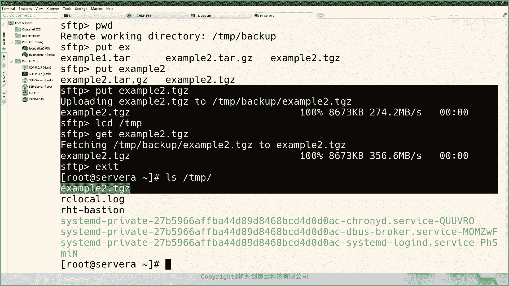
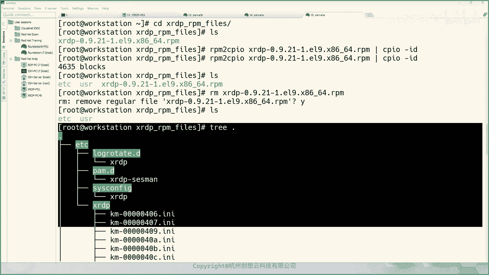

# 红帽认证系统管理员RHCE 9.0（2023年最新版）-6 - P1 - 杭州创想云教育 - BV1n94y1B7EB

啊啊啊，啊啊啊啊啊，啊啊啊啊，啊，啊啊啊啊，啊啊，啊啊啊，啊啊啊啊啊啊，啊啊啊，啊，啊啊啊啊啊啊啊啊啊，啊啊啊啊啊，啊啊啊啊啊啊啊啊，啊啊，慢慢的给我啊啊啊啊啊啊啊啊啊啊啊啊啊，啊啊啊啊啊啊啊啊。

啊啊啊啊，好我们开始上课啊，OK那么嗯，好嗯，咱们今天的话呢就把H24呢就结课了啊，然后今天是后面的一共四张啊，那么13张对吧，然后归档传输文件啊，第14章软件包的管理，第15章如何去访问和查找文件啊。

最后一张诶只是一些给大家一些什么呀，这个获得一些帮助的一些一些内容啊，所以说我们今天的内容重点的就是第13章，14章和第15章啊，这三章内容好，那么咱们先回顾一下啊，呃周四晚上的内容啊。

嗯咱们这是第三周，第三周，我们回顾一下，好那么咱们上周四都讲什么内容啊，那首先有介绍了这个日志的这一块是吧，哎日志的这一块啊，来日志，那么日志的话呢我们主要的是什么呀，要掌握掌握我们日志的架构对吧。

哎日志的架构，那就是我们所谓的在哪里呢，在挖下面的啊，look这个目录里面每个子目录都代表什么含义啊，嗯然后接着呢又介绍了如何什么呀，来查看我们的配置文件啊，查看我们的r cs log的配置文件。

对吧啊，以及如何呢去查看我们的，查看我们的这种cs log日志啊，OK这是日志这一块，然后呢又学习了信用日志对吧，哎信用日志，那么系统日志呢介绍了以及他的查看方法，对吧啊，使用什么general啊。

CTL命令去查看，以及如何将日志持久化存储啊，虚化存储啊，这日志的这一块啊，呃那么后面呢又学习了如何呢，去干嘛呀，去设置系统的时区啊，时区啊，这个这个时间对吧啊，这样的一个概念啊。

还有这个NTP的后端啊，NTP客户端啊，以及对应的命令啊，啊第三个知识点的话呢则是什么呀，使用一些类似于IP啊，对吧啊，S啊啊这样的命令啊，来查看网络信息啊，网络信息啊，还有使用NMTI以及NMCLI。

进行一个简单的网络管理，啊简单的网络管理，OK诶又介绍了如何使用什么呀，host name c p l啊，以及谁啊，NMTY啊，来干嘛呀，更改系统的主题名，啊主机名OK诶。

还介绍了一些文件注入etc下的什么呀，POS啊，还有这个etc下的，And resolve，怎么感觉写出来怪怪的，啊没有没有没有没有那个E没有E，可哎这些文件啊，已经这是我们上周四晚上的知识点啊。

那么按知识点来说，那东西就不多了啊，啊因为我们在上课期间还要啰里啰嗦，讲些其他的一些细节性的东西对吧，那么单纯说命令什么的，其实知识点非常少啊，非常少，OK嗯好接着呢我们再来什么呢，再来介绍一下这个好。

我们来介绍一下什么呢，我们开始今天的内容啊，今天的内容，今天的话呢我们开始该讲该讲什么呀，该讲这个第13章了啊，13章了啊，OK第13章啊好，那么我们来看一下第13章的内容啊，第13章的内容，Ok。

呃第13章的话呢，主要是给我们介绍了三个支点啊，一个第一个支点呢是啊，如何呢去使用time令啊，然后呢将我们的文件呀对吧，文件呀或者什么呀，或者是这个啊，比如说嗯这个目录啊，往前一个归档啊，以及压缩啊。

然后呢这个第二部分的话呢，则是利用S的协议啊，协议本身啊，然后呢啊它有一些其他的研制的一些命令啊，然后呢啊安全的在不同的系统之间啊，来传输文件，那么第三个部分的话呢，则是啊这个将本地的文件或目录对吧。

和远程服务器的副本的做一个同步啊，同步OK好，那么我们首先看第一个知识点啊，第一个知识点OK那么第一个知识点的话呢，就是介绍了一个所谓的什么呀，cam0啊，他命令，呃那么他命令这个命令本身呢。

我们其实不能把它当做压缩命令来理解啊，OK不能当做压缩命令为A理解，为什么呢，因为他的命令本身呢它是指的是存归档唉归档，那么所谓归档呢，就是说将多个不同的文件或者目录，把它整合在一起啊，整合在一起。

OK对吧，它和压缩其实没有直接的关系啊，没有直接关系，OK那么常见的话呢，我们可以使用它命令里面的杠C啊，来创建我们的归档啊，C呢是创建我们的归档啊，啊那么我们在使用期间还要跟上一个选项。

就是杠FF呢就是来指定你的归档的文件名啊，OK好，那么我们来举个例子，唉现在呢我呢打开我的终端啊，打开我的终端，那么在我的终端当中呢，我去执行一些命令啊，我把这个字体呢尽量放大一点啊，放大一点可。

因为今天放，我竟然把这个字体调到，适合我们这种线上的课程的，一个一个一个一个情况啊，好那么SS一下啊，S s h student at worst station，OK那么这个演示的话呢。

在word station上，在4A都是OK的啊，这个没有什么差异性啊，这个和服务器的管理是没有什么太大的关系啊，好那么这边呢我再连接一个啊，好好我们来做个命令，那做个命令，我呢为了方便啊。

因为文件比较多啊，我为了方便呢，我干嘛呢，我就这个嗯用姓当中的一些文件来举例啊，好那么因为权限的问题，那么我这边就直接切换到谁的，切换到管理员了啊，管理员了，啊然后呢我们走一个命令啊。

唉他啊他哎然后呢杠CC呢是create创建，是创建一个什么样的存档呢，F啊，F呢必须要紧跟着我们的归档的文件名对吧，比如说写一个啊，写个什么呢，我就写个好example啊，一啊是文件名啊，点T啊。

然后呢再往后呢空格啊，后面呢唉这样紧跟着你的要归档的文件或目录，空格隔开啊，啊比如说我要存档的是user啊，share local user share啊，doc吧啊接啊，direct也好吧。

direct啊，这个目录以及还有谁呢，还有etc下的fs table对吧，哎那么这是一个目录吧，哎这是一个文件啊，这个文件啊，然后呢我开执行，那么在执行的时候呢，因为我们的这个啊写在存档的时候呢。

哎存档的时候呢，那么我们是从根目录开始的，他这个绝对路径，所以说呢我们在创建的时候呢，它会自动的帮我们把这个根目录呀，给它移除掉啊，把这个符号的移除掉了啊，好诶然后呢我们LS呢去看一下，哎。

你会发现呢这里呢有一个文件叫example一点T，那它到底是不是这个存档文件呢，我们通过file命令判断一下，来告诉我们是一个cut的一个什么呀，归档文件i pad一个归档文件，OK好这是创建归档啊。

那如果你是一个管理员，刚登录系统之后，看到有一个这样的一个归档文件，对不对，那么问题来了，那我该如何去啊，去干嘛呀，去看里面有什么内容呢，哎那么我该如何去查看呢，对吧，哎我们可以做这个命令他什么呀。

T呢就是list啊，T列列列举列举谁呢，列举我们的归档归档呢，example一点，它大家就能看到里面有什么样的内容了，啊就是展开啊，查看查看，好嗯然后呢接着我们继续啊，继续嗯，嗯然后我们来看一下什么呢。

我们来看一下这个文件啊，呃刚才呢我们也通过TGTF呢去查看了啊，那如果我想给它干嘛呀，给他展开怎么办，展开的话呢，我们命令是TP啊，杠什么呀，杠什么X啊，展开的单词啊。

extract的单词XF展开一个文件，那哪一个文件呢跟上我们的存档，这时候呢我们的归档文件呢，会自动地将文件呀展开到当前的目录，OK当前的目录，如果呢我们想把它展开到具体的某个位置。

那么可以使用它杠XF啊，在展开的时候加上一个选项，大写的字母C啊，然后呢后面跟上一个目录，比如说我就举一个谁呢，比如说我我展开的这个这个我展开到哪里呢，我展开到mt吧，这是一个空的目录啊。

这时候呢我们再来看一下mt哎，就会存在一个这样的文件哎，那么反过来，那如果呢我利用ca命令，将系统的一些关键文件做了存档，哎，那相当于备份了吧，对不对，然后呢我我可以干嘛呢，我可以直接把它干嘛呀。

在存档的时候呀，就是用绝对路径啊，当我需要还原的时候呢，我就是用类似于这样的命令啊，使用大C选项啊，把它展开的根目录下面是不是就还原掉了，对不对，哎就可以还原掉啊，这是好，我们介绍的展开啊，展开。

OK那么这个是展开到指定位置，对吧，那么你说无加C，我又想把它展开展开到NT可不可以啊，也是可以的，那么你就先切换到你的工作目录到mt，然后呢再使用它杠X命令，那么后面呢就跟上你的存档文件所在的位置。

对吧，绝对路径，那写一下就展开到当前目录了啊，也是OK的啊，也是OK的呃，那么这是他命令本身啊，但是呢他的话呢刚才提到了它只是一个什么呀，归档唉归档，但是呢更多的时候呢我们为了节约磁盘的空间。

或者啊节约我们在使用网络传输的时候啊，节约我们的带宽，哎我们也可以将文件进行一个压缩，注意啊，压缩的是文件啊，文件这里的文件不是一切接文件的文件，就是普通的文件，它不是目录，OK那么可以使用哪些命令呢。

比如说我们可以使用JSP啊，BZBZ不to，还有一个叫XZ，哎我们可以使用这三个啊工具进行压缩啊，那么他们使用的命令如下啊，K，啊压缩命令如下，那么支持比如说使用这个G啊，ZIP后面跟上一个文件名啊。

那么这是什么呀，这是创建压缩文件，啊然后呢解压呢是GUNZIP啊，跟上一个文件，因为这个文件默认的压缩之后呢，它的文件名啊叫什么呢，叫做JZ啊，唉那么就是解压文件，那其他文件好，我们来试一下啊。

试一下啊，我呢现在呢同样LS一下啊，LS一下呃，我呢为了方便啊，我再复制一份文件过来，我复制一份，比如说啊mt报吧啊，到当前位置，然后呢我呢把这个MTABLE呢做一个压缩啊。

然后g z IP m table，如果呢我我我用这个GZIP去啊，压缩这个USR这个目录的话，它会提示你它是个目录哎，就忽略掉了，那么就不会去创建这样的一个压缩。

OK所以说我们提到的这是支持只支持压缩文件，啊这是我们的示例啊，好实例，那么同样下面的两个命令也是一样的，一个效果啊，那么在施工当中啊，生活当中呢也是一样的，那么b c IP to啊。

b zip to后面跟上一个文件啊，那么是用来创建压缩文件，然后呢BUNZIP图，那么后面跟上被压缩的什么呀啊，文件进行一个解压啊，进行解压好，那么Z的话呢则是什么呢。

则是啊XZ跟上一个文件名是用来压缩啊，然后解压呢是UNSC分成一个文件名啊，这是这是三个压缩软件包啊，压缩工具，那么这三个压缩工具的压缩率是如此的压缩率，那么从小到大，从小到大，放心大到小吧，压缩率啊。

从大到小，那么是XZ的大于b zip to beito的呢，大于我们的谁呀，这个GZIP哎，甲这是三三个之间的一个关系啊，但是呢这时候呢我们发现一个问题啊，那么这三个工具呢直接压缩。

但是呢他却不能够压缩，目录上面的这个time命令呢既可以管理文件，也可以管理我们的目录，但是呢却不可以干嘛呀，却不可以进行一个却不能够啊这个啊压缩哎，那么这两个这么两个部分唉，我们能不能给它干嘛呀。

进行一个合并呢，哎当然是可以的，那么在他命令当中唉，可以使用杠Z选项啊，来代替谁啊，来代替这个BUN啊，BASI啊啊，sorry啊，TZP啊，然后呢小写字母J呢又来代表的是b z to啊。

b y two啊，啊然后呢大写字母J呢代表的是我们的XZ，哎那么我们假如说啊，假如说我们干嘛呀，假如说我们这个OK假如能创建啊，一个啊使用哎接啊zip压缩的啊，压缩的啊文件啊文件，那么压缩谁呢。

哎压缩一个我们的这个，那么我们的这个压缩的压缩的文件压缩的啊，目录是谁呢，是我们的，比如说是我们的user share doc对吧，那如果是这个命令，啥呀啊，User doc，啊如果是这个命令。

那么这个文件那么我们该怎么做呢，哎那么我们的命令啊就是哎这个T杠CZ哎，C呢是创建一个归档，Z呢是个压缩啊，然后呢后面跟上我们的什么呀，存档的文件名啊。

然后呢我们就起个比如说是example to点它来，这是一个归档，因为我们归档之后呢，又干嘛呀，又压缩了，所以我们手动啊还要加上一个谁啊，压缩的后缀GZ哎。

JZ再往后呀写上什么user share doc，那这样去写就可以了啊，就可以了，好那么我们来试一下是不是这样子啊，好那么看杠CZF啊，example2点差点GZ啊。

然后呢user share bc走起啊，那么这个时候呢，我们的本地啊就增加了一个EXCEALSY，这个地方后缀我写错了，我刊物一下啊，啊没事，我的我重命名就行了。

因为一切皆文件嘛啊他这个虽然我后缀写错了，但是不影响啊，不影响，好改一改啊，唉就变成了这样一个文件啊，这样一个文件，当然了，你也可以这样写啊，就说我把这个二合一踏和GZ52合一型。

TGZ可不可以也是可以的啊，那就这样子TTZ也是可以的，所以呢这里的example to on文件那都是正确的，OK都是正确的啊，都是正确的，这是zip啊，JYP为为例啊，那那这个合并的话呢。

仅限于他命令和JIP的合并啊，那么basip who xz的话呢，不可以这样合并，就是按照这种语法去分开啊，去分开啊啊，啊去分开，这是啊文件命令语法，然后呢如果解压呢解压的话呢，这时候呢就分两种情况了。

你可以直接使用它命令本身的展开功能，去展开啊，因为它它内置了压缩嘛，它是支持的，当然了你要为了效率更高，那么你可以直接加上一个谁呀，加上你之前压缩的时候的那个选项啊，Z唉，然后跟上那个Z啊。

然后跟上你要解压的文件，比如说差点GZ就可以了，A是解压啊，解压，就这么来用的啊，那么解压，解压并什么呀，展开存档啊，压缩啊展开，那么就这样一个命令啊，OK大家明白否，OK有没有什么疑问的。

只是举了一个例子啊，其他的用法都是一样的对吧，你你你用b z to了，就跟上把Z换成谁吧，大家小写的J对吧，那如果你要想创创建一个更高的压缩率的文件，那么你就创建一个大写字母J对不对。

OK好大家有没有问题啊，如果没有问题呢，大家呢扣个一啊，TCZF的源文件是哪一个源文件，就是你要解你，你要原文件就是你后面的这个呀，我这个创建的真的，这个就是原文件吗，你要将谁压缩存档。

那谁就是原文件啊，那这是个目录啊，这是一个目录，嗯然后还有没有其他的问题，啊没有问题扣个一啊，好那么接着呢我们往后啊，往后我们压缩的目的呢其实就是为了干嘛呀，就是为了我们的空间的一个节约啊，一个节约啊。

那么呃更更重要的是我们可以用来做备份，唉，做备份啊，那么备份的话呢我们肯定不会做备份，在本地，是不是你在本地你系统坏掉了对吧，哎那你的数据不是一样丢失吗，哎那么我们可以把它备份之后，唉。

把它这个传输到另外一台LINUX服务器上面对吧，那么这个时候呢就需要我们干嘛呀，把这个数据呀安全地传输到另外一台服务器啊，那么就需要我们学习第二个知识点了啊，如何呢在性之间的进行安全的传输文件啊。

那么要想在系统之间的安全传输文件的话呢，我们需要使用的一个工具呢叫做SFTP，在real8之前，我们还有一个工具呢叫SCP啊，C p，但是呢CP呢是一个比较古老的一个工具了啊。

那么在当前的这个复杂的网络环境当中啊，那么显得有点不安全啊，所以说呢哎就升级使用了SFDP，不再使用sap了，OK那么sf tb的话呢，它是一个s h server端的一个子系统。

这个我们可以在配置文件当中啊，去看得到这样一个信息，在s h server端啊，server端的一个配置，OK是SD对吧，打开看一下啊，这里面呢我们倒着看啊，在第几行呢，在我们教育环境当中的。

这个文件的124行有这么一句话叫做啊，subsystem sFTP哎，后面的指向了一个服务器SFTP啊，那么它的使用方法呀，基本上和这个FTB服务器的命令行模式，差不多啊，支持那些命令。

但是在登录的时候呢，却使用的是什么呀，SH的语法去登录的啊，他们是二合一嘛，二合一啊，S呢就是secret shell啊，安全的啊，利用S的协议啊，FTP那么它是一个语法比较简单的啊。

用来传输文件的一种一种一种一种服务器啊，但是呢它不可以替代我们标准的FT，FTP服务器啊，OK那么那么我们怎么做呢，那么刚才我们在SERA上呢，创建了这么多的压缩的文件对吧，我现在呢想干嘛呀。

我现在呀想去这个在SB上，哎，在SB上，然后呢我创建一个目录，比如说在tap下面，我创建一个back up啊，我准备将我刚刚的这个server a上面的文件给它，复制到哪里呢。

复制到这个这是server40SB啊，唉我想把我的文件给它，复制到我的这个server b上面，把这个文件那么怎么去复制呢，哎我走一个命令啊，SFTP啊，那么root at server b唉就可以了。

那如果呢你想直直接到达目的地，那么你还可以跟上一个路径啊，冒号tap下面的谁呀，back up还是可以的，还是可以的啊，我这里呢为了演示的更多啊，我的路径啊就到谁呀，根目录的tap，我们来看一下效果。

回车啊，回车啊，然后呢输入yes，第一次连接啊，好然后呢输入对方的密码对吧，你说我们不让用root对吧，那你可以干嘛呀，哎这个配置一个密钥认证之类的，是不是哎呦，想起来了，好像我们前面章节里面。

SERVB配了禁止root用户登录啊，然后呢只允许密钥登录，对不对，那么这样的话呢我们只能干嘛呀，呃看一下这个啊，这里面还没有诶，那么不那么我们的我们的文件私钥在谁呀，在所有的加VA里面应该是，没有吗。

有的呀，诶，哦想起来了，我们当时配的是WORSESSION，不对不对不对，我的我都记不清了，咱们上次配的时候是哪个用户了，这个理念吗，那这个里面也没有啊是吧也没有啊，那么怎么办啊。

那我只能回到sorbet的配置文件了啊，看看是不是啊，诶没有啊没有诶，这是初始的状态呀，诶那我我这边为什么情况，我再我再登一次，R e d h a t，哎，宝哥重新改一下密码啊。

R a d h a t p a s s w d，刚刚s p d i n root啊，好这时候呢SORB被改了，然后呢我这边再连一下，诶，什么个情况，再检查检查，允许入登录吗，留在这儿啊，这里写的有啊。

OK是不让的啊，然后我们给它改为yes，好有意思啊，大家练习的时候用普通用户等是最好的，因为九上面安全措施做的，还是比八上面要好一些啊，好然后呢，这边再来一下，That a hat，哎可以了是吧。

哎你会发现它会提示我们干嘛呀，连接到了server b的哪个目录呀，camp目录啊，tap目录，那么这个时候呢，我们可以通过LS命令来查看server b上面的对应，目录下面的文件情况啊。

然后呢通过CD啊也可以进行切换啊，那如果我想看本端的呢对吧，我想看SLA项的呢，那么怎么办呢，L l s local command，第一个L啊，local的意思啊，回车就能看到本地了啊。

还可以使用LCD切换好吧，都是可以的啊，好然后呢如果不知道了，那么可以通过help来获得帮助啊，就可以通过help来获得帮助啊。

好啊，我先把那个地方给它拆下来。

啊然后呢接着呢我们去干嘛呀，我去啊啊这个通过LS呢，我看到了这个有非常非常多的文件啊，然后呢我准备把这个文件呢给他干嘛呀，复制到SB的back up里面啊，我现在看当前在哪里啊。

当前在tap的back up里面，然后呢我要上传i put an example，点TDZ哎，上传上去了，那么我们终端切换到SB，我们来看一下啊，CD到tap下的act up是不是多了一个文件。

Example2，点TGZ是不是上传上来了，对不对，哎非常方便啊，那么反过来，那假如说我本地呢在4A上，我想把这个文件下载到我SERA的tap目录里面，怎么办，LCD本地的type啊。

然后呢去下载get example，二点PGZ，唉，然后呢结束了退出啊，excels type诶，会发现本地呢也有一个这样的文件，是不是非常的简单，同志们，好大家有没有问题，如果没有问题。

扣个一啊，如果是目录的话呢，其实你也可以直接呃，你也可以直接去拷贝的，拷贝的啊也是可以的，但是我们一般这个这个SFTP的话，就是个交互式啊，那么CP因为不能用了吗，哎不能用了，所以说就那个什么了啊。

就就不再介绍了，然后你像如果是上传上去个目录的话，那就加一个选项杠R啊，杠R啊，好大家没有问题的话，那就扣个一啊和一，好咱们都没问题了啊，那么咱们接着来讲下一小节啊，第三条线啊。

如何在啊系统之间啊安全的去同步文件啊。

同步文件OK嗯那么首先要注意的是，那么我们的r sync这个命令啊，它是一个cs架构的啊，这和我们的SS是一样的啊，既要有客户端的软件呢，也要有服务端的软件，那么r asset的这个bro的话呢。

它的命令啊和这个包是同名的啊，是同名的啊，并且呢啊并且呢这个唉你要先安装还安装，而我们的教育环境当中啊。

这个这个是装过了的对吧，我们可以走下RSYNT保下啊，是有这个命令的，然后呢SB呢RXYN哎也是有的，唉有的话，那就意味着就能用唉就能用啊，那么怎么用呢，那么对于我们的这个ASSIC命令而言。

它有以下几个选项，我们看H的，你看一下，啊非常非常多啊，那么常见的几个选项我们来看一下嗯，比如说杠V来显示详细的信息啊，杠V啊，然后这个杠Q呢是这个干嘛呀啊，这个不显示这种非报错消息啊。

嗯然后我们常见的有这个杠UOK杠U，杠U的话呢就是代表的是什么呀，代表的是这个更新唉，更新啊，增量的同步啊，它只会啊你在同步的时候呢，它会和目标的文件进行比较，发现如果啊本地的文件和什么呀。

远程的目标是不一样的，那么就开始进行同步，如果一样的，那就不去同步啊，呃如果是目录的话，那我们加一个D啊，DO嗯，然后这个还有什么呢，L链接对吧，执行巴拉巴和多选项啊，P呢是选项啊。

权限的权限这样信息啊，有没有写出来啊，我记我印象我是没有搞的啊，没有写啊，OK那么这个这个选项的话呢，大家可以呃，我后面把它加上来吧，来稍等一下啊，我再加一下。

我把这个常见的几个选项给它加进来啊，OK这是常用的几个选项啊，杠R递归目录啊，然后呢杠L呢是链接，啊然后呢杠P呢是权限啊，T呢时间戳G呢是阻O呢是所有者啊，D呢保留设备啊，一般我就是用的是R选项会多啊。

加个R吗，递归对吧，加个U对吧，加个U是什么呀，是那个更新还是更新啊，那么我们来感受一下啊，感受一下嗯，还有一个呢这些选项你都不想写的话呢，你还可以用A啊，A啊，所有啊啊那么我这边给大家举个例子啊。

举个例子嗯，然后呢我呢同步呢，谁呢，我同步呀啊这两个文件啊，这两个文件我们来看一下有什么不一样啊，啊since sink啊，r sink杠U啊，更新R呢是递归，我们没有目录嘛，就不用加R了啊。

A啊所有好，然后呢我一般还喜欢加一个选项，叫大写字母P，大家这么P的话呢，可以帮助我们显示进度条啊，进度条啊，我要拷贝的是example2所有的文件，那然后到哪里呢。

到root at server sa b的这个这个哇啊，这个time下面的set up啊，我要拷贝到这个目录下面好回车输入密码认证，你会发现在同步的时候呢，它只同步的谁啊，example2啊。

点差点GZ，而没有同步excel2点TGZ，因为这个文件时间我们已经传输过去了对吧，那传输过去所有的就不会再同步了啊。

这是给大家举的这个例子啊，非常非常简单吧，他这个cs架构的服务端和本地都要有。

OK都要有啊，好大家有没有问题，啊没有问题扣个一啊，没有问题扣个一。

啊然后呢大家呢看一下钉钉群里面啊，我给大家发一个截图，那个截图呢是我们这一章的实验啊，给大家10分钟的时间呢把它敲一下啊，10分钟的时间啊，把这个时间的敲一下，OK听完之后啊，听完之后的话呢。

在群里面说一下啊，如果呢你听完之后最好是如果允许的话呢，你最好呢是把这个完成里面的这个命令，执行之后的结果截图发到群里面啊，省得有人这个投机取巧偷懒啊，这个这个不桥实验啊，敲完之后呢。

最好是把这个完成的lab open的结果截图，发到我们的定义群里面，好吧好，我这边倒计时10分钟啊，好，那么因为有个小伙伴把这个截图发到群里面了，啊，其他也抓紧时间，Ok，就这一个人做完了吗。

其他人都没做吗，OK没有做的话，下去之后要做出来的，好那么我们接着继续讲了啊，接着讲了，读完了没有，同志们啊，然后做完之后可以休息了啊，我们休息再休息个10分钟，Ok，好又来了一个啊，唉按照要求截图啊。

不然我要检查你的内容啊，好我们休息个10分钟，咱们稍后再继续啊，继续，休息一会儿啊，休息会给大家放个音乐啊，啊啊啊啊啊啊，I don't wanna dio na na na na nio，啊啊啊啊啊。

说了不少铁路，不敢不抓铁路。

啊啊啊啊啊，啊啊啊，Bba ba ba ba ba ba ba ba，冷暖的理由，OK我们继续上课，继续上课，我们接着来讲第二部分的内容啊，那么安装和管理我们的软件包啊，那么这张非常非常的重要啊。

非常非常的重要，Ok，都回来了吧，我们去上课啊，去上课，呃第14章章啊，刚才我们提到提到了，那么是非常非常重要的一章啊，那么因为我们在有一个啊干净的操作系统之后，啊对吧。

是不能够用来为这个外界群服务的是吧，要想丰富里面的功能啊，就需要安装一些软件啊，安装一些软件，OK啊，那么这张的话呢是第一部分呢，是给大家简单的，非常非常简单的说一下这个洪涝账户的问题啊。

这个这个绑定对吧，然后第二部分的话呢，就是我们介绍如何利用rpm啊，然后呢来查看我们信当中的一些包的信息啊，第三部分的话呢则是利用DF命令呢，去安装和管理软件包，最后一部分的话呢。

是如何去使用第三方的软件仓库啊，这是这章的内容好，那么首先呢我们来花一点点时间，给大家来介绍一下这个红帽的订阅啊，这个了解一下就行了，因为我们的学员，大部分人是没有用红帽的订阅的啊，这个简单知道行了啊。

嗯那么这个地方的话呢是这样的，就说那么我们的企业啊，那么企业啊或者个人组织之类的啊，那么是可以免费的去使用红帽的所有产品的，那是可以免费使用红包所有产品的，OK诶但是呢我们知道。

那么在企业级的业务当中啊，那么呃有一个稳定的环境的支撑对吧，以及强大的一个一个保障是非常重要的，OK那么这个时候呢我们就可以选择红帽订阅啊，订阅啊，它是一种服务啊服务，那么根据自己的情况呢去订阅啊。

那么他的订阅也是分socket的啊，分socket的分节点啊，socket这些信息的对吧，具体价格的话呢，大家可以去啊去咨询这个洪涝的销售人员啊，因为我们是上课啊，不是洪涝的销售合作伙伴对吧。

所以这个东西大家听一听就行了啊，嗯也是给大家找一个比较稳妥的途径，OK当然了，你用的也不一定是洪涝对吧，那么我们学完这门课之后，你只要用的例如是CTOS呀，奥马LINUXC啊对吧。

国内的open欧拉呀哎等等，这些系统都是可以用来管理的啊，没有任何的太大区别啊，没有太大区别，OK当你订阅之后的话呢，那么你就可以在你的系统当中啊，去启动官方的软件仓库啊，启动官方的软件仓库。

那么为什么要启动官方的仓库呢，不用第三方的呢，因为官方的仓库呢是提供质保的啊，它的IP包呢在安全性和稳定性上面，都是非常优质的啊，非常优质的，OK嗯以及我们在使用这些产品之后呢。

如果后期出现了什么问题对吧，也可以去提交一数到红毛的啊，这个支持平台上面去去做一些啊支持啊，都是非常方便的，那么订阅这块呢我们就跳过了啊，就不介绍了啊，如果因为你如果用到用到红包产品，那么订阅的话呢。

它是有一个步骤的会告诉你的啊，我们这里就那啥了啊，就跳过了吧，好那么我们来看第二节，第二节的话呢是啊，来介绍如何去使用rpm包和rpm的命令啊，两个部分啊，呃那么是这样的。

那么在我们整个的操作系统这一块呢，我们知道windows linux两家为主是吧，OK那么除此之外呢，那么除此之外啊，我把这个标题写下来啊，第14章，第14章，啊那么除此之外的话呢什么呢，除此之外呃。

在LINUX这块呢做服务器的啊，那么主要的还是两家为主啊，主要是两个版本为主啊，一个呢是就是服务器啊，服务器的C的LINUX操作系统，那么主要是两个阵营的啊，一个是flora，你可以理解为写多少啊。

然后呢一个呢是DMD的B，然后呢这说分支啊，分支当然了，这样说是不准确的啊，不准确的对吧，那么如果按照IP roll的话呢，其实到方便啊，那么你像PDA里面的分支，那么就是谁呢，那么我们就知道了。

那么一个是CTOS对吧，CTOS或者ctos steam，啊这样一个产品对吧，还有一个呢就是鸿蒙商用版本啊，real real是real啊，不是red hat，是real啊。

OK那个red hat linux呢，红帽已经不再发行了啊，OK我们现在用的是real啊，red hat enterprise linux啊，那么以dB为主的话呢就比较多了，也比较多啊，比如打败啊对吧。

U班图呀对吧，求右边图是商业的版本啊，商业的OK啊，是要也是红模一样对吧，你需要购买一些服务的啊，购买服务的啊，这是这些为主的啊，然后除此之外呢，其实还有一家啊，其一家不知道大家有没有听说过啊。

是叫SUSER啊，Ser s l e，啊SUSER旗下的，Linux 2server，好企业级的啊，那么简称SLE啊，简称SLE，Ok，那么这是主要这些的啊，那么你像这个FLA阵营的和SUSAN。

那么这些用的都是R平包，啊SER咱们用的都是rpm，Okay，嗯然后呢U班图的啊，这个DIY的分支的话呢用的什么呀，用的是这个the bd b的包啊，DB的包，这是他们这两个阵营啊。

主要的是包的一个区分啊，一个包这个区分OK啊，那么对于我们的rpm包而言啊，rpm包而言，那么rpm呢其实就是什么呢，就是红包的包管理器，Ok，对它一个缩写啊，这个缩写，那么它是干嘛呢，将诶将这个啊。

将这个应用程序吧，妈啊程序啊，那么按照安装在什么系统中的位置，进行一个什么归纳，啊归档归档啊，然后呢形成了一个什么呀，形成的一个软件包，哎这些包，所以说你如果把IP波展开。

你发现它和我们前面学习的他命令是一样的啊，里面是目录结构，哎木书结构啊，当然了它不是纯粹的啊，不是纯粹的一个啊，这个这个归档包啊，里面还包含了一些原数据信息啊，比如说啊这个封装包的作者啊。

作者以及这个版本的一些啊，比如说他的版本啊，架构对不对，唉这个等等这样的信息啊，以依赖关系啊，都是也有的啊，都也有的啊，它是一个归档，但又不完全是一个轨道，可以这样理解，OK那么这个包长什么样子呢对吧。

红包的包长什么样子呢，它的架构呢，基本上呀和我们的PPT上的这个图里面都是长的，是一样的啊，它包含了四个部分啊，四个部分啊，那么第一部分叫名称啊，就是软件包的名称，比如这里的crow什么UTA啊。

就是我们的软件包的名称啊，然后呢再往后呢这个8。32呀是什么呀，是它的版本号啊，版本啊，版本啊，然后呢再往后呢这个31。129呢，是他发个版本号，那么这个翻译方向号是从哪来的呢。

这个方言版本号呀是红帽啊，从上游拿到一个包之后，比如说呢叫做什么呀，COROUTILS杠R8。32，他把这个包呀干嘛呀，这个做一些啊调整啊，修改之类的，那么修改之后呢，它会形成一个IP包的源码包啊。

叫什么source点RPM啊，source点RPM是个源码包啊，源码包K长什么样子啊，我们给大家找一个，k rpm看rpm换的还是范达TM。

有一个这样的一个网站啊，哎我把那个。

把它关一下啊，哎我们搜一个，比如说就是刚才row your health，那我去搜一下搜一下，啊你会发现这里面有非常的多哎非常非常多，看下面有没有源码包，嗯嗯随便找一个吧，I在这里。

你看来大家看一下这个页面啊，你看我们的这个CORE utils的话呢，它的源码包叫什么呀，叫做源码的，ITM叫cos812，什么巴拉巴拉SRC点啊，pm看到没有后缀，还有一个谁呀，后缀还有一个SRC哎。

后缀还有个SRC2，是不太一样的啊，是不太一样的，Ok，啊是不太一样的啊，那么呃我们一般来说，要么就是一般来说，我们思路是要想构建rpm包啊。

这个大家下来之后呢，感兴趣可以了解一下一种呢是哪一个源码，然后呢自己去创建一个rpm的这个目录树结构，然后呢去干嘛生成相关的依赖等等啊，另外一种呢就是直接的去下载他的，SRC的这个IP包。

然后呢直接去编译啊都行，然后最终都会形成一个什么打包好的IP包，那么红帽子其实也是这么玩的，哎那么把源码包或者是什么的啊，然后拿过来刊物一下，看看有没有潜在的漏洞，是不是啊。

哎或者说什么需要修补的补补一补，是不是呢，然后呢就发行了唉就发行出来叫release版本啊，红包是提供质保的啊，然后呢后面的这个119，那么发行版里面积119，说明我们这个包呀。

适合安装在real9这个版本当中啊，OK那么在后面有个架构，那么这个架构的话呢，说明我们这个包呀是安装在X86架构的，64位操作系统上面啊，呃除此之外呢还有一些什么NO AR哎，不分架构的对吧。

A二十六十四对吧，arm架构，64位的等等啊等等都有啊，要区分这个架构啊，架构，你像64位的X86614的系统的话呢，它支持安装X八六十四的啊，I386I686啊，还有这个什么呀啊。

NO arch的包都是支持的啊，都是支持的，OK嗯然后呢，我们系统当中默认都是有rpm这个命令的啊，那么呃我记得是从real瑞尔几来着，嗯real5点几来着，是默认是系统自带的YM啊。

哎在早期的版本里面是只有RPV0的啊，是只有rpm命令的使用，IBM是红帽企业版那个操作系统，包括以前的red hat linux啊，都是内置的，有一个这样的一个工具的啊，都是有个这样的工具的。

嗯那么这个工具呢，相对来说呢是一个低端的工具啊，那么我们可以用它来，主要是现在呢我们拿这个rpm的命令，主要是干嘛的，主要是用来这个验证我们系统的一些包信息的，这是它的主要使命，而不是用来装软件包的啊。

大家要注意他的这个角色的变化啊，哎那么主要是用来验证这些包的信息的啊，包信息的，那么我们在验证的时候，命令呢就是RPM杠Q查询啊，查询OK但是呢只用一个Q的话呢，功能太单一了啊，太单一了。

所以说呢我们更多的时候会干嘛呀，结合线其他选项，你看我们下面的这个表格啊，然后QIQAQL巴拉巴这些命令啊，这样命令都是可以结合的，哎结合的啊，OK嗯，然后我们这个命令我们后面会给大家来演示啊，会演示。

OK我们来给大家感受一下，感受一下，比如说呢我现在去下载一个软件包，啊啊啊我我先一个一个来演示吧，比如说嗯比如说我们走的命令啊，RBM杠QA，那么这个命令的话呢，是用来列出我们性当中所有的安装的软件包。

OK那么回车看一下非常多是吧，有多少个包也装了，装了589个包啊，装了589个包，OK那么接着呢我们一般会干嘛呢，将来我们学习到GRP命令的时候呀，我们一般会使用管道符。

然后呢去和grave meeting呢做一个组合，来帮助我们查询一些关键词，看看嗯系统当中所有的软件包呀，哎是否有包含我想要的那个包，有没有安装，对吧，比如说我想看有没有安装HDPD，哎如果为空。

那就没有安装对吧，哎我想看一看有没有安装什么呀，S h server，哎搜索到了说明就安装了，是不是哎就这么简单啊，就这么简单啊，那么来筛选七当中的BROCC哎，啊信息OK查看已安装的包，OK啊。

那么那么有的时候呢，我们可能会遇到一个这样的情况，就是说比如说呀哎我们来到ATC下面啊，这里好多好多的文件，是不是好多好多文件啊，比如说哎这个比如说这里面有一个文件呢，叫谁呀，叫做update dB。

点CONFIG是吧，哎这个bro是谁来干嘛呀，去生成的哪个软件包安装之后生成的呢，对不对，哎我们可以去搜一下啊，怎么搜呢，RBM杠QF啊，去跟上我们的这个文件名啊，凑齐啊，哎这个包找到了。

哎原来这个包呀，这个配置文件呀，是有m locate这个软件包来提供的，那就意味着我们后面这个，如果这个包被破坏掉了对吧，这个文件呀被破坏掉了，那么我们可以重新去安装MLOK的这个软件。

就能够重新生成I重新生成啊，这查看什么呀，文啊这个软件啊，文件的啊来源啊，文件来源，啊来一遍，OK诶然后呢接着啊，接着假如说呢我们从这个这个这个呃，我想看一看啊，我们当前这个安装的某个软件包的版本。

比如说我想看一看我们的open SSL server的版本，那么可以QRTM杠Q啊，然后呢后面跟上一个什么呀，比如说open啊，SH杠server啊，软件包的名称啊，就能看到了，那么我们装的版本呀是8。

7P1这个版本，OK查看我们包的一个版本，啊茶包的版本是吧，嗯那么如果我们又想获得这个BO的详细吸，那该怎么办呢，对吧哎这个时候我们还可以这么玩啊，还可以这么玩，哎做个命令rpm加QI啊。

然后呢跟上我们的名称唉，就能获得到这个信息信息了啊，你看这个包的名称版本8。7点P1啊，然后发行版本是8。119啊，然后呢架构是吧，安装的时间是啊，唉然后呢这个属于哪个组吗，不属于啊。

哎然后大小许可是吧，BSD的啊，伯克利的这个许可，嗯然后这个这个这个，哎然后签名对吧，哎然后呢它的源码包安全包是吧，构建的时间啊，在哪构建的是吧，X86的一个VM55。

红帽的一个专门来构建系统的一台机子上面啊，构建这个软件包的机子上面啊，然后呢这个谁封装的是吧，哎厂商啊，然后呢这个pro的官方网站啊，然后汇总信息描信息啊，都是能够看得到的啊。

通过rpm杠QI来获得详细的信息，啊某信息OK哎那么问题来了呀，那我这个包装完之后对吧，到底把这个包都放在哪里了呢，啊rpm杠QL啊，刚QL就能够看到这个BROXZ安装的时候，到底装在了哪里。

q l list列出唉，这种路径就出来了，来展开啊，查看还有包啊这个安装的文件啊，文件对吧，然后你说我这个现在不关心这个文件啊，我现在只想去修改它的配置文件，但是呢刚做完之后呢。

我不知道它的配置文件在哪里，那么使用CQC啊，CONFIG来查看唉就能找到它的配置文件了，看这里面有个自定义的是吧啊，这是我们培训里面，应该也不是，这个红帽给我们装的一个配置文件啊，子的一个配置文件。

好就这里了啊，就在这里了，OK好，然后接着啊，那装完了那个那个我我我，我知道配置文件在哪里了，但是我不会去配啊，我要找找帮助，是不是啊，哎找找帮助有没有什么例子之类的就更好了。

哎那么我就跟上一个G把C换成D啊，doc文档啊，文档文档告诉我要想去查看这个呃，这个这个里面有非常非常多的，哎我们发现这里有个卖手册第八章的对吧，还有一个第五章的唉，就可以获得帮助了。

啊这个是配置文件啊，这个是什么呀，帮助文件啊，那基本上都这么多啊，基本这么多嗯，然后呢突然有一天呀，我从互联网上去下载一个软件包，哎去互联网上下载一个包，呃，我们找一个吧，哎找一个找一个找一个啊。

哎呦我这个上面还没有，因为没联网啊，没电话怎么办呢，这个我就在网上找一个吧，那找一个啊，找一个，比如说呃我想找一个什么包呢，啊我去EPIL仓库当中吧，清华的也可以比较快的是吧，找一个，嗯你有。

还是cs走原来的吧，app pd来了好，好看这里哎我们是一九哎，我在九里面呀，我去下载两个包过来啊，Everything x 866 14，然后包找一个XRTP，嗯然后走走啊，这个包啊。

我把它拿下来复制呃，直接点击一下吧啊，然后呢我给他上传一波，我们的环境，啊对这个不让不让不让不让他这个这个，好然后换挡load里面吧，我把这个包呀给他，复制过来一下，诶过来了，过来之后呢，我干嘛呢。

给他再上传到我们的环境当中。

OK啊，然后这个CD到download里面啊，然后SFTPSFTPXINT啊，x r DP s cos啊，那个那个那个那个root at sei，我这次给他谁呢，我弄到word station上面吧。

啊因为WC是图拉界面的啊，WC的java里面，put sr DP好呃，然后我们这边重新再打开个页面，SH呃，这个root at vation啊，进来了，哎是不是有一个这样的文件包，对不对。

唉我从互联网下一个包，唉我想我想安装啊，在装之前呢，我们建议啊，你从互联网上的bra不要轻易的去干嘛呀，去安装，我们建议查一下，怎么查呢，rpm杠Q什么呀，杠Q啊，杠Q的话呢跟上一个P啊。

P的话呢是bro软件bro啊，然后呢后面跟上一个软件包看一看，那么一看就告诉我们了，这个bra警告了他说这个包呀，他的这个签名的头部信息，用的是这个ICHS256的签名，那么所需要的一个公钥的ID呢。

是32284667C啊，才能验证我们这个包有没有被签名，但是呢提示NO key，哎，就是你的姓当中没有这样的K那怎么办呢，那这时候啊互联网上哎我们需要啊，就需要我们去来到这个网站上去找他的公钥。

一般都会有一个公钥的啊，那么这里面有个RPMGBGK619哎，我再下载一下啊，要我我直接给它复制出来一份吧，这样我就不用下了啊，不用下了啊，我这边手动给它复制下来了啊，你直接去下载也是可以的啊。

哎那么这个的话呢是谁呢，叫rpm杠啊，JPG来杠七杠EPEL啊，NEPAL9暗示这个文件啊，把它拿下来，好好保存并退出啊，那么怎么办呢，我们可以手动的去导入一个公钥啊，然后呢rd m杠什么呀。

杠杠import导入啊，然后呢rpm文件走起，这个时候呢我们走个命令，rpm gq a去grape下谁呢，我们grape啊，这个编号看有没有这样一个公钥，唉是不是我们安装好一个公钥就装好了。

唉就安装好了啊，装完之后呢，我们再去检查一下我们的这个包就被通过了，那么有有一个公钥，那么就意味着我们不是相对来说是比较安全的。

OK这个地方大家是否明白啊，明白扣个一扣个一。

啊这个是没有公钥，唉，没有数字签名啊，啊然后呢，接着我干嘛呀，导入同样，哎导致供应对吧，哎验证是吧，然后之后呢哎通过签名是吧，哎通过签名啊，这样的话呢就基本上是安全的，但是呢不绝对啊。

因为互联网上出现过类似的事情啊，有两个例子，一个呢是有一个LINUX方言版叫linux minute啊，它的下载页面呢被黑客篡改过啊，篡改过啊，然后下载的文件是不是原不是官方的啊，被篡改过的版本。

还有一个呢就是U盘图的啊，软件商店里面啊，里面有很多的那种SNP的包啊，这些包呢是游戏啊，什么2048呀啊，什么这个这个这个别踩黑块呀，啊这种这种游戏啊，这种小优秀优闲游戏。

都是同一个开发人员去开发的对吧，那么我们知道，那么这个公钥呢，其实跟我们上网的时候的这个什么呀，SL其实性质是一样的对吧，都是pk的一种，那么目的呢就是说一个受新的机构给一个个人。

或者是一个团体或者企业的去颁发的，那么通过这个私钥呢，是放在这个开发人员的手里面的对吧，公钥呢是做来做验证的，他开发完成之后呢，用自己的私钥啊做签名对吧，然后呢第三我们用户呢使用公钥呢来做验证。

通过之后呢，一般来说呢我们就可以放心使用了，那么在U盘图上呢，这个发生了这个事情呢，就是说这个开发人员呀，他是一个正经的开发人员啊，就是通过正规的手续呢，去拿到了一个数字签名啊，他开发这些软件。

然后呢用商店呢也都通过了啊，又通过了，但是呢用户呢这个小白可能没发现啊，但是一些专业的人士呢发现诶做完之后呢，发现计算机呢好像和以前不太一样了，那么通过源代码的加追溯。

发现里面被嵌到了一个非常非常小的代码，这个代码干嘛呢，就是挖矿啊，让你的计算机呢成为矿工里面的一个部分，OK那么就意味着我们的IPL包也好，其他的包也好，里面可能会嵌入一些不太友好的东西。

那这种情况下的话呢，我们该怎么办呢，是不是哪怕这个开发人员是刚才我举个例子啊，他是受信任的，但是我们现在是通过了呀，那万一这个包里面有什么什么信息怎么办，这时候呢我们可以这样做啊。

那么检查rpm包当中是否存在啊这种脚本啊，脚本，那么我们可以走这个命令，那可以走这个命令诶，什么命令呢。

叫做这个，呃我们可以做一个命令叫什么呢。

叫做rpm杠Q杠杠SCRIPTS啊，然后呢我们走一个后面跟上我们的这个包，啊因为包没安装呀，还要加一个P啊，加个P，那加上一个PO，好那么来发现看一下，你看这里面有非常非常的脚本啊，那么这个脚本的话呢。

里面其实无非分成了四部，叫做pre install p r e啊，install安装之前啊，然后呢这个还有什么呀，post install安装之后还有什么呀，pray uninstall安装。

卸载之前和post uninstall卸载之后啊，分成这样的四个步骤，那么这里面会有一个shell脚本啊，那么我们可以去看一看，这个shell脚本有没有什么不好的地方，哎不好的地方有些有有些没有啊。

那有的话呢那就要仔细观察了，有没有啊是吧，这个开发人员在原来的pro救之上，增加一些不友好的部分，看有没有是不是哎有没有，如果没有的话，那就说明没有shell脚本的一个加入啊，加入，那么当然了。

还有一种情况呢，就是说还有一种脚本呢叫触发哎，啊是否包含这个其他类型的脚本，那这个脚本我们因为除以触发啊啊脚本啊，那么我们可以走这个命令叫trackers啊，PM杠QP杠上TRI嗯，trier啊。

TIGGES啊，Trigk，然后呢跟着包头齐啊，这里面还有trigger的pro，是不是唉去看看有没有啊，同样检查完之后没有的话呢，基本上那你的这个包就没有太大的问题了，唉就没有太大问题了啊。

那么就可以去安装了啊，就可以去安装了啊，但是呢有不代表就是坏的是吧，你像这两个包就正经的包，人家就没有错误信息啊，那么这时候呢我们尝试去安装啊，好我们去安装啊，啊TM怎么安装呢。

杠I我们一般会加上个V啊，写写verbs对吧哈，希值哎跟上我们的包名称回车好，出问题了，出现什么问题了呀，他说呀你这个包呀没有依赖关系，唉没有依赖关系，哎，你需要有个依赖呀，是不是需要依赖啊。

需要一个依赖啊，OK那么这时候呢我们就需要找依赖了，那么这个依赖谁来提供的呢，一个呢叫tiger server menu啊，这个包我们姓当中是有的啊，那么这个呢level a m a level2。

so这是一个库烟呀，同志们，这个库谁来提供的呀，我们就不得而知了，唉所以说我们在抓RP包的时候，就会遇到一个这样的问题啊，依赖关系啊，依赖关系OK就没有办法去安装了，需要我们手动的去解决这个依赖关系啊。

啊这个依赖问题其实在windows里面却很很很少见啊，除非就是你安装了一些非正规的软件包，会见到的概率会大一点，正规的软件包基本上很少会遇到啊，或者说你装那个版本和你的系统，不是百分之百匹配的对吧。

比如你的包可能一些这个这个依赖关系是吧，没有解决，比如说我们可能在windows里面最常见的依赖什么呀，比如说到net套件的版本对吧，还有这个它的框架嘛，那个版本还有什么呀，还有这种各种什么啊。

C加加呀，这种什么2005啊，什么这种这种东西，大家可能有人也遇到过啊，也可能遇到过，OK诶这是这是我们说的这个信息啊，这是个信息，OK所以说呢我们要通过其他方法去解决啊，去解决好吧。

其实我们如果你知道这个依赖关系的话，也能装啊，但成本太高了，唉成本太高了啊，好那么接着呢我们再说一下，如何去展开我们的什么呀，RPO啊，啊如果你展开我们的rpm包，那么要想展开的话呢。

我们可以走一个这样的命令啊，叫叫什么呢，叫这个啊，比如说我们刚才这个命令啊，我给他展开一下，OK我为了展开呢，我就写个新的目录吧，写个rpm x r DP rtm杠什么health啊啊。

然后呢我呢给他干嘛呀，拷贝一份啊，到我们的这个目录当中好，我进来啊，给他展开一下，怎么展开呢，r p m to啊，CPLO啊，然后呢跟上我们的这个包，然后呢这个呢这是干嘛呀，给他，因为他是个归档包呀。

它只是一部分，然后再展开啊，Cp i o，啊CPLO啊，然后呢CPL什么呢，我们直接跟上一个选项的杠id啊，展开到目录里面啊，偷袭来你会发现啊，这就是我们展开的一个rpm包啊，同志们。

这就是一个展开的rpm包，你看到没有，它其实就是一个目录树结构，哎目录树结构啊，当它安装的时候呢，它就会把这些文件呀，分散在我们不同的目录里面，I分散在不同的目录里面啊，Ok。

啊就这样一个一个效果吧，啊一个效果啊，希望大家能够理解啊，理解好，大家有没有问题，如果没有问题的话，大家扣个一啊，扣个一，啊没有问题的话，扣个一啊，唉怎么又没动静了，是否有没有问题嗯。

嗯那我就继续了继续了，我就认为大家都明白了啊，好那么接着呢刚才提到了，我们在手动去安装的时候呢，遇到了一个依赖的问题，对吧啊，依赖的问题，那么因此呢我们这时候呀去干嘛呀。

去这个呃创建一个这样的一个什么呀，我们去给他这个是用另外一种方法啊去安装啊，去安装，OK好，那么就是我们第三节的内容了啊，如何使用DNF来做软件包的一个管理啊，Dnf，OK啊。

那么首先我们要知道一下什么是DNF啊，什么是DNF，OK嗯红帽的话呢是从REO5的具体那个版本，我记我记不清了啊，REO5的之后呢，开始使用一个呢可以自动唉自动解决什么呀，解决这个软件包的什么呀。

依赖关系哎，自动会解决软件包的依赖关系啊，啊然后呢唉这个简化来安装流程的一个工具啊，呃那么一个工具，那么这个工具叫什么呢，叫做arm啊，一样的啊，那么后来呢在我们的real8上面啊，RUA8上面。

那么开始呢使用啊全新的啊一样的工具啊，你可以理解的是版本三版本三啊，那么重新命名为叫什么呀，叫做叫DF啊，I d f k，那么在我们的real9上呢，同样我们在使用DF啊，来进行一个软件包的管理啊。

remember这个管理，当然了，你说我还想使用YM可不可以，当然是OK的啊，是OK的，我们可以走个命令啊，叫做什么呢，LSLSDOGLS杠L啊，Air style，然后呢，dollar口胡啊。

Which，一样，然后你会发现我们的YM是指向了DF版本三，哎版本三，所以说呢我们在入药九的这个培训当中呢，我们就啊使用DF命令的，来替换掉了原来的样啊，如果你你的毛病还没改过来这个习惯啊。

那么你还可以用YM本身啊，本身OK现在正是一个转变的时候，其实现在红包的官方网站呀，呃八的文档里面装软件包也都是用DNF了啊，就变成DF了，不再用YM了，哎都行啊，都可以啊都可以。

你可以理解为要么呢就是DF的别名啊，他就是个软链接啊，他没有做别名啊，OK那么对样貌而言怎么用呢，这里呢有几个常见的工具命令，大家来看一下啊，嗯那么这里面啊这里面你看有点复利，Help list。

Search info provid，对不对，这些命令其实和我们前面，rpm命令的功能都是一样的啊，功能都是一样的，我们都可以来用啊，都可以用来用啊，OK嗯说起来这个了啊。

你像你像我们在小yo的那个时代啊，其实很多的工具呢都集中在电影F里面啊，一样以前很非常非常多的啊，命令都被我们DF一个命令来替代掉了啊，我给大家找一找吧，比如说，B下面的谁呀样啊。

然后信号啊你要非常非常多啊，非常非常多啊，我加个L吧，你会发现你会发现我们的这个项目，本身是指向了DF啊，然后呢要么呢其他东西你比如构建依赖呀啊，配置我们的样本仓库呀对吧，然后调试我们的底单会呀是吧。

调试我们的RESPON对吧，还有我们下载器呀，还有YM的包，这个软件包组的管理工具啊，都指向了谁呀，电FUTOK，所以说以前的压膜啊功能比较单一，比较单一，不同的功能呢都有亚目不同的软件包来提供。

命令来提供，而现在呢都统一是由DF和DF，UTS来提供了，OK这个我想大家要知道一下啊，知道一下，Ok，了解一下就可以了啊，好，那么接着呢，我给大家来介绍这些命令的使用方法。

比如说呢我想看一看系统当中所有延安，我我我的我的我的这个所有的啊，我当前的系统啊，所有的可以使用的软件包有哪些啊，就意味着这些软件包的任意一个你去安装，它都会自动的帮你解决依赖关系，那作为班级依赖关系。

OK好，那么命令啊df list，啊好多是不是好多，那么这里面列出的信息呢有两类，一类是已安装的，一类呢是已安装的啊，非常多啊非常多啊，诶多到我都目接不暇了啊，你看我java less。

你看这个部分是in solid，是不是一个安装的，哎往下再找找啊，哎呀这个多少个包，要500多个包来着呢，搜一下吧，AVI啊啊valuable啊，AVAI啊，哎你看这里面是可用的包对吧。

是说明你下面的包啊是没有安装过的啊。

没有安装过的啊，好要么d f list列出来我们所有的软件包，啊那你说那我我我想看看已安装的包有哪些呢，对吧，我们可以加上一个死选项，叫做install li啊，这是已安装的哎。

已安装的加上in soli就可以了啊，INSTALLIE安装的，那我想看一看我，我我这个我想看一看我这个包有没有安装对吧，比如说QDBD有没有安装呀，哎已安装是不是哎已安装啊，哎我想看一看谁呢。

我的这个这个这个IP a server这个包怎么安装呀，有没有安装，没有匹配到吗，是不是，那既然没有匹配到，没有安装，那我的仓库里面有没有啊，是不是仓库里面有唉，仓库里面有啊，OK那么列出信息。

左边的是我们的包的名称和架构，中间是它的版本和翻译版本，右侧呢是它的仓库名称，哎仓库的名称啊。

Ok，啊这具体的啊具体的好吧，这是list list啊，但是呢我想我想装一个软件包啊，但是我记不清叫什么名字了啊，我想搜索一下对吧，哎OKDF什么search一下哎。

search一下搜索I搜索后面跟着关键词，比如说IHGVB看有没有PP吧，啊搜了好多是吧，那么他把关键词呀都高亮的给我们显示出来了，搜索啊，搜索DNF啊，Df search。

啊后面的这些命令都是子命令啊，DF是主的命令，这种search呀，install呀，都是子命令啊，子命令的话呢，其实你可以获得帮助的，比如说这个search你还可以跟上一个help，我们来看看行不行。

然后加上一个less search search可以干嘛呢，你还可以跟上很多不同的选项，看到没有，非常非常的多，唉非常非常多对吧，你看有什么呀，比如说啊这个这个举个例子，唉一个一个什么呀。

哦啊搜索所有的啊，搜索也搜索bro的描信息和UIL，因为这个信息可能会更加丰富嘛，哎哦然后还有些期的子命令没有，比较多啊，这个大家下去一个一个去看一看吧对吧，用到哪个再查就行了，不用每个都了解啊。

好我们可以走一个来，刚才那个加一个search，我们再加一个谁呀，哦试试，那加一个二，没有这个量就太多了，是不是啊，唉量多很多啊，当然了也可以这样搞是吧，我搜索出来哦，所有的哎叫什么什么关键词的。

比如咱们说的例子吧，所以所有是web服务器的，哎搜到有NGINX对吧，嗯关键词嘛，你看web server嘛对吧，NINX收到一个啊，HPD搜到一个是不是都有的啊，都有的啊，搜索啊搜索。

OK然后呢搜索到之后，比如说我们啊搜到了一个NGINX对吧，它上面写了哎呀，这是一个高性能的web服务器，可以做反向代理，那到底是干嘛的呀，我们我以前没有听说过是吧，我只知道这个HGBD。

你这个东西我第一次听说对吧，到底是干嘛的，我想看一看tf info啊，DF音号，啊NINX啊，I就有详细的信息了，你看这个命令是不是和RPM杠QI是一样的，是不是啊，QI是一样的，啊看来是一样的啊。

直播QA的话呢是查查已安装的嘛，那你要是没有安装的话，那就q q pi嘛对吧，P嘛包嘛，指定的软件包啊就行了，哎里面有详细的介绍，是不是哎info啊，可以获得详细的信息，好信息OK好。

那么接着呢我们来演示一下啊，演示一下，比如说呢我现在呀我我来到server a啊，server a呢，server a上面的话呢，我看有没有安装HDPD好吧，DF对吧，他说或者看看有没有NGINX吧。

DF啊，这个list installed ninx，没有说没有安装对吧，我们来安装一下dnf install nginx，那么我们第一次安装的时候呢，我们使用install命令，那么在安装过程当中啊。

它会提醒我们什么呀，会告诉我们依赖的关系包的这个名称，架构版本来源于哪个仓库和大小啊，开始安装啊，NINX啊，信息出来了啊，然后呢在安装的时候，它会自动解决一个依赖啊，然后做了汇总。

就说你想装的包和他自己要需要的依赖啊，依赖啊，一共是三个包对吧，然后呢下载之后呢大概占了639K啊，然后呢这个安装之后的大小呢是占用磁盘空间，那是1。8兆啊，问要不要安装对吧，Y安装N不要安装对吧。

数Y那我开始安装哎，就装就结束了啊，就安装结束了啊，你看开始传输检查吧，检查通过，然后呢开始测试啊。

测试也通过，开始干嘛呀，开始去安装了啊，安装了啊啊安装之后呢。

做一个汇汇总成功了，一定要看到complete，还要看到你这里的包有没有你想装的包对吧，别写了半天了，你写了很多个包啊，发现这边少了一个包，是不是，那你说明有个包肯定没装上去，哎没有安装上去啊。

OK那如果你的仓库是订阅的，那你还可以干嘛呀，通过DF去update会更新啊，去可以更新，但是呢这个更新的话呢，我这里面说两句啊，就说这个店铺啊update更新，很多人在软件更新的时候呢。

就是df update就没了，后面就让他更新了，OK那么其实我们在更新的时候呢，是这样的，就说我们应该呀先去看一看，我们希望当中哪些包有紧急的漏洞，然后呢去啊去更新，如果没有紧急漏洞的话呢。

要视情况而定啊，我们是按优先级来更新的，而不是亚麻P的所有的包去更新的啊，你压完了所有的包更新，有时候还是有危险的，有些东西啊啊尽量小心一点啊，尽量小心一点，OK也可以通过它去升级，比如内核之类的是吧。

装完之后呢，比如说我我这个不想不想用这个包了，哎我可以给它卸载掉啊，DF什么呀，remove are remove啊，就可以去卸载掉啊，你看它有自动的发，你安装的包呢又给你卸载掉了。

是不是无论是安装还是卸载，你如果在安装的时候，比如说我不想让我问我要不要安装，你可以加一个Y啊，卸载也是一样的，就不要问我了，我同意去安装或者卸载啊，就直接去安装了，OK好，这是给大家说的安装。

卸载和非交互式的安装以及卸载啊，某某我包哎，然后店或remove某某某，哎然后还有什么呀，你后面可以跟上，是否跟上，杠Y对吧，哎杠Y，啊这是命令啊，还要更新，啊更新啊，嗯那么前面举的这些例子呀。

都是单独的软件包，那么我们的系统当中还存在一些软件包组啊，包租，就比如说我们平常用微软的产品的话，那么它有个产品叫什么office对吧，i office啊。

office的话呢其实就是一个什么呀软件包组啊，里面包含了word excel啊，哎这样的一个软件包是不是，哎那么我们也有的啊，比如dnf group list啊，你会发现这里有很多个包呀。

是不是非常非常多啊，非常非常多啊，哎然后呢去查看我们的软件包组，啊这个boss管理对吧，比如说我看完之后哎呀我想干嘛呀，我想去啊这个这个这个呃，我想去这个安装一个开发环境对吧，哎开发环境啊。

我还找一找哎，这里面有一个什么呀啊developer tools是吧，开发的包，哎但是呢我呢我是一个什么呀，我是一个呃IPAM的开发人员，我想装一个IPM的开发环境包，哎我去装一下。

把df group什么样install，因为这个名字很长，有空格，我加上一个引号引起来哎就可以去安装了，哎就可以安装，你看他一次性就会装很多个包，哎非常非常多啊，我这里就不演示了啊，不演示了啊。

去安装一个某些包，啊就去装就OK啊OK啊，那么其实你发现这些命令，和前面这边都是一样的，无非就加了个什么呀，加了一个group啊，加了个group，OK好啊，那么在安装过程当中。

我们的所有的日志呢都是有保留的，都在了我们的挖下的log当中，来看看这么一个DF2pm的log，看一下，你看我们装了什么包，都是有记录的啊，都是有记录的啊，啊这日志啊，日志O好。

这是我们说的管理的一些命令啊，那么如果我安装之后我后悔了，比如说我升级某个软件包，我后悔了，对不对啊，比如说升级之后，发现没有我想象中当中的那么好用，我想我想回顾一下怎么办啊，我们可以走这个命令啊。

颠覆杠history，查看我们的历史记录啊，然后呢我们回退，比如说哎我这边呢这波操作我不希望去操纵，那我就是DNF，history么样撤销KINSTORYUNDO，撤销几啊，撤销制的编号是四啊。

撤销四的操作，那就撤销了啊，撤销啊，这是要给大家举了一个例子啊。

撤销我们的仓库操作，啊撤销操作啊，好这些大家有没有问题，有没有，如果没有的话，扣个一啊，扣个一，有没有问题，没有问题，后面扣个一啊，那么接着我们来看这个表格啊，这个表格大家下载之后自己可以试一试啊。

试一试啊，非常的非常的简单啊，明天一定要非常熟练啊，非常熟练，OK一定要一定要一定，一定一定一定要非常的熟练啊，一定要非常熟练，OK然后呢我们再来给大家介绍一个新的概念啊，叫模块流啊。

这个东西呢是从real8开始出现了一个概念啊，就是说我们我们的系real8开始呢，我们的系统当中啊，他在发行这个软件包的时候呢，它分成两个部分啊，我们这边用浏览器看一下。

大家更容易理解一点啊。

比如说我们的M9，DVD啊，DVD那么进来之后呢，这个呢就是我们的光盘里面的内容了啊，光盘里的内容了，那么在这个当中你会发现有两个目录啊，一个叫app stream，一个呢叫base os。

那base os，那么在这两个目录当中呢，都有自己的软件啊，比如apple stream里面有自己的包啊，然后呢被扫完S里面有自己的包，其中app stream我们翻译过来叫什么叫应用流，哎，叫应用流。

OK那么这两个既然区分了，为什么要区分啊，给大家来解释一下啊，这两个都是我们系统最基本的两个仓库，缺一不可啊，一定要切记啊，缺一不可，那么首先我们来介绍一下base os吧，base s的话呢。

它是用来存放我们操作系统比较核心的内容，那么它里面的软件包的生命周期啊，和以前real7啊，real6啊啊，这个时代那包的周期是一样的，变化呢比较小哎比较小啊，更加的就是一般我们在装系统的时候。

一定就会用到被4S里的包，OK然后呢应用流呢，应用流的话呢是一个新的一个概念啊，新的一个概念，那么它里面存放了我们用户空间的这些软件包，比如说数据库对吧，哎这种这样的包就在我们的应用流里面。

既然叫应用流，应用流，什么叫流啊，stream对吧，流嘛对吧，哎那么像水流一样，哎上游有什么变化，下游呢就立马就有感知了，那么对于我们的软件包而言，那么就意味着上游一旦发行了新的版本，那么对于用户而言。

就可以快速的去呃体验这个新的版本啊，那么除此之外呢，有的人可能就感觉到哎呀，那我的我用比如说我跑一个web服务器，会不会就意味着我的不算新了，会不会不稳定啊，那不用担心，为什么呢。

因为红帽虽然是他的版本，也是跟着上游变得快了，但是他也会经过一些测试，并且它会给我们提供多个版本，就是你可以选择你要用装用哪个版本的，你是可以选择的啊，哎以前七版本以前是没有这个东西的。

你就是仓库里面有什么包，你又装什么包啊，你你你你是不能选择的啊，那么应用流的概念出现之后呢，我们就可以去安装不同的版本了，I不到版本的是非常的方便的，哎不能方便的啊，OK哎那么在应用流里面的包。

那么是两种的，一种是我们传统的RPO，另外一种呢就是叫做模块啊，里面有个module的概念啊，MOJO的概念，OK你比如说我们这里我们来看一下啊，比如说我们的这个要么去搜索一下HBD。

那这个名称我们来info一下啊，YM啊，Info hdvd，来看一下，看一下看一下哎，他这个上面又变了啊，因为哦想起来了哎，我们real9的话，因为我们上课是哪个版本啊，是9。09。

0里面目前还没有开放这个流啊，就是说虽然有这个东西，但是呢那个模块包是没还没有提供啊，模块的包还没有提供，就是那个名字的后面有个module关键词啊，呃它的名称要比我们啊。

普通的rpm包的名字要长要长啊，没事这个东西我们将来应该会遇到的，如果咱们当中是有real8的学员的，他们会非常熟悉啊，里面会有这种model的包啊，我们九上面的话呢目前还没有推出来啊，推出来哎。

所以说呢这些命令我们也不用去记啊，压DFM就什么什么的，没有这个包啊，我记得是没有的，九上面啊，DNFMODULE意思想看有没有他没有空的啊，空的OK那这个这个地方大家就跳过就可以了啊，跳就可以了啊。

如果想体验的话呢，自己可以装一个八版本的啊，可以试一试啊，可以试一试啊，唉你看他那些命令啊，你看亚某某就list查看我们的包启用哪个版本的，移除我们的模块包，你说我这些命令我记不住，没事儿啊。

如果你的仓库里面有模块的话呢，你依旧可以使用我们前面的这些命令去安装，是可以的，只不过单纯的使用df model的话呢，它的功能性更更多哎更多啊，OK这是我们给大家介绍的这个软件，pro的一个管理啊。

管理好，那么大家呢教材啊翻到第几页呢，咱们real8的教材啊，你看看加加页数一数，大家把这个DF呢或者YM呢练一练啊，练一练，OK妈呀，这个，呃咱们书上的第482页，482页啊，有一个实验。

我看能不能咱们的环境，九的环境能不能敲啊，我先验证一下啊，唉不对，页数说错了，Sorry sorry，Sorry，不对啊，看错了啊，啊教材的473页，我先试一下啊，这个啊啊大家看一下我们的这个页面啊。

啊是D比二呢，是我们教材的第473页啊，具体方法呢大家看我们的图，我们的这个页面啊是这个命令啊，啊把大家呢把它敲一下啊，敲一下啊，诶然后呢我们今天上午呢就到此为止了啊。

然后呢我们下午呢再给大家来介绍如何呢去啊，启用我们的第三方软件仓库啊，请我们第三方的软件仓库啊，还有其他的内容啊，OK好今天上午就到这里，大家有没有问题，如果没有问题的话，扣个一啊。

让我知道你们学习的情况。

是不是都是挂着挂着，没有没有听课呀。

