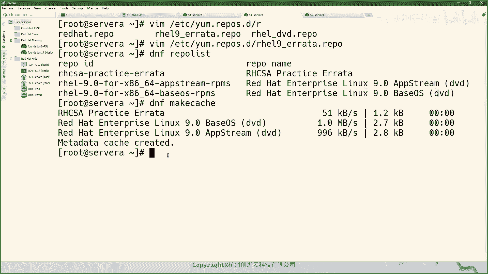
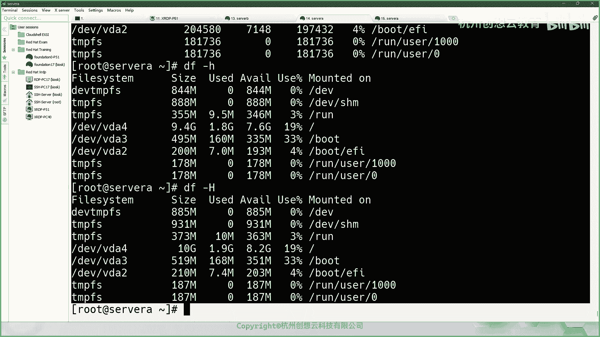

# 红帽认证系统管理员RHCE 9.0（2023年最新版）-7 - P1 - 杭州创想云教育 - BV1qj411Z7kE

牛逼牛逼牛逼。好，我们开始上课啊。开上课。呃，那么我们今天下午呢接着来讲第四节啊第四节。那么第四节的话呢是一个如何呢去启用DF的软件仓库啊，软件仓库OK。呃，那么是这样的，那么我们要想去安装软件的话呢。

我们的一个思路呢是这样的啊，那么给大家画一张图啊。把这个页面啊。啊，那么我们要想去安装软件包的话呢，我们的软件包来源于哪里呢？是不是啊？哎，那么这是个问题啊，那么我们如果用RPM的话呢。

那这个包啊那这个包的话呢，可以是本地的，也可以是在互联网上面的啊。这个互联网呃也可以是在一个啊文件存储里面都是可以的。那么但是呢咱们前面讲过啊，RPM的话呢，是。比较呃笨拙的一个方法啊。

然后在使用过程当中可能会出现一些所谓的依赖的问题啊，依赖的问题。那么所以说呢我们前面第一小节给大家介绍那个那个订阅，对吧？当你订阅之后的话呢，红猫有一个什么呢？有1个CDN啊，有个CDN。

红帽有个CDN啊，有个内容分发中心啊。那么在这个上面的话呢，它搭建了一个IP包的一个软件仓库哎软件仓库。那么我们的客户端啊，就是我们的这个一个台什么呀，比如说一台reo9的操作系统，啊。

那么就可以去使用啊，我们的这个CDN里的仓库啊，然后呢进去安装软件包，对吧？那么你像这上这是红帽商用的啊，那么对于我们而言，我们身边可能接触的还有一些其他类型的啊，比如说。阿里云里面的对吧？哎。

我们可能会用到什么阿里云啊，阿里云里面的有一些mirror。啊，R mirror其实这个性质是一样的是一样的。那么我们也可以使用这里的仓库呢去装。但是注意啊，像这种第三方的什么中科大呀。

什么阿里云啊这些啊，那么这里的镜像呢，它不是红帽的CDN，而是一般来说是谁呢？这种开放的啊，比如说它的什么e派仓库。哎，是一票仓库这种的啊，那么不是CDN啊，CDN是肯定是呃不行的啊，CDN是不行的。

OK一定要知一定要知道啊。呃，那么这种的话呢，一般这种的话呢都是一种公共的嘛，对吧？无论是这种商用的公共还是这种完全公开的公共的。那么对我们而言，这些我们肯定是自己是不需要的啊。

那么如果呢我们有订阅了啊，那么是可以这样来搞的明白吗？啊是可以直接用的。因为我们是红帽嘛，红帽的话呢，我们是推荐这个红色的部分啊，就是说我们使用订阅账号激活之后呢，利用我们PP的这个命令啊。

叫做叫DF manager命令，然后呢来选择启用或者禁用哪些仓库来使用O啊，或者说呢增加一些新的仓库都是O的啊，都是OK的。这个地方了解一下就可以了啊。那么对于我们而言啊对我们而言。

那么我们更倾向于是什么呢？更倾向于呢我们就是自己搭建一个仓库。OK我们说一下我们生产里面，那对于红帽而言，我们一般会怎么做啊，怎么做OK那么在生产里面的话呢，有两种方法。第一种啊。

那么还是要依赖于红帽的CDN。啊，CDN还要依赖用火帽的CDN，但是呢它又不是完全依赖啊，那么这个CDN呢会连接到什么呢？连接到我们公司的一个卫星服务器上面。啊，卫星服务器OK那么这个卫星服务器的话呢。

它可以把CDA的软件包同步到我们的卫星服务器上面啊呃卫星服务器呢上面就会有很多很多的IP包。然后呢，我们再通过卫星服务器干嘛呀？把这个软件包呀分发到我们不同的服务器上面。哎。

会分三分发到我们不同的服器上面，这是一种方法。啊，这是一种方法。但是呢呃随着发展，那么现在企业里面用卫星服务的器的公司没有那么多啊，没那么多。因为你要想卫星服务器的话呢，肯定要干嘛呀？

用红猫的这个产品嘛，是不是？对吧？因为红猫的东西并如国外的，那么可能有些网络因素而导致的，没那么快，那怎么办呢？还有种题的方案，你说我没有买卫星服务器能不能哎可以，哎，那么我搭建一台什么呀？

比如说HTDP的服务器，或者是什么呀？FTP的服务器。哎，然后呢我同样先把这台呢做一个订阅。订阅啊订阅对吧？那么然后呢干嘛呀？通过ymthink命令，将所需要的软件包给它同步到这台机子上面。然后呢。

在这台机子上呢去搭建一个外部服务器。或者是1个MTB服务器。啊，搭家好搭建好之后呢，把这个软件包和软件包依赖的仓库呃，依赖的那个数据库文件啊，那么全部呢存放在我们的这个服务器上面。

然后呢在我们的serv上面再去配置软件仓库的配置文件啊，然后他就可以去这里去拿这个包了。那么咱们这个的话呢是我们目前啊基本上用的比较多的，因为这个成本是最低嘛，对吧？当然了，不完全是CDN啊。

不完全是CDN呃，这个也可能也也也可以是你说我这个我把这个阿里云的这个e里面，一些包把它拿过来可不可以也是可以的对吧？因为我我我用的不是红包的，我用的是优盘图啊。

可不可以也是可以的啊都行都行方法呃这个思呃这个就是这个思路呢都是一样的啊，就是我们可以把一些包同步到本地对吧？你说我的包需求量比较少，就是光盘里的包就够了。那就把光盘里的包呢刻复制到我们的这个。

HDP或者是FTP上面。啊，FTB上面，然后呢再让我们的客户端去我们的其他服务器呢去使用啊，就是我们的一个软件仓库的一个大致的一个过程啊。那么在我们的教育环境当中的话呢，那么我们的仓库是谁呢？

就是我们的classroom。同志们就是classroom啊，那么我们在使用当中啊，我们我这我这边打开个浏览器啊，哎那么浏览器，那么在浏览器里面，那么这个链接就是我们reo9。0的仓库，那re耀9。

0的仓库。OK啊，那么因为我们的classroom上呢已经给我们搭建好了这样一个东西。那么这个简单呀，它用的就是一个他把光盘的东西呢拿过来了，那么里面还放一些呃练习的时候可以用到的这些包也有啊，也有。

这个是一个软件仓库啊，服务端啊，就这么来的啊，这么来的OK这个地方大家如果明白的话，扣个一啊，有疑问的话呢，就直接问好了啊。因为每次说有疑问先扣2再回答问题，也没人听我的。因为你你发个二，我能先看到。

对吧？等你一会儿，有的人就等巴拉巴拉啦等了打了好多字啊，我都讲过去了，好一会儿了，他字打完了，自己东西也没听到啊。反正方法大家自己把握吧嗯。那个有问题的话，其实说啊嗯没有问题的话，扣个一啊。

就是服务端软件包的服务端啊，就是要想安装。首先有一个这样的一个准备过程啊，但这个呢准备过程呢不在我们课堂的范围之内啊，给大家就简单讲一下这个思路O。知道这个这个仓库是从哪来的就行了。啊，要是没问题的话。

扣个一啊扣个一。好。哎，那么我们接着继续啊继续OK呃，那么我们今天学习的内容的话呢，就是什么呢？重点呢？就是呃如何呢去在我们的服务器上啊去使用一个现存的1个DF的一个存储库。这是我们今天的目标啊。

目标OK呃，如何搭建软件仓库的服务端呢，我后面啊写完我们的实验手册之后，我会分享给大家啊。O上面会有啊会有比我们书上更多的东西啊，这个会给大家分享出来啊，分享出来。OK呃。

然后这个我们先说咱们数让的方法，那么输让的方法的话呢比较简单啊，但是呢就是结果可能。不是太满足我们的一个需要啊，就是使用DFconfi measure命令杠杠艾re等一个什么什么哎去写一个这样的仓库啊。

通过是它是通过的这种一个方法啊呃，那么我这边呢给大家来演示一个，比如说。比如说呢我们的教育环境当中有一个这样的仓库啊，就这个以rata这个为例吧，那以rata为例。

那么以rata里面的话呢有非常多的包OK首先啊我们准备写啊写啊，怎么写呢？我这边啊在这里SH我用root server a吧。啊，稍微给大家演示啊，那么就DF杠什么呀？con啊啊，这个不能杠啊。

这个因为合在一起了，应该叫de呃config measure啊，杠杠I杠IOK然后呢，接着呢后面啊就加上我们的这个仓库的地址注意啦。那么这个地址到底该怎么写才是正确的。方法如下啊。比如说我们现在来到了。

这个re耀9。9。0叉8664IHCSA practiceice这样的一个目录当中，在这个目录里面有两个子目录啊，一个呢errata一个呢是谁呀？RHT它到底是写在哪里呢？是是正确的呢？

OK我们这样看啊，在我们打开这以rata为例，打开之后呢，你会发现这里面又有两个子目录，一个呢叫包，一个呢叫report仓库的数据。OK那么这两个包是干嘛的啊，这两个包是干嘛的？

那么pe edge的话呢，里面存放的就是我们各种各样的R屏幕包。OK各种各样的M包在这个包目录里面有没有子目录，我不关心O我不关心啊，我是不关心的，我也不考虑。

我只知道这个pe里面存放的是什么东西就可以了。然后呢，重点呢就是这个repo data。那么这个repo data在这里呢，它生成的是repo data这个目录里面所有BM包的数据库信息，还有依赖关系。

OK那么同样我也不关心啊这个呃这个里面是成什么样子的，我只关心我的路径在什么时候能看到这个repo data。当我能看到repo data的时候，那么当前的这个位置就是我们软件仓库的位置的结尾。

OK我们现在是不是在erra里面这个目录就就能看到这个reple data了，对吧？所以说呢我们的链接啊在写的时候呢，就写的谁呀？erra。OK就写了youra它啊。

啊，那么我们的地址呢就是这个地址了，把它拷贝下来。那然后呢我在写的时候呢，把这个地址呢粘贴过来。

哎，就OK了。啊，就可以了。

啊，关于这个写这个地址是怎么找的，大家明白的话，扣个一啊，这个非常重要。呃，如果你会了的话呢，以后你无论是用到红猫的任何的linkux发音版本，都是能够正常的写出来的，都不会出错。

你要记住我这句话就不会出错啊，你要是觉得无所谓。那你肯定会写错啊，肯定会写错。O。

啊啊，OK这个地方明白了？扣个一啊。那么因此呢我们再找到其他的，比如说我们找这个谁呀，找DVD这个是吧？那么DVD的话呢路径写到哪里呢？哎，不是到DVD就没有了，而是找下面app stream。唉。

我看到rebo data了。那么哎这个仓库地址呢就叫apple stream啊，然后呢另外一个 base。哎，我看到rebo data了。那么路径呢就是到beOS。R到倍XO。呃。

这是我们的内容啊这个内容啊。啊，接着呢我们啊写好之后呢，这个文件去哪了呢？我们去看一下啊呃，我这边为了记笔记呢，放在切换到终端啊。好，那么这时候呢我们来到CD到ETC啊y点IEQ点D。

那么在这个目录当中就是来存放我们的谁呀，软件仓库的配置文件的。啊，这个目录啊是用来存放我们的配置文件的。那么接着我们来看一下这个里面会有一个非常非常长的名称。

那这个名字呢就是我们刚刚使用命令生成的一个文件。我们文件前面无论有多长，它的后缀呢一定是以点IPU来结尾的。啊，一定是以REPU来结尾的。啊，里面一定会有一个什么什么什么啊点RQ小尾的文件。

那么这个文件呢就是我们的仓库I仓库。好，那么因为这个名字比较长，那么我们在使用的时候呢，给它干嘛呀，给它改一改名字啊，move一下，再改成什么呀？我们改成RRTCSA。啊。

RRTCS下划线PRAIPPRATICE杠1RATA点IPO啊，这个改下名字。啊，这样会短很多。然后呢我们再打开看一看。啊，看起来是不是很乱，对吧？我们再来加工一下啊，给它改的非常的舒服，好吧。

舒服IH啊IHHCSA啊，那么同样我把中国糊的东西啊给它改一改。啊，给他改的短一点。啊，就写这么多啊写这么多。好，呃，这个呢就是我们最终的一个形态了。那形态了OK这时候呢我们。里面内容就如下了啊。

那么我们接着干嘛呢？走一个命令啊，叫DFREPOLIST。字儿太多了，我对我这个字儿有点大啊，我稍微小一点。哎，我们来看一下，那么这个呢就是我们谁呀？这个就是我们刚刚使用命令生成的软件仓库啊。

生成了一个软件仓库，这个就是。啊，然后呢在这个里面有个软件包。我们来验证一下有没有啊，我们先。去看一下，在这个里面有个包呢叫做IH谁呀？CSAscript或者叫IHT system。

我们来搜一搜有没有这个包。啊，EM啊DF吧啊search2G杠ct。哎，是不是有这个包，对吧？并且会告诉我们呃，这个是干嘛的？是一个备注信息啊，我们看它来源于哪里DF啊infer andT杠。C上吗？

啊，然后告诉我们这个来源于哪个仓库。啊，就完成了就完成了啊，这个呢就是给大家介绍的一个什么呀？简单的一个来写仓库的一个方法。啊，方法是不是很简单啊，这是方法一啊方法一。那么第二个方法呢是什么呢？

使用啊VM编辑器。啊，编辑器啊来创建一个什么呀？创建1个IQ文件。啊，我建议大家呢一定要会会使用这种方法啊，会使用这种方法啊，那么要想会写。

那么我们要研究一下这个仓库里面的这些内容到底是什么含义是一定要懂的。所以说呢我们现在呢带大家去写一个啊，写一个啊，我把这个RHCSA呢这个删掉啊，删掉，然后呢，我们重新写一个。那么写的时候呢。

我们通过V扬编器呢去写一个名字啊，叫是IHCSA。啊杠什么呀啊，我这次改个名字吧，叫IHre9吧，叫什么呀？叫ERRATA点IPO。啊，因为这里的名字其实显示的没有那么重要啊，就它没有实际的意思。

那么主要目的呢就是让我们能够肉眼识别啊，这个文件是干嘛的啊，是办法的。OK接着呢在里面有关键内容。首先中括号中括号里面写的什么东西呢？中括号里面的话呢。

是书写的是我们这个软件仓库的ID我们也把它翻译过来呢，叫做这个仓库的名称啊，好，那么写个RHCSA什么呀？PRAI。SEC啊practice啊 C practice。啊，然后呢这个什么呀刊物对吧？刊物。

把这个看能不能复制过来啊。系。啊，这样写啊，我我写个好一点的嘛，好听一点的IHCSA杠。practice杠er写个统一点啊，呃，这是我们的一个名字啊。那么按照红帽的写法呢，就是前面还要写版本，哎版本。

我这里就写简单一点啊，这是reple IDD啊，这个这这个中末糊的意思啊，然后呢接着写个name，这个name的话虽然表面上叫name啊。但是呢我们在理解的时候呢，把它理解成什么呀？这个仓库的一个注释。

啊，是个解释信息啊，备注okK那么就是IHCSA的一个什么PRATISE。我感觉这个单词写错了PRAAC啊，sorry，果然写错了。看看能不能拷贝过来。哎，太棒了，还能考贝啊。啊好。

然后呢这个practice啊E什么呀？RRAATA。哎ERTA啊，然后呢接着呢重点来了，我们要写一个叫什么叫baseUIL。那么这个baseUIL是干嘛的呢？这个是用来写上去我们软件仓库的地址的啊。

那么的地址呢刚刚呢就是这个地址把它拷贝下来。啊，拷贝下来。然后呢，接着呢我们再写一个叫什么呢？叫做呃这个这个呃GPG。CHECK等于个谁呢？等于个fi是吧？哎哎，刚才好像用命令就没有写呢。

在我们刚才在写命令的时候呢，它是有这么一个选项啊。有一个这个选项叫什么呢？叫inabboard。啊，是否哎，这个是默认的，又有啊。哎，我们写个GPTt吧。唉，sorry，这个地方。什么？

呀右边注文输入法啊。那我换行了啊。啊，看行了啊，OKGBE check啊为faels啊，fas或者说引报呢为真啊，那么这个是一个默认值啊，这个是默认值OK然后呢接着就可以了。

那这是我们手动去写的一个内容。啊，写内容啊。如果如果我们在写的时候呢，把这个GBGcheck打开了，就是我们在安装软件包这个这个仓库里的包的时候啊，包的时候我需要去检查签名。

那么我们就需要把这个GB check呢改为谁呀？改为t。然后呢，还要附带一句话叫GPGK。然后呢，后面跟上你的K的位置。哎，你的ki什么呀，地址啊，UIL的地址是要跟上的。啊，跟上你的UL的地址的啊。

我们这个这个仓库里面它没有啊，所以说我们就没有办法写啊。你像我就跟这个什么呀，就跟我们上午大家有印象吗？上午的时候我给大家是不是找了个一配仓库。对吧，上午呢我给大家找了个一票仓库，是不是啊？哎。

就相当于这个路径。哎，就相当于这个路径，你把这个路径呢写在那个GBGK里面。

啊，你像呢这个路径啊GBGK里面放在好吧，哎，放在GBGK里面啊，然后就可以了。它在安装的时候呢，会干嘛呀？去自动的去导入啊，检查这个软件包的有没有公钥。如果没有呢，你就按照你的GBGK里面的地址。

直接导入我们的系统一个公钥。

啊，到时公要OK我们这个里面没有啊，所以就把这个GPEche的改为fis了，你自己搭建的就可以不用检查啊。如果是公共的，一定要检查啊，这个地方明白了吗？扣个一啊，扣个一。好。

那么我这边就继续了啊继续了OK。好，写完之后呢，我们就可以通过这个命令了。我们可以做个亚母啊，这个这个什么呀啊，我们这个我们在U版图里面可能是APTupate。在我们这里的话呢。

我们就是y母re list一下。看看我们的仓库有没有出现啊，然后呢再走这啊这个同意一下吧，走DF吧啊DF啊去看一下有没有。然后呢，DF什么呀，在DF1个这个makeCACHE啊，创建一个缓存啊一个缓存。

哎，怎么404啊，呃，可能是解析不了那个con奈吧。给MPL。哎，能解析呀。404。我看一下我的那个地方视频。这个有问题。哎，我怎么写到包这里来了？啊。是不是啊你起到包的你肯定不对呀。啊，然后呢。

那个t哎就OK了。那么我们的缓存呢就创建出来了。那么我们后面在使用的时候呢，就可以直接去安装里面的包了。

啊，OK好，这是我们给大家演示去写我们的仓库。啊，就这么简单啊就这么简单。这是我们的内容啊内容。O。好，然后既然大家说的没有问题了，那么。哎，大家呢自己。写一份好吧啊，写一份啊。

那么那么咱们的任务呢就是什么呢？任务啊，我发到钉钉群里面。啊，钉钉群里面，那么找到我们的errata。和什么呀？和这个一个安示器的一个仓库。啊，然后呢。那么写在哪里呢？啊。

写在我们的这个呃起名叫做什么呢？叫做。啊去CSA点IPO的这个文件当中。好，然后呢给大家10分钟的时间把这写完。写完之后呢，截图发在我们的钉钉群里面。啊，10分钟啊。🎼Yeah。🎼Yeah。Yeah。

Yeah。OK咱们继续啊继续。他们。大家要积极一点啊，然后好多小伙伴。结合。不是很积极啊，只听不练，笑一点半啊。OK好，那么咱们接着来讲第十5章啊十5章。第十5章呃。

我们的知识点就没那么复杂了啊没那么复杂了。OK那么我们的内容呢呃是什么呢？呃，给大家来介绍一下，那么如何呢去呃识别我们系统当中的这些设备啊，到底是怎么命名的对吧？然后呢，第二部分的话呢，就是。呃。

如何呢去挂载我们的文件系统啊，第三部分的话呢是查找文件啊查找文件。那么在这里面最难的呢就是这里的一个fin啊，这个是最难的一个知识点啊。好，我们来首先来看第一部分啊，第一部分识别文件系统和设备。

那么这个地方的话呢，我们呃主要是给大家介绍什么是文件系统以及。啊，这个所谓的挂载点这样的一个术语啊一个术语。好，那么我就以文字的方式来给大家编写边描述啊。我们的第15章啊。那第十5章O。呃，是这样的啊。

那么首先我们来说说文件系统。啊，文件系统。那么文件系统的话呢，它是干嘛的呀？啊，首先我们要知道文件系统是干嘛的啊，那么文件系统的目的呢就是用来什么呀？是用来隔离的是吧？啊，文件系统的目的呢是用来隔离的。

哎隔离的okK然后呢用来存放数据，对吧？那么常见的常见的文件系统有哪些呢？啊我们windows上面。对吧NTF是吧啊，移动设备。移动设备的话呢，一般就什么呀？一般的话呢这个设备的格式呢就是谁呀？

N这个这个这个FAT32，还有一个叫ESFAT是吧？啊，这两种格式。然后呢在我们的linux上面啊，那么常见的格式有哪些呢？有这个EST4。那E4的啊，然后呢这个还有这个betFS。啊。

云F现在还不是主流啊，我们就先不管它了。写上去吧，BTRFS啊比吹FS还有什么呢？还有这个红帽现在正在推的啊XFS。啊，这是我们常见的。哎，常见的这些文件系统格式啊，文件系统格式OK。嗯。

那么其中对于XFS的文件系统而言呢，它是我们的real7之后默认的啊。real7开始默认的文件系统呢就是XFS啊，它是一种扩展的啊日志型的文件系统。啊，日之行啊一个一个文件系统。啊。

是个扩展的日志性的文系统。你像液T4的话呢，也是一种扩展的。哇，无线系统啊，但是呢是有所区别的。那么你像我们的你像这个你像我们的EST4啊，这种无件系统的话呢，它更加的什么呀，更加的。

适用于啊这种机械式硬盘啊。啊，然后呢我们的XF的话呢是更加适用于固态硬盘啊。他们在设计的时候呢，对这些设备呢都做了一些优化啊优化。那么更有一个让人比较兴奋的一个东西呢，就是从re19开始。

我们也支持ESFAT。哎，这就好了呀。比如说你的对吧？你你公物当中可能接触的系统既有mac，又有windows，还有linux，还有移动硬盘，但你又完全可以用这个ESFAT了。全部用为都支持啊。

都支持啊EXFAT所以会让人很兴奋的一件事情对吧？啊，非常兴奋啊O去支持的啊啊，然后呢，但是啊但是在对于我们的linux而言啊，那么要想去访问我们的文件系统，你不能够像windows一样啊。

windows一样打开你的资源管理器就能看到什么呀啊，文件管理器啊，那么就能看到什么呀，就能看到你的这个呃这个各各种盘符是吧？啊，C盘呀，D盘呀，E盘呀，然后双击进去呢，就能够存放或者读取数据了。

那么在我们的linux里面不是这样的。那么在我们linux里面的话呢，我们可以把这个文件系统啊当做一个什么呀。当做一个盒子。啊，各个盒子你是不能够直接去啊这个这个往这个盒子里面放东西的啊。

你要想放东西的话呢，干嘛呀？你需要和另外一个另外一个盒子呢给它做关联啊，另外一个盒子做关联。然后呢，你在另外一个盒子里面放东西呢，就相当于把把我们数据放进去了。OK呃，那么按照我们系统里面来讲的话呢。

就是说啊用户啊，用户。不可以像什么呀？不可以啊不可以像我们的这个。啊，像这个这个什么哎windows一样啊，windows一样啊，直接呢干嘛呀？直接向啊这个文件管理器啊，中看到的盘符中。啊。

盘符啊中的是什么呀，这个这个这个这个这个设备啊，来进行一个存装数据。啊，那么需要。干嘛呀？将文件系统和啊这个一个什么空闲的目录。然后空的目录都行啊，空享目录干嘛呀？关联起来。啊，关联起来，然后呢通过对。

该目录进行什么呀？读写操作。那么就相当于。哎，就相当于。干嘛呀？对。关联的什么呀？文件系统。进行读写操作。啊，就相当于做了一个这样的一个事情。OK做一个这样的事情啊。好，那么大家那么这个过程呢。

我们称为什么呢？这个过程啊将文件系统和目录关联的过程。那么称为什么呀？称之为是这个挂载啊，挂载。OK这个是挂载的这个概念啊，我们是这样来总结的啊总结的啊。好，嗯，明白的话，扣个一吧。哎，如果没有问题啊。

扣个1。好，有问题给我一啊。啊，这是挂载过程啊，那么问题又来了，那文件系统又从哪里来呢？是不是哎，文件系统又从哪里来？那么文件系统的话呢，是从这个设备或者是设备的一个分区。

那这里的设备呢就是我们的磁盘啊，磁盘一个分区通过特定的命令。他的命令哎格式化而来。对不对？哎，格式化而来。那么所以说呢我们要想去挂载，首先要有个文件系统，首要有文件系统呢。

首先要有一个设备或者设备的分区。按设备分区。那么在我们的windows上面呢，我们可以使用磁盘管理设备，找到对应的设备，然后呢去格式化去分区等等。那么在我们的linux上面的话呢，怎么办呢？

在我们linkux里面啊可以来到DV下面去找。那么这里的设备非常多啊非常多，那我该怎么去找呢？这里面并没有所谓的磁盘，什么什么，唯一的有一个dis是吧？我们来进去看一看什么东西。这是个文件看到没有？哎。

我们看了一下di看一下。😊，啊，sorry，这个这个来来到DV啊啊艾克里面大家看一下L。你看这里面有非常多目录啊，你看通过标签，通过分区的UID通过路径通过UID。那么我们来看一下by pass。

看一下里面什么东西。哦，这里面有非常非常的东西多，还有这些有一个word IO的设备啊，word PCI00003。哎，这个呢就是我们的设备名，这个呢就是我们的系统啊识别到的。啊。

识别到我们的我们的设备啊，然后呢这个呢就是它的什么呀分区了，你看12341234。啊，1234OK嗯，你说这个好像看不出来什么呀啊，难道我们就没有什么命令去来看我们的设备了？当然有的。

我们有一个专门的命令啊，叫做LOSBLK。啊，ISBLK通过这个命令呢，可以列出来我们系统当中所有的跨设备。OK看设备啊，或者是这样做啊，I4杠LDV下的啊所有，然后呢去找谁呢？

去找这种B开头的按B开头的啊，我们后面还没学到，但是我可以把先大家看一下尖角符啊，B。啊。来，这种设备也是可以的，block嘛？快设备哎，快设备哎也是能够看到的。哎，我们的这个这个什么呀。

刚才那个ISBLK呢也是能看到啊，都是一样效果去搜索B开头的关键词，哎，那么就能找到这些设备。

啊，就找设备。那么这些设备的话呢，我们来仔细观察一下，我们看上面啊，那么在我们S block的时候呢，我加一个路径吧啊，路径呢就是pass杠P啊。哎，杠P打印的路径啊，我们来看一眼啊，这里面的信息。

在这些信息当中啊在这些信息当中，那么DV下的VDA呢就是我们的磁盘。然后呢，这里的VDA1VDA2VDA3和VDA4呢，就是我们的磁盘的分区啊，然后呢，这些分区你看很明显。

后面告诉我们一个叫做挂载点啊啊，那么那个刚才我们给大家解释的时候，那么这里面不是提到了一个什么呀？提到一个目录嘛。对吧这个目录嘛，那这个目录呢就是什么呀？就是这个挂载点啊，你这个过程是挂载嘛。

挂在哪里了，挂载到这个目录里面了啊，这个目录呢就是挂载点啊，挂载点OK那么我们这里的话呢，挂载点就是一个目录了。你看这个VDA2呢，哎是bot的EFfiVDA3呢是botVDA4呢是我们的根目录。

根目录。那么很明显，按照windows的理解呢？这个就是我们的哪个盘呀？这个就是我们的这个这个这个这个呃系统盘，对吧？哎，系统盘啊。那么这些设备为什么叫VDA呢？有没有有别的名字呢？对不对？

比如说我这边用我的物理机让大家看一下我的设备。啊，物理机来看一下24B2K，你会发现我的物理机上的设备呢又不一样了。你看啊，我把这个字稍微小小放一点，你看我的我的机子上面，你看有NVME开头的。啊。

有NVME开头的，还有什么呀？还有SDA开头的，我发现名字又变了是不是啊哎又变了啊，为什么呢？是因为呀在我们的啊linkux里面啊，那么识别磁盘的时候，根据它连接的时候，它的方法不一样，它接口不一样。

那么识别的设备名字呢也是不一样的啊，不像windows叫磁盘0磁盘一，我们这里呢区分的很严谨啊很严谨。OK。呃，那么常见的格式呢如下啊，比如说如果是这种s塔盘，sas盘，还有这种USB的附加的设备。

那么它在识别的时候呢，就是第一V下的SDSD开头。啊，SD啊S呢就是萨塔萨ar斯。USB啊里面的S。那这个B呢就磁盘了啊，磁盘了OK嗯，A呢是它的编号，第一块硬盘SDA第2块硬盘SDB。大跌1个DB啊。

那么按照这个顺序呢，就是其实严格来说的是啊设备在我们服务器上的硬盘位的编号按ABCD啊以此类推。然后呢，我们教育环境当中的虚拟机呢，它用的是啊虚拟化的方式来实现的磁盘的接呃连连接啊。

那么我们的KM里面的话呢，它有两种驱动，一种呢是word IO block，一呢是word IO scaring。啊，而我们是谁呢？我们来看一眼啊看一眼。

我们来看一眼OK。

我这边打开讯机管理软件，然后呢找到sA。然后呢，soA在上方点击它的详信息当中找到我的设备。啊，设备OK。那么在这个设备里面啊，我们。

看一下你看它是word IO总线的是word IO哎word IO啊，它是快设备啊，block啊block ok呃，其他信息里面看有没有我们想要的。答案在这里。那block设备啊。

word IO的啊word IO的设备啊。word I的设备。所以说呢我们的我们的虚拟机啊，哎在这里看到的名字呢就是SEV下的VDA啊，VDA虚拟出来的啊，如果是word I O的话呢，是S开头的。

但是word I O我们基本上不用，你基本上都是word IO block，因为这个性能会更好啊会更好。那么除此之外呢，我们还有一些其他类型的设备啊，那么比如说。

比如说这个NME的你NVME的附加上去之后呢，我们的设备在识别的时候就NVME0NM1这样一个编号啊第一块NVME的硬盘，第2块对不对？啊，这样的一个过程啊，啊。

还有一种呢就是我们的这个内存卡啊内存卡对吧？比如说我们在买笔记本的时候，对吧？一般侧面都有个SD卡槽吧，是不是啊这种卡槽，你连上去之后呢，如果你的系统是一个vis。

那么识别的名字呢就是什么MMC blocklock啊，MMC block这样的一个名称啊，我们这边目前主要见到就是前面的这个SD开头的啊VD开头的还有NVME开头的这是我们常见的设备啊，设备有了。

然后呢在设备最后面的一个编号就是我们的分区的数字啊，123456789啊，这是我们的设备名称啊，这常见的啊，将来我们。还没学习到逻辑卷。啊，逻辑卷逻辑卷的话呢，我们将来见到之后呢，还有其他的名字啊。

我们再细说。好吧，基本上就是设备下面是逻辑卷的卷组的名称，就是池的名称。后面呢是我们逻辑卷的名字。啊，后面再细说啊细说OK。啊，前面呢就是给大家介绍了设备的名称啊，现在大家是否能够能够看懂？啊。

能不能看懂啊，一定要知道啊。啊。同样没有问题呢，大家可以扣个一啊，扣个一。啊，然后这个。问题啊，大家一定要知道啊好，一定能看明白啊看明白哎。好，接着呢我们来往后继续啊继续。呃，我们在使用过程当中啊。

我们可以使用这里的什么呀DF命令。啊，来检查我们的这个呃空间的一个使用情况啊，叫DF啊DF。但是呢我在演示之前呢，我有个问题啊，就什么问题呢？就是说呃我们现在学的这个命令啊都适用于re耀7是吧？

re耀8啊，re耀9这种系统。如果我们。在没有进入到系统之前。哎，我还没有进到系统里面，这些命令都没有。或者说呃在我的管理的范围之内呢，有一些比较老的系统，没有你讲的这些命令，那我怎么去查看？

这些信息呢是不是比如你这DF哎能查看这个本地的，还有远程的文件系统的设备的空间的大小情况。我我现在发现我没有DF这个命令。是不是啊怎么办？哎，我们可以走这个命令啊，走这个mo命令。哎。

mount命令啊回车就行了。mount命令什么都不要加，那么它会把我们系统当中所有的。啊，挂载的一些设备和挂载点都列出来，非常非常的多，非常非常丰富。你看我们的prolock，我们的系统盘对吧？啊。

设备啊等等都有啊，其中这里还有一个谁呢？比如说这个VD3哎引导是不是啊哎类型是XFSVBA2是EFI是VFAT对吧？啊，然后呢，还有一个谁呢？我们再往下找一找啊，换行的啊。t的这是t的，完了再找一找。

哎VDA4是吧，挂在我们根目录上面的也都是有的啊。所以这时候呢我们可以使用mark命令去查看。啊，m命令会注意打开啊。好，那么我们来演示一下DF命令DF回车啊，他把本地的这些啊这种。这种什么呀？

所谓的啊文件系统啊，对不对啊？哎，这些设备啊，和远程的呢给我们列出来。因为我们咱们的CE里面没有远程的设备，所以说你看不出来啊，你看不出来啊。然后呢我们只能看本地的啊。

本地的等到我们后面讲到134的时候，哎就有远程的文件系统了。到时候呢我们再看一看啊，看一看。O。呃，那么左边呢是我们的文件系统啊，就有文件系统的这些设备啊。

你看这个VDA4V呃VDA4VDA3和VDA2啊，然后。中间的这些呢是使用的情况，还有。挂载的地方，但这样看起来并不友好啊，我们可以加上一个选项叫IH。啊。

H啊H呢就hu reasonableable嗯，它按照1024就是二进制的方式啊，然后呢呃将我们的文件系统大小呢折算成我们人类易懂的这个单位，然后呢把它列出来啊，列出来。如果你想用十进制的话呢。

用大来查看。

啊，大H来查看，那是十进制的。那么十进制的话呢，更接近于我们磁盘空间的一个情况。而小H呢更适用于我们文件系统空间的一个存放数据的一个情况啊，都有优缺点啊，看你的个人习惯以及需求来去判断到底是用什么选项。

啊，OK那么如果我们在查看的时候呢，想顺带看一下它的文件系统类型，我们可以使用加一个选项，大写字母T就可以了。啊，他就会列出来文件系统类型。

啊，我件型类型啊，T啊。O我把这个地写下。T呢是什么呀？类型。啊，然后呢，小H呢是二进制啊。啊，然后呢带去。是什么呀？是十进制。啊，显示文件系统的一个。啊，情况啊okK。😊，呃。

然后如果我们想查看我们具体的某个目录，它的空间的啊所占磁盘的空间的情况呢，我们可以使用一个度明令度度哎度命令啊，度命令比如说。度一下跟。啊，艾他妈跟你所有东西都拿出来了。啊，加上一个S呢。

对吧S啊只看具体的某个目录的大小。啊，哎比如说我们看一看user。啊，这多少呀，自己呀自己不舒服是吧？加H。1。5GB。啊，好，这是给大家举的一些例子啊，大家可以去。使用啊。好。

这是给大家介绍的这两个命令。好，接着我们来说挂载和系列文件系统。嗯，我们刚才提到了，那么只有将我们的设备啊上到文件系统挂载之后呢，才能够访问。啊，才能访问。那么要想挂载的话呢。

我们就使用mark命令去挂载啊。那么在挂载的时候呢，呃它的语法呀就是。呃，下面这个语法结构啊，mountt。把空格跟上我们的设备名。那然后呢再跟上关联点就可以了，这是一种方法。

还有一种方法呢就是使用mar跟上UID等于个后面跟上UID的值啊，然后呢去挂载啊，这两种都是可以的。呃，那么我们是推荐大家呢走第二种方法呢，就是按照文件系统的UID值来挂载啊，给大家解释一下为什么。

因为这像这种这种DV下的SDB2这种命名方案呢，是系统根据我们的设备连接在服务器上面的硬盘位来决定的对吧？你看无论是个人PC还是服务器上面都有很多很多的硬盘位，对吧？硬盘位你连的方式不一样。

那么它的编号呢是不一样的也就意味着呢意味着呢如果我们在拔下一个硬盘之后再插回去，插的位置不一样，那么它的设备的名字是发生会变化的那你在挂来的时候呢，名字是不是就变了，对吧？哎，但是呢。

但是呢当我们在给这个设备呢格式化的时候，那么它会有一个唯一的ID号码。那么这个唯一的ID号码呢就是不变的。无论是你把它换在任何一个硬盘位，哪怕你换了服务器，它也不会发生变化。

OK那么所以这个是最唯一的最稳定的一种方式。啊，都是可以的啊，都是可以的。好，那么我这里呢给大家演示一下啊，演示一下。呃，因为咱们的教育环境当中是没有。空闲的文件系统让我们去挂载和卸载怎么办呢？

我们暂时因为还没学到嘛，没事啊，我们走一个命令就可以了。我们在终端上跑一个这样命令，我们来到ser A啊，我们来到不是serv啊，是or station。啊，把这个名字改一改啊。

这个这个终端不会自己动名字。🎼OK那么在这里呢我们走一个脚本啊，叫lab start FS杠 month。来走一下。啊，把它走一下啊，那么它会给我们的VDB呢分了个分区。啊，很去好。

至少能回到serv a啊，s a好，S block一下。哎，你会发现呢这里多了一个什么呀？VDB1啊，VDB1。然后呢，我们加一个选项P，再加一个选项T。啊，不对，叫F。啊，F啊F是文件系统。

P呢是路径。呃，然后呢这时候呢我们的VDBE呢就出来了啊，VDB1文件系统呢是XFS这个后面呢是它的UID。啊，我来给大家演示一下啊，那么就是mountt杠T文件系统类型XF。然后呢。

DV赛的VDB1挂接到MNT。就这样来挂菜。啊，就这样来挂载就可以了。那么如果卸载呢，就是Umount杠MNT。啊，我先不下载，我们检查一下DF杠大T小HMAC。你看是不是就挂上来了。

就能看到啊就能看到。那要它卸载的话呢，就是you must M7啊，再看一下。啊，没有了是吧啊没有了，看不到了啊，看不到了，所回空了啊，就是挂载和卸载。但是呢这个命令看起来虽然很长啊。

但是我们可以精简的。因为现在非常多的文件系统，我们的内核呀都能够识别。所以呢这个类型啊一般可以忽略不计。啊就行了啊你发现可以达到一样同样的效果。哎，会同样效果。这是用设备名的方式来实现的一个挂载啊。

好，接着呢我们再来说一说如何使用我们的啊UID啊进行画载。那UID那么UID的话呢，那么我们同样需要先通过命令来获得我们设备的ID号码。如果你觉得这个信息量太多。

你还可以专门的使用这个命令叫DLKIDDV赛的VDBE也是可以的。啊，然后呢我们挂载啊，挂载之前呢，我们先看一看我们之前有没有卸载掉啊。没有，那我去掉。啊，接着mount杠杠mount什么呀？

我们UID啊，UUID等于啊我们一般会加个双引号。哎，其实不用这么写，我们直接干嘛呀，把这一串复制下来就可以了。啊。然后呢，空格跟上MNT。接着咱我们来看一下。是不是一样的效果？

啊，一样效果啊一样效果OK这是通过UID的方法呢去挂载。啊，有有有ID的情况。

好，那么我们把它记下来啊记下来。使用UID啊。好，这是两种方法啊两种方法啊。嗯，然后如果是什么呀？如果是图形化界面的话呢，我们大可不必这么做啊。如果是图形化界面的话呢。

当我们的设备增加一个系统能够读取到的一个一个设备啊。当我们的我们的我们的电脑啊，PC如果识别到了一个计算机能够读取到的文件系统格式。比如U盘，你格式化成了FAT32，那么你就不用去手动挂载。

因为是图形化界面的嘛，它会自动的会挂载到当前用户的啊，当前用户的一个命名空间里面啊，那会挂在哪里呢？会挂载到这里给大家说一下。

假如说啊假如说呢我的U盘啊，我的U盘的名字呢叫做什么呀？le我我的U盘的标签啊叫做这个。比如是个闪迪的盘啊，我搁这画的时候起名叫闪迪。啊，闪级。那么这时候呢它会自动挂点到run下run下面的me。啊。

然后呢K ask，然后呢3di，然后呢会会挂载到这里。啊，如果没有这个设备的话呢，它是不会显示出来的。这个路径是没有的啊，一旦有，那么就会立即会弹出来一个这样的一个路径。啊，会弹这路径。

这个不用刻意去记啊。你你你将来用到了，你一连你就出来了啊出来了。OK将来我们装一个虚拟机之后，通话界面呢，大家自己呢可以连接一个U盘呀，或者其他的这种系统能够识别的设备呀，怎么都可以看一下。

它都能够识别到的啊，识别到的media里面啊啊media因为media是用来呃挂载这种可移动的设备的啊，这种小的设备借助光盘呀，对吧？光驱里边光盘呀，这个U盘呀这种的。那个MNT的话呢。

主要是挂在这种大型的快设备。一般是那种不易不易于移动的这种设备的啊，有两个特殊的挂载点啊，mediaade和MNT预留的你当然你可以选择不用吧啊不用啊。接着呢我们刚才给大家也说了卸载命令了。

但是有的时候呢可能卸载不掉啊，举个例子，比如说呢我这边。来到serv A，然后呢来到MV7好，这时候呢我们在这边去卸载看能不能写定啊。you must。MNT。你会发现它会提示关来点是BV啊。

就在windows上就是什么设备盲是吧？哎，你不能够卸载啊，那怎么办呢？我们走这个命令叫LSOSF。LOF的话呢，可以帮助我们来显示哪些能显示我们的什么呀这些信息啊，我们来卖一下。

你看列列列列出我们所有打开的文件啊，那你看一看ISOF去grara一下我们的。筛选一下我们的MNT。啊，就出来了，他说有一个目录MNT干嘛的呀？啊，blash被一个besh给占用了。啊。

金融号呢是727。162。啊，27162是个be世进程，对不对？谁呀？root是不是？啊，这时候你可以问一下root用户谁谁访问了，哎，其实就是这儿哎，我们给他退出一下，看看效果啊。

然后这边再走一个命令试一试。是不是就没有了？对不对？就没有了啊，然后呢我们就可以去卸载了。就可以去卸载了。啊，这就是我们的这个实验啊，非常的简单。啊，比较简单啊。好，为了大家呢能够加深我们的这个印象啊。

然后呢我们下去之后呢，会要敲到实验的啊，敲实验的。好，这一小节大家有没有问题？那有没有？我们边继续了啊继续了啊，我们来看第三节啊，查找文件啊。呃，查找文件是我们也要比较常用的一个内容啊。

哎有时候文件找不到了是吧？我们找一找啊，那么最效率最高的呢就是我们的look it。好，lookcate。呃，loet的话呢是根据我们生成的一个索引来查找的。

所以它理你你可以理解为是你在查找这个文件的时候呢，它是根据一个数据库来查找的啊。好，那么我们来找一个试试。呃，我们今天上午创建了一些这样的压缩包，我们来找一找看能不能找到。比如这个文件我们来找一找啊。

LOCTE改上文件名。哎，找到是不是找到啊，然后接着呢按时间。哦，他这个时间怎么又变成ETD了？啊，不管他。然后呢，这个这个这个我们接着呢再来一个啊，我们再来一个来个什么呢？我们调下历史记录。

看看能不能找到他命令。哎，这是展开的是吧，杠C的那有一个我们再写一个啊examp3。啊，然后呢我们让他找一找。example3点TGZ。找不到。OK找不到，你看啊，这么这那么这个有意思了。

你你有有一个命令呢就立马就找到了。有一个呢却找不到啊，你不说效率高吗？他怎么找不到呢？是不是啊？注意啊，这个不是不是这个呃人家不精准，而是我故意打把这个实验打印出来的目的呢，就是告诉大家。

现在呢在我们计算机里面的时间呢，是上午的2点52分。

哎，2点的52分，那么就意味着凌晨呢它过了是24点呀，对不对？而我们的这个loccate的话呢，它之所以是用索引呢，是因为啊它会根据自己的数据库的更新的情况来进行查找。而我们现在之所以找不到呢。

就是因为它的数据库里面没有记录exam3点TGZ的这个文件。是没有的。那么反过来，如果他在更新之前，他的数据库在更新之前啊，比如说存放了个文件A。啊，他数据库里面有A这个记录。后来呢在它更新。

没有更新之前，我把这个文件呢删掉了，你再用loccate的命令去找这个文件，它肯定是能找得到的。我们有举例子试一下啊。OK那么现在呢找不到的，就是因为他数据库没有更新，那怎么办？我们使用管理员的身份。

走个命令啊，updateDB。去更新一下就可以了。这时候呢我们再一找就找得到了。反过来，我把这个文件删掉，数据库里面记录还在，但事实上呢，这个文件并不在了，我们再去找，它还找得到，但是有没有没有了啊。

它有依赖于数据库的啊，依赖于数据库的OK。那么你说那买不到我每次在用的时候都去update一下吗？呃，一般来说呢我们是不需要的啊，一般来说是不需要的，为什么呢？因为。

因为的话又是因为这个我们系统当中呢有一个计划任务，它每天会去自动的去执行一个up locate。哎，他在找的时候呢，数据库在这里啊，我记得是在挖下的。Lb。哎，在这里这个数据库啊，我们给它删掉，好吧看。

先掉下。删掉头齐啊，我们再找一找这个文件。你看找不到了吧，他说找不到这个数据是不是updateDB。哎，文件就有了。再来走一下试试。找不到没有吗？是不是二呢。哎，就有了哎，更新一下就可以了啊。

更新下就可以了。就是这个这个这个loet的这个命令。

啊。呃，这是给大家。介绍的这个命令啊，呃希望大家能够会使用它啊会使用它。OK好，接着呢我们再来介绍一个工具叫find。find这个命令就非常非常非常非常的厉害了啊。哇，犯的面令。呃，fin的命令的话呢。

我们把它称之为是实时搜索。啊，实时搜索。所谓实时搜索的话呢，就是呃他没有数据库这样一个说法啊，你告诉他要找什么东西，什么条件，那么他就按照你的条件。

根据你的关键词去便利整个根目录去找你你要想要找的这个文件。啊，想要找到这些文件OK。那么它的语法结构呢就是fd命令跟上路径，你要查这个路径，再跟上选项。啊，然后呢跟照你的条件啊条件。啊。

关键词那么就会去查找。听起来很简单是吧？用起来就会。就很复杂了，因为它语法比较多啊，但是呢你用好的话，它其其实还非常不错啊非常的不错。翻的命令啊，那么是根据用户。搜索的条件。啊，缩条件。那么便利。啊。

根目录。看照。啊，便利跟目录查找OK那么语法就是fin的后面跟上一个什么样路径。啊，你发现我这个路径是加中火弧的呀，说明这个路径也可以不加。你不加的话呢，就代表的是只在当前的位置查找啊。

后面呢再跟上选项，那这个选项其实就是什么呀？条件啊。还有你的关键词。啊，关键词哎就这样去用啊，你像我们PPD上的这个语法结构啊，举个例子啊，比如说第一个这个图find根杠nameSHD杠config。

那么就是在根目录里面去找一个文件名叫做SHD config的。啊，哎，名字叫做SHD考fi的一个某某文件目录啊之类的，是不是具体什么类型的文件不知道，反正名字呢叫SHD考fi精准匹配。那我们来找一找。

Find。啊，find啊根目录的name啊SED。好这个走起。非常的精准。啊，非常的精准。OK好，然后呢第二个例子。去找找一个文件叫什么呀？星号点TT哎用了通配符。哎，后缀是一点TST的文件是吧？哎。

我们来找一波。都是TSTB位的。哎，都是TSCI交尾的啊啊，然后呢第三个例子。哎，user查找当前目录下面user用户，哎，用户，那么用户叫谁呀？叫student的文件啊。呃。

如果按照书上的咱们P件这个例子的话呢，肯定找不到。因为我在root里面啊，所以说呢我们去哪里，我们去home的啊，tudent里面好吧，我们找一找啊，fin杠什么呀user。still电台。啊。

这些文件啊就找到了啊，等等等等等都有吧，各种各样的选项。好吧，这个大家下在之都试一试。那么如果想想搜索什么东西，找不到条件了，去man一下find。啊，这里呢绝对能找到你想要的所有东西非常的丰富啊。

所以多了。那么对于我们而言感觉就难了啊难了啊。你看这里面有一些太test里面啊，test里面的话，那些内容啊，比如说加一个数值和减数值都代表的什么呀？代表的是比某个数值大比某个数值小。

如果是N的话就匹配了这个数值。你像这个选项AMNA指的是什么呀？accised lastac上次访问的MN分钟，那就是去找一个啊访问时间是什么样的一个某些某些文件，对吧？比如说加55分钟之前的。

减5分钟之内的是吧N5分钟左右的是不是啊5分钟的这样一个时间啊，你看at time几天前的是不是啊啊，然后这个还有什么呀？比如说哎往下找啊，比如说文件系统类型啊，哎GID呀组名称啊，i note的名啊。

i note呢对吧？这个匹配的是这个。呃。去匹配一些de写啊，IL name啊I name是吧？你看这个通服对吧？OK然后还有什么呀？比如说link链接的数量啊，对吧？呃这个名称啊。啊，然后哎。

路径啊对吧？路径啊，权限呀注意啊，权限的部分呢就是有两种写法，一种呢就是老的写法，就前面加上一个加减啊，这个这个这个这个方式啊啊，然后呢还有新的写法就是写个斜线啊，斜线的这种语法结构呢。

大家见到之后呢忽略掉就可以了。你看下面有啊sorry就在这里面有啊斜线这种方法呢也是可以的。但是呢这种方法呢是比较老的语法结构啊，我们新的写法结构呢都是用横杠的方式去写的或者直接去写这个权限啊。

这两个语法基本上是一样的啊基本上一样的。但是呢我们建议呢用这种新的语法啊啊去去去写啊去写啊。OK比如说我们找一找系统当中。泛的根目录下杠。PRM。多少呀？比如说是。400的。啊，找到一个，比如他。

4哎四多少呢，哎，那么就至少是4000的权限。对吧至少哎至少匹配啊。去找这样的一个权限信息。哦四开头的对吧？SUID是不是四开头？啊，四开头啊呃你要精准的话呢，就是4，比如4755看有哪些。对不对？哎。

老师怎么前面有很多这种no failno no such fail ordirecty的啊这种标准错误输出呢，对吧？那这个东西呢大家忽略掉就可以了。因为我们在找的时候呢，它总是有些进程嘛。

是不是啊啊这个进程就是稍纵稍纵即逝的，就就找的时候可能有找着就没了啊，那么这种很正常啊，忽略掉就可以了啊，你要是感觉不舒服，你可以把。丢掉是不是？按住就可以了，干净了，是不是你丢掉它啊，标准错误。

把这个标准错误呢丢弃掉就可以了。这是f的命令。好，接着。我们来个终极啊来个终极。那么终极里面就是我们PD上的最后一个了。find根目录下面有一个用户呢杠user是dve up的。所有的文件也可能有目录。

但是呢我又加了一个选项，叫刚t。类型什么类型呢？F类型是文件啊，那么翻译过来呢，就是我要查找系统当中所有属于dve op用户的普通文件吧。对不对？找到时候是怎么了，注意了啊，注意了注意了，怎么了。

后面可以让一句话叫exec杠exec啊CP啊，什么什么什么东西。那么这个是什么意思呢？通过这个excact呢，它可以帮助我们将前面的命令，找到的结果传递给exact后面的这个shall命令。啊，效命令。

而被我们查查找到这个文件在哪呢？它想引用一个变量放在了这个花火糊里面。哎，这个t符号啊，两个花火弧啊，一对花火弧就代表了我们前一个sag前面查找到的结果。啊，然后呢。

后面的这个反斜杠的分号代表我们的这个语法的一个结束。所以说这个命令就翻译出来就变成了将。找到属于dve ops用户的所有普通文件。哎，放在哪里呀？放在这里，然后呢，通过CP命令找到之后啊。

通过CP命令把找到的文件复制到了我们的t目录里面，然后结束。OK这个地方大家有没有听明白啊？明白的话扣个2个4。啊，明白的话扣个2啊。啊，明白了，扣个2啊。OK那么我们来感受一下啊感受一下啊。嗯。

我们就找一个同样的模板吧。f根目录下面啊，这次呢我要找验证一下啊，刚才我们不是找了1个4755的嘛，对吧？我要把找到4755的文件验证一下，它到底是不是4755呀，哎，杠ESEC。然后呢。

找到东西在这儿，然后呢，结束符呢是反斜杠，那么我就在excel后面套上什么呀？sha要命令。OK然后呢查看权限是么L4杠L啊。对不对？哎，然后呢我们走走起。看一看你看是不是都是4755。哎。

都是4755，哎，就这么来验证的。啊，验证的啊好，这个举个例子啊，大家下去之后呢，自己试一试，好吧，来给大家举个给大家出个小题。呃，杠AVF是什么意思？呃？这个的话呢你去man一下CP命令，好吧。

这个前面的最基础的知识啊，你去man一下CP命令，自己看一下，或者刚刚help一下都可以啊，这个我就不回答你了。好，给大家出个小题啊，那么干嘛呀查找。查找系统当中所有大于。嗯，200兆的文件。文件啊将。

什么呀？然后呢，将。具体的大小顺电干嘛呀？打印出来啊打印出来。啊，大家想想怎么敲。啊，具体的大小顺便打印出来啊。呃，那么这里的文件啊，这个文件的话指的。就是我们常规文件啊。ok不是目录啊，非目录啊。啊。

C目录。好，大家自己试一试啊。呃找到之后呢，截图发到我们的群里面给大家。想一想吧，这个也不给大家多时间了啊，那么敲完之后呢，休息一会儿，我们休息个15分钟啊，然后呢我们接着再讲后面的内容啊。

讲后面内容啊。交完之后呢，把答案打到我们的群里面啊。好，那么我们接着来讲继续啊，咱们来给大家介绍一下第16章。啊，的确有辆第十辆。比较简单啊，那么主要呢主要的是。给大家来说一下。

我们在学习在使用过程当中啊，我们有些更简洁的方法来处理问题。还有就是啊有些啊可以查找资料的位置啊，怎么去遇到出一些常见的一些问题，怎么去解决啊，但它不属于排错啊。好，那么首先就是从re耀8开始呢。

我们的系统上面啊支持使用一个功能叫做呃copa啊copa ok啊，copa的话呢，它用了我们的8呃9090端口啊，9090端口。那么它会给我们提供一个啊外部的管理界面啊。

可以在这个管理界面上呢去查看我们的服务器的一个状态呀啊负载呀啊这个这个进行一些简单的管理呀都是可以的啊。但这个功能呢在用的时候呢。怎么说呢？呃只是为了简化我们的操作，但是它功能毕竟是局限性的。呃。

特别是它的端口9090比较尴尬。它和prommisss里面的呃呃这个我记得是谁呀？n export它的端口是冲突的啊，又意味着就意味着你你在用的时候不能是同时使用，对吧？除非你改端口。呃。

对于我们初学者而言，那么还是有一定的帮助性的。那么怎么用呢？呃，首先我们如果没有安装的话呢，那么我们的安装命令呢就是啊通过这个什么呀DF。去安装可可配的啊，装完之后呢，注意了它的。服务啊它不是服务。

它的要想起来啊，是谁呢？叫co配点socket。啊，是socket啊，它不是服务啊，注意了啊，是sockcket啊啊，那么起来之后呢，给它添加到防火墙里面，允许流量通过就可以了啊。

然后呢我们就能看到一个这样的一个界面啊好，那么这边呢我来给大家演示一下啊，来演示一下啊呃，然后我这边就用servA吧。

首先我们来看看我们的copa有没有安装啊，DF list in late COCKPIT。对吧装过了对吧？哎，我们上课的环境当中是安装过了的，然后呢，我们把它给起来啊。

sem CTL enable COCKPIT点。socket刚刚no。啊，呃允许开机运行并立即起来啊。好，这时候呢我们打开我们的浏览器。

啊，来访问我们的server A点lab点儿examp点com冒号9090。哎，重新下了。好，接着呢这里面有个警告啊，这个警告我们可以忽略掉它啊，然后选择高级。啊，然后现在一个允许啊。

这时候呢我们开始登录了，我们用普通用户或者是管理员都可以。我们用普通用户吧，student密码呢是student，然后呢，这里面有个其他的选项，点开啊，是连接到其他地方，对吧？哎，连接到不是本机。

而是另外一台机子上面是吧？OK我们来登录。

哎，登录之后呢，注意了。那么现在呢我们是以普通的身份来访问的。我们可以在上面的这个提示栏里面啊，点击打开管理员访问，或者说点击这里的有线的访问。

来提供权限都是可以的。

好，提升权限。那么青年之后呢，我们首先会看到的就是一个概览。在概览里面呢，首先我们能看到的系统的健康状态。那么这里面有个红色的和一个黄和有个感叹号啊，那是因为我们第一没有订阅。

第二没有连接到红帽的inci平台，因此可以看到这个消息啊。如果你你没有连的就忽略掉就可以了啊，然后呢再往右侧呢有一个用量啊，用量。那么在这里呢可以看到我们当前的工作的一个资源的消耗情况。

那么CPU的呀内存的，你还可以去点开这里的view details和history来获得更加详细的信息啊信息啊哎，然后呢再往右呢是什么呀？我们的系统信息啊，你的是哪个平台上面的是吧？跑了多久。

硬件信息都能看到啊。还有配置对吧？你还可以在这里面去改你的主机名，对吧？注意这个主机名叫pretty host name啊，这是一个好听的名字，不是永久性的啊，这个是个实时的啊，实时的名字。

永久的名字的话呢，在这里是改不了的，必须要通过命令行啊，命令行。啊，时间对吧？时间啊，你还可以改时区是吧是？选择使用NTP还是什么来着，对吧？嗯。

以及下面还有一个performance profile啊，这个我们将来会学到啊，再往左侧导航栏里面有日志。哎，可以看到我们的日志对吧？日志级别，哎我选择一个notice级别以上的啊一个日志啊。

还有网络啊网络相关的。啊，账户相关的啊，账户呢也是简单的一个管理啊，不用不能实现复杂的用户管理。还有服务的管理。啊，服务的管理对吧？你是让他起来呢，还是关还是停止呢，对不对？OK工具栏里面的话呢。

有一个applications。那么这个application的话呢，是指的是和在集成在我们当前的这个daashboard里面的一些软件啊，不是系统的包啊。

注意了这个application啊指的是我们的这个daashboard里面的包啊，诊断报告。对吧系统问题了，可以诊断一下，给红帽啊，科闹崩溃的时候的信息啊，安全里面的一个东西啊，软件包的更新对吧？

还有订阅。

对吧还有一个外网界面的终端。啊，都有啊。那比如说我想做一些其他的管理，那么我们还可以装一些其他的软件包啊，我们可以通过DF啊，然后呢去list啊COCKPIT星号啊，它会列出来我们所有的co配的包啊。

比如这个包是干嘛的呢？是用来构建镜像文件的啊，这个呢是帮助文档，这个是用来管理虚拟机的这个是一个监控我们计算机资源使用情况的，收集信息的啊，这个是管理容器的，这个是用来做绘画记录的。

这个是用来管去存储的。这个是我们系统当中所有已存在的这些包啊，你可以管如果你用的是其他的发行版的系统啊，那么你还可以装更多的插件。

啊，都是可以的。你装完之后呢，呃我们建议呢就是给co配呢重新启动一次。啊，重新启动一次啊。O。呃，然后这是扣以配的啊，可以简化我们的一些操控，特别是适合于零基础的人啊，刚开始熟悉一下管理是非常方便的。

但功能比较单一，我们并不怎么用它啊，并不怎么用它。OK好，接着呢第二个呢就是我们要善于使用我要我们要善于呢从红帽的门户网站呢来获得帮助啊，来获得帮助。那么我们可以直接去访问红帽的门户网站啊。

accis点readhead点com。ACC啊size点readdhead点comM。啊，在访问之后呢，那么我们在这里啊可以干嘛呢？可以去啊查看非常多的资料。比如说我们往下找一找，再往下呢有一个东西啊。

在下面个快速链接里面有一个产品的文档。

啊，产品的文档OK然后呢，在这个产品文档当中，里面按照红帽产品罗列了所有的产品信息。比如说我们今天学习的是红帽企业版linux啊，对吧？那产品就是E嘛，对吧？entterpriselinux就找E啊。

点击E啊，这里呢就能看到企业版的linux啊，这里呢有它的文档啊，点开啊，非常非常多啊，有英文的，有日文的，有法语的，有什么各种语言的都有啊，你去你去看啊，去看OK就行了啊。

啊，然后呢然后呢这个如果你是订阅用户，还可以使用reheads工具啊，和我们的红帽网站呢进行交互啊，然后呢获得一些支持啊，没有订阅的话就算了。那么同样呢你也可以申请一个开发者账号。

然后呢使用红帽最新的产品进行一个测试等等啊。第三部分的话呢是介绍了一个红帽的一个在发布re耀8的时候呢，一个产品啊叫red hat in size。它是一个s萨rs软件啊，就是软件及服务的这种。

它的后端连接到了红涝的大数据中心。哪到的中心，那么你的客户端。连接到了红帽inside之后，那么红帽呢通过大数据的分析，可以帮助我们去分析你的系统上面啊有没有什么安全漏洞。啊。

有没有这个呃需要做什么优化，以及给我们的建议啊，并且生成自动化的脚本来实施管理，非常的人性化。但是这个是付费的啊，呃，它不会收集敏感信息啊，不会收集敏感信息啊，OK这是它的一个架构啊，我们无论是服务器。

还是私有云还是自己的在公有云的产品，还是容器化的产品，都可以把它连接到红帽inss上面啊，然后呢，它会收集到这些信息之后呢，干嘛呀进行一个呃。连接到这个ho中心之后分析，会给我们推荐一些建议啊。

或者是一些剧本然后去管理啊。那么网站的话呢就是control点readhead点com in size that就能看到你的信息。那这个是我。啊。

这个是我从我我之前这个这个是呃从红帽官网网站上人家的一个例子里面截的图啊，你看就能看到你看左边that是board对吧？哎漏洞啊，你的合规性啊、补丁啊等等，都是有的对吧？然后你的服务器的一个资源情况。

这个还是非常优秀的一个东西啊，一个东西。OK希望呢大家要知道啊好，接着呢我们还有点时间给大家介绍一个东西，就是给大家介绍一下如何呢去申请红帽的订阅OK。啊，不是订域啊，是那个什么呀？

是那个呃如何去注册红帽账户啊，这个地方大家一定要注意听。我发现每次我都说每次就有一些人啊，非要个性化，自己随便搞，到时候呢出现问题了。哎，老师啊，我这个地方不会弄，老师我这个出收不到东西。

当时说的不好听一点，你当时你干嘛去了，对不对？说我我讲的时候的注意事项，你去干嘛去了啊，不好好听，对吧？所以说大家一定要注意啊，一定要注意。可。我这边有一个资料打开看一下啊，大家稍等一下。

我来找一下这个文件啊，我找一下。哎，我的放哪儿去了？来，大家咱们看这个东西啊，给大家说一下红帽的趁这个时间啊，我们给大家来说一下红帽认证的考试流程啊。

诶。那么我们上完课之后啊，我们上完课之后呢，大家大概呢是这么一个流程啊，咱们来给大家说一下OK。OK那么是这样的，那么就说我们在去这个考试之前呢，我们有一个这样的一个过程啊，有一个这样的过程。

什么过程呢？就是说我们是先上课嘛，对不对？哎，我们先上课啊上课。啊，上课。那么上课我们上完课之后呢，会给会干嘛呀？会给大家呢开始进行一个考前辅导。啊，会一个考前辅导。但是呢在考前辅导之前呢。

我们会我们中间的时间啊，我们会给大家说这个练习的一个情况，对吧？比如说我们在上课上到这个什么时候呀，我们在上课上到第二本书的时候，就是按去124和。我们的IH134结了之后呢。

我会通知大家呢去练习我们的什么呀，去练习我们的这个EX200的练习题。那么同时我们还要上EX294的内容。所以说你前面的时候呢就要把这个练习上课的东西，知识点掌握是非常有必要的啊，然后呢。

这时候呢你就要去练习EX200。如果你前面掌握的非常烂。我说让你练习，你不去练，对吧？你后面啊你说上完课再去练，那我上完课要干其他事情了，那你时间就不够用了。

那么这时候会同时让大家去练EX200的时候呢，会让大家去我们还要上EX294的课。等到ES294是课上完了。等到我们的ES294上完了，我们又要干嘛呀？等到ES2294上完之后啊，IH294上完之后呢。

这时候我留下时间是让你去练习我们EX294的题目的。看看有哪些不会的对吧？找找原因，判问书。那完之后，这时候呢你参加的是考前辅导。哎，才有意义。OK才是有意义的，否则是没有意义的啊，是没有意义的啊。

那么在参加考前辅导的时候，那么在参加考前辅导的时候，那么这个时候呢，我们就要统计你是否参加红帽的培训啊，红帽的这个这个考试报名了啊。报名考试OK那么这个时候问题就来了呀。

你说那我老师我不知道自己的情况是能不能考试，那么就说明你前面没有好好练习。如果你好好练习了，那你就知道你能不能参加考试了。因为考前辅导，不是告诉你题该怎么做，而是告诉你你你听的目的是干嘛呀。

你的目的是要知道你练习的时候遇到什么问题去解决的，是查漏补缺的，而不是当做一门新的课来学习的。所以说呢我们这边是你确定你参加考试了。O你来参加考前辅导。明白吗？你是确定你报名了，那么我们才会说哎你来。

参加我们的考前辅导是这样的一个顺序。啊，是这么一个顺序。OK是这样的啊。哎，是这样一个过程的。所以说呢我们这个箭头呢应该是来到这里了。哎，然后呢我们这里呢才会说哎咱们干嘛呀？来参加考前辅导吧。

这是我们的上课的一个思路。啊，一个思路。哎，这时候呢你去参加考前辅导。考前辅导之后呢，接着呢，哎你剩下这个时间段干嘛呀？这个时间段呢就是你去查漏补缺了，紧挨发现有些题没有做对，对吧？跟啊听老师的讲，哎。

我知道怎么回事了。这个时候呢你就需要去加强你的练习了。加强之后呢，哎这时候呢我们会组织一个每人一次。啊，每个人一次的一个。啊，每人一次的一个什么呀模拟啊模拟这个机会你要把握好，只有一次机会啊。

M某人每每个人是有一次机会的。OK然后呢就能知道你练习的一个情况了。然后呢，我们再确定你是否要参加考试。明白吗？这个是最终的。哎，最终的okK这时候呢我们这边会有一个筛选过程，你是否要参加考试。

真正的去参加考试啊，上战场还是被我拦下来，说禁止你去参加考试。O。当然你说哎老师，你说我你说你不让我考试，我偏要考，可不可以？可以，我们只是建议。我们在这个环节呢，只是建议你是否去参加考试。

只建议的非强制性的OK但是呢你这里如果没有报名的话，那么考前辅导，我们是不希望你参加的。因为你参加了说实在的没有太大意义，因为你题都没有练习，你说你来听这，你能听个啥呢？是不是？说实在的效率太低了啊。

我们是建议你练的好，你再去添加的。我们的希望呢是你学到东西，而不是只会考试。如果你只讲考试的话，说实在的，你不用上这门课，你到时候直直接参加考前辅导，对不对？我给你告诉你这题该怎么做。

让你给告诉你怎么得满分，我告诉你对吧？你前交前费用交的多一点，没问题，立马百分之百过可以的，对吧？但是我们希望大家呢，就是学到东西啊，学到东西O所以呢我们走一个这样一个思路，建议你考试。

那么这时候呢你就开始干嘛，下一步的话呢，你就是需要去考试了。哎，参加考试。那么在考试的时候呢，这个时候okK那么这个考试的时候呢，会干嘛呢？这个考试的时候啊，你需要。那么输入你的红帽账户。啊，红帽账户。

那么这个红帽账户我们称为是RHN。啊，IHNOK啊，还有你的什么呀？还有你的名字。名字。啊，比如说你叫张三，对吧？那么你的名字呢就是什么呀？三张。OK3张OK然后呢再输入你的邮箱。那么这个邮箱呢。

我们强烈推荐是个人的。如果你的邮箱是有国外的，更好OK考试。考试当你考试结束之后或者是考试之前都行啊。那么这时候呢考试这时候呢，等到三个美国的工作日，你会收到一封邮件，最长时间是等3天啊，三个美工作日。

你会收到一封邮件。这邮件呢会会告诉你是否通过了考试以及你的得分情况，并且呢很快呢你会收到另外一封邮件。这个邮件呢是来自于红帽的。啊，然后呢你很快呢又会接触到一封邮件，这封邮件呢是干嘛的呢？

这封邮件呢是红帽推给谁呀？是红帽推给ced里的。是推给cedit的一封邮件，在这个邮件当中给你分发了你获得的证书和徽章。也就意味着我们在这个上完课。在考之前，我们要做一个什么工作呀？在这个时间节点之前。

我们要干嘛呀？我们需要注册红包账户。还有一个cd。哎，credit里的一个什么呀？credity的一个账户。OK因为我们大部分人可能只有一个红帽的考试，所以说呢大家在注册完成之后。

我建议大家一定要记得这个邮箱一定要保证是一样的。OK同一个邮件邮箱OK好不好？啊，这个过程。那么这时候呢你就可以去cedit里面去下载你的什么呀？你考完试之后啊，你就先啊你收到一封邮件啊，少一步骤啊。

拷到邮件之后呢，去绑定你的邮箱，好吧，sorry。去红帽啊，去绑定你的邮箱。绑定啊，你的账你你你你考试的时候呢，会会考完试之后呢，你会收到一封邮件，会告诉你成绩。然后呢，你去红猫官方网站去绑定你的证书。

这时候呢，红帽会给你绑定的邮件去给你推送一个什么呀徽章和证书。然后呢，你再去cedate里面去干嘛呀？去下载你的证书。下载证书OK。呃，这这是我们的新的一个过程啊新的一个过程啊。好。

现在呢我呢把红帽的这个流程呢PPT在这里给大家说一下啊，你看账号和证件的一个准备。账号就是我们注册账号，然后呢考虑新的填写和证书的关联级下载。那么首先账号的准备呢。

我们需要去红帽的官方网站呢进行一个注册啊。这个地址呢不一定非要按照它来，我们直接呢在浏览器里面去输入righthead点com就可以。

啊，re hand red hand点com，那么就能够来到火冒的网站。然后呢，你刚来到这个网站之后，是没有账号登录的，那么就选择登录右上角。

有个登录啊，选择。登录哎，你没有账号怎么登录呢？哎，这边有个什么注册选择注册。

啊，选择注册。然后呢，在注册里面的话呢，它在那么在这个呃在这个account type当中有两个选项，一个呢是机构，一个呢是个人，我们选择个人。啊，然后呢再接着呢选择你的登录名，那么这个登录名干嘛呀？

注意了是唯一的一个。啊，是唯一的一个啊，那么我们输进去自己的内容啊，输进去内容。我们输上，比如说几个呃，我们就几个我随便写一个啊，比如ABC。啊，ABC对吧？啊，这个账号名字不要用邮箱OK。不要用邮箱。

然后输上你的账号，然后呢再输入你的密码。然后呢，再说你的名字，就是三张张三。啊。啊，然后呢，把你的把你的这个工作的头衔写上去。比如说你是一个啊经理是吧？对吧经理啊，OK写上去，然后呢，邮件地址。

你的你的邮箱对吧？比如说张三。艾特。艾example点儿com。啊，然后呢输上你的号码，注意了。红帽是一个国际性的组织，它是一个国际的，这个世界上不不仅仅只有中国okK还有日本，还有美国，还有其他地区。

所以说你写的时候是加上区号的。OK中国的区号是86，然后想你的号码。OK写完之后呢，再选择你的国家。啊，选择你的国家OK比如说我们选择china，对吧？

我们肯定选择chinaOK然后地址呢这个地方就无所谓了，啊你写工作地址也行，家庭住址都可以，这个倒不重要，对吧？你的住址注意下的倒序的啊，省市你的邮编区号，你的具体位置可别写错了。然后呢。

选择创建我的账户。当你选择创完账户之后呢，你的在你这里输的邮箱的这个邮件邮件里面会收到一封来自于鸿茂的账户确认邮箱。啊，这个链接，然后呢你一定要记得点击这个链接，否则你的账户是没有激活的。OK激活啊。

激活之后呢，它会重新的跳转到红帽的网站。然后呢，你再选择登录，使用你刚刚注册的账户去登录到你的红帽网站。我这边呢以我的为例啊。登录上来。

好，我先登录一下啊，登录。

好，我这边登一下啊。

直接从红帽的官方网站的首页去登录，这是网络啥情况呀？好，我这边把我的这个机子先关了啊，可能流量它老是跑这边，因为这个DS的优先级会高一些。

哎，啥情况？

啊，又登进来了啊。好，登进之后。

诶。稍等一下啊。好，增源我已经登进来了啊。增源之后的话呢。比如说我这边点击我的个人的配置文件和这个和什么呀设置的话，我们来看一下。

内容啊。哎，那么进来啊进来的话呢，你会看到你的登录名，你的邮箱看到没有？那么当你这就就可以了。然后呢，你就等等什么时候呢？其实这时候我们还要干一件事情，就注册cedit的账号。

我们先不说cedit里的事情。那么这时候呢，假如说我已经收到了红帽的成绩邮件，那么你就可以点击这个证书。啊，点击这里的证书进去之后呢，去干嘛呀，去绑定你的。你的账号去绑定OK这里面有一个。

到时候在这里面没有证书的话，你去绑定明白吗？绑定完了之后呢，这里面是没有downloads。注意啊，这里面虽然有个download，但是不能用okK那么你选择这里个隐私设置，点开隐私设置。然后呢。

在这里呢有一个红帽证书的一个专业的搜索，是要允许的。这样的话别人也能搜索到你参加了红帽的认证。然后呢，选不选y。那，然后我们选择提交submit提交就可以了。然后呢，我们接着来说注册craedly。

create的网站呢是3W点ced点comM。啊，CRE3W点CREDLY点com credit点com登进去。好，那么会跳转到infer点coded点com，这个不用管它，因为它首页是infer啊。

好，然后呢在这个页面，然后呢我们选择s in啊，sign in啊，右上角啊sign in点击。然后呢，接着干嘛？接着呢我们就开始在这里去注册啊，你用s or什么呀？create a point。啊。

你也可以使用你的微软账号来登录啊，我们选择创建一个账户，然后输入你的名字。OK比如说张三。3上。账然后呢邮件，那么这个邮件呢，我们建议呢你去写的和你刚刚申请的时候的邮箱是一样的对吧？我刚才邮箱叫什么呀？

是不是叫这个啊张三啊，sorry在这里。张三艾特example点儿com对不对？啊，然后呢在这里选择你的国家啊，我们选择什么呀？我们选择china。然后呢，输入你的个人密码。

然后呢再同意人家的条款就可以了。然后选择创建账户。这时候呢同样我们的页面会自动弹出来，告诉你已经发了一封确认账户的邮箱就没有了。这时候呢你同样打开你的邮件。打开你的邮件。

然后呢去点击来自于ced里的发送的邮箱地址，然后呢来登录来登录。啊，登录好，登录的时候呢，我这边以我个人的为例啊。啊，密码输进去。啊，登录登录上来之后呢，你如果啊如果你之前注册过之后，那么你绑定完了。

绑定完之后，对于红帽而言，3到。啊，一般是三天，也是三个工作日。啊，他会给你推送credity的徽章，然后呢，你就去点那个徽章的链接，它会给你重定向到credit的网站。然后你登进来就能看到哎。

你用个徽章，你选择同意就可以了。比如我现在昨天我刚重新申请了一次啊，你接着徽章。

是否公开是否自动接受，对吧？我们肯定要选择自动接受的，这样的话它推过来我们就不用管它了，选择保存。这时候呢你的徽章就有了。

哎，就这么一个过程OK然后。比如说我这里呢以我当前这个认证为例，那么选择下面有一个什么呀，设置私人，这个我们不用管它啊，还有个我们要想清楚，哎，我想下载怎么办？对不对？你就点击这里的什么呀，共享啊。

共享点击共享。过享之后呢，这里面有一个什么呀？你看这里面有一个啊有一个这个啊publish啊，然后呢你可以选择下载徽章的图片，就下载一个这样的一个小图片。哎，我要这个东西没用，是不是你可以选择什么呀？

下载证书，点击下载证书。那么这时候呢你就选择下载1个PDF。

你的证书呢就下载下来了。那么新的证书上面还有二维码。还有二维码，这个二维码任何人扫描的时候都可以来查看你这个证书是真的还是假的。

O。😊，我给大家看一看啊，哎，这时候呢我们这个证书就下一下来了，有个二维码啊，这个二维码的话呢，你是能够看到你的信息的。哎，这时候你自己去如果想要纸质版的，你自己去打印店里面打印一份就可以了。OK。好。

这是整个的流程。大家是否明白了？如果明白的话，群里面扣个一啊。如果你不吭声的话呢，我也认为你明白了啊。不然的话，你是拿不到你的证书的。OK好，这时候注意了，注意几个事项。如果啊如果你在你的ced里面。

你在注册的时候，你是英文的。但是你后面呀在你的设置当中，你把你的名字啊，改成中文了。那么你的证书上面是不会显示中文的，会变成乱码，所以说一定要用英文，这注意事项。一，第二个，如果你有多个邮箱。

比如说哎我我我考了CKA的认证，我用的是另外一个邮箱。我考了vi的认证，我还是另外一个邮箱，我考了oracle的认证怎么办？你就在账户里面去添加。你其他的认证的网站里面注册时候所用的邮箱OK。

把它添加进来就可以了，这是第二个注意事项。明白的话扣个一。如果有多个账户，你可以把它放在这里啊，就就是你厂商，比如说oracle的viware的CNCF的这种。如果有多个邮箱。

你可以在电子邮件里面去添加这个邮箱。他同样会给你发送一封邮件去确认去确认就可以了。这个地方明白就可以了。那么你会收到一封徽章。啊，徽章如果没有怎么办？我们一会儿再说啊，一会儿再说OK。呃，这是第一个啊。

然后呢，如果你发现第二个问题，如果你发现你的账户明明激活了，第二天你可以去刚注册完之后啊，你第二天或者第三天你再登录这个cd里面试一试能不能登进来，如果不能登进来，注意了，可能被禁用掉了，怎么办？

比如说最近有个学员就遇到这种问题，我我登出一下啊。比如说我们最近的一个学员啊，他的邮箱，他的哎我这个没有保存啊。呃，就用他的吧啊，登一下。哎，比如说你注册完了，发现你的邮件被提醒，第二天或第三天。

你明明激活了，提示你的账户呢被禁用掉了怎么办？O。如果被禁用掉了怎么办？那么你去你的这个网站的最下方有一个什么呀？support。看到没有？一个support点击进去。因为这种情况下呢。

大概率呢就是你运气不好，遇到了一个情况。因为这个网站是美国的。是美国的OK大家都知道美国现在什么样子，它有一个制裁名单，它可能他的制裁名单里面的名字。和你的名字里面的某些关键词正好是匹配到了。

所以呢就认为你是非法的，他就会把你给禁用掉。那么这个时候呢，你就去红这个ced的支持网站里面。去找到支持，然后里面有一个邮去写封邮件就可以了。好慢呀，这个这个今天啊。快点快点。啊，我点我这里也行啊。

support啊，sups support support。因为你不登录也是可以写邮件的啊。什么个情况呀？诶。哎呀，太慢了太慢太慢了太慢。好，用这个浏览器好，这时候呢你怎么办？这里面啊，打开之后呢。

这里面有个submit a request啊，提交一个请求，点击提开请求。然后呢，在你的在你的这个1 email address里面呢，去写一封邮邮箱地址。

这个地址我个人建议你不要写你出问题的那个那个账号的邮箱，OK刚才不是叫张三点ex三点com吗？那你可以换一个知道吧？换一个别的邮箱。OK比如说是呃你的邮箱变了啊，刚才刚才不是三呃。

张三艾特example点com吗。你这个变标是123的。对不对？假如说是163的，然后想你的主题，你就说哎，我的账户怎么我我的账户出现什么原因了？你写个大致的标题，把你的名字呢写出来，一定要记得是。

什么呀？性在后啊，三丈对吧？然后呢，你的组织哪个哪个上面的，因为你这个不属于是红第三方的，就是cedly广阔远自己的对吧？那你这里面可以不写。如果他报错的话呢，你就写个craedly。对吧啊，没有标题。

就写个nothing嘛，或者no都行。哎，然后话题也属于是other。哎other不属于另任个范畴，然后呢，把你的问题描述出来，你说哎我的账户呢怎么被禁用掉了，对不对？然后呢，我的名字叫什么什么名字啊。

然后如果可以的话呢，你最好把你的如果有护照，你把你的护照的照片附加在这里面，明白吗？哎，然后告诉他我的中文名字叫张三，我的英文名字叫什么什么名字，不知道什么原因，对吧？我的账户不知道为什么被解禁了啊。

是不是因为什么什么误会啊之类的，把你的。把你的身份证明信息放上去，他会看一看，可能哎可能就是判断错误了，他就给你解封了，他会告诉你会给你回复邮件的啊，去给他交流OK这是出现账户被禁用的情况。

这个概率非常低的啊，我们所有学员里面目前就一个学员出现的这种情况。啊，就出现这种情况走，但是我害怕还有其他的吗？给大家说一下了啊，这个问题大家明白的话，扣个1OK扣个1啊。好。

接着我们再说第三种可可能会出现的问题。假如说你的你的注册之后，你的邮箱啊，你的邮箱是没有问题的，对不对？你的个人中心里面，你的邮箱是没有问题的啊。然后呢红你在红帽注册的时候，邮箱呢也是没有问题的。

那个邮箱就是你收成绩的邮箱。你这里面登录之后，你的绑定的邮箱，也是收成绩的邮箱，发现没有徽章怎么办？这个时候呢，你在收邮件的时候，红帽的邮件里面会有一些链接，OK你去提交一个申诉，你就说我没有收到邮件。

请你再给我某某邮箱去发送一封邮件，发送这个徽章就可以了。这时候你会你的ced里面就有徽章了。啊，这是第三种情况，明白了吗？扣个一。O。😊，啊，那么这些呢就是我们目前为止遇到的这些问题啊。

希望能够帮助大家呢解决这些问题。OK啊，一定要注意啊，注意啊。哎，你看这里面证件啊，大家将来考试的时候呢，拿着身份证，一定别忘了啊，就我们中心偶尔会遇到学有些学生来考试，马上开始考试了，来了。哎。

这个呃嗯哎你你那身份证件拿了没？哎呀，我没拿，马上就要考试了，你说该怎么办，是不是啊哎，不行啊。OK好，然后考试信息的话呢，这些信息我们不用管它了。将来考试的时候，考官会给我们说的啊名字啊。

就是我建议呢就是你的姓在后面名在前面。因为将来你考试CA的话呢，要申请一些水晶牌呀之类的东西要过海关的，知道吧？过海关的，有可能要交税，有可能会交税啊，这个是概率性问题。

OK那么这时候如果你的名字和你的信息不匹配，你你的东西到不了你手上的啊。O你的邮件呢，就是你将注册红帽呃，账户的时候的邮箱OK。还有你注册的名字都写上去，你的地注意啊，你的地址是china啊。

china如果你之前考过红帽的任何的认证，都有一个9位数的编号，你就把它输进去。这个地方有疑问可以问考官，都是可以问考官的啊。啊，大概呢就是这样一个信息OK啊，名字、邮箱确认邮箱，输入你的红包账户名啊。

国家国家这个地方你鼠标点击之后直接输china，它就匹配到了啊，不用鼠标划了，一个一个找很难找的啊。然后你的IDOK。不会的话，问红包考官啊。证书下载呢也都给大家说过了啊。OK希望大家能够知道OK。

呃，好，今天的内容就到这里了。剩下时间大家呢就把前面的所有知识呢就开始练习了。那么因为我们前面在咱们现在学习的东西，练习的话呢，题还是比较少的，并且我们的题是放在了re8上面。real9。

我们目前还没有提啊，所以大家呢就练书上的，就见咱们书上的东西就可以了。我我这几天会基基本上就把手册。呃，能出来一部分了啊，就按照这些去练备考就可以了啊。因为这些东西老外在备考的时候。

就是按数上练习题去敲的，考试呢也都和那些题都差不多啊，不要想着天天对吧？啊有没有题库，有些人报名的时候，第一件就是哎，你们培训东西包过不包过，有没有有没有题库，是不是？哎呀，这种事情说时代的啊。

我不知道别人怎么想的，反正我个人啊是不太喜欢这样的行为的。因为我觉得学东西嘛，对吧？你应该是以知识为主是吧？考试这些你虽然也很重要，肯定都会给你解决的。但是你不要以考试和这个东西为目的啊为目的OK。啊。

把学习当做主要的。那么你学好了，考试自然而然就没过去了就没有问题啊，就没问题。大家呢就放心，我们的考试通过率非常非常高的，你要按照我们说的方案来，你肯定考试没问题啊，很很多没问题啊，多敲多练习。

多思考就会没问题，多讨论啊，不要太死板学东西啊。好，今天呢就到这里了。然后大家以后有什么问题呢，一定要群里面及时的去去问我们啊，然后讨论。哎如果自己解决不了的问题呢，一定要及时的说。

不要不要这个害羞的一个字不提啊。OK到时候最终受害的是你个人啊，那么说出来了，受益人还是你个人，对不对？O一定要记得这件事情啊。好，呃，大家还有没有什么问题。有没有？如果没有的话呢，就这个扣个一啊。

扣个一。

