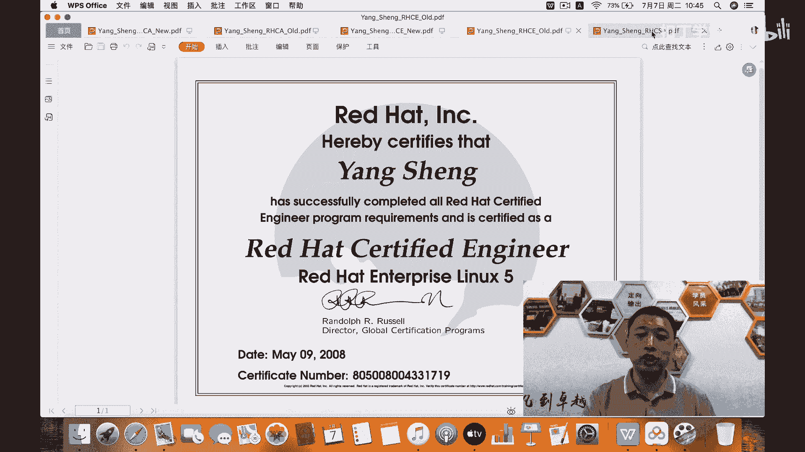
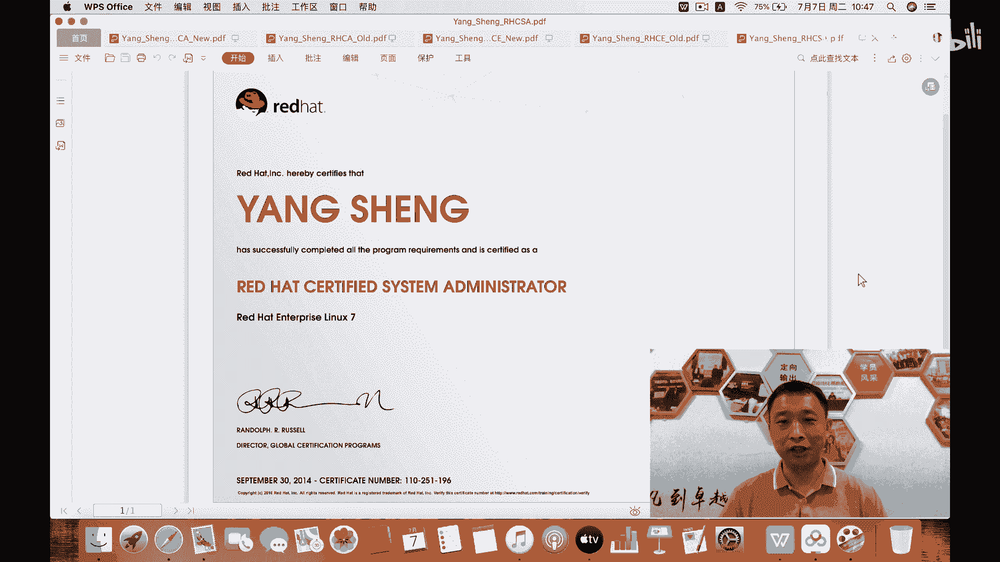
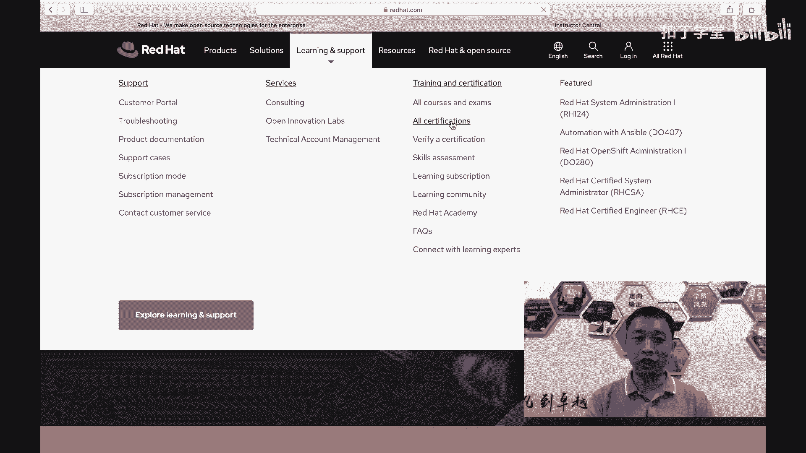
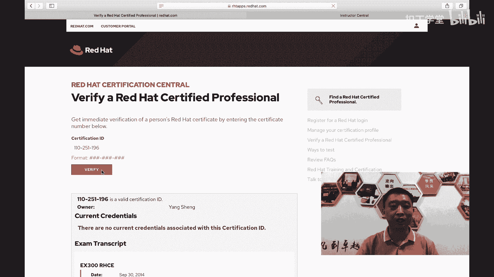
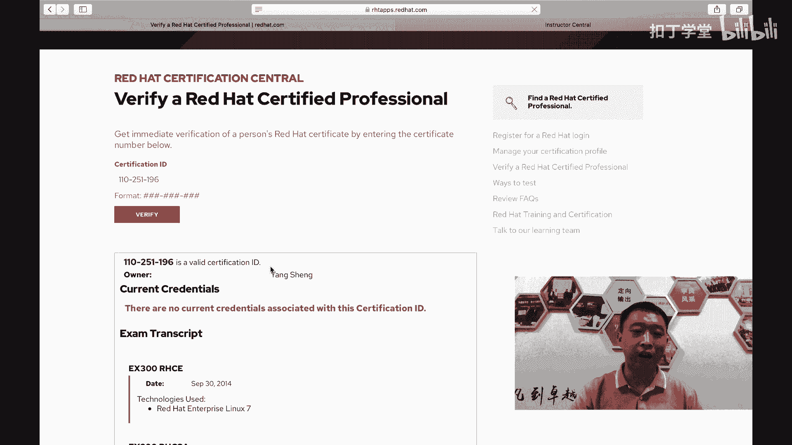
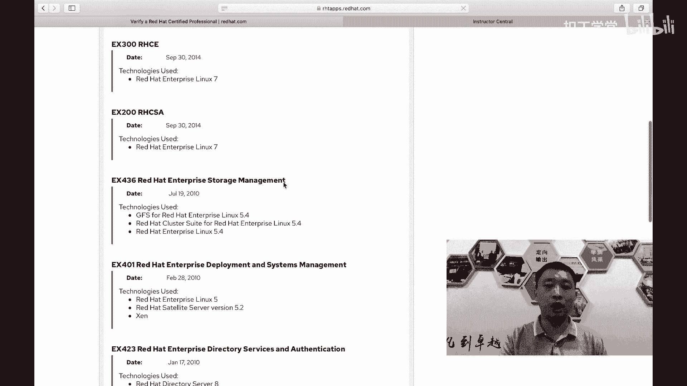
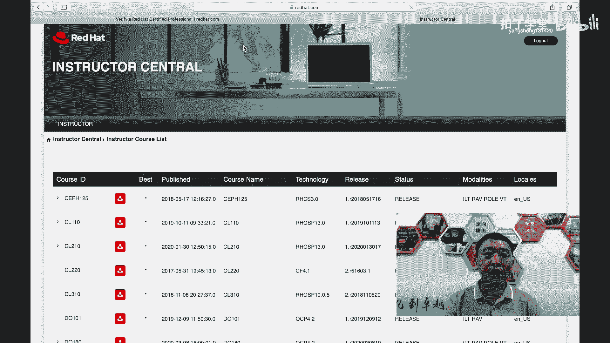

# 红帽认证课程：P1：RHCE8认证介绍 🎓

在本节课中，我们将一起了解红帽RHCE8认证的基本情况、其重要性以及学习路径。课程内容基于杨哥的经验分享，旨在为初学者提供一个清晰的开端。

---

## 课程概述

红帽认证是IT领域内广受认可的专业资质。本课程将介绍RHCE8认证的体系结构、考试形式的变化以及备考策略。RHCE8相比之前的版本有重大更新，特别是引入了Ansible自动化技术，因此系统的学习至关重要。

## 认证体系与级别

红帽认证主要分为三个级别，它们构成了清晰的技术成长路径。

以下是红帽认证的三个主要级别：

*   **RHCSA (红帽认证系统管理员)**：初级认证，是后续认证的基础。
*   **RHCE (红帽认证工程师)**：中级认证，在RHCSA的基础上，重点考察高级管理和自动化技能。
*   **RHCA (红帽认证架构师)**：高级认证，需要掌握多门课程，代表最高技术水平。

## 考试形式与特点

上一节我们介绍了认证的级别，本节中我们来看看红帽认证考试的具体形式。红帽认证考试以实践操作为核心，与传统的笔试有很大不同。

红帽认证考试的特点如下：

*   考试全程为上机操作，分为上午和下午两个部分。
*   考试内容注重实际解决问题的能力。
*   从RHCE7和8开始，RHCSA和RHCE考试可以分开补考，未通过其中一项不影响另一项的成绩。

## 学习资源与建议

了解了考试形式后，有效的学习资源和正确的学习方法是成功的关键。杨哥将开源部分视频、资源和练习环境，帮助大家备考。

对于学习红帽认证，有以下几点建议：

*   跟随系统化的教程和实验步骤进行练习是必要的。
*   证书是进入行业的“敲门砖”和公司所需的资质，但掌握技术本身更为重要。
*   RHCA认证建议在积累一定工作经验后再考虑报考。

## 证书验证与价值

我们介绍了学习建议，接下来确保证书的真实性也同样重要。所有红帽认证都可以在官方网站上进行验证，这保证了证书的公信力。

你可以通过以下步骤验证证书真伪：

1.  访问红帽官方网站 `redhat.com`。
2.  在“学习与支持”栏目下找到“校验证书”功能。
3.  输入证书编号进行查询，系统会显示证书所有者和通过详情。

## 总结与展望

本节课中我们一起学习了红帽RHCE8认证的体系结构、考试特点以及学习路径。核心在于理解认证的价值不仅在于一纸证书，更在于通过实践掌握真正的运维与自动化技能。

从下一节开始，我们将正式进入RHCE8的技术学习，逐步剖析新特性并练习与考试相关的关键技术点。红帽考试的目的不是为难考生，而是确保考生真正掌握能受用一生的实用技能。

---
**核心概念示例**：
*   **认证级别公式**：`RHCSA` -> `RHCE` -> `RHCA`
*   **验证证书**：访问 `https://www.redhat.com/rhtapps/services/certification/verify`