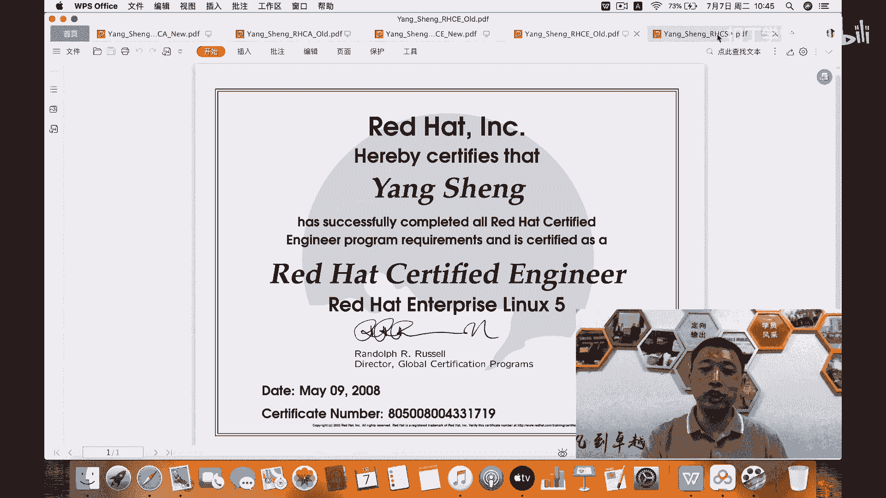

# 红帽认证：杨哥RHCE8-认证介绍 - P1：1. 杨哥RHCE8-认证介绍 - 扣丁学堂 - BV1m54y127yJ

各位亲爱的小伙伴们，大家好，我是杨哥。在4年前，我为大家录制过关于RHCE7的考试考前辅导。呃，从今天开始呢，然后我将会为大家录制关于红帽8的RHHCSA和RHCE的考前辅导。呃。

这个两个版本之间的变化了比较大，特别是很多同学也应该知道呃在RHCE8的考试当中，特别是下午呢整个使用了ibleible的这个自动化的内容，所以变化特别大。因此如果说你没有呃你没有看过杨哥的视频的话。

或者没有跟着杨哥的这个步骤一步一步去练习的话呢，很可能会呃遇到很大的困难。首先特别感谢各位小伙伴们对杨哥的支持。在杨哥的这个视频呢，特别是七的视频。在之前发布以后，然后获得了很多小伙伴们的认可。

也有很多小伙伴们给杨哥发来消息啊，就是通过了通过了这个通过看杨哥的这个视频啊，然后用杨哥的这个步骤去练习啊，用杨哥所提供的这样一个平台呢去练习。然后通过CE这当中包括咱们国内的小伙伴们。

还有包括像台湾的这个小伙伴啊，这个我我印象中有那么几位。嗯，这里呢非常感谢呃感谢这个红贸公司，特别是像啊淮金阳怀老师，然后对我的支持。然后杨哥接触这个红贸时间比较早，应该说是在2005年开始呢。

就正式接触红贸。然后红贸公司给我的这个印象。然后包括对我的职业生涯影响都非常的大。啊，红贸公司呢整个这种开源的理念，在应该说在当前啊在整个的这个IT领域呢是非常的这个受尊崇的。

然后也同时呢感谢所有和杨哥一起呢来和这个为大家提供红贸产品红贸培训的这一些啊这样一些这样一些这个友商。这样一些小伙伴们，我们一起呢来为共同的为红贸这样一个产品，为红贸的这个产品呢共同去努力。

然后培养更多的这种有用的人才。大家也知道红贸的这个证书啊，可以说在整个在企业当中，特别是。在IT企业当中认可度非常高，含金量非常高。所以呢呃我身边的很多同学都这个来考这个认证啊，特别是他这个证书。

大家也知道分为三个级别初级中级，还有高级初级呢是RHCSA中级呢是HHCE高级呢是这个HHCA啊，这个这三个证书呢，这个肯定是会随着你的技术的增长不断的这个增长。然后你也才能够去考相应的认证。

特别是这个高级认证HHC架构师这一块呢，呃杨哥是在2010年通过的这个认证。当时呢是获得了这个呃应该说是在侥幸啊排名是在中国对咱们国内的29位。

啊后所以这里呢特别感谢所有对我帮助和支持的这样这样一些老师朋友。啊后杨哥在这里呢给大家说一声啊，谢谢嗯，应该说这个红贸的认证这一块。话它的考试确实是相当有难度的，因为它不同于其他类型的考试。

整个考试过程当中全部都是上机操作，分为上午和下午。呃，我记得在我最早考红贸红贸的这个证书的时候啊，当时还不叫CSA啊，叫红贸的这个RHCT红贸认证的这个技术员，这个证书当时我记得在考的时候啊。

首先要进行排错。如果上午的这个排错前四道题没有在指定的时间，我记得应该是一小时，如果没有通过的话呢，后面你的整个考试全部终结。啊，现在稍微理想一些，现在在这个从红贸八7和8开始呢，如果说CSA没过啊。

你过了CE也没关系，你哪一个没过呢，去补考哪一个就可以。嗯，大家这里可能看到了啊，杨哥在桌面上这个放了很多证书，这个这里呢呃一共放了5个证书。有有同学会说怎么这么多啊，呃。

首先这里呢有个RHCA有一个new，有一个old，我们来先看这个new的这个证数啊，我应该是打开过，我们看一看。嗯，杨哥的这个本名呢叫杨生啊，这个是很多很多这个同事啊问我说我是不是广广州人南方人啊，对。

杨哥是南方人，但是不是不是这个广州或者说那边的啊，我是四川人。呃，大家听一下我这个嗯普通话是不是还可以啊，除了在什么牛奶这样的一些字善，我可能会会会调调的沟里面啊，其他的时候都不会。呃。

我现在呢杨哥目前就职于千锋教育，主要负责在咱们千锋教育呢，主要负责的是关于云计算，也就是lininux运维云计算架构这一块，还有呢就是python人工智能以及网络安全这三个学科啊。

我现在主要负责这三个学科的整个整个管理，还有了课程的研发啊，以及这样一些工作啊，整个带领这个团队呢来培养更多的关于云计算运维以及网络安全，还有呢这个人工智能方面的一些。人才嗯。

杨哥的本名呢刚才说了叫杨生哈，这个生士生活的生，这上面可能看不出来。然后呢，我的这个艺名叫天云啊，这里呢呃也不知道叫不叫艺名啊，呃以很多在网上的同学，包括我B站的一些这个呃粉丝呢。

他们都都叫我叫天云天天云老师，呃，这个呢是我我在很早很早呃，以前使用的一个名字。你要问我为什么叫天云，我也不太清楚啊，反正一直就叫这个名字，叫了好长一段时间，我不是好长一段时间好多年啊。

这就像杨哥的手机号一样，我那天看了一下，我的手机号用了是17年啊，快快17年，呃，我一直讲，我说嗯杨哥是一个长情的人，以呢我也一直在开源的这个领域，这个道路上。

一直在在追随追寻追随这个开源的这样一个脚步。呃后在此呢在此感谢鸿猫公司，感谢。感谢你这个红贸公司的伙伴啊，特别是淮静阳啊，淮淮老师，然后给我提供的支持。呃，大家可能现在看到这个证书啊是新版的证书。

然后这个界面比较简洁啊，大家可能看到下面呢是在呃下面有一个编号啊，有一个证书编号，110251196。这边大家看到了这边在最下面哈呃我们再看一下这个旧版的啊，旧版证书。

其实我对这个旧版证书呢是情有独钟的。就像大家大家大家对很多很多人呢，虽然说可能已经这个结婚了啊，已经有小孩了。嗯，然后然后呢可能也也不是你的人生中，人生当中啊，可能也不只是一个女朋友，一个对象。但是呢。

啊，怎么说呢？就是初恋的这种感觉，第一个对象的感觉是始终难以忘怀的。啊，所以呢我可能没有那么复杂，但是呢我也会有这样的感触。我不知道在座的各位小伙伴们是不是有这样的一个一个一个认知啊。

这个所以我对这个证书情有独钟。虽然说证书编号，我从通过到现在我都没记住啊，大家看到这个是在10年的时候考的这个证书哈，这个是我的全名鸿贸认证的架构师，然后证书编号呢什么80级几几记不住啊。

但是呢我刚刚讲过RHCA也不是我们上来就立马要去考的。第一个是呢他的技术呢，他考他是考五门课，然后我们的RHCE和RHCE呢是考考一门啊，考一门就是一次考试，一天考试，而RHCA呢是学五门技术。

涵盖了5个方向啊，这个当然也在不断的变化。洪帽这边也在。不断的去变化这五门课程的内容啊。嗯，我们建议我们的同学首先进入这个行业，进入lininux，进入运维，进入云计算。那么你应该有一个证书。

而这个证书呢一方面会作为你进入其进入这个行业的敲门砖。另一方面呢也会呢作为这个公司的一个叫什么可能投标之类的，会需要的一个资质，所以证书对我们来讲，嗯，我不会去考那么多证书。

虽然说我在很早很早以前呢考过什么orac的证书，考过这个微软的证书，也考过思科的，也考过考过华为的，也考过这个阿里云的等等等等。就我的证书呢，很多，那这里呢我印象比较深的。

或者我最喜爱的还是红帽这个证书。因为在整个考试过程当中，他确实赋予到很多挑战。那杨哥在考的时候也不是所有课程一次性通过也经历过这个很曲折的过程。正是如此呢，我才觉得红。

贸证书给我赋予的这样一个技术价值是真的是很不错的。所以再次推荐各位去了解，或者说通过我杨哥提供的这样一个视频啊去了解这个咱们红贸证书。那么杨哥会将啊部分视频和资源以及这个练习环境开源。

然后再次来感谢红贸公司，感谢呢这个呃感谢我们所有的这个伙伴啊，然后也为呃在座的各位呢提供或者看到这个视频的同学呢提供这样一个便利。好，再次先做一个广告。杨哥现在是在千锋教育，然后负责刚才说哪几个学科啊。

如果说你是在B站看杨哥的视频的话呢，请将这个刚才杨哥所负责的学科呢，打在这个弹幕上啊，通过弹幕的方式打在屏幕上。嗯，对，杨哥是主要是负责的是在千锋，现在是负责一个视云计算。啊，我们以前叫运维。然后呢。

紧接着呢是pyython人工智能。当然现在主要是做。呃，人工智能这块落地点主要是数据分析和人工智能这一块。第三个是网络安全，主要是关于渗透这一块啊。那今天凡是看到这个视频啊。

然后拿到这个视频来报名的这个同学呢啊不管呃不管当前我们对外的价格是多少钱，那么你都能够按照。然后只要提到杨哥或者杨生或天云，你都能够按照我们内部学员的价格来进行来进行一个111个一个这样一个学习啊。

所以。呃，是这样一个情况。然后这是CE啊啊CE的这个这个啊这是这都是旧版啊啊，这个是新版啊对，这个新版，这个是旧版CE的。啊后另外一个呢是CSA叫火贸认证的系统管理员。

就相当于我们现在所讲到的其实应该说是我们平常所说的RHCE实际上呢它是包含两个的，一个是RHCE一个是RHCSA也就是初级和中级呢，这两个都是都有的啊初级火贸认证的系统管理员。

一个是中级火贸认证的engine工程师啊，这两个证书。他会在同一天来考，也就是上午和下午来考这两个证书啊，RHCA呢，我一般建议大家等到工作以后，当你的经验，当你的经验啊。

当你的这个经验能够支撑你的这样一个才华的时候，支撑你的野心的时候呢，你去考更多的时候呢，我们考CA啊，考那个CA也就是架构师，更多的时候。

是什么呢？是公司给报销。我记得当时我在学习的时候，在学习这个RHCA的时候呢，我是自费的，我花了45000块钱啊，现在已经啊已经降了很多。所以红贸公司呢也也也也判了一个大家的压力很大。

所以在中国区包括呢这个全全世界应该降了很多，现在没有这个费用。呃，我记得我在考的时候呢，有一位伙伴呢是央视的啊，然后有一位伙伴呢当时是惠普的，那最后呢是去到阿里云，然后嗯他是当时是惠普公司报销的。

人人家是报销，但是呢这里呢大家也要知道一件事情啊，就是我们以后在座的各位伙伴，如果说你还没有进入到IT企业。然后呢这个。你将来会进入到ID企业。那进入公司以后呢，每个公司每年会做一些培训。

而这些培训呢更多的是可以说是给你报销的。但是要记住的是，一旦你拿到这个报销的费用，相当于你要给公司签一个卖身契，短则一年多则可能2到3年啊，这个大家做好准备OK。

嗯，说到这个这说到杨哥这里呢，我再说一个小的点啊，就是。呃，大家以后这个考证通过以后呢，可以在鸿贸的官方网站readta点com这个网站来查询自己证书的有效性。就说你要跟别人说啊。

我有CA或者说别人跟你说，他有CA这个这个证书的这个样子是可以P的，那到底是到底是不是可以这个是你的呢，或者是他的呢，我们可以在官方网站这边有一个学习和支持这个位置，下面有一个校验证书啊。

sorry这个地方校验证书这个位置。

呃，校验证书这个位置呢，然后你可以输入证数编号。那比方说刚才有同学有看到或者记得我证数编号吗？如果记得呢啊大家将这个证书编号打在屏幕上。有有记得吗？好，有同学已经可能嗯打打上来了啊，那我这边。敲一下。

呃，这边这哪个证书是杨哥的，10251194还是254？好，我们假如说来来选这个194这个啊。校验一下。很显然，这个证书是一个无效的证书ID因此呢这个东西是不能胡编乱造的。好。

杨哥证书的编号呢行不改名做不改姓，应该这个证书编号就会跟着我一辈子呢啊，虽然说这个嗯这个跟身份证号还不一样，但是呢我对这个证书的编号还是比较记得比较清楚的。好，这边大家看到owner所有者是杨生。

然后这边是我通过的考试在什么时间通过的哪一门考试。这其中呢包含CE的，也包含CE的升级，也包含CA的一些考试。这边那就比方说最早的。

好，抱歉啊，最早的这个RHCE考试考的是红猫五。其实我接触红猫比较早。我刚刚讲过是在2005年那个时候呢我要考的话，其实可以考4。但是我基本上也第一我不知道去哪儿报名。第二呢，我就算知道去哪儿报名。

我也不知道怎么考。因为考试的难度太高了啊，所以这个嗯没有没有考考的是5，在08年考的是5好，那另外呢杨哥也是鸿贸认证的这个RCI也就是鸿帽认证的呃这个讲师啊这个位置。

所以我也可以从红贸的这个官方讲师专有账号上拿到这个相应的一些资源啊，这在此呢感谢鸿猫公司。好，说到最后的是证书是我们的一个敲门专啊，敲门专。那大家要记住的就是呢证书，他和技术呢，还是有一定的距离。

所以杨哥现在做的是技术技能培训啊，证书，只不过是我们整个。

は？整个这个培训当中的一个环节，或者说是我们锦上添花的一个环节啊，也会让大家的这个路啊走的顺畅一些，少走些弯路。好，这就是说在前面的，所以再次感谢各位小伙伴们。那么从下一节开始呢。

杨哥将会正式带领大家来一步一步的学习啊，我们RHCE8的。它的一些变化新特性的一些变化啊，另外呢就是我们带大家去了解呢就是CE8里面的一些跟考试相关的一些技术点。然后我们去练习。这样的话呢。

在考试的时候，只要你找你练习好了考试的时候就能够顺利通过啊。再次呢我要重申一下，或者要说一下红贸公司不是为了去拦考试的方式，不是为了去为难大家。虽然说有好几个小时，更重要的是什么呢？

国贸公司也希望啊大家能够通过去学习实践操作这些技术，真正掌握这些技术。因为掌握这些技术才是关键。通过掌握这些技术呢，最终把它变成你自己的技能。你的这个你的这个吃饭的东西啊，吃饭的这样一个一个技能。

能够让你受用一受用一辈子。好，这就是杨哥说在前面的内容。那么从下一节开始呢，我们将正式开始学习。好，再次感谢各位小伙伴们。

