# Linux网络管理：P1：从net-tools到iproute2的现代化工具演进 🚀

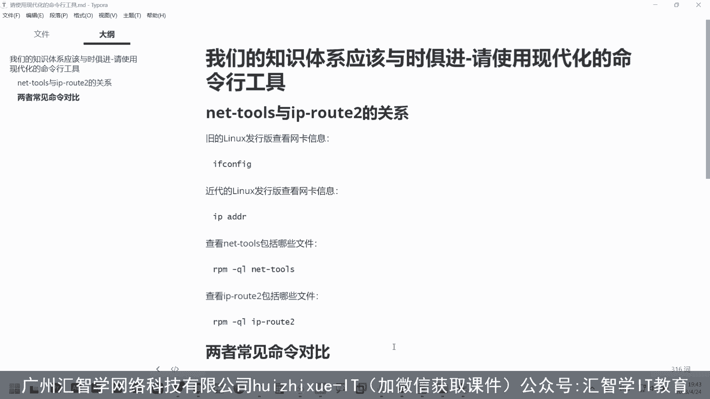

在本节课中，我们将要学习Linux系统中网络管理工具的演进。我们将通过对比传统的`net-tools`套件和现代的`iproute2`套件，来理解为什么新系统默认使用新工具，以及如何在新系统中使用旧命令。这有助于我们掌握最主流、最高效的Linux网络管理方法。

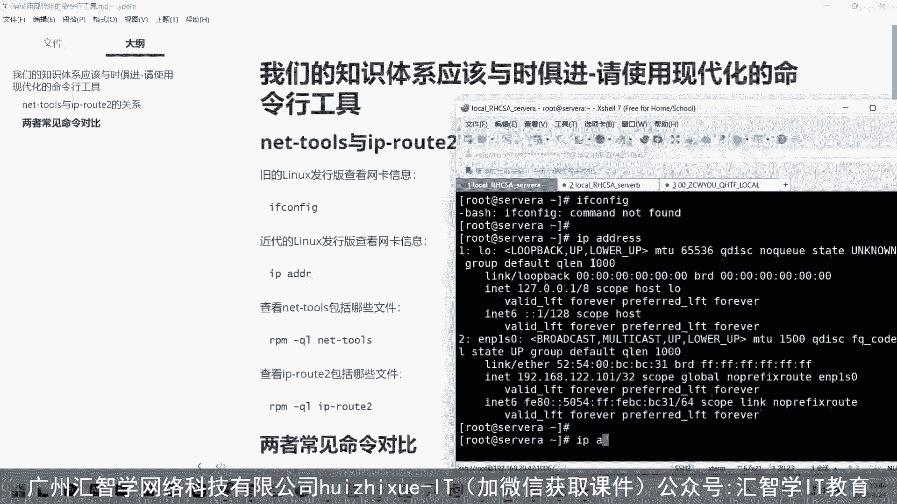

## 新旧工具包的背景与安装

上一节我们介绍了课程的主题，本节中我们来看看具体工具包的背景。

在现代化的Linux发行版中，一些旧的网络管理命令默认不再安装。例如，`ifconfig`命令用于查看网卡信息，但在新系统中可能无法直接使用。

这是因为`ifconfig`命令属于一个名为`net-tools`的旧工具包，该工具包已被逐渐淘汰。新的发行版转而使用`iproute2`工具包中的命令，例如`ip address`（可简写为`ip a`）来查看网卡、MAC地址、IP地址和子网掩码等信息。

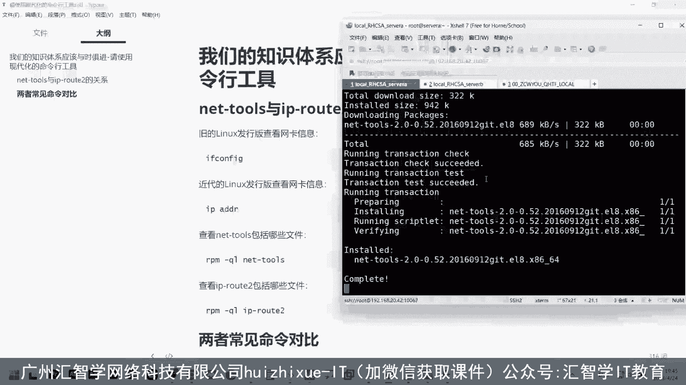

如果你需要在新系统上使用`ifconfig`命令，可以通过包管理器安装`net-tools`软件包。

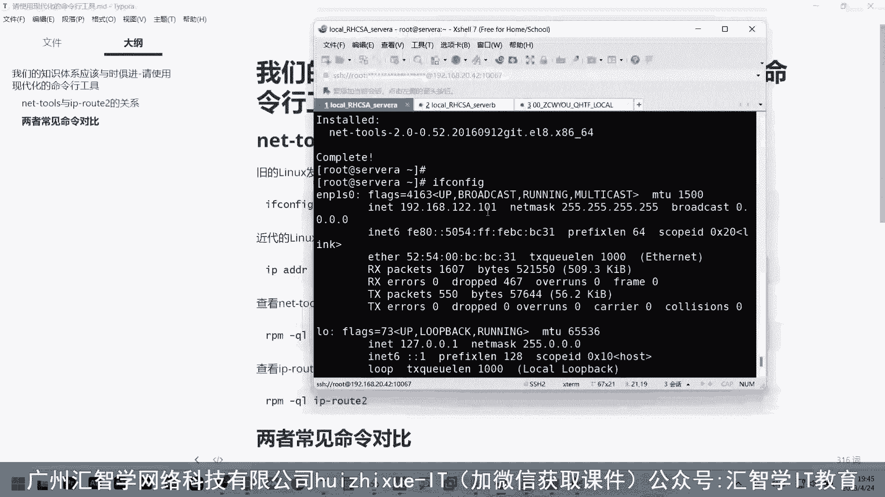

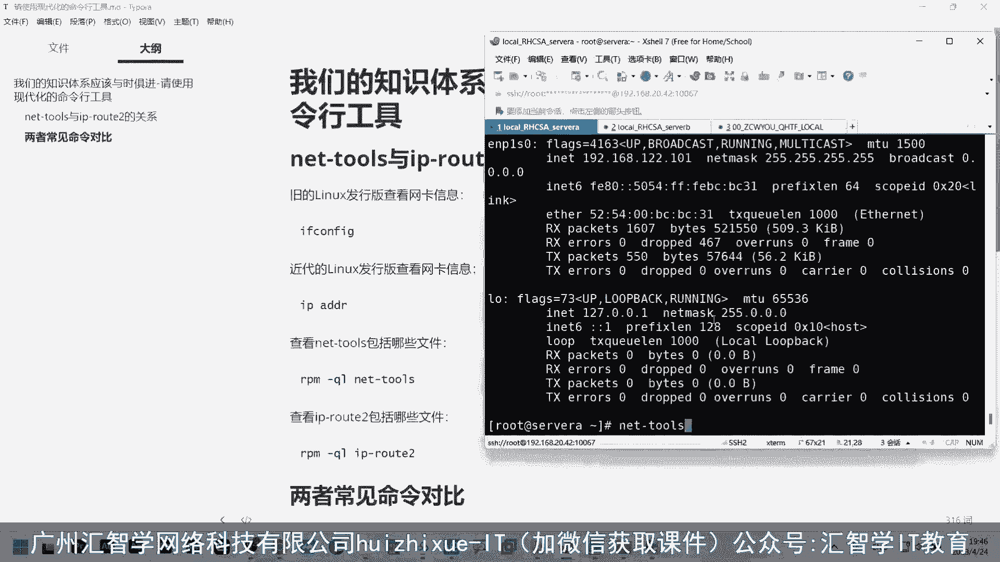


以下是安装`net-tools`的步骤：
1.  使用`yum`包管理器查询`ifconfig`命令所属的软件包。
    ```bash
    yum provides ifconfig
    ```
2.  根据查询结果，安装`net-tools`软件包。
    ```bash
    yum install net-tools
    ```
安装完成后，即可使用`ifconfig`命令。


## 工具包内容对比

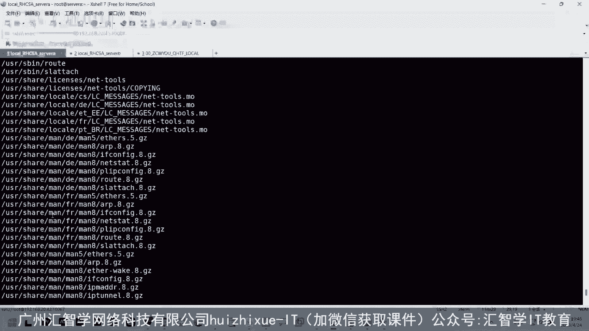

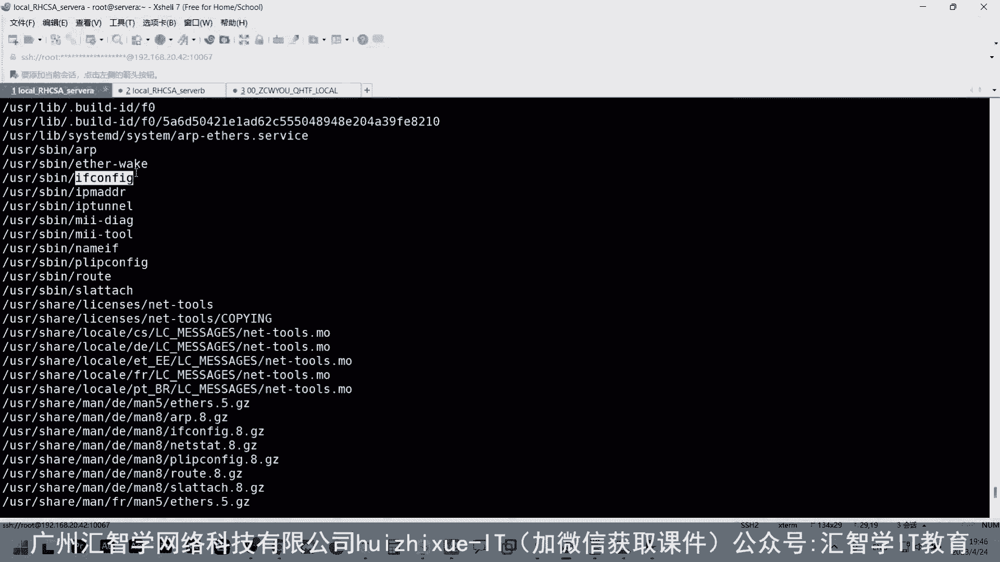

上一节我们学会了如何安装旧工具，本节中我们来看看新旧两个工具包具体包含哪些内容。

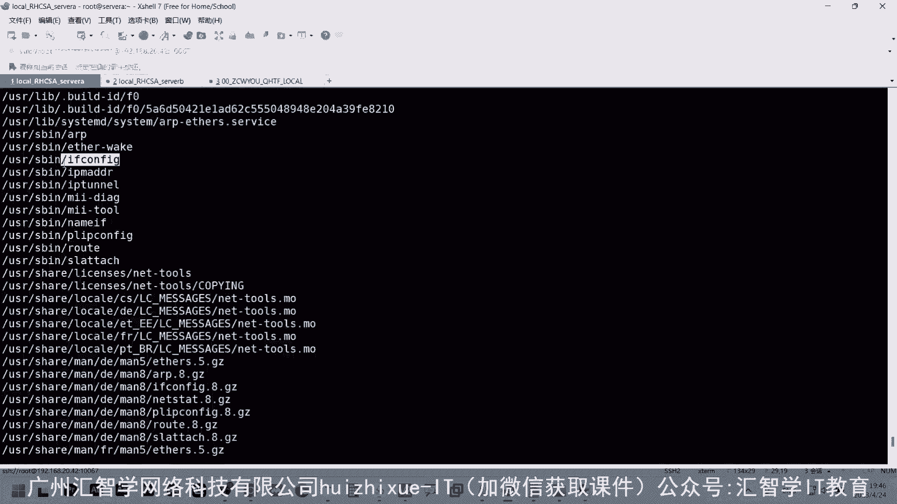


我们可以使用`rpm`命令查看软件包安装的文件列表。


查看`net-tools`包包含的命令文件：
```bash
rpm -ql net-tools
```
这个列表会包含`ifconfig`等传统网络工具。

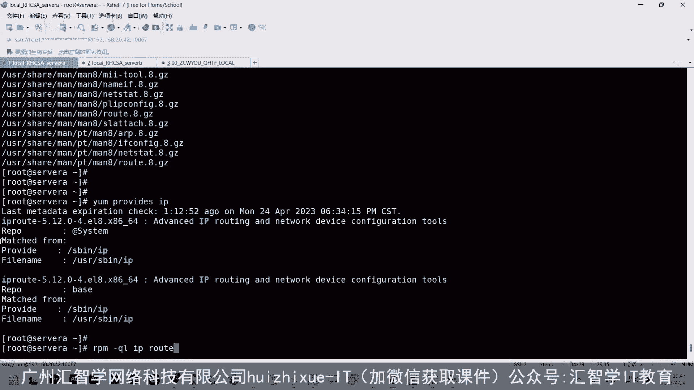


查看`iproute2`包包含的命令文件：
```bash
rpm -ql iproute2
```
这个列表会包含`ip`等现代网络管理命令。

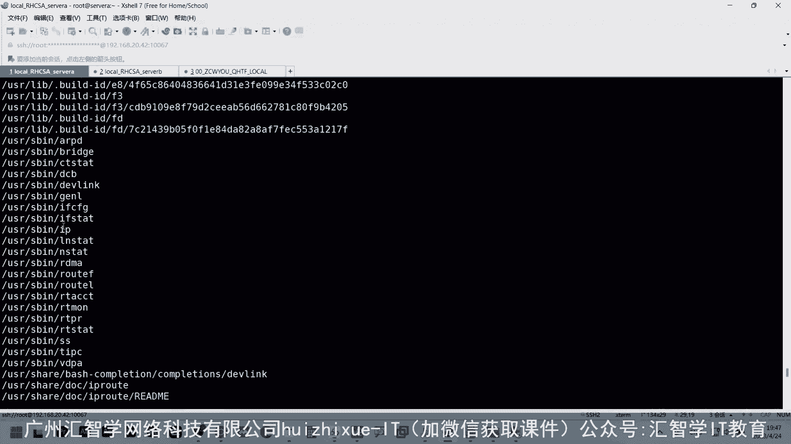


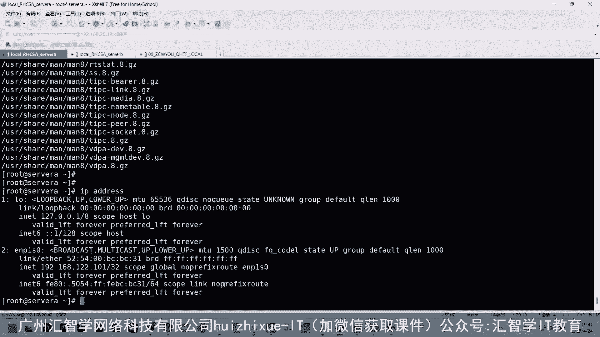

## 核心命令功能对比

上一节我们查看了工具包的内容，本节中我们来具体对比核心命令的功能差异。

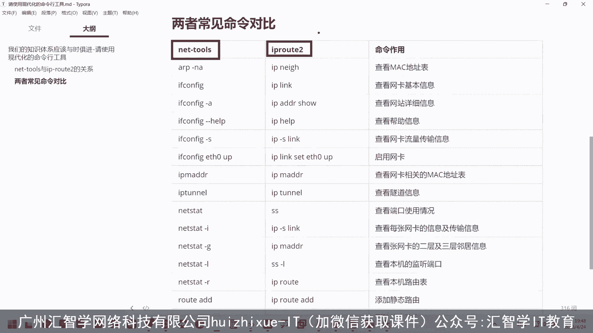

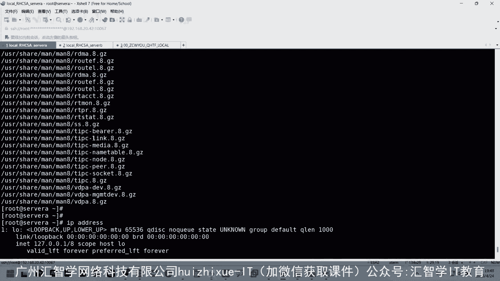

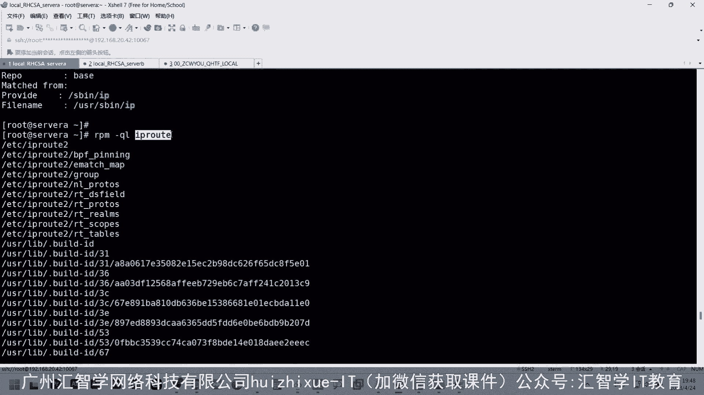

`net-tools`（旧）和`iproute2`（新）中的命令存在对应关系，但新命令通常功能更强大、信息更详细。

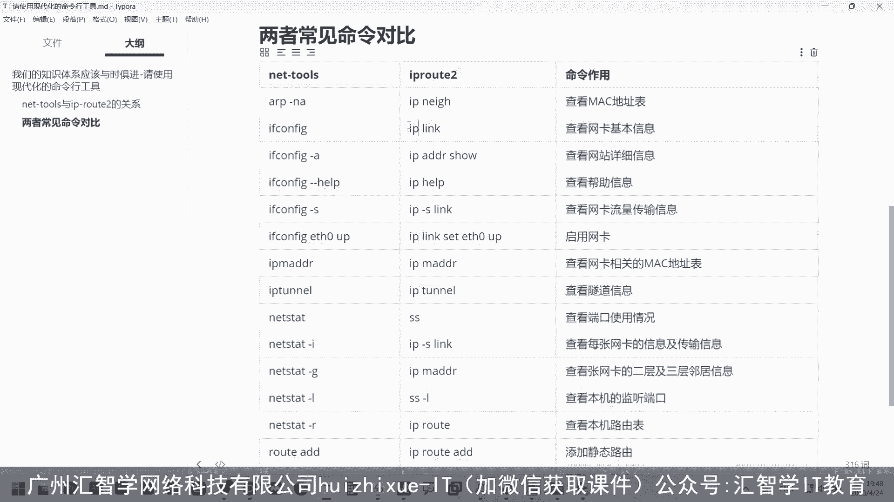

以下是部分命令的功能对比：
*   **查看网络接口**：
    *   旧命令：`ifconfig`
    *   新命令：`ip address show` 或 `ip a`
    *   说明：`ifconfig`显示的信息相对简化，而`ip address`显示的信息更为全面和详细，因此更推荐使用`ip address`。
*   **管理网络接口**：
    *   旧命令：`ifup` / `ifdown`
    *   新命令：`ip link set <interface> up/down`
*   **查看路由表**：
    *   旧命令：`route -n`
    *   新命令：`ip route show` 或 `ip r`
*   **管理ARP缓存**：
    *   旧命令：`arp -a`
    *   新命令：`ip neigh show`


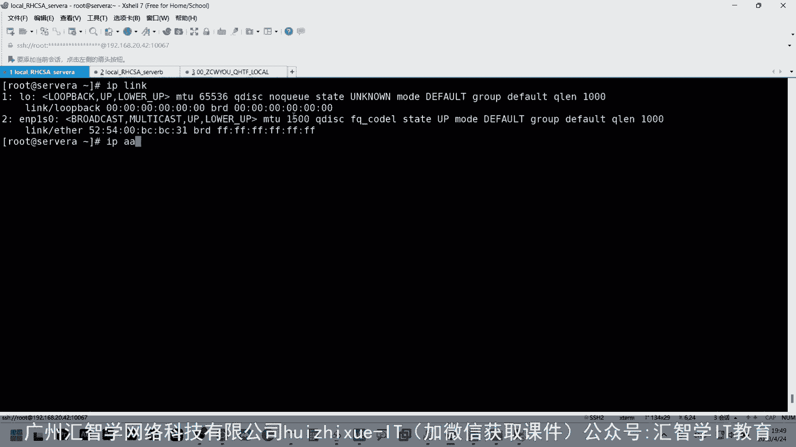

## 总结与最佳实践建议

本节课中我们一起学习了Linux网络管理工具的演进。

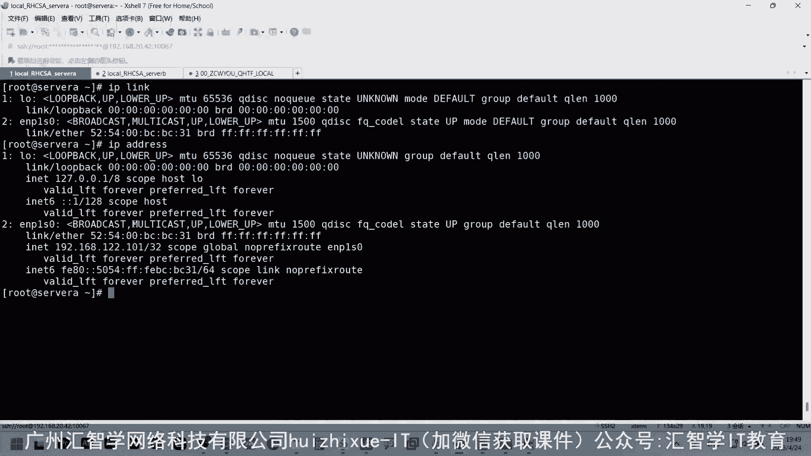

我们了解到，传统的`net-tools`工具包（包含`ifconfig`、`route`等命令）在现代化的Linux发行版中已被`iproute2`工具包（核心命令为`ip`）所取代。`iproute2`提供了更统一、功能更强大的命令语法，是当前管理Linux网络的主流和高效方式。

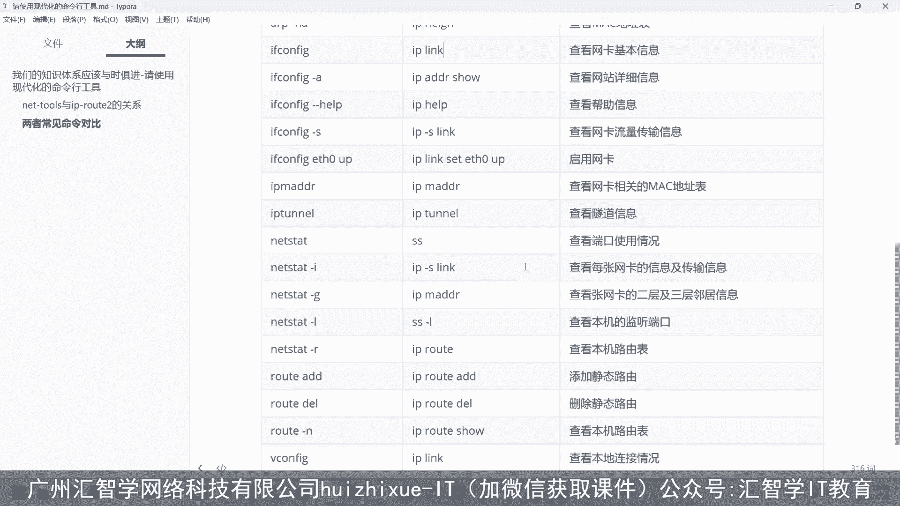

因此，在学习和管理Linux系统时，建议优先学习和使用`iproute2`套件中的命令，以适应最新的技术标准和发展趋势。本课程也将始终以讲解最主流、最高效的工具和方法为目标。